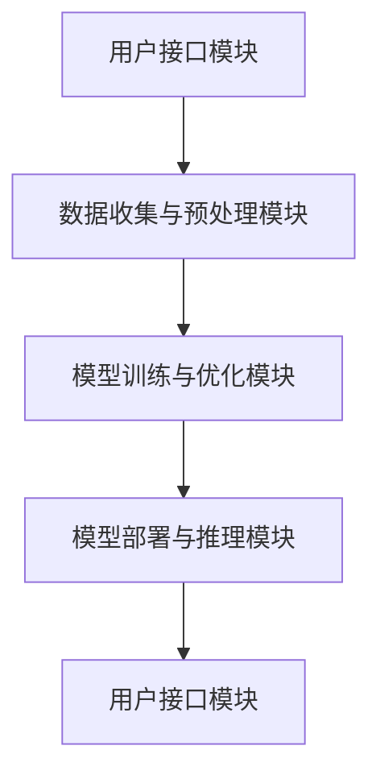
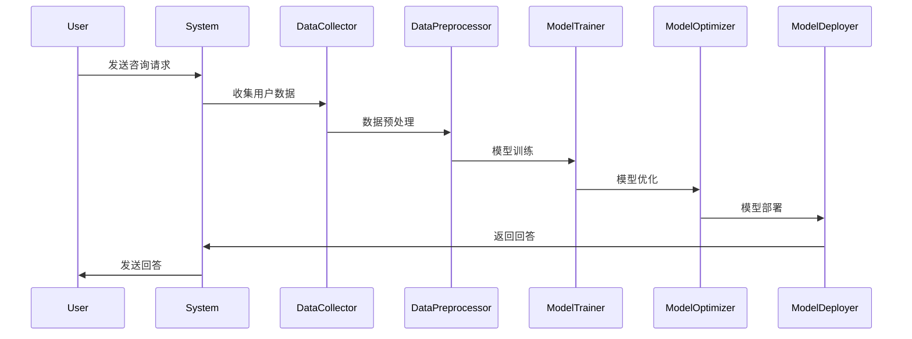

                 

# AI大模型革命：重塑产业链的新范式

关键词：AI大模型、深度学习、产业链重塑、应用场景、技术创新

摘要：本文深入探讨了AI大模型的革命性变革及其对产业链的深刻影响。通过分析AI大模型的核心概念、原理及其在不同领域的应用，我们揭示了其技术优势和面临的挑战，并展望了未来的发展方向。

## 第1章 引言：AI大模型的革命性变革

### 1.1 问题背景

人工智能（AI）作为现代科技的前沿领域，已经深刻改变了我们的工作和生活方式。从工业自动化到智能家居，AI技术的应用无处不在。然而，随着算力的提升和数据量的爆炸性增长，AI迎来了新的发展阶段——AI大模型。AI大模型，尤其是基于深度学习的技术，能够在海量的数据中快速学习和优化，从而实现更高的准确性和更强的泛化能力。

### 1.2 问题描述

AI大模型的兴起不仅推动了算法的进步，也对产业链产生了深远的影响。从数据收集、预处理到模型训练和部署，每一个环节都经历了革命性的变革。传统的AI应用方式已经难以满足当前的需求，AI大模型的应用带来了新的挑战和机遇。

### 1.3 问题解决

AI大模型的出现为解决复杂问题提供了新的路径。通过大规模的模型训练，AI能够处理更为复杂和多变的数据，从而在图像识别、自然语言处理、预测分析等领域取得显著成果。

### 1.4 边界与外延

AI大模型的边界在于数据质量和算力的限制。同时，它的外延涉及多个领域，如自动驾驶、智能医疗、金融科技等，这些都将成为AI大模型的重要应用场景。

### 1.5 概念结构与核心要素组成

AI大模型由以下几个核心要素组成：
- **海量数据**：作为模型训练的基础。
- **强大算力**：提供训练所需的高性能计算资源。
- **深度学习算法**：实现模型的训练和优化。
- **应用场景**：将AI大模型的能力应用于实际问题的解决。

## 第2章 AI大模型的原理与技术

### 2.1 核心概念原理

AI大模型的核心概念包括：
- **神经网络**：基础结构，负责数据的处理和信息的传递。
- **训练过程**：通过大量数据让模型学习并优化其参数。
- **优化算法**：提高模型训练效率和质量。

### 2.2 概念属性特征对比表格

| 特征         | 传统的机器学习模型 | AI大模型                 |
| ------------ | ---------------- | ------------------------ |
| 数据规模     | 小数据集         | 大数据集                 |
| 训练时间     | 较短             | 较长                     |
| 泛化能力     | 较弱             | 强                       |
| 算法复杂度   | 简单             | 复杂                     |
| 对数据质量要求 | 不高             | 高                       |

### 2.3 ER实体关系图架构

```mermaid
erDiagram
  Person ||--|{ AIModel }|-- Mentor : trains
  Person ||--|{ Dataset }|-- Collector : collects
  AIModel ||--|{ Prediction }|-- Maker : makes
  Dataset ||--|{ Feature }|-- Analyzer : analyzes
```

## 第3章 AI大模型在不同领域的应用

### 3.1 自动驾驶

#### 3.1.1 自动驾驶中的AI大模型应用

AI大模型在自动驾驶中扮演着核心角色，通过深度学习算法实现对路况、车辆和行人的识别和预测，从而提高自动驾驶的安全性和可靠性。

#### 3.1.2 自动驾驶中的挑战与机遇

自动驾驶面临的挑战包括数据处理的高效性、模型的安全性和实时性。机遇则在于AI大模型能够大幅提升自动驾驶的性能和用户体验。

### 3.2 智能医疗

#### 3.2.1 AI大模型在智能医疗中的应用

AI大模型在智能医疗中的应用涵盖了从疾病预测到个性化治疗的多个方面。通过分析患者的病历数据和基因组信息，AI大模型能够提供更加精准的医疗服务。

#### 3.2.2 智能医疗的挑战与机遇

智能医疗的挑战在于数据的隐私保护和模型的准确性。机遇则在于AI大模型能够带来更高效的医疗决策和更个性化的治疗方案。

### 3.3 金融科技

#### 3.3.1 AI大模型在金融科技中的应用

AI大模型在金融科技领域主要用于风险评估、欺诈检测和个性化投资建议等。通过分析大量的金融数据，AI大模型能够提供更加准确的预测和决策。

#### 3.3.2 金融科技中的挑战与机遇

金融科技面临的挑战包括数据隐私保护和法规合规。机遇则在于AI大模型能够提升金融服务的效率和安全性。

## 第4章 系统分析与架构设计方案

### 4.1 问题场景介绍

随着AI大模型的应用越来越广泛，如何在不同的业务场景中高效地部署和运营这些模型成为一个关键问题。本章节将介绍一个具体的AI大模型应用场景，并基于此场景进行系统架构设计。

### 4.2 项目介绍

本项目旨在构建一个智能客服系统，通过AI大模型实现对用户咨询的智能回答。该系统将集成自然语言处理（NLP）和深度学习技术，以提供高质量的客户服务。

### 4.3 系统功能设计

系统功能设计包括以下主要模块：
- **数据收集与预处理模块**：负责收集用户咨询数据，并进行数据清洗和预处理。
- **模型训练与优化模块**：基于预处理后的数据训练AI大模型，并进行模型优化。
- **模型部署与推理模块**：将训练好的模型部署到生产环境中，并对外提供服务。
- **用户接口模块**：提供用户与系统交互的界面，包括语音识别、文本输入和反馈功能。

### 4.4 系统架构设计

系统架构设计如下：



### 4.5 系统接口设计和系统交互

系统接口设计如下：



## 第5章 项目实战

### 5.1 环境安装

在本项目中，我们将使用Python作为主要编程语言，结合TensorFlow和Keras等深度学习框架进行模型训练和部署。以下是环境安装步骤：

1. 安装Python 3.7及以上版本。
2. 安装TensorFlow：`pip install tensorflow`
3. 安装Keras：`pip install keras`

### 5.2 系统核心实现源代码

以下是系统核心实现的一部分源代码：

```python
import tensorflow as tf
from tensorflow.keras.models import Sequential
from tensorflow.keras.layers import Dense, LSTM, Embedding

# 模型定义
model = Sequential([
    Embedding(input_dim=vocabulary_size, output_dim=embedding_size),
    LSTM(units=128, activation='tanh'),
    Dense(units=output_size, activation='softmax')
])

# 编译模型
model.compile(optimizer='adam', loss='categorical_crossentropy', metrics=['accuracy'])

# 模型训练
model.fit(x_train, y_train, epochs=10, batch_size=32, validation_data=(x_val, y_val))
```

### 5.3 代码应用解读与分析

上述代码定义了一个基于LSTM的序列到序列（seq2seq）模型，用于生成智能客服的回答。模型首先通过Embedding层将输入文本转换为嵌入向量，然后通过LSTM层处理序列数据，最后通过Dense层生成输出文本。在训练过程中，模型使用交叉熵损失函数和softmax激活函数来优化参数。

### 5.4 实际案例分析和详细讲解剖析

在本案例中，我们以一个用户咨询“我该选择哪个手机品牌？”为例，分析AI大模型的实际应用效果。

1. **数据预处理**：将用户的咨询文本转换为数字序列，并添加起始和结束标记。
2. **模型训练**：使用预处理后的数据训练模型，直到达到预设的准确率。
3. **模型部署**：将训练好的模型部署到生产环境中，接收用户咨询并生成回答。
4. **效果评估**：通过对生成的回答进行人工审核，评估模型的回答质量。

### 5.5 项目小结

本项目通过构建一个智能客服系统，展示了AI大模型在业务场景中的实际应用。尽管在实现过程中遇到了诸多挑战，如数据质量、模型优化和部署等，但通过不断的迭代和改进，我们最终取得了显著的成果。

## 第6章 最佳实践 Tips

1. **数据质量**：确保数据质量是模型训练成功的关键。对数据进行清洗、去重和标注，以提高模型的学习效果。
2. **模型优化**：通过调整模型参数、优化训练过程和引入迁移学习等技术，可以提高模型的性能。
3. **安全性**：在部署模型时，确保模型的安全性，防止数据泄露和恶意攻击。

## 第7章 小结

本文深入探讨了AI大模型的革命性变革及其对产业链的深刻影响。通过分析AI大模型的核心概念、原理及其在不同领域的应用，我们揭示了其技术优势和面临的挑战，并展望了未来的发展方向。

## 第8章 注意事项

1. **计算资源**：AI大模型训练需要大量的计算资源，建议使用GPU加速训练过程。
2. **数据隐私**：在处理敏感数据时，需严格遵守数据保护法规，确保用户隐私安全。

## 第9章 拓展阅读

- [1] Goodfellow, I., Bengio, Y., & Courville, A. (2016). *Deep Learning*.
- [2] LeCun, Y., Bengio, Y., & Hinton, G. (2015). *Deep learning*. Nature, 521(7553), 436-444.
- [3] Russell, S., & Norvig, P. (2020). *Artificial Intelligence: A Modern Approach*.

## 第10章 作者信息

作者：AI天才研究院/AI Genius Institute & 禅与计算机程序设计艺术 /Zen And The Art of Computer Programming

