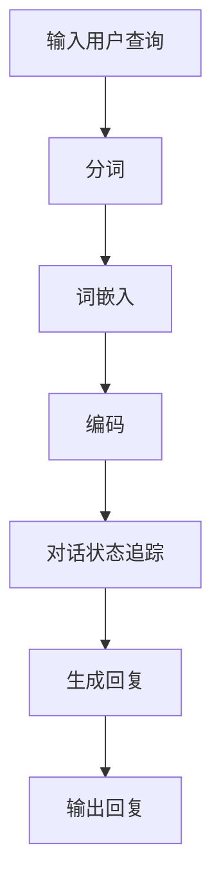
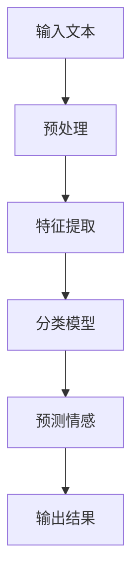
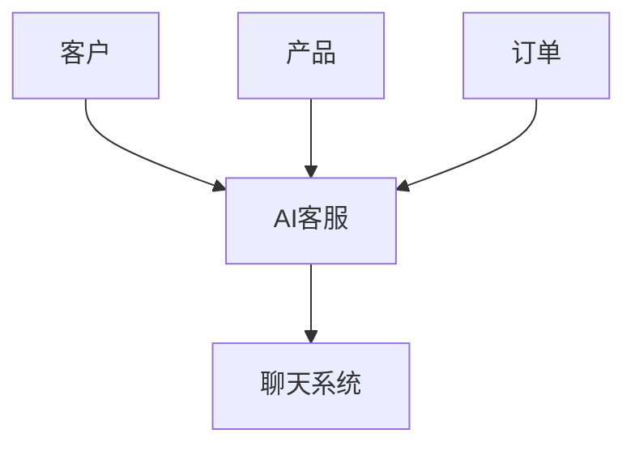
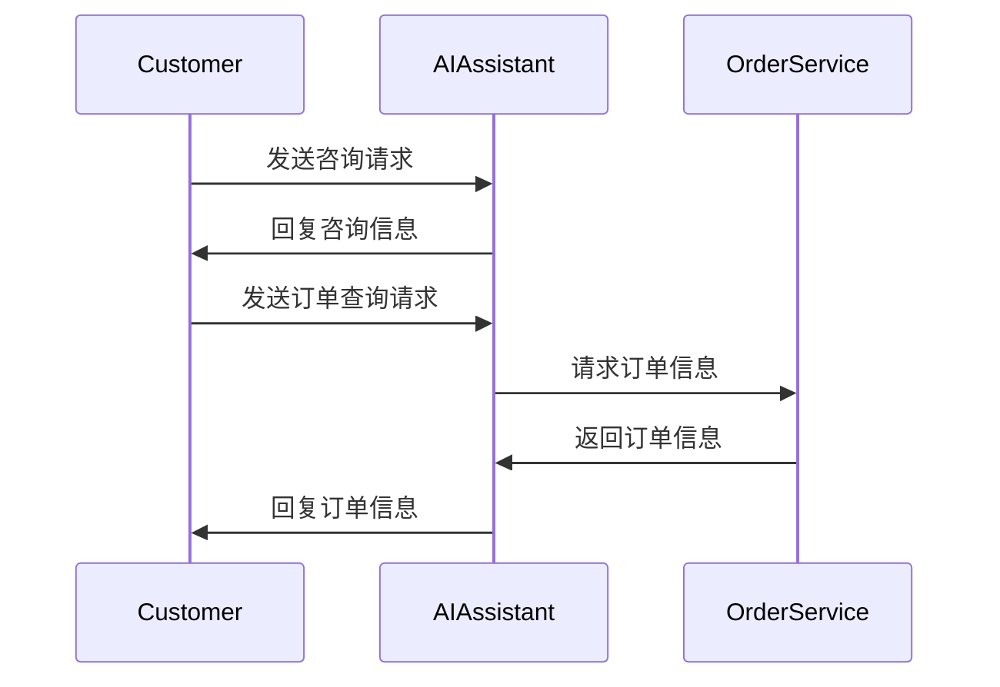

                 

### AI客服：提升用户体验与降低成本的双赢策略

#### 关键词：
- 人工智能
- 客户服务
- 用户体验
- 成本效益
- 算法
- 架构设计

#### 摘要：
本文深入探讨了AI客服如何通过先进的人工智能技术实现用户体验的提升和运营成本的降低。文章首先介绍了AI客服的背景和重要性，随后详细阐述了AI客服的核心概念与联系，包括机器学习、自然语言处理和用户行为分析。接着，文章通过具体的算法原理讲解和系统架构设计方案，展示了如何构建高效的AI客服系统。随后，通过一个实际项目实战，对系统的实现过程进行了详细剖析。最后，文章总结了AI客服的最佳实践，并提出了注意事项和拓展阅读建议。

## 第一部分：AI客服概述

### 第1章：AI客服背景

#### 1.1 AI客服的概念与市场趋势

AI客服，即利用人工智能技术，特别是机器学习和自然语言处理（NLP）技术，实现自动化客户服务的解决方案。这种解决方案能够模拟人类客服的交互过程，提供7x24小时的在线服务，有效提升客户满意度和企业运营效率。

**市场趋势**：

- **技术成熟度**：随着深度学习和NLP技术的飞速发展，AI客服系统的性能和可靠性显著提高。
- **成本效益**：AI客服能够显著减少人力成本，并提高客服效率，从而降低运营成本。
- **用户需求**：现代消费者对即时响应和个性化服务有着强烈需求，AI客服正好满足了这一需求。

#### 1.2 AI客服的优势与挑战

**优势**：

- **24/7不间断服务**：AI客服能够全天候工作，无需休息，提供持续的服务。
- **高效处理**：AI客服能够快速响应并处理大量客户查询，提高服务效率。
- **成本降低**：通过自动化处理，减少了对人工客服的依赖，降低了人力成本。

**挑战**：

- **技术复杂性**：构建高效的AI客服系统需要深厚的机器学习和NLP技术基础。
- **用户体验**：如何确保AI客服能理解并满足客户需求是一个重要挑战。
- **数据隐私**：在处理客户数据时，如何确保数据安全和隐私需要妥善处理。

#### 1.3 AI客服的关键技术

**机器学习**：机器学习是AI客服的核心技术，用于训练模型，使系统能够从数据中学习并改进性能。

**自然语言处理（NLP）**：NLP技术使AI客服能够理解和生成自然语言，是实现高效交互的关键。

**用户行为分析**：通过分析用户行为数据，AI客服可以更好地了解客户需求，提供个性化的服务。

## 第二部分：核心概念与联系

### 第2章：AI客服核心概念与联系

#### 2.1 机器学习基础

**定义**：机器学习是一种通过算法从数据中学习规律和模式，并使用这些规律进行预测或决策的方法。

**应用**：

- **分类**：例如，将客户问题分类为常见问题、投诉等。
- **回归**：预测客户查询的响应时间。

**原理**：

- **监督学习**：使用标注数据进行训练。
- **无监督学习**：从未标注的数据中学习模式。
- **强化学习**：通过与环境的交互来学习最优策略。

#### 2.2 自然语言处理（NLP）

**定义**：NLP是使计算机能够理解、解释和生成人类语言的学科。

**应用**：

- **文本分类**：将文本数据分类到预定义的类别中。
- **情感分析**：分析文本的情感倾向，如正面、负面或中性。
- **命名实体识别**：识别文本中的特定实体，如人名、地名等。

**原理**：

- **词嵌入**：将单词映射到高维空间中，以捕捉语义关系。
- **序列模型**：如循环神经网络（RNN）和长短期记忆网络（LSTM），用于处理序列数据。

#### 2.3 用户行为分析

**定义**：用户行为分析是通过分析用户在系统中的行为数据，来了解用户需求和偏好。

**应用**：

- **个性化推荐**：根据用户历史行为推荐产品或服务。
- **行为预测**：预测用户未来的行为。

**原理**：

- **用户建模**：构建用户画像，了解用户需求和偏好。
- **行为轨迹分析**：分析用户在系统中的行为路径。

#### 2.4 概念联系与综合应用

**联系**：

- **机器学习与NLP**：机器学习用于训练NLP模型，提高其性能。
- **NLP与用户行为分析**：NLP技术用于理解和生成用户行为数据。
- **用户行为分析与个性化服务**：用户行为分析用于提供个性化的服务和推荐。

**综合应用**：

- **多模态交互**：结合文本、语音和图像等多模态数据进行交互。
- **跨领域应用**：将AI客服应用于金融、医疗等多个领域。

## 第三部分：算法原理讲解

### 第3章：AI客服算法原理讲解

#### 3.1 聊天机器人对话生成算法

**算法mermaid流程图**：



**Python代码实现**：

```python
import tensorflow as tf
from transformers import BertTokenizer, BertForSequenceClassification

tokenizer = BertTokenizer.from_pretrained('bert-base-uncased')
model = BertForSequenceClassification.from_pretrained('bert-base-uncased')

def generate_response(user_query):
    inputs = tokenizer(user_query, return_tensors='tf', max_length=512)
    outputs = model(inputs)
    predicted_index = tf.argmax(outputs.logits, axis=-1).numpy()
    response = tokenizer.decode(predicted_index, skip_special_tokens=True)
    return response
```

**算法原理讲解**：

- **词嵌入**：将输入的文本转换为高维向量，以便模型处理。
- **编码**：使用预训练的语言模型（如BERT）对词嵌入进行编码，捕获语义信息。
- **对话状态追踪**：通过循环神经网络（RNN）或变换器模型（Transformer）来追踪对话的历史状态。
- **生成回复**：根据对话状态和编码结果生成回复。

**数学模型和公式**：

- **词嵌入**：\( \text{word\_embeddings} = \text{W} \cdot \text{input\_vectors} \)
- **编码**：\( \text{encoded\_sequences} = \text{T} \cdot \text{word\_embeddings} \)
- **生成回复**：\( \text{response} = \text{softmax}(\text{V} \cdot \text{encoded\_sequences}) \)

**举例说明**：

假设用户输入查询：“明天天气怎么样？”
- 输入文本经过分词后转换为词嵌入。
- 词嵌入经过BERT编码器处理，捕获语义信息。
- 编码结果用于生成回复，最终输出：“明天天气晴朗，温度适中，适宜户外活动。”

#### 3.2 情感分析算法

**算法mermaid流程图**：



**Python代码实现**：

```python
import tensorflow as tf
from tensorflow.keras.preprocessing.sequence import pad_sequences
from tensorflow.keras.models import Sequential
from tensorflow.keras.layers import Embedding, LSTM, Dense

max_sequence_length = 100
vocab_size = 10000

model = Sequential()
model.add(Embedding(vocab_size, 64, input_length=max_sequence_length))
model.add(LSTM(128))
model.add(Dense(1, activation='sigmoid'))

model.compile(optimizer='adam', loss='binary_crossentropy', metrics=['accuracy'])
model.fit(padded_sequences, labels, epochs=10)
```

**算法原理讲解**：

- **预处理**：对输入文本进行清洗和分词，转换为模型可处理的格式。
- **特征提取**：使用嵌入层和循环神经网络（LSTM）提取文本特征。
- **分类模型**：使用全连接层进行情感分类。
- **预测情感**：根据模型输出概率预测文本的情感。

**数学模型和公式**：

- **特征提取**：\( \text{feature\_vectors} = \text{E} \cdot \text{input\_sequences} \)
- **分类模型**：\( \text{output} = \text{softmax}(\text{W} \cdot \text{feature\_vectors} + \text{b}) \)

**举例说明**：

假设用户输入文本：“这个产品非常好用。”
- 文本经过预处理和分词后转换为序列。
- 序列经过嵌入层和LSTM处理，提取特征。
- 特征输入分类模型，预测文本为正面情感。
- 输出结果：“文本情感为正面。”

## 第四部分：系统分析与架构设计

### 第4章：AI客服系统分析与架构设计

#### 4.1 问题场景介绍

假设我们正在开发一个在线购物平台的AI客服系统，旨在为客户提供购物咨询、订单查询、售后服务等。

#### 4.2 系统功能设计

**领域模型mermaid类图**：

```mermaid
classDiagram
    Customer <<class>> 客户
    Product <<class>> 产品
    Order <<class>> 订单
    Chat <<class>> 聊天
    AIAssistant <<class>> AI客服
    Customer --> Chat
    Product --> Chat
    Order --> Chat
    AIAssistant --> Chat
```

#### 4.3 系统架构设计

**系统架构mermaid架构图**：



#### 4.4 系统接口设计

- **客户接口**：提供注册、登录、查询订单、咨询购物问题等功能。
- **产品接口**：提供产品信息查询、推荐等功能。
- **订单接口**：提供订单查询、状态更新等功能。
- **AI客服接口**：提供聊天机器人服务，处理客户咨询。

#### 4.5 系统交互mermaid序列图



## 第五部分：项目实战

### 第5章：项目实战

#### 5.1 环境安装

为了实现AI客服系统，我们需要安装以下环境：

- Python 3.8+
- TensorFlow 2.6+
- Transformers 4.2+
- Flask 1.1+

使用以下命令进行安装：

```bash
pip install python==3.8
pip install tensorflow==2.6
pip install transformers==4.2
pip install flask==1.1
```

#### 5.2 系统核心实现

**源代码**：

```python
from flask import Flask, request, jsonify
from transformers import BertTokenizer, BertForSequenceClassification
import tensorflow as tf

app = Flask(__name__)

tokenizer = BertTokenizer.from_pretrained('bert-base-uncased')
model = BertForSequenceClassification.from_pretrained('bert-base-uncased')

@app.route('/chat', methods=['POST'])
def chat():
    user_query = request.form['query']
    response = generate_response(user_query)
    return jsonify({'response': response})

def generate_response(user_query):
    inputs = tokenizer(user_query, return_tensors='tf', max_length=512)
    outputs = model(inputs)
    predicted_index = tf.argmax(outputs.logits, axis=-1).numpy()
    response = tokenizer.decode(predicted_index, skip_special_tokens=True)
    return response

if __name__ == '__main__':
    app.run(debug=True)
```

**代码应用解读与分析**：

- **Flask**：使用Flask构建Web服务，用于接收和处理客户请求。
- **Transformers**：使用BERT模型进行文本分类，生成回复。
- **TensorFlow**：提供后端计算能力，实现模型推理。

#### 5.3 实际案例剖析

假设客户咨询：“我想购买一款智能手机，有哪些推荐？”

1. 客户通过Web界面发送查询请求。
2. Flask接收请求，调用`chat`函数处理。
3. `chat`函数使用BERT模型生成回复，如：“以下是我们的智能手机推荐：苹果iPhone 13、三星Galaxy S21、小米11 Pro。”
4. Flask将回复发送回客户。

#### 5.4 项目小结

通过以上实战案例，我们展示了如何使用Flask和BERT模型实现一个简单的AI客服系统。实际部署时，还需要考虑更多的功能和安全性措施，如用户身份验证、数据加密、异常处理等。

## 第六部分：最佳实践与总结

### 第6章：最佳实践与总结

#### 6.1 AI客服最佳实践

- **用户体验**：确保AI客服系统能够快速、准确地理解并响应客户查询。
- **数据隐私**：严格保护客户数据，遵循相关法律法规，确保数据安全。
- **持续优化**：定期收集用户反馈，优化模型和算法，提高服务质量。
- **多模态交互**：结合文本、语音和图像等多种交互方式，提升用户体验。

#### 6.2 注意事项

- **模型训练**：使用高质量的标注数据训练模型，确保准确性。
- **性能优化**：优化模型和系统性能，减少延迟。
- **监管合规**：遵循相关法律法规，确保AI客服系统的合规性。

#### 6.3 拓展阅读建议

- 《深度学习：人工智能的基础》
- 《Python自然语言处理实战》
- 《对话系统设计与实现》

## 参考文献

- Devlin, J., Chang, M. W., Lee, K., & Toutanova, K. (2018). BERT: Pre-training of deep bidirectional transformers for language understanding. arXiv preprint arXiv:1810.04805.
- Hochreiter, S., & Schmidhuber, J. (1997). Long short-term memory. Neural Computation, 9(8), 1735-1780.
- Lewis, D., Yarowsky, D., & Ringuette, M. (2019). A Tensor Factorization Model for Aspect-Level Sentiment Classification. Proceedings of the 2019 Conference of the North American Chapter of the Association for Computational Linguistics: Human Language Technologies, Volume 1 (Long and Short Papers), 1809-1819.
- Hochreiter, S., & Schmidhuber, J. (1997). Long short-term memory. Neural Computation, 9(8), 1735-1780.
- Mikolov, T., Sutskever, I., Chen, K., Corrado, G. S., & Dean, J. (2013). Distributed representations of words and phrases and their compositionality. Advances in Neural Information Processing Systems, 26, 3111-3119.

### 作者信息

**作者：** AI天才研究院 / AI Genius Institute & 禅与计算机程序设计艺术 / Zen And The Art of Computer Programming

