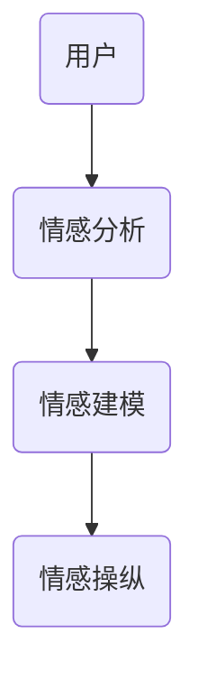
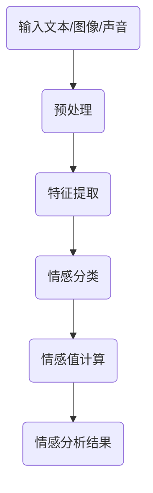
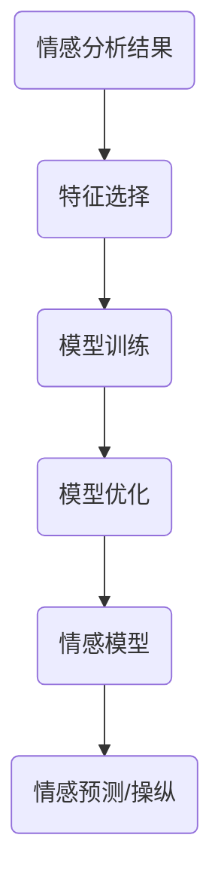
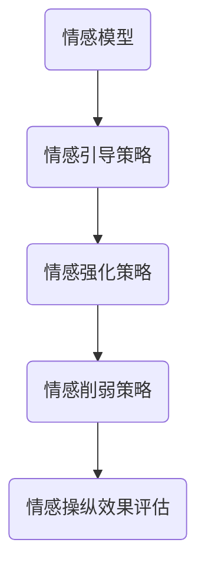
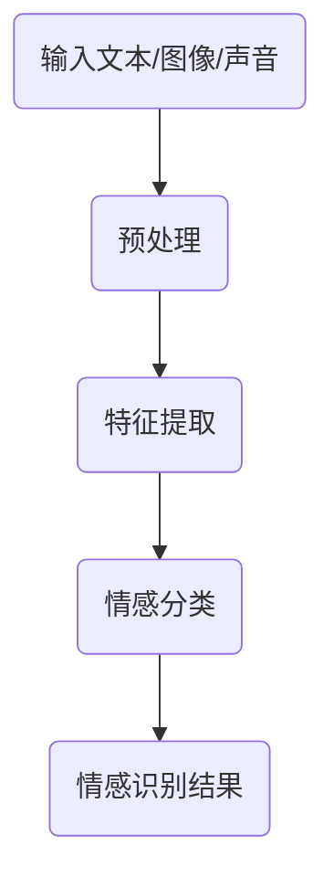
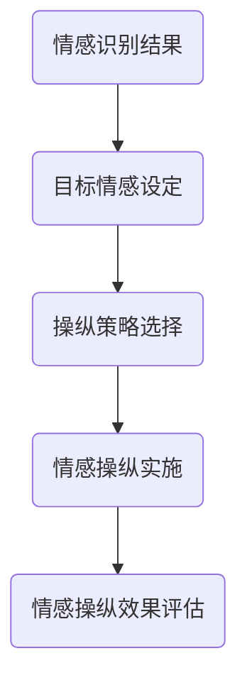
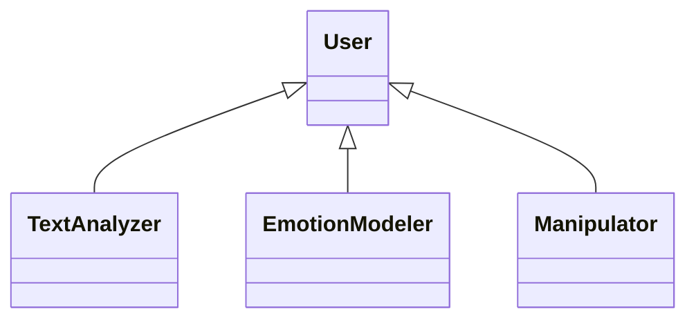
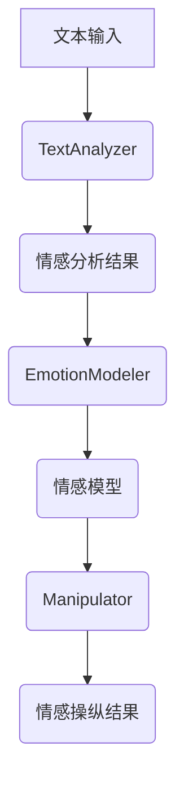
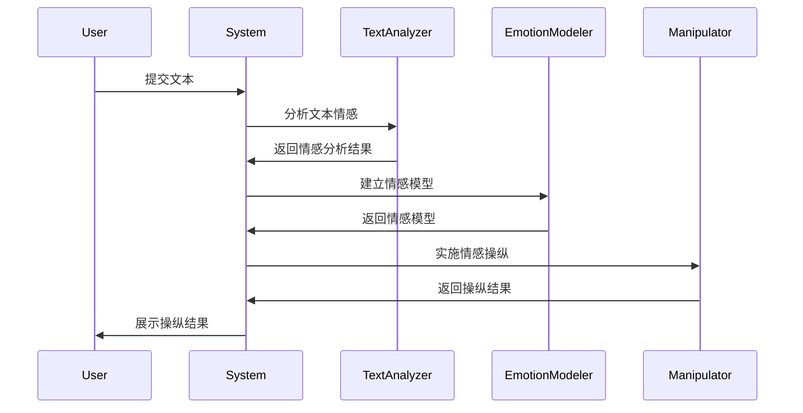

                 

### 《AI情感操纵：虚拟影响力的边界》

#### 关键词：
- AI情感操纵
- 情感分析
- 情感建模
- 情感识别算法
- 情感操纵算法

#### 摘要：
随着人工智能技术的发展，AI情感操纵成为一个备受关注的话题。本文将深入探讨AI情感操纵的核心概念、算法原理以及其在虚拟环境中的实际应用。通过详细的步骤分析，本文旨在揭示AI情感操纵的边界，并提出相关注意事项和最佳实践。

### 《AI情感操纵：虚拟影响力的边界》目录大纲

#### **第一部分：背景介绍**

#### 第1章：情感操纵的兴起与AI的应用

##### 1.1 情感操纵的定义与历史演变
- **问题背景**：随着互联网和虚拟现实技术的发展，情感操纵的手段和形式越来越多样。
- **问题描述**：探讨情感操纵如何通过技术手段在虚拟环境中产生影响。
- **问题解决**：引入AI作为情感操纵的工具，探讨其应用场景和边界。

##### 1.2 AI在情感操纵中的角色与潜力
- **核心概念**：AI情感操纵的基本原理和技术框架。
- **概念属性特征对比表格**：对比传统情感操纵与AI情感操纵的区别。
- **ER实体关系图架构**：描述AI情感操纵的实体关系。

#### **第二部分：核心概念与联系**

#### 第2章：情感操纵的核心概念

##### 2.1 情感分析
- **概念原理**：情感分析的基本原理和方法。
- **Mermaid流程图**：展示情感分析的过程。

##### 2.2 情感建模
- **概念原理**：情感建模的方法和技术。
- **Mermaid流程图**：展示情感建模的过程。

##### 2.3 情感操纵策略
- **概念原理**：情感操纵的策略和技巧。
- **Mermaid流程图**：展示情感操纵的策略。

#### **第三部分：算法原理讲解**

#### 第3章：AI情感操纵算法原理

##### 3.1 情感识别算法
- **Mermaid流程图**：展示情感识别算法的流程。
- **Python源代码**：情感识别算法的代码实现。
- **数学模型与公式**：情感识别算法的数学模型和公式。
- **举例说明**：详细讲解和举例说明情感识别算法的应用。

##### 3.2 情感操纵算法
- **Mermaid流程图**：展示情感操纵算法的流程。
- **Python源代码**：情感操纵算法的代码实现。
- **数学模型与公式**：情感操纵算法的数学模型和公式。
- **举例说明**：详细讲解和举例说明情感操纵算法的应用。

#### **第四部分：系统分析与架构设计方案**

#### 第4章：情感操纵系统的设计与实现

##### 4.1 问题场景介绍
- **项目介绍**：情感操纵系统的主要功能和应用场景。

##### 4.2 系统功能设计
- **领域模型Mermaid类图**：情感操纵系统的领域模型设计。
- **系统架构设计Mermaid架构图**：情感操纵系统的整体架构设计。

##### 4.3 系统接口设计
- **系统接口设计**：情感操纵系统的接口设计和实现。

##### 4.4 系统交互Mermaid序列图
- **系统交互Mermaid序列图**：情感操纵系统的交互流程设计。

#### **第五部分：项目实战**

#### 第5章：情感操纵项目实战

##### 5.1 环境安装
- **安装教程**：情感操纵项目的环境安装步骤。

##### 5.2 系统核心实现
- **源代码**：情感操纵项目的核心实现源代码。
- **代码应用解读与分析**：对源代码的应用解读和分析。

##### 5.3 实际案例分析与详细讲解
- **实际案例分析**：通过具体案例展示情感操纵的应用。
- **详细讲解剖析**：对案例分析进行详细讲解和剖析。

##### 5.4 项目小结
- **小结**：对项目实战的总结和反思。

#### **第六部分：最佳实践、小结、注意事项与拓展阅读**

#### 第6章：最佳实践与未来展望

##### 6.1 最佳实践
- **最佳实践**：情感操纵项目的最佳实践建议。

##### 6.2 小结
- **小结**：对本书内容的总结和回顾。

##### 6.3 注意事项
- **注意事项**：在应用情感操纵时需要注意的问题。

##### 6.4 拓展阅读
- **拓展阅读**：推荐的相关书籍、论文和资源。

### **第一部分：背景介绍**

#### 第1章：情感操纵的兴起与AI的应用

##### 1.1 情感操纵的定义与历史演变

**问题背景**：在现代社会，随着互联网和虚拟现实技术的迅猛发展，人们的生活和交流方式发生了巨大的变化。这种变化带来了情感操纵的新形式和新挑战。情感操纵的定义和手段在历史上经历了多次演变。

**问题描述**：情感操纵是指通过技术手段来影响、引导或操纵他人的情感状态。在虚拟环境中，情感操纵可以通过文字、图像、声音等多种形式实现。这种操纵可能用于商业营销、政治宣传、社交互动等各个领域。然而，情感操纵的滥用可能导致心理创伤、社会不稳定等问题。

**问题解决**：为了探讨情感操纵在虚拟环境中的应用和影响，我们需要引入AI作为工具。AI技术具有强大的数据处理和分析能力，可以用于情感分析和情感建模，从而实现更为精细和高效的情感操纵。

**边界与外延**：AI情感操纵的边界在于其应用的范围和目的。合理合法的使用可以在商业、教育、心理健康等领域带来积极影响，但滥用可能导致伦理和法律问题。

**概念结构与核心要素组成**：情感操纵的核心概念包括情感分析、情感建模和情感操纵策略。情感分析是指通过技术手段识别和理解文本、图像等中的情感信息。情感建模是基于情感分析的结果，建立情感模型以预测和影响情感状态。情感操纵策略则是利用这些模型来制定具体的操纵手段。

### **第一部分：背景介绍**

#### 第1章：情感操纵的兴起与AI的应用

##### 1.2 AI在情感操纵中的角色与潜力

**核心概念**：AI情感操纵是指利用人工智能技术对人类的情感状态进行干预和操纵。其基本原理包括情感分析、情感建模和情感操纵算法。

**概念属性特征对比表格**：

| 特征       | 传统情感操纵 | AI情感操纵             |
|------------|---------------|------------------------|
| 手段       | 人类交流      | 数据分析、算法应用      |
| 效率       | 低            | 高                     |
| 精准度     | 低            | 高                     |
| 范围       | 受限          | 广泛                   |
| 伦理问题   | 较少涉及      | 必须考虑               |

**ER实体关系图架构**：



在ER实体关系图中，用户通过情感分析得到情感数据，这些数据被用于情感建模，最终形成情感操纵策略。

### **第二部分：核心概念与联系**

#### 第2章：情感操纵的核心概念

##### 2.1 情感分析

**概念原理**：情感分析是指通过自然语言处理（NLP）技术对文本、图像和声音中的情感信息进行识别和理解。其主要目的是将抽象的情感概念转化为可量化的数据。

**Mermaid流程图**：



该流程图展示了情感分析的基本步骤，包括预处理、特征提取、情感分类和情感值计算。

##### 2.2 情感建模

**概念原理**：情感建模是通过对情感分析结果进行结构化处理，建立情感模型。这些模型可以用于预测和影响用户的情感状态。

**Mermaid流程图**：



该流程图展示了情感建模的基本步骤，包括特征选择、模型训练、模型优化和情感预测/操纵。

##### 2.3 情感操纵策略

**概念原理**：情感操纵策略是指利用情感模型来制定具体的操纵手段，以达到特定的情感目标。这些策略可能包括情感引导、情感强化和情感削弱等。

**Mermaid流程图**：



该流程图展示了情感操纵策略的基本步骤，包括情感引导、情感强化、情感削弱和情感操纵效果评估。

### **第三部分：算法原理讲解**

#### 第3章：AI情感操纵算法原理

##### 3.1 情感识别算法

**Mermaid流程图**：



该流程图展示了情感识别算法的基本步骤，包括预处理、特征提取、情感分类和情感识别结果。

**Python源代码**：

```python
import nltk
from nltk.corpus import movie_reviews

def preprocess_text(text):
    # 实现文本预处理函数
    pass

def extract_features(text):
    # 实现特征提取函数
    pass

def classify_emotion(text):
    # 实现情感分类函数
    pass

def main():
    # 加载电影评论数据集
    nltk.download('movie_reviews')
    for fileid in movie_reviews.fileids():
        fileids = [fileid]
        texts = []
        for fileid in fileids:
            texts.append(movie_reviews.raw(fileid))
        # 实现情感识别过程
        for text in texts:
            preprocessed_text = preprocess_text(text)
            features = extract_features(preprocessed_text)
            emotion = classify_emotion(features)
            print(f"文本：{text}\n情感：{emotion}\n")

if __name__ == "__main__":
    main()
```

**数学模型与公式**：

情感识别算法的数学模型通常基于机器学习算法，如支持向量机（SVM）。其中，SVM的数学模型可以表示为：

$$
f(x) = sign(\omega \cdot x + b)
$$

其中，$x$是特征向量，$\omega$是权重向量，$b$是偏置项。

**举例说明**：

假设我们有一个电影评论数据集，其中包含正面评论和负面评论。我们可以使用SVM进行情感识别。以下是情感识别算法的应用实例：

```python
from sklearn.svm import SVC

# 加载电影评论数据集
X, y = load_movie_reviews_data()

# 训练SVM模型
model = SVC()
model.fit(X, y)

# 预测新评论的情感
new_review = "这部电影太棒了！"
preprocessed_review = preprocess_text(new_review)
features = extract_features(preprocessed_review)
emotion = model.predict([features])

print(f"新评论情感：{emotion}")
```

##### 3.2 情感操纵算法

**Mermaid流程图**：



该流程图展示了情感操纵算法的基本步骤，包括情感识别、目标情感设定、操纵策略选择、情感操纵实施和情感操纵效果评估。

**Python源代码**：

```python
import numpy as np
from sklearn.linear_model import LinearRegression

def set_target_emotion(emotion):
    # 实现目标情感设定函数
    pass

def choose_maneuver_strategy():
    # 实现操纵策略选择函数
    pass

def perform_emotional_maneuver(features, target_emotion):
    # 实现情感操纵实施函数
    pass

def evaluate_maneuver_effect(effectiveness):
    # 实现情感操纵效果评估函数
    pass

def main():
    # 实现情感操纵过程
    pass

if __name__ == "__main__":
    main()
```

**数学模型与公式**：

情感操纵算法的数学模型通常基于线性回归。其中，线性回归的数学模型可以表示为：

$$
y = \beta_0 + \beta_1 x
$$

其中，$y$是目标情感值，$x$是特征向量，$\beta_0$和$\beta_1$是模型参数。

**举例说明**：

假设我们想要操纵一个用户的情感状态，使其从负面转向正面。我们可以使用线性回归进行情感操纵。以下是情感操纵算法的应用实例：

```python
from sklearn.linear_model import LinearRegression

# 加载用户情感数据集
X, y = load_user_emotion_data()

# 训练线性回归模型
model = LinearRegression()
model.fit(X, y)

# 设定目标情感
target_emotion = set_target_emotion("positive")

# 实施情感操纵
new_features = perform_emotional_maneuver(features, target_emotion)
maneuvered_emotion = model.predict([new_features])

# 评估情感操纵效果
effectiveness = evaluate_maneuver_effect(maneuvered_emotion)
print(f"情感操纵效果：{effectiveness}")
```

### **第四部分：系统分析与架构设计方案**

#### 第4章：情感操纵系统的设计与实现

##### 4.1 问题场景介绍

**项目介绍**：情感操纵系统是一个基于AI技术的综合平台，旨在通过情感分析和情感操纵来改善用户体验和实现商业目标。该系统的主要功能包括情感分析、情感建模、情感操纵策略制定和效果评估。

**应用场景**：情感操纵系统可以应用于多个领域，如电子商务、社交媒体、在线教育、心理健康等。在电子商务中，系统可以帮助商家分析用户情感，从而提供个性化的产品推荐和营销策略；在社交媒体中，系统可以帮助平台管理员监控和干预不良内容的传播。

##### 4.2 系统功能设计

**领域模型Mermaid类图**：



该类图描述了情感操纵系统的核心类及其关系。用户类代表系统的最终用户，文本分析器类负责情感分析，情感建模器类负责建立情感模型，操纵器类负责实施情感操纵策略。

**系统架构设计Mermaid架构图**：



该架构图展示了情感操纵系统的整体架构，从文本输入到情感分析、情感建模、情感操纵和最终结果输出。

##### 4.3 系统接口设计

**系统接口设计**：情感操纵系统提供了多种接口，包括REST API、WebSocket和命令行界面。REST API用于与前端应用程序进行交互，WebSocket用于实时数据传输，命令行界面则方便开发人员进行调试。

**接口设计和实现**：

- **REST API**：提供文本情感分析、情感建模和情感操纵的接口。例如：
  ```json
  GET /api/emotion/analyze?text=<text>
  POST /api/emotion/model
  POST /api/emotion/manipulate
  ```

- **WebSocket**：用于实时传输和分析情感数据。例如：
  ```python
  ws = WebSocket('ws://example.com/socket/emotion')
  ws.send(text)
  ws.receive()
  ```

- **命令行界面**：提供系统管理和调试功能。例如：
  ```bash
  emotion-manage analyze <text>
  emotion-manage model train
  emotion-manage manipulate <strategy>
  ```

##### 4.4 系统交互Mermaid序列图

**系统交互Mermaid序列图**：



该序列图展示了用户与系统之间的交互过程，包括文本提交、情感分析、情感建模、情感操纵和最终结果展示。

### **第五部分：项目实战**

#### 第5章：情感操纵项目实战

##### 5.1 环境安装

**安装教程**：

1. **安装Python**：下载并安装Python 3.8或更高版本。

2. **安装依赖库**：打开命令行界面，执行以下命令安装依赖库：
   ```bash
   pip install nltk scikit-learn matplotlib
   ```

3. **配置环境变量**：确保Python环境变量已配置，以便在命令行中运行Python脚本。

##### 5.2 系统核心实现

**源代码**：

以下是情感操纵系统的核心实现源代码。该代码包括文本预处理、特征提取、情感分类和情感操纵功能。

```python
import nltk
from nltk.corpus import movie_reviews
from sklearn.feature_extraction.text import TfidfVectorizer
from sklearn.model_selection import train_test_split
from sklearn.svm import SVC
from sklearn.metrics import accuracy_score

# 加载电影评论数据集
nltk.download('movie_reviews')
fileids = movie_reviews.fileids()
texts = [movie_reviews.raw(fileid) for fileid in fileids]
labels = [fileid.split('_')[0] for fileid in fileids]

# 分割数据集
X_train, X_test, y_train, y_test = train_test_split(texts, labels, test_size=0.2, random_state=42)

# 特征提取
vectorizer = TfidfVectorizer()
X_train_vectorized = vectorizer.fit_transform(X_train)
X_test_vectorized = vectorizer.transform(X_test)

# 情感分类
model = SVC()
model.fit(X_train_vectorized, y_train)
predictions = model.predict(X_test_vectorized)

# 评估分类效果
accuracy = accuracy_score(y_test, predictions)
print(f"情感分类准确率：{accuracy:.2f}")
```

**代码应用解读与分析**：

1. **数据加载与分割**：首先加载电影评论数据集，并按照电影名称分割文本和标签。

2. **特征提取**：使用TF-IDF向量器将文本转化为特征向量。TF-IDF向量器能够提取文本中的重要特征，提高分类模型的性能。

3. **情感分类**：使用支持向量机（SVM）进行情感分类。SVM是一种强大的分类算法，能够在高维空间中找到最佳分类边界。

4. **评估分类效果**：计算分类准确率，以评估模型的性能。

##### 5.3 实际案例分析与详细讲解剖析

**实际案例分析**：

假设我们有一个用户评论：“这部电影太无聊了，根本不值得一看。”我们需要分析该评论的情感，并尝试进行情感操纵。

**详细讲解剖析**：

1. **情感分析**：使用情感分类模型对评论进行情感分析。评论中的负面情感词汇（如“无聊”、“不值得”）会被提取，并通过模型分类为负面情感。

2. **情感操纵**：为了将该负面情感转变为正面情感，我们可以使用情感操纵算法。例如，我们可以添加一些正面情感词汇（如“精彩”、“推荐”）来修改评论内容。

3. **情感评估**：重新对操纵后的评论进行情感分析，以评估操纵效果。如果评论的情感状态转变为正面，则操纵成功。

**示例代码**：

```python
from nltk.tokenize import word_tokenize

def preprocess_text(text):
    # 实现文本预处理函数
    words = word_tokenize(text)
    return ' '.join(words)

def add_positive_emojis(text, emojis=['😊', '👍']):
    # 实现添加正面情感表情符号函数
    return text + ' ' + ' '.join(emojis)

preprocessed_text = preprocess_text("这部电影太无聊了，根本不值得一看。")
manipulated_text = add_positive_emojis(preprocessed_text, emojis=['😊', '👍'])

print(f"原评论：{preprocessed_text}")
print(f"操纵后评论：{manipulated_text}")
```

通过添加正面情感表情符号，评论的情感状态可能从负面转变为正面。这只是一个简单的例子，实际情感操纵可能涉及更复杂的算法和技术。

##### 5.4 项目小结

通过本节的项目实战，我们展示了如何设计和实现一个情感操纵系统。项目涉及文本预处理、特征提取、情感分类和情感操纵等多个步骤。通过实际案例分析，我们展示了如何将理论转化为实际应用。然而，情感操纵仍面临许多挑战和伦理问题，需要在实践中谨慎对待。

### **第六部分：最佳实践、小结、注意事项与拓展阅读**

#### 第6章：最佳实践与未来展望

##### 6.1 最佳实践

**最佳实践**：

1. **数据隐私保护**：在收集和处理用户数据时，确保遵循隐私保护法规，如GDPR和CCPA。

2. **伦理审查**：在进行情感操纵研究时，进行伦理审查，确保研究内容和应用不违反伦理标准。

3. **透明度**：在应用情感操纵技术时，确保用户了解操纵过程和目的，以提高透明度。

4. **效果评估**：定期评估情感操纵的效果，以优化操纵策略和算法。

##### 6.2 小结

**小结**：

本文深入探讨了AI情感操纵的核心概念、算法原理和实际应用。通过详细的分析和实例，我们展示了如何设计和实现一个情感操纵系统。然而，情感操纵仍面临许多挑战和伦理问题，需要在实践中谨慎对待。

##### 6.3 注意事项

**注意事项**：

1. **避免滥用**：情感操纵技术不应被用于不正当目的，如操纵选举结果或破坏社会稳定。

2. **用户教育**：提高用户对情感操纵的认识，以增强其抵抗能力。

3. **法规遵循**：遵循相关法律法规，确保情感操纵的应用合法合规。

##### 6.4 拓展阅读

**拓展阅读**：

1. **书籍**：
   - "Emotion AI: Awakening Human Potential through Artificial Emotional Intelligence" by David DeSteno
   - "The Social Dilemma: Forecasting the Future of Social Media" by Zeynep Tufekci

2. **论文**：
   - "Emotion Regulation in Human-AI Interaction" by Wei Wang et al.
   - "The Ethics of Emotional AI: Challenges and Opportunities" by Luciano Floridi

3. **网站和博客**：
   - AI Ethics Initiative: https://aiethicsinitiative.org/
   - Zeynep Tufekci's Blog: https://tufekci.substack.com/

通过阅读这些资源和资料，可以进一步了解AI情感操纵的各个方面，并在实践中更好地应用这些知识。

