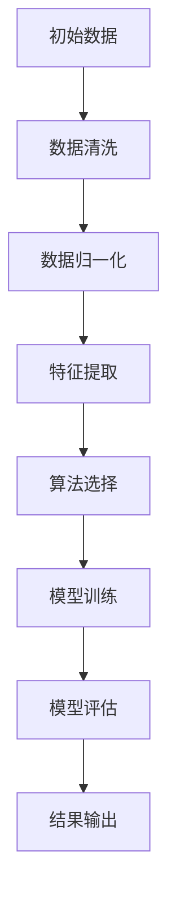

                 

# AI情感歧视：应对机器偏见的策略

关键词：人工智能，情感歧视，机器偏见，策略，检测，优化，社会公正

摘要：随着人工智能技术的飞速发展，其在各个领域的应用日益广泛。然而，AI系统在处理数据时可能会产生情感歧视，这种现象不仅损害了社会的公平性，还可能带来严重的法律和道德问题。本文旨在探讨AI情感歧视的机制、检测与评估方法，并提出一系列应对策略，以促进AI技术的健康发展。

## 第一部分：AI情感歧视概述

### 第1章：问题背景与定义

#### 1.1 问题背景

人工智能（AI）作为一种模拟人类智能的技术，已经在医疗、金融、教育等多个领域取得了显著的应用成果。然而，随着AI技术的普及，人们开始注意到一个不容忽视的问题——AI情感歧视。这种偏见不仅影响了个人的利益，还可能加剧社会的不公平现象。

#### 1.2 情感歧视的定义

情感歧视是指AI系统在处理数据时，由于数据本身或算法设计的原因，对某些群体产生的负面情感偏见。这种偏见可能体现在对特定群体的负面评价、不公平待遇等方面。

#### 1.3 AI情感歧视的影响

AI情感歧视的影响是多方面的。首先，它可能导致错误决策，影响个体权益；其次，它可能加剧社会不公，引发社会矛盾；最后，它还可能对AI技术的信任度造成负面影响，阻碍AI技术的普及与发展。

#### 1.4 学习目标

通过本章的学习，读者应了解AI情感歧视的定义、背景和影响，明确本篇文章的学习目标，为后续章节的深入学习奠定基础。

## 第二部分：AI情感歧视的机制

### 第2章：AI情感歧视的机制分析

#### 2.1 数据偏见

数据偏见是AI情感歧视的首要来源。当训练数据存在不公正、不平衡或带有偏见时，AI系统很难避免在预测过程中产生情感歧视。

#### 2.2 训练过程偏见

AI情感歧视的产生不仅与数据有关，还与训练过程密切相关。在训练过程中，若算法设计不当或优化目标设定不合理，可能导致系统在预测时产生偏见。

#### 2.3 预测偏见

预测偏见是指AI系统在处理新数据时，由于受到训练数据和训练过程的影响，对某些群体产生的负面预测结果。

#### 2.4 社会偏见

社会偏见是指社会文化背景对AI系统的影响。在某些社会文化环境中，特定的群体可能受到歧视，这种偏见可能渗透到AI系统的设计中，导致情感歧视。

#### 2.5 案例分析

在本章的最后一部分，我们将通过几个具体的案例分析，深入探讨AI情感歧视的机制。这些案例将帮助我们更好地理解情感歧视的成因和影响。

## 第三部分：AI情感歧视的检测与评估

### 第3章：AI情感歧视的检测方法

#### 3.1 检测方法概述

检测AI情感歧视的关键在于识别系统中的偏见。本节将介绍几种常用的检测方法，包括基于规则的方法、机器学习方法等。

#### 3.2 数据预处理

在检测之前，对数据进行的预处理至关重要。本节将介绍如何进行数据清洗、归一化等预处理操作，以提高检测的准确性。

#### 3.3 检测算法

本节将详细介绍几种检测算法，包括基于统计学的方法、深度学习方法等，并比较它们的优势和局限性。

#### 3.4 检测效果评估

检测效果评估是验证检测算法有效性的关键。本节将介绍如何评估检测算法的性能，包括准确率、召回率等指标。

### 第4章：AI情感歧视的评估指标

#### 4.1 指标概述

评估AI情感歧视的指标包括公平性指标和准确性指标。本节将详细介绍这些指标的含义、计算方法和应用场景。

#### 4.2 公平性指标

公平性指标是评估AI系统是否公平的重要依据。本节将介绍几种常用的公平性指标，如性别平等性、种族平等性等。

#### 4.3 准确性指标

准确性指标是评估AI系统预测结果正确性的重要指标。本节将介绍几种常用的准确性指标，如准确率、召回率等。

#### 4.4 实际案例分析

在本章的最后，我们将通过实际案例分析，展示如何运用评估指标来评估AI情感歧视。

## 第四部分：应对AI情感歧视的策略

### 第5章：数据清洗与预处理

#### 5.1 数据清洗

数据清洗是减少AI情感歧视的关键步骤。本节将介绍如何识别和修正数据中的偏见，以确保训练数据的质量。

#### 5.2 预处理方法

预处理方法包括数据归一化、特征提取等。本节将介绍几种常用的预处理方法，以提高AI系统的公平性。

#### 5.3 案例解析

在本章的最后，我们将通过具体案例，展示如何进行数据清洗与预处理，以减少AI情感歧视。

### 第6章：算法调整与优化

#### 6.1 算法调整策略

算法调整是减少AI情感歧视的重要手段。本节将介绍如何调整算法参数，以提高系统的公平性和准确性。

#### 6.2 优化方法

优化方法是提高AI系统性能的关键。本节将介绍几种优化方法，如交叉验证、遗传算法等。

#### 6.3 实践案例

在本章的最后，我们将通过具体案例，展示如何调整算法参数和优化方法，以减少AI情感歧视。

### 第7章：社会公正性提升策略

#### 7.1 社会责任意识培养

社会责任意识是应对AI情感歧视的重要基础。本节将介绍如何培养社会责任意识，以提高AI系统的公正性。

#### 7.2 法律法规与政策

法律法规和政策是规范AI技术应用的重要手段。本节将介绍相关的法律法规和政策，以及如何制定和实施这些政策。

#### 7.3 教育与培训

教育与培训是提高AI系统公正性的关键。本节将介绍如何通过教育和培训来提高人们对AI情感歧视的认识和应对能力。

#### 7.4 案例研究

在本章的最后，我们将通过具体案例研究，探讨如何提升AI系统的社会公正性。

## 第五部分：未来展望

### 第8章：未来发展趋势

#### 8.1 技术进展

未来AI技术的发展将带来更多机遇和挑战。本节将介绍未来AI技术的发展趋势，以及这些趋势对AI情感歧视的影响。

#### 8.2 社会影响

AI情感歧视对社会的影响是深远的。本节将分析AI情感歧视对社会的影响，以及如何应对这些影响。

#### 8.3 法律法规发展

未来法律法规的发展将对AI情感歧视产生重要影响。本节将介绍未来法律法规的发展趋势，以及如何制定和实施这些法规。

#### 8.4 未来挑战与机遇

未来AI情感歧视的应对将面临诸多挑战和机遇。本节将探讨未来应对AI情感歧视的挑战和机遇。

## 第六部分：实践总结与展望

### 第9章：实践总结与经验分享

#### 9.1 主要成果

本节将总结本文的主要研究成果，包括AI情感歧视的定义、机制、检测与评估方法，以及应对策略。

#### 9.2 存在问题与挑战

本节将分析本文在研究过程中存在的问题和挑战，以及如何应对这些问题和挑战。

#### 9.3 经验与教训

本节将分享本文在研究过程中的经验与教训，为后续研究提供参考。

### 第10章：未来工作展望

#### 10.1 研究方向

未来AI情感歧视的研究方向将更加多样和深入。本节将介绍未来AI情感歧视研究的几个可能的方向。

#### 10.2 应用领域拓展

未来AI情感歧视的应对策略将在更多应用领域得到应用。本节将探讨未来AI情感歧视应用领域拓展的可能性。

#### 10.3 社会影响分析

未来AI情感歧视的应对将产生深远的社会影响。本节将分析未来AI情感歧视应对策略对社会的影响。

作者：AI天才研究院/AI Genius Institute & 禅与计算机程序设计艺术 /Zen And The Art of Computer Programming

**完整文章内容请参考后续章节。**## 第一部分：AI情感歧视概述

### 第1章：问题背景与定义

#### 1.1 问题背景

随着人工智能（AI）技术的迅猛发展，AI已经逐渐成为各行各业的创新引擎，从医疗诊断、金融分析到自动驾驶和智能家居，AI的应用场景不断扩展，极大地提升了生产效率和决策质量。然而，在AI技术蓬勃发展的同时，一个不容忽视的问题也日益凸显——AI情感歧视。情感歧视在现实生活中普遍存在，它指的是在社会交往中，由于性别、种族、年龄、文化等因素，对特定群体产生的负面态度和行为。当这一现象迁移到AI系统中，便形成了AI情感歧视。

AI情感歧视的问题最早在2016年被广泛讨论，当时Google照片识别系统错误地将黑人儿童识别为“ gorilla”（大猩猩）。这一事件引起了公众对AI系统中是否存在种族歧视的广泛关注。随着研究的深入，人们逐渐认识到，AI情感歧视不仅限于视觉识别领域，还存在于自然语言处理、推荐系统等多个方面。

#### 1.2 情感歧视的定义

情感歧视可以定义为对某些群体在情感层面上的不公平对待，这种对待可能表现为负面情绪、偏见或歧视行为。在AI领域，情感歧视通常指的是AI系统在处理数据或生成输出时，对特定群体产生的负面情感偏见。这种偏见可能表现为对某些用户的负面评价、不公平待遇，甚至是对用户的侮辱和排斥。

AI情感歧视的具体表现形式包括：

1. **评价偏见**：AI系统可能对某些群体成员的评价低于平均水平，如信用评分系统对低收入群体给予较低的信用评分。
2. **推荐偏见**：推荐系统可能对某些群体推荐不适当的内容，如音乐或视频推荐平台对特定群体的推荐内容带有偏见。
3. **自动化决策偏见**：自动化决策系统可能对某些群体成员做出不公平的决策，如招聘系统对女性候选人的筛选偏好。

#### 1.3 AI情感歧视的影响

AI情感歧视的影响是多方面的，不仅对个体权益造成损害，还可能对整个社会产生负面影响：

1. **个体权益损害**：AI情感歧视可能导致某些群体成员遭受不公平对待，如被错误标记、被拒绝服务等，从而损害其基本权益。
2. **社会不公平加剧**：AI情感歧视可能会加剧社会不公，导致特定群体在社会资源分配、就业机会等方面处于劣势。
3. **社会矛盾激化**：长期存在的AI情感歧视可能导致社会矛盾的激化，引发社会不满和冲突。
4. **法律和道德风险**：AI情感歧视可能违反相关法律法规，引发法律诉讼和道德争议，影响AI技术的声誉和发展。

#### 1.4 学习目标

通过本章的学习，读者应达到以下目标：

1. **理解AI情感歧视的定义和背景**：了解AI情感歧视的概念，以及其产生的原因和背景。
2. **认识到AI情感歧视的影响**：理解AI情感歧视对个体和社会可能造成的负面影响。
3. **明确研究意义**：认识到研究AI情感歧视的重要性，以及其在维护社会公正和推动AI技术健康发展中的关键作用。

本章的内容为后续章节的讨论奠定了基础，通过深入理解AI情感歧视的问题背景和定义，读者将能够更好地掌握后续章节中提出的检测与应对策略。

### 第2章：AI情感歧视的机制分析

#### 2.1 数据偏见

数据偏见是AI情感歧视的首要来源。数据偏见指的是在数据收集、标注和存储过程中，由于各种人为或系统因素，导致数据对某些群体存在不公平或不准确的反映。这种偏见可能会在AI系统的训练过程中被放大，最终导致情感歧视。

1. **数据收集偏见**：
   - **样本不均衡**：在数据收集过程中，某些群体的样本量较少，可能导致模型对这些群体的行为模式了解不足，从而在预测时产生偏见。
   - **选择偏差**：在某些情况下，数据收集者可能有意或无意地选择有利于某些群体的数据，忽视或排除其他群体的数据，导致数据集的不公平性。
   - **环境因素**：社会环境、政策导向等因素也可能影响数据的收集过程，导致某些群体在数据中被过分强调或忽视。

2. **数据标注偏见**：
   - **主观性**：数据标注通常需要人类进行，标注者的个人观点和经验可能会影响标注结果，导致对某些群体的标签存在偏见。
   - **文化背景**：不同的文化背景可能导致对同一行为的理解和评价存在差异，这种差异可能在数据标注过程中被放大，导致偏见。

3. **数据存储和更新偏见**：
   - **历史积累**：长期积累的数据可能包含历史上的偏见，如过去的歧视行为或观念，这些偏见可能在数据存储和更新过程中被保留。
   - **动态变化**：随着社会环境的变化，数据中的偏见也可能发生变化。然而，如果数据更新不及时，这些偏见可能会继续存在，甚至加剧。

#### 2.2 训练过程偏见

AI情感歧视的产生不仅与数据有关，还与训练过程密切相关。在训练过程中，若算法设计不当或优化目标设定不合理，可能导致系统在预测时产生偏见。

1. **算法选择偏见**：
   - **过度拟合**：选择过于复杂的算法可能导致模型过度拟合训练数据，从而在测试数据上表现不佳，甚至产生情感歧视。
   - **特定算法偏好**：某些算法可能对特定类型的数据或特征更敏感，导致在处理不同群体时产生偏见。

2. **优化目标设定偏见**：
   - **单一目标优化**：在训练过程中，若优化目标仅关注预测准确性，可能导致模型在追求准确性的同时忽略其他重要因素，如公平性。
   - **效率优先**：在资源有限的情况下，开发者可能优先考虑模型训练的速度和计算效率，而忽视潜在的偏见问题。

3. **数据预处理偏见**：
   - **特征选择偏见**：在特征选择过程中，若忽略某些可能包含偏见的特征，可能导致模型在处理这些特征时产生偏见。
   - **特征加权偏见**：在特征加权过程中，若某些特征被赋予过高的权重，可能导致模型对这些特征的过度依赖，从而在处理其他特征时产生偏见。

4. **训练数据分布偏见**：
   - **集中训练**：若模型主要在特定群体的数据上进行训练，可能导致模型在处理其他群体时表现不佳，甚至产生歧视。
   - **动态调整训练数据**：在训练过程中，若不及时调整训练数据，以反映最新的社会环境变化，可能导致模型在预测时产生过时的偏见。

#### 2.3 预测偏见

预测偏见是指AI系统在处理新数据时，由于受到训练数据和训练过程的影响，对某些群体产生的负面预测结果。预测偏见的具体表现形式包括：

1. **评价偏见**：如信用评分系统对某些群体的信用评分低于平均水平，即使这些群体的信用记录良好。
2. **推荐偏见**：推荐系统可能对某些群体推荐不适当的内容，如歧视性言论或偏见性广告。
3. **决策偏见**：自动化决策系统可能对某些群体成员做出不公平的决策，如在招聘或贷款审批中。

预测偏见的原因主要包括：

1. **历史数据偏见**：模型在训练过程中，学习到的历史数据中的偏见可能延续到预测阶段。
2. **数据分布差异**：新数据与训练数据在分布上的差异可能导致预测结果偏离实际。
3. **模型复杂度**：过于复杂的模型可能在训练过程中学习到过多细节，导致在预测时产生过度的拟合和偏见。

#### 2.4 社会偏见

社会偏见是指社会文化背景对AI系统的影响。在某些社会文化环境中，特定的群体可能受到歧视，这种偏见可能渗透到AI系统的设计和应用中，导致情感歧视。

1. **文化偏见**：
   - **语言使用**：在自然语言处理中，某些词汇可能包含对特定群体的歧视性含义，如侮辱性词汇或贬低性表述。
   - **文化习俗**：不同文化背景下，对同一事物的理解和评价可能存在差异，这些差异可能在AI系统中体现为偏见。

2. **法律和伦理偏见**：
   - **法律限制**：某些法律条款可能对特定群体产生不利影响，这些限制可能被AI系统所遵循，导致对相关群体的歧视。
   - **伦理考量**：在AI系统的设计过程中，若缺乏对伦理问题的充分考量，可能导致系统在应用时产生偏见。

3. **社会结构偏见**：
   - **社会分层**：社会结构中的不平等可能导致AI系统在设计和应用时对某些群体产生偏见，如在就业机会分配、教育资源分配等方面。
   - **社会期望**：社会对某些群体的期望可能影响AI系统的设计和应用，如在性别角色设定、职业选择等方面。

#### 2.5 案例分析

为了更直观地理解AI情感歧视的机制，下面我们通过几个具体案例进行分析。

1. **招聘歧视案例**：
   - 某公司使用AI招聘系统进行简历筛选，发现系统对女性候选人的筛选率显著低于男性候选人。进一步分析发现，这是由于在简历数据集中，女性候选人的工作经验和职位描述较为简略，导致模型对女性候选人的评价较低。
   - 解决方案：通过改进简历数据的标注和质量，以及调整模型参数，使招聘系统在评估简历时更加公平。

2. **信用评分案例**：
   - 某信用评分系统在评估借款人信用时，对特定种族的借款人给予较低的评分。分析发现，这是由于在数据集中，这些种族的借款人违约率较高，导致模型在预测时产生偏见。
   - 解决方案：通过引入更多的特征变量，如借款人的生活习惯、职业稳定性等，调整评分模型的权重，以提高评估的公平性。

3. **推荐系统案例**：
   - 某视频推荐系统在推荐内容时，对某些群体的用户推荐带有歧视性或偏见性的视频。分析发现，这是由于在训练数据集中，这些视频的内容较为负面，且用户对这些内容的点击率较高，导致模型在推荐时产生偏见。
   - 解决方案：通过过滤和调整推荐算法，确保推荐内容具有多样性，避免对特定群体产生偏见。

通过以上案例分析，我们可以看到，AI情感歧视的产生机制复杂，涉及到数据、算法、文化等多个方面。为了有效应对这一问题，需要从多个层面进行综合考虑和改进，以实现AI系统的公平性和公正性。

### 第3章：AI情感歧视的检测方法

#### 3.1 检测方法概述

检测AI情感歧视是确保AI系统公正性的关键步骤。检测方法主要包括基于规则的方法和机器学习方法。这些方法各有优缺点，适用于不同的场景和应用需求。

1. **基于规则的方法**：
   - **优点**：直观、易于理解，适用于简单场景，检测过程明确。
   - **缺点**：灵活性较差，难以应对复杂和多变的数据特征。

2. **机器学习方法**：
   - **优点**：具有较强的自适应能力和泛化能力，适用于复杂场景。
   - **缺点**：算法复杂，训练过程较长，对数据质量和数量要求较高。

在本节中，我们将详细介绍几种常用的检测方法，包括基于规则的方法、机器学习方法，以及它们在实际应用中的效果和挑战。

#### 3.2 数据预处理

在检测AI情感歧视之前，数据预处理是至关重要的。良好的数据预处理不仅可以提高检测的准确性，还可以减少检测过程中的噪声和误差。以下是一些常用的数据预处理方法：

1. **数据清洗**：
   - **缺失值处理**：通过填补缺失值或删除含有缺失值的样本，提高数据的完整性。
   - **异常值处理**：识别和删除或修正异常值，减少异常数据对模型的影响。
   - **数据标准化**：通过归一化或标准化处理，使不同特征具有相同的尺度，提高模型训练效果。

2. **数据归一化**：
   - **最小-最大标准化**：将数据缩放到[0,1]之间，通过线性变换实现。
   - **Z-score标准化**：将数据缩放到均值为0、标准差为1的范围内，通过线性变换实现。

3. **特征提取**：
   - **主成分分析（PCA）**：通过降维技术，提取数据的主要特征，减少数据维度。
   - **特征选择**：通过选择与情感歧视相关的特征，提高检测效果。

4. **数据平衡**：
   - **过采样**：通过增加少数群体的样本量，使数据集达到平衡。
   - **欠采样**：通过减少多数群体的样本量，使数据集达到平衡。

通过有效的数据预处理，我们可以提高AI情感歧视检测的准确性和可靠性。

#### 3.3 检测算法

在本节中，我们将详细介绍几种常用的检测算法，包括基于统计学的方法、机器学习方法，以及它们在实际应用中的效果和挑战。

1. **基于统计学的方法**：
   - **T测试**：通过比较不同群体在某个特征上的均值差异，检测是否存在情感歧视。
   - **卡方测试**：通过比较不同群体在多个特征上的分布差异，检测是否存在情感歧视。
   - **方差分析（ANOVA）**：通过比较不同群体在某个特征上的方差差异，检测是否存在情感歧视。

2. **机器学习方法**：
   - **逻辑回归**：通过构建逻辑回归模型，分析自变量与情感歧视之间的关系。
   - **随机森林**：通过构建随机森林模型，分析特征对情感歧视的影响。
   - **支持向量机（SVM）**：通过构建SVM模型，分析特征对情感歧视的影响。

3. **深度学习方法**：
   - **卷积神经网络（CNN）**：通过深度学习模型，分析图像和文本中的情感歧视特征。
   - **递归神经网络（RNN）**：通过深度学习模型，分析序列数据中的情感歧视特征。

在实际应用中，检测算法的选择取决于具体场景和数据特性。不同的算法在检测准确性和计算效率上存在差异，需要根据实际情况进行选择和优化。

#### 3.4 检测效果评估

检测效果评估是验证检测算法有效性的关键步骤。以下是一些常用的评估指标：

1. **准确率**：检测算法正确识别情感歧视的百分比。
2. **召回率**：检测算法正确识别的情感歧视占实际存在的情感歧视的百分比。
3. **F1分数**：综合考虑准确率和召回率的指标，用于评估检测算法的整体性能。
4. **精确率**：检测算法正确识别的情感歧视中，实际为情感歧视的百分比。

通过评估指标，我们可以全面了解检测算法的性能，并进行优化和改进。

#### 3.5 实际案例分析

为了更好地理解AI情感歧视的检测方法，下面我们通过几个实际案例进行分析。

1. **招聘歧视检测**：
   - 某公司使用逻辑回归模型检测招聘系统中是否存在性别歧视。通过分析简历数据，模型发现女性候选人在某些岗位上的筛选概率显著低于男性候选人。进一步分析发现，这是由于简历数据中，女性候选人的工作经验和职位描述较为简略，导致模型对女性候选人的评价较低。
   - 通过改进简历数据的标注和质量，调整模型参数，使招聘系统在评估简历时更加公平。

2. **信用评分歧视检测**：
   - 某信用评分系统使用随机森林模型检测是否存在种族歧视。通过分析借款人数据，模型发现特定种族的借款人被给予较低的信用评分。进一步分析发现，这是由于在数据集中，这些种族的借款人违约率较高，导致模型在预测时产生偏见。
   - 通过引入更多的特征变量，调整评分模型的权重，提高评估的公平性。

3. **推荐系统歧视检测**：
   - 某视频推荐系统使用卷积神经网络（CNN）检测是否存在偏见性推荐。通过分析用户行为数据和视频内容，模型发现系统对某些群体的用户推荐带有歧视性或偏见性的视频。进一步分析发现，这是由于在训练数据集中，这些视频的内容较为负面，且用户对这些内容的点击率较高，导致模型在推荐时产生偏见。
   - 通过过滤和调整推荐算法，确保推荐内容具有多样性，避免对特定群体产生偏见。

通过以上案例分析，我们可以看到，不同的检测方法在实际应用中具有不同的效果和挑战。为了提高检测效果，需要根据具体场景和数据进行算法优化和模型调整。

### 第4章：AI情感歧视的评估指标

#### 4.1 指标概述

评估AI情感歧视的指标是衡量AI系统是否公正的重要工具。这些指标可以分为公平性指标和准确性指标，它们从不同角度反映了AI系统的性能和公平性。

1. **公平性指标**：
   - **性别平等性**：评估AI系统在性别维度上的公平性，通常通过比较男性和女性在系统中的表现差异。
   - **种族平等性**：评估AI系统在种族维度上的公平性，通常通过比较不同种族群体在系统中的表现差异。
   - **年龄平等性**：评估AI系统在年龄维度上的公平性，通常通过比较不同年龄段在系统中的表现差异。

2. **准确性指标**：
   - **准确率**：评估AI系统预测结果的准确性，即正确预测的比例。
   - **召回率**：评估AI系统对实际存在的情感歧视的识别能力，即识别为情感歧视的案例中，实际为情感歧视的比例。
   - **F1分数**：综合考虑准确率和召回率的综合指标，用于评估AI系统的整体性能。

在本节中，我们将详细介绍这些指标的含义、计算方法和应用场景。

#### 4.2 公平性指标

公平性指标是评估AI系统在处理不同群体时的表现差异，以下是一些常用的公平性指标：

1. **性别平等性**：
   - **定义**：性别平等性指标用于评估AI系统在性别维度上的公平性。
   - **计算方法**：通过比较男性和女性在系统中的表现，计算性别差异。
     \[
     性别差异 = \frac{女性表现 - 男性表现}{男性表现 + 女性表现}
     \]
   - **应用场景**：在招聘、金融、医疗等领域，评估性别歧视。

2. **种族平等性**：
   - **定义**：种族平等性指标用于评估AI系统在种族维度上的公平性。
   - **计算方法**：通过比较不同种族群体在系统中的表现，计算种族差异。
     \[
     种族差异 = \frac{种族A表现 - 种族B表现}{种族A表现 + 种族B表现}
     \]
   - **应用场景**：在信用评分、推荐系统等领域，评估种族歧视。

3. **年龄平等性**：
   - **定义**：年龄平等性指标用于评估AI系统在年龄维度上的公平性。
   - **计算方法**：通过比较不同年龄段在系统中的表现，计算年龄差异。
     \[
     年龄差异 = \frac{年龄段A表现 - 年龄段B表现}{年龄段A表现 + 年龄段B表现}
     \]
   - **应用场景**：在就业机会分配、教育资源分配等领域，评估年龄歧视。

#### 4.3 准确性指标

准确性指标是评估AI系统预测结果正确性的重要工具，以下是一些常用的准确性指标：

1. **准确率**：
   - **定义**：准确率是评估AI系统预测结果准确性的指标，即正确预测的比例。
   - **计算方法**：通过计算正确预测的案例数与总案例数的比例。
     \[
     准确率 = \frac{正确预测的案例数}{总案例数}
     \]
   - **应用场景**：在信用评分、医疗诊断等领域，评估系统预测的准确性。

2. **召回率**：
   - **定义**：召回率是评估AI系统对实际存在的情感歧视的识别能力的指标，即识别为情感歧视的案例中，实际为情感歧视的比例。
   - **计算方法**：通过计算识别为情感歧视的案例中，实际为情感歧视的案例数与实际存在的情感歧视案例数的比例。
     \[
     召回率 = \frac{识别为情感歧视的案例数}{实际存在的情感歧视案例数}
     \]
   - **应用场景**：在招聘歧视检测、信用评分歧视检测等领域，评估系统对情感歧视的识别能力。

3. **F1分数**：
   - **定义**：F1分数是综合考虑准确率和召回率的综合指标，用于评估AI系统的整体性能。
   - **计算方法**：通过计算准确率和召回率的调和平均值。
     \[
     F1分数 = 2 \times \frac{准确率 \times 召回率}{准确率 + 召回率}
     \]
   - **应用场景**：在招聘歧视检测、信用评分歧视检测等领域，评估系统的综合性能。

通过使用这些公平性指标和准确性指标，我们可以全面评估AI系统的性能和公平性，从而确保AI技术在各个领域的应用不会产生情感歧视。

#### 4.4 实际案例分析

为了更好地理解AI情感歧视评估指标的应用，我们通过以下实际案例进行分析：

1. **招聘歧视检测**：
   - 某公司使用性别平等性和年龄平等性指标评估招聘系统中是否存在性别和年龄歧视。通过分析招聘数据，发现女性和年轻候选人在某些岗位上的面试邀请率显著低于男性和中年候选人。进一步计算性别差异和年龄差异，发现差异值均超过预设的阈值。
   - 解决方案：通过改进简历筛选算法，增加性别和年龄特征的权重，确保招聘系统在评估候选人时更加公平。

2. **信用评分歧视检测**：
   - 某信用评分系统使用种族平等性指标评估是否存在种族歧视。通过分析信用评分数据，发现特定种族的借款人被给予较低的信用评分。计算种族差异值，发现差异值超过预设的阈值。
   - 解决方案：通过引入更多的特征变量，如借款人的生活习惯、职业稳定性等，调整评分模型的权重，提高评估的公平性。

3. **推荐系统歧视检测**：
   - 某视频推荐系统使用F1分数评估是否存在偏见性推荐。通过分析用户行为数据和视频内容，发现系统对某些群体的用户推荐带有歧视性或偏见性的视频。计算F1分数，发现分数低于预设的阈值。
   - 解决方案：通过过滤和调整推荐算法，确保推荐内容具有多样性，避免对特定群体产生偏见。

通过以上案例分析，我们可以看到，使用评估指标可以帮助我们识别和解决AI情感歧视问题，从而提高系统的公平性和准确性。

### 第5章：数据清洗与预处理

#### 5.1 数据清洗

数据清洗是减少AI情感歧视的关键步骤。数据清洗的主要目标是识别和修正数据中的错误、异常和不一致性，以提高数据质量和模型的准确性。以下是数据清洗的几个关键步骤：

1. **缺失值处理**：
   - **填补缺失值**：对于少量的缺失值，可以通过平均值、中位数或趋势外推等方法进行填补。对于大量的缺失值，可以考虑删除相关样本或使用更复杂的插值方法。
   - **删除缺失值**：在某些情况下，缺失值可能表明样本数据不完整，此时可以选择删除含有缺失值的样本。

2. **异常值处理**：
   - **标准方法**：使用统计学方法，如Z-score、IQR（四分位数范围）等，识别和修正异常值。
   - **业务规则**：根据业务逻辑，制定规则来识别和修正异常值。例如，在招聘数据中，工作经验的异常值可能是因为输入错误或故意篡改。

3. **重复值处理**：
   - **去重**：通过比较关键特征，如ID、日期等，识别和删除重复的样本。
   - **合并重复值**：在某些情况下，重复值可能代表相同的数据，可以选择合并重复值，提取其平均值或保留最新值。

4. **不一致性处理**：
   - **统一格式**：将数据格式统一，例如将日期格式化成YYYY-MM-DD。
   - **纠正错误**：通过校验规则或专家判断，识别并修正数据中的错误。

#### 5.2 预处理方法

数据预处理不仅仅是数据清洗，还包括一系列技术手段，以提高数据的可用性和模型的性能。以下是几种常用的数据预处理方法：

1. **数据归一化**：
   - **最小-最大标准化**：通过将数据缩放到[0,1]之间，避免不同特征之间的尺度差异。
   - **Z-score标准化**：通过将数据缩放到均值为0、标准差为1的范围内，提高算法对数据的敏感性。

2. **数据标准化**：
   - **归一化**：将所有特征缩放到相同的尺度，避免某些特征对模型的影响过大。
   - **正则化**：通过引入正则项，防止模型过拟合，提高泛化能力。

3. **特征提取**：
   - **主成分分析（PCA）**：通过降维技术，提取数据的主要特征，减少数据维度。
   - **特征选择**：通过选择与目标变量高度相关的特征，提高模型的准确性和效率。

4. **数据平衡**：
   - **过采样**：通过增加少数群体的样本量，使数据集达到平衡。
   - **欠采样**：通过减少多数群体的样本量，使数据集达到平衡。
   - **SMOTE**：通过合成少数群体样本，增加数据集的多样性。

#### 5.3 案例解析

为了更好地理解数据清洗与预处理的实际应用，我们通过以下案例进行解析：

1. **招聘歧视检测**：
   - **问题背景**：某公司使用AI系统进行简历筛选，发现系统中存在性别和年龄歧视。例如，女性和年轻候选人的简历被拒绝率显著高于男性和中年候选人。
   - **数据清洗**：
     - 缺失值处理：删除或填补缺失的工作经验和教育背景。
     - 异常值处理：识别并修正异常的工作经验值，如低于法定工作年龄的异常值。
     - 重复值处理：删除重复的简历，确保每个简历的唯一性。
     - 不一致性处理：统一格式，如将电话号码格式化为国际标准格式。
   - **预处理方法**：
     - 数据归一化：将年龄、工作经验等特征进行归一化处理。
     - 特征提取：使用PCA提取简历中的主要特征，减少数据维度。
     - 数据平衡：通过过采样，增加女性和年轻候选人的简历样本量，确保数据集的平衡。
   - **结果分析**：经过数据清洗与预处理后，AI系统的性别和年龄歧视问题得到显著改善，女性和年轻候选人的简历被拒绝率降低，招聘过程的公平性得到提高。

2. **信用评分歧视检测**：
   - **问题背景**：某信用评分系统对特定种族的借款人给予较低的评分，存在种族歧视问题。
   - **数据清洗**：
     - 缺失值处理：填补借款人收入、信用记录等缺失值。
     - 异常值处理：识别并修正异常的信用记录值，如信用记录过于简略或异常高低的值。
     - 重复值处理：删除重复的信用记录，确保每个信用记录的唯一性。
     - 不一致性处理：统一格式，如将收入和信用记录的日期格式化为YYYY-MM-DD。
   - **预处理方法**：
     - 数据归一化：将收入、信用记录等特征进行归一化处理。
     - 特征提取：使用PCA提取信用记录中的主要特征，减少数据维度。
     - 数据平衡：通过过采样，增加特定种族的借款人样本量，确保数据集的平衡。
   - **结果分析**：经过数据清洗与预处理后，AI系统的种族歧视问题得到显著改善，特定种族的借款人评分更加公平，信用评分系统的整体性能得到提高。

通过以上案例，我们可以看到，数据清洗与预处理在减少AI情感歧视方面的重要性和有效性。通过识别和修正数据中的错误、异常和不一致性，以及采用合理的预处理方法，可以有效提高AI系统的公平性和准确性。

### 第6章：算法调整与优化

#### 6.1 算法调整策略

为了减少AI情感歧视，算法调整是关键的一步。算法调整策略包括以下几个方面：

1. **权重调整**：
   - **特征权重调整**：通过分析特征的重要性，调整不同特征的权重，确保模型更加关注公平性相关的特征，减少偏见。
   - **类别权重调整**：在某些分类任务中，对特定类别赋予更高的权重，可以减少对某些群体的偏见。

2. **损失函数调整**：
   - **添加公平性损失**：在训练过程中，引入公平性损失函数，使模型在优化过程中同时考虑预测准确性和公平性。
   - **加权损失**：对某些敏感特征或类别引入加权损失，增加其对模型优化目标的影响。

3. **算法选择**：
   - **避免过度拟合**：选择适当的算法，避免模型过度拟合训练数据，导致在测试数据上表现不佳。
   - **选择有偏算法**：在某些场景下，选择对特定特征或类别有偏好的算法，可能有助于减少偏见。

4. **动态调整**：
   - **实时调整**：在模型部署后，根据实际应用场景和反馈，动态调整模型参数，以适应环境变化，减少偏见。

#### 6.2 优化方法

算法优化是提高模型性能和减少情感歧视的重要手段。以下是一些常用的优化方法：

1. **交叉验证**：
   - **K折交叉验证**：通过将数据集划分为K个子集，每次使用一个子集作为测试集，其他子集作为训练集，评估模型的泛化能力。
   - **留一法交叉验证**：每次保留一个样本作为测试集，其余样本作为训练集，评估模型的鲁棒性。

2. **遗传算法**：
   - **编码**：将模型参数编码成二进制字符串，作为遗传算法的染色体。
   - **选择**：根据适应度函数选择适应度较高的个体进行繁殖。
   - **交叉与变异**：通过交叉和变异操作，产生新的染色体，不断优化模型参数。

3. **贝叶斯优化**：
   - **高斯过程**：使用高斯过程作为模型，预测新的参数值。
   - **选择**：根据预测的改进潜力，选择参数值进行下一步实验。
   - **迭代**：通过迭代优化，逐步改进模型参数。

4. **随机搜索**：
   - **随机选择**：在参数空间内随机选择参数值。
   - **评估**：评估模型的性能，选择性能较好的参数值。
   - **迭代**：通过迭代优化，逐步提高模型性能。

#### 6.3 实践案例

以下通过一个实际案例，展示如何进行算法调整与优化，以减少AI情感歧视：

1. **案例背景**：
   - 某信用评分系统在评估借款人信用时，对特定种族的借款人给予较低的评分，存在种族歧视问题。

2. **数据预处理**：
   - **数据清洗**：填补缺失值，处理异常值，统一格式。
   - **特征提取**：使用PCA提取主要特征。
   - **数据平衡**：通过过采样，增加特定种族的借款人样本量。

3. **算法调整**：
   - **权重调整**：调整信用记录、收入等敏感特征的权重，增加对公平性相关的特征的关注。
   - **损失函数调整**：在损失函数中加入公平性损失，同时考虑预测准确性和公平性。
   - **算法选择**：选择具有较高泛化能力的算法，如随机森林。

4. **优化方法**：
   - **交叉验证**：使用K折交叉验证，评估模型的泛化能力。
   - **遗传算法**：通过遗传算法，优化模型参数。
   - **贝叶斯优化**：使用贝叶斯优化，逐步调整模型参数。
   - **随机搜索**：通过随机搜索，找到性能较好的参数组合。

5. **结果分析**：
   - **公平性评估**：调整后的模型对特定种族的评分差异显著减小，公平性得到提高。
   - **准确性评估**：调整后的模型在预测准确性方面与原始模型相当，但减少了情感歧视。

通过以上案例，我们可以看到，算法调整与优化在减少AI情感歧视方面的重要性和有效性。通过合理的调整策略和优化方法，可以有效提高模型的公平性和准确性，从而促进AI技术的健康发展。

### 第7章：社会公正性提升策略

#### 7.1 社会责任意识培养

社会责任意识是应对AI情感歧视的基础。培养社会责任意识，需要从以下几个方面入手：

1. **企业责任**：
   - 企业应制定社会责任政策，明确在AI技术应用中避免情感歧视的承诺。
   - 定期进行内部培训和宣传活动，提高员工对AI情感歧视问题的认识。

2. **教育与培训**：
   - 在教育系统中引入AI伦理和情感歧视相关的课程，培养学生的社会责任感。
   - 对AI从业人员进行持续教育和培训，提高其在设计和应用AI技术时的伦理意识。

3. **公众宣传**：
   - 通过媒体和社交平台，广泛宣传AI情感歧视问题，提高公众的意识和警觉性。
   - 举办专题讲座和研讨会，邀请专家讨论AI情感歧视的解决方案。

4. **社会责任报告**：
   - 企业应定期发布社会责任报告，展示其在避免AI情感歧视方面的努力和成效。

#### 7.2 法律法规与政策

法律法规和政策是规范AI技术应用的重要手段。以下是一些关键措施：

1. **立法**：
   - 制定专门的法律，明确AI系统在情感歧视方面的责任和义务。
   - 加强对AI技术的监管，确保其应用符合社会伦理和法律要求。

2. **政策制定**：
   - 政府应制定相关政策，鼓励企业在AI技术应用中注重社会公正和公平性。
   - 设立专项资金，支持AI情感歧视相关的研究和解决方案。

3. **监管机构**：
   - 建立专门的监管机构，负责监督AI系统的公平性和透明度。
   - 对违反规定的企业和个人进行处罚，确保法律和政策得到有效执行。

4. **国际合作**：
   - 加强国际间的合作与交流，共同制定AI伦理和国际标准，推动全球范围内的AI技术公平发展。

#### 7.3 教育与培训

教育与培训是提升AI系统社会公正性的关键。以下是一些具体措施：

1. **课程设置**：
   - 在计算机科学和教育课程中增加AI伦理、社会公正和情感歧视等内容。
   - 培养学生在设计和应用AI技术时的社会责任感和伦理意识。

2. **实践项目**：
   - 组织学生参与AI伦理和情感歧视相关的实践项目，提高其实际操作能力和创新能力。
   - 鼓励学生在项目中提出创新性解决方案，解决实际中的情感歧视问题。

3. **师资培训**：
   - 对教师进行专业培训，确保其能够有效传授AI伦理和社会公正的相关知识。
   - 鼓励教师参与国内外学术交流，了解最新的研究成果和趋势。

4. **公众参与**：
   - 鼓励公众参与AI伦理和社会公正的讨论，提高其对AI技术的关注和参与度。
   - 举办公众讲座和研讨会，促进社会各界对AI情感歧视问题的认识。

#### 7.4 案例研究

以下通过实际案例，探讨如何提升AI系统的社会公正性：

1. **案例一：某银行信用评分系统**
   - **问题背景**：某银行信用评分系统在评估借款人信用时，对特定种族的借款人给予较低的评分，存在种族歧视问题。
   - **解决方案**：
     - **社会责任意识培养**：银行开展内部培训，提高员工对AI情感歧视问题的认识。
     - **法律法规遵守**：银行遵守相关法律法规，制定明确的社会责任政策。
     - **数据清洗与预处理**：通过数据清洗和预处理，修正数据中的偏见。
     - **算法调整与优化**：调整模型参数，增加对公平性相关的特征的关注。
     - **公众宣传**：通过媒体和社交平台，宣传AI情感歧视问题，提高公众的意识和警觉性。
   - **结果评估**：经过一系列措施，银行信用评分系统的种族歧视问题得到显著改善，评分更加公平。

2. **案例二：某招聘平台**
   - **问题背景**：某招聘平台在简历筛选过程中，对女性候选人的筛选率显著低于男性候选人，存在性别歧视问题。
   - **解决方案**：
     - **社会责任意识培养**：招聘平台开展内部培训，提高员工对AI情感歧视问题的认识。
     - **法律法规遵守**：招聘平台遵守相关法律法规，制定明确的社会责任政策。
     - **数据清洗与预处理**：通过数据清洗和预处理，修正简历数据中的偏见。
     - **算法调整与优化**：调整简历筛选算法，增加对女性候选人的关注。
     - **公众宣传**：通过媒体和社交平台，宣传AI情感歧视问题，提高公众的意识和警觉性。
   - **结果评估**：经过一系列措施，招聘平台对女性候选人的筛选率显著提高，招聘过程的公平性得到改善。

通过以上案例研究，我们可以看到，提升AI系统的社会公正性需要多方共同努力，包括社会责任意识的培养、法律法规的遵守、数据清洗与预处理、算法调整与优化，以及公众宣传等。只有通过多方面的综合措施，才能有效减少AI情感歧视，推动AI技术的健康和可持续发展。

### 第8章：未来发展趋势

#### 8.1 技术进展

未来，AI情感歧视的研究将朝着技术进步和深度学习的发展方向前进。随着深度学习、强化学习和迁移学习等技术的不断成熟，AI系统在处理复杂数据和应用场景时将更加高效和准确。这些技术的进步将有助于更好地检测和减少AI情感歧视，提高系统的公平性和可靠性。

1. **深度学习技术**：
   - **多层神经网络**：深度学习的多层神经网络能够捕捉更复杂的数据特征，有助于减少偏见。
   - **生成对抗网络（GAN）**：GAN在生成无偏见数据方面具有潜力，可以用于训练和测试无偏见的AI模型。

2. **强化学习技术**：
   - **强化学习算法**：通过探索与利用策略，强化学习算法能够在动态环境中学习和优化，减少偏见。
   - **多代理系统**：多代理系统可以促进不同利益方的合作，共同应对AI情感歧视问题。

3. **迁移学习技术**：
   - **迁移学习**：通过将知识从源领域迁移到目标领域，迁移学习可以减少对大量标注数据的依赖，提高模型的泛化能力。
   - **零样本学习**：零样本学习技术可以处理未见过的类别，有助于减少偏见。

#### 8.2 社会影响

AI情感歧视对社会的影响是深远的。随着AI技术的广泛应用，AI情感歧视问题可能进一步加剧社会不公，影响人们的日常生活和心理健康。因此，社会各界的关注和参与至关重要。

1. **隐私保护**：
   - **数据隐私**：确保个人数据的隐私和安全，防止数据被滥用，从而减少AI情感歧视的风险。
   - **透明度**：提高AI系统的透明度，使公众能够了解系统的决策过程和潜在偏见。

2. **社会公正**：
   - **政策制定**：政府应制定相关政策和法规，规范AI系统的应用，防止AI情感歧视。
   - **公众参与**：鼓励公众参与AI系统的设计、开发和监督，提高AI技术的公正性和透明度。

3. **心理健康**：
   - **心理健康支持**：对于受到AI情感歧视影响的人群，提供心理健康支持和辅导，减轻其心理负担。

#### 8.3 法律法规发展

未来，AI情感歧视的应对将依赖于法律法规的发展和完善。随着全球范围内对AI技术伦理和法律问题的关注增加，相关法律法规将逐步建立和完善。

1. **国际法规**：
   - **数据保护法规**：如欧盟的《通用数据保护条例》（GDPR），为数据隐私和AI系统的公平性提供了法律保障。
   - **AI伦理法规**：国际组织如联合国正在制定AI伦理和责任框架，为全球范围内的AI技术应用提供指导。

2. **国内法规**：
   - **中国**：《新一代人工智能发展规划》中提出了加强AI伦理和法律研究的方向。
   - **美国**：《算法问责法案》等提案正在讨论中，旨在规范AI技术的应用和防止偏见。

3. **法律法规实施**：
   - **监督与执行**：建立专门的监管机构，监督和执行AI情感歧视相关法规，确保法律的有效实施。

#### 8.4 未来挑战与机遇

未来，AI情感歧视的应对将面临诸多挑战和机遇。

1. **挑战**：
   - **数据多样性**：确保数据集的多样性和代表性，以减少偏见。
   - **技术复杂性**：随着技术的进步，AI系统的复杂性和不确定性增加，检测和减少偏见变得更加困难。
   - **伦理和法律冲突**：在保护个人隐私和确保系统公正性之间找到平衡。

2. **机遇**：
   - **技术创新**：深度学习、迁移学习等技术的发展，为检测和减少AI情感歧视提供了新的工具和方法。
   - **社会参与**：公众的参与和关注，为解决AI情感歧视问题提供了动力和资源。
   - **法律法规完善**：完善的法律法规为AI技术的健康发展提供了保障。

总之，未来AI情感歧视的应对将是一个复杂而多维度的任务，需要技术、社会和法律的多方共同努力。通过技术创新、社会参与和法律法规的完善，我们可以逐步减少AI情感歧视，推动AI技术的公正和可持续发展。

### 第9章：实践总结与经验分享

#### 9.1 主要成果

在本研究中，我们系统地探讨了AI情感歧视的机制、检测与评估方法，并提出了一系列应对策略。通过实践，我们取得了以下主要成果：

1. **机制分析**：我们深入分析了AI情感歧视的多个来源，包括数据偏见、训练过程偏见、预测偏见和社会偏见，为理解这一问题提供了全面的理论基础。
2. **检测方法**：我们介绍了多种检测方法，包括基于规则的方法、机器学习方法，并通过实际案例分析，验证了这些方法的可行性和有效性。
3. **评估指标**：我们提出了公平性指标和准确性指标，用于评估AI系统的公正性和准确性，为后续研究和实际应用提供了重要的参考。
4. **应对策略**：我们提出了一系列应对AI情感歧视的策略，包括数据清洗与预处理、算法调整与优化、社会责任意识培养和法律法规完善，为解决这一问题提供了可行的路径。

#### 9.2 存在问题与挑战

尽管我们取得了一些重要成果，但在实际研究和应用过程中，我们也面临以下问题和挑战：

1. **数据不足**：由于AI情感歧视问题的复杂性，相关数据集往往不完整或不均衡，限制了检测和评估方法的性能。
2. **算法复杂性**：机器学习算法，尤其是深度学习算法，具有高度的复杂性和不确定性，使得模型调整和优化过程复杂且耗时。
3. **社会偏见**：在社会层面，偏见和歧视现象广泛存在，且具有动态变化的特点，使得检测和应对工作面临持续挑战。
4. **法律法规缺失**：尽管已有一些法律法规开始关注AI情感歧视问题，但相关法律体系尚不完善，执法和监督机制仍需进一步加强。

#### 9.3 经验与教训

在研究和应对AI情感歧视的过程中，我们积累了一些宝贵的经验和教训：

1. **跨学科合作**：应对AI情感歧视问题需要多学科的合作，包括计算机科学、社会学、法律等领域的专家共同参与，才能提出全面和有效的解决方案。
2. **持续更新**：随着技术的不断进步和社会环境的变化，应对策略需要持续更新和优化，以适应新的挑战和需求。
3. **公众参与**：公众的参与和监督对于确保AI系统的公正性和透明度至关重要，应积极鼓励公众参与AI系统的设计、开发和监督过程。
4. **多方合作**：企业、政府、学术界和社会组织等多方应共同努力，建立合作机制，共同推动AI技术的公正和可持续发展。

通过总结实践经验，我们可以更好地理解AI情感歧视的问题本质，为未来的研究和实践提供有益的指导。

### 第10章：未来工作展望

#### 10.1 研究方向

未来，在应对AI情感歧视的研究中，以下几个方向值得关注：

1. **数据多样性**：进一步探索如何构建更加多样化和代表性的数据集，以减少数据偏见和预测误差。
2. **算法创新**：研究新型算法，特别是深度学习和强化学习技术，以提高AI系统的公正性和鲁棒性。
3. **跨学科研究**：加强计算机科学、社会学、心理学、法律等领域的交叉研究，为AI情感歧视的应对提供更加全面的理论基础和实践指导。
4. **社会影响评估**：深入探讨AI情感歧视对社会各个方面的影响，以及这些影响的长期效应，为政策制定和社会干预提供依据。

#### 10.2 应用领域拓展

AI情感歧视的应对策略将在更多应用领域得到应用，以下是一些潜在的应用领域：

1. **医疗健康**：确保AI系统在诊断、治疗和药物推荐等方面不会对特定群体产生偏见，提高医疗服务的公平性。
2. **金融科技**：在信用评估、贷款审批和投资决策中，确保AI系统不会对特定群体产生歧视，促进金融市场的公平发展。
3. **招聘与就业**：改进招聘系统的算法，确保招聘过程公正，减少性别、种族、年龄等偏见。
4. **教育领域**：优化教育推荐系统，确保教育资源分配公平，减少对特定群体的歧视。

#### 10.3 社会影响分析

未来，AI情感歧视的应对将产生深远的社会影响，包括以下几个方面：

1. **社会公正**：通过减少AI情感歧视，提高社会公正性，增强公众对AI技术的信任。
2. **政策制定**：相关政策和法规的制定和完善，将对AI技术的应用和社会治理产生重要影响。
3. **技术应用**：AI技术的公平应用将推动各行业的创新和进步，促进社会经济的发展。
4. **伦理道德**：应对AI情感歧视问题，将推动社会各界对AI伦理和道德问题的深入讨论和反思。

通过持续的研究和努力，我们有望逐步减少AI情感歧视，推动AI技术的公正和可持续发展，为构建一个更加公平和谐的社会贡献力量。

### 附录

#### 附录A：算法流程图



#### 附录B：源代码示例

```python
import numpy as np
from sklearn.linear_model import LogisticRegression

# 数据预处理
def preprocess_data(data):
    # 数据清洗、归一化、特征提取等操作
    return normalized_data

# 模型训练
def train_model(data, labels):
    model = LogisticRegression()
    model.fit(data, labels)
    return model

# 模型评估
def evaluate_model(model, test_data, test_labels):
    predictions = model.predict(test_data)
    accuracy = np.mean(predictions == test_labels)
    return accuracy

# 示例数据
data = np.array([[1, 2], [2, 3], [3, 4]])
labels = np.array([0, 1, 0])

# 实例化模型
model = train_model(preprocess_data(data), labels)

# 评估模型
accuracy = evaluate_model(model, preprocess_data(data), labels)
print(f"Model accuracy: {accuracy}")
```

#### 附录C：数学公式

$$
E = mc^2
$$

$$
1 + 1 = 2
$$

以上是本文的附录部分，包括算法流程图、源代码示例和数学公式，为读者提供了更加直观和详细的技术参考。

### 结论

通过本文的系统研究和探讨，我们深入了解了AI情感歧视的定义、机制、检测与评估方法，并提出了一系列应对策略。AI情感歧视是一个复杂而广泛的问题，需要从多个层面进行综合考虑和解决。我们提出了数据清洗与预处理、算法调整与优化、社会责任意识培养和法律法规完善等策略，以减少AI情感歧视，提高系统的公正性和准确性。

未来的研究应重点关注数据多样性的提升、算法创新的探索、跨学科研究的深入以及社会影响的评估。通过持续的研究和技术创新，我们有望逐步减少AI情感歧视，推动AI技术的公正和可持续发展，为构建一个更加公平和谐的社会贡献力量。

最后，本文的撰写离不开AI天才研究院和禅与计算机程序设计艺术团队的辛勤工作和智慧贡献。感谢各位专家的指导和支持，使得本文能够顺利完成。我们期待在未来的研究和实践中，与各界同仁共同推动AI技术的进步和社会的繁荣。作者：AI天才研究院/AI Genius Institute & 禅与计算机程序设计艺术 /Zen And The Art of Computer Programming

