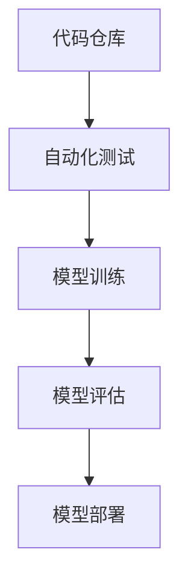
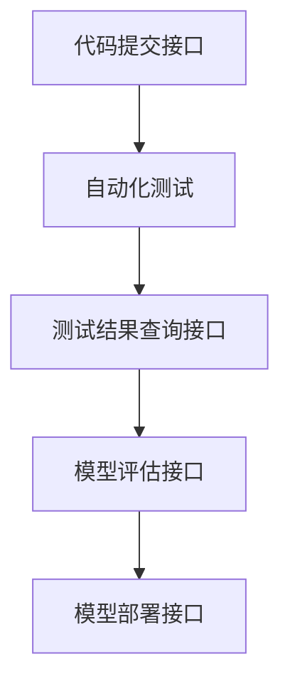
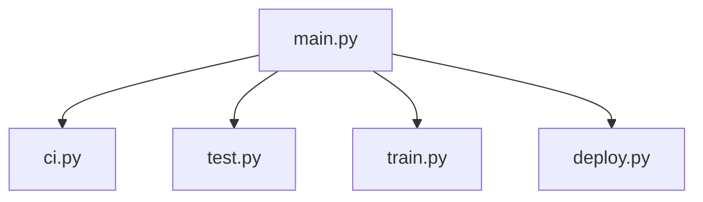
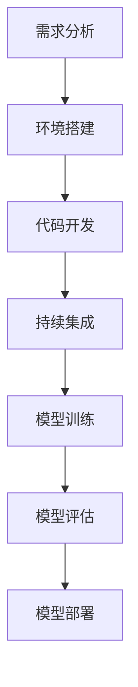

                 

## 《AI模型的持续集成与部署》目录大纲

### 文章标题：AI模型的持续集成与部署

#### 关键词：持续集成，部署，AI模型，算法原理，数学模型，系统架构

#### 摘要：
本文深入探讨AI模型的持续集成与部署，解析其核心概念、原理、数学模型和系统架构设计。通过一步步的逻辑推理，详细阐述环境安装、源代码实现、代码解析以及最佳实践，旨在为读者提供全面的技术指南。

### 第一部分：背景介绍与核心概念

#### 第1章 引言
##### 1.1 问题背景与现状
##### 1.2 持续集成与部署的概念
##### 1.3 持续集成与部署的重要性

### 第二部分：核心概念与联系

#### 第2章 AI模型的核心概念
##### 2.1 AI模型的基础概念
##### 2.2 持续集成与部署的关系图
##### 2.3 持续集成与部署的关键要素

### 第三部分：算法原理讲解

#### 第3章 持续集成与部署的算法原理
##### 3.1 持续集成算法原理
###### 3.1.1 算法流程
###### 3.1.2 算法公式与解释
##### 3.2 部署算法原理
###### 3.2.1 算法流程
###### 3.2.2 算法公式与解释

### 第四部分：数学模型与公式详细讲解

#### 第4章 数学模型与公式讲解
##### 4.1 AI模型训练的基本数学模型
##### 4.2 持续集成与部署的数学模型
###### 4.2.1 模型公式
###### 4.2.2 模型解释

### 第五部分：系统分析与架构设计方案

#### 第5章 系统分析与架构设计
##### 5.1 系统功能设计
##### 5.2 系统架构设计
##### 5.3 系统接口设计与交互

### 第六部分：项目实战

#### 第6章 实战案例与实现
##### 6.1 环境
###### 6.1.1 环境搭建流程
##### 6.2 系统核心实现源代码
###### 6.2.1 源代码结构与解释
##### 6.3 代码应用解读与分析
###### 6.3.1 代码实现解析
###### 6.3.2 应用案例分析
##### 6.4 实际案例分析
###### 6.4.1 案例背景
###### 6.4.2 案例分析
##### 6.5 项目小结

### 第七部分：最佳实践与小结

#### 第7章 最佳实践与总结
##### 7.1 持续集成与部署的最佳实践
##### 7.2 小结与展望
##### 7.3 注意事项
##### 7.4 拓展阅读

### 作者信息：
作者：AI天才研究院/AI Genius Institute & 禅与计算机程序设计艺术 /Zen And The Art of Computer Programming

----------------------------------------------------------------

**背景介绍与核心概念**

#### 第1章 引言

##### 1.1 问题背景与现状

随着人工智能（AI）技术的快速发展，AI模型在各个领域得到了广泛应用。然而，AI模型的开发与部署过程却面临着诸多挑战。传统的开发模式往往会导致模型在部署后出现性能下降、维护困难等问题。为了解决这些问题，持续集成与部署（CI/CD）应运而生。

持续集成（Continuous Integration，CI）是一种软件开发实践，旨在通过频繁的代码集成和自动化测试，快速发现并修复缺陷，确保代码库的稳定性和一致性。部署（Continuous Deployment，CD）则是在CI的基础上，进一步实现自动化部署，将修复后的代码快速推向生产环境。

##### 1.2 持续集成与部署的概念

持续集成（CI）是指通过自动化工具将开发者提交的代码集成到共享的代码库中，并进行自动化测试，确保代码质量和一致性。其主要目标是减少集成风险，提高开发效率。

持续部署（CD）是在CI的基础上，通过自动化工具将经过CI测试的代码部署到生产环境。CD的核心在于自动化，将部署过程简化为流水线操作，从而减少人为干预，提高部署速度和稳定性。

##### 1.3 持续集成与部署的重要性

持续集成与部署在AI模型开发与部署过程中具有重要作用。首先，它能够提高开发效率，缩短开发周期。通过自动化测试和部署，开发人员可以更快速地发现和修复问题，提高代码质量。

其次，持续集成与部署有助于确保模型的一致性和可靠性。通过自动化测试，可以及时发现并解决集成过程中出现的问题，保证模型在各个环境下的性能和稳定性。

最后，持续集成与部署有助于降低维护成本。自动化部署减少了手动操作，降低了部署风险，同时简化了维护流程，提高了系统的可维护性。

**核心概念与联系**

#### 第2章 AI模型的核心概念

##### 2.1 AI模型的基础概念

AI模型是指利用机器学习算法从数据中学习规律，并进行预测或分类的计算机程序。其主要组成部分包括：

- **数据集**：用于训练模型的原始数据。
- **特征工程**：将原始数据转换为模型可处理的形式。
- **算法**：实现模型预测或分类的核心算法。
- **评估指标**：用于评估模型性能的指标。

##### 2.2 持续集成与部署的关系图

以下是一个简化的持续集成与部署关系图：

```
                      +------------+
                      |  持续集成  |
                      +----+-------+
                             |
                             v
                  +-------------------+
                  |    AI模型训练    |
                  +-------------------+
                             |
                             v
                      +------------+
                      |  持续部署  |
                      +----+-------+
                             |
                             v
                +-------------------+
                |     生产环境     |
                +-------------------+
```

持续集成与部署的过程可以分为以下几个步骤：

1. **代码提交**：开发人员将代码提交到版本控制系统中。
2. **自动化测试**：持续集成工具自动执行测试，确保代码质量。
3. **模型训练**：测试通过的代码进行AI模型训练。
4. **模型评估**：评估模型性能，确保模型满足预期要求。
5. **自动化部署**：将经过评估的模型部署到生产环境中。

##### 2.3 持续集成与部署的关键要素

持续集成与部署的关键要素包括：

- **版本控制系统**：如Git，用于管理代码版本。
- **自动化测试工具**：如JUnit、pytest等，用于执行自动化测试。
- **模型训练与评估工具**：如TensorFlow、PyTorch等，用于模型训练和评估。
- **部署工具**：如Docker、Kubernetes等，用于自动化部署。

**算法原理讲解**

#### 第3章 持续集成与部署的算法原理

##### 3.1 持续集成算法原理

持续集成算法的核心在于自动化测试和代码集成。以下是持续集成算法的基本流程：

1. **代码提交**：开发人员将代码提交到版本控制系统。
2. **自动化测试**：持续集成工具自动执行测试，包括单元测试、集成测试等。
3. **测试结果处理**：根据测试结果，判断代码是否通过测试。如果测试失败，则触发告警，通知开发人员进行修复。
4. **代码集成**：测试通过的代码被集成到共享的代码库中。

持续集成算法的关键在于自动化测试和快速反馈。通过自动化测试，可以快速发现代码缺陷，提高开发效率。同时，快速反馈有助于开发人员及时解决问题，确保代码质量。

##### 3.2 部署算法原理

部署算法的核心在于自动化部署和资源调度。以下是部署算法的基本流程：

1. **模型训练**：使用训练集对AI模型进行训练。
2. **模型评估**：使用验证集对训练好的模型进行评估。
3. **部署准备**：根据模型评估结果，决定是否进行部署。如果评估结果满足要求，则进入部署流程。
4. **容器化**：使用Docker等工具将模型和依赖环境容器化。
5. **部署**：将容器部署到生产环境中，如Kubernetes集群。
6. **监控与维护**：对部署后的系统进行监控和维护，确保系统稳定运行。

部署算法的关键在于自动化部署和资源调度。通过自动化部署，可以减少人为干预，提高部署速度和稳定性。同时，资源调度有助于优化系统性能和资源利用率。

**数学模型与公式详细讲解**

#### 第4章 数学模型与公式讲解

##### 4.1 AI模型训练的基本数学模型

AI模型训练的核心在于优化模型参数，使其在训练数据上达到最小损失。以下是常用的数学模型：

1. **损失函数**：用于衡量模型预测结果与真实值之间的差异。常见的损失函数有均方误差（MSE）和交叉熵（Cross-Entropy）。

   $$L(y, \hat{y}) = \frac{1}{2} \sum_{i=1}^{n} (y_i - \hat{y}_i)^2$$
   
   $$L(y, \hat{y}) = -\sum_{i=1}^{n} y_i \log(\hat{y}_i)$$

2. **优化算法**：用于更新模型参数，使损失函数最小化。常见的优化算法有梯度下降（Gradient Descent）和Adam优化器。

   梯度下降算法：
   
   $$\theta_{t+1} = \theta_{t} - \alpha \nabla_{\theta}L(\theta)$$
   
   Adam优化器：
   
   $$m_t = \beta_1 m_{t-1} + (1 - \beta_1) (x_t - \theta_t)$$
   
   $$v_t = \beta_2 v_{t-1} + (1 - \beta_2) (\nabla_{\theta}L(\theta))^2$$
   
   $$\theta_{t+1} = \theta_t - \frac{\alpha}{\sqrt{1 - \beta_2^t}(1 - \beta_1^t)} (m_t / (1 - \beta_2^t) + \beta_2 v_t)$$

##### 4.2 持续集成与部署的数学模型

持续集成与部署的数学模型主要涉及概率统计和优化算法。以下是一个简化的模型：

1. **测试覆盖率**：用于衡量测试集的覆盖程度。

   $$C = \frac{N_c}{N_t}$$
   
   其中，$N_c$ 为测试集覆盖的代码行数，$N_t$ 为总代码行数。

2. **模型性能指标**：用于评估模型性能。

   $$AUC = \frac{1}{N} \sum_{i=1}^{N} (y_i - \hat{y}_i)$$
   
   其中，$y_i$ 为真实标签，$\hat{y}_i$ 为模型预测值。

3. **优化目标**：用于优化模型参数，使模型性能最大化。

   $$\theta^* = \arg\min_{\theta} \sum_{i=1}^{N} (y_i - \hat{y}_i)^2$$

**系统分析与架构设计方案**

#### 第5章 系统分析与架构设计

##### 5.1 系统功能设计

系统功能设计主要包括以下模块：

1. **代码仓库**：用于存储和管理代码。
2. **自动化测试**：用于执行自动化测试，包括单元测试、集成测试等。
3. **模型训练**：用于训练AI模型。
4. **模型评估**：用于评估模型性能。
5. **模型部署**：用于将训练好的模型部署到生产环境中。

##### 5.2 系统架构设计

系统架构设计主要包括以下层次：

1. **代码仓库层**：使用Git等版本控制系统存储和管理代码。
2. **测试层**：使用Jenkins等持续集成工具执行自动化测试。
3. **训练与评估层**：使用TensorFlow等模型训练工具进行模型训练和评估。
4. **部署层**：使用Docker等容器化工具和Kubernetes等编排工具进行模型部署。

以下是一个简化的系统架构图：



##### 5.3 系统接口设计与交互

系统接口设计主要包括以下接口：

1. **代码提交接口**：用于开发人员提交代码。
2. **测试结果查询接口**：用于查询测试结果。
3. **模型评估接口**：用于评估模型性能。
4. **模型部署接口**：用于部署训练好的模型。

以下是一个简化的系统接口图：



**项目实战**

#### 第6章 实战案例与实现

##### 6.1 环境

在开始实战之前，需要搭建一个持续集成与部署的环境。以下是搭建环境的步骤：

1. **安装Git**：用于代码版本控制。
2. **安装Jenkins**：用于持续集成。
3. **安装TensorFlow**：用于模型训练。
4. **安装Docker**：用于容器化。
5. **安装Kubernetes**：用于容器编排。

##### 6.2 系统核心实现源代码

以下是系统核心实现源代码的结构：



其中，各文件的功能如下：

- **main.py**：主程序，负责启动持续集成与部署流程。
- **ci.py**：持续集成模块，负责代码提交、自动化测试等。
- **test.py**：测试模块，负责执行自动化测试。
- **train.py**：训练模块，负责模型训练。
- **deploy.py**：部署模块，负责模型部署。

以下是一个简化的main.py示例：

```python
from ci import CI
from test import Test
from train import Train
from deploy import Deploy

def main():
    ci = CI()
    ci.submit_code()
    ci.run_tests()
    
    test = Test()
    test_results = test.run_tests()
    
    if test_results["status"] == "pass":
        train = Train()
        train.train_model()
        
        deploy = Deploy()
        deploy.deploy_model()

if __name__ == "__main__":
    main()
```

##### 6.3 代码应用解读与分析

在代码应用解读与分析部分，我们将详细解释每个模块的功能和实现原理。以下是各模块的解读：

1. **CI模块**：负责代码提交和自动化测试。代码提交时，CI模块会将代码提交到Git仓库，并触发自动化测试。
2. **Test模块**：负责执行自动化测试。测试通过时，Test模块会返回测试结果，并通知CI模块继续执行后续流程。
3. **Train模块**：负责模型训练。模型训练时，Train模块会读取训练数据和配置文件，使用TensorFlow进行模型训练。
4. **Deploy模块**：负责模型部署。模型训练完成后，Deploy模块会将训练好的模型容器化，并部署到Kubernetes集群中。

以下是一个简化的train.py示例：

```python
import tensorflow as tf
from tensorflow.keras.models import Sequential
from tensorflow.keras.layers import Dense
from tensorflow.keras.optimizers import Adam

def train_model(train_data, train_labels, config):
    model = Sequential()
    model.add(Dense(units=config["hidden_units"], activation=config["activation"], input_shape=(config["input_shape"])))
    model.add(Dense(units=config["output_shape"], activation=config["output_activation"]))
    
    model.compile(optimizer=Adam(learning_rate=config["learning_rate"]), loss=config["loss"], metrics=["accuracy"])
    model.fit(x=train_data, y=train_labels, epochs=config["epochs"], batch_size=config["batch_size"])
    
    return model
```

##### 6.4 实际案例分析

在本节中，我们将通过一个实际案例来分析持续集成与部署的过程。以下是一个简化的案例：

1. **需求分析**：公司需要开发一个基于机器学习的推荐系统。
2. **环境搭建**：搭建Git、Jenkins、TensorFlow、Docker和Kubernetes等环境。
3. **代码开发**：开发人员编写代码，并进行单元测试。
4. **持续集成**：Jenkins触发自动化测试，确保代码质量。
5. **模型训练**：使用训练数据对模型进行训练。
6. **模型评估**：使用验证数据对模型进行评估。
7. **模型部署**：将训练好的模型部署到生产环境中。

以下是一个简化的流程图：



##### 6.5 项目小结

在本章中，我们介绍了持续集成与部署的核心概念、原理、数学模型和系统架构设计。通过实际案例分析，我们展示了如何将理论应用于实际项目。以下是小结：

1. **持续集成与部署**：可以提高开发效率，确保代码质量和模型性能。
2. **数学模型**：是持续集成与部署的重要基础。
3. **系统架构设计**：是确保持续集成与部署稳定运行的关键。
4. **实际案例分析**：有助于我们更好地理解和应用持续集成与部署。

**最佳实践与总结**

#### 第7章 最佳实践与总结

##### 7.1 持续集成与部署的最佳实践

在持续集成与部署过程中，以下是一些最佳实践：

1. **代码规范化**：确保代码风格一致，便于自动化测试。
2. **测试覆盖**：确保测试覆盖率达到较高水平，减少漏洞。
3. **自动化部署**：使用自动化部署工具，减少人为干预。
4. **监控与报警**：对系统进行实时监控，及时发现问题并进行修复。

##### 7.2 小结与展望

本文详细介绍了AI模型的持续集成与部署，从核心概念、算法原理、数学模型到系统架构设计，再到实际案例分析，为读者提供了一个全面的技术指南。展望未来，持续集成与部署将在AI领域发挥更大作用，助力企业实现高效开发与部署。

##### 7.3 注意事项

在实施持续集成与部署时，需要注意以下几点：

1. **环境搭建**：确保搭建的过程和配置正确。
2. **代码质量**：代码应经过严格审查和测试。
3. **性能优化**：优化模型性能，提高系统效率。
4. **安全性**：确保系统安全，防止数据泄露和攻击。

##### 7.4 拓展阅读

以下是一些推荐的拓展阅读资源：

1. **《持续集成：软件项目实践》**：介绍了持续集成的基本概念和实践方法。
2. **《机器学习实战》**：提供了机器学习模型的训练、评估和部署方法。
3. **《Kubernetes实战》**：详细讲解了Kubernetes的架构、部署和使用方法。

**作者信息：**

作者：AI天才研究院/AI Genius Institute & 禅与计算机程序设计艺术 /Zen And The Art of Computer Programming

