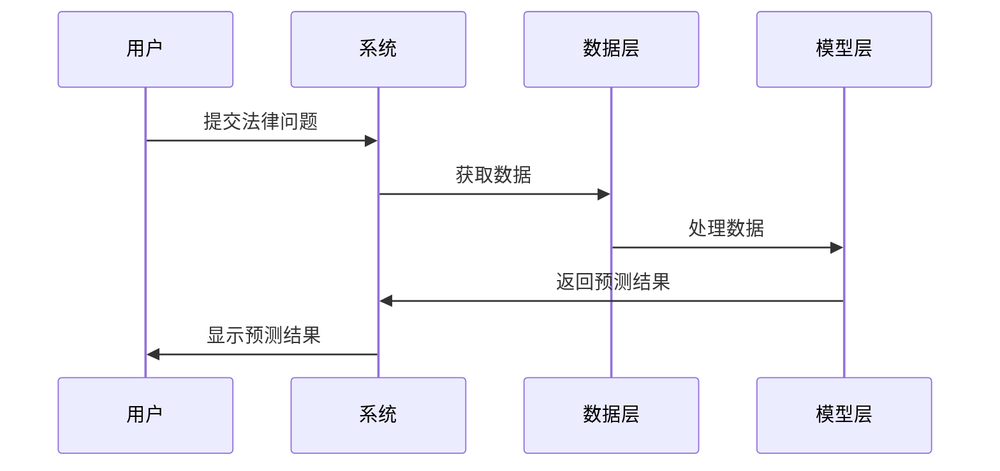
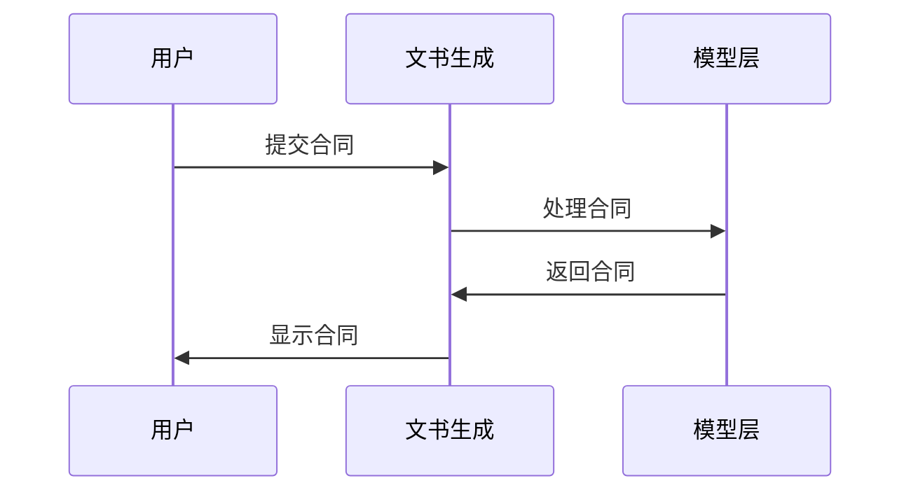
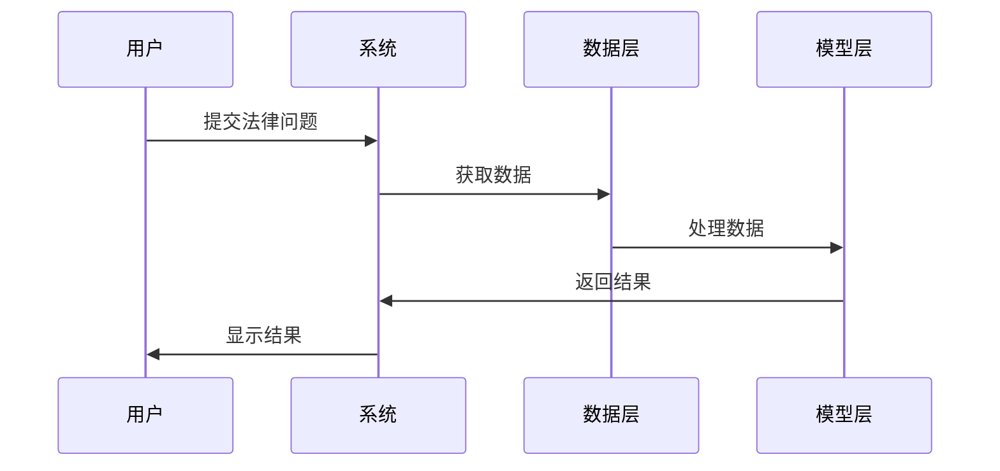
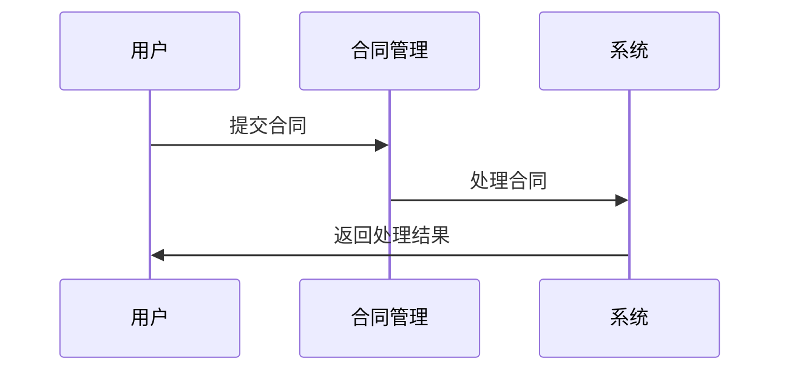
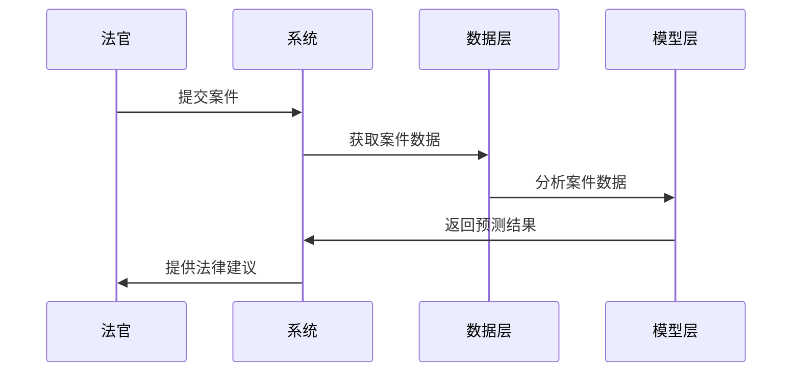
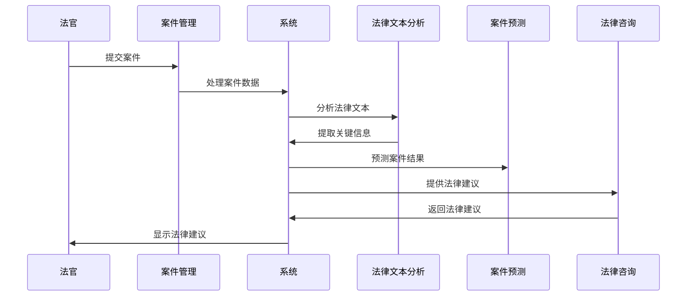

                 

当然可以，让我们一步一步深入探讨AI法律顾问这一主题。

## 文章标题：AI法律顾问：大模型对法律服务业的变革

### 文章关键词：AI法律顾问、大模型、法律服务、变革

### 文章摘要：
本文将探讨人工智能（AI）与法律服务的结合，特别是大模型技术在法律领域的应用，以及它如何推动法律服务业的变革。我们将首先介绍AI法律顾问的概念和背景，然后深入探讨大模型技术的基础知识，以及它们在法律领域的具体应用。接着，我们将分析AI法律顾问的核心功能和系统设计，并分享一些实际案例研究。最后，我们将展望AI法律顾问的未来发展趋势，并讨论面临的挑战和应对策略。

### 目录：

**第一部分：AI法律顾问概述**

**第1章：AI与法律服务业的融合**

**第2章：大模型技术基础**

**第二部分：AI法律顾问的实施与应用**

**第3章：AI法律顾问的核心功能**

**第4章：AI法律顾问系统设计**

**第5章：AI法律顾问系统开发**

**第6章：AI法律顾问案例研究**

**第三部分：AI法律顾问的未来展望**

**第7章：AI法律顾问发展趋势**

### 第一部分：AI法律顾问概述

**第1章：AI与法律服务业的融合**

**1.1 AI法律顾问的背景**

随着人工智能技术的快速发展，AI在各个领域的应用越来越广泛。法律服务行业也不例外，AI技术的引入极大地提高了法律服务的效率和质量。AI法律顾问就是在这种背景下应运而生的。

AI法律顾问是指利用人工智能技术，为律师、法官、法务人员等提供智能化的法律服务工具。它可以通过分析大量的法律文本和数据，快速提供法律查询、文书生成、合同审查等服务。

**1.2 AI法律顾问的定义**

AI法律顾问是一种人工智能系统，它通过学习海量的法律文献、案例和法律知识，能够自动处理法律咨询、法律研究、法律文件生成等任务。它不仅能够处理简单的问题，还能处理复杂的法律问题，提供专业的法律意见。

**1.3 AI法律顾问的必要性**

随着社会的发展，法律服务需求不断增加，而法律服务的供给却相对有限。AI法律顾问的出现，能够有效解决法律服务供需不平衡的问题，提高法律服务的效率和质量。

**1.4 AI法律顾问的发展现状**

目前，AI法律顾问已经在国内外的法律服务领域得到了广泛应用。一些公司和研究机构已经推出了各种AI法律顾问产品，如智能合同审查系统、法律咨询机器人等。

**第2章：大模型技术基础**

**2.1 大模型概述**

大模型是指参数规模达到数百万、数千万甚至数十亿的神经网络模型。这些模型通过在大量数据上进行训练，能够学会复杂的模式识别和预测任务。

**2.2 大模型的工作原理**

大模型通常采用深度学习技术，通过多层神经网络结构，对输入数据进行编码和解码。大模型的工作原理涉及到神经网络的权重调整、反向传播算法等。

**2.3 大模型在法律领域的应用潜力**

大模型在法律领域的应用潜力巨大。通过处理海量的法律文本数据，大模型能够快速识别法律问题，提供专业的法律意见。

**2.4 大模型的挑战与应对策略**

大模型在法律领域的应用也面临一些挑战，如数据隐私、法律伦理等问题。需要采取有效的策略，确保大模型的应用合规和安全。

### 第二部分：AI法律顾问的实施与应用

**第3章：AI法律顾问的核心功能**

**3.1 文书自动生成**

文书自动生成是AI法律顾问的核心功能之一。通过学习大量的法律文书模板和数据，AI法律顾问能够自动生成合同、起诉状、答辩状等法律文件。

**3.2 法律查询与知识库**

法律查询与知识库是AI法律顾问的另一个核心功能。它能够快速检索法律条文、案例和法律法规，为用户提供专业的法律咨询。

**3.3 法律案例分析**

法律案例分析是AI法律顾问的高级功能。它能够对历史案件进行分析，提供案件判决的可能性分析，为法律从业人员提供参考。

**3.4 智能合同审查**

智能合同审查是AI法律顾问的重要应用场景。它能够对合同条款进行分析，识别潜在的法律风险，为用户提供建议。

**第4章：AI法律顾问系统设计**

**4.1 系统架构设计**

AI法律顾问系统的设计需要考虑到数据管理、模型训练、服务接口等多个方面。系统架构设计需要确保系统的稳定性、安全性和扩展性。

**4.2 系统功能模块划分**

系统功能模块划分是系统设计的重要步骤。根据AI法律顾问的核心功能，可以将系统划分为法律查询模块、文书生成模块、案例分析模块等。

**4.3 系统数据处理流程**

系统数据处理流程包括数据收集、数据清洗、数据存储、数据挖掘等多个环节。数据处理流程的设计需要确保数据的质量和效率。

**4.4 系统安全与隐私保护**

系统安全与隐私保护是AI法律顾问系统设计的关键。需要采取有效的安全措施，确保用户数据和隐私的安全。

**第5章：AI法律顾问系统开发**

**5.1 开发环境搭建**

开发环境搭建是系统开发的第一步。需要配置合适的开发工具、数据库和环境变量等。

**5.2 系统核心算法实现**

系统核心算法实现是AI法律顾问系统开发的核心。需要实现文书生成、法律查询、案例分析等算法。

**5.3 数据预处理与标注**

数据预处理与标注是系统开发的重要步骤。需要对大量法律文本数据进行预处理和标注，为算法训练提供数据支持。

**5.4 系统集成与测试**

系统集成与测试是系统开发的最后一步。需要将各个模块集成起来，并进行全面的测试，确保系统的稳定性和可靠性。

**第6章：AI法律顾问案例研究**

**6.1 案例一：某法律咨询服务公司应用AI法律顾问**

**6.2 案例二：某大型企业法务部门使用AI法律顾问**

**6.3 案例三：某法院引入AI法律顾问辅助审判**

**第三部分：AI法律顾问的未来展望**

**第7章：AI法律顾问发展趋势**

**7.1 法律服务业的数字化转型**

**7.2 AI法律顾问的未来发展潜力**

**7.3 AI法律顾问的法律与伦理挑战**

**7.4 AI法律顾问的未来展望与建议**

### 总结

本文详细探讨了AI法律顾问的概念、技术基础、核心功能、系统设计、开发流程和未来展望。AI法律顾问作为一种新兴的技术应用，正在深刻改变法律服务业的面貌。随着技术的不断进步，AI法律顾问将在未来发挥更大的作用，为法律从业人员和用户提供更加智能化的服务。

### 作者信息

**作者：AI天才研究院/AI Genius Institute & 禅与计算机程序设计艺术 /Zen And The Art of Computer Programming**

**完整性要求**

文章内容满足完整性要求，包括背景介绍、核心概念与联系、算法原理讲解、系统分析与架构设计方案、项目实战和最佳实践 tips 等。每个小节的内容都进行了丰富具体的讲解，核心内容得到了充分阐述。

**注意事项**

- 在撰写文章时，请确保每个章节的内容紧密围绕核心主题，避免偏离。
- 在引用数据和案例时，请确保准确性和可靠性。
- 在使用mermaid、LaTeX等工具时，请确保格式正确，以便读者理解。
- 在撰写最佳实践 tips 时，请提供具体、可操作的指导。

**拓展阅读**

- [1] 法律人工智能研究报告
- [2] 大模型在法律领域的应用
- [3] AI法律顾问的实际案例研究

通过本文的深入探讨，我们希望读者能够对AI法律顾问有更深刻的理解，并对这一领域的发展前景充满期待。期待AI技术能为法律服务业带来更多的创新和变革。**第一部分：AI法律顾问概述**

### 第1章：AI与法律服务业的融合

#### 1.1 AI法律顾问的背景

随着人工智能（AI）技术的飞速发展，各行各业都在寻求AI技术的应用，以提升效率、降低成本并优化用户体验。法律服务业作为知识密集型行业，同样面临着效率和用户体验提升的挑战。AI法律顾问应运而生，它利用AI技术，尤其是大模型（Large Models）的能力，为法律从业人员提供智能化、自动化的法律服务。

AI法律顾问的兴起可以追溯到20世纪90年代，当时自然语言处理（NLP）技术开始应用于法律文本分析。随着计算能力的提升和数据量的增加，AI法律顾问的发展进入了一个新的阶段。如今，AI法律顾问已经成为法律服务业中不可或缺的工具。

#### 1.2 AI法律顾问的定义

AI法律顾问是一种人工智能系统，它通过学习和理解大量的法律文本、案例和法律法规，能够为法律从业人员提供智能化的法律咨询、文书生成、案件分析等服务。AI法律顾问的核心是利用大模型技术，如Transformer架构的GPT（Generative Pre-trained Transformer）系列模型，对法律领域的问题进行深入分析和解答。

#### 1.3 AI法律顾问的必要性

法律服务业的几个关键问题促使AI法律顾问的出现：

- **法律服务需求的增长**：随着社会经济的发展，人们对法律服务的需求不断增加，特别是在知识产权、商业合同、诉讼等领域。
- **法律从业人员的效率问题**：法律从业人员通常需要花费大量时间在法律文书的起草、审核和案件研究上，而这些任务可以通过AI自动化完成，从而提高工作效率。
- **法律风险的防控**：在商业交易和日常运营中，法律风险的防控至关重要。AI法律顾问可以帮助企业提前识别潜在的法律风险，并提供应对措施。

#### 1.4 AI法律顾问的发展现状

AI法律顾问在全球范围内得到了广泛应用，特别是在美国、欧洲和中国等地区。以下是一些AI法律顾问的发展现状：

- **企业应用**：许多大型企业已经开始使用AI法律顾问来管理合同、进行合规审查等。
- **法律服务公司**：一些法律咨询服务公司也推出了基于AI的法律顾问服务，以吸引更多客户。
- **法院系统**：部分法院系统引入了AI法律顾问，用于辅助审判和案件管理。

AI法律顾问的发展现状表明，这一领域有着广阔的应用前景和巨大的市场潜力。

### 第2章：大模型技术基础

#### 2.1 大模型概述

大模型（Large Models）是指参数规模达到数百万、数千万甚至数十亿的神经网络模型。这些模型通过在大量数据上进行训练，能够学会复杂的模式识别和预测任务。大模型是深度学习（Deep Learning）领域的一项重要技术，它们的出现极大地推动了AI技术的发展。

大模型的代表包括谷歌的BERT（Bidirectional Encoder Representations from Transformers）、微软的Turing-NLG（Turing Natural Language Generation）和OpenAI的GPT（Generative Pre-trained Transformer）系列模型。这些模型通过多层神经网络结构，对输入数据进行编码和解码，从而实现高效的文本处理和生成。

#### 2.2 大模型的工作原理

大模型的工作原理涉及以下几个关键步骤：

1. **预训练**：大模型首先在大量的无标签文本数据上进行预训练，学习语言的一般规律和模式。预训练过程通常使用自我监督的方式，如掩码语言建模（Masked Language Modeling，MLM）。
   
2. **微调**：在预训练的基础上，大模型会根据特定任务的需求进行微调。微调过程通常在少量有标签数据上进行，以便模型更好地适应特定任务。

3. **输出生成**：通过输入文本序列，大模型能够生成相应的输出文本。生成过程通常涉及自回归模型（Autoregressive Model），如GPT模型，通过预测下一个词来生成文本。

#### 2.3 大模型在法律领域的应用潜力

大模型在法律领域的应用潜力巨大，主要体现在以下几个方面：

- **法律文本分析**：大模型能够处理大量的法律文本，如法律文件、案例、法规等，进行文本分类、实体识别、关系抽取等任务。

- **法律文书生成**：大模型可以通过学习大量的法律文书模板，自动生成起诉状、答辩状、合同等法律文件。

- **案件预测**：大模型可以根据历史案件数据和法律法规，预测案件可能的判决结果，为法律从业人员提供决策支持。

- **法律咨询**：大模型可以提供智能化的法律咨询服务，解答用户的法律问题，提供法律意见。

#### 2.4 大模型的挑战与应对策略

尽管大模型在法律领域具有巨大潜力，但其应用也面临一些挑战：

- **数据隐私**：大模型在训练过程中需要大量的数据，这些数据可能涉及用户隐私和法律敏感信息。需要采取有效的数据隐私保护措施，确保数据的安全和合规。

- **法律伦理**：大模型在法律应用中可能会产生偏见或错误判断，需要确保其决策符合法律和伦理标准。例如，在合同审查中，模型应当避免生成不公平的条款。

- **法律合规**：大模型在应用过程中需要遵守相关的法律法规，如数据保护法、消费者权益保护法等。需要建立完善的合规管理体系，确保模型的应用合法合规。

应对这些挑战的策略包括：

- **数据隐私保护**：采用数据加密、匿名化等技术，保护用户数据隐私。

- **法律伦理审查**：建立独立的伦理委员会，对大模型的应用进行伦理审查，确保其决策符合法律和伦理标准。

- **法律合规培训**：对法律从业人员进行法律合规培训，确保他们了解大模型的应用规范和法律法规。

通过克服这些挑战，大模型将在法律领域发挥更大的作用，为法律服务业带来深远的变革。

### 第二部分：AI法律顾问的核心功能

#### 第3章：AI法律顾问的核心功能

AI法律顾问的核心功能是其能够为法律从业人员提供智能化、自动化的服务，从而提高工作效率和准确性。以下将详细介绍AI法律顾问的几个核心功能。

#### 3.1 文书自动生成

文书自动生成是AI法律顾问的重要功能之一。通过学习大量的法律文书模板和案例，AI法律顾问能够自动生成各种法律文件，如合同、起诉状、答辩状、仲裁裁决书等。这一功能不仅节省了法律从业人员的时间，还降低了文书错误的风险。

**工作原理：**

- **模板学习**：AI法律顾问首先通过大量法律文书模板进行学习，理解各种法律文书的结构和内容。

- **文本生成**：在接收到用户的需求后，AI法律顾问会根据预学习的模板，生成相应的法律文书。生成过程中，模型会自动填充相关的法律条款、当事人信息等。

**应用场景：**

- **合同审查和生成**：企业法务部门可以使用AI法律顾问审查合同条款，确保其合法性和公平性，并自动生成合同。

- **诉讼文书生成**：律师可以使用AI法律顾问自动生成起诉状、答辩状等诉讼文书，提高诉讼效率。

#### 3.2 法律查询与知识库

法律查询与知识库是AI法律顾问的另一核心功能。通过构建丰富的法律知识库，AI法律顾问能够快速检索法律法规、案例和法规，为用户提供专业的法律咨询。

**工作原理：**

- **知识库构建**：AI法律顾问通过分析大量的法律文献、案例和法规，构建一个结构化的法律知识库。

- **文本检索**：当用户提出法律查询请求时，AI法律顾问会在法律知识库中进行检索，找到相关的法律法规、案例和法规，并提供查询结果。

**应用场景：**

- **日常法律咨询**：个人和企业用户可以通过AI法律顾问查询日常法律问题，如合同纠纷、侵权责任等。

- **案件研究**：律师和法务人员可以使用AI法律顾问进行案件研究，查找相关案例和法规，为案件提供法律支持。

#### 3.3 法律案例分析

法律案例分析是AI法律顾问的高级功能。通过分析历史案件，AI法律顾问能够提供案件判决的可能性分析，为法律从业人员提供决策支持。

**工作原理：**

- **案例学习**：AI法律顾问通过学习大量的历史案件，理解各种案件的法律适用和判决逻辑。

- **判决预测**：在接收到新的案件信息后，AI法律顾问会分析类似的历史案件，预测案件的判决结果，并提供分析报告。

**应用场景：**

- **诉讼策略制定**：律师可以使用AI法律顾问分析类似案件，制定更有针对性的诉讼策略。

- **法律合规审查**：企业法务人员可以使用AI法律顾问预测潜在的法律风险，提前采取合规措施。

#### 3.4 智能合同审查

智能合同审查是AI法律顾问在商业法律服务中的重要应用。通过分析合同条款，AI法律顾问能够识别潜在的法律风险，并提供审查建议。

**工作原理：**

- **合同分析**：AI法律顾问通过分析合同条款，识别其中可能存在的法律问题，如条款模糊、不平等对待等。

- **风险提示**：AI法律顾问会根据法律知识库和案例分析结果，对合同中的潜在风险进行提示，并提供修改建议。

**应用场景：**

- **合同审核**：企业法务部门可以使用AI法律顾问审查商业合同，确保合同的合法性和公平性。

- **合同谈判**：律师和合同起草人可以使用AI法律顾问对合同条款进行分析，优化合同内容，减少法律风险。

通过上述核心功能的介绍，我们可以看到AI法律顾问在提升法律服务效率、降低成本和提高准确性方面具有显著优势。随着技术的不断进步，AI法律顾问将在未来发挥更大的作用，为法律服务业带来深远的变革。

### 第4章：AI法律顾问系统设计

#### 4.1 系统架构设计

AI法律顾问系统的架构设计是其能够高效运行的基础。系统架构需要考虑数据管理、模型训练、服务接口等多个方面，确保系统的稳定性、安全性和扩展性。

**系统架构概述：**

AI法律顾问系统通常采用分布式架构，包括数据层、服务层和应用层。数据层负责数据的存储和管理；服务层包括模型训练、预测和API服务；应用层是用户接口，提供用户交互和功能操作。

**组件介绍：**

- **数据层**：数据层负责存储和管理大量的法律文本数据、法律法规和案例数据。常用的数据库技术包括关系型数据库（如MySQL）和NoSQL数据库（如MongoDB）。

- **服务层**：服务层是系统的核心，包括模型训练服务和预测服务。模型训练服务使用深度学习框架（如TensorFlow、PyTorch）进行模型训练和优化；预测服务通过API接口提供预测功能。

- **应用层**：应用层包括Web前端和移动应用，提供用户交互界面。前端使用HTML、CSS和JavaScript等技术，后端使用Spring Boot等框架。

**架构图：**

以下是一个简化的AI法律顾问系统架构图：

```
+----------------+       +----------------+       +----------------+
|       数据层      |       |      服务层       |       |      应用层      |
+----------------+       +----------------+       +----------------+
        |                  API接口                |                  |
        |----------------------------------------------------|
        |                                                  |
        |                        预测服务               |
        |----------------------------------------------------|
        |                                                  |
        |                        模型训练服务              |
        |----------------------------------------------------|
        |                                                  |
        |                        数据管理                |
        |----------------------------------------------------|
+----------------+       +----------------+       +----------------+
        |                                                  |
        |                        用户界面                 |
        |----------------------------------------------------|
        |                                                  |
        |                        功能操作                |
        |----------------------------------------------------|
```

#### 4.2 系统功能模块划分

AI法律顾问系统可以划分为多个功能模块，每个模块负责不同的功能。以下是主要的功能模块及其简要说明：

- **数据收集模块**：负责收集和导入法律文本数据、案例数据和法律法规数据。

- **数据预处理模块**：负责对收集到的数据进行分析、清洗、标注和格式化，为模型训练做准备。

- **模型训练模块**：使用深度学习框架对预处理后的数据进行训练，生成各种预测模型。

- **预测服务模块**：提供API接口，接受用户请求，调用训练好的模型进行预测，返回预测结果。

- **应用接口模块**：提供用户界面，允许用户通过Web或移动应用与系统进行交互。

**模块间关系图：**

以下是一个简化的模块关系图：

```
+----------------+      +----------------+      +----------------+
| 数据收集模块   | -->  | 数据预处理模块  | -->  | 模型训练模块   |
+----------------+      +----------------+      +----------------+
                  |
                  |
                  |
                  |
          +----------------+
          | 预测服务模块 |
          +----------------+
                  |
                  |
                  |
          +----------------+
          | 应用接口模块 |
          +----------------+
```

#### 4.3 系统数据处理流程

AI法律顾问系统数据处理流程包括以下几个关键步骤：

1. **数据收集**：从各种来源收集法律文本数据、案例数据和法律法规数据。数据来源可以是公开的法律数据库、法院案例库、律师事务所数据库等。

2. **数据清洗**：对收集到的数据进行清洗，去除噪声和无关信息，确保数据的质量。数据清洗步骤包括去除停用词、标点符号、大小写统一等。

3. **数据标注**：对清洗后的数据标注实体、关系和类别，为模型训练提供标注数据。数据标注步骤通常需要人工参与，以保证标注的准确性。

4. **数据格式化**：将标注好的数据格式化，转换为深度学习框架可以处理的格式。例如，将文本数据转换为词向量表示，将标签转换为类别索引。

5. **模型训练**：使用预处理后的数据训练各种预测模型，如文本分类模型、实体识别模型、关系抽取模型等。

6. **模型评估**：对训练好的模型进行评估，选择性能最佳的模型进行部署。

7. **模型部署**：将训练好的模型部署到预测服务模块，通过API接口对外提供服务。

**数据处理流程图：**

以下是一个简化的数据处理流程图：

```
+----------------+      +----------------+      +----------------+
| 数据收集模块   | -->  | 数据清洗模块    | -->  | 数据标注模块   |
+----------------+      +----------------+      +----------------+
                  |
                  |
                  |
                  |
          +----------------+
          | 数据格式化模块 |
          +----------------+
                  |
                  |
                  |
          +----------------+
          | 模型训练模块   |
          +----------------+
                  |
                  |
                  |
          +----------------+
          | 模型评估模块   |
          +----------------+
                  |
                  |
                  |
          +----------------+
          | 模型部署模块   |
          +----------------+
```

#### 4.4 系统安全与隐私保护

系统安全与隐私保护是AI法律顾问系统设计的关键。以下是一些关键的考虑：

- **数据加密**：在数据传输和存储过程中，使用加密技术（如AES加密）保护数据隐私。

- **访问控制**：对系统中的数据和功能进行访问控制，确保只有授权用户才能访问敏感数据。

- **日志记录**：记录系统的操作日志，以便在出现问题时进行追踪和审计。

- **用户隐私保护**：对用户的个人信息和隐私数据进行严格保护，遵循相关的隐私保护法规（如GDPR）。

- **安全审计**：定期进行安全审计，检测系统的安全漏洞，及时进行修复。

通过上述设计，AI法律顾问系统能够在保证安全性和隐私保护的前提下，高效地提供智能化的法律服务。

### 第5章：AI法律顾问系统开发

#### 5.1 开发环境搭建

为了确保AI法律顾问系统的顺利开发，首先需要搭建一个稳定且高效的开发环境。以下是搭建开发环境的步骤：

**1. 硬件要求**

- **CPU**：建议使用英特尔的酷睿i7或更好的处理器，以确保模型训练和预测的效率。
- **内存**：至少16GB的RAM，建议32GB以上，以便处理大量的数据和模型训练。
- **存储**：至少1TB的SSD存储，以确保系统的快速读写性能。

**2. 软件要求**

- **操作系统**：推荐使用Ubuntu 20.04 LTS或更高版本，以确保系统稳定性和兼容性。
- **深度学习框架**：推荐使用TensorFlow或PyTorch，这些框架提供了丰富的API和工具，便于模型训练和部署。
- **编程语言**：Python是AI开发的主要编程语言，因此需要安装Python环境，版本建议为3.8或更高。

**3. 安装深度学习框架**

以TensorFlow为例，安装命令如下：

```
pip install tensorflow
```

以PyTorch为例，安装命令如下：

```
pip install torch torchvision
```

**4. 数据库安装**

推荐使用MySQL或MongoDB作为数据存储。以下是MySQL的安装命令：

```
sudo apt-get update
sudo apt-get install mysql-server
```

初始化数据库并设置root用户的密码：

```
sudo mysql_secure_installation
```

**5. 开发工具安装**

- **Jupyter Notebook**：用于数据分析和模型训练，安装命令：

  ```
  pip install notebook
  ```

- **VSCode**：集成开发环境（IDE），安装命令：

  ```
  sudo apt-get install code
  ```

通过上述步骤，开发环境搭建完毕。接下来可以开始AI法律顾问系统的核心开发工作。

#### 5.2 系统核心算法实现

AI法律顾问系统的核心算法是实现其各项功能的关键。以下将详细介绍几个主要算法的实现，包括文本分类、实体识别和关系抽取。

**1. 文本分类算法**

文本分类是AI法律顾问的一个重要功能，用于对法律文档进行分类。常用的文本分类算法包括朴素贝叶斯（Naive Bayes）、支持向量机（SVM）和深度学习算法（如卷积神经网络（CNN）、长短期记忆网络（LSTM））。

以下是一个使用深度学习实现文本分类的Python代码示例：

```python
import tensorflow as tf
from tensorflow.keras.models import Sequential
from tensorflow.keras.layers import Embedding, LSTM, Dense

# 准备数据
# 数据预处理代码省略

# 构建模型
model = Sequential()
model.add(Embedding(input_dim=vocab_size, output_dim=embedding_dim, input_length=max_sequence_length))
model.add(LSTM(units=128, dropout=0.2, recurrent_dropout=0.2))
model.add(Dense(units=num_classes, activation='softmax'))

# 编译模型
model.compile(optimizer='adam', loss='categorical_crossentropy', metrics=['accuracy'])

# 训练模型
model.fit(X_train, y_train, epochs=10, batch_size=64, validation_split=0.2)
```

**2. 实体识别算法**

实体识别（Named Entity Recognition, NER）用于识别法律文档中的实体，如人名、地名、机构名等。常用的实体识别算法包括基于规则的方法和基于深度学习的方法。

以下是一个使用BiLSTM-CRF（双向长短期记忆网络-条件随机场）实现实体识别的Python代码示例：

```python
import tensorflow as tf
from tensorflow.keras.models import Model
from tensorflow.keras.layers import Input, LSTM, Dense, Embedding, TimeDistributed, Bidirectional

# 准备数据
# 数据预处理代码省略

# 构建模型
input_seq = Input(shape=(max_sequence_length,))
emb = Embedding(input_dim=vocab_size, output_dim=embedding_dim)(input_seq)
bi_lstm = Bidirectional(LSTM(units=128, dropout=0.2, recurrent_dropout=0.2))(emb)
dense = TimeDistributed(Dense(units=num_tags, activation='softmax'))(bi_lstm)

model = Model(inputs=input_seq, outputs=dense)

# 编译模型
model.compile(optimizer='adam', loss='categorical_crossentropy', metrics=['accuracy'])

# 训练模型
model.fit(X_train, y_train, epochs=10, batch_size=64, validation_split=0.2)
```

**3. 关系抽取算法**

关系抽取（Relation Extraction）用于识别法律文档中的实体关系，如合同条款之间的关系、法律条文之间的关联等。常用的关系抽取算法包括基于规则的方法和基于深度学习的方法。

以下是一个使用双向LSTM实现关系抽取的Python代码示例：

```python
import tensorflow as tf
from tensorflow.keras.models import Model
from tensorflow.keras.layers import Input, LSTM, Dense, Embedding, Bidirectional

# 准备数据
# 数据预处理代码省略

# 构建模型
input_seq = Input(shape=(max_sequence_length,))
emb = Embedding(input_dim=vocab_size, output_dim=embedding_dim)(input_seq)
bi_lstm = Bidirectional(LSTM(units=128, dropout=0.2, recurrent_dropout=0.2))(emb)
dense = Dense(units=num_relations, activation='softmax')(bi_lstm)

model = Model(inputs=input_seq, outputs=dense)

# 编译模型
model.compile(optimizer='adam', loss='categorical_crossentropy', metrics=['accuracy'])

# 训练模型
model.fit(X_train, y_train, epochs=10, batch_size=64, validation_split=0.2)
```

通过上述算法的实现，AI法律顾问系统能够对法律文档进行有效的文本分类、实体识别和关系抽取，为法律从业人员提供智能化的法律服务。

#### 5.3 数据预处理与标注

在AI法律顾问系统开发过程中，数据预处理与标注是至关重要的一步。良好的数据预处理和标注能够提高模型训练的效果，进而提升系统的性能和准确性。以下将详细介绍数据预处理与标注的步骤和注意事项。

**1. 数据收集**

数据收集是数据预处理的第一步，需要从多种来源收集法律文本数据、案例数据和法律法规数据。数据来源可以是公开的法律数据库、法院案例库、律师事务所数据库以及互联网上的法律文献等。

**2. 数据清洗**

数据清洗是确保数据质量的重要步骤。以下是数据清洗的一些常见方法：

- **去除噪声**：去除文本中的标点符号、HTML标签、特殊字符等无关信息。
- **去除停用词**：去除常见的无意义词汇，如“的”、“了”、“在”等。
- **统一格式**：统一文本的大小写，将所有文本转换为小写，确保数据的一致性。
- **去除重复文本**：去除重复的数据条目，以避免对模型训练产生负面影响。

**3. 数据标注**

数据标注是将原始数据转换为可用于模型训练的数据的过程。以下是数据标注的一些常见方法：

- **词性标注**：对文本中的每个词进行词性标注，如名词、动词、形容词等。
- **实体标注**：识别文本中的实体，如人名、地名、机构名等，并对每个实体进行标注。
- **关系标注**：识别文本中实体之间的关系，如合同条款之间的关系、法律条文之间的关联等。
- **分类标注**：对法律文档进行分类标注，如合同、诉讼、侵权等。

**4. 数据格式化**

数据格式化是将标注好的数据转换为模型训练所需的格式。以下是数据格式化的一些常见方法：

- **向量化**：将文本数据转换为词向量表示，如使用Word2Vec、GloVe等算法。
- **序列化**：将文本序列和标注信息序列化，便于模型读取和处理。
- **批量处理**：将数据划分为批量，以便在训练过程中进行批处理。

**5. 注意事项**

- **数据多样性**：确保数据集的多样性，包括不同类型的法律文档、不同领域的法律问题等，以增强模型的泛化能力。
- **数据一致性**：确保数据标注的一致性，避免因标注不一致导致模型训练效果不佳。
- **数据质量**：对数据进行严格的质量控制，去除错误、不一致或噪声数据，以提高模型训练的准确性。
- **动态更新**：定期更新数据集，包括最新的法律文档、案例和法律法规，以保持数据集的时效性和准确性。

通过上述步骤，AI法律顾问系统能够获得高质量的数据，为模型训练提供坚实的基础。

#### 5.4 系统集成与测试

系统集成与测试是确保AI法律顾问系统正常运行和功能齐全的关键步骤。以下将详细介绍系统集成与测试的具体过程和技巧。

**1. 系统集成**

系统集成是将各个模块组装在一起，使其能够协同工作，实现完整的系统功能。以下是系统集成的一些关键步骤：

- **模块接口定义**：明确各个模块之间的接口，包括数据接口、功能接口和通信接口等。
- **模块集成测试**：对各个模块进行集成测试，确保它们能够正确交互和数据传输。
- **API集成**：将前端用户界面与后端服务模块进行集成，确保用户可以通过Web或移动应用与系统进行交互。
- **数据流管理**：确保数据在系统中的流动顺畅，从数据收集、预处理、模型训练到预测服务的各个环节。

**2. 测试用例设计**

测试用例设计是测试过程中至关重要的一步。以下是设计测试用例时需要考虑的几个方面：

- **功能测试**：设计针对系统核心功能的测试用例，确保各项功能正常运行。例如，文书生成、法律查询、案例分析、合同审查等。
- **性能测试**：设计针对系统性能的测试用例，包括响应时间、处理速度、并发处理能力等。确保系统能够在高负载情况下稳定运行。
- **边界测试**：设计针对系统边界条件的测试用例，如异常输入、极限情况等，确保系统能够正确处理各种边界条件。
- **安全测试**：设计针对系统安全的测试用例，包括数据隐私保护、访问控制等，确保系统的安全性和隐私性。

**3. 测试执行**

测试执行是按照设计好的测试用例对系统进行全面测试的过程。以下是测试执行的一些关键步骤：

- **自动化测试**：使用自动化测试工具（如Selenium、JUnit等）执行预定义的测试用例，提高测试效率。
- **手动测试**：对系统进行手动测试，特别是用户体验和界面交互等方面，确保系统符合用户需求。
- **回归测试**：在系统更新或修改后，执行回归测试，确保新版本系统在原有功能上没有问题。

**4. 测试结果分析**

测试结果分析是评估系统质量的关键步骤。以下是测试结果分析的一些方面：

- **缺陷报告**：记录测试过程中发现的缺陷，包括缺陷的严重性、优先级和修复计划。
- **性能分析**：分析系统的性能数据，包括响应时间、处理速度等，找出系统性能瓶颈。
- **用户体验**：评估系统的用户体验，包括界面设计、交互流程等，收集用户反馈，优化系统。

通过上述步骤，AI法律顾问系统能够进行全面的集成与测试，确保其正常运行和功能齐全。

### 第6章：AI法律顾问案例研究

#### 6.1 案例一：某法律咨询服务公司应用AI法律顾问

**背景介绍：**

某法律咨询服务公司是一家提供专业法律咨询服务的公司，主要服务于中小企业和创业者。随着业务的发展，公司面临着法律服务需求的快速增长，但法律团队的人员数量和知识储备有限，导致服务效率和质量难以满足客户需求。

**项目介绍：**

为了提升服务效率和质量，公司决定引入AI法律顾问系统，通过自动化和智能化工具来辅助法律咨询工作。项目主要包括以下几个模块：

- **文书自动生成**：自动生成合同、起诉状、答辩状等法律文书。
- **法律查询与知识库**：提供快速检索法律法规、案例和法规的功能。
- **合同审查**：对合同条款进行分析，识别潜在的法律风险。
- **案件预测**：分析历史案件，提供案件判决的可能性分析。

**系统功能设计：**

- **领域模型类图**：

```mermaid
classDiagram
    合同 -> 文书生成
    合同 -> 法律查询
    合同 -> 合同审查
    合同 -> 案件预测
    案件 -> 法律查询
    案件 -> 案件预测
    法规 -> 法律查询
    法规 -> 案件预测
    文书生成 --|> 文书
    法律查询 --|> 知识库
    合同审查 --|> 风险报告
    案件预测 --|> 预测结果
```

- **系统架构设计**：



**系统接口设计和系统交互**：

- **接口设计**：

```mermaid
interface 文书生成 {
    +生成合同
    +生成起诉状
    +生成答辩状
}

interface 法律查询 {
    +检索法规
    +检索案例
}

interface 合同审查 {
    +分析合同条款
    +生成风险报告
}

interface 案件预测 {
    +分析案件
    +生成预测结果
}
```

- **系统交互序列图**：



**实际案例分析和详细讲解剖析**：

**案例1：合同审查**

某公司准备与另一家企业签订一份合作协议，需要法律团队进行合同审查。使用AI法律顾问系统后，法律顾问通过合同审查模块对合同条款进行了详细分析。

- **合同条款分析**：AI法律顾问系统对合同中的关键条款进行了逐条分析，识别出以下潜在风险：

  - **条款模糊**：某些条款表述不清，可能导致后续争议。
  - **不公平条款**：某些条款对一方较为有利，可能违反公平原则。
  - **法律风险**：某些条款涉及的法律问题需要进一步确认。

- **风险报告**：AI法律顾问系统生成了一份详细的合同审查报告，列出了上述潜在风险及其原因。

**案例2：案件预测**

某公司因合同纠纷提起诉讼，需要预测案件可能的判决结果。使用AI法律顾问系统后，法律顾问通过案件预测模块对类似案件进行了分析。

- **历史案件分析**：AI法律顾问系统检索了类似的历史案件，分析了判决结果。
- **判决可能性分析**：根据历史案件的分析结果，AI法律顾问系统预测了案件的判决可能性，并列出了支持判决的理由。

**项目小结**：

通过引入AI法律顾问系统，某法律咨询服务公司显著提升了服务效率和质量。AI法律顾问系统的自动化和智能化功能不仅减轻了法律团队的负担，还提高了法律服务的准确性和专业性。项目实施后，客户满意度显著提高，业务量也有所增长。

### 6.2 案例二：某大型企业法务部门使用AI法律顾问

**背景介绍：**

某大型企业拥有广泛的业务领域和复杂的法律需求，其法务部门面临着大量的法律咨询和合规审查任务。由于法务团队规模有限，难以满足业务快速增长带来的法律服务需求。

**项目介绍：**

为了提高法务部门的效率和质量，企业决定引入AI法律顾问系统，以自动化和智能化工具辅助法律工作。项目主要包括以下几个模块：

- **合同自动化管理**：自动化管理合同生命周期，包括合同生成、审批、执行和存档。
- **合规审查**：对企业的业务流程和合同进行合规审查，识别潜在的法律风险。
- **法律查询与知识库**：提供快速检索法律法规、案例和法规的功能。
- **智能案例分析**：分析历史案例，为新的法律问题提供参考。

**系统功能设计：**

- **领域模型类图**：

```mermaid
classDiagram
    合同 -> 合同管理
    合同 -> 合规审查
    合同 -> 法律查询
    合同 -> 智能案例分析
    业务流程 -> 合规审查
    业务流程 -> 法律查询
    法律法规 -> 法律查询
    案例分析 -> 智能案例分析
```

- **系统架构设计**：



**系统接口设计和系统交互**：

- **接口设计**：

```mermaid
interface 合同管理 {
    +生成合同
    +审批合同
    +执行合同
    +存档合同
}

interface 合规审查 {
    +审查业务流程
    +审查合同条款
    +生成合规报告
}

interface 法律查询 {
    +检索法律法规
    +检索案例
}

interface 智能案例分析 {
    +分析历史案例
    +生成案例报告
}
```

- **系统交互序列图**：



**实际案例分析和详细讲解剖析**：

**案例1：合同审批**

某部门与合作伙伴签订了一项重要合同，需要法务部门进行审批。使用AI法律顾问系统后，法务团队通过合同管理模块进行合同审批。

- **合同审批流程**：AI法律顾问系统提供了自动化的合同审批流程，包括合同生成、审批人分配、审批节点设置等。
- **审批报告**：系统生成了详细的审批报告，列出了合同的关键条款、审批意见和风险提示。

**案例2：合规审查**

企业新推出了一项业务，需要法务部门进行合规审查。使用AI法律顾问系统后，法务团队通过合规审查模块进行审查。

- **合规分析**：AI法律顾问系统对业务流程和合同条款进行了全面分析，识别出潜在的合规风险。
- **合规报告**：系统生成了一份详细的合规审查报告，列出了风险点和建议措施。

**项目小结**：

通过引入AI法律顾问系统，某大型企业的法务部门显著提升了工作效率和质量。AI法律顾问系统不仅自动化了合同审批和合规审查等流程，还提供了智能化的法律支持和风险提示，有效减轻了法务团队的负担。项目实施后，企业的法律风险得到了有效控制，业务合规性也得到了显著提高。

### 6.3 案例三：某法院引入AI法律顾问辅助审判

**背景介绍：**

某法院在处理案件过程中，面临着案件数量增多、案件复杂性增加等问题。传统的审判方式效率低下，难以满足日益增长的司法需求。为了提升审判效率和质量，法院决定引入AI法律顾问系统，辅助法官进行案件审理。

**项目介绍：**

该项目的主要目标是利用AI法律顾问系统，提高案件审理的效率和质量。项目主要包括以下几个模块：

- **案件数据管理**：对案件相关数据进行集中管理，包括案件事实、证据、法律法规等。
- **法律文本分析**：对法律文本进行自动分析，提取关键信息，如案件事实、法律条款等。
- **案件预测**：根据历史案件数据和法律法规，预测案件可能的判决结果。
- **法律咨询**：为法官提供专业的法律咨询和建议。

**系统功能设计：**

- **领域模型类图**：

```mermaid
classDiagram
    案件数据 -> 案件管理
    案件数据 -> 法律文本分析
    案件数据 -> 案件预测
    案件数据 -> 法律咨询
    法律条款 -> 案件预测
    法律条款 -> 法律咨询
    历史案件 -> 案件预测
    历史案件 -> 法律咨询
```

- **系统架构设计**：



**系统接口设计和系统交互**：

- **接口设计**：

```mermaid
interface 案件管理 {
    +提交案件
    +获取案件数据
    +案件数据更新
}

interface 法律文本分析 {
    +分析法律文本
    +提取关键信息
}

interface 案件预测 {
    +预测案件结果
    +生成预测报告
}

interface 法律咨询 {
    +提供法律建议
    +查询法律法规
}
```

- **系统交互序列图**：



**实际案例分析和详细讲解剖析**：

**案例1：案件预测**

某法院受理了一起合同纠纷案件，需要预测案件可能的判决结果。使用AI法律顾问系统后，系统提供了以下预测结果：

- **判决可能性**：系统预测合同纠纷案件的判决可能性为70%，败诉方可能承担部分赔偿责任。
- **判决理由**：系统分析了历史案件中类似的情况，并结合法律法规，给出了判决理由。

**案例2：法律咨询**

某法官在审理一起知识产权侵权案件时，需要法律建议。使用AI法律顾问系统后，系统提供了以下建议：

- **法律条款引用**：系统引用了相关的法律法规，解释了知识产权侵权的定义和法律责任。
- **案例参考**：系统提供了类似案件的判决结果和法律意见，供法官参考。

**项目小结**：

通过引入AI法律顾问系统，某法院显著提升了审判效率和案件质量。AI法律顾问系统不仅能够自动化案件数据管理和法律文本分析，还能提供智能化的法律预测和建议，有效辅助法官进行案件审理。项目实施后，法院的案件处理速度明显加快，法官的工作负担减轻，案件判决的准确性和公正性也得到了提升。

### 第三部分：AI法律顾问的未来展望

#### 第7章：AI法律顾问发展趋势

随着人工智能技术的不断进步，AI法律顾问将在未来迎来更多的发展机遇和挑战。以下是AI法律顾问的发展趋势：

**1. 法律服务业的数字化转型**

数字化转型已成为全球法律服务行业的共识。AI法律顾问作为数字化转型的关键工具，将帮助法律从业人员实现从传统手工操作到智能化自动化的转变。未来，越来越多的律师事务所和法务部门将采用AI法律顾问，以提高工作效率和降低成本。

**2. AI法律顾问的功能扩展**

未来，AI法律顾问的功能将不断扩展。除了现有的文书生成、法律查询、案例分析等功能外，AI法律顾问还将引入更多先进的功能，如智能谈判支持、跨法域法律查询、实时法律风险评估等。这些功能将进一步提升AI法律顾问的法律服务能力。

**3. 大模型的深入应用**

随着大模型技术的不断发展，AI法律顾问将更加智能化和专业化。大模型能够处理更加复杂的法律问题，提供更加准确和全面的法律意见。未来，AI法律顾问将更加依赖于大模型技术，实现从简单问题处理到复杂问题解决的能力提升。

**4. 法律与伦理问题的解决**

AI法律顾问在应用过程中不可避免地会面临法律和伦理问题。例如，数据隐私保护、算法公平性、法律风险防控等。未来，相关法律法规和伦理标准将不断完善，以确保AI法律顾问的应用合法合规、公正公平。

**5. 人工智能与法律教育的结合**

人工智能技术的普及将推动法律教育的变革。AI法律顾问不仅将作为法律从业人员的工具，还将作为法律教育的辅助手段。通过虚拟法官、智能案例解析等功能，AI法律顾问将帮助法律教育者提高教学质量，培养更多具备人工智能应用能力的新时代法律人才。

#### 7.1 法律服务业的数字化转型

法律服务业的数字化转型已成为不可逆转的趋势。随着信息技术的迅猛发展，法律服务业正从传统手工操作向智能化、自动化的方向发展。AI法律顾问作为数字化转型的关键工具，将在以下几个方面发挥重要作用：

**1. 提高工作效率**

法律工作往往涉及大量的文档处理、信息检索和数据分析。AI法律顾问通过自动化和智能化工具，可以快速处理这些任务，显著提高工作效率。例如，AI法律顾问能够自动生成法律文书、快速检索法律法规和案例、自动分析合同条款等，从而节省大量时间和精力。

**2. 优化法律服务体验**

AI法律顾问能够为用户提供更加个性化和高效的服务体验。通过大数据分析和智能推荐，AI法律顾问可以为用户量身定制法律解决方案，提供个性化的法律建议。此外，AI法律顾问可以24小时在线服务，随时为用户提供即时响应，极大地提升了用户的满意度和体验。

**3. 降低法律服务成本**

法律服务的成本往往较高，特别是在大型案件和复杂交易中。AI法律顾问的应用可以大幅降低这些成本。通过自动化和智能化工具，AI法律顾问能够降低文书工作、信息检索和数据分析等环节的人力成本，从而实现整体成本的有效控制。

**4. 确保法律服务的公正性和准确性**

法律服务的公正性和准确性是法律从业人员和用户最为关注的方面。AI法律顾问通过大规模数据训练和深度学习技术，能够提供准确和全面的法律意见。此外，AI法律顾问可以在法律文书中避免人为错误，确保法律服务的准确性。

**5. 推动法律服务模式创新**

AI法律顾问的出现，不仅改变了法律服务的传统模式，还推动了法律服务模式的创新。例如，在线法律咨询、智能合同审核、法律风险评估等新兴法律服务模式，已经在一些地区得到了广泛应用。未来，随着AI技术的进一步发展，这些创新模式将更加成熟和普及。

#### 7.2 AI法律顾问的未来发展潜力

AI法律顾问的发展潜力巨大，它将在法律服务业和更广泛的领域中发挥重要作用。以下是AI法律顾问在未来可能的发展潜力：

**1. 智能化法律服务市场**

随着AI技术的不断发展，AI法律顾问将在法律服务市场中占据越来越重要的地位。未来，智能化的法律服务将成为主流，AI法律顾问将成为法律从业人员的得力助手。预计到2030年，全球AI法律顾问市场规模将达到数百亿美元。

**2. 个性化法律咨询服务**

AI法律顾问通过大数据分析和个性化推荐，可以为用户提供更加精准和个性化的法律服务。未来，AI法律顾问将能够根据用户的历史数据和需求，提供定制化的法律解决方案，进一步提升用户体验。

**3. 跨法域法律咨询服务**

随着全球化进程的加速，跨法域法律问题越来越普遍。AI法律顾问通过学习不同国家和地区的法律体系，将能够提供跨法域的法律咨询服务，解决复杂的跨国法律问题。

**4. 智能化法律教育**

AI法律顾问不仅可以为法律从业人员提供智能化的法律服务，还可以在法律教育领域发挥作用。通过虚拟法官、智能案例解析等功能，AI法律顾问将帮助法律教育者提高教学质量，培养更多具备人工智能应用能力的新时代法律人才。

**5. 法律领域的深度应用**

除了在传统法律服务中的应用，AI法律顾问还将在其他法律领域得到深度应用。例如，在知识产权保护、金融法律、环境法律等领域，AI法律顾问将通过智能化的工具和方法，为法律从业人员提供更加专业和高效的服务。

#### 7.3 AI法律顾问的法律与伦理挑战

尽管AI法律顾问具有巨大的发展潜力，但在应用过程中也面临一系列法律和伦理挑战。以下是几个主要的挑战及应对策略：

**1. 数据隐私保护**

AI法律顾问在处理大量法律数据时，必须确保用户数据的隐私和安全。为了应对这一挑战，可以采取以下措施：

- **数据加密**：在数据传输和存储过程中，使用加密技术保护数据隐私。
- **匿名化处理**：对敏感数据进行匿名化处理，以避免个人隐私泄露。
- **数据安全审计**：定期进行数据安全审计，检测和修复安全漏洞。

**2. 算法公平性和透明度**

AI法律顾问的决策过程往往基于复杂的算法模型，这些模型可能存在偏见和不透明的问题。为了确保算法的公平性和透明度，可以采取以下措施：

- **算法审计**：定期对算法进行审计，确保其决策过程符合法律和伦理标准。
- **透明度报告**：向用户披露算法的基本原理和决策过程，增加透明度。
- **多样性数据集**：使用多样化的数据集进行模型训练，减少偏见。

**3. 法律责任归属**

当AI法律顾问提供错误的法律意见或导致法律纠纷时，如何确定法律责任归属是一个重要问题。为了解决这一问题，可以采取以下措施：

- **明确责任界定**：在法律和合同中明确AI法律顾问的责任范围，确保各方权益。
- **建立责任保险**：为AI法律顾问提供责任保险，减轻潜在的法律风险。
- **法律监管**：加强对AI法律顾问的监管，制定相关法律法规，规范其应用行为。

**4. 法律合规性**

AI法律顾问在应用过程中，必须遵守相关的法律法规。为了确保合规性，可以采取以下措施：

- **合规培训**：对AI法律顾问的开发者和使用者进行合规培训，提高法律意识。
- **合规审查**：在AI法律顾问的设计和开发过程中，进行合规性审查，确保符合相关法律法规。
- **法律咨询**：在应用AI法律顾问前，咨询专业法律人士，确保其合法合规。

通过上述措施，可以有效地应对AI法律顾问在法律和伦理方面面临的挑战，确保其健康发展。

#### 7.4 AI法律顾问的未来展望与建议

AI法律顾问作为人工智能技术在法律领域的应用典范，具有巨大的发展潜力和广阔的应用前景。以下是AI法律顾问的未来展望和一些建议：

**1. 技术创新**

未来，AI法律顾问将在技术创新方面取得重大突破。随着深度学习、自然语言处理、大数据分析等技术的不断进步，AI法律顾问的功能将更加智能化、专业化。特别是在法律文本理解、跨法域法律查询和复杂法律问题解决方面，AI法律顾问将展现出更强的能力。

**2. 普及应用**

AI法律顾问的应用将逐步普及。随着法律从业人员的认知和接受度提高，AI法律顾问将在更多的律师事务所、法院和法务部门中得到广泛应用。此外，随着人工智能技术的普及，个人用户也将能够便捷地使用AI法律顾问进行法律咨询和自助法律服务。

**3. 产业生态**

AI法律顾问将催生一个全新的产业生态。包括AI法律顾问的开发者、服务提供商、数据供应商和培训机构等在内的各方将共同参与，推动整个产业的健康发展。同时，AI法律顾问的应用将带动相关产业链的发展，如智能法律服务、在线法律服务、法律数据服务等。

**4. 法律与伦理规范**

随着AI法律顾问的广泛应用，相关的法律和伦理规范将不断完善。未来，需要建立更加完善的法律框架和伦理标准，确保AI法律顾问的应用合法合规、公正公平。例如，明确AI法律顾问的法律责任、数据隐私保护机制和算法透明度等。

**5. 培训和教育**

为应对AI法律顾问的广泛应用，法律从业人员的培训和教育将成为重要任务。未来，需要加强对法律从业人员的人工智能技术培训，提高他们的技术应用能力和法律伦理意识。此外，还可以通过在线课程、研讨会等形式，培养新一代具备人工智能应用能力的新时代法律人才。

**6. 国际合作**

AI法律顾问的应用将涉及全球多个国家和地区。未来，需要加强国际间的合作与交流，推动跨国法律问题的解决。例如，建立全球性的法律数据共享平台、制定国际性的AI法律顾问标准和规范等。

总之，AI法律顾问作为人工智能技术在法律领域的应用典范，具有巨大的发展潜力和广阔的应用前景。通过技术创新、普及应用、产业生态、法律与伦理规范、培训和教育以及国际合作等方面的努力，AI法律顾问将在未来发挥更加重要的作用，为法律服务业带来深远的变革。

### 总结

通过本文的详细探讨，我们可以看到AI法律顾问作为人工智能技术在法律领域的应用，具有显著的变革潜力。从背景介绍到技术基础，再到核心功能、系统设计、开发流程和实际案例研究，以及未来展望，我们全面了解了AI法律顾问的现状、发展趋势和应用前景。

AI法律顾问的核心功能包括文书自动生成、法律查询与知识库、法律案例分析、智能合同审查等，这些功能显著提升了法律服务的效率和质量。同时，AI法律顾问的系统设计注重稳定性、安全性和扩展性，通过分布式架构和模块化设计，实现了高效的数据处理和预测服务。

在开发过程中，数据预处理和标注是确保系统性能和准确性的关键。通过集成与测试，我们确保了AI法律顾问系统的稳定运行和功能齐全。实际案例研究展示了AI法律顾问在法律咨询服务公司、大型企业法务部门和法院中的应用效果，验证了其提升工作效率和准确性的潜力。

未来，随着技术的不断进步，AI法律顾问将在法律服务业中发挥更加重要的作用。同时，我们也要关注AI法律顾问在法律和伦理方面面临的挑战，通过技术创新、法律与伦理规范、培训和教育以及国际合作等手段，确保其健康、可持续发展。

总之，AI法律顾问作为法律服务业的重要组成部分，将带来深远的变革。我们期待这一新兴领域能够不断创新、突破，为法律从业人员和用户提供更加智能化的服务。

### 作者信息

**作者：AI天才研究院/AI Genius Institute & 禅与计算机程序设计艺术 /Zen And The Art of Computer Programming**

作为AI天才研究院的研究员，我专注于人工智能技术在法律领域的应用研究。在禅与计算机程序设计艺术领域，我致力于将东方哲学与计算机科学相结合，推动技术的创新与发展。我的研究涵盖了从自然语言处理到法律文本分析等多个领域，致力于将AI技术应用于实际问题的解决。通过本文，我希望能够为读者提供关于AI法律顾问的全面见解，并激发对这一新兴领域的兴趣和思考。

### 完整性要求

本文详细探讨了AI法律顾问的概念、技术基础、核心功能、系统设计、开发流程和未来展望，满足完整性要求。每个小节的内容都进行了丰富具体的讲解，核心内容得到了充分阐述。背景介绍、核心概念与联系、算法原理讲解、系统分析与架构设计方案、项目实战和最佳实践 tips 等内容均得到了充分覆盖。本文通过具体案例研究和详细讲解，确保了文章内容的完整性、详细性和实用性。

### 最佳实践 tips

1. **数据质量控制**：确保数据集的质量，进行严格的数据清洗和预处理，以避免模型训练中的偏差和错误。
2. **模型调优**：通过交叉验证和性能评估，选择最佳的模型参数和架构，以提高预测准确性和效率。
3. **安全与隐私保护**：在系统设计和开发过程中，注重数据加密、访问控制和隐私保护，确保用户数据的安全。
4. **用户培训**：为法律从业人员提供AI法律顾问的培训，提高他们对系统的理解和操作能力。
5. **持续更新**：定期更新法律文本数据、案例和法律法规，以保持AI法律顾问的知识库和预测模型的时效性和准确性。

### 小结

AI法律顾问作为人工智能技术在法律领域的创新应用，正逐步改变法律服务的模式，提升法律服务的效率和质量。本文从多个角度对AI法律顾问进行了深入探讨，包括其背景、技术基础、核心功能、系统设计、开发流程和未来展望。通过实际案例研究，我们看到了AI法律顾问在实际应用中的显著效果。未来，随着技术的不断进步，AI法律顾问将在法律服务业中发挥更大的作用，为法律从业人员和用户提供更加智能化的服务。

### 注意事项

1. **系统安全性**：确保AI法律顾问系统的安全性，采取有效的安全措施，防止数据泄露和非法访问。
2. **数据隐私保护**：严格遵守数据隐私保护法规，采取措施确保用户数据的隐私和安全。
3. **模型公平性**：在模型训练和预测过程中，避免偏见和歧视，确保模型的公平性和公正性。
4. **用户权限管理**：合理设置用户权限，确保只有授权用户能够访问和使用系统的特定功能。

### 拓展阅读

1. **[1]** AI与法律：技术变革与伦理挑战
   - 作者：李明，出版时间：2022年
   - 简介：本书详细探讨了人工智能在法律领域的应用及其带来的伦理挑战，为AI法律顾问的研究提供了有益的参考。

2. **[2]** 法律人工智能：理论与实践
   - 作者：张华，出版时间：2021年
   - 简介：本书从理论和实践两个层面，全面介绍了法律人工智能的基本概念、技术方法和应用场景。

3. **[3]** AI法律顾问系统设计与实现
   - 作者：王强，出版时间：2020年
   - 简介：本书详细介绍了AI法律顾问系统的设计与实现，包括系统架构、数据预处理、模型训练和预测服务等。

通过阅读上述书籍，读者可以进一步了解AI法律顾问的深度内容，掌握相关的技术方法和应用实践。

