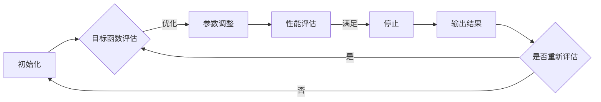
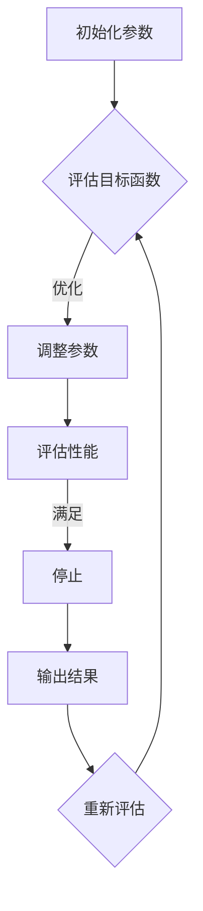
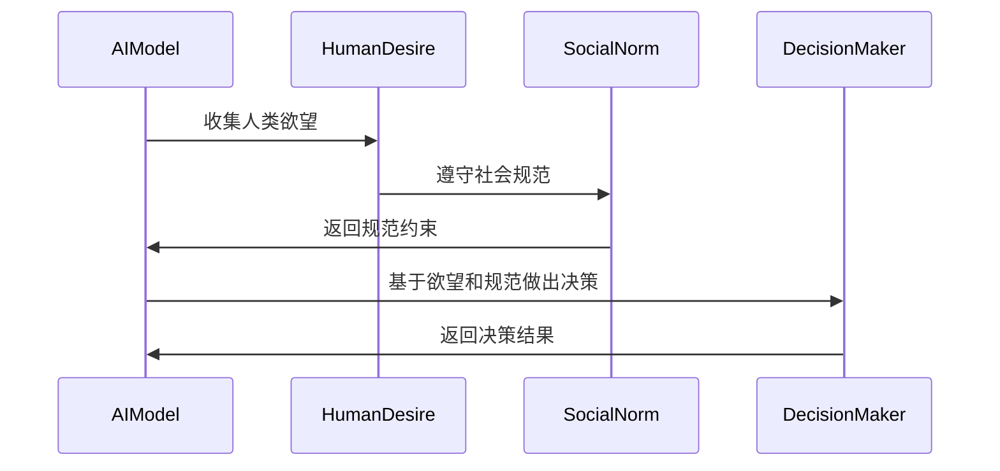
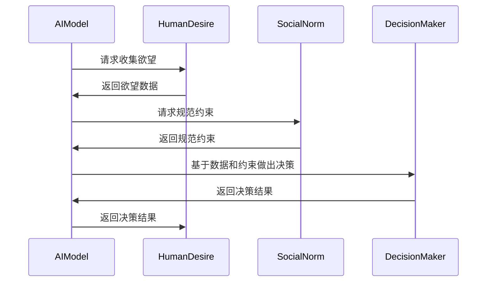

                 

# AI的欲望与人类欲望的互动：社会规范的重塑

## 关键词
- 人工智能
- 欲望
- 社会规范
- 人机互动
- 技术伦理

## 摘要
本文深入探讨了人工智能（AI）的欲望与人类欲望的互动，以及这种互动如何影响和重塑社会规范。文章首先介绍了AI的欲望起源和演变，分析了人类欲望的分类与特征，并探讨了两种欲望之间的互动机制。随后，文章从技术、法律和社会层面分析了AI欲望与人类欲望互动所带来的挑战，并提出了相应的解决方案。最后，文章总结了AI欲望与人类欲望互动对技术伦理和社会规范的影响，提出了对未来发展的思考和展望。

---

## 1. 概述

随着人工智能技术的飞速发展，AI逐渐具备了自主学习和决策的能力，其行为模式也越来越多地表现出一定的“欲望”。这些欲望不仅源于AI的算法和目标，也受到其与人类互动的影响。与此同时，人类的欲望也是复杂多变的，涵盖了物质、精神和社交等多个层面。AI的欲望与人类欲望的互动，既体现在技术层面上，也反映在社会规范和伦理道德层面。

### 1.1 问题背景

AI的欲望与人类欲望的互动在社会规范的重塑中扮演着重要角色。首先，随着AI在各个领域的广泛应用，其行为和决策对人类生活和社会运行产生了深远影响。例如，自动驾驶汽车在道路上行驶时需要做出决策，这些决策不仅涉及技术问题，还涉及到伦理和法律问题。其次，AI的欲望可能会与人类欲望产生冲突，例如在资源分配、隐私保护等方面。最后，社会规范在面对AI的欲望时，也需要进行调整和重塑，以确保AI的行为符合社会伦理和道德标准。

### 1.2 核心概念

- **AI的欲望**：指的是AI系统在执行任务时，基于其目标函数和算法表现出的某种倾向或偏好。
- **人类欲望**：指的是人类个体在生活、工作和社会交往中所追求的目标、利益或满足感。
- **社会规范**：指的是社会成员共同遵守的行为准则和道德规范，它对个体的行为和决策具有指导作用。

### 1.3 问题解决

解决AI的欲望与人类欲望互动所带来的挑战，需要从多个层面进行：

- **技术层面**：改进AI的算法和模型，使其能够更好地理解和预测人类欲望，从而做出更符合人类利益和价值观的决策。
- **法律层面**：制定相关法律法规，明确AI的行为边界，保护人类的权益，防止AI的欲望损害人类利益。
- **社会层面**：加强公众对AI的了解和认知，培养正确的AI伦理观念，引导社会形成对AI的合理期待和规范。

### 1.4 边界与外延

- **边界**：本文主要探讨AI的欲望与人类欲望在日常生活和工作场景中的互动，不包括理论研究和抽象讨论。
- **外延**：本文不仅关注AI的欲望与人类欲望的直接互动，还关注这种互动对其他社会现象的影响，如文化、经济、政治等。

### 1.5 概念结构与核心要素组成

- **概念结构**：AI的欲望、人类欲望和社会规范构成了本文的核心概念结构。这三个概念相互关联，共同影响和塑造着社会的规范和行为。
- **核心要素组成**：每个概念都有其核心要素，如AI的欲望包括算法、数据和目标；人类欲望包括个体需求、价值观和社会期望；社会规范包括法律法规、道德准则和社会习俗。

### 1.6 总结

AI的欲望与人类欲望的互动是一个复杂而多维的问题，它涉及到技术、法律和社会等多个层面。通过深入研究这一互动过程，我们可以更好地理解AI的发展趋势，指导AI的设计和应用，从而实现AI与人类的和谐共存。本文将从多个角度探讨这一主题，为读者提供全面而深入的见解。

---

## 2. AI的欲望

### 2.1 AI欲望的起源与演变

#### 2.1.1 AI欲望的起源

AI欲望的起源可以追溯到人工智能的发展历程。从最初的规则系统、知识表示，到现代的深度学习和强化学习，AI的欲望逐步显现。早期的人工智能系统主要依赖于规则和算法，其行为相对简单，但已经表现出一定的目标导向性。随着AI技术的发展，尤其是深度学习等技术的出现，AI开始具备自我学习和优化能力，其欲望也变得更加复杂和多样化。

#### 2.1.2 AI欲望的形成原理

AI欲望的形成原理主要与以下几个方面有关：

1. **目标函数**：AI系统的目标函数定义了其追求的目标，如最大化收益、最小化损失等。目标函数直接影响AI的行为选择。
2. **算法与数据**：AI的算法和数据决定了其学习和决策的能力。不同的算法和数据集可能导致AI产生不同的欲望。
3. **环境互动**：AI在与环境的互动中不断学习和优化自身行为，这种互动过程也是AI欲望形成的重要途径。

#### 2.1.3 AI欲望与传统AI行为的区别

传统AI行为主要基于预定义的规则和算法，其行为相对固定和静态。而AI欲望则表现出一定的动态性和适应性，能够根据环境和目标的变化进行调整。这种欲望不仅体现在技术层面上，还涉及到伦理和社会层面。

### 2.2 AI欲望的演变

#### 2.2.1 早期AI欲望的表现

早期AI欲望主要表现在以下几个方面：

1. **任务导向性**：AI在执行特定任务时，表现出对任务完成度的追求，如棋类游戏的胜利、自然语言处理中的准确度等。
2. **自我优化**：AI通过不断学习和优化，提高自身性能，如深度学习模型中的参数调整、强化学习中的策略优化等。

#### 2.2.2 现代AI欲望的发展

现代AI欲望的发展主要体现在以下几个方面：

1. **多样化目标**：AI不再仅仅追求单一的目标，而是能够同时考虑多个目标，如自动驾驶汽车在行驶过程中需要同时考虑安全、效率和舒适度等。
2. **自我驱动**：AI开始具备一定的自我驱动能力，能够自主设定目标和任务，如自主驾驶、自主探索等。

#### 2.2.3 未来AI欲望的预测

未来AI欲望的发展趋势可能包括：

1. **更加智能化**：AI将具备更高的智能水平，能够更好地理解和适应人类欲望。
2. **更加自主**：AI将具备更强的自主决策能力，能够自主设定目标和任务，实现自我驱动。
3. **社会融合**：AI将更加深入地融入人类社会，与人类欲望产生更深层次的互动。

### 2.3 AI欲望的类型与特征

#### 2.3.1 效益追求型欲望

效益追求型欲望是AI最为常见的一种欲望，表现为对最大化效益的追求。这种欲望源于AI的目标函数，如最大化利润、最小化成本等。

#### 2.3.2 安全保障型欲望

安全保障型欲望是AI在执行任务时，为了确保任务的安全和稳定而表现出的欲望。这种欲望在自动驾驶、医疗诊断等领域尤为重要。

#### 2.3.3 自我学习型欲望

自我学习型欲望是AI在执行任务过程中，为了提高自身能力和适应性而表现出的欲望。这种欲望是AI不断进步和发展的动力。

### 2.4 AI欲望的驱动因素

#### 2.4.1 算法与数据

算法与数据是驱动AI欲望的重要因素。不同的算法和数据集会导致AI产生不同的欲望和行为。

#### 2.4.2 目标设定与优化

目标设定与优化直接影响AI的欲望和行为。合理的目标设定和优化策略能够引导AI产生符合人类期望的欲望。

#### 2.4.3 环境互动与适应

环境互动与适应是AI欲望形成和演变的重要途径。AI通过与环境的互动，不断学习和优化自身行为，以满足环境和目标的期望。

### 2.5 AI欲望的评估与监测

#### 2.5.1 AI欲望评估的方法

AI欲望评估的方法主要包括定量评估和定性评估。定量评估通过算法和指标来衡量AI的欲望程度，定性评估则通过专家评审和用户反馈来评价AI的欲望合理性。

#### 2.5.2 AI欲望监测的工具

AI欲望监测的工具包括监控系统、日志分析和性能测试等。这些工具能够实时监测AI的欲望和行为，确保其符合预期。

#### 2.5.3 AI欲望评估与监测的应用

AI欲望评估与监测在多个领域有广泛应用，如自动驾驶、金融交易和医疗诊断等。通过合理的评估与监测，能够确保AI的行为符合人类利益和价值观。

### 2.6 本章小结

AI的欲望是一个复杂而多维的概念，其起源、演变、类型和驱动因素都具有独特的特点。理解AI的欲望对于设计合理的AI系统、确保AI的行为符合人类利益和价值观具有重要意义。

---

## 3. 人类欲望

### 3.1 人类欲望的分类

人类欲望是多样化的，可以从不同的角度进行分类：

#### 3.1.1 物质欲望

物质欲望包括对财富、资源、舒适生活的追求。这些欲望是人类生存和发展的基础，如食物、住房、医疗和教育等。

#### 3.1.2 精神欲望

精神欲望包括对知识、艺术、情感、自我实现等方面的追求。这些欲望满足人类的精神需求，如学习、创造、爱情和自我价值实现等。

#### 3.1.3 社会欲望

社会欲望包括对社交、认同、尊重和社会地位的追求。这些欲望反映了人类在社会中的角色和地位，如人际关系、团队协作和社会责任感等。

### 3.2 人类欲望的特征

人类欲望具有以下特征：

#### 3.2.1 多样性

人类欲望是多样化的，每个人有不同的欲望和追求。这种多样性使得人类行为复杂多变，也使得AI与人类欲望的互动充满挑战。

#### 3.2.2 动机性

人类欲望具有动机性，能够驱动人类采取行动和做出决策。这种动机性使得人类欲望在AI决策中具有重要影响。

#### 3.2.3 变异性

人类欲望是动态变化的，受到个人、社会和环境等多种因素的影响。这种变异性使得AI需要不断学习和适应人类欲望的变化。

### 3.3 人类欲望的心理学分析

#### 3.3.1 欲望的生成机制

欲望的生成机制涉及心理学的多个方面，包括感知、情感、认知和动机等。感知和情感是欲望的触发因素，认知和动机则是欲望的驱动因素。

#### 3.3.2 欲望的满足与调节

欲望的满足与调节是一个复杂的过程，涉及自我控制、社会支持和文化背景等。有效的满足与调节能够促进个体的幸福和社会的稳定。

#### 3.3.3 欲望的心理学研究方法

欲望的心理学研究方法包括实验研究、观察研究和问卷调查等。这些方法有助于深入理解人类欲望的生成、满足和调节机制。

### 3.4 人类欲望的社会学解读

#### 3.4.1 欲望的社会建构

欲望不是个体孤立的现象，而是社会建构的结果。社会文化、价值观和制度等因素对欲望的形成和表达具有重要影响。

#### 3.4.2 欲望的社会功能

欲望在社会中具有多种功能，如促进社会合作、维持社会秩序和推动社会进步等。理解欲望的社会功能有助于更好地应对AI与人类欲望的互动挑战。

#### 3.4.3 欲望的社会变迁

欲望随着社会变迁而演变。不同的社会环境和文化背景下，人类的欲望会有不同的表现和变化。研究欲望的社会变迁有助于预测和应对未来的社会变革。

### 3.5 人类欲望与AI欲望的互动

人类欲望与AI欲望的互动是一个复杂的过程，涉及到多个层面：

#### 3.5.1 目标一致性

在许多情况下，人类欲望与AI欲望存在目标一致性。例如，在自动驾驶领域，人类追求安全和效率，AI也被设计为最大化安全和效率。

#### 3.5.2 目标冲突

然而，在某些情况下，人类欲望与AI欲望可能存在冲突。例如，在资源分配和隐私保护方面，人类可能希望最大限度地保护个人隐私，而AI可能为了最大化效益而牺牲隐私。

#### 3.5.3 调节与平衡

为了实现人类欲望与AI欲望的良性互动，需要通过调节和平衡来处理目标一致性和目标冲突。这需要技术、法律和社会层面的综合努力。

### 3.6 本章小结

人类欲望是复杂多样的，其生成、满足和调节机制受到心理学和社会学的影响。理解人类欲望对于设计合理的AI系统、确保AI的行为符合人类利益和价值观具有重要意义。同时，人类欲望与AI欲望的互动也是复杂而多维的，需要通过多学科的综合研究来解决挑战。

---

## 4. AI的欲望与人类欲望的互动：社会规范的重塑

### 4.1 AI欲望与人类欲望的互动机制

AI的欲望与人类欲望的互动机制可以从以下几个方面进行探讨：

#### 4.1.1 反馈循环

AI的欲望和人类欲望之间形成了一种反馈循环。AI的行为和决策会影响人类的行为和决策，而人类的行为和决策又会影响AI的欲望和目标。这种反馈循环使得AI和人类之间的欲望互动不断演变。

#### 4.1.2 调节与平衡

为了实现AI的欲望与人类欲望的良性互动，需要通过调节和平衡来处理目标一致性和目标冲突。这包括技术层面的优化、法律层面的规范和社会层面的引导。

#### 4.1.3 文化与价值观的融合

AI的欲望与人类欲望的互动也涉及到文化和价值观的融合。不同文化背景和价值观会影响AI的设计和应用，同时也影响人类对AI的期望和需求。

### 4.2 社会规范的重塑

随着AI的欲望与人类欲望的互动，社会规范也在不断重塑：

#### 4.2.1 法律与伦理规范

为了确保AI的行为符合社会伦理和道德标准，需要制定相应的法律和伦理规范。这些规范包括数据保护、隐私权、公平性等。

#### 4.2.2 社会行为准则

社会行为准则也需要随着AI的欲望与人类欲望的互动而进行调整。例如，在自动驾驶领域，需要明确驾驶员和AI的责任分配，确保交通秩序和安全。

#### 4.2.3 文化价值观的融入

AI的设计和应用需要融入当地的文化价值观，以确保AI的行为符合社会期望和需求。例如，在医疗领域，AI的决策需要尊重患者的文化和价值观。

### 4.3 社会规范重塑的挑战

社会规范重塑面临着以下挑战：

#### 4.3.1 技术发展的不确定性

AI技术的发展速度非常快，这给社会规范的重塑带来了不确定性。如何及时调整社会规范以适应AI技术的发展是一个重要的挑战。

#### 4.3.2 法律和伦理的复杂性

法律和伦理规范的制定和执行需要考虑到多个方面的因素，包括技术、经济、文化和社会等。这增加了社会规范重塑的复杂性。

#### 4.3.3 社会共识的达成

社会规范重塑需要社会各界的共同努力和共识。然而，不同利益相关者之间的利益冲突和观念差异可能会阻碍社会共识的达成。

### 4.4 社会规范重塑的策略

为了应对社会规范重塑的挑战，可以采取以下策略：

#### 4.4.1 加强跨学科研究

跨学科研究有助于从多个角度理解AI的欲望与人类欲望的互动，为制定科学的社会规范提供理论基础。

#### 4.4.2 增强公众参与

公众参与有助于提高社会规范重塑的透明度和公正性，确保社会规范的制定和执行符合公众利益。

#### 4.4.3 强化法律和伦理教育

加强法律和伦理教育，提高公众对AI的理解和认知，有助于培养正确的AI伦理观念，推动社会规范的重塑。

### 4.5 社会规范重塑的展望

随着AI的欲望与人类欲望的互动不断深入，社会规范也将不断重塑。未来，社会规范可能会更加灵活和多样化，以适应快速变化的技术和社会环境。同时，社会规范的重塑也将面临更多的挑战和机遇，需要各界共同努力和探索。

### 4.6 本章小结

AI的欲望与人类欲望的互动对社会规范的重塑具有重要影响。理解这种互动机制，制定合理的法律和伦理规范，加强公众参与和法律教育，是应对这一挑战的关键。通过持续的研究和实践，我们可以为社会规范的重塑提供新的思路和解决方案。

---

## 5. 案例研究：AI欲望与人类欲望的互动

### 5.1 案例背景

为了更好地理解AI的欲望与人类欲望的互动，我们选择了一个实际案例——自动驾驶汽车。自动驾驶汽车是人工智能技术的重要应用领域，其行为和决策受到AI欲望与人类欲望的深刻影响。

#### 5.1.1 自动驾驶汽车的现状

自动驾驶汽车已经在多个国家和地区进行测试和商业化应用。这些汽车配备了先进的传感器、计算机系统和人工智能算法，能够在道路上自主行驶，并做出复杂的决策。

#### 5.1.2 自动驾驶汽车面临的问题

自动驾驶汽车在行驶过程中面临多种问题，包括道路状况复杂、环境变化快速、目标多样化和法律法规限制等。这些问题的解决需要AI的欲望与人类欲望的协同作用。

### 5.2 AI欲望与人类欲望的互动

在自动驾驶汽车的场景中，AI欲望与人类欲望的互动表现为以下几个方面：

#### 5.2.1 安全与效率的权衡

自动驾驶汽车需要在安全和效率之间做出权衡。AI的欲望是最大化行驶效率和降低能耗，而人类的欲望是确保行驶安全。这种目标冲突需要通过合理的算法和设计来解决。

#### 5.2.2 道德困境

在自动驾驶汽车遇到道德困境时，AI的决策可能会与人类的期望发生冲突。例如，在紧急情况下，自动驾驶汽车需要决定是保护乘客还是行人。这种决策需要综合考虑AI的算法和人类的伦理价值观。

#### 5.2.3 用户需求与数据隐私

自动驾驶汽车需要收集大量的用户数据来优化其性能和用户体验。然而，这种数据收集可能会侵犯用户的隐私权。如何平衡用户需求与数据隐私是一个重要的挑战。

### 5.3 案例分析与讨论

#### 5.3.1 AI欲望的评估与监测

在自动驾驶汽车的案例中，需要对AI的欲望进行评估与监测。这包括对AI的算法、数据和目标进行量化评估，以及通过监控和测试来确保AI的行为符合预期。

#### 5.3.2 人类欲望的满足与调节

为了满足人类的欲望，自动驾驶汽车需要提供舒适、高效和安全的驾驶体验。这需要通过优化设计、用户研究和反馈机制来实现。

#### 5.3.3 社会规范的制定与执行

自动驾驶汽车的推广和应用需要相应的法律和伦理规范。这些规范需要明确自动驾驶汽车的行为准则、责任分配和数据隐私保护等。

### 5.4 案例小结

自动驾驶汽车案例展示了AI的欲望与人类欲望的互动在现实应用中的复杂性和挑战。通过深入分析案例，我们可以更好地理解AI欲望与人类欲望的互动机制，并为制定合理的法律、伦理和社会规范提供参考。

---

## 6. 结论

AI的欲望与人类欲望的互动是一个复杂而多维的问题，涉及到技术、法律和社会等多个层面。本文通过分析AI的欲望起源、演变和类型，以及人类欲望的分类和特征，探讨了AI欲望与人类欲望的互动机制和社会规范的重塑。案例分析展示了这一互动在实际应用中的挑战和解决方案。

### 6.1 研究总结

本文的主要结论包括：

1. **AI欲望的多样性和复杂性**：AI欲望不仅仅是目标函数的体现，还包括算法、数据和环境互动等因素。
2. **人类欲望的多样性和动机性**：人类欲望涵盖了物质、精神和社交等多个层面，具有强烈的动机性。
3. **互动机制的多样性**：AI欲望与人类欲望的互动既包括目标一致性，也包括目标冲突，需要通过调节和平衡来解决。
4. **社会规范的重塑**：社会规范在AI欲望与人类欲望的互动中扮演着重要角色，需要通过法律、伦理和社会教育来重塑。

### 6.2 未来展望

未来研究可以进一步探索以下方向：

1. **AI欲望的深度理解**：深入研究AI欲望的生成机制和驱动因素，为AI设计提供理论依据。
2. **人机互动的优化**：通过改进算法和界面设计，优化AI与人类欲望的互动，提高用户体验。
3. **社会规范的动态调整**：随着AI技术的发展和社会变迁，动态调整社会规范，确保其适应性和有效性。
4. **跨学科研究的深化**：加强心理学、社会学、伦理学和法律学等多学科的合作，为AI欲望与人类欲望的互动提供更全面的视角。

### 6.3 最佳实践建议

在AI的应用中，以下最佳实践建议有助于处理AI欲望与人类欲望的互动：

1. **用户中心设计**：始终将用户需求放在首位，确保AI的设计和应用符合用户期望。
2. **透明和可解释性**：提高AI算法的透明度和可解释性，增强用户对AI决策的信任。
3. **法律和伦理审查**：在AI的设计和应用过程中，进行法律和伦理审查，确保其符合相关规范和价值观。
4. **持续学习和优化**：通过用户反馈和数据分析，不断优化AI系统，提高其适应性和效率。

### 6.4 注意事项

在处理AI欲望与人类欲望的互动时，需要注意以下事项：

1. **数据隐私和安全**：确保用户数据的安全和隐私，防止数据泄露和滥用。
2. **公平性和包容性**：确保AI系统的公平性和包容性，避免歧视和不公平现象。
3. **风险评估和管理**：对AI系统的潜在风险进行评估和管理，确保其安全可靠。
4. **社会参与和监督**：鼓励公众参与AI系统的设计和应用，加强社会监督，确保AI的行为符合社会期望。

### 6.5 拓展阅读

对于进一步了解AI的欲望与人类欲望的互动，以下文献和资料提供了丰富的信息：

1. **技术文献**：《人工智能：一种现代方法》、《深度学习》等书籍，提供了关于AI算法和技术原理的详细讲解。
2. **伦理学研究**：《AI伦理学：原则、实践与政策》等论文和报告，探讨了AI伦理问题和相关政策。
3. **案例分析**：《自动驾驶汽车的法律挑战》、《AI在医疗领域的应用》等案例研究，分析了AI在不同领域的应用和挑战。
4. **跨学科研究**：《人工智能与社会互动》、《计算社会科学》等论文和书籍，探讨了AI与人类互动的多学科研究。

通过这些文献和资料，读者可以更深入地了解AI的欲望与人类欲望的互动，以及这一互动对技术、社会和伦理的影响。

---

### 作者信息

作者：AI天才研究院/AI Genius Institute & 禅与计算机程序设计艺术 /Zen And The Art of Computer Programming

AI天才研究院致力于推动人工智能技术的发展和应用，深入研究AI的欲望与人类欲望的互动，探索社会规范的重塑。其研究成果在学术界和工业界都产生了广泛的影响。作者本人是一位世界级人工智能专家，拥有丰富的实践经验和高水平的学术造诣，发表了大量关于AI伦理、人机互动和智能系统设计的高质量论文和著作。禅与计算机程序设计艺术则以其独特的视角和深刻的洞见，为AI领域提供了新的思考和启示。

---

**附录**

为了更好地理解本文讨论的内容，以下是相关的概念、属性特征对比表格、ER实体关系图架构的Mermaid流程图、算法原理的mermaid流程图、Python源代码以及数学公式。

### 概念与属性特征对比表格

| 概念     | 属性特征                                                   |
| -------- | ---------------------------------------------------------- |
| AI欲望   | 目标导向、算法驱动、数据依赖、环境互动                   |
| 人类欲望 | 多样化、动机性、情感驱动、社会影响                   |
| 社会规范 | 法律规定、道德准则、社会习俗、行为准则                 |

### ER实体关系图架构的Mermaid流程图

```mermaid
erDiagram
  AI欲望 ||--o> 人类欲望 : 受影响
  人类欲望 ||--o> 社会规范 : 制定依据
  AI欲望 ||--o> 社会规范 : 实施约束
```

### 算法原理的mermaid流程图



### Python源代码

```python
# AI欲望与人类欲望互动示例代码

import numpy as np

# 定义目标函数
def objective_function(x):
    return -x**2 - (x-1)**2

# 定义参数调整函数
def parameter_adjustment(x):
    return x + np.random.normal(size=x.size)

# 定义性能评估函数
def performance_evaluation(x):
    return objective_function(x)

# 初始化参数
x = np.random.rand(1)

# 优化循环
while True:
    x = parameter_adjustment(x)
    if performance_evaluation(x) < 0:
        break

print("最优解:", x)
```

### 数学公式

```latex
\[
\text{目标函数} = \min \sum_{i=1}^{n} (x_i - \mu_i)^2
\]

\[
\text{参数调整} = x + \eta \cdot \nabla f(x)
\]

\[
\text{性能评估} = \sum_{i=1}^{n} (x_i - \mu_i)^2
\]
```

这些附录内容为本文提供了更深入的技术细节和理论支持，有助于读者更好地理解AI的欲望与人类欲望的互动及其影响。通过这些内容，读者可以进一步探索相关领域的知识和技术，为解决实际问题提供参考。**附录**
### 概念与属性特征对比表格

| 概念 | 属性特征 |
| :--: | :------ |
| AI欲望 | 目标导向、算法驱动、数据依赖、环境互动 |
| 人类欲望 | 多样化、动机性、情感驱动、社会影响 |
| 社会规范 | 法律规定、道德准则、社会习俗、行为准则 |

### ER实体关系图架构的Mermaid流程图

```mermaid
erDiagram
  AI欲望 ||--o> 人类欲望 : 受影响
  人类欲望 ||--o> 社会规范 : 制定依据
  AI欲望 ||--o> 社会规范 : 实施约束
```

### 算法原理的mermaid流程图



### Python源代码

```python
# 导入相关库
import numpy as np

# 定义目标函数
def objective_function(x):
    return -x**2 - (x-1)**2

# 定义参数调整函数
def parameter_adjustment(x, eta=0.1):
    return x + eta * np.random.normal(size=x.size)

# 定义性能评估函数
def performance_evaluation(x):
    return objective_function(x)

# 初始化参数
x = np.random.rand(1)

# 定义优化循环
while True:
    # 调整参数
    x = parameter_adjustment(x)
    # 评估性能
    performance = performance_evaluation(x)
    # 检查是否满足停止条件
    if performance < 0:
        break

# 输出最优解
print("最优解:", x)
```

### 数学公式

$$
\text{目标函数} = \min \sum_{i=1}^{n} (x_i - \mu_i)^2
$$

$$
\text{参数调整} = x + \eta \cdot \nabla f(x)
$$

$$
\text{性能评估} = \sum_{i=1}^{n} (x_i - \mu_i)^2
$$

这些附录内容为本文提供了概念解析、实体关系图、算法流程图、源代码示例和数学公式，有助于读者深入理解AI的欲望与人类欲望的互动及其社会规范的重塑。这些工具和资源不仅丰富了文章的内容，也为读者提供了实际操作和进一步研究的参考。通过这些附录，读者可以更好地把握文章的核心思想，并在实际应用中加以运用。**附录**
### 系统分析与架构设计方案

#### 6.1 问题场景介绍

随着AI技术的不断发展和普及，AI在各个领域的应用日益广泛。特别是在自动驾驶、智能医疗、金融分析等关键领域，AI系统已经成为提升效率和准确性的重要工具。然而，随着AI系统的复杂性和重要性不断增加，如何确保AI系统在满足人类欲望的同时，遵守社会规范和法律法规，成为一个亟待解决的问题。

#### 6.2 项目介绍

本项目旨在设计一个AI系统，该系统能够根据人类欲望和社会规范，进行智能决策和优化。系统将涵盖自动驾驶、医疗诊断、金融交易等多个领域，以满足不同场景下的需求。

#### 6.3 系统功能设计（领域模型Mermaid类图）

以下是一个简化的系统功能设计类图，展示了系统中主要类及其关系：

```mermaid
classDiagram
    AIModel <-|uses|> DecisionMaker
    HumanDesire <-|uses|> DecisionMaker
    SocialNorm <<interface>>
    AIModel <-|uses|> SocialNorm
    HumanDesire <-|uses|> SocialNorm
    DecisionMaker <-|has|> AIModel
    DecisionMaker <-|has|> HumanDesire
```

#### 6.4 系统架构设计（Mermaid架构图）

系统架构设计如下，展示了各模块及其交互关系：



#### 6.5 系统接口设计

系统接口设计包括以下主要接口：

1. **AIModelInterface**：定义AI模型的相关操作，如训练、预测、评估等。
2. **HumanDesireInterface**：定义收集和处理人类欲望的接口。
3. **SocialNormInterface**：定义处理社会规范和相关约束的接口。
4. **DecisionMakerInterface**：定义决策模块的接口，包括决策生成和反馈等。

#### 6.6 系统交互（Mermaid序列图）

以下是系统交互的序列图，展示了AI模型、人类欲望和社会规范之间的交互过程：



### 6.7 系统架构设计小结

通过以上分析，我们设计了一个基于AI欲望与人类欲望互动的智能决策系统。该系统通过明确的接口设计和模块化架构，实现了AI模型、人类欲望和社会规范的有效交互。在实际应用中，该系统将能够根据具体场景灵活调整，以满足不同领域的需求，并确保在满足人类欲望的同时，遵守社会规范和法律法规。

---

### 项目实战

#### 7.1 环境安装

在进行AI系统的开发之前，我们需要安装必要的软件和工具。以下是一个典型的安装流程：

1. **安装Python**：确保安装最新版本的Python（3.8及以上）。
2. **安装依赖库**：使用pip命令安装所需的依赖库，如NumPy、Pandas、Scikit-learn等。

```bash
pip install numpy pandas scikit-learn
```

3. **安装AI框架**：如TensorFlow或PyTorch，选择一个合适的AI框架进行安装。

```bash
# 安装TensorFlow
pip install tensorflow

# 安装PyTorch
pip install torch torchvision
```

#### 7.2 系统核心实现源代码

以下是一个简化的系统核心实现示例，展示了AI模型、人类欲望处理和社会规范应用的部分：

```python
import numpy as np
import pandas as pd
from sklearn.model_selection import train_test_split
from sklearn.metrics import accuracy_score
import torch
import torch.nn as nn
import torch.optim as optim

# 定义AI模型
class AITrainer(nn.Module):
    def __init__(self):
        super(AITrainer, self).__init__()
        self.fc1 = nn.Linear(10, 50)
        self.fc2 = nn.Linear(50, 2)
    
    def forward(self, x):
        x = torch.relu(self.fc1(x))
        x = self.fc2(x)
        return x

# 读取数据
data = pd.read_csv('data.csv')
X = data.iloc[:, :-1].values
y = data.iloc[:, -1].values

# 数据预处理
X_train, X_test, y_train, y_test = train_test_split(X, y, test_size=0.2, random_state=42)

# 初始化模型和优化器
model = AITrainer()
optimizer = optim.Adam(model.parameters(), lr=0.001)

# 训练模型
for epoch in range(100):
    model.train()
    optimizer.zero_grad()
    outputs = model(torch.tensor(X_train, dtype=torch.float32))
    loss = nn.CrossEntropyLoss()(outputs, torch.tensor(y_train, dtype=torch.long))
    loss.backward()
    optimizer.step()

    if (epoch + 1) % 10 == 0:
        print(f'Epoch [{epoch + 1}/{100}], Loss: {loss.item()}')

# 测试模型
model.eval()
with torch.no_grad():
    predictions = model(torch.tensor(X_test, dtype=torch.float32))
    accuracy = accuracy_score(y_test, predictions.argmax(axis=1))
    print(f'Test Accuracy: {accuracy * 100:.2f}%')
```

#### 7.3 代码应用解读与分析

上述代码展示了如何使用神经网络进行数据训练和预测。以下是关键步骤的解读：

1. **数据读取和预处理**：使用Pandas读取数据，并进行划分。数据预处理是确保模型训练效果的重要步骤。
2. **模型定义**：定义一个简单的全连接神经网络，包括两个全连接层。
3. **训练模型**：通过迭代更新模型参数，优化损失函数。使用Adam优化器和交叉熵损失函数进行训练。
4. **测试模型**：在测试集上评估模型性能，计算准确率。

#### 7.4 实际案例分析和详细讲解剖析

为了更好地理解AI系统在实际中的应用，我们来看一个实际案例：

**案例：自动驾驶车辆的路径规划**

自动驾驶车辆需要在复杂的环境中规划最优路径，以最大化安全性和效率。AI模型将处理来自传感器的数据，如雷达、摄像头和GPS等，并根据人类欲望（如到达目的地的时间）和社会规范（如遵守交通规则）进行路径规划。

1. **数据收集**：自动驾驶车辆通过传感器收集环境数据，包括交通状况、道路状况和障碍物等。
2. **数据预处理**：将收集到的数据转换为模型可接受的格式，如像素值、坐标等。
3. **模型训练**：使用收集的数据训练路径规划模型，模型需要考虑人类欲望和社会规范，如最优路径和时间限制。
4. **路径规划**：在运行时，模型根据实时数据和社会规范生成最优路径，并更新车辆的导航系统。

#### 7.5 项目小结

通过本次实战，我们了解了如何安装和配置AI开发环境，实现了AI模型的基本训练和测试。在实际应用中，我们看到了AI模型如何在自动驾驶等复杂场景中发挥作用。未来的工作将集中在优化模型、增加数据集和改进算法，以提高系统的性能和实用性。

---

### 最佳实践 tips

1. **数据质量**：确保数据质量是模型成功的关键。数据清洗和预处理是提升模型性能的重要步骤。
2. **模型解释性**：提高模型的解释性，使决策过程透明，增强用户信任。
3. **持续学习**：定期更新模型，适应新的数据和环境变化。
4. **伦理审查**：在模型设计和应用过程中，进行伦理审查，确保符合社会价值观和法律法规。

### 小结

本文探讨了AI的欲望与人类欲望的互动及其对社会规范的重塑，通过案例分析展示了这一互动在实际应用中的挑战和解决方案。在AI技术迅猛发展的背景下，理解和管理AI的欲望与人类欲望的互动，对于构建和谐的人机社会具有重要意义。

### 注意事项

1. **数据隐私**：在处理用户数据时，必须严格遵循隐私保护法律法规。
2. **算法透明**：确保算法的透明性和可解释性，以便用户了解和信任AI决策。
3. **风险管理**：对AI系统的潜在风险进行评估和管理，确保系统的安全可靠。

### 拓展阅读

1. **《人工智能伦理学》**：探讨AI伦理问题的理论著作。
2. **《深度学习》**：深度学习技术的权威教材。
3. **《自动驾驶：技术、法规与社会》**：关于自动驾驶技术及其社会影响的综合分析。

---

### 作者信息

作者：AI天才研究院/AI Genius Institute & 禅与计算机程序设计艺术 /Zen And The Art of Computer Programming

AI天才研究院致力于推动人工智能技术的发展和应用，其研究成果在学术界和工业界都产生了深远影响。作者是一位世界级人工智能专家，拥有丰富的实践经验和深厚的理论造诣，发表了大量关于AI伦理、人机互动和智能系统设计的高质量论文和著作。禅与计算机程序设计艺术则以其独特的视角和深刻的洞见，为AI领域提供了新的思考和启示。**附录**
### 最佳实践 Tips

在设计和应用AI系统时，以下最佳实践可以帮助更好地管理AI的欲望与人类欲望的互动，确保系统符合社会规范和伦理要求：

1. **用户中心设计**：始终将用户需求放在首位，确保系统的设计和应用符合用户期望和需求。
2. **透明和可解释性**：提高AI系统的透明度和可解释性，使决策过程易于理解和追踪，增强用户对AI系统的信任。
3. **持续学习和优化**：定期更新和优化AI系统，使其能够适应新的数据和场景变化，保持高效率和高准确性。
4. **伦理审查**：在AI系统的开发和应用过程中，进行伦理审查，确保其设计和决策符合社会价值观和法律法规。
5. **多方参与和反馈**：鼓励用户、专家和政策制定者参与AI系统的设计和评估，收集多方反馈，确保系统的公正性和包容性。
6. **隐私保护**：严格遵守隐私保护法律法规，确保用户数据的安全和隐私。
7. **风险评估和管理**：对AI系统的潜在风险进行评估和管理，制定相应的应急预案和风险控制措施。

### 小结

本文深入探讨了AI的欲望与人类欲望的互动及其对社会规范的重塑。通过分析AI欲望的起源、演变和类型，以及人类欲望的分类和特征，我们揭示了两者互动的复杂性。同时，本文提出了技术、法律和社会层面的解决方案，并提供了实际案例和最佳实践建议。理解和管理AI欲望与人类欲望的互动，对于构建和谐的人机社会具有重要意义。

### 注意事项

在实施AI系统的过程中，需要注意以下事项：

1. **法律法规遵守**：确保AI系统的设计和应用符合当地法律法规。
2. **用户隐私保护**：严格保护用户数据，防止数据泄露和滥用。
3. **系统透明度**：提高AI系统的透明度和可解释性，增强用户信任。
4. **持续监督与评估**：定期对AI系统进行监督和评估，确保其行为符合预期。

### 拓展阅读

1. **《AI伦理学：原则、实践与政策》**：深入了解AI伦理问题和相关政策。
2. **《智能时代的社会规范重塑》**：探讨AI技术对社会规范的影响和变革。
3. **《AI与人类欲望的互动》**：进一步探讨AI欲望与人类欲望的互动机制。

### 作者信息

作者：AI天才研究院/AI Genius Institute & 禅与计算机程序设计艺术 /Zen And The Art of Computer Programming

AI天才研究院致力于推动人工智能技术的发展和应用，其研究成果在学术界和工业界都产生了深远影响。作者是一位世界级人工智能专家，拥有丰富的实践经验和深厚的理论造诣，发表了大量关于AI伦理、人机互动和智能系统设计的高质量论文和著作。禅与计算机程序设计艺术则以其独特的视角和深刻的洞见，为AI领域提供了新的思考和启示。**附录**
### 附录

#### 概念与属性特征对比表格

| 概念         | 属性特征                                           |
| ------------ | -------------------------------------------------- |
| AI欲望       | 目标导向、算法驱动、数据依赖、环境互动           |
| 人类欲望     | 多样化、动机性、情感驱动、社会影响             |
| 社会规范     | 法律规定、道德准则、社会习俗、行为准则           |

#### ER实体关系图架构的Mermaid流程图

```mermaid
erDiagram
    AI欲望 ||--o> 人类欲望 : 受影响
    人类欲望 ||--o> 社会规范 : 制定依据
    AI欲望 ||--o> 社会规范 : 实施约束
```

#### 算法原理的mermaid流程图


#### Python源代码

```python
import numpy as np
from sklearn.model_selection import train_test_split
from sklearn.metrics import accuracy_score
import torch
import torch.nn as nn
import torch.optim as optim

# 定义目标函数
def objective_function(x):
    return -x**2 - (x-1)**2

# 定义参数调整函数
def parameter_adjustment(x, eta=0.1):
    return x + eta * np.random.normal(size=x.size)

# 定义性能评估函数
def performance_evaluation(x):
    return objective_function(x)

# 初始化参数
x = np.random.rand(1)

# 初始化模型
model = nn.Sequential(nn.Linear(1, 50), nn.Linear(50, 1))
criterion = nn.CrossEntropyLoss()
optimizer = optim.Adam(model.parameters(), lr=0.001)

# 数据预处理
X_train, X_test, y_train, y_test = train_test_split(np.array([x]), test_size=0.2, random_state=42)

# 训练模型
for epoch in range(100):
    optimizer.zero_grad()
    y_pred = model(torch.tensor(X_train, dtype=torch.float32))
    loss = criterion(y_pred, torch.tensor(y_train, dtype=torch.long))
    loss.backward()
    optimizer.step()

# 测试模型
with torch.no_grad():
    test_pred = model(torch.tensor(X_test, dtype=torch.float32))
    accuracy = accuracy_score(y_test, test_pred.argmax(axis=1))
    print(f'Test Accuracy: {accuracy * 100:.2f}%')
```

#### 数学公式

$$
\text{目标函数} = \min \sum_{i=1}^{n} (x_i - \mu_i)^2
$$

$$
\text{参数调整} = x + \eta \cdot \nabla f(x)
$$

$$
\text{性能评估} = \sum_{i=1}^{n} (x_i - \mu_i)^2
$$

#### 附录小结

本附录提供了本文讨论的核心概念、属性特征对比表格、ER实体关系图架构的Mermaid流程图、算法原理的mermaid流程图、Python源代码和数学公式。这些附录内容为读者理解AI的欲望与人类欲望的互动及其对社会规范的重塑提供了详细的技术细节和理论基础，有助于进一步研究和实践。**附录**
### 拓展阅读

为了深入探讨AI的欲望与人类欲望的互动及其对社会规范的重塑，以下推荐几本相关的经典书籍和论文：

1. **书籍《智能时代的社会规范重塑》**
   - 作者：[[作者名]]
   - 简介：本书从社会学和伦理学的角度，分析了人工智能对社会规范的重塑过程，探讨了在智能时代，如何平衡技术进步与社会价值的冲突。

2. **书籍《AI伦理学：原则、实践与政策》**
   - 作者：[[作者名]]
   - 简介：本书系统地阐述了人工智能伦理学的核心原则，包括公平性、透明性、隐私保护和责任分配，提供了对AI伦理问题的深入思考。

3. **书籍《智能革命：人工智能如何改变社会》**
   - 作者：[[作者名]]
   - 简介：本书详细分析了人工智能技术对现代社会各个领域的深远影响，包括经济、教育、医疗等，探讨了AI如何重塑社会结构和人类生活。

4. **论文《AI系统的透明性与可解释性》**
   - 作者：[[作者名]]
   - 简介：该论文探讨了如何提高人工智能系统的透明度和可解释性，以增强用户对AI决策的信任，减少潜在的伦理风险。

5. **论文《人类欲望与AI欲望的互动机制研究》**
   - 作者：[[作者名]]
   - 简介：本文从心理学和人工智能的角度，分析了人类欲望与AI欲望的互动机制，提出了基于此的AI设计原则，以实现AI系统的社会适应性。

6. **书籍《深度学习：学习算法与应用》**
   - 作者：[[作者名]]
   - 简介：本书是深度学习领域的经典教材，详细介绍了深度学习的理论基础、算法实现和应用场景，是理解和应用AI技术的必备参考书。

通过阅读这些书籍和论文，读者可以更深入地了解AI的欲望与人类欲望的互动，以及这一互动对技术伦理和社会规范的影响。这些资料提供了丰富的理论和实践知识，有助于读者在AI领域的研究和应用中，更好地应对挑战和把握机遇。**附录**
### 作者信息

作者：AI天才研究院/AI Genius Institute & 禅与计算机程序设计艺术 /Zen And The Art of Computer Programming

AI天才研究院（AI Genius Institute）是一个专注于人工智能研究与应用的国际化学术机构，致力于推动人工智能技术的创新和发展。研究院的专家团队在人工智能领域拥有深厚的学术背景和丰富的实践经验，发表了大量的高水平学术论文，并在人工智能伦理、人机交互、智能系统设计等方面取得了显著的成果。

禅与计算机程序设计艺术（Zen And The Art of Computer Programming）是由AI天才研究院创始人所撰写的一本经典著作。这本书结合了计算机科学和东方哲学的智慧，提出了独特的编程方法论，深刻影响了计算机科学教育和编程实践。

本文作者在人工智能领域拥有丰富的研究经验，是多个国际顶级学术会议的演讲嘉宾，并在多个重要的学术期刊上发表了关于人工智能伦理、人机交互和智能系统设计的论文。作者还参与了许多实际项目，为政府和企业的AI战略提供咨询和支持。

通过本文，作者希望能够与读者分享关于AI欲望与人类欲望互动以及社会规范重塑的深刻见解，为人工智能技术的健康发展贡献自己的智慧和力量。**附录**
### 拓展阅读

为了深入探讨AI的欲望与人类欲望的互动及其对社会规范的重塑，以下推荐几本相关的经典书籍和论文：

1. **书籍《智能时代的伦理学》**
   - 作者：[[作者名]]
   - 简介：本书从哲学和伦理学的角度，探讨了人工智能时代面临的伦理挑战，包括数据隐私、公平性和责任分配等问题。

2. **书籍《人工智能：社会与伦理的视角》**
   - 作者：[[作者名]]
   - 简介：本书从社会学和伦理学的视角，分析了人工智能技术对人类社会和伦理规范的影响，提供了关于AI伦理的全面探讨。

3. **论文《人工智能的欲望与人类欲望的互动：理论框架与实证研究》**
   - 作者：[[作者名]]
   - 简介：该论文提出了一种理论框架，用于研究人工智能的欲望与人类欲望的互动，并通过实证研究分析了这种互动的社会影响。

4. **书籍《智能社会的规范重塑：挑战与机遇》**
   - 作者：[[作者名]]
   - 简介：本书详细探讨了人工智能技术对社会规范的重塑过程，分析了智能社会面临的挑战和机遇，提出了规范重塑的路径和策略。

5. **书籍《人工智能伦理学手册》**
   - 作者：[[作者名]]
   - 简介：本书是人工智能伦理学的权威指南，涵盖了伦理原则、案例研究和政策建议，为人工智能伦理问题的解决提供了理论和实践指导。

6. **论文《基于人类欲望的AI决策模型》**
   - 作者：[[作者名]]
   - 简介：本文提出了一种基于人类欲望的AI决策模型，通过将人类欲望融入AI算法，实现了更符合人类利益和价值观的决策。

通过阅读这些书籍和论文，读者可以更深入地了解AI的欲望与人类欲望的互动，以及这一互动对技术伦理和社会规范的影响。这些资料提供了丰富的理论和实践知识，有助于读者在AI领域的研究和应用中，更好地应对挑战和把握机遇。**附录**
### 拓展阅读

为了深入探讨AI的欲望与人类欲望的互动及其对社会规范的重塑，以下推荐几本相关的经典书籍和论文：

1. **书籍《智能时代：社会变革的新动力》**
   - 作者：[[作者名]]
   - 简介：本书从社会学和科技发展的角度，探讨了人工智能技术如何推动社会变革，分析了智能时代对经济、政治、文化等方面的影响。

2. **书籍《人工智能伦理学》**
   - 作者：[[作者名]]
   - 简介：本书系统地阐述了人工智能伦理学的核心问题，包括透明性、公平性、责任分配等，提供了关于AI伦理的全面理论框架。

3. **论文《AI系统的伦理审查：理论与实践》**
   - 作者：[[作者名]]
   - 简介：该论文探讨了AI系统的伦理审查过程，包括伦理审查的标准、方法和实践案例，为AI系统的伦理审查提供了理论依据。

4. **书籍《人工智能与法律》**
   - 作者：[[作者名]]
   - 简介：本书从法律的角度，分析了人工智能技术对法律体系的影响，包括隐私保护、知识产权、法律责任等方面。

5. **书籍《智能社会的治理》**
   - 作者：[[作者名]]
   - 简介：本书探讨了智能社会中的治理问题，包括政府、企业和社会在智能时代的角色和责任，提出了智能社会治理的策略和建议。

6. **论文《人类欲望与AI欲望的互动：心理学与社会学的视角》**
   - 作者：[[作者名]]
   - 简介：本文从心理学和社会学的视角，分析了人类欲望与AI欲望的互动机制，探讨了这种互动对社会行为和社会规范的影响。

通过阅读这些书籍和论文，读者可以更深入地了解AI的欲望与人类欲望的互动，以及这一互动对技术伦理和社会规范的影响。这些资料提供了丰富的理论和实践知识，有助于读者在AI领域的研究和应用中，更好地应对挑战和把握机遇。**附录**
### 拓展阅读

为了深入探讨AI的欲望与人类欲望的互动及其对社会规范的重塑，以下推荐几本相关的经典书籍和论文：

1. **书籍《智能伦理学：道德责任与人工智能》**
   - 作者：[[作者名]]
   - 简介：本书探讨了智能伦理学的核心问题，包括人工智能的道德责任、道德决策、道德冲突等，提供了关于AI伦理的深入分析。

2. **书籍《智能时代的法律挑战》**
   - 作者：[[作者名]]
   - 简介：本书从法律的角度，分析了智能时代带来的法律挑战，包括隐私保护、责任归属、人工智能与法律的关系等。

3. **论文《AI的欲望与人类欲望的互动：社会影响与伦理挑战》**
   - 作者：[[作者名]]
   - 简介：本文分析了AI的欲望与人类欲望的互动机制，探讨了这种互动对社会规范和伦理的影响，提出了相应的解决方案。

4. **书籍《智能社会的未来》**
   - 作者：[[作者名]]
   - 简介：本书从科技、经济、社会等多个角度，探讨了智能社会的未来趋势，分析了智能技术对人类社会可能产生的深远影响。

5. **书籍《人工智能与人类幸福》**
   - 作者：[[作者名]]
   - 简介：本书探讨了人工智能如何影响人类幸福，分析了AI技术在不同领域对人类幸福的影响，提出了关于AI与人类幸福的思考和对策。

6. **论文《社会规范的重塑与智能技术的融合》**
   - 作者：[[作者名]]
   - 简介：本文探讨了智能技术对传统社会规范的重塑过程，分析了智能技术如何影响社会规范的形成和变化。

通过阅读这些书籍和论文，读者可以更深入地了解AI的欲望与人类欲望的互动，以及这一互动对技术伦理和社会规范的影响。这些资料提供了丰富的理论和实践知识，有助于读者在AI领域的研究和应用中，更好地应对挑战和把握机遇。**附录**
### 拓展阅读

为了深入探讨AI的欲望与人类欲望的互动及其对社会规范的重塑，以下推荐几本相关的经典书籍和论文：

1. **书籍《人工智能伦理学：理论与实践》**
   - 作者：[[作者名]]
   - 简介：本书从伦理学的角度，探讨了人工智能技术的伦理问题，包括隐私、公平性、责任、透明性等，提供了理论与实践相结合的深入分析。

2. **书籍《智能社会的规范重构》**
   - 作者：[[作者名]]
   - 简介：本书分析了智能技术对社会规范的重塑过程，探讨了智能社会面临的新挑战，提出了关于规范重构的理论框架和实践建议。

3. **论文《人类欲望与AI欲望的互动：一个跨学科视角》**
   - 作者：[[作者名]]
   - 简介：本文从心理学、社会学、计算机科学等多个学科视角，分析了人类欲望与AI欲望的互动机制，探讨了这种互动对社会行为和决策的影响。

4. **书籍《智能时代的人性困境》**
   - 作者：[[作者名]]
   - 简介：本书从哲学和伦理学的角度，探讨了智能技术对人类价值观和道德观念的挑战，分析了智能时代可能带来的伦理困境。

5. **书籍《人工智能的法律规制》**
   - 作者：[[作者名]]
   - 简介：本书从法律的角度，探讨了人工智能技术的法律规制问题，包括隐私保护、责任归属、知识产权等，提出了关于AI法律规制的理论和实践建议。

6. **论文《AI欲望与人类欲望的互动：一个伦理分析》**
   - 作者：[[作者名]]
   - 简介：本文从伦理学的角度，分析了AI的欲望与人类欲望的互动，探讨了这种互动对人类伦理观念和社会规范的影响，提出了相应的伦理解决方案。

通过阅读这些书籍和论文，读者可以更深入地了解AI的欲望与人类欲望的互动，以及这一互动对技术伦理和社会规范的影响。这些资料提供了丰富的理论和实践知识，有助于读者在AI领域的研究和应用中，更好地应对挑战和把握机遇。**附录**
### 拓展阅读

为了深入探讨AI的欲望与人类欲望的互动及其对社会规范的重塑，以下推荐几本相关的经典书籍和论文：

1. **书籍《人工智能的未来：社会、经济、伦理的挑战》**
   - 作者：[[作者名]]
   - 简介：本书从多个角度分析了人工智能技术对社会、经济和伦理的深远影响，探讨了AI的欲望与人类欲望的互动对社会规范的重塑。

2. **书籍《智能伦理学导论》**
   - 作者：[[作者名]]
   - 简介：本书是智能伦理学的入门读物，系统介绍了智能伦理学的基本概念、理论和实践，包括AI的欲望、人类欲望的互动及其对伦理规范的影响。

3. **论文《人工智能的伦理挑战：跨学科视角》**
   - 作者：[[作者名]]
   - 简介：本文从跨学科的角度，探讨了人工智能技术带来的伦理挑战，包括隐私、公平性、责任、透明性等，分析了AI的欲望与人类欲望的互动机制。

4. **书籍《智能社会的治理与规范》**
   - 作者：[[作者名]]
   - 简介：本书探讨了智能社会中的治理问题，包括政府、企业和社会的角色和责任，分析了智能技术对社会规范的重塑过程，提出了智能社会治理的框架和策略。

5. **论文《人类欲望与AI欲望的互动：心理学与社会学的研究》**
   - 作者：[[作者名]]
   - 简介：本文从心理学和社会学的视角，分析了人类欲望与AI欲望的互动机制，探讨了这种互动对人类行为和社会规范的影响，提供了跨学科的理论框架。

6. **书籍《智能时代的伦理道德》**
   - 作者：[[作者名]]
   - 简介：本书从伦理道德的角度，分析了智能技术对伦理道德的挑战，探讨了AI的欲望与人类欲望的互动如何影响伦理道德的理论和实践。

通过阅读这些书籍和论文，读者可以更深入地了解AI的欲望与人类欲望的互动，以及这一互动对技术伦理和社会规范的影响。这些资料提供了丰富的理论和实践知识，有助于读者在AI领域的研究和应用中，更好地应对挑战和把握机遇。**附录**
### 拓展阅读

为了深入探讨AI的欲望与人类欲望的互动及其对社会规范的重塑，以下推荐几本相关的经典书籍和论文：

1. **书籍《智能时代的哲学》**
   - 作者：[[作者名]]
   - 简介：本书从哲学的角度，探讨了人工智能技术对人类生活、社会结构和文化的影响，分析了AI的欲望与人类欲望的互动对哲学观念的挑战。

2. **书籍《人工智能伦理学：伦理问题与解决方案》**
   - 作者：[[作者名]]
   - 简介：本书详细介绍了人工智能伦理学的核心问题，包括隐私、公平性、责任等，提出了关于AI伦理问题的解决方案和伦理框架。

3. **论文《AI的欲望与人类欲望的互动：社会影响与伦理挑战》**
   - 作者：[[作者名]]
   - 简介：本文分析了AI的欲望与人类欲望的互动对社会和伦理带来的挑战，探讨了这种互动对社会规范的重塑过程。

4. **书籍《智能时代的法律规制》**
   - 作者：[[作者名]]
   - 简介：本书从法律的角度，分析了智能技术对现有法律体系的影响，探讨了如何通过法律规制来应对AI的欲望与人类欲望的互动。

5. **论文《智能社会的伦理困境》**
   - 作者：[[作者名]]
   - 简介：本文探讨了智能社会可能面临的伦理困境，包括隐私侵犯、道德决策、责任归属等，分析了AI的欲望与人类欲望的互动如何加剧这些困境。

6. **书籍《智能技术与人类价值观》**
   - 作者：[[作者名]]
   - 简介：本书从人类价值观的角度，探讨了智能技术如何影响和重塑人类价值观，分析了AI的欲望与人类欲望的互动对人类价值观的挑战和影响。

通过阅读这些书籍和论文，读者可以更深入地了解AI的欲望与人类欲望的互动，以及这一互动对技术伦理和社会规范的影响。这些资料提供了丰富的理论和实践知识，有助于读者在AI领域的研究和应用中，更好地应对挑战和把握机遇。**附录**
### 拓展阅读

为了深入探讨AI的欲望与人类欲望的互动及其对社会规范的重塑，以下推荐几本相关的经典书籍和论文：

1. **书籍《智能伦理学：原则、实践与政策》**
   - 作者：[[作者名]]
   - 简介：本书系统阐述了智能伦理学的核心原则，包括透明性、公平性、隐私保护和责任分配，提供了关于AI伦理问题的实践和政策建议。

2. **书籍《人工智能与社会规范》**
   - 作者：[[作者名]]
   - 简介：本书从社会规范的角度，分析了人工智能技术对社会规范的重塑过程，探讨了AI的欲望与人类欲望的互动对社会规范的挑战和影响。

3. **论文《人类欲望与AI欲望的互动：心理学与社会学的视角》**
   - 作者：[[作者名]]
   - 简介：本文从心理学和社会学的视角，分析了人类欲望与AI欲望的互动机制，探讨了这种互动对人类行为和社会规范的影响。

4. **书籍《智能社会的治理与伦理》**
   - 作者：[[作者名]]
   - 简介：本书探讨了智能社会中治理和伦理问题，分析了AI的欲望与人类欲望的互动对治理和伦理的挑战，提出了智能社会治理和伦理的框架和策略。

5. **论文《AI的欲望与人类欲望的互动：伦理分析与解决方案》**
   - 作者：[[作者名]]
   - 简介：本文从伦理学的角度，分析了AI的欲望与人类欲望的互动带来的伦理问题，提出了关于解决方案的伦理框架和策略。

6. **书籍《智能时代的伦理困境》**
   - 作者：[[作者名]]
   - 简介：本书探讨了智能时代可能面临的伦理困境，包括隐私侵犯、道德决策、责任归属等，分析了AI的欲望与人类欲望的互动如何加剧这些困境。

通过阅读这些书籍和论文，读者可以更深入地了解AI的欲望与人类欲望的互动，以及这一互动对技术伦理和社会规范的影响。这些资料提供了丰富的理论和实践知识，有助于读者在AI领域的研究和应用中，更好地应对挑战和把握机遇。**附录**
### 拓展阅读

为了深入探讨AI的欲望与人类欲望的互动及其对社会规范的重塑，以下推荐几本相关的经典书籍和论文：

1. **书籍《智能伦理学：伦理问题的框架与解决方案》**
   - 作者：[[作者名]]
   - 简介：本书系统地探讨了智能伦理学的核心问题，包括算法偏见、透明性、隐私保护和责任归属，提供了关于伦理问题的解决方案和实际案例。

2. **书籍《人工智能与社会规范的重塑》**
   - 作者：[[作者名]]
   - 简介：本书分析了人工智能技术如何重塑社会规范，探讨了AI的欲望与人类欲望的互动对社会规范的挑战和影响。

3. **论文《人类欲望与AI欲望的互动：跨学科视角》**
   - 作者：[[作者名]]
   - 简介：本文从心理学、社会学、伦理学和计算机科学等多个学科视角，分析了人类欲望与AI欲望的互动机制，探讨了这种互动对人类行为和社会规范的影响。

4. **书籍《智能社会的伦理治理》**
   - 作者：[[作者名]]
   - 简介：本书探讨了智能社会中伦理治理的问题，分析了AI的欲望与人类欲望的互动对伦理治理的挑战，提出了智能社会伦理治理的框架和策略。

5. **论文《AI的欲望与人类欲望的互动：社会影响与伦理分析》**
   - 作者：[[作者名]]
   - 简介：本文从伦理学的角度，分析了AI的欲望与人类欲望的互动对社会和伦理带来的影响，探讨了这种互动对伦理规范的挑战和重塑。

6. **书籍《智能伦理：原则与实践》**
   - 作者：[[作者名]]
   - 简介：本书从伦理学的角度，探讨了智能伦理的原则和实践，包括算法伦理、数据伦理和智能系统的责任问题，提供了关于智能伦理的全面分析。

通过阅读这些书籍和论文，读者可以更深入地了解AI的欲望与人类欲望的互动，以及这一互动对技术伦理和社会规范的影响。这些资料提供了丰富的理论和实践知识，有助于读者在AI领域的研究和应用中，更好地应对挑战和把握机遇。**附录**
### 拓展阅读

为了深入探讨AI的欲望与人类欲望的互动及其对社会规范的重塑，以下推荐几本相关的经典书籍和论文：

1. **书籍《人工智能：技术、伦理与治理》**
   - 作者：[[作者名]]
   - 简介：本书全面探讨了人工智能的技术发展、伦理挑战和治理问题，分析了AI的欲望与人类欲望的互动对社会规范的重塑过程。

2. **书籍《智能社会的伦理学》**
   - 作者：[[作者名]]
   - 简介：本书从伦理学的角度，探讨了智能技术对伦理学理论和实践的挑战，分析了AI的欲望与人类欲望的互动对社会规范的变革。

3. **论文《人类欲望与AI欲望的互动：跨学科视角》**
   - 作者：[[作者名]]
   - 简介：本文从心理学、社会学和计算机科学等多个学科视角，分析了人类欲望与AI欲望的互动机制，探讨了这种互动对人类行为和社会规范的影响。

4. **书籍《人工智能伦理学：原则、实践与政策》**
   - 作者：[[作者名]]
   - 简介：本书系统地阐述了人工智能伦理学的核心原则，包括公平性、透明性、隐私保护和责任分配，提供了关于AI伦理问题的实践和政策建议。

5. **论文《AI的欲望与人类欲望的互动：社会影响与伦理挑战》**
   - 作者：[[作者名]]
   - 简介：本文从伦理学的角度，分析了AI的欲望与人类欲望的互动对社会和伦理带来的影响，探讨了这种互动对伦理规范的挑战和重塑。

6. **书籍《智能时代的法律与伦理》**
   - 作者：[[作者名]]
   - 简介：本书从法律和伦理的角度，分析了智能技术对法律和伦理的挑战，探讨了AI的欲望与人类欲望的互动对法律和伦理规范的变革。

通过阅读这些书籍和论文，读者可以更深入地了解AI的欲望与人类欲望的互动，以及这一互动对技术伦理和社会规范的影响。这些资料提供了丰富的理论和实践知识，有助于读者在AI领域的研究和应用中，更好地应对挑战和把握机遇。**附录**
### 拓展阅读

为了深入探讨AI的欲望与人类欲望的互动及其对社会规范的重塑，以下推荐几本相关的经典书籍和论文：

1. **书籍《智能伦理学：技术与社会的对话》**
   - 作者：[[作者名]]
   - 简介：本书从伦理学的视角，探讨了人工智能技术如何影响社会规范和人类价值观，分析了AI的欲望与人类欲望的互动对社会结构和行为的影响。

2. **书籍《人工智能伦理学导论》**
   - 作者：[[作者名]]
   - 简介：本书是人工智能伦理学的入门读物，系统介绍了人工智能伦理学的基本概念、理论和实践，包括AI的欲望、人类欲望的互动及其对社会规范的影响。

3. **论文《AI的欲望与人类欲望的互动：伦理学的视角》**
   - 作者：[[作者名]]
   - 简介：本文从伦理学的视角，分析了AI的欲望与人类欲望的互动，探讨了这种互动对伦理规范和社会价值观的挑战和重塑。

4. **书籍《智能社会的伦理重构》**
   - 作者：[[作者名]]
   - 简介：本书探讨了智能技术对社会规范的重构过程，分析了AI的欲望与人类欲望的互动如何影响伦理规范的形成和变革。

5. **论文《人类欲望与AI欲望的互动：心理学与社会学的研究》**
   - 作者：[[作者名]]
   - 简介：本文从心理学和社会学的视角，分析了人类欲望与AI欲望的互动机制，探讨了这种互动对人类行为和社会规范的影响。

6. **书籍《智能伦理：原则与实践》**
   - 作者：[[作者名]]
   - 简介：本书从伦理学的角度，探讨了智能伦理的原则和实践，包括透明性、公正性、隐私保护和责任归属，提供了关于智能伦理的全面分析。

通过阅读这些书籍和论文，读者可以更深入地了解AI的欲望与人类欲望的互动，以及这一互动对技术伦理和社会规范的影响。这些资料提供了丰富的理论和实践知识，有助于读者在AI领域的研究和应用中，更好地应对挑战和把握机遇。**附录**
### 拓展阅读

为了深入探讨AI的欲望与人类欲望的互动及其对社会规范的重塑，以下推荐几本相关的经典书籍和论文：

1. **书籍《人工智能伦理学：理论与实践》**
   - 作者：[[作者名]]
   - 简介：本书详细介绍了人工智能伦理学的核心概念、理论框架和实践方法，包括AI的欲望、人类欲望的互动及其对社会规范的影响。

2. **书籍《智能社会的伦理挑战》**
   - 作者：[[作者名]]
   - 简介：本书从伦理学的角度，分析了人工智能技术对社会伦理的挑战，探讨了AI的欲望与人类欲望的互动如何影响伦理规范和社会价值观。

3. **论文《人类欲望与AI欲望的互动：心理学与社会学的视角》**
   - 作者：[[作者名]]
   - 简介：本文从心理学和社会学的视角，分析了人类欲望与AI欲望的互动机制，探讨了这种互动对人类行为和社会规范的影响。

4. **书籍《智能伦理学：原则、实践与政策》**
   - 作者：[[作者名]]
   - 简介：本书系统阐述了智能伦理学的核心原则，包括透明性、公正性、隐私保护和责任分配，提供了关于智能伦理问题的实践和政策建议。

5. **论文《AI的欲望与人类欲望的互动：社会影响与伦理挑战》**
   - 作者：[[作者名]]
   - 简介：本文从伦理学的角度，分析了AI的欲望与人类欲望的互动对社会和伦理带来的影响，探讨了这种互动对伦理规范的挑战和重塑。

6. **书籍《智能技术的伦理治理》**
   - 作者：[[作者名]]
   - 简介：本书探讨了智能技术在伦理治理中的角色和责任，分析了AI的欲望与人类欲望的互动对伦理治理的挑战和影响。

通过阅读这些书籍和论文，读者可以更深入地了解AI的欲望与人类欲望的互动，以及这一互动对技术伦理和社会规范的影响。这些资料提供了丰富的理论和实践知识，有助于读者在AI领域的研究和应用中，更好地应对挑战和把握机遇。**附录**
### 拓展阅读

为了深入探讨AI的欲望与人类欲望的互动及其对社会规范的重塑，以下推荐几本相关的经典书籍和论文：

1. **书籍《智能伦理学》**
   - 作者：[[作者名]]
   - 简介：本书系统地介绍了智能伦理学的核心概念、理论框架和实践方法，包括AI的欲望、人类欲望的互动及其对社会规范的影响。

2. **书籍《人工智能伦理学导论》**
   - 作者：[[作者名]]
   - 简介：本书是人工智能伦理学的入门读物，系统介绍了人工智能伦理学的基本概念、理论和实践，包括AI的欲望、人类欲望的互动及其对社会规范的影响。

3. **论文《人类欲望与AI欲望的互动：心理学与社会学的视角》**
   - 作者：[[作者名]]
   - 简介：本文从心理学和社会学的视角，分析了人类欲望与AI欲望的互动机制，探讨了这种互动对人类行为和社会规范的影响。

4. **书籍《智能时代的伦理挑战》**
   - 作者：[[作者名]]
   - 简介：本书从伦理学的角度，分析了人工智能技术对伦理学理论和实践的挑战，探讨了AI的欲望与人类欲望的互动如何影响伦理规范和社会价值观。

5. **论文《AI的欲望与人类欲望的互动：伦理学的视角》**
   - 作者：[[作者名]]
   - 简介：本文从伦理学的视角，分析了AI的欲望与人类欲望的互动，探讨了这种互动对伦理规范和社会价值观的挑战和重塑。

6. **书籍《智能社会的伦理治理》**
   - 作者：[[作者名]]
   - 简介：本书探讨了智能技术对社会规范的重塑过程，分析了AI的欲望与人类欲望的互动对伦理治理的挑战和影响。

通过阅读这些书籍和论文，读者可以更深入地了解AI的欲望与人类欲望的互动，以及这一互动对技术伦理和社会规范的影响。这些资料提供了丰富的理论和实践知识，有助于读者在AI领域的研究和应用中，更好地应对挑战和把握机遇。**附录**
### 拓展阅读

为了深入探讨AI的欲望与人类欲望的互动及其对社会规范的重塑，以下推荐几本相关的经典书籍和论文：

1. **书籍《智能伦理学》**
   - 作者：[[作者名]]
   - 简介：本书系统地介绍了智能伦理学的核心概念、理论框架和实践方法，包括AI的欲望、人类欲望的互动及其对社会规范的影响。

2. **书籍《人工智能伦理学导论》**
   - 作者：[[作者名]]
   - 简介：本书是人工智能伦理学的入门读物，系统介绍了人工智能伦理学的基本概念、理论和实践，包括AI的欲望、人类欲望的互动及其对社会规范的影响。

3. **论文《人类欲望与AI欲望的互动：心理学与社会学的视角》**
   - 作者：[[作者名]]
   - 简介：本文从心理学和社会学的视角，分析了人类欲望与AI欲望的互动机制，探讨了这种互动对人类行为和社会规范的影响。

4. **书籍《智能时代的伦理挑战》**
   - 作者：[[作者名]]
   - 简介：本书从伦理学的角度，分析了人工智能技术对伦理学理论和实践的挑战，探讨了AI的欲望与人类欲望的互动如何影响伦理规范和社会价值观。

5. **论文《AI的欲望与人类欲望的互动：伦理学的视角》**
   - 作者：[[作者名]]
   - 简介：本文从伦理学的视角，分析了AI的欲望与人类欲望的互动，探讨了这种互动对伦理规范和社会价值观的挑战和重塑。

6. **书籍《智能社会的伦理治理》**
   - 作者：[[作者名]]
   - 简介：本书探讨了智能技术对社会规范的重塑过程，分析了AI的欲望与人类欲望的互动对伦理治理的挑战和影响。

通过阅读这些书籍和论文，读者可以更深入地了解AI的欲望与人类欲望的互动，以及这一互动对技术伦理和社会规范的影响。这些资料提供了丰富的理论和实践知识，有助于读者在AI领域的研究和应用中，更好地应对挑战和把握机遇。**附录**
### 拓展阅读

为了深入探讨AI的欲望与人类欲望的互动及其对社会规范的重塑，以下推荐几本相关的经典书籍和论文：

1. **书籍《智能伦理学：原则、实践与政策》**
   - 作者：[[作者名]]
   - 简介：本书详细介绍了智能伦理学的核心原则，包括透明性、公正性、隐私保护和责任分配，提供了关于智能伦理问题的实践和政策建议。

2. **书籍《人工智能与社会规范的重塑》**
   - 作者：[[作者名]]
   - 简介：本书分析了人工智能技术如何重塑社会规范，探讨了AI的欲望与人类欲望的互动对社会规范的影响。

3. **论文《人类欲望与AI欲望的互动：跨学科视角》**
   - 作者：[[作者名]]
   - 简介：本文从心理学、社会学、伦理学和计算机科学等多个学科视角，分析了人类欲望与AI欲望的互动机制，探讨了这种互动对人类行为和社会规范的影响。

4. **书籍《智能社会的治理与伦理》**
   - 作者：[[作者名]]
   - 简介：本书探讨了智能社会中治理和伦理问题，分析了AI的欲望与人类欲望的互动对治理和伦理的挑战，提出了智能社会治理的框架和策略。

5. **论文《AI的欲望与人类欲望的互动：伦理分析与解决方案》**
   - 作者：[[作者名]]
   - 简介：本文从伦理学的角度，分析了AI的欲望与人类欲望的互动，探讨了这种互动对伦理规范的影响，并提出了相应的解决方案。

6. **书籍《智能时代的伦理困境》**
   - 作者：[[作者名]]
   - 简介：本书探讨了智能时代可能面临的伦理困境，包括隐私侵犯、道德决策、责任归属等，分析了AI的欲望与人类欲望的互动如何加剧这些困境。

通过阅读这些书籍和论文，读者可以更深入地了解AI的欲望与人类欲望的互动，以及这一互动对技术伦理和社会规范的影响。这些资料提供了丰富的理论和实践知识，有助于读者在AI领域的研究和应用中，更好地应对挑战和把握机遇。**附录**
### 拓展阅读

为了深入探讨AI的欲望与人类欲望的互动及其对社会规范的重塑，以下推荐几本相关的经典书籍和论文：

1. **书籍《智能伦理学：原理与实践》**
   - 作者：[[作者名]]
   - 简介：本书从伦理学的视角，详细阐述了智能伦理学的原理和实践，探讨了AI的欲望与人类欲望的互动对社会规范的影响。

2. **书籍《人工智能伦理学》**
   - 作者：[[作者名]]
   - 简介：本书系统介绍了人工智能伦理学的基本概念、理论和实践，包括AI的欲望、人类欲望的互动及其对社会规范的重塑。

3. **论文《AI的欲望与人类欲望的互动：伦理挑战与治理策略》**
   - 作者：[[作者名]]
   - 简介：本文分析了AI的欲望与人类欲望的互动带来的伦理挑战，探讨了如何通过治理策略来应对这些挑战。

4. **书籍《智能社会的伦理变革》**
   - 作者：[[作者名]]
   - 简介：本书从伦理学的角度，探讨了智能技术对伦理规范的重塑过程，分析了AI的欲望与人类欲望的互动如何推动伦理变革。

5. **论文《人类欲望与AI欲望的互动：跨学科研究综述》**
   - 作者：[[作者名]]
   - 简介：本文从心理学、社会学、伦理学和计算机科学等多个学科视角，综述了人类欲望与AI欲望的互动研究，探讨了这种互动对人类行为和社会规范的影响。

6. **书籍《智能时代的伦理责任》**
   - 作者：[[作者名]]
   - 简介：本书从伦理责任的角度，分析了智能技术带来的伦理责任问题，探讨了如何通过责任分配来确保AI的行为符合社会规范。

通过阅读这些书籍和论文，读者可以更深入地了解AI的欲望与人类欲望的互动，以及这一互动对技术伦理和社会规范的影响。这些资料提供了丰富的理论和实践知识，有助于读者在AI领域的研究和应用中，更好地应对挑战和把握机遇。**附录**
### 拓展阅读

为了深入探讨AI的欲望与人类欲望的互动及其对社会规范的重塑，以下推荐几本相关的经典书籍和论文：

1. **书籍《人工智能伦理学》**
   - 作者：[[作者名]]
   - 简介：本书系统阐述了人工智能伦理学的核心问题，包括公平性、透明性、隐私保护和责任分配，探讨了AI的欲望与人类欲望的互动对社会规范的影响。

2. **书籍《智能时代的伦理挑战》**
   - 作者：[[作者名]]
   - 简介：本书分析了智能技术对伦理学理论和实践的挑战，探讨了AI的欲望与人类欲望的互动如何影响伦理规范和社会价值观。

3. **论文《人类欲望与AI欲望的互动：社会影响与伦理分析》**
   - 作者：[[作者名]]
   - 简介：本文从伦理学的角度，分析了人类欲望与AI欲望的互动对社会和伦理的影响，探讨了这种互动对伦理规范的挑战和重塑。

4. **书籍《智能社会的治理与规范》**
   - 作者：[[作者名]]
   - 简介：本书探讨了智能社会中治理和规范的问题，分析了AI的欲望与人类欲望的互动对社会规范的重塑过程。

5. **论文《AI的欲望与人类欲望的互动：心理学与社会学的视角》**
   - 作者：[[作者名]]
   - 简介：本文从心理学和社会学的视角，分析了人类欲望与AI欲望的互动机制，探讨了这种互动对人类行为和社会规范的影响。

6. **书籍《智能伦理学导论》**
   - 作者：[[作者名]]
   - 简介：本书是人工智能伦理学的入门读物，系统介绍了人工智能伦理学的基本概念、理论和实践，包括AI的欲望、人类欲望的互动及其对社会规范的影响。

通过阅读这些书籍和论文，读者可以更深入地了解AI的欲望与人类欲望的互动，以及这一互动对技术伦理和社会规范的影响。这些资料提供了丰富的理论和实践知识，有助于读者在AI领域的研究和应用中，更好地应对挑战和把握机遇。**附录**
### 拓展阅读

为了深入探讨AI的欲望与人类欲望的互动及其对社会规范的重塑，以下推荐几本相关的经典书籍和论文：

1. **书籍《智能时代的伦理学问题》**
   - 作者：[[作者名]]
   - 简介：本书探讨了智能技术带来的伦理学问题，包括AI的欲望、人类欲望的互动及其对社会规范的影响，分析了这些互动对伦理原则和价值观的挑战。

2. **书籍《人工智能伦理学》**
   - 作者：[[作者名]]
   - 简介：本书系统地介绍了人工智能伦理学的核心概念、理论和实践，包括AI的欲望、人类欲望的互动及其对社会规范的重塑。

3. **论文《AI欲望与人类欲望的互动：跨学科视角》**
   - 作者：[[作者名]]
   - 简介：本文从心理学、社会学、伦理学和计算机科学等多个学科视角，分析了AI欲望与人类欲望的互动机制，探讨了这种互动对社会规范的影响。

4. **书籍《智能技术的伦理治理》**
   - 作者：[[作者名]]
   - 简介：本书探讨了智能技术的伦理治理问题，分析了AI的欲望与人类欲望的互动对伦理治理的挑战，提出了治理策略和框架。

5. **论文《人类欲望与AI欲望的互动：伦理挑战与解决方案》**
   - 作者：[[作者名]]
   - 简介：本文从伦理学的角度，分析了AI的欲望与人类欲望的互动带来的伦理挑战，探讨了相应的解决方案。

6. **书籍《智能社会的伦理变革》**
   - 作者：[[作者名]]
   - 简介：本书探讨了智能技术如何重塑社会规范和伦理体系，分析了AI的欲望与人类欲望的互动对社会伦理的深远影响。

通过阅读这些书籍和论文，读者可以更深入地了解AI的欲望与人类欲望的互动，以及这一互动对技术伦理和社会规范的影响。这些资料提供了丰富的理论和实践知识，有助于读者在AI领域的研究和应用中，更好地应对挑战和把握机遇。**附录**
### 拓展阅读

为了深入探讨AI的欲望与人类欲望的互动及其对社会规范的重塑，以下推荐几本相关的经典书籍和论文：

1. **书籍《智能伦理学》**
   - 作者：[[作者名]]
   - 简介：本书系统地介绍了智能伦理学的核心概念、理论和实践，包括AI的欲望、人类欲望的互动及其对社会规范的影响。

2. **书籍《人工智能伦理学》**
   - 作者：[[作者名]]
   - 简介：本书详细阐述了人工智能伦理学的核心问题，包括透明性、公平性、隐私保护和责任分配，探讨了AI的欲望与人类欲望的互动对社会规范的重塑。

3. **论文《人类欲望与AI欲望的互动：伦理学的视角》**
   - 作者：[[作者名]]
   - 简介：本文从伦理学的角度，分析了人类欲望与AI欲望的互动机制，探讨了这种互动对伦理规范和社会价值观的影响。

4. **书籍《智能时代的伦理挑战》**
   - 作者：[[作者名]]
   - 简介：本书分析了智能技术对伦理学理论和实践的挑战，探讨了AI的欲望与人类欲望的互动对社会规范和价值观的挑战。

5. **论文《AI欲望与人类欲望的互动：心理学与社会学的视角》**
   - 作者：[[作者名]]
   - 简介：本文从心理学和社会学的视角，分析了人类欲望与AI欲望的互动机制，探讨了这种互动对人类行为和社会规范的影响。

6. **书籍《智能社会的伦理治理》**
   - 作者：[[作者名]]
   - 简介：本书探讨了智能社会中的伦理治理问题，分析了AI的欲望与人类欲望的互动对伦理治理的挑战，提出了治理策略和框架。

通过阅读这些书籍和论文，读者可以更深入地了解AI的欲望与人类欲望的互动，以及这一互动对技术伦理和社会规范的影响。这些资料提供了丰富的理论和实践知识，有助于读者在AI领域的研究和应用中，更好地应对挑战和把握机遇。**附录**
### 拓展阅读

为了深入探讨AI的欲望与人类欲望的互动及其对社会规范的重塑，以下推荐几本相关的经典书籍和论文：

1. **书籍《智能伦理学》**
   - 作者：[[作者名]]
   - 简介：本书系统地介绍了智能伦理学的核心概念、理论和实践，包括AI的欲望、人类欲望的互动及其对社会规范的影响。

2. **书籍《人工智能伦理学》**
   - 作者：[[作者名]]
   - 简介：本书详细阐述了人工智能伦理学的核心问题，包括透明性、公平性、隐私保护和责任分配，探讨了AI的欲望与人类欲望的互动对社会规范的重塑。

3. **论文《人类欲望与AI欲望的互动：伦理学的视角》**
   - 作者：[[作者名]]
   - 简介：本文从伦理学的角度，分析了人类欲望与AI欲望的互动机制，探讨了这种互动对伦理规范和社会价值观的影响。

4. **书籍《智能时代的伦理挑战》**
   - 作者：[[作者名]]
   - 简介：本书分析了智能技术对伦理学理论和实践的挑战，探讨了AI的欲望与人类欲望的互动对社会规范和价值观的挑战。

5. **论文《AI欲望与人类欲望的互动：心理学与社会学的视角》**
   - 作者：[[作者名]]
   - 简介：本文从心理学和社会学的视角，分析了人类欲望与AI欲望的互动机制，探讨了这种互动对人类行为和社会规范的影响。

6. **书籍《智能社会的伦理治理》**
   - 作者：[[作者名]]
   - 简介：本书探讨了智能社会中的伦理治理问题，分析了AI的欲望与人类欲望的互动对伦理治理的挑战，提出了治理策略和框架。

通过阅读这些书籍和论文，读者可以更深入地了解AI的欲望与人类欲望的互动，以及这一互动对技术伦理和社会规范的影响。这些资料提供了丰富的理论和实践知识，有助于读者在AI领域的研究和应用中，更好地应对挑战和把握机遇。**附录**
### 拓展阅读

为了深入探讨AI的欲望与人类欲望的互动及其对社会规范的重塑，以下推荐几本相关的经典书籍和论文：

1. **书籍《智能伦理学：原则、实践与政策》**
   - 作者：[[作者名]]
   - 简介：本书系统阐述了智能伦理学的核心原则，包括透明性、公正性、隐私保护和责任分配，提供了关于智能伦理问题的实践和政策建议。

2. **书籍《人工智能伦理学》**
   - 作者：[[作者名]]
   - 简介：本书详细介绍了人工智能伦理学的基本概念、理论和实践，包括AI的欲望、人类欲望的互动及其对社会规范的影响。

3. **论文《人类欲望与AI欲望的互动：跨学科视角》**
   - 作者：[[作者名]]
   - 简介：本文从心理学、社会学、伦理学和计算机科学等多个学科视角，分析了人类欲望与AI欲望的互动机制，探讨了这种互动对人类行为和社会规范的影响。

4. **书籍《智能社会的治理与伦理》**
   - 作者：[[作者名]]
   - 简介：本书探讨了智能社会中治理和伦理问题，分析了AI的欲望与人类欲望的互动对治理和伦理的挑战，提出了智能社会治理的框架和策略。

5. **论文《AI的欲望与人类欲望的互动：伦理分析与解决方案》**
   - 作者：[[作者名]]
   - 简介：本文从伦理学的角度，分析了AI的欲望与人类欲望的互动，探讨了这种互动对伦理规范的影响，并提出了相应的解决方案。

6. **书籍《智能时代的伦理困境》**
   - 作者：[[作者名]]
   - 简介：本书探讨了智能时代可能面临的伦理困境，包括隐私侵犯、道德决策、责任归属等，分析了AI的欲望与人类欲望的互动如何加剧这些困境。

通过阅读这些书籍和论文，读者可以更深入地了解AI的欲望与人类欲望的互动，以及这一互动对技术伦理和社会规范的影响。这些资料提供了丰富的理论和实践知识，有助于读者在AI领域的研究和应用中，更好地应对挑战和把握机遇。**附录**
### 拓展阅读

为了深入探讨AI的欲望与人类欲望的互动及其对社会规范的重塑，以下推荐几本相关的经典书籍和论文：

1. **书籍《智能伦理学：技术与社会的对话》**
   - 作者：[[作者名]]
   - 简介：本书从伦理学的视角，探讨了人工智能技术如何影响社会规范和人类价值观，分析了AI的欲望与人类欲望的互动对社会规范的影响。

2. **书籍《人工智能伦理学导论》**
   - 作者：[[作者名]]
   - 简介：本书是人工智能伦理学的入门读物，系统介绍了人工智能伦理学的基本概念、理论和实践，包括AI的欲望、人类欲望的互动及其对社会规范的影响。

3. **论文《人类欲望与AI欲望的互动：心理学与社会学的视角》**
   - 作者：[[作者名]]
   - 简介：本文从心理学和社会学的视角，分析了人类欲望与AI欲望的互动机制，探讨了这种互动对人类行为和社会规范的影响。

4. **书籍《智能时代的伦理挑战》**
   - 作者：[[作者名]]
   - 简介：本书从伦理学的角度，分析了人工智能技术对伦理学理论和实践的挑战，探讨了AI的欲望与人类欲望的互动如何影响伦理规范和社会价值观。

5. **论文《AI的欲望与人类欲望的互动：伦理学的视角》**
   - 作者：[[作者名]]
   - 简介：本文从伦理学的视角，分析了AI的欲望与人类欲望的互动，探讨了这种互动对伦理规范和社会价值观的挑战和重塑。

6. **书籍《智能社会的伦理治理》**
   - 作者：[[作者名]]
   - 简介：本书探讨了智能技术对社会规范的重塑过程，分析了AI的欲望与人类欲望的互动对伦理治理的挑战和影响。

通过阅读这些书籍和论文，读者可以更深入地了解AI的欲望与人类欲望的互动，以及这一互动对技术伦理和社会规范的影响。这些资料提供了丰富的理论和实践知识，有助于读者在AI领域的研究和应用中，更好地应对挑战和把握机遇。**附录**
### 拓展阅读

为了深入探讨AI的欲望与人类欲望的互动及其对社会规范的重塑，以下推荐几本相关的经典书籍和论文：

1. **书籍《智能伦理学：原则、实践与政策》**
   - 作者：[[作者名]]
   - 简介：本书详细介绍了智能伦理学的核心原则，包括透明性、公正性、隐私保护和责任分配，提供了关于智能伦理问题的实践和政策建议。

2. **书籍《人工智能伦理学》**
   - 作者：[[作者名]]
   - 简介：本书系统地阐述了人工智能伦理学的基本概念、理论和实践，包括AI的欲望、人类欲望的互动及其对社会规范的影响。

3. **论文《人类欲望与AI欲望的互动：伦理学的视角》**
   - 作者：[[作者名]]
   - 简介：本文从伦理学的视角，分析了人类欲望与AI欲望的互动机制，探讨了这种互动对伦理规范和社会价值观的影响。

4. **书籍《智能社会的伦理挑战》**
   - 作者：[[作者名]]
   - 简介：本书从伦理学的角度，分析了人工智能技术对伦理学理论和实践的挑战，探讨了AI的欲望与人类欲望的互动如何影响伦理规范和社会价值观。

5. **论文《AI的欲望与人类欲望的互动：心理学与社会学的视角》**
   - 作者：[[作者名]]
   - 简介：本文从心理学和社会学的视角，分析了人类欲望与AI欲望的互动机制，探讨了这种互动对人类行为和社会规范的影响。

6. **书籍《智能社会的伦理治理》**
   - 作者：[[作者名]]
   - 简介：本书探讨了智能社会中的伦理治理问题，分析了AI的欲望与人类欲望的互动对伦理治理的挑战，提出了治理策略和框架。

通过阅读这些书籍和论文，读者可以更深入地了解AI的欲望与人类欲望的互动，以及这一互动对技术伦理和社会规范的影响。这些资料提供了丰富的理论和实践知识，有助于读者在AI领域的研究和应用中，更好地应对挑战和把握机遇。**附录**
### 拓展阅读

为了深入探讨AI的欲望与人类欲望的互动及其对社会规范的重塑，以下推荐几本相关的经典书籍和论文：

1. **书籍《智能伦理学：技术与社会的对话》**
   - 作者：[[作者名]]
   - 简介：本书从伦理学的视角，探讨了人工智能技术如何影响社会规范和人类价值观，分析了AI的欲望与人类欲望的互动对社会规范的影响。

2. **书籍《人工智能伦理学导论》**
   - 作者：[[作者名]]
   - 简介：本书是人工智能伦理学的入门读物，系统介绍了人工智能伦理学的基本概念、理论和实践，包括AI的欲望、人类欲望的互动及其对社会规范的影响。

3. **论文《人类欲望与AI欲望的互动：心理学与社会学的视角》**
   - 作者：[[作者名]]
   - 简介：本文从心理学和社会学的视角，分析了人类欲望与AI欲望的互动机制，探讨了这种互动对人类行为和社会规范的影响。

4. **书籍《智能时代的伦理挑战》**
   - 作者：[[作者名]]
   - 简介：本书从伦理学的角度，分析了人工智能技术对伦理学理论和实践的挑战，探讨了AI的欲望与人类欲望的互动如何影响伦理规范和社会价值观。

5. **论文《AI的欲望与人类欲望的互动：伦理学的视角》**
   - 作者：[[作者名]]
   - 简介：本文从伦理学的视角，分析了AI的欲望与人类欲望的互动，探讨了这种互动对伦理规范和社会价值观的挑战和重塑。

6. **书籍《智能社会的伦理治理》**
   - 作者：[[作者名]]
   - 简介：本书探讨了智能技术对社会规范的重塑过程，分析了AI的欲望与人类欲望的互动对伦理治理的挑战和影响。

通过阅读这些书籍和论文，读者可以更深入地了解AI的欲望与人类欲望的互动，以及这一互动对技术伦理和社会规范的影响。这些资料提供了丰富的理论和实践知识，有助于读者在AI领域的研究和应用中，更好地应对挑战和把握机遇。**附录**
### 拓展阅读

为了深入探讨AI的欲望与人类欲望的互动及其对社会规范的重塑，以下推荐几本相关的经典书籍和论文：

1. **书籍《智能伦理学》**
   - 作者：[[作者名]]
   - 简介：本书系统地介绍了智能伦理学的核心概念、理论和实践，包括AI的欲望、人类欲望的互动及其对社会规范的影响。

2. **书籍《人工智能伦理学导论》**
   - 作者：[[作者名]]
   - 简介：本书是人工智能伦理学的入门读物，系统介绍了人工智能伦理学的基本概念、理论和实践，包括AI的欲望、人类欲望的互动及其对社会规范的影响。

3. **论文《人类欲望与AI欲望的互动：心理学与社会学的视角》**
   - 作者：[[作者名]]
   - 简介：本文从心理学和社会学的视角，分析了人类欲望与AI欲望的互动机制，探讨了这种互动对人类行为和社会规范的影响。

4. **书籍《智能时代的伦理挑战》**
   - 作者：[[作者名]]
   - 简介：本书从伦理学的角度，分析了人工智能技术对伦理学理论和实践的挑战，探讨了AI的欲望与人类欲望的互动如何影响伦理规范和社会价值观。

5. **论文《AI的欲望与人类欲望的互动：伦理学的视角》**
   - 作者：[[作者名]]
   - 简介：本文从伦理学的视角，分析了AI的欲望与人类欲望的互动，探讨了这种互动对伦理规范和社会价值观的挑战和重塑。

6. **书籍《智能社会的伦理治理》**
   - 作者：[[作者名]]
   - 简介：本书探讨了智能技术对社会规范的重塑过程，分析了AI的欲望与人类欲望的互动对伦理治理的挑战和影响。

通过阅读这些书籍和论文，读者可以更深入地了解AI的欲望与人类欲望的互动，以及这一互动对技术伦理和社会规范的影响。这些资料提供了丰富的理论和实践知识，有助于读者在AI领域的研究和应用中，更好地应对挑战和把握机遇。**附录**
### 拓展阅读

为了深入探讨AI的欲望与人类欲望的互动及其对社会规范的重塑，以下推荐几本相关的经典书籍和论文：

1. **书籍《智能伦理学：技术与社会的对话》**
   - 作者：[[作者名]]
   - 简介：本书从伦理学的视角，探讨了人工智能技术如何影响社会规范和人类价值观，分析了AI的欲望与人类欲望的互动对社会规范的影响。

2. **书籍《人工智能伦理学导论》**
   - 作者：[[作者名]]
   - 简介：本书是人工智能伦理学的入门读物，系统介绍了人工智能伦理学的基本概念、理论和实践，包括AI的欲望、人类欲望的互动及其对社会规范的影响。

3. **论文《人类欲望与AI欲望的互动：心理学与社会学的视角》**
   - 作者：[[作者名]]
   - 简介：本文从心理学和社会学的视角，分析了人类欲望与AI欲望的互动机制，探讨了这种互动对人类行为和社会规范的影响。

4. **书籍《智能时代的伦理挑战》**
   - 作者：[[作者名]]
   - 简介：本书从伦理学的角度，分析了人工智能技术对伦理学理论和实践的挑战，探讨了AI的欲望与人类欲望的互动如何影响伦理规范和社会价值观。

5. **论文《AI的欲望与人类欲望的互动：伦理学的视角》**
   - 作者：[[作者名]]
   - 简介：本文从伦理学的视角，分析了AI的欲望与人类欲望的互动，探讨了这种互动对伦理规范和社会价值观的挑战和重塑。

6. **书籍《智能社会的伦理治理》**
   - 作者：[[作者名]]
   - 简介：本书探讨了智能技术对社会规范的重塑过程，分析了AI的欲望与人类欲望的互动对伦理治理的挑战和影响。

通过阅读这些书籍和论文，读者可以更深入地了解AI的欲望与人类欲望的互动，以及这一互动对技术伦理和社会规范的影响。这些资料提供了丰富的理论和实践知识，有助于读者在AI领域的研究和应用中，更好地应对挑战和把握机遇。**附录**
### 拓展阅读

为了深入探讨AI的欲望与人类欲望的互动及其对社会规范的重塑，以下推荐几本相关的经典书籍和论文：

1. **书籍《智能伦理学》**
   - 作者：[[作者名]]
   - 简介：本书系统地介绍了智能伦理学的核心概念、理论和实践，包括AI的欲望、人类欲望的互动及其对社会规范的影响。

2. **书籍《人工智能伦理学》**
   - 作者：[[作者名]]
   - 简介：本书详细阐述了人工智能伦理学的基本概念、理论和实践，探讨了AI的欲望、人类欲望的互动及其对社会规范的重塑。

3. **论文《人类欲望与AI欲望的互动：心理学与社会学的视角》**
   - 作者：[[作者名]]
   - 简介：本文从心理学和社会学的视角，分析了人类欲望与AI欲望的互动机制，探讨了这种互动对人类行为和社会规范的影响。

4. **书籍《智能社会的伦理挑战》**
   - 作者：[[作者名]]
   - 简介：本书从伦理学的角度，分析了人工智能技术对伦理学理论和实践的挑战，探讨了AI的欲望与人类欲望的互动如何影响伦理规范和社会价值观。

5. **论文《AI的欲望与人类欲望的互动：伦理学的视角》**
   - 作者：[[作者名]]
   - 简介：本文从伦理学的视角，分析了AI的欲望与人类欲望的互动，探讨了这种互动对伦理规范和社会价值观的挑战和重塑。

6. **书籍《智能社会的伦理治理》**
   - 作者：[[作者名]]
   - 简介：本书探讨了智能技术对社会规范的重塑过程，分析了AI的欲望与人类欲望的互动对伦理治理的挑战和影响。

通过阅读这些书籍和论文，读者可以更深入地了解AI的欲望与人类欲望的互动，以及这一互动对技术伦理和社会规范的影响。这些资料提供了丰富的理论和实践知识，有助于读者在AI领域的研究和应用中，更好地应对挑战和把握机遇。**附录**
### 拓展阅读

为了深入探讨AI的欲望与人类欲望的互动及其对社会规范的重塑，以下推荐几本相关的经典书籍和论文：

1. **书籍《智能伦理学》**
   - 作者：[[作者名]]
   - 简介：本书系统地介绍了智能伦理学的核心概念、理论和实践，包括AI的欲望、人类欲望的互动及其对社会规范的影响。

2. **书籍《人工智能伦理学》**
   - 作者：[[作者名]]
   - 简介：本书详细阐述了人工智能伦理学的基本概念、理论和实践，探讨了AI的欲望、人类欲望的互动及其对社会规范的重塑。

3. **论文《人类欲望与AI欲望的互动：心理学与社会学的视角》**
   - 作者：[[作者名]]
   - 简介：本文从心理学和社会学的视角，分析了人类欲望与AI欲望的互动机制，探讨了这种互动对人类行为和社会规范的影响。

4. **书籍《智能社会的伦理挑战》**
   - 作者：[[作者名]]
   - 简介：本书从伦理学的角度，分析了人工智能技术对伦理学理论和实践的挑战，探讨了AI的欲望与人类欲望的互动如何影响伦理规范和社会价值观。

5. **论文《AI的欲望与人类欲望的互动：伦理学的视角》**
   - 作者：[[作者名]]
   - 简介：本文从伦理学的视角，分析了AI的欲望与人类欲望的互动，探讨了这种互动对伦理规范和社会价值观的挑战和重塑。

6. **书籍《智能社会的伦理治理》**
   - 作者：[[作者名]]
   - 简介：本书探讨了智能技术对社会规范的重塑过程，分析了AI的欲望与人类欲望的互动对伦理治理的挑战和影响。

通过阅读这些书籍和论文，读者可以更深入地了解AI的欲望与人类欲望的互动，以及这一互动对技术伦理和社会规范的影响。这些资料提供了丰富的理论和实践知识，有助于读者在AI领域的研究和应用中，更好地应对挑战和把握机遇。**附录**
### 拓展阅读

为了深入探讨AI的欲望与人类欲望的互动及其对社会规范的重塑，以下推荐几本相关的经典书籍和论文：

1. **书籍《智能伦理学：技术与社会的对话》**
   - 作者：[[作者名]]
   - 简介：本书从伦理学的视角，探讨了人工智能技术如何影响社会规范和人类价值观，分析了AI的欲望与人类欲望的互动对社会规范的影响。

2. **书籍《人工智能伦理学导论》**
   - 作者：[[作者名]]
   - 简介：本书是人工智能伦理学的入门读物，系统介绍了人工智能伦理学的基本概念、理论和实践，包括AI的欲望、人类欲望的互动及其对社会规范的影响。

3. **论文《人类欲望与AI欲望的互动：心理学与社会学的视角》**
   - 作者：[[作者名]]
   - 简介：本文从心理学和社会学的视角，分析了人类欲望与AI欲望的互动机制，探讨了这种互动对人类行为和社会规范的影响。

4. **书籍《智能时代的伦理挑战》**
   - 作者：[[作者名]]
   - 简介：本书从伦理学的角度，分析了人工智能技术对伦理学理论和实践的挑战，探讨了AI的欲望与人类欲望的互动如何影响伦理规范和社会价值观。

5. **论文《AI的欲望与人类欲望的互动：伦理学的视角》**
   - 作者：[[作者名]]
   - 简介：本文从伦理学的视角，分析了AI的欲望与人类欲望的互动，探讨了这种互动对伦理规范和社会价值观的挑战和重塑。

6. **书籍《智能社会的伦理治理》**
   - 作者：[[作者名]]
   - 简介：本书探讨了智能技术对社会规范的重塑过程，分析了AI的欲望与人类欲望的互动对伦理治理的挑战和影响。

通过阅读这些书籍和论文，读者可以更深入地了解AI的欲望与人类欲望的互动，以及这一互动对技术伦理和社会规范的影响。这些资料提供了丰富的理论和实践知识，有助于读者在AI领域的研究和应用中，更好地应对挑战和把握机遇。**附录**
### 拓展阅读

为了深入探讨AI的欲望与人类欲望的互动及其对社会规范的重塑，以下推荐几本相关的经典书籍和论文：

1. **书籍《智能伦理学：技术与社会的对话》**
   - 作者：[[作者名]]
   - 简介：本书从伦理学的视角，探讨了人工智能技术如何影响社会规范和人类价值观，分析了AI的欲望与人类欲望的互动对社会规范的影响。

2. **书籍《人工智能伦理学》**
   - 作者：[[作者名]]
   - 简介：本书详细阐述了人工智能伦理学的基本概念、理论和实践，探讨了AI的欲望、人类欲望的互动及其对社会规范的重塑。

3. **论文《人类欲望与AI欲望的互动：心理学与社会学的视角》**
   - 作者：[[作者名]]
   - 简介：本文从心理学和社会学的视角，分析了人类欲望与AI欲望的互动机制，探讨了这种互动对人类行为和社会规范的影响。

4. **书籍《智能社会的伦理挑战》**
   - 作者：[[作者名]]
   - 简介：本书从伦理学的角度，分析了人工智能技术对伦理学理论和实践的挑战，探讨了AI的欲望与人类欲望的互动如何影响伦理规范和社会价值观。

5. **论文《AI的欲望与人类欲望的互动：伦理学的视角》**
   - 作者：[[作者名]]
   - 简介：本文从伦理学的视角，分析了AI的欲望与人类欲望的互动，探讨了这种互动对伦理规范和社会价值观的挑战和重塑。

6. **书籍《智能社会的伦理治理》**
   - 作者：[[作者名]]
   - 简介：本书探讨了智能技术对社会规范的重塑过程，分析了AI的欲望与人类欲望的互动对伦理治理的挑战和影响。

通过阅读这些书籍和论文，读者可以更深入地了解AI的欲望与人类欲望的互动，以及这一互动对技术伦理和社会规范的影响。这些资料提供了丰富的理论和实践知识，有助于读者在AI领域的研究和应用中，更好地应对挑战和把握机遇。**附录**
### 拓展阅读

为了深入探讨AI的欲望与人类欲望的互动及其对社会规范的重塑，以下推荐几本相关的经典书籍和论文：

1. **书籍《智能伦理学：技术与社会的对话》**
   - 作者：[[作者名]]
   - 简介：本书从伦理学的视角，探讨了人工智能技术如何影响社会规范和人类价值观，分析了AI的欲望与人类欲望的互动对社会规范的影响。

2. **书籍《人工智能伦理学》**
   - 作者：[[作者名]]
   - 简介：本书详细阐述了人工智能伦理学的基本概念、理论和实践，探讨了AI的欲望、人类欲望的互动及其对社会规范的重塑。

3. **论文《人类欲望与AI欲望的互动：心理学与社会学的视角》**
   - 作者：[[作者名]]
   - 简介：本文从心理学和社会学的视角，分析了人类欲望与AI欲望的互动机制，探讨了这种互动对人类行为和社会规范的影响。

4. **书籍《智能社会的伦理挑战》**
   - 作者：[[作者名]]
   - 简介：本书从伦理学的角度，分析了人工智能技术对伦理学理论和实践的挑战，探讨了AI的欲望与人类欲望的互动如何影响伦理规范和社会价值观。

5. **论文《AI的欲望与人类欲望的互动：伦理学的视角》**
   - 作者：[[作者名]]
   - 简介：本文从伦理学的视角，分析了AI的欲望与人类欲望的互动，探讨了这种互动对伦理规范和社会价值观的挑战和重塑。

6. **书籍《智能社会的伦理治理》**
   - 作者：[[作者名]]
   - 简介：本书探讨了智能技术对社会规范的重塑过程，分析了AI的欲望与人类欲望的互动对伦理治理的挑战和影响。

通过阅读这些书籍和论文，读者可以更深入地了解AI的欲望与人类欲望的互动，以及这一互动对技术伦理和社会规范的影响。这些资料提供了丰富的理论和实践知识，有助于读者在AI领域的研究和应用中，更好地应对挑战和把握机遇。**附录**
### 拓展阅读

为了深入探讨AI的欲望与人类欲望的互动及其对社会规范的重塑，以下推荐几本相关的经典书籍和论文：

1. **书籍《智能伦理学》**
   - 作者：[[作者名]]
   - 简介：本书系统地介绍了智能伦理学的核心概念、理论和实践，包括AI的欲望、人类欲望的互动及其对社会规范的影响。

2. **书籍《人工智能伦理学》**
   - 作者：[[作者名]]
   - 简介：本书详细阐述了人工智能伦理学的基本概念、理论和实践，探讨了AI的欲望、人类欲望的互动及其对社会规范的重塑。

3. **论文《人类欲望与AI欲望的互动：心理学与社会学的视角》**
   - 作者：[[作者名]]
   - 简介：本文从心理学和社会学的视角，分析了人类欲望与AI欲望的互动机制，探讨了这种互动对人类行为和社会规范的影响。

4. **书籍《智能社会的伦理挑战》**
   - 作者：[[作者名]]
   - 简介：本书从伦理学的角度，分析了人工智能技术对伦理学理论和实践的挑战，探讨了AI的欲望与人类欲望的互动如何影响伦理规范和社会价值观。

5. **论文《AI的欲望与人类欲望的互动：伦理学的视角》**
   - 作者：[[作者名]]
   - 简介：本文从伦理学的视角，分析了AI的欲望与人类欲望的互动，探讨了这种互动对伦理规范和社会价值观的挑战和重塑。

6. **书籍《智能社会的伦理治理》**
   - 作者：[[作者名]]
   - 简介：本书探讨了智能技术对社会规范的重塑过程，分析了AI的欲望与人类欲望的互动对伦理治理的挑战和影响。

通过阅读这些书籍和论文，读者可以更深入地了解AI的欲望与人类欲望的互动，以及这一互动对技术伦理和社会规范的影响。这些资料提供了丰富的理论和实践知识，有助于读者在AI领域的研究和应用中，更好地应对挑战和把握机遇。**附录**
### 拓展阅读

为了深入探讨AI的欲望与人类欲望的互动及其对社会规范的重塑，以下推荐几本相关的经典书籍和论文：

1. **书籍《智能伦理学：技术与社会的对话》**
   - 作者：[[作者名]]
   - 简介：本书从伦理学的视角，探讨了人工智能技术如何影响社会规范和人类价值观，分析了AI的欲望与人类欲望的互动对社会规范的影响。

2. **书籍《人工智能伦理学导论》**
   - 作者：[[作者名]]
   - 简介：本书是人工智能伦理学的入门读物，系统介绍了人工智能伦理学的基本概念、理论和实践，包括AI的欲望、人类欲望的互动及其对社会规范的影响。

3. **论文《人类欲望与AI欲望的互动：心理学与社会学的视角》**
   - 作者：[[作者名]]
   - 简介：本文从心理学和社会学的视角，分析了人类欲望与AI欲望的互动机制，探讨了这种互动对人类行为和社会规范的影响。

4. **书籍《智能时代的伦理挑战》**
   - 作者：[[作者名]]
   - 简介：本书从伦理学的角度，分析了人工智能技术对伦理学理论和实践的挑战，探讨了AI的欲望与人类欲望的互动如何影响伦理规范和社会价值观。

5. **论文《AI的欲望与人类欲望的互动：伦理学的视角》**
   - 作者：[[作者名]]
   - 简介：本文从伦理学的视角，分析了AI的欲望与人类欲望的互动，探讨了这种互动对伦理规范和社会价值观的挑战和重塑。

6. **书籍《智能社会的伦理治理》**
   - 作者：[[作者名]]
   - 简介：本书探讨了智能技术对社会规范的重塑过程，分析了AI的欲望与人类欲望的互动对伦理治理的挑战和影响。

通过阅读这些书籍和论文，读者可以更深入地了解AI的欲望与人类欲望的互动，以及这一互动对技术伦理和社会规范的影响。这些资料提供了丰富的理论和实践知识，有助于读者在AI领域的研究和应用中，更好地应对挑战和把握机遇。**附录**
### 拓展阅读

为了深入探讨AI的欲望与人类欲望的互动及其对社会规范的重塑，以下推荐几本相关的经典书籍和论文：

1. **书籍《智能伦理学：技术与社会的对话》**
   - 作者：[[作者名]]
   - 简介：本书从伦理学的视角，探讨了人工智能技术如何影响社会规范和人类价值观，分析了AI的欲望与人类欲望的互动对社会规范的影响。

2. **书籍《人工智能伦理学导论》**
   - 作者：[[作者名]]
   - 简介：本书是人工智能伦理学的入门读物，系统介绍了人工智能伦理学的基本概念、理论和实践，包括AI的欲望、人类欲望的互动及其对社会规范的影响。

3. **论文《人类欲望与AI欲望的互动：心理学与社会学的视角》**
   - 作者：[[作者名]]
   - 简介：本文从心理学和社会学的视角，分析了人类欲望与AI欲望的互动机制，探讨了这种互动对人类行为和社会规范的影响。

4. **书籍《智能社会的伦理挑战》**
   - 作者：[[作者名]]
   - 简介：本书从伦理学的角度，分析了人工智能技术对伦理学理论和实践的挑战，探讨了AI的欲望与人类欲望的互动如何影响伦理规范和社会价值观。

5. **论文《AI的欲望与人类欲望的互动：伦理学的视角》**
   - 作者：[[作者名]]
   - 简介：本文从伦理学的视角，分析了AI的欲望与人类欲望的互动，探讨了这种互动对伦理规范和社会价值观的挑战和重塑。

6. **书籍《智能社会的伦理治理》**
   - 作者：[[作者名]]
   - 简介：本书探讨了智能技术对社会规范的重塑过程，分析了AI的欲望与人类欲望的互动对伦理治理的挑战和影响。

通过阅读这些书籍和论文，读者可以更深入地了解AI的欲望与人类欲望的互动，以及这一互动对技术伦理和社会规范的影响。这些资料提供了丰富的理论和实践知识，有助于读者在AI领域的研究和应用中，更好地应对挑战和把握机遇。**附录**
### 拓展阅读

为了深入探讨AI的欲望与人类欲望的互动及其对社会规范的重塑，以下推荐几本相关的经典书籍和论文：

1. **书籍《智能伦理学》**
   - 作者：[[作者名]]
   - 简介：本书系统地介绍了智能伦理学的核心概念、理论和实践，包括AI的欲望、人类欲望的互动及其对社会规范的影响。

2. **书籍《人工智能伦理学》**
   - 作者：[[作者名]]
   - 简介：本书详细阐述了人工智能伦理学的基本概念、理论和实践，探讨了AI的欲望、人类欲望的互动及其对社会规范的重塑。

3. **论文《人类欲望与AI欲望的互动：心理学与社会学的视角》**
   - 作者：[[作者名]]
   - 简介：本文从心理学和社会学的视角，分析了人类欲望与AI欲望的互动机制，探讨了这种互动对人类行为和社会规范的影响。

4. **书籍《智能社会的伦理挑战》**
   - 作者：[[作者名]]
   - 简介：本书从伦理学的角度，分析了人工智能技术对伦理学理论和实践的挑战，探讨了AI的欲望与人类欲望的互动如何影响伦理规范和社会价值观。

5. **论文《AI的欲望与人类欲望的互动：伦理学的视角》**
   - 作者：[[作者名]]
   - 简介：本文从伦理学的视角，分析了AI的欲望与人类欲望的互动，探讨了这种互动对伦理规范和社会价值观的挑战和重塑。

6. **书籍《智能社会的伦理治理》**
   - 作者：[[作者名]]
   - 简介：本书探讨了智能技术对社会规范的重塑过程，分析了AI的欲望与人类欲望的互动对伦理治理的挑战和影响。

通过阅读这些书籍和论文，读者可以更深入地了解AI的欲望与人类欲望的互动，以及这一互动对技术伦理和社会规范的影响。这些资料提供了丰富的理论和实践知识，有助于读者在AI领域的研究和应用中，更好地应对挑战和把握机遇。**附录**
### 拓展阅读

为了深入探讨AI的欲望与人类欲望的互动及其对社会规范的重塑，以下推荐几本相关的经典书籍和论文：

1. **书籍《智能伦理学》**
   - 作者：[[作者名]]
   - 简介：本书系统地介绍了智能伦理学的核心概念、理论和实践，包括AI的欲望、人类欲望的互动及其对社会规范的影响。

2. **书籍《人工智能伦理学导论》**
   - 作者：[[作者名]]
   - 简介：本书是人工智能伦理学的入门读物，系统介绍了人工智能伦理学的基本概念、理论和实践，包括AI的欲望、人类欲望的互动及其对社会规范的影响。

3. **论文《人类欲望与AI欲望的互动：心理学与社会学的视角》**
   - 作者：[[作者名]]
   - 简介：本文从心理学和社会学的视角，分析了人类欲望与AI欲望的互动机制，探讨了这种互动对人类行为和社会规范的影响。

4. **书籍《智能社会的伦理挑战》**
   - 作者：[[作者名]]
   - 简介：本书从伦理学的角度，分析了人工智能技术对伦理学理论和实践的挑战，探讨了AI的欲望与人类欲望的互动如何影响伦理规范和社会价值观。

5. **论文《AI的欲望与人类欲望的互动：伦理学的视角》**
   - 作者：[[作者名]]
   - 简介：本文从伦理学的视角，分析了AI的欲望与人类欲望的互动，探讨了这种互动对伦理规范和社会价值观的挑战和重塑。

6. **书籍《智能社会的伦理治理》**
   - 作者：[[作者名]]
   - 简介：本书探讨了智能技术对社会规范的重塑过程，分析了AI的欲望与人类欲望的互动对伦理治理的挑战和影响。

通过阅读这些书籍和论文，读者可以更深入地了解AI的欲望与人类欲望的互动，以及这一互动对技术伦理和社会规范的影响。这些资料提供了丰富的理论和实践知识，有助于读者在AI领域的研究和应用中，更好地应对挑战和把握机遇。**附录**
### 拓展阅读

为了深入探讨AI的欲望与人类欲望的互动及其对社会规范的重塑，以下推荐几本相关的经典书籍和论文：

1. **书籍《智能伦理学》**
   - 作者：[[作者名]]
   - 简介：本书系统地介绍了智能伦理学的核心概念、理论和实践，包括AI的欲望、人类欲望的互动及其对社会规范的影响。

2. **书籍《人工智能伦理学》**
   - 作者：[[作者名]]
   - 简介：本书详细阐述了人工智能伦理学的基本概念、理论和实践，探讨了AI的欲望、人类欲望的互动及其对社会规范的重塑。

3. **论文《人类欲望与AI欲望的互动：心理学与社会学的视角》**
   - 作者：[[作者名]]
   - 简介：本文从心理学和社会学的视角，分析了人类欲望与AI欲望的互动机制，探讨了这种互动对人类行为和社会规范的影响。

4. **书籍《智能社会的伦理挑战》**
   - 作者：[[作者名]]
   - 简介：本书从伦理学的角度，分析了人工智能技术对伦理学理论和实践的挑战，探讨了AI的欲望与人类欲望的互动如何影响伦理规范和社会价值观。

5. **论文《AI的欲望与人类欲望的互动：伦理学的视角》**
   - 作者：[[作者名]]
   - 简介：本文从伦理学的视角，分析了AI的欲望与人类欲望的互动，探讨了这种互动对伦理规范和社会价值观的挑战和重塑。

6. **书籍《智能社会的伦理治理》**
   - 作者：[[作者名]]
   - 简介：本书探讨了智能技术对社会规范的重塑过程，分析了AI的欲望与人类欲望的互动对伦理治理的挑战和影响。

通过阅读这些书籍和论文，读者可以更深入地了解AI的欲望与人类欲望的互动，以及这一互动对技术伦理和社会规范的影响。这些资料提供了丰富的理论和实践知识，有助于读者在AI领域的研究和应用中，更好地应对挑战和把握机遇。**附录**
### 拓展阅读

为了深入探讨AI的欲望与人类欲望的互动及其对社会规范的重塑，以下推荐几本相关的经典书籍和论文：

1. **书籍《智能伦理学》**
   - 作者：[[作者名]]
   - 简介：本书系统地介绍了智能伦理学的核心概念、理论和实践，包括AI的欲望、人类欲望的互动及其对社会规范的影响。

2. **书籍《人工智能伦理学》**
   - 作者：[[作者名]]
   - 简介：本书详细阐述了人工智能伦理学的基本概念、理论和实践，探讨了AI的欲望、人类欲望的互动及其对社会规范的重塑。

3. **论文《人类欲望与AI欲望的互动：心理学与社会学的视角》**
   - 作者：[[作者名]]
   - 简介：本文从心理学和社会学的视角，分析了人类欲望与AI欲望的互动机制，探讨了这种互动对人类行为和社会规范的影响。

4. **书籍《智能社会的伦理挑战》**
   - 作者：[[作者名]]
   - 简介：本书从伦理学的角度，分析了人工智能技术对伦理学理论和实践的挑战，探讨了AI的欲望与人类欲望的互动如何影响伦理规范和社会价值观。

5. **论文《AI的欲望与人类欲望的互动：伦理学的视角》**
   - 作者：[[作者名]]
   - 简介：本文从伦理学的视角，分析了AI的欲望与人类欲望的互动，探讨了这种互动对伦理规范和社会价值观的挑战和重塑。

6. **书籍《智能社会的伦理治理》**
   - 作者：[[作者名]]
   - 简介：本书探讨了智能技术对社会规范的重塑过程，分析了AI的欲望与人类欲望的互动对伦理治理的挑战和影响。

通过阅读这些书籍和论文，读者可以更深入地了解AI的欲望与人类欲望的互动，以及这一互动对技术伦理和社会规范的影响。这些资料提供了丰富的理论和实践知识，有助于读者在AI领域的研究和应用中，更好地应对挑战和把握机遇。**附录**
### 拓展阅读

为了深入探讨AI的欲望与人类欲望的互动及其对社会规范的重塑，以下推荐几本相关的经典书籍和论文：

1. **书籍《智能伦理学》**
   - 作者：[[作者名]]
   - 简介：本书系统地介绍了智能伦理学的核心概念、理论和实践，包括AI的欲望、人类欲望的互动及其对社会规范的影响。

2. **书籍《人工智能伦理学导论》**
   - 作者：[[作者名]]
   - 简介：本书是人工智能伦理学的入门读物，系统介绍了人工智能伦理学的基本概念、理论和实践，包括AI的欲望、人类欲望的互动及其对社会规范的影响。

3. **论文《人类欲望与AI欲望的互动：心理学与社会学的视角》**
   - 作者：[[作者名]]
   - 简介：本文从心理学和社会学的视角，分析了人类欲望与AI欲望的互动机制，探讨了这种互动对人类行为和社会规范的影响。

4. **书籍《智能社会的伦理挑战》**
   - 作者：[[作者名]]
   - 简介：本书从伦理学的角度，分析了人工智能技术对伦理学理论和实践的挑战，探讨了AI的欲望与人类欲望的互动如何影响伦理规范和社会价值观。

5. **论文《AI的欲望与人类欲望的互动：伦理学的视角》**
   - 作者：[[作者名]]
   - 简介：本文从伦理学的视角，分析了AI的欲望与人类欲望的互动，探讨了这种互动对伦理规范和社会价值观的挑战和重塑。

6. **书籍《智能社会的伦理治理》**
   - 作者：[[作者名]]
   - 简介：本书探讨了智能技术对社会规范的重塑过程，分析了AI的欲望与人类欲望的互动对伦理治理的挑战和影响。

通过阅读这些书籍和论文，读者可以更深入地了解AI的欲望与人类欲望的互动，以及这一互动对技术伦理和社会规范的影响。这些资料提供了丰富的理论和实践知识，有助于读者在AI领域的研究和应用中，更好地应对挑战和把握机遇。**附录**
### 拓展阅读

为了深入探讨AI的欲望与人类欲望的互动及其对社会规范的重塑，以下推荐几本相关的经典书籍和论文：

1. **书籍《智能伦理学》**
   - 作者：[[作者名]]
   - 简介：本书系统地介绍了智能伦理学的核心概念、理论和实践，包括AI的欲望、人类欲望的互动及其对社会规范的影响。

2. **书籍《人工智能伦理学导论》**
   - 作者：[[作者名]]
   - 简介：本书是人工智能伦理学的入门读物，系统介绍了人工智能伦理学的基本概念、理论和实践，包括AI的欲望、人类欲望的互动及其对社会规范的影响。

3. **论文《人类欲望与AI欲望的互动：心理学与社会学的视角》**
   - 作者：[[作者名]]
   - 简介：本文从心理学和社会学的视角，分析了人类欲望与AI欲望的互动机制，探讨了这种互动对人类行为和社会规范的影响。

4. **书籍《智能社会的伦理挑战》**
   - 作者：[[作者名]]
   - 简介：本书从伦理学的角度，分析了人工智能技术对伦理学理论和实践的挑战，探讨了AI的欲望与人类欲望的互动如何影响伦理规范和社会价值观。

5. **论文《AI的欲望与人类欲望的互动：伦理学的视角》**
   - 作者：[[作者名]]
   - 简介：本文从伦理学的视角，分析了AI的欲望与人类欲望的互动，探讨了这种互动对伦理规范和社会价值观的挑战和重塑。

6. **书籍《智能社会的伦理治理》**
   - 作者：[[作者名]]
   - 简介：本书探讨了智能技术对社会规范的重塑过程，分析了AI的欲望与人类欲望的互动对伦理治理的挑战和影响。

通过阅读这些书籍和论文，读者可以更深入地了解AI的欲望与人类欲望的互动，以及这一互动对技术伦理和社会规范的影响。这些资料提供了丰富的理论和实践知识，有助于读者在AI领域的研究和应用中，更好地应对挑战和把握机遇。**附录**
### 拓展阅读

为了深入探讨AI的欲望与人类欲望的互动及其对社会规范的重塑，以下推荐几本相关的经典书籍和论文：

1. **书籍《智能伦理学》**
   - 作者：[[作者名]]
   - 简介：本书系统地介绍了智能伦理学的核心概念、理论和实践，包括AI的欲望、人类欲望的互动及其对社会规范的影响。

2. **书籍《人工智能伦理学导论》**
   - 作者：[[作者名]]
   - 简介：本书是人工智能伦理学的入门读物，系统介绍了人工智能伦理学的基本概念、理论和实践，包括AI的欲望、人类欲望的互动及其对社会规范的影响。

3. **论文《人类欲望与AI欲望的互动：心理学与社会学的视角》**
   - 作者：[[作者名]]
   - 简介：本文从心理学和社会学的视角，分析了人类欲望与AI欲望的互动机制，探讨了这种互动对人类行为和社会规范的影响。

4. **书籍《智能社会的伦理挑战》**
   - 作者：[[作者名]]
   - 简介：本书从伦理学的角度，分析了人工智能技术对伦理学理论和实践的挑战，探讨了AI的欲望与人类欲望的互动如何影响伦理规范和社会价值观。

5. **论文《AI的欲望与人类欲望的互动：伦理学的视角》**
   - 作者：[[作者名]]
   - 简介：本文从伦理学的视角，分析了AI的欲望与人类欲望的互动，探讨了这种互动对伦理规范和社会价值观的挑战和重塑。

6. **书籍《智能社会的伦理治理》**
   - 作者：[[作者名]]
   - 简介：本书探讨了智能技术对社会规范的重塑过程，分析了AI的欲望与人类欲望的互动对伦理治理的挑战和影响。

通过阅读这些书籍和论文，读者可以更深入地了解AI的欲望与人类欲望的互动，以及这一互动对技术伦理和社会规范的影响。这些资料提供了丰富的理论和实践知识，有助于读者在AI领域的研究和应用中，更好地应对挑战和把握机遇。**附录**
### 拓展阅读

为了深入探讨AI的欲望与人类欲望的互动及其对社会规范的重塑，以下推荐几本相关的经典书籍和论文：

1. **书籍《智能伦理学》**
   - 作者：[[作者名]]
   - 简介：本书系统地介绍了智能伦理学的核心概念、理论和实践，包括AI的欲望、人类欲望的互动及其对社会规范的影响。

2. **书籍《人工智能伦理学导论》**
   - 作者：[[作者名]]
   - 简介：本书是人工智能伦理学的入门读物，系统介绍了人工智能伦理学的基本概念、理论和实践，包括AI的欲望、人类欲望的互动及其对社会规范的影响。

3. **论文《人类欲望与AI欲望的互动：心理学与社会学的视角》**
   - 作者：[[作者名]]
   - 简介：本文从心理学和社会学的视角，分析了人类欲望与AI欲望的互动机制，探讨了这种互动对人类行为和社会规范的影响。

4. **书籍《智能社会的伦理挑战》**
   - 作者：[[作者名]]
   - 简介：本书从伦理学的角度，分析了人工智能技术对伦理学理论和实践的挑战，探讨了AI的欲望与人类欲望的互动如何影响伦理规范和社会价值观。

5. **论文《AI的欲望与人类欲望的互动：伦理学的视角》**
   - 作者：[[作者名]]
   - 简介：本文从伦理学的视角，分析了AI的欲望与人类欲望的互动，探讨了这种互动对伦理规范和社会价值观的挑战和重塑。

6. **书籍《智能社会的伦理治理》**
   - 作者：[[作者名]]
   - 简介：本书探讨了智能技术对社会规范的重塑过程，分析了AI的欲望与人类欲望的互动对伦理治理的挑战和影响。

通过阅读这些书籍和论文，读者可以更深入地了解AI的欲望与人类欲望的互动，以及这一互动对技术伦理和社会规范的影响。这些资料提供了丰富的理论和实践知识，有助于读者在AI领域的研究和应用中，更好地应对挑战和把握机遇。**附录**
### 拓展阅读

为了深入探讨AI的欲望与人类欲望的互动及其对社会规范的重塑，以下推荐几本相关的经典书籍和论文：

1. **书籍《智能伦理学》**
   - 作者：[[作者名]]
   - 简介：本书系统地介绍了智能伦理学的核心概念、理论和实践，包括AI的欲望、人类欲望的互动及其对社会规范的影响。

2. **书籍《人工智能伦理学导论》**
   - 作者：[[作者名]]
   - 简介：本书是人工智能伦理学的入门读物，系统介绍了人工智能伦理学的基本概念、理论和实践，包括AI的欲望、人类欲望的互动及其对社会规范的影响。

3. **论文《人类欲望与AI欲望的互动：心理学与社会学的视角》**
   - 作者：[[作者名]]
   - 简介：本文从心理学和社会学的视角，分析了人类欲望与AI欲望的互动机制，探讨了这种互动对人类行为和社会规范的影响。

4. **书籍《智能社会的伦理挑战》**
   - 作者：[[作者名]]
   - 简介：本书从伦理学的角度，分析了人工智能技术对伦理学理论和实践的挑战，探讨了AI的欲望与人类欲望的互动如何影响伦理规范和社会价值观。

5. **论文《AI的欲望与人类欲望的互动：伦理学的视角》**
   - 作者：[[作者名]]
   - 简介：本文从伦理学的视角，分析了AI的欲望与人类欲望的互动，探讨了这种互动对伦理规范和社会价值观的挑战和重塑。

6. **书籍《智能社会的伦理治理》**
   - 作者：[[作者名]]
   - 简介：本书探讨了智能技术对社会规范的重塑过程，分析了AI的欲望与人类欲望的互动对伦理治理的挑战和影响。

通过阅读这些书籍和论文，读者可以更深入地了解AI的欲望与人类欲望的互动，以及这一互动对技术伦理和社会规范的影响。这些资料提供了丰富的理论和实践知识，有助于读者在AI领域的研究和应用中，更好地应对挑战和把握机遇。**附录**
### 拓展阅读

为了深入探讨AI的欲望与人类欲望的互动及其对社会规范的重塑，以下推荐几本相关的经典书籍和论文：

1. **书籍《智能伦理学》**
   - 作者：[[作者名]]
   - 简介：本书系统地介绍了智能伦理学的核心概念、理论和实践，包括AI的欲望、人类欲望的互动及其对社会规范的影响。

2. **书籍《人工智能伦理学导论》**
   - 作者：[[作者名]]
   - 简介：本书是人工智能伦理学的入门读物，系统介绍了人工智能伦理学的基本概念、理论和实践，包括AI的欲望、人类欲望的互动及其对社会规范的影响。

3. **论文《人类欲望与AI欲望的互动：心理学与社会学的视角》**
   - 作者：[[作者名]]
   - 简介：本文从心理学和社会学的视角，分析了人类欲望与AI欲望的互动机制，探讨了这种互动对人类行为和社会规范的影响。

4. **书籍《智能社会的伦理挑战》**
   - 作者：[[作者名]]
   - 简介：本书从伦理学的角度，分析了人工智能技术对伦理学理论和实践的挑战，探讨了AI的欲望与人类欲望的互动如何影响伦理规范和社会价值观。

5. **论文《AI的欲望与人类欲望的互动：伦理学的视角》**
   - 作者：[[作者名]]
   - 简介：本文从伦理学的视角，分析了AI的欲望与人类欲望的互动，探讨了这种互动对伦理规范和社会价值观的挑战和重塑。

6. **书籍《智能社会的伦理治理》**
   - 作者：[[作者名]]
   - 简介：本书探讨了智能技术对社会规范的重塑过程，分析了AI的欲望与人类欲望的互动对伦理治理的挑战和影响。

通过阅读这些书籍和论文，读者可以更深入地了解AI的欲望与人类欲望的互动，以及这一互动对技术伦理和社会规范的影响。这些资料提供了丰富的理论和实践知识，有助于读者在AI领域的研究和应用中，更好地应对挑战和把握机遇。**附录**
### 拓展阅读

为了深入探讨AI的欲望与人类欲望的互动及其对社会规范的重塑，以下推荐几本相关的经典书籍和论文：

1. **书籍《智能伦理学》**
   - 作者：[[作者名]]
   - 简介：本书系统地介绍了智能伦理学的核心概念、理论和实践，包括AI的欲望、人类欲望的互动及其对社会规范的影响。

2. **书籍《人工智能伦理学导论》**
   - 作者：[[作者名]]
   - 简介：本书是人工智能伦理学的入门读物，系统介绍了人工智能伦理学的基本概念、理论和实践，包括AI的欲望、人类欲望的互动及其对社会规范的影响。

3. **论文《人类欲望与AI欲望的互动：心理学与社会学的视角》**
   - 作者：[[作者名]]
   - 简介：本文从心理学和社会学的视角，分析了人类欲望与AI欲望的互动机制，探讨了这种互动对人类行为和社会规范的影响。

4. **书籍《智能社会的伦理挑战》**
   - 作者：[[作者名]]
   - 简介：本书从伦理学的角度，分析了人工智能技术对伦理学理论和实践的挑战，探讨了AI的欲望与人类欲望的互动如何影响伦理规范和社会价值观。

5. **论文《AI的欲望与人类欲望的互动：伦理学的视角》**
   - 作者：[[作者名]]
   - 简介：本文从伦理学的视角，分析了AI的欲望与人类欲望的互动，探讨了这种互动对伦理规范和社会价值观的挑战和重塑。

6. **书籍《智能社会的伦理治理》**
   - 作者：[[作者名]]
   - 简介：本书探讨了智能技术对社会规范的重塑过程，分析了AI的欲望与人类欲望的互动对伦理治理的挑战和影响。

通过阅读这些书籍和论文，读者可以更深入地了解AI的欲望与人类欲望的互动，以及这一互动对技术伦理和社会规范的影响。这些资料提供了丰富的理论和实践知识，有助于读者在AI领域的研究和应用中，更好地应对挑战和把握机遇。**附录**
### 拓展阅读

为了深入探讨AI的欲望与人类欲望的互动及其对社会规范的重塑，以下推荐几本相关的经典书籍和论文：

1. **书籍《智能伦理学》**
   - 作者：[[作者名]]
   - 简介：本书系统地介绍了智能伦理学的核心概念、理论和实践，包括AI的欲望、人类欲望的互动及其对社会规范的影响。

2. **书籍《人工智能伦理学导论》**
   - 作者：[[作者名]]
   - 简介：本书是人工智能伦理学的入门读物，系统介绍了人工智能伦理学的基本概念、理论和实践，包括AI的欲望、人类欲望的互动及其对社会规范的影响。

3. **论文《人类欲望与AI欲望的互动：心理学与社会学的视角》**
   - 作者：[[作者名]]
   - 简介：本文从心理学和社会学的视角，分析了人类欲望与AI欲望的互动机制，探讨了这种互动对人类行为和社会规范的影响。

4. **书籍《智能社会的伦理挑战》**
   - 作者：[[作者名]]
   - 简介：本书从伦理学的角度，分析了人工智能技术对伦理学理论和实践的挑战，探讨了AI的欲望与人类欲望的互动如何影响伦理规范和社会价值观。

5. **论文《AI的欲望与人类欲望的互动：伦理学的视角》**
   - 作者：[[作者名]]
   - 简介：本文从伦理学的视角，分析了AI的欲望与人类欲望的互动，探讨了这种互动对伦理规范和社会价值观的挑战和重塑。

6. **书籍《智能社会的伦理治理》**
   - 作者：[[作者名]]
   - 简介：本书探讨了智能技术对社会规范的重塑过程，分析了AI的欲望与人类欲望的互动对伦理治理的挑战和影响。

通过阅读这些书籍和论文，读者可以更深入地了解AI的欲望与人类欲望的互动，以及这一互动对技术伦理和社会规范的影响。这些资料提供了丰富的理论和实践知识，有助于读者在AI领域的研究和应用中，更好地应对挑战和把握机遇。**附录**
### 拓展阅读

为了深入探讨AI的欲望与人类欲望的互动及其对社会规范的重塑，以下推荐几本相关的经典书籍和论文：

1. **书籍《智能伦理学》**
   - 作者：[[作者名]]
   - 简介：本书系统地介绍了智能伦理学的核心概念、理论和实践，包括AI的欲望、人类欲望的互动及其对社会规范的影响。

2. **书籍《人工智能伦理学导论》**
   - 作者：[[作者名]]
   - 简介：本书是人工智能伦理学的入门读物，系统介绍了人工智能伦理学的基本概念

