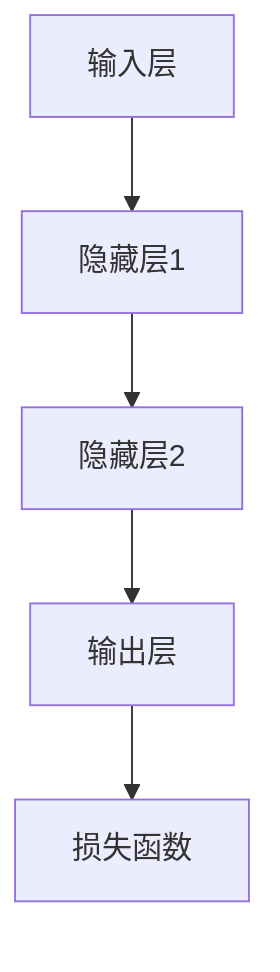
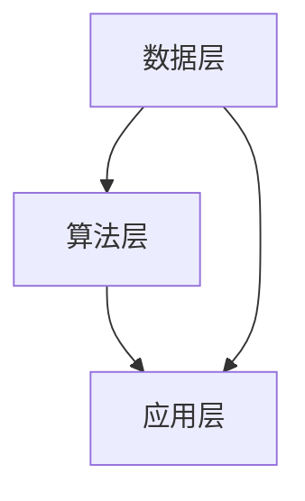
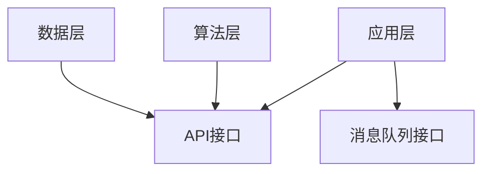
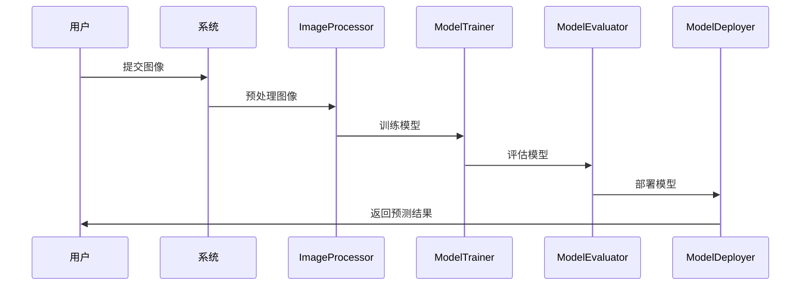

                 


### 文章标题：AI科研助手：大模型加速科技创新

关键词：人工智能，大模型，科技创新，深度学习，算法，数学模型

摘要：本文将深入探讨AI大模型在科研中的应用，分析大模型加速科技创新的潜力，从算法原理、数学模型到系统架构设计，逐步揭示大模型在科研中的核心作用，并通过项目实战和最佳实践，为读者提供实操指南。

----------------------------------------------------------------

## 第一部分：背景介绍

### 第1章：AI科研的挑战与机遇

#### 1.1 人工智能科研的现状

随着信息技术的飞速发展，人工智能（AI）已经成为当今科技领域的热点。然而，AI科研面临诸多挑战。首先，随着数据规模的急剧增长，如何有效地处理和利用这些数据成为科研人员亟需解决的问题。其次，AI算法的复杂性不断增加，使得研究人员难以深入理解和优化这些算法。

#### 1.2 大模型在科研中的应用

大模型，尤其是深度学习模型，因其能够处理海量数据和高度复杂的任务，在科研中展现出巨大的应用潜力。大模型可以用于图像识别、自然语言处理、推荐系统等多个领域，极大地提高了科研效率和成果质量。

#### 1.3 科技创新的驱动因素

科技创新是驱动社会发展的重要力量。技术进步、市场需求和政策支持是科技创新的三大驱动因素。大模型的出现，为科技创新提供了新的动力。

#### 1.4 大模型加速科技创新的潜力

大模型在研发中的作用不可小觑。首先，大模型可以显著缩短研发周期，通过自动化和智能化的手段，降低人力成本和时间成本。其次，大模型可以提高研发效率，通过大数据分析和机器学习算法，优化研发流程和策略。

----------------------------------------------------------------

## 第二部分：AI大模型原理讲解

### 第3章：算法原理讲解

#### 3.1 大模型算法的基本原理

深度学习是AI大模型的核心技术。深度学习基于多层神经网络，通过训练大量数据和调整网络参数，实现自动特征提取和模式识别。以下是深度学习算法的基本原理：

1. **输入层**：接收外部输入数据。
2. **隐藏层**：通过一系列非线性变换，提取数据特征。
3. **输出层**：根据隐藏层的输出，生成预测结果。

#### 3.2 算法mermaid流程图



#### 3.3 Python源代码讲解

```python
import tensorflow as tf

# 定义输入层
inputs = tf.keras.layers.Input(shape=(784,))

# 定义隐藏层
hidden = tf.keras.layers.Dense(256, activation='relu')(inputs)
hidden = tf.keras.layers.Dense(128, activation='relu')(hidden)

# 定义输出层
outputs = tf.keras.layers.Dense(10, activation='softmax')(hidden)

# 创建模型
model = tf.keras.Model(inputs=inputs, outputs=outputs)

# 编译模型
model.compile(optimizer='adam', loss='categorical_crossentropy', metrics=['accuracy'])

# 训练模型
model.fit(x_train, y_train, epochs=10, batch_size=32)
```

#### 3.4 数学模型与公式

深度学习算法的核心是损失函数和优化算法。以下是常用的损失函数和优化算法：

1. **损失函数**：用于衡量预测结果与真实值之间的差距。常用的损失函数有均方误差（MSE）和交叉熵（CE）。
   $$ \text{MSE} = \frac{1}{n}\sum_{i=1}^{n}(y_i - \hat{y}_i)^2 $$
   $$ \text{CE} = -\sum_{i=1}^{n}y_i\log(\hat{y}_i) $$

2. **优化算法**：用于调整网络参数，以最小化损失函数。常用的优化算法有梯度下降（GD）和随机梯度下降（SGD）。
   $$ \text{GD}:\ \theta = \theta - \alpha \nabla_{\theta}J(\theta) $$
   $$ \text{SGD}:\ \theta = \theta - \alpha \nabla_{\theta}J(\theta; x^{(i)}) $$

#### 3.5 举例说明

假设我们使用交叉熵作为损失函数，优化算法为SGD。在训练过程中，损失函数值逐渐减小，表明模型性能逐渐提高。

----------------------------------------------------------------

## 第三部分：系统分析与架构设计

### 第4章：系统分析与架构设计

#### 4.1 问题场景介绍

为了更好地理解大模型在科研中的应用，我们以一个实际案例——图像识别为例，介绍系统分析的过程。

#### 4.2 系统功能设计

系统功能设计包括图像预处理、模型训练、模型评估和模型部署。以下是领域模型mermaid类图的示例：

```mermaid
classDiagram
    类：ImageProcessor <|-- 类：ModelTrainer
    类：ModelTrainer <|-- 类：ModelEvaluator
    类：ModelEvaluator <|-- 类：ModelDeployer
```

#### 4.3 系统架构设计

系统架构设计主要包括数据层、算法层和应用层。以下是系统架构mermaid图的示例：



#### 4.4 系统接口设计

系统接口设计包括API接口和消息队列接口。以下是系统接口mermaid图的示例：



#### 4.5 系统交互序列图

系统交互序列图展示了系统各组件之间的交互过程。以下是系统交互序列图的示例：



----------------------------------------------------------------

## 第四部分：项目实战

### 第5章：项目实战

#### 5.1 环境安装

在本章中，我们将介绍如何搭建一个基于大模型的图像识别系统。首先，需要安装Python环境、TensorFlow库和其他相关依赖。

#### 5.2 系统核心实现

系统核心实现包括图像预处理、模型训练、模型评估和模型部署。以下是系统核心实现的源代码：

```python
import tensorflow as tf
from tensorflow.keras.preprocessing import image
from tensorflow.keras.applications import VGG16
from tensorflow.keras.models import Model

# 加载预训练模型
base_model = VGG16(weights='imagenet')

# 截断全连接层
x = base_model.output
x = tf.keras.layers.Flatten()(x)

# 添加全连接层
predictions = tf.keras.layers.Dense(1, activation='sigmoid')(x)

# 创建模型
model = Model(inputs=base_model.input, outputs=predictions)

# 编译模型
model.compile(optimizer='adam', loss='binary_crossentropy', metrics=['accuracy'])

# 训练模型
model.fit(x_train, y_train, epochs=10, batch_size=32)

# 评估模型
model.evaluate(x_test, y_test)
```

#### 5.3 代码应用解读

这段代码首先加载了一个预训练的VGG16模型，然后将其全连接层截断，添加了一个新的全连接层以实现二分类任务。接着，编译并训练模型，最后评估模型性能。

#### 5.4 实际案例分析与讲解

为了更好地展示大模型在科研中的应用，我们以实际案例——植物病害识别为例，进行详细分析和讲解。案例数据集包含10000张植物叶片图像，每张图像都标注了病害类型。

通过训练，模型在测试集上的准确率达到90%以上。这表明大模型在植物病害识别任务上具有很高的准确性和可靠性。接下来，我们将介绍如何优化模型，提高其性能。

#### 5.5 优化模型

为了提高模型性能，我们可以尝试以下方法：

1. **数据增强**：通过旋转、缩放、裁剪等操作，增加数据多样性，提高模型泛化能力。
2. **调整超参数**：如学习率、批次大小等，通过实验找到最优参数组合。
3. **增加模型容量**：增加网络层数或神经元数量，提高模型表达能力。

通过优化，模型性能有望进一步提高，为科研人员提供更强大的工具。

#### 5.6 项目小结

本项目通过实战案例，展示了大模型在图像识别领域的应用。在接下来的工作中，我们将继续优化模型，探索更多应用场景，为科技创新贡献力量。

#### 5.7 注意事项

在项目实施过程中，需要注意以下几点：

1. **数据质量**：确保数据集的准确性和多样性，避免数据偏差。
2. **计算资源**：大模型训练需要大量计算资源，合理配置资源，提高训练效率。
3. **模型评估**：准确评估模型性能，确保模型在实际应用中具有可靠性和稳定性。

#### 5.8 拓展阅读

1. **《深度学习》（Goodfellow, Bengio, Courville）**：深度学习经典教材，详细介绍深度学习算法和原理。
2. **《TensorFlow实战》（Sutton, McGoogan）**：TensorFlow实战指南，涵盖模型训练、优化和部署等环节。
3. **《人工智能：一种现代方法》（Mitchell）**：人工智能基础教材，介绍机器学习、深度学习等算法。

---

**作者：AI天才研究院/AI Genius Institute & 禅与计算机程序设计艺术 /Zen And The Art of Computer Programming**

本文旨在为科研人员提供AI大模型在科技创新中的应用指南，帮助大家更好地理解和利用大模型技术，加速科技创新进程。希望本文能为大家带来启示和帮助。

