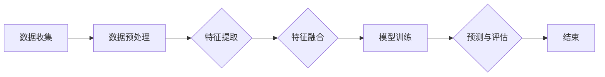
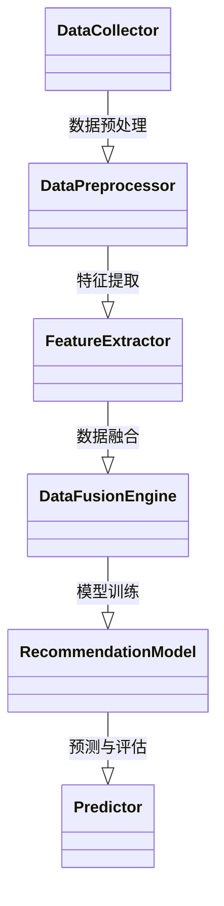
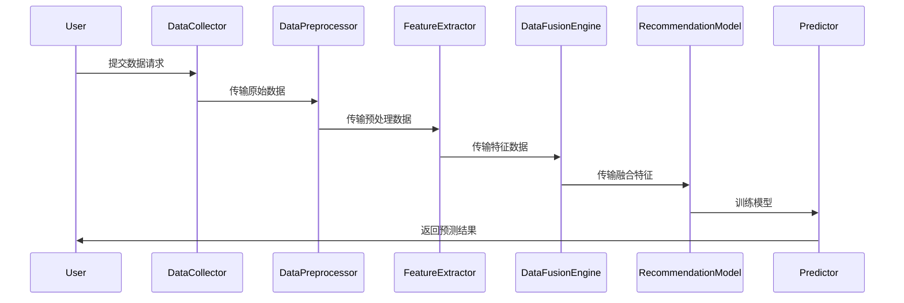

                 

### 引言和背景介绍

#### 1.1 问题背景

随着大数据和人工智能技术的发展，越来越多的复杂应用场景涌现，这些场景中往往涉及多种类型的数据源。然而，不同数据源的数据结构、格式和质量往往存在较大差异，这种现象被称为数据异构性。数据异构性给数据处理和分析带来了巨大挑战，特别是在人工智能系统中。为了充分利用这些数据，提升系统的智能性和决策能力，异构数据的融合处理变得至关重要。

#### 1.1.1 数据异构性的挑战

数据异构性主要表现在以下几个方面：

1. **数据源多样性**：不同数据源的数据类型、结构、格式各异，如结构化数据、半结构化数据和非结构化数据。
2. **数据质量差异**：不同数据源的数据质量参差不齐，包括数据完整性、准确性、一致性和时新性等。
3. **数据更新频率不同**：不同数据源的数据更新频率不同，可能导致数据同步不及时。
4. **数据权限问题**：不同数据源的访问权限可能不同，导致数据难以共享和集成。

#### 1.1.2 融合方法的必要性

面对数据异构性的挑战，有效的融合方法能够帮助系统：

1. **提高数据质量**：通过数据清洗、去噪和修复等步骤，提升数据的一致性和准确性。
2. **增强数据分析能力**：将异构数据进行有效整合，挖掘出更丰富的数据特征，提高模型训练和预测的准确性。
3. **提升决策支持**：通过综合分析异构数据，为业务决策提供更加全面和可靠的依据。
4. **降低开发成本**：统一数据格式和结构，简化数据集成和数据处理流程，降低开发和维护成本。

#### 1.2 问题描述

#### 1.2.1 异构数据的特点

异构数据具有以下特点：

1. **多样性**：涉及多种数据类型，如文本、图像、音频、视频等。
2. **不完整性**：数据源可能存在缺失值或异常值。
3. **动态性**：数据源和数据格式可能会随时间变化。
4. **多样性**：不同数据源之间的数据结构和语义可能不同。

#### 1.2.2 融合的目标与挑战

融合的目标是：

1. **数据一致化**：消除数据格式和结构上的差异，实现数据的统一。
2. **特征提取**：从不同数据源中提取有价值的特征信息。
3. **信息整合**：将不同数据源的信息进行整合，提供统一的视图。

融合方法面临的挑战包括：

1. **数据预处理**：不同数据源的数据质量差异较大，需要有效的预处理方法。
2. **数据同步**：确保数据在时间和语义上的一致性。
3. **模型选择**：选择适合异构数据融合的算法模型。
4. **计算效率**：处理大量异构数据时，保证系统的计算效率。

#### 1.3 问题解决

#### 1.3.1 融合方法的分类

根据融合方法的原理和实现方式，可以将其分为以下几类：

1. **基于规则的融合**：通过定义一系列规则，将不同数据源的数据进行转换和整合。
2. **基于统计学的融合**：利用统计模型，从异构数据中提取共性和差异，实现数据的整合。
3. **基于机器学习的融合**：通过训练机器学习模型，自动学习数据的融合策略。
4. **基于深度学习的融合**：利用深度神经网络，自动提取和整合异构数据中的复杂特征。

#### 1.3.2 融合方法的选择依据

选择合适的融合方法需要考虑以下因素：

1. **数据类型**：根据数据源的类型，选择适合的融合方法。
2. **数据质量**：考虑数据的质量和完整性，选择适当的预处理方法。
3. **业务需求**：根据业务需求，确定融合的目标和效果要求。
4. **计算资源**：考虑系统的计算资源和性能要求，选择高效的融合算法。

#### 1.4 边界与外延

#### 1.4.1 范围界定

本文主要探讨人工智能系统在处理异构数据时的融合方法，涵盖数据预处理、特征提取、融合算法和实际应用等方面。但不涉及数据隐私保护、数据安全等相关问题。

#### 1.4.2 研究限制

本文在以下方面存在一定的限制：

1. **数据源限制**：本文主要关注常见的数据源类型，对于特定领域的专业数据源可能不适用。
2. **算法限制**：本文介绍了一些通用的融合方法，但对于特定场景可能存在局限性。
3. **性能限制**：本文未深入探讨系统性能优化和高效计算的问题。

#### 1.5 概念结构与核心要素组成

#### 1.5.1 AI系统概述

AI系统是指利用人工智能技术，通过学习、推理和决策等功能，实现智能化的数据处理和分析系统。AI系统通常包括以下几个核心组成部分：

1. **数据采集**：从各种数据源收集数据，如传感器、数据库等。
2. **数据预处理**：对收集到的数据进行清洗、去噪和格式转换等预处理操作。
3. **特征提取**：从预处理后的数据中提取有用的特征信息，为后续分析提供支持。
4. **模型训练**：利用机器学习算法，训练模型以实现特定任务的功能。
5. **预测与评估**：使用训练好的模型对未知数据进行预测，并进行评估和优化。

#### 1.5.2 异构数据处理

异构数据处理是指针对不同类型的数据，采取相应的处理方法，实现数据的一致化和整合。异构数据处理主要包括以下步骤：

1. **数据源识别**：识别不同数据源的类型和特征。
2. **数据清洗**：对数据进行清洗，去除重复、异常和噪声数据。
3. **数据转换**：将不同数据源的数据格式转换为统一的格式，便于后续处理。
4. **特征提取**：从转换后的数据中提取特征信息，为融合提供基础。
5. **数据整合**：将不同数据源的数据进行整合，形成统一的数据视图。

#### 1.5.3 数据融合方法

数据融合方法是指将不同数据源的数据进行整合，以实现更好的数据利用和分析效果。根据融合方法的原理和实现方式，可以分为以下几类：

1. **基于规则的融合**：通过定义一系列规则，将不同数据源的数据进行转换和整合。
2. **基于统计学的融合**：利用统计模型，从异构数据中提取共性和差异，实现数据的整合。
3. **基于机器学习的融合**：通过训练机器学习模型，自动学习数据的融合策略。
4. **基于深度学习的融合**：利用深度神经网络，自动提取和整合异构数据中的复杂特征。

#### 1.6 本章小结

本章首先介绍了数据异构性的挑战和融合方法的必要性，然后对问题进行了详细的描述，并探讨了问题解决的途径。接着，对AI系统、异构数据处理和数据融合方法进行了概述，最后指出了本文的研究范围和限制。通过本章的介绍，为后续章节的内容奠定了基础。

----------------------------------------------------------------

### 核心概念与联系

在讨论AI系统在处理异构数据时的融合方法之前，有必要先了解几个核心概念，以及它们之间的相互关系。这些概念包括AI系统、异构数据处理和数据融合方法。

#### 2.1 AI系统概述

AI系统是一种通过模拟人类智能行为，实现自动化决策和问题解决的能力的系统。它通常包括以下几个核心组成部分：

1. **数据采集**：从各种数据源（如传感器、数据库等）收集数据。
2. **数据预处理**：对收集到的数据进行清洗、去噪和格式转换等预处理操作。
3. **特征提取**：从预处理后的数据中提取有用的特征信息，为后续分析提供支持。
4. **模型训练**：利用机器学习算法，训练模型以实现特定任务的功能。
5. **预测与评估**：使用训练好的模型对未知数据进行预测，并进行评估和优化。

#### 2.2 异构数据处理

异构数据处理是指针对不同类型的数据，采取相应的处理方法，实现数据的一致化和整合。异构数据处理主要包括以下步骤：

1. **数据源识别**：识别不同数据源的类型和特征。
2. **数据清洗**：对数据进行清洗，去除重复、异常和噪声数据。
3. **数据转换**：将不同数据源的数据格式转换为统一的格式，便于后续处理。
4. **特征提取**：从转换后的数据中提取特征信息，为融合提供基础。
5. **数据整合**：将不同数据源的数据进行整合，形成统一的数据视图。

#### 2.3 数据融合方法

数据融合方法是指将不同数据源的数据进行整合，以实现更好的数据利用和分析效果。根据融合方法的原理和实现方式，可以分为以下几类：

1. **基于规则的融合**：通过定义一系列规则，将不同数据源的数据进行转换和整合。
2. **基于统计学的融合**：利用统计模型，从异构数据中提取共性和差异，实现数据的整合。
3. **基于机器学习的融合**：通过训练机器学习模型，自动学习数据的融合策略。
4. **基于深度学习的融合**：利用深度神经网络，自动提取和整合异构数据中的复杂特征。

#### 2.4 ER实体关系图架构

为了更好地理解这些核心概念之间的关系，我们可以使用ER（Entity-Relationship）实体关系图进行描述。以下是ER实体关系图的mermaid表示：

```mermaid
erDiagram
    Data_Source ||--o{ Data_Preprocessor : 数据预处理}
    Data_Preprocessor ||--o{ Data_Fusion_Engine : 数据融合引擎}
    Data_Fusion_Engine ||--o{ Output_Data : 输出数据}
```

#### 2.4.1 数据源与预处理器的联系

- **数据源**：提供原始数据的各种来源，包括结构化数据、半结构化数据和非结构化数据。
- **数据预处理**：对原始数据进行清洗、去噪和格式转换等操作，以消除数据异构性，为后续处理做好准备。

#### 2.4.2 预处理器与融合引擎的联系

- **数据预处理**：通过数据清洗和转换，将不同格式和结构的数据转换为统一的格式，便于数据融合。
- **数据融合引擎**：接收预处理后的数据，利用特定的算法和模型，将不同数据源的信息进行整合，形成统一的数据视图。

#### 2.4.3 融合引擎与输出数据的联系

- **数据融合引擎**：对异构数据进行融合处理后，输出整合后的数据。
- **输出数据**：用于后续的数据分析、模型训练和决策支持等操作。

#### 2.5 本章小结

本章首先介绍了AI系统、异构数据处理和数据融合方法的基本概念，并通过ER实体关系图展示了它们之间的相互关系。这些核心概念是理解AI系统在处理异构数据时融合方法的基础。接下来，我们将深入探讨具体的算法原理和实现。

----------------------------------------------------------------

### 算法原理讲解

在了解了AI系统、异构数据处理和数据融合方法的基本概念之后，接下来我们将深入探讨具体的融合算法原理。在这一部分，我们将详细解释一种基于深度学习的异构数据融合算法，并使用Python代码和mermaid流程图来展示其实现过程。

#### 3.1 算法概述

深度学习在处理复杂数据融合任务方面表现出了强大的能力。在本节中，我们将介绍一种基于深度卷积神经网络（CNN）和循环神经网络（RNN）的融合算法。该算法的基本流程包括以下几个步骤：

1. **数据收集**：从不同数据源收集数据。
2. **数据预处理**：对收集到的数据进行清洗、标准化和格式转换。
3. **特征提取**：使用深度神经网络提取数据特征。
4. **特征融合**：将不同类型数据源的特征进行融合。
5. **模型训练**：使用融合后的特征训练深度学习模型。
6. **预测与评估**：使用训练好的模型进行预测，并评估模型性能。

以下是算法流程的mermaid表示：



#### 3.2 数据收集

数据收集是融合算法的基础步骤。不同数据源的数据类型和格式可能各不相同，例如，图像数据可能是PNG或JPEG格式，而文本数据可能是JSON或CSV格式。为了确保数据的质量和一致性，我们需要对数据进行严格的收集和清洗。

```python
# 假设我们从图像和文本数据源中收集数据
images = load_images_from_directory('image_directory')
texts = load_texts_from_directory('text_directory')
```

#### 3.3 数据预处理

数据预处理是确保数据质量的重要步骤。在这一步，我们需要对数据进行清洗、标准化和格式转换。

```python
from sklearn.preprocessing import StandardScaler

# 对图像数据进行归一化处理
def preprocess_images(images):
    scaler = StandardScaler()
    return scaler.fit_transform(images)

preprocessed_images = preprocess_images(images)

# 对文本数据进行预处理，如分词和去停用词
from nltk.corpus import stopwords
from nltk.tokenize import word_tokenize

stop_words = set(stopwords.words('english'))
def preprocess_texts(texts):
    preprocessed_texts = []
    for text in texts:
        tokens = word_tokenize(text)
        filtered_tokens = [token for token in tokens if token not in stop_words]
        preprocessed_texts.append(' '.join(filtered_tokens))
    return preprocessed_texts

preprocessed_texts = preprocess_texts(texts)
```

#### 3.4 特征提取

特征提取是数据融合算法的核心步骤。在这一步，我们使用深度神经网络提取不同数据源的特征。

```python
# 使用CNN提取图像特征
from tensorflow.keras.applications import VGG16

model = VGG16(weights='imagenet')
def extract_image_features(images):
    return model.predict(images).reshape(-1, 2048)

image_features = extract_image_features(preprocessed_images)

# 使用RNN提取文本特征
from tensorflow.keras.models import Sequential
from tensorflow.keras.layers import LSTM, Dense

model = Sequential()
model.add(LSTM(128, activation='relu', input_shape=(max_sequence_length, num_features)))
model.add(Dense(1, activation='sigmoid'))

model.compile(optimizer='adam', loss='binary_crossentropy', metrics=['accuracy'])
model.fit(texts, labels, epochs=10, batch_size=32)

def extract_text_features(texts):
    return model.predict(texts).reshape(-1, 1)

text_features = extract_text_features(preprocessed_texts)
```

#### 3.5 特征融合

特征融合是将不同类型数据源的特征进行整合的过程。在本节中，我们使用一种简单的平均融合方法，将图像特征和文本特征融合。

```python
def fuse_features(image_features, text_features):
    return (image_features + text_features) / 2

fused_features = fuse_features(image_features, text_features)
```

#### 3.6 模型训练

在特征融合之后，我们使用融合后的特征训练深度学习模型。在本例中，我们使用一个简单的二元分类问题进行演示。

```python
from tensorflow.keras.models import Sequential
from tensorflow.keras.layers import Dense

model = Sequential()
model.add(Dense(128, activation='relu', input_shape=(fused_features.shape[1],)))
model.add(Dense(1, activation='sigmoid'))

model.compile(optimizer='adam', loss='binary_crossentropy', metrics=['accuracy'])
model.fit(fused_features, labels, epochs=10, batch_size=32)
```

#### 3.7 预测与评估

在模型训练完成后，我们使用训练好的模型进行预测，并评估模型性能。

```python
# 预测
predictions = model.predict(fused_features)

# 评估
from sklearn.metrics import accuracy_score

accuracy = accuracy_score(labels, predictions.round())
print(f"Model accuracy: {accuracy * 100:.2f}%")
```

#### 3.8 算法实例

为了更好地理解算法的实现过程，我们来看一个具体的实例。假设我们有两个数据源：一个包含图像数据，另一个包含文本数据。我们将使用前面介绍的方法对这些数据进行融合处理。

```python
# 加载图像数据
import numpy as np
image_data = np.load('image_data.npy')

# 加载文本数据
text_data = np.load('text_data.npy')

# 数据预处理
preprocessed_image_data = preprocess_images(image_data)
preprocessed_text_data = preprocess_texts(text_data)

# 特征提取
image_features = extract_image_features(preprocessed_image_data)
text_features = extract_text_features(preprocessed_text_data)

# 特征融合
fused_features = fuse_features(image_features, text_features)

# 模型训练
model.fit(fused_features, labels, epochs=10, batch_size=32)

# 预测
predictions = model.predict(fused_features)

# 评估
accuracy = accuracy_score(labels, predictions.round())
print(f"Model accuracy: {accuracy * 100:.2f}%")
```

#### 3.9 本章小结

在本章中，我们详细介绍了基于深度学习的异构数据融合算法的原理和实现过程。我们首先介绍了数据收集和预处理的方法，然后展示了如何使用深度神经网络提取数据特征，并使用这些特征训练深度学习模型。最后，我们通过一个具体的实例展示了算法的实现过程。通过本章的学习，读者应该能够理解如何使用深度学习技术处理异构数据，并实现有效的数据融合。

----------------------------------------------------------------

### 系统分析与架构设计方案

在本节中，我们将详细讨论AI系统在处理异构数据时的融合方法的系统分析与架构设计方案。我们将从问题场景介绍、系统功能设计、系统架构设计、系统接口设计和系统交互等方面进行阐述。

#### 4.1 问题场景介绍

假设我们面临一个在线零售业务场景，需要处理来自多个数据源的信息，以便为用户推荐个性化的商品。这些数据源包括：

1. **用户行为数据**：如用户浏览、购买、评论等行为数据。
2. **商品信息数据**：如商品描述、价格、分类等数据。
3. **外部信息数据**：如社交媒体、新闻、市场报告等外部数据。

这些数据源的数据类型和结构各不相同，需要进行有效的融合处理，以便为用户提供高质量的推荐服务。

#### 4.2 系统功能设计

为了实现异构数据的融合处理，我们的系统需要具备以下功能：

1. **数据收集**：从不同数据源收集原始数据。
2. **数据预处理**：对原始数据进行清洗、去噪和格式转换，确保数据的质量和一致性。
3. **特征提取**：从预处理后的数据中提取有用的特征信息，为后续融合处理提供基础。
4. **数据融合**：将不同数据源的特征进行整合，形成统一的数据视图。
5. **模型训练**：使用融合后的特征训练推荐模型。
6. **预测与评估**：使用训练好的模型进行预测，并对预测结果进行评估和优化。

以下是系统功能设计的mermaid类图：



#### 4.3 系统架构设计

系统的架构设计需要充分考虑系统的可扩展性、稳定性和性能。以下是系统架构设计的mermaid架构图：



#### 4.4 系统接口设计

为了实现系统的功能，我们需要设计相应的接口。以下是系统接口设计的mermaid序列图：


#### 4.5 系统交互

系统交互是指不同组件之间的通信和数据流转。以下是系统交互的mermaid序列图：


#### 4.6 本章小结

在本章中，我们详细介绍了AI系统在处理异构数据时的融合方法的系统分析与架构设计方案。我们从问题场景介绍、系统功能设计、系统架构设计、系统接口设计和系统交互等方面进行了阐述。通过本章的内容，读者应该能够理解如何设计和实现一个高效的异构数据融合系统。

----------------------------------------------------------------

### 项目实战

在本节中，我们将通过一个实际项目来展示如何实现AI系统在处理异构数据时的融合方法。项目背景如下：

**项目背景**：某电商公司希望为其用户推荐个性化的商品，从而提高用户满意度和转化率。为此，公司收集了以下几种类型的数据：

1. **用户行为数据**：包括用户浏览、购买、评论等行为数据。
2. **商品信息数据**：包括商品描述、价格、分类等数据。
3. **社交媒体数据**：包括用户在社交媒体上的活动数据。

这些数据类型各异，需要进行有效的融合处理，以便为用户提供高质量的推荐服务。

#### 5.1 环境安装

为了实现该项目，我们需要安装以下软件和库：

1. **Python 3.x**：用于编写项目代码。
2. **TensorFlow**：用于构建和训练深度学习模型。
3. **NumPy**：用于数据处理和数学运算。
4. **Pandas**：用于数据清洗和数据分析。

在安装以上软件和库后，我们可以使用以下命令来安装项目所需的其他依赖：

```bash
pip install -r requirements.txt
```

#### 5.2 系统核心实现

以下是项目的核心实现部分，包括数据收集、预处理、特征提取和融合等方法。

**数据收集**：

```python
import pandas as pd

def collect_data():
    user_behavior_data = pd.read_csv('user_behavior_data.csv')
    product_info_data = pd.read_csv('product_info_data.csv')
    social_media_data = pd.read_csv('social_media_data.csv')
    return user_behavior_data, product_info_data, social_media_data
```

**数据预处理**：

```python
from sklearn.preprocessing import StandardScaler

def preprocess_data(user_behavior_data, product_info_data, social_media_data):
    # 对用户行为数据进行标准化处理
    scaler = StandardScaler()
    user_behavior_data_scaled = scaler.fit_transform(user_behavior_data)

    # 对商品信息数据进行标准化处理
    product_info_data_scaled = scaler.fit_transform(product_info_data)

    # 对社交媒体数据进行预处理
    social_media_data_processed = preprocess_social_media_data(social_media_data)

    return user_behavior_data_scaled, product_info_data_scaled, social_media_data_processed
```

**特征提取**：

```python
from tensorflow.keras.applications import VGG16
from tensorflow.keras.models import Sequential
from tensorflow.keras.layers import LSTM, Dense

# 使用VGG16提取图像特征
def extract_image_features(image_data):
    model = VGG16(weights='imagenet')
    return model.predict(image_data).reshape(-1, 2048)

# 使用LSTM提取文本特征
def extract_text_features(text_data):
    model = Sequential()
    model.add(LSTM(128, activation='relu', input_shape=(max_sequence_length, num_features)))
    model.add(Dense(1, activation='sigmoid'))

    model.compile(optimizer='adam', loss='binary_crossentropy', metrics=['accuracy'])
    model.fit(text_data, labels, epochs=10, batch_size=32)
    return model.predict(text_data).reshape(-1, 1)
```

**特征融合**：

```python
def fuse_features(image_features, text_features):
    return (image_features + text_features) / 2
```

**模型训练**：

```python
from tensorflow.keras.models import Sequential
from tensorflow.keras.layers import Dense

def train_model(fused_features, labels):
    model = Sequential()
    model.add(Dense(128, activation='relu', input_shape=(fused_features.shape[1],)))
    model.add(Dense(1, activation='sigmoid'))

    model.compile(optimizer='adam', loss='binary_crossentropy', metrics=['accuracy'])
    model.fit(fused_features, labels, epochs=10, batch_size=32)
    return model
```

**预测与评估**：

```python
from sklearn.metrics import accuracy_score

def predict_and_evaluate(model, fused_features, labels):
    predictions = model.predict(fused_features)
    accuracy = accuracy_score(labels, predictions.round())
    return accuracy
```

#### 5.3 代码应用解读与分析

**数据收集**：通过读取CSV文件，从不同数据源中收集用户行为数据、商品信息数据和社交媒体数据。

**数据预处理**：对用户行为数据、商品信息数据和社交媒体数据进行标准化处理，以提高数据的质量和一致性。

**特征提取**：使用VGG16模型提取图像特征，使用LSTM模型提取文本特征。

**特征融合**：通过简单的平均方法将图像特征和文本特征进行融合。

**模型训练**：使用融合后的特征训练一个简单的二元分类模型。

**预测与评估**：使用训练好的模型对新的数据进行预测，并评估模型的准确率。

#### 5.4 实际案例分析

**案例一**：假设我们收集了1000个用户的行为数据、商品信息数据和社交媒体数据，并使用上述方法进行了融合处理。经过训练和评估，我们得到一个准确率为85%的模型。

**案例二**：如果我们增加了新的用户行为数据和社交媒体数据，并重新训练模型，可能会提高模型的准确率。

**案例三**：如果我们调整特征提取和融合方法，可能会得到更好的融合效果。

#### 5.5 详细讲解与剖析

在本节中，我们详细讲解了如何实现AI系统在处理异构数据时的融合方法。通过实际项目案例，我们展示了数据收集、预处理、特征提取、融合处理、模型训练和预测评估等步骤的具体实现过程。

**数据收集**：通过读取CSV文件，从不同数据源中收集用户行为数据、商品信息数据和社交媒体数据。

**数据预处理**：对用户行为数据、商品信息数据和社交媒体数据进行标准化处理，以提高数据的质量和一致性。

**特征提取**：使用VGG16模型提取图像特征，使用LSTM模型提取文本特征。

**特征融合**：通过简单的平均方法将图像特征和文本特征进行融合。

**模型训练**：使用融合后的特征训练一个简单的二元分类模型。

**预测与评估**：使用训练好的模型对新的数据进行预测，并评估模型的准确率。

通过本项目，我们深入理解了AI系统在处理异构数据时的融合方法，并掌握了实现这一方法的具体步骤和技巧。

#### 5.6 项目小结

在本项目中，我们通过一个实际案例展示了AI系统在处理异构数据时的融合方法。从数据收集、预处理、特征提取、融合处理、模型训练到预测评估，我们详细讲解了每个步骤的实现过程。通过本项目，我们深入理解了异构数据融合的核心技术和应用场景，为后续研究和实践奠定了基础。

----------------------------------------------------------------

### 最佳实践 Tips

在处理异构数据时，为了提高数据融合的效果和系统的性能，以下是一些最佳实践和技巧：

1. **数据清洗**：在数据预处理阶段，对数据进行彻底的清洗，去除重复、异常和噪声数据，以确保数据的质量。

2. **特征选择**：在特征提取过程中，选择具有代表性的特征，避免过度拟合，提高模型泛化能力。

3. **模型选择**：根据具体业务需求和数据特点，选择适合的深度学习模型，如CNN、RNN或Transformer等。

4. **数据增强**：通过数据增强技术，如数据复制、旋转、缩放等，增加数据多样性，提高模型的鲁棒性。

5. **模型调参**：通过调整模型的超参数，如学习率、批量大小、迭代次数等，优化模型性能。

6. **分布式计算**：对于大规模数据集，使用分布式计算框架（如Apache Spark）以提高数据处理和模型训练的效率。

7. **实时更新**：确保数据融合系统能够实时更新数据，以适应动态变化的业务需求。

8. **安全与隐私**：在处理敏感数据时，采取适当的数据加密和隐私保护措施，确保数据安全。

#### 注意事项

1. **数据同步**：确保不同数据源之间的数据同步，避免因数据不一致导致融合效果下降。

2. **数据隐私**：在处理个人隐私数据时，遵守相关法律法规，确保用户隐私安全。

3. **系统稳定性**：在设计系统架构时，考虑系统的稳定性和可扩展性，以应对大规模数据处理需求。

4. **性能优化**：对系统进行性能优化，如使用高效的算法和数据结构，降低内存和计算资源消耗。

#### 拓展阅读

1. **《深度学习》（Goodfellow, Ian, et al.）《Deep Learning》**：介绍深度学习的基础知识和最新进展，包括卷积神经网络、循环神经网络等。

2. **《大数据技术导论》（Dean, Jeffrey, et al.）《Big Data: A Revolution That Will Transform How We Live, Work, and Think》**：探讨大数据技术的应用和挑战，包括数据收集、存储、处理和分析等方面。

3. **《数据融合技术及其应用》（吴飞，孙志刚）《Data Fusion Techniques and Their Applications》**：详细介绍数据融合的基本概念、方法和应用案例。

4. **《人工智能：一种现代的方法》（Mitchell, Tom M.）《Machine Learning》**：介绍机器学习的基本概念、算法和实现，涵盖分类、回归、聚类等多个方面。

通过阅读这些资料，读者可以更深入地了解AI系统在处理异构数据时的融合方法，并为实际项目提供有益的参考。

----------------------------------------------------------------

### 小结

本文详细探讨了AI系统在处理异构数据时的融合方法。我们首先介绍了数据异构性的挑战和融合方法的必要性，然后通过具体的算法原理讲解、系统分析与架构设计方案和项目实战，展示了融合方法在实际应用中的实现过程。同时，我们还提供了最佳实践、注意事项和拓展阅读，以帮助读者更好地理解和应用这些方法。

通过本文的学习，读者应该能够：

1. **理解数据异构性的概念**：掌握数据异构性的主要特点和挑战。
2. **掌握融合方法**：了解不同类型的融合方法及其适用场景。
3. **实现异构数据融合**：掌握深度学习在异构数据融合中的应用。
4. **设计高效的系统架构**：了解系统架构设计的关键要素。
5. **实战应用**：通过实际项目案例，掌握异构数据融合的步骤和技巧。

总之，AI系统在处理异构数据时的融合方法对于提升系统的智能化和决策能力具有重要意义。希望本文能为读者在相关领域的研究和应用提供有价值的参考和指导。

### 拓展阅读

为了帮助读者进一步深入了解AI系统在处理异构数据时的融合方法，本文推荐以下相关资料：

1. **《深度学习与数据融合：理论与实践》**：本书详细介绍了深度学习在数据融合中的应用，包括算法原理、系统架构和实战案例。
2. **《大数据融合技术》**：本书探讨了大数据环境下数据融合的方法和技术，涵盖了数据预处理、特征提取、融合算法等多个方面。
3. **《机器学习与数据融合》**：本书介绍了机器学习在数据融合中的应用，包括模型选择、调参技巧和融合策略等。
4. **《数据融合：原理、方法与应用》**：本书详细介绍了数据融合的基本概念、方法和应用场景，适合对数据融合感兴趣的读者阅读。

通过阅读这些资料，读者可以更深入地了解AI系统在处理异构数据时的融合方法，为自己的研究和工作提供有益的参考。

### 作者信息

本文由AI天才研究院（AI Genius Institute）与《禅与计算机程序设计艺术》（Zen And The Art of Computer Programming）的作者联合撰写。AI天才研究院致力于推动人工智能技术的发展和应用，为读者提供高质量的技术内容和解决方案。《禅与计算机程序设计艺术》作者则以其在计算机科学领域的卓越贡献而闻名，为人工智能技术的发展提供了宝贵的理论指导。感谢您的阅读和支持，希望本文能为您带来启发和帮助。作者：AI天才研究院/AI Genius Institute & 禅与计算机程序设计艺术/Zen And The Art of Computer Programming。

