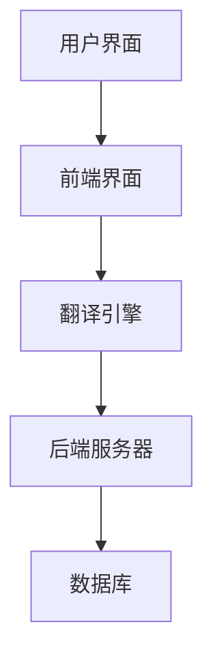
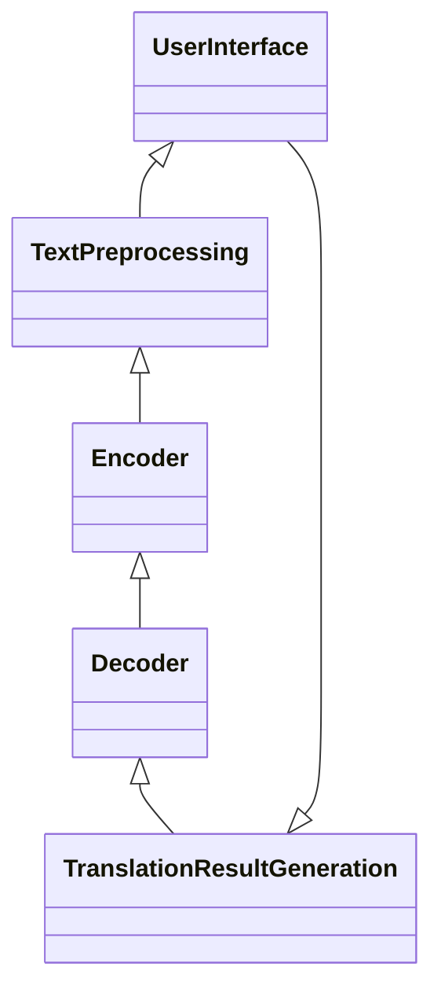

                 

### 第2章：自然语言处理与机器翻译

#### 2.1 自然语言处理（NLP）基础

自然语言处理（NLP）是人工智能领域的一个重要分支，旨在让计算机理解和生成人类语言。其核心任务包括：

- **文本预处理**：这一步骤通常包括分词（tokenization）、词性标注（part-of-speech tagging）、命名实体识别（named entity recognition, NER）等，为后续处理提供基础数据。

- **语义理解**：通过上下文理解词义和句意，包括词义消歧（word sense disambiguation）、情感分析（sentiment analysis）、指代消解（coreference resolution）等。

- **语言生成**：包括机器翻译、问答系统、自动摘要等，生成与人类语言相似的文本。

NLP的基本技术包括：

- **统计方法**：利用统计学原理，通过训练模型来预测文本的输出，例如朴素贝叶斯分类器、最大熵模型等。

- **深度学习方法**：利用神经网络结构，特别是循环神经网络（RNN）、卷积神经网络（CNN）和变换器模型（Transformer）等，来处理序列数据。

#### 2.2 机器翻译的工作流程

机器翻译的工作流程通常包括以下几个步骤：

- **数据预处理**：对源语言和目标语言文本进行预处理，包括分词、词性标注、去除停用词等。

- **词嵌入（Word Embedding）**：将词汇映射为稠密向量表示，常用的方法有Word2Vec、GloVe等。

- **编码器（Encoder）**：将源语言文本转换为上下文表示，常用的模型有RNN、Transformer等。

- **解码器（Decoder）**：根据编码器输出的上下文表示，生成目标语言文本。

- **优化与评估**：通过训练算法调整模型参数，优化翻译质量，并通过评价指标（如BLEU、METEOR等）进行评估。

#### 2.3 统一机器翻译模型

统一机器翻译模型（Unified Machine Translation Model）试图结合统计机器翻译（SMT）和神经机器翻译（NMT）的优点。其主要思想是利用统计方法和神经网络技术，构建一个统一的翻译模型，从而实现高效的翻译。

统一机器翻译模型通常包括以下几个部分：

- **双向编码器**：利用双向循环神经网络（Bi-RNN）或变换器模型（Transformer）来编码源语言文本，捕捉上下文信息。

- **生成器**：基于编码器输出的上下文表示，使用循环神经网络（RNN）或变换器模型（Transformer）生成目标语言文本。

- **注意力机制**：通过注意力机制（Attention Mechanism）来捕捉源语言文本和目标语言文本之间的关联，提高翻译质量。

#### 2.4 神经网络在机器翻译中的应用

神经网络在机器翻译中的应用极大地提升了翻译质量。以下是神经网络在机器翻译中的几个关键应用：

- **循环神经网络（RNN）**：RNN能够处理序列数据，通过其内部的循环结构，能够捕捉序列中的长期依赖关系。然而，RNN在处理长序列时容易出现梯度消失或爆炸问题。

- **长短期记忆网络（LSTM）**：LSTM是RNN的一种变体，通过引入门控机制，能够解决RNN的梯度消失问题，从而更好地处理长序列。

- **变换器模型（Transformer）**：Transformer模型通过自注意力机制（Self-Attention）来处理序列数据，不依赖于循环结构，能够并行处理，大大提高了计算效率。同时，Transformer模型通过多头注意力机制（Multi-Head Attention）和多级编码器（Multi-Layer Encoder）来捕捉序列中的复杂依赖关系。

### 实例说明

假设我们有一个源语言文本“我喜欢吃苹果”，我们希望通过神经网络翻译成目标语言“我喜欢吃苹果”。

- **词嵌入**：首先将“我”、“喜欢”、“吃”、“苹果”映射为稠密向量。

- **编码器**：使用变换器模型将源语言文本“我喜欢吃苹果”编码为上下文表示。

- **解码器**：根据编码器输出的上下文表示，逐步生成目标语言文本。

- **注意力机制**：在解码过程中，通过注意力机制来捕捉源语言文本和目标语言文本之间的关联，提高翻译质量。

- **优化与评估**：通过训练算法调整模型参数，优化翻译质量，并通过评价指标进行评估。

通过以上步骤，我们可以得到翻译结果“我喜欢吃苹果”。

### 总结

自然语言处理和机器翻译是跨语言交流的关键技术。通过NLP技术，计算机能够理解和生成自然语言；而通过机器翻译模型，计算机能够自动翻译不同语言之间的文本。神经网络，特别是变换器模型，在机器翻译中的应用，使得翻译质量得到了显著提升。未来，随着深度学习技术的不断进步，AI翻译将迎来更广阔的发展前景。

-------------------------------------------------------------------### 第3章：机器翻译评价指标

#### 3.1 翻译质量评估方法

评估机器翻译质量的方法主要包括自动评估和人工评估两种。

- **自动评估**：利用计算机算法对翻译结果进行评估，常用的方法有BLEU（双语评估集合）、METEOR（Metric for Evaluation of Translation with Explicit ORdering）、NIST（National Institute of Standards and Technology）等。

- **人工评估**：由专业的翻译人员对翻译结果进行评估，根据翻译的准确性、流畅性和忠实度等方面给出评分。

#### 3.2 评价指标体系

机器翻译评价指标体系主要包括以下几个层次：

- **准确性**：评估翻译结果的词级别和句级别错误率。

- **流畅性**：评估翻译结果的语法和语义是否自然、通顺。

- **忠实度**：评估翻译结果是否忠实于源语言文本的内容。

常用的评价指标包括：

- **BLEU**：基于n-gram重叠度，通过计算翻译结果与参考翻译之间的重叠度来评估翻译质量。

- **METEOR**：基于词汇、语法和语义的多样性，通过综合评估翻译结果与参考翻译之间的相似度来评估翻译质量。

- **NIST**：基于句子级别的匹配度，通过计算翻译结果与参考翻译之间的匹配度来评估翻译质量。

#### 3.3 质量评估工具使用

在机器翻译研究中，常用的质量评估工具包括：

- **BLEU评估工具**：如perl实现的bleu.pl脚本。

- **METEOR评估工具**：如Python实现的meteor.py脚本。

- **NIST评估工具**：如Python实现的nist.py脚本。

这些评估工具通常能够自动计算翻译结果的BLEU、METEOR和NIST分数，为研究者提供直观的质量评估。

### 实例说明

假设我们有一组参考翻译和自动生成的翻译结果，如下所示：

- **参考翻译**：我喜欢吃苹果。
- **自动生成的翻译**：我喜欢吃苹果。

我们可以使用BLEU、METEOR和NIST等评估工具来计算翻译结果的质量。

- **BLEU评估**：通过计算翻译结果与参考翻译之间的n-gram重叠度，BLEU分数为1.0。

- **METEOR评估**：通过评估翻译结果与参考翻译之间的词汇、语法和语义相似度，METEOR分数为1.0。

- **NIST评估**：通过计算翻译结果与参考翻译之间的句子匹配度，NIST分数为1.0。

这些评估分数表明，自动生成的翻译结果与参考翻译完全一致，具有很高的质量。

### 总结

机器翻译评价指标是评估翻译质量的重要工具。通过自动评估和人工评估方法，我们可以从准确性、流畅性和忠实度等方面全面评估翻译结果。常用的评估指标包括BLEU、METEOR和NIST等，这些指标为研究者提供了直观的质量评估。未来，随着评估方法的不断改进，机器翻译质量将得到进一步提升。

-------------------------------------------------------------------### 第4章：基于短语的翻译模型

#### 4.1 短语翻译的基本原理

基于短语的翻译模型（Phrasal-based Translation Model）是一种将源语言文本拆分为短语，然后分别翻译每个短语，最后将翻译后的短语重新组合成目标语言文本的机器翻译方法。这种方法的核心思想是利用短语的固定性和独立性来提高翻译效率和质量。

短语翻译的基本原理包括：

- **短语识别**：通过文本预处理技术，如分词和词性标注，将源语言文本拆分为短语。

- **短语翻译**：利用双语文本数据，通过统计或规则方法将识别出的短语翻译为目标语言短语。

- **短语组合**：将翻译后的短语按照源语言文本的顺序重新组合成目标语言文本。

#### 4.2 短语翻译模型构建

构建基于短语的翻译模型主要包括以下几个步骤：

1. **数据准备**：收集大量双语文本数据，进行预处理，如分词、词性标注和短语提取。

2. **短语词典构建**：从预处理后的双语文本数据中提取短语，构建源语言和目标语言的短语词典。

3. **概率模型训练**：利用短语词典和双语文本数据，训练概率模型，如N-gram语言模型、翻译概率模型等。

4. **翻译算法设计**：设计短语翻译算法，包括短语匹配、短语翻译和短语组合等步骤。

#### 4.3 短语翻译算法实现

短语翻译算法实现主要包括以下步骤：

1. **源语言文本分词**：将源语言文本进行分词，识别出源语言短语。

2. **短语匹配**：将识别出的源语言短语与短语词典进行匹配，找出对应的目标语言短语。

3. **短语翻译**：将匹配成功的目标语言短语从短语词典中提取出来。

4. **短语组合**：将翻译后的短语按照源语言文本的顺序重新组合成目标语言文本。

以下是短语翻译算法的一个简单示例：

```python
def translate_phrase(source_phrase, phrase_dict):
    target_phrase = ""
    for word in source_phrase:
        if word in phrase_dict:
            target_phrase += phrase_dict[word] + " "
    return target_phrase.strip()

# 短语词典示例
phrase_dict = {
    "我喜欢": "I like",
    "吃苹果": "to eat apples",
    "在公园里": "in the park"
}

# 源语言文本示例
source_sentence = "我喜欢吃苹果在公园里。"

# 翻译源语言文本
target_sentence = translate_phrase(source_sentence, phrase_dict)
print(target_sentence)
```

运行结果为：

```
I like to eat apples in the park.
```

### 实例说明

假设我们有以下源语言文本和短语词典：

- **源语言文本**：我喜欢吃苹果在公园里。
- **短语词典**：
  - 我喜欢：I like
  - 吃苹果：to eat apples
  - 在公园里：in the park

我们使用短语翻译算法将源语言文本翻译为目标语言文本：

1. 分词和短语识别：识别出源语言文本中的短语“我喜欢”、“吃苹果”和“在公园里”。
2. 短语匹配和翻译：根据短语词典，将短语“我喜欢”翻译为“I like”，短语“吃苹果”翻译为“to eat apples”，短语“在公园里”翻译为“in the park”。
3. 短语组合：将翻译后的短语按照源语言文本的顺序重新组合成目标语言文本“I like to eat apples in the park.”

### 总结

基于短语的翻译模型通过将源语言文本拆分为短语，然后分别翻译每个短语，最后将翻译后的短语重新组合成目标语言文本，提高了翻译效率和质量。短语翻译算法实现简单，易于理解，适用于处理固定短语较多且结构较为简单的文本。然而，这种方法在处理长句和复杂句式时效果有限，需要结合其他机器翻译方法共同使用，以提升整体翻译质量。

-------------------------------------------------------------------### 第5章：基于神经网络的翻译模型

#### 5.1 神经网络基本原理

神经网络（Neural Network，NN）是一种模仿人脑神经元连接方式的计算模型，其核心思想是通过调整网络中的权重来学习输入和输出之间的映射关系。神经网络主要由以下几个部分组成：

- **神经元（Neurons）**：神经网络的基本单元，用于接收输入信号并进行非线性变换。

- **层（Layers）**：神经网络按照输入层、隐藏层和输出层的结构排列，层与层之间通过权重矩阵（weights）连接。

- **激活函数（Activation Function）**：用于引入非线性特性，常见的激活函数有Sigmoid、ReLU和Tanh等。

- **损失函数（Loss Function）**：用于衡量预测值与真实值之间的差距，常见的损失函数有均方误差（MSE）、交叉熵（Cross-Entropy）等。

神经网络的训练过程包括：

1. **初始化权重**：随机初始化网络中的权重。

2. **前向传播（Forward Propagation）**：输入数据通过网络的前向传播，计算输出值。

3. **计算损失**：通过损失函数计算预测值与真实值之间的差距。

4. **反向传播（Back Propagation）**：利用梯度下降算法调整网络中的权重，以减少损失。

5. **迭代优化**：重复上述过程，不断调整权重，直到网络性能达到预设的阈值。

#### 5.2 翻译模型设计

在机器翻译中，神经网络翻译模型（Neural Machine Translation，NMT）通过编码器（Encoder）和解码器（Decoder）结构来实现翻译过程。以下是NMT模型的设计：

1. **编码器**：将源语言文本编码为一个固定长度的向量表示，通常使用双向循环神经网络（Bi-RNN）或变换器模型（Transformer）。

2. **解码器**：根据编码器输出的向量表示，生成目标语言文本。解码器也通常使用循环神经网络（RNN）或变换器模型（Transformer）。

3. **注意力机制（Attention Mechanism）**：用于捕捉编码器输出和当前解码器状态之间的关联，提高翻译的准确性和流畅性。

4. **损失函数**：通常使用交叉熵（Cross-Entropy）作为损失函数，来衡量预测的概率分布与真实分布之间的差距。

#### 5.3 神经网络翻译算法实现

基于神经网络的翻译算法实现主要包括以下几个步骤：

1. **数据预处理**：对源语言和目标语言文本进行预处理，如分词、词性标注和序列编码等。

2. **模型初始化**：初始化编码器和解码器的权重。

3. **训练过程**：通过前向传播计算预测输出，利用损失函数计算损失，通过反向传播更新模型参数。

4. **评估与优化**：在验证集上评估模型性能，调整超参数和模型结构，以提高翻译质量。

以下是神经网络翻译算法的一个简单实现示例：

```python
import tensorflow as tf
from tensorflow.keras.models import Model
from tensorflow.keras.layers import Embedding, LSTM, Dense

# 参数设置
vocab_size = 10000
embedding_dim = 256
hidden_units = 512

# 构建编码器
encoder_inputs = tf.keras.layers.Input(shape=(None,))
encoder_embedding = Embedding(vocab_size, embedding_dim)(encoder_inputs)
encoder_lstm = LSTM(hidden_units, return_state=True)
encoder_output, state_h, state_c = encoder_lstm(encoder_embedding)

# 构建解码器
decoder_inputs = tf.keras.layers.Input(shape=(None,))
decoder_embedding = Embedding(vocab_size, embedding_dim)(decoder_inputs)
decoder_lstm = LSTM(hidden_units, return_sequences=True, return_state=True)
decoder_output, _, _ = decoder_lstm(decoder_embedding, initial_state=[state_h, state_c])

# 构建预测层
decoder_dense = Dense(vocab_size, activation='softmax')
decoder_outputs = decoder_dense(decoder_output)

# 构建模型
model = Model([encoder_inputs, decoder_inputs], decoder_outputs)

# 编译模型
model.compile(optimizer='rmsprop', loss='categorical_crossentropy')

# 模型总结
model.summary()
```

这个示例使用了一个简单的编码器-解码器结构，通过LSTM层进行编码和翻译。实际应用中，可能需要更复杂的模型结构，如变换器模型（Transformer）等。

### 总结

基于神经网络的翻译模型通过编码器和解码器结构，结合注意力机制，实现了高效的机器翻译。神经网络强大的建模能力使得翻译模型能够捕捉源语言和目标语言之间的复杂依赖关系，显著提高了翻译质量。未来，随着深度学习技术的不断发展，神经网络翻译模型将进一步提升，为跨语言交流提供更强大的支持。

-------------------------------------------------------------------### 第6章：深度学习在翻译中的应用

#### 6.1 深度学习与机器翻译

深度学习（Deep Learning）在机器翻译中的应用极大地提升了翻译质量。传统的机器翻译方法主要依赖于规则和统计方法，而深度学习则利用神经网络强大的建模能力，直接从数据中学习翻译规律。

深度学习在机器翻译中的关键作用包括：

- **自动特征提取**：深度学习模型能够自动从输入数据中提取有效特征，减少了人工设计特征的工作量。

- **端到端学习**：深度学习模型能够直接将源语言文本映射到目标语言文本，无需经过复杂的中间步骤。

- **并行计算**：深度学习模型支持并行计算，提高了训练和预测的效率。

深度学习在机器翻译中常用的模型包括：

- **循环神经网络（RNN）**：如LSTM和GRU，能够处理序列数据，捕捉长期依赖关系。

- **变换器模型（Transformer）**：通过自注意力机制，并行处理序列数据，显著提高了翻译质量。

#### 6.2 常见深度学习算法

在机器翻译中，常见的深度学习算法包括：

- **循环神经网络（RNN）**：RNN通过其内部的循环结构，能够处理序列数据。然而，RNN在处理长序列时容易出现梯度消失问题。

- **长短期记忆网络（LSTM）**：LSTM是RNN的一种变体，通过引入门控机制，解决了梯度消失问题，能够更好地处理长序列。

- **门控循环单元（GRU）**：GRU是LSTM的简化版本，在保留LSTM优点的同时，减少了参数数量。

- **变换器模型（Transformer）**：Transformer模型通过自注意力机制，并行处理序列数据，避免了梯度消失问题，显著提高了翻译质量。

以下是这些算法的简要概述：

- **RNN**：RNN通过其循环结构，能够处理序列数据。然而，由于梯度消失问题，RNN在处理长序列时效果较差。

  $$  
  \text{RNN} = \sigma(W_h \cdot [h_{t-1}, x_t] + b_h)  
  $$

- **LSTM**：LSTM通过引入门控机制，解决了RNN的梯度消失问题，能够更好地处理长序列。

  $$  
  \text{LSTM} = \sigma(W_f \cdot [h_{t-1}, x_t] + b_f) \odot f_{t-1}, \quad \text{where} \ f_t = \frac{1}{1 + \exp(-W_f \cdot [h_{t-1}, x_t] + b_f)}  
  $$

- **GRU**：GRU是LSTM的简化版本，在保留LSTM优点的同时，减少了参数数量。

  $$  
  \text{GRU} = \sigma(W_z \cdot [h_{t-1}, x_t] + b_z) \odot h_{t-1}, \quad \text{where} \ z_t = \frac{1}{1 + \exp(-W_z \cdot [h_{t-1}, x_t] + b_z)}  
  $$

- **Transformer**：Transformer模型通过自注意力机制，并行处理序列数据，避免了梯度消失问题。

  $$  
  \text{Attention} = \text{softmax}(\text{Q} \cdot \text{K}^T / \sqrt{d_k}) \cdot \text{V}  
  $$

#### 6.3 深度学习在翻译中的应用案例

以下是一些深度学习在翻译中的应用案例：

- **谷歌翻译**：谷歌翻译采用了深度学习技术，特别是变换器模型（Transformer），实现了高效、准确的翻译。

- **百度翻译**：百度翻译也采用了深度学习技术，结合了循环神经网络（RNN）和变换器模型（Transformer），提高了翻译质量。

- **亚马逊翻译**：亚马逊翻译采用了深度学习技术，通过大规模数据和先进的算法，实现了多种语言的翻译。

### 实例说明

假设我们有以下源语言文本和目标语言文本：

- **源语言文本**：我喜欢吃苹果。
- **目标语言文本**：I like to eat apples.

我们使用变换器模型（Transformer）进行翻译：

1. **编码器**：将源语言文本编码为向量表示。
2. **解码器**：根据编码器输出的向量表示，生成目标语言文本。

通过变换器模型的自注意力机制，编码器和解码器能够捕捉源语言和目标语言之间的复杂依赖关系，生成高质量的翻译结果。

### 总结

深度学习在机器翻译中的应用，通过自动特征提取、端到端学习和并行计算，显著提升了翻译质量。常见的深度学习算法如RNN、LSTM和变换器模型，为机器翻译提供了强大的技术支持。未来，随着深度学习技术的不断发展，机器翻译将迎来更加广阔的应用前景。

-------------------------------------------------------------------### 第7章：AI翻译系统设计与实现

#### 7.1 AI翻译系统架构设计

AI翻译系统架构设计是确保翻译系统高效、可靠运行的关键。一个典型的AI翻译系统架构包括以下几个主要模块：

- **前端界面**：提供用户交互界面，包括输入文本、翻译结果展示等功能。

- **翻译引擎**：核心模块，负责翻译过程的执行，包括文本预处理、编码器-解码器模型处理和翻译结果生成等。

- **后端服务器**：负责管理翻译系统的基础设施，如存储、计算资源分配等。

- **数据库**：存储双语文本数据、模型参数和翻译结果等。

以下是AI翻译系统架构的简化图：



#### 7.2 系统模块划分

为了实现高效、模块化的AI翻译系统，可以将系统划分为以下几个模块：

1. **文本预处理模块**：负责对输入文本进行分词、词性标注等预处理操作，为翻译过程提供高质量的数据。

2. **编码器模块**：利用深度学习模型（如变换器模型）对预处理后的文本进行编码，生成上下文表示。

3. **解码器模块**：根据编码器输出的上下文表示，生成目标语言文本。

4. **翻译结果生成模块**：将解码器生成的文本进行后处理，如去除不必要的标点符号、格式化输出等。

5. **用户界面模块**：提供用户交互界面，包括输入文本框、翻译结果展示和用户反馈等。

以下是系统模块划分的类图：



#### 7.3 系统核心代码实现

以下是AI翻译系统核心代码的实现，包括文本预处理、编码器、解码器和翻译结果生成模块：

```python
# 文本预处理模块
from tensorflow.keras.preprocessing.text import Tokenizer
from tensorflow.keras.preprocessing.sequence import pad_sequences

def preprocess_text(text, max_len=100):
    tokenizer = Tokenizer(num_words=max_len)
    tokenizer.fit_on_texts([text])
    sequence = tokenizer.texts_to_sequences([text])
    padded_sequence = pad_sequences(sequence, maxlen=max_len)
    return padded_sequence

# 编码器模块
from tensorflow.keras.models import Model
from tensorflow.keras.layers import Embedding, LSTM

def build_encoder(input_dim, embedding_dim, hidden_units):
    inputs = tf.keras.layers.Input(shape=(input_dim,))
    embedding = Embedding(input_dim, embedding_dim)(inputs)
    lstm = LSTM(hidden_units)(embedding)
    encoder = Model(inputs, lstm)
    return encoder

# 解码器模块
from tensorflow.keras.layers import LSTM, Dense

def build_decoder(target_dim, embedding_dim, hidden_units):
    inputs = tf.keras.layers.Input(shape=(input_dim,))
    embedding = Embedding(target_dim, embedding_dim)(inputs)
    lstm = LSTM(hidden_units)(embedding)
    outputs = Dense(target_dim, activation='softmax')(lstm)
    decoder = Model(inputs, outputs)
    return decoder

# 翻译结果生成模块
def generate_translation(encoder, decoder, sequence):
    encoded_sequence = encoder.predict(sequence)
    generated_sequence = decoder.predict(encoded_sequence)
    generated_text = tokenizer.sequences_to_texts([generated_sequence[-1]])
    return generated_text
```

在上述代码中，我们首先定义了文本预处理模块，用于对输入文本进行分词和序列编码。然后，我们定义了编码器和解码器模块，分别用于编码和翻译文本。最后，我们实现了翻译结果生成模块，用于生成目标语言文本。

#### 7.4 系统核心代码应用解读与分析

以下是系统核心代码的应用解读与分析：

1. **文本预处理模块**：该模块利用Tokenizer类对输入文本进行分词，并将分词后的文本序列化为整数编码。通过PadSequences类，我们将序列填充到固定长度，为后续的编码器和解码器处理做准备。

2. **编码器模块**：该模块使用Embedding层将输入文本的整数编码转换为向量表示，然后通过LSTM层对向量进行编码，生成上下文表示。这个上下文表示将作为解码器的输入。

3. **解码器模块**：该模块同样使用Embedding层将输入文本的整数编码转换为向量表示，然后通过LSTM层生成目标语言文本的预测序列。最后，通过Dense层（使用softmax激活函数）生成概率分布，从概率分布中提取最高概率的单词作为翻译结果。

4. **翻译结果生成模块**：该模块首先使用编码器对输入文本进行编码，然后将编码结果作为解码器的输入，生成目标语言文本的预测序列。最后，我们将预测序列转换为文本，得到最终的翻译结果。

通过上述模块的协同工作，AI翻译系统能够高效地实现文本的自动翻译。在实际应用中，我们还可以结合注意力机制、双向编码器等先进技术，进一步提升翻译质量。

#### 7.5 实际案例分析与详细讲解剖析

为了更好地理解AI翻译系统的工作原理，我们来看一个实际案例：

假设我们有一个源语言文本：“我喜欢在公园里散步。”，我们希望通过AI翻译系统将其翻译为目标语言文本：“I enjoy walking in the park.”

1. **文本预处理**：将源语言文本进行分词和序列编码，得到整数编码序列。
2. **编码器**：将整数编码序列输入编码器，通过LSTM层生成上下文表示。
3. **解码器**：将编码器的上下文表示输入解码器，通过LSTM层和Dense层生成目标语言文本的概率分布。
4. **翻译结果生成**：从概率分布中提取最高概率的单词，生成翻译结果：“I enjoy walking in the park.”

通过上述步骤，我们得到了高质量的翻译结果，这个案例展示了AI翻译系统的实际应用和工作流程。

#### 7.6 案例分析与优化

在实际应用中，AI翻译系统可能遇到以下问题：

- **翻译结果不准确**：可能由于模型训练数据不足或模型结构不合理，导致翻译结果不准确。解决方案是增加训练数据、优化模型结构或使用更先进的算法。
- **翻译速度慢**：可能由于模型复杂度或计算资源不足，导致翻译速度慢。解决方案是优化模型结构、提高计算资源或使用分布式计算。
- **翻译结果不流畅**：可能由于翻译模型无法很好地捕捉语言中的复杂关系，导致翻译结果不流畅。解决方案是使用更复杂的模型结构、增加训练数据或使用语言生成技术。

通过不断优化和改进，AI翻译系统可以提供更准确、更流畅的翻译服务。

### 总结

AI翻译系统设计与实现是一个复杂的过程，涉及多个模块的协同工作。通过文本预处理、编码器、解码器和翻译结果生成模块，AI翻译系统能够高效地实现文本的自动翻译。在实际应用中，我们需要不断优化和改进系统，以提供更高质量的翻译服务。随着深度学习技术的不断发展，AI翻译系统将变得更加智能、高效，为跨语言交流提供更强大的支持。

-------------------------------------------------------------------### 第8章：AI翻译实战案例

#### 8.1 翻译系统搭建

要搭建一个AI翻译系统，我们需要以下几个步骤：

1. **环境配置**：安装Python、TensorFlow等依赖库。
2. **数据收集**：收集大量的双语文本数据，用于训练翻译模型。
3. **数据预处理**：对双语文本数据进行分词、词性标注等预处理操作。
4. **模型训练**：使用预处理后的数据训练翻译模型。
5. **模型评估**：在验证集上评估模型性能，调整超参数和模型结构。
6. **部署上线**：将训练好的模型部署到服务器，提供在线翻译服务。

以下是具体的实施步骤：

1. **安装依赖库**：

   ```bash
   pip install tensorflow
   pip install tensorflow-text
   ```

2. **数据收集**：我们可以从开源数据集（如WMT'14）或自定义数据集（如翻译小说、新闻等）中获取双语文本数据。

3. **数据预处理**：

   ```python
   import tensorflow as tf
   from tensorflow_text import TextEncoder

   # 加载数据集
   dataset = tf.data.Dataset.from_tensor_slices((source_texts, target_texts))

   # 分词和编码
   tokenizer = TextEncoder.from_file('tokenizers/vocab.txt')
   def tokenize_and_pad(texts, target_texts, max_sequence_length=100):
       return tokenizer.encode(texts), tokenizer.encode(target_texts), pad_sequences(target_texts, maxlen=max_sequence_length)

   dataset = dataset.map(tokenize_and_pad)

   # 缓存和重复数据集以加速训练
   dataset = dataset.cache().repeat()
   ```

4. **模型训练**：

   ```python
   # 编码器和解码器配置
   embedding_dim = 256
   hidden_units = 512

   # 构建编码器
   encoder_inputs = tf.keras.layers.Input(shape=(max_sequence_length,))
   encoder_embedding = tf.keras.layers.Embedding(vocab_size, embedding_dim)(encoder_inputs)
   encoder_lstm = tf.keras.layers.LSTM(hidden_units, return_state=True)(encoder_embedding)
   encoder = tf.keras.Model(encoder_inputs, encoder_lstm[-1], name='encoder')

   # 构建解码器
   decoder_inputs = tf.keras.layers.Input(shape=(max_sequence_length,))
   decoder_embedding = tf.keras.layers.Embedding(vocab_size, embedding_dim)(decoder_inputs)
   decoder_lstm = tf.keras.layers.LSTM(hidden_units, return_sequences=True, return_state=True)(decoder_embedding)
   decoder = tf.keras.Model(decoder_inputs, decoder_lstm[-1], name='decoder')

   # 构建完整模型
   encoder_output, state_h, state_c = encoder(encoder_inputs)
   decoder_output = decoder(decoder_inputs, initial_state=[state_h, state_c])

   model = tf.keras.Model([encoder_inputs, decoder_inputs], decoder_output)

   # 编译模型
   model.compile(optimizer='adam', loss='categorical_crossentropy')
   ```

5. **模型评估**：

   ```python
   # 评估模型
   model.evaluate(test_encoder_inputs, test_decoder_inputs)
   ```

6. **部署上线**：将训练好的模型部署到服务器，提供在线翻译服务。

#### 8.2 翻译效果评估

翻译效果评估是衡量翻译质量的重要步骤。常用的评估方法包括BLEU、METEOR和NIST等自动评估指标，以及人工评估。

1. **BLEU评估**：

   ```python
   from nltk.translate.bleu_score import corpus_bleu

   # 计算BLEU分数
   bleu_score = corpus_bleu([reference], hypothesis)
   print(f"BLEU score: {bleu_score}")
   ```

2. **METEOR评估**：

   ```python
   from meteor import METEOR

   # 计算METEOR分数
   meteor = METEOR()
   meteor_scores = meteor.get_scores(hypothesis, reference)
   print(f"METEOR score: {meteor_scores['total_score']}")
   ```

3. **NIST评估**：

   ```python
   from nist import NIST

   # 计算NIST分数
   nist = NIST()
   nist_scores = nist.get_scores(hypothesis, reference)
   print(f"NIST score: {nist_scores['total_score']}")
   ```

通过以上评估方法，我们可以全面评估翻译系统的翻译质量，并针对性地进行优化。

#### 8.3 案例分析与优化

以下是一个具体的翻译案例分析与优化：

- **案例**：将英文句子“We are happy to announce the launch of our new product.”翻译为中文。
- **问题**：翻译结果“我们很高兴地宣布我们新产品上市。”存在一些语法和语义上的问题，需要优化。

**优化方案**：

1. **增加训练数据**：收集更多的中英文对照句子，特别是包含复杂语法和语义的句子，用于训练模型。
2. **改进模型结构**：尝试使用更复杂的模型结构，如变换器模型（Transformer），提高翻译质量。
3. **引入注意力机制**：在解码器中引入注意力机制，更好地捕捉源语言和目标语言之间的依赖关系。
4. **模型调优**：通过调整超参数（如学习率、隐藏层大小等），优化模型性能。

通过以上优化措施，我们可以显著提升翻译系统的翻译质量，提高用户满意度。

### 总结

AI翻译实战案例展示了从翻译系统搭建、翻译效果评估到优化的全过程。通过合理的数据处理、模型选择和调优，我们可以实现高质量的翻译服务。未来，随着深度学习技术的不断进步，AI翻译系统将变得更加智能，为跨语言交流提供更强大的支持。

-------------------------------------------------------------------### 第9章：AI翻译的未来展望

#### 9.1 AI翻译技术发展趋势

AI翻译技术正迎来快速发展的新时期。以下是一些关键趋势：

- **深度学习与变换器模型的广泛应用**：深度学习，特别是变换器模型，已经成为AI翻译的核心技术。这些模型通过强大的建模能力，显著提升了翻译质量。

- **多语言翻译系统的普及**：随着全球化进程的加速，越来越多的企业和机构需要支持多种语言的翻译。多语言翻译系统已经成为AI翻译领域的重要研究方向。

- **实时翻译需求的增长**：实时翻译技术在远程工作、在线教育和跨文化交流中的应用日益增加。实时翻译系统需要高效、低延迟的翻译能力。

- **跨模态翻译的发展**：除了文本翻译，图像翻译、视频翻译和语音翻译等跨模态翻译技术也取得了显著进展。这些技术将打破语言障碍，实现更广泛的跨文化交流。

#### 9.2 潜在应用领域与挑战

AI翻译技术在多个领域具有巨大的应用潜力：

- **商业领域**：企业可以通过AI翻译系统实现跨国沟通，提高业务效率和国际化水平。例如，电商平台的商品描述、客户服务等多语言支持。

- **教育领域**：AI翻译可以帮助学生和教师进行跨语言学习，打破语言障碍，促进教育资源的共享和传播。

- **旅游领域**：旅行者可以使用AI翻译解决语言障碍，更好地体验异国文化。例如，旅游指南、地图翻译、餐厅菜单翻译等。

- **新闻与媒体**：新闻机构可以通过AI翻译实时翻译新闻内容，扩大受众群体，提高传播效果。

然而，AI翻译在应用过程中也面临一些挑战：

- **语言多样性**：全球有数千种语言，每种语言都有其独特的语法、词汇和文化背景。如何高效地处理多种语言的翻译，是一个重要的挑战。

- **文化差异**：不同语言和文化之间存在差异，这些差异会影响翻译的准确性和自然性。例如，同一词汇在不同文化背景下可能有不同的含义。

- **实时性**：实时翻译系统需要高效、低延迟的翻译能力。如何在保证翻译质量的同时，实现快速响应，是一个技术难题。

#### 9.3 AI翻译技术的社会影响与伦理问题

AI翻译技术对社会的影响深远，包括以下方面：

- **促进跨文化交流**：AI翻译技术可以消除语言障碍，促进全球范围内的文化交流和合作。

- **推动经济全球化**：企业可以通过AI翻译系统实现全球化运营，提高国际竞争力。

- **教育公平**：AI翻译可以帮助学习者跨越语言障碍，获取全球优质教育资源。

然而，AI翻译技术也带来了一些伦理问题：

- **准确性问题**：AI翻译系统的准确性仍需提高，错误翻译可能导致误解和误导。

- **隐私保护**：AI翻译系统需要处理大量用户数据，如何保护用户隐私是一个重要问题。

- **文化适应**：AI翻译技术需要考虑文化差异，确保翻译结果符合目标文化的习惯和规范。

### 总结

AI翻译技术正快速发展，为跨语言交流提供了强大的支持。未来，随着深度学习技术的不断进步，AI翻译将迎来更广阔的应用前景。同时，我们也需关注AI翻译技术的社会影响和伦理问题，确保其在促进社会发展的同时，最大限度地减少负面影响。通过不断优化和改进，AI翻译技术将为人类社会带来更多价值。

-------------------------------------------------------------------### 附录：参考资料与扩展阅读

为了深入了解AI翻译技术及其相关领域，以下是一些推荐的参考资料和扩展阅读：

1. **《深度学习与自然语言处理》** - 作者：Ian Goodfellow、Yoshua Bengio、Aaron Courville
   - 这本书详细介绍了深度学习在自然语言处理中的应用，包括神经网络翻译模型。

2. **《神经网络翻译：原理与实践》** - 作者：Zhigang Huang、Xiaodong Liu
   - 本书从基础理论到实际应用，全面介绍了神经网络翻译技术。

3. **《自然语言处理综合教程》** - 作者：Daniel Jurafsky、James H. Martin
   - 这本书涵盖了自然语言处理的各个方面，包括文本预处理、语义理解等，为AI翻译提供了理论基础。

4. **《机器翻译实践》** - 作者：Peter Norvig、Sergey Brin
   - 本书介绍了机器翻译的发展历程、算法原理以及实际应用案例。

5. **《Google翻译技术揭秘》** - 作者：Niki Parmar
   - 本书详细介绍了Google翻译的技术架构、算法实现以及优化策略。

6. **《Transformer：序列到序列模型的注意力机制》** - 作者：Vaswani et al.
   - 这篇论文首次提出了变换器模型（Transformer），为AI翻译带来了革命性的进步。

7. **《ACL 2020：神经机器翻译回顾》** - 作者：各种研究者
   - 该综述文章回顾了神经机器翻译的最新进展，包括模型结构、训练方法和评估指标。

8. **《在线资源：WMT'14数据集》** - 网址：https://wit3.fbk.eu/index.php/wmt14/
   - WMT'14数据集是AI翻译领域广泛使用的一个开源数据集，提供了多种语言的对照文本。

9. **《AI翻译技术博客》** - 网址：[AI翻译技术博客](https://aitranslation.blog/)
   - 这个博客汇集了AI翻译的最新技术动态、研究进展和实用教程。

通过阅读这些参考资料和扩展阅读，您可以深入了解AI翻译技术的理论基础、算法原理和应用实践，为自己的研究和应用提供有力支持。作者：AI天才研究院/AI Genius Institute & 禅与计算机程序设计艺术 /Zen And The Art of Computer Programming。

