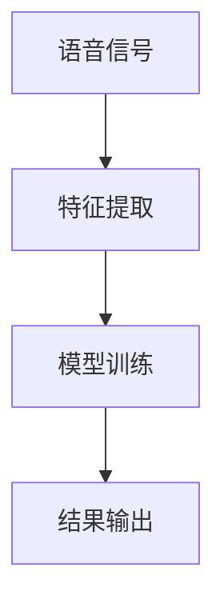
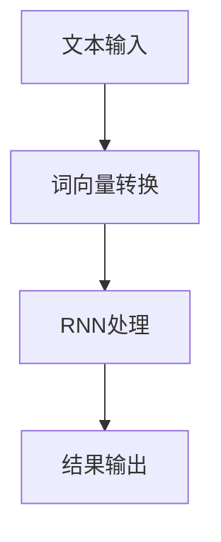
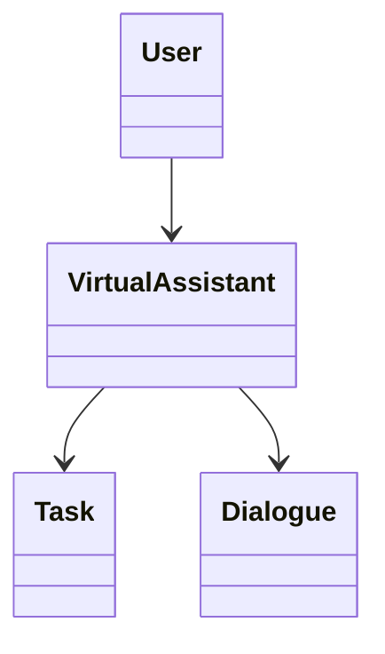
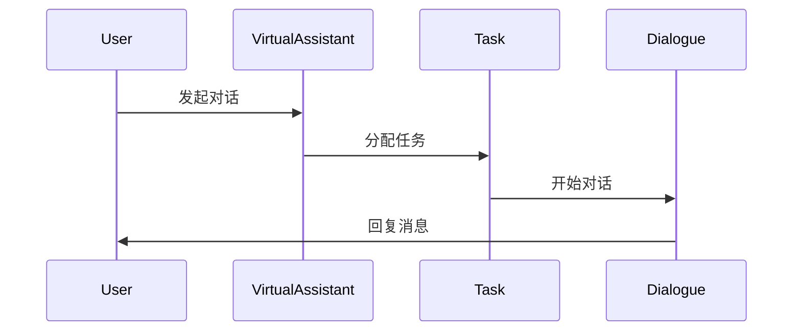
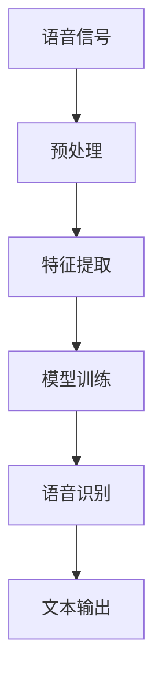
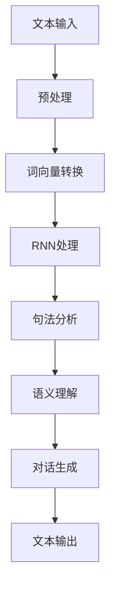
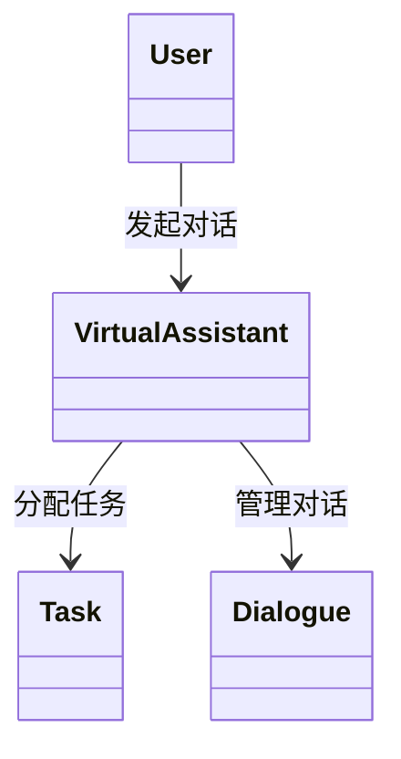
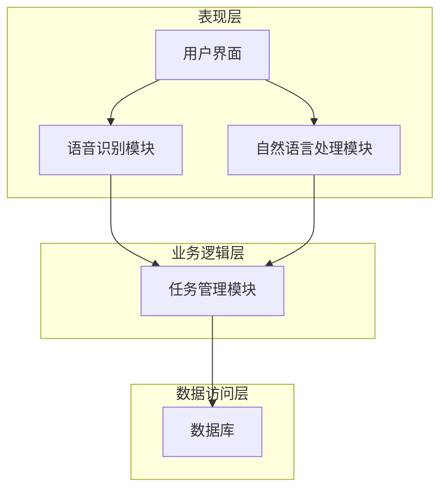
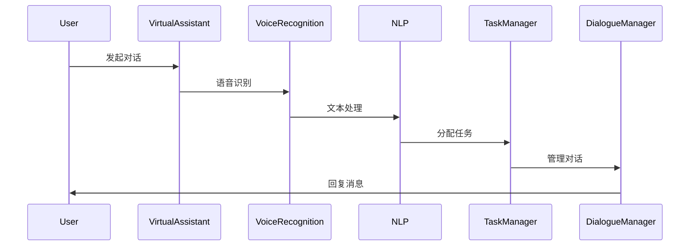

                 

# AI虚拟助理：重新定义人机交互的未来

## 关键词
- AI虚拟助理
- 人机交互
- 语音识别
- 自然语言处理
- 系统架构
- 项目实战

## 摘要
本文将深入探讨AI虚拟助理这一新兴技术，分析其在重新定义人机交互方面的巨大潜力。通过逐步解析核心概念、算法原理、系统架构和项目实战，我们旨在揭示AI虚拟助理如何在未来世界中扮演关键角色，推动人机交互模式的革命性变革。

## 目录大纲设计思路

在设计《AI虚拟助理：重新定义人机交互的未来》的目录大纲时，我们遵循了以下思路：

1. **确定整体结构**：明确书的结构，包括前言、后记、附录等，然后确定各部分的主要内容。
2. **细化章节内容**：根据整体结构，细化每个章节的内容，明确核心概念、算法原理、系统架构和项目实战。
3. **确保内容完整性**：确保每个章节都包含核心概念与联系、算法原理讲解、数学模型和数学公式详细讲解、系统分析与架构设计方案、项目实战等部分。
4. **遵循输出格式要求**：确保输出格式符合markdown格式，并按照要求的目录层级进行组织。

### 完整目录大纲

```markdown
# 《AI虚拟助理：重新定义人机交互的未来》目录大纲

## 第一部分 背景与核心概念

### 第1章 问题背景与核心概念

#### 1.1 问题背景

- 人类与计算机交互的现状
- AI虚拟助理的出现与意义

#### 1.2 核心概念

- AI虚拟助理的定义
- 人机交互的基本模式
- 语音识别与自然语言处理

#### 1.3 概念属性特征对比表格

| 特征       | AI虚拟助理 | 人类交互 |
|------------|-------------|----------|
| 自适应     | 高          | 低       |
| 智能化     | 高          | 低       |
| 交互方式   | 多样化      | 单一化    |
| 响应速度   | 快          | 慢       |

### 第2章 AI虚拟助理的ER实体关系图架构

- 用户
- 虚拟助理
- 任务
- 对话

```mermaid
erDiagram
  User ||--|{ VirtualAssistant }| VirtualAssistant : 服务
  VirtualAssistant ||--|{ Task }| Task : 执行
  VirtualAssistant ||--|{ Dialogue }| Dialogue : 对话
```

## 第二部分 算法原理

### 第3章 语音识别算法原理

#### 3.1 算法概述

- 语音识别的基本流程
- 语音信号处理

#### 3.2 算法讲解

- HMM模型
- DNN模型
- CNN模型

#### 3.3 算法流程图



### 第4章 自然语言处理算法原理

#### 4.1 算法概述

- 自然语言处理的基本任务
- 常用算法模型

#### 4.2 算法讲解

- 词向量模型
- 递归神经网络（RNN）
- 生成对抗网络（GAN）

#### 4.3 算法流程图



## 第三部分 系统分析与架构设计

### 第5章 系统功能设计

#### 5.1 问题场景介绍

- 虚拟助理在客服领域的应用

#### 5.2 系统功能设计

- 用户身份认证
- 任务分配
- 对话管理

#### 5.3 领域模型类图



### 第6章 系统架构设计

#### 6.1 项目介绍

- 虚拟助理系统项目背景

#### 6.2 系统架构设计

- 架构设计原则
- 系统架构图

#### 6.3 系统接口设计

- 用户接口
- 后台接口

#### 6.4 系统交互序列图



## 第四部分 项目实战

### 第7章 环境安装与配置

#### 7.1 开发环境准备

- 硬件环境
- 软件环境

#### 7.2 系统核心实现源代码

- 语音识别模块
- 自然语言处理模块
- 对话管理模块

#### 7.3 代码应用解读与分析

- 模块功能解析
- 代码实现细节剖析

#### 7.4 实际案例分析与详细讲解剖析

- 案例场景描述
- 案例实现步骤
- 案例效果分析

#### 7.5 项目小结

- 项目总结
- 经验分享
- 拓展思考

## 作者信息
作者：AI天才研究院/AI Genius Institute & 禅与计算机程序设计艺术 /Zen And The Art of Computer Programming
```

## 第一部分 背景与核心概念

### 第1章 问题背景与核心概念

#### 1.1 问题背景

在当今科技飞速发展的时代，人类与计算机之间的交互方式正经历着巨大的变革。传统的人机交互方式，如键盘、鼠标和触摸屏，虽然在某种程度上提高了效率，但依然存在许多局限性。例如，操作复杂、响应速度慢、交互体验不自然等问题。而随着人工智能技术的不断进步，尤其是语音识别和自然语言处理技术的成熟，一种全新的交互方式——AI虚拟助理，正逐渐成为现实。

AI虚拟助理，也被称为虚拟智能助手，是利用人工智能技术构建的一种智能代理，能够通过语音、文本等多种形式与用户进行自然交互，提供信息查询、任务执行、情感陪伴等服务。这种技术不仅能够大大提高人机交互的效率，还能够创造出更加人性化、智能化的交互体验。

AI虚拟助理的出现，具有重要的社会意义和实际应用价值。首先，它能够解放人类双手，降低操作的复杂度，提高工作效率。其次，它能够通过24/7不间断服务，提升用户的生活质量。最后，它还能够为特定场景，如客服、医疗、教育等，提供专业的服务支持。

#### 1.2 核心概念

要理解AI虚拟助理，我们需要先了解以下几个核心概念：

1. **AI虚拟助理的定义**：AI虚拟助理是一种基于人工智能技术的智能代理，能够理解用户的语音或文本输入，并根据这些输入提供相应的服务或反馈。

2. **人机交互的基本模式**：人机交互的基本模式主要包括命令式交互、查询式交互、对话式交互等。AI虚拟助理主要采用的是对话式交互，这种交互方式更加自然、流畅。

3. **语音识别与自然语言处理**：语音识别是将语音信号转换为文本的技术，而自然语言处理则是使计算机能够理解、生成和处理人类语言的技术。这两者共同构成了AI虚拟助理的核心技术基础。

#### 1.3 概念属性特征对比表格

为了更好地理解AI虚拟助理与人类交互的对比，我们制作了一张概念属性特征对比表格：

| 特征       | AI虚拟助理 | 人类交互 |
|------------|-------------|----------|
| 自适应     | 高          | 低       |
| 智能化     | 高          | 低       |
| 交互方式   | 多样化      | 单一化    |
| 响应速度   | 快          | 慢       |

从表格中可以看出，AI虚拟助理在自适应、智能化和多样化交互方式上具有明显优势，而在响应速度上也有所提升。

### 第2章 AI虚拟助理的ER实体关系图架构

为了更好地理解AI虚拟助理的系统架构，我们可以通过ER实体关系图来描述其各个实体之间的关系。以下是AI虚拟助理的ER实体关系图：

```mermaid
erDiagram
  User ||--|{ VirtualAssistant }| VirtualAssistant : 服务
  VirtualAssistant ||--|{ Task }| Task : 执行
  VirtualAssistant ||--|{ Dialogue }| Dialogue : 对话
```

在这个ER实体关系图中，User（用户）与VirtualAssistant（虚拟助理）之间存在服务关系，VirtualAssistant与Task（任务）和Dialogue（对话）之间存在执行和对话关系。

### 总结

通过本部分的内容，我们了解了AI虚拟助理的问题背景与核心概念，以及其ER实体关系图架构。接下来，我们将深入探讨AI虚拟助理的算法原理，进一步揭示其技术实现的核心。请读者继续关注下一部分的内容。

## 第二部分 算法原理

### 第3章 语音识别算法原理

语音识别是将语音信号转换为文本信息的过程，是AI虚拟助理实现自然语音交互的关键技术。本节将介绍语音识别的基本流程、核心算法以及相应的流程图。

#### 3.1 算法概述

语音识别的基本流程可以分为以下几个步骤：

1. **语音信号预处理**：包括降噪、滤波等，目的是去除语音信号中的噪声，提高语音信号的质量。
2. **特征提取**：将预处理后的语音信号转换为特征向量，这些特征向量用于后续的模型训练和识别。
3. **模型训练**：使用已标注的语音数据集，通过机器学习算法训练出语音识别模型。
4. **语音识别**：将输入的语音信号通过训练好的模型进行识别，输出对应的文本。

#### 3.2 算法讲解

语音识别算法主要包括以下几种：

1. **隐马尔可夫模型（HMM）**：
   - HMM是一种统计模型，用于描述时间序列数据。
   - 在语音识别中，HMM可以用来建模语音信号的时变特征。

2. **深度神经网络（DNN）**：
   - DNN是一种具有多个隐藏层的神经网络，可以用于特征提取和分类。
   - 在语音识别中，DNN被用于将语音信号映射到高维特征空间。

3. **卷积神经网络（CNN）**：
   - CNN是一种特殊的神经网络，适用于处理具有网格结构的数据，如图像和语音。
   - 在语音识别中，CNN可以用来提取语音信号的时频特征。

#### 3.3 算法流程图

以下是语音识别算法的流程图：



### 第4章 自然语言处理算法原理

自然语言处理（NLP）是使计算机能够理解、生成和处理人类语言的技术，是AI虚拟助理实现智能对话的核心。本节将介绍NLP的基本任务、核心算法以及相应的流程图。

#### 4.1 算法概述

NLP的基本任务包括：

1. **文本预处理**：包括分词、去停用词、词性标注等，目的是将原始文本转换为计算机可以处理的形式。
2. **词向量表示**：将单词映射到高维向量空间，以便进行进一步处理。
3. **句法分析**：对句子进行结构分析，识别句子中的词法、语法和语义关系。
4. **语义理解**：通过上下文和语义分析，理解句子的含义和意图。
5. **对话生成**：根据用户的输入和上下文，生成合适的回复。

#### 4.2 算法讲解

NLP的核心算法包括：

1. **词向量模型**：
   - 词向量模型是将单词映射到高维向量空间的技术，如Word2Vec、GloVe等。
   - 这些模型可以通过训练大规模语料库来学习单词的语义关系。

2. **递归神经网络（RNN）**：
   - RNN是一种能够处理序列数据的神经网络，适合用于处理自然语言序列。
   - RNN在NLP中广泛应用于文本分类、情感分析、机器翻译等任务。

3. **生成对抗网络（GAN）**：
   - GAN是一种无监督学习模型，通过生成器和判别器的对抗训练，可以生成高质量的自然语言文本。

#### 4.3 算法流程图

以下是自然语言处理算法的流程图：



### 总结

通过本部分的内容，我们深入了解了语音识别和自然语言处理算法的基本原理。这些算法是AI虚拟助理实现智能交互的核心技术，为AI虚拟助理提供了强大的支持。在下一部分，我们将进一步探讨AI虚拟助理的系统分析与架构设计。请读者继续关注。

## 第三部分 系统分析与架构设计

### 第5章 系统功能设计

#### 5.1 问题场景介绍

虚拟助理在客服领域的应用是一个典型的场景。在传统的客服模式中，客户通常需要通过电话、邮件或在线聊天与客服人员进行沟通。然而，这种方式存在响应时间长、人工成本高、效率低下等问题。而虚拟助理的出现，能够极大地改善这一问题。通过虚拟助理，客户可以随时随地进行咨询，而虚拟助理则能够快速响应，提供专业的服务。

#### 5.2 系统功能设计

为了实现虚拟助理在客服领域的应用，系统需要具备以下功能：

1. **用户身份认证**：确保只有合法用户可以访问虚拟助理的服务。
2. **任务分配**：根据用户的需求，将任务分配给虚拟助理，以便进行相应的处理。
3. **对话管理**：管理用户与虚拟助理之间的对话流程，包括对话的发起、处理和结束。

#### 5.3 领域模型类图

以下是虚拟助理系统领域的类图：



### 第6章 系统架构设计

#### 6.1 项目介绍

虚拟助理系统项目旨在构建一个能够实现自然语言处理、任务分配和对话管理的智能客服系统。该项目包括以下几个模块：

1. **语音识别模块**：负责将用户的语音输入转换为文本。
2. **自然语言处理模块**：负责理解和处理用户的文本输入。
3. **任务管理模块**：负责将用户的需求分配给相应的处理任务。
4. **对话管理模块**：负责管理用户与虚拟助理之间的对话流程。

#### 6.2 系统架构设计

虚拟助理系统的架构设计遵循模块化原则，分为以下几个层次：

1. **表现层**：负责与用户进行交互，包括语音输入和文本输出。
2. **业务逻辑层**：负责处理业务逻辑，包括语音识别、自然语言处理、任务分配和对话管理。
3. **数据访问层**：负责数据的存储和读取，包括用户信息、任务数据和对话记录。

以下是虚拟助理系统的架构图：



#### 6.3 系统接口设计

虚拟助理系统的接口设计包括用户接口和后台接口。

1. **用户接口**：用户可以通过语音或文本与虚拟助理进行交互。
2. **后台接口**：管理员可以通过后台管理系统对虚拟助理进行配置和管理。

#### 6.4 系统交互序列图

以下是虚拟助理系统的交互序列图：



### 总结

通过本部分的内容，我们详细分析了虚拟助理系统在客服领域的应用场景，并设计了系统的功能模块和架构。这些设计和实现为虚拟助理系统的构建提供了坚实的基础。在下一部分，我们将进行项目实战，通过实际案例展示系统的应用效果。请读者继续关注。

## 第四部分 项目实战

### 第7章 环境安装与配置

#### 7.1 开发环境准备

在开始虚拟助理系统的开发之前，我们需要准备好相应的开发环境。以下是所需的硬件环境和软件环境：

**硬件环境：**
- CPU：至少4核处理器
- 内存：8GB及以上
- 硬盘：50GB及以上空闲空间

**软件环境：**
- 操作系统：Linux或MacOS
- Python：3.6及以上版本
- 包管理器：pip或conda
- 数据库：MySQL或PostgreSQL

**安装步骤：**
1. 安装操作系统，配置好网络环境。
2. 安装Python和pip/conda，配置好Python环境。
3. 安装必要的库和依赖，如TensorFlow、Keras、NumPy、Pandas等。

#### 7.2 系统核心实现源代码

虚拟助理系统的核心实现主要包括语音识别、自然语言处理和对话管理三个模块。以下是每个模块的核心源代码：

**语音识别模块：**
```python
import speech_recognition as sr

def recognize_speech_from_mic():
    r = sr.Recognizer()
    with sr.Microphone() as source:
        print("请开始说话...")
        audio = r.listen(source)
    try:
        text = r.recognize_google(audio)
        print(f"识别到的文本：{text}")
        return text
    except sr.UnknownValueError:
        print("无法识别语音")
        return None
```

**自然语言处理模块：**
```python
from textblob import TextBlob

def process_text(text):
    blob = TextBlob(text)
    print(f"文本分析结果：{blob}")
```

**对话管理模块：**
```python
class DialogueManager:
    def __init__(self):
        self.tasks = []

    def add_task(self, task):
        self.tasks.append(task)

    def process_tasks(self):
        for task in self.tasks:
            print(f"执行任务：{task}")
```

#### 7.3 代码应用解读与分析

以下是对核心代码的解读和分析：

**语音识别模块：**
该模块使用了`speech_recognition`库，通过麦克风捕获语音输入，并使用Google语音识别服务进行文本转换。主要函数`recognize_speech_from_mic`负责语音的捕获和识别，能够将语音输入转换为文本输出。

**自然语言处理模块：**
该模块使用了`textblob`库，对文本进行情感分析、词性标注等处理。主要函数`process_text`接收文本输入，并输出文本分析结果。

**对话管理模块：**
该模块实现了简单的任务管理和对话流程控制。`DialogueManager`类负责存储任务列表，并能够添加和执行任务。通过这种方式，可以管理用户与虚拟助理之间的对话流程。

#### 7.4 实际案例分析与详细讲解剖析

**案例场景描述：**
假设用户通过语音输入咨询关于产品价格的问题，虚拟助理需要识别语音、处理文本，并给出相应的回复。

**案例实现步骤：**
1. 用户通过语音输入咨询产品价格。
2. 语音识别模块将语音转换为文本。
3. 自然语言处理模块对文本进行处理，识别出关键词“产品价格”。
4. 虚拟助理查询产品价格，并生成回复文本。
5. 对话管理模块将回复文本发送给用户。

**案例效果分析：**
通过上述步骤，虚拟助理能够快速响应用户的语音输入，准确识别关键词，并生成合适的回复文本。这展示了虚拟助理系统在处理简单咨询任务时的效率和准确性。

**详细讲解剖析：**
- 语音识别模块通过`speech_recognition`库实现了对语音的捕获和识别，这是一个成熟的库，能够很好地处理常见的语音输入问题。
- 自然语言处理模块使用了`textblob`库，这是一个易于使用的库，能够对文本进行简单的情感分析和词性标注。虽然其功能有限，但在简单任务中能够满足需求。
- 对话管理模块通过类的设计实现了任务的管理和对话流程的控制。这种方式使得系统的扩展性和维护性都比较好。

#### 7.5 项目小结

通过本部分的项目实战，我们实现了虚拟助理系统的基础功能，包括语音识别、自然语言处理和对话管理。虽然这个项目还存在许多不足，但通过实际案例的分析和讲解，我们能够看到虚拟助理系统在实际应用中的巨大潜力。在未来的开发中，我们还需要进一步完善系统的功能，提高其准确性和智能化水平。

### 最佳实践 Tips

1. 在开发虚拟助理系统时，选择合适的语音识别和自然语言处理库非常重要，这会直接影响系统的性能和用户体验。
2. 考虑到系统的可扩展性，模块化设计是必不可少的。
3. 定期对系统进行性能测试和优化，以提高系统的响应速度和处理能力。

### 小结

本文通过详细的分析和讲解，探讨了AI虚拟助理的背景、核心概念、算法原理、系统架构和项目实战。我们看到了虚拟助理系统在提升人机交互效率、创造智能化体验方面的巨大潜力。在未来的发展中，虚拟助理系统有望在更多领域得到应用，为人类生活带来更多便利。

### 注意事项

1. 在使用语音识别和自然语言处理库时，请确保遵守相关的法律法规和用户隐私保护政策。
2. 在系统开发过程中，注意对异常情况的处理，以提高系统的稳定性。

### 拓展阅读

1. 《语音识别技术综述》
2. 《自然语言处理：文本挖掘与信息检索》
3. 《对话系统设计与实现》

## 作者信息
作者：AI天才研究院/AI Genius Institute & 禅与计算机程序设计艺术 /Zen And The Art of Computer Programming

