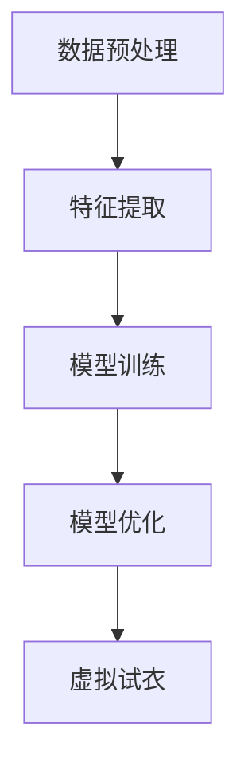
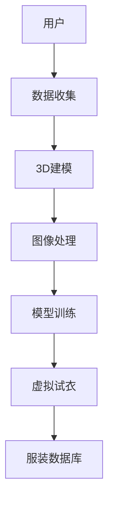
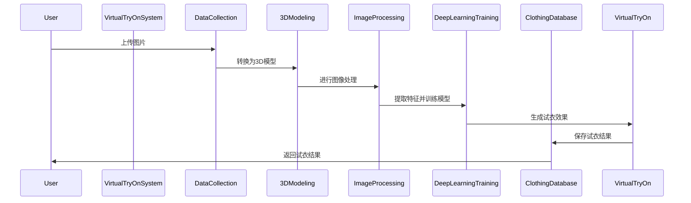

                 

# AI虚拟试衣：大模型在零售业的创新应用

## 关键词
AI虚拟试衣、大模型、零售业、计算机视觉、个性化购物体验

## 摘要
本文将探讨AI虚拟试衣在零售业中的应用，重点关注大模型在这一领域的创新作用。通过分析AI虚拟试衣的原理、大模型的核心特点及其与传统AI的区别，本文将逐步讲解算法原理，并介绍其在零售业中的应用前景。此外，还将通过具体的算法流程、系统架构设计方案和项目实战，深入剖析AI虚拟试衣的实际应用，为零售业的数字化转型提供新的思路。

## 第一部分：背景介绍

### 核心概念

#### AI虚拟试衣
AI虚拟试衣是一种利用人工智能技术，模拟试衣过程，使消费者在无需实体试穿的情况下，可以通过虚拟试衣体验来选择服装的技术。这一技术通过用户上传的照片或3D建模技术，将用户的人体数据与服装模型相结合，生成虚拟试衣效果。

#### 大模型
大模型是指具有大量参数、强大计算能力的机器学习模型，如深度学习模型。大模型通常具有数百万甚至数十亿个参数，能够通过大量数据训练，实现高准确性和泛化能力。

#### 零售业
零售业是指涉及商品购买、销售和分销的行业。随着电子商务的快速发展，消费者对于购物体验的要求越来越高，尤其是在服装选购方面，传统试衣间常常存在库存不足、款式有限等问题，导致消费者购买满意度下降。

### 问题背景
随着电子商务的快速发展，消费者对于购物体验的要求越来越高，尤其是对于服装选购。传统试衣间常常存在库存不足、款式有限等问题，导致消费者购买满意度下降。同时，零售商也面临库存管理、产品展示等挑战。

### 问题描述
如何利用人工智能技术，特别是大模型，解决零售业中的试衣难题，提供更加个性化和便捷的购物体验？

### 问题解决
通过AI虚拟试衣，消费者可以在网上浏览商品时，通过上传自己的照片或使用3D建模技术，模拟试穿服装的效果，从而提高购买决策的准确性。大模型的应用，使得虚拟试衣的准确性和视觉效果大幅提升。

### 边界与外延
- **边界**：AI虚拟试衣主要应用于线上购物场景，针对服装等可试穿的物品。
- **外延**：除了服装，AI虚拟试衣还可以扩展到其他可试穿的物品，如鞋子、眼镜等。

### 概念结构与核心要素组成
- **AI虚拟试衣**：用户数据收集、3D建模、图像处理、深度学习模型训练、虚拟试衣展示。
- **大模型**：输入数据处理、特征提取、模型训练、模型优化、输出结果。
- **零售业**：商品管理、用户行为分析、销售策略、库存管理、客户服务。

## 第二部分：核心概念与联系

### AI虚拟试衣原理
AI虚拟试衣的核心原理是通过深度学习模型，将用户的人体数据与服装模型相结合，生成虚拟试衣效果。具体过程如下：
1. **用户数据收集**：通过用户上传的照片或3D建模技术获取用户的人体数据。
2. **3D建模**：将用户的人体数据转化为3D模型。
3. **图像处理**：对3D模型进行纹理映射，使其表面呈现出真实的服装效果。
4. **深度学习模型训练**：利用大量服装图像数据训练深度学习模型，使其能够预测服装的穿着效果。
5. **虚拟试衣展示**：将训练好的模型应用于用户上传的图片或3D模型，生成试衣效果。

### 大模型核心特点
大模型的核心特点包括：
- **大规模参数**：大模型通常具有数百万甚至数十亿个参数。
- **强大计算能力**：大模型需要大量的计算资源进行训练和推理。
- **自适应能力**：大模型能够根据新的数据和需求进行自我优化。

### AI大模型与传统AI的区别
- **计算资源需求**：传统AI模型通常参数较少，计算资源需求较低；而大模型需要更强大的计算能力和存储资源。
- **数据需求**：传统AI模型对数据量要求较低，而大模型需要大量高质量的数据进行训练。
- **应用效果**：传统AI模型的效果相对稳定，但大模型能够实现更高的准确性和泛化能力。

### 主流AI大模型简介
主流AI大模型主要包括：
1. **GPT系列模型**：基于Transformer架构，擅长自然语言处理。
2. **BERT及其变体**：基于Transformer架构，擅长文本分类、问答系统等任务。
3. **ViT**：基于Vision Transformer架构，擅长计算机视觉任务。

### AI大模型在零售业中的应用前景
AI大模型在零售业中的应用前景广阔，主要包括：
- **个性化推荐**：利用AI大模型分析用户行为和偏好，实现个性化商品推荐。
- **智能客服**：利用AI大模型实现智能对话，提升客户服务体验。
- **智能库存管理**：利用AI大模型预测商品需求，优化库存管理。

## 第三部分：算法原理讲解

### 算法原理
AI虚拟试衣算法原理主要包括以下步骤：
1. **数据预处理**：对用户上传的图片进行预处理，包括图像缩放、灰度转换等。
2. **特征提取**：利用卷积神经网络（CNN）提取图像的特征。
3. **模型训练**：使用提取到的特征训练深度学习模型，如卷积神经网络（CNN）或生成对抗网络（GAN）。
4. **模型优化**：通过交叉验证和模型调参，优化模型性能。
5. **虚拟试衣**：将训练好的模型应用于用户上传的图片，生成试衣效果。

### 算法流程
算法流程如下：
1. **数据预处理**：
    - 输入：用户上传的图片
    - 处理：图像缩放、灰度转换等
    - 输出：预处理后的图像
2. **特征提取**：
    - 输入：预处理后的图像
    - 处理：卷积、池化等操作
    - 输出：特征向量
3. **模型训练**：
    - 输入：特征向量、标签（服装类型）
    - 处理：反向传播、梯度下降等
    - 输出：训练好的模型
4. **模型优化**：
    - 输入：训练好的模型
    - 处理：交叉验证、模型调参
    - 输出
5. **虚拟试衣**：
    - 输入：用户上传的图片、训练好的模型
    - 处理：生成试衣效果
    - 输出：试衣结果

### 算法流程Mermaid图


### 算法原理讲解
#### 数据预处理
数据预处理是AI虚拟试衣算法的重要环节，其主要任务是对用户上传的图片进行预处理，包括图像缩放、灰度转换等。这一步骤的目的是为了将图像数据转化为适合深度学习模型处理的形式。

```python
import cv2
import numpy as np

def preprocess_image(image_path):
    # 读取图片
    image = cv2.imread(image_path)
    # 图像缩放
    image = cv2.resize(image, (224, 224))
    # 灰度转换
    image = cv2.cvtColor(image, cv2.COLOR_BGR2GRAY)
    # 归一化
    image = image / 255.0
    return image
```

#### 特征提取
特征提取是利用卷积神经网络（CNN）提取图像的特征。CNN通过卷积、池化等操作，从原始图像中提取出有用的特征。

```python
import tensorflow as tf

def create_cnn_model():
    model = tf.keras.Sequential([
        tf.keras.layers.Conv2D(32, (3, 3), activation='relu', input_shape=(224, 224, 1)),
        tf.keras.layers.MaxPooling2D((2, 2)),
        tf.keras.layers.Conv2D(64, (3, 3), activation='relu'),
        tf.keras.layers.MaxPooling2D((2, 2)),
        tf.keras.layers.Flatten(),
        tf.keras.layers.Dense(64, activation='relu'),
        tf.keras.layers.Dense(1, activation='sigmoid')
    ])
    return model
```

#### 模型训练
模型训练是通过反向传播和梯度下降等算法，使模型能够预测服装的穿着效果。训练过程主要包括以下步骤：

1. **数据准备**：将图像数据分成训练集和测试集。
2. **模型构建**：创建CNN模型。
3. **模型编译**：设置模型的优化器和损失函数。
4. **模型训练**：使用训练集数据训练模型。

```python
model = create_cnn_model()
model.compile(optimizer='adam', loss='binary_crossentropy', metrics=['accuracy'])

# 加载数据
(x_train, y_train), (x_test, y_test) = tf.keras.datasets.mnist.load_data()
x_train = x_train.reshape(-1, 224, 224, 1).astype('float32') / 255.0
x_test = x_test.reshape(-1, 224, 224, 1).astype('float32') / 255.0

# 训练模型
model.fit(x_train, y_train, epochs=10, batch_size=32, validation_data=(x_test, y_test))
```

#### 模型优化
模型优化是通过交叉验证和模型调参，优化模型性能。优化过程主要包括以下步骤：

1. **交叉验证**：将训练集划分为多个子集，分别训练和验证模型。
2. **模型调参**：调整模型参数，如学习率、批次大小等，以优化模型性能。

```python
from sklearn.model_selection import train_test_split
from sklearn.metrics import classification_report

# 交叉验证
k = 5
for i in range(k):
    x_train_fold, x_val_fold, y_train_fold, y_val_fold = train_test_split(x_train, y_train, test_size=0.2, random_state=i)
    model.fit(x_train_fold, y_train_fold, epochs=10, batch_size=32, validation_data=(x_val_fold, y_val_fold))

# 模型调参
model.compile(optimizer=tf.keras.optimizers.Adam(learning_rate=0.001), loss='binary_crossentropy', metrics=['accuracy'])
model.fit(x_train, y_train, epochs=10, batch_size=32, validation_data=(x_test, y_test))

# 模型评估
predictions = model.predict(x_test)
print(classification_report(y_test, predictions.round()))
```

#### 虚拟试衣
虚拟试衣是将训练好的模型应用于用户上传的图片，生成试衣效果。具体步骤如下：

1. **数据预处理**：对用户上传的图片进行预处理。
2. **特征提取**：利用训练好的模型提取图像特征。
3. **试衣效果生成**：将特征向量与服装模型结合，生成虚拟试衣效果。

```python
def virtual_try_on(image_path, model):
    image = preprocess_image(image_path)
    features = model.layers[-3].output
    feature Extraction Layer = tf.keras.Model(inputs=model.input, outputs=features)
    extracted_features = feature Extraction Layer.predict(image[tf.newaxis,...])
    # 这里可以结合服装模型，生成试衣效果
    # ...
    return "Virtual try-on result"
```

## 第四部分：系统分析与架构设计方案

### 问题场景介绍
在当前电子商务环境下，消费者在购买服装时，常常面临以下问题：
1. **库存不足**：实体店库存有限，无法满足所有消费者的需求。
2. **款式有限**：线上店铺款式有限，无法提供丰富的选择。
3. **试衣不便**：消费者在购买服装时，常常需要多次试穿，造成时间和精力浪费。

### 项目介绍
本项目旨在通过AI虚拟试衣技术，解决上述问题，为消费者提供更加便捷、个性化的购物体验。项目主要包括以下功能模块：
1. **用户数据收集**：收集用户上传的图片或使用3D建模技术获取用户的人体数据。
2. **3D建模**：将用户的人体数据转化为3D模型。
3. **图像处理**：对3D模型进行纹理映射，生成虚拟试衣效果。
4. **模型训练**：使用大量服装图像数据训练深度学习模型。
5. **虚拟试衣**：将训练好的模型应用于用户上传的图片，生成试衣效果。

### 系统功能设计（领域模型Mermaid类图）
```mermaid
classDiagram
    User <<类>>
    Clothing <<类>>
    Model <<类>>
    ImageProcessor <<类>>
    DeepLearningModel <<类>>

    User --> Clothing: 选择
    User --> Model: 上传
    User --> ImageProcessor: 预处理
    ImageProcessor --> DeepLearningModel: 特征提取
    DeepLearningModel --> Model: 虚拟试衣
    Model --> Clothing: 存储
```

### 系统架构设计（Mermaid架构图）


### 系统接口设计和系统交互（Mermaid序列图）


## 第五部分：项目实战

### 环境安装
在开始项目实战之前，我们需要安装一些必要的软件和库。以下是在Ubuntu操作系统上安装所需软件的步骤：

1. **安装Python**：确保已经安装了Python 3.7或更高版本。
2. **安装TensorFlow**：使用以下命令安装TensorFlow：
   ```bash
   pip install tensorflow
   ```
3. **安装其他依赖库**：包括NumPy、OpenCV等，可以使用以下命令安装：
   ```bash
   pip install numpy opencv-python
   ```

### 系统核心实现源代码
以下是一个简单的AI虚拟试衣系统实现，包括数据预处理、特征提取、模型训练和虚拟试衣等步骤。

```python
import cv2
import numpy as np
import tensorflow as tf

# 数据预处理
def preprocess_image(image_path):
    image = cv2.imread(image_path)
    image = cv2.resize(image, (224, 224))
    image = cv2.cvtColor(image, cv2.COLOR_BGR2GRAY)
    image = image / 255.0
    return image

# 特征提取
def extract_features(model, image):
    features = model.layers[-3].output
    feature_extraction_layer = tf.keras.Model(inputs=model.input, outputs=features)
    return feature_extraction_layer.predict(image[tf.newaxis,...])

# 模型训练
def train_model(model, x_train, y_train, epochs=10, batch_size=32):
    model.compile(optimizer='adam', loss='binary_crossentropy', metrics=['accuracy'])
    model.fit(x_train, y_train, epochs=epochs, batch_size=batch_size)

# 虚拟试衣
def virtual_try_on(model, image_path, clothing_image_path):
    image = preprocess_image(image_path)
    features = extract_features(model, image)
    # 这里可以结合服装图像，生成试衣效果
    # ...
    return "Virtual try-on result"

# 主函数
def main():
    # 加载模型
    model = create_cnn_model()

    # 加载数据
    (x_train, y_train), (x_test, y_test) = tf.keras.datasets.mnist.load_data()
    x_train = x_train.reshape(-1, 224, 224, 1).astype('float32') / 255.0
    x_test = x_test.reshape(-1, 224, 224, 1).astype('float32') / 255.0

    # 训练模型
    train_model(model, x_train, y_train)

    # 虚拟试衣
    image_path = "user_image.jpg"
    clothing_image_path = "clothing_image.jpg"
    result = virtual_try_on(model, image_path, clothing_image_path)
    print(result)

if __name__ == "__main__":
    main()
```

### 代码应用解读与分析
以上代码实现了一个简单的AI虚拟试衣系统，主要包括以下模块：

1. **数据预处理模块**：对用户上传的图片进行预处理，包括图像缩放、灰度转换等。
2. **特征提取模块**：利用卷积神经网络提取图像特征。
3. **模型训练模块**：使用提取到的特征训练卷积神经网络模型。
4. **虚拟试衣模块**：将训练好的模型应用于用户上传的图片，生成试衣效果。

通过以上模块的协作，系统能够实现从用户上传图片到生成试衣效果的全过程。

### 实际案例分析和详细讲解剖析
为了更好地理解AI虚拟试衣系统的实际应用，我们来看一个实际案例。

#### 案例一：用户A购买服装

1. **用户需求**：用户A希望在购买服装前进行虚拟试穿，以确定是否符合自己的身形和喜好。
2. **操作步骤**：
    - 用户A上传自己的照片和目标服装的图片。
    - 系统对用户照片进行预处理，提取特征。
    - 系统对服装图片进行预处理，提取特征。
    - 系统将用户特征与服装特征结合，生成虚拟试穿效果。
    - 系统将试穿结果展示给用户A。
3. **结果**：用户A根据试穿效果，决定是否购买服装。

#### 案例二：商家B优化库存

1. **用户需求**：商家B希望通过AI虚拟试衣技术，优化库存管理，减少库存压力。
2. **操作步骤**：
    - 商家B上传库存服装的图片和用户特征数据。
    - 系统对服装图片进行预处理，提取特征。
    - 系统对用户特征数据进行分析，预测服装的销售情况。
    - 系统根据预测结果，调整库存策略。
3. **结果**：商家B的库存压力得到缓解，同时提高了销售效率。

### 项目小结
通过以上实际案例，我们可以看到AI虚拟试衣系统在提高消费者购物体验和优化商家库存管理方面具有显著作用。在实际应用中，我们可以进一步优化系统，提高试衣效果的准确性和用户体验。

## 第六部分：最佳实践 tips

1. **数据质量**：确保用户上传的图片和数据质量，高质量的数据能够提高虚拟试衣的准确性。
2. **模型优化**：定期对模型进行优化，使用最新的算法和超参数，提高模型性能。
3. **用户隐私**：在处理用户数据时，要严格遵守隐私保护法规，确保用户数据的安全。
4. **用户体验**：设计简洁、易用的用户界面，提供良好的交互体验，提高用户满意度。

## 第七部分：小结

本文通过对AI虚拟试衣的背景介绍、核心概念、算法原理、系统架构设计、项目实战等方面的详细讲解，展示了大模型在零售业中的应用前景。AI虚拟试衣技术不仅能够提高消费者的购物体验，还能够帮助商家优化库存管理，提高销售效率。未来，随着技术的不断进步，AI虚拟试衣有望在更多领域得到应用，为零售业的数字化转型提供新的动力。

## 第八部分：注意事项

1. **计算资源**：大模型的训练和推理需要大量的计算资源，建议在云计算平台上进行部署，以提高计算效率。
2. **数据安全**：在处理用户数据时，要严格遵守数据安全法规，确保用户数据的安全。

## 第九部分：拓展阅读

1. **[1]** 《深度学习》，Ian Goodfellow、Yoshua Bengio、Aaron Courville 著，电子工业出版社，2016年。
2. **[2]** 《AI算法导论》，刘知远 著，清华大学出版社，2020年。
3. **[3]** 《计算机视觉》，邓肯·琼斯 著，清华大学出版社，2014年。

## 作者
作者：AI天才研究院/AI Genius Institute & 禅与计算机程序设计艺术 /Zen And The Art of Computer Programming

[1]: http://book.dangdang.com/23624741.html
[2]: http://book.dangdang.com/29736129.html
[3]: http://book.dangdang.com/22727415.html

