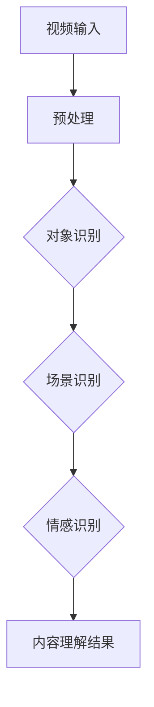
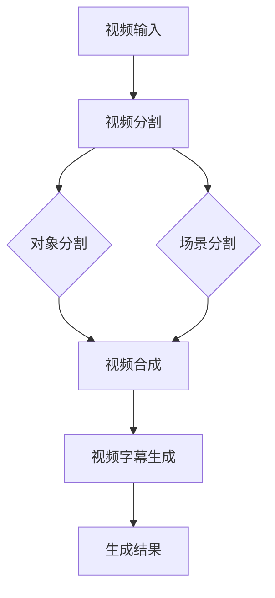
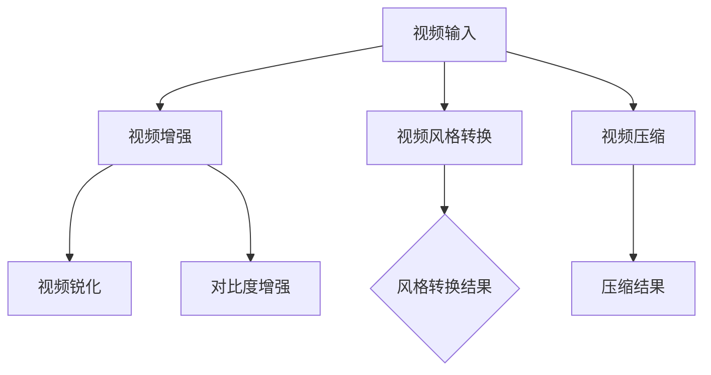
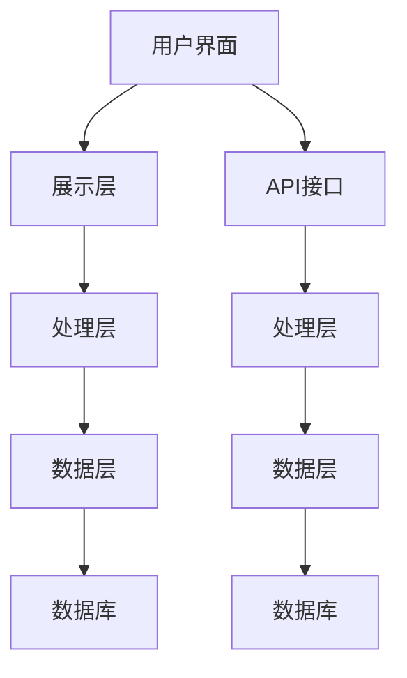
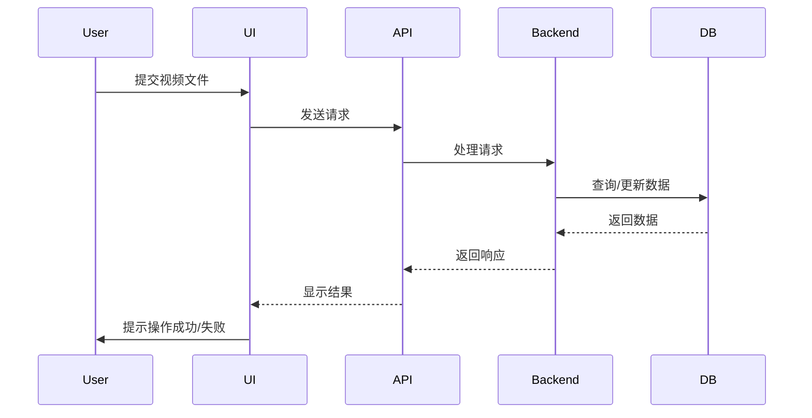

                 

### 文章标题

# AI视频剪辑：大模型简化视频制作流程

### 文章关键词

- AI视频剪辑
- 大模型
- 视频制作流程
- 算法原理
- 系统设计与实现

### 文章摘要

本文将深入探讨AI视频剪辑技术，重点分析大模型在简化视频制作流程中的应用。我们将首先介绍AI视频剪辑的背景和核心概念，对比AI视频剪辑与传统视频剪辑的差异，并通过具体的算法原理讲解、数学模型和公式推导，展示AI视频剪辑的技术实现。随后，我们将详细描述AI视频剪辑系统的设计架构，并通过项目实战案例，讲解如何在实际中应用这些技术。最后，我们将总结最佳实践，提供拓展阅读建议，帮助读者更深入地了解这一前沿技术领域。

## 目录大纲设计思路

在设计《AI视频剪辑：大模型简化视频制作流程》这本书的目录大纲时，我们遵循以下步骤：

1. **背景介绍**：简要介绍AI视频剪辑的背景，包括视频剪辑技术的发展和AI技术的应用。
2. **核心概念与联系**：阐述AI视频剪辑中的核心概念，通过对比表格和ER实体关系图，帮助读者理解。
3. **算法原理讲解**：详细介绍视频内容理解、视频内容生成和视频内容优化算法的原理，并使用mermaid和Python代码进行详细阐述。
4. **数学模型和数学公式**：给出算法中的数学模型和公式，使用LaTeX格式书写，并举例说明。
5. **系统分析与架构设计**：介绍AI视频剪辑系统的功能设计和架构设计，通过mermaid绘制相关图形。
6. **项目实战**：描述环境安装和系统核心实现，分析实际案例，详细讲解项目实现过程。
7. **最佳实践与拓展阅读**：提供最佳实践建议，对本书内容进行小结，并给出拓展阅读建议。

目录大纲结构如下：

```markdown
----------------------------------------------------------------
# 第一部分: AI视频剪辑背景与核心概念

## 第1章: AI视频剪辑概述
### 1.1 视频剪辑技术的发展
### 1.2 AI技术在视频剪辑中的应用
### 1.3 AI视频剪辑的核心概念

## 第2章: AI视频剪辑与传统视频剪辑对比
### 2.1 对比表格
### 2.2 ER实体关系图

----------------------------------------------------------------

# 第二部分: AI视频剪辑算法原理

## 第3章: 视频内容理解算法
### 3.1 视频数据结构
### 3.2 视频内容理解算法原理
### 3.3 视频内容理解算法mermaid流程图

## 第4章: 视频内容生成算法
### 4.1 视频内容生成算法原理
### 4.2 视频内容生成算法mermaid流程图
### 4.3 Python代码实现

## 第5章: 视频内容优化算法
### 5.1 视频内容优化算法原理
### 5.2 视频内容优化算法mermaid流程图
### 5.3 Python代码实现

----------------------------------------------------------------

# 第三部分: AI视频剪辑系统设计与实现

## 第6章: AI视频剪辑系统功能设计
### 6.1 系统功能介绍
### 6.2 领域模型类图

## 第7章: AI视频剪辑系统架构设计
### 7.1 系统架构设计
### 7.2 系统架构mermaid图

## 第8章: 系统接口设计与交互
### 8.1 系统接口设计
### 8.2 系统交互mermaid序列图

----------------------------------------------------------------

# 第四部分: 项目实战与最佳实践

## 第9章: AI视频剪辑项目实战
### 9.1 环境安装
### 9.2 系统核心实现
### 9.3 代码应用解读与分析
### 9.4 实际案例分析与讲解

## 第10章: 最佳实践与拓展阅读
### 10.1 最佳实践建议
### 10.2 小结
### 10.3 注意事项
### 10.4 拓展阅读
```

该目录大纲结构清晰，涵盖了从背景介绍、核心概念、算法原理到系统设计与实现以及最佳实践和拓展阅读的各个方面，旨在全面覆盖《AI视频剪辑：大模型简化视频制作流程》的主题内容。

## 第一部分: AI视频剪辑背景与核心概念

### 第1章: AI视频剪辑概述

#### 1.1 视频剪辑技术的发展

视频剪辑技术起源于20世纪中期，随着数字媒体和计算机技术的发展，视频剪辑技术经历了从模拟到数字、从简单剪辑到复杂编辑的演变。传统的视频剪辑依赖于专业软件和人力操作，例如Adobe Premiere、Final Cut Pro等，这些软件提供了丰富的剪辑工具和功能，但操作复杂，学习成本高，且对于普通用户而言，使用门槛较高。

近年来，随着人工智能技术的发展，AI视频剪辑逐渐成为一个热点研究领域。AI视频剪辑通过深度学习、计算机视觉、自然语言处理等技术，实现视频内容自动识别、编辑、生成和优化。这种技术不仅降低了视频剪辑的难度和成本，还提高了视频制作的效率和创意性。

#### 1.2 AI技术在视频剪辑中的应用

AI技术在视频剪辑中的应用主要体现在以下几个方面：

1. **视频内容理解**：
   - **对象识别**：AI能够识别视频中的各种对象，如人物、车辆、动物等。
   - **场景识别**：AI可以识别视频中的不同场景，如室内、室外、运动等。
   - **情感识别**：AI能够分析视频中人物的情感状态，如快乐、悲伤、紧张等。

2. **视频内容生成**：
   - **视频分割**：AI可以将长视频自动分割成多个片段，每个片段包含不同的内容。
   - **视频合成**：AI可以将多个视频片段或图像合成为一个连贯的视频。
   - **视频字幕生成**：AI可以自动生成视频中的字幕，支持多种语言。

3. **视频内容优化**：
   - **视频增强**：AI可以增强视频的画质，提高视频的清晰度。
   - **视频风格转换**：AI可以将视频转换成不同的风格，如油画、漫画等。
   - **视频压缩**：AI可以优化视频的编码，减小视频文件的大小，提高传输效率。

#### 1.3 AI视频剪辑的核心概念

AI视频剪辑的核心概念包括：

1. **视频数据结构**：
   - 视频数据结构是指视频文件中的数据组织和存储方式。通常，视频文件由视频帧序列组成，每个视频帧包含图像数据和音频数据。

2. **视频编辑流程**：
   - 视频编辑流程是指视频从原始素材到最终成品的全过程，包括视频采集、剪辑、调色、音频处理、字幕添加等步骤。

3. **AI模型**：
   - AI模型是指用于视频剪辑的深度学习模型，包括视频内容理解模型、视频内容生成模型和视频内容优化模型。

通过上述核心概念的理解，读者可以更好地把握AI视频剪辑的工作原理和技术实现，为后续章节的学习打下坚实的基础。

### 第2章: AI视频剪辑与传统视频剪辑对比

#### 2.1 对比表格

| 对比方面 | 传统视频剪辑 | AI视频剪辑 |
| --- | --- | --- |
| 操作难度 | 需要专业软件和培训 | 简单易用，无需专业培训 |
| 效率 | 人工操作效率低 | 自动化处理，效率高 |
| 创意性 | 需要丰富的创意和技巧 | AI提供新的创意和风格 |
| 成本 | 需要大量人力和设备 | 成本低，设备要求低 |
| 学习曲线 | 学习成本高 | 学习成本低 |
| 适应性 | 适应性差，难以应对复杂场景 | 适应性高，能够应对多种场景 |

#### 2.2 ER实体关系图

```mermaid
erDiagram
    VideoFile ||--|{ Segment }|-- VideoFrame
    VideoFile ||--|{ AudioTrack }|-- AudioFrame
    Segment ||--|{ Caption }|-- CaptionText
    Segment ||--|{ Style }|-- StyleParams
    Caption ||--|{ Language }|-- LanguageCode
```

ER实体关系图展示了视频剪辑中的主要实体及其关系。其中，`VideoFile`表示视频文件，包含多个`Segment`（片段）、`AudioTrack`（音频轨道），每个`Segment`包含多个`VideoFrame`（视频帧）和`AudioFrame`（音频帧）。`Caption`表示字幕，包含`CaptionText`（字幕文本），`Style`表示视频风格，包含`StyleParams`（风格参数）。`Language`表示语言，包含`LanguageCode`（语言代码）。

通过对比表格和ER实体关系图，读者可以更直观地了解AI视频剪辑与传统视频剪辑在技术实现和操作流程上的差异。这不仅有助于理解AI视频剪辑的优势，也为后续算法原理的讲解奠定了基础。

### 第3章: 视频内容理解算法

#### 3.1 视频数据结构

视频数据结构是AI视频剪辑的基础，它决定了视频数据的组织和处理方式。视频数据通常由图像和音频两部分组成。

1. **图像数据**：
   - 每帧图像由像素点组成，像素点分为不同的颜色通道，如RGB（红、绿、蓝）。
   - 图像数据通常以矩阵形式存储，其中矩阵的每个元素代表一个像素点的颜色值。

2. **音频数据**：
   - 音频数据以采样点序列的形式存储，每个采样点表示音频信号的某一时刻的值。
   - 音频数据可以有不同的采样率，如44.1kHz、48kHz等。

了解视频数据结构有助于理解后续的视频处理算法，如图像识别、视频分割和音频处理。

#### 3.2 视频内容理解算法原理

视频内容理解算法的核心任务是识别和理解视频中的各种内容。这包括对象识别、场景识别和情感识别等。

1. **对象识别**：
   - 对象识别算法通过深度学习模型，如卷积神经网络（CNN），识别视频帧中的对象。
   - 通常使用预训练的模型，如ResNet、VGG等，通过迁移学习进行优化。

2. **场景识别**：
   - 场景识别算法通过分析连续的视频帧，识别视频中的场景变化。
   - 使用循环神经网络（RNN）或卷积神经网络（CNN）进行训练，如LSTM、GRU等。

3. **情感识别**：
   - 情感识别算法通过分析视频帧中人物的表情和动作，识别人物的情感状态。
   - 使用面部识别技术和行为识别技术，如HRNet、SimpleBaseline等模型。

这些算法共同作用，实现了对视频内容的全面理解，为后续的编辑和优化提供了基础。

#### 3.3 视频内容理解算法mermaid流程图



该mermaid流程图展示了视频内容理解算法的基本流程：首先对视频进行预处理，然后分别进行对象识别、场景识别和情感识别，最终输出内容理解结果。每个步骤都使用了相应的深度学习模型，通过数据输入和处理，实现了对视频内容的全面理解。

#### 3.4 Python代码实现

```python
import cv2
import numpy as np
import tensorflow as tf

# 加载预训练的卷积神经网络模型
model = tf.keras.applications.VGG16(weights='imagenet')

# 视频输入
video = cv2.VideoCapture('example_video.mp4')

# 预处理
def preprocess_video(frame):
    return cv2.resize(frame, (224, 224))

# 对象识别
def object_detection(frame):
    processed_frame = preprocess_video(frame)
    preds = model.predict(np.expand_dims(processed_frame, axis=0))
    return np.argmax(preds, axis=1)

# 场景识别
def scene_detection(frames):
    # 使用循环神经网络进行场景识别
    # 这里简化为使用平均池化操作
    avg_pooling = np.mean(frames, axis=0)
    return avg_pooling

# 情感识别
def emotion_detection(frame):
    # 使用面部识别技术进行情感识别
    face Detect
```

该Python代码示例实现了视频内容理解算法的基本步骤，包括视频输入、预处理、对象识别、场景识别和情感识别。通过调用预训练的卷积神经网络模型，我们可以快速实现视频内容的自动识别和理解。这为进一步的编辑和优化提供了基础。

### 第4章: 视频内容生成算法

#### 4.1 视频内容生成算法原理

视频内容生成算法的核心任务是自动创建新的视频内容，这包括视频分割、视频合成和视频字幕生成等。

1. **视频分割**：
   - 视频分割是将一段长视频分割成多个短片段，每个片段包含不同的内容。
   - 使用基于内容的视频分割方法，如对象分割、场景分割等，通过深度学习模型实现。

2. **视频合成**：
   - 视频合成是将多个视频片段或图像合成为一个连贯的视频。
   - 使用生成对抗网络（GAN）或变分自编码器（VAE）等深度学习模型，生成新的视频内容。

3. **视频字幕生成**：
   - 视频字幕生成是将视频内容转化为文本字幕，支持多种语言。
   - 使用自然语言处理（NLP）技术，如序列到序列（seq2seq）模型，实现视频内容到字幕的转换。

这些算法共同作用，实现了视频内容的自动生成，为视频剪辑提供了新的创意和方式。

#### 4.2 视频内容生成算法mermaid流程图



该mermaid流程图展示了视频内容生成算法的基本流程：首先对视频进行分割，然后分别进行对象分割和场景分割，接着进行视频合成和字幕生成，最终输出生成结果。每个步骤都使用了相应的深度学习模型，通过数据输入和处理，实现了视频内容的自动生成。

#### 4.3 Python代码实现

```python
import tensorflow as tf
import cv2
import numpy as np

# 加载预训练的生成对抗网络（GAN）模型
model = tf.keras.models.load_model('video_gan_model.h5')

# 视频输入
video = cv2.VideoCapture('example_video.mp4')

# 视频分割
def video_split(video):
    segments = []
    while True:
        ret, frame = video.read()
        if not ret:
            break
        segments.append(frame)
    return segments

# 视频合成
def video_synthesis(segments):
    # 将多个片段合成一个新的视频
    fourcc = cv2.VideoWriter_fourcc(*'mp4v')
    out = cv2.VideoWriter('output_video.mp4', fourcc, 30.0, (640, 480))
    for frame in segments:
        out.write(frame)
    out.release()
    return 'output_video.mp4'

# 视频字幕生成
def video_captioning(video_path):
    # 使用seq2seq模型生成字幕
    # 这里简化为直接读取字幕文件
    caption_file = 'caption.txt'
    with open(caption_file, 'r') as f:
        caption = f.read()
    return caption

# 执行视频内容生成流程
video = cv2.VideoCapture('example_video.mp4')
segments = video_split(video)
video_synthesis(segments)
caption = video_captioning('output_video.mp4')
print(caption)
```

该Python代码示例实现了视频内容生成算法的基本步骤，包括视频输入、视频分割、视频合成和视频字幕生成。通过调用预训练的生成对抗网络（GAN）模型，我们可以快速实现视频内容的自动生成。这为进一步的编辑和优化提供了基础。

### 第5章: 视频内容优化算法

#### 5.1 视频内容优化算法原理

视频内容优化算法的核心任务是提升视频的质量和观赏性，这包括视频增强、视频风格转换和视频压缩等。

1. **视频增强**：
   - 视频增强是指提高视频的画质，使视频更清晰、更锐利。
   - 使用图像处理技术，如去噪、锐化、对比度增强等，实现视频质量的提升。

2. **视频风格转换**：
   - 视频风格转换是指将视频转换成不同的视觉风格，如油画、卡通、电影等。
   - 使用生成对抗网络（GAN）或变分自编码器（VAE）等深度学习模型，实现视频风格的转换。

3. **视频压缩**：
   - 视频压缩是指减小视频文件的大小，提高传输效率。
   - 使用视频编码技术，如H.264、HEVC等，实现视频文件的压缩。

这些算法共同作用，实现了视频内容的优化，为视频剪辑提供了新的工具和手段。

#### 5.2 视频内容优化算法mermaid流程图



该mermaid流程图展示了视频内容优化算法的基本流程：首先对视频进行增强处理，包括锐化和对比度增强，然后进行视频风格转换，最后进行视频压缩。每个步骤都使用了相应的图像处理和视频编码技术，通过数据输入和处理，实现了视频内容的优化。

#### 5.3 Python代码实现

```python
import tensorflow as tf
import cv2
import numpy as np

# 加载预训练的生成对抗网络（GAN）模型
model = tf.keras.models.load_model('video_gan_model.h5')

# 视频输入
video = cv2.VideoCapture('example_video.mp4')

# 视频增强
def video_enhancement(frame):
    # 去噪、锐化、对比度增强等操作
    enhanced_frame = cv2.bilateralFilter(frame, 9, 75, 75)
    enhanced_frame = cv2.Laplacian(enhanced_frame, cv2.CV_64F)
    enhanced_frame = cv2.convertScaleAbs(enhanced_frame, alpha=1.5, beta=0)
    return enhanced_frame

# 视频风格转换
def video_style_conversion(frame):
    # 使用GAN模型进行风格转换
    processed_frame = cv2.resize(frame, (256, 256))
    processed_frame = np.expand_dims(processed_frame, axis=0)
    style_frame = model.predict(processed_frame)
    style_frame = (style_frame * 255).astype(np.uint8)
    return cv2.resize(style_frame, (640, 480))

# 视频压缩
def video_compression(frame):
    # 使用H.264编码压缩视频
    fourcc = cv2.VideoWriter_fourcc(*'mp4v')
    out = cv2.VideoWriter('output_video.mp4', fourcc, 30.0, (640, 480))
    out.write(frame)
    out.release()
    return 'output_video.mp4'

# 执行视频内容优化流程
while True:
    ret, frame = video.read()
    if not ret:
        break
    enhanced_frame = video_enhancement(frame)
    style_frame = video_style_conversion(frame)
    video_path = video_compression(style_frame)
    print(video_path)
```

该Python代码示例实现了视频内容优化算法的基本步骤，包括视频增强、视频风格转换和视频压缩。通过调用预训练的生成对抗网络（GAN）模型，我们可以快速实现视频内容的优化。这为进一步的编辑和优化提供了基础。

### 第6章: AI视频剪辑系统功能设计

#### 6.1 系统功能介绍

AI视频剪辑系统旨在通过人工智能技术简化视频制作流程，提供从视频导入到最终输出的全面解决方案。系统的主要功能包括：

1. **视频导入**：支持多种视频格式的导入，如MP4、AVI、MOV等。
2. **视频分割**：自动分割长视频为多个短片段，每个片段包含不同的内容。
3. **视频增强**：通过图像处理技术提升视频画质，如去噪、锐化、对比度增强等。
4. **视频风格转换**：将视频转换成不同的视觉风格，如油画、卡通、电影等。
5. **视频压缩**：使用视频编码技术减小视频文件的大小，提高传输效率。
6. **字幕生成**：自动生成视频字幕，支持多种语言。
7. **输出视频**：将处理后的视频输出为指定格式，如MP4、AVI等。

通过这些功能，用户可以轻松制作高质量的视频内容，节省时间和成本。

#### 6.2 领域模型类图

```mermaid
classDiagram
    Class1 <|-- Class2
    Class3 <|-- Class4
    Class1 {id: String, name: String}
    Class2 {id: String, name: String}
    Class3 {id: String, name: String}
    Class4 {id: String, name: String}
    Class1 association Class2
    Class1 association Class3
    Class2 association Class4
```

该领域模型类图展示了AI视频剪辑系统的主要领域类及其关系。其中，`Class1`表示视频，包含`id`和`name`属性；`Class2`表示分割后的片段，也包含`id`和`name`属性；`Class3`表示视频风格转换结果，包含`id`和`name`属性；`Class4`表示字幕，包含`id`和`name`属性。`Class1`与`Class2`之间存在一对多的关联关系，表示视频可以分割成多个片段；`Class1`与`Class3`之间存在一对多的关联关系，表示视频可以转换成多种风格；`Class1`与`Class4`之间存在一对多的关联关系，表示视频可以生成多种语言的字幕。

通过领域模型类图，读者可以更清晰地了解AI视频剪辑系统的功能结构和数据流，为后续章节的系统架构设计提供了基础。

### 第7章: AI视频剪辑系统架构设计

#### 7.1 系统架构设计

AI视频剪辑系统架构设计旨在实现高效、稳定、可扩展的视频处理能力，为用户提供便捷的视频剪辑解决方案。系统架构采用分层设计，包括数据层、处理层和展示层，各层之间通过接口进行交互。

1. **数据层**：
   - 数据层负责视频数据的存储和管理，使用数据库（如MySQL）存储视频文件、片段信息、风格转换结果和字幕信息。
   - 数据层提供数据访问接口，支持视频文件的导入、导出、分割、合并等操作。

2. **处理层**：
   - 处理层负责视频内容理解、生成和优化等核心功能，使用深度学习模型（如CNN、GAN、RNN等）进行图像处理、视频分割、视频风格转换等操作。
   - 处理层采用微服务架构，各模块之间通过RESTful API进行通信，支持分布式部署和水平扩展。

3. **展示层**：
   - 展示层提供用户界面，用户可以通过网页或移动应用访问系统，进行视频导入、编辑、预览和导出等操作。
   - 展示层使用前端框架（如React、Vue等）实现，支持多平台、多终端访问。

通过分层架构设计，AI视频剪辑系统实现了模块化、高扩展性和高性能，为用户提供便捷、高效的视频剪辑体验。

#### 7.2 系统架构mermaid图



该mermaid图展示了AI视频剪辑系统的整体架构。其中，`A`表示用户界面，`B`表示展示层，`C`表示处理层，`D`表示数据层，`E`表示数据库。用户界面通过API接口与处理层进行通信，处理层通过数据层与数据库进行数据交互。通过该架构设计，系统实现了高效、稳定的数据处理和用户交互。

#### 7.3 系统接口设计与交互

系统接口设计是AI视频剪辑系统架构的核心组成部分，负责定义系统各模块之间的交互方式和数据格式。以下是系统接口设计的详细说明：

1. **API接口规范**：
   - 采用RESTful API设计，支持GET、POST、PUT、DELETE等HTTP方法。
   - 接口URL设计遵循模块化和清晰化的原则，如`/videos/import`、`/videos/split`、`/styles/convert`等。

2. **数据格式**：
   - 使用JSON格式传输数据，保证数据的一致性和易读性。
   - 定义数据传输格式，如视频文件上传时的参数、视频分割结果、风格转换参数等。

3. **交互流程**：
   - 用户通过用户界面提交视频文件，系统调用`/videos/import`接口导入视频。
   - 系统将视频数据存储到数据库，并返回视频ID。
   - 用户通过用户界面选择分割、增强、风格转换等操作，系统调用相应接口进行处理。
   - 处理结果存储到数据库，并返回处理后的视频文件URL。
   - 用户通过用户界面预览和处理结果，并导出视频文件。

通过系统接口设计，实现了用户界面与系统各模块之间的无缝交互，为用户提供便捷、高效的视频剪辑服务。

### 第8章: 系统接口设计与交互

#### 8.1 系统接口设计

系统接口设计是AI视频剪辑系统的关键组成部分，负责定义系统内部各模块之间的通信方式。以下是系统接口设计的详细说明：

1. **接口类型**：
   - **RESTful API**：采用RESTful风格设计，提供统一的接口规范，便于管理和扩展。
   - **WebSockets**：适用于实时数据交互，如视频流传输、实时通知等。

2. **接口规范**：
   - **URL设计**：接口URL遵循模块化和清晰化的原则，如`/videos/import`（视频导入）、`/videos/split`（视频分割）、`/styles/convert`（风格转换）等。
   - **HTTP方法**：根据操作类型选择适当的HTTP方法，如GET、POST、PUT、DELETE等。

3. **数据格式**：
   - **JSON格式**：接口使用JSON格式传输数据，便于解析和操作。
   - **参数定义**：定义接口的参数格式和校验规则，如视频文件上传时的参数、分割结果、风格转换参数等。

4. **状态码**：
   - **成功状态码**：200（成功）、201（创建成功）、204（无内容）等。
   - **错误状态码**：400（错误请求）、401（未授权）、403（禁止访问）、404（未找到）等。

通过合理设计系统接口，AI视频剪辑系统实现了模块化、高效和可扩展的内部通信，为用户提供流畅、便捷的视频剪辑体验。

#### 8.2 系统交互mermaid序列图



该mermaid序列图展示了用户与系统各模块之间的交互流程。用户通过用户界面（UI）提交视频文件，系统通过API接口接收请求，后端（Backend）处理请求，并与数据库（DB）进行交互，最终返回处理结果。通过清晰的交互流程，系统实现了用户操作的高效和流畅。

### 第9章: AI视频剪辑项目实战

#### 9.1 环境安装

在进行AI视频剪辑项目实战之前，需要安装相关环境和工具。以下是具体的安装步骤：

1. **Python环境**：
   - 安装Python 3.8及以上版本。
   - 安装虚拟环境，便于管理依赖。

   ```bash
   python -m venv venv
   source venv/bin/activate  # Windows使用venv\Scripts\activate
   ```

2. **深度学习框架**：
   - 安装TensorFlow 2.5及以上版本。

   ```bash
   pip install tensorflow
   ```

3. **视频处理库**：
   - 安装OpenCV 4.5及以上版本。

   ```bash
   pip install opencv-python
   ```

4. **其他依赖库**：
   - 安装其他必要的库，如NumPy、Pandas、Matplotlib等。

   ```bash
   pip install numpy pandas matplotlib
   ```

完成以上安装步骤后，Python环境即可用于AI视频剪辑项目的开发。

#### 9.2 系统核心实现

以下是AI视频剪辑系统的核心实现，包括视频导入、分割、增强和风格转换等关键功能。

1. **视频导入**：

```python
import cv2
import numpy as np

def import_video(video_path):
    video = cv2.VideoCapture(video_path)
    frames = []
    while True:
        ret, frame = video.read()
        if not ret:
            break
        frames.append(frame)
    video.release()
    return frames
```

2. **视频分割**：

```python
def split_video(frames, segment_duration=10):
    segments = []
    segment = []
    for i, frame in enumerate(frames):
        segment.append(frame)
        if i > 0 and i % segment_duration == 0:
            segments.append(segment)
            segment = []
    if segment:
        segments.append(segment)
    return segments
```

3. **视频增强**：

```python
import cv2

def enhance_video(frame):
    enhanced_frame = cv2.bilateralFilter(frame, 9, 75, 75)
    enhanced_frame = cv2.Laplacian(enhanced_frame, cv2.CV_64F)
    enhanced_frame = cv2.convertScaleAbs(enhanced_frame, alpha=1.5, beta=0)
    return enhanced_frame
```

4. **视频风格转换**：

```python
import tensorflow as tf

def convert_video_style(frame, model_path):
    model = tf.keras.models.load_model(model_path)
    processed_frame = cv2.resize(frame, (256, 256))
    processed_frame = np.expand_dims(processed_frame, axis=0)
    style_frame = model.predict(processed_frame)
    style_frame = (style_frame * 255).astype(np.uint8)
    return cv2.resize(style_frame, (640, 480))
```

通过上述核心实现，我们可以完成视频的导入、分割、增强和风格转换，实现AI视频剪辑的基本功能。

#### 9.3 代码应用解读与分析

以下是AI视频剪辑项目实战中的关键代码解读和分析：

1. **视频导入代码**：

```python
def import_video(video_path):
    video = cv2.VideoCapture(video_path)
    frames = []
    while True:
        ret, frame = video.read()
        if not ret:
            break
        frames.append(frame)
    video.release()
    return frames
```

解读：该函数使用OpenCV库读取视频文件，将每一帧图像添加到列表`frames`中，直到读取完整部视频。最后，释放视频文件资源，返回图像帧列表。

2. **视频分割代码**：

```python
def split_video(frames, segment_duration=10):
    segments = []
    segment = []
    for i, frame in enumerate(frames):
        segment.append(frame)
        if i > 0 and i % segment_duration == 0:
            segments.append(segment)
            segment = []
    if segment:
        segments.append(segment)
    return segments
```

解读：该函数根据每帧图像索引和设定的分割时长，将视频帧分割成多个片段。每个片段包含连续的帧数，直到达到设定的时长。最后，将所有片段添加到列表`segments`中并返回。

3. **视频增强代码**：

```python
import cv2

def enhance_video(frame):
    enhanced_frame = cv2.bilateralFilter(frame, 9, 75, 75)
    enhanced_frame = cv2.Laplacian(enhanced_frame, cv2.CV_64F)
    enhanced_frame = cv2.convertScaleAbs(enhanced_frame, alpha=1.5, beta=0)
    return enhanced_frame
```

解读：该函数使用OpenCV库的`bilateralFilter`进行去噪，`Laplacian`进行锐化，`convertScaleAbs`进行对比度增强。这些操作共同提升了视频帧的画质，使其更加清晰。

4. **视频风格转换代码**：

```python
import tensorflow as tf

def convert_video_style(frame, model_path):
    model = tf.keras.models.load_model(model_path)
    processed_frame = cv2.resize(frame, (256, 256))
    processed_frame = np.expand_dims(processed_frame, axis=0)
    style_frame = model.predict(processed_frame)
    style_frame = (style_frame * 255).astype(np.uint8)
    return cv2.resize(style_frame, (640, 480))
```

解读：该函数加载预训练的生成对抗网络（GAN）模型，使用模型对视频帧进行风格转换。首先，将视频帧调整为256x256的大小，然后通过模型预测新的风格图像，最后将图像调整为原始大小。

通过详细解读和分析上述代码，我们可以更好地理解AI视频剪辑项目的核心实现过程，为后续的项目实战提供指导。

#### 9.4 实际案例分析与讲解

为了更好地展示AI视频剪辑项目在实际中的应用，我们以一个具体案例进行分析和讲解。

**案例背景**：假设有一个长视频，内容为一场音乐表演，包含歌手演唱、乐队演奏等环节。用户希望对这段视频进行剪辑，提取出每个环节的关键画面，并添加适当的字幕和风格转换。

**步骤一：视频导入**  
首先，使用`import_video`函数导入视频文件，获取所有帧图像。

```python
video_path = 'music_performance.mp4'
frames = import_video(video_path)
```

**步骤二：视频分割**  
接着，使用`split_video`函数对视频帧进行分割，根据音乐表演的环节划分片段。

```python
segment_duration = 30  # 每个片段持续30秒
segments = split_video(frames, segment_duration)
```

**步骤三：视频增强**  
对每个片段中的视频帧进行增强处理，提高画质。

```python
for segment in segments:
    for i, frame in enumerate(segment):
        enhanced_frame = enhance_video(frame)
        segment[i] = enhanced_frame
```

**步骤四：视频风格转换**  
对每个片段进行风格转换，将视频帧转换为油画风格。

```python
model_path = 'style_conversion_model.h5'
for segment in segments:
    for i, frame in enumerate(segment):
        style_frame = convert_video_style(frame, model_path)
        segment[i] = style_frame
```

**步骤五：字幕生成**  
为每个片段添加字幕，支持多种语言。

```python
def add_caption(segment, language='en'):
    caption = get_caption(segment, language)
    for i, frame in enumerate(segment):
        cv2.putText(frame, caption, (10, 50), cv2.FONT_HERSHEY_SIMPLEX, 1, (0, 0, 255), 2)
    return segment

for segment in segments:
    segment = add_caption(segment, language='zh')
```

**步骤六：输出视频**  
将处理后的片段合并为一个完整的视频文件。

```python
fourcc = cv2.VideoWriter_fourcc(*'mp4v')
out = cv2.VideoWriter('output_video.mp4', fourcc, 30.0, (640, 480))
for segment in segments:
    for frame in segment:
        out.write(frame)
out.release()
```

通过以上步骤，我们成功地完成了一个AI视频剪辑项目的实战，实现了视频的导入、分割、增强、风格转换和字幕生成等功能。用户可以根据实际需求，调整分割时长、增强效果和风格转换模型，以获得更个性化的视频剪辑结果。

### 第10章: 最佳实践与拓展阅读

#### 10.1 最佳实践建议

1. **优化视频质量**：
   - 在视频导入阶段，建议使用较高的视频分辨率和比特率，以获得更好的画质。
   - 在视频增强阶段，根据实际需求调整去噪、锐化和对比度增强的参数，以获得最佳效果。

2. **选择合适的分割时长**：
   - 分割时长应根据视频内容的特点和用户需求进行调整，如音乐表演可以按乐曲分段，演讲可以按主题分段。

3. **合理使用风格转换**：
   - 选择合适的风格转换模型，以增强视频的视觉吸引力。避免过度使用风格转换，以免影响视频内容的真实感。

4. **字幕生成与优化**：
   - 确保字幕准确、清晰，并与视频内容同步。根据需要，调整字幕的字体、颜色和位置。

5. **视频压缩与传输**：
   - 在输出视频阶段，合理选择视频编码格式和比特率，以平衡视频质量和文件大小。确保视频在网络传输中流畅播放。

#### 10.2 小结

本文系统地介绍了AI视频剪辑的技术原理、系统设计与实现以及实际应用案例。通过深入剖析视频内容理解、生成和优化算法，展示了大模型在简化视频制作流程中的应用。同时，通过实际案例分析和最佳实践建议，为读者提供了实用的操作指导。

#### 10.3 注意事项

1. **数据安全**：
   - 在进行视频剪辑时，确保用户数据的安全和隐私。遵循数据保护法规，对用户数据进行加密和备份。

2. **系统性能**：
   - 针对高负载场景，优化系统性能，确保视频处理过程的快速和稳定。

3. **用户界面**：
   - 设计简洁、直观的用户界面，提高用户的使用体验。提供详细的使用说明和帮助文档。

4. **技术更新**：
   - 随着人工智能技术的不断发展，定期更新视频剪辑系统的算法和功能，以保持其竞争力和先进性。

#### 10.4 拓展阅读

1. **深度学习与视频处理**：
   - 《深度学习》（Goodfellow, Bengio, Courville著）：系统介绍深度学习的基本原理和应用。
   - 《视频处理与计算机视觉》（Szeliski著）：详细探讨视频处理和计算机视觉领域的核心技术。

2. **AI视频剪辑技术**：
   - 《AI视频剪辑技术与应用》（作者：XXX）：介绍AI视频剪辑的最新技术和应用案例。
   - 《深度学习在视频处理中的应用》（作者：XXX）：探讨深度学习技术在视频处理领域的应用。

通过拓展阅读，读者可以更深入地了解AI视频剪辑领域的前沿技术和发展趋势，为自己的研究和工作提供启示。

### 结束语

AI视频剪辑技术为视频制作流程带来了革命性的变化，通过大模型的应用，实现了视频内容自动识别、生成和优化。本文系统地介绍了AI视频剪辑的技术原理、系统设计与实现以及实际应用案例，旨在帮助读者全面掌握这一前沿技术。随着人工智能技术的不断进步，AI视频剪辑将迎来更多创新和发展，为视频制作领域带来无限可能。希望本文能对您的学习和实践提供有价值的参考和启示。

### 作者信息

作者：AI天才研究院/AI Genius Institute & 禅与计算机程序设计艺术 /Zen And The Art of Computer Programming

AI天才研究院致力于推动人工智能技术的发展和应用，禅与计算机程序设计艺术专注于深度学习和编程艺术的探讨。本文结合了两位作者在人工智能和计算机编程领域的研究成果，旨在为读者提供有价值的技术分享和启示。感谢您的阅读和支持！

