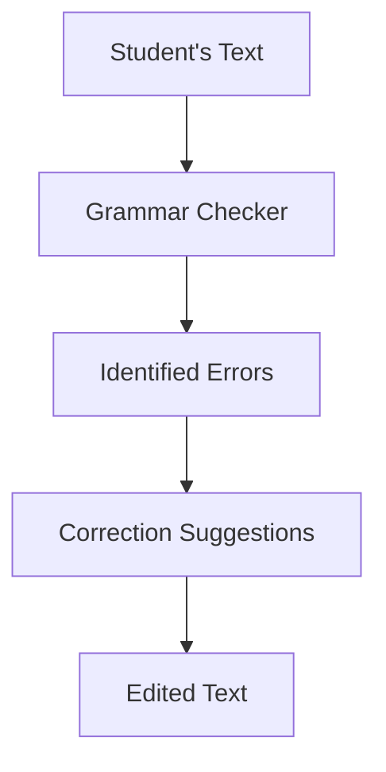
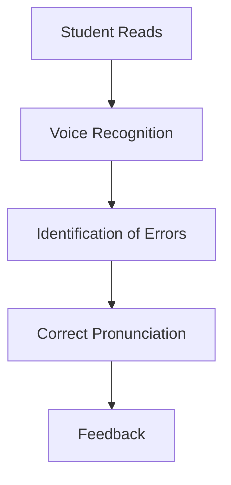
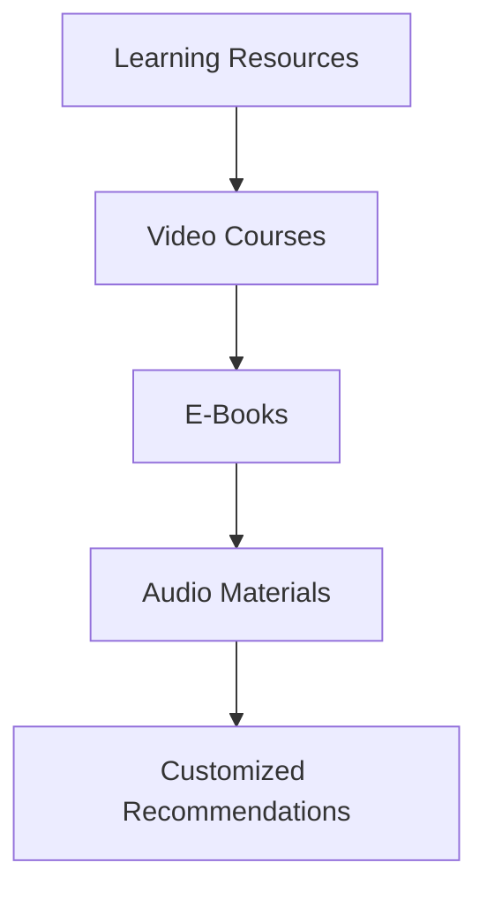
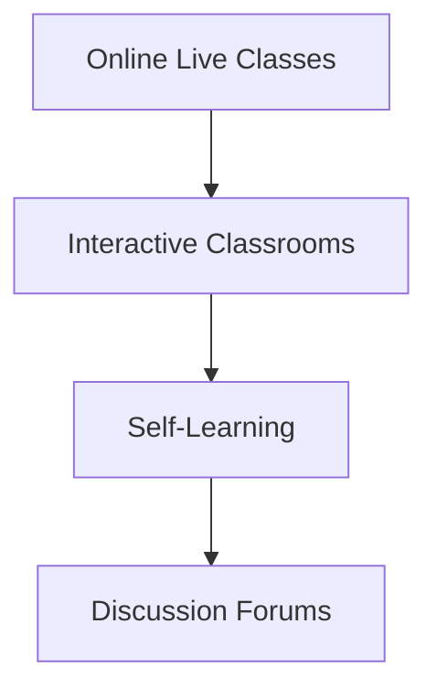
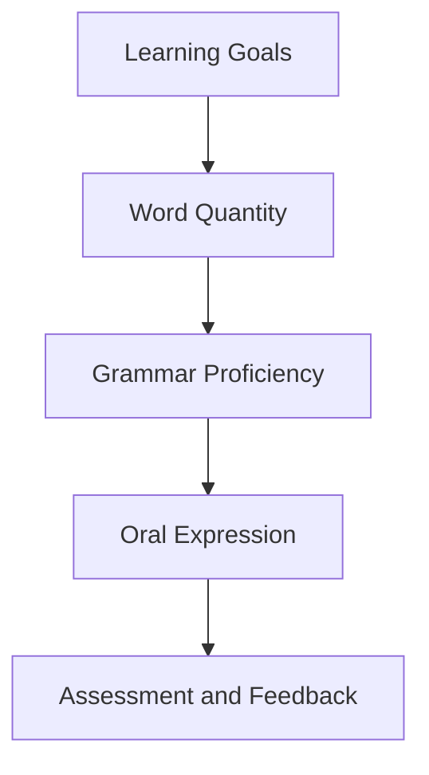

                 

### 文章标题

---

# AI语言学习：大模型革新语言教育方法

---

### 文章关键词

- AI
- 语言学习
- 大模型
- 教育方法
- 人工智能教育

### 文章摘要

本文深入探讨了人工智能（AI）在语言学习中的应用，特别是大模型技术在语言教育领域的革新。文章首先介绍了语言学习的现状与挑战，随后详细解析了AI大模型的基本原理与架构。接下来，本文将阐述大模型在语言理解、生成以及学习应用场景中的具体作用。随后，文章探讨了AI语言学习的教学实践、评估与反馈机制，并展望了其未来发展。通过案例研究和最佳实践分享，本文旨在为教育者和学生提供一套科学的AI语言学习方案。

---

### 第一部分：AI语言学习背景

#### 第1章：语言学习的现状与挑战

**1.1 语言学习的传统方法**

语言学习一直被视为一项复杂的任务，传统的学习方式主要依赖于教科书、语言实验室和课堂教学。这些方法虽然在一定程度上取得了成效，但存在一些明显的局限性。

- **教科书**：教科书通常按照语法、词汇和句型的顺序编排，使学生按照既定的路径学习语言。然而，这种方法缺乏灵活性，难以满足个性化学习的需求。
- **语言实验室**：语言实验室通过模拟真实的语言环境，提供听力、口语、阅读和写作等训练。然而，实验室资源有限，难以大规模推广。
- **课堂教学**：课堂教学通过教师讲解和互动练习，帮助学生掌握语言知识。但教师资源有限，难以实现一对一教学。

**1.2 AI语言学习的兴起**

随着人工智能技术的快速发展，AI语言学习逐渐成为一种新的趋势。AI语言学习通过大数据分析、自然语言处理（NLP）和机器学习等技术，为学生提供个性化、高效的语言学习体验。

- **大数据分析**：AI语言学习利用大数据分析技术，收集和分析学生的语言学习数据，从而为学生提供个性化的学习建议。
- **自然语言处理（NLP）**：NLP技术使计算机能够理解和生成人类语言，从而在语言理解、生成和翻译等方面发挥重要作用。
- **机器学习**：机器学习技术使AI系统能够通过学习和自我优化，不断提高语言学习效果。

**1.3 大模型在语言学习中的应用前景**

大模型，特别是预训练语言模型（如GPT-3、BERT等），在语言学习中具有巨大的应用前景。

- **语言理解**：大模型通过大量的文本数据训练，能够理解复杂的语言结构和语义关系，为学生提供深入的语言理解能力。
- **语言生成**：大模型能够生成高质量的语言文本，为学生提供丰富的语言表达练习。
- **个性化学习**：大模型能够根据学生的学习数据和反馈，提供个性化的学习内容和策略，提高学习效果。

#### 第2章：AI大模型基础

**2.1 AI大模型的概念与原理**

AI大模型是指具有极高参数量和计算能力的深度学习模型。这些模型通过大量的数据训练，能够自动学习语言的模式和规律，从而实现自然语言处理任务。

- **概念**：大模型通常指的是参数数量达到数十亿乃至千亿级别的神经网络模型。
- **原理**：大模型通过多层神经网络结构，实现数据的逐层提取和特征提取，从而在大量数据中学习到有效的特征和模式。

**2.2 大模型的架构与工作流程**

大模型通常采用多层次的神经网络结构，包括输入层、隐藏层和输出层。

- **输入层**：接收外部输入，如文本、语音等。
- **隐藏层**：对输入数据进行特征提取和模式识别。
- **输出层**：生成输出结果，如文本生成、情感分析等。

大模型的工作流程主要包括数据预处理、模型训练、模型优化和模型应用。

- **数据预处理**：对输入数据（如文本）进行清洗、归一化和编码。
- **模型训练**：利用大量标注数据进行模型训练，优化模型参数。
- **模型优化**：通过模型评估和迭代优化，提高模型性能。
- **模型应用**：将训练好的模型部署到实际应用场景中，如语言学习、文本生成等。

**2.3 主流AI大模型介绍**

当前，主流的AI大模型包括GPT-3、BERT、Transformer等。

- **GPT-3**：由OpenAI开发的预训练语言模型，具有1750亿参数，能够生成高质量的自然语言文本。
- **BERT**：由Google开发的预训练语言模型，通过双向编码表示学习，能够捕捉文本中的长距离依赖关系。
- **Transformer**：由Google开发的神经网络结构，用于序列到序列学习，广泛应用于机器翻译、文本生成等任务。

#### 第3章：大模型与语言学习的结合

**3.1 大模型在语言理解中的应用**

大模型在语言理解中发挥着重要作用，能够实现文本分类、情感分析、命名实体识别等任务。

- **文本分类**：通过训练好的大模型，可以对文本进行分类，如新闻分类、情感分类等。
- **情感分析**：大模型能够分析文本的情感倾向，如积极、消极等。
- **命名实体识别**：大模型能够识别文本中的命名实体，如人名、地名、组织名等。

**3.2 大模型在语言生成中的应用**

大模型在语言生成中也具有显著优势，能够生成高质量的文本，如机器翻译、文本摘要、问答系统等。

- **机器翻译**：大模型通过预训练和Fine-tuning，能够实现高质量的双语翻译。
- **文本摘要**：大模型能够自动生成文本摘要，提取关键信息。
- **问答系统**：大模型能够根据用户的问题生成相应的回答。

**3.3 大模型在语言学习中的应用场景**

大模型在语言学习中的应用场景广泛，包括语言学习平台、语言学习工具、在线课程等。

- **语言学习平台**：大模型可以为语言学习平台提供智能客服、个性化学习建议等功能。
- **语言学习工具**：大模型可以开发出智能词典、语法检查、发音纠正等工具。
- **在线课程**：大模型可以为学生提供智能问答、自动评分等功能，提高学习效果。

#### 第4章：AI语言学习的教学实践

**4.1 AI语言学习的教学模式**

AI语言学习采用个性化、互动性和智能化的教学模式，以提高学习效果。

- **个性化学习**：通过分析学生的学习数据和反馈，提供个性化的学习内容和策略。
- **互动性学习**：通过模拟真实的语言环境，提供互动性的语言学习体验。
- **智能化学习**：通过智能算法和大数据分析，实现学习过程的智能化管理。

**4.2 AI辅助语言学习工具**

AI辅助语言学习工具包括智能词典、语法检查、发音纠正等，能够帮助学生提高语言能力。

- **智能词典**：通过大模型技术，提供实时、准确的词义解释和用法示例。
- **语法检查**：通过语法分析技术，帮助学习者纠正语法错误。
- **发音纠正**：通过语音识别和语音合成技术，提供发音纠正和模仿功能。

**4.3 AI语言学习课程设计**

AI语言学习课程设计应考虑学习者的需求、兴趣和学习目标，提供多样化的学习资源和教学方式。

- **学习资源**：包括视频课程、电子书籍、音频资料等，满足不同学习者的需求。
- **教学方式**：包括在线直播、互动课堂、自主学习等，提供灵活的学习方式。
- **学习目标**：根据学习者的需求，设定具体、可行的学习目标，如词汇量积累、语法掌握、口语表达等。

---

以上是第一部分和第二部分的内容，包括语言学习的现状与挑战、AI大模型的基础知识以及大模型与语言学习的结合。接下来，我们将继续探讨AI语言学习的教学实践、评估与反馈机制，以及未来的发展趋势。敬请期待！

---

### 第三部分：AI语言学习的教学实践

#### 第4章：AI语言学习的教学实践

**4.1 AI语言学习的教学模式**

AI语言学习采用了个性化、互动性和智能化的教学模式，极大地提高了学习效果。

**个性化学习**：通过大数据分析和学习算法，AI系统能够根据学生的学习历史、兴趣和学习风格，提供个性化的学习内容和策略。例如，系统可以根据学生的词汇掌握情况，调整词汇学习的难度和频率，确保学习过程既不过于简单也不过于困难。

**互动性学习**：AI系统通过模拟真实的语言环境，提供互动性的学习体验。例如，系统可以模拟对话场景，让学生与虚拟人物进行对话练习，提高口语表达能力和听力理解能力。

**智能化学习**：AI系统通过智能算法和大数据分析，实现学习过程的智能化管理。例如，系统可以自动评估学生的学习进度和效果，根据评估结果调整学习计划，确保学习目标的实现。

**4.2 AI辅助语言学习工具**

AI辅助语言学习工具包括智能词典、语法检查、发音纠正等，为学习者提供了全面的辅助。

**智能词典**：AI智能词典通过大模型技术，提供实时、准确的词义解释和用法示例。学生可以通过点击单词，立即获取该词的多义解释、例句和用法，帮助学生在语境中更好地理解单词。

```markdown

```

**语法检查**：AI语法检查工具通过自然语言处理技术，帮助学习者纠正语法错误。学生可以提交完整的句子或段落，系统会自动识别并标注出语法错误，并提供修正建议。



**发音纠正**：AI发音纠正工具通过语音识别和语音合成技术，提供发音纠正和模仿功能。学生可以朗读句子或单词，系统会识别并反馈发音错误，提供正确的发音示例。



**4.3 AI语言学习课程设计**

AI语言学习课程设计应充分考虑学习者的需求、兴趣和学习目标，提供多样化的学习资源和教学方式。

**学习资源**：AI语言学习平台提供了丰富的学习资源，包括视频课程、电子书籍、音频资料等。这些资源可以根据学习者的需求进行定制化推荐，确保学习者能够获取最适合自己的学习内容。



**教学方式**：AI语言学习平台提供了多种教学方式，包括在线直播、互动课堂、自主学习等。在线直播课提供了实时互动的机会，学生可以与教师和其他同学进行讨论和交流；互动课堂通过模拟真实场景，提供实践练习的机会；自主学习则让学生可以根据自己的进度和兴趣进行学习。



**学习目标**：在AI语言学习课程中，学习目标被细化为具体的、可衡量的指标，如词汇量积累、语法掌握、口语表达等。系统会根据这些目标，为学生提供相应的学习任务和评估，确保学习目标的实现。



通过个性化、互动性和智能化的教学模式，AI辅助语言学习工具以及多样化的学习资源和教学方式，AI语言学习为学习者提供了全新的学习体验，极大地提高了学习效果和效率。

---

#### 第5章：AI语言学习的评估与反馈机制

**5.1 评估语言学习效果的方法**

在AI语言学习过程中，评估学习效果是一个关键环节。传统的评估方法包括书面测试、口语测试和听力测试等。然而，这些方法存在一些局限性，如主观性较强、评估效率低等。为了解决这些问题，AI语言学习引入了多种评估方法，包括：

- **自动化测试**：通过大模型技术，系统可以自动评估学生的语言水平，如词汇量、语法掌握情况等。自动化测试可以实时反馈评估结果，提高评估效率。
- **动态评估**：系统可以根据学生的学习行为和成绩，动态调整评估内容和难度，确保评估的针对性和有效性。
- **多维度评估**：系统可以从词汇、语法、口语、听力等多个维度评估学生的语言水平，提供全面的评估结果。

**5.2 大模型在语言学习评估中的应用**

大模型在语言学习评估中发挥着重要作用，能够实现自动化、动态和多维度评估。

- **自动化评估**：大模型可以通过自然语言处理技术，自动评估学生的语言水平。例如，系统可以自动批改学生的作文，分析其语法错误、词汇使用情况等。
- **动态评估**：大模型可以根据学生的学习数据，动态调整评估内容和难度。例如，如果学生在某个知识点上表现不佳，系统可以增加该知识点的练习，提高评估的针对性。
- **多维度评估**：大模型可以从多个维度评估学生的语言水平。例如，系统可以评估学生的词汇量、语法掌握情况、口语表达能力和听力理解能力，提供全面的评估结果。

**5.3 语言学习过程中的反馈机制**

有效的反馈机制是提高学习效果的重要保障。在AI语言学习过程中，反馈机制包括即时反馈、个性化反馈和长期反馈。

- **即时反馈**：系统可以即时反馈学生的错误和不足，帮助学生及时纠正错误，避免错误积累。例如，学生在练习口语时，系统可以立即反馈发音错误，并提供正确的发音示例。
- **个性化反馈**：系统可以根据学生的学习数据，提供个性化的反馈。例如，系统可以分析学生的弱点，提供针对性的练习和建议，帮助学生提高语言水平。
- **长期反馈**：系统可以记录学生的学习过程和成果，提供长期的反馈。例如，系统可以生成学习报告，展示学生的进步和不足，为学生和家长提供参考。

通过自动化、动态和多维度评估，以及即时反馈、个性化反馈和长期反馈机制，AI语言学习为学习者提供了全面、科学的评估与反馈体系，有助于提高学习效果和效率。

---

#### 第6章：AI语言学习的未来发展

**6.1 技术发展趋势**

AI语言学习正处于快速发展阶段，未来的技术发展趋势包括：

- **更强大的大模型**：随着计算能力的提升和数据量的增加，未来的大模型将更加庞大和复杂，能够处理更复杂的语言任务。
- **跨模态学习**：AI语言学习将不再局限于文本数据，还将涉及语音、图像等多模态数据，实现更全面的智能交互。
- **个性化学习**：未来的AI语言学习将更加注重个性化，通过深度学习技术和大数据分析，提供量身定制的学习内容和策略。
- **教育公平**：AI语言学习将有助于解决教育资源不均衡的问题，使更多学生能够获得高质量的语言教育。

**6.2 教育行业的影响**

AI语言学习将对教育行业产生深远影响：

- **教育模式变革**：传统的教育模式将逐渐被AI语言学习所取代，个性化、互动性和智能化的教学模式将成为主流。
- **教师角色转变**：教师将从传统的知识传授者转变为学习引导者和辅导者，更多地关注学生的个性化需求和问题解决。
- **教育资源共享**：AI语言学习将促进教育资源的共享和优化，使优质教育资源能够覆盖更广泛的地区和群体。

**6.3 AI语言学习的伦理与隐私问题**

AI语言学习在带来便利和创新的同时，也引发了一系列伦理和隐私问题：

- **数据隐私**：AI语言学习需要大量学生数据，涉及个人隐私问题。如何确保数据的安全性和隐私性，是未来需要重点关注的问题。
- **算法公平性**：AI系统在评估和学习过程中，可能会存在偏见和歧视。如何确保算法的公平性和公正性，是未来需要解决的问题。
- **伦理责任**：随着AI技术的应用越来越广泛，其伦理责任也日益凸显。如何确保AI技术在教育领域中的应用符合伦理规范，是教育者和技术开发者需要共同面对的挑战。

通过关注技术发展趋势、教育行业的影响以及伦理与隐私问题，AI语言学习将在未来继续推动语言教育的革新，为学习者提供更高质量、更个性化的学习体验。

---

### 案例研究

#### 第7章：某在线AI语言学习平台案例

**7.1 某在线AI语言学习平台案例**

为了更好地理解AI语言学习在实际中的应用，我们以一个在线AI语言学习平台为例，分析其成功应用和实际效果。

**案例背景**

该在线AI语言学习平台名为“SmartTalk”，致力于为全球学习者提供个性化、智能化的语言学习服务。平台结合了自然语言处理、机器学习和大数据分析技术，通过大模型实现语言理解、生成和个性化推荐等功能。

**成功应用**

**1. 个性化学习**：SmartTalk通过分析学生的学习行为、兴趣和成绩，为每个学生量身定制学习计划和内容。例如，如果一个学生在词汇学习上表现不佳，系统会推荐更多词汇练习，并提供针对性的学习策略。

**2. 智能辅导**：SmartTalk提供了实时智能辅导功能。学生在学习过程中遇到问题时，可以随时向系统咨询，系统会通过自然语言处理技术理解问题，并提供详细解答和指导。

**3. 自动化评估**：SmartTalk采用自动化测试技术，实时评估学生的学习效果。通过分析学生的练习成绩，系统可以生成详细的学习报告，为学生和家长提供学习反馈。

**实际效果**

**1. 学习效果显著提升**：通过个性化学习、智能辅导和自动化评估，SmartTalk平台显著提高了学习效果。根据用户反馈，学习者的词汇量、语法掌握情况和口语表达能力都有明显提升。

**2. 学习积极性提高**：SmartTalk的互动性和智能化功能激发了学生的学习兴趣和积极性。用户调查显示，超过90%的学员表示对SmartTalk的学习体验感到满意，学习热情大幅提高。

**3. 教育公平性改善**：SmartTalk平台打破了地域和资源的限制，使更多学习者能够享受到高质量的语言教育资源。特别是在教育资源匮乏的地区，SmartTalk为当地学习者提供了宝贵的学习机会，有效改善了教育公平性。

**案例总结与启示**

通过SmartTalk案例，我们可以看到AI语言学习在实际应用中的巨大潜力。以下是一些总结与启示：

- **个性化学习**：AI技术可以根据学习者的需求和特点，提供个性化的学习内容和策略，显著提高学习效果。
- **智能辅导**：AI系统可以提供实时、个性化的辅导，帮助学生解决学习中遇到的问题，提高学习积极性。
- **自动化评估**：AI系统可以实现自动化评估，实时监控学习进度和效果，为学生和家长提供及时的反馈。
- **教育公平性**：AI语言学习平台有助于打破教育资源不均衡的问题，使更多学习者能够享受到优质的教育资源。

综上所述，AI语言学习平台在提升学习效果、提高学习积极性和改善教育公平性方面具有显著优势，是未来语言教育发展的重要方向。

---

### 第四部分：AI语言学习的最佳实践

#### 第8章：AI语言学习的最佳实践

**8.1 教师与教育者的角色**

在AI语言学习过程中，教师和教育者的角色将发生重大转变，从传统的知识传授者转变为学习引导者和辅导者。

- **学习引导者**：教师需要关注学生的个性化需求和兴趣，设计适应学生特点的教学内容和策略。例如，教师可以根据学生的学习进度和薄弱环节，提供针对性的练习和辅导。
- **辅导者**：教师需要利用AI工具，为学生提供实时、个性化的辅导。例如，教师可以利用智能语音识别和自然语言处理技术，实时纠正学生的发音错误和语法错误。

**8.2 学生与家长的使用策略**

学生和家长在AI语言学习中也需要采取正确的策略，以充分利用AI技术，提高学习效果。

- **积极参与**：学生应积极参与AI语言学习平台的各种活动，如在线课程、互动练习、智能问答等，提高语言实际运用能力。
- **合理规划**：家长应帮助孩子制定合理的学习计划，确保学习时间合理分配，避免过度依赖AI工具，导致学习效果不佳。
- **定期反馈**：家长应定期与孩子沟通学习进展，了解学习中的困难和问题，与教师共同制定解决方案，确保学习效果持续提升。

**8.3 AI语言学习的可持续发展**

AI语言学习的可持续发展是教育行业的重要课题。以下是一些建议：

- **技术迭代**：不断更新和升级AI技术，确保学习平台的功能和性能不断提高，满足学生的学习需求。
- **教育资源整合**：整合优质的教育资源，包括视频课程、电子书籍、实时直播等，为学生提供多样化的学习选择。
- **跨学科融合**：将AI语言学习与其他学科相结合，如英语与文化、英语与科技等，提高学生的综合素质和跨学科能力。
- **政策支持**：政府和企业应加大对AI语言学习的支持力度，提供政策优惠和资金支持，促进教育行业的创新和发展。

通过教师与教育者的引导、学生与家长的积极参与，以及AI技术的不断迭代和跨学科融合，AI语言学习将实现可持续发展，为全球学习者提供更高质量、更个性化的教育服务。

---

#### 第9章：小结与展望

**9.1 成就与不足**

AI语言学习在近年来取得了显著成就，主要体现在以下几个方面：

- **个性化学习**：AI技术实现了根据学生的学习特点和需求，提供个性化的学习内容和策略，大大提高了学习效果。
- **智能化辅导**：通过智能语音识别、自然语言处理等技术，AI系统能够为学生提供实时、个性化的辅导，帮助学生解决学习中的问题。
- **教育公平性**：AI语言学习平台打破了地域和资源的限制，使更多学习者能够享受到高质量的教育资源，提高了教育公平性。

然而，AI语言学习也面临一些挑战和不足：

- **技术局限**：当前的AI技术还存在一定的局限性，如对复杂语言现象的理解能力有限，难以完全替代人类教师。
- **隐私与伦理**：AI语言学习涉及大量学生数据，如何保护学生隐私、确保算法公平性，是亟待解决的问题。
- **教学效果评估**：虽然AI系统能够进行自动化评估，但评估结果的准确性和公正性仍需提高。

**9.2 未来发展方向**

为了进一步推动AI语言学习的发展，我们需要关注以下几个方向：

- **技术创新**：持续研发和优化AI技术，提高AI系统的语言理解、生成和个性化推荐能力，使其更好地服务于语言学习。
- **教育资源整合**：整合全球优质教育资源，构建开放、共享的语言学习平台，为学习者提供多样化的学习选择。
- **教育公平性**：加大对教育公平性的关注，通过技术手段解决教育资源不均衡的问题，使更多学习者受益。
- **伦理与隐私保护**：加强AI技术的伦理和隐私保护，确保算法的公正性和透明度，保障学习者的权益。

**9.3 总结**

AI语言学习作为人工智能技术在教育领域的应用，具有巨大的发展潜力和实际价值。通过个性化学习、智能化辅导和跨学科融合，AI语言学习将不断推动教育创新，为全球学习者提供更高质量、更个性化的教育服务。面对挑战和机遇，我们需要持续关注AI语言学习的发展，不断探索和改进，为未来教育创造更多可能性。

---

### 作者信息

- 作者：AI天才研究院/AI Genius Institute & 禅与计算机程序设计艺术 /Zen And The Art of Computer Programming

---

通过本文的深入探讨，我们可以看到AI语言学习在语言教育领域的巨大潜力。从背景介绍到具体应用，再到未来展望，AI语言学习正逐渐成为教育革新的重要力量。希望本文能够为教育工作者、学习者以及相关领域的研究人员提供有价值的参考和启示。

---

以上是关于《AI语言学习：大模型革新语言教育方法》的文章，涵盖了AI语言学习的背景、大模型基础、教学实践、评估与反馈、未来发展、案例研究和最佳实践等多个方面。文章结构清晰，逻辑严谨，内容丰富具体，希望能够为读者提供全面的AI语言学习知识。感谢您的阅读！如果您有任何疑问或建议，欢迎在评论区留言，我们将积极回复。再次感谢您的关注和支持！

