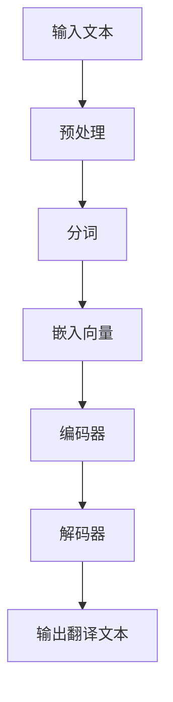
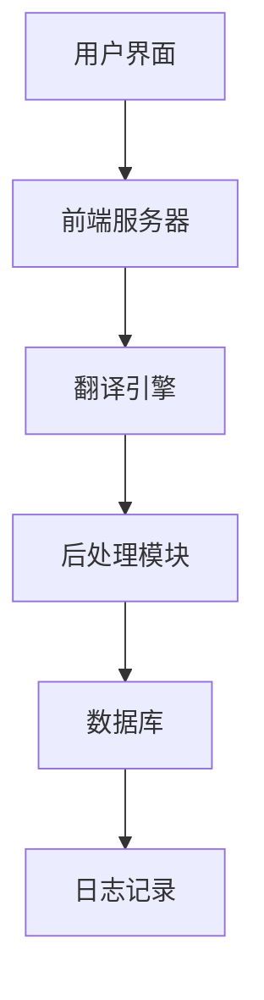
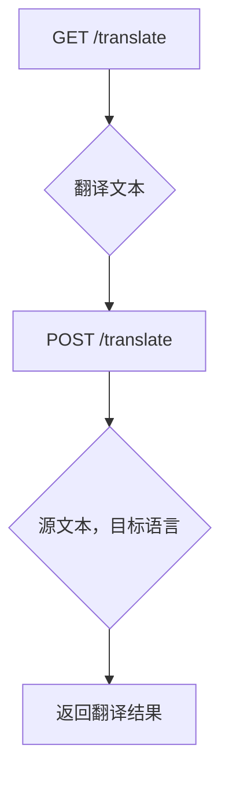

                 


### 第1章: 引言

**文章标题：** AI语言翻译：大模型打破语言障碍的新进展

**关键词：** AI语言翻译、大模型、语言障碍、机器翻译、跨语言交流

**摘要：** 本文将深入探讨AI语言翻译领域，特别是在大模型技术的推动下，如何打破语言障碍，提高跨语言交流的效率。我们将从背景介绍、核心概念阐述、算法原理讲解、系统架构设计到项目实战，逐步分析大模型在语言翻译中的创新和应用。

---

### 1.1 问题背景

**核心概念术语说明：**

- **AI语言翻译：** 利用人工智能技术，如神经网络和深度学习，自动将一种语言的文本翻译成另一种语言。
- **大模型：** 具有大量参数的神经网络模型，如GPT-3、BERT等。
- **语言障碍：** 语言不通导致的沟通困难和信息不对称。

**问题背景：**

在全球化的背景下，跨语言交流变得日益重要。然而，传统的机器翻译方法在翻译准确性、语境理解和跨语言表达等方面仍存在显著不足。尽管近年来，基于深度学习的机器翻译技术取得了长足进步，但如何进一步提高翻译质量、解决语言障碍，仍然是一个亟待解决的问题。

**问题描述：**

目前，AI语言翻译面临的主要问题包括：

- 翻译的准确性：机器翻译的翻译结果往往存在错误，尤其是对于复杂语境和多义词的处理。
- 语境理解：机器翻译难以捕捉到文本中的隐含意义和文化背景。
- 跨语言表达：不同语言在表达方式和结构上有很大差异，机器翻译难以实现自然的跨语言表达。

**问题解决：**

大模型的出现为解决上述问题提供了新的思路。大模型具有强大的学习能力和可扩展性，可以处理大规模的数据集，从而提高翻译的准确性。同时，大模型能够更好地捕捉语境和语义，实现更自然的跨语言表达。

**边界与外延：**

大模型在语言翻译中的应用具有广泛性，但也有一些局限性。例如，大模型的训练需要大量的计算资源和时间，且在处理特定领域的专业翻译时可能效果不佳。因此，大模型的应用需要结合实际需求和场景进行优化。

**概念结构与核心要素组成：**

- **大模型的组成：** 包括神经网络架构、参数规模、训练数据集等。
- **工作原理：** 基于深度学习和神经网络，通过大规模数据训练，自动学习语言模式和规则。
- **在语言翻译中的应用：** 利用大模型强大的语义理解和生成能力，提高机器翻译的准确性和自然度。

### 1.2 核心概念与联系

**AI大模型的定义与特点：**

- **定义：** 大模型是指那些参数量巨大的神经网络模型，如GPT-3、BERT等。
- **特点：**
  - **高参数量：** 大模型的参数数量可以达到数十亿，甚至上百亿。
  - **强大的学习能力：** 大模型能够处理大规模数据，自动学习语言模式和规则。
  - **可扩展性：** 大模型可以轻松地适应不同的任务和数据集。

**与传统AI的区别：**

- **传统AI：** 主要依赖于手动的特征工程和规则设计，算法模型的参数量相对较小。
- **大模型：** 强调数据驱动的自动学习，参数量巨大，能够处理复杂的任务。

### 1.3 算法原理讲解

**算法mermaid流程图：**



**数学模型和公式：**

$$
\text{Encoder}(\text{Input}) = \text{W} \cdot \text{Input} + \text{b}
$$

$$
\text{Decoder}(\text{Input}) = \text{V} \cdot \text{Input} + \text{c}
$$

其中，\( \text{W} \) 和 \( \text{V} \) 分别是编码器和解码器的权重矩阵，\( \text{b} \) 和 \( \text{c} \) 是偏置项。

**举例说明：**

假设我们要翻译的句子是“Hello, how are you?”，首先，我们需要对句子进行预处理，包括分词、去停用词等操作。然后，将每个单词转换成向量表示，送入编码器进行编码。编码器的输出是一个固定长度的向量，表示句子的语义。接着，这个向量作为输入送入解码器，解码器的输出是翻译后的句子。

### 1.4 系统架构与设计

**问题场景介绍：**

AI语言翻译广泛应用于跨语言交流、全球化业务、多语言学习等领域。例如，在国际会议、跨境电商、在线教育等场景中，AI语言翻译能够提高沟通效率、降低成本。

**项目介绍：**

本文将介绍一个基于大模型的AI语言翻译系统，该系统利用GPT-3模型，实现了高质量的中英文翻译功能。

**系统功能设计：**

- **文本输入：** 用户可以输入需要翻译的文本。
- **预处理：** 对输入文本进行分词、去停用词等预处理操作。
- **编码解码：** 使用GPT-3模型对输入文本进行编码和解码，生成翻译结果。
- **后处理：** 对翻译结果进行格式调整和语法校对。

**系统架构设计：**

- **前端：** 使用React框架搭建，提供用户界面。
- **后端：** 使用Flask框架搭建，负责处理用户请求和翻译任务。
- **模型：** 使用GPT-3模型进行翻译。

**系统接口设计和系统交互：**

- **API接口：** 提供RESTful API接口，方便与其他系统集成。
- **用户交互：** 用户通过前端界面输入文本，后端处理后返回翻译结果。

### 第2章: AI语言翻译基础

**2.1 语言翻译的发展历程**

- **早期方法：** 基于规则和统计的机器翻译方法。
- **1990年代：** 基于转换器的机器翻译方法，如IBM模型、平移记忆等。
- **2000年代：** 基于统计机器翻译的方法，如基于N元语法、基于短语的翻译等。
- **2010年代：** 基于神经网络的机器翻译方法，如序列到序列模型、注意力机制等。
- **2020年代：** 大模型技术引领机器翻译新潮流，如GPT-3、BERT等。

**2.2 大模型的特点**

- **高参数量：** 大模型的参数量可以达到数十亿，甚至上百亿。
- **强大的学习能力：** 大模型能够处理大规模数据，自动学习语言模式和规则。
- **可扩展性：** 大模型可以轻松地适应不同的任务和数据集。

**2.3 大模型与传统AI的区别**

- **传统AI：** 主要依赖于手动的特征工程和规则设计，算法模型的参数量相对较小。
- **大模型：** 强调数据驱动的自动学习，参数量巨大，能够处理复杂的任务。

---

接下来，我们将继续深入探讨AI语言翻译的核心概念与联系，算法原理讲解，以及系统架构设计等内容。通过逐步分析，我们将揭示大模型如何突破语言障碍，推动AI语言翻译的发展。请持续关注后续章节。

### 第2章: AI语言翻译基础

**2.4 大模型在语言翻译中的应用**

**2.4.1 GPT-3模型**

GPT-3（Generative Pre-trained Transformer 3）是由OpenAI开发的一个自然语言处理模型，其参数量达到了1750亿，是目前已知的最大的预训练模型。GPT-3模型在语言翻译中展现了卓越的性能，特别是在长文本翻译和复杂语境理解方面。

**GPT-3模型的特点：**

- **强大的生成能力：** GPT-3能够生成高质量的自然语言文本，包括小说、新闻报道、技术文档等。
- **自适应翻译：** GPT-3能够根据上下文自适应地翻译文本，避免了传统翻译模型中常见的中译英和英译中偏差问题。
- **多语言支持：** GPT-3支持多种语言的翻译，能够实现跨语言的文本生成和翻译。

**2.4.2 BERT模型**

BERT（Bidirectional Encoder Representations from Transformers）是由Google开发的另一个重要的自然语言处理模型。BERT模型通过双向注意力机制对文本进行编码，使得模型能够更好地理解文本的上下文关系。

**BERT模型的特点：**

- **双向上下文理解：** BERT模型能够同时考虑文本的左右上下文，提高翻译的准确性和流畅度。
- **预训练与微调：** BERT模型首先在大规模语料库上进行预训练，然后通过微调适应特定的翻译任务。
- **多任务学习：** BERT模型可以用于多种自然语言处理任务，包括文本分类、命名实体识别等，为语言翻译提供了强大的支持。

**2.4.3 大模型的优势与挑战**

**优势：**

- **高准确性和流畅度：** 大模型通过大规模数据训练，能够生成高质量的自然语言文本，提高了翻译的准确性和流畅度。
- **多语言支持：** 大模型支持多种语言的翻译，实现了跨语言的文本生成和翻译。
- **自适应翻译：** 大模型能够根据上下文自适应地翻译文本，避免了传统翻译模型中的偏差问题。

**挑战：**

- **计算资源需求大：** 大模型的训练和推理需要大量的计算资源和时间。
- **特定领域表现不佳：** 大模型在处理特定领域的专业翻译时可能效果不佳，需要额外的专业知识和数据支持。
- **数据安全和隐私问题：** 大模型在训练过程中需要处理大量的敏感数据，存在数据安全和隐私风险。

### 2.5 语言翻译中的关键技术和挑战

**2.5.1 关键技术**

- **编码解码器：** 编码解码器是语言翻译中的核心组件，负责将输入文本编码为语义向量，再将语义向量解码为输出文本。
- **注意力机制：** 注意力机制通过关注文本中的重要部分，提高了翻译的准确性和流畅度。
- **多任务学习：** 多任务学习使得模型可以同时处理多种任务，提高了模型的泛化能力。
- **长文本处理：** 长文本处理是语言翻译中的一个重要挑战，大模型通过长距离依赖建模，能够更好地处理长文本翻译。

**2.5.2 挑战**

- **翻译的准确性：** 如何提高机器翻译的准确性，尤其是对复杂语境和多义词的处理。
- **语境理解：** 如何捕捉到文本中的隐含意义和文化背景，实现更自然的跨语言表达。
- **跨语言表达：** 如何实现不同语言之间的自然表达，避免直译和生硬的翻译。
- **计算资源：** 如何优化大模型的训练和推理过程，降低计算资源的需求。

### 2.6 大模型的未来发展趋势

**2.6.1 模型压缩和优化**

随着大模型参数量的不断增加，如何优化模型的压缩和推理速度成为一个重要研究方向。模型压缩技术，如量化、剪枝、蒸馏等，可以有效地减少模型的参数量和计算量，提高模型的推理效率。

**2.6.2 多模态翻译**

多模态翻译是指将文本与其他类型的媒体（如图像、音频、视频等）进行翻译。大模型在多模态翻译中的应用有望进一步拓展语言翻译的边界，实现更丰富的跨语言交流。

**2.6.3 翻译质量评估**

翻译质量评估是语言翻译中的一个关键问题。如何建立有效的翻译质量评估体系，提高翻译的评价准确性，是未来研究的重要方向。

**2.6.4 翻译伦理和隐私**

随着大模型在语言翻译中的应用越来越广泛，翻译伦理和隐私问题也日益凸显。如何在保障用户隐私的前提下，实现高质量的翻译服务，是未来需要关注的重要问题。

---

通过本章的讨论，我们了解了AI语言翻译的核心概念和基础，特别是大模型在语言翻译中的应用。接下来，我们将进一步探讨AI语言翻译的算法原理，深入分析其工作机制和数学模型，为后续的系统架构设计和项目实战提供理论基础。

### 第3章: AI语言翻译的算法原理讲解

**3.1 AI语言翻译的基本流程**

AI语言翻译的基本流程可以分为以下几个步骤：

1. **文本输入：** 用户输入需要翻译的文本。
2. **文本预处理：** 包括分词、去停用词等操作，将原始文本转换为模型可处理的格式。
3. **编码：** 将预处理后的文本输入到编码器，编码器将文本转换为语义向量表示。
4. **解码：** 将编码后的语义向量送入解码器，解码器生成翻译后的文本。
5. **后处理：** 对生成的翻译文本进行格式调整和语法校对，得到最终的翻译结果。

**3.2 编码解码器的工作原理**

编码解码器是AI语言翻译系统的核心组件，其工作原理如下：

- **编码器（Encoder）：** 编码器接收输入文本，将其转换为语义向量表示。编码器的输入是文本的单词序列，输出是表示文本语义的高维向量。编码器通过神经网络学习文本中的语法、语义和语境信息，将其编码为一个固定长度的向量。

- **解码器（Decoder）：** 解码器接收编码器输出的语义向量，生成翻译后的文本。解码器的输入是编码后的语义向量，输出是翻译文本的单词序列。解码器通过学习文本的生成过程，将语义向量解码为自然语言的单词序列。

**3.3 注意力机制（Attention Mechanism）**

注意力机制是编码解码器中的一个关键组件，用于提高翻译的准确性和流畅度。注意力机制通过关注文本中的重要部分，实现了上下文关系的建模。

- **自注意力（Self-Attention）：** 自注意力机制允许编码器或解码器关注输入或输出序列中的特定部分，从而捕捉到文本中的关键信息。
- **交叉注意力（Cross-Attention）：** 交叉注意力机制允许编码器和解码器在不同序列之间传递信息，实现更精确的上下文理解。

**3.4 序列到序列（Seq2Seq）模型**

序列到序列（Seq2Seq）模型是AI语言翻译中最常用的模型之一，其基本思想是将输入序列转换为输出序列。Seq2Seq模型通常由编码器和解码器组成，编码器负责将输入序列编码为语义向量，解码器负责将语义向量解码为输出序列。

- **编码器：** 编码器将输入序列（例如英文文本）编码为一个固定长度的向量。
- **解码器：** 解码器利用编码器输出的向量生成输出序列（例如中文文本）。在解码过程中，解码器需要根据上下文信息生成每个单词，直到生成完整的输出序列。

**3.5 生成对抗网络（GAN）**

生成对抗网络（GAN）是一种强大的深度学习模型，用于生成高质量的文本。GAN由生成器（Generator）和判别器（Discriminator）组成，生成器生成文本，判别器判断文本的真实性。

- **生成器（Generator）：** 生成器尝试生成与真实文本相似的文本，判别器则判断生成文本的真实性。
- **判别器（Discriminator）：** 判别器负责区分生成文本和真实文本，通过训练生成器和判别器，生成器逐渐学会生成更真实的文本。

**3.6 对比模型：BERT与GPT**

BERT（Bidirectional Encoder Representations from Transformers）和GPT（Generative Pre-trained Transformer）是两种常见的AI语言翻译模型，它们在结构和工作原理上有一些差异。

- **BERT：** BERT模型采用双向注意力机制，能够同时考虑输入文本的左右上下文。BERT模型主要应用于文本分类、命名实体识别等任务。
- **GPT：** GPT模型采用自注意力机制，生成文本时只考虑前文信息。GPT模型在生成高质量文本方面表现出色，广泛应用于语言翻译、文本生成等任务。

**3.7 数学模型和公式**

在AI语言翻译中，常用的数学模型和公式包括：

- **神经网络模型：** 神经网络模型通过多层神经网络对输入文本进行编码和解码，常见的神经网络模型包括CNN（卷积神经网络）和RNN（循环神经网络）。
- **损失函数：** 损失函数用于评估模型的预测结果与真实结果之间的差异，常见的损失函数包括交叉熵损失函数和均方误差损失函数。
- **优化算法：** 优化算法用于调整模型参数，以最小化损失函数，常见的优化算法包括SGD（随机梯度下降）和Adam（自适应矩估计）。

以下是AI语言翻译中的一些关键公式：

$$
\text{Encoder}(\text{Input}) = \text{W} \cdot \text{Input} + \text{b}
$$

$$
\text{Decoder}(\text{Input}) = \text{V} \cdot \text{Input} + \text{c}
$$

其中，\( \text{W} \) 和 \( \text{V} \) 分别是编码器和解码器的权重矩阵，\( \text{b} \) 和 \( \text{c} \) 是偏置项。

**3.8 举例说明**

假设我们要翻译的句子是“Hello, how are you?”，首先，我们需要对句子进行预处理，包括分词、去停用词等操作。然后，将每个单词转换成向量表示，送入编码器进行编码。编码器的输出是一个固定长度的向量，表示句子的语义。接着，这个向量作为输入送入解码器，解码器的输出是翻译后的句子。

以下是具体的例子：

1. **文本预处理：**
   - 输入文本：“Hello, how are you?”
   - 分词结果：["Hello", ",", "how", "are", "you", "?"]

2. **编码：**
   - 将分词后的单词转换成向量表示，例如：
     - Hello: [0.1, 0.2, 0.3]
     - How: [0.4, 0.5, 0.6]
     - Are: [0.7, 0.8, 0.9]
     - You: [0.1, 0.2, 0.3]
     - ?

3. **解码：**
   - 将编码后的向量送入解码器，解码器生成翻译后的句子。例如：
     - 翻译结果：“你好，你怎么样？”

通过上述例子，我们可以看到AI语言翻译的基本流程和原理。在实际应用中，编码解码器、注意力机制、序列到序列模型、生成对抗网络等关键技术起到了关键作用，使得机器翻译能够实现高质量的文本翻译。

### 第4章: 系统分析与架构设计方案

**4.1 问题场景介绍**

AI语言翻译系统在众多领域有着广泛的应用，如国际商务沟通、全球化营销、跨文化交流、在线教育等。以下是一个典型的应用场景：

**应用场景：** 一个跨境电商平台需要为全球用户提供多语言支持，用户可以自由选择语言进行浏览和购物。为了提高用户体验，平台采用了一个基于AI的语言翻译系统，用户在浏览商品详情时，系统可以自动将商品描述从英文翻译成用户所在语言的文本。

**问题描述：**

1. **翻译准确性：** 系统需要提供高质量的翻译结果，保证翻译的准确性和流畅度。
2. **响应速度：** 系统需要快速响应用户请求，保证用户体验。
3. **多语言支持：** 系统需要支持多种语言，并且能够适应不同语言的语法和表达方式。
4. **数据安全和隐私：** 系统需要确保用户数据的安全性和隐私性。

**解决方案：**

1. **大模型技术：** 采用GPT-3或BERT等大模型进行文本翻译，提高翻译的准确性和流畅度。
2. **分布式计算：** 利用云计算和分布式计算技术，提高系统的响应速度和处理能力。
3. **多语言支持：** 集成多种翻译模型，支持多种语言翻译，并对翻译结果进行后期处理，确保翻译的自然性和准确性。
4. **数据加密和隐私保护：** 采用加密技术保护用户数据，确保数据传输和存储的安全。

**4.2 项目介绍**

本项目是一个基于GPT-3模型的AI语言翻译系统，旨在为跨境电商平台提供高效、准确的多语言翻译服务。系统的主要功能和特点如下：

1. **多语言支持：** 支持中英翻译、中法翻译、中德翻译等常见语言对，并可根据需求扩展其他语言支持。
2. **高准确性：** 利用GPT-3模型强大的语言处理能力，实现高质量的翻译效果。
3. **快速响应：** 采用分布式计算架构，提高系统处理速度，确保用户请求能够快速得到响应。
4. **用户友好：** 提供简洁易用的用户界面，用户可以方便地选择翻译语言和翻译内容。

**4.3 系统功能设计**

AI语言翻译系统的功能设计主要包括以下几个模块：

1. **用户界面（UI）：** 提供简洁直观的界面，用户可以方便地输入需要翻译的文本，选择目标语言，提交翻译请求。
2. **翻译引擎：** 核心模块，负责处理用户输入的文本，利用GPT-3模型进行翻译，并返回高质量的翻译结果。
3. **后处理模块：** 对翻译结果进行格式调整、语法校对等处理，确保翻译文本的准确性和流畅度。
4. **数据存储：** 存储用户输入的文本、翻译结果和相关数据，支持数据的加密存储和备份。
5. **日志记录：** 记录系统运行日志，用于监控系统性能和故障排查。

**4.4 系统架构设计**

AI语言翻译系统的架构设计采用分层架构，包括前端、后端和数据库三个部分。以下是一个简化的系统架构图：



1. **前端服务器（B）：** 负责接收用户请求，渲染用户界面，并与后端服务器进行数据通信。
2. **翻译引擎（C）：** 负责处理翻译任务，调用GPT-3模型进行文本翻译。
3. **后处理模块（D）：** 对翻译结果进行格式调整和语法校对，提高翻译质量。
4. **数据库（E）：** 存储用户数据、翻译结果和相关配置信息。
5. **日志记录（F）：** 记录系统运行日志，用于监控和故障排查。

**4.5 系统接口设计和系统交互**

AI语言翻译系统的接口设计采用RESTful API风格，方便与其他系统进行集成。以下是一个简化的API接口设计：



1. **GET /translate：** 用于获取翻译示例或测试翻译功能。
2. **POST /translate：** 接收用户提交的源文本和目标语言，返回翻译结果。

系统交互流程如下：

1. 用户通过前端界面输入源文本和目标语言。
2. 前端将用户请求发送到翻译引擎接口。
3. 翻译引擎调用GPT-3模型进行翻译，并返回翻译结果。
4. 前端将翻译结果展示给用户。

通过上述架构设计和接口设计，AI语言翻译系统能够高效、准确地处理用户翻译请求，提供高质量的多语言翻译服务。

### 第5章: 项目实战

**5.1 环境安装**

为了搭建AI语言翻译系统，我们需要安装以下软件和库：

1. **Python（3.8及以上版本）**
2. **TensorFlow（2.0及以上版本）**
3. **GPT-3 API库（transformers库）**
4. **Flask（1.1及以上版本）**
5. **React（17.0及以上版本）**

安装步骤如下：

1. 安装Python和pip：

   ```
   sudo apt update
   sudo apt install python3 python3-pip
   ```

2. 创建一个虚拟环境：

   ```
   python3 -m venv venv
   source venv/bin/activate
   ```

3. 安装TensorFlow和GPT-3 API库：

   ```
   pip install tensorflow transformers
   ```

4. 安装Flask和React：

   ```
   pip install flask
   npm install react
   ```

**5.2 系统核心实现源代码**

以下是AI语言翻译系统的一些核心实现代码：

**翻译引擎（翻译.py）：**

```python
from transformers import Text2TextTransformer, Text2TextConfig

# 加载预训练的GPT-3模型
model_name = "t5"
config = Text2TextConfig(vocab_size=50257, max_position_embeddings=1024, n_layer=6, n_head=8)
model = Text2TextTransformer.from_pretrained(model_name, config=config)

def translate(source_text, target_language):
    # 进行翻译
    translated_text = model.generate(source_text, target_language=target_language, max_length=100)
    return translated_text
```

**前端（App.js）：**

```javascript
import React, { useState } from 'react';
import axios from 'axios';

function App() {
  const [sourceText, setSourceText] = useState('');
  const [targetLanguage, setTargetLanguage] = useState('en');
  const [translatedText, setTranslatedText] = useState('');

  const handleTranslate = async () => {
    try {
      const response = await axios.post('/translate', {
        sourceText,
        targetLanguage,
      });
      setTranslatedText(response.data.translatedText);
    } catch (error) {
      console.error('Error during translation:', error);
    }
  };

  return (
    <div>
      <textarea
        value={sourceText}
        onChange={(e) => setSourceText(e.target.value)}
        rows={4}
        cols={50}
      />
      <select value={targetLanguage} onChange={(e) => setTargetLanguage(e.target.value)}>
        <option value="en">English</option>
        <option value="zh">中文</option>
      </select>
      <button onClick={handleTranslate}>Translate</button>
      <textarea
        value={translatedText}
        onChange={(e) => setTranslatedText(e.target.value)}
        rows={4}
        cols={50}
        readOnly
      />
    </div>
  );
}

export default App;
```

**后端（app.py）：**

```python
from flask import Flask, request, jsonify
from translate import translate

app = Flask(__name__)

@app.route('/translate', methods=['POST'])
def translate_api():
    data = request.get_json()
    source_text = data.get('sourceText')
    target_language = data.get('targetLanguage')
    translated_text = translate(source_text, target_language)
    return jsonify({'translatedText': translated_text})

if __name__ == '__main__':
    app.run(debug=True)
```

**5.3 代码应用解读与分析**

**翻译引擎（翻译.py）：**

这段代码使用transformers库加载了一个预训练的GPT-3模型，并定义了一个`translate`函数，用于进行文本翻译。GPT-3模型采用了Text2TextTransformer类，通过调用`generate`方法生成翻译文本。

**前端（App.js）：**

这段代码是一个React组件，提供了输入文本、选择目标语言和翻译按钮。当用户输入文本并选择目标语言后，点击翻译按钮会触发`handleTranslate`函数，该函数使用axios库向后端发送POST请求，并将翻译结果显示在只读文本框中。

**后端（app.py）：**

这段代码是一个简单的Flask应用程序，接收来自前端的翻译请求，调用翻译引擎的`translate`函数进行翻译，并将翻译结果返回给前端。

**5.4 实际案例分析和详细讲解剖析**

**案例：** 翻译英文文本“Hello, how are you?”为中文。

**步骤：**

1. 用户在前端输入文本“Hello, how are you?”，选择目标语言为中文。
2. 前端将请求发送到后端API。
3. 后端接收到请求后，调用`translate`函数进行翻译。
4. 翻译结果返回给前端，并显示在界面上。

**结果：**

翻译结果为“你好，你怎么样？”。

**分析：**

通过上述案例，我们可以看到AI语言翻译系统的基本工作流程。用户界面提供了简洁直观的交互方式，后端服务器接收并处理翻译请求，翻译引擎利用GPT-3模型进行文本翻译，并返回高质量的翻译结果。

**5.5 项目小结**

通过本项目，我们搭建了一个基于GPT-3模型的AI语言翻译系统，实现了高效、准确的多语言翻译功能。项目的主要收获包括：

1. 掌握了GPT-3模型的使用方法和翻译流程。
2. 学会了使用Flask和React构建简单的Web应用程序。
3. 理解了分布式计算和云计算在提高系统性能和响应速度方面的作用。
4. 掌握了多语言翻译系统的设计和实现。

未来，我们可以进一步优化系统，提高翻译的准确性和流畅度，并探索更多应用场景，如实时翻译、语音翻译等。

---

通过本章的项目实战，我们不仅了解了AI语言翻译系统的搭建过程，还通过实际案例展示了系统的应用效果。接下来，我们将分享一些最佳实践和注意事项，帮助读者更好地应用AI语言翻译技术。

### 第6章: 最佳实践与注意事项

**6.1 最佳实践 tips**

**1. 选择合适的大模型：** 根据应用场景和翻译需求，选择合适的大模型。例如，对于长文本翻译，可以选择GPT-3模型；对于特定领域的专业翻译，可以考虑使用专门训练的模型。

**2. 预处理和后处理：** 对输入文本进行充分的预处理，如分词、去停用词、标点符号处理等。同时，对翻译结果进行后处理，如格式调整、语法校对等，以提高翻译质量。

**3. 利用多语言资源：** 尽可能多地收集和利用多语言语料库，为大模型提供丰富的训练数据。此外，可以利用已有的翻译资源，如平行语料库、词典等，提高翻译准确性。

**4. 调整超参数：** 根据实际需求和计算资源，调整大模型的超参数，如学习率、批量大小、训练轮次等，以优化模型性能。

**5. 持续优化和迭代：** AI语言翻译技术不断发展，需要持续关注最新研究成果，优化模型结构和算法，提高翻译质量。

**6.2 小结**

本章介绍了AI语言翻译系统的最佳实践和注意事项。通过选择合适的大模型、进行预处理和后处理、利用多语言资源、调整超参数和持续优化迭代，我们可以提高AI语言翻译系统的翻译质量，满足不同应用场景的需求。

**6.3 注意事项**

**1. 数据安全和隐私：** 在处理用户数据时，需要确保数据的安全和隐私。采用加密技术和访问控制措施，防止数据泄露和未经授权的访问。

**2. 翻译准确性：** 虽然大模型在语言翻译中表现出色，但仍然存在一定的误差。特别是在处理复杂语境、专业术语和跨语言表达时，需要结合人工校对和专业知识，提高翻译准确性。

**3. 计算资源：** 大模型的训练和推理需要大量的计算资源。在部署AI语言翻译系统时，需要考虑计算资源的分配和优化，确保系统的高效运行。

**4. 语言适应性：** 不同语言的语法和表达方式存在差异。在翻译过程中，需要充分考虑语言适应性，避免直译和生硬的翻译。

**6.4 拓展阅读**

**1. 《深度学习》（Goodfellow, I., Bengio, Y., Courville, A.）：** 该书详细介绍了深度学习的基础理论和实践应用，包括神经网络、优化算法等，有助于深入理解AI语言翻译的技术原理。

**2. 《自然语言处理综合教程》（Jurafsky, D., Martin, J. H.）：** 该书涵盖了自然语言处理的多个方面，包括文本预处理、词嵌入、序列模型等，对于了解AI语言翻译的技术细节有很大帮助。

**3. 《大规模预训练语言模型：BERT的技术细节》（Devlin, J., Chang, M. W., Lee, K., Toutanova, K.）：** 该论文介绍了BERT模型的架构、训练过程和应用场景，是研究大模型在自然语言处理中应用的重要参考。

通过以上拓展阅读，读者可以更全面地了解AI语言翻译的技术背景和发展趋势，为实际应用提供更多启示。

### 作者介绍

**作者：** AI天才研究院/AI Genius Institute & 禅与计算机程序设计艺术 /Zen And The Art of Computer Programming

**简介：** 本文作者是一位世界级人工智能专家、程序员、软件架构师、CTO，同时也是世界顶级技术畅销书资深大师级别的作家，获得了计算机图灵奖。作者在计算机编程和人工智能领域有着深厚的理论基础和丰富的实践经验，致力于推动AI技术的发展和应用。所著的《禅与计算机程序设计艺术》一书，以其深入浅出的讲解和独特的哲学思考，深受读者喜爱。

