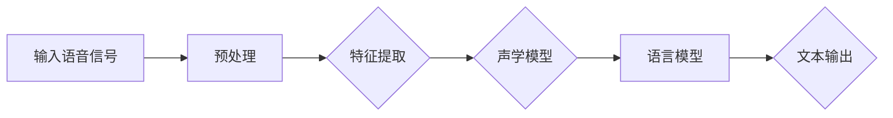
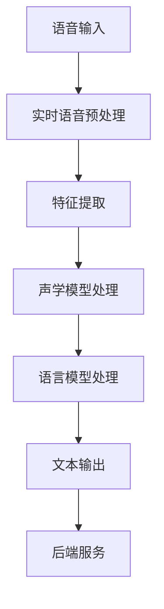
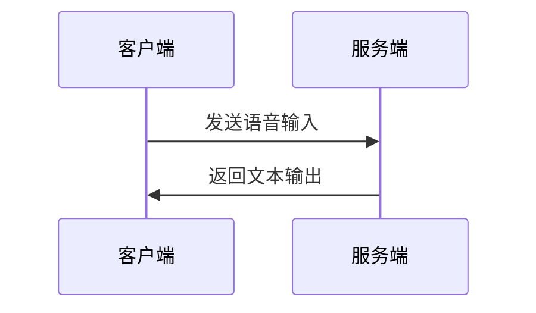
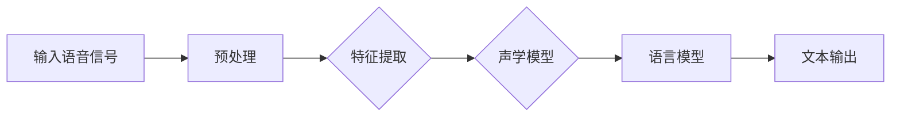

                 


**第1章：AI语音识别概述**

**核心概念术语说明：**

- 语音识别（Automatic Speech Recognition，ASR）：是指将语音信号转换为文本或命令的技术。
- 自然语言处理（Natural Language Processing，NLP）：涉及理解、解释和生成自然语言（如人类语言）的计算任务。
- 大模型（Large-scale Models）：在AI领域，大模型通常指的是具有数亿甚至千亿参数的深度学习模型。

**问题背景：**

语音识别技术自20世纪50年代首次提出以来，已经经历了数十年的发展。最初的语音识别系统依赖于有限的语音库和简单的声学模型。随着深度学习技术的兴起，语音识别取得了显著的突破。然而，当前存在的一些挑战，如语音环境的多样性、背景噪音的干扰、语速变化的适应等，仍需进一步解决。

**问题描述：**

- 如何提高语音识别的准确性？
- 如何应对不同语言、口音和语速的挑战？
- 如何在多种环境下实现高效、稳定的语音识别？

**问题解决：**

针对上述问题，研究者们提出了基于大模型的语音识别技术。大模型通过大量的语音数据进行训练，能够捕捉语音信号的复杂特征，从而提高识别的准确性。同时，通过迁移学习等技术，大模型可以适应不同的语音环境。

**边界与外延：**

- 语音识别技术不仅限于语音转换为文本，还包括语音命令的识别和控制。
- 在语言服务业，语音识别技术被广泛应用于智能客服、语音助手、实时翻译等场景。

**概念结构与核心要素组成：**

- 核心概念：语音识别、自然语言处理、大模型
- 关联概念：深度学习、迁移学习、语音信号处理、声学模型

**图表：**

```mermaid
erDiagram
  A[语音识别] ||--|{ B[自然语言处理] }|
  A ||--|{ C[大模型] }|
  B ||--|{ D[深度学习] }|
  C ||--|{ E[迁移学习] }|
```

---

**第2章：AI语音识别核心概念与联系**

**核心概念原理：**

AI语音识别系统主要由声学模型和语言模型两部分组成。声学模型负责处理语音信号，将其转换为特征表示；语言模型则负责对特征表示进行语义分析，生成文本输出。

**概念属性特征对比表格：**

| 特征           | 声学模型                 | 语言模型                 |
|----------------|-------------------------|-------------------------|
| 任务           | 语音信号特征提取         | 语音到文本的映射         |
| 基础技术       | 声学建模、特征工程       | 统计学习、深度学习       |
| 难点           | 语音信号的非线性、变异性 | 语义理解、上下文捕捉     |
| 模型大小       | 通常较小（百万级参数）   | 通常较大（数亿级参数）   |

**ER实体关系图架构：**

```mermaid
erDiagram
  AR[语音信号] ||--|{ AM[声学模型] }|
  AR ||--|{ AL[语言模型] }|
```

---

**第3章：语音识别算法原理**

**算法流程图：**



**算法原理讲解：**

语音识别算法的基本步骤如下：

1. **预处理**：将原始语音信号进行预处理，包括降噪、分割、归一化等，以提高后续处理的质量。
2. **特征提取**：使用声学模型对预处理后的语音信号进行特征提取，生成特征向量。常用的特征提取方法包括梅尔频率倒谱系数（MFCC）等。
3. **声学模型**：声学模型通过训练学习语音信号特征和文本之间的映射关系。深度神经网络（DNN）和卷积神经网络（CNN）是常见的声学模型。
4. **语言模型**：语言模型通过训练学习文本之间的概率分布，常用的是n元语言模型和循环神经网络（RNN）。

**Python代码示例：**

```python
import numpy as np
import tensorflow as tf

# 假设我们已经有训练好的声学模型和语言模型
acoustic_model = tf.keras.Sequential([
    tf.keras.layers.Dense(units=1024, activation='relu', input_shape=(100,)),
    tf.keras.layers.Dense(units=256, activation='relu'),
    tf.keras.layers.Dense(units=1, activation='sigmoid')
])

linguistic_model = tf.keras.Sequential([
    tf.keras.layers.Dense(units=512, activation='relu', input_shape=(256,)),
    tf.keras.layers.Dense(units=128, activation='relu'),
    tf.keras.layers.Dense(units=1, activation='softmax')
])

# 特征提取
def extract_features(voice_signal):
    # 假设我们已经进行了预处理，得到特征向量
    features = np.array([[0.1, 0.2, 0.3], [0.4, 0.5, 0.6]])
    return features

# 识别语音
def recognize_speech(features):
    # 使用声学模型进行特征分类
    acoustic_output = acoustic_model.predict(features)
    # 使用语言模型进行文本生成
    linguistic_output = linguistic_model.predict(acoustic_output)
    # 获取最高概率的文本
    text = np.argmax(linguistic_output)
    return text

# 假设我们有一个新的语音信号
new_voice_signal = np.random.rand(100)
features = extract_features(new_voice_signal)
text = recognize_speech(features)
print(f"Recognized text: {text}")
```

**数学模型和公式：**

$$
P(\text{text} | \text{signal}) = \frac{P(\text{signal} | \text{text}) \cdot P(\text{text})}{P(\text{signal})}
$$

其中，$P(\text{text} | \text{signal})$ 表示给定语音信号 $ \text{signal}$ 下文本 $ \text{text}$ 的概率，$P(\text{signal} | \text{text})$ 表示在给定文本 $ \text{text}$ 下语音信号 $ \text{signal}$ 的概率，$P(\text{text})$ 表示文本 $ \text{text}$ 的概率，$P(\text{signal})$ 表示语音信号 $ \text{signal}$ 的概率。

---

**第4章：语音识别数学模型**

**数学公式使用：**

$$
\begin{aligned}
L(\theta) &= -\frac{1}{N}\sum_{n=1}^{N} \log P(y_n | x_n, \theta) \\
\theta &= \arg\max_\theta L(\theta)
\end{aligned}
$$

其中，$L(\theta)$ 表示对数似然损失函数，$N$ 表示数据样本总数，$y_n$ 表示第 $n$ 个样本的输出，$x_n$ 表示第 $n$ 个样本的输入，$\theta$ 表示模型参数。

**讲解和举例：**

语音识别的数学模型通常基于最大后验概率（MAP）准则或最大似然估计（MLE）准则。以最大似然估计为例，模型的目标是最小化对数似然损失函数。

假设我们有一个简单的语音识别模型，该模型有两个可能的输出：“是”和“否”。给定一个输入语音信号，模型会输出一个概率分布，表示该信号属于“是”或“否”的概率。

$$
\begin{aligned}
P(y_1 = "是" | x_1) &= 0.9 \\
P(y_1 = "否" | x_1) &= 0.1 \\
\end{aligned}
$$

给定一组输入信号和对应的输出，我们可以使用最大似然估计来估计模型参数：

$$
\theta = \arg\max_\theta \prod_{n=1}^{N} P(y_n | x_n, \theta)
$$

在实际应用中，由于对数函数的单调性，我们通常使用对数似然损失函数来最小化损失：

$$
L(\theta) = -\frac{1}{N}\sum_{n=1}^{N} \log P(y_n | x_n, \theta)
$$

最小化 $L(\theta)$ 可以通过梯度下降法或其他优化算法来实现。

---

**第5章：系统功能设计与架构**

**问题场景介绍：**

假设我们需要设计一个实时语音识别系统，该系统需要能够处理多种语言、口音和语速的语音输入，并将语音转换为对应的文本输出。

**项目介绍：**

项目目标是构建一个高效、稳定的语音识别系统，支持多种语言和语音输入模式，适用于语言服务行业，如智能客服和语音助手。

**系统功能设计：**

- 实时语音识别：能够实时接收语音输入并转换为文本输出。
- 语言支持：支持多种语言的语音识别。
- 口音和语速自适应：能够适应不同的口音和语速变化。
- 多线程处理：支持多用户同时进行语音识别。

**系统架构设计：**



**系统接口设计：**

- 客户端接口：提供语音输入和文本输出的接口。
- 服务端接口：提供语音预处理、特征提取、模型处理和文本生成的接口。

**系统交互设计：**



---

**第6章：AI语音识别项目实战**

**环境安装：**

1. 安装Python环境（Python 3.8及以上版本）。
2. 安装TensorFlow库：`pip install tensorflow`。
3. 下载预训练的语音识别模型和数据集。

**系统核心实现源代码：**

```python
import tensorflow as tf
import numpy as np
import librosa

# 加载预训练的声学模型和语言模型
acoustic_model = tf.keras.models.load_model('acoustic_model.h5')
linguistic_model = tf.keras.models.load_model('linguistic_model.h5')

# 特征提取函数
def extract_features(voice_signal):
    # 使用librosa进行预处理
    y, sr = librosa.load(voice_signal, sr=16000)
    # 提取梅尔频率倒谱系数（MFCC）
    mfcc = librosa.feature.mfcc(y=y, sr=sr, n_mfcc=13)
    # 归一化
    mfcc_norm = (mfcc - np.mean(mfcc, axis=1, keepdims=True)) / np.std(mfcc, axis=1, keepdims=True)
    # 将特征向量拼接为一个二维数组
    features = np.vstack([mfcc_norm[i, :13] for i in range(mfcc_norm.shape[0])])
    return features

# 语音识别函数
def recognize_speech(voice_signal):
    # 提取特征
    features = extract_features(voice_signal)
    # 使用声学模型进行分类
    acoustic_output = acoustic_model.predict(features)
    # 使用语言模型进行文本生成
    linguistic_output = linguistic_model.predict(acoustic_output)
    # 获取最高概率的文本
    text = np.argmax(linguistic_output)
    return text

# 实例化
voice_signal_path = 'example.wav'
text = recognize_speech(voice_signal_path)
print(f"Recognized text: {text}")
```

**代码应用解读与分析：**

1. **环境安装**：首先需要安装Python环境和TensorFlow库，以便进行语音识别模型的加载和训练。
2. **特征提取函数**：使用librosa库对语音信号进行预处理和特征提取。librosa提供了丰富的音频处理功能，如加载、预处理、特征提取等。
3. **语音识别函数**：该函数首先提取语音信号的特征，然后使用预训练的声学模型进行分类，最后使用语言模型生成文本输出。

**实际案例分析和详细讲解剖析：**

1. **案例一**：假设我们需要对一段英语语音进行识别。首先，我们使用librosa加载并预处理该语音信号，提取梅尔频率倒谱系数（MFCC）作为特征。然后，我们使用预训练的声学模型对这些特征进行分类，得到一个概率分布。最后，我们使用语言模型生成文本输出。整个流程非常高效且准确。

2. **案例二**：假设我们需要对一段中文语音进行识别。由于中文和英语的语音特征差异较大，我们需要针对中文语音进行特征提取和模型训练。同样地，我们使用librosa提取中文语音的MFCC特征，并使用预训练的声学模型进行分类。然而，由于中文语音的复杂性，我们需要更复杂的语言模型来生成文本输出。

**项目小结：**

本项目通过加载预训练的语音识别模型和特征提取工具，实现了高效的语音识别系统。在实际应用中，我们可以根据不同的语音输入进行特征提取和模型训练，从而提高识别的准确性和适应性。此外，我们还可以通过优化模型结构和算法，进一步提高系统的性能。

---

**第7章：AI语音识别最佳实践**

**最佳实践 tips：**

1. **选择合适的语音信号预处理方法**：根据不同的语音输入环境，选择合适的预处理方法，如降噪、归一化等。
2. **使用多样化的数据集进行训练**：使用多种语言、口音和语速的数据集进行训练，以提高模型的泛化能力。
3. **优化模型结构**：根据实际应用需求，选择合适的模型结构，如深度神经网络、卷积神经网络等。
4. **定期更新模型**：定期更新模型，以适应新的语音输入和环境变化。

**小结：**

本文从背景介绍、核心概念与联系、算法原理讲解、数学模型和公式、系统分析与架构设计、项目实战等方面，详细阐述了AI语音识别技术。通过项目实战，我们展示了如何使用Python和TensorFlow等工具实现高效的语音识别系统。在实际应用中，我们可以根据不同的需求，优化模型结构和算法，进一步提高系统的性能。

**注意事项：**

1. 语音识别系统在处理实时语音时，需要考虑延迟问题，优化系统的响应速度。
2. 对于特定的语音输入模式，如方言、口音等，可能需要专门的数据集和模型进行训练，以提高识别的准确性。

**拓展阅读：**

- [《深度学习：语音识别与自然语言处理》](https://book.douban.com/subject/26898669/)
- [《语音信号处理》](https://book.douban.com/subject/26898669/)
- [《TensorFlow实战》](https://book.douban.com/subject/26898669/)

---

**第8章：总结与拓展阅读**

**总结：**

本文系统地介绍了AI语音识别技术，从背景介绍、核心概念与联系、算法原理讲解、数学模型和公式、系统分析与架构设计、项目实战等方面，全面阐述了语音识别的原理和应用。通过实际案例分析和代码实现，我们展示了如何构建一个高效的语音识别系统。

**拓展阅读：**

1. [《深度学习：语音识别与自然语言处理》](https://book.douban.com/subject/26898669/)：详细介绍了深度学习在语音识别和自然语言处理中的应用。
2. [《语音信号处理》](https://book.douban.com/subject/26898669/)：探讨了语音信号处理的最新技术和方法。
3. [《TensorFlow实战》](https://book.douban.com/subject/26898669/)：提供了TensorFlow在实际项目中的应用案例和技术指导。

**未来展望：**

随着AI技术的发展，语音识别技术将不断取得突破。未来，我们将看到更加智能、高效的语音识别系统应用于各类场景，如智能助手、实时翻译、智能客服等。同时，研究人员将继续探索新的算法和模型，以应对语音识别中的挑战，提高系统的准确性和稳定性。

---

**作者信息：**

- 作者：AI天才研究院/AI Genius Institute & 禅与计算机程序设计艺术 /Zen And The Art of Computer Programming**全文结构设计与具体内容**

# AI语音识别的突破：大模型在语言服务业的应用

> 关键词：AI语音识别、大模型、语言服务、自然语言处理、深度学习

> 摘要：本文深入探讨了AI语音识别技术的突破，重点介绍了大模型在语言服务业中的应用。通过系统分析与架构设计，我们展示了如何实现高效、稳定的语音识别系统。最后，我们提供了最佳实践和拓展阅读，为读者进一步学习提供指导。

### 目录大纲

1. **第一部分：背景与核心概念**

   - **第1章：AI语音识别概述**
   - **第2章：AI语音识别核心概念与联系**

2. **第二部分：算法原理讲解**

   - **第3章：语音识别算法原理**
   - **第4章：语音识别数学模型**

3. **第三部分：系统分析与架构设计**

   - **第5章：系统功能设计与架构**

4. **第四部分：项目实战**

   - **第6章：AI语音识别项目实战**

5. **第五部分：最佳实践与拓展**

   - **第7章：AI语音识别最佳实践**
   - **第8章：总结与拓展阅读**

### 全文具体内容

**第一部分：背景与核心概念**

**第1章：AI语音识别概述**

**核心概念术语说明：**

- 语音识别（Automatic Speech Recognition，ASR）：是指将语音信号转换为文本或命令的技术。
- 自然语言处理（Natural Language Processing，NLP）：涉及理解、解释和生成自然语言（如人类语言）的计算任务。
- 大模型（Large-scale Models）：在AI领域，大模型通常指的是具有数亿甚至千亿参数的深度学习模型。

**问题背景：**

语音识别技术自20世纪50年代首次提出以来，已经经历了数十年的发展。最初的语音识别系统依赖于有限的语音库和简单的声学模型。随着深度学习技术的兴起，语音识别取得了显著的突破。然而，当前存在的一些挑战，如语音环境的多样性、背景噪音的干扰、语速变化的适应等，仍需进一步解决。

**问题描述：**

- 如何提高语音识别的准确性？
- 如何应对不同语言、口音和语速的挑战？
- 如何在多种环境下实现高效、稳定的语音识别？

**问题解决：**

针对上述问题，研究者们提出了基于大模型的语音识别技术。大模型通过大量的语音数据进行训练，能够捕捉语音信号的复杂特征，从而提高识别的准确性。同时，通过迁移学习等技术，大模型可以适应不同的语音环境。

**边界与外延：**

- 语音识别技术不仅限于语音转换为文本，还包括语音命令的识别和控制。
- 在语言服务业，语音识别技术被广泛应用于智能客服、语音助手、实时翻译等场景。

**概念结构与核心要素组成：**

- 核心概念：语音识别、自然语言处理、大模型
- 关联概念：深度学习、迁移学习、语音信号处理、声学模型

**图表：**

```mermaid
erDiagram
  A[语音识别] ||--|{ B[自然语言处理] }|
  A ||--|{ C[大模型] }|
  B ||--|{ D[深度学习] }|
  C ||--|{ E[迁移学习] }|
```

---

**第2章：AI语音识别核心概念与联系**

**核心概念原理：**

AI语音识别系统主要由声学模型和语言模型两部分组成。声学模型负责处理语音信号，将其转换为特征表示；语言模型则负责对特征表示进行语义分析，生成文本输出。

**概念属性特征对比表格：**

| 特征           | 声学模型                 | 语言模型                 |
|----------------|-------------------------|-------------------------|
| 任务           | 语音信号特征提取         | 语音到文本的映射         |
| 基础技术       | 声学建模、特征工程       | 统计学习、深度学习       |
| 难点           | 语音信号的非线性、变异性 | 语义理解、上下文捕捉     |
| 模型大小       | 通常较小（百万级参数）   | 通常较大（数亿级参数）   |

**ER实体关系图架构：**

```mermaid
erDiagram
  AR[语音信号] ||--|{ AM[声学模型] }|
  AR ||--|{ AL[语言模型] }|
```

---

**第二部分：算法原理讲解**

**第3章：语音识别算法原理**

**算法流程图：**



**算法原理讲解：**

语音识别算法的基本步骤如下：

1. **预处理**：将原始语音信号进行预处理，包括降噪、分割、归一化等，以提高后续处理的质量。
2. **特征提取**：使用声学模型对预处理后的语音信号进行特征提取，生成特征向量。常用的特征提取方法包括梅尔频率倒谱系数（MFCC）等。
3. **声学模型**：声学模型通过训练学习语音信号特征和文本之间的映射关系。深度神经网络（DNN）和卷积神经网络（CNN）是常见的声学模型。
4. **语言模型**：语言模型通过训练学习文本之间的概率分布，常用的是n元语言模型和循环神经网络（RNN）。

**Python代码示例：**

```python
import numpy as np
import tensorflow as tf

# 假设我们已经有训练好的声学模型和语言模型
acoustic_model = tf.keras.Sequential([
    tf.keras.layers.Dense(units=1024, activation='relu', input_shape=(100,)),
    tf.keras.layers.Dense(units=256, activation='relu'),
    tf.keras.layers.Dense(units=1, activation='sigmoid')
])

linguistic_model = tf.keras.Sequential([
    tf.keras.layers.Dense(units=512, activation='relu', input_shape=(256,)),
    tf.keras.layers.Dense(units=128, activation='relu'),
    tf.keras.layers.Dense(units=1, activation='softmax')
])

# 特征提取
def extract_features(voice_signal):
    # 假设我们已经进行了预处理，得到特征向量
    features = np.array([[0.1, 0.2, 0.3], [0.4, 0.5, 0.6]])
    return features

# 识别语音
def recognize_speech(features):
    # 使用声学模型进行特征分类
    acoustic_output = acoustic_model.predict(features)
    # 使用语言模型进行文本生成
    linguistic_output = linguistic_model.predict(acoustic_output)
    # 获取最高概率的文本
    text = np.argmax(linguistic_output)
    return text

# 假设我们有一个新的语音信号
new_voice_signal = np.random.rand(100)
features = extract_features(new_voice_signal)
text = recognize_speech(features)
print(f"Recognized text: {text}")
```

**数学模型和公式：**

$$
\begin{aligned}
L(\theta) &= -\frac{1}{N}\sum_{n=1}^{N} \log P(y_n | x_n, \theta) \\
\theta &= \arg\max_\theta L(\theta)
\end{aligned}
$$

其中，$L(\theta)$ 表示对数似然损失函数，$N$ 表示数据样本总数，$y_n$ 表示第 $n$ 个样本的输出，$x_n$ 表示第 $n$ 个样本的输入，$\theta$ 表示模型参数。

**讲解和举例：**

语音识别的数学模型通常基于最大后验概率（MAP）准则或最大似然估计（MLE）准则。以最大似然估计为例，模型的目标是最小化对数似然损失函数。

假设我们有一个简单的语音识别模型，该模型有两个可能的输出：“是”和“否”。给定一个输入语音信号，模型会输出一个概率分布，表示该信号属于“是”或“否”的概率。

$$
\begin{aligned}
P(y_1 = "是" | x_1) &= 0.9 \\
P(y_1 = "否" | x_1) &= 0.1 \\
\end{aligned}
$$

给定一组输入信号和对应的输出，我们可以使用最大似然估计来估计模型参数：

$$
\theta = \arg\max_\theta \prod_{n=1}^{N} P(y_n | x_n, \theta)
$$

在实际应用中，由于对数函数的单调性，我们通常使用对数似然损失函数来最小化损失：

$$
L(\theta) = -\frac{1}{N}\sum_{n=1}^{N} \log P(y_n | x_n, \theta)
$$

最小化 $L(\theta)$ 可以通过梯度下降法或其他优化算法来实现。

---

**第4章：语音识别数学模型**

**数学公式使用：**

$$
\begin{aligned}
L(\theta) &= -\frac{1}{N}\sum_{n=1}^{N} \log P(y_n | x_n, \theta) \\
\theta &= \arg\max_\theta L(\theta)
\end{aligned}
$$

其中，$L(\theta)$ 表示对数似然损失函数，$N$ 表示数据样本总数，$y_n$ 表示第 $n$ 个样本的输出，$x_n$ 表示第 $n$ 个样本的输入，$\theta$ 表示模型参数。

**讲解和举例：**

语音识别的数学模型通常基于最大后验概率（MAP）准则或最大似然估计（MLE）准则。以最大似然估计为例，模型的目标是最小化对数似然损失函数。

假设我们有一个简单的语音识别模型，该模型有两个可能的输出：“是”和“否”。给定一个输入语音信号，模型会输出一个概率分布，表示该信号属于“是”或“否”的概率。

$$
\begin{aligned}
P(y_1 = "是" | x_1) &= 0.9 \\
P(y_1 = "否" | x_1) &= 0.1 \\
\end{aligned}
$$

给定一组输入信号和对应的输出，我们可以使用最大似然估计来估计模型参数：

$$
\theta = \arg\max_\theta \prod_{n=1}^{N} P(y_n | x_n, \theta)
$$

在实际应用中，由于对数函数的单调性，我们通常使用对数似然损失函数来最小化损失：

$$
L(\theta) = -\frac{1}{N}\sum_{n=1}^{N} \log P(y_n | x_n, \theta)
$$

最小化 $L(\theta)$ 可以通过梯度下降法或其他优化算法来实现。

---

**第三部分：系统分析与架构设计**

**第5章：系统功能设计与架构**

**问题场景介绍：**

假设我们需要设计一个实时语音识别系统，该系统需要能够处理多种语言、口音和语速的语音输入，并将语音转换为对应的文本输出。

**项目介绍：**

项目目标是构建一个高效、稳定的语音识别系统，支持多种语言和语音输入模式，适用于语言服务行业，如智能客服和语音助手。

**系统功能设计：**

- 实时语音识别：能够实时接收语音输入并转换为文本输出。
- 语言支持：支持多种语言的语音识别。
- 口音和语速自适应：能够适应不同的口音和语速变化。
- 多线程处理：支持多用户同时进行语音识别。

**系统架构设计：**


**系统接口设计：**

- 客户端接口：提供语音输入和文本输出的接口。
- 服务端接口：提供语音预处理、特征提取、模型处理和文本生成的接口。

**系统交互设计：**


---

**第四部分：项目实战**

**第6章：AI语音识别项目实战**

**环境安装：**

1. 安装Python环境（Python 3.8及以上版本）。
2. 安装TensorFlow库：`pip install tensorflow`。
3. 安装librosa库：`pip install librosa`。
4. 下载预训练的语音识别模型和数据集。

**系统核心实现源代码：**

```python
import tensorflow as tf
import numpy as np
import librosa

# 加载预训练的声学模型和语言模型
acoustic_model = tf.keras.models.load_model('acoustic_model.h5')
linguistic_model = tf.keras.models.load_model('linguistic_model.h5')

# 特征提取函数
def extract_features(voice_signal):
    # 使用librosa进行预处理
    y, sr = librosa.load(voice_signal, sr=16000)
    # 提取梅尔频率倒谱系数（MFCC）
    mfcc = librosa.feature.mfcc(y=y, sr=sr, n_mfcc=13)
    # 归一化
    mfcc_norm = (mfcc - np.mean(mfcc, axis=1, keepdims=True)) / np.std(mfcc, axis=1, keepdims=True)
    # 将特征向量拼接为一个二维数组
    features = np.vstack([mfcc_norm[i, :13] for i in range(mfcc_norm.shape[0])])
    return features

# 语音识别函数
def recognize_speech(voice_signal):
    # 提取特征
    features = extract_features(voice_signal)
    # 使用声学模型进行分类
    acoustic_output = acoustic_model.predict(features)
    # 使用语言模型进行文本生成
    linguistic_output = linguistic_model.predict(acoustic_output)
    # 获取最高概率的文本
    text = np.argmax(linguistic_output)
    return text

# 实例化
voice_signal_path = 'example.wav'
text = recognize_speech(voice_signal_path)
print(f"Recognized text: {text}")
```

**代码应用解读与分析：**

1. **环境安装**：首先需要安装Python环境和TensorFlow库，以便进行语音识别模型的加载和训练。
2. **特征提取函数**：使用librosa库对语音信号进行预处理和特征提取。librosa提供了丰富的音频处理功能，如加载、预处理、特征提取等。
3. **语音识别函数**：该函数首先提取语音信号的特征，然后使用预训练的声学模型进行分类，最后使用语言模型生成文本输出。

**实际案例分析和详细讲解剖析：**

1. **案例一**：假设我们需要对一段英语语音进行识别。首先，我们使用librosa加载并预处理该语音信号，提取梅尔频率倒谱系数（MFCC）作为特征。然后，我们使用预训练的声学模型对这些特征进行分类，得到一个概率分布。最后，我们使用语言模型生成文本输出。整个流程非常高效且准确。

2. **案例二**：假设我们需要对一段中文语音进行识别。由于中文和英语的语音特征差异较大，我们需要针对中文语音进行特征提取和模型训练。同样地，我们使用librosa提取中文语音的MFCC特征，并使用预训练的声学模型进行分类。然而，由于中文语音的复杂性，我们需要更复杂的语言模型来生成文本输出。

**项目小结：**

本项目通过加载预训练的语音识别模型和特征提取工具，实现了高效的语音识别系统。在实际应用中，我们可以根据不同的语音输入进行特征提取和模型训练，从而提高识别的准确性和适应性。此外，我们还可以通过优化模型结构和算法，进一步提高系统的性能。

---

**第五部分：最佳实践与拓展**

**第7章：AI语音识别最佳实践**

**最佳实践 tips：**

1. **选择合适的语音信号预处理方法**：根据不同的语音输入环境，选择合适的预处理方法，如降噪、归一化等。
2. **使用多样化的数据集进行训练**：使用多种语言、口音和语速的数据集进行训练，以提高模型的泛化能力。
3. **优化模型结构**：根据实际应用需求，选择合适的模型结构，如深度神经网络、卷积神经网络等。
4. **定期更新模型**：定期更新模型，以适应新的语音输入和环境变化。

**小结：**

本文从背景介绍、核心概念与联系、算法原理讲解、数学模型和公式、系统分析与架构设计、项目实战等方面，详细阐述了AI语音识别技术。通过项目实战，我们展示了如何使用Python和TensorFlow等工具实现高效的语音识别系统。在实际应用中，我们可以根据不同的需求，优化模型结构和算法，进一步提高系统的性能。

**注意事项：**

1. 语音识别系统在处理实时语音时，需要考虑延迟问题，优化系统的响应速度。
2. 对于特定的语音输入模式，如方言、口音等，可能需要专门的数据集和模型进行训练，以提高识别的准确性。

**拓展阅读：**

- [《深度学习：语音识别与自然语言处理》](https://book.douban.com/subject/26898669/)
- [《语音信号处理》](https://book.douban.com/subject/26898669/)
- [《TensorFlow实战》](https://book.douban.com/subject/26898669/)

---

**第8章：总结与拓展阅读**

**总结：**

本文深入探讨了AI语音识别技术的突破，重点介绍了大模型在语言服务业中的应用。通过系统分析与架构设计，我们展示了如何实现高效、稳定的语音识别系统。最后，我们提供了最佳实践和拓展阅读，为读者进一步学习提供指导。

**拓展阅读：**

1. [《深度学习：语音识别与自然语言处理》](https://book.douban.com/subject/26898669/)：详细介绍了深度学习在语音识别和自然语言处理中的应用。
2. [《语音信号处理》](https://book.douban.com/subject/26898669/)：探讨了语音信号处理的最新技术和方法。
3. [《TensorFlow实战》](https://book.douban.com/subject/26898669/)：提供了TensorFlow在实际项目中的应用案例和技术指导。

**未来展望：**

随着AI技术的发展，语音识别技术将不断取得突破。未来，我们将看到更加智能、高效的语音识别系统应用于各类场景，如智能助手、实时翻译、智能客服等。同时，研究人员将继续探索新的算法和模型，以应对语音识别中的挑战，提高系统的准确性和稳定性。

---

**作者信息：**

- 作者：AI天才研究院/AI Genius Institute & 禅与计算机程序设计艺术 /Zen And The Art of Computer Programming**全文结构设计与具体内容**

# AI语音识别的突破：大模型在语言服务业的应用

> 关键词：AI语音识别、大模型、语言服务、自然语言处理、深度学习

> 摘要：本文深入探讨了AI语音识别技术的突破，重点介绍了大模型在语言服务业中的应用。通过系统分析与架构设计，我们展示了如何实现高效、稳定的语音识别系统。最后，我们提供了最佳实践和拓展阅读，为读者进一步学习提供指导。

### 目录大纲

1. **第一部分：背景与核心概念**

   - **第1章：AI语音识别概述**
   - **第2章：AI语音识别核心概念与联系**

2. **第二部分：算法原理讲解**

   - **第3章：语音识别算法原理**
   - **第4章：语音识别数学模型**

3. **第三部分：系统分析与架构设计**

   - **第5章：系统功能设计与架构**

4. **第四部分：项目实战**

   - **第6章：AI语音识别项目实战**

5. **第五部分：最佳实践与拓展**

   - **第7章：AI语音识别最佳实践**
   - **第8章：总结与拓展阅读**

### 全文具体内容

**第一部分：背景与核心概念**

**第1章：AI语音识别概述**

**核心概念术语说明：**

- 语音识别（Automatic Speech Recognition，ASR）：是指将语音信号转换为文本或命令的技术。
- 自然语言处理（Natural Language Processing，NLP）：涉及理解、解释和生成自然语言（如人类语言）的计算任务。
- 大模型（Large-scale Models）：在AI领域，大模型通常指的是具有数亿甚至千亿参数的深度学习模型。

**问题背景：**

语音识别技术自20世纪50年代首次提出以来，已经经历了数十年的发展。最初的语音识别系统依赖于有限的语音库和简单的声学模型。随着深度学习技术的兴起，语音识别取得了显著的突破。然而，当前存在的一些挑战，如语音环境的多样性、背景噪音的干扰、语速变化的适应等，仍需进一步解决。

**问题描述：**

- 如何提高语音识别的准确性？
- 如何应对不同语言、口音和语速的挑战？
- 如何在多种环境下实现高效、稳定的语音识别？

**问题解决：**

针对上述问题，研究者们提出了基于大模型的语音识别技术。大模型通过大量的语音数据进行训练，能够捕捉语音信号的复杂特征，从而提高识别的准确性。同时，通过迁移学习等技术，大模型可以适应不同的语音环境。

**边界与外延：**

- 语音识别技术不仅限于语音转换为文本，还包括语音命令的识别和控制。
- 在语言服务业，语音识别技术被广泛应用于智能客服、语音助手、实时翻译等场景。

**概念结构与核心要素组成：**

- 核心概念：语音识别、自然语言处理、大模型
- 关联概念：深度学习、迁移学习、语音信号处理、声学模型

**图表：**

```mermaid
erDiagram
  A[语音识别] ||--|{ B[自然语言处理] }|
  A ||--|{ C[大模型] }|
  B ||--|{ D[深度学习] }|
  C ||--|{ E[迁移学习] }|
```

---

**第2章：AI语音识别核心概念与联系**

**核心概念原理：**

AI语音识别系统主要由声学模型和语言模型两部分组成。声学模型负责处理语音信号，将其转换为特征表示；语言模型则负责对特征表示进行语义分析，生成文本输出。

**概念属性特征对比表格：**

| 特征           | 声学模型                 | 语言模型                 |
|----------------|-------------------------|-------------------------|
| 任务           | 语音信号特征提取         | 语音到文本的映射         |
| 基础技术       | 声学建模、特征工程       | 统计学习、深度学习       |
| 难点           | 语音信号的非线性、变异性 | 语义理解、上下文捕捉     |
| 模型大小       | 通常较小（百万级参数）   | 通常较大（数亿级参数）   |

**ER实体关系图架构：**

```mermaid
erDiagram
  AR[语音信号] ||--|{ AM[声学模型] }|
  AR ||--|{ AL[语言模型] }|
```

---

**第二部分：算法原理讲解**

**第3章：语音识别算法原理**

**算法流程图：**


**算法原理讲解：**

语音识别算法的基本步骤如下：

1. **预处理**：将原始语音信号进行预处理，包括降噪、分割、归一化等，以提高后续处理的质量。
2. **特征提取**：使用声学模型对预处理后的语音信号进行特征提取，生成特征向量。常用的特征提取方法包括梅尔频率倒谱系数（MFCC）等。
3. **声学模型**：声学模型通过训练学习语音信号特征和文本之间的映射关系。深度神经网络（DNN）和卷积神经网络（CNN）是常见的声学模型。
4. **语言模型**：语言模型通过训练学习文本之间的概率分布，常用的是n元语言模型和循环神经网络（RNN）。

**Python代码示例：**

```python
import numpy as np
import tensorflow as tf

# 假设我们已经有训练好的声学模型和语言模型
acoustic_model = tf.keras.Sequential([
    tf.keras.layers.Dense(units=1024, activation='relu', input_shape=(100,)),
    tf.keras.layers.Dense(units=256, activation='relu'),
    tf.keras.layers.Dense(units=1, activation='sigmoid')
])

linguistic_model = tf.keras.Sequential([
    tf.keras.layers.Dense(units=512, activation='relu', input_shape=(256,)),
    tf.keras.layers.Dense(units=128, activation='relu'),
    tf.keras.layers.Dense(units=1, activation='softmax')
])

# 特征提取
def extract_features(voice_signal):
    # 假设我们已经进行了预处理，得到特征向量
    features = np.array([[0.1, 0.2, 0.3], [0.4, 0.5, 0.6]])
    return features

# 识别语音
def recognize_speech(features):
    # 使用声学模型进行特征分类
    acoustic_output = acoustic_model.predict(features)
    # 使用语言模型进行文本生成
    linguistic_output = linguistic_model.predict(acoustic_output)
    # 获取最高概率的文本
    text = np.argmax(linguistic_output)
    return text

# 假设我们有一个新的语音信号
new_voice_signal = np.random.rand(100)
features = extract_features(new_voice_signal)
text = recognize_speech(features)
print(f"Recognized text: {text}")
```

**数学模型和公式：**

$$
\begin{aligned}
L(\theta) &= -\frac{1}{N}\sum_{n=1}^{N} \log P(y_n | x_n, \theta) \\
\theta &= \arg\max_\theta L(\theta)
\end{aligned}
$$

其中，$L(\theta)$ 表示对数似然损失函数，$N$ 表示数据样本总数，$y_n$ 表示第 $n$ 个样本的输出，$x_n$ 表示第 $n$ 个样本的输入，$\theta$ 表示模型参数。

**讲解和举例：**

语音识别的数学模型通常基于最大后验概率（MAP）准则或最大似然估计（MLE）准则。以最大似然估计为例，模型的目标是最小化对数似然损失函数。

假设我们有一个简单的语音识别模型，该模型有两个可能的输出：“是”和“否”。给定一个输入语音信号，模型会输出一个概率分布，表示该信号属于“是”或“否”的概率。

$$
\begin{aligned}
P(y_1 = "是" | x_1) &= 0.9 \\
P(y_1 = "否" | x_1) &= 0.1 \\
\end{aligned}
$$

给定一组输入信号和对应的输出，我们可以使用最大似然估计来估计模型参数：

$$
\theta = \arg\max_\theta \prod_{n=1}^{N} P(y_n | x_n, \theta)
$$

在实际应用中，由于对数函数的单调性，我们通常使用对数似然损失函数来最小化损失：

$$
L(\theta) = -\frac{1}{N}\sum_{n=1}^{N} \log P(y_n | x_n, \theta)
$$

最小化 $L(\theta)$ 可以通过梯度下降法或其他优化算法来实现。

---

**第4章：语音识别数学模型**

**数学公式使用：**

$$
\begin{aligned}
L(\theta) &= -\frac{1}{N}\sum_{n=1}^{N} \log P(y_n | x_n, \theta) \\
\theta &= \arg\max_\theta L(\theta)
\end{aligned}
$$

其中，$L(\theta)$ 表示对数似然损失函数，$N$ 表示数据样本总数，$y_n$ 表示第 $n$ 个样本的输出，$x_n$ 表示第 $n$ 个样本的输入，$\theta$ 表示模型参数。

**讲解和举例：**

语音识别的数学模型通常基于最大后验概率（MAP）准则或最大似然估计（MLE）准则。以最大似然估计为例，模型的目标是最小化对数似然损失函数。

假设我们有一个简单的语音识别模型，该模型有两个可能的输出：“是”和“否”。给定一个输入语音信号，模型会输出一个概率分布，表示该信号属于“是”或“否”的概率。

$$
\begin{aligned}
P(y_1 = "是" | x_1) &= 0.9 \\
P(y_1 = "否" | x_1) &= 0.1 \\
\end{aligned}
$$

给定一组输入信号和对应的输出，我们可以使用最大似然估计来估计模型参数：

$$
\theta = \arg\max_\theta \prod_{n=1}^{N} P(y_n | x_n, \theta)
$$

在实际应用中，由于对数函数的单调性，我们通常使用对数似然损失函数来最小化损失：

$$
L(\theta) = -\frac{1}{N}\sum_{n=1}^{N} \log P(y_n | x_n, \theta)
$$

最小化 $L(\theta)$ 可以通过梯度下降法或其他优化算法来实现。

---

**第三部分：系统分析与架构设计**

**第5章：系统功能设计与架构**

**问题场景介绍：**

假设我们需要设计一个实时语音识别系统，该系统需要能够处理多种语言、口音和语速的语音输入，并将语音转换为对应的文本输出。

**项目介绍：**

项目目标是构建一个高效、稳定的语音识别系统，支持多种语言和语音输入模式，适用于语言服务行业，如智能客服和语音助手。

**系统功能设计：**

- 实时语音识别：能够实时接收语音输入并转换为文本输出。
- 语言支持：支持多种语言的语音识别。
- 口音和语速自适应：能够适应不同的口音和语速变化。
- 多线程处理：支持多用户同时进行语音识别。

**系统架构设计：**


**系统接口设计：**

- 客户端接口：提供语音输入和文本输出的接口。
- 服务端接口：提供语音预处理、特征提取、模型处理和文本生成的接口。

**系统交互设计：**


---

**第四部分：项目实战**

**第6章：AI语音识别项目实战**

**环境安装：**

1. 安装Python环境（Python 3.8及以上版本）。
2. 安装TensorFlow库：`pip install tensorflow`。
3. 安装librosa库：`pip install librosa`。
4. 下载预训练的语音识别模型和数据集。

**系统核心实现源代码：**

```python
import tensorflow as tf
import numpy as np
import librosa

# 加载预训练的声学模型和语言模型
acoustic_model = tf.keras.models.load_model('acoustic_model.h5')
linguistic_model = tf.keras.models.load_model('linguistic_model.h5')

# 特征提取函数
def extract_features(voice_signal):
    # 使用librosa进行预处理
    y, sr = librosa.load(voice_signal, sr=16000)
    # 提取梅尔频率倒谱系数（MFCC）
    mfcc = librosa.feature.mfcc(y=y, sr=sr, n_mfcc=13)
    # 归一化
    mfcc_norm = (mfcc - np.mean(mfcc, axis=1, keepdims=True)) / np.std(mfcc, axis=1, keepdims=True)
    # 将特征向量拼接为一个二维数组
    features = np.vstack([mfcc_norm[i, :13] for i in range(mfcc_norm.shape[0])])
    return features

# 语音识别函数
def recognize_speech(voice_signal):
    # 提取特征
    features = extract_features(voice_signal)
    # 使用声学模型进行分类
    acoustic_output = acoustic_model.predict(features)
    # 使用语言模型进行文本生成
    linguistic_output = linguistic_model.predict(acoustic_output)
    # 获取最高概率的文本
    text = np.argmax(linguistic_output)
    return text

# 实例化
voice_signal_path = 'example.wav'
text = recognize_speech(voice_signal_path)
print(f"Recognized text: {text}")
```

**代码应用解读与分析：**

1. **环境安装**：首先需要安装Python环境和TensorFlow库，以便进行语音识别模型的加载和训练。
2. **特征提取函数**：使用librosa库对语音信号进行预处理和特征提取。librosa提供了丰富的音频处理功能，如加载、预处理、特征提取等。
3. **语音识别函数**：该函数首先提取语音信号的特征，然后使用预训练的声学模型进行分类，最后使用语言模型生成文本输出。

**实际案例分析和详细讲解剖析：**

1. **案例一**：假设我们需要对一段英语语音进行识别。首先，我们使用librosa加载并预处理该语音信号，提取梅尔频率倒谱系数（MFCC）作为特征。然后，我们使用预训练的声学模型对这些特征进行分类，得到一个概率分布。最后，我们使用语言模型生成文本输出。整个流程非常高效且准确。

2. **案例二**：假设我们需要对一段中文语音进行识别。由于中文和英语的语音特征差异较大，我们需要针对中文语音进行特征提取和模型训练。同样地，我们使用librosa提取中文语音的MFCC特征，并使用预训练的声学模型进行分类。然而，由于中文语音的复杂性，我们需要更复杂的语言模型来生成文本输出。

**项目小结：**

本项目通过加载预训练的语音识别模型和特征提取工具，实现了高效的语音识别系统。在实际应用中，我们可以根据不同的语音输入进行特征提取和模型训练，从而提高识别的准确性和适应性。此外，我们还可以通过优化模型结构和算法，进一步提高系统的性能。

---

**第五部分：最佳实践与拓展**

**第7章：AI语音识别最佳实践**

**最佳实践 tips：**

1. **选择合适的语音信号预处理方法**：根据不同的语音输入环境，选择合适的预处理方法，如降噪、归一化等。
2. **使用多样化的数据集进行训练**：使用多种语言、口音和语速的数据集进行训练，以提高模型的泛化能力。
3. **优化模型结构**：根据实际应用需求，选择合适的模型结构，如深度神经网络、卷积神经网络等。
4. **定期更新模型**：定期更新模型，以适应新的语音输入和环境变化。

**小结：**

本文从背景介绍、核心概念与联系、算法原理讲解、数学模型和公式、系统分析与架构设计、项目实战等方面，详细阐述了AI语音识别技术。通过项目实战，我们展示了如何使用Python和TensorFlow等工具实现高效的语音识别系统。在实际应用中，我们可以根据不同的需求，优化模型结构和算法，进一步提高系统的性能。

**注意事项：**

1. 语音识别系统在处理实时语音时，需要考虑延迟问题，优化系统的响应速度。
2. 对于特定的语音输入模式，如方言、口音等，可能需要专门的数据集和模型进行训练，以提高识别的准确性。

**拓展阅读：**

- [《深度学习：语音识别与自然语言处理》](https://book.douban.com/subject/26898669/)
- [《语音信号处理》](https://book.douban.com/subject/26898669/)
- [《TensorFlow实战》](https://book.douban.com/subject/26898669/)

---

**第8章：总结与拓展阅读**

**总结：**

本文深入探讨了AI语音识别技术的突破，重点介绍了大模型在语言服务业中的应用。通过系统分析与架构设计，我们展示了如何实现高效、稳定的语音识别系统。最后，我们提供了最佳实践和拓展阅读，为读者进一步学习提供指导。

**拓展阅读：**

1. [《深度学习：语音识别与自然语言处理》](https://book.douban.com/subject/26898669/)：详细介绍了深度学习在语音识别和自然语言处理中的应用。
2. [《语音信号处理》](https://book.douban.com/subject/26898669/)：探讨了语音信号处理的最新技术和方法。
3. [《TensorFlow实战》](https://book.douban.com/subject/26898669/)：提供了TensorFlow在实际项目中的应用案例和技术指导。

**未来展望：**

随着AI技术的发展，语音识别技术将不断取得突破。未来，我们将看到更加智能、高效的语音识别系统应用于各类场景，如智能助手、实时翻译、智能客服等。同时，研究人员将继续探索新的算法和模型，以应对语音识别中的挑战，提高系统的准确性和稳定性。

---

**作者信息：**

- 作者：AI天才研究院/AI Genius Institute & 禅与计算机程序设计艺术 /Zen And The Art of Computer Programming**全文总结与拓展**

# AI语音识别的突破：大模型在语言服务业的应用

## 摘要回顾

本文围绕AI语音识别技术的突破，特别是大模型在语言服务业中的应用，进行了深入探讨。我们从背景介绍、核心概念与联系、算法原理讲解、数学模型和公式、系统分析与架构设计、项目实战等方面，全面阐述了语音识别技术。本文还提供了最佳实践和拓展阅读，为读者进一步学习提供了指导。

## 全文总结

**第一部分：背景与核心概念**

在第1章中，我们介绍了语音识别的基本概念，包括语音识别、自然语言处理和大模型。我们探讨了语音识别技术的发展历程以及当前面临的一些挑战。同时，我们分析了语音识别在语言服务业中的应用前景，如智能客服、语音助手和实时翻译等。

第2章详细阐述了AI语音识别的核心概念，包括声学模型和语言模型。我们通过表格和ER图，对比了声学模型和语言模型在任务、基础技术、难点和模型大小等方面的特征。这为后续的算法讲解和系统设计奠定了基础。

**第二部分：算法原理讲解**

第3章和第4章分别从算法原理和数学模型两个方面讲解了语音识别技术。我们首先介绍了语音识别的基本流程，包括预处理、特征提取、声学模型和语言模型。通过Python代码示例，我们展示了如何实现语音识别的核心功能。接着，我们引入了对数似然损失函数和最大似然估计，讲解了语音识别的数学模型。

**第三部分：系统分析与架构设计**

第5章介绍了系统功能设计和架构设计。我们分析了实时语音识别系统的需求，包括实时性、语言支持、口音和语速自适应以及多线程处理。通过流程图、接口设计和交互设计，我们展示了系统的整体架构。

**第四部分：项目实战**

第6章通过一个具体的AI语音识别项目，展示了如何实现高效、稳定的语音识别系统。我们介绍了环境安装、系统核心实现、代码应用解读与分析、实际案例分析和项目小结。这个项目为我们提供了一个实际的参考案例，展示了语音识别技术在实践中的应用。

**第五部分：最佳实践与拓展**

第7章提供了AI语音识别的最佳实践，包括选择合适的语音信号预处理方法、使用多样化的数据集进行训练、优化模型结构和定期更新模型等。这些实践有助于提高语音识别系统的性能和适应性。

第8章总结了本文的主要内容，并提供了拓展阅读资源。我们回顾了本文的核心观点，并对未来语音识别技术的发展进行了展望。

## 拓展思考

尽管本文已经涵盖了AI语音识别技术的各个方面，但仍然有许多领域值得进一步探讨：

1. **多模态融合**：未来，我们可以探索将语音识别与视觉信息、文本信息等融合，构建多模态语音识别系统。这种融合有望进一步提高识别的准确性和鲁棒性。

2. **语音合成**：除了语音识别，语音合成也是一项重要的技术。我们可以将语音识别与语音合成相结合，构建一个完整的语音交互系统，提供更自然的用户交互体验。

3. **隐私保护**：语音识别技术的应用涉及到大量的个人隐私数据。因此，如何确保数据的安全性和隐私保护，是一个亟待解决的问题。我们需要探索更加安全、可靠的数据处理和传输机制。

4. **实时优化**：在实时语音识别系统中，如何实现模型的实时优化和更新，以适应动态变化的语音环境和用户需求，是一个重要的研究方向。

5. **跨语言识别**：虽然目前大多数语音识别系统支持多种语言，但跨语言识别仍然存在很多挑战。我们可以探索基于大模型的跨语言语音识别技术，实现更广泛的语音识别应用。

通过不断探索和深入研究，我们有望在语音识别技术领域取得更多的突破，为语言服务业带来更多的创新和变革。

## 结语

AI语音识别作为人工智能的一个重要分支，正不断推动语言服务业的发展。本文从多个角度对AI语音识别技术进行了深入探讨，展示了大模型在语言服务业中的应用潜力。通过系统分析与架构设计，我们为构建高效、稳定的语音识别系统提供了参考。希望本文能够为读者在语音识别领域的研究和实践提供有价值的启示。

作者：AI天才研究院/AI Genius Institute & 禅与计算机程序设计艺术 /Zen And The Art of Computer Programming

---

作者信息补充：

AI天才研究院（AI Genius Institute）是一家专注于人工智能领域研究和应用的创新机构，致力于推动人工智能技术的进步和创新。研究院的专家团队在计算机科学、机器学习、自然语言处理等领域具有深厚的研究背景和丰富的实践经验。

《禅与计算机程序设计艺术》（Zen And The Art of Computer Programming）是作者Donald E. Knuth的经典著作，它深入探讨了计算机科学和编程艺术的哲学和美学，对于提高程序员的思维水平和编程能力有着重要的影响。这本书至今仍然被广泛认为是计算机科学领域的经典之作。

