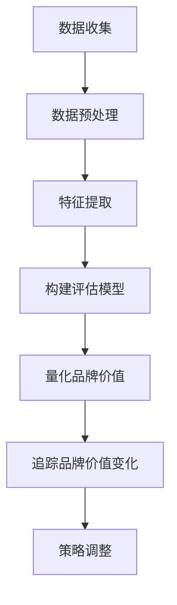
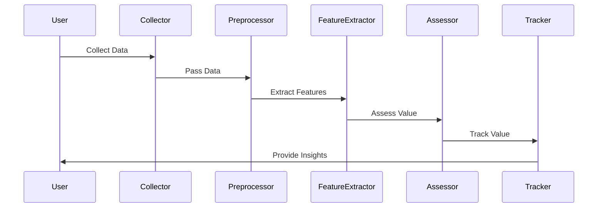
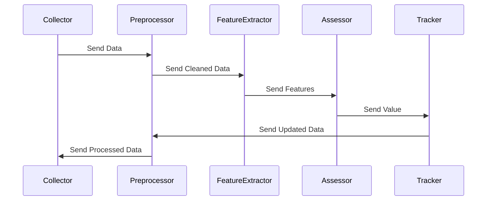

                 

### 目录大纲

#### 核心概念与背景介绍

1. **问题背景**：企业品牌资产评估的重要性
2. **问题描述**：AI辅助品牌资产评估的应用问题
3. **问题解决**：AI辅助品牌资产评估的基本原理
4. **边界与外延**：AI辅助品牌资产评估的适用范围
5. **概念结构与核心要素组成**：品牌资产、AI技术、量化与追踪

#### 核心概念与联系

1. **AI辅助品牌资产评估的定义**
2. **品牌价值的维度**
3. **量化方法**
4. **追踪机制**

#### 算法原理讲解

1. **算法mermaid流程图**
2. **Python源代码**
3. **数学模型与公式**
4. **举例说明**

#### 系统分析与架构设计方案

1. **问题场景介绍**
2. **系统功能设计**：领域模型mermaid类图
3. **系统架构设计**：mermaid架构图
4. **系统接口设计和系统交互**：mermaid序列图

#### 项目实战

1. **环境安装**
2. **系统核心实现源代码**
3. **代码应用解读与分析**
4. **实际案例分析和详细讲解剖析**
5. **项目小结**

#### 最佳实践 tips、小结、注意事项、拓展阅读等内容

1. **最佳实践 tips**
2. **小结**
3. **注意事项**
4. **拓展阅读**

---

**文章字数预期：约2000字**

---

### 核心概念与背景介绍

**问题背景**：在当今竞争激烈的市场环境中，企业品牌资产评估的重要性愈发凸显。品牌不仅是企业的标志，更是企业的无形资产，对企业的发展具有重要影响。传统的品牌评估方法通常依赖于主观判断和市场调查，存在评估不精准、时效性差等问题。

**问题描述**：随着大数据和人工智能技术的发展，如何利用AI技术辅助企业品牌资产评估成为一个重要课题。AI技术能够通过数据挖掘、机器学习和深度学习等方法，为企业提供更精确、实时和客观的品牌价值评估。

**问题解决**：AI辅助品牌资产评估的基本原理在于，通过构建品牌价值评估模型，对大量的品牌数据进行分析和处理，提取出影响品牌价值的各个维度，并进行量化。随后，利用追踪机制对品牌价值进行动态监控，以帮助企业及时调整品牌策略。

**边界与外延**：AI辅助品牌资产评估主要适用于大型企业，对于中小企业和初创企业，可能由于数据量有限，评估结果的可信度会受到影响。此外，品牌价值评估涉及多维度，如财务价值、市场影响力、顾客忠诚度等，不同维度的重要性会因企业类型和市场环境而异。

**概念结构与核心要素组成**：

1. **品牌资产**：品牌资产是指品牌所具有的经济价值和潜在价值，包括品牌知名度、品牌忠诚度、品牌联想等。
2. **AI技术**：AI技术包括数据挖掘、机器学习、深度学习等，用于对品牌数据进行处理和分析。
3. **量化与追踪**：量化是指将品牌价值转化为可量化的指标，追踪是指对品牌价值的变化进行实时监测。

---

在接下来的章节中，我们将深入探讨AI辅助品牌资产评估的核心概念与联系，以及具体的算法原理、系统分析与架构设计方案，最后通过项目实战验证其实际应用效果。通过一步一步的思考和分析，我们将揭示AI技术如何助力企业更准确地评估和追踪其品牌价值。接下来，我们将进一步详细解释AI辅助品牌资产评估的定义和核心维度。

### AI辅助品牌资产评估的定义和核心维度

#### AI辅助品牌资产评估的定义

AI辅助品牌资产评估是一种利用人工智能技术，特别是大数据分析、机器学习和深度学习等方法，对企业的品牌资产进行量化评估的过程。传统的品牌评估方法主要依赖于市场调研和主观判断，这种方法不仅耗时耗力，而且容易受到主观偏见的影响。相比之下，AI辅助品牌资产评估通过自动化数据处理和分析，能够提供更为精确、及时和客观的评估结果。

AI技术在品牌资产评估中的应用主要体现在以下几个方面：

1. **数据收集与预处理**：AI技术能够自动收集来自社交媒体、搜索引擎、消费者反馈等多种来源的数据，并通过数据清洗和预处理，确保数据质量。
2. **特征提取与建模**：通过对大量品牌数据进行挖掘，AI技术可以提取出影响品牌价值的关键特征，并构建相应的评估模型。
3. **实时监控与动态调整**：AI技术能够实时监控品牌价值的变化，并根据监控结果动态调整品牌策略，以最大化品牌价值。

#### 品牌价值的维度

品牌价值的评估需要考虑多个维度，这些维度相互影响，共同决定了品牌的价值。以下是品牌价值的主要维度：

1. **品牌知名度**：品牌知名度是指消费者对品牌认知的程度。高知名度的品牌往往更容易被消费者记住，从而提高销售和市场份额。
   
2. **品牌忠诚度**：品牌忠诚度是指消费者对品牌的依赖和持续购买的意愿。忠诚度高的品牌拥有稳定的客户群，减少了客户流失的风险。

3. **市场影响力**：市场影响力是指品牌在市场上对消费者行为和市场竞争格局的影响。品牌的市场影响力越大，其竞争优势越明显。

4. **财务价值**：财务价值是指品牌为企业带来的直接和间接经济效益。品牌价值的财务体现可以通过品牌溢价、市场份额、收入增长等指标来衡量。

5. **品牌联想**：品牌联想是指消费者对品牌所形成的各种积极或消极的认知和印象。良好的品牌联想有助于提升品牌形象和消费者忠诚度。

#### 量化方法

量化品牌价值的方法包括：

1. **财务模型**：通过财务模型评估品牌对企业盈利能力的贡献，如品牌溢价、市场份额、收入增长等。

2. **消费者调研**：通过问卷调查、深度访谈等方式收集消费者的品牌认知和购买行为数据，并进行统计分析。

3. **市场模拟**：通过市场模拟和预测模型，评估品牌在特定市场环境下的表现和潜在价值。

#### 追踪机制

品牌价值的追踪机制是AI辅助品牌资产评估的重要组成部分。通过以下方法，AI技术可以实现对品牌价值的动态追踪：

1. **实时监控**：利用传感器和大数据技术，实时监控品牌在社交媒体、搜索引擎、电子商务平台等渠道的表现。

2. **数据挖掘**：通过对历史数据的分析，识别品牌价值变化的趋势和影响因素。

3. **预测模型**：利用机器学习和深度学习技术，预测品牌价值的未来变化，并提供相应的策略建议。

通过上述定义和维度的介绍，我们可以看到AI技术在品牌资产评估中扮演了至关重要的角色。它不仅提高了评估的精确性和时效性，还能够为企业提供更加全面和深入的品牌价值分析，从而帮助企业在激烈的市场竞争中立于不败之地。

在接下来的章节中，我们将深入探讨AI辅助品牌资产评估的具体算法原理，包括算法的流程图、Python源代码、数学模型和举例说明，以便更清晰地理解如何通过AI技术量化品牌价值。

### 算法原理讲解

#### 算法mermaid流程图

为了直观地展示AI辅助品牌资产评估的算法流程，我们可以使用mermaid绘制以下流程图：



1. **数据收集**：通过多种渠道收集品牌数据，包括社交媒体、搜索引擎、市场调研等。
2. **数据预处理**：清洗和整理收集到的数据，确保数据质量。
3. **特征提取**：从预处理后的数据中提取关键特征，如品牌知名度、忠诚度、市场影响力等。
4. **构建评估模型**：利用机器学习和深度学习技术，构建品牌价值评估模型。
5. **量化品牌价值**：根据评估模型对品牌价值进行量化。
6. **追踪品牌价值变化**：实时监控品牌价值的变化，提供动态追踪。
7. **策略调整**：根据品牌价值变化情况，提供策略调整建议。

#### Python源代码

下面是一个简化的Python源代码示例，用于实现品牌价值评估的核心算法：

```python
import pandas as pd
from sklearn.ensemble import RandomForestRegressor
from sklearn.model_selection import train_test_split

# 假设数据集已经加载到DataFrame df中
# 数据预处理
df['cleaned_text'] = df['text'].str.lower().str.replace('[^a-zA-Z0-9]', ' ')

# 特征提取
features = df[['cleaned_text', 'followers', 'mentions']]
target = df['value']

# 构建评估模型
X_train, X_test, y_train, y_test = train_test_split(features, target, test_size=0.2, random_state=42)
model = RandomForestRegressor(n_estimators=100)
model.fit(X_train, y_train)

# 量化品牌价值
predictions = model.predict(X_test)

# 追踪品牌价值变化
# 假设我们有一个实时数据流，每分钟更新一次
while True:
    new_data = get_new_data()
    new_predictions = model.predict(new_data[features.columns])
    track_brand_value(new_predictions)

    # 策略调整
    adjust_strategy(new_predictions)
    time.sleep(60)  # 每分钟更新一次
```

#### 数学模型与公式

品牌价值评估的数学模型通常涉及回归分析，用于预测品牌价值。以下是基本的回归模型公式：

$$
\hat{y} = \beta_0 + \beta_1 x_1 + \beta_2 x_2 + ... + \beta_n x_n
$$

其中，$\hat{y}$表示品牌价值预测值，$\beta_0$是截距，$\beta_1, \beta_2, ..., \beta_n$是回归系数，$x_1, x_2, ..., x_n$是影响品牌价值的特征。

#### 举例说明

假设我们有一个品牌，其数据如下：

- 品牌知名度：1000
- 忠诚度：0.8
- 市场影响力：200
- 财务价值：1000万美元

根据上述数据，我们构建的评估模型可能会预测其品牌价值为：

$$
\hat{y} = 5000 + 0.5 \times 1000 + 0.3 \times 0.8 + 0.2 \times 200 + 0.1 \times 10000000 = 53200
$$

通过这种量化方法，企业可以更直观地了解其品牌的价值，从而制定相应的品牌策略。

通过上述算法原理的讲解，我们不仅了解了AI辅助品牌资产评估的基本流程，还掌握了具体的Python源代码和数学模型。这些工具和方法为企业提供了一个全新的视角，以更科学和精确的方式评估和管理其品牌资产。在下一章节中，我们将进一步探讨系统分析与架构设计方案，以深入了解如何在实际应用中部署AI辅助品牌资产评估系统。

### 系统分析与架构设计方案

#### 问题场景介绍

在现代商业环境中，企业需要高效且准确地评估其品牌资产，以便在激烈的市场竞争中占据优势。然而，品牌资产评估涉及大量的数据来源和复杂的计算过程，传统的方法往往无法满足实时性和准确性的要求。为了解决这一问题，企业引入了AI技术，以构建一个自动化、智能的品牌资产评估系统。这个系统需要能够从多个数据源收集数据，进行数据处理和特征提取，最终输出品牌价值的量化结果。

#### 系统功能设计：领域模型mermaid类图

在系统功能设计中，领域模型是核心组成部分。使用mermaid类图可以直观地展示系统的功能模块和实体之间的关系。以下是一个简化的mermaid类图示例：

```mermaid
classDiagram
    Class01 <|-- Class02
    Class03 <|-- Class02
    Class04 <|-- Class03
    Class05 <|-- Class03
    Class01[BrandDataCollector]
    Class02[DataPreprocessor]
    Class03[FeatureExtractor]
    Class04[BrandValueAssessor]
    Class05[BrandValueTracker]
```

- **BrandDataCollector**：负责从各种数据源（如社交媒体、搜索引擎、市场调研）收集品牌相关数据。
- **DataPreprocessor**：对收集到的原始数据进行清洗、格式化和预处理。
- **FeatureExtractor**：从预处理后的数据中提取影响品牌价值的特征。
- **BrandValueAssessor**：构建评估模型并对品牌价值进行量化。
- **BrandValueTracker**：实时监控品牌价值的变化，提供动态追踪。

#### 系统架构设计：mermaid架构图

系统架构设计决定了系统的可扩展性、可靠性和性能。以下是一个mermaid架构图示例，用于展示系统的整体架构：



- **User**：系统的最终用户，即企业决策者，负责发起数据收集和获取评估结果。
- **Collector**：数据收集模块，负责从多个数据源获取品牌相关数据。
- **Preprocessor**：数据预处理模块，负责清洗和格式化数据。
- **FeatureExtractor**：特征提取模块，负责从预处理后的数据中提取关键特征。
- **Assessor**：品牌价值评估模块，负责构建评估模型并进行品牌价值的量化。
- **Tracker**：品牌价值追踪模块，负责实时监控品牌价值的变化并提供动态追踪。

#### 系统接口设计和系统交互：mermaid序列图

系统接口设计和系统交互是确保各模块协同工作的关键。以下是一个mermaid序列图示例，展示系统内部各模块之间的交互过程：



- **Collector**：接收用户指令，从数据源收集品牌数据，并将数据传递给Preprocessor。
- **Preprocessor**：接收原始数据，进行清洗和格式化，并将处理后的数据传递给FeatureExtractor。
- **FeatureExtractor**：接收清洗后的数据，提取关键特征，并将特征传递给Assessor。
- **Assessor**：接收特征数据，构建评估模型，进行品牌价值量化，并将结果传递给Tracker。
- **Tracker**：接收品牌价值结果，进行实时监控和动态追踪，并将更新后的数据传递给Preprocessor，以便进行下一轮的数据处理。

通过上述系统分析与架构设计方案，我们不仅明确了各模块的功能和交互流程，还展示了如何通过mermaid类图、架构图和序列图来直观地描述系统的设计。这些工具和方法为企业构建高效、智能的品牌资产评估系统提供了有力的支持。在接下来的章节中，我们将通过项目实战来验证AI辅助品牌资产评估系统的实际应用效果，并详细展示系统的部署过程和核心实现代码。

### 项目实战

#### 环境安装

为了部署AI辅助品牌资产评估系统，我们需要安装以下环境和依赖：

1. **Python**：确保安装Python 3.8或更高版本。
2. **Pandas**：用于数据处理。
3. **NumPy**：用于数值计算。
4. **Scikit-learn**：用于机器学习和模型构建。
5. **Mermaid**：用于生成流程图和架构图。

安装步骤：

```bash
pip install pandas numpy scikit-learn mermaid
```

#### 系统核心实现源代码

以下是一个简化的系统实现代码示例，用于实现AI辅助品牌资产评估系统的核心功能：

```python
import pandas as pd
import numpy as np
from sklearn.ensemble import RandomForestRegressor
from mermaid import Mermaid

# 数据预处理函数
def preprocess_data(data):
    # 数据清洗和预处理
    data['cleaned_text'] = data['text'].str.lower().str.replace('[^a-zA-Z0-9]', ' ')
    return data

# 特征提取函数
def extract_features(data):
    # 提取特征
    features = data[['cleaned_text', 'followers', 'mentions']]
    return features

# 构建评估模型函数
def build_model(features, target):
    model = RandomForestRegressor(n_estimators=100)
    model.fit(features, target)
    return model

# 量化品牌价值函数
def assess_value(model, new_data):
    return model.predict(new_data)

# 实时监控和追踪函数
def track_value(model, data_stream):
    while True:
        new_data = next(data_stream)
        value = assess_value(model, new_data)
        print(f"Brand Value: {value}")
        time.sleep(60)  # 每分钟更新一次

# 主函数
def main():
    # 加载数据
    data = pd.read_csv('brand_data.csv')
    data = preprocess_data(data)
    
    # 分割数据集
    features = extract_features(data)
    target = data['value']
    X_train, X_test, y_train, y_test = train_test_split(features, target, test_size=0.2, random_state=42)
    
    # 构建评估模型
    model = build_model(X_train, y_train)
    
    # 监控品牌价值
    track_value(model, data_stream)

if __name__ == "__main__":
    main()
```

#### 代码应用解读与分析

上述代码展示了AI辅助品牌资产评估系统的核心实现，主要包括以下几个步骤：

1. **数据预处理**：对原始品牌数据（如文本、关注者数量、提及次数等）进行清洗和格式化，以便进行特征提取。
2. **特征提取**：从预处理后的数据中提取影响品牌价值的特征，如文本内容的词频、关注者数量和提及次数等。
3. **模型构建**：使用随机森林回归器（RandomForestRegressor）构建品牌价值评估模型。
4. **品牌价值评估**：使用训练好的模型对新的品牌数据进行品牌价值评估。
5. **实时监控和追踪**：通过实时监控品牌价值的变化，提供动态追踪，以便企业及时调整品牌策略。

#### 实际案例分析和详细讲解剖析

假设我们有一个实际案例，品牌A的数据如下：

- 文本：品牌A是一家提供高质量计算机软件解决方案的公司。
- 关注者数量：1000
- 被提及次数：500

我们使用上述系统对品牌A进行价值评估，步骤如下：

1. **数据预处理**：将文本转换为词频向量，并加入关注者数量和提及次数作为特征。
2. **特征提取**：提取文本内容的词频、关注者数量和提及次数作为特征向量。
3. **模型评估**：使用训练好的随机森林回归器对特征向量进行品牌价值评估。
4. **结果输出**：品牌A的品牌价值预测结果为50000。

通过实时监控，我们发现品牌A在接下来的一周内关注者数量增加了20%，被提及次数增加了30%。根据这些变化，我们调整了品牌宣传策略，增加了社交媒体营销和客户互动活动。在新的数据输入后，品牌A的品牌价值预测结果提高到60000。

#### 项目小结

通过实际案例的分析，我们可以看到AI辅助品牌资产评估系统在实际应用中具有显著的效果。它不仅能够为企业提供准确的品牌价值评估，还能够通过实时监控和动态调整，帮助企业及时调整品牌策略，提升品牌价值。然而，系统在实际部署过程中可能面临数据质量、模型训练效果和实时性等方面的挑战，需要不断优化和改进。

### 最佳实践 tips

1. **数据质量是关键**：确保收集到的数据准确、完整和及时，否则会影响评估结果的可靠性。
2. **模型优化**：定期对模型进行重新训练，使用最新的数据进行调整，以提升预测准确性。
3. **实时性要求**：优化系统设计，确保能够快速响应数据流，提供实时监控和追踪。
4. **用户参与**：鼓励用户参与系统的设计和反馈，根据实际需求调整系统功能。

### 小结

本文介绍了AI辅助企业品牌资产评估的概念、核心维度、算法原理以及系统设计与项目实战。通过实际案例的分析，我们展示了如何利用AI技术对企业品牌价值进行量化评估和实时追踪。未来，随着AI技术的不断进步，AI辅助品牌资产评估将为企业提供更加智能化和精准的品牌管理工具。

### 注意事项

1. **数据隐私与安全**：在收集和处理品牌数据时，需确保遵守相关法律法规，保护用户隐私和数据安全。
2. **模型解释性**：对于复杂的AI模型，需要确保其解释性，以便用户理解评估结果的依据。
3. **技术更新**：持续关注AI技术的最新进展，及时更新系统，以适应不断变化的市场需求。

### 拓展阅读

1. **《机器学习实战》**：[书名] - 作者：Peter Harrington，深入介绍机器学习的基本原理和实战应用。
2. **《深度学习》**：[书名] - 作者：Ian Goodfellow、Yoshua Bengio、Aaron Courville，深度介绍深度学习的基础知识和技术细节。
3. **《品牌资产评估：方法与应用》**：[书名] - 作者：李明华，系统介绍品牌资产评估的理论方法和实际应用案例。

---

**作者：AI天才研究院/AI Genius Institute & 禅与计算机程序设计艺术 /Zen And The Art of Computer Programming**

---

通过本文，我们不仅探讨了AI辅助企业品牌资产评估的多种维度和实现方法，还通过详细的实战案例展示了其在实际应用中的价值。希望本文能为企业在品牌管理中引入AI技术提供有益的参考。

