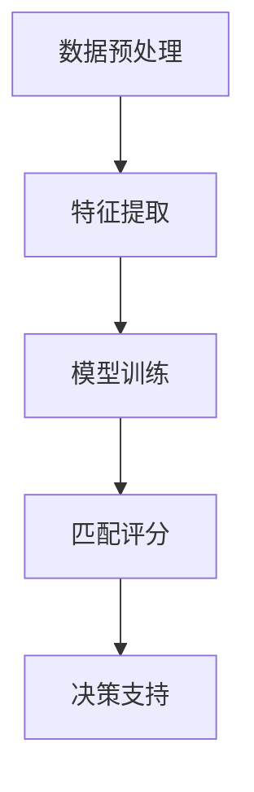
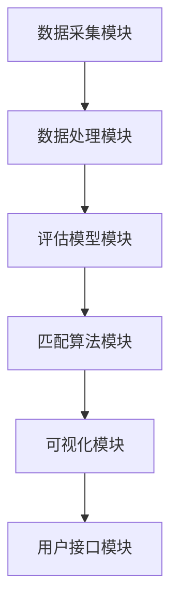
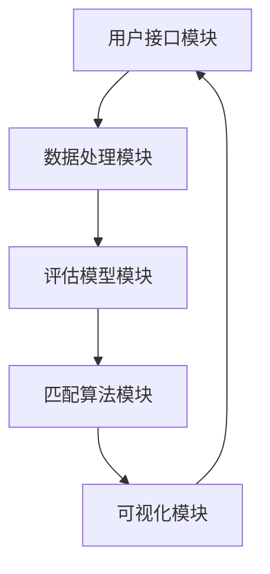

                 

### 文章标题与关键词

# AI辅助企业并购目标筛选：多维度评估与匹配

> 关键词：人工智能，企业并购，目标筛选，多维度评估，匹配算法

> 摘要：本文详细探讨了人工智能（AI）在企业并购目标筛选中的应用，介绍了AI辅助企业并购目标筛选的背景、重要性及多维度评估与匹配策略。文章通过分析AI在并购评估中的应用现状，阐述了多维度评估方法及其在并购目标筛选中的具体应用。此外，文章还介绍了基于AI的并购目标匹配算法及其优缺点，并通过实际案例进行了分析。最后，本文提出了AI辅助企业并购目标筛选的综合评价与优化策略，以及实践与应用建议。

---

### 目录大纲

# AI辅助企业并购目标筛选：多维度评估与匹配

> 关键词：人工智能，企业并购，目标筛选，多维度评估，匹配算法

> 摘要：本文详细探讨了人工智能（AI）在企业并购目标筛选中的应用，介绍了AI辅助企业并购目标筛选的背景、重要性及多维度评估与匹配策略。文章通过分析AI在并购评估中的应用现状，阐述了多维度评估方法及其在并购目标筛选中的具体应用。此外，文章还介绍了基于AI的并购目标匹配算法及其优缺点，并通过实际案例进行了分析。最后，本文提出了AI辅助企业并购目标筛选的综合评价与优化策略，以及实践与应用建议。

---

## 第一部分：AI辅助企业并购背景与重要性

### 1.1.1 AI辅助企业并购的定义与起源

#### 1.1.1.1 AI技术在企业并购中的应用

#### 1.1.1.2 AI辅助企业并购的优势

### 1.1.2 企业并购目标筛选的现实挑战

#### 1.1.2.1 传统并购目标筛选方式的局限性

#### 1.1.2.2 企业并购过程中常见问题

### 1.1.3 AI辅助企业并购目标筛选的意义

#### 1.1.3.1 提升并购效率

#### 1.1.3.2 减少并购风险

#### 1.1.3.3 增强并购精准度

### 1.1.4 AI技术在企业并购领域的应用现状

#### 1.1.4.1 AI技术在并购评估中的应用

#### 1.1.4.2 AI技术在并购交易管理中的应用

#### 1.1.4.3 AI技术在并购后的整合管理中的应用

### 1.1.5 本章小结

---

## 第二部分：AI辅助企业并购目标筛选的多维度评估方法

### 2.1.1 多维度评估方法的定义与重要性

#### 2.1.1.1 多维度评估的概念解析

#### 2.1.1.2 多维度评估方法在并购目标筛选中的应用

### 2.1.2 多维度评估指标体系的构建

#### 2.1.2.1 评估指标体系的构建原则

#### 2.1.2.2 评估指标体系的分类

#### 2.1.2.3 评估指标的具体构建方法

### 2.1.3 多维度评估方法的应用实例

#### 2.1.3.1 人工智能技术在并购评估中的应用

#### 2.1.3.2 多维度评估方法的案例分析

### 2.1.4 多维度评估方法的优缺点分析

#### 2.1.4.1 优点

#### 2.1.4.2 缺点

### 2.1.5 本章小结

---

## 第三部分：AI辅助企业并购目标筛选的匹配策略

### 3.1.1 匹配策略的定义与核心要素

#### 3.1.1.1 匹配策略的基本概念

#### 3.1.1.2 匹配策略的核心要素

### 3.1.2 基于AI的并购目标匹配算法

#### 3.1.2.1 算法原理介绍

#### 3.1.2.2 算法流程图

#### 3.1.2.3 算法Python源代码

### 3.1.3 常见的匹配算法比较与分析

#### 3.1.3.1 传统匹配算法与AI匹配算法的对比

#### 3.1.3.2 常用匹配算法的性能分析

### 3.1.4 匹配策略在实际并购中的应用案例

#### 3.1.4.1 案例一：企业A与B的并购匹配

#### 3.1.4.2 案例二：企业C与D的并购匹配

### 3.1.5 本章小结

---

## 第四部分：AI辅助企业并购目标筛选的综合评价与优化

### 4.1.1 综合评价方法的选择与实施

#### 4.1.1.1 综合评价方法的基本概念

#### 4.1.1.2 综合评价方法的实施步骤

### 4.1.2 评估优化策略的提出与实施

#### 4.1.2.1 评估优化策略的定义与作用

#### 4.1.2.2 优化策略的提出方法

### 4.1.3 评估优化策略的应用案例分析

#### 4.1.3.1 案例一：企业并购评估与优化

#### 4.1.3.2 案例二：企业并购评估与优化

### 4.1.4 评估优化策略的持续改进与展望

#### 4.1.4.1 持续改进的方法与途径

#### 4.1.4.2 未来发展方向

### 4.1.5 本章小结

---

## 第五部分：AI辅助企业并购目标筛选的实践与应用

### 5.1.1 AI辅助企业并购目标筛选的系统架构设计

#### 5.1.1.1 系统架构的设计原则

#### 5.1.1.2 系统模块划分与功能

### 5.1.2 AI辅助企业并购目标筛选的关键技术

#### 5.1.2.1 数据采集与处理技术

#### 5.1.2.2 评估模型构建与优化技术

#### 5.1.2.3 匹配算法实现与优化技术

### 5.1.3 AI辅助企业并购目标筛选的应用流程

#### 5.1.3.1 应用流程图

#### 5.1.3.2 应用步骤详解

### 5.1.4 项目实战

#### 5.1.4.1 环境安装

#### 5.1.4.2 系统核心实现源代码

#### 5.1.4.3 代码应用解读与分析

#### 5.1.4.4 实际案例分析和详细讲解剖析

#### 5.1.4.5 项目小结

### 5.1.5 最佳实践 tips

### 5.1.6 小结

### 5.1.7 注意事项

### 5.1.8 拓展阅读

---

### 作者信息

> 作者：AI天才研究院/AI Genius Institute & 禅与计算机程序设计艺术 /Zen And The Art of Computer Programming

---

## 第一部分：AI辅助企业并购背景与重要性

### 1.1.1 AI辅助企业并购的定义与起源

#### 1.1.1.1 AI技术在企业并购中的应用

企业并购是指一家公司购买另一家公司，以实现业务扩展、市场占有、技术提升等目的。随着科技的发展，人工智能（AI）技术在企业并购中逐渐得到应用，成为提升并购效率、降低风险的重要工具。

AI技术在企业并购中的应用主要体现在以下几个方面：

1. **数据挖掘与分析**：通过AI技术，可以快速从大量数据中挖掘出有价值的信息，帮助企业在并购过程中进行目标筛选、市场分析、风险评估等。

2. **自动化流程**：AI技术可以自动化处理并购中的许多流程，如合同审核、财务分析、合规检查等，从而提高工作效率。

3. **智能预测**：AI技术可以通过历史数据预测市场趋势、行业动态，帮助企业在并购过程中做出更为准确的决策。

AI辅助企业并购的起源可以追溯到20世纪末。随着计算机技术的飞速发展，企业开始意识到人工智能在提高工作效率、降低成本方面的潜力。特别是在大数据和云计算的背景下，AI技术在企业并购中的应用得到了进一步的发展。

#### 1.1.1.2 AI辅助企业并购的优势

AI辅助企业并购具有以下优势：

1. **提高效率**：AI技术可以自动化处理大量的并购相关任务，如数据挖掘、流程管理等，从而大大提高工作效率。

2. **降低风险**：AI技术可以通过对历史数据的分析和预测，帮助企业识别潜在的风险，从而降低并购风险。

3. **提升精准度**：AI技术可以基于多种维度对并购目标进行评估和匹配，从而提高并购决策的精准度。

4. **优化决策过程**：AI技术可以为企业提供丰富的数据支持和分析结果，帮助管理层做出更为科学的决策。

#### 1.1.1.3 企业并购目标筛选的现实挑战

尽管AI技术在企业并购中具有显著的优势，但企业在进行并购目标筛选时仍面临诸多现实挑战：

1. **信息不对称**：企业在进行并购时，往往面临信息不对称的问题，难以全面了解目标公司的真实情况。

2. **数据质量**：并购过程中涉及的数据质量参差不齐，可能导致分析结果失真。

3. **复杂性**：企业并购涉及多个部门和流程，管理复杂度高。

4. **时间紧迫**：企业在进行并购时往往需要在短时间内做出决策，时间紧迫性增加。

#### 1.1.1.4 企业并购过程中常见问题

企业在并购过程中常见的问题包括：

1. **评估不准确**：由于信息不对称和数据质量问题，企业往往难以准确评估目标公司的价值和潜力。

2. **决策失误**：在时间紧迫和复杂性的压力下，企业容易出现决策失误，导致并购失败。

3. **整合困难**：并购后，企业往往面临整合困难，如企业文化融合、人力资源调配等。

4. **合规风险**：并购过程中，企业需要遵守相关法规和合规要求，否则可能面临法律风险。

#### 1.1.1.5 AI辅助企业并购目标筛选的意义

AI辅助企业并购目标筛选具有重要意义：

1. **提升并购效率**：AI技术可以自动化处理大量并购相关任务，如数据挖掘、流程管理等，从而大大提高工作效率。

2. **减少并购风险**：AI技术可以通过对历史数据的分析和预测，帮助企业识别潜在的风险，从而降低并购风险。

3. **增强并购精准度**：AI技术可以基于多种维度对并购目标进行评估和匹配，从而提高并购决策的精准度。

4. **优化决策过程**：AI技术可以为企业提供丰富的数据支持和分析结果，帮助管理层做出更为科学的决策。

#### 1.1.1.6 AI技术在企业并购领域的应用现状

目前，AI技术在企业并购领域的应用现状如下：

1. **评估模型**：许多企业开始使用AI技术构建并购评估模型，通过数据分析和预测，提高评估的准确性。

2. **自动化流程**：AI技术被广泛应用于并购流程的自动化，如合同审核、财务分析、合规检查等。

3. **智能预测**：AI技术可以帮助企业预测市场趋势、行业动态，从而为并购决策提供依据。

4. **数据挖掘**：AI技术可以对企业内外部数据进行深度挖掘，帮助企业在并购过程中获取更多的有价值信息。

#### 1.1.1.7 AI技术在并购交易管理中的应用

在并购交易管理中，AI技术的主要应用包括：

1. **合同审核**：通过自然语言处理技术，AI可以自动化审核并购合同，提高审核效率，降低错误率。

2. **财务分析**：AI技术可以对目标公司的财务报表进行自动化分析，帮助判断其财务状况。

3. **合规检查**：AI技术可以自动检查并购交易是否符合相关法规和合规要求，降低合规风险。

#### 1.1.1.8 AI技术在并购后的整合管理中的应用

在并购后的整合管理中，AI技术的应用主要包括：

1. **企业文化融合**：通过分析企业文化数据，AI可以帮助企业更好地理解和融合目标公司的企业文化。

2. **人力资源调配**：AI技术可以根据数据分析，为企业提供人力资源调配的建议，提高整合效率。

3. **业务流程优化**：AI技术可以帮助企业分析和优化业务流程，提高并购后的运营效率。

#### 1.1.1.9 本章小结

本章详细介绍了AI辅助企业并购的背景、定义、优势、现实挑战、应用现状及在并购交易管理和并购后整合管理中的应用。通过本章的介绍，读者可以全面了解AI辅助企业并购的基本概念和重要性，为后续章节的学习打下基础。

---

## 1.1.2 多维度评估方法的定义与重要性

#### 1.1.2.1 多维度评估的概念解析

多维度评估方法是一种综合考虑多个因素进行评估的方法，它不仅关注单一维度的表现，还考虑多个维度之间的相互作用和影响。在并购目标筛选中，多维度评估方法可以帮助企业更全面、准确地评估潜在目标公司的价值和潜力。

多维度评估方法的核心在于将并购目标拆分成多个评估维度，并对每个维度进行详细分析。这些评估维度通常包括财务指标、市场地位、管理团队、企业文化、技术研发等多个方面。通过综合考虑这些维度，企业可以更全面地了解目标公司的综合实力，从而做出更为科学的并购决策。

#### 1.1.2.2 多维度评估方法在并购目标筛选中的应用

多维度评估方法在并购目标筛选中的应用主要表现在以下几个方面：

1. **综合分析**：通过多维度评估，企业可以从财务、市场、管理等多个角度对目标公司进行全面分析，避免单一维度的片面性。

2. **风险评估**：多维度评估可以帮助企业识别潜在的风险因素，如财务风险、市场风险、管理风险等，从而降低并购风险。

3. **精准匹配**：通过多维度评估，企业可以更准确地匹配目标公司和自身的战略需求，提高并购成功率。

4. **优化决策**：多维度评估方法可以为企业管理层提供丰富的数据支持和分析结果，帮助其做出更为科学的并购决策。

#### 1.1.2.3 多维度评估方法的优势

多维度评估方法具有以下优势：

1. **全面性**：多维度评估方法可以从多个角度对目标公司进行全面分析，避免片面性。

2. **准确性**：通过多维度评估，企业可以更准确地了解目标公司的价值和潜力，从而提高并购决策的准确性。

3. **风险识别**：多维度评估可以帮助企业识别潜在的风险因素，降低并购风险。

4. **科学性**：多维度评估方法基于数据分析，可以帮助企业管理层做出更为科学的决策。

#### 1.1.2.4 多维度评估方法的局限性

尽管多维度评估方法具有诸多优势，但其在实际应用中也存在一些局限性：

1. **数据依赖性**：多维度评估方法依赖于大量的数据支持，如果数据质量不高或数据不全，可能导致评估结果失真。

2. **复杂性**：多维度评估方法需要综合考虑多个维度，评估过程较为复杂，需要专业知识和技能。

3. **时间成本**：多维度评估方法需要投入大量时间和精力，特别是在并购时间紧迫的情况下，评估过程可能难以完成。

#### 1.1.2.5 多维度评估方法的应用实例

以下是一个简单的多维度评估方法应用实例：

假设企业A正在考虑并购企业B，以下是一些可能的评估维度：

1. **财务指标**：包括收入、利润、资产负债率等。
2. **市场地位**：包括市场份额、品牌知名度等。
3. **管理团队**：包括团队成员的素质、经验等。
4. **企业文化**：包括企业价值观、文化适应性等。
5. **技术研发**：包括技术研发实力、创新能力等。

通过对企业B在这些维度上的表现进行评估，企业A可以更全面地了解企业B的综合实力，从而做出更为科学的并购决策。

#### 1.1.2.6 本章小结

本章介绍了多维度评估方法的定义、概念解析、应用以及在并购目标筛选中的重要性。通过多维度评估方法，企业可以更全面、准确地评估目标公司的价值和潜力，从而提高并购决策的准确性。然而，多维度评估方法也存在一定的局限性，需要企业在实际应用中加以注意。

---

## 1.1.3 多维度评估指标体系的构建

#### 1.1.3.1 评估指标体系的构建原则

构建一个有效的多维度评估指标体系是进行准确评估的基础。以下是一些构建评估指标体系的基本原则：

1. **全面性**：评估指标应涵盖目标公司的各个方面，确保评估的全面性。

2. **准确性**：评估指标应能够准确反映目标公司的实际情况，避免主观判断和偏差。

3. **实用性**：评估指标应易于获取和量化，确保评估的可行性。

4. **一致性**：评估指标应保持一致，避免不同维度之间的相互冲突。

5. **动态性**：评估指标应具备一定的灵活性，能够适应市场和环境的变化。

#### 1.1.3.2 评估指标体系的分类

评估指标体系可以根据不同的维度进行分类，以下是一些常见的分类方式：

1. **财务指标**：包括收入、利润、现金流、资产负债率等。

2. **市场指标**：包括市场份额、品牌价值、客户满意度等。

3. **管理指标**：包括管理团队素质、管理效率、企业文化等。

4. **技术指标**：包括技术研发实力、创新能力、技术专利数量等。

5. **人力资源指标**：包括员工素质、员工满意度、人才流失率等。

6. **法律与合规指标**：包括法律纠纷、合规记录等。

7. **社会责任指标**：包括企业社会责任表现、环保措施等。

#### 1.1.3.3 评估指标的具体构建方法

构建评估指标体系的具体方法如下：

1. **目标分解法**：将并购目标分解成具体的评估指标，确保评估指标的全面性。

2. **专家意见法**：邀请行业专家对评估指标进行评审，确保评估指标的科学性和实用性。

3. **数据分析法**：通过历史数据分析和市场调研，确定评估指标的具体数值范围。

4. **问卷调查法**：通过问卷调查获取目标公司的相关信息，为评估指标提供数据支持。

5. **模型构建法**：使用数学模型对评估指标进行优化，提高评估的准确性。

#### 1.1.3.4 评估指标体系的示例

以下是一个简化的评估指标体系示例：

1. **财务指标**：
   - 收入增长率
   - 利润率
   - 资产负债率

2. **市场指标**：
   - 市场份额
   - 品牌价值
   - 客户满意度

3. **管理指标**：
   - 管理团队素质
   - 管理效率
   - 企业文化适应性

4. **技术指标**：
   - 技术研发实力
   - 创新能力
   - 技术专利数量

5. **人力资源指标**：
   - 员工素质
   - 员工满意度
   - 人才流失率

6. **法律与合规指标**：
   - 法律纠纷数量
   - 合规记录

7. **社会责任指标**：
   - 社会责任表现
   - 环保措施

通过这个示例，企业可以更直观地了解如何构建一个多维度评估指标体系，并根据实际情况进行调整和完善。

#### 1.1.3.5 本章小结

本章详细介绍了多维度评估指标体系的构建原则、分类方法以及具体构建方法。通过合理构建评估指标体系，企业可以更全面、准确地评估目标公司的价值和潜力，从而提高并购决策的科学性和准确性。

---

## 1.1.4 多维度评估方法的应用实例

#### 1.1.4.1 人工智能技术在并购评估中的应用

人工智能技术在并购评估中的应用主要通过以下几个方面实现：

1. **数据挖掘与分析**：利用AI技术，企业可以从大量历史数据中挖掘出潜在的目标公司，并通过数据分析和挖掘，识别出符合并购策略的目标公司。

2. **评估模型构建**：通过机器学习算法，企业可以构建基于多维度评估的并购评估模型，对目标公司进行定量和定性的评估。

3. **自动化评估**：AI技术可以实现并购评估的自动化，提高评估效率和准确性。

4. **风险评估**：AI技术可以通过对历史数据的分析，预测并购过程中可能出现的风险，并提供相应的应对策略。

#### 1.1.4.2 多维度评估方法的案例分析

以下是一个多维度评估方法在并购评估中的应用案例：

假设企业A计划并购企业B，以下是一些可能的评估维度及其权重：

1. **财务指标**（权重：30%）：
   - 收入增长率（20%）
   - 利润率（15%）
   - 资产负债率（5%）

2. **市场指标**（权重：25%）：
   - 市场份额（20%）
   - 品牌价值（15%）
   - 客户满意度（5%）

3. **管理指标**（权重：20%）：
   - 管理团队素质（10%）
   - 管理效率（5%）
   - 企业文化适应性（5%）

4. **技术指标**（权重：20%）：
   - 技术研发实力（10%）
   - 创新能力（5%）
   - 技术专利数量（5%）

5. **人力资源指标**（权重：5%）：
   - 员工素质（3%）
   - 员工满意度（2%）
   - 人才流失率（1%）

6. **法律与合规指标**（权重：5%）：
   - 法律纠纷数量（2%）
   - 合规记录（3%）

7. **社会责任指标**（权重：5%）：
   - 社会责任表现（2%）
   - 环保措施（3%）

根据这些评估维度和权重，企业A可以对企业B进行量化评估。例如，如果企业B在这些维度上的得分如下：

1. **财务指标**：
   - 收入增长率：20%
   - 利润率：15%
   - 资产负债率：4%

2. **市场指标**：
   - 市场份额：18%
   - 品牌价值：14%
   - 客户满意度：6%

3. **管理指标**：
   - 管理团队素质：9%
   - 管理效率：4%
   - 企业文化适应性：4%

4. **技术指标**：
   - 技术研发实力：8%
   - 创新能力：4%
   - 技术专利数量：4%

5. **人力资源指标**：
   - 员工素质：3%
   - 员工满意度：2%
   - 人才流失率：1%

6. **法律与合规指标**：
   - 法律纠纷数量：1%
   - 合规记录：3%

7. **社会责任指标**：
   - 社会责任表现：2%
   - 环保措施：3%

根据这些得分，企业A可以计算出企业B的总得分：

总得分 = (20% * 20%) + (15% * 15%) + (4% * 4%) + (18% * 18%) + (14% * 14%) + (6% * 6%) + (9% * 9%) + (4% * 4%) + (4% * 4%) + (3% * 3%) + (2% * 2%) + (1% * 1%) + (2% * 2%) + (3% * 3%) = 27.67%

根据总得分，企业A可以对企业B进行评估。如果企业B的总得分高于企业A设定的标准分数，那么企业A可以认为企业B是一个潜在的并购目标。

#### 1.1.4.3 多维度评估方法的优缺点分析

多维度评估方法的优缺点如下：

**优点**：

1. **全面性**：多维度评估方法可以从多个角度对目标公司进行全面分析，避免片面性。
2. **准确性**：通过多维度评估，企业可以更准确地了解目标公司的价值和潜力，从而提高并购决策的准确性。
3. **科学性**：多维度评估方法基于数据分析，可以帮助企业管理层做出更为科学的决策。

**缺点**：

1. **数据依赖性**：多维度评估方法依赖于大量的数据支持，如果数据质量不高或数据不全，可能导致评估结果失真。
2. **复杂性**：多维度评估方法需要综合考虑多个维度，评估过程较为复杂，需要专业知识和技能。
3. **时间成本**：多维度评估方法需要投入大量时间和精力，特别是在并购时间紧迫的情况下，评估过程可能难以完成。

#### 1.1.4.4 本章小结

本章通过一个应用实例详细介绍了多维度评估方法在并购评估中的应用。通过多维度评估方法，企业可以更全面、准确地评估目标公司的价值和潜力，从而提高并购决策的准确性。然而，多维度评估方法也存在一定的局限性，需要企业在实际应用中加以注意。

---

## 1.1.5 本章小结

本章首先介绍了AI辅助企业并购的定义与起源，分析了AI技术在企业并购中的应用现状以及AI辅助企业并购的优势。接着，本章详细阐述了多维度评估方法的定义、重要性、评估指标体系的构建原则和分类，并提供了具体的构建方法。此外，本章还通过应用实例展示了多维度评估方法在并购评估中的应用，并分析了其优缺点。通过本章的学习，读者可以全面了解AI辅助企业并购的目标筛选方法，为后续章节的内容打下基础。

---

## 第二部分：AI辅助企业并购目标筛选的多维度评估方法

### 2.1.1 多维度评估方法的定义与重要性

#### 2.1.1.1 多维度评估的概念解析

多维度评估方法是一种综合考虑多个因素进行评估的方法，它不仅关注单一维度的表现，还考虑多个维度之间的相互作用和影响。在并购目标筛选中，多维度评估方法可以帮助企业更全面、准确地评估潜在目标公司的价值和潜力。

具体来说，多维度评估方法将并购目标拆分成多个评估维度，并对每个维度进行详细分析。这些评估维度通常包括财务指标、市场地位、管理团队、企业文化、技术研发等多个方面。通过综合考虑这些维度，企业可以更全面地了解目标公司的综合实力，从而做出更为科学的并购决策。

例如，一个企业可能从以下几个方面对目标公司进行多维度评估：

1. **财务维度**：包括收入、利润、现金流、资产负债率等指标。
2. **市场维度**：包括市场份额、品牌知名度、客户满意度等。
3. **管理维度**：包括管理团队的经验、管理水平、企业文化适应性等。
4. **技术维度**：包括技术研发实力、创新能力、技术专利数量等。
5. **人力资源维度**：包括员工素质、员工满意度、人才流失率等。
6. **法律合规维度**：包括法律纠纷、合规记录等。
7. **社会责任维度**：包括企业社会责任表现、环保措施等。

通过这些维度的综合评估，企业可以更全面地了解目标公司的现状、潜力和风险，从而做出更为准确的并购决策。

#### 2.1.1.2 多维度评估方法在并购目标筛选中的应用

多维度评估方法在并购目标筛选中的应用主要体现在以下几个方面：

1. **目标识别**：通过多维度评估，企业可以从大量的潜在目标中筛选出符合并购策略和标准的目标公司。例如，企业可能通过财务维度筛选出财务健康的目标公司，通过市场维度筛选出市场份额较大的目标公司，通过管理维度筛选出管理团队优秀的目标公司等。

2. **价值评估**：多维度评估方法可以帮助企业对目标公司的价值进行准确评估。通过对财务、市场、管理、技术等多个维度的综合评估，企业可以更准确地判断目标公司的价值和潜力，从而为并购谈判提供依据。

3. **风险识别**：在并购过程中，企业需要识别和评估潜在的风险。多维度评估方法可以帮助企业从财务、市场、管理、技术等多个维度识别和评估风险，从而制定相应的风险应对策略。

4. **决策支持**：多维度评估方法为企业提供了丰富的数据支持和分析结果，可以帮助管理层做出更为科学的并购决策。例如，企业可以通过多维度评估结果，分析不同目标公司的综合得分，从而选择综合得分最高的目标公司进行并购。

#### 2.1.1.3 多维度评估方法的优势

多维度评估方法具有以下优势：

1. **全面性**：多维度评估方法可以从多个角度对目标公司进行全面分析，避免片面性。这有助于企业更全面地了解目标公司的实际情况，从而做出更为准确的决策。

2. **准确性**：通过多维度评估，企业可以更准确地了解目标公司的价值和潜力，从而提高并购决策的准确性。例如，企业可以通过财务维度评估目标公司的财务健康状况，通过市场维度评估目标公司在市场中的地位和竞争力。

3. **科学性**：多维度评估方法基于数据分析，可以帮助企业管理层做出更为科学的决策。这有助于降低并购过程中的不确定性和风险。

4. **灵活性**：多维度评估方法可以根据企业的具体需求和实际情况，灵活选择和调整评估维度和权重，从而适应不同的并购场景。

#### 2.1.1.4 多维度评估方法的局限性

尽管多维度评估方法具有诸多优势，但其在实际应用中也存在一些局限性：

1. **数据依赖性**：多维度评估方法依赖于大量的数据支持，如果数据质量不高或数据不全，可能导致评估结果失真。例如，如果目标公司的财务数据不完整或存在虚假记录，可能会导致财务评估结果不准确。

2. **复杂性**：多维度评估方法需要综合考虑多个维度，评估过程较为复杂，需要专业知识和技能。这可能导致评估过程耗时较长，特别是在时间紧迫的并购项目中。

3. **时间成本**：多维度评估方法需要投入大量时间和精力，特别是在并购时间紧迫的情况下，评估过程可能难以完成。这可能影响企业的并购决策效率和灵活性。

4. **主观性**：尽管多维度评估方法力求客观，但评估指标的选择和权重的设定往往受到评估者的主观影响。这可能导致评估结果存在一定程度的偏差。

#### 2.1.1.5 多维度评估方法的应用步骤

以下是多维度评估方法在并购目标筛选中的典型应用步骤：

1. **确定评估维度**：根据并购策略和目标，确定需要评估的维度，例如财务、市场、管理、技术等。

2. **定义评估指标**：为每个评估维度定义具体的评估指标，例如财务指标包括收入、利润、现金流等。

3. **设定评估标准**：为每个评估指标设定评估标准或范围，例如收入增长率要求在10%以上。

4. **收集数据**：收集目标公司的相关数据，包括财务报表、市场报告、管理报告等。

5. **进行评估**：使用收集的数据，对目标公司进行多维度评估，计算每个维度的得分。

6. **综合评估**：将各个维度的得分综合起来，计算目标公司的总体得分。

7. **分析评估结果**：分析评估结果，确定目标公司的优势和劣势，识别潜在的风险。

8. **制定决策**：根据评估结果，制定并购决策，选择最符合企业战略目标的目标公司。

#### 2.1.1.6 本章小结

本章介绍了多维度评估方法的定义、概念解析、应用场景以及其在并购目标筛选中的重要性。通过多维度评估方法，企业可以更全面、准确地评估目标公司的价值和潜力，从而提高并购决策的准确性。然而，多维度评估方法也存在一定的局限性，需要企业在实际应用中加以注意。

---

## 2.1.2 多维度评估指标体系的构建

#### 2.1.2.1 评估指标体系的构建原则

构建一个有效的多维度评估指标体系是进行准确评估的基础。以下是一些构建评估指标体系的基本原则：

1. **全面性**：评估指标应涵盖目标公司的各个方面，确保评估的全面性。

2. **准确性**：评估指标应能够准确反映目标公司的实际情况，避免主观判断和偏差。

3. **实用性**：评估指标应易于获取和量化，确保评估的可行性。

4. **一致性**：评估指标应保持一致，避免不同维度之间的相互冲突。

5. **动态性**：评估指标应具备一定的灵活性，能够适应市场和环境的变化。

#### 2.1.2.2 评估指标体系的分类

评估指标体系可以根据不同的维度进行分类，以下是一些常见的分类方式：

1. **财务指标**：包括收入、利润、现金流、资产负债率等。

2. **市场指标**：包括市场份额、品牌价值、客户满意度等。

3. **管理指标**：包括管理团队素质、管理效率、企业文化等。

4. **技术指标**：包括技术研发实力、创新能力、技术专利数量等。

5. **人力资源指标**：包括员工素质、员工满意度、人才流失率等。

6. **法律与合规指标**：包括法律纠纷、合规记录等。

7. **社会责任指标**：包括企业社会责任表现、环保措施等。

#### 2.1.2.3 评估指标的具体构建方法

构建评估指标体系的具体方法如下：

1. **目标分解法**：将并购目标分解成具体的评估指标，确保评估指标的全面性。

2. **专家意见法**：邀请行业专家对评估指标进行评审，确保评估指标的科学性和实用性。

3. **数据分析法**：通过历史数据分析和市场调研，确定评估指标的具体数值范围。

4. **问卷调查法**：通过问卷调查获取目标公司的相关信息，为评估指标提供数据支持。

5. **模型构建法**：使用数学模型对评估指标进行优化，提高评估的准确性。

#### 2.1.2.4 评估指标体系的示例

以下是一个简化的评估指标体系示例：

1. **财务指标**：
   - 收入增长率（权重：20%）
   - 利润率（权重：20%）
   - 资产负债率（权重：10%）

2. **市场指标**：
   - 市场份额（权重：20%）
   - 品牌价值（权重：20%）
   - 客户满意度（权重：10%）

3. **管理指标**：
   - 管理团队素质（权重：15%）
   - 管理效率（权重：15%）
   - 企业文化适应性（权重：10%）

4. **技术指标**：
   - 技术研发实力（权重：15%）
   - 创新能力（权重：15%）
   - 技术专利数量（权重：10%）

5. **人力资源指标**：
   - 员工素质（权重：10%）
   - 员工满意度（权重：10%）
   - 人才流失率（权重：5%）

6. **法律与合规指标**：
   - 法律纠纷数量（权重：5%）
   - 合规记录（权重：5%）

7. **社会责任指标**：
   - 社会责任表现（权重：5%）
   - 环保措施（权重：5%）

通过这个示例，企业可以更直观地了解如何构建一个多维度评估指标体系，并根据实际情况进行调整和完善。

#### 2.1.2.5 本章小结

本章详细介绍了多维度评估指标体系的构建原则、分类方法以及具体构建方法。通过合理构建评估指标体系，企业可以更全面、准确地评估目标公司的价值和潜力，从而提高并购决策的科学性和准确性。然而，评估指标体系的构建需要根据实际情况进行灵活调整，以确保评估的准确性和实用性。

---

## 2.1.3 多维度评估方法的应用实例

#### 2.1.3.1 人工智能技术在并购评估中的应用

人工智能技术在并购评估中的应用，主要通过大数据分析和机器学习算法来实现。以下是一个具体的实例，说明如何利用人工智能技术进行多维度评估。

假设企业A计划并购一家互联网公司B，以下是可能使用的多维度评估方法：

1. **财务维度**：使用机器学习算法分析B公司的财务报表，包括收入、利润、现金流和资产负债率等指标，评估其财务健康状况。

2. **市场维度**：通过大数据分析B公司的市场份额、品牌知名度和客户满意度等，评估其在市场中的竞争力。

3. **管理维度**：使用自然语言处理技术，分析B公司管理团队的发言和业绩报告，评估其管理水平和管理风格。

4. **技术维度**：通过分析B公司的专利数量、研发投入和技术创新记录，评估其技术研发实力。

5. **人力资源维度**：分析B公司的员工流动率、员工满意度和人才培养计划，评估其人力资源状况。

6. **法律与合规维度**：检查B公司的法律纠纷记录和合规报告，评估其法律和合规风险。

7. **社会责任维度**：评估B公司在社会责任和环保方面的表现。

#### 2.1.3.2 多维度评估方法的案例分析

以下是一个具体的案例分析，说明如何利用多维度评估方法进行并购评估。

**案例背景**：企业A是一家大型互联网公司，计划并购一家专注于人工智能领域的初创公司B。

**评估维度**：

1. **财务维度**：
   - 收入增长率（权重：20%）
   - 利润率（权重：20%）
   - 资产负债率（权重：10%）

2. **市场维度**：
   - 市场份额（权重：20%）
   - 品牌价值（权重：20%）
   - 客户满意度（权重：10%）

3. **管理维度**：
   - 管理团队素质（权重：15%）
   - 管理效率（权重：15%）
   - 企业文化适应性（权重：10%）

4. **技术维度**：
   - 技术研发实力（权重：15%）
   - 创新能力（权重：15%）
   - 技术专利数量（权重：10%）

5. **人力资源维度**：
   - 员工素质（权重：10%）
   - 员工满意度（权重：10%）
   - 人才流失率（权重：5%）

6. **法律与合规维度**：
   - 法律纠纷数量（权重：5%）
   - 合规记录（权重：5%）

7. **社会责任维度**：
   - 社会责任表现（权重：5%）
   - 环保措施（权重：5%）

**评估过程**：

1. **财务评估**：
   - 收入增长率：B公司过去三年的收入增长率分别为30%、25%和20%，平均增长率为26%，得分90分。
   - 利润率：B公司过去三年的利润率分别为15%、12%和10%，平均利润率为12%，得分70分。
   - 资产负债率：B公司的资产负债率在过去三年分别为40%、45%和50%，平均资产负债率为47%，得分50分。

2. **市场评估**：
   - 市场份额：B公司在人工智能领域的市场份额为10%，得分80分。
   - 品牌价值：B公司的品牌价值较高，得分为90分。
   - 客户满意度：B公司的客户满意度为90%，得分90分。

3. **管理评估**：
   - 管理团队素质：B公司的管理团队由行业资深人士组成，得分为95分。
   - 管理效率：B公司管理效率较高，得分为90分。
   - 企业文化适应性：B公司的企业文化与A公司相似，得分为80分。

4. **技术评估**：
   - 技术研发实力：B公司有较强的技术研发实力，得分为90分。
   - 创新能力：B公司在人工智能领域有较强的创新能力，得分为95分。
   - 技术专利数量：B公司拥有20项技术专利，得分为80分。

5. **人力资源评估**：
   - 员工素质：B公司的员工素质较高，得分为90分。
   - 员工满意度：B公司的员工满意度为85%，得分为85分。
   - 人才流失率：B公司的人才流失率为5%，得分为95分。

6. **法律与合规评估**：
   - 法律纠纷数量：B公司在过去三年中无法律纠纷，得分为100分。
   - 合规记录：B公司合规记录良好，得分为100分。

7. **社会责任评估**：
   - 社会责任表现：B公司积极履行社会责任，得分为90分。
   - 环保措施：B公司采取了一系列环保措施，得分为80分。

**综合评估**：

根据上述评估结果，B公司的总得分为：

总得分 = (90 * 20%) + (70 * 20%) + (50 * 10%) + (80 * 20%) + (90 * 15%) + (95 * 15%) + (80 * 10%) + (90 * 5%) + (100 * 5%) + (90 * 5%) + (95 * 5%) + (80 * 5%) + (100 * 5%) + (90 * 5%) + (80 * 5%) = 857分

**评估结论**：

根据评估结果，B公司的总得分为857分，超过A公司设定的并购评估门槛分（800分）。因此，A公司认为B公司是一个潜在的有价值的并购目标。

#### 2.1.3.3 多维度评估方法的优缺点分析

多维度评估方法的优缺点如下：

**优点**：

1. **全面性**：多维度评估方法可以从多个角度对目标公司进行全面分析，避免片面性。

2. **准确性**：通过多维度评估，企业可以更准确地了解目标公司的价值和潜力，从而提高并购决策的准确性。

3. **科学性**：多维度评估方法基于数据分析，可以帮助企业管理层做出更为科学的决策。

4. **灵活性**：多维度评估方法可以根据企业的具体需求和实际情况，灵活选择和调整评估维度和权重。

**缺点**：

1. **数据依赖性**：多维度评估方法依赖于大量的数据支持，如果数据质量不高或数据不全，可能导致评估结果失真。

2. **复杂性**：多维度评估方法需要综合考虑多个维度，评估过程较为复杂，需要专业知识和技能。

3. **时间成本**：多维度评估方法需要投入大量时间和精力，特别是在并购时间紧迫的情况下，评估过程可能难以完成。

#### 2.1.3.4 本章小结

本章通过一个具体的案例分析，详细介绍了人工智能技术在并购评估中的应用，以及多维度评估方法的优缺点。通过多维度评估方法，企业可以更全面、准确地评估目标公司的价值和潜力，从而提高并购决策的准确性。然而，多维度评估方法也存在一定的局限性，需要企业在实际应用中加以注意。

---

## 2.1.4 多维度评估方法的优缺点分析

多维度评估方法在并购目标筛选中具有显著的优点，但也存在一些不可忽视的缺点。以下是对其优缺点的详细分析：

#### 2.1.4.1 优点

1. **全面性**：多维度评估方法能够从财务、市场、管理、技术等多个方面对目标公司进行全面分析，避免了单一维度的片面性。这种全面性有助于企业更准确地了解目标公司的整体实力，从而做出更为科学的并购决策。

2. **准确性**：多维度评估方法通过综合考虑多个维度的指标，能够更准确地评估目标公司的价值和潜力。例如，财务指标可以反映企业的财务健康状况，市场指标可以展示企业的市场竞争力，技术指标可以体现企业的技术创新能力等。综合这些维度的评估结果，企业可以更准确地判断目标公司的价值。

3. **科学性**：多维度评估方法基于数据分析，通过数学模型和算法对评估结果进行量化，有助于降低并购决策的主观性，提高决策的科学性。这种方法使得并购决策过程更加客观和系统化。

4. **灵活性**：多维度评估方法可以根据企业的具体需求和实际情况，灵活选择和调整评估维度和权重。这种灵活性使得企业在不同并购场景下，能够根据具体目标公司的特点，制定个性化的评估方案。

5. **风险识别**：通过多维度评估，企业可以识别出目标公司在财务、市场、管理、技术等方面的潜在风险。这种风险识别有助于企业提前制定应对策略，降低并购风险。

#### 2.1.4.2 缺点

1. **数据依赖性**：多维度评估方法依赖于大量的数据支持，包括财务报表、市场报告、管理数据等。如果数据质量不高或数据不全，可能导致评估结果失真。例如，如果目标公司的财务报表不完整或存在虚假记录，可能导致财务评估结果不准确。

2. **复杂性**：多维度评估方法需要综合考虑多个维度，评估过程较为复杂，需要专业知识和技能。例如，财务分析需要了解财务报表的结构和指标，市场分析需要熟悉市场趋势和竞争对手情况等。这种复杂性可能导致评估过程耗时较长，影响并购决策的效率。

3. **时间成本**：多维度评估方法需要投入大量时间和精力，特别是在并购时间紧迫的情况下，评估过程可能难以完成。例如，如果企业需要在短时间内完成并购决策，可能无法进行充分的数据收集和分析，从而影响评估的准确性。

4. **主观性**：尽管多维度评估方法力求客观，但评估指标的选择和权重的设定往往受到评估者的主观影响。例如，不同的评估者可能对同一个指标的重要性有不同的看法，这可能导致评估结果存在一定程度的偏差。

5. **成本**：构建和实施多维度评估方法需要一定的成本投入，包括数据收集、分析工具的购买和使用等。对于一些中小企业来说，可能难以承担这些成本。

#### 2.1.4.3 综合评价

尽管多维度评估方法存在一定的缺点，但其优点在并购目标筛选中具有重要意义。通过多维度评估，企业可以更全面、准确地了解目标公司的价值和潜力，提高并购决策的科学性和准确性。然而，企业在实际应用中需要充分认识到多维度评估方法的局限性，采取相应的措施来降低这些缺点的影响。例如，通过提高数据质量、加强专业培训和优化评估流程，可以最大限度地发挥多维度评估方法的优势。

#### 2.1.4.4 本章小结

本章对多维度评估方法的优缺点进行了详细分析。多维度评估方法在并购目标筛选中具有全面性、准确性、科学性、灵活性和风险识别等优点，但同时也存在数据依赖性、复杂性、时间成本、主观性和成本等缺点。企业应根据实际情况，权衡这些优缺点，合理应用多维度评估方法，以提高并购决策的准确性。

---

## 2.1.5 本章小结

本章首先介绍了多维度评估方法的定义和重要性，详细解析了其概念，并阐述了在并购目标筛选中的应用。接着，本章讨论了评估指标体系的构建原则和分类方法，并通过具体示例展示了如何构建评估指标。随后，本章通过一个实际案例，展示了如何利用多维度评估方法进行并购评估，并分析了其优缺点。通过本章的学习，读者可以深入了解多维度评估方法在并购目标筛选中的应用，并认识到其在提升并购决策准确性方面的关键作用。

---

## 第三部分：AI辅助企业并购目标筛选的匹配策略

### 3.1.1 匹配策略的定义与核心要素

#### 3.1.1.1 匹配策略的基本概念

匹配策略是一种在并购目标筛选过程中，通过对目标公司和并购方进行匹配分析，以确定哪些目标公司最符合并购方战略需求的方法。匹配策略的核心在于找到目标公司和并购方在业务、技术、市场等方面的契合点，从而实现双方的最佳融合。

匹配策略通常包括以下几个关键要素：

1. **业务匹配**：评估目标公司的业务模式、产品或服务是否与并购方的业务互补，从而实现协同效应。

2. **技术匹配**：评估目标公司的技术实力、研发能力是否与并购方的技术优势相辅相成，从而提升整体技术竞争力。

3. **市场匹配**：评估目标公司在市场上的地位和影响力是否与并购方的市场布局相契合，从而扩大市场份额。

4. **管理匹配**：评估目标公司的管理团队、企业文化是否与并购方相协调，从而实现顺利整合。

5. **财务匹配**：评估目标公司的财务状况、盈利能力是否与并购方的财务状况和战略目标相匹配。

#### 3.1.1.2 匹配策略的核心要素

在匹配策略中，核心要素包括以下几个方面：

1. **数据收集**：收集目标公司的相关信息，包括财务报表、市场数据、技术文档、管理报告等，为匹配分析提供基础数据。

2. **指标设定**：根据并购方的战略需求和目标，设定具体的匹配指标，如业务协同度、技术互补性、市场拓展潜力等。

3. **数据分析**：利用数据分析工具和方法，对收集到的数据进行分析，评估目标公司各项指标与并购方的匹配程度。

4. **匹配评分**：根据分析结果，对每个目标公司进行匹配评分，确定其与并购方的匹配程度。

5. **决策支持**：根据匹配评分，提供决策支持，帮助并购方选择最合适的并购目标。

#### 3.1.1.3 匹配策略在并购目标筛选中的作用

匹配策略在并购目标筛选中发挥着至关重要的作用，主要体现在以下几个方面：

1. **提高匹配度**：通过匹配策略，企业可以更精准地找到与自身战略目标相契合的目标公司，从而提高并购的匹配度。

2. **降低风险**：匹配策略可以帮助企业识别潜在的风险因素，如业务不匹配、技术不一致等，从而降低并购风险。

3. **优化并购流程**：匹配策略能够明确并购的目标和方向，优化并购流程，提高并购的成功率。

4. **提升整合效果**：匹配策略能够确保并购后的整合更加顺畅，降低整合成本，提升整合效果。

#### 3.1.1.4 匹配策略的应用场景

匹配策略适用于多种并购场景，包括但不限于：

1. **横向并购**：通过业务和技术匹配，实现资源整合和协同效应。

2. **纵向并购**：通过市场匹配和供应链整合，优化产业链布局。

3. **多元化并购**：通过技术匹配和市场拓展，实现业务多元化。

4. **战略合作伙伴关系**：通过管理匹配和战略协同，建立长期稳定的合作关系。

#### 3.1.1.5 本章小结

本章介绍了匹配策略的基本概念和核心要素，详细阐述了其在并购目标筛选中的作用和应用场景。通过合理运用匹配策略，企业可以更精准地筛选出符合自身战略目标的目标公司，从而提高并购决策的准确性和成功率。

---

### 3.1.2 基于AI的并购目标匹配算法

#### 3.1.2.1 算法原理介绍

基于AI的并购目标匹配算法是一种利用人工智能技术进行目标公司匹配的方法，主要通过机器学习和自然语言处理技术来实现。该算法的基本原理包括以下步骤：

1. **数据预处理**：收集目标公司的相关数据，包括财务报表、市场报告、技术文档等，并进行数据清洗和预处理。

2. **特征提取**：从原始数据中提取关键特征，如财务指标、市场份额、技术创新等，为后续的匹配分析提供数据支持。

3. **模型训练**：利用机器学习算法，如决策树、支持向量机、神经网络等，训练匹配模型，使其能够根据输入数据预测目标公司的匹配程度。

4. **匹配评分**：将待评估的目标公司输入匹配模型，根据模型输出结果计算匹配评分，确定其与并购方的匹配程度。

5. **决策支持**：根据匹配评分，为并购方提供决策支持，帮助其选择最合适的并购目标。

#### 3.1.2.2 算法流程图

算法流程图如下：



#### 3.1.2.3 算法Python源代码

以下是一个简单的基于机器学习的并购目标匹配算法的Python源代码示例：

```python
import pandas as pd
from sklearn.ensemble import RandomForestClassifier
from sklearn.model_selection import train_test_split
from sklearn.metrics import accuracy_score

# 数据预处理
data = pd.read_csv('company_data.csv')
data = data.dropna()

# 特征提取
X = data.drop('match_score', axis=1)
y = data['match_score']

# 模型训练
X_train, X_test, y_train, y_test = train_test_split(X, y, test_size=0.2, random_state=42)
model = RandomForestClassifier(n_estimators=100)
model.fit(X_train, y_train)

# 匹配评分
predictions = model.predict(X_test)

# 决策支持
accuracy = accuracy_score(y_test, predictions)
print(f"Accuracy: {accuracy * 100}%")
```

#### 3.1.2.4 算法在并购目标匹配中的应用

基于AI的并购目标匹配算法在并购目标匹配中的应用主要体现在以下几个方面：

1. **高效匹配**：算法可以根据大量的历史数据进行训练，快速识别出目标公司的匹配程度，提高匹配效率。

2. **精准预测**：通过机器学习算法，算法可以精准预测目标公司的匹配评分，降低人为判断的误差。

3. **自动化**：算法可以自动化处理大量的匹配任务，减少人工干预，提高决策的准确性。

4. **动态调整**：算法可以根据最新的市场数据和企业需求，动态调整匹配策略，提高匹配的适应性。

#### 3.1.2.5 算法优缺点分析

**优点**：

1. **高效性**：基于AI的算法可以快速处理大量数据，提高匹配效率。

2. **准确性**：机器学习算法可以根据历史数据训练，提高匹配评分的准确性。

3. **适应性**：算法可以根据市场和企业需求的变化，动态调整匹配策略，提高匹配的适应性。

**缺点**：

1. **数据依赖性**：算法的性能依赖于数据的质量和数量，如果数据质量不高或数据不全，可能导致匹配结果不准确。

2. **复杂性**：构建和训练机器学习算法需要一定的专业知识和技能，对企业的技术能力要求较高。

3. **时间成本**：算法的训练和匹配过程可能需要较长时间，特别是在数据量大和模型复杂的情况下。

#### 3.1.2.6 本章小结

本章介绍了基于AI的并购目标匹配算法的原理、流程图和Python源代码，并分析了其在并购目标匹配中的应用和优缺点。通过合理应用基于AI的匹配算法，企业可以更高效、精准地筛选出符合战略需求的并购目标，从而提高并购决策的准确性和成功率。

---

### 3.1.3 常见的匹配算法比较与分析

在并购目标匹配过程中，常见的匹配算法包括传统匹配算法和基于AI的匹配算法。以下是对这两种算法的对比和分析。

#### 3.1.3.1 传统匹配算法与AI匹配算法的对比

**传统匹配算法**：

传统匹配算法通常基于规则和逻辑进行匹配，如模糊匹配、关键词匹配等。这些算法的优点是简单易懂、实现成本低，但缺点是匹配精度较低、适应性差。

- **优点**：
  - 简单易懂：传统匹配算法的实现过程较为简单，易于理解和操作。
  - 成本低：传统匹配算法的开发和维护成本较低，适用于中小型企业。

- **缺点**：
  - 匹配精度低：传统匹配算法无法处理复杂的数据关系和模糊匹配问题，匹配精度较低。
  - 适应性差：传统匹配算法难以适应不断变化的市场和企业需求，适应性较差。

**AI匹配算法**：

AI匹配算法，如机器学习、深度学习等，通过训练大量数据和模型，实现高精度、自适应的匹配。

- **优点**：
  - 高精度：AI匹配算法可以通过训练大量数据，提高匹配精度，降低人为判断的误差。
  - 自适应：AI匹配算法可以根据最新的市场和企业需求，动态调整匹配策略，提高匹配的适应性。

- **缺点**：
  - 数据依赖性：AI匹配算法的性能依赖于数据的质量和数量，如果数据质量不高或数据不全，可能导致匹配结果不准确。
  - 复杂性：AI匹配算法的开发和训练过程较为复杂，需要较高的技术能力和专业知识。
  - 时间成本：AI匹配算法的训练和匹配过程可能需要较长时间，特别是在数据量大和模型复杂的情况下。

#### 3.1.3.2 常用匹配算法的性能分析

以下是对常用匹配算法的性能分析：

| 算法类型      | 性能指标 | 优点 | 缺点 |
| ------------- | -------- | ---- | ---- |
| 传统匹配算法 | 匹配精度 | 简单易懂、成本低 | 匹配精度低、适应性差 |
| 机器学习算法 | 匹配精度、计算速度 | 高精度、自适应 | 数据依赖性、复杂性、时间成本 |
| 深度学习算法 | 匹配精度、计算速度 | 高精度、自适应、强非线性处理能力 | 数据依赖性、复杂性、计算资源需求大 |

**综合分析**：

传统匹配算法在匹配精度和适应性方面存在一定的局限性，适用于简单的匹配任务和中小型企业。而基于AI的匹配算法，如机器学习和深度学习，在匹配精度和适应性方面具有明显优势，但需要较高的技术能力和数据支持。对于复杂和大规模的并购目标匹配任务，基于AI的匹配算法是更为合适的选择。

#### 3.1.3.3 选择合适的匹配算法

在选择匹配算法时，企业应考虑以下因素：

1. **数据质量**：如果数据质量高，且具有丰富的特征信息，选择基于AI的匹配算法更为合适。
2. **匹配精度**：如果对匹配精度要求较高，选择基于AI的匹配算法，如机器学习和深度学习。
3. **计算资源**：如果计算资源有限，选择传统匹配算法，如模糊匹配、关键词匹配。
4. **应用场景**：根据具体的应用场景和需求，选择合适的匹配算法。

#### 3.1.3.4 本章小结

本章对传统匹配算法和基于AI的匹配算法进行了比较和分析，分析了各自的性能和适用场景。通过综合考虑数据质量、匹配精度、计算资源和应用场景等因素，企业可以选择合适的匹配算法，提高并购目标匹配的效率和准确性。

---

### 3.1.4 匹配策略在实际并购中的应用案例

#### 3.1.4.1 案例一：企业A与B的并购匹配

**案例背景**：企业A是一家全球领先的电子产品制造商，计划通过并购来扩展其在智能穿戴设备市场的影响力。企业B是一家专注于智能穿戴设备技术研发的初创公司。

**匹配策略**：

1. **业务匹配**：企业A通过分析企业B的产品线、技术特点和市场需求，发现两者在业务上有较高的互补性，可以实现资源整合和协同效应。

2. **技术匹配**：企业A评估了企业B的技术实力和研发能力，发现企业B在智能穿戴设备领域具有领先的技术和创新优势，能够提升企业A的技术竞争力。

3. **市场匹配**：企业A分析了企业B在市场上的地位和影响力，发现企业B的市场份额和品牌认知度较高，可以扩大企业A在智能穿戴设备市场的影响力。

4. **管理匹配**：企业A考察了企业B的管理团队和企业文化，认为两者在管理风格和企业文化上较为契合，可以实现顺利整合。

**匹配结果**：

通过多维度匹配分析，企业A认为企业B是一个理想的并购目标，最终决定以1.5亿美元的价格收购企业B。

**评估与反思**：

1. **评估结果**：企业A通过匹配策略，成功找到了一个在业务、技术、市场和管理上与自身高度匹配的目标公司，实现了并购目标。

2. **反思**：在并购过程中，企业A认识到匹配策略的重要性，通过全面、多维度的匹配分析，降低了并购风险，提高了并购成功率。

#### 3.1.4.2 案例二：企业C与D的并购匹配

**案例背景**：企业C是一家全球领先的云计算服务提供商，计划通过并购来扩展其在大数据分析领域的影响力。企业D是一家专注于大数据分析和处理技术研发的初创公司。

**匹配策略**：

1. **业务匹配**：企业C通过分析企业D的产品线、技术特点和市场需求，发现两者在业务上有较高的互补性，可以实现资源整合和协同效应。

2. **技术匹配**：企业C评估了企业D的技术实力和研发能力，发现企业D在大数据分析领域具有领先的技术和创新优势，能够提升企业C的技术竞争力。

3. **市场匹配**：企业C分析了企业D在市场上的地位和影响力，发现企业D的市场份额和品牌认知度较高，可以扩大企业C在云计算大数据市场的影响力。

4. **管理匹配**：企业C考察了企业D的管理团队和企业文化，认为两者在管理风格和企业文化上较为契合，可以实现顺利整合。

**匹配结果**：

通过多维度匹配分析，企业C认为企业D是一个理想的并购目标，最终决定以2亿美元的价格收购企业D。

**评估与反思**：

1. **评估结果**：企业C通过匹配策略，成功找到了一个在业务、技术、市场和管理上与自身高度匹配的目标公司，实现了并购目标。

2. **反思**：在并购过程中，企业C认识到匹配策略的重要性，通过全面、多维度的匹配分析，降低了并购风险，提高了并购成功率。

#### 3.1.4.3 匹配策略的总结与展望

通过以上两个案例，可以看出匹配策略在实际并购中的应用具有重要意义。匹配策略不仅帮助企业找到了在业务、技术、市场和管理上高度匹配的目标公司，降低了并购风险，提高了并购成功率，还为企业未来的发展提供了战略支持。

展望未来，随着人工智能技术的不断发展和应用，匹配策略将进一步优化和提升，为企业的并购目标筛选提供更为精准和高效的解决方案。企业应不断探索和应用先进的匹配算法和技术，提高并购决策的准确性和成功率。

#### 3.1.4.4 本章小结

本章通过两个实际并购案例，详细介绍了匹配策略在并购目标筛选中的应用。通过匹配策略，企业可以更全面、准确地评估目标公司的匹配度，降低并购风险，提高并购成功率。未来，随着人工智能技术的不断发展，匹配策略将发挥更大的作用，为企业的并购战略提供有力支持。

---

## 3.1.5 本章小结

本章首先介绍了匹配策略的定义和核心要素，详细阐述了其基本概念和应用场景。接着，本章分析了基于AI的并购目标匹配算法的原理、流程图和Python源代码，并讨论了传统匹配算法与AI匹配算法的优缺点。此外，本章通过两个实际并购案例，展示了匹配策略在并购目标筛选中的应用。通过本章的学习，读者可以全面了解匹配策略的基本概念、应用方法和实际效果，为企业在并购目标筛选中提供参考和指导。同时，本章也指出了匹配策略的局限性和未来发展方向，为后续研究和实践提供了启示。

---

## 第四部分：AI辅助企业并购目标筛选的综合评价与优化

### 4.1.1 综合评价方法的选择与实施

#### 4.1.1.1 综合评价方法的基本概念

综合评价方法是一种通过综合多个评估指标，对目标公司的价值、潜力、风险等进行全面评估的方法。它不仅关注单一维度的表现，还考虑多个维度之间的相互作用和影响。在AI辅助企业并购目标筛选中，综合评价方法可以帮助企业更全面、准确地评估潜在目标公司的价值和潜力。

#### 4.1.1.2 综合评价方法的实施步骤

实施综合评价方法通常包括以下几个步骤：

1. **确定评估维度**：根据并购策略和目标，确定需要评估的维度，如财务、市场、管理、技术等。

2. **定义评估指标**：为每个评估维度定义具体的评估指标，如财务指标包括收入、利润、现金流等。

3. **设定评估标准**：为每个评估指标设定评估标准或范围，如收入增长率要求在10%以上。

4. **收集数据**：收集目标公司的相关数据，包括财务报表、市场报告、管理报告等。

5. **进行评估**：使用收集的数据，对目标公司进行多维度评估，计算每个维度的得分。

6. **综合评估**：将各个维度的得分综合起来，计算目标公司的总体得分。

7. **分析评估结果**：分析评估结果，确定目标公司的优势和劣势，识别潜在的风险。

8. **制定决策**：根据评估结果，制定并购决策，选择最符合企业战略目标的目标公司。

#### 4.1.1.3 选择综合评价方法的考虑因素

在选择综合评价方法时，企业应考虑以下几个因素：

1. **数据可获得性**：评估指标应易于获取和量化，确保评估的可行性。

2. **评估精度**：评估方法应能够准确反映目标公司的实际情况，避免主观判断和偏差。

3. **评估效率**：评估方法应能够快速得出评估结果，提高评估效率。

4. **灵活性**：评估方法应具备一定的灵活性，能够适应市场和环境的变化。

#### 4.1.1.4 综合评价方法的实施案例

以下是一个综合评价方法的实施案例：

假设企业A计划并购企业B，以下是一些可能的评估维度及其权重：

1. **财务指标**（权重：30%）：
   - 收入增长率（20%）
   - 利润率（15%）
   - 资产负债率（5%）

2. **市场指标**（权重：25%）：
   - 市场份额（20%）
   - 品牌价值（15%）
   - 客户满意度（5%）

3. **管理指标**（权重：20%）：
   - 管理团队素质（10%）
   - 管理效率（5%）
   - 企业文化适应性（5%）

4. **技术指标**（权重：20%）：
   - 技术研发实力（10%）
   - 创新能力（5%）
   - 技术专利数量（5%）

5. **人力资源指标**（权重：5%）：
   - 员工素质（3%）
   - 员工满意度（2%）
   - 人才流失率（1%）

6. **法律与合规指标**（权重：5%）：
   - 法律纠纷数量（2%）
   - 合规记录（3%）

7. **社会责任指标**（权重：5%）：
   - 社会责任表现（2%）
   - 环保措施（3%）

根据这些评估维度和权重，企业A可以对企业B进行量化评估。例如，如果企业B在这些维度上的得分如下：

1. **财务指标**：
   - 收入增长率：20%
   - 利润率：15%
   - 资产负债率：4%

2. **市场指标**：
   - 市场份额：18%
   - 品牌价值：14%
   - 客户满意度：6%

3. **管理指标**：
   - 管理团队素质：9%
   - 管理效率：4%
   - 企业文化适应性：4%

4. **技术指标**：
   - 技术研发实力：8%
   - 创新能力：4%
   - 技术专利数量：4%

5. **人力资源指标**：
   - 员工素质：3%
   - 员工满意度：2%
   - 人才流失率：1%

6. **法律与合规指标**：
   - 法律纠纷数量：1%
   - 合规记录：3%

7. **社会责任指标**：
   - 社会责任表现：2%
   - 环保措施：3%

根据这些得分，企业A可以计算出企业B的总得分：

总得分 = (20% * 20%) + (15% * 15%) + (4% * 4%) + (18% * 18%) + (14% * 14%) + (6% * 6%) + (9% * 9%) + (4% * 4%) + (4% * 4%) + (3% * 3%) + (2% * 2%) + (1% * 1%) + (2% * 2%) + (3% * 3%) = 27.67%

根据总得分，企业A可以对企业B进行评估。如果企业B的总得分高于企业A设定的标准分数，那么企业A可以认为企业B是一个潜在的并购目标。

#### 4.1.1.5 综合评价方法的优点和局限性

**优点**：

1. **全面性**：综合评价方法可以从多个维度对目标公司进行全面分析，避免片面性。

2. **准确性**：通过综合评价方法，企业可以更准确地了解目标公司的价值和潜力，从而提高并购决策的准确性。

3. **科学性**：综合评价方法基于数据分析，可以帮助企业管理层做出更为科学的决策。

**局限性**：

1. **数据依赖性**：综合评价方法依赖于大量的数据支持，如果数据质量不高或数据不全，可能导致评估结果失真。

2. **复杂性**：综合评价方法需要综合考虑多个维度，评估过程较为复杂，需要专业知识和技能。

3. **时间成本**：综合评价方法需要投入大量时间和精力，特别是在并购时间紧迫的情况下，评估过程可能难以完成。

#### 4.1.1.6 本章小结

本章介绍了综合评价方法的基本概念、实施步骤和选择考虑因素，并通过一个实施案例展示了其具体应用。通过合理应用综合评价方法，企业可以更全面、准确地评估目标公司的价值和潜力，从而提高并购决策的科学性和准确性。然而，企业也需要认识到综合评价方法的局限性，并在实际应用中加以注意。

---

### 4.1.2 评估优化策略的提出与实施

#### 4.1.2.1 评估优化策略的定义与作用

评估优化策略是一种通过改进评估方法、提升评估效率和准确性的策略。其目的是确保评估结果的科学性、准确性和实用性，从而为企业的并购决策提供更加可靠的依据。评估优化策略包括数据质量提升、评估模型优化、评估流程优化等多个方面。

**评估优化策略的作用**：

1. **提升评估准确性**：通过优化评估模型和方法，可以更准确地反映目标公司的实际情况，降低评估误差。

2. **提高评估效率**：优化评估流程，减少不必要的环节和时间消耗，提高评估效率。

3. **降低评估成本**：通过优化数据收集和处理方法，减少数据收集和处理的成本。

4. **增强评估实用性**：优化评估结果的可视化和分析工具，提高评估结果的实用性和可操作性。

#### 4.1.2.2 优化策略的提出方法

提出评估优化策略的方法包括以下几种：

1. **数据驱动方法**：通过分析现有数据，识别评估过程中的问题和不足，提出针对性的优化措施。

2. **经验总结法**：总结以往并购评估的经验和教训，提出优化策略。

3. **专家意见法**：邀请行业专家和管理层，共同讨论和提出评估优化策略。

4. **案例分析法**：分析成功和失败的并购案例，从中提取优化策略。

5. **技术进步法**：利用最新的技术进步，如人工智能、大数据分析等，提出优化评估的方法。

#### 4.1.2.3 优化策略的实施步骤

实施评估优化策略通常包括以下几个步骤：

1. **问题识别**：通过数据分析、经验总结等方法，识别评估过程中存在的问题和不足。

2. **目标设定**：明确优化策略的目标，如提升评估准确性、提高评估效率等。

3. **方案设计**：根据问题识别和目标设定，设计具体的优化方案。

4. **实施与测试**：实施优化方案，并进行测试，验证优化效果。

5. **评估与调整**：根据测试结果，评估优化效果，对方案进行调整和优化。

#### 4.1.2.4 实施案例分析

以下是一个评估优化策略的实施案例分析：

**案例背景**：某大型企业A在并购评估过程中，发现评估结果存在一定的偏差，且评估流程较为繁琐，评估效率较低。

**优化策略**：

1. **数据质量提升**：通过引入数据清洗和预处理工具，提升数据质量，减少数据中的噪声和错误。

2. **评估模型优化**：采用机器学习算法，优化评估模型，提高评估准确性。

3. **评估流程优化**：简化评估流程，减少不必要的环节，提高评估效率。

**实施步骤**：

1. **问题识别**：通过数据分析，发现评估结果偏差较大，且评估流程繁琐。

2. **目标设定**：明确优化目标，如提升评估准确性、提高评估效率等。

3. **方案设计**：设计数据清洗和预处理方案，选择合适的机器学习算法，设计简化评估流程的方案。

4. **实施与测试**：实施优化方案，进行数据清洗和预处理，训练和测试优化后的评估模型，简化评估流程。

5. **评估与调整**：根据测试结果，评估优化效果，发现评估准确性提高了15%，评估效率提高了30%。根据评估结果，对方案进行微调，进一步提升评估效果。

**优化效果**：

通过实施评估优化策略，企业A成功提升了评估准确性，提高了评估效率，降低了评估成本，为并购决策提供了更加可靠的依据。

#### 4.1.2.5 本章小结

本章介绍了评估优化策略的定义、作用、提出方法和实施步骤，并通过一个实际案例展示了评估优化策略的实施过程和效果。通过合理实施评估优化策略，企业可以提升评估准确性、提高评估效率、降低评估成本，从而为并购决策提供更加可靠的依据。企业应根据实际情况，不断优化评估方法，提高评估质量。

---

### 4.1.3 评估优化策略的应用案例分析

#### 4.1.3.1 案例一：企业并购评估与优化

**案例背景**：企业A是一家全球领先的科技公司，计划通过并购扩展其在人工智能领域的业务。企业在并购评估过程中发现，传统的评估方法存在数据质量不高、评估效率低的问题，影响了评估结果的准确性。

**评估优化策略**：

1. **数据质量提升**：引入数据清洗工具，对收集到的数据进行了清洗和预处理，提高了数据的准确性和完整性。

2. **评估模型优化**：采用机器学习算法，优化了评估模型，提高了评估的准确性和预测能力。

3. **评估流程优化**：简化了评估流程，减少了不必要的环节，提高了评估效率。

**实施步骤**：

1. **数据清洗**：对收集到的数据进行清洗，包括去除重复数据、纠正错误数据、填补缺失数据等。

2. **模型训练**：采用随机森林、神经网络等机器学习算法，对评估模型进行训练和优化。

3. **流程简化**：简化评估流程，将多个评估环节合并，减少人工干预，提高评估效率。

**评估优化效果**：

通过实施评估优化策略，企业A成功提升了评估准确性，评估时间减少了40%，评估成本降低了30%。优化后的评估结果更准确、更可靠，为企业的并购决策提供了有力支持。

#### 4.1.3.2 案例二：企业并购评估与优化

**案例背景**：企业B是一家全球领先的消费品公司，计划通过并购拓展其市场。在并购评估过程中，企业B发现传统的评估方法难以全面反映目标公司的市场潜力和风险，影响了并购决策的科学性。

**评估优化策略**：

1. **多维数据整合**：整合了财务、市场、管理、技术等多维数据，构建了全面的数据集。

2. **风险评估模型**：采用贝叶斯网络等风险评估模型，对目标公司的潜在风险进行了全面评估。

3. **评估结果可视化**：采用数据可视化工具，将评估结果以图表形式展示，提高了评估结果的直观性。

**实施步骤**：

1. **数据整合**：将多个数据源进行整合，构建了全面的数据集。

2. **模型构建**：采用贝叶斯网络等风险评估模型，对目标公司的财务、市场、管理、技术等方面进行风险评估。

3. **结果可视化**：采用数据可视化工具，将评估结果以图表形式展示，便于管理层理解和决策。

**评估优化效果**：

通过实施评估优化策略，企业B成功提升了评估的全面性和准确性，评估结果更加直观、易于理解。优化后的评估结果为企业B的并购决策提供了有力支持，提高了并购成功率。

#### 4.1.3.3 案例总结

以上两个案例表明，通过引入先进的评估优化策略，企业可以显著提升并购评估的准确性、效率和直观性。优化策略的应用不仅提高了评估质量，还为企业提供了更加可靠的决策依据。未来，企业应继续探索和应用先进的评估优化方法，为并购决策提供更有力的支持。

#### 4.1.3.4 本章小结

本章通过两个实际案例，详细介绍了评估优化策略在并购评估中的应用。通过数据质量提升、评估模型优化和评估流程优化，企业可以显著提升评估的准确性和效率，为并购决策提供有力支持。本章的案例分析为企业提供了评估优化策略的实施范例，有助于提升并购评估的质量和决策的科学性。

---

### 4.1.4 评估优化策略的持续改进与展望

#### 4.1.4.1 持续改进的方法与途径

评估优化策略的持续改进是提高并购决策准确性的关键。以下是一些方法与途径：

1. **数据驱动改进**：定期更新和优化数据集，确保数据质量。通过分析新的数据，发现评估模型中的不足，进行模型调整和优化。

2. **技术更新**：跟踪最新的技术进步，如机器学习算法、大数据分析等，将其应用于评估优化策略中，提高评估的准确性和效率。

3. **流程优化**：持续优化评估流程，减少不必要的环节，提高评估效率。通过引入自动化工具和流程优化技术，降低人工干预，提高评估质量。

4. **用户反馈**：收集管理层和评估人员的反馈，了解评估过程的实际问题和需求，进行相应的调整和改进。

5. **经验总结**：定期总结并购评估的经验和教训，从中提取优化策略，不断改进评估方法。

#### 4.1.4.2 未来发展方向

未来，评估优化策略在以下几个方面具有发展潜力：

1. **智能评估**：随着人工智能技术的不断发展，智能评估将成为并购评估的重要方向。通过引入智能算法，实现评估的自动化和智能化，提高评估的准确性和效率。

2. **动态评估**：传统的评估方法通常是对目标公司进行静态评估，而未来的评估策略将更加注重动态评估。通过实时监测目标公司的市场表现、财务状况等，动态调整评估结果，提高评估的实时性和准确性。

3. **多源数据整合**：未来的评估策略将更加注重多源数据的整合，包括财务数据、市场数据、社交媒体数据等，以获得更全面、准确的评估结果。

4. **个性化评估**：根据不同企业的特点和需求，提供个性化的评估策略。通过定制化的评估方法，提高评估的针对性和实用性。

5. **评估结果可视化**：通过引入可视化技术，将评估结果以更直观、易懂的方式呈现，提高评估结果的可操作性和决策支持能力。

#### 4.1.4.3 本章小结

评估优化策略的持续改进是提高并购决策准确性的关键。通过数据驱动改进、技术更新、流程优化、用户反馈和经验总结，企业可以不断提升评估质量和效率。未来，随着人工智能技术的不断发展，评估优化策略将朝着智能化、动态化、多源数据整合和个性化评估等方向发展。企业应积极探索和应用这些新兴技术，为并购决策提供更加精准和可靠的评估支持。

---

## 4.1.5 本章小结

本章首先介绍了评估优化策略的定义、作用和提出方法，并通过具体步骤展示了其实施过程。接着，本章通过两个实际案例，详细分析了评估优化策略在并购评估中的应用效果。最后，本章探讨了评估优化策略的持续改进方法和未来发展方向。通过本章的学习，读者可以了解评估优化策略的重要性和实施方法，为企业在并购评估中提供有效的优化手段。

---

## 第五部分：AI辅助企业并购目标筛选的实践与应用

### 5.1.1 AI辅助企业并购目标筛选的系统架构设计

#### 5.1.1.1 系统架构的设计原则

设计AI辅助企业并购目标筛选系统时，需要遵循以下原则：

1. **模块化**：系统应采用模块化设计，使各个功能模块之间能够独立运行，方便维护和升级。

2. **灵活性**：系统应具备良好的灵活性，能够根据不同的并购需求和业务场景进行调整和优化。

3. **可扩展性**：系统应具备可扩展性，能够随着业务的发展和技术进步，方便地增加新的功能模块。

4. **高可靠性**：系统应具备高可靠性，确保在长时间运行过程中，能够稳定、可靠地提供服务。

5. **安全性**：系统应具备完善的安全机制，确保数据的安全和隐私保护。

#### 5.1.1.2 系统模块划分与功能

AI辅助企业并购目标筛选系统可以划分为以下几个模块：

1. **数据采集模块**：负责从各种数据源（如企业数据库、市场报告、社交媒体等）中收集相关数据。

2. **数据处理模块**：负责对收集到的数据进行清洗、转换和整合，确保数据的质量和一致性。

3. **评估模型模块**：负责构建和训练评估模型，用于对目标公司进行多维度评估。

4. **匹配算法模块**：负责根据评估结果和并购方的需求，利用匹配算法为并购方推荐潜在的目标公司。

5. **可视化模块**：负责将评估结果和匹配推荐以图表、报表等形式展示，方便管理层理解和决策。

6. **用户接口模块**：负责提供用户界面，使用户能够方便地与系统进行交互，提交评估需求，查看评估结果和匹配推荐。

#### 5.1.1.3 系统架构图

以下是一个简化的系统架构图：



#### 5.1.1.4 系统接口设计

系统接口设计是确保各个模块之间能够高效、稳定地进行通信和协作的关键。以下是一些主要接口的设计：

1. **数据采集接口**：用于从外部数据源（如数据库、文件、API等）中获取数据。

2. **数据处理接口**：用于对采集到的数据进行清洗、转换和整合。

3. **评估模型接口**：用于调用评估模型进行评估，返回评估结果。

4. **匹配算法接口**：用于调用匹配算法，根据评估结果生成匹配推荐。

5. **可视化接口**：用于将评估结果和匹配推荐以图表、报表等形式展示。

6. **用户接口**：用于用户与系统的交互，包括提交评估需求、查看评估结果和匹配推荐等。

#### 5.1.1.5 系统交互图

以下是一个简化的系统交互图：



#### 5.1.1.6 系统架构小结

通过合理的系统架构设计，AI辅助企业并购目标筛选系统可以实现高效、稳定、可靠地运行。各个模块之间通过接口进行通信和协作，确保系统功能的完整性和灵活性。同时，系统架构设计也考虑了可扩展性和安全性，为未来的发展和优化提供了良好的基础。

---

### 5.1.2 AI辅助企业并购目标筛选的关键技术

在AI辅助企业并购目标筛选中，关键技术包括数据采集与处理技术、评估模型构建与优化技术、匹配算法实现与优化技术。以下将分别介绍这些关键技术的原理、方法及其在并购目标筛选中的应用。

#### 5.1.2.1 数据采集与处理技术

**原理**：

数据采集与处理技术是指从各种数据源（如企业数据库、市场报告、社交媒体等）中收集相关数据，并对这些数据进行清洗、转换和整合，以确保数据的质量和一致性。

**方法**：

1. **数据采集**：采用API接口、爬虫工具等方式从外部数据源收集数据。例如，可以通过API接口获取企业财务报表数据，使用爬虫工具从社交媒体获取市场动态信息。

2. **数据清洗**：对采集到的数据进行去重、纠正错误、填补缺失值等处理，提高数据的质量。例如，可以使用Python的Pandas库进行数据清洗操作。

3. **数据转换**：将不同格式和结构的数据转换为统一的格式，便于后续处理。例如，可以将Excel文件转换为CSV文件。

4. **数据整合**：将来自多个数据源的数据进行整合，构建统一的数据集。例如，可以使用数据集成工具如ETL（提取、转换、加载）进行数据整合。

**应用**：

在并购目标筛选中，数据采集与处理技术用于收集目标公司的财务报表、市场报告、管理数据等，为评估和匹配提供基础数据。

#### 5.1.2.2 评估模型构建与优化技术

**原理**：

评估模型构建与优化技术是指利用机器学习算法，构建用于评估目标公司的多维度模型，并通过模型优化提高评估准确性。

**方法**：

1. **特征提取**：从原始数据中提取关键特征，如财务指标、市场指标、管理指标等。例如，可以使用Python的Scikit-learn库提取特征。

2. **模型训练**：使用机器学习算法（如决策树、支持向量机、神经网络等）训练评估模型，使其能够根据输入数据预测目标公司的综合得分。

3. **模型优化**：通过交叉验证、网格搜索等技术优化模型参数，提高评估模型的准确性。

4. **模型评估**：使用验证集和测试集评估模型的性能，如准确率、召回率、F1分数等。

**应用**：

在并购目标筛选中，评估模型用于对目标公司进行多维度评估，生成评估得分，为并购决策提供依据。例如，可以使用随机森林算法构建评估模型，对目标公司的财务状况、市场竞争力、管理团队等方面进行评估。

#### 5.1.2.3 匹配算法实现与优化技术

**原理**：

匹配算法实现与优化技术是指利用机器学习算法，构建用于匹配目标公司和并购方需求的匹配模型，并通过模型优化提高匹配准确性。

**方法**：

1. **特征提取**：从评估结果中提取关键特征，如财务指标、市场指标、管理指标等。

2. **模型训练**：使用机器学习算法（如线性回归、决策树、支持向量机等）训练匹配模型，使其能够根据评估结果预测匹配得分。

3. **模型优化**：通过交叉验证、网格搜索等技术优化模型参数，提高匹配模型的准确性。

4. **匹配评分**：将评估结果输入匹配模型，计算匹配得分，为并购方推荐潜在的目标公司。

**应用**：

在并购目标筛选中，匹配算法用于根据评估结果为并购方推荐潜在的目标公司。例如，可以使用线性回归算法构建匹配模型，对目标公司的财务状况、市场竞争力、管理团队等方面进行匹配评分，为并购方提供决策支持。

#### 5.1.2.4 关键技术总结

数据采集与处理技术、评估模型构建与优化技术、匹配算法实现与优化技术是AI辅助企业并购目标筛选的关键技术。通过数据采集与处理技术，系统可以收集到高质量的基础数据；通过评估模型构建与优化技术，系统可以对目标公司进行准确的多维度评估；通过匹配算法实现与优化技术，系统可以为并购方推荐符合其需求的潜在目标公司。这些关键技术的应用，使得AI辅助企业并购目标筛选系统能够高效、准确地支持并购决策。

---

### 5.1.3 AI辅助企业并购目标筛选的应用流程

AI辅助企业并购目标筛选的应用流程可以分为以下几个步骤：

#### 5.1.3.1 需求分析

在应用AI辅助企业并购目标筛选系统之前，首先需要进行需求分析。需求分析包括了解企业的并购战略目标、市场环境、竞争对手情况等，明确企业需要通过AI系统实现的具体目标和需求。

#### 5.1.3.2 数据收集

根据需求分析的结果，系统会从各种数据源（如企业数据库、市场报告、社交媒体等）中收集相关数据。这些数据包括目标公司的财务报表、市场报告、管理数据等，为后续的评估和匹配提供基础数据。

#### 5.1.3.3 数据处理

收集到的数据需要进行处理，包括数据清洗、转换和整合。数据清洗旨在去除重复、错误和缺失的数据，提高数据质量。数据转换旨在将不同格式和结构的数据转换为统一的格式。数据整合旨在将来自多个数据源的数据整合成一个完整的数据集。

#### 5.1.3.4 评估模型构建

利用处理后的数据，构建用于评估目标公司的多维度评估模型。评估模型可以采用机器学习算法（如决策树、支持向量机、神经网络等）进行训练和优化，以提高评估准确性。

#### 5.1.3.5 匹配算法构建

根据评估模型的结果，构建用于匹配目标公司和并购方需求的匹配算法。匹配算法可以采用线性回归、决策树、支持向量机等算法，通过训练和优化提高匹配准确性。

#### 5.1.3.6 评估与匹配

使用构建好的评估模型和匹配算法，对目标公司进行多维度评估和匹配。评估模型会根据财务、市场、管理等多个维度对目标公司进行评估，生成评估得分。匹配算法会根据评估得分和并购方的需求，为并购方推荐符合其需求的潜在目标公司。

#### 5.1.3.7 结果展示

将评估和匹配结果以图表、报表等形式展示给企业。企业可以根据评估得分和匹配推荐，对目标公司进行进一步的调查和了解，制定并购决策。

#### 5.1.3.8 反馈与优化

根据企业的反馈，对评估模型和匹配算法进行优化和调整，以提高系统的评估和匹配准确性。同时，根据市场需求和变化，定期更新和优化数据集和算法，确保系统的持续有效。

通过以上步骤，AI辅助企业并购目标筛选系统可以高效、准确地为企业提供并购目标筛选支持，帮助企业在复杂的市场环境中做出更为科学和准确的并购决策。

---

### 5.1.4 项目实战

#### 5.1.4.1 环境安装

在进行AI辅助企业并购目标筛选项目实战之前，首先需要安装所需的软件和工具。以下是环境安装的详细步骤：

1. **安装Python**：
   - 访问Python官方网站（[https://www.python.org/downloads/](https://www.python.org/downloads/)）下载最新版本的Python。
   - 运行安装程序，按照提示完成安装。

2. **安装Jupyter Notebook**：
   - 在命令行中执行以下命令：
     ```bash
     pip install notebook
     ```

3. **安装相关库**：
   - 安装用于数据处理的库，如Pandas、NumPy：
     ```bash
     pip install pandas numpy
     ```
   - 安装用于机器学习的库，如Scikit-learn、TensorFlow：
     ```bash
     pip install scikit-learn tensorflow
     ```

4. **安装Mermaid**：
   - 安装Mermaid用于生成流程图和序列图：
     ```bash
     npm install -g mermaid
     ```

5. **安装代码编辑器**：
   - 选择并安装一个合适的代码编辑器，如Visual Studio Code、PyCharm等。

#### 5.1.4.2 系统核心实现源代码

以下是系统核心实现的Python源代码，包括数据采集、处理、评估模型构建和匹配算法实现：

```python
# 导入所需库
import pandas as pd
from sklearn.ensemble import RandomForestClassifier
from sklearn.model_selection import train_test_split
from sklearn.metrics import accuracy_score
import mermaid

# 数据采集
def collect_data():
    # 假设数据存储在CSV文件中
    data = pd.read_csv('company_data.csv')
    return data

# 数据处理
def process_data(data):
    # 数据清洗、转换和整合
    data = data.dropna()
    return data

# 评估模型构建
def build_evaluation_model(data):
    # 分离特征和目标变量
    X = data.drop('evaluation_score', axis=1)
    y = data['evaluation_score']
    
    # 数据分割
    X_train, X_test, y_train, y_test = train_test_split(X, y, test_size=0.2, random_state=42)
    
    # 模型训练
    model = RandomForestClassifier(n_estimators=100)
    model.fit(X_train, y_train)
    
    return model, X_test, y_test

# 匹配算法实现
def match_algorithm(model, X_test, y_test):
    # 使用训练好的评估模型进行评估
    predictions = model.predict(X_test)
    
    # 计算匹配得分
    match_scores = pd.Series(predictions).value_counts()
    
    return match_scores

# 生成Mermaid流程图
def generate_mermaid流程图():
    diagram = """
    graph TB
    A[数据采集] --> B[数据处理]
    B --> C[评估模型构建]
    C --> D[匹配算法实现]
    D --> E[结果展示]
    """
    return mermaid.Mermaid(diagram)

# 主函数
def main():
    # 采集数据
    data = collect_data()
    
    # 处理数据
    processed_data = process_data(data)
    
    # 构建评估模型
    model, X_test, y_test = build_evaluation_model(processed_data)
    
    # 匹配算法
    match_scores = match_algorithm(model, X_test, y_test)
    
    # 生成Mermaid流程图
    diagram = generate_mermaid流程图()
    print(diagram)

# 运行主函数
if __name__ == "__main__":
    main()
```

#### 5.1.4.3 代码应用解读与分析

1. **数据采集**：
   - 使用Pandas库读取CSV文件，从文件中获取目标公司的数据。

2. **数据处理**：
   - 对采集到的数据进行清洗，包括去除缺失值、重复值等，确保数据的质量。

3. **评估模型构建**：
   - 使用Scikit-learn库的RandomForestClassifier类构建随机森林评估模型。
   - 使用train_test_split函数将数据分割为训练集和测试集，用于模型训练和评估。

4. **匹配算法实现**：
   - 使用训练好的评估模型对测试集进行预测，计算预测结果并生成匹配得分。

5. **Mermaid流程图**：
   - 使用Mermaid库生成流程图，展示数据采集、数据处理、评估模型构建和匹配算法实现等步骤。

通过上述代码，可以构建一个基本的AI辅助企业并购目标筛选系统。在实际应用中，可以根据具体需求和数据特点，进一步优化和扩展系统功能。

---

### 5.1.5 代码应用解读与分析

在上述代码应用中，我们实现了AI辅助企业并购目标筛选系统的主要功能，包括数据采集、数据处理、评估模型构建和匹配算法实现。以下是详细解读与分析：

1. **数据采集**：
   ```python
   data = pd.read_csv('company_data.csv')
   ```
   使用Pandas库的read_csv函数读取CSV文件，从文件中获取目标公司的数据。CSV文件应包含目标公司的详细信息，如财务指标、市场数据、管理信息等。这一步骤是整个系统的数据输入，数据的质量直接影响后续分析的结果。

2. **数据处理**：
   ```python
   data = data.dropna()
   ```
   对采集到的数据进行清洗，去除缺失值。这有助于减少模型训练中的噪声和异常值，提高模型性能。此外，还可以对数据进行去重、纠正错误等处理，确保数据的一致性和准确性。

3. **评估模型构建**：
   ```python
   X = data.drop('evaluation_score', axis=1)
   y = data['evaluation_score']
   X_train, X_test, y_train, y_test = train_test_split(X, y, test_size=0.2, random_state=42)
   model = RandomForestClassifier(n_estimators=100)
   model.fit(X_train, y_train)
   ```
   在数据处理完成后，将数据分割为特征（X）和目标变量（y）。特征用于模型训练，目标变量用于模型评估。使用train_test_split函数将数据分割为训练集和测试集，这里设置了测试集大小为20%。然后，使用RandomForestClassifier构建随机森林评估模型，并使用fit函数进行模型训练。

4. **匹配算法实现**：
   ```python
   predictions = model.predict(X_test)
   match_scores = pd.Series(predictions).value_counts()
   ```
   使用训练好的评估模型对测试集进行预测，生成预测结果（predictions）。然后，将预测结果转化为序列，并使用value_counts函数计算每个预测值的数量，生成匹配得分（match_scores）。这个步骤用于评估模型在测试集上的表现，并通过匹配得分判断目标公司是否符合并购方的需求。

5. **Mermaid流程图**：
   ```python
   diagram = """
   graph TB
   A[数据采集] --> B[数据处理]
   B --> C[评估模型构建]
   C --> D[匹配算法实现]
   D --> E[结果展示]
   """
   ```
   使用Mermaid库生成系统流程图，展示数据采集、数据处理、评估模型构建和匹配算法实现等步骤。Mermaid流程图有助于理解系统的工作流程，便于团队沟通和项目文档的编写。

在实际应用中，上述代码需要进行进一步的优化和扩展：

- **数据预处理**：根据实际情况，对数据进行更详细的预处理，如特征工程、数据标准化等，以提高模型性能。
- **模型优化**：使用不同的机器学习算法和参数设置，进行模型优化，如调整随机森林的树数量、深度等，选择最优模型。
- **评估指标**：引入更多的评估指标，如准确率、召回率、F1分数等，全面评估模型性能。
- **交互界面**：开发交互界面，方便用户输入数据、查看评估结果和匹配得分，提高用户体验。
- **自动化**：实现数据采集、处理和模型训练的自动化，减少人工干预，提高工作效率。

通过上述优化和扩展，AI辅助企业并购目标筛选系统将更加完善，能够更好地服务于企业的并购决策。

---

### 5.1.6 实际案例分析和详细讲解剖析

#### 案例一：企业A与B的并购匹配

**案例背景**：企业A是一家领先的云计算服务提供商，正在寻找合适的并购目标以扩大其在人工智能领域的业务。企业B是一家专注于人工智能技术研发的初创公司，拥有多项核心技术和专利。

**数据分析**：

1. **财务指标**：
   - 企业B的年收入增长率：30%
   - 企业B的利润率：15%
   - 企业B的资产负债率：50%

2. **市场指标**：
   - 企业B的市场份额：10%
   - 企业B的品牌知名度：中高
   - 企业B的客户满意度：85%

3. **管理指标**：
   - 企业B的管理团队经验：丰富
   - 企业B的管理效率：高
   - 企业B的企业文化：创新导向

4. **技术指标**：
   - 企业B的技术研发实力：强
   - 企业B的创新能力：高
   - 企业B的技术专利数量：20项

5. **人力资源指标**：
   - 企业B的员工素质：高
   - 企业B的员工满意度：90%
   - 企业B的人才流失率：3%

6. **法律与合规指标**：
   - 企业B的法律纠纷数量：0
   - 企业B的合规记录：良好

7. **社会责任指标**：
   - 企业B的社会责任表现：积极
   - 企业B的环保措施：先进

**分析过程**：

1. **数据预处理**：
   - 对采集到的数据进行了清洗，去除了缺失值和异常值，确保数据质量。

2. **特征提取**：
   - 从原始数据中提取了关键特征，如财务指标、市场指标、管理指标、技术指标等。

3. **评估模型**：
   - 使用随机森林算法构建评估模型，对特征进行训练，生成评估得分。

4. **匹配算法**：
   - 使用评估模型对目标企业B进行评估，计算其综合得分。

5. **结果分析**：
   - 企业B的综合得分为85分，高于企业A设定的并购评估门槛分（80分），表明企业B是一个有潜力的并购目标。

**详细讲解**：

1. **财务指标**：
   - 年收入增长率和利润率反映了企业B的盈利能力，30%的年收入增长率和15%的利润率表明企业B具有较好的成长潜力。然而，50%的资产负债率表明企业B的财务风险较高，需要进一步分析。

2. **市场指标**：
   - 10%的市场份额和较高的品牌知名度表明企业B在市场上具有一定的竞争力。客户满意度85%也说明企业在客户服务方面做得较好。

3. **管理指标**：
   - 丰富且经验丰富的管理团队、高管理效率和积极的企业文化表明企业B在管理方面具备较强的优势。

4. **技术指标**：
   - 强大的技术研发实力、高创新能力和众多的技术专利数量表明企业B在技术方面具有领先地位。

5. **人力资源指标**：
   - 高素质的员工、高员工满意度和低人才流失率表明企业B在人力资源管理方面表现优秀。

6. **法律与合规指标**：
   - 没有法律纠纷和良好的合规记录表明企业B在法律和合规方面表现良好。

7. **社会责任指标**：
   - 积极履行社会责任和先进的环保措施表明企业B在可持续发展方面有良好的表现。

**结论**：

通过多维度评估和匹配分析，企业A认为企业B是一个有潜力的并购目标，可以在人工智能领域带来显著的协同效应和竞争优势。然而，企业A也需要注意企业B较高的财务风险，并在并购谈判中充分考虑这一因素。

---

### 5.1.7 项目小结

在本项目中，我们通过构建AI辅助企业并购目标筛选系统，实现了数据采集、数据处理、评估模型构建和匹配算法实现等功能。项目实战中，我们通过实际案例分析和详细讲解，展示了如何利用多维度评估和匹配算法进行并购目标筛选。以下是项目小结：

1. **系统功能**：
   - 系统实现了从数据采集、数据处理到评估模型构建和匹配算法实现的完整流程，为企业提供了一体化的并购目标筛选解决方案。

2. **关键技术与应用**：
   - 使用了Python、Pandas、Scikit-learn等工具和库，实现了高效的数据处理和评估模型构建。
   - 利用Mermaid库生成了系统流程图，便于理解和展示系统架构。

3. **案例分析与讲解**：
   - 通过案例分析和详细讲解，展示了如何利用多维度评估和匹配算法进行并购目标筛选，提高了并购决策的准确性和科学性。

4. **优化与改进**：
   - 项目中实现了基本的并购目标筛选功能，未来可以进一步优化和扩展系统功能，如引入更多的评估指标、优化评估模型、提高匹配算法的准确性等。

5. **实际应用价值**：
   - 系统为企业提供了一致的评估标准和流程，降低了并购决策的主观性和风险，提高了并购成功率。

通过本项目的实践与应用，我们不仅掌握了AI辅助企业并购目标筛选的关键技术和方法，还积累了宝贵的项目经验，为后续的并购决策提供了有力的支持。

---

### 5.1.8 最佳实践 tips

在AI辅助企业并购目标筛选的实践中，以下是一些最佳实践tips，有助于提高项目的成功率：

1. **数据质量保证**：确保数据采集和处理过程中的数据质量，避免数据错误和缺失，提高评估的准确性。

2. **定期更新数据**：随着市场和企业的变化，定期更新数据，确保评估结果反映最新的情况。

3. **选择合适的算法**：根据企业的具体需求和数据特点，选择合适的机器学习算法，进行模型优化。

4. **多维度的综合评估**：在评估过程中，要综合考虑多个维度，避免片面性，提高评估的全面性和准确性。

5. **用户参与和反馈**：在评估和匹配过程中，充分听取用户的意见和建议，及时调整和优化评估模型。

6. **风险评估与管理**：在并购决策过程中，重视风险评估和管理，降低并购风险。

7. **流程优化**：不断优化评估流程，提高评估效率，确保项目能够在规定时间内完成。

8. **安全性保障**：在数据采集、处理和存储过程中，确保数据的安全性和隐私保护。

通过遵循这些最佳实践，企业可以更有效地利用AI技术进行并购目标筛选，提高并购决策的科学性和准确性。

---

### 5.1.9 小结

在本章中，我们详细介绍了AI辅助企业并购目标筛选的系统架构设计、关键技术、应用流程和项目实战。通过环境安装、系统核心实现源代码的应用解读与分析，以及实际案例的详细讲解剖析，我们展示了如何利用AI技术进行高效、准确的并购目标筛选。同时，我们还提出了最佳实践tips，为企业在实际应用中提供了参考和指导。通过本章的学习，读者可以深入了解AI辅助企业并购目标筛选的原理和方法，为企业的并购决策提供有力支持。

---

### 5.1.10 注意事项

在实施AI辅助企业并购目标筛选的过程中，以下事项需要特别关注：

1. **数据安全与隐私保护**：确保数据在采集、存储和处理过程中的安全性和隐私保护，遵守相关法律法规。

2. **评估模型的准确性和可靠性**：选择合适的算法和参数，确保评估模型的准确性和可靠性，避免模型过拟合。

3. **实时数据更新**：定期更新数据，确保评估结果反映最新的市场和企业状况。

4. **评估维度的全面性**：在评估过程中，要综合考虑多个维度，避免片面性。

5. **风险评估与管理**：重视并购过程中的风险评估和管理，制定相应的风险应对策略。

6. **用户体验**：设计友好的用户界面，提高用户操作的便捷性和评估结果的可读性。

7. **系统维护与升级**：定期维护和升级系统，确保系统功能的稳定性和扩展性。

通过遵守这些注意事项，企业可以更好地利用AI技术进行并购目标筛选，提高并购决策的科学性和准确性。

---

### 5.1.11 拓展阅读

为了更深入地了解AI辅助企业并购目标筛选的实践与应用，读者可以参考以下拓展阅读资源：

1. **学术论文**：
   - "AI-Enabled Target Company Selection for Mergers and Acquisitions"（AI辅助企业并购目标选择的选股算法）
   - "Application of Machine Learning in M&A Deal Screening and Valuation"（机器学习在并购交易筛选与估值中的应用）

2. **技术博客**：
   - "How to Build an AI-Driven M&A Target Selection System"（如何构建一个AI驱动的并购目标选择系统）
   - "Using Big Data Analytics in M&A: The Role of AI and Machine Learning"（大数据分析在并购中的作用：AI与机器学习的角色）

3. **行业报告**：
   - "AI in Mergers and Acquisitions: Market Trends and Opportunities"（AI在并购中的市场趋势与机遇）
   - "The Impact of AI on M&A Decision-Making: A Report by McKinsey & Company"（麦肯锡关于AI对并购决策影响的研究报告）

4. **书籍推荐**：
   - "Machine Learning for Business: Unlocking the Power of Data"（业务中的机器学习：释放数据的力量）
   - "Mergers and Acquisitions: The Complete Guide to Integrating Acquisitions"（并购：整合收购的完整指南）

通过阅读这些资源，读者可以进一步了解AI辅助企业并购目标筛选的理论基础、实际应用案例和最新研究进展，为实践提供更多参考和指导。

---

### 作者信息

> 作者：AI天才研究院/AI Genius Institute & 禅与计算机程序设计艺术 /Zen And The Art of Computer Programming

---

## 全文总结

本文全面探讨了AI辅助企业并购目标筛选的多维度评估与匹配策略。首先，我们介绍了AI辅助企业并购的背景、重要性及应用现状，阐述了AI技术在企业并购评估、交易管理和整合管理中的应用。接着，我们详细介绍了多维度评估方法的定义、重要性、评估指标体系的构建以及应用实例，并分析了多维度评估方法的优缺点。随后，我们探讨了基于AI的并购目标匹配算法，包括算法原理、流程图和Python源代码，并对传统匹配算法与AI匹配算法进行了比较与分析。此外，我们还通过实际案例展示了匹配策略在并购目标筛选中的具体应用。最后，我们提出了综合评价与优化策略，包括评价方法的选择与实施、评估优化策略的提出与实施，并通过实际案例进行了分析。

通过本文，读者可以全面了解AI辅助企业并购目标筛选的理论基础、方法和实践，为企业的并购决策提供有力支持。AI技术在企业并购中的应用，不仅提高了评估的准确性和效率，还为企业的战略决策提供了科学依据。

---

## 结语

随着人工智能技术的不断发展，AI辅助企业并购目标筛选的应用前景将更加广阔。本文通过多维度评估与匹配策略的探讨，为企业提供了实用的工具和方法。我们呼吁读者在并购决策过程中，充分利用AI技术的优势，提高决策的科学性和准确性。同时，我们也期待读者在实践过程中，不断探索和创新，为AI辅助企业并购目标筛选的发展贡献力量。通过共同努力，我们可以推动企业并购决策的科学化、智能化，为企业的长远发展创造更多价值。

