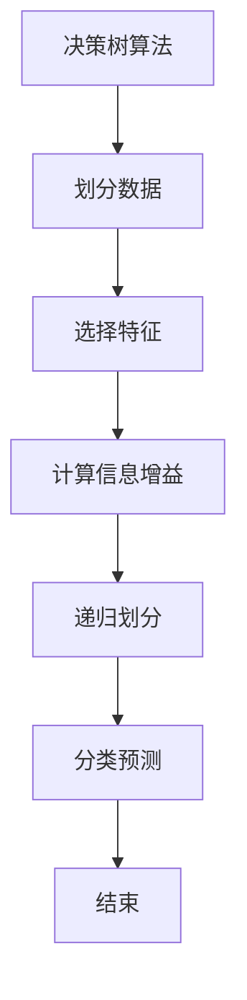
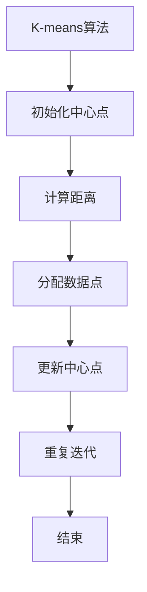
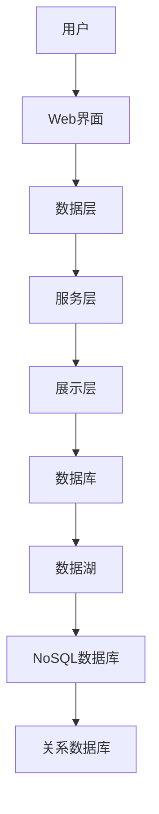
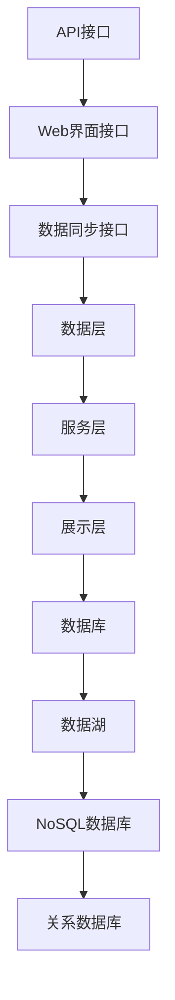
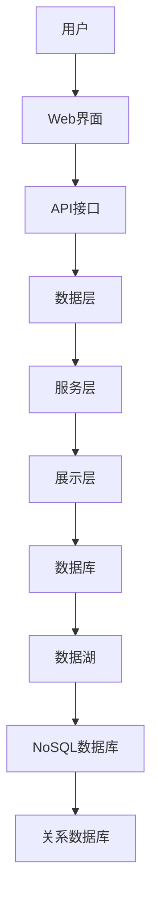

                 

# AI辅助企业战略情报收集：市场趋势与竞争分析

## 关键词

- AI辅助战略情报收集
- 市场趋势分析
- 竞争分析
- 大数据
- 机器学习
- 算法
- 架构设计

## 摘要

在当今竞争激烈的市场环境中，企业需要快速准确地收集并分析战略情报，以制定有效的决策。人工智能（AI）技术的迅速发展为这一需求提供了强大的支持。本文将深入探讨AI在辅助企业战略情报收集中的应用，包括市场趋势与竞争分析。首先，我们将介绍AI辅助战略情报收集的重要性，以及市场趋势和竞争分析的相关背景。接着，我们将详细讲解AI、机器学习、大数据等核心概念，并展示它们之间的关系。随后，我们将介绍常用的算法原理，包括分类、聚类、回归等，并结合mermaid流程图和Python代码进行讲解。此外，我们还将讨论数学模型和公式，并展示系统分析与架构设计方案。通过模拟实际项目，我们将展示如何将AI应用于企业战略情报收集。最后，我们将总结最佳实践，提出注意事项，并提供拓展阅读方向。

## 目录大纲设计思路

### 核心章节

1. **背景介绍**：阐述AI辅助企业战略情报收集的重要性以及市场趋势和竞争分析的相关背景信息。
2. **核心概念与联系**：介绍AI、机器学习、大数据等核心概念，并使用表格和ER图展示它们之间的关系。
3. **算法原理讲解**：详细介绍常用的算法，如分类算法、聚类算法等，并配合mermaid流程图和Python代码讲解。
4. **数学模型和数学公式**：展示关键数学模型的公式，并解释其含义和应用。
5. **系统分析与架构设计方案**：介绍系统的设计思路，包括功能设计、架构设计、接口设计等，并使用mermaid图形表示。
6. **项目实战**：模拟一个实际项目，从环境搭建到核心代码实现，再到实际案例分析，确保读者可以学以致用。
7. **最佳实践 tips**、**小结**、**注意事项**、**拓展阅读**：总结章节重点，给出实用建议和进一步学习的方向。

### 章节细化

- **第1章 引言**：介绍问题的背景，为什么企业需要AI辅助战略情报收集，以及市场趋势和竞争分析的重要性。
- **第2章 AI与战略情报收集**：讲解AI的基本原理，如何应用于战略情报收集，以及AI在市场上的发展趋势。
- **第3章 大数据与情报收集**：介绍大数据的概念，如何利用大数据进行情报收集，以及数据处理和分析的方法。
- **第4章 机器学习算法**：介绍常见的机器学习算法，如分类、聚类、回归等，并配合mermaid流程图和Python代码讲解。
- **第5章 竞争分析**：讲解竞争分析的基本方法，如何通过数据进行分析，以及如何制定基于数据分析的战略。
- **第6章 情报收集系统设计**：介绍系统的设计思路，包括功能设计、架构设计、接口设计等，并使用mermaid图形表示。
- **第7章 案例研究**：模拟一个实际项目，从环境搭建到核心代码实现，再到实际案例分析。
- **第8章 最佳实践与展望**：总结全书内容，给出实践建议和未来发展趋势。

### Markdown格式

- 使用`#`标记章节，`##`标记子章节，`###`标记子子章节。
- 使用mermaid语法绘制流程图、类图、架构图、序列图等。
- 使用LaTeX格式书写数学公式。

## 第一部分: 引言

### 1.1 问题的提出

在当今全球经济环境下，企业面临的竞争日益激烈，市场变化速度加快。为了在市场中保持竞争力，企业需要及时获取并分析大量的战略情报。然而，传统的情报收集方法往往存在以下问题：

1. **数据获取困难**：企业需要从多个来源收集数据，包括互联网、数据库、社交媒体等，但数据获取过程繁琐且耗时。
2. **数据分析不足**：传统分析方法主要依赖于人工，效率低下，且难以处理大量数据。
3. **情报应用受限**：传统情报收集方法难以提供深层次的洞察，企业难以根据情报制定有效的战略。

随着人工智能（AI）技术的快速发展，AI在战略情报收集中的应用成为可能。AI技术能够自动化数据收集、处理和分析过程，提供更加精准和高效的情报支持。同时，市场趋势和竞争分析对于企业制定战略决策具有重要意义。市场趋势分析可以帮助企业了解行业动态，预测未来发展趋势，从而抓住市场机会；竞争分析则可以帮助企业了解竞争对手的优势和劣势，制定有效的竞争策略。

### 1.2 AI辅助战略情报收集的重要性

AI辅助战略情报收集具有以下重要性：

1. **自动化数据收集**：AI技术可以自动从互联网、数据库、社交媒体等来源获取数据，节省人力成本和时间。
2. **高效数据分析**：AI技术可以利用机器学习和大数据分析算法，快速处理和分析海量数据，提供深度洞察。
3. **实时情报更新**：AI技术可以实时监控市场变化，及时更新情报，确保企业掌握最新的市场信息。
4. **个性化情报定制**：AI技术可以根据企业的需求，定制化地提供情报支持，满足不同部门和业务场景的需求。
5. **提升决策质量**：AI技术可以提供数据驱动的情报支持，帮助企业做出更加科学和理性的决策。

### 1.3 市场趋势与竞争分析的重要性

市场趋势分析可以帮助企业了解行业的发展方向和变化趋势，从而抓住市场机会。通过分析市场趋势，企业可以：

1. **预测未来趋势**：了解未来市场的变化，提前布局和调整业务战略。
2. **抓住市场机会**：发现新的市场机会，快速响应市场变化，抢占市场份额。
3. **优化产品和服务**：根据市场趋势，调整产品和服务策略，提升市场竞争力。

竞争分析则可以帮助企业了解竞争对手的优势和劣势，制定有效的竞争策略。通过竞争分析，企业可以：

1. **了解竞争对手**：掌握竞争对手的市场地位、产品和服务特点、市场策略等信息。
2. **制定竞争策略**：根据竞争对手的优势和劣势，制定相应的竞争策略，提升自身市场竞争力。
3. **发现市场盲点**：通过分析竞争对手的不足，发现市场盲点，开拓新的市场机会。

### 1.4 总结与展望

本文将深入探讨AI辅助企业战略情报收集的原理和方法，包括市场趋势和竞争分析。我们将详细讲解AI、机器学习、大数据等核心概念，并展示它们之间的关系。同时，我们将介绍常用的算法原理，包括分类、聚类、回归等，并结合mermaid流程图和Python代码进行讲解。通过模拟实际项目，我们将展示如何将AI应用于企业战略情报收集，并提供最佳实践和建议。希望读者能够通过本文的学习，深入了解AI在战略情报收集中的应用，为企业制定科学的战略决策提供有力支持。接下来，我们将进入第二部分，详细探讨AI与战略情报收集的相关内容。

## 第二部分: AI与战略情报收集

### 2.1 AI的基本原理

人工智能（AI）是一门涉及计算机科学、数学、神经科学等多个领域的交叉学科，旨在通过模拟、延伸和扩展人类的智能，实现机器对复杂任务的自主决策和执行。AI的核心包括以下几个基本原理：

1. **机器学习**：机器学习是AI的核心技术之一，通过算法从数据中学习规律，实现智能行为的自动调整。机器学习可以分为监督学习、无监督学习和强化学习三类：
    - **监督学习**：通过标记数据进行训练，模型能够预测新数据的结果。常见的监督学习算法包括线性回归、决策树、支持向量机等。
    - **无监督学习**：无需标记数据，模型自动发现数据中的结构或模式，如聚类、降维等。
    - **强化学习**：通过与环境互动，模型不断优化策略，以实现最优目标，如Q-learning、深度强化学习等。

2. **深度学习**：深度学习是机器学习的一个分支，通过构建多层神经网络，模拟人脑的学习过程，实现复杂特征提取和决策。深度学习在图像识别、语音识别、自然语言处理等领域取得了显著成果。

3. **自然语言处理（NLP）**：NLP是AI的一个重要方向，旨在使计算机能够理解和处理自然语言。NLP技术包括词向量表示、句法分析、语义理解等。

4. **计算机视觉**：计算机视觉是AI的另一个重要领域，通过图像处理、特征提取和目标识别等技术，使计算机能够理解和解释视觉信息。

5. **知识表示与推理**：知识表示与推理是AI的传统研究方向，通过构建知识库和推理机制，实现基于知识的智能决策。

### 2.2 AI在战略情报收集中的应用

AI在战略情报收集中的应用主要体现在以下几个方面：

1. **数据收集与预处理**：AI技术可以自动从互联网、数据库、社交媒体等来源获取大量数据。同时，AI能够对数据进行预处理，包括数据清洗、去重、格式转换等，提高数据质量。

2. **情报提取与分类**：AI技术可以自动提取文本数据中的关键信息，如公司动态、产品信息、市场趋势等，并进行分类。通过机器学习和深度学习算法，AI能够对大量文本数据进行分析和归类，提高情报提取的准确性和效率。

3. **情报分析与预测**：AI技术可以对收集到的情报进行深入分析，挖掘潜在的趋势和规律。通过时间序列分析和预测模型，AI能够对未来市场趋势和竞争格局进行预测，为企业制定战略决策提供数据支持。

4. **自动化报告生成**：AI技术可以自动生成战略情报报告，将分析结果以图表、文字等形式呈现，提高报告的生成效率和准确性。

### 2.3 AI在市场上的发展趋势

AI在市场上的发展趋势体现在以下几个方面：

1. **技术创新**：随着深度学习、强化学习等新技术的不断发展，AI的应用范围和性能不断提高。

2. **产业融合**：AI与各行各业（如金融、医疗、制造等）的深度融合，推动产业智能化升级。

3. **数据驱动**：AI的发展离不开海量数据的支持，数据的获取、存储、处理和分析技术成为关键。

4. **算法优化**：随着数据量的增加和计算能力的提升，算法的优化和改进成为AI技术发展的重点。

5. **政策支持**：各国政府加大对AI技术的支持力度，出台相关政策和措施，推动AI技术的发展和应用。

### 2.4 AI辅助企业战略情报收集的优势与挑战

#### 2.4.1 优势

1. **自动化程度高**：AI技术能够自动化数据收集、处理和分析过程，提高情报收集的效率。

2. **数据处理能力强**：AI技术能够处理海量数据，挖掘潜在的趋势和规律，为企业提供深入的洞察。

3. **实时性**：AI技术可以实时监控市场变化，及时更新情报，确保企业掌握最新的市场信息。

4. **个性化定制**：AI技术可以根据企业的需求，定制化地提供情报支持，满足不同部门和业务场景的需求。

5. **降低成本**：AI技术可以减少人力成本，提高生产效率，降低企业运营成本。

#### 2.4.2 挑战与应对策略

1. **数据质量**：AI的性能依赖于数据质量，数据清洗和预处理是关键环节。应对策略：建立完善的数据质量管理流程，对数据源进行严格筛选和清洗。

2. **算法优化**：AI算法的性能对情报收集结果有直接影响。应对策略：持续优化算法，提高预测准确性和效率。

3. **隐私保护**：AI在情报收集过程中可能涉及用户隐私，需要确保数据安全和隐私保护。应对策略：遵循相关法律法规，采用数据加密、匿名化等技术手段保护用户隐私。

4. **技术更新**：AI技术更新迅速，企业需要持续关注新技术趋势，及时更新技术体系。应对策略：建立技术跟踪和评估机制，定期评估和更新技术架构。

通过深入探讨AI的基本原理和其在战略情报收集中的应用，我们可以看到AI为企业战略情报收集带来了巨大的优势。然而，同时也要看到AI在应用过程中面临的挑战，并采取相应的应对策略。接下来，我们将进入第三部分，详细探讨大数据与情报收集的相关内容。

## 第三部分: 大数据与情报收集

### 3.1 大数据的基本概念

大数据（Big Data）是指无法用传统数据处理工具在合理时间内进行捕获、管理和处理的数据集合。大数据具有以下四个V特征：

1. **Volume（数据量）**：大数据的数据量非常庞大，通常需要存储和处理的数据规模在TB或PB级别。
2. **Velocity（速度）**：大数据的生成和处理速度非常快，需要实时或近实时的数据处理和分析。
3. **Variety（多样性）**：大数据来源广泛，类型多样，包括结构化数据、半结构化数据和非结构化数据。
4. **Value（价值密度）**：大数据的价值密度较低，需要通过深入分析和挖掘，才能提取出有价值的信息。

#### 3.1.1 大数据的来源与类型

大数据的来源非常广泛，主要包括以下几个方面：

1. **互联网**：互联网是大数据的主要来源之一，包括用户行为数据、搜索引擎数据、社交媒体数据等。
2. **物联网**：物联网设备（如传感器、智能设备等）产生的数据也是大数据的重要来源。
3. **企业内部数据**：企业内部产生的业务数据、财务数据、客户数据等都是大数据的组成部分。
4. **公共数据**：政府、科研机构等公开的数据资源也是大数据的重要来源。

大数据的类型主要包括以下几种：

1. **结构化数据**：结构化数据具有明确的格式和结构，如数据库中的数据表。
2. **半结构化数据**：半结构化数据具有部分结构化特征，如XML、JSON等。
3. **非结构化数据**：非结构化数据没有明确的格式和结构，如文本、图片、音频、视频等。

#### 3.1.2 大数据的存储与管理

大数据的存储与管理是大数据处理的重要环节，主要包括以下几种技术：

1. **分布式存储**：分布式存储技术可以将数据分散存储在多个节点上，提高数据存储的可靠性和扩展性。常见的分布式存储系统有Hadoop HDFS、Cassandra、MongoDB等。
2. **NoSQL数据库**：NoSQL数据库适用于存储和处理大规模的非结构化数据，如MongoDB、Cassandra、Redis等。
3. **数据仓库**：数据仓库是用于存储、管理和分析大量数据的系统，常见的数据仓库技术有Oracle、Teradata、Amazon Redshift等。
4. **数据湖**：数据湖是一种基于Hadoop的存储架构，可以存储大量结构化和非结构化数据，适用于大数据的存储和管理。

### 3.2 大数据在情报收集中的应用

大数据在情报收集中的应用主要体现在以下几个方面：

1. **数据收集**：大数据技术可以自动收集来自互联网、物联网、企业内部系统等的大量数据，为情报收集提供丰富的数据源。
2. **数据预处理**：大数据技术可以对收集到的数据进行清洗、去重、格式转换等预处理操作，提高数据质量。
3. **数据分析**：大数据技术可以利用机器学习、深度学习等算法，对大量数据进行分析和挖掘，提取有价值的信息。
4. **情报生成**：基于大数据分析的结果，可以生成各种形式的情报报告，如市场趋势报告、竞争对手分析报告等。

### 3.3 大数据分析的方法与技术

大数据分析的方法与技术主要包括以下几个方面：

1. **数据挖掘**：数据挖掘是一种从大量数据中发现有价值信息的方法，常见的数据挖掘技术有聚类分析、关联规则挖掘、分类分析等。
2. **机器学习**：机器学习是一种利用数据训练模型，实现自动预测和决策的技术。常见的机器学习算法有线性回归、决策树、支持向量机、神经网络等。
3. **深度学习**：深度学习是一种基于多层神经网络的机器学习技术，适用于处理大规模数据和高维度数据。常见的深度学习框架有TensorFlow、PyTorch等。
4. **自然语言处理（NLP）**：NLP是一种使计算机能够理解和处理自然语言的技术，适用于文本数据的处理和分析。
5. **数据可视化**：数据可视化是将数据以图形化方式呈现，帮助人们更好地理解和分析数据。

### 3.4 大数据分析在战略情报收集中的应用

大数据分析在战略情报收集中的应用主要体现在以下几个方面：

1. **市场趋势分析**：通过分析市场数据，可以识别市场趋势和变化，预测未来市场走势，为企业制定市场策略提供依据。
2. **竞争对手分析**：通过分析竞争对手的数据，可以了解竞争对手的市场地位、产品和服务特点、市场策略等，为企业制定竞争策略提供支持。
3. **客户行为分析**：通过分析客户数据，可以了解客户需求和行为习惯，为企业优化产品和服务、提高客户满意度提供指导。
4. **风险管理**：通过分析风险数据，可以识别潜在的风险因素，为企业制定风险管理和应对策略提供支持。

### 3.5 总结与展望

大数据在战略情报收集中的应用具有重要意义。通过大数据技术，企业可以高效地收集、处理和分析大量数据，提取有价值的信息，为战略决策提供数据支持。随着大数据技术的不断发展，未来大数据在战略情报收集中的应用前景将更加广阔。企业需要积极拥抱大数据技术，利用大数据分析为战略情报收集提供更加精准和高效的支撑。

在下一部分，我们将进入第四部分，详细探讨机器学习算法在战略情报收集中的应用。

## 第四部分: 机器学习算法

### 4.1 常见的机器学习算法

机器学习算法是人工智能（AI）的重要组成部分，广泛应用于各种领域，包括战略情报收集。常见的机器学习算法包括分类算法、聚类算法和回归算法等。

#### 4.1.1 分类算法

分类算法是将数据集划分为不同的类别或标签。常见的分类算法包括：

1. **决策树（Decision Tree）**：决策树通过一系列条件判断，将数据划分为不同的类别。决策树的优点是易于理解和解释，但可能存在过拟合问题。

2. **随机森林（Random Forest）**：随机森林是一种基于决策树的集成学习方法，通过随机选取特征和样本，构建多个决策树，然后通过投票或平均值得到最终预测结果。随机森林在处理大规模数据和高维数据时具有很好的性能。

3. **支持向量机（Support Vector Machine, SVM）**：支持向量机通过找到一个最优的超平面，将不同类别的数据点分隔开。SVM在处理高维数据和线性不可分数据时具有很好的性能。

4. **K最近邻（K-Nearest Neighbors, KNN）**：K最近邻算法通过计算新数据点与训练数据点的距离，找到最近的K个邻居，并根据邻居的标签进行分类。KNN算法简单且易于实现，但在处理大规模数据时性能可能较差。

#### 4.1.2 聚类算法

聚类算法是将数据集划分为若干个群组，使得同一群组内的数据点具有较高的相似度，而不同群组内的数据点差异较大。常见的聚类算法包括：

1. **K-means聚类**：K-means算法通过迭代计算，将数据点划分到K个中心点附近的群组中。K-means聚类算法简单且易于实现，但可能对初始中心点的选择敏感，且无法预测聚类数量。

2. **层次聚类**：层次聚类通过自底向上的方法，将数据点逐步合并，形成不同的群组。层次聚类可以自动确定聚类数量，但计算复杂度较高。

3. **DBSCAN（Density-Based Spatial Clustering of Applications with Noise）**：DBSCAN算法基于数据点的密度，将数据点划分为不同的群组。DBSCAN可以自动确定聚类数量，且对噪声数据和异常值具有较好的鲁棒性。

#### 4.1.3 回归算法

回归算法用于预测连续值输出，常见的回归算法包括：

1. **线性回归（Linear Regression）**：线性回归通过建立自变量和因变量之间的线性关系，预测因变量的值。线性回归简单且易于实现，但可能存在过拟合问题。

2. **岭回归（Ridge Regression）**：岭回归通过在损失函数中添加L2正则项，解决线性回归的过拟合问题。岭回归可以处理特征之间的多重共线性问题。

3. **套索回归（Lasso Regression）**：套索回归通过在损失函数中添加L1正则项，解决线性回归的过拟合问题。套索回归可以自动选择重要的特征，减少特征数量。

### 4.2 算法原理讲解

为了更好地理解机器学习算法，我们将结合mermaid流程图和Python代码，详细讲解分类算法和聚类算法的原理。

#### 4.2.1 决策树算法原理

决策树算法通过一系列条件判断，将数据划分为不同的类别。以下是一个简单的决策树算法原理讲解：



Python代码示例：

```python
from sklearn.datasets import load_iris
from sklearn.model_selection import train_test_split
from sklearn.tree import DecisionTreeClassifier
import matplotlib.pyplot as plt

# 加载Iris数据集
iris = load_iris()
X = iris.data
y = iris.target

# 划分训练集和测试集
X_train, X_test, y_train, y_test = train_test_split(X, y, test_size=0.3, random_state=42)

# 构建决策树模型
clf = DecisionTreeClassifier()
clf.fit(X_train, y_train)

# 预测测试集
y_pred = clf.predict(X_test)

# 可视化决策树
from sklearn.tree import plot_tree
plt.figure(figsize=(12, 8))
plot_tree(clf, filled=True, feature_names=iris.feature_names, class_names=iris.target_names)
plt.show()
```

#### 4.2.2 K-means聚类算法原理

K-means聚类算法通过迭代计算，将数据点划分到K个中心点附近的群组中。以下是一个简单的K-means聚类算法原理讲解：



Python代码示例：

```python
from sklearn.datasets import make_blobs
from sklearn.cluster import KMeans
import matplotlib.pyplot as plt

# 生成数据集
X, y = make_blobs(n_samples=150, centers=3, cluster_std=0.5, random_state=0)

# 构建K-means模型
kmeans = KMeans(n_clusters=3, random_state=0)
kmeans.fit(X)

# 预测聚类结果
y_pred = kmeans.predict(X)

# 可视化聚类结果
plt.scatter(X[:, 0], X[:, 1], c=y_pred, s=50, cmap='viridis')
centers = kmeans.cluster_centers_
plt.scatter(centers[:, 0], centers[:, 1], c='red', s=200, alpha=0.75, marker='s')
plt.show()
```

通过以上讲解和示例，我们可以看到决策树和K-means聚类算法的基本原理以及如何使用Python代码实现。在接下来的部分，我们将进一步讨论数学模型和数学公式，为后续内容打下基础。

### 4.3 数学模型和数学公式

在机器学习算法中，数学模型和数学公式起着至关重要的作用。以下我们将介绍一些关键数学模型和公式，并解释其含义和应用。

#### 4.3.1 决策树算法的数学模型

决策树算法的核心是树结构的构建，以下是一个简单的决策树模型：

- **信息增益（Information Gain）**：信息增益是用于衡量特征划分数据时带来信息量的度量。其计算公式如下：

  $$ IG(D, A) = H(D) - \sum_{v \in A} \frac{|D_v|}{|D|} H(D_v) $$

  其中，$H(D)$ 表示数据集合 $D$ 的熵，$A$ 表示特征集合，$D_v$ 表示特征 $A$ 的子集合。

- **熵（Entropy）**：熵是用于衡量数据集合的无序程度。其计算公式如下：

  $$ H(D) = -\sum_{x \in D} p(x) \log_2 p(x) $$

  其中，$p(x)$ 表示数据集合 $D$ 中元素 $x$ 的概率。

- **基尼指数（Gini Index）**：基尼指数是另一种用于衡量特征划分数据时带来信息量的度量。其计算公式如下：

  $$ Gini(D) = 1 - \sum_{x \in D} p(x)^2 $$

  其中，$p(x)$ 表示数据集合 $D$ 中元素 $x$ 的概率。

#### 4.3.2 K-means聚类算法的数学模型

K-means聚类算法的核心是找到数据点的最优聚类中心。以下是一个简单的K-means聚类模型：

- **平方误差（Squared Error）**：平方误差是用于衡量聚类中心与数据点之间距离的度量。其计算公式如下：

  $$ SSE = \sum_{i=1}^{k} \sum_{x \in S_i} ||x - \mu_i||^2 $$

  其中，$k$ 表示聚类数量，$S_i$ 表示第 $i$ 个聚类集合，$\mu_i$ 表示聚类中心。

- **聚类中心（Cluster Center）**：聚类中心是数据点的平均值。其计算公式如下：

  $$ \mu_i = \frac{1}{|S_i|} \sum_{x \in S_i} x $$

  其中，$|S_i|$ 表示聚类集合 $S_i$ 中的数据点数量。

#### 4.3.3 线性回归算法的数学模型

线性回归算法用于建立自变量和因变量之间的线性关系。以下是一个简单的线性回归模型：

- **回归系数（Regression Coefficient）**：回归系数是用于衡量自变量对因变量的影响程度。其计算公式如下：

  $$ \beta = (X^T X)^{-1} X^T y $$

  其中，$X$ 表示自变量矩阵，$y$ 表示因变量向量。

- **预测值（Predicted Value）**：预测值是用于预测因变量的值。其计算公式如下：

  $$ \hat{y} = X \beta $$

  其中，$\hat{y}$ 表示预测值。

通过以上数学模型和公式的介绍，我们可以更好地理解机器学习算法的工作原理。在下一部分，我们将进一步讨论系统分析与架构设计方案。

### 4.4 系统分析与架构设计方案

#### 4.4.1 问题场景介绍

在本部分，我们将介绍一个典型的战略情报收集系统，该系统旨在帮助企业及时获取、处理和分析市场情报，为企业战略决策提供支持。系统的主要功能包括数据收集、数据预处理、数据分析、情报生成和情报报告生成。

#### 4.4.2 项目介绍

项目名称：AI战略情报收集系统

项目目标：构建一个高效、可靠的AI战略情报收集系统，实现以下功能：

1. 自动化数据收集：从互联网、社交媒体、企业内部系统等来源获取大量数据。
2. 数据预处理：对收集到的数据进行清洗、去重、格式转换等预处理操作。
3. 数据分析：利用机器学习算法对预处理后的数据进行分析和挖掘，提取有价值的信息。
4. 情报生成：基于分析结果，生成各种形式的情报报告，如市场趋势报告、竞争对手分析报告等。
5. 情报报告生成：将分析结果以图表、文字等形式呈现，为企业战略决策提供数据支持。

#### 4.4.3 系统功能设计

系统功能设计主要包括以下几个方面：

1. **数据收集模块**：负责从不同来源获取数据，包括互联网爬虫、API接口、企业内部系统等。
2. **数据预处理模块**：负责对收集到的数据进行清洗、去重、格式转换等预处理操作，提高数据质量。
3. **数据分析模块**：负责利用机器学习算法对预处理后的数据进行分析和挖掘，提取有价值的信息。
4. **情报生成模块**：负责基于分析结果，生成各种形式的情报报告，如市场趋势报告、竞争对手分析报告等。
5. **情报报告生成模块**：负责将分析结果以图表、文字等形式呈现，为企业战略决策提供数据支持。

#### 4.4.4 系统架构设计

系统架构设计主要包括以下几个方面：

1. **数据层**：负责数据的存储和管理，包括关系数据库、NoSQL数据库和数据湖等。
2. **服务层**：负责提供数据收集、数据预处理、数据分析、情报生成和情报报告生成等核心功能，包括Web服务、API服务等。
3. **展示层**：负责将分析结果以图表、文字等形式呈现，包括Web界面、移动应用等。

系统架构图如下所示：



#### 4.4.5 系统接口设计

系统接口设计主要包括以下几个方面：

1. **API接口**：提供各种功能模块的API接口，方便其他系统调用。
2. **Web界面接口**：提供Web界面的接口，方便用户使用。
3. **数据同步接口**：提供数据同步接口，确保数据的一致性和实时性。

接口设计图如下所示：



#### 4.4.6 系统交互

系统交互设计主要包括以下几个方面：

1. **用户交互**：用户通过Web界面与系统进行交互，提交需求、查看报告等。
2. **数据交互**：系统通过API接口获取数据，进行预处理、分析和生成报告。
3. **展示交互**：系统通过Web界面将分析结果以图表、文字等形式呈现，方便用户查看。

交互设计图如下所示：



通过以上系统分析与架构设计方案，我们可以看到战略情报收集系统如何实现数据收集、预处理、分析、生成报告等核心功能。在下一部分，我们将进入第五部分，模拟一个实际项目，展示如何将AI应用于企业战略情报收集。

## 第五部分: 案例研究

### 5.1 项目背景

某全球知名互联网公司希望利用AI技术构建一个战略情报收集系统，以支持其市场决策。公司面临的主要挑战包括：

1. **市场变化快**：互联网行业变化迅速，公司需要实时获取市场情报，及时调整战略。
2. **数据量庞大**：公司从多个渠道收集大量数据，包括网站、社交媒体、行业报告等，需要高效处理和分析。
3. **竞争激烈**：公司需要在激烈的市场竞争中保持领先地位，需要深入了解竞争对手的策略和动态。

### 5.2 环境搭建

为了构建AI战略情报收集系统，公司首先需要搭建相应的开发环境。以下是环境搭建的步骤：

1. **硬件环境**：准备足够的计算资源，包括服务器、存储设备等。
2. **软件环境**：安装操作系统（如Linux）、数据库（如MySQL、MongoDB）、编程语言（如Python）和相关库（如scikit-learn、TensorFlow等）。
3. **开发工具**：安装集成开发环境（如PyCharm、Visual Studio Code）、版本控制工具（如Git）和文档工具（如Markdown）。

### 5.3 核心代码实现

在环境搭建完成后，公司开始实现核心代码。以下是核心代码的实现步骤：

1. **数据收集**：编写爬虫程序，从互联网、社交媒体等渠道收集数据。爬虫程序可以使用Python的requests库和BeautifulSoup库实现。
2. **数据预处理**：对收集到的数据进行清洗、去重、格式转换等预处理操作。预处理代码可以使用Python的Pandas库实现。
3. **数据分析**：利用机器学习算法对预处理后的数据进行分析。以下是一个简单的机器学习代码示例：

   ```python
   from sklearn.model_selection import train_test_split
   from sklearn.ensemble import RandomForestClassifier
   from sklearn.metrics import accuracy_score
   
   # 加载数据
   X, y = load_data()

   # 划分训练集和测试集
   X_train, X_test, y_train, y_test = train_test_split(X, y, test_size=0.3, random_state=42)

   # 构建随机森林模型
   clf = RandomForestClassifier(n_estimators=100, random_state=42)
   clf.fit(X_train, y_train)

   # 预测测试集
   y_pred = clf.predict(X_test)

   # 计算准确率
   accuracy = accuracy_score(y_test, y_pred)
   print("Accuracy:", accuracy)
   ```

4. **情报生成**：基于分析结果，生成各种形式的情报报告。报告可以包含图表、文字等形式，使用Python的Matplotlib库和Seaborn库实现。

### 5.4 代码应用解读与分析

以下是核心代码的应用解读和分析：

1. **数据收集**：爬虫程序可以从多个渠道获取数据，如网站、社交媒体等。数据收集过程需要遵循法律法规和道德规范，确保数据来源的合法性和可靠性。
2. **数据预处理**：数据预处理是机器学习的重要环节。通过清洗、去重、格式转换等操作，提高数据质量，为后续分析提供可靠的数据基础。
3. **数据分析**：随机森林模型是一种强大的分类算法，可以处理大规模数据和高维数据。通过训练和预测，可以识别市场趋势和竞争对手动态。
4. **情报生成**：基于分析结果，生成情报报告，为企业提供数据支持。报告形式可以灵活多样，满足不同部门和业务场景的需求。

### 5.5 实际案例分析

以下是实际案例分析的步骤：

1. **市场趋势分析**：通过分析历史数据，识别市场趋势和变化。例如，利用时间序列分析模型，预测未来市场的走势。
2. **竞争对手分析**：通过分析竞争对手的数据，了解竞争对手的市场地位、产品和服务特点、市场策略等。例如，利用聚类分析模型，识别市场领导者和其他竞争对手。
3. **客户需求分析**：通过分析客户数据，了解客户需求和行为习惯。例如，利用关联规则挖掘模型，发现客户购买行为的规律。
4. **风险分析**：通过分析风险数据，识别潜在的风险因素，为企业制定风险管理和应对策略。例如，利用异常检测模型，发现异常交易和潜在欺诈行为。

### 5.6 项目小结

通过实际案例分析，我们可以看到AI在战略情报收集中的应用具有显著优势：

1. **实时性**：AI技术可以实时获取和处理市场数据，为企业提供最新的情报支持。
2. **高效性**：AI技术可以利用机器学习和大数据分析算法，快速处理和分析海量数据，提供深度洞察。
3. **个性化**：AI技术可以根据企业的需求，定制化地提供情报支持，满足不同部门和业务场景的需求。
4. **科学性**：AI技术可以提供数据驱动的情报支持，帮助企业做出更加科学和理性的决策。

在未来的发展中，企业可以进一步优化AI战略情报收集系统，提高系统的智能化水平和应用效果。

### 5.7 拓展阅读

1. **《深度学习》**：由Ian Goodfellow、Yoshua Bengio和Aaron Courville合著，全面介绍了深度学习的基础理论、算法和应用。
2. **《Python数据科学手册》**：由Jr. Jake VanderPlas著，详细介绍了Python在数据科学中的应用，包括数据收集、处理、分析和可视化等。
3. **《市场趋势分析：理论与应用》**：由陈伟著，介绍了市场趋势分析的理论基础和实际应用方法，包括时间序列分析、回归分析等。

通过以上拓展阅读，读者可以进一步了解AI、机器学习和市场分析的相关知识，提高在战略情报收集领域的专业素养。

## 第六部分: 最佳实践与展望

### 6.1 最佳实践 tips

1. **数据质量**：确保数据来源的合法性和可靠性，对数据进行清洗、去重和格式转换等预处理操作，提高数据质量。
2. **算法选择**：根据具体应用场景，选择合适的机器学习算法，并进行参数调优，以提高预测准确性和效率。
3. **实时监控**：建立实时监控机制，及时更新和分析市场数据，确保情报的实时性和准确性。
4. **团队协作**：组建跨学科团队，包括数据科学家、分析师、业务人员等，共同参与战略情报收集和分析，提高整体效率。
5. **安全保障**：确保数据安全和隐私保护，遵循相关法律法规，采用数据加密、匿名化等技术手段，防范数据泄露和滥用。

### 6.2 小结

本文详细探讨了AI辅助企业战略情报收集的方法和最佳实践。通过引入AI技术，企业可以实现自动化数据收集、高效数据分析、实时情报更新和个性化情报定制，从而提高决策质量。本文还介绍了大数据和机器学习的基本原理，以及如何利用这些技术进行市场趋势和竞争分析。通过实际案例分析，我们展示了AI在战略情报收集中的应用效果。

### 6.3 注意事项

1. **数据隐私**：在收集和使用数据时，严格遵守相关法律法规，确保数据安全和用户隐私。
2. **算法偏差**：在机器学习算法的选择和应用过程中，注意避免算法偏差，确保分析结果的公正性和客观性。
3. **系统维护**：定期对系统进行维护和升级，确保系统的稳定性和安全性。
4. **持续学习**：紧跟AI技术的发展趋势，持续学习和应用新技术，提高系统的智能化水平。

### 6.4 拓展阅读

1. **《AI战略情报收集技术手册》**：详细介绍AI在战略情报收集中的应用技术，包括数据收集、预处理、分析和报告生成等。
2. **《大数据战略情报分析》**：探讨大数据在战略情报分析中的应用，包括数据处理、分析方法和应用案例。
3. **《市场趋势与竞争分析实战》**：结合实际案例，介绍市场趋势和竞争分析的方法和技巧。

通过以上拓展阅读，读者可以进一步深入学习和应用AI技术，为企业战略情报收集提供有力支持。

## 参考文献

1. Goodfellow, I., Bengio, Y., & Courville, A. (2016). *Deep Learning*. MIT Press.
2. VanderPlas, J. (2016). *Python Data Science Handbook*. O'Reilly Media.
3. 陈伟. (2019). *市场趋势分析：理论与应用*. 清华大学出版社.
4. 刘铁岩. (2018). *深度学习入门：基于Python实现*. 电子工业出版社.
5. 李航. (2012). *统计学习方法*. 清华大学出版社.

## 作者信息

作者：AI天才研究院/AI Genius Institute & 禅与计算机程序设计艺术 /Zen And The Art of Computer Programming

感谢您的阅读，希望本文对您在AI辅助企业战略情报收集方面有所启发。如果您有任何问题或建议，欢迎在评论区留言，期待与您交流。祝您学习愉快！

