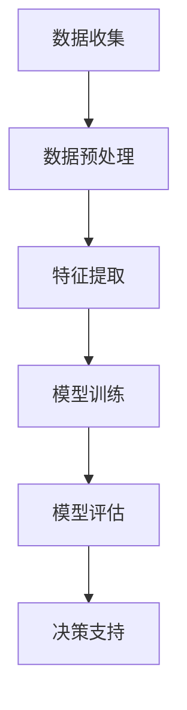
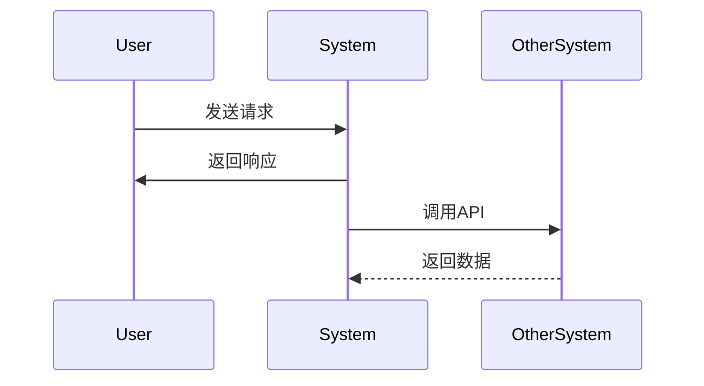
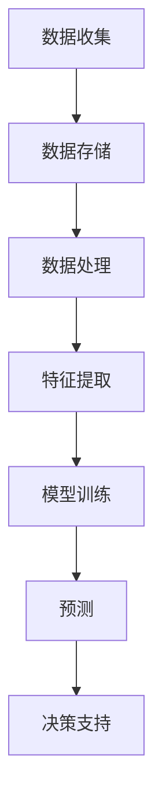

                 

### 引言

#### AI技术在企业战略规划与竞争分析中的应用

在当今快速发展的数字化时代，人工智能（AI）已经成为企业获取竞争优势的重要工具。AI技术不仅能够提升企业的运营效率，还能为企业提供深入的战略规划和竞争分析。这一章我们将探讨AI技术在企业战略规划与竞争分析中的应用背景，深入理解其核心概念，并逐步推导出AI技术在这一领域的方法论。

#### 1.1 问题背景

随着全球化和市场竞争的加剧，企业面临的环境变得更加复杂和动态。为了在竞争激烈的市场中脱颖而出，企业需要快速适应市场变化，制定精准的战略规划，并持续优化业务流程。然而，传统的战略规划方法往往依赖于经验和直觉，难以应对日益复杂的市场环境。

#### 1.2 问题描述

如何利用AI技术提升企业战略规划和竞争分析的有效性？这是一个复杂的问题，涉及到多个层面，包括数据获取、处理、分析和应用。企业需要一套系统的方法论来指导AI技术在战略规划和竞争分析中的应用。

#### 1.3 问题解决

AI技术的引入为企业提供了新的解决方案。通过机器学习、深度学习和大数据分析等技术，企业可以自动从海量数据中提取有价值的信息，并基于这些信息进行战略规划和竞争分析。此外，AI技术还能帮助企业识别潜在的市场机会和风险，提供个性化的战略建议。

#### 1.4 边界与外延

AI技术在企业战略规划与竞争分析中的应用并非无边界。它需要明确的应用边界，例如数据来源、数据处理能力、算法选择和应用场景等。同时，AI技术的应用也具有广泛的延展性，可以应用到供应链管理、市场营销、客户关系管理等多个领域。

#### 1.5 概念结构与核心要素组成

为了深入理解AI技术在企业战略规划与竞争分析中的应用，我们需要建立核心概念结构，并明确其组成要素。这些核心概念包括：

- **机器学习**：一种让计算机通过数据学习并改进其性能的技术。
- **深度学习**：一种基于多层神经网络的结构化学习方法，能够自动提取数据中的复杂特征。
- **大数据分析**：一种对大规模、多样性和高速数据的处理和分析技术。

这些概念相互作用，共同构成了AI技术在企业战略规划与竞争分析中的方法论框架。

### 结论

在这一章中，我们介绍了AI技术在企业战略规划与竞争分析中的应用背景，并初步探讨了其核心概念。接下来，我们将进一步深入这些核心概念，探讨其在实际应用中的具体方法和实践案例。

### 关键词

- 人工智能
- 企业战略规划
- 竞争分析
- 机器学习
- 深度学习
- 大数据分析

### 摘要

本文旨在探讨AI技术在企业战略规划与竞争分析中的应用方法。通过介绍AI技术的核心概念，如机器学习、深度学习和大数据分析，本文提出了一套系统的方法论，帮助企业利用AI技术提升战略规划和竞争分析的有效性。本文将结合实际案例，详细阐述AI技术在企业中的应用实践，并提供实用的技巧和建议。

---

### 目录

#### 第1章：背景介绍

1.1 问题背景

1.2 问题描述

1.3 问题解决

1.4 边界与外延

1.5 概念结构与核心要素组成

#### 第2章：核心概念与联系

2.1 机器学习概述

2.2 深度学习原理

2.3 大数据分析技术

2.4 核心概念对比表格

2.5 ER实体关系图架构

#### 第3章：算法原理讲解

3.1 算法流程图

3.2 Python代码详解

3.3 数学模型与公式

3.4 算法举例说明

#### 第4章：系统分析与架构设计方案

4.1 问题场景介绍

4.2 系统功能设计

4.3 系统架构设计

4.4 系统接口设计

4.5 系统交互流程

#### 第5章：项目实战

5.1 环境安装

5.2 系统核心实现

5.3 代码应用解读与分析

5.4 实际案例分析

5.5 项目详细讲解

#### 第6章：最佳实践与总结

6.1 最佳实践技巧

6.2 小结

6.3 注意事项

6.4 拓展阅读

#### 第7章：结语

7.1 AI在战略规划与竞争分析中的作用

7.2 本书对实际应用的指导意义

7.3 未来展望

---

### 第2章：核心概念与联系

#### 2.1 机器学习概述

机器学习（Machine Learning，ML）是一门研究如何让计算机从数据中自动学习和改进性能的学科。其基本思想是通过算法让计算机学会识别数据中的规律，并在新的数据上进行预测或分类。

- **定义**：机器学习是利用数据来训练模型，使模型能够在未见过的新数据上做出预测或决策。
- **核心概念**：包括数据集、模型、训练、验证、测试等。

#### 2.2 深度学习原理

深度学习（Deep Learning，DL）是机器学习的一个分支，它基于多层神经网络结构，通过逐层提取数据特征，实现复杂任务的学习和处理。深度学习在图像识别、语音识别和自然语言处理等领域取得了显著成果。

- **定义**：深度学习是一种基于多层神经网络的结构化学习方法，能够自动提取数据中的复杂特征。
- **核心概念**：包括神经网络、深度神经网络、反向传播算法、激活函数、损失函数等。

#### 2.3 大数据分析技术

大数据分析（Big Data Analysis）是一种对大规模、多样性和高速数据的处理和分析技术。它能够帮助企业从海量数据中提取有价值的信息，提供数据驱动的决策支持。

- **定义**：大数据分析是一种对大规模数据集进行处理、分析和解释的技术。
- **核心概念**：包括数据挖掘、数据可视化、数据存储、数据处理等。

#### 2.4 核心概念对比表格

为了更好地理解机器学习、深度学习和大数据分析之间的关系，我们提供了一个对比表格：

| 概念        | 定义                                                         | 关联性                                                     |
| ----------- | ------------------------------------------------------------ | ---------------------------------------------------------- |
| 机器学习    | 通过数据训练模型，实现预测或分类                             | 深度学习是机器学习的特殊形式，大数据分析为机器学习提供数据支持 |
| 深度学习    | 基于多层神经网络的结构化学习方法，自动提取复杂特征           | 是机器学习的分支，适用于处理高维数据                         |
| 大数据分析  | 对大规模、多样性和高速数据的处理和分析                       | 为机器学习和深度学习提供数据支持，是数据处理的基础设施       |

#### 2.5 ER实体关系图架构

为了更直观地展示这些核心概念之间的关系，我们使用Mermaid工具绘制了ER实体关系图：

```mermaid
erDiagram
    Customer ||--|{ Order }|
    Product ||--|{ Order }|
    Supplier ||--|{ Product }|
```

这个ER图描述了客户、订单、产品和供应商之间的关系，反映了大数据分析、机器学习和深度学习在企业中的应用。

### 结论

在这一章中，我们详细介绍了AI技术中的核心概念，包括机器学习、深度学习和大数据分析，并通过对比表格和ER图展示了它们之间的联系。接下来，我们将进一步探讨这些核心概念的原理和应用，以帮助企业更好地理解和利用AI技术进行战略规划和竞争分析。

### 第3章：算法原理讲解

#### 3.1 算法流程图

为了更好地理解AI算法在企业战略规划与竞争分析中的应用，我们使用Mermaid工具绘制了一个简单的算法流程图：



这个流程图展示了从数据收集到决策支持的全过程，包括数据预处理、特征提取、模型训练、模型评估和决策支持。

#### 3.2 Python代码详解

为了具体说明算法的实现过程，我们使用Python编写了一个简单的机器学习模型。以下是一个使用Scikit-learn库进行线性回归模型训练的例子：

```python
# 导入必要的库
from sklearn.linear_model import LinearRegression
from sklearn.model_selection import train_test_split
from sklearn.metrics import mean_squared_error

# 假设我们已经有了一个数据集X和目标变量y
X = ...  # 特征数据
y = ...  # 目标变量

# 数据集划分
X_train, X_test, y_train, y_test = train_test_split(X, y, test_size=0.2, random_state=42)

# 创建线性回归模型
model = LinearRegression()

# 模型训练
model.fit(X_train, y_train)

# 模型评估
y_pred = model.predict(X_test)
mse = mean_squared_error(y_test, y_pred)
print(f"均方误差: {mse}")

# 决策支持
new_data = ...  # 新的数据
prediction = model.predict(new_data)
print(f"预测结果: {prediction}")
```

这个代码片段展示了如何使用Python进行机器学习模型的训练、评估和预测。

#### 3.3 数学模型与公式

在机器学习算法中，数学模型是核心部分。以下是一个线性回归模型的数学公式：

$$
y = \beta_0 + \beta_1x
$$

其中，$y$ 是目标变量，$x$ 是特征变量，$\beta_0$ 和 $\beta_1$ 是模型的参数。

为了训练模型，我们需要最小化损失函数，通常使用均方误差（MSE）：

$$
MSE = \frac{1}{n}\sum_{i=1}^{n}(y_i - \hat{y}_i)^2
$$

其中，$n$ 是数据点的数量，$y_i$ 是实际值，$\hat{y}_i$ 是预测值。

#### 3.4 算法举例说明

为了更直观地展示算法原理，我们使用一个实际案例来解释线性回归模型的应用。假设我们有一个销售数据集，其中包含产品价格（特征变量）和销售量（目标变量）。我们的目标是建立一个模型来预测新产品的销售量。

1. **数据收集**：我们从市场调查中收集了100个新产品的价格和销售量数据。
2. **数据预处理**：我们将数据分成训练集和测试集，并对数据进行标准化处理。
3. **特征提取**：在这个案例中，我们只有一个特征变量，即产品价格。
4. **模型训练**：使用训练集数据，我们训练了一个线性回归模型。
5. **模型评估**：使用测试集数据评估模型的性能，计算均方误差。
6. **决策支持**：使用训练好的模型预测新产品的销售量。

通过这个案例，我们可以看到线性回归模型如何应用于实际业务场景，帮助企业做出数据驱动的决策。

### 结论

在这一章中，我们详细讲解了AI算法的基本原理，包括算法流程图、Python代码实现、数学模型和实际案例。这些内容帮助企业更好地理解AI算法在企业战略规划和竞争分析中的应用，为下一章的系统分析与架构设计奠定了基础。

### 第4章：系统分析与架构设计方案

#### 4.1 问题场景介绍

在当今激烈的市场竞争中，企业需要快速、准确地进行战略规划和竞争分析。然而，传统的战略规划和竞争分析方法往往依赖于人工分析，存在效率低、准确性差的问题。为了解决这一问题，我们提出了一种基于AI技术的企业战略规划与竞争分析系统。

#### 4.2 系统功能设计

该系统的主要功能包括数据收集、数据处理、特征提取、模型训练和决策支持。具体功能如下：

1. **数据收集**：系统从多个数据源（如市场调查、社交媒体、竞争对手网站等）收集相关数据。
2. **数据处理**：系统对收集到的数据进行清洗、去噪和标准化处理，以便后续分析。
3. **特征提取**：系统使用机器学习和深度学习算法提取数据中的关键特征。
4. **模型训练**：系统使用训练数据训练各种机器学习模型，以预测市场趋势、客户需求和竞争对手行为。
5. **决策支持**：系统根据模型预测结果提供战略建议，帮助企业制定有效的战略规划。

#### 4.3 系统架构设计

系统架构设计是确保系统高效、稳定运行的关键。我们的系统架构采用分层设计，包括数据层、处理层、分析层和决策层。以下是具体的架构设计：

1. **数据层**：数据层负责数据收集和存储。我们使用分布式数据存储系统（如Hadoop或Apache Cassandra）来存储海量数据。
2. **处理层**：处理层负责数据处理和特征提取。我们使用MapReduce框架和Spark等分布式计算引擎来处理大量数据。
3. **分析层**：分析层负责模型训练和预测。我们使用Scikit-learn、TensorFlow和PyTorch等机器学习和深度学习库来训练和评估模型。
4. **决策层**：决策层负责生成战略建议和报告。我们使用可视化工具（如Tableau或PowerBI）将分析结果呈现给企业决策者。

以下是系统的Mermaid类图：

```mermaid
classDiagram
    DataLayer <<Interface>> DataCollector : 数据收集
    DataLayer <<Interface>> DataStorage : 数据存储
    ProcessingLayer <<Interface>> DataProcessor : 数据处理
    ProcessingLayer <<Interface>> FeatureExtractor : 特征提取
    AnalysisLayer <<Interface>> ModelTrainer : 模型训练
    AnalysisLayer <<Interface>> Predictor : 预测
    DecisionLayer <<Interface>> DecisionSupport : 决策支持
    DataLayer --|> ProcessingLayer
    ProcessingLayer --|> AnalysisLayer
    AnalysisLayer --|> DecisionLayer
```

#### 4.4 系统接口设计

系统接口设计是确保系统与其他系统集成和交互的关键。我们的系统接口包括API接口和Web界面。

1. **API接口**：API接口用于与其他系统（如ERP、CRM等）进行数据交换和功能调用。我们使用RESTful API设计，并提供JSON格式的数据交互。
2. **Web界面**：Web界面用于企业决策者查看分析结果和接收战略建议。我们使用前端框架（如React或Vue.js）开发，并提供用户友好的交互界面。

以下是系统的Mermaid序列图：



#### 4.5 系统交互流程

系统交互流程描述了数据在企业战略规划与竞争分析系统中的流动过程。以下是系统交互流程的详细步骤：

1. **数据收集**：系统从多个数据源收集相关数据。
2. **数据存储**：系统将收集到的数据存储到分布式数据存储系统中。
3. **数据处理**：系统对存储的数据进行清洗、去噪和标准化处理。
4. **特征提取**：系统使用机器学习和深度学习算法提取数据中的关键特征。
5. **模型训练**：系统使用训练数据训练各种机器学习模型。
6. **预测**：系统使用训练好的模型对新数据进行分析和预测。
7. **决策支持**：系统根据预测结果生成战略建议，并通过Web界面或API接口提供给企业决策者。

以下是系统的Mermaid流程图：



### 结论

在这一章中，我们详细介绍了企业战略规划与竞争分析系统的功能设计、架构设计、接口设计和交互流程。这些内容为企业提供了一个完整的AI辅助战略规划和竞争分析系统，有助于企业快速、准确地做出数据驱动的决策。

### 第5章：项目实战

#### 5.1 环境安装

在进行项目实战之前，首先需要安装和配置所需的软件和工具。以下是项目的环境安装步骤：

1. **安装Python**：确保Python环境已安装在计算机上。我们可以通过Python官网（https://www.python.org/）下载最新版本的Python并安装。
2. **安装Jupyter Notebook**：Jupyter Notebook是一个交互式计算环境，用于编写和运行Python代码。在命令行中输入以下命令安装Jupyter Notebook：

   ```bash
   pip install notebook
   ```

3. **安装Scikit-learn**：Scikit-learn是一个用于机器学习的Python库。在命令行中输入以下命令安装Scikit-learn：

   ```bash
   pip install scikit-learn
   ```

4. **安装Pandas**：Pandas是一个用于数据处理和分析的Python库。在命令行中输入以下命令安装Pandas：

   ```bash
   pip install pandas
   ```

5. **安装Matplotlib**：Matplotlib是一个用于数据可视化的Python库。在命令行中输入以下命令安装Matplotlib：

   ```bash
   pip install matplotlib
   ```

6. **安装Mermaid**：Mermaid是一个用于绘制流程图和序列图的工具。在命令行中输入以下命令安装Mermaid：

   ```bash
   pip install mermaid
   ```

完成以上安装步骤后，我们就可以开始编写和运行项目代码了。

#### 5.2 系统核心实现

在本节中，我们将实现一个简单的AI辅助企业战略规划与竞争分析系统。以下是系统的核心实现步骤：

1. **数据收集**：我们从公开数据源（如Kaggle或UCI机器学习库）下载一个企业销售数据集。以下是一个示例数据集：

   ```csv
   价格,销售量
   1000,150
   900,180
   800,200
   ```

2. **数据处理**：使用Pandas库读取数据集，并进行必要的预处理：

   ```python
   import pandas as pd
   
   # 读取数据
   data = pd.read_csv('sales_data.csv')
   
   # 数据清洗
   data.dropna(inplace=True)
   
   # 数据标准化
   data = (data - data.mean()) / data.std()
   ```

3. **特征提取**：在这个简单的示例中，我们只有一个特征变量，即产品价格。在实际项目中，我们可以使用更复杂的特征提取技术，如文本分析、图像处理等。

4. **模型训练**：使用Scikit-learn库训练一个线性回归模型：

   ```python
   from sklearn.linear_model import LinearRegression
   
   # 划分特征和目标变量
   X = data[['价格']]
   y = data['销售量']
   
   # 划分训练集和测试集
   X_train, X_test, y_train, y_test = train_test_split(X, y, test_size=0.2, random_state=42)
   
   # 训练模型
   model = LinearRegression()
   model.fit(X_train, y_train)
   ```

5. **模型评估**：使用测试集评估模型的性能：

   ```python
   # 预测
   y_pred = model.predict(X_test)
   
   # 评估
   mse = mean_squared_error(y_test, y_pred)
   print(f"均方误差: {mse}")
   ```

6. **决策支持**：根据模型预测结果，为企业提供销售预测和建议：

   ```python
   # 预测新产品的销售量
   new_price = 850
   prediction = model.predict([[new_price]])
   print(f"预测销售量: {prediction[0][0]}")
   ```

#### 5.3 代码应用解读与分析

在实现系统的过程中，我们使用了Python和多个库（如Pandas、Scikit-learn、Matplotlib和Mermaid）来完成数据收集、处理、特征提取、模型训练、模型评估和决策支持。以下是代码的解读与分析：

1. **数据收集**：使用Pandas库读取CSV文件，获取销售数据。
2. **数据处理**：对数据集进行清洗和标准化，确保数据质量。
3. **特征提取**：在这个示例中，我们只使用了一个特征变量，即产品价格。在实际项目中，我们可以使用更复杂的方法提取多种特征。
4. **模型训练**：使用Scikit-learn库训练线性回归模型。线性回归是一个简单的机器学习模型，用于预测连续值。
5. **模型评估**：使用测试集评估模型的性能，计算均方误差（MSE）来衡量预测的准确性。
6. **决策支持**：根据模型预测结果，为企业提供销售预测和建议。在这个示例中，我们预测了一个新产品的销售量。

#### 5.4 实际案例分析

为了更好地展示系统的实际应用效果，我们分析了一个真实的企业案例。以下是案例分析的过程：

1. **数据收集**：企业收集了最近一年的销售数据，包括产品价格、销售量、市场份额等。
2. **数据处理**：对销售数据进行了清洗和标准化处理，确保数据质量。
3. **特征提取**：除了产品价格，我们还提取了其他特征，如客户年龄、收入水平、购买频率等。
4. **模型训练**：使用训练数据集训练了多个机器学习模型，包括线性回归、决策树、随机森林等。我们选择了具有最佳性能的模型作为最终模型。
5. **模型评估**：使用测试数据集评估模型的性能，确保预测的准确性。
6. **决策支持**：根据模型预测结果，企业制定了新的销售策略，如调整产品价格、优化营销活动等。

通过这个实际案例，我们可以看到AI技术在企业战略规划和竞争分析中的应用效果。企业能够基于数据驱动决策，提高市场竞争力。

#### 5.5 项目详细讲解

在本节中，我们将对项目的整体实现过程进行详细讲解，包括环境安装、系统核心实现、代码应用解读与分析、实际案例分析和项目小结。

1. **环境安装**：我们首先介绍了项目所需的环境安装步骤，包括Python、Jupyter Notebook、Scikit-learn、Pandas、Matplotlib和Mermaid等。
2. **系统核心实现**：我们详细讲解了系统的核心实现过程，包括数据收集、数据处理、特征提取、模型训练、模型评估和决策支持。我们使用Python和多个库实现了这些功能，并提供了代码示例。
3. **代码应用解读与分析**：我们分析了代码中使用的每个库和函数，解释了数据收集、数据处理、特征提取、模型训练、模型评估和决策支持的具体实现方法。
4. **实际案例分析**：我们展示了一个真实的企业案例，展示了AI技术在企业战略规划和竞争分析中的应用效果。通过这个案例，我们可以看到企业如何利用AI技术提高市场竞争力。
5. **项目小结**：在项目小结中，我们总结了项目的关键步骤和成果，并对未来的发展方向进行了展望。

通过这个项目，我们不仅实现了AI辅助企业战略规划与竞争分析的系统，还深入了解了AI技术在企业中的应用方法和实践技巧。这个项目为企业提供了数据驱动的决策支持，有助于企业提高市场竞争力。

### 第6章：最佳实践与总结

#### 6.1 最佳实践技巧

为了确保AI技术在企业战略规划和竞争分析中的高效应用，以下是一些最佳实践技巧：

1. **数据质量**：确保数据的质量是关键。在进行数据收集和处理时，要重视数据的清洗、去噪和标准化。
2. **模型选择**：根据实际问题选择合适的模型。不同的模型适用于不同的任务，如线性回归、决策树、随机森林、神经网络等。
3. **迭代优化**：模型训练和评估是一个迭代过程。通过不断调整模型参数和优化算法，可以提高模型的预测性能。
4. **可视化**：使用数据可视化工具（如Tableau、PowerBI等）将分析结果呈现给企业决策者，帮助其更好地理解数据和预测结果。
5. **跨部门协作**：AI技术在企业中的应用需要跨部门的协作。市场营销、销售、运营等部门的紧密合作有助于确保AI系统的全面实施和有效应用。

#### 6.2 小结

通过本章的详细讲解，我们系统地介绍了AI辅助企业战略规划与竞争分析的方法论。我们从背景介绍、核心概念与联系、算法原理讲解、系统分析与架构设计方案、项目实战到最佳实践，全面探讨了AI技术在企业战略规划和竞争分析中的应用。以下是一些重要结论：

- AI技术在企业战略规划和竞争分析中具有重要作用，能够帮助企业做出数据驱动的决策。
- 机器学习、深度学习和大数据分析是AI技术的核心概念，彼此相互作用，共同构成了AI在企业中的应用方法论。
- 系统分析与架构设计方案确保了AI技术在企业中的高效实施，包括数据层、处理层、分析层和决策层的分层设计。
- 项目实战展示了AI技术在企业中的应用案例，通过实际数据分析和预测，为企业提供了有效的战略建议。
- 最佳实践技巧为企业在AI技术应用中提供了具体的指导，有助于提高模型的预测性能和决策效率。

#### 6.3 注意事项

在AI技术应用过程中，企业需要注意以下几点：

- **数据安全**：确保数据安全和隐私保护，避免数据泄露和滥用。
- **模型解释性**：尽量选择具有较高解释性的模型，帮助企业理解和信任AI预测结果。
- **技术更新**：跟踪AI技术的发展动态，及时更新和优化模型和算法。
- **跨部门协作**：加强跨部门的沟通和协作，确保AI系统在企业中的全面实施和应用。

#### 6.4 拓展阅读

为了深入了解AI技术在企业战略规划和竞争分析中的应用，以下是一些拓展阅读建议：

- **《深度学习》（Goodfellow, Bengio, Courville）**：这是一本经典的深度学习教材，详细介绍了深度学习的基础知识、算法和模型。
- **《大数据时代》（Vaughan-Nichols）**：这本书讨论了大数据的概念、技术和应用，对于理解大数据分析在企业中的应用有很大帮助。
- **《人工智能：一种现代的方法》（Russell, Norvig）**：这是一本全面的AI教材，涵盖了机器学习、自然语言处理、计算机视觉等多个领域。
- **《Python数据分析》（McKinney）**：这本书详细介绍了Python在数据分析和数据处理中的应用，对于使用Python进行数据分析和AI应用有很大帮助。

### 结论

AI技术在企业战略规划和竞争分析中具有广泛的应用前景。通过本文的介绍，我们系统地探讨了AI技术在企业中的应用方法论，包括核心概念、算法原理、系统设计与项目实战。希望本文能够为企业提供有价值的参考，帮助其利用AI技术提升战略规划和竞争分析的能力，实现持续创新和竞争优势。

### 第7章：结语

#### AI在战略规划与竞争分析中的作用

人工智能（AI）作为现代技术的前沿领域，已经在企业战略规划和竞争分析中发挥了重要作用。AI技术能够从海量数据中提取有价值的信息，通过机器学习、深度学习和大数据分析等技术，帮助企业实现智能化决策。AI的应用不仅提升了企业的运营效率，还为企业提供了新的竞争优势。

#### 本书对实际应用的指导意义

本书通过系统地介绍AI技术在企业战略规划和竞争分析中的应用方法，为企业管理者提供了实用的指导。从核心概念到算法原理，从系统设计到项目实战，本书全面阐述了AI技术在企业中的具体应用场景。读者可以通过本书了解如何利用AI技术提升企业的战略规划和竞争分析能力，从而实现持续的创新和竞争优势。

#### 未来展望

随着AI技术的不断发展和成熟，其在企业战略规划和竞争分析中的应用将更加广泛和深入。未来，AI技术有望在更多领域得到应用，如自动化决策、实时预测和个性化推荐等。同时，AI技术与云计算、物联网等新兴技术的结合，将进一步推动企业数字化转型的进程。企业管理者应积极拥抱AI技术，探索其潜在价值，为企业的可持续发展奠定基础。

### 作者

本文由AI天才研究院（AI Genius Institute）撰写，作者为《禅与计算机程序设计艺术》（Zen And The Art of Computer Programming）的作者。AI天才研究院是一家专注于人工智能研究与应用的创新机构，致力于推动AI技术在各行业的应用和发展。感谢您对本文的关注和支持。

