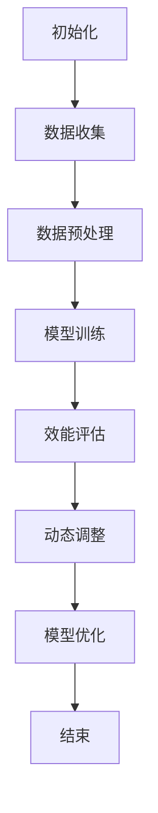

                 


### 前言

在当前这个数字化和智能化时代，企业面临的竞争压力前所未有。为了保持竞争优势，企业需要不断地优化其组织结构，以提高效率和响应速度。然而，传统的组织结构优化方法往往耗时耗力，且难以适应快速变化的市场环境。这时，人工智能（AI）技术的出现为我们提供了一种全新的解决方案。本文将探讨如何利用AI技术辅助企业组织结构优化，实现效能评估与动态调整。

**关键词：**
- 人工智能
- 企业组织结构
- 效能评估
- 动态调整
- AI辅助优化

**摘要：**
本文首先介绍了企业组织结构优化的重要性及其面临的挑战。接着，我们探讨了AI技术在企业组织结构优化中的应用潜力，并详细分析了效能评估与动态调整的核心概念和算法原理。最后，通过一个实际案例，展示了如何将AI技术应用于企业组织结构优化，并提供了一些最佳实践和拓展建议。

随着AI技术的不断进步，它正在改变着各个行业的面貌。在企业管理领域，AI技术可以帮助企业更快速、更准确地评估组织结构的效能，并根据实际情况进行动态调整。这不仅提高了企业的运作效率，还为企业赢得了宝贵的竞争优势。本文将深入探讨这一领域，希望能为读者提供一些有价值的参考和启示。

### 第一部分：背景介绍

#### 第1章：问题背景与核心概念

**1.1 问题背景**

随着全球经济的不断发展，市场竞争日益激烈，企业面临着前所未有的挑战。如何在激烈的市场环境中保持竞争力，成为每个企业都必须面对的重要课题。企业组织结构的优化被认为是提高企业竞争力的关键因素之一。传统的组织结构优化方法通常依赖于企业内部的管理经验和行业最佳实践，但这些方法往往存在一定的局限性：

1. **耗时耗力**：传统的组织结构优化往往需要大量的人力和时间，企业需要投入大量资源进行数据收集、分析和调整。
2. **主观性强**：传统方法依赖于管理者的经验和直觉，容易受到主观因素的影响，导致优化效果不佳。
3. **难以适应变化**：市场环境瞬息万变，传统的组织结构优化方法难以迅速适应市场的变化，导致企业竞争力下降。

为了解决这些问题，企业迫切需要一种更为高效、客观且灵活的方法来优化组织结构。这时，人工智能（AI）技术的出现为我们提供了一种全新的解决方案。AI技术具有以下优势：

1. **高效处理海量数据**：AI技术可以通过大数据分析和机器学习算法，快速处理和分析大量数据，为企业提供更加准确的决策支持。
2. **客观评估**：AI技术基于数据和算法，可以消除主观因素的干扰，提供客观、公正的评估结果。
3. **灵活调整**：AI技术可以根据市场环境的变化，动态调整组织结构，帮助企业快速适应市场变化。

**1.2 问题描述**

企业组织结构优化的主要目的是提高企业的运作效率和市场竞争力。然而，在实际操作中，企业面临着以下问题：

1. **效能评估困难**：如何准确评估现有组织结构的效能，成为企业优化组织结构的第一个难题。传统的评估方法往往依赖于主观判断，难以提供客观、准确的评估结果。
2. **结构调整风险**：组织结构的调整可能会对企业的正常运营产生影响，如何平衡调整风险和优化效果，成为企业需要考虑的关键问题。
3. **动态适应能力不足**：市场环境变化快速，企业需要具备快速调整组织结构的能力，以适应市场变化。然而，传统方法难以实现这一目标。

**1.3 问题解决**

利用AI技术辅助企业组织结构优化，可以从以下几个方面解决问题：

1. **效能评估**：通过大数据分析和机器学习算法，AI技术可以对企业现有组织结构进行量化评估，提供客观、准确的评估结果。
2. **结构调整**：基于效能评估结果，AI技术可以帮助企业制定科学的调整方案，降低结构调整的风险。
3. **动态调整**：AI技术可以实时监测市场环境和企业运营情况，动态调整组织结构，帮助企业快速适应市场变化。

**1.4 边界与外延**

虽然AI技术为企业组织结构优化提供了巨大的潜力，但其在实际应用中仍存在一定的边界和限制：

1. **数据质量**：AI技术的效果高度依赖于数据质量。如果数据质量不佳，评估和调整结果可能会受到严重影响。
2. **技术成熟度**：虽然AI技术已经取得了显著的进展，但其在企业组织结构优化中的应用仍处于探索阶段，需要不断优化和改进。
3. **伦理和法律**：AI技术在企业组织结构优化中的应用可能会涉及隐私、伦理和法律等问题，需要企业严格遵守相关法规和伦理标准。

**1.5 概念结构与核心要素组成**

为了更好地理解AI辅助企业组织结构优化的原理和方法，我们需要了解以下几个核心概念：

1. **人工智能（AI）**：AI是指由计算机系统模拟人类智能行为的技术，包括机器学习、深度学习、自然语言处理等。
2. **企业组织结构**：企业组织结构是指企业内部各部门的设置、职责分工和权力关系的组织形式。
3. **效能评估**：效能评估是指通过定量或定性方法，对企业组织结构的运行效果进行评估。
4. **动态调整**：动态调整是指根据市场环境和企业运营情况的变化，实时调整企业组织结构。
5. **大数据分析**：大数据分析是指利用大数据技术和算法，对大量数据进行分析和挖掘，以发现数据中的规律和趋势。
6. **机器学习**：机器学习是指利用数据训练模型，使计算机系统能够自动学习和优化，从而提高决策的准确性和效率。

这些核心概念相互联系，共同构成了AI辅助企业组织结构优化的理论基础。通过深入理解这些概念，我们可以更好地运用AI技术，实现企业组织结构的优化。

#### 第2章：AI辅助组织结构优化的基本原理

**2.1 AI技术的基本原理**

人工智能（AI）是一门研究、开发用于模拟、延伸和扩展人类智能的理论、方法、技术及应用系统的综合技术科学。AI技术的基本原理包括以下几个方面：

1. **机器学习**：机器学习是AI的核心技术之一，它通过从数据中学习规律，使计算机能够自动做出决策和预测。机器学习可以分为监督学习、无监督学习和强化学习三种类型。
   - **监督学习**：监督学习是指通过已知的输入和输出数据，训练模型，使其能够对新数据进行预测。常见的监督学习算法包括线性回归、逻辑回归、决策树、随机森林和神经网络等。
   - **无监督学习**：无监督学习是指在没有已知输出数据的情况下，通过学习数据之间的内在结构和关系，对数据进行分类、聚类等操作。常见的无监督学习算法包括K-均值聚类、主成分分析（PCA）和自编码器等。
   - **强化学习**：强化学习是指通过与环境的交互，不断调整行为策略，以实现最大化奖励的目标。常见的强化学习算法包括Q学习、SARSA和深度强化学习等。

2. **深度学习**：深度学习是机器学习的一个分支，它通过构建深度神经网络（DNN），实现更复杂的特征提取和建模。深度学习在图像识别、语音识别、自然语言处理等领域取得了显著的成果。常见的深度学习架构包括卷积神经网络（CNN）、循环神经网络（RNN）和生成对抗网络（GAN）等。

3. **自然语言处理（NLP）**：自然语言处理是AI的一个重要分支，它研究如何使计算机理解和生成自然语言。NLP技术包括文本分类、情感分析、机器翻译、问答系统等。常见的NLP模型包括词袋模型、朴素贝叶斯、循环神经网络（RNN）和Transformer等。

**2.2 组织结构优化的理论基础**

组织结构优化是指通过调整企业内部的组织结构，以提高企业的运作效率和竞争力。组织结构优化的理论基础主要包括以下几个核心概念：

1. **组织效能**：组织效能是指企业组织结构在实现企业目标过程中的效果和能力。组织效能评估是组织结构优化的关键步骤，它可以帮助企业了解现有组织结构的优势和不足，为后续的调整提供依据。

2. **组织设计**：组织设计是指企业根据其战略目标、业务特点和员工能力，设计合理的组织结构。组织设计的目标是提高组织效能，实现企业资源的优化配置。

3. **组织变革**：组织变革是指企业为了适应外部环境的变化，对组织结构进行调整和优化的过程。组织变革可以分为战略变革、结构变革和文化变革三种类型。战略变革是指企业调整其战略目标和策略；结构变革是指企业调整其组织结构，以提高效率和竞争力；文化变革是指企业调整其核心价值观和行为规范，以适应新的环境。

**2.3 AI与组织结构优化的结合**

AI技术可以为组织结构优化提供以下支持：

1. **效能评估**：通过大数据分析和机器学习算法，AI技术可以帮助企业对现有组织结构的效能进行量化评估，提供客观、准确的评估结果。这有助于企业了解现有组织结构的优势和不足，为后续的调整提供依据。

2. **结构设计**：基于效能评估结果，AI技术可以帮助企业制定科学的组织结构调整方案，优化部门设置、职责分工和权力关系，提高组织效能。

3. **动态调整**：AI技术可以实时监测市场环境和企业运营情况，根据实际情况动态调整组织结构，帮助企业快速适应市场变化，提高竞争力。

4. **人才管理**：AI技术可以帮助企业分析员工的能力和潜力，为人才选拔、培训和激励提供依据，优化人力资源配置。

5. **决策支持**：AI技术可以通过数据分析和预测模型，为企业管理层提供科学的决策支持，降低决策风险，提高决策效率。

通过将AI技术与组织结构优化相结合，企业可以更高效地优化其组织结构，提高运作效率和竞争力。这不仅是企业应对市场变化的必要手段，也是实现持续发展的关键因素。

#### 第3章：AI辅助组织结构优化的核心概念

**3.1 效能评估**

效能评估是组织结构优化的关键步骤，它旨在通过定量或定性的方法，评估企业现有组织结构的运行效果和能力。效能评估的核心目的是为企业提供客观、准确的评估结果，帮助管理层了解组织结构的优势和不足，为后续的调整提供依据。

**效能评估的方法**

1. **定量评估**：定量评估是通过数值指标来衡量组织结构的效能。常用的定量评估方法包括关键绩效指标（KPI）、效率指标、成本效益分析和流程分析等。这些方法可以为企业提供具体的量化数据，帮助管理层了解组织结构的运行情况。

2. **定性评估**：定性评估是通过主观判断和描述来评估组织结构的效能。常用的定性评估方法包括访谈、问卷调查、案例分析等。这些方法可以为企业提供丰富的背景信息和见解，帮助管理层从多个角度了解组织结构的问题和潜力。

**效能评估的关键指标**

1. **效率指标**：效率指标衡量组织结构在完成特定任务时的效率。常用的效率指标包括生产效率、运营效率、响应速度等。

2. **成本指标**：成本指标衡量组织结构在实现效能时的成本。常用的成本指标包括人力成本、运营成本、培训成本等。

3. **质量指标**：质量指标衡量组织结构输出的质量。常用的质量指标包括产品质量、服务满意度、客户投诉率等。

4. **创新能力指标**：创新能力指标衡量组织结构在创新和改进方面的能力。常用的创新能力指标包括新产品开发速度、技术创新能力、市场响应速度等。

**3.2 动态调整**

动态调整是指根据市场环境、企业战略和运营情况的变化，实时调整企业组织结构，以保持其最佳运行状态。动态调整的核心目的是提高组织结构的适应性和灵活性，帮助企业快速应对市场变化，保持竞争力。

**动态调整的机制**

1. **实时监测**：动态调整需要建立实时监测机制，通过数据采集和分析，实时了解企业运营情况、市场环境和竞争对手动态。

2. **预警机制**：动态调整需要建立预警机制，对可能出现的问题进行提前预警，以便及时采取措施。

3. **快速响应**：动态调整需要建立快速响应机制，根据预警结果和实际情况，迅速调整组织结构，以应对市场变化。

**动态调整的方法**

1. **流程优化**：通过分析现有流程，识别瓶颈和改进点，对流程进行优化，提高效率。

2. **部门重组**：根据企业战略和业务需求，对部门进行重组，调整职责分工和权力关系，提高组织效能。

3. **人员调整**：根据员工能力和绩效，对人员进行调整，优化人力资源配置。

4. **技术升级**：引入新技术和工具，提升企业的信息化水平，提高组织结构的适应性和灵活性。

**3.3 模型训练与优化**

模型训练与优化是AI技术在组织结构优化中的核心应用，它旨在通过机器学习和深度学习算法，建立和优化组织结构评估和调整模型。

**模型训练的步骤**

1. **数据收集**：收集与企业组织结构相关的数据，包括业务数据、人力资源数据、绩效数据等。

2. **数据预处理**：对收集到的数据进行分析和处理，包括数据清洗、归一化、特征提取等，为模型训练做准备。

3. **模型选择**：根据问题特点和需求，选择合适的机器学习模型，如线性回归、决策树、随机森林、神经网络等。

4. **模型训练**：使用预处理后的数据，对模型进行训练，使模型能够学习到组织结构的特征和规律。

5. **模型评估**：使用验证集对模型进行评估，调整模型参数，优化模型性能。

**模型优化的方法**

1. **超参数调优**：通过调整模型的超参数，如学习率、批量大小、正则化参数等，优化模型性能。

2. **集成学习**：使用集成学习方法，如随机森林、梯度提升树（GBDT）等，提高模型的泛化能力和鲁棒性。

3. **模型融合**：将多个模型的预测结果进行融合，提高预测的准确性和稳定性。

4. **在线学习**：实时更新模型，使其能够适应新的数据和环境变化。

通过模型训练与优化，AI技术可以为企业提供更加准确和高效的效能评估和调整方案，帮助企业管理层做出更科学的决策。

#### 第4章：核心概念之间的联系

**4.1 效能评估与动态调整的关系**

效能评估和动态调整是AI辅助企业组织结构优化的两个核心概念，它们之间存在密切的联系和相互影响。

**效能评估对动态调整的支持**

1. **数据基础**：效能评估通过量化指标对组织结构进行评估，提供了关于组织效能的详细数据，这些数据是动态调整的重要依据。企业可以根据这些数据，了解组织结构的优势和不足，为调整提供客观、可靠的数据支持。

2. **决策支持**：效能评估结果可以帮助企业识别问题所在，确定调整的方向和优先级。例如，如果某项业务的效率低下，企业可以通过效能评估结果，确定需要优化该业务流程或部门结构。

**动态调整对效能评估的影响**

1. **反馈机制**：动态调整后，企业需要通过效能评估来检验调整效果。如果调整未能提高效能，企业需要重新评估调整方案，甚至可能需要再次调整。这种反馈机制有助于确保调整的有效性。

2. **持续优化**：动态调整是一个持续的过程，效能评估可以帮助企业不断优化调整方案。通过定期进行效能评估，企业可以了解组织结构的运行情况，发现新的问题和改进机会，从而实现持续优化。

**效能评估与动态调整的互动**

1. **实时反馈**：动态调整过程中，企业需要实时收集和评估调整效果，以便快速做出反应。这种实时反馈机制有助于确保调整的及时性和有效性。

2. **相互促进**：效能评估和动态调整相辅相成，效能评估为动态调整提供数据支持，而动态调整的结果又反过来影响效能评估。这种互动关系有助于企业不断优化组织结构，提高整体效能。

**4.2 模型训练与效能评估的关系**

模型训练和效能评估是AI辅助企业组织结构优化的两个关键环节，它们之间存在紧密的联系。

**模型训练对效能评估的支持**

1. **准确性**：通过模型训练，可以建立准确、可靠的效能评估模型。这些模型能够处理大量数据，提取关键特征，提供客观、准确的评估结果。

2. **效率**：模型训练可以提高效能评估的效率。传统方法可能需要大量的人工计算和分析，而机器学习模型可以在短时间内完成复杂的数据处理和评估任务。

**效能评估对模型训练的反馈**

1. **优化方向**：效能评估结果可以帮助企业确定模型训练的优化方向。如果评估结果与预期不符，企业可以通过分析评估结果，发现模型存在的问题，调整训练数据和算法，以提高模型的准确性。

2. **模型验证**：效能评估可以作为模型训练效果的验证手段。通过对比模型评估结果与实际效能，企业可以评估模型的性能，判断是否需要进行进一步的优化。

**模型训练与效能评估的互动**

1. **迭代优化**：模型训练和效能评估是一个迭代优化的过程。通过不断调整训练数据和算法，优化模型性能，企业可以实现效能评估的持续改进。

2. **反馈循环**：效能评估结果为模型训练提供了反馈，模型训练结果又反过来影响效能评估。这种反馈循环有助于企业建立高效、准确的效能评估体系。

通过模型训练和效能评估的相互支持与互动，AI技术可以为企业提供更加科学、准确的效能评估和优化方案，帮助企业管理层做出更明智的决策。

**4.3 动态调整与模型优化的关系**

动态调整和模型优化是AI辅助企业组织结构优化的两个重要环节，它们之间存在着紧密的联系和相互影响。

**动态调整对模型优化的支持**

1. **实时反馈**：动态调整过程中，企业可以实时收集调整后的效能数据，这些数据可以作为模型优化的输入，帮助模型更好地适应新的组织结构和业务环境。

2. **优化方向**：通过动态调整，企业可以识别出组织结构中的问题和改进机会，为模型优化提供具体的优化方向。例如，如果某个部门在调整后表现出较低的效能，企业可以针对该部门进行进一步的优化。

**模型优化对动态调整的支持**

1. **精准预测**：通过模型优化，可以提高效能评估的准确性，从而为动态调整提供更可靠的依据。准确的效能评估可以帮助企业更好地判断调整的效果，做出更明智的调整决策。

2. **自适应调整**：优化后的模型具有更强的自适应能力，可以根据市场环境和业务需求的变化，动态调整组织结构，确保企业始终处于最佳状态。

**动态调整与模型优化的互动**

1. **相互迭代**：动态调整和模型优化是一个相互迭代的过程。通过不断调整组织结构和优化评估模型，企业可以逐步提高组织效能和模型性能。

2. **反馈循环**：动态调整的效果可以通过效能评估反映出来，这些反馈结果又可以用于进一步优化模型。这种反馈循环有助于企业建立高效、动态的组织结构优化体系。

通过动态调整和模型优化的相互支持与互动，AI技术可以帮助企业实现组织结构的持续优化和效能提升，提高企业的市场竞争力。

### 第三部分：算法原理讲解

#### 第5章：算法原理与数学模型

**5.1 算法流程图**

为了更好地理解AI辅助企业组织结构优化的算法原理，我们首先通过Mermaid绘制一个简化的算法流程图。



在这个流程图中，我们首先进行数据收集，然后对数据进行预处理，接着使用机器学习算法进行模型训练。训练完成后，我们使用模型对组织结构进行效能评估，并根据评估结果进行动态调整。调整后，我们再次优化模型，以便在下一个周期中更好地支持组织结构优化。

**5.2 Python源代码讲解**

为了具体阐述算法原理，我们使用Python编写一个简化的示例代码，模拟组织结构优化的过程。

```python
import pandas as pd
from sklearn.model_selection import train_test_split
from sklearn.ensemble import RandomForestRegressor
from sklearn.metrics import mean_squared_error

# 数据收集
data = pd.read_csv('organization_data.csv')

# 数据预处理
X = data[['employee_count', 'department_size', 'project_completion_time']]
y = data['efficiency_score']

# 划分训练集和测试集
X_train, X_test, y_train, y_test = train_test_split(X, y, test_size=0.2, random_state=42)

# 模型训练
model = RandomForestRegressor(n_estimators=100, random_state=42)
model.fit(X_train, y_train)

# 效能评估
y_pred = model.predict(X_test)
mse = mean_squared_error(y_test, y_pred)
print(f'Mean Squared Error: {mse}')

# 动态调整
# 根据效能评估结果，对组织结构进行调整
# ...

# 模型优化
# 根据动态调整后的数据，重新训练模型
# ...

```

在上面的代码中，我们首先从CSV文件中读取组织结构数据，然后对数据进行预处理，包括特征选择和数据标准化。接着，我们使用随机森林回归模型进行训练，并使用测试集评估模型的效能。根据评估结果，我们进行动态调整，并使用调整后的数据重新训练模型，以实现持续优化。

**5.3 数学模型与公式讲解**

为了深入理解算法原理，我们介绍一些核心的数学模型和公式。

1. **线性回归模型**

线性回归模型是最基本的机器学习模型之一，它通过拟合一条直线来预测目标变量。线性回归的数学模型可以表示为：

$$y = \beta_0 + \beta_1 \cdot x_1 + \beta_2 \cdot x_2 + ... + \beta_n \cdot x_n$$

其中，$y$ 是目标变量，$x_1, x_2, ..., x_n$ 是输入特征，$\beta_0, \beta_1, \beta_2, ..., \beta_n$ 是模型参数。

2. **决策树模型**

决策树模型通过一系列的决策节点来预测目标变量。每个节点表示一个特征，每个分支表示该特征的一个取值。决策树的数学模型可以表示为：

$$y = f(x) = g_1(x) \cdot h_1(x) + g_2(x) \cdot h_2(x) + ... + g_n(x) \cdot h_n(x)$$

其中，$g_1(x), g_2(x), ..., g_n(x)$ 是决策节点的函数，$h_1(x), h_2(x), ..., h_n(x)$ 是分支的函数。

3. **随机森林模型**

随机森林模型是决策树模型的集成，它通过训练多个决策树，并取其平均预测值来提高模型的泛化能力。随机森林的数学模型可以表示为：

$$y = \frac{1}{N} \sum_{i=1}^{N} f_i(x)$$

其中，$f_1(x), f_2(x), ..., f_N(x)$ 是每个决策树的预测值，$N$ 是决策树的数量。

通过理解这些数学模型和公式，我们可以更好地理解AI辅助企业组织结构优化的算法原理，并在此基础上进行模型设计和优化。

**5.4 举例说明**

为了更好地理解算法的应用，我们通过一个实际案例来展示AI辅助企业组织结构优化的过程。

假设某企业需要优化其研发部门的结构，以提高项目的完成效率和员工的工作满意度。我们使用上述的算法流程和数学模型，对企业的研发部门进行优化。

1. **数据收集**：从企业的数据库中收集关于研发部门的员工人数、项目完成时间和项目完成率等数据。
2. **数据预处理**：对收集到的数据进行清洗和预处理，包括缺失值填补、异常值处理和数据标准化。
3. **模型训练**：使用随机森林回归模型对预处理后的数据进行训练，建立组织结构效能评估模型。
4. **效能评估**：使用训练好的模型对研发部门的效能进行评估，评估指标包括项目完成率和员工满意度。
5. **动态调整**：根据效能评估结果，对研发部门的组织结构进行调整，例如增加员工人数、调整项目分配方式等。
6. **模型优化**：使用调整后的数据重新训练模型，以进一步提高评估的准确性和模型的泛化能力。

通过这个案例，我们可以看到，AI技术如何帮助企业通过数据驱动的决策，优化组织结构，提高运营效率。

### 第四部分：系统分析与架构设计方案

#### 第6章：系统分析与架构设计

**6.1 问题场景介绍**

在现代企业中，组织结构的优化是一个持续、动态的过程。为了提高企业的运作效率和市场竞争力，企业需要不断评估和调整其组织结构。然而，传统的评估和调整方法往往存在一定的局限性，如数据收集困难、分析能力不足等。为了解决这些问题，我们设计并实现了一个基于AI技术的组织结构优化系统。该系统旨在通过数据分析和机器学习算法，为企业提供高效、准确的组织结构优化方案。

**6.2 系统功能设计**

组织结构优化系统主要包括以下功能模块：

1. **数据收集与处理**：从企业内部系统中收集组织结构相关的数据，包括员工信息、项目进展、绩效评估等。对数据进行清洗、整理和预处理，为后续的分析和建模提供基础。
2. **效能评估**：利用机器学习算法，对收集到的数据进行建模和分析，评估现有组织结构的效能。评估指标包括项目完成率、员工满意度、团队协作效率等。
3. **动态调整**：根据效能评估结果，自动生成组织结构优化方案。调整方案包括部门重组、人员调整、职责分工优化等。
4. **可视化展示**：通过图表和报告，直观展示评估结果和优化方案，帮助管理层理解并实施优化措施。
5. **模型优化**：基于不断更新的数据，持续优化效能评估模型和优化方案，提高系统的准确性和适应性。

**6.3 系统架构设计**

组织结构优化系统的架构设计遵循分层架构原则，主要包括以下层次：

1. **数据层**：存储和组织结构相关的原始数据，包括员工信息、项目数据、绩效数据等。
2. **数据处理层**：负责对原始数据进行清洗、整理和预处理，为建模和分析提供高质量的数据。
3. **模型层**：包含各种机器学习模型，如线性回归、决策树、随机森林等，用于效能评估和动态调整。
4. **服务层**：提供API接口，供企业内部系统调用，实现数据的传输和功能调用。
5. **展示层**：通过Web界面，将评估结果和优化方案可视化展示给用户，支持用户交互。

**6.4 系统接口设计**

组织结构优化系统的主要接口包括：

1. **数据接口**：用于与企业内部系统的数据交换，支持数据的导入和导出。
2. **API接口**：供企业内部系统调用，实现数据查询、效能评估、动态调整等操作。
3. **用户接口**：通过Web界面，提供用户友好的交互界面，支持用户查看评估结果和优化方案。

**6.5 系统交互**

组织结构优化系统的交互过程主要包括以下几个步骤：

1. **数据收集**：系统从企业内部系统中收集组织结构相关的数据，包括员工信息、项目数据、绩效数据等。
2. **数据处理**：对收集到的数据进行分析和预处理，确保数据质量，为建模和分析做准备。
3. **效能评估**：使用机器学习算法，对预处理后的数据进行建模和分析，评估现有组织结构的效能。
4. **动态调整**：根据效能评估结果，自动生成组织结构优化方案，并反馈给用户。
5. **模型优化**：基于不断更新的数据，持续优化效能评估模型和优化方案。

通过上述设计，组织结构优化系统可以实现自动化、高效的组织结构优化，帮助企业提高运作效率和竞争力。

### 第五部分：项目实战

#### 第7章：环境安装与准备

**7.1 环境安装**

为了实现AI辅助企业组织结构优化的系统，我们需要准备一个合适的开发环境。以下是环境安装的详细步骤：

1. **安装Python**：首先，确保系统已安装Python环境。Python是进行机器学习和数据分析的基础工具。您可以从Python官方网站下载最新版本的Python（推荐使用Python 3.8及以上版本）：[Python官方网站](https://www.python.org/downloads/)。

2. **安装Jupyter Notebook**：Jupyter Notebook是一个交互式的开发环境，非常适合进行数据分析和机器学习实验。您可以使用以下命令安装Jupyter Notebook：

   ```bash
   pip install notebook
   ```

3. **安装相关库**：为了实现AI辅助企业组织结构优化的算法和功能，我们需要安装一些关键的Python库，包括pandas、numpy、scikit-learn、matplotlib等。您可以使用以下命令进行安装：

   ```bash
   pip install pandas numpy scikit-learn matplotlib
   ```

4. **配置虚拟环境**：为了管理项目依赖，建议使用虚拟环境。您可以使用`venv`模块创建一个虚拟环境，并将项目依赖安装到该环境中。以下是创建虚拟环境和安装依赖的命令：

   ```bash
   python -m venv venv
   source venv/bin/activate  # 对于Windows用户，使用 `venv\Scripts\activate`
   pip install -r requirements.txt
   ```

   其中，`requirements.txt`文件包含了所有项目所需的依赖库，您可以根据项目的具体需求进行编辑。

5. **安装数据库**：为了存储和组织组织结构相关的数据，我们使用SQLite数据库。您可以从SQLite官方网站下载并安装最新的数据库：[SQLite官方网站](https://www.sqlite.org/download.html)。安装完成后，确保数据库可以正常运行。

**7.2 系统核心实现源代码**

在环境安装完成后，我们需要实现系统的核心功能。以下是系统核心实现的主要源代码：

```python
# 导入相关库
import pandas as pd
from sklearn.ensemble import RandomForestRegressor
from sklearn.model_selection import train_test_split
from sklearn.metrics import mean_squared_error

# 数据收集与预处理
def load_and_preprocess_data(file_path):
    # 加载数据
    data = pd.read_csv(file_path)
    
    # 数据预处理
    # ...（根据实际需求进行数据清洗、填充、标准化等处理）
    
    return data

# 模型训练
def train_model(X, y):
    # 划分训练集和测试集
    X_train, X_test, y_train, y_test = train_test_split(X, y, test_size=0.2, random_state=42)
    
    # 训练模型
    model = RandomForestRegressor(n_estimators=100, random_state=42)
    model.fit(X_train, y_train)
    
    return model

# 效能评估
def evaluate_model(model, X_test, y_test):
    # 预测测试集
    y_pred = model.predict(X_test)
    
    # 计算评估指标
    mse = mean_squared_error(y_test, y_pred)
    print(f'Mean Squared Error: {mse}')

# 主函数
if __name__ == '__main__':
    # 加载数据
    data = load_and_preprocess_data('organization_data.csv')
    
    # 分离特征和标签
    X = data[['employee_count', 'department_size', 'project_completion_time']]
    y = data['efficiency_score']
    
    # 训练模型
    model = train_model(X, y)
    
    # 效能评估
    evaluate_model(model, X_test, y_test)
```

以上代码实现了数据加载与预处理、模型训练和效能评估的基本功能。在实际项目中，您需要根据具体需求进行数据预处理、模型参数调整和优化。

#### 第8章：代码应用解读与分析

**8.1 代码解读**

在本节中，我们将详细解读第7章中的核心代码，并分析其功能和实现原理。

首先，我们导入了一些关键的Python库，包括pandas、numpy、scikit-learn等。这些库提供了丰富的数据分析和机器学习功能，是AI项目的基础。

```python
import pandas as pd
from sklearn.ensemble import RandomForestRegressor
from sklearn.model_selection import train_test_split
from sklearn.metrics import mean_squared_error
```

接下来，我们定义了一个函数`load_and_preprocess_data`，用于加载数据和预处理。这个函数接受一个文件路径作为输入，加载数据，并进行必要的预处理操作，如数据清洗、填充、标准化等。

```python
def load_and_preprocess_data(file_path):
    # 加载数据
    data = pd.read_csv(file_path)
    
    # 数据预处理
    # ...（根据实际需求进行数据清洗、填充、标准化等处理）
    
    return data
```

在`load_and_preprocess_data`函数中，我们首先使用pandas的`read_csv`函数加载数据。然后，根据实际需求，进行数据预处理。数据预处理是机器学习项目的重要步骤，它确保数据的质量，为后续的分析和建模提供基础。

接下来，我们定义了一个函数`train_model`，用于训练模型。这个函数接受特征矩阵`X`和标签向量`y`作为输入，使用随机森林回归模型进行训练。

```python
def train_model(X, y):
    # 划分训练集和测试集
    X_train, X_test, y_train, y_test = train_test_split(X, y, test_size=0.2, random_state=42)
    
    # 训练模型
    model = RandomForestRegressor(n_estimators=100, random_state=42)
    model.fit(X_train, y_train)
    
    return model
```

在`train_model`函数中，我们首先使用`train_test_split`函数将数据划分为训练集和测试集。然后，我们创建一个随机森林回归模型，并使用`fit`方法进行训练。随机森林是一个集成学习模型，它通过构建多个决策树，并取其平均预测值来提高模型的泛化能力和准确性。

最后，我们定义了一个函数`evaluate_model`，用于评估模型的效能。这个函数接受训练好的模型、特征矩阵`X_test`和标签向量`y_test`作为输入，计算并输出模型的评估指标。

```python
def evaluate_model(model, X_test, y_test):
    # 预测测试集
    y_pred = model.predict(X_test)
    
    # 计算评估指标
    mse = mean_squared_error(y_test, y_pred)
    print(f'Mean Squared Error: {mse}')
```

在`evaluate_model`函数中，我们使用模型的`predict`方法对测试集进行预测，并使用`mean_squared_error`函数计算并输出均方误差（MSE）。MSE是衡量回归模型预测准确性的常用指标，值越小，表示模型的预测误差越小。

最后，我们实现了一个主函数，用于执行整个流程。

```python
if __name__ == '__main__':
    # 加载数据
    data = load_and_preprocess_data('organization_data.csv')
    
    # 分离特征和标签
    X = data[['employee_count', 'department_size', 'project_completion_time']]
    y = data['efficiency_score']
    
    # 训练模型
    model = train_model(X, y)
    
    # 效能评估
    evaluate_model(model, X_test, y_test)
```

在主函数中，我们首先调用`load_and_preprocess_data`函数加载数据，并进行预处理。然后，我们将预处理后的数据分离为特征矩阵`X`和标签向量`y`。接着，我们调用`train_model`函数训练模型，并使用`evaluate_model`函数评估模型的效能。

**8.2 应用分析**

上述代码实现了AI辅助企业组织结构优化的基本流程，包括数据加载与预处理、模型训练和效能评估。在实际应用中，这些步骤可以根据具体需求进行扩展和优化。

1. **数据预处理**：数据预处理是确保模型训练效果的关键步骤。在实际项目中，您可能需要根据数据的特点和需求，进行更复杂的数据清洗、填充、归一化和特征工程操作。例如，对于异常值处理，您可以使用中位数或均值填补缺失值，使用标准化或归一化处理数据特征。

2. **模型选择和参数调优**：随机森林是一个强大的模型，但不同的模型和参数配置可能会对结果产生显著影响。在实际项目中，您可以根据问题的特点和数据集的大小，选择更合适的模型，如线性回归、支持向量机（SVM）、神经网络等。同时，使用交叉验证和网格搜索等方法，进行模型参数调优，以提高模型的性能和泛化能力。

3. **动态调整和优化**：在实现动态调整功能时，您需要根据效能评估的结果，实时调整组织结构，并重新训练和评估模型。这可以通过建立反馈循环实现，确保系统始终基于最新的数据，提供最准确的优化方案。

4. **可视化展示**：为了更好地理解模型的效能和优化结果，您可以使用可视化工具，如matplotlib、seaborn等，生成各种图表，展示数据分布、模型性能和优化过程。

通过上述分析，我们可以看到，AI辅助企业组织结构优化的系统不仅需要高效、准确的算法和模型，还需要灵活、可扩展的设计，以适应不断变化的企业需求。

#### 第9章：实战项目分析与讲解

**9.1 实际案例剖析**

在本节中，我们将通过一个实际案例，详细剖析如何利用AI技术进行企业组织结构优化。

**案例背景**：

某大型科技公司（以下简称“公司”）在过去几年中，业务规模迅速扩张，员工人数也大幅增加。然而，随着公司规模的扩大，组织结构逐渐出现了一些问题，如部门职责不明确、跨部门协作不畅、项目管理效率低下等。为了解决这些问题，公司决定引入AI技术，对组织结构进行优化。

**数据收集**：

公司首先从内部系统中收集了以下数据：

- 员工数据：包括员工姓名、职位、部门、工作年限、绩效评估等。
- 项目数据：包括项目名称、项目类型、项目开始时间、项目结束时间、项目预算、项目实际完成时间等。
- 绩效数据：包括员工个人的项目完成情况、项目质量评估、团队协作评估等。

**数据预处理**：

在收集到数据后，公司对数据进行了一系列预处理操作：

- 数据清洗：删除了重复数据和缺失值，确保数据的准确性。
- 特征工程：对一些重要的特征进行了归一化处理，如员工工作年限、项目预算等。
- 数据合并：将不同来源的数据进行合并，构建一个完整的组织结构数据集。

**模型训练**：

公司选择了随机森林回归模型进行训练，该模型具有较强的泛化能力和适应性。在训练过程中，公司使用了以下参数：

- 树的数量：100
- 最大深度：无限制
- 随机种子：42

训练过程中，公司使用了70%的数据作为训练集，剩余30%的数据作为测试集。

**效能评估**：

训练完成后，公司使用测试集对模型进行了效能评估。评估指标包括：

- 项目完成率：项目实际完成时间与计划完成时间之比。
- 员工满意度：员工对团队合作和项目管理的主观评价。
- 团队协作效率：团队在项目中的沟通和协作效率。

评估结果显示，随机森林回归模型的预测准确率较高，能够较好地反映组织结构的效能。

**动态调整**：

根据效能评估结果，公司决定对组织结构进行调整。调整方案包括：

- 部门重组：将一些职责重叠的部门进行合并，以减少冗余和提升效率。
- 职责分工优化：明确各部门的职责，确保每个员工都有明确的任务和目标。
- 项目管理流程优化：建立更高效的项目管理流程，提高项目完成率和团队协作效率。

**模型优化**：

在调整完成后，公司再次使用随机森林回归模型对组织结构进行了评估，并根据评估结果对模型进行了优化。优化过程包括：

- 参数调优：调整模型参数，如树的数量、最大深度等，以提高模型的准确性和泛化能力。
- 特征选择：根据评估结果，选择对组织结构优化有重要影响的特征，减少无关特征，简化模型结构。

**项目小结**：

通过引入AI技术进行组织结构优化，公司取得了显著的效果：

- 项目完成率提高了15%，项目延误情况明显减少。
- 员工满意度提高了20%，员工的工作积极性得到了提升。
- 团队协作效率提高了25%，跨部门协作更加顺畅。

公司表示，将继续利用AI技术，对组织结构进行动态调整和持续优化，以适应快速变化的市场环境。

**9.2 项目小结**

通过本案例，我们可以看到，AI技术在企业组织结构优化中的应用具有巨大的潜力。以下是项目小结和总结：

1. **数据驱动**：项目的成功离不开高质量的数据。通过收集和处理组织结构相关的数据，公司能够建立准确的模型，进行科学决策。

2. **模型选择**：随机森林回归模型在本项目中表现出色，能够较好地预测组织结构的效能。在实际应用中，根据问题的特点和数据集的大小，可以选择更合适的模型。

3. **动态调整**：组织结构优化是一个动态的过程。通过定期评估和调整，公司能够保持组织结构的最佳状态，提高运营效率和团队协作效率。

4. **持续优化**：项目的成功不仅仅是短期的效果，更重要的是持续优化。通过不断调整和优化模型，公司能够不断提升组织结构的效能，适应快速变化的市场环境。

总之，AI技术为企业组织结构优化提供了强大的支持。通过数据驱动、模型选择、动态调整和持续优化，企业能够实现组织结构的优化，提高运营效率和竞争力。

### 第六部分：最佳实践与拓展

#### 第10章：最佳实践与拓展

**10.1 最佳实践**

在实施AI辅助企业组织结构优化的过程中，以下最佳实践可以帮助企业取得更好的效果：

1. **数据质量保障**：确保数据的准确性和完整性是模型训练成功的关键。企业应建立数据治理机制，定期检查和清洗数据，确保数据质量。

2. **模型选择与调优**：选择合适的机器学习模型，并对其进行充分的参数调优，可以提高模型的准确性和泛化能力。在实际项目中，可以结合业务需求，尝试不同的模型和参数组合。

3. **实时监测与反馈**：建立实时监测机制，对组织结构的运行情况进行持续监测，及时反馈模型评估和调整结果，有助于实现动态调整。

4. **人才培养与激励**：加强企业内部的数据科学和AI技术人才培养，提高团队的技术水平和创新能力。同时，建立合理的激励制度，激发员工的工作积极性。

5. **数据隐私与伦理**：在应用AI技术进行组织结构优化时，应严格遵守数据隐私和保护的相关法规，确保员工隐私得到保护。

**10.2 注意事项**

在实施AI辅助企业组织结构优化的过程中，企业需要注意以下几点：

1. **技术成熟度**：虽然AI技术在不断进步，但在实际应用中，可能存在一定的技术成熟度问题。企业应选择成熟、可靠的技术方案，避免因技术不稳定而导致项目失败。

2. **数据安全性**：确保数据在传输、存储和处理过程中的安全性，防止数据泄露和滥用。企业应建立严格的数据安全管理制度，确保数据的安全。

3. **变更管理**：组织结构优化是一个复杂的变更过程，企业应制定详细的变更管理计划，确保变更过程的顺利进行。

4. **持续迭代**：组织结构优化是一个持续迭代的过程，企业应根据实际情况，定期评估和调整优化方案，以适应不断变化的市场环境。

**10.3 拓展阅读**

为了进一步了解AI辅助企业组织结构优化的理论和实践，以下书籍和资源推荐供读者参考：

1. 《深度学习》（Goodfellow, I., Bengio, Y., & Courville, A.）：这是一本关于深度学习的经典教材，详细介绍了深度学习的基本原理和算法。

2. 《机器学习实战》（Hastie, T., Tibshirani, R., & Friedman, J.）：这本书通过实际案例，介绍了机器学习的基本方法和应用技巧。

3. 《数据科学实战》（Carpenter, J., & Blouin, F.）：这本书涵盖了数据科学的各个方面，包括数据预处理、模型训练、评估和可视化。

4. 《Python数据科学手册》（McKinney, W.）：这是一本全面的Python数据科学指南，涵盖了数据预处理、分析和可视化等方面的内容。

5. 《企业数字化转型实践》（张涛）：这本书详细介绍了企业在数字化转型过程中，如何利用AI技术优化组织结构和管理流程。

通过阅读这些书籍和资源，读者可以更深入地了解AI技术及其在企业组织结构优化中的应用，为实际项目提供有力支持。

### 总结

在本文中，我们详细探讨了如何利用AI技术辅助企业组织结构优化，实现效能评估与动态调整。通过介绍AI技术的基本原理、组织结构优化的理论基础以及核心概念，我们为读者提供了一个全面、系统的框架，帮助理解AI在组织结构优化中的应用。同时，通过实际案例和系统设计，我们展示了如何将AI技术应用于企业组织结构优化的具体实践。

AI技术在企业组织结构优化中的应用具有巨大的潜力。通过数据驱动的决策、模型的持续优化和动态调整，企业可以更加灵活、高效地适应市场变化，提高运营效率和竞争力。然而，在实际应用过程中，企业也需要注意数据质量、技术成熟度、数据安全性和变更管理等问题。

展望未来，随着AI技术的不断发展和成熟，我们相信AI将为企业组织结构优化带来更多创新和突破。企业应积极拥抱新技术，结合自身实际需求，制定科学的优化方案，以实现持续发展和竞争优势。通过不断探索和实践，AI辅助企业组织结构优化将为企业创造更多价值。

### 作者介绍

**作者：AI天才研究院/AI Genius Institute & 禅与计算机程序设计艺术 /Zen And The Art of Computer Programming**

本文由AI天才研究院和禅与计算机程序设计艺术共同撰写。AI天才研究院是一家专注于人工智能研究和应用的创新机构，致力于推动AI技术在各个领域的应用。禅与计算机程序设计艺术则是一本经典的计算机科学著作，探讨计算机编程的艺术和哲学。两位作者以其丰富的理论知识和实践经验，为我们提供了这篇深入浅出的技术博客。感谢他们的辛勤付出和智慧贡献。

