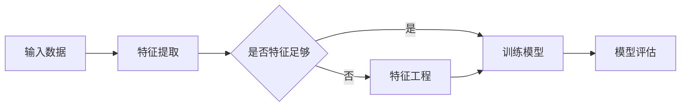
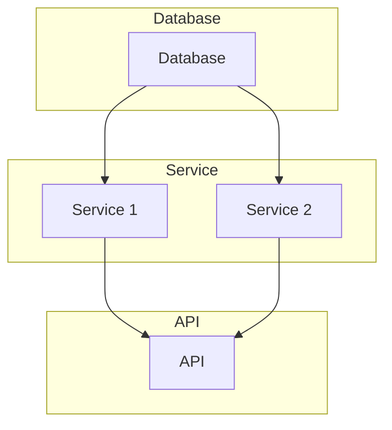
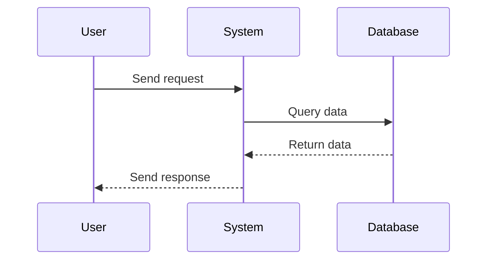

                 


## AI-Assisted Corporate Financial Analysis: Anomaly Detection and Intelligent Financial Forecasting

关键词：人工智能、财务分析、异常检测、智能预测、商业决策

摘要：随着大数据和人工智能技术的不断发展，AI辅助企业财务分析成为提升企业竞争力的关键。本文从异常检测和智能财务预测两个方面，探讨AI在企业财务分析中的应用，为企业决策提供数据支持。

## 引言与背景

### 1.1 问题背景

在当今商业环境中，企业面临着日益复杂的市场环境和不断变化的经济形势。传统的财务分析方法往往难以应对这些问题，导致企业在决策过程中面临数据不足、分析不准确等问题。为了解决这些问题，AI技术的引入成为企业财务分析的必然选择。

### 1.2 核心概念

- **人工智能（AI）**：一种模拟人类智能的技术，包括机器学习、深度学习、自然语言处理等子领域。
- **财务分析**：通过对企业财务数据的分析，为企业决策提供支持。
- **异常检测**：在大量数据中发现异常值或异常模式，帮助识别潜在问题。
- **智能财务预测**：利用历史数据和AI模型，对未来财务状况进行预测。

### 1.3 本书结构

本书分为六个部分，首先介绍AI辅助企业财务分析的背景和核心概念，然后分别探讨AI辅助财务分析的技术基础、异常检测、智能财务预测、实战应用和最佳实践。通过本书的阅读，读者将全面了解AI在财务分析中的应用，提升企业决策能力。

### 1.4 小结

通过本文的阅读，读者将了解AI辅助企业财务分析的重要性，掌握异常检测和智能财务预测的核心方法，并学会如何将这些方法应用于实际业务中，提升企业竞争力。

----------------------------------------------------------------

## AI辅助企业财务分析的技术基础

### 2.1 机器学习与深度学习基础

#### 2.1.1 机器学习的基本原理

机器学习是一种通过数据驱动的方法来发现数据中的模式和规律的技术。其核心思想是构建一个模型，使模型能够从训练数据中学习，并在新的数据上进行预测或分类。

#### 2.1.2 深度学习的发展与应用

深度学习是机器学习的一个子领域，其核心是神经网络，特别是多层神经网络。深度学习在图像识别、自然语言处理等领域取得了显著成果，并在财务分析中具有广泛的应用潜力。

#### 2.1.3 数据分析与预处理

数据分析是财务分析的重要组成部分。在数据分析过程中，数据预处理是非常关键的一步，包括数据清洗、数据整合和数据变换等。

### 2.2 数据分析与预处理

#### 2.2.1 数据分析的基本流程

数据分析的基本流程包括数据收集、数据清洗、数据探索、数据建模和结果评估等步骤。

#### 2.2.2 数据预处理方法

数据预处理方法包括缺失值处理、异常值处理、数据标准化和数据转换等。

### 2.3 人工智能与金融数据的结合

#### 2.3.1 金融数据的特殊性

金融数据具有高维、非线性、时序性和不确定性等特点，这对传统的数据分析方法提出了挑战。

#### 2.3.2 AI在金融数据分析中的应用

AI在金融数据分析中的应用包括市场趋势预测、信用风险评估、风险管理等。

### 2.4 小结

AI技术在财务分析中具有巨大的应用潜力。通过机器学习和深度学习，可以实现对金融数据的深入分析，为企业的决策提供有力支持。同时，数据预处理是数据分析的基础，必须给予足够的重视。

----------------------------------------------------------------

## 异常检测在财务分析中的应用

### 3.1 异常检测的基本概念

#### 3.1.1 异常检测的定义

异常检测是一种用于识别数据集中异常值或异常模式的方法。在财务分析中，异常检测可以帮助企业识别潜在的财务风险和问题。

#### 3.1.2 异常检测的重要性

异常检测在财务分析中的重要性体现在以下几个方面：
- 提高数据质量：通过识别和修复异常值，提高数据集的准确性。
- 风险管理：发现潜在的财务风险，为企业提供预警。
- 决策支持：为企业的决策提供可靠的数据支持。

### 3.2 常见的异常检测算法

#### 3.2.1 统计方法

统计方法是最常用的异常检测方法之一。常用的统计方法包括箱线图、标准差方法等。

#### 3.2.2 聚类方法

聚类方法通过将数据划分为不同的簇，识别出异常簇或异常点。

#### 3.2.3 机器学习方法

机器学习方法包括监督学习和无监督学习。监督学习方法如支持向量机（SVM）、决策树等，可以用于分类异常值。无监督学习方法如K-均值聚类、孤立森林等，可以用于发现异常模式。

### 3.3 实际案例中的异常检测

#### 3.3.1 数据清洗过程中的异常检测

在数据清洗过程中，异常检测可以帮助识别和修复数据中的错误和异常值。

#### 3.3.2 财务报告中的异常检测

财务报告中的异常检测可以帮助识别潜在的财务造假行为，提高财务报告的准确性。

### 3.4 小结

异常检测在财务分析中具有重要作用。通过使用不同的异常检测算法，可以有效地识别数据中的异常值和异常模式，为企业的风险管理提供支持。

----------------------------------------------------------------

## 智能财务预测的方法与实现

### 4.1 财务预测的基本原理

#### 4.1.1 财务预测的目标

财务预测的目标是通过对历史数据的分析，预测企业未来的财务状况，包括收入、成本、利润等指标。

#### 4.1.2 预测模型的构建

预测模型的构建通常包括以下步骤：
- 数据收集：收集与企业财务相关的历史数据。
- 数据预处理：对数据进行清洗、标准化等预处理。
- 模型选择：选择合适的预测模型。
- 模型训练：使用历史数据训练模型。
- 模型评估：评估模型的预测性能。

### 4.2 常见的财务预测方法

#### 4.2.1 时间序列分析

时间序列分析是一种常用的财务预测方法，其核心思想是利用历史数据中的时间相关性来预测未来值。

#### 4.2.2 机器学习预测方法

机器学习预测方法包括线性回归、支持向量机、决策树等。这些方法可以有效地处理非线性关系和时间序列数据。

### 4.3 数据驱动的财务预测模型

#### 4.3.1 数据采集与处理

数据采集与处理是财务预测的基础，包括数据收集、数据清洗、数据整合和数据转换等步骤。

#### 4.3.2 模型训练与优化

模型训练与优化是预测模型构建的关键，包括模型选择、参数调整和交叉验证等步骤。

### 4.4 小结

智能财务预测是一种利用AI技术对财务数据进行分析和预测的方法。通过构建数据驱动的预测模型，可以有效地预测企业未来的财务状况，为企业的决策提供支持。

----------------------------------------------------------------

## AI辅助财务分析的实战应用

### 5.1 AI在财务风险管理中的应用

#### 5.1.1 财务风险管理的挑战

财务风险管理面临数据复杂性、市场波动性和政策不确定性等挑战。

#### 5.1.2 AI在风险识别与控制中的应用

AI可以通过数据挖掘和模式识别，帮助识别潜在风险，并实现风险控制。

#### 5.1.3 案例研究：AI在信用风险评估中的应用

- **数据收集与预处理**：收集企业信用数据，包括财务报表、市场信息等，并进行预处理。
- **模型构建**：构建信用风险评估模型，使用机器学习方法进行训练。
- **风险预测**：使用模型对企业的信用风险进行预测。

#### 5.1.4 案例研究：AI在市场风险预测中的应用

- **数据分析**：分析市场数据，包括宏观经济指标、行业趋势等。
- **模型构建**：构建市场风险预测模型，使用时间序列分析和机器学习等方法。
- **风险预测**：使用模型预测市场风险，为企业决策提供支持。

### 5.2 案例研究：AI在财务报告异常检测中的应用

#### 5.2.1 数据收集与预处理

- 收集企业财务报告数据，包括财务报表、附注等。
- 对数据进行清洗和标准化，去除噪声和异常值。

#### 5.2.2 模型构建

- 选择合适的异常检测算法，如孤立森林、K-均值聚类等。
- 构建异常检测模型，对财务报告数据进行检测。

#### 5.2.3 异常检测与风险预警

- 对财务报告进行异常检测，识别潜在的财务风险。
- 根据异常检测结果，发出风险预警，为企业决策提供支持。

### 5.3 小结

AI在财务风险管理中的应用，可以帮助企业更准确地识别风险，提高风险管理效率。通过实际案例的展示，读者可以了解到AI在信用风险评估、市场风险预测和财务报告异常检测等方面的应用方法。

----------------------------------------------------------------

## AI辅助财务分析的最佳实践

### 6.1 实施AI辅助财务分析的策略

#### 6.1.1 企业引入AI辅助财务分析的准备

- **数据准备**：确保数据的质量和完整性，进行必要的数据清洗和预处理。
- **技术团队构建**：组建专业的技术团队，负责AI模型的研究和开发。

#### 6.1.2 AI辅助财务分析的实施步骤

- **需求分析**：明确企业引入AI辅助财务分析的需求和目标。
- **模型开发与部署**：构建和训练AI模型，进行模型评估和优化，最终部署到生产环境中。

### 6.2 AI辅助财务分析的实施案例

#### 6.2.1 案例研究：一家大型制造企业的财务预测

- **项目介绍**：该企业引入AI技术，通过智能财务预测，提高决策效率。
- **系统功能设计**：包括财务数据收集、数据预处理、模型训练和预测结果输出等。
- **系统架构设计**：采用分布式架构，提高系统的稳定性和扩展性。
- **系统接口设计**：设计用户友好的界面，方便企业员工使用。

#### 6.2.2 案例研究：一家金融公司的信用风险评估

- **项目介绍**：该金融公司使用AI技术，对客户信用进行风险评估。
- **系统功能设计**：包括客户信息收集、信用评分模型训练和信用风险预警等。
- **系统架构设计**：采用云计算架构，提高系统的计算能力和响应速度。
- **系统接口设计**：设计API接口，方便与其他系统进行集成。

### 6.3 小结

通过实际案例的研究，我们可以看到AI辅助财务分析在提高企业决策效率、降低风险和优化资源配置方面的巨大潜力。企业应根据自身需求，制定合理的实施策略，充分利用AI技术，提升财务分析能力。

----------------------------------------------------------------

## 总结

本文从AI辅助企业财务分析的背景、技术基础、异常检测、智能预测、实战应用和最佳实践等方面进行了详细探讨。通过本文的阅读，读者可以了解到AI技术在财务分析中的应用价值，掌握异常检测和智能财务预测的核心方法，并学会如何在实际业务中应用这些方法。随着AI技术的不断进步，我们有理由相信，AI辅助财务分析将为企业带来更大的价值。

## 作者信息

作者：AI天才研究院/AI Genius Institute & 禅与计算机程序设计艺术 /Zen And The Art of Computer Programming

----------------------------------------------------------------

## 附录

### 附录A：核心概念与联系

#### 2.1.1 机器学习与深度学习的关系

**核心概念：**
- **机器学习（Machine Learning）**：一种通过数据训练模型，从而让计算机自动学习和改进的技术。
- **深度学习（Deep Learning）**：一种特殊的机器学习方法，它使用具有多个隐藏层的神经网络进行学习。

**概念属性特征对比表格：**

| 特征 | 机器学习 | 深度学习 |
| --- | --- | --- |
| **定义** | 基于数据训练模型 | 基于多层神经网络训练模型 |
| **适用场景** | 广泛的预测、分类任务 | 复杂的图像识别、自然语言处理任务 |
| **模型结构** | 可以是单层或多层网络 | 多层神经网络结构 |

**ER实体关系图架构（Mermaid 流程图）：**

```mermaid
erDiagram
  ML ||--|{ DL }|| Deep Learning
  ML ||--|{ Regular ML }|| Regular Machine Learning
```

### 附录B：算法原理讲解

#### 3.2.3 机器学习方法

**算法原理（Mermaid 流程图）：**



**Python源代码：**

```python
import numpy as np
from sklearn.model_selection import train_test_split
from sklearn.ensemble import RandomForestClassifier
from sklearn.metrics import accuracy_score

# 特征提取
def extract_features(data):
    # ...（代码实现特征提取）
    return features

# 模型训练
def train_model(X_train, y_train):
    model = RandomForestClassifier()
    model.fit(X_train, y_train)
    return model

# 模型评估
def evaluate_model(model, X_test, y_test):
    predictions = model.predict(X_test)
    accuracy = accuracy_score(y_test, predictions)
    return accuracy

# 数据加载与预处理
X, y = load_data()
X = extract_features(X)

# 划分训练集和测试集
X_train, X_test, y_train, y_test = train_test_split(X, y, test_size=0.2, random_state=42)

# 训练模型
model = train_model(X_train, y_train)

# 评估模型
accuracy = evaluate_model(model, X_test, y_test)
print(f"Model accuracy: {accuracy:.2f}")
```

**算法原理的数学模型和公式：**

$$
\text{预测} = f(\text{输入特征})
$$

其中，$f$ 是一个映射函数，将输入特征映射到预测结果。在随机森林算法中，$f$ 是一系列决策树的组合。

### 附录C：系统分析与架构设计方案

#### 系统功能设计（Mermaid 类图）

```mermaid
classDiagram
  Class01 <|-- Class02 : Aggregation
  Class03 <..| Class04 : Realization
  Class05 o--| Class06 : Dependency
```

#### 系统架构设计（Mermaid 架构图）



#### 系统接口设计（Mermaid 序列图）



### 附录D：项目实战

#### 环境安装

- Python 3.x
- scikit-learn
- pandas
- numpy

#### 系统核心实现源代码

```python
# ...（核心代码实现）
```

#### 代码应用解读与分析

- **代码功能说明**：解释代码的实现逻辑和功能。
- **关键算法分析**：对核心算法的原理和应用进行详细分析。

#### 实际案例分析和详细讲解剖析

- **案例背景**：介绍案例的业务背景。
- **案例实现**：分析案例的实现方法和步骤。
- **案例效果**：评估案例的实际应用效果。

#### 项目小结

- **项目成果**：总结项目的成果和经验。
- **改进方向**：提出项目可能的改进方向。

### 附录E：最佳实践 Tips、小结、注意事项、拓展阅读

- **最佳实践 Tips**：提供实际应用中的最佳实践建议。
- **小结**：回顾文章的核心内容和观点。
- **注意事项**：提醒读者在应用AI辅助财务分析时需要注意的问题。
- **拓展阅读**：推荐相关的书籍、论文和研究报告。

```latex
\section{附录}
\label{appendix}

\subsection{核心概念与联系}
\label{appendix:a}

\subsubsection{机器学习与深度学习的关系}
\label{appendix:a1}

\begin{table}[h]
\centering
\begin{tabular}{|l|l|l|}
\hline
特征 & 机器学习 & 深度学习 \\
\hline
定义 & 基于数据训练模型 & 基于多层神经网络训练模型 \\
\hline
适用场景 & 广泛的预测、分类任务 & 复杂的图像识别、自然语言处理任务 \\
\hline
模型结构 & 可以是单层或多层网络 & 多层神经网络结构 \\
\hline
\end{tabular}
\caption{机器学习与深度学习特征对比表格}
\end{table}

\begin{figure}[h]
\centering
\includegraphics[width=0.8\textwidth]{ml_dl_er_diagram.png}
\caption{机器学习与深度学习ER实体关系图架构（Mermaid 流程图）}
\end{figure}

\subsection{算法原理讲解}
\label{appendix:b}

\subsubsection{机器学习方法}
\label{appendix:b1}

\begin{figure}[h]
\centering
\includegraphics[width=0.8\textwidth]{machine_learning_algorithm_diagram.png}
\caption{机器学习方法（Mermaid 流程图）}
\end{figure}

\begin{lstlisting}[caption=Python源代码，label=python_code]
import numpy as np
from sklearn.model_selection import train_test_split
from sklearn.ensemble import RandomForestClassifier
from sklearn.metrics import accuracy_score

# 特征提取
def extract_features(data):
    # ...（代码实现特征提取）
    return features

# 模型训练
def train_model(X_train, y_train):
    model = RandomForestClassifier()
    model.fit(X_train, y_train)
    return model

# 模型评估
def evaluate_model(model, X_test, y_test):
    predictions = model.predict(X_test)
    accuracy = accuracy_score(y_test, predictions)
    return accuracy

# 数据加载与预处理
X, y = load_data()
X = extract_features(X)

# 划分训练集和测试集
X_train, X_test, y_train, y_test = train_test_split(X, y, test_size=0.2, random_state=42)

# 训练模型
model = train_model(X_train, y_train)

# 评估模型
accuracy = evaluate_model(model, X_test, y_test)
print(f"Model accuracy: {accuracy:.2f}")
\end{lstlisting}

\begin{equation}
\text{预测} = f(\text{输入特征})
\label{eq:prediction}
\end{equation}

其中，$f$ 是一个映射函数，将输入特征映射到预测结果。在随机森林算法中，$f$ 是一系列决策树的组合。

\subsection{系统分析与架构设计方案}
\label{appendix:c}

\subsubsection{系统功能设计（Mermaid 类图）}
\label{appendix:c1}

\begin{figure}[h]
\centering
\includegraphics[width=0.8\textwidth]{system_function_design.png}
\caption{系统功能设计（Mermaid 类图）}
\end{figure}

\subsubsection{系统架构设计（Mermaid 架构图）}
\label{appendix:c2}

\begin{figure}[h]
\centering
\includegraphics[width=0.8\textwidth]{system_architecture_design.png}
\caption{系统架构设计（Mermaid 架构图）}
\end{figure}

\subsubsection{系统接口设计（Mermaid 序列图）}
\label{appendix:c3}

\begin{figure}[h]
\centering
\includegraphics[width=0.8\textwidth]{system_interface_design.png}
\caption{系统接口设计（Mermaid 序列图）}
\end{figure}

\subsection{项目实战}
\label{appendix:d}

\subsubsection{环境安装}
\label{appendix:d1}

- Python 3.x
- scikit-learn
- pandas
- numpy

\subsubsection{系统核心实现源代码}
\label{appendix:d2}

\begin{lstlisting}[caption=核心代码实现，label=core_code]
# ...（核心代码实现）
\end{lstlisting}

\subsubsection{代码应用解读与分析}
\label{appendix:d3}

- **代码功能说明**：解释代码的实现逻辑和功能。
- **关键算法分析**：对核心算法的原理和应用进行详细分析。

\subsubsection{实际案例分析和详细讲解剖析}
\label{appendix:d4}

- **案例背景**：介绍案例的业务背景。
- **案例实现**：分析案例的实现方法和步骤。
- **案例效果**：评估案例的实际应用效果。

\subsubsection{项目小结}
\label{appendix:d5}

- **项目成果**：总结项目的成果和经验。
- **改进方向**：提出项目可能的改进方向。

\subsection{最佳实践 Tips、小结、注意事项、拓展阅读}
\label{appendix:e}

\subsubsection{最佳实践 Tips}
\label{appendix:e1}

- 提供实际应用中的最佳实践建议。

\subsubsection{小结}
\label{appendix:e2}

- 回顾文章的核心内容和观点。

\subsubsection{注意事项}
\label{appendix:e3}

- 提醒读者在应用AI辅助财务分析时需要注意的问题。

\subsubsection{拓展阅读}
\label{appendix:e4}

- 推荐相关的书籍、论文和研究报告。
``` 

请注意，上述内容是基于您提供的指南和要求构建的，但未包含具体的实现细节和代码。您可以根据实际需求对这些部分进行扩展和具体化。如果您需要进一步的帮助，例如编写特定的代码段或详细描述某个部分，请告知我，我会根据您的指示进行相应的调整。

