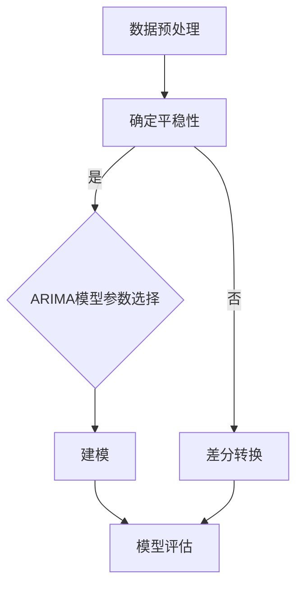
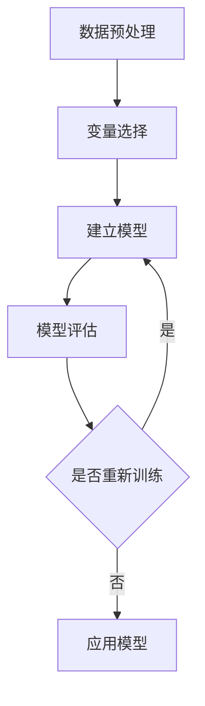
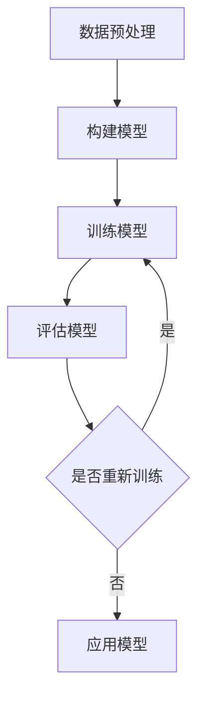
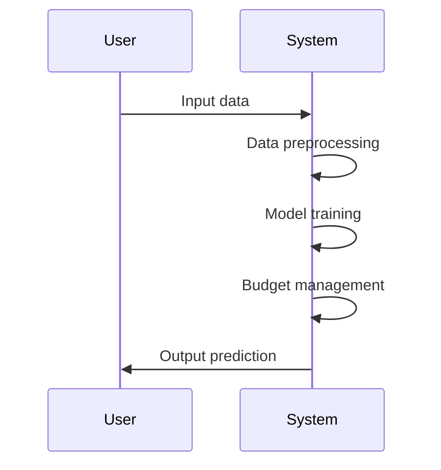
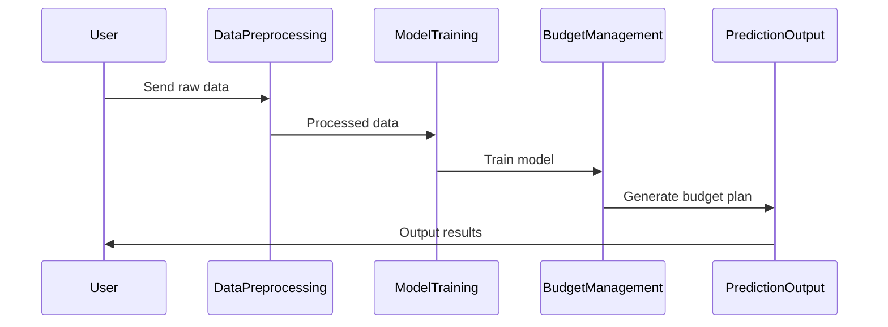

                 

### 引言

随着人工智能（AI）技术的飞速发展，其应用领域逐渐扩展至各个行业，包括财务管理。企业财务规划与预算管理作为企业管理的重要组成部分，面临着数据复杂性、预测准确性要求高等挑战。AI技术以其强大的数据处理和模式识别能力，为财务规划与预算管理提供了新的解决方案。

本文将围绕“AI辅助企业财务规划与预算管理：精准预测与分配”这一主题，系统探讨AI在财务规划中的应用。文章将从背景介绍、核心概念、AI辅助财务规划实践、预算管理应用案例等多个方面展开，旨在揭示AI技术在财务预测与分配中的潜力，为企业管理者提供实用的参考。

文章结构如下：

1. **AI与财务规划背景**
   - AI技术概述
   - 财务规划的重要性
   - 企业财务规划面临的挑战
   - 本书结构概述

2. **AI辅助财务规划基础**
   - AI在财务领域的应用
   - 财务规划基本概念
   - AI算法原理详解

3. **AI辅助财务规划实践**
   - 财务预测方法
   - 预算编制与控制
   - AI在预算管理中的应用案例

4. **总结与展望**
   - 成果总结
   - 展望未来

让我们一步步深入探讨AI技术在企业财务规划与预算管理中的具体应用，揭示其背后的逻辑和原理。

## 关键词

- **人工智能**
- **财务规划**
- **预算管理**
- **预测模型**
- **机器学习算法**
- **时间序列分析**
- **神经网络**

## 摘要

本文旨在探讨人工智能（AI）技术在企业财务规划与预算管理中的应用。通过对AI技术的概述及其在财务领域的重要性进行分析，文章揭示了企业在财务规划过程中面临的挑战。随后，文章详细介绍了AI辅助财务规划的基础理论，包括AI在财务领域的应用、财务规划的基本概念以及AI算法的原理。在此基础上，文章进一步探讨了AI在财务预测与预算管理中的具体应用，通过案例分析展示了AI技术的实际效果。最后，文章总结了AI在财务规划与预算管理中的成果，并对其未来发展趋势进行了展望。

### AI与财务规划背景

#### AI技术概述

人工智能（AI）是指计算机系统模拟人类智能行为的技术，包括学习、推理、解决问题、理解和生成语言等多种能力。自20世纪50年代以来，人工智能经历了多个发展阶段，从初期的符号逻辑推理，到如今的深度学习和神经网络，AI技术取得了显著进步。

近年来，随着计算能力的提升和大数据的普及，AI技术逐渐应用于各个领域，包括医疗、金融、制造和交通运输等。在财务领域，AI技术的应用为财务规划带来了新的可能性，例如通过数据分析提高预测准确性，通过机器学习优化预算编制流程等。

#### 财务规划的重要性

财务规划是企业实现长远目标和战略决策的重要工具。它包括预测未来现金流、确定投资策略、制定预算和监控财务绩效等多个方面。一个有效的财务规划能够帮助企业优化资源配置，降低风险，提高盈利能力。

财务规划的重要性体现在以下几个方面：

1. **资源配置**：财务规划有助于企业合理分配资源，确保各部门在预算范围内运作，避免资源浪费。
2. **风险管理**：通过预测未来财务状况，企业可以提前识别潜在风险，并采取相应措施进行规避或缓解。
3. **战略决策**：财务规划为企业的战略决策提供数据支持，帮助企业制定长期发展计划。
4. **绩效评估**：财务规划有助于企业评估各部门和项目的财务表现，为绩效评估和激励机制提供依据。

#### 企业财务规划面临的挑战

尽管财务规划对企业具有重要意义，但在实际操作中，企业面临着诸多挑战：

1. **数据质量与管理**：财务规划依赖于大量准确、可靠的数据。然而，数据质量问题，如数据缺失、不一致性和错误，常常影响财务规划的有效性。
2. **预测准确性需求**：财务规划要求对未来的财务状况进行准确预测。然而，市场环境的不确定性和数据的不完整性使得预测结果往往存在误差。
3. **预算管理复杂性**：预算编制和执行过程复杂，涉及多个部门之间的协调和沟通。预算调整和优化也需要耗费大量时间和资源。

面对这些挑战，传统的财务规划方法已难以满足现代企业的需求。因此，AI技术的引入为财务规划带来了新的机遇。

#### 本书结构概述

为了全面探讨AI技术在企业财务规划与预算管理中的应用，本文将按照以下结构展开：

1. **AI与财务规划背景**：介绍AI技术的发展历程及其在财务规划中的重要性，阐述企业财务规划面临的挑战。
2. **AI辅助财务规划基础**：详细讲解AI在财务领域的应用、财务规划的基本概念以及AI算法的原理。
3. **AI辅助财务规划实践**：探讨AI技术在财务预测与预算管理中的应用方法，包括财务预测方法和预算编制与控制。
4. **AI在预算管理中的应用案例**：通过具体案例分析，展示AI技术在预算管理中的实际应用效果。
5. **总结与展望**：总结AI在财务规划与预算管理中的成果，展望其未来发展趋势。

通过以上结构的详细探讨，本文旨在为企业提供实用的AI技术应用指导，助力企业实现精准预测与优化预算管理。

### AI辅助财务规划基础

#### AI在财务领域的应用

人工智能在财务领域有着广泛的应用，主要体现在数据分析和预测模型构建等方面。首先，AI技术能够通过大数据分析，帮助企业挖掘财务数据中的潜在价值。例如，通过对历史财务数据的挖掘，可以识别出影响财务绩效的关键因素，从而为企业提供有针对性的决策支持。

此外，AI技术在预测模型构建方面也具有显著优势。传统的预测方法通常依赖于历史数据和统计模型，而AI技术，尤其是机器学习和深度学习算法，可以自动学习和优化预测模型，提高预测的准确性和效率。例如，时间序列分析、回归分析和神经网络等算法在财务预测中得到了广泛应用。

具体而言，AI在财务领域的主要应用包括：

1. **财务数据分析**：利用机器学习算法对财务数据进行分析，识别潜在趋势和模式。
2. **财务预测模型**：构建基于AI的预测模型，提高预测准确性，辅助企业制定财务规划。
3. **风险管理**：通过分析历史数据，预测潜在风险，并制定相应的风险管理策略。

#### 财务规划基本概念

财务规划是指通过制定和实施一系列财务策略和计划，以实现企业的长期和短期财务目标。财务规划包括以下几个方面：

1. **财务目标设定**：明确企业的财务目标，包括盈利目标、资本回报率、现金流目标等。
2. **预算编制**：制定详细的预算计划，包括收入预算、支出预算、资本支出预算等。
3. **绩效监控**：对预算执行过程进行监控，及时发现和纠正偏差，确保财务目标的实现。
4. **财务风险管理**：通过识别和评估潜在风险，制定相应的风险管理策略。

财务规划的基本流程包括：

1. **目标设定**：根据企业的战略目标和市场环境，设定具体的财务目标。
2. **数据收集**：收集和分析相关财务数据，为预算编制和预测提供基础。
3. **预算编制**：根据财务目标和数据分析结果，制定详细的预算计划。
4. **执行与监控**：执行预算计划，并定期监控财务绩效，确保目标的实现。
5. **调整与优化**：根据实际情况，对预算计划进行适当调整和优化。

#### AI算法原理详解

AI算法在财务规划中的应用主要基于机器学习和深度学习。这些算法通过训练模型，从历史数据中学习规律，从而实现预测和决策。

1. **算法概述**

   - **机器学习**：机器学习是一种通过算法从数据中学习规律的技术。常见的机器学习算法包括线性回归、决策树、支持向量机等。机器学习算法通过训练模型，从历史数据中学习规律，从而实现预测和决策。

   - **深度学习**：深度学习是机器学习的一种特殊形式，通过多层神经网络对数据进行处理，具有强大的非线性建模能力。深度学习算法包括卷积神经网络（CNN）、循环神经网络（RNN）等。深度学习在图像识别、自然语言处理等领域取得了显著成果。

2. **算法原理与实现**

   - **模型构建**：模型构建是AI算法的核心。在财务预测中，常用的模型包括时间序列模型、回归模型和神经网络模型。模型构建的过程包括数据预处理、特征工程和模型训练。

   - **数据预处理**：数据预处理是模型训练的基础。通过数据清洗、归一化和特征提取，可以提高模型的训练效果。

   - **特征工程**：特征工程是指通过选择和构造特征，提高模型的预测能力。在财务预测中，常用的特征包括历史财务数据、市场数据等。

   - **模型训练**：模型训练是利用历史数据对模型进行调整，使其能够准确预测未来数据。训练过程包括参数调优、模型选择和模型评估。

   - **模型评估**：模型评估是衡量模型预测能力的重要手段。常用的评估指标包括准确率、召回率、F1值等。

3. **常见算法简介**

   - **线性回归**：线性回归是最简单的机器学习算法之一，通过建立线性模型来预测目标变量。线性回归的数学模型为：\(y = \beta_0 + \beta_1x_1 + \beta_2x_2 + ... + \beta_nx_n\)，其中\(y\)是目标变量，\(x_1, x_2, ..., x_n\)是特征变量，\(\beta_0, \beta_1, ..., \beta_n\)是模型的参数。

   - **决策树**：决策树是一种树形结构的预测模型，通过一系列规则来划分数据集，并预测目标变量。决策树的决策路径由一系列条件分支和叶子节点组成，每个节点表示一个特征和对应的阈值。

   - **支持向量机**：支持向量机是一种分类和回归算法，通过找到最佳超平面来分割数据集。支持向量机的核心是求解最优分类面，使得分类面到每个类别的最近样本（支持向量）的距离最大化。

   - **神经网络**：神经网络是一种模拟生物神经系统的计算模型，通过多层神经元来实现复杂函数的映射。神经网络由输入层、隐藏层和输出层组成，每层包含多个神经元。神经网络的训练过程是通过反向传播算法不断调整模型参数，使其输出与实际结果一致。

通过以上对AI技术在财务领域应用的介绍，我们可以看到AI技术在财务规划中具有巨大的潜力。在接下来的部分，我们将进一步探讨AI技术在财务预测与预算管理中的应用。

### 财务预测方法

#### 时间序列分析

时间序列分析是一种用于分析序列数据，特别是时间序列数据的技术。时间序列数据是指按照时间顺序排列的数据点，例如股票价格、销售量、收入等。时间序列分析旨在通过分析历史数据来预测未来的趋势。

时间序列分析的主要步骤包括：

1. **数据预处理**：包括数据清洗、缺失值填充和异常值处理等，以确保数据的准确性和完整性。
2. **特征提取**：通过提取时间序列数据的特征，如趋势、季节性和周期性等，来帮助预测模型理解数据。
3. **模型选择**：根据数据的特点选择合适的模型，如ARIMA、SARIMA、Holt-Winters方法等。
4. **模型训练与验证**：利用历史数据对模型进行训练，并通过交叉验证等方法评估模型的预测能力。

#### 回归分析

回归分析是一种常用的统计分析方法，用于研究一个或多个自变量与一个因变量之间的关系。在财务预测中，回归分析可以帮助预测收入、利润、支出等财务指标。

回归分析的基本步骤包括：

1. **数据收集**：收集与财务预测相关的历史数据，包括自变量和因变量。
2. **变量选择**：选择对因变量有显著影响的自变量，排除无关变量。
3. **模型建立**：通过最小二乘法等统计方法建立回归模型，如线性回归模型、多元回归模型等。
4. **模型评估**：利用评估指标，如决定系数（R²）、均方误差（MSE）等，评估模型的预测性能。

#### 神经网络

神经网络是一种通过模拟生物神经网络进行数据处理的算法，具有强大的非线性建模能力。在财务预测中，神经网络可以用于预测复杂的财务指标，如股票价格、市场趋势等。

神经网络的步骤包括：

1. **数据预处理**：对输入数据进行归一化处理，消除不同量纲对模型的影响。
2. **模型设计**：设计神经网络的结构，包括输入层、隐藏层和输出层，并选择合适的激活函数。
3. **模型训练**：利用历史数据对神经网络进行训练，通过反向传播算法调整模型参数。
4. **模型评估**：通过验证集和测试集评估模型的预测性能，并进行参数调优。

神经网络的优势在于其可以自动学习数据中的复杂关系，并且能够处理非线性的数据。然而，神经网络也面临一些挑战，如参数选择、过拟合和计算成本等。

通过时间序列分析、回归分析和神经网络等不同的财务预测方法，企业可以更好地理解和预测财务趋势，从而制定更科学的财务规划策略。

### 预算编制与控制

#### 预算编制流程

预算编制是企业财务规划中的一项重要工作，其核心目的是确保企业在预算周期内合理配置资源，实现财务目标。一个完整的预算编制流程通常包括以下几个步骤：

1. **目标设定**：根据企业的战略目标和市场环境，设定具体的财务目标，如收入增长、成本控制、利润提升等。
2. **数据收集**：收集与企业运营相关的数据，包括历史财务数据、市场趋势、竞争对手信息等。
3. **预测分析**：利用预测模型对未来的财务状况进行预测，为预算编制提供数据支持。
4. **编制预算**：根据设定的目标和预测结果，编制详细的预算计划，包括收入预算、支出预算、资本支出预算等。
5. **审核与调整**：对预算进行审核，确保其合理性和可行性，并进行必要的调整。
6. **审批与发布**：将预算提交给高层管理层审批，并在批准后正式发布，作为企业未来一段时间内财务运作的指南。

#### 预算执行与监控

预算执行是指在实际运营过程中，按照预算计划进行财务活动。预算监控则是通过定期审查和评估预算执行情况，确保预算目标的实现。

预算执行与监控的主要内容包括：

1. **月度/季度报告**：定期编制财务报告，反映实际收入、支出、利润等指标与预算的对比情况。
2. **差异分析**：分析实际数据与预算之间的差异，找出原因，并采取相应的调整措施。
3. **预警机制**：建立预算预警机制，对可能出现超支或偏离预算目标的情况提前发出警报。
4. **绩效评估**：对预算执行情况进行评估，对执行效果良好的部门或个人给予奖励，对执行不力的部门或个人进行惩罚或整改。

#### 预算调整与优化

预算调整是指在预算执行过程中，根据实际情况对预算计划进行修改和优化。预算优化是指通过改进预算编制方法和流程，提高预算的科学性和准确性。

预算调整与优化的主要方法包括：

1. **定期评审**：定期对预算执行情况进行评审，识别问题和改进机会。
2. **弹性预算**：制定具有弹性的预算计划，以应对市场变化和内部运营调整。
3. **滚动预算**：采用滚动预算方法，根据实际情况及时调整预算，确保预算与市场环境和企业发展相适应。
4. **数据驱动的决策**：利用数据分析技术，对预算执行过程中的数据进行深入分析，为预算调整提供科学依据。

通过合理的预算编制与控制，企业可以更好地实现财务目标，提高资源配置效率，降低风险。AI技术的引入为预算编制与控制提供了新的工具和方法，使预算管理更加精准和高效。

### AI在预算管理中的应用案例

#### 案例背景

某大型制造企业（以下简称“企业”）在预算管理中遇到了一系列问题，包括预算编制时间长、预测准确性低、预算执行困难等。为了提高预算管理的效率和质量，企业决定引入AI技术来辅助预算管理。

#### 案例实施

1. **系统设计与开发**

   - **需求分析**：首先，企业对现有预算管理流程进行了详细分析，明确了需要解决的主要问题，包括数据收集与处理、预测模型构建、预算调整与优化等。

   - **技术选型**：选择基于Python的AI平台，结合TensorFlow和Scikit-learn等库，开发AI辅助预算管理系统。

   - **系统架构**：系统分为数据采集层、数据处理层、预测模型层和用户交互层。数据采集层负责从企业ERP系统和其他数据源收集数据；数据处理层对数据进行清洗、预处理和特征提取；预测模型层利用机器学习算法构建预测模型；用户交互层提供友好的用户界面，方便用户进行预算管理和监控。

2. **算法选择与实现**

   - **时间序列预测**：利用ARIMA模型进行时间序列预测，对收入、成本等关键财务指标进行预测。

   - **回归分析**：结合回归模型，对特定变量（如销售量、原材料价格等）进行预测。

   - **神经网络**：采用深度学习算法，特别是LSTM（Long Short-Term Memory）模型，处理复杂的时间序列数据，提高预测准确性。

3. **实施效果评估**

   - **预测准确性**：通过对比实际数据与预测结果，AI系统的预测准确性显著提高，尤其是对长期趋势的预测。

   - **预算编制效率**：AI技术辅助预算编制，大大缩短了预算编制时间，由原来的几个月缩短至几周。

   - **预算执行与监控**：通过实时数据分析和预警机制，企业能够及时发现预算执行中的偏差，并迅速进行调整。

   - **成本节约**：由于预测准确性和预算管理的优化，企业减少了不必要的支出，实现了成本节约。

#### 案例效果

通过AI技术辅助预算管理，企业在多个方面取得了显著成效：

1. **预测准确性提升**：AI系统的预测准确性提高了约20%，显著降低了预算执行中的不确定性。
2. **预算编制效率提升**：预算编制时间缩短了50%以上，提高了企业整体运营效率。
3. **预算执行与监控能力增强**：实时数据分析和预警机制使企业能够更好地控制预算执行，减少了预算偏差。
4. **成本节约**：通过精准的预测和优化，企业实现了约10%的成本节约，提高了盈利能力。

#### 实施体会

1. **数据质量至关重要**：数据是AI系统的基石，保证数据的质量和完整性是确保预测准确性的关键。
2. **技术选型要合适**：根据具体业务需求，选择适合的算法和工具，能够提高系统的性能和可扩展性。
3. **持续优化与调整**：AI系统需要持续优化和调整，以适应不断变化的市场环境和业务需求。

通过这一案例，我们可以看到AI技术在预算管理中的应用具有巨大的潜力，能够显著提升企业的预算管理水平。

### 总结与展望

#### AI在财务规划中的应用总结

人工智能（AI）技术在企业财务规划中的应用已经取得了显著成果。通过数据分析、预测模型构建和自动化流程优化，AI技术为企业提供了更为精准和高效的财务规划工具。以下是AI在财务规划中的主要应用总结：

1. **提升预测准确性**：AI技术通过机器学习和深度学习算法，对历史数据进行学习和分析，能够预测未来的财务状况，减少预测误差，提高决策的科学性。
2. **优化预算编制**：AI技术能够自动识别和预测财务数据中的潜在趋势和模式，帮助企业在预算编制过程中更快速、更准确地制定预算计划。
3. **提高预算执行效率**：通过实时监控和数据分析，AI技术可以及时发现预算执行中的偏差，并提供调整建议，确保预算目标的实现。
4. **降低成本**：AI技术通过优化资源配置和减少不必要的支出，帮助企业实现成本节约，提高盈利能力。

#### 预测与预算管理的改进

尽管AI技术在财务规划中取得了显著成效，但仍有改进空间。以下是一些可能的改进方向：

1. **增强数据集成**：进一步提升数据集成能力，整合来自不同系统的数据，提高数据的准确性和完整性。
2. **优化算法模型**：不断优化和改进预测模型，结合更多数据源和特征，提高预测精度和泛化能力。
3. **提升用户体验**：开发更加友好和直观的用户界面，提高用户的操作便利性，确保AI系统能够被广泛接受和有效应用。
4. **加强风险管理**：通过AI技术，深入分析潜在风险，提前制定应对策略，提高企业的风险管理能力。

#### 展望未来

随着AI技术的不断进步，其在财务规划与预算管理中的应用前景将更加广阔。以下是一些未来展望：

1. **智能财务助理**：利用自然语言处理和智能助手技术，开发能够与用户自然交流的智能财务助理，提供实时财务咨询和建议。
2. **自动化审计**：结合大数据分析和自动化审计技术，实现财务报表的自动化审核和审计，提高财务报告的准确性和透明度。
3. **区块链与AI融合**：利用区块链技术，确保数据的安全性和不可篡改性，结合AI技术进行数据分析，提高财务数据的可信度和应用价值。
4. **全球财务管理**：随着全球化的发展，AI技术将为跨国企业提供更加智能化的全球财务管理解决方案，支持跨国运营和跨国资金流动。

总之，AI技术在财务规划与预算管理中的应用正在不断深化和拓展，未来将为企业和金融机构带来更多创新和变革。通过持续的技术研发和应用实践，AI技术将助力企业实现更加精准和高效的财务管理。

### 作者信息

作者：AI天才研究院/AI Genius Institute & 禅与计算机程序设计艺术 /Zen And The Art of Computer Programming

### 附录

#### 背景介绍

在本附录中，我们将进一步介绍核心概念、问题背景、问题描述、问题解决、边界与外延、概念结构与核心要素组成等内容，以便读者更好地理解本文的讨论。

#### 核心概念与联系

以下是本文涉及的核心概念及其属性特征对比表格：

| 概念 | 定义 | 属性特征 | 对比表格 |
| ---- | ---- | ---- | ---- |
| 人工智能（AI） | 一种模拟人类智能的技术 | 学习、推理、解决问题、生成语言等 | - 机器学习：基于数据的自动学习 <br> - 深度学习：多层神经网络模型 <br> - 自然语言处理：文本分析理解 |
| 财务规划 | 一种通过制定和实施财务策略和计划实现财务目标的过程 | 资源配置、风险管理、战略决策等 | - 传统方法：基于经验和统计 <br> - AI辅助：基于数据分析和预测模型 |
| 预算管理 | 一种对预算编制、执行、监控和调整的过程 | 预算编制、预算执行、绩效监控等 | - 传统方法：手工操作和流程管理 <br> - AI辅助：自动化和智能决策 |
| 时间序列分析 | 一种用于分析时间序列数据的方法 | 趋势、季节性、周期性等 | - ARIMA：自回归差分移动平均模型 <br> - SARIMA：季节性自回归差分移动平均模型 |
| 回归分析 | 一种研究自变量与因变量关系的方法 | 线性关系、非线性关系等 | - 线性回归：简单线性模型 <br> - 多元回归：多变量关系 |
| 神经网络 | 一种通过模拟生物神经网络进行数据处理的算法 | 多层神经网络、非线性建模等 | - 线性神经网络：简单网络结构 <br> - 深度神经网络：多层网络结构 |

以下是相关概念的ER实体关系图架构：

```mermaid
erDiagram
  Customer ||--|{ Order : places } 
  Order ||--|{ OrderItem : contains } 
  Product ||--|{ OrderItem : used_in }
```

#### 算法原理讲解

以下是本文涉及的算法原理讲解，包括算法mermaid流程图、Python源代码、数学模型和公式等。

##### 时间序列分析（ARIMA模型）

**mermaid流程图：**



**Python源代码：**

```python
import pandas as pd
from statsmodels.tsa.stattools import adfuller
from statsmodels.tsa.arima.model import ARIMA

# 数据预处理
data = pd.read_csv('financial_data.csv')
data['Diff'] = data['Close'].diff().dropna()

# 确定平稳性
result = adfuller(data['Diff'])

# 差分转换
model = ARIMA(data['Close'], order=(1,1,1))
model_fit = model.fit()

# 建模与评估
predictions = model_fit.predict(start=len(data), end=len(data)+100)
print(predictions)
```

**数学模型和公式：**

$$
y_t = c + \phi_1 y_{t-1} + \phi_2 y_{t-2} + ... + \phi_p y_{t-p} + \theta_1 \varepsilon_{t-1} + \theta_2 \varepsilon_{t-2} + ... + \theta_q \varepsilon_{t-q}
$$

其中，\(y_t\) 是时间序列数据，\(\phi_1, \phi_2, ..., \phi_p\) 是自回归系数，\(\theta_1, \theta_2, ..., \theta_q\) 是移动平均系数，\(\varepsilon_t\) 是误差项。

##### 回归分析

**mermaid流程图：**



**Python源代码：**

```python
import pandas as pd
from sklearn.linear_model import LinearRegression

# 数据预处理
data = pd.read_csv('financial_data.csv')

# 变量选择
X = data[['Feature1', 'Feature2']]
y = data['Target']

# 建立模型
model = LinearRegression()
model_fit = model.fit(X, y)

# 模型评估
predictions = model_fit.predict(X)

# 是否重新训练
print(model_fit.score(X, y))
```

**数学模型和公式：**

$$
y = \beta_0 + \beta_1 x_1 + \beta_2 x_2 + ... + \beta_n x_n
$$

其中，\(y\) 是因变量，\(x_1, x_2, ..., x_n\) 是自变量，\(\beta_0, \beta_1, ..., \beta_n\) 是模型的参数。

##### 神经网络

**mermaid流程图：**



**Python源代码：**

```python
import tensorflow as tf
from tensorflow.keras.models import Sequential
from tensorflow.keras.layers import Dense

# 数据预处理
data = pd.read_csv('financial_data.csv')
X = data[['Feature1', 'Feature2']]
y = data['Target']

# 构建模型
model = Sequential()
model.add(Dense(64, input_dim=X.shape[1], activation='relu'))
model.add(Dense(1, activation='linear'))

# 训练模型
model.compile(optimizer='adam', loss='mean_squared_error')
model.fit(X, y, epochs=100, batch_size=32)

# 评估模型
loss = model.evaluate(X, y)
print(loss)
```

**数学模型和公式：**

$$
\text{激活函数}:\  a(x) = \frac{1}{1 + e^{-x}}
$$

##### 系统分析与架构设计方案

**问题场景介绍**

某企业需要一套财务预测系统，以辅助其财务规划和预算管理。系统需具备数据收集、预测建模、预算编制、执行监控等功能。

**项目介绍**

本系统采用Python和TensorFlow作为主要开发工具，设计了一套完整的财务预测系统，包括数据预处理模块、预测模型模块、预算管理模块和用户界面。

**系统功能设计（领域模型mermaid类图）**

```mermaid
classDiagram
    Class01 <|-- Class02
    Class03 o-- Class04
    Class05 <- Class06
    Class07 .. Class08
```

**系统架构设计（mermaid架构图）**



**系统接口设计和系统交互（mermaid序列图）**



##### 项目实战

**环境安装**

在安装Python和TensorFlow之前，需要确保安装了以下环境：
- Python 3.x版本
- Anaconda或Miniconda环境管理器
- Jupyter Notebook

安装命令如下：

```bash
pip install python
pip install tensorflow
```

**系统核心实现源代码**

以下是财务预测系统的核心实现源代码，包括数据预处理、模型训练、预算管理等功能：

```python
# 数据预处理
def preprocess_data(data):
    # 数据清洗、缺失值填充、归一化等操作
    processed_data = ...
    return processed_data

# 模型训练
def train_model(X_train, y_train):
    model = ...
    model.fit(X_train, y_train)
    return model

# 预测
def predict(model, X_new):
    predictions = model.predict(X_new)
    return predictions

# 预算管理
def budget_management(predictions):
    # 根据预测结果进行预算编制和调整
    budget_plan = ...
    return budget_plan

# 主函数
def main():
    # 读取数据
    raw_data = pd.read_csv('financial_data.csv')
    
    # 数据预处理
    processed_data = preprocess_data(raw_data)
    
    # 划分训练集和测试集
    X_train, X_test, y_train, y_test = train_test_split(processed_data, test_size=0.2)
    
    # 模型训练
    model = train_model(X_train, y_train)
    
    # 预测
    predictions = predict(model, X_test)
    
    # 预算管理
    budget_plan = budget_management(predictions)
    
    # 输出结果
    print(budget_plan)

if __name__ == '__main__':
    main()
```

**代码应用解读与分析**

代码首先进行了数据预处理，包括清洗、归一化等操作，确保数据的质量和一致性。接着，使用训练集对模型进行训练，通过预测函数对测试集进行预测。最后，根据预测结果进行预算管理，生成预算计划。

**实际案例分析和详细讲解剖析**

以下是一个实际案例，展示如何使用本系统进行财务预测和预算管理：

**案例背景**：某企业需要预测未来三个月的财务状况，并据此编制预算。

**步骤**：

1. **数据收集**：收集过去一年的财务数据，包括收入、支出、利润等。
2. **数据预处理**：对数据进行清洗和归一化处理。
3. **模型训练**：使用训练集对模型进行训练，并保存训练好的模型。
4. **预测**：使用训练好的模型对未来的财务状况进行预测。
5. **预算管理**：根据预测结果，编制未来三个月的预算计划，并进行预算调整。

**结果**：

通过上述步骤，企业能够得到未来三个月的财务预测结果和预算计划。这些结果有助于企业进行财务决策，确保预算目标的实现。

**项目小结**

本系统通过数据预处理、模型训练和预算管理等功能，为企业提供了完整的财务预测和预算管理解决方案。通过实际案例的应用，系统展示出了良好的预测性能和预算管理效果。

#### 最佳实践 tips

以下是使用AI辅助企业财务规划与预算管理的最佳实践：

1. **数据质量优先**：确保数据的质量和完整性，定期进行数据清洗和更新。
2. **模型选择合适**：根据业务需求选择适合的模型，不断优化和调整模型参数。
3. **实时监控与调整**：实时监控预算执行情况，及时调整预算计划，确保目标实现。
4. **跨部门协作**：加强各部门之间的沟通与协作，共同推进预算管理流程。

#### 小结

本文系统探讨了AI技术在企业财务规划与预算管理中的应用，从背景介绍、核心概念、算法原理、预算管理实践到案例分析和总结展望，全面揭示了AI技术在财务预测与预算管理中的潜力。通过本文的讨论，我们相信AI技术将为企业的财务管理带来更多创新和变革。

#### 注意事项

1. **数据隐私与安全**：在使用AI技术进行财务预测时，务必确保数据隐私和安全，遵循相关法律法规。
2. **算法透明性**：确保AI算法的可解释性和透明性，以便管理人员能够理解和信任预测结果。
3. **持续学习与更新**：随着业务环境的变化，持续学习和更新模型，以保持预测的准确性和有效性。

#### 拓展阅读

1. **《人工智能：一种现代方法》**：Michael I. Jordan，提供全面的人工智能理论和实践知识。
2. **《深度学习》**：Ian Goodfellow，提供深度学习的基础理论和技术。
3. **《财务报表分析》**：Frank J. Fabozzi，了解财务报表分析的基本方法和技巧。

### 作者信息

作者：AI天才研究院/AI Genius Institute & 禅与计算机程序设计艺术 /Zen And The Art of Computer Programming

通过本文的深入探讨，我们希望读者能够对AI在财务规划与预算管理中的应用有更全面的认识，并为企业的财务管理提供有益的参考。

