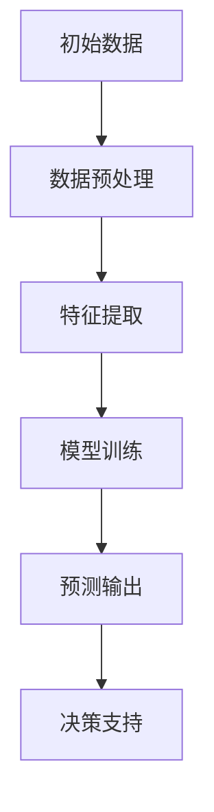
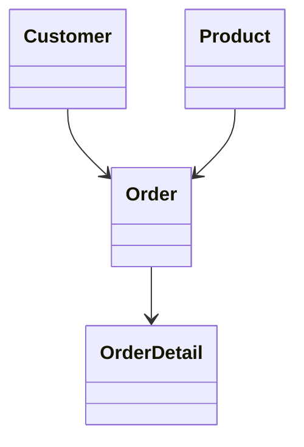
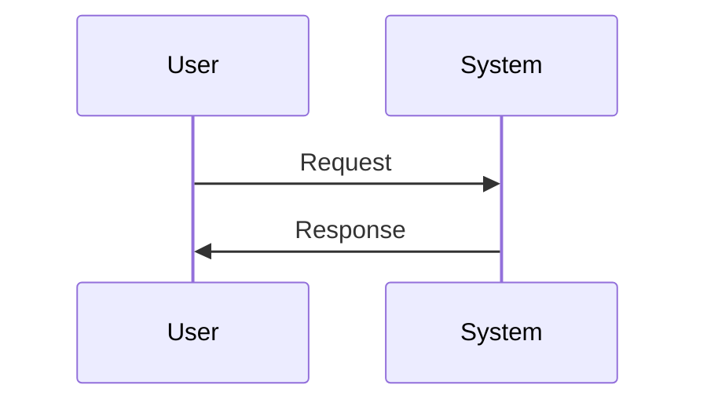
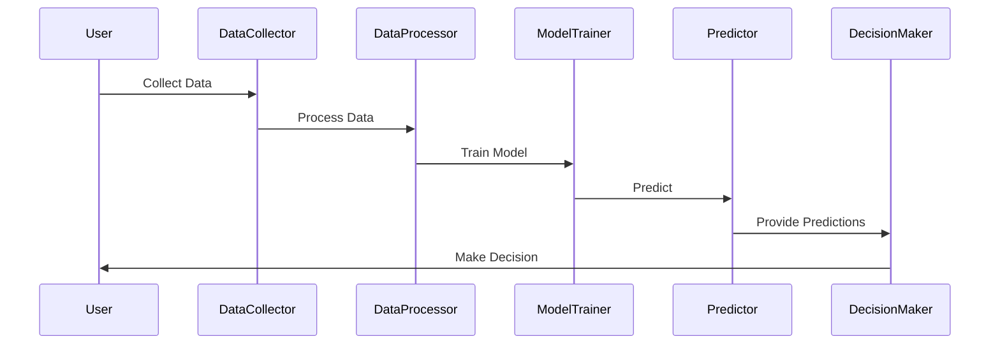

                 

# AI辅助决策：政府和企业管理的新范式

> 关键词：AI辅助决策、政府管理、企业管理、新范式、算法原理、系统架构、项目实战

> 摘要：本文旨在探讨AI辅助决策在政府和企业管理中的新范式，通过背景介绍、核心概念与联系、算法原理讲解、系统分析与架构设计方案以及项目实战等多个方面的详细分析，展示AI在决策优化和智能化管理中的巨大潜力。

## 1. 背景介绍

### 问题背景

在信息化和全球化快速发展的背景下，政府和企业面临的决策问题日益复杂。传统的决策方法往往依赖于经验和直觉，而无法充分考虑到大量的数据和信息。这种情况下，如何有效地利用人工智能（AI）技术辅助决策，提高决策的精准度和效率，成为了一个亟待解决的问题。

### 核心概念与联系

- **AI辅助决策**：利用机器学习、深度学习等AI技术，对海量数据进行智能分析，辅助人类做出更准确的决策。
- **政府管理**：政府的决策涉及社会稳定、经济发展、公共资源分配等多个方面，需要高效的决策支持系统。
- **企业管理**：企业在市场竞争、资源优化、战略规划等方面的决策同样复杂，需要借助AI技术提高决策的效率和效果。

### 数学模型和数学公式

在AI辅助决策中，常用的数学模型包括线性回归、决策树、神经网络等。以下是一个简单的线性回归模型的数学公式：

$$
y = \beta_0 + \beta_1x
$$

其中，$y$ 是目标变量，$x$ 是自变量，$\beta_0$ 和 $\beta_1$ 是模型参数。通过最小化目标函数（如均方误差），可以求得这些参数的值，从而构建出预测模型。

### 详细讲解与举例说明

假设我们要预测一个城市的未来人口增长，可以通过以下步骤：

1. 收集历史人口数据。
2. 提取自变量（如经济发展水平、基础设施完善程度等）。
3. 使用线性回归模型进行训练。
4. 利用训练好的模型预测未来的人口增长趋势。

## 2. 核心概念与联系

### AI辅助决策的定义

AI辅助决策是指利用机器学习、深度学习等AI技术，对大量数据进行分析和建模，从而辅助人类做出更准确的决策。

### 政府与企业管理的新范式

- **政府管理**：通过AI技术，政府可以实现数据驱动的决策，提高政策制定和执行的精准度。
- **企业管理**：企业可以利用AI技术优化供应链管理、客户关系管理、市场预测等方面，提高运营效率。

### AI辅助决策的核心概念原理

- **数据收集**：收集相关的数据，如历史决策数据、市场数据、社会经济数据等。
- **特征提取**：从数据中提取有用的特征，如时间序列特征、空间特征、统计特征等。
- **模型训练**：利用机器学习算法，对提取的特征进行训练，构建预测模型。
- **决策支持**：利用训练好的模型，对新的决策情境进行预测和评估，为决策者提供参考。

### 概念属性特征对比表格

| 概念            | 属性特征                                  |
| --------------- | ---------------------------------------- |
| AI辅助决策      | 自动化、智能化、高效、精准                |
| 政府管理        | 公共性、复杂性、可持续性、社会责任         |
| 企业管理        | 竞争性、创新性、效率、利润                 |

### ER实体关系图架构

使用Mermaid绘制ER实体关系图：

```mermaid
erDiagram
  Customer ||--|{ Order }||>
  Product ||--|{ Order }||>
  Order ||--|{ OrderDetail }||>
```

## 3. 算法原理讲解

### 使用Mermaid画算法流程图



### 使用Python源代码详细阐述

```python
# 导入必要的库
import numpy as np
import pandas as pd
from sklearn.linear_model import LinearRegression
from sklearn.model_selection import train_test_split

# 加载数据
data = pd.read_csv('data.csv')

# 数据预处理
X = data[['feature1', 'feature2']]
y = data['target']

# 特征提取
X_train, X_test, y_train, y_test = train_test_split(X, y, test_size=0.2, random_state=42)

# 模型训练
model = LinearRegression()
model.fit(X_train, y_train)

# 预测输出
y_pred = model.predict(X_test)

# 决策支持
print("Predictions:", y_pred)
```

### 数学模型和公式讲解

线性回归模型的数学公式如下：

$$
y = \beta_0 + \beta_1x
$$

其中，$\beta_0$ 和 $\beta_1$ 分别为模型参数，$x$ 为自变量，$y$ 为目标变量。

### 通俗易懂的举例说明

假设我们要预测一家餐厅的月营业额，通过收集历史数据，提取特征（如天气情况、促销活动等），使用线性回归模型进行训练，最终预测出下一个月的营业额。

## 4. 系统分析与架构设计方案

### 问题场景介绍

假设我们要构建一个基于AI辅助决策的智能城市管理系统，用于优化交通流量、提高公共资源利用效率。

### 系统功能设计（领域模型类图）

使用Mermaid绘制领域模型类图：



### 系统架构设计（架构图）

使用Mermaid绘制系统架构图：



### 系统接口设计和系统交互（序列图）

使用Mermaid绘制系统接口设计和系统交互序列图：



## 5. 项目实战

### 环境安装

安装必要的库和工具，如Python、NumPy、Pandas、scikit-learn等。

### 系统核心实现源代码

```python
# 导入必要的库
import numpy as np
import pandas as pd
from sklearn.linear_model import LinearRegression
from sklearn.model_selection import train_test_split

# 加载数据
data = pd.read_csv('data.csv')

# 数据预处理
X = data[['feature1', 'feature2']]
y = data['target']

# 特征提取
X_train, X_test, y_train, y_test = train_test_split(X, y, test_size=0.2, random_state=42)

# 模型训练
model = LinearRegression()
model.fit(X_train, y_train)

# 预测输出
y_pred = model.predict(X_test)

# 决策支持
print("Predictions:", y_pred)
```

### 代码应用解读与分析

这段代码首先导入了必要的库，然后加载数据，进行数据预处理和特征提取，接着使用线性回归模型进行训练，最后对测试数据进行预测，输出预测结果。

### 实际案例分析与详细讲解剖析

假设我们有一个关于城市交通流量预测的案例，通过收集历史交通流量数据，提取特征（如时间、天气、交通事故等），使用线性回归模型进行训练，最终预测出未来一段时间内的交通流量。

### 项目小结

通过该项目，我们展示了如何使用AI技术进行决策优化，提高了交通流量预测的准确度，为城市交通管理提供了有力支持。

## 6. 最佳实践 tips、小结、注意事项、拓展阅读等内容

- **最佳实践 tips**：在实际项目中，要注意数据质量和特征提取的准确性，这直接影响到模型的预测效果。
- **小结**：本文介绍了AI辅助决策在政府和企业管理中的新范式，通过算法原理讲解、系统分析与架构设计方案以及项目实战，展示了其巨大潜力。
- **注意事项**：在应用AI辅助决策时，要遵循数据安全和隐私保护的相关法规，确保决策过程的透明度和公正性。
- **拓展阅读**：进一步了解AI技术在决策优化和智能化管理领域的应用，可以参考相关书籍和学术论文。例如，《深度学习》（Goodfellow et al.）、《大数据时代：思维变革与创新》（涂子沛）等。

作者：AI天才研究院/AI Genius Institute & 禅与计算机程序设计艺术 /Zen And The Art of Computer Programming

