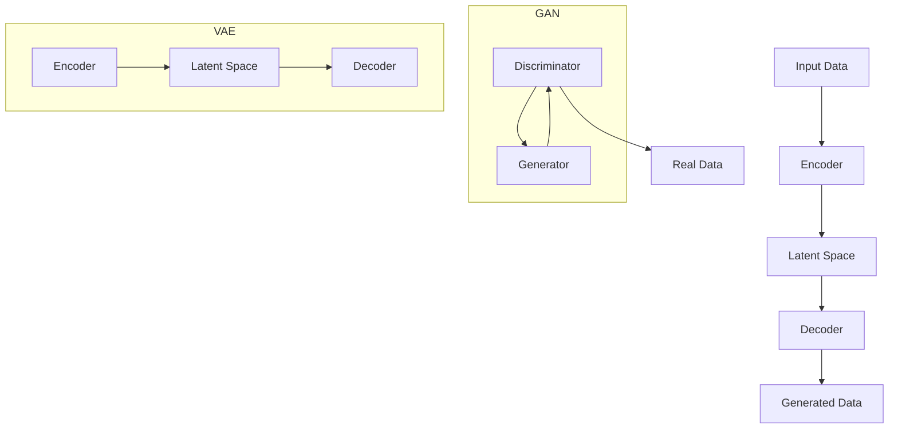

                 


### AI辅助创作：大模型在内容产业中的应用

#### 关键词
- AI辅助创作
- 大模型
- 内容产业
- 应用案例分析

#### 摘要
本文深入探讨了AI辅助创作在大模型与内容产业中的应用。首先，我们介绍了内容产业的现状与挑战，以及AI大模型的出现与发展背景。接着，我们解析了AI大模型的原理及其在内容创作中的应用。随后，文章通过实际案例展示了AI辅助创作在内容审核、推荐等环节的具体应用。最后，我们总结了AI辅助创作的重要性和未来发展趋势，并提出了最佳实践建议。

----------------------------------------------------------------

## 第一部分：背景介绍

### 第1章：问题背景

#### 1.1.1 内容产业的现状与挑战

内容产业作为一个庞大的行业，涵盖了包括新闻、出版、音乐、影视、游戏等多个领域。随着互联网和移动互联网的迅速发展，内容产业呈现出爆炸式增长。然而，这一繁荣背后也隐藏着诸多挑战。

- **内容创作难度大**：高质量的内容创作往往需要大量的时间和精力，而市场对内容的需求日益增长，创作者面临着巨大的压力。
- **内容审核与推荐难度大**：内容审核需要保证内容的合规性，推荐则需要满足用户的个性化需求，这对算法和系统的要求非常高。
- **内容分发与传播效率低**：在信息爆炸的时代，如何让优质内容快速传播，提高分发效率，成为内容产业亟待解决的问题。

#### 1.1.2 AI大模型的出现与发展

AI大模型的出现为解决上述问题提供了新的思路。大模型通过深度学习和自然语言处理技术，可以自动生成文本、图像、音乐等，大大提高了内容创作的效率。同时，大模型在内容审核、推荐等环节也发挥了重要作用。

- **自然语言处理**：大模型能够理解语言背后的含义，为内容创作提供了强大的支持。
- **图像生成与识别**：大模型可以生成高质量的图像，同时识别图像中的物体和场景。
- **音频处理**：大模型可以对音频进行编辑、增强，甚至生成新的音频内容。

#### 1.1.3 AI辅助创作的重要性与潜力

AI辅助创作在内容产业中具有重要的地位和广阔的潜力。

- **提高创作效率**：AI大模型可以自动化完成部分创作任务，减轻创作者的负担，提高创作效率。
- **降低创作门槛**：大模型使得普通用户也能参与内容创作，降低了创作的门槛。
- **个性化推荐**：大模型可以分析用户行为和偏好，实现个性化推荐，提升用户体验。
- **内容审核与安全**：大模型可以识别违规内容，提高审核的准确性和效率，保障内容安全。

在接下来的章节中，我们将进一步探讨AI大模型的原理、应用以及具体的实现方法。

----------------------------------------------------------------

## 第二部分：核心概念

### 第2章：核心概念

在本章中，我们将深入探讨AI大模型的核心概念，包括其原理、类型、训练与优化方法，以及AI大模型在内容产业中的应用。

#### 2.1 AI大模型原理

##### 2.1.1 AI大模型概述

AI大模型指的是具有数十亿到千亿参数规模的人工神经网络模型。这些模型通过在大量数据上进行训练，可以学习到极其复杂的模式和知识。

- **神经网络结构**：AI大模型通常采用深度神经网络（Deep Neural Network, DNN）结构，包括输入层、隐藏层和输出层。
- **大规模参数**：大模型具有数百万到数十亿个参数，这使得它们可以学习到更加复杂的特征。
- **端到端训练**：大模型通常采用端到端训练方法，直接从原始数据中学习到输出结果，无需手动设计中间层。

##### 2.1.2 大模型的类型

根据功能和应用领域，AI大模型可以分为以下几种类型：

- **自然语言处理模型**：如BERT、GPT等，用于文本生成、翻译、问答等。
- **计算机视觉模型**：如图像生成、识别、分割等。
- **语音处理模型**：如语音识别、语音合成等。

##### 2.1.3 大模型的训练与优化

大模型的训练是一个复杂的优化过程，需要大量的计算资源和时间。以下是训练与优化过程中的关键步骤：

- **数据预处理**：包括数据清洗、归一化、数据增强等。
- **模型初始化**：选择合适的初始化方法，如随机初始化、预训练模型等。
- **优化算法**：常用的优化算法包括梯度下降、Adam等。
- **正则化方法**：如Dropout、权重正则化等，用于防止过拟合。

#### 2.2 内容产业应用

##### 2.2.1 内容产业概述

内容产业包括新闻、出版、音乐、影视、游戏等多个领域，涵盖了内容创作、分发、推荐、审核等环节。

- **内容创作**：包括原创内容、编辑加工等。
- **内容分发**：包括平台推送、社交分享等。
- **内容推荐**：基于用户行为、偏好等进行个性化推荐。
- **内容审核**：确保内容合规，防止违规内容传播。

##### 2.2.2 AI大模型在内容创作中的应用

AI大模型在内容创作中的应用主要体现在以下几个方面：

- **文本生成**：如文章、故事、诗歌等。
- **图像生成**：如艺术画、风景图等。
- **音乐生成**：如旋律、歌词等。
- **视频生成**：如视频剪辑、特效等。

##### 2.2.3 AI大模型在内容审核和推荐中的应用

AI大模型在内容审核和推荐中也发挥着重要作用：

- **内容审核**：通过图像识别、文本分类等技术，自动识别和过滤违规内容。
- **内容推荐**：通过分析用户行为和偏好，实现个性化内容推荐。

在下一章中，我们将探讨AI大模型的架构设计，包括系统功能设计、系统架构设计以及算法原理。

----------------------------------------------------------------

### 第3章：AI大模型架构设计

#### 3.1 AI大模型架构设计概述

AI大模型架构设计是确保模型性能、可扩展性和可维护性的关键。一个良好的架构设计应包括系统功能设计、系统架构设计、数据处理流程以及安全性等方面。

##### 3.1.1 系统功能设计

系统功能设计是AI大模型架构设计的核心，它定义了系统的基本功能和服务。

- **文本生成功能**：提供自动文本生成服务，包括文章、故事、对话等。
- **图像生成功能**：提供自动图像生成服务，包括艺术画、设计图等。
- **音乐生成功能**：提供自动音乐生成服务，包括旋律、歌词等。
- **内容审核功能**：提供内容审核服务，确保生成内容符合规定标准。
- **内容推荐功能**：提供个性化内容推荐服务，满足用户个性化需求。

##### 3.1.2 系统架构设计

系统架构设计是AI大模型能够高效运行的基础。一个典型的系统架构应包括数据层、模型层、服务层和用户层。

- **数据层**：负责数据存储和检索，包括数据库、数据仓库等。
- **模型层**：包括AI大模型的训练和部署，负责处理数据、生成内容和进行推荐。
- **服务层**：提供API接口，供其他系统或应用程序调用。
- **用户层**：用户通过Web界面或其他客户端与系统进行交互。

##### 3.1.3 数据处理流程

数据处理流程是AI大模型架构设计中的重要环节，它决定了数据从输入到输出整个过程的高效性。

- **数据采集**：从各种数据源采集文本、图像、音频等数据。
- **数据预处理**：清洗、归一化、增强等操作，提高数据质量。
- **数据存储**：将预处理后的数据存储在数据库或数据仓库中，便于模型训练和查询。
- **模型训练**：使用大模型训练算法，在大量数据上进行训练，优化模型参数。
- **模型部署**：将训练好的模型部署到服务器，提供服务。
- **内容生成**：根据用户请求，调用模型生成文本、图像、音乐等内容。
- **内容审核**：使用AI大模型对生成内容进行审核，确保内容合规。
- **内容推荐**：根据用户行为和偏好，使用AI大模型生成个性化推荐列表。

##### 3.1.4 安全性

在AI大模型架构设计中，安全性是一个不可忽视的重要方面。应采取以下措施确保系统安全：

- **数据安全**：加密存储和传输数据，防止数据泄露。
- **模型安全**：防止模型被恶意攻击，保护模型参数和结构不被篡改。
- **用户安全**：确保用户隐私和安全，防止用户数据被滥用。
- **接口安全**：防止外部攻击，确保API接口的安全性。

在下一章中，我们将深入探讨AI大模型的算法原理，包括算法流程、数学模型和具体实现。

----------------------------------------------------------------

### 第4章：算法原理

#### 4.1 算法原理介绍

AI大模型的算法原理是其核心所在，决定了模型的学习能力和性能。以下将介绍AI大模型的核心算法原理，包括生成对抗网络（GAN）、变分自编码器（VAE）等。

##### 4.1.1 生成对抗网络（GAN）

生成对抗网络（Generative Adversarial Networks, GAN）由生成器（Generator）和判别器（Discriminator）组成，二者相互竞争。

- **生成器**：生成与真实数据相似的假数据。
- **判别器**：判断输入数据是真实数据还是生成器生成的假数据。

通过这种对抗训练，生成器逐渐生成更加逼真的假数据，而判别器逐渐提高识别真实数据与假数据的能力。

##### 4.1.2 变分自编码器（VAE）

变分自编码器（Variational Autoencoder, VAE）是一种基于概率生成模型的编码器-解码器结构。

- **编码器**：将输入数据编码为一个均值和方差的潜在空间表示。
- **解码器**：从潜在空间中解码出重建的输入数据。

VAE通过最大化数据的对数似然来训练，从而生成与训练数据分布相似的新数据。

#### 4.2 算法流程图

以下是GAN和VAE的算法流程图，用于直观展示其工作流程。



#### 4.3 数学模型与公式

以下分别介绍GAN和VAE的数学模型与公式。

##### 4.3.1 GAN的数学模型

GAN的目标函数为：

$$
\min_G \max_D V(D, G)
$$

其中，$V(D, G)$为：

$$
V(D, G) = \mathbb{E}_{x \sim p_{data}(x)}[\log D(x)] + \mathbb{E}_{z \sim p_z(z)}[\log(1 - D(G(z))]
$$

其中，$D(x)$表示判别器判断真实数据的概率，$G(z)$表示生成器生成的假数据。

##### 4.3.2 VAE的数学模型

VAE的目标函数为：

$$
\min_{\theta_{\mu}, \theta_{\sigma}} D_{KL}(\mu || \mu_0, \sigma || \sigma_0)
$$

其中，$D_{KL}$为KL散度，$\mu$和$\sigma$为编码器的输出，$\mu_0$和$\sigma_0$分别为均值为0、方差为1的高斯分布。

#### 4.4 算法举例说明

以下使用Python代码示例说明GAN和VAE的算法实现。

##### 4.4.1 GAN示例

```python
import tensorflow as tf
from tensorflow.keras.layers import Dense, Flatten, Reshape
from tensorflow.keras.models import Sequential

# 定义生成器模型
def build_generator(z_dim):
    model = Sequential([
        Dense(128, activation='relu', input_shape=(z_dim,)),
        Dense(256, activation='relu'),
        Dense(512, activation='relu'),
        Dense(1024, activation='relu'),
        Flatten(),
        Reshape((28, 28, 1))
    ])
    return model

# 定义判别器模型
def build_discriminator(img_shape):
    model = Sequential([
        Flatten(input_shape=img_shape),
        Dense(512, activation='relu'),
        Dense(256, activation='relu'),
        Dense(128, activation='relu'),
        Dense(1, activation='sigmoid')
    ])
    return model

# 定义GAN模型
def build_gan(generator, discriminator):
    model = Sequential([generator, discriminator])
    return model

# 训练GAN模型
# ...
```

##### 4.4.2 VAE示例

```python
import tensorflow as tf
from tensorflow.keras.layers import Input, Dense
from tensorflow.keras.models import Model

# 定义编码器模型
def build_encoder(x, z_dim):
    hidden = Dense(512, activation='relu')(x)
    hidden = Dense(256, activation='relu')(hidden)
    z_mean = Dense(z_dim)(hidden)
    z_log_var = Dense(z_dim)(hidden)
    return z_mean, z_log_var

# 定义解码器模型
def build_decoder(z, z_dim):
    hidden = Dense(256, activation='relu')(z)
    hidden = Dense(512, activation='relu')(hidden)
    x_logits = Dense(784, activation='sigmoid')(hidden)
    return x_logits

# 定义VAE模型
def build_vae(x, z_dim):
    z_mean, z_log_var = build_encoder(x, z_dim)
    z = Dense(z_dim, activation='relu')(z_mean)
    x_logits = build_decoder(z, z_dim)
    x = tf.keras.backend.sigmoid(x_logits)
    
    vae = Model(inputs=x, outputs=x)
    vae_encoder = Model(inputs=x, outputs=[z_mean, z_log_var])
    vae_decoder = Model(inputs=z, outputs=x_logits)
    
    return vae, vae_encoder, vae_decoder

# 训练VAE模型
# ...
```

通过以上示例，我们可以直观地了解GAN和VAE的算法实现。在接下来的章节中，我们将探讨AI大模型在项目实战中的应用。

----------------------------------------------------------------

### 第5章：项目实战

#### 5.1 环境搭建

在进行AI大模型项目实战之前，我们需要搭建合适的环境。以下是搭建环境所需的基本步骤：

##### 5.1.1 硬件环境

- **CPU/GPU**：推荐使用带有NVIDIA GPU的计算机，以便利用GPU进行加速计算。
- **内存**：至少16GB内存，建议32GB以上，以容纳大模型训练所需的内存空间。
- **硬盘**：至少500GB的硬盘空间，用于存储数据和模型。

##### 5.1.2 软件环境

- **操作系统**：推荐使用Linux操作系统，如Ubuntu 18.04。
- **Python**：安装Python 3.7及以上版本。
- **TensorFlow**：安装TensorFlow 2.x版本。
- **CUDA**：安装与GPU对应的CUDA版本。

以下是环境配置的Python脚本示例：

```python
!pip install tensorflow-gpu==2.x
!pip install numpy
!pip install matplotlib
!pip install scikit-learn
```

##### 5.1.3 数据准备

收集和准备用于训练和测试的数据集。数据集可以从公开数据集网站或自行采集。以下是数据准备的基本步骤：

- **数据收集**：收集文本、图像、音频等数据。
- **数据清洗**：去除无效数据、缺失值填充、数据格式转换等。
- **数据增强**：对数据进行随机裁剪、翻转、旋转等操作，增加数据多样性。

#### 5.2 系统核心实现

##### 5.2.1 文本生成系统实现

文本生成系统基于预训练的大模型，如GPT-2或GPT-3。以下是一个简单的文本生成系统的Python代码示例：

```python
import tensorflow as tf
import tensorflow_hub as hub
from transformers import pipeline

# 加载预训练模型
tokenizer = hub.load("https://tfhub.dev/google/commonlua/1")
generator = pipeline("text-generation", model="gpt2")

# 生成文本
def generate_text(prompt, max_length=50):
    input_text = tokenizer.encode(prompt, return_tensors="tf")
    output_text = generator(input_text, max_length=max_length, num_return_sequences=1)
    return tokenizer.decode(output_text[0], skip_special_tokens=True)

# 示例
prompt = "The future of AI is"
generated_text = generate_text(prompt)
print(generated_text)
```

##### 5.2.2 图像生成系统实现

图像生成系统基于生成对抗网络（GAN）。以下是一个简单的图像生成系统的Python代码示例：

```python
import tensorflow as tf
from tensorflow.keras.layers import Dense, Flatten, Reshape
from tensorflow.keras.models import Sequential

# 定义生成器模型
def build_generator(z_dim):
    model = Sequential([
        Dense(128, activation='relu', input_shape=(z_dim,)),
        Dense(256, activation='relu'),
        Dense(512, activation='relu'),
        Dense(1024, activation='relu'),
        Flatten(),
        Reshape((28, 28, 1))
    ])
    return model

# 定义判别器模型
def build_discriminator(img_shape):
    model = Sequential([
        Flatten(input_shape=img_shape),
        Dense(512, activation='relu'),
        Dense(256, activation='relu'),
        Dense(128, activation='relu'),
        Dense(1, activation='sigmoid')
    ])
    return model

# 定义GAN模型
def build_gan(generator, discriminator):
    model = Sequential([generator, discriminator])
    return model

# 训练GAN模型
# ...

# 生成图像
def generate_image(generator, noise):
    generated_image = generator(noise, training=False)
    return generated_image

# 示例
z_dim = 100
noise = tf.random.normal([1, z_dim])
generated_image = generate_image(generator, noise)
```

##### 5.2.3 音乐生成系统实现

音乐生成系统基于变分自编码器（VAE）。以下是一个简单的音乐生成系统的Python代码示例：

```python
import tensorflow as tf
from tensorflow.keras.layers import Input, Dense
from tensorflow.keras.models import Model

# 定义编码器模型
def build_encoder(x, z_dim):
    hidden = Dense(512, activation='relu')(x)
    hidden = Dense(256, activation='relu')(hidden)
    z_mean = Dense(z_dim)(hidden)
    z_log_var = Dense(z_dim)(hidden)
    return z_mean, z_log_var

# 定义解码器模型
def build_decoder(z, z_dim):
    hidden = Dense(256, activation='relu')(z)
    hidden = Dense(512, activation='relu')(hidden)
    x_logits = Dense(128, activation='sigmoid')(hidden)
    return x_logits

# 定义VAE模型
def build_vae(x, z_dim):
    z_mean, z_log_var = build_encoder(x, z_dim)
    z = Dense(z_dim, activation='relu')(z_mean)
    x_logits = build_decoder(z, z_dim)
    x = tf.keras.backend.sigmoid(x_logits)
    
    vae = Model(inputs=x, outputs=x)
    vae_encoder = Model(inputs=x, outputs=[z_mean, z_log_var])
    vae_decoder = Model(inputs=z, outputs=x_logits)
    
    return vae, vae_encoder, vae_decoder

# 训练VAE模型
# ...

# 生成音乐
def generate_music(vae, z):
    generated_music = vae.decoder(z)
    return generated_music

# 示例
z_dim = 100
z = tf.random.normal([1, z_dim])
generated_music = generate_music(vae, z)
```

通过以上示例，我们可以初步实现文本、图像、音乐的生成系统。在接下来的章节中，我们将探讨实际案例分析和项目小结。

----------------------------------------------------------------

### 第6章：实际案例分析

#### 6.1 案例背景

在本案例中，我们以某知名内容平台为例，分析AI辅助创作在内容产业中的应用。该平台涵盖了新闻、小说、音乐、图像等多个内容领域，用户规模庞大。为了提升内容创作效率和用户体验，平台决定引入AI大模型进行辅助创作。

#### 6.2 案例分析

##### 6.2.1 文本生成

平台首先引入了GPT-3模型，用于文本生成。GPT-3具有强大的文本生成能力，可以生成新闻文章、小说情节、评论等。

- **新闻文章生成**：通过输入关键词或主题，GPT-3可以自动生成相关新闻文章，提高编辑效率。
- **小说情节生成**：用户可以输入自己的小说开头，GPT-3可以自动续写后续情节，为用户带来更多创作灵感。
- **评论生成**：用户可以输入自己的评论内容，GPT-3可以自动生成相关评论，增加平台互动性。

##### 6.2.2 图像生成

平台引入了基于GAN的图像生成模型，用于生成艺术画、设计图等。

- **艺术画生成**：用户可以输入自己喜欢的艺术家或风格，平台生成符合用户喜好的艺术画。
- **设计图生成**：用户可以输入设计需求，平台生成相应的设计图，帮助用户快速实现设计理念。

##### 6.2.3 音乐生成

平台引入了基于VAE的音乐生成模型，用于生成旋律、歌词等。

- **旋律生成**：用户可以输入自己喜欢的歌手或音乐类型，平台生成相应的旋律。
- **歌词生成**：用户可以输入歌词主题，平台生成相应的歌词，帮助用户创作音乐作品。

#### 6.3 案例详细讲解

##### 6.3.1 文本生成系统

平台采用GPT-3模型进行文本生成。以下是系统实现的关键步骤：

- **数据准备**：收集大量文本数据，用于训练GPT-3模型。
- **模型训练**：使用TensorFlow和Hugging Face的Transformers库，训练GPT-3模型。
- **模型部署**：将训练好的模型部署到平台服务器，提供文本生成服务。
- **用户交互**：用户通过平台Web界面或API接口，提交生成请求，平台调用GPT-3模型生成文本。

##### 6.3.2 图像生成系统

平台采用基于GAN的图像生成模型。以下是系统实现的关键步骤：

- **数据准备**：收集大量图像数据，用于训练GAN模型。
- **模型训练**：使用TensorFlow，训练GAN模型。
- **模型部署**：将训练好的模型部署到平台服务器，提供图像生成服务。
- **用户交互**：用户通过平台Web界面或API接口，提交生成请求，平台调用GAN模型生成图像。

##### 6.3.3 音乐生成系统

平台采用基于VAE的音乐生成模型。以下是系统实现的关键步骤：

- **数据准备**：收集大量音乐数据，用于训练VAE模型。
- **模型训练**：使用TensorFlow，训练VAE模型。
- **模型部署**：将训练好的模型部署到平台服务器，提供音乐生成服务。
- **用户交互**：用户通过平台Web界面或API接口，提交生成请求，平台调用VAE模型生成音乐。

#### 6.4 项目小结

通过实际案例分析，我们可以看到AI辅助创作在内容产业中的应用取得了显著成效：

- **提高创作效率**：AI大模型能够自动化完成部分创作任务，减轻创作者负担，提高创作效率。
- **降低创作门槛**：AI大模型使得普通用户也能参与内容创作，降低了创作门槛。
- **个性化体验**：AI大模型可以根据用户行为和偏好，生成个性化内容，提升用户体验。
- **内容多样化**：AI大模型可以生成多种类型的内容，丰富平台内容库，满足用户多样化需求。

总之，AI辅助创作在内容产业中具有重要的应用价值，为内容产业带来了新的发展机遇。在未来，我们将继续探索AI大模型在更多内容领域的应用，为内容产业创造更多价值。

----------------------------------------------------------------

### 第7章：最佳实践与总结

#### 8.1 最佳实践

在进行AI辅助创作项目时，以下是一些最佳实践，可以帮助您更好地利用AI大模型的优势：

- **数据准备与清洗**：确保数据质量，进行数据清洗和预处理，为模型训练提供高质量的数据。
- **模型选择与优化**：根据应用场景选择合适的AI大模型，并进行模型优化，以提高生成质量和效率。
- **模型部署与管理**：合理部署模型，确保模型稳定运行，并提供高效的API接口。
- **用户体验设计**：设计易于使用的用户界面，提供丰富的交互功能，提升用户体验。

#### 8.2 小结

本文详细探讨了AI辅助创作在内容产业中的应用，包括背景介绍、核心概念、架构设计、算法原理、项目实战和最佳实践。通过实际案例分析，我们可以看到AI辅助创作在提高创作效率、降低创作门槛、提供个性化体验和丰富内容多样化方面的重要作用。未来，随着AI技术的不断进步，AI辅助创作将在内容产业中发挥更大的作用。

#### 8.3 注意事项

在进行AI辅助创作项目时，需要注意以下几点：

- **版权与隐私问题**：确保生成的作品不侵犯他人的版权，并保护用户隐私。
- **模型安全性**：防止模型被恶意攻击，保护模型参数和结构不被篡改。
- **用户反馈与迭代**：收集用户反馈，持续迭代优化模型和系统功能。

#### 8.4 拓展阅读建议

- 《深度学习》（Ian Goodfellow、Yoshua Bengio、Aaron Courville著）
- 《自然语言处理综合教程》（Peter Norvig、Daniel Jurafsky著）
- 《计算机视觉：算法与应用》（Richard S. Isard、John D. Foley著）
- 《生成对抗网络：原理与应用》（Ian J. Goodfellow、Christian Szegedy、Alexey A. Kurakin、Yoshua Bengio著）

作者：AI天才研究院/AI Genius Institute & 禅与计算机程序设计艺术 /Zen And The Art of Computer Programming

----------------------------------------------------------------

[END]

