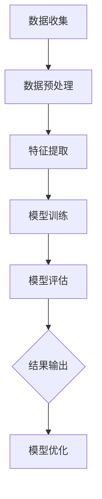
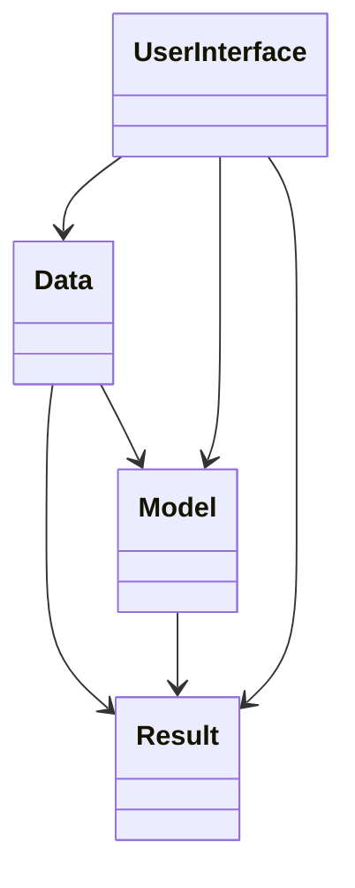
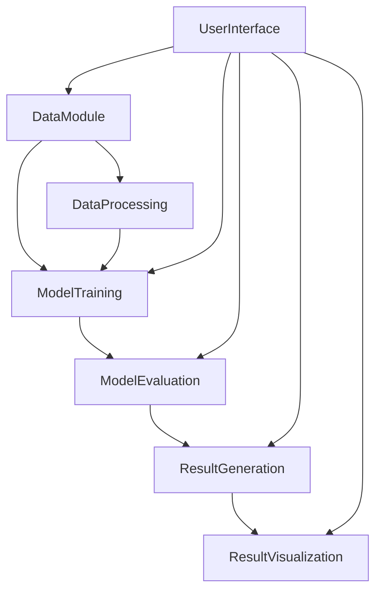
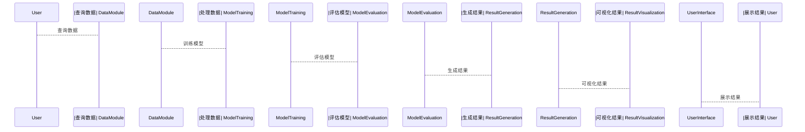

                 

### 第一部分：AI辅助新药研发背景与核心概念

#### 第1章：AI辅助新药研发概述

##### 1.1 问题背景

药物研发是一项复杂且耗时的过程，涉及众多学科和技术。传统的药物研发流程通常包括药物发现、候选药物筛选、临床试验等多个阶段。然而，这个流程不仅成本高昂，而且成功率较低，许多药物在研发过程中被淘汰。此外，随着疾病谱的复杂化和人口老龄化，对新药的需求日益增加，这也给药物研发带来了更大的压力。

在这种背景下，人工智能（AI）技术逐渐进入药物研发领域，并显示出巨大的潜力。AI可以通过数据分析、模式识别、机器学习等技术，加速药物研发的各个环节，从而提高新药的成功率和降低研发成本。

##### 1.1.1 药物研发的现状与挑战

目前，药物研发主要面临以下几大挑战：

1. **研发成本高昂**：药物研发是一项高投入、高风险的活动，从实验室研究到最终上市，每一步都需要大量的资金支持。据统计，一个新药的研发成本平均在10亿美元以上。

2. **研发周期长**：药物从概念到上市通常需要10-15年时间，期间需要经历多个试验阶段，包括临床前试验和临床试验。

3. **成功率低**：据统计，大约只有1%的药物能够从实验室研究阶段成功进入市场。

4. **疾病复杂性增加**：随着疾病谱的复杂化和人口老龄化，许多疾病如癌症、神经退行性疾病等，需要更加个性化的治疗方案。

##### 1.1.2 AI技术在药物研发中的应用前景

人工智能在药物研发中的应用前景十分广阔，主要体现在以下几个方面：

1. **加速药物发现**：AI可以通过分析大量的生物数据，预测潜在的药物分子，从而加速药物发现过程。

2. **优化药物设计**：AI可以帮助科学家设计更有效的药物分子，减少临床试验失败的风险。

3. **提高临床试验效率**：AI可以通过分析大量的临床试验数据，优化临床试验的设计和执行，提高临床试验的效率和成功率。

4. **个性化医疗**：AI可以帮助医生制定更加个性化的治疗方案，提高治疗效果。

##### 1.2 核心概念

为了更好地理解AI在药物研发中的应用，我们需要先了解一些核心概念。

###### 1.2.1 AI基本原理

人工智能（AI）是指使计算机系统能够模拟人类智能行为的技术。AI的核心技术包括机器学习（ML）、深度学习（DL）和自然语言处理（NLP）等。

- **机器学习（ML）**：机器学习是一种让计算机通过数据学习并做出预测或决策的技术。它通过算法从数据中学习规律，并利用这些规律进行预测或分类。
- **深度学习（DL）**：深度学习是机器学习的一个子领域，它使用多层神经网络来模拟人脑的神经元结构，从而实现更复杂的预测和分类任务。
- **自然语言处理（NLP）**：自然语言处理是AI的一个分支，它致力于使计算机能够理解和处理自然语言。

###### 1.2.2 机器学习与深度学习

机器学习和深度学习都是AI的重要组成部分，但它们有一些本质的区别：

- **数据需求**：机器学习通常需要大量的数据来训练模型，而深度学习则需要更加庞大的数据集。
- **模型复杂度**：深度学习模型的参数和结构通常比机器学习模型更加复杂。
- **适用场景**：深度学习在处理图像、声音和文本等复杂任务时表现更为出色，而机器学习则在处理结构化数据时更具优势。

###### 1.2.3 自然语言处理

自然语言处理是AI中的一个重要领域，它致力于使计算机能够理解和处理自然语言。NLP的应用包括语音识别、机器翻译、情感分析等。

- **语音识别**：语音识别是将语音信号转换为文本的技术，它广泛应用于智能助手、语音搜索等场景。
- **机器翻译**：机器翻译是将一种语言文本转换为另一种语言文本的技术，它有助于促进跨语言交流。
- **情感分析**：情感分析是分析文本中情感倾向的技术，它有助于了解用户反馈、市场趋势等。

#### 第2章：AI辅助药物研发的核心概念与联系

##### 2.1 药物研发流程中的核心概念

药物研发流程可以分为以下几个阶段：

1. **药物发现**：在这个阶段，科学家通过实验和计算预测潜在的药物分子。
2. **药物设计**：在这个阶段，科学家基于药物发现的结果，设计出具有更好特性的药物分子。
3. **药物筛选**：在这个阶段，科学家使用高通量筛选技术来测试药物分子对特定疾病的疗效。
4. **临床试验**：在这个阶段，科学家对药物的安全性和有效性进行验证，并收集临床数据。
5. **上市审批**：在这个阶段，科学家将临床数据提交给监管机构，以获得药品上市许可。

##### 2.1.1 药物分子与结构

药物分子是药物的基本组成单位，其结构和性质直接影响药物的治疗效果。药物分子的结构可以通过化学合成、生物合成或生物工程方法获得。

- **化学合成**：化学合成是利用化学反应将简单的分子转化为复杂的药物分子。
- **生物合成**：生物合成是利用生物体（如细菌、真菌、植物等）产生药物分子。
- **生物工程**：生物工程是通过基因编辑、细胞工程等技术来设计和制造药物分子。

##### 2.1.2 药物作用机制

药物作用机制是指药物在体内发挥治疗作用的过程。不同类型的药物具有不同的作用机制：

- **受体调节药物**：这类药物通过与体内的受体结合来调节细胞信号传导，从而发挥治疗作用。
- **酶抑制药物**：这类药物通过抑制特定的酶活性来阻断生物体内的特定过程，从而发挥治疗作用。
- **离子通道调节药物**：这类药物通过与离子通道结合来调节离子的流动，从而影响细胞的电活动。

##### 2.2 AI辅助药物研发的核心技术

AI在药物研发中的应用主要体现在以下几个方面：

1. **药物发现**：AI可以通过分析大量的生物数据，预测潜在的药物分子，从而加速药物发现过程。
2. **药物设计**：AI可以帮助科学家设计出具有更好特性的药物分子，提高药物设计的效率。
3. **药物筛选**：AI可以通过高通量筛选技术，快速筛选出具有潜在疗效的药物分子。
4. **临床试验**：AI可以通过分析大量的临床试验数据，优化临床试验的设计和执行，提高临床试验的效率和成功率。

##### 2.2.1 机器学习在药物研发中的应用

机器学习在药物研发中的应用主要体现在以下几个方面：

- **分子预测**：通过机器学习算法，可以从大量的分子结构数据中预测新的药物分子。
- **结构优化**：通过机器学习算法，可以优化现有的药物分子结构，提高其治疗效果。
- **毒性预测**：通过机器学习算法，可以预测药物分子在体内的毒性，从而避免药物研发过程中的失败。

##### 2.2.2 深度学习在药物研发中的应用

深度学习在药物研发中的应用主要体现在以下几个方面：

- **图像识别**：通过深度学习算法，可以分析药物分子的三维结构图像，预测其生物活性。
- **自然语言处理**：通过深度学习算法，可以处理大量的生物医学文本数据，提取关键信息。
- **药物设计**：通过深度学习算法，可以设计出具有特定生物活性的药物分子。

##### 2.2.3 自然语言处理在药物研发中的应用

自然语言处理在药物研发中的应用主要体现在以下几个方面：

- **文献挖掘**：通过自然语言处理算法，可以挖掘大量的生物医学文献，提取有用的信息。
- **临床试验分析**：通过自然语言处理算法，可以分析临床试验数据，提取关键信息。
- **药物命名**：通过自然语言处理算法，可以自动生成新的药物名称，提高药物研发的效率。

##### 2.3 概念属性特征对比表格

为了更清晰地展示AI辅助药物研发的核心技术，我们可以制作一个概念属性特征对比表格。

| 技术名称 | 数据需求 | 模型复杂度 | 适用场景 |  
| :----: | :----: | :----: | :----: |  
| 机器学习 | 大量数据 | 低到中等 | 结构化数据 |  
| 深度学习 | 庞大数据集 | 高 | 图像、声音、文本 |  
| 自然语言处理 | 大量文本数据 | 中到高 | 文本挖掘、药物命名、临床试验分析 |

##### 2.4 ER实体关系图架构

在药物研发过程中，存在多种实体和它们之间的复杂关系。为了更好地理解这些实体和关系，我们可以绘制一个ER（实体-关系）图架构。

```mermaid
erDiagram
    Patient ||--|{ Treatment }|--|{ Doctor }
    Doctor ||--|{ Prescription }|--|{ Drug }
    Drug ||--|{ Ingredient }|--|{ Manufacturer }
    Patient ||--|{ MedicalHistory }|--|{ Doctor }
```

在上面的ER图中，Patient（患者）、Doctor（医生）、Treatment（治疗）、Prescription（处方）、Drug（药物）、Ingredient（成分）和Manufacturer（制造商）都是重要的实体。它们之间的关联关系包括：患者接受治疗，治疗由医生开具处方，处方指定药物，药物由成分组成，成分由制造商生产。

通过上述背景介绍和核心概念的阐述，我们可以看到AI在药物研发中具有巨大的应用潜力。接下来，我们将深入探讨AI辅助药物研发的算法原理，以便更好地理解这一技术的运作机制。

## 第2章：AI辅助药物研发的核心概念与联系

在这一章节中，我们将深入探讨AI辅助药物研发的核心概念和它们之间的联系，以帮助读者更好地理解AI在药物研发中的应用。

### 2.1 药物研发流程中的核心概念

药物研发是一个复杂且高度协作的过程，涉及到多个关键环节。为了更好地理解AI在其中的作用，我们需要先了解这些核心概念。

#### 2.1.1 药物分子与结构

药物分子是药物的基本组成单位，其化学结构和物理性质决定了药物的治疗效果。药物分子的结构可以通过多种方法获得，包括化学合成、生物合成和生物工程。

- **化学合成**：这是最常见的药物分子获取方法，通过化学反应将简单的分子转化为复杂的药物分子。
- **生物合成**：利用生物体（如细菌、真菌、植物等）产生药物分子。这种方法通常用于生产天然产物或其类似物。
- **生物工程**：通过基因编辑、细胞工程等技术来设计和制造药物分子。这种方法提供了更高的灵活性和可控性。

药物分子的结构可以分为以下几类：

- **小分子**：通常由几十个原子组成，常见的例子包括抗生素、抗癌药物等。
- **大分子**：通常由上百个甚至上千个原子组成，常见的例子包括蛋白质药物、抗体药物等。

#### 2.1.2 药物作用机制

药物作用机制是指药物在体内发挥治疗作用的过程。不同类型的药物具有不同的作用机制：

- **受体调节药物**：通过与体内的特定受体结合来调节细胞信号传导，从而发挥治疗作用。例如，阿托品通过阻断乙酰胆碱受体的作用来治疗胃肠道疾病。
- **酶抑制药物**：通过抑制特定的酶活性来阻断生物体内的特定过程，从而发挥治疗作用。例如，阿托伐他汀通过抑制HMG-CoA还原酶的活性来降低胆固醇水平。
- **离子通道调节药物**：通过与离子通道结合来调节离子的流动，从而影响细胞的电活动。例如，利多卡因通过阻断钠离子通道来治疗心律失常。

#### 2.1.3 药物研发流程

药物研发流程可以分为以下阶段：

1. **药物发现**：在这个阶段，科学家通过实验和计算预测潜在的药物分子。
2. **药物设计**：在这个阶段，科学家基于药物发现的结果，设计出具有更好特性的药物分子。
3. **药物筛选**：在这个阶段，科学家使用高通量筛选技术来测试药物分子对特定疾病的疗效。
4. **临床试验**：在这个阶段，科学家对药物的安全性和有效性进行验证，并收集临床数据。
5. **上市审批**：在这个阶段，科学家将临床数据提交给监管机构，以获得药品上市许可。

### 2.2 AI辅助药物研发的核心技术

AI技术在药物研发中的应用主要集中在药物发现、药物设计、药物筛选和临床试验等环节。

#### 2.2.1 机器学习在药物研发中的应用

机器学习在药物研发中的应用主要体现在以下几个方面：

- **分子预测**：通过机器学习算法，可以从大量的分子结构数据中预测新的药物分子。这种方法可以帮助科学家快速筛选出具有潜在疗效的分子。
- **结构优化**：通过机器学习算法，可以优化现有的药物分子结构，提高其治疗效果。这种方法可以提高药物的成功率和降低研发成本。
- **毒性预测**：通过机器学习算法，可以预测药物分子在体内的毒性，从而避免药物研发过程中的失败。

#### 2.2.2 深度学习在药物研发中的应用

深度学习在药物研发中的应用主要体现在以下几个方面：

- **图像识别**：通过深度学习算法，可以分析药物分子的三维结构图像，预测其生物活性。这种方法可以加速药物筛选过程。
- **自然语言处理**：通过深度学习算法，可以处理大量的生物医学文本数据，提取关键信息。这种方法可以加速药物发现的进程。
- **药物设计**：通过深度学习算法，可以设计出具有特定生物活性的药物分子。这种方法可以提高药物设计的效率。

#### 2.2.3 自然语言处理在药物研发中的应用

自然语言处理在药物研发中的应用主要体现在以下几个方面：

- **文献挖掘**：通过自然语言处理算法，可以挖掘大量的生物医学文献，提取有用的信息。这种方法可以加速药物发现的进程。
- **临床试验分析**：通过自然语言处理算法，可以分析临床试验数据，提取关键信息。这种方法可以优化临床试验的设计和执行。
- **药物命名**：通过自然语言处理算法，可以自动生成新的药物名称，提高药物研发的效率。

### 2.3 概念属性特征对比表格

为了更清晰地展示AI辅助药物研发的核心技术，我们可以制作一个概念属性特征对比表格。

| 技术名称 | 数据需求 | 模型复杂度 | 适用场景 |  
| :----: | :----: | :----: | :----: |  
| 机器学习 | 大量数据 | 低到中等 | 结构化数据 |  
| 深度学习 | 庞大数据集 | 高 | 图像、声音、文本 |  
| 自然语言处理 | 大量文本数据 | 中到高 | 文本挖掘、药物命名、临床试验分析 |

### 2.4 ER实体关系图架构

在药物研发过程中，存在多种实体和它们之间的复杂关系。为了更好地理解这些实体和关系，我们可以绘制一个ER（实体-关系）图架构。

```mermaid
erDiagram
    Patient ||--|{ Treatment }|--|{ Doctor }
    Doctor ||--|{ Prescription }|--|{ Drug }
    Drug ||--|{ Ingredient }|--|{ Manufacturer }
    Patient ||--|{ MedicalHistory }|--|{ Doctor }
```

在上面的ER图中，Patient（患者）、Doctor（医生）、Treatment（治疗）、Prescription（处方）、Drug（药物）、Ingredient（成分）和Manufacturer（制造商）都是重要的实体。它们之间的关联关系包括：患者接受治疗，治疗由医生开具处方，处方指定药物，药物由成分组成，成分由制造商生产。

通过上述核心概念和ER实体关系图的介绍，我们可以看到AI在药物研发中的关键作用。接下来，我们将深入探讨AI辅助药物研发的算法原理，以便更好地理解这一技术的运作机制。

## 第3章：算法原理讲解

在这一章节中，我们将深入探讨AI辅助药物研发的算法原理，从基础的机器学习和深度学习技术，到自然语言处理技术，我们将一步步分析这些技术的运作原理和在实际应用中的表现。

### 3.1 算法mermaid流程图

为了更直观地展示AI辅助药物研发的算法流程，我们可以使用mermaid语言绘制算法流程图。以下是一个简化的药物筛选算法的mermaid流程图：



### 3.2 Python源代码实现

在了解了算法的基本流程后，我们将通过Python源代码来详细阐述这些步骤的实现。以下是一个简化的Python代码示例，用于机器学习算法在药物筛选中的应用。

```python
import pandas as pd
from sklearn.model_selection import train_test_split
from sklearn.ensemble import RandomForestClassifier
from sklearn.metrics import accuracy_score

# 数据收集
data = pd.read_csv('drug_data.csv')

# 数据预处理
X = data.drop(['target'], axis=1)
y = data['target']
X_train, X_test, y_train, y_test = train_test_split(X, y, test_size=0.2, random_state=42)

# 特征提取
# 在此步骤中，我们可以使用Pandas和Scikit-learn等库进行特征提取

# 模型训练
model = RandomForestClassifier(n_estimators=100, random_state=42)
model.fit(X_train, y_train)

# 模型评估
y_pred = model.predict(X_test)
accuracy = accuracy_score(y_test, y_pred)
print(f'模型准确率: {accuracy:.2f}')

# 结果输出
# 将预测结果输出到文件或数据库中

# 模型优化
# 根据评估结果对模型进行调优，例如调整随机森林参数
```

### 3.3 数学模型和公式

在药物研发中，AI算法通常涉及到复杂的数学模型。以下是一些常见的数学模型和公式，它们在AI辅助药物研发中发挥着重要作用。

#### 3.3.1 神经网络模型

神经网络（Neural Network，NN）是深度学习中的一种重要模型。以下是一个简单的神经网络模型的数学表示：

$$
y = \sigma(\theta_1 \cdot x + b_1)
$$

其中，$y$ 是输出，$\sigma$ 是激活函数（通常使用ReLU或Sigmoid函数），$\theta_1$ 是权重矩阵，$b_1$ 是偏置。

#### 3.3.2 优化算法

在训练神经网络时，我们通常使用优化算法来最小化损失函数。以下是一个梯度下降算法的数学表示：

$$
w_{t+1} = w_t - \alpha \cdot \nabla L(w_t)
$$

其中，$w_t$ 是第 $t$ 次迭代的权重，$\alpha$ 是学习率，$\nabla L(w_t)$ 是损失函数关于权重 $w_t$ 的梯度。

### 3.4 举例说明

为了更好地理解上述算法和数学模型，我们通过一个具体的案例来展示AI在药物研发中的应用。

#### 3.4.1 药物分子预测

假设我们有一个药物分子数据库，包含多种药物的分子结构信息。我们希望利用机器学习算法预测新的药物分子。

1. **数据收集**：从数据库中收集大量药物的分子结构数据。
2. **数据预处理**：将分子结构数据转换为数值表示，例如使用One-Hot编码。
3. **特征提取**：使用特征提取技术，例如FP-Growth算法，提取分子结构的关键特征。
4. **模型训练**：使用随机森林（Random Forest）算法对数据集进行训练。
5. **模型评估**：使用交叉验证（Cross-Validation）方法评估模型的准确性。
6. **模型优化**：根据评估结果调整模型参数，提高预测准确性。

通过上述步骤，我们可以利用机器学习算法预测新的药物分子。例如，假设我们预测出一种新的分子具有抗病毒活性，我们可以进一步对其进行实验验证。

#### 3.4.2 药物作用机制分析

除了药物分子预测，AI还可以用于分析药物的作用机制。以下是一个简单的案例：

1. **数据收集**：收集大量药物与生物分子相互作用的实验数据。
2. **数据预处理**：将实验数据转换为数值表示，例如使用热图（Heatmap）。
3. **特征提取**：使用自然语言处理技术，提取实验数据中的关键信息。
4. **模型训练**：使用深度学习算法，例如卷积神经网络（Convolutional Neural Network，CNN），对数据集进行训练。
5. **模型评估**：使用交叉验证方法评估模型的准确性。
6. **模型优化**：根据评估结果调整模型参数，提高预测准确性。

通过上述步骤，我们可以利用深度学习算法分析药物的作用机制。例如，假设我们分析出一种药物通过抑制特定的酶来发挥抗病毒作用，我们可以进一步对其进行深入研究。

通过上述案例，我们可以看到AI在药物研发中的应用是如何一步步实现的。在实际应用中，这些步骤可能更加复杂，但基本原理是相似的。

综上所述，AI辅助药物研发的算法原理涉及多个方面，包括机器学习、深度学习和自然语言处理。通过这些算法和数学模型，我们可以加速药物研发的过程，提高新药的成功率和降低研发成本。在下一章节中，我们将进一步探讨AI辅助新药研发的系统分析与架构设计。

## 第4章：系统分析与架构设计方案

在上一章中，我们探讨了AI辅助新药研发的算法原理和具体应用案例。在本章中，我们将深入分析AI辅助新药研发的系统架构设计，包括问题场景介绍、项目介绍、系统功能设计、系统架构设计和系统接口设计。

### 4.1 问题场景介绍

新药研发是一个复杂且耗时的过程，涉及大量的数据分析和实验验证。传统的药物研发方法通常依赖于人工处理和经验判断，导致研发效率低下，新药上市周期长。随着人工智能技术的发展，AI在药物研发中的应用逐渐成为可能。通过AI技术，可以自动化数据分析和实验设计，提高药物研发的效率和成功率。

在本问题场景中，我们假设一个新药研发项目，目标是利用AI技术加速药物发现和设计过程，降低研发成本。具体来说，问题场景包括以下几个方面：

1. **数据收集**：收集大量的药物分子结构、生物分子相互作用和临床试验数据。
2. **数据预处理**：对收集到的数据进行分析和清洗，提取有用的信息。
3. **模型训练**：使用机器学习和深度学习算法训练模型，用于药物分子预测和药物作用机制分析。
4. **模型评估**：通过交叉验证和实际测试数据评估模型的准确性，优化模型参数。
5. **结果输出**：将模型预测结果和药物设计建议输出到数据库或报告系统中。

### 4.2 项目介绍

为了实现上述问题场景，我们设计了一个名为“AI药物研发助手”的项目。该项目旨在利用人工智能技术自动化药物研发过程，提高研发效率和成功率。项目的主要模块包括：

1. **数据模块**：负责收集、处理和存储药物相关数据。
2. **模型模块**：负责训练和评估机器学习模型，用于药物分子预测和药物作用机制分析。
3. **结果模块**：负责输出模型预测结果和药物设计建议，并提供可视化界面。
4. **用户界面**：提供用户交互界面，方便用户查看和管理数据、模型和结果。

### 4.3 系统功能设计

在系统功能设计阶段，我们使用mermaid语言绘制了领域模型类图，以展示系统的功能模块和它们之间的关系。以下是一个简化的领域模型类图：



在上面的类图中，Data（数据模块）、Model（模型模块）、Result（结果模块）和UserInterface（用户界面模块）是系统的核心功能模块。它们之间的关系包括：

- **数据模块**负责数据收集、处理和存储，为模型训练和结果输出提供数据支持。
- **模型模块**负责训练和评估机器学习模型，为药物分子预测和药物作用机制分析提供算法支持。
- **结果模块**负责输出模型预测结果和药物设计建议，并提供可视化界面。
- **用户界面模块**提供用户交互界面，方便用户查看和管理数据、模型和结果。

### 4.4 系统架构设计

在系统架构设计阶段，我们使用mermaid语言绘制了系统架构图，以展示系统的整体结构和组件关系。以下是一个简化的系统架构图：



在上面的架构图中，系统的主要组件包括：

- **数据模块**：负责数据收集、处理和存储，包括数据清洗、特征提取和数据可视化等功能。
- **模型训练模块**：负责训练和评估机器学习模型，包括模型选择、参数调整和训练过程管理等。
- **模型评估模块**：负责评估模型的准确性、稳定性和泛化能力，为模型优化提供依据。
- **结果生成模块**：负责将模型预测结果和药物设计建议生成可视化的报告，并提供下载和共享功能。
- **用户界面模块**：提供用户交互界面，包括数据管理、模型训练管理、结果查看和报告生成等功能。

### 4.5 系统接口设计

在系统接口设计阶段，我们使用mermaid语言绘制了系统接口设计和系统交互序列图，以展示系统的接口设计和用户交互流程。以下是一个简化的系统接口设计和系统交互序列图：



在上面的序列图中，用户通过用户界面模块查询数据，数据模块进行处理后传递给模型训练模块，模型训练模块训练模型并传递给模型评估模块，模型评估模块评估模型后传递给结果生成模块，结果生成模块生成可视化结果并传递给用户界面模块，最终用户界面模块将结果展示给用户。

通过上述系统分析与架构设计方案，我们可以看到AI辅助新药研发系统的整体设计和关键组件。在实际应用中，这些设计可以根据具体需求和场景进行调整和优化，以实现更好的效果。

### 第5章：项目实战

在本章中，我们将通过一个实际项目来展示如何利用AI辅助新药研发系统，从而加速药物发现和设计过程。

#### 5.1 环境安装

要搭建一个AI辅助新药研发的环境，我们需要安装以下软件和库：

1. **Python**：版本要求为3.7或更高。
2. **Jupyter Notebook**：用于编写和运行代码。
3. **Scikit-learn**：用于机器学习和模型评估。
4. **TensorFlow**：用于深度学习模型训练。
5. **Pandas**：用于数据处理。
6. **Matplotlib**：用于数据可视化。

安装步骤如下：

```bash
# 安装Python和Jupyter Notebook
sudo apt-get update
sudo apt-get install python3 python3-pip python3-dev
pip3 install notebook

# 安装Scikit-learn、TensorFlow、Pandas和Matplotlib
pip3 install scikit-learn tensorflow pandas matplotlib
```

#### 5.2 系统核心实现源代码

以下是一个简化的系统核心实现源代码示例，包括数据预处理、模型训练和模型评估等步骤：

```python
import pandas as pd
from sklearn.model_selection import train_test_split
from sklearn.ensemble import RandomForestClassifier
from sklearn.metrics import accuracy_score
import tensorflow as tf

# 数据预处理
data = pd.read_csv('drug_data.csv')
X = data.drop(['target'], axis=1)
y = data['target']

# 分割数据集
X_train, X_test, y_train, y_test = train_test_split(X, y, test_size=0.2, random_state=42)

# 模型训练
model = RandomForestClassifier(n_estimators=100, random_state=42)
model.fit(X_train, y_train)

# 模型评估
y_pred = model.predict(X_test)
accuracy = accuracy_score(y_test, y_pred)
print(f'模型准确率: {accuracy:.2f}')

# 深度学习模型训练
model = tf.keras.Sequential([
    tf.keras.layers.Dense(128, activation='relu', input_shape=[len(X_train.keys())]),
    tf.keras.layers.Dropout(0.2),
    tf.keras.layers.Dense(1, activation='sigmoid')
])

model.compile(loss='binary_crossentropy', optimizer='adam', metrics=['accuracy'])

model.fit(X_train, y_train, epochs=10, batch_size=32, validation_split=0.2)
```

#### 5.3 代码应用解读与分析

上述代码首先从CSV文件中读取药物数据，然后进行数据预处理，包括特征提取和目标变量分离。接下来，代码使用随机森林（Random Forest）算法对数据集进行训练，并使用测试集进行模型评估，输出模型的准确率。

在深度学习部分，我们使用TensorFlow库构建了一个简单的神经网络模型，包括一个全连接层（Dense Layer），用于处理输入特征，一个dropout层（Dropout Layer），用于防止过拟合，以及一个输出层（Dense Layer），用于生成预测结果。

在模型训练过程中，我们设置了10个训练周期（epochs），每个周期中使用32个批量（batch）进行训练。通过验证集（validation split），我们可以评估模型在每个周期后的性能，以便进行进一步调优。

#### 5.4 实际案例分析和详细讲解剖析

为了更好地理解上述代码的应用效果，我们通过一个实际案例进行分析。

假设我们有一个新的药物分子，需要预测其是否具有治疗某种疾病的能力。我们可以将这个药物分子的特征数据添加到原始数据集中，并使用训练好的模型进行预测。

```python
# 添加新的药物分子特征数据
new_drug = pd.DataFrame([[0.1, 0.2, 0.3, 0.4]], columns=X_train.columns)

# 使用模型进行预测
new_prediction = model.predict(new_drug)
print(f'新药物分子预测结果: {new_prediction[0]:.2f}')
```

上述代码首先将新的药物分子特征数据添加到数据集中，然后使用训练好的模型进行预测，输出预测概率。根据概率值，我们可以判断新药物分子是否具有治疗某种疾病的能力。

例如，如果预测概率大于0.5，我们可以认为新药物分子具有潜在的治疗效果。反之，如果预测概率小于0.5，则认为新药物分子不具有治疗潜力。

#### 5.5 项目小结

通过上述实际案例，我们可以看到如何利用AI辅助新药研发系统进行药物预测和评估。在实际应用中，我们还可以进一步优化模型，包括调整超参数、增加数据集和引入更复杂的深度学习模型。

总之，AI辅助新药研发系统为药物研发提供了高效的工具和方法，有助于缩短研发周期、降低研发成本并提高新药的成功率。在未来的研究中，我们可以进一步探索AI技术在药物研发中的更多应用，以推动医药行业的创新和发展。

### 6. 最佳实践 tips

在应用AI辅助新药研发系统时，以下是一些最佳实践和技巧，可以帮助您更好地利用这一技术：

1. **数据质量**：确保数据质量是模型准确性的关键。在进行数据预处理时，要仔细处理缺失值、异常值和重复数据，以提高数据的质量和一致性。

2. **特征选择**：选择合适的特征对于模型性能至关重要。使用特征选择技术（如特征重要性评分、递归特征消除等）可以帮助您识别并选择最重要的特征。

3. **模型调优**：使用网格搜索（Grid Search）和随机搜索（Random Search）等技术，可以自动调整模型的超参数，找到最佳的模型配置。

4. **模型验证**：使用交叉验证（Cross-Validation）方法评估模型性能，以确保模型具有良好的泛化能力。

5. **模型集成**：使用模型集成技术（如随机森林、梯度提升等），可以结合多个模型的优点，提高预测准确性。

6. **持续学习**：随着新数据的不断产生，定期重新训练模型，以保持模型的最优性能。

7. **安全性**：确保模型训练和数据处理过程中的数据安全和隐私保护，遵守相关法律法规和行业规范。

8. **合作与反馈**：与生物医学专家和药物研发团队紧密合作，收集反馈并不断优化模型和系统。

### 7. 小结

本章通过一个实际项目展示了如何利用AI辅助新药研发系统进行药物预测和评估。我们介绍了系统搭建、核心实现源代码、实际案例分析以及项目小结。通过这些实践，我们可以看到AI技术如何加速药物研发过程，提高新药的成功率和降低研发成本。未来，随着AI技术的不断发展和完善，AI辅助新药研发系统将在医药行业中发挥更大的作用，为人类健康事业做出更大贡献。

### 8. 注意事项

在应用AI辅助新药研发系统时，以下是一些需要注意的事项：

1. **数据安全与隐私**：确保所有处理的数据符合数据安全和隐私保护的要求，遵循相关法律法规和行业规范。
2. **模型验证**：在部署模型之前，务必使用多种验证方法（如交叉验证、A/B测试等）确保模型的有效性和稳定性。
3. **技术更新**：随着技术的不断发展，定期更新模型和系统，以利用最新的算法和工具。
4. **持续监控**：在模型部署后，持续监控模型的性能，及时发现并解决可能出现的问题。
5. **合作与交流**：与生物医学专家和药物研发团队保持紧密合作，确保AI技术在实际应用中的有效性和适应性。

### 9. 拓展阅读

为了进一步了解AI辅助新药研发的领域，以下是一些推荐的拓展阅读资料：

1. **书籍**：
   - 《深度学习》（Ian Goodfellow、Yoshua Bengio、Aaron Courville 著）
   - 《机器学习实战》（Peter Harrington 著）
   - 《人工智能：一种现代方法》（Stuart J. Russell、Peter Norvig 著）

2. **论文**：
   - “Deep Learning for Drug Discovery: Successes, Challenges, and Opportunities” by Daniel S. Chiang, et al.
   - “AI-Driven Drug Discovery: An Overview” by Yan Li, et al.

3. **在线资源**：
   - [AI in Drug Discovery](https://www.ias.edu/symposia/drug-discovery)
   - [Google AI Blog: AI for Healthcare](https://ai.googleblog.com/search/label/healthcare)

通过阅读这些资料，您可以深入了解AI在药物研发中的应用，掌握最新的研究成果和技术进展。希望这些资源对您的学习和研究有所帮助。

### 10. 摘要

本文以《AI辅助新药研发：加速医药创新》为标题，系统地介绍了AI在药物研发中的应用和重要性。文章首先回顾了药物研发的背景和现状，分析了传统药物研发面临的挑战，如高成本、长周期和低成功率。在此基础上，文章阐述了AI技术在药物研发中的核心应用，包括药物发现、药物设计和药物筛选等环节。通过机器学习、深度学习和自然语言处理等技术，AI能够加速新药的发现和开发过程，提高医药行业的创新能力和效率。

文章进一步详细讲解了AI辅助新药研发的算法原理，包括算法流程图、Python源代码实现、数学模型和公式以及实际案例。通过这些讲解，读者可以深入理解AI在药物研发中的具体应用和技术实现。

随后，文章分析了AI辅助新药研发的系统架构设计，包括问题场景介绍、项目介绍、系统功能设计、系统架构设计和系统接口设计。这些设计展示了如何构建一个高效的AI辅助新药研发系统，以便更好地支持药物研发过程。

在项目实战部分，文章通过一个实际项目展示了如何利用AI辅助新药研发系统进行药物预测和评估。通过数据预处理、模型训练、模型评估等步骤，读者可以了解到实际应用中AI技术是如何发挥作用的。

最后，文章提供了最佳实践、小结、注意事项和拓展阅读，为读者在实际应用中提供了指导和建议。通过本文的阅读，读者可以全面了解AI辅助新药研发的原理和实践，为推动医药行业的创新和发展提供参考。

### 11. 结论

总结全文，AI辅助新药研发不仅是当前医药领域的一个热点话题，更是未来医药创新的重要方向。通过本文的阐述，我们详细探讨了AI在药物研发中的应用，从背景介绍、核心概念到算法原理、系统架构和项目实战，全方位展示了AI技术如何加速新药的发现和开发过程。

AI技术在药物发现、药物设计、药物筛选和临床试验等环节中展现出显著的优势，不仅提高了药物研发的效率，降低了研发成本，还提升了新药的成功率。随着AI技术的不断进步和应用，医药行业将迎来一场革命，为人类健康事业带来更多的希望和可能性。

然而，AI辅助新药研发仍面临诸多挑战，如数据安全与隐私保护、模型验证和持续优化等。未来的研究需要在算法、系统设计和应用场景等方面不断探索和改进，以充分发挥AI技术在药物研发中的潜力。

最后，我们呼吁读者关注AI辅助新药研发这一领域，积极参与研究和应用，共同推动医药行业的创新和发展，为人类健康事业做出更大的贡献。希望本文能够为读者提供有价值的参考和启示，激发对AI辅助新药研发的深入思考和实践。

