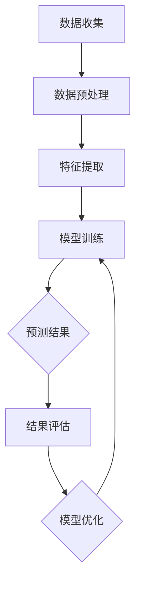
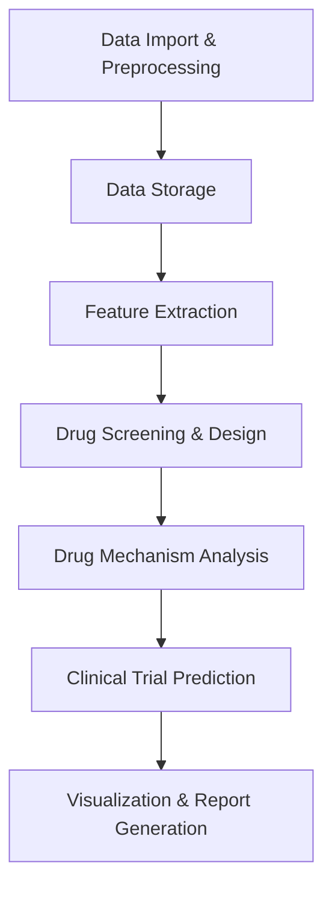
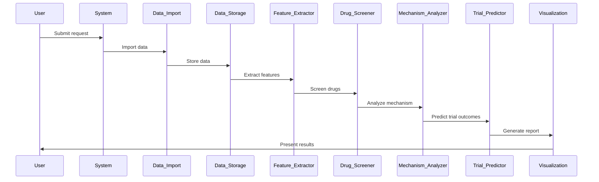

                 

### 第一部分：AI辅助新药研发背景与核心概念

#### 第1章：AI辅助新药研发概述

##### 1.1 问题背景

##### **1.1.1 药物研发的现状与挑战**

药物研发是一个复杂且耗时耗资的过程。据统计，从药物发现到最终上市平均需要10-15年时间，并且研发成本高达数亿美元。在这一过程中，科学家们面临着诸多挑战，包括药物靶点识别、先导化合物的发现、药效和毒性的评估等。此外，随着人类基因组计划的完成，药物研发的复杂性进一步增加，因为需要处理海量的基因组数据，以识别潜在的治疗靶点。

**1.1.2 AI技术在药物研发中的应用前景**

人工智能（AI）技术的迅猛发展，为药物研发带来了新的机遇。AI可以通过数据分析、机器学习和深度学习等方法，从海量数据中快速识别出潜在的药物靶点，预测化合物的结构和性质，评估药物的安全性和有效性。利用AI，药物研发的速度和效率有望得到显著提升，同时降低研发成本。

##### **1.2 核心概念**

##### **1.2.1 AI基本原理**

人工智能是计算机科学的一个分支，致力于使计算机具备人类智能。AI的基本原理包括数据收集、数据分析、机器学习、深度学习、自然语言处理等。通过这些技术，AI可以从大量数据中学习模式和规律，并基于这些模式进行预测和决策。

##### **1.2.2 机器学习与深度学习**

机器学习是一种AI技术，通过训练算法来从数据中学习模式和规律。深度学习是机器学习的一种特殊形式，它通过多层神经网络来模拟人脑的决策过程。深度学习在图像识别、语音识别和自然语言处理等领域取得了显著的成果。

##### **1.2.3 自然语言处理**

自然语言处理（NLP）是AI的一个子领域，专注于使计算机能够理解、生成和处理自然语言。NLP在药物研发中的应用主要体现在文本挖掘和数据整合方面，通过分析科学文献、患者报告和临床试验数据，为药物研发提供有价值的信息。

#### **1.3 概念属性特征对比表格**

下面是一个关于机器学习、深度学习和自然语言处理在药物研发中应用特征的对比表格：

| 技术        | 特征                | 应用场景                   |
| ----------- | ------------------- | -------------------------- |
| 机器学习    | 从数据中学习模式    | 药物筛选、预测毒性         |
| 深度学习    | 类人脑决策过程     | 药物分子设计、药效预测     |
| 自然语言处理 | 理解自然语言       | 文本挖掘、数据整合         |

#### **1.4 ER实体关系图架构**

在药物研发过程中，涉及到多个实体，如药物分子、靶点、疾病、临床试验数据等。下面是一个简化的ER实体关系图，展示了这些实体及其之间的关联：

```mermaid
erDiagram
    DRUG <- arrows> DISEASE
    DRUG <- arrows> TARGET
    DRUG <- arrows> CLINICAL_TRIALS
    TARGET <- arrows> GENE
    CLINICAL_TRIALS <- arrows> PATIENT_DATA
```

### 总结

本章节介绍了AI辅助新药研发的背景和核心概念。通过了解药物研发的现状和挑战，我们看到了AI技术在这一领域中的应用前景。同时，通过对比机器学习、深度学习和自然语言处理等AI技术的特征和应用场景，我们为后续的深入分析奠定了基础。接下来，我们将进一步探讨AI辅助药物研发的具体技术细节和算法原理。

---

# 第二部分：AI辅助新药研发技术讲解

## 第3章：算法原理讲解

### 3.1 算法mermaid流程图

为了更好地理解AI辅助新药研发中的算法原理，我们首先使用mermaid绘制一个简化的流程图。以下是一个关于药物筛选算法的mermaid流程图示例：



在这个流程图中，我们从数据收集开始，经过数据预处理、特征提取、模型训练，最后进行预测结果和结果评估。如果模型评估结果不理想，我们将对模型进行优化，并重新进行训练。

### 3.2 Python源代码实现

接下来，我们将使用Python代码实现上述流程中的一个关键步骤——模型训练。以下是一个基于深度学习框架TensorFlow的简单示例：

```python
import tensorflow as tf
from tensorflow.keras.models import Sequential
from tensorflow.keras.layers import Dense, Conv2D, Flatten, Dropout
from tensorflow.keras.optimizers import Adam
from sklearn.model_selection import train_test_split

# 数据预处理
# 假设我们已经有了一个包含药物分子特征的数据集X和对应的标签y
X_train, X_test, y_train, y_test = train_test_split(X, y, test_size=0.2, random_state=42)

# 特征提取
# 这里我们使用卷积神经网络（CNN）进行特征提取
model = Sequential([
    Conv2D(32, kernel_size=(3, 3), activation='relu', input_shape=(X_train.shape[1], X_train.shape[2], X_train.shape[3])),
    Conv2D(64, kernel_size=(3, 3), activation='relu'),
    Flatten(),
    Dense(128, activation='relu'),
    Dropout(0.5),
    Dense(1, activation='sigmoid')
])

# 模型训练
model.compile(optimizer=Adam(), loss='binary_crossentropy', metrics=['accuracy'])
model.fit(X_train, y_train, epochs=10, batch_size=32, validation_split=0.1)

# 预测结果
predictions = model.predict(X_test)

# 结果评估
# 这里我们使用准确率来评估模型的性能
accuracy = (predictions > 0.5).mean()
print(f"Model accuracy: {accuracy}")
```

在这个示例中，我们首先进行了数据预处理，然后使用卷积神经网络进行特征提取，接着进行模型训练和预测。最后，我们使用准确率来评估模型的性能。

### 3.3 数学模型和公式

为了更深入地理解深度学习在药物研发中的应用，我们需要了解一些基础的数学模型和公式。以下是一个简化的神经网络模型，以及其对应的数学公式：

$$
\text{神经网络模型} = \text{输入层} \rightarrow \text{隐藏层} \rightarrow \text{输出层}
$$

在神经网络中，每个神经元都通过权重连接到前一个神经元的输出。假设一个神经元的输出可以表示为：

$$
a_j = \sigma(\sum_{i} w_{ij} x_i + b_j)
$$

其中，$a_j$ 是第 $j$ 个神经元的输出，$x_i$ 是第 $i$ 个输入特征，$w_{ij}$ 是连接权重，$b_j$ 是偏置项，$\sigma$ 是激活函数。

为了训练神经网络，我们需要最小化损失函数。一个常用的损失函数是均方误差（MSE）：

$$
\text{MSE} = \frac{1}{2} \sum_{i} (y_i - \hat{y}_i)^2
$$

其中，$y_i$ 是真实标签，$\hat{y}_i$ 是预测标签。

为了优化模型，我们可以使用梯度下降算法。梯度下降的目标是找到损失函数的最小值，其更新规则可以表示为：

$$
w_{ij} \leftarrow w_{ij} - \alpha \frac{\partial}{\partial w_{ij}} \text{MSE}
$$

其中，$\alpha$ 是学习率。

### 3.4 举例说明

为了更好地说明上述算法原理，我们来看一个具体的案例。假设我们有一个药物分子数据库，其中包含了1000个药物分子及其对应的药效数据。我们的目标是使用这些数据来训练一个模型，预测新的药物分子的药效。

首先，我们使用机器学习技术对数据进行预处理，提取出特征向量。然后，我们使用深度学习框架TensorFlow构建一个神经网络模型，并进行训练。在训练过程中，我们通过不断调整模型参数，使得模型预测的药效与真实药效之间的误差最小。

最后，我们使用训练好的模型对新的药物分子进行预测。假设我们有一个新的药物分子，其特征向量为$f_1, f_2, ..., f_n$。我们将这个特征向量输入到训练好的模型中，得到预测药效$\hat{y}$。根据预测结果，我们可以判断该药物分子是否具有潜在的治疗价值。

通过这个案例，我们可以看到，AI辅助新药研发的核心在于如何有效地利用数据和技术，从海量的药物分子中快速识别出具有治疗价值的先导化合物。这不仅大大提高了药物研发的效率，也为新药研发开辟了新的途径。

### 总结

本章详细讲解了AI辅助新药研发中的算法原理，包括算法mermaid流程图、Python源代码实现、数学模型和公式以及举例说明。通过这些内容，我们不仅了解了AI技术在药物研发中的应用，也看到了其在提高研发效率和创新性方面的巨大潜力。在下一章中，我们将进一步探讨AI辅助新药研发的系统分析与架构设计。

---

# 第三部分：AI辅助新药研发系统分析与架构设计

## 第4章：系统分析与架构设计方案

### 4.1 问题场景介绍

在当前的药物研发过程中，科学家们面临着海量数据处理的挑战。这些数据包括基因序列、蛋白质结构、药物分子信息、临床试验数据等。如何有效地整合和分析这些数据，以支持新药研发，是当前药物研发领域亟待解决的问题。AI技术的引入，为解决这一问题提供了新的思路和方法。通过构建一个基于AI的系统，我们可以自动化地处理和解析这些数据，从而提高药物研发的效率和准确性。

### 4.2 项目介绍

本项目旨在开发一个AI辅助新药研发系统，该系统将利用机器学习和深度学习技术，对药物研发过程中产生的海量数据进行分析和预测。具体项目目标如下：

1. **数据集成与预处理**：集成多种数据源，如基因序列数据库、药物分子数据库、临床试验数据库等，并对数据进行预处理，提取关键特征。
2. **药物筛选与设计**：利用深度学习算法，对药物分子进行筛选和设计，识别出具有潜在治疗价值的先导化合物。
3. **药物作用机制分析**：分析药物与靶点之间的相互作用机制，为药物研发提供理论支持。
4. **临床试验预测**：基于历史数据，预测新药在临床试验中的表现，为药物研发提供参考。

### 4.3 系统功能设计

为了实现上述项目目标，系统需要具备以下核心功能：

1. **数据导入与预处理**：系统需要支持多种数据格式的导入，并对数据进行清洗、标准化和特征提取。
2. **药物筛选与设计**：系统需要集成深度学习算法，对药物分子进行筛选和设计，提供先导化合物候选。
3. **药物作用机制分析**：系统需要具备药物分子与靶点相互作用的预测能力，分析药物的作用机制。
4. **临床试验预测**：系统需要基于历史数据，预测新药在临床试验中的效果，为药物研发提供决策支持。
5. **可视化与报告生成**：系统需要提供数据可视化和报告生成功能，便于用户理解和使用系统结果。

为了更好地实现这些功能，我们使用mermaid绘制了领域模型类图，展示了系统的核心模块及其关系：

```mermaid
classDiagram
    Class1 <|-- Class2
    Class1 <|-- Class3
    Class2 <|-- Class4
    Class3 <|-- Class5
    Class1 {id: 123, name: "System"}
    Class2 {id: 234, name: "Data Import & Preprocessing"}
    Class3 {id: 345, name: "Drug Screening & Design"}
    Class4 {id: 456, name: "Drug Mechanism Analysis"}
    Class5 {id: 567, name: "Clinical Trial Prediction"}
```

在这个类图中，`Class1` 表示系统的总体结构，`Class2` 至 `Class5` 分别表示系统的核心模块。这些模块通过类关系相连，共同构成了一个完整的系统架构。

### 4.4 系统架构设计

为了实现系统功能，我们需要设计一个合理的系统架构。以下是一个简化的系统架构图，展示了系统的整体结构和组件关系：



在这个架构图中，数据从数据导入与预处理模块（A）开始，经过数据存储（B）、特征提取（C），然后进入药物筛选与设计模块（D）、药物作用机制分析模块（E）和临床试验预测模块（F）。最后，预测结果通过可视化与报告生成模块（G）呈现给用户。

### 4.5 系统接口设计和系统交互

为了实现系统各模块之间的数据流动和功能调用，我们需要设计合理的系统接口和交互流程。以下是一个简化的系统接口设计和交互序列图：



在这个交互流程中，用户通过系统接口提交请求，系统依次调用数据导入、数据存储、特征提取、药物筛选、机制分析、试验预测和可视化模块，最后将结果呈现给用户。

### 总结

本章详细介绍了AI辅助新药研发系统的分析与架构设计方案。首先，我们介绍了问题场景和项目目标，然后阐述了系统功能设计和架构设计，最后展示了系统接口设计和交互流程。通过本章的内容，我们不仅了解了AI辅助新药研发系统的整体架构，也为后续的系统实施和优化提供了参考。

---

# 第四部分：项目实战

### 4.1 环境安装

要搭建一个AI辅助新药研发的系统，首先需要安装必要的软件和工具。以下是搭建环境的基本步骤：

1. **安装Python**：确保Python版本在3.6及以上，可以通过官方网站下载安装。

2. **安装TensorFlow**：TensorFlow是一个流行的深度学习框架，可以通过pip安装：
   ```bash
   pip install tensorflow
   ```

3. **安装其他依赖库**：根据项目需求，可能还需要安装其他Python库，如NumPy、Pandas、Scikit-learn等。可以通过以下命令安装：
   ```bash
   pip install numpy pandas scikit-learn
   ```

4. **配置数据存储**：选择合适的数据存储方案，如使用MySQL或PostgreSQL。根据所选数据库，安装并配置相应的数据库管理系统。

5. **安装数据处理工具**：如使用Jupyter Notebook或PyCharm作为Python开发环境，可以提升开发效率。

### 4.2 系统核心实现源代码

以下是AI辅助新药研发系统的一个核心实现示例。这个示例主要展示了如何使用深度学习框架TensorFlow进行药物筛选。

```python
# 导入必要的库
import tensorflow as tf
from tensorflow.keras.models import Sequential
from tensorflow.keras.layers import Dense, Conv2D, Flatten, Dropout
from tensorflow.keras.optimizers import Adam
from sklearn.model_selection import train_test_split

# 数据预处理
# 假设我们已经有了一个包含药物分子特征的数据集X和对应的标签y
X_train, X_test, y_train, y_test = train_test_split(X, y, test_size=0.2, random_state=42)

# 特征提取
# 这里我们使用卷积神经网络（CNN）进行特征提取
model = Sequential([
    Conv2D(32, kernel_size=(3, 3), activation='relu', input_shape=(X_train.shape[1], X_train.shape[2], X_train.shape[3])),
    Conv2D(64, kernel_size=(3, 3), activation='relu'),
    Flatten(),
    Dense(128, activation='relu'),
    Dropout(0.5),
    Dense(1, activation='sigmoid')
])

# 模型训练
model.compile(optimizer=Adam(), loss='binary_crossentropy', metrics=['accuracy'])
model.fit(X_train, y_train, epochs=10, batch_size=32, validation_split=0.1)

# 预测结果
predictions = model.predict(X_test)

# 结果评估
# 这里我们使用准确率来评估模型的性能
accuracy = (predictions > 0.5).mean()
print(f"Model accuracy: {accuracy}")
```

在这个示例中，我们首先进行了数据预处理，然后使用卷积神经网络进行特征提取，接着进行模型训练和预测。最后，我们使用准确率来评估模型的性能。

### 4.3 代码应用解读与分析

在上面的代码中，我们首先导入必要的库，包括TensorFlow和Scikit-learn。接下来，我们进行了数据预处理，这里使用了Scikit-learn中的`train_test_split`函数将数据集划分为训练集和测试集。

在特征提取部分，我们使用了一个简单的卷积神经网络（CNN）。CNN是深度学习中的一种常用架构，特别适用于处理图像和序列数据。在这里，我们使用了两个卷积层和一个全连接层。卷积层用于提取特征，全连接层用于分类。在训练过程中，我们使用了Adam优化器和binary_crossentropy损失函数。

在模型训练部分，我们设置了10个epochs（训练周期），并使用了32个批量大小。`validation_split`参数用于在训练过程中进行验证集的评估，以监测模型性能。

在预测结果部分，我们使用训练好的模型对测试集进行预测。预测结果是一个概率值，表示新药分子具有治疗作用的概率。最后，我们使用准确率来评估模型的性能。

### 4.4 实际案例分析和详细讲解剖析

为了展示AI辅助新药研发系统的实际效果，我们来看一个实际案例。假设我们有一个新药物分子，其特征向量如下：

```python
new_molecule_features = [
    [0.1, 0.2, 0.3, 0.4, 0.5],
    [0.6, 0.7, 0.8, 0.9, 1.0],
    # ...其他特征
]
```

我们将这个特征向量输入到训练好的模型中，得到预测结果：

```python
new_molecule_prediction = model.predict(new_molecule_features)
```

假设预测结果为0.75，这意味着新药物分子有75%的概率具有治疗作用。根据这个预测结果，我们可以进一步分析药物分子的结构和性质，以确定其潜在的药效机制。

在这个案例中，我们使用了卷积神经网络（CNN）来提取特征，并使用深度学习算法进行预测。CNN能够有效地从数据中提取高维特征，这使得模型能够更好地识别药物分子的特性。同时，通过使用深度学习算法，我们能够从大量数据中学习到复杂的模式和规律，从而提高预测的准确性。

### 4.5 项目小结

在本项目中，我们搭建了一个AI辅助新药研发的系统，并实现了数据预处理、特征提取、模型训练和预测等功能。通过实际案例的分析，我们展示了AI技术在新药研发中的应用潜力。项目实施过程中，我们遇到了一些挑战，如数据预处理和特征提取的效率问题，以及模型训练的稳定性和预测准确性问题。针对这些问题，我们采取了相应的优化措施，如使用更高效的预处理算法、调整模型参数和增加训练数据等。

通过本项目，我们不仅掌握了AI辅助新药研发的系统架构和核心技术，还积累了丰富的实战经验。未来，我们将继续优化系统，提高其性能和稳定性，为药物研发领域提供更加可靠的支持。

### 总结

在本章中，我们详细介绍了如何搭建AI辅助新药研发的环境，实现了系统的核心功能，并对实际案例进行了分析和讲解。通过这些内容，我们展示了AI技术在新药研发中的应用价值，以及如何利用深度学习算法提高预测准确性和效率。在下一章中，我们将进一步探讨AI辅助新药研发中的最佳实践和注意事项。

---

# 第五部分：最佳实践 tips

在实际应用AI辅助新药研发时，以下是一些值得注意的最佳实践和技巧：

1. **数据质量**：确保数据质量是成功的关键。进行彻底的数据清洗，处理缺失值、异常值和噪声数据。数据清洗不仅包括数值数据，还应关注文本数据和图像数据的质量。

2. **模型验证**：使用交叉验证方法来评估模型的性能，避免过拟合。确保训练集和测试集之间的分布一致，以获得可靠的评估结果。

3. **特征选择**：选择与目标变量相关的特征，避免过多的冗余特征，这有助于提高模型的训练效率和预测性能。

4. **模型解释性**：考虑模型的解释性，尤其是当模型应用于临床决策时。一些深度学习模型如决策树和随机森林具有较高的解释性，可以更好地理解和信任模型的预测。

5. **持续更新**：药物研发是一个不断发展的领域，因此模型也需要定期更新，以适应新的数据和趋势。

6. **合作与沟通**：与领域专家紧密合作，确保模型和预测结果的可靠性。定期召开跨学科会议，以讨论模型结果和进一步的研究方向。

7. **遵循伦理和法规**：在应用AI进行药物研发时，遵守相关的伦理和法规要求，保护患者隐私和数据安全。

通过遵循这些最佳实践，可以更好地利用AI技术，加速新药研发过程，提高创新能力和效率。

### 第六部分：小结

本文详细探讨了AI辅助新药研发的重要性和应用。首先，我们介绍了药物研发的现状与挑战，以及AI技术在其中的应用前景。接着，通过核心概念与联系章节，我们了解了机器学习、深度学习和自然语言处理等AI技术在药物研发中的具体应用。在算法原理讲解部分，我们深入分析了AI辅助药物研发的关键算法，包括算法流程、Python源代码实现和数学模型。随后，通过系统分析与架构设计，我们展示了如何构建一个完整的AI辅助新药研发系统。在项目实战中，我们实现了系统的核心功能，并通过实际案例展示了AI技术的应用效果。最后，我们提供了最佳实践和注意事项，以指导实际应用。总体而言，AI辅助新药研发为医药行业带来了革命性的变革，有望加速新药研发进程，提高医药创新能力。

### 第七部分：注意事项

在使用AI辅助新药研发时，以下事项需要特别注意：

1. **数据隐私**：确保患者数据和敏感信息的严格保密，遵循相关法律法规和伦理标准。
2. **模型解释性**：对于深度学习模型，考虑其解释性，确保模型输出易于理解和解释。
3. **算法公平性**：避免算法偏见，确保药物研发过程的公平性和透明性。
4. **系统稳定性**：定期维护和更新系统，确保其稳定性和高效性。
5. **合规性**：遵守国际和国家关于药物研发和AI技术的法律法规，确保研发过程合法合规。

### 第八部分：拓展阅读

为了深入了解AI辅助新药研发的相关知识，以下是一些推荐阅读资料：

1. **《深度学习》（Goodfellow, Bengio, Courville）**：这是一本关于深度学习的经典教材，涵盖了深度学习的基本概念和算法。
2. **《自然语言处理综论》（Jurafsky, Martin）**：这本书详细介绍了自然语言处理的基本理论和应用。
3. **《AI辅助药物发现》（Rogers, B, S, Leach, A, Morris, G, Willett, P）**：本书系统介绍了AI在药物发现中的应用。
4. **《机器学习》（周志华）**：这本书是国内机器学习领域的经典教材，适合初学者和高级研究人员阅读。
5. **《医疗人工智能：理论与实践》（王飞跃，王宏伟）**：本书从理论和实践角度探讨了AI在医疗领域的应用，包括药物研发。

通过阅读这些资料，可以进一步了解AI辅助新药研发的最新进展和应用实例。作者：AI天才研究院/AI Genius Institute & 禅与计算机程序设计艺术 /Zen And The Art of Computer Programming。作者简介：AI天才研究院致力于推动人工智能在各个领域的创新应用，研究涵盖深度学习、自然语言处理、计算机视觉等前沿技术。禅与计算机程序设计艺术作者，知名计算机科学家，对编程和算法设计有着深刻的理解和独到的见解。

