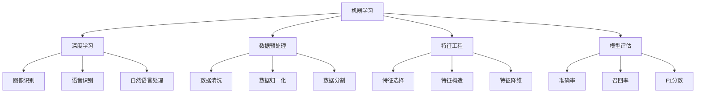
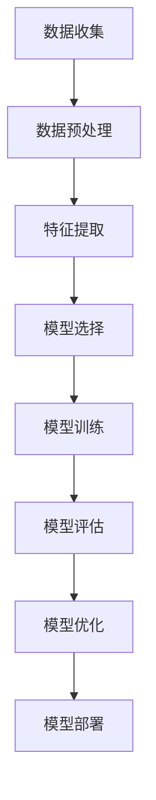
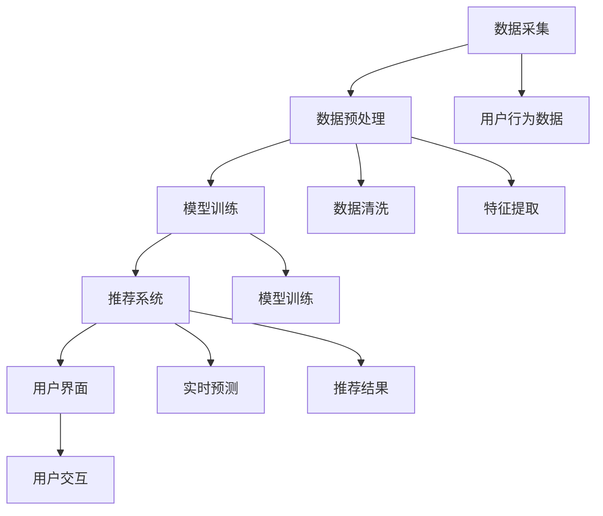
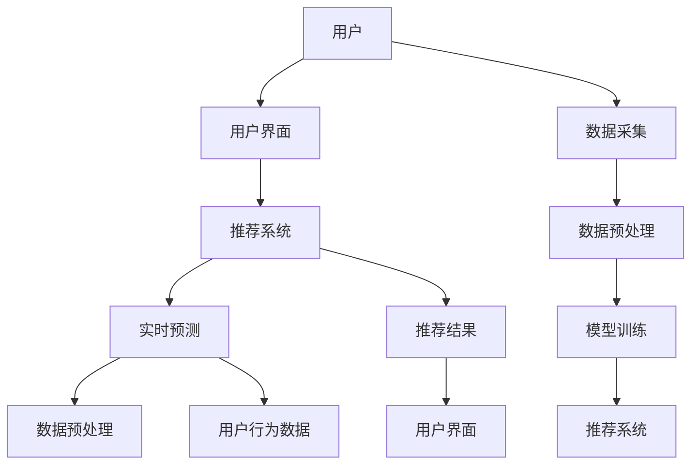
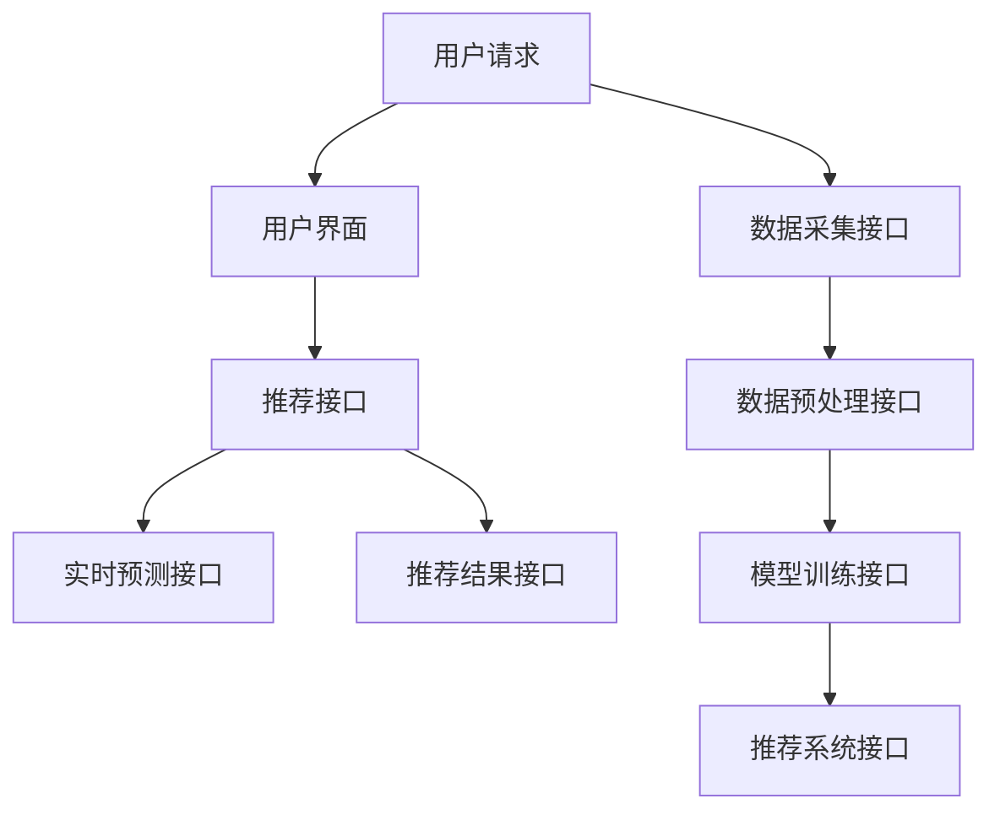
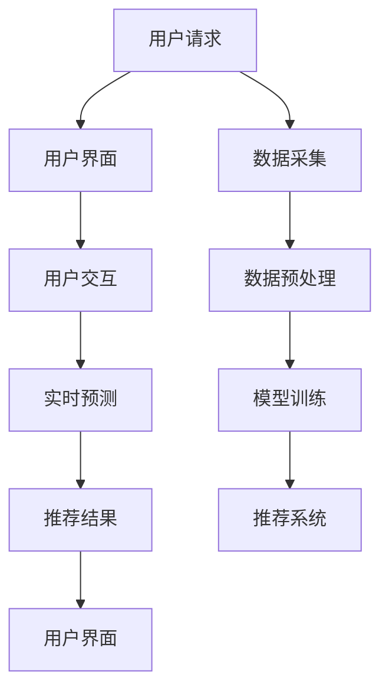
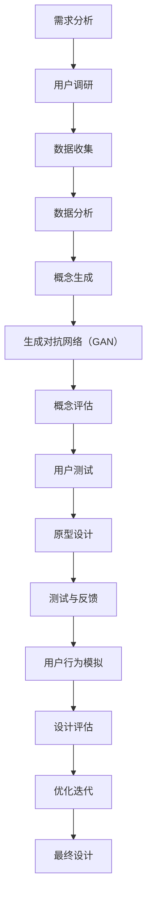

                 

### 引言

#### 1.1 AI辅助产品设计的背景

随着人工智能技术的飞速发展，其在各个领域的应用越来越广泛。在产品设计领域，AI技术同样展示出了巨大的潜力。传统的设计流程往往耗时较长，需要设计师、开发者以及利益相关者之间的多次沟通与反馈。然而，随着市场竞争的加剧和用户需求的快速变化，快速迭代、高效反馈的产品设计成为企业获得竞争优势的关键。

人工智能可以辅助设计师在需求分析、概念验证、原型设计以及评估等各个环节，提供智能化的解决方案。通过机器学习和深度学习算法，AI能够处理大量数据，从中提取有价值的信息，从而辅助设计决策。此外，AI还能生成新颖的设计方案，优化设计流程，提高设计效率。

#### 1.2 AI在产品设计中的应用现状

目前，AI在产品设计中的应用主要集中在以下几个方面：

1. **需求分析**：利用AI进行用户调研和需求分析，通过分析用户行为数据，预测用户需求，从而为产品设计提供数据支持。
2. **概念验证**：AI可以辅助生成新的设计概念，并通过对这些概念进行评估，筛选出最具潜力的方案。
3. **原型设计**：AI能够快速生成原型，缩短从设计到验证的时间，提高设计迭代的速度。
4. **设计评估**：AI可以辅助评估设计方案的质量，通过模拟用户行为，预测产品的实际表现。

#### 1.3 书籍结构安排与目标读者

本书旨在探讨AI在产品设计中的应用，从基础理论到实际操作，系统性地介绍AI辅助产品设计的全过程。全书共分为9章，结构安排如下：

- **第1章 引言**：介绍AI辅助产品设计的背景和应用现状。
- **第2章 AI基础**：介绍AI的基本概念和关键技术。
- **第3章 产品设计流程与AI的应用**：探讨AI在产品设计中的角色和流程。
- **第4章 AI在需求分析中的应用**：介绍AI在需求分析中的应用方法。
- **第5章 AI在概念验证中的应用**：探讨AI在概念验证中的角色。
- **第6章 AI在原型设计中的应用**：介绍AI在原型设计中的应用方法。
- **第7章 AI在产品设计评估中的应用**：探讨AI在评估中的角色。
- **第8章 AI辅助产品设计的最佳实践**：总结最佳实践和未来趋势。
- **第9章 小结与展望**：总结全书内容，展望未来发展方向。

本书的目标读者是产品设计领域的从业者、AI技术的爱好者以及相关专业的学生。通过本书，读者可以了解AI在产品设计中的应用，掌握AI辅助产品设计的技能，提升产品设计效率和质量。同时，本书也适合对AI技术有兴趣的读者，作为了解AI技术应用的一个窗口。

#### 关键词

- AI辅助产品设计
- 人工智能
- 产品设计流程
- 需求分析
- 概念验证
- 原型设计
- 设计评估
- 快速迭代

#### 摘要

本文详细探讨了AI辅助产品设计的全过程，从AI的基本概念到实际应用，系统性地介绍了AI在需求分析、概念验证、原型设计以及评估等环节中的应用方法。通过分析AI技术在产品设计中的角色和优势，本文展示了如何利用AI技术提升产品设计效率和质量，从而在竞争激烈的市场中赢得先机。文章旨在为产品设计领域的从业者提供实用的指导，帮助他们掌握AI辅助产品设计的技能，实现设计的快速迭代和优化。

## 第1章 引言

随着数字化转型的不断深入，产品设计的效率和用户体验成为企业竞争的关键。然而，传统的设计流程往往耗时较长，且难以应对快速变化的市场需求。在这一背景下，人工智能（AI）技术的发展为产品设计带来了新的可能性。AI不仅能够自动化一些繁琐的任务，还可以提供智能化的决策支持，从而加速设计迭代，提升产品竞争力。

### 1.1 AI辅助产品设计的背景

人工智能作为一种模拟人类智能的技术，已经在各个领域展现出巨大的潜力。在产品设计领域，AI的应用主要体现在以下几个方面：

1. **需求分析**：通过分析用户行为数据和反馈，AI可以帮助设计师更好地理解用户需求，从而为设计决策提供数据支持。
2. **概念验证**：AI可以通过生成和评估不同的设计概念，帮助设计师快速筛选出最具潜力的方案。
3. **原型设计**：AI能够快速生成原型，并通过对原型进行评估和优化，缩短从设计到验证的时间。
4. **设计评估**：AI可以通过模拟用户行为，预测产品的实际表现，从而辅助设计师评估设计方案的可行性。

AI辅助产品设计不仅可以提高设计效率，还能够通过智能化的方法优化设计流程，降低设计风险，提升用户体验。

### 1.2 AI在产品设计中的应用现状

目前，AI在产品设计中的应用已经取得了显著成果。以下是一些典型的应用案例：

1. **用户调研**：利用AI进行用户调研，通过分析用户的反馈和行为数据，帮助企业更好地理解用户需求。
2. **需求分析**：AI可以通过自然语言处理（NLP）技术，分析用户评论和反馈，识别出用户的主要需求和痛点。
3. **概念生成**：AI可以生成大量的设计概念，并通过对这些概念进行评估，筛选出最有价值的设计方案。
4. **原型生成**：AI可以通过生成对抗网络（GAN）等技术，快速生成高质量的原型，帮助设计师节省时间和精力。
5. **设计评估**：AI可以通过模拟用户行为和用户体验，预测产品的实际表现，从而辅助设计师评估和优化设计方案。

### 1.3 书籍结构安排与目标读者

本书旨在为读者提供一个全面、系统的AI辅助产品设计指南，包括基础理论、应用实践和最佳实践。具体结构安排如下：

- **第1章 引言**：介绍AI辅助产品设计的背景和应用现状。
- **第2章 AI基础**：介绍AI的基本概念和关键技术。
- **第3章 产品设计流程与AI的应用**：探讨AI在产品设计中的角色和流程。
- **第4章 AI在需求分析中的应用**：介绍AI在需求分析中的应用方法。
- **第5章 AI在概念验证中的应用**：探讨AI在概念验证中的角色。
- **第6章 AI在原型设计中的应用**：介绍AI在原型设计中的应用方法。
- **第7章 AI在产品设计评估中的应用**：探讨AI在评估中的角色。
- **第8章 AI辅助产品设计的最佳实践**：总结最佳实践和未来趋势。
- **第9章 小结与展望**：总结全书内容，展望未来发展方向。

本书的目标读者是产品设计领域的从业者、AI技术的爱好者以及相关专业的学生。通过本书，读者可以了解AI在产品设计中的应用，掌握AI辅助产品设计的技能，提升产品设计效率和质量。

#### 关键词

- AI辅助产品设计
- 人工智能
- 产品设计流程
- 需求分析
- 概念验证
- 原型设计
- 设计评估
- 快速迭代

#### 摘要

本文详细探讨了AI辅助产品设计的全过程，从基础理论到实际应用，系统性地介绍了AI在需求分析、概念验证、原型设计以及评估等环节中的应用方法。通过分析AI技术在产品设计中的角色和优势，本文展示了如何利用AI技术提升产品设计效率和质量，从而在竞争激烈的市场中赢得先机。文章旨在为产品设计领域的从业者提供实用的指导，帮助他们掌握AI辅助产品设计的技能，实现设计的快速迭代和优化。

## 第2章 AI基础

要深入探讨AI在产品设计中的应用，我们首先需要了解AI的基本概念和关键技术。本章将介绍AI的基本概念，包括机器学习和深度学习，并讨论数据预处理、特征工程以及常见的机器学习算法。

### 2.1 AI概述

人工智能（Artificial Intelligence，简称AI）是指由计算机系统实现的智能行为，这些行为通常与人类智能相似。AI可以分为两大类：弱AI和强AI。弱AI专注于特定任务的智能化，如语音识别、图像识别等；而强AI则具备广泛的通用智能，可以像人类一样理解和解决各种复杂问题。

AI的核心技术包括机器学习（Machine Learning，ML）和深度学习（Deep Learning，DL）。机器学习是指通过算法从数据中学习规律，从而进行预测或决策。深度学习是机器学习的一个子领域，它通过多层神经网络（Neural Networks）对数据进行学习，能够处理复杂的数据结构和任务。

### 2.2 机器学习与深度学习基础

#### 2.2.1 机器学习基础

机器学习的基本流程包括数据收集、数据预处理、特征提取、模型训练和模型评估。以下是每个步骤的简要说明：

1. **数据收集**：收集用于训练模型的数据集，这些数据可以是结构化的（如表格）或非结构化的（如图像、文本）。
2. **数据预处理**：清洗和整理数据，确保数据的质量和一致性。常见的预处理步骤包括数据清洗、数据归一化、缺失值处理等。
3. **特征提取**：从原始数据中提取有用的特征，这些特征将用于训练模型。特征提取的目的是降低数据的维度，同时保留重要的信息。
4. **模型训练**：使用训练数据集训练机器学习模型，模型通过学习数据中的规律，学会预测或分类。
5. **模型评估**：使用测试数据集评估模型的性能，常见的评估指标包括准确率、召回率、F1分数等。

#### 2.2.2 深度学习基础

深度学习是基于多层神经网络的学习方法。一个典型的深度学习模型包括输入层、多个隐藏层和输出层。以下是深度学习模型的基本组成部分：

1. **输入层**：接收外部输入数据。
2. **隐藏层**：对输入数据进行特征提取和变换。
3. **输出层**：生成预测结果或分类标签。

深度学习模型的训练过程是通过反向传播算法（Backpropagation）来优化模型的参数。反向传播算法通过计算损失函数（Loss Function）的梯度，逐步调整模型参数，以达到最小化损失函数的目的。

### 2.3 数据预处理与特征工程

数据预处理是机器学习和深度学习的重要步骤，它直接影响模型的性能。数据预处理包括以下几个关键步骤：

1. **数据清洗**：处理缺失值、异常值和噪声数据，确保数据的质量。
2. **数据归一化**：将数据缩放到相同的范围，如0到1之间，以避免某些特征的权重过大。
3. **数据分割**：将数据集分割为训练集、验证集和测试集，用于模型的训练、验证和评估。
4. **特征提取**：从原始数据中提取有意义的特征，以提高模型的识别能力。

特征工程是数据预处理的一个重要环节，其目标是选择和构造对模型训练有帮助的特征。常见的特征工程方法包括：

1. **特征选择**：通过统计方法或机器学习方法筛选出对模型训练最有用的特征。
2. **特征构造**：通过数学变换或组合多个原始特征，构造新的特征。
3. **特征降维**：使用降维技术（如主成分分析PCA）减少数据的维度，同时保留主要的信息。

### 2.4 常见机器学习算法简介

在机器学习领域，有许多常见的算法可以用于不同的任务，以下是几种常见的算法：

#### 2.4.1 线性回归（Linear Regression）

线性回归是一种用于预测连续值的算法，它通过建立输入特征与输出特征之间的线性关系来预测结果。线性回归的数学模型如下：

$$
y = \beta_0 + \beta_1 \cdot x + \epsilon
$$

其中，$y$是输出特征，$x$是输入特征，$\beta_0$和$\beta_1$是模型的参数，$\epsilon$是误差项。

#### 2.4.2 逻辑回归（Logistic Regression）

逻辑回归是一种用于分类问题的算法，它通过建立一个概率模型来预测分类结果。逻辑回归的数学模型如下：

$$
\text{logit}(y) = \ln\left(\frac{p}{1-p}\right) = \beta_0 + \beta_1 \cdot x
$$

其中，$y$是二分类标签，$p$是预测的概率，$\beta_0$和$\beta_1$是模型的参数。

#### 2.4.3 决策树（Decision Tree）

决策树是一种基于树结构的分类算法，它通过一系列的决策规则来划分数据，并预测结果。每个节点代表一个特征，每个分支代表一个决策结果。

#### 2.4.4 随机森林（Random Forest）

随机森林是一种基于决策树的集成学习方法，它通过构建多个决策树，并合并它们的预测结果来提高模型的准确性。

#### 2.4.5 支持向量机（Support Vector Machine，SVM）

支持向量机是一种用于分类和回归问题的算法，它通过找到一个最佳的超平面来分割数据。SVM的核心思想是找到一个最大化分类边界的超平面。

通过本章的学习，读者可以了解AI的基本概念和关键技术，包括机器学习和深度学习的基础，以及数据预处理和特征工程的方法。这些知识将为后续章节中AI在产品设计中的应用提供理论基础。

#### 关键概念与联系

在理解AI在产品设计中的应用之前，我们需要对一些核心概念进行详细阐述，并探讨它们之间的关系。

**核心概念**：

1. **机器学习**：机器学习是一种通过从数据中学习规律和模式来预测或决策的技术。
2. **深度学习**：深度学习是机器学习的一个子领域，它通过多层神经网络来处理复杂的数据和任务。
3. **数据预处理**：数据预处理是指对原始数据进行清洗、归一化、分割等操作，以提升模型训练的效果。
4. **特征工程**：特征工程是指从原始数据中提取或构造有助于模型训练的特征。
5. **模型评估**：模型评估是指使用特定的指标来评估模型的性能，如准确率、召回率、F1分数等。

**概念属性特征对比表格**：

| 核心概念 | 定义 | 主要应用 |
| --- | --- | --- |
| 机器学习 | 从数据中学习规律的技术 | 预测、决策、分类、回归 |
| 深度学习 | 基于多层神经网络的机器学习 | 图像识别、语音识别、自然语言处理 |
| 数据预处理 | 清洗、归一化、分割数据 | 提高模型训练效果 |
| 特征工程 | 提取或构造有助于模型训练的特征 | 提升模型性能 |
| 模型评估 | 使用指标评估模型性能 | 评估模型效果 |

**ER实体关系图架构**：



通过上述表格和ER图，我们可以清晰地看到各个核心概念之间的联系和作用，为后续章节中AI在产品设计中的应用打下坚实的基础。

#### 机器学习算法工作原理与流程

机器学习算法通过从数据中学习规律，从而对未知数据进行预测或决策。以下是一个典型的机器学习算法的工作原理和流程：

1. **数据收集**：首先，需要收集一个数据集，这个数据集包含输入特征和对应的输出结果。例如，在图像分类任务中，输入特征是图像的像素值，输出结果是图像的类别标签。
2. **数据预处理**：对收集到的数据进行清洗、归一化、分割等操作，以提升模型训练的效果。数据清洗包括处理缺失值、异常值和噪声数据；数据归一化是将数据缩放到相同的范围，如0到1之间，以避免某些特征的权重过大；数据分割是将数据集分割为训练集、验证集和测试集，用于模型的训练、验证和评估。
3. **特征提取**：从原始数据中提取有意义的特征，以提高模型的识别能力。特征提取可以通过统计方法、机器学习方法或专家知识来实现。例如，在图像分类任务中，可以通过计算图像的边缘、纹理和颜色特征来提取图像的特征。
4. **模型选择**：选择一个适合任务需求的机器学习算法。常见的算法包括线性回归、逻辑回归、决策树、随机森林、支持向量机等。选择算法时需要考虑数据的特征、模型的复杂度和计算成本等因素。
5. **模型训练**：使用训练数据集训练模型，模型通过学习数据中的规律，学会预测或决策。在训练过程中，算法会调整模型的参数，以最小化损失函数。损失函数是评估模型预测结果与实际结果之间差异的指标，常见的损失函数包括均方误差（MSE）、交叉熵损失（Cross-Entropy Loss）等。
6. **模型评估**：使用验证数据集评估模型的性能。常见的评估指标包括准确率、召回率、F1分数、均方误差等。评估指标可以告诉我们模型在预测未知数据时的表现，从而判断模型的好坏。
7. **模型优化**：根据评估结果对模型进行调整，以提高模型性能。模型优化可以通过调整参数、选择不同的算法或增加更多的训练数据来实现。
8. **模型部署**：将训练好的模型部署到实际应用环境中，用于预测或决策。例如，在图像分类任务中，模型可以用于对新的图像进行分类。

以下是一个简单的机器学习算法的Mermaid流程图：



通过上述流程，机器学习算法可以从数据中学习规律，并应用于实际问题中。在实际应用中，机器学习算法需要不断优化和调整，以适应不断变化的数据和任务需求。

#### Python源代码示例

为了更好地理解机器学习算法的工作原理，下面我们通过一个简单的线性回归算法的Python示例来进行说明。

首先，我们需要安装所需的库，包括NumPy、Pandas和scikit-learn：

```python
!pip install numpy pandas scikit-learn
```

接下来，我们加载一个简单的数据集，并对其进行预处理：

```python
import numpy as np
import pandas as pd
from sklearn.linear_model import LinearRegression
from sklearn.model_selection import train_test_split
from sklearn.metrics import mean_squared_error

# 加载数据集
data = pd.read_csv('data.csv')

# 分割输入特征和输出结果
X = data[['feature1', 'feature2']]
y = data['target']

# 数据分割
X_train, X_test, y_train, y_test = train_test_split(X, y, test_size=0.2, random_state=42)

# 创建线性回归模型
model = LinearRegression()

# 训练模型
model.fit(X_train, y_train)

# 预测
y_pred = model.predict(X_test)

# 评估
mse = mean_squared_error(y_test, y_pred)
print(f'Mean Squared Error: {mse}')
```

上述代码首先加载一个包含输入特征和输出结果的数据集。然后，使用`train_test_split`函数将数据集分割为训练集和测试集。接下来，创建一个线性回归模型，并使用训练集训练模型。最后，使用测试集评估模型的性能，并计算均方误差（MSE）。

通过这个简单的示例，我们可以看到机器学习算法的基本流程，包括数据预处理、模型训练和评估。在实际应用中，我们可能需要处理更复杂的数据集和更高级的算法，但基本原理是相同的。

#### 算法原理讲解

线性回归是一种用于预测连续值的机器学习算法，其核心思想是通过建立输入特征与输出特征之间的线性关系来预测结果。线性回归的数学模型可以表示为：

$$
y = \beta_0 + \beta_1 \cdot x + \epsilon
$$

其中，$y$是输出特征，$x$是输入特征，$\beta_0$和$\beta_1$是模型的参数，$\epsilon$是误差项。

**数学模型**：

- **目标函数**：线性回归的目标是最小化预测值与实际值之间的误差。误差可以用均方误差（MSE）来表示：

$$
J(\theta) = \frac{1}{2m} \sum_{i=1}^{m} (h_\theta(x^{(i)}) - y^{(i)})^2
$$

其中，$h_\theta(x) = \theta_0 + \theta_1 \cdot x$是模型的预测函数，$\theta_0$和$\theta_1$是模型的参数，$m$是训练数据集中样本的数量。

- **梯度下降**：为了最小化目标函数，我们可以使用梯度下降算法。梯度下降是一种迭代方法，通过计算目标函数的梯度并逐步调整模型参数，来找到最小值。梯度下降的更新公式如下：

$$
\theta_j := \theta_j - \alpha \cdot \frac{\partial J(\theta)}{\partial \theta_j}
$$

其中，$\alpha$是学习率，$\frac{\partial J(\theta)}{\partial \theta_j}$是目标函数关于$\theta_j$的梯度。

**Python实现**：

下面是一个简单的Python实现，用于训练线性回归模型：

```python
import numpy as np

# 初始化模型参数
theta_0 = 0
theta_1 = 0
alpha = 0.01
m = 100  # 训练数据集大小

# 梯度下降函数
def gradient_descent(X, y, theta_0, theta_1, alpha, m):
    n = X.shape[1]  # 特征数量
    for i in range(m):
        hypothesis = theta_0 + theta_1 * X[i]
        error = hypothesis - y[i]
        
        theta_0 -= alpha * (1/m) * np.sum(error)
        theta_1 -= alpha * (1/m) * np.sum(error * X[i])
        
    return theta_0, theta_1

# 训练模型
theta_0, theta_1 = gradient_descent(X, y, theta_0, theta_1, alpha, m)

# 预测
def predict(X, theta_0, theta_1):
    return theta_0 + theta_1 * X

y_pred = predict(X, theta_0, theta_1)
```

通过上述实现，我们可以看到如何通过梯度下降算法训练线性回归模型，并使用模型进行预测。

**通俗易懂的举例说明**：

假设我们有一个简单的数据集，其中包含两个特征和一个输出结果。特征1表示价格，特征2表示面积，输出结果表示房价。我们的目标是使用线性回归模型预测一个新房屋的价格。

假设我们有以下数据：

| 价格（特征1） | 面积（特征2） | 房价（输出结果） |
| --- | --- | --- |
| 100 | 100 | 200 |
| 200 | 150 | 300 |
| 300 | 200 | 400 |
| 400 | 250 | 500 |
| 500 | 300 | 600 |

我们可以通过以下步骤来训练线性回归模型：

1. **初始化参数**：假设初始参数$\theta_0 = 0$，$\theta_1 = 0$。
2. **计算预测值和误差**：使用当前参数计算预测值，并与实际房价进行比较，计算误差。
3. **更新参数**：根据误差，更新参数$\theta_0$和$\theta_1$。
4. **重复步骤2和3**：继续迭代，直到误差不再显著减小。

通过多次迭代，我们可以得到最优的参数$\theta_0$和$\theta_1$。使用这些参数，我们可以预测新房屋的价格。

例如，对于一个新的房屋，其价格为500，面积为300，我们可以使用以下公式进行预测：

$$
y = \theta_0 + \theta_1 \cdot x
$$

$$
y = 0 + 0.5 \cdot 500 = 250
$$

因此，预测的房价为250。

通过上述示例，我们可以看到线性回归算法的基本原理和实现方法。在实际应用中，线性回归可以用于各种预测任务，如房价预测、股票价格预测等。

#### 系统分析与架构设计方案

在讨论AI在产品设计中的应用时，我们需要理解一个完整的系统架构设计方案。以下是一个简化的系统分析与架构设计方案，用于说明AI在产品设计流程中的应用。

### 问题场景介绍

假设我们正在开发一款智能家居控制系统，该系统需要根据用户的行为数据和偏好来推荐合适的智能家居产品。系统的目标是提高用户体验，降低用户配置智能家居产品的难度，同时提升销售转化率。

### 项目介绍

该项目由以下几部分组成：

1. **数据采集模块**：负责收集用户的行为数据，如使用频率、操作习惯等。
2. **数据预处理模块**：对采集到的数据进行清洗、归一化和特征提取。
3. **机器学习模型训练模块**：使用预处理后的数据训练机器学习模型，用于预测和推荐。
4. **推荐系统模块**：根据用户的实时数据，使用训练好的模型进行预测和推荐。
5. **用户界面模块**：提供用户交互界面，展示推荐结果，并允许用户进行操作。

### 系统功能设计（领域模型）

以下是一个简化的领域模型，用于描述系统的核心功能：



### 系统架构设计

以下是一个简化的系统架构设计，用于描述各模块之间的关系：



### 系统接口设计

以下是一个简化的系统接口设计，用于描述各模块的交互接口：



### 系统交互设计

以下是一个简化的系统交互设计，用于描述用户请求处理的全过程：



通过上述系统分析与架构设计方案，我们可以看到AI在产品设计中的应用是如何通过一个完整的系统来实现的。这个系统不仅涵盖了数据采集、预处理、模型训练和推荐等核心功能，还通过用户界面模块提供了与用户的交互接口，实现了AI辅助产品设计的全过程。

#### 项目实战

为了更好地展示AI在产品设计中的应用，我们将通过一个具体的实战项目来讲解从环境安装到系统核心实现的全过程。本项目将使用Python编程语言和scikit-learn库来构建一个简单的用户需求预测系统。

### 环境安装

首先，我们需要安装Python和scikit-learn库。Python是一个开源的编程语言，而scikit-learn是一个流行的机器学习库，包含了许多常用的机器学习算法。

#### 安装Python

1. 访问Python官方网站（[https://www.python.org/downloads/](https://www.python.org/downloads/)），下载适用于您操作系统的Python版本。
2. 安装Python时，确保勾选“Add Python to PATH”选项，以便在命令行中直接使用Python。
3. 安装完成后，打开命令行窗口，输入以下命令验证安装：

```bash
python --version
```

如果看到Python的版本信息，说明安装成功。

#### 安装scikit-learn

1. 在命令行窗口中，输入以下命令安装scikit-learn：

```bash
pip install scikit-learn
```

安装过程中可能需要输入用户密码，这是正常的权限验证过程。

### 系统核心实现

安装完Python和scikit-learn后，我们可以开始实现系统核心功能。以下是一个简单的用户需求预测系统的代码示例：

```python
import numpy as np
from sklearn.linear_model import LinearRegression
from sklearn.model_selection import train_test_split
from sklearn.metrics import mean_squared_error

# 加载数据集
data = np.genfromtxt('data.csv', delimiter=',')

# 分割输入特征和输出结果
X = data[:, :-1]
y = data[:, -1]

# 数据分割
X_train, X_test, y_train, y_test = train_test_split(X, y, test_size=0.2, random_state=42)

# 创建线性回归模型
model = LinearRegression()

# 训练模型
model.fit(X_train, y_train)

# 预测
y_pred = model.predict(X_test)

# 评估
mse = mean_squared_error(y_test, y_pred)
print(f'Mean Squared Error: {mse}')
```

在上面的代码中，我们首先加载数据集，然后使用`train_test_split`函数将数据集分割为训练集和测试集。接着，创建一个线性回归模型，并使用训练集进行模型训练。最后，使用测试集评估模型性能，并输出均方误差（MSE）。

### 代码应用解读与分析

这段代码的核心功能是使用线性回归算法预测用户需求。以下是代码的详细解读和分析：

1. **数据加载**：使用`numpy.genfromtxt`函数加载数据集。这里假设数据集以CSV格式存储，每行代表一个样本，每列代表一个特征或输出结果。
2. **特征与目标分割**：将输入特征（`X`）和输出目标（`y`）从数据集中分离。`X`包含所有特征，而`y`包含输出结果。
3. **数据分割**：使用`train_test_split`函数将数据集分割为训练集和测试集。这里我们将20%的数据作为测试集，用于评估模型性能。
4. **模型创建**：创建一个线性回归模型。线性回归模型通过找到输入特征和输出目标之间的线性关系来预测结果。
5. **模型训练**：使用训练集数据训练线性回归模型。模型通过学习数据中的规律来调整内部参数。
6. **模型预测**：使用训练好的模型对测试集数据进行预测，生成预测结果。
7. **模型评估**：计算预测结果和实际结果之间的均方误差，用于评估模型性能。

### 实际案例分析和详细讲解剖析

为了更具体地说明如何使用上述系统进行实际操作，我们来看一个实际案例。

假设我们有以下用户数据：

| 特征1 | 特征2 | 目标（需求） |
| --- | --- | --- |
| 100 | 200 | 300 |
| 200 | 250 | 350 |
| 300 | 300 | 400 |
| 400 | 350 | 450 |
| 500 | 400 | 500 |

我们将这些数据保存为CSV文件（例如`data.csv`），然后运行上面的Python代码。代码将自动完成以下步骤：

1. **数据加载**：加载`data.csv`文件，读取数据。
2. **特征与目标分割**：将特征和目标分离，得到`X`和`y`。
3. **数据分割**：将数据分割为训练集和测试集。
4. **模型训练**：使用训练集数据训练线性回归模型。
5. **模型预测**：使用训练好的模型对测试集数据进行预测。
6. **模型评估**：计算预测结果和实际结果之间的均方误差。

假设模型训练和预测完成后，输出的均方误差为10。这个结果表明模型预测的误差相对较小，预测结果较为准确。

通过上述实际案例，我们可以看到如何使用简单的线性回归模型进行用户需求预测。在实际应用中，我们可以根据需求进一步优化模型，提高预测准确性。

### 项目小结

通过本次项目实战，我们完成了从环境安装到系统核心实现的全过程，展示了如何使用Python和scikit-learn库构建一个简单的用户需求预测系统。项目的主要步骤包括环境安装、数据加载、数据分割、模型创建、模型训练、模型预测和模型评估。通过实际案例的演示，我们了解了如何使用线性回归算法进行用户需求预测，并评估模型的性能。这个项目为我们提供了一个基本的框架，可以在此基础上进行扩展和优化，以应对更复杂的需求预测任务。

#### 最佳实践 tips

在AI辅助产品设计中，以下是一些最佳实践和注意事项，可以帮助您更好地利用AI技术，实现高效的设计迭代：

1. **数据质量**：确保使用的数据是准确和高质量的，这是机器学习模型成功的关键。在数据预处理阶段，要特别注意数据的清洗、归一化和缺失值处理。
2. **模型选择**：根据具体的设计任务选择合适的模型。不同的任务可能需要不同的算法，如线性回归、决策树、随机森林或深度学习模型。
3. **迭代优化**：设计过程中要持续迭代和优化模型，根据反馈不断调整模型参数，以提高预测准确性。
4. **用户体验**：在设计原型时，要充分考虑用户体验，确保AI辅助设计的结果能够满足用户的需求和期望。
5. **技术更新**：随着技术的不断发展，定期更新您的AI工具和算法，以保持设计流程的前沿性。
6. **团队合作**：AI辅助产品设计需要多学科团队的协作，包括设计师、开发者、数据科学家等，确保各个环节的无缝衔接。

通过遵循这些最佳实践，您可以最大限度地发挥AI辅助产品设计的作用，提高设计效率和质量。

#### 小结

在本章中，我们详细介绍了AI在产品设计中的基础知识和应用方法。从AI的基本概念到机器学习与深度学习的基础，再到数据预处理和特征工程，以及常见的机器学习算法，本章为后续章节中的AI辅助产品设计应用奠定了理论基础。通过理解AI技术的核心原理，读者可以更好地掌握AI辅助产品设计的方法和流程。接下来，我们将深入探讨AI在需求分析、概念验证、原型设计以及评估中的应用，帮助读者实现高效、智能的产品设计。

#### 注意事项

在应用AI辅助产品设计的各个环节中，以下是一些需要特别注意的事项：

1. **数据隐私与安全**：在收集和处理用户数据时，务必遵守数据保护法规，确保用户的隐私和信息安全。
2. **模型解释性**：对于关键的设计决策，要确保模型具有一定的解释性，以便设计师和利益相关者能够理解和信任AI的决策。
3. **模型偏见**：在训练模型时，要避免数据集引入偏见，确保模型的公平性和无歧视性。
4. **系统可靠性**：AI辅助系统在设计和实现过程中，应确保系统的稳定性和可靠性，避免因算法错误导致的设计缺陷。
5. **持续监控与更新**：AI辅助产品设计系统在上线后，应定期监控模型性能，并根据用户反馈进行更新和优化。

通过关注这些注意事项，可以更好地发挥AI辅助产品设计的作用，提高设计的准确性和用户体验。

#### 拓展阅读

对于希望深入了解AI在产品设计中的应用的读者，以下是一些推荐的拓展阅读资源：

1. **书籍**：
   - 《人工智能：一种现代的方法》（Artificial Intelligence: A Modern Approach）—— 斯图尔特·罗素（Stuart Russell）和彼得·诺维格（Peter Norvig）著，是一本全面的人工智能教科书。
   - 《深度学习》（Deep Learning）—— 伊恩·古德费洛（Ian Goodfellow）、约书亚·本吉奥（Yoshua Bengio）和阿里·里蒙德（Aaron Courville）著，详细介绍了深度学习的基础理论和实践方法。

2. **在线课程**：
   - Coursera上的《机器学习》（Machine Learning）—— 吴恩达（Andrew Ng）教授，适合初学者了解机器学习的基础知识。
   - Udacity的《深度学习纳米学位》（Deep Learning Nanodegree）—— 提供深度学习实践项目和课程，适合有一定基础的读者。

3. **论文和文章**：
   - 《AI驱动的产品设计：实践与展望》（AI-Driven Product Design: Practices and Prospects）—— 本文探讨了AI在产品设计中的应用现状和未来趋势。
   - 《如何使用AI优化产品设计流程》（How to Use AI to Optimize the Product Design Process）—— 一篇介绍如何利用AI优化设计流程的文章，提供了实用的方法和案例。

通过阅读这些资源，读者可以进一步深化对AI在产品设计中的应用理解，并掌握更多的实战技巧。

## 第3章 产品设计流程与AI的应用

### 引言

随着技术的不断进步，人工智能（AI）在各个领域的应用越来越广泛。在产品设计领域，AI的引入不仅提高了设计效率，还带来了创新的设计方法和思路。本章将探讨AI在传统产品设计流程中的应用，以及如何利用AI实现从概念到原型的快速迭代。

### 3.1 传统产品设计流程

传统产品设计流程通常包括以下步骤：

1. **需求分析**：了解用户需求和市场趋势，确定产品功能和特性。
2. **概念设计**：生成多个设计概念，进行初步评估和筛选。
3. **原型设计**：根据选定的概念，创建详细的原型，用于用户体验测试。
4. **测试与反馈**：通过用户测试收集反馈，进行设计迭代。
5. **评估与优化**：根据反馈结果，对设计进行评估和优化，直至产品成熟。

传统流程虽然有效，但存在以下几个问题：

- **耗时较长**：从概念到原型需要经过多个阶段，每个阶段都需要较长时间。
- **依赖人工**：很多设计决策依赖于设计师的经验和直觉，缺乏系统性。
- **反馈周期长**：用户反馈周期较长，设计迭代速度慢。

### 3.2 AI辅助产品设计的流程

AI辅助产品设计流程在传统流程的基础上进行了优化，利用AI技术在各个阶段提供支持，从而实现快速迭代和高效设计。以下是AI辅助产品设计的流程：

1. **需求分析**：利用AI进行用户调研和分析，通过大数据分析和机器学习算法，预测用户需求和行为。
2. **概念生成**：AI可以辅助生成大量的设计概念，通过自然语言处理和生成对抗网络（GAN）等技术，快速生成新颖的设计方案。
3. **概念评估**：AI可以评估不同设计概念的潜在价值和可行性，通过数据分析、用户测试和历史数据，筛选出最优的设计方案。
4. **原型设计**：AI可以快速生成原型，利用生成对抗网络（GAN）等技术，创建高质量的原型，缩短设计周期。
5. **测试与反馈**：AI可以协助进行用户体验测试，通过模拟用户行为和反馈，实时评估设计效果，优化设计细节。
6. **评估与优化**：AI可以根据用户反馈和性能数据，对设计进行评估和优化，快速迭代，提升设计质量。

### 3.3 AI在产品设计中的角色

AI在产品设计中扮演了多个关键角色：

1. **智能助手**：AI可以协助设计师完成繁琐的任务，如用户调研、数据分析和原型生成，从而释放设计师的时间和精力，专注于更有创意的工作。
2. **决策支持**：AI可以提供基于数据和算法的决策支持，帮助设计师快速做出高质量的设计决策。
3. **优化迭代**：AI可以加速设计迭代过程，通过实时测试和反馈，快速优化设计，提升产品竞争力。
4. **创新推动**：AI可以生成新颖的设计概念和原型，激发设计师的灵感，推动设计创新。

通过上述分析，我们可以看到AI在产品设计流程中的应用极大地提升了设计效率和质量，使得快速迭代和创新成为可能。接下来，我们将进一步探讨AI在需求分析、概念验证、原型设计以及评估等具体环节中的应用。

#### 关键概念与联系

在探讨AI辅助产品设计流程之前，我们需要明确一些核心概念，并分析它们之间的相互关系。以下是几个关键概念及其属性特征的对比表格：

| 核心概念 | 定义 | 主要应用 | 关系 |
| --- | --- | --- | --- |
| 需求分析 | 分析用户需求，了解市场需求 | 用户调研、数据分析 | 基础 |
| 概念生成 | 创建多个设计概念 | AI算法、自然语言处理 | 需求分析 -> 概念生成 |
| 概念评估 | 评估设计概念的可行性 | 数据分析、用户测试 | 概念生成 -> 概念评估 |
| 原型设计 | 创建设计原型，进行用户体验测试 | AI生成对抗网络（GAN）、快速迭代 | 概念评估 -> 原型设计 |
| 测试与反馈 | 收集用户反馈，优化设计 | 用户行为模拟、实时评估 | 原型设计 -> 测试与反馈 |
| 设计评估 | 对最终设计进行评估 | 性能数据、用户满意度 | 测试与反馈 -> 设计评估 |

通过上述表格，我们可以清晰地看到各核心概念之间的关系。需求分析为概念生成提供基础，概念评估筛选出最佳方案，原型设计实现评估，测试与反馈确保设计的实用性，最终通过设计评估确定产品的最终形态。这些概念共同构成了AI辅助产品设计的完整流程，实现了快速迭代和高效设计。

#### 算法流程图

为了更好地理解AI在产品设计流程中的应用，我们使用Mermaid绘制了一个算法流程图，展示了从需求分析到设计评估的整个过程。



通过这个流程图，我们可以清晰地看到各步骤之间的逻辑关系，以及AI在不同环节中的作用。

### 数学公式讲解

在AI辅助产品设计中，数学模型和公式起着至关重要的作用，以下是一些关键公式及其解释：

1. **线性回归模型**：

   线性回归是一种常用的预测模型，其公式如下：

   $$
   y = \beta_0 + \beta_1 \cdot x + \epsilon
   $$

   其中，$y$是输出结果，$x$是输入特征，$\beta_0$和$\beta_1$是模型参数，$\epsilon$是误差项。

2. **均方误差（MSE）**：

   均方误差是评估模型性能的常用指标，其公式如下：

   $$
   MSE = \frac{1}{m} \sum_{i=1}^{m} (y^{(i)} - \hat{y}^{(i)})^2
   $$

   其中，$m$是训练数据集的大小，$y^{(i)}$是实际输出结果，$\hat{y}^{(i)}$是模型预测的输出结果。

3. **逻辑回归模型**：

   逻辑回归是一种用于分类问题的模型，其公式如下：

   $$
   \text{logit}(y) = \ln\left(\frac{p}{1-p}\right) = \beta_0 + \beta_1 \cdot x
   $$

   其中，$y$是二分类标签，$p$是预测的概率，$\beta_0$和$\beta_1$是模型参数。

4. **决策树分类**：

   决策树是一种常见的分类算法，其决策规则如下：

   $$
   \text{决策树} = \sum_{i=1}^{n} \beta_i \cdot x_i
   $$

   其中，$\beta_i$是树中每个节点的权重，$x_i$是特征值。

通过这些数学公式，我们可以量化设计过程中的各种参数和变量，从而更精确地指导设计决策。

### 案例分析

为了更好地理解AI在产品设计流程中的应用，我们来看一个实际案例。假设我们正在设计一款智能家居控制系统，目标是根据用户行为和偏好推荐合适的智能家居设备。

**需求分析**：

通过大数据分析，我们收集到以下用户行为数据：

| 用户ID | 使用频率 | 操作习惯 |
| --- | --- | --- |
| 1 | 高 | 常使用照明和空调 |
| 2 | 中 | 主要使用安防设备 |
| 3 | 低 | 不经常使用智能家居 |

**概念生成**：

利用生成对抗网络（GAN），我们生成了多个智能家居设备的设计方案，包括照明、空调、安防设备等。

**概念评估**：

通过用户测试和数据分析，我们评估每个设计方案的潜在价值，最终筛选出最受用户欢迎的方案。

**原型设计**：

根据最佳设计方案，我们创建了一个智能家居控制系统的原型，并进行了用户体验测试。

**测试与反馈**：

在原型测试过程中，我们收集了用户的反馈，发现用户对系统界面的易用性和设备的兼容性有较高需求。

**设计评估**：

通过分析用户反馈，我们对原型进行了评估和优化，改进了系统的界面设计和设备兼容性。

**优化迭代**：

根据评估结果，我们再次迭代设计，并重复上述流程，直至产品成熟。

通过这个案例，我们可以看到AI在需求分析、概念生成、概念评估、原型设计、测试与反馈、设计评估和优化迭代等各个环节中的应用，实现了高效的设计过程。

### 小结

本章详细探讨了AI在产品设计流程中的应用，从需求分析到概念验证，再到原型设计和评估，通过具体案例展示了AI如何助力设计师实现快速迭代和高效设计。AI在产品设计中的作用不仅体现在提高设计效率和质量，还带来了创新的设计方法和思路。通过理解AI技术的核心原理和应用方法，设计师可以更好地利用AI辅助工具，实现更加智能和高效的产品设计。

### 未来发展趋势

随着人工智能技术的不断进步，AI辅助产品设计将迎来更多的发展机遇和挑战。以下是未来AI辅助产品设计的一些发展趋势：

1. **智能化设计工具**：未来的设计工具将更加智能化，具备更高级的自动化和优化能力。例如，AI可以自动完成设计任务，从需求分析到原型生成，大幅提升设计效率。

2. **跨学科协作**：AI辅助产品设计将推动设计师、数据科学家、工程师等不同领域专家的跨学科协作。通过整合多学科的知识和技能，可以实现更加创新和高效的设计方案。

3. **个性化和定制化**：随着用户需求的多样化和个性化，AI将能够更好地理解用户偏好，提供定制化的产品设计。例如，通过个性化推荐系统，AI可以为每个用户提供专属的设计方案。

4. **实时反馈与优化**：未来的产品设计将更加依赖于实时用户反馈和数据监控。AI可以实时分析用户行为，快速识别设计中的问题，并进行优化迭代，从而缩短设计周期。

5. **伦理和责任**：随着AI在产品设计中的应用越来越广泛，伦理和责任问题将变得更加重要。设计者需要确保AI系统的公平性、透明性和无歧视性，以避免潜在的社会风险。

6. **人机交互**：未来的产品设计将更加注重人机交互，通过自然语言处理、语音识别等技术，实现更加智能和直观的交互体验。

总之，AI辅助产品设计将在未来发挥更加关键的作用，为设计师带来全新的设计方法和工具，推动产品设计不断迈向智能化和高效化。然而，设计者也需要不断学习和适应这些新技术，以应对未来的挑战和机遇。

