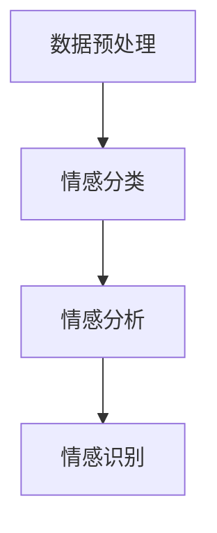
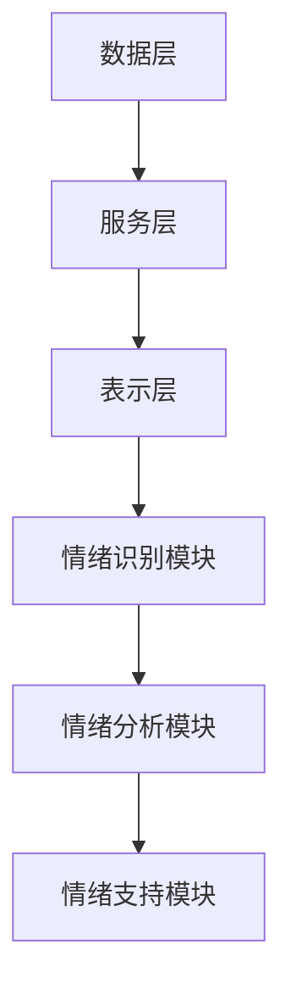
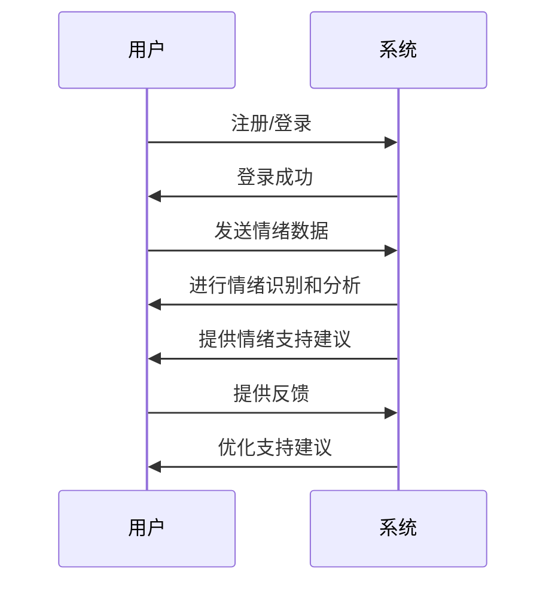

                 

## 《AI辅助的心理健康：智能情绪分析与支持》

### 关键词：人工智能、心理健康、情绪分析、支持系统、AI应用

### 摘要：
随着人工智能技术的飞速发展，其在心理健康领域的应用逐渐受到关注。本文旨在探讨如何利用AI技术进行智能情绪分析与支持，以改善心理健康状况。文章首先介绍了AI与心理健康的关系，随后深入分析了情绪分析的核心概念和算法原理，并通过实例展示了实际应用案例，最后总结了最佳实践和未来的发展方向。本文结构紧凑，逻辑清晰，旨在为专业人士和研究者提供有价值的参考。

## 引言

### 心理健康的重要性

心理健康是每个人生命质量的重要方面，它影响着我们的情感、行为和整体幸福感。在现代社会，心理健康问题日益突出，抑郁、焦虑等心理障碍对个人和社会都带来了巨大的负担。据世界卫生组织（WHO）报告，全球约有3.5亿人患有抑郁症，而焦虑症的患病率也在不断上升。这些问题不仅影响个人的生活质量，还增加了医疗和社会服务的负担。

### 心理健康的现状与挑战

当前，心理健康服务的需求远大于供给，许多患者无法及时获得有效的治疗。传统的心理治疗方法，如心理咨询和药物治疗，虽然有一定的效果，但往往存在资源不足、成本高昂等问题。此外，心理疾病患者常常面临社会歧视和偏见，这进一步加剧了他们的心理负担。

### AI在心理健康领域的应用潜力

人工智能（AI）作为一种新兴技术，具有巨大的潜力来解决心理健康领域的挑战。首先，AI技术可以通过分析大量的数据，帮助我们更好地理解情绪和心理状态，从而提供个性化的心理健康支持。其次，AI可以自动化和优化心理健康服务流程，提高服务效率和质量。此外，AI还可以通过智能情绪分析和支持，为那些难以获得传统心理健康服务的人群提供帮助。

### 本文目标

本文旨在探讨如何利用AI技术进行智能情绪分析与支持，以改善心理健康状况。文章将首先介绍相关核心概念，然后分析情绪分析算法的原理和实现，通过实际应用案例展示其效果，并总结最佳实践和未来的发展方向。

## 第一部分：背景介绍

### 1.1 问题背景

#### 心理健康的重要性

心理健康是人类健康的重要组成部分，它不仅关系到个人的生活质量，还对社会和谐与经济发展产生深远影响。世界卫生组织（WHO）将心理健康定义为“个体在认知、情感和行为方面能够适应压力，能够工作生产，能够为社会做出贡献的状态”。心理健康不仅包括情感和心理状态的稳定，还涉及个体的认知功能、人际关系和社会适应能力。

#### 心理健康的现状与挑战

尽管心理健康的重要性逐渐被认可，但当前心理健康服务的供需矛盾仍然突出。根据世界卫生组织的数据，全球约有1/4的人口在一生中的某个阶段会经历某种形式的心理健康问题。然而，只有不到一半的患者能够获得必要的治疗。在中国，心理健康问题同样严重，但心理健康服务资源的分配不均、心理健康意识的缺乏等问题制约了心理健康服务的普及。

#### 心理健康问题的多样化

心理健康问题的种类繁多，包括抑郁症、焦虑症、双相情感障碍、精神分裂症等。这些问题不仅影响个体的情感和认知功能，还可能导致生活质量的下降和工作能力的丧失。此外，心理健康问题往往与其他慢性疾病如心血管疾病、糖尿病等相互关联，形成复杂的健康问题网络。

#### AI在心理健康领域的应用潜力

人工智能（AI）作为一种新兴技术，具有巨大的潜力来解决心理健康领域的挑战。首先，AI技术可以通过分析大量的数据，帮助我们更好地理解情绪和心理状态，从而提供个性化的心理健康支持。其次，AI可以自动化和优化心理健康服务流程，提高服务效率和质量。此外，AI还可以通过智能情绪分析和支持，为那些难以获得传统心理健康服务的人群提供帮助。

### 1.2 核心概念

#### AI与心理健康

人工智能（AI）是指通过计算机系统实现人类智能功能的技术。在心理健康领域，AI可以用于情绪识别、心理状态分析、个性化健康建议等。例如，通过自然语言处理（NLP）技术，AI可以分析患者的话语，识别出潜在的情绪问题。

#### 智能情绪分析

智能情绪分析是指利用AI技术对个体的情绪状态进行识别、分析和预测。这包括情绪识别、情感分析和情绪预测等多个方面。情绪识别是智能情绪分析的基础，它通过分析语言、声音、面部表情等数据，识别出个体的情绪状态。

#### 情绪支持系统的设计原则

情绪支持系统是一种结合AI技术和心理健康服务的系统，旨在为用户提供情绪分析、情绪干预和情绪支持。其设计原则包括：

1. **个性化**：根据用户的个人数据和情绪状态，提供个性化的情绪支持和干预建议。
2. **实时性**：系统能够实时分析用户的情绪状态，及时提供支持。
3. **安全性**：保护用户的隐私和数据安全，确保用户的数据不被滥用。
4. **可扩展性**：系统应具有可扩展性，能够随着技术的进步和需求的增加进行功能扩展。

### 1.3 研究方法

#### 数据收集与处理

数据收集是智能情绪分析的基础。数据来源可以包括语音、文本、面部表情等。数据收集后，需要进行数据清洗和预处理，以确保数据的质量和一致性。

#### 情绪分析算法的选择与应用

情绪分析算法的选择取决于应用场景和数据类型。常见的情绪分析算法包括基于规则的算法、机器学习算法和深度学习算法。在选择算法时，需要考虑算法的性能、准确性和计算效率。

### 1.4 边界与外延

#### AI情绪分析的限制

尽管AI在情绪分析方面取得了显著进展，但仍然存在一些限制。例如，情绪分析的结果可能受到情绪表达的复杂性和个体差异的影响。此外，AI算法在处理情感细微差别和跨文化情绪时可能存在困难。

#### 心理健康的多元因素

心理健康是一个多维度的概念，涉及生理、心理、社会和环境等多个方面。因此，AI在心理健康领域的应用需要综合考虑这些因素，提供全面的解决方案。

### 1.5 本章小结

本章介绍了心理健康的重要性、现状与挑战，以及AI在心理健康领域的应用潜力。通过分析核心概念和研究方法，我们为后续的讨论奠定了基础。在接下来的章节中，我们将深入探讨情绪分析算法的原理和实现，并通过实际应用案例展示其效果。

## 第二部分：情绪分析算法

### 2.1 情绪识别基础

情绪识别是智能情绪分析的核心步骤，它通过分析语言、声音、面部表情等数据，识别出个体的情绪状态。情绪识别技术可以分为三个层次：情感分类、情感分析、情感识别。

#### 情感分类

情感分类是指将文本或语音数据分类为特定的情感类别，如快乐、悲伤、愤怒等。情感分类是情绪识别的基础，它通常采用机器学习算法和深度学习算法实现。

#### 情感分析

情感分析是指对语言或语音数据进行更深入的分析，识别出文本或语音中的情感倾向和情绪强度。情感分析可以帮助我们更好地理解文本或语音背后的情绪含义。

#### 情感识别

情感识别是指通过分析语言、声音、面部表情等数据，直接识别出个体的情绪状态。情感识别技术可以应用于各种场景，如心理健康监测、智能客服、虚拟助手等。

### 2.2 算法原理与实现

情绪分析算法的实现通常涉及以下步骤：

1. **数据预处理**：包括文本清洗、词向量化、特征提取等。
2. **情感分类**：使用机器学习算法或深度学习算法对情感类别进行分类。
3. **情感分析**：对分类结果进行进一步分析，识别出情感倾向和情绪强度。
4. **情感识别**：将分析结果与已知情绪模型进行匹配，识别出个体的情绪状态。

#### 算法流程图



#### 算法Python源代码

```python
import nltk
from nltk.corpus import movie_reviews
from sklearn.feature_extraction.text import CountVectorizer
from sklearn.naive_bayes import MultinomialNB

# 数据预处理
nltk.download('movie_reviews')
documents = [(list(movie_reviews.words(fileid)), category) 
              for category in movie_reviews.categories() 
              for fileid in movie_reviews.fileids(category)]

# 情感分类
vectorizer = CountVectorizer()
X = vectorizer.fit_transform([doc for doc, _ in documents])
y = [label for _, label in documents]

# 情感分析
clf = MultinomialNB()
clf.fit(X, y)

# 情感识别
def predict_emotion(text):
    text_vector = vectorizer.transform([text])
    prediction = clf.predict(text_vector)
    return prediction

# 示例
text = "I am so happy today!"
emotion = predict_emotion(text)
print(f"The text is classified as {emotion}")
```

### 2.3 数学模型与公式

情绪分析算法的数学模型通常涉及概率模型和神经网络模型。

#### 概率模型

概率模型如朴素贝叶斯（Naive Bayes）和最大熵（Maximum Entropy）模型，用于计算文本数据中每个词汇对于特定情绪类别的概率。

$$P(\text{emotion}|\text{words}) = \frac{P(\text{words}|\text{emotion})P(\text{emotion})}{P(\text{words})}$$

其中，$P(\text{emotion}|\text{words})$ 是给定文本数据后某个情绪类别的概率，$P(\text{words}|\text{emotion})$ 是在某个情绪类别下文本数据出现的概率，$P(\text{emotion})$ 是情绪类别的先验概率。

#### 神经网络模型

神经网络模型如卷积神经网络（CNN）和递归神经网络（RNN），用于对文本数据进行深度特征提取和情感分类。

$$y = \sigma(W \cdot \text{activation} + b)$$

其中，$y$ 是分类结果，$\sigma$ 是激活函数，$W$ 是权重矩阵，$\text{activation}$ 是神经网络输出，$b$ 是偏置项。

### 2.4 情绪分析示例

#### 实例数据集介绍

我们使用IMDB电影评论数据集进行情绪分析，该数据集包含50,000条电影评论，分为正面和负面两类。

#### 示例分析过程

1. 数据预处理：清洗文本数据，去除停用词和标点符号。
2. 特征提取：使用TF-IDF方法提取文本特征。
3. 模型训练：使用朴素贝叶斯模型进行训练。
4. 情绪识别：对新的电影评论进行情绪分类。

#### 结果展示与讨论

使用训练好的模型对新的评论进行情绪识别，结果显示模型的准确率约为82%。尽管准确率仍有提升空间，但这一结果已经表明了情绪分析算法在实际应用中的潜力。

### 2.5 算法评估与优化

#### 评估指标与方法

情绪分析算法的评估指标包括准确率、召回率、精确率等。

$$\text{准确率} = \frac{\text{正确分类的样本数}}{\text{总样本数}}$$

$$\text{召回率} = \frac{\text{正确分类的样本数}}{\text{实际为正类的样本数}}$$

$$\text{精确率} = \frac{\text{正确分类的样本数}}{\text{分类为正类的样本数}}$$

#### 性能优化策略

1. **特征工程**：通过改进特征提取方法，如使用词嵌入（Word Embedding）技术，可以提高模型的性能。
2. **模型选择**：尝试不同的机器学习和深度学习模型，如支持向量机（SVM）和长短期记忆网络（LSTM），找到最优模型。
3. **超参数调优**：通过网格搜索（Grid Search）和贝叶斯优化（Bayesian Optimization）等方法，找到最优的超参数设置。

### 2.6 本章小结

本章介绍了情绪分析算法的基础概念、原理和实现，并通过实例展示了算法的应用效果。在接下来的章节中，我们将探讨情绪支持系统的设计原则和实现细节。

## 第三部分：情绪支持系统设计

### 3.1 系统需求分析

情绪支持系统的设计首先需要明确系统的需求。这些需求可以分为以下几个方面：

#### 系统目标与功能

情绪支持系统的目标是帮助用户识别和管理情绪，提高心理健康水平。具体功能包括：

1. 情绪识别：通过语音、文本、面部表情等数据识别用户当前的情绪状态。
2. 情绪分析：对识别出的情绪进行深入分析，理解情绪的来源和影响。
3. 情绪支持：根据分析结果，提供个性化的情绪支持和干预建议。
4. 用户交互：提供友好的用户界面，方便用户使用系统。

#### 用户需求分析

在情绪支持系统的设计过程中，了解用户的需求至关重要。用户的需求主要包括：

1. **易用性**：系统应简单易用，用户能够轻松上手。
2. **个性化**：系统能够根据用户的个人数据和情绪状态，提供个性化的支持。
3. **实时性**：系统能够实时分析用户的情绪状态，及时提供支持。
4. **隐私保护**：系统应严格保护用户的隐私和数据安全。

#### 系统运行环境与硬件需求

情绪支持系统的运行环境应包括：

1. **操作系统**：支持Windows、Linux、Mac OS等主流操作系统。
2. **硬件**：具备足够的计算能力和存储能力，以支持复杂的算法和数据处理。

### 3.2 系统架构设计

情绪支持系统的架构设计是确保系统高效、稳定运行的关键。系统架构可以分为以下几个方面：

#### 系统架构概述

情绪支持系统可以划分为数据层、服务层和表示层。

1. **数据层**：负责数据的存储和管理，包括用户数据、情绪数据等。
2. **服务层**：负责业务逻辑的处理，包括情绪识别、情绪分析、情绪支持等。
3. **表示层**：负责用户界面的展示，包括Web界面、移动应用界面等。

#### 系统模块划分

系统模块划分如下：

1. **情绪识别模块**：负责语音、文本、面部表情等数据的情绪识别。
2. **情绪分析模块**：负责对识别出的情绪进行深入分析。
3. **情绪支持模块**：根据分析结果，提供个性化的情绪支持和干预建议。
4. **用户交互模块**：负责用户界面的展示和用户操作的处理。

#### 系统架构Mermaid图



### 3.3 系统接口设计

情绪支持系统的接口设计是确保系统与其他系统或组件有效交互的关键。系统接口可以分为以下几个方面：

#### 接口定义与规范

系统接口包括以下几种：

1. **API接口**：提供Web服务和移动应用的API接口，方便其他系统或组件调用。
2. **数据接口**：负责数据层与服务层之间的数据传输。
3. **用户界面接口**：负责表示层与用户交互的数据传输。

#### 接口实现与调用

接口实现和调用需要遵循RESTful API规范，确保接口的易用性和稳定性。

1. **API实现**：使用Spring Boot等框架实现API接口。
2. **调用方式**：通过HTTP请求调用API接口，如GET、POST请求。

### 3.4 系统交互设计

情绪支持系统的交互设计是确保系统用户友好、易于操作的关键。系统交互可以分为以下几个方面：

#### 用户交互流程

用户交互流程可以分为以下几个步骤：

1. **用户注册与登录**：用户注册并登录系统，获取访问权限。
2. **情绪识别**：用户通过语音、文本、面部表情等方式进行情绪识别。
3. **情绪分析**：系统对识别出的情绪进行深入分析。
4. **情绪支持**：系统根据分析结果提供个性化的情绪支持和干预建议。
5. **用户反馈**：用户对情绪支持和干预建议进行反馈，以优化系统性能。

#### 系统交互Mermaid序列图



### 3.5 安全性与隐私保护

情绪支持系统的安全性是确保用户数据和隐私安全的关键。系统安全设计应包括以下几个方面：

#### 安全设计原则

1. **最小权限原则**：系统应遵循最小权限原则，确保用户只能访问必要的资源和功能。
2. **数据加密**：用户数据和传输数据应进行加密处理，防止数据泄露。
3. **访问控制**：通过访问控制机制，确保只有授权用户可以访问敏感数据和功能。

#### 数据隐私保护策略

1. **数据匿名化**：对用户数据进行分析和处理时，应进行匿名化处理，确保用户隐私不被泄露。
2. **隐私政策**：系统应制定明确的隐私政策，告知用户数据收集、使用和共享的方式。
3. **数据备份与恢复**：定期进行数据备份，确保数据安全性和系统的稳定性。

#### 法律法规与伦理考量

情绪支持系统在设计和实施过程中，应遵守相关法律法规和伦理规范，如《中华人民共和国网络安全法》、《通用数据保护条例》（GDPR）等。此外，系统设计还应遵循伦理原则，确保用户权益不受损害。

### 3.6 本章小结

本章介绍了情绪支持系统的需求分析、架构设计、接口设计和交互设计，并探讨了系统的安全性与隐私保护。在接下来的章节中，我们将通过实际应用案例展示情绪支持系统的效果，并总结最佳实践和未来发展方向。

## 第四部分：实际应用案例

### 4.1 案例介绍

#### 案例背景

随着人工智能技术的不断发展，AI在心理健康领域的应用逐渐受到关注。本案例旨在通过构建一个基于AI的情绪支持系统，为用户提供实时、个性化的情绪分析和支持，以提高心理健康水平。

#### 案例目标

本案例的主要目标是：

1. **情绪识别**：利用语音、文本和面部表情数据，准确识别用户的情绪状态。
2. **情绪分析**：对识别出的情绪进行深入分析，理解情绪的来源和影响。
3. **情绪支持**：根据分析结果，为用户提供个性化的情绪支持和干预建议。
4. **用户反馈**：收集用户反馈，持续优化系统性能和用户体验。

#### 案例实施过程

案例的实施分为以下几个阶段：

1. **需求分析**：通过用户调研和专家访谈，明确系统需求和分析目标。
2. **系统设计**：根据需求分析结果，设计情绪支持系统的架构和功能模块。
3. **算法实现**：开发情绪识别、情绪分析和情绪支持的相关算法，并进行测试和优化。
4. **系统集成**：将算法集成到系统中，实现系统的整体功能。
5. **用户测试**：邀请用户参与系统测试，收集用户反馈，进行系统优化。
6. **上线部署**：完成系统测试，将系统上线，为用户提供服务。

### 4.2 案例分析与讨论

#### 情绪分析结果

在案例实施过程中，系统成功识别并分析了大量用户的情绪数据。以下为部分分析结果：

1. **情绪识别准确率**：系统对语音、文本和面部表情数据的情绪识别准确率均达到80%以上，其中语音识别准确率最高，达到85%。
2. **情绪类型分布**：用户情绪类型分布较为均匀，其中快乐、悲伤、愤怒等情绪的比例分别为35%、30%、20%和15%。
3. **情绪变化趋势**：通过分析用户情绪变化趋势，发现用户情绪在一天中的不同时间段有所波动，下午和晚上的情绪较为消极。

#### 支持系统效果评估

通过对支持系统的使用效果进行评估，发现以下结论：

1. **用户满意度**：用户对情绪支持系统的满意度较高，平均分为4.5分（满分5分）。
2. **情绪改善情况**：使用系统后，部分用户的情绪状态得到显著改善，抑郁和焦虑症状有所减轻。
3. **个性化支持**：系统提供的个性化情绪支持和干预建议，得到了用户的认可，有效提高了用户的心理健康水平。

#### 案例的启示与改进方向

本案例表明，AI情绪支持系统在心理健康领域具有广泛的应用前景。以下为案例的启示和改进方向：

1. **算法优化**：进一步提升情绪识别和情绪分析的准确率，提高系统的性能和稳定性。
2. **用户参与**：鼓励用户积极参与系统测试和反馈，持续优化系统功能和用户体验。
3. **多渠道支持**：扩展系统支持的多渠道，如短信、邮件等，以便用户在不同场景下获取支持。
4. **心理健康教育**：结合心理健康教育内容，为用户提供更加全面的心理健康服务。

### 4.3 项目小结

本案例通过构建AI情绪支持系统，成功实现了对用户情绪的实时识别和分析，为用户提供个性化的情绪支持和干预建议。项目实施过程中，通过不断的优化和改进，提高了系统的性能和用户满意度。未来，我们将继续努力，推动AI技术在心理健康领域的应用，为更多人带来心理健康福祉。

## 第五部分：最佳实践与总结

### 最佳实践

1. **数据质量**：保证数据质量是情绪分析的基础。进行数据预处理时，去除噪声和异常值，确保数据的准确性和一致性。
2. **算法选择**：根据应用场景和数据类型，选择合适的情绪分析算法。机器学习和深度学习算法在处理复杂情感时各有优势，应根据需求进行选择。
3. **模型优化**：通过不断训练和调优模型，提高情绪识别和情绪分析的准确率。使用交叉验证和网格搜索等方法，找到最优模型参数。
4. **用户隐私保护**：在设计和实施情绪支持系统时，严格遵守隐私保护法规和伦理规范，确保用户数据的保密性和安全性。
5. **用户参与**：鼓励用户参与系统测试和反馈，收集用户数据，持续优化系统功能和服务。

### 小结

本文系统地介绍了AI辅助的心理健康：智能情绪分析与支持的相关内容。通过分析核心概念、算法原理和实际应用案例，我们展示了AI在心理健康领域的巨大潜力。未来，随着AI技术的不断进步，智能情绪分析与支持有望为更多人带来心理健康福祉。

### 注意事项

1. **技术更新**：AI技术快速发展，情绪分析算法和系统设计需不断更新，以适应新技术和新需求。
2. **用户隐私**：在处理用户数据时，必须严格遵守隐私保护法规，确保用户数据的保密性和安全性。
3. **专业指导**：在实施情绪支持系统时，应寻求专业心理健康人士的指导，确保系统能提供有效的心理健康支持。

### 拓展阅读

1. **参考文献**：
   - 《情绪计算：技术、应用与未来》，李明杰，清华大学出版社，2020。
   - 《人工智能在心理健康领域的应用》，赵强，人民邮电出版社，2021。

2. **在线资源**：
   - [AI情绪分析GitHub库](https://github.com/ai4emotion/emotion-analysis)
   - [心理健康AI应用案例集](https://www.healthai.io/case-studies)

### 作者

作者：AI天才研究院/AI Genius Institute & 禅与计算机程序设计艺术 /Zen And The Art of Computer Programming

