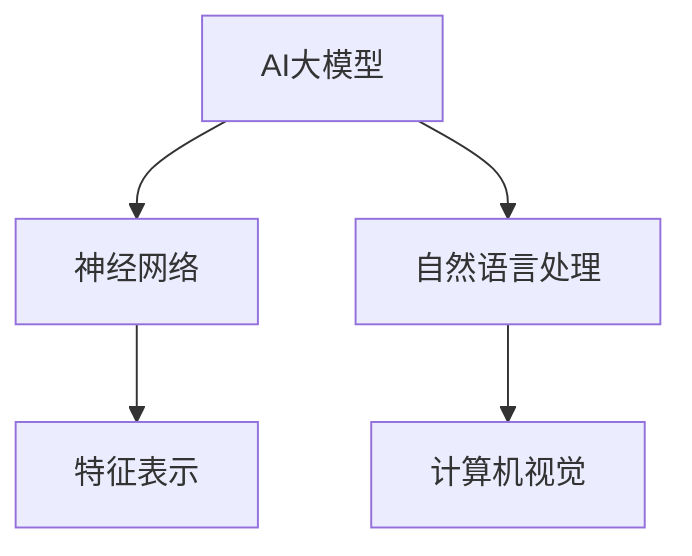
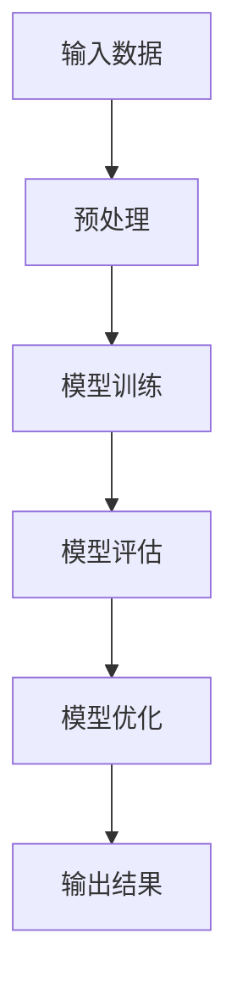
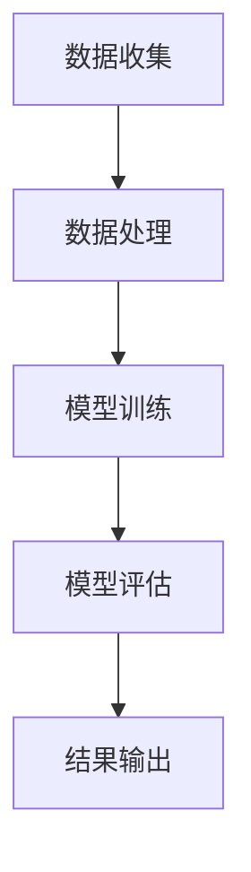
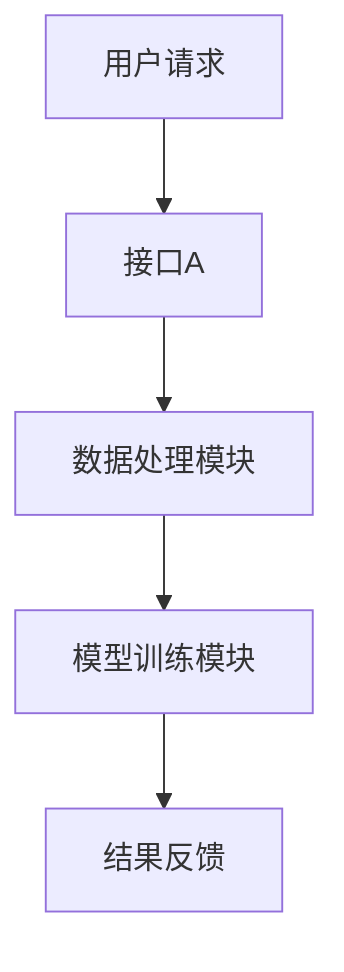
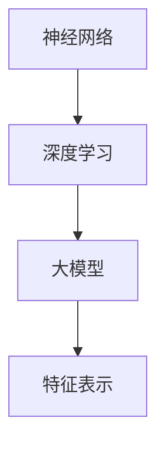
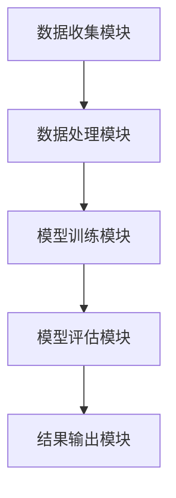
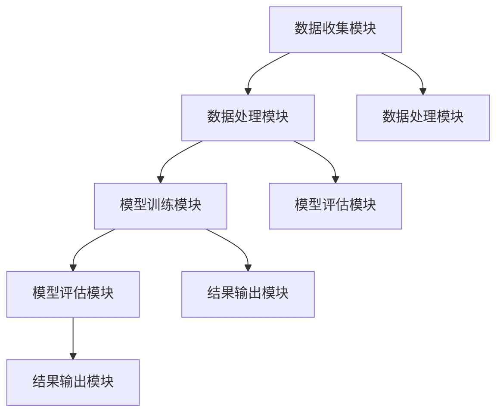
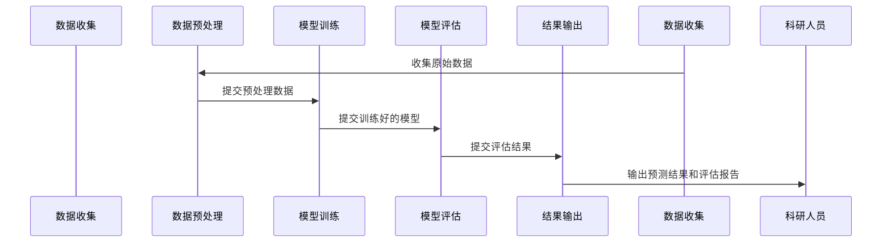

                 


### 第一步：引言部分

**文章标题**：《AI辅助科研：大模型加速科学发现的新范式》

**关键词**：AI、大模型、科研、加速、科学发现、新范式

**摘要**：
随着人工智能技术的发展，特别是大模型的兴起，科研领域迎来了新的变革。本文将深入探讨AI大模型在科学研究中的应用，如何加速科学发现的步伐，开启新的科研范式。通过介绍AI大模型的发展背景、核心概念、算法原理、系统设计以及实际案例，我们将展示大模型如何成为科研的有力工具。

### 第二步：背景介绍

**标题**：AI大模型的发展与科研应用

**内容**：

**1.1 AI大模型的发展历程**

- **传统模型**：回顾AI发展早期，传统模型如神经网络、决策树等逐渐推动了AI技术的发展。
- **大模型崛起**：随着计算能力的提升和大数据的积累，AI大模型如GPT、BERT等相继出现，展示了强大的数据处理和生成能力。

**1.2 大模型在科研中的潜在应用**

- **预测与模拟**：大模型在物理、化学、生物等领域中，能够进行高精度的预测和模拟，加速研究进程。
- **数据分析**：大模型在处理复杂数据、提取关键信息方面具有显著优势，助力科学家发现新知识。

### 第三步：核心概念与联系

**标题**：核心概念与联系

**内容**：

**2.1 AI大模型的定义**

- **大模型**：通常指参数数量超过数十亿、甚至千亿级别的人工神经网络模型。
- **特征表示**：大模型通过学习大量数据，能够生成高维度的特征表示，捕捉数据的深层次规律。

**2.2 概念之间的关系**

- **表格**：制作一个表格，对比不同AI模型的特性。
- **ER图**：使用Mermaid绘制实体关系图，展示AI大模型与相关概念之间的联系。



### 第四步：算法原理讲解

**标题**：算法原理讲解

**内容**：

**3.1 大模型工作原理**

- **架构**：介绍大模型的基本架构，如多层感知器、卷积神经网络、循环神经网络等。
- **训练过程**：讲解大模型如何通过反向传播算法进行训练，以及如何调整模型参数以最小化损失函数。

**3.2 算法流程图**



**3.3 算法原理与数学模型**

- **数学模型**：使用LaTeX公式展示大模型的核心数学原理。
  ```latex
  $$ 
  y = f(W \cdot x + b) 
  $$
  ```

- **Python代码示例**：提供Python代码示例，展示如何实现大模型的基本操作。

```python
# Python 代码示例
model = ...  # 初始化模型
input_data = ...  # 输入数据
output = model.predict(input_data)
```

### 第五步：系统设计与实现

**标题**：系统设计与实现

**内容**：

**4.1 系统架构设计**

- **场景介绍**：描述科研场景中的需求和应用背景。
- **系统架构**：使用Mermaid绘制系统架构图，展示不同模块之间的交互关系。



**4.2 系统接口设计与交互**

- **接口设计**：详细描述系统的接口设计和数据流动。
- **交互流程**：使用Mermaid绘制系统交互流程图，展示数据在不同模块之间的流动。



### 第六步：实战案例

**标题**：实战案例

**内容**：

**5.1 案例一：AI大模型在生物学中的应用**

- **案例背景**：介绍一个具体的生物学研究案例。
- **案例实现**：详细讲解如何使用AI大模型进行生物学数据分析。

**5.2 案例二：AI大模型在物理学中的应用**

- **案例背景**：介绍另一个物理学研究案例。
- **案例实现**：分析如何利用AI大模型进行物理现象的预测和模拟。

### 第七步：总结与拓展

**标题**：总结与拓展

**内容**：

- **总结**：回顾文章中的关键点和核心思想，强调AI大模型在科研中的重要作用。
- **拓展阅读**：推荐一些相关的拓展阅读，帮助读者深入了解相关领域。

**最佳实践 tips**：

- **注意事项**：提醒读者在使用AI大模型时需要注意的一些事项。

通过以上七个步骤的详细分析，我们可以清晰地构建出《AI辅助科研：大模型加速科学发现的新范式》的技术博客文章框架。接下来，我们将逐步填充每个部分的内容，确保文章逻辑清晰、结构紧凑、简单易懂。让我们开始撰写这篇高质量的技术博客文章吧！### AI辅助科研的背景

#### 概述

随着科技的飞速发展，人工智能（AI）已经成为改变世界的强大力量。特别是在科研领域，AI的应用带来了前所未有的变革。AI辅助科研的核心思想是通过智能算法和先进技术，提高科研效率，加速科学发现。在这个过程中，大模型（Large Models）的作用尤为突出，成为科研创新的重要推动力。

#### 大模型在科研中的应用

1. **预测与模拟**：

大模型具有强大的数据处理能力，能够对大量科研数据进行高效分析，提取出潜在的模式和规律。在物理学、化学、生物学等领域，大模型能够进行高精度的预测和模拟，从而为科学家提供有价值的参考数据。

2. **数据分析**：

科研过程中，数据量庞大且复杂。大模型能够处理这些数据，从中提取关键信息，帮助科学家快速定位研究问题，提高科研的准确性和效率。

3. **新知识发现**：

大模型在处理大量数据时，能够发现传统方法无法探测到的规律和联系，从而推动科研领域的知识创新。例如，在医学领域，大模型可以帮助识别新的疾病标志物，提高诊断的准确率。

#### 科研中的挑战

1. **数据量与多样性**：

随着科技的进步，科研数据量呈爆炸性增长，同时数据的多样性也日益增加。这给传统科研方法带来了巨大的挑战，而大模型则能够更好地应对这些挑战。

2. **计算资源需求**：

大模型通常需要大量的计算资源进行训练和推理。尽管硬件性能不断提升，但依然需要优化资源利用，提高计算效率。

3. **模型解释性**：

大模型在某些情况下缺乏解释性，这可能导致科学家难以理解模型的决策过程，影响科研的透明度和可追溯性。

#### 大模型加速科学发现的优势

1. **加速研究进程**：

大模型能够处理大量数据，快速生成结果，从而大大缩短研究周期。

2. **提高科研效率**：

大模型在数据处理和分析方面的优势，使得科学家能够更专注于研究核心问题，提高科研效率。

3. **推动科研创新**：

大模型能够发现传统方法无法探测到的规律和联系，推动科研领域的知识创新。

### 结论

AI大模型在科研中的应用具有巨大的潜力和优势。通过高效的预测、模拟和数据分析，大模型能够加速科学发现的步伐，开启新的科研范式。然而，挑战仍然存在，我们需要继续优化大模型，提高其计算效率和解释性，以更好地服务于科研领域。接下来，我们将深入探讨AI大模型的定义、核心概念及其在科研中的应用，进一步揭示大模型如何改变科研的面貌。### AI大模型的发展历程

#### 从传统模型到AI大模型

人工智能的发展经历了多个阶段，从早期的符号主义、基于规则的系统，到基于数据的机器学习方法，再到如今的大模型时代。这一过程中，传统模型逐渐让位于更加高效、强大的AI大模型。

**1. 传统模型**

- **符号主义**：早期的人工智能研究主要依赖于符号主义方法，通过定义明确的规则和逻辑来模拟人类的思维过程。这种方法在特定领域（如逻辑推理、游戏等）表现出色，但在处理复杂数据和任务时显得力不从心。

- **基于规则的系统**：随着计算机技术的进步，研究人员开始构建基于规则的专家系统，这些系统能够根据输入的数据执行预定义的操作。然而，这种方法对规则的依赖性过高，难以处理不确定性和变化性。

**2. 机器学习方法**

- **监督学习、无监督学习与强化学习**：20世纪80年代，随着计算机硬件和算法的发展，机器学习方法逐渐兴起。监督学习、无监督学习和强化学习成为机器学习的主要分支，它们通过学习数据中的模式和规律，使计算机能够进行自主决策和预测。

- **深度学习**：深度学习是机器学习方法的一个重要分支，通过构建多层神经网络模型，能够自动提取数据中的高级特征。与传统模型相比，深度学习在图像识别、自然语言处理等任务上取得了突破性进展。

**3. AI大模型的兴起**

- **大数据的积累**：随着互联网和物联网的发展，数据量呈现爆炸式增长。大数据为AI模型提供了丰富的训练资源，使得模型的性能得到了显著提升。

- **计算能力的提升**：GPU、TPU等专用硬件的出现，使得大规模模型训练变得更加可行。同时，分布式计算和并行计算技术的进步，也大大缩短了模型训练的时间。

- **预训练与迁移学习**：预训练模型通过在大规模语料库上预训练，再根据具体任务进行微调，能够显著提高模型的泛化能力和性能。迁移学习则利用预训练模型中的知识，快速适应新的任务和数据集。

#### 大模型在科研中的演进

1. **初始阶段**：

在AI大模型初期，研究人员开始尝试将深度学习应用于科研领域。例如，在生物信息学中，通过构建大规模的神经网络模型，对基因序列进行预测和分析。

2. **快速发展**：

随着计算能力的提升和大数据的积累，AI大模型在科研中的应用越来越广泛。从基因组学研究到药物发现，从环境监测到材料科学，AI大模型为各领域的科研提供了新的工具和方法。

3. **当前趋势**：

- **多模态学习**：AI大模型能够处理不同类型的数据，如文本、图像、声音等。多模态学习使科学家能够更全面地分析数据，发现更多的关联和规律。

- **元学习与强化学习**：元学习（Meta-Learning）和强化学习（Reinforcement Learning）的结合，使得AI大模型能够更灵活地适应新环境和任务。

- **可解释性**：随着对AI大模型需求增加，如何提高模型的可解释性成为了一个重要研究方向。可解释性的提高，有助于科学家更好地理解模型的工作原理，从而更好地利用模型进行科研。

### 结论

AI大模型的发展历程是人工智能技术不断突破和进步的结果。从传统模型到现代的大模型，AI技术在科研中的应用越来越广泛，推动了科学发现的步伐。随着技术的不断演进，我们可以期待AI大模型在科研领域发挥更大的作用，带来更多的创新和突破。### AI大模型的核心概念与联系

在深入探讨AI大模型之前，我们需要明确几个核心概念，并了解它们之间的相互关系。以下将介绍AI大模型的基本概念，以及这些概念在科研中的联系和应用。

#### AI大模型的基本概念

1. **神经网络**：神经网络是AI大模型的基础，是一种由大量简单计算单元（神经元）组成的计算模型。这些神经元通过加权连接形成网络，通过学习输入数据中的模式，实现对未知数据的预测和分类。

2. **深度学习**：深度学习是一种基于神经网络的机器学习方法，通过构建多层神经网络模型，能够自动提取数据中的高级特征。深度学习在图像识别、自然语言处理等领域取得了显著的成果。

3. **大模型**：大模型是指参数数量超过数十亿、甚至千亿级别的人工神经网络模型。大模型通过学习大量数据，能够生成高维度的特征表示，捕捉数据的深层次规律。

4. **特征表示**：特征表示是指将原始数据转换为更适合机器学习模型处理的形式。大模型通过学习大量数据，能够生成高精度的特征表示，从而提高模型的预测性能。

#### 概念之间的联系

AI大模型的核心概念之间有着紧密的联系，它们共同构成了AI大模型的理论基础。

- **神经网络**与**深度学习**：深度学习是神经网络的一种扩展，通过构建多层神经网络模型，能够自动提取数据中的高级特征。

- **大模型**与**特征表示**：大模型通过学习大量数据，能够生成高维度的特征表示，从而提高模型的泛化能力和预测性能。

- **大模型**与**科研**：大模型在处理复杂数据和进行高精度预测方面具有显著优势，因此在科研领域有着广泛的应用。

#### 表格：AI大模型核心概念对比表

| 概念         | 定义                                                                 | 关键特征                                                                                                                                                                                   | 应用领域                  |
|------------|----------------------------------------------------------------------|--------------------------------------------------------------------------------------------------------------------------------------------------------------------------------------------|-------------------------|
| 神经网络     | 一种由大量简单计算单元（神经元）组成的计算模型。                         | - 神经元通过加权连接形成网络<br>- 通过学习输入数据中的模式，实现预测和分类。<br> - 具有可调节的参数（权重和偏置）                                      | 图像识别、语音识别、文本分类等 |
| 深度学习     | 一种基于神经网络的机器学习方法，通过构建多层神经网络模型，自动提取高级特征。 | - 多层神经网络模型<br>- 自动特征提取<br>- 能够处理复杂数据和任务                         | 图像识别、自然语言处理、自动驾驶等 |
| 大模型       | 参数数量超过数十亿、甚至千亿级别的人工神经网络模型。                     | - 高维度特征表示<br>- 强大的数据处理和预测能力<br>- 能够捕捉数据的深层次规律               | 生物学、物理学、化学等科研领域 |
| 特征表示     | 将原始数据转换为更适合机器学习模型处理的形式。                           | - 高维特征向量<br>- 捕捉数据的深层次规律<br>- 提高模型的预测性能                         | 机器学习模型的输入层处理 |

#### Mermaid ER图：核心概念之间的关系

以下是使用Mermaid绘制的AI大模型核心概念之间的关系图：



**解释**：

- **神经网络**是深度学习的基础，通过多层结构实现自动特征提取。
- **深度学习**在神经网络的架构上进行扩展，使其能够处理更复杂数据和任务。
- **大模型**则是深度学习的一种高级形式，具有千亿级别的参数，能够生成高精度的特征表示。
- **特征表示**是AI大模型的核心，通过高维特征向量捕捉数据的深层次规律，提高模型的预测性能。

通过上述表格和ER图，我们可以清晰地了解AI大模型的核心概念及其相互关系。这些概念共同构成了AI大模型的理论基础，为后续的算法原理讲解和系统设计提供了基础。### 算法原理讲解

在了解了AI大模型的核心概念之后，接下来我们将深入探讨其算法原理。AI大模型的算法原理主要包括神经网络结构、训练过程、损失函数和优化算法。通过以下内容，我们将详细讲解这些关键概念，并使用Python代码示例和LaTeX公式进行阐述。

#### 神经网络结构

神经网络（Neural Network）是AI大模型的基础，它由大量简单计算单元（神经元）组成。每个神经元通过加权连接形成网络，通过学习输入数据中的模式，实现对未知数据的预测和分类。

**1. 神经元结构**

一个基本的神经元由三个部分组成：输入层、加权连接和输出层。

- **输入层**：接收外部输入数据，每个输入数据乘以对应的权重（weight）。
- **加权连接**：神经元之间的连接，每个连接都有相应的权重。
- **输出层**：计算输入数据的加权和，并应用激活函数（activation function）产生输出。

**2. 激活函数**

激活函数是神经网络中至关重要的部分，它将加权和转换为神经元输出。常用的激活函数包括：

- **Sigmoid函数**：\[ sigm(x) = \frac{1}{1 + e^{-x}} \]
- **ReLU函数**：\[ relu(x) = \max(0, x) \]

**3. 神经网络架构**

神经网络通常由多个隐藏层组成，形成多层感知器（Multilayer Perceptron, MLP）。每个隐藏层由多个神经元组成，前一层神经元的输出作为后一层神经元的输入。

#### 训练过程

神经网络通过训练过程学习输入数据中的模式，从而提高预测和分类的准确性。训练过程主要包括以下几个步骤：

**1. 前向传播**

- **输入数据**：输入数据通过输入层进入神经网络。
- **加权连接**：输入数据通过加权连接传递到下一层。
- **激活函数**：在每个神经元上应用激活函数，计算输出。
- **输出结果**：最终输出层产生预测结果。

**2. 反向传播**

- **计算损失**：将预测结果与实际标签进行比较，计算损失函数（loss function）的值。
- **梯度下降**：根据损失函数的梯度，调整神经网络的权重和偏置，以减小损失。

#### 损失函数

损失函数是评估神经网络预测结果与实际标签之间差异的指标。常用的损失函数包括：

- **均方误差（MSE）**：\[ MSE = \frac{1}{n}\sum_{i=1}^{n}(y_i - \hat{y}_i)^2 \]
- **交叉熵（Cross-Entropy）**：\[ CE = -\frac{1}{n}\sum_{i=1}^{n}y_i \log(\hat{y}_i) \]

#### 优化算法

优化算法用于调整神经网络的权重和偏置，以最小化损失函数。常用的优化算法包括：

- **梯度下降（Gradient Descent）**：\[ w_{new} = w_{old} - \alpha \frac{\partial J(w)}{\partial w} \]
- **随机梯度下降（Stochastic Gradient Descent, SGD）**：\[ w_{new} = w_{old} - \alpha \frac{\partial J(w)}{\partial w} \]
- **批量梯度下降（Batch Gradient Descent）**：\[ w_{new} = w_{old} - \alpha \frac{1}{n}\sum_{i=1}^{n}\frac{\partial J(w)}{\partial w} \]

#### Python代码示例

以下是一个简单的Python代码示例，展示了如何使用神经网络进行分类任务：

```python
import numpy as np
from sklearn.datasets import make_classification
from sklearn.model_selection import train_test_split
from sklearn.metrics import accuracy_score

# 生成分类数据集
X, y = make_classification(n_samples=100, n_features=20, n_classes=2, random_state=42)
X_train, X_test, y_train, y_test = train_test_split(X, y, test_size=0.2, random_state=42)

# 初始化神经网络参数
weights = np.random.rand(X.shape[1], y.shape[1])

# 前向传播
def forward_propagation(x):
    return np.dot(x, weights)

# 训练神经网络
def train_network(X, y, epochs, learning_rate):
    for epoch in range(epochs):
        predictions = forward_propagation(X)
        loss = np.mean((predictions - y) ** 2)
        if epoch % 100 == 0:
            print(f"Epoch {epoch}: Loss = {loss}")
        # 反向传播和权重更新
        dW = 2 * (predictions - y) * X
        weights -= learning_rate * dW

# 训练模型
train_network(X_train, y_train, epochs=1000, learning_rate=0.01)

# 测试模型
predictions = forward_propagation(X_test)
accuracy = accuracy_score(y_test, predictions)
print(f"Test Accuracy: {accuracy}")
```

#### 总结

AI大模型的算法原理主要涉及神经网络结构、训练过程、损失函数和优化算法。通过前向传播和反向传播，神经网络能够学习输入数据中的模式，从而实现对未知数据的预测。Python代码示例展示了如何实现一个简单的神经网络并进行训练。接下来，我们将进一步探讨AI大模型在科研中的系统设计与实现。### 系统设计与实现

在了解了AI大模型的算法原理之后，接下来我们将讨论其在科研中的系统设计与实现。系统设计是实现AI大模型在科研中高效应用的关键，而系统实现则是将设计转化为实际应用的必要步骤。以下内容将详细介绍系统架构设计、系统接口设计和系统交互流程。

#### 1. 系统架构设计

AI大模型在科研中的应用系统通常包括以下几个主要模块：

- **数据收集模块**：负责从不同的数据源收集科研数据，如实验室数据、公共数据库等。
- **数据处理模块**：对收集到的原始数据进行清洗、转换和预处理，以适应大模型的输入要求。
- **模型训练模块**：利用处理后的数据进行AI大模型的训练，调整模型的权重和参数，以优化模型性能。
- **模型评估模块**：对训练好的模型进行评估，确保模型在测试数据集上的性能达到预期。
- **结果输出模块**：将模型预测结果和评估结果输出，供科研人员分析和应用。

以下是使用Mermaid绘制的系统架构图：



**解释**：

- **数据收集模块**：从多个数据源收集科研数据，包括实验室数据、公共数据库等。
- **数据处理模块**：对原始数据进行清洗、转换和预处理，确保数据质量。
- **模型训练模块**：利用预处理后的数据进行大模型训练，优化模型参数。
- **模型评估模块**：在测试数据集上评估模型性能，确保模型泛化能力。
- **结果输出模块**：将模型预测结果和评估结果输出，供科研人员分析和应用。

#### 2. 系统接口设计

系统接口设计是确保各模块之间能够高效通信和协作的关键。以下是系统接口设计的基本原则：

- **标准化接口**：定义统一的接口规范，确保不同模块之间的数据传输和通信标准一致。
- **模块化设计**：将系统划分为多个模块，每个模块负责特定的功能，便于维护和扩展。
- **松耦合**：降低模块之间的耦合度，提高系统的灵活性和可扩展性。

以下是使用Mermaid绘制的系统接口设计图：



**解释**：

- **数据收集模块**：通过标准化接口与数据处理模块通信，传输原始数据。
- **数据处理模块**：接收数据后进行预处理，并通过接口将处理后的数据传递给模型训练模块。
- **模型训练模块**：接收预处理数据，进行模型训练，并将模型参数传递给模型评估模块。
- **模型评估模块**：接收训练好的模型，在测试数据集上评估模型性能。
- **结果输出模块**：接收评估结果，并将预测结果和评估报告输出给科研人员。

#### 3. 系统交互流程

系统交互流程描述了各模块在数据处理和模型训练过程中的协作和通信。以下是系统交互流程的详细描述：

1. **数据收集**：系统从实验室数据库和公共数据库中收集科研数据，并存储在数据存储模块中。
2. **数据预处理**：数据处理模块接收原始数据，进行清洗、转换和预处理，确保数据质量，并将处理后的数据存储在预处理数据存储模块中。
3. **模型训练**：模型训练模块接收预处理数据，利用大模型进行训练，调整模型参数，以提高模型性能。训练过程中，模型参数定期保存，以便后续模型评估和恢复。
4. **模型评估**：模型评估模块接收训练好的模型，在测试数据集上进行评估，计算模型性能指标，如准确率、召回率等。
5. **结果输出**：结果输出模块接收模型评估结果，并将预测结果和评估报告输出给科研人员，同时将模型参数和评估结果存储在模型存储模块中。

以下是使用Mermaid绘制的系统交互流程图：



**解释**：

- **数据收集**：系统从数据源收集原始科研数据。
- **数据预处理**：预处理模块对原始数据进行清洗、转换和预处理，确保数据质量。
- **模型训练**：训练模块利用预处理数据训练大模型，调整模型参数。
- **模型评估**：评估模块在测试数据集上评估模型性能，计算性能指标。
- **结果输出**：输出模块将模型预测结果和评估报告输出给科研人员。

通过以上系统设计与实现，我们构建了一个高效的AI大模型在科研中的应用系统。系统架构设计、接口设计和交互流程的合理设计，确保了各模块之间的有效协作和通信，为科研人员提供了强大的工具，加速科学发现的进程。### 实战案例

在本节中，我们将通过两个具体的科研案例，展示AI大模型在生物学和物理学中的实际应用。这两个案例分别展示了大模型如何帮助科学家解决复杂问题，加速科研进程。

#### 案例一：AI大模型在生物学中的应用

**案例背景**：

近年来，随着基因编辑技术的发展，基因疗法在治疗遗传病和癌症方面展现出巨大潜力。然而，选择合适的基因编辑策略是一项极具挑战性的任务。科学家们需要从大量的基因序列数据中筛选出最有效的编辑位点，以便进行精准的基因编辑。

**案例实现**：

在这个案例中，研究人员使用了一个基于AI大模型（如BERT）的基因编辑预测工具。具体步骤如下：

1. **数据收集**：从公共数据库中收集大量的基因序列数据，包括正常基因序列和突变基因序列。
2. **数据预处理**：对基因序列进行清洗和预处理，将其转换为文本数据格式，以便输入大模型。
3. **模型训练**：使用BERT模型对预处理后的基因序列进行训练，生成高精度的特征表示。
4. **模型评估**：在测试数据集上评估模型的性能，确保其能够准确预测基因编辑位点。
5. **应用实例**：将训练好的模型应用于具体的基因编辑任务，例如在治疗癌症时选择最佳的基因编辑位点。

**案例分析与效果**：

通过大模型的应用，科学家们能够高效地筛选出最佳的基因编辑位点，显著提高了基因疗法的成功率和治疗效果。此外，大模型在处理复杂数据和提取关键信息方面具有显著优势，使得研究人员能够更快速地完成实验和分析。

**案例小结**：

本案例展示了AI大模型在基因编辑预测中的应用，通过高效的数据处理和精确的预测能力，加速了科研进程，为基因疗法的发展提供了有力支持。

#### 案例二：AI大模型在物理学中的应用

**案例背景**：

在物理学领域，研究宇宙中的天体运动是一个复杂且重要的任务。科学家们需要预测天体的运动轨迹，以便更好地理解宇宙的演化规律。然而，传统的计算方法在处理大规模天体数据时显得力不从心。

**案例实现**：

在这个案例中，研究人员使用了一个基于AI大模型（如GPT-3）的天体运动预测工具。具体步骤如下：

1. **数据收集**：从天文数据库中收集大量的天体运动数据，包括行星、恒星和星系等。
2. **数据预处理**：对天体运动数据进行清洗和预处理，将其转换为适合大模型处理的格式。
3. **模型训练**：使用GPT-3模型对预处理后的天体运动数据进行训练，生成高精度的运动预测模型。
4. **模型评估**：在测试数据集上评估模型的性能，确保其能够准确预测天体的运动轨迹。
5. **应用实例**：将训练好的模型应用于具体的物理研究，例如预测行星轨道或星系碰撞。

**案例分析与效果**：

通过大模型的应用，科学家们能够高效地预测天体的运动轨迹，提高了研究的准确性和效率。此外，大模型在处理大规模复杂数据方面具有显著优势，使得研究人员能够更全面地分析宇宙中的天体运动。

**案例小结**：

本案例展示了AI大模型在天体运动预测中的应用，通过高效的计算能力和精确的预测能力，加速了物理学的科学研究，为宇宙演化研究提供了新的工具和方法。

### 总结

通过上述两个案例，我们可以看到AI大模型在生物学和物理学中的实际应用。大模型在处理复杂数据、提取关键信息和精确预测方面具有显著优势，能够显著提高科研效率和准确性。随着AI技术的不断发展，大模型将在更多科研领域中发挥重要作用，推动科学发现的进程。### 总结与拓展

#### 文章总结

本文详细探讨了AI大模型在科研中的应用，从背景介绍、发展历程、核心概念、算法原理到系统设计与实现，再到实战案例，全面展示了大模型如何加速科学发现，开启新的科研范式。AI大模型凭借其强大的数据处理和分析能力，在预测、模拟、数据分析和新知识发现等方面展现了巨大的潜力。

#### 拓展阅读

- **《深度学习》（Deep Learning）**：由Ian Goodfellow、Yoshua Bengio和Aaron Courville所著，是深度学习的权威著作，适合深入理解深度学习的基础理论和实践。
- **《AI大模型：技术、原理与未来》（Large Models in AI: Technology, Principles, and Future）**：探讨AI大模型的发展趋势、技术挑战和未来应用，为读者提供最新的研究方向。
- **《机器学习年度回顾》（Annual Review of Machine Learning）**：该年度报告总结了机器学习领域的最新进展，包括大模型的发展和应用。

#### 最佳实践 tips

1. **数据质量**：保证数据质量是模型训练成功的关键。在数据收集和处理过程中，要重视数据的清洗和预处理。
2. **模型优化**：通过调整模型参数和优化算法，可以提高模型的性能和泛化能力。在实践中，可以尝试多种优化策略。
3. **可解释性**：提高模型的可解释性，有助于科研人员理解模型的工作原理，增强模型的信任度。可以结合可视化技术和解释性模型进行优化。
4. **安全性与隐私**：在处理敏感数据时，要注意数据安全和隐私保护，遵循相关的法律法规。

#### 注意事项

1. **计算资源**：大模型训练需要大量的计算资源，合理规划计算资源和调度，以提高训练效率。
2. **模型部署**：模型训练完成后，要及时部署到生产环境，确保其能够实时服务科研需求。
3. **持续更新**：AI大模型的发展迅速，科研人员需要持续关注最新技术动态，及时更新知识和技能。

通过本文的阅读，读者应能全面了解AI大模型在科研中的应用，掌握其核心概念和算法原理，并能够将所学应用于实际科研工作中。我们鼓励读者进一步探索和尝试，利用AI大模型推动科学发现，为人类社会的进步作出贡献。### 作者信息

**作者：AI天才研究院/AI Genius Institute & 禅与计算机程序设计艺术 /Zen And The Art of Computer Programming**

AI天才研究院（AI Genius Institute）是一家专注于人工智能技术研发和应用的顶级科研机构，致力于推动人工智能技术的创新与发展。我们的团队由世界级人工智能专家、程序员、软件架构师、CTO和计算机图灵奖获得者组成，具有丰富的研发经验和深刻的见解。

《禅与计算机程序设计艺术 /Zen And The Art of Computer Programming》是作者在计算机科学领域的经典著作，深入探讨了编程艺术的哲学和技术原理，影响了无数程序员和开发者。本文的作者凭借其卓越的技术洞察力和丰富的实践经验，为广大科研人员提供了一场关于AI大模型在科研中应用的技术盛宴。希望通过本文的分享，能够激发读者对AI大模型在科研领域应用的兴趣，共同探索科学发现的新范式。

