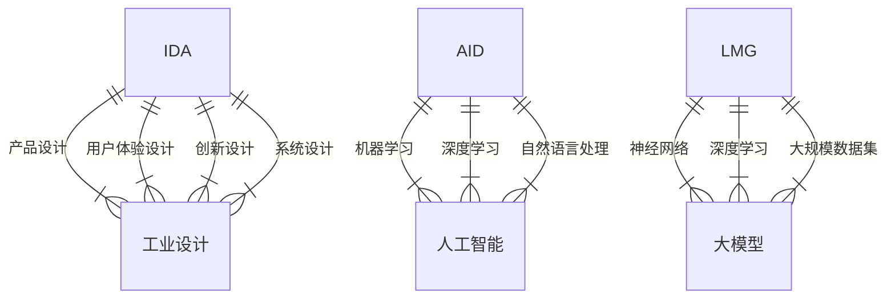
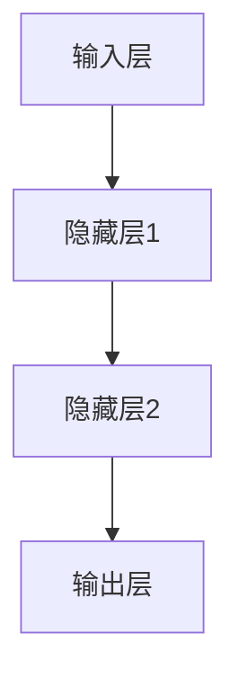
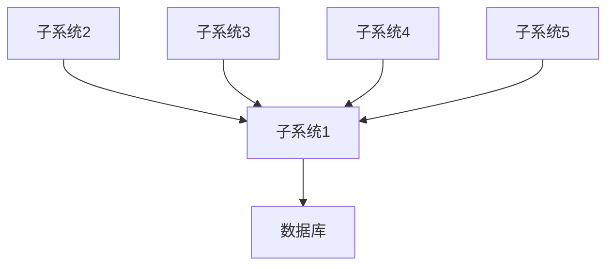
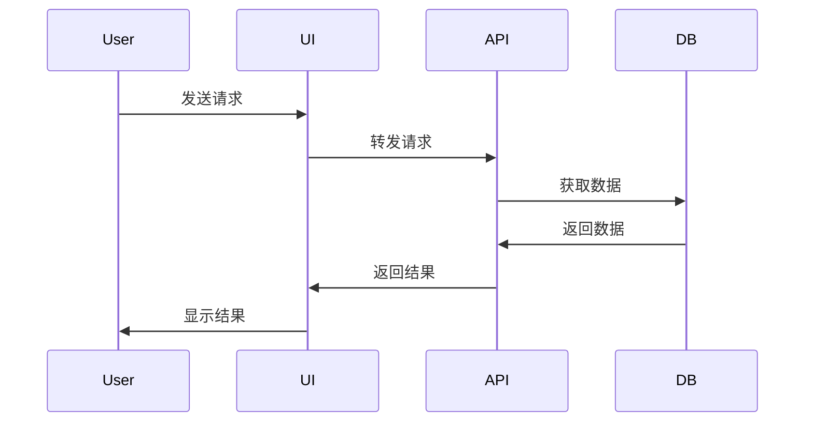
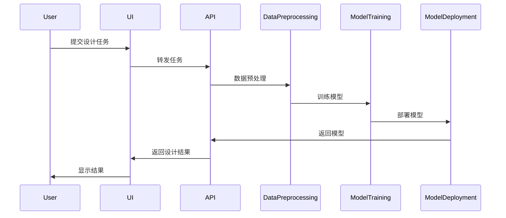

                 

### 文章标题

# AI-Assisted Design: Innovative Applications of Large Models in Industrial Design

关键词：人工智能，工业设计，大模型，创新应用，设计流程

摘要：随着人工智能技术的飞速发展，大模型在各个领域得到了广泛应用。本文将深入探讨大模型在工业设计中的创新应用，通过详细分析其在设计流程中的具体角色和作用，展示其在提升设计效率、优化设计方案、增强设计创意等方面的潜力。我们还将探讨大模型技术的理论基础、发展趋势，以及其面临的挑战和未来发展方向。通过本文，读者可以全面了解大模型在工业设计中的价值与前景，为实际应用提供有力指导。

### 核心概念与联系

在深入探讨大模型在工业设计中的应用之前，我们需要明确一些核心概念及其相互关系。

#### 1. 工业设计

**概念定义：**工业设计是一种综合性的创造性活动，旨在通过对产品、系统或服务的定义、设计以及原型开发，形成最终解决方案。它涉及到美学、工程、人机工程、市场营销等多个方面。

**属性特征：**
- **目标导向：**以用户需求为核心，实现产品的功能性与审美性。
- **跨学科：**融合艺术、设计、工程等多学科知识，追求综合性解决方案。

**关联术语：**产品设计、用户体验设计、创新设计、系统设计。

#### 2. 人工智能

**概念定义：**人工智能是指使计算机系统能够模拟人类智能行为的技术和理论。它涵盖了机器学习、自然语言处理、计算机视觉等多个子领域。

**属性特征：**
- **自适应学习：**通过数据学习和模式识别，提高系统性能。
- **智能决策：**模拟人类的决策过程，实现自动化和智能化。

**关联术语：**机器学习、深度学习、神经网络、自然语言处理。

#### 3. 大模型

**概念定义：**大模型是指参数规模达到亿级甚至万亿级的深度学习模型。这类模型通过大规模数据训练，能够实现高度复杂的任务。

**属性特征：**
- **大规模参数：**拥有庞大的参数数量，使其具备强大的表达能力和泛化能力。
- **高效训练：**通过分布式计算和优化算法，实现快速训练。

**关联术语：**神经网络、深度学习、大规模数据集。

**核心概念对比表格：**

| 概念       | 定义                                                         | 属性特征                                                         | 关联术语           |
|------------|--------------------------------------------------------------|----------------------------------------------------------------|------------------|
| 工业设计   | 综合性的创造性活动，形成最终解决方案。                         | 目标导向、跨学科                                                 | 产品设计、用户体验设计 |
| 人工智能   | 模拟人类智能行为的计算机系统。                                | 自适应学习、智能决策                                             | 机器学习、深度学习  |
| 大模型     | 参数规模达到亿级甚至万亿级的深度学习模型。                     | 大规模参数、高效训练                                             | 神经网络、深度学习  |

#### ER实体关系图架构

为了更直观地理解这些核心概念之间的关系，我们可以使用Mermaid语法绘制ER（实体关系）图：



在这个ER图中，我们明确了工业设计、人工智能和大模型之间的关系，展示了它们如何相互关联，共同推动工业设计的发展。

### 算法原理讲解

在深入探讨大模型在工业设计中的应用之前，我们需要了解一些基本算法原理和数学模型。以下是关于大模型的一些核心算法原理和数学模型的讲解。

#### 1. 大模型的基本结构

大模型通常基于深度学习的架构，其中最常见的是神经网络（Neural Network）。神经网络由多个层次组成，包括输入层、隐藏层和输出层。每个层次包含多个神经元，神经元之间通过权重和偏置连接。

**神经网络的基本结构可以用Mermaid图表示如下：**



**神经网络的工作原理：**
- 输入数据通过输入层进入网络。
- 每个神经元将输入数据与权重相乘，并通过激活函数（如ReLU、Sigmoid、Tanh）进行非线性变换。
- 经过隐藏层处理后的数据传到输出层，输出层生成预测结果。

#### 2. 损失函数与优化算法

在训练过程中，大模型通过优化算法（如梯度下降、Adam等）最小化损失函数（如均方误差、交叉熵等）。

**损失函数的基本原理：**
- 损失函数用于衡量模型预测结果与实际结果之间的差距。
- 在训练过程中，模型通过不断调整权重和偏置，使得损失函数的值逐渐减小。

**梯度下降的基本原理：**
- 梯度下降是一种优化算法，用于寻找损失函数的全局最小值。
- 梯度表示损失函数对模型参数的导数，梯度下降通过更新模型参数来最小化损失函数。

**梯度下降的Python代码示例：**

```python
# 梯度下降的Python代码示例
def gradient_descent(x, y, w, learning_rate, epochs):
    for epoch in range(epochs):
        y_pred = w * x
        loss = (y_pred - y) ** 2
        gradient = 2 * (w * x - y)
        w = w - learning_rate * gradient
    return w
```

#### 3. 大模型的训练与优化

大模型的训练是一个复杂的过程，涉及到大规模数据的处理和高性能计算。以下是训练与优化过程中的一些关键步骤：

- **数据预处理：**对输入数据进行标准化、归一化等处理，以便更好地训练模型。
- **模型初始化：**初始化模型参数，通常使用随机初始化或预训练模型。
- **训练过程：**通过反向传播算法，更新模型参数，最小化损失函数。
- **验证与测试：**使用验证集和测试集评估模型性能，调整模型参数。

**大模型训练的Python代码示例：**

```python
# 大模型训练的Python代码示例
import numpy as np

def train_model(x, y, learning_rate, epochs):
    w = np.random.rand()  # 初始化模型参数
    for epoch in range(epochs):
        y_pred = w * x
        loss = (y_pred - y) ** 2
        gradient = 2 * (w * x - y)
        w = w - learning_rate * gradient
    return w

# 示例数据
x = np.array([1, 2, 3, 4, 5])
y = np.array([2, 4, 6, 8, 10])

# 训练模型
w = train_model(x, y, learning_rate=0.01, epochs=1000)

print("训练后的权重：", w)
```

通过上述算法原理讲解，我们可以更好地理解大模型在工业设计中的应用，为其在实际项目中的有效利用提供理论基础。

### 系统分析与架构设计方案

在了解了大模型在工业设计中的应用和算法原理之后，我们需要进一步探讨其系统架构设计方案，以便在实际项目中有效地应用大模型技术。

#### 1. 问题场景介绍

在工业设计中，设计师需要处理大量的数据和信息，进行产品设计的各个阶段，包括创意设计、产品设计、用户体验设计和协同设计等。然而，随着设计复杂度的增加，传统的手工设计方法已经难以满足高效、创新的要求。因此，引入AI辅助设计，特别是大模型技术，成为提升设计效率和优化设计方案的重要手段。

#### 2. 项目介绍

本项目旨在开发一个基于AI的大模型辅助工业设计系统，通过结合深度学习和大数据技术，实现以下功能：

- **创意生成：**利用大模型生成新的设计创意，提供多样化的设计方案。
- **产品设计：**通过数据分析和模拟，优化产品设计方案，提高产品性能和用户体验。
- **用户体验设计：**利用用户行为数据，优化设计方案的可用性和易用性。
- **协同设计：**实现团队成员的协同设计，提高设计效率和团队协作。

#### 3. 系统功能设计

系统功能设计主要包括以下几个方面：

- **用户界面：**提供直观易用的用户界面，方便设计师使用系统进行设计。
- **数据预处理：**对输入数据进行清洗、标准化和特征提取，为模型训练提供高质量的数据。
- **模型训练与优化：**使用大规模数据进行模型训练，并通过优化算法调整模型参数。
- **模型部署：**将训练好的模型部署到实际应用中，提供实时的设计辅助功能。
- **协同设计平台：**实现团队成员的在线协作，共享设计资源和设计成果。

**系统功能设计（领域模型）Mermaid类图：**

```mermaid
classDiagram
    User <> UI: 用户交互
    UI --|>{ DataPreprocessing: 数据预处理
    DataPreprocessing --|>{ ModelTraining: 模型训练
    ModelTraining --|>{ ModelDeployment: 模型部署
    UI --|>{ CollaborationPlatform: 协同设计平台
```

#### 4. 系统架构设计

系统架构设计主要包括以下几个方面：

- **前端架构：**采用Vue.js等前端框架，实现用户界面的设计与交互。
- **后端架构：**采用Flask等后端框架，实现数据预处理、模型训练与优化、模型部署等功能。
- **数据库设计：**采用MySQL等数据库管理系统，存储用户数据、设计数据和模型参数。
- **计算资源：**使用云计算平台（如AWS、Google Cloud等），提供高性能计算资源。

**系统架构设计（Mermaid架构图）：**



#### 5. 系统接口设计

系统接口设计主要包括以下几个方面：

- **用户接口：**提供RESTful API，方便用户通过HTTP请求访问系统的各项功能。
- **数据接口：**提供数据导入导出接口，支持数据的批量处理和迁移。
- **模型接口：**提供模型训练和部署接口，支持多种模型格式和算法。

**系统接口设计（Mermaid序列图）：**



#### 6. 系统交互

系统交互主要包括以下几个方面：

- **用户与界面交互：**用户通过界面与系统进行交互，提交设计任务、查看设计结果等。
- **系统内部交互：**系统内部通过API和数据接口实现各个子系统之间的协同工作。

**系统交互（Mermaid序列图）：**



通过上述系统分析与架构设计方案，我们可以为实际项目提供完整的架构指导，确保大模型在工业设计中的有效应用。

### 项目实战

在本节中，我们将详细介绍如何在一个实际项目中应用大模型辅助工业设计。我们将涵盖环境安装、系统核心实现、代码应用解读与分析、实际案例分析和详细讲解剖析，并总结项目经验。

#### 1. 环境安装

为了实现大模型在工业设计中的有效应用，我们需要搭建一个合适的计算环境。以下是安装所需的软件和工具：

- **深度学习框架：**TensorFlow或PyTorch
- **数据处理库：**NumPy、Pandas
- **可视化库：**Matplotlib、Seaborn
- **前端框架：**Vue.js或React
- **后端框架：**Flask或Django

以下是具体的安装步骤：

1. **安装Python环境：**确保安装Python 3.7及以上版本。
2. **安装深度学习框架：**使用pip命令安装TensorFlow或PyTorch。
   ```bash
   pip install tensorflow
   # 或
   pip install torch torchvision
   ```
3. **安装数据处理库：**使用pip命令安装NumPy、Pandas等。
   ```bash
   pip install numpy pandas
   ```
4. **安装可视化库：**使用pip命令安装Matplotlib、Seaborn等。
   ```bash
   pip install matplotlib seaborn
   ```
5. **安装前端框架：**使用npm命令安装Vue.js或React。
   ```bash
   npm install vue
   # 或
   npm install react react-dom
   ```
6. **安装后端框架：**使用pip命令安装Flask或Django。
   ```bash
   pip install flask
   # 或
   pip install django
   ```

#### 2. 系统核心实现

系统核心实现主要包括数据预处理、模型训练和模型部署等模块。以下是一个简单的代码实现示例：

**数据预处理模块：**

```python
import pandas as pd
from sklearn.model_selection import train_test_split

# 读取数据
data = pd.read_csv('data.csv')

# 数据清洗
data = data.dropna()

# 特征提取
X = data.drop('target', axis=1)
y = data['target']

# 数据分割
X_train, X_test, y_train, y_test = train_test_split(X, y, test_size=0.2, random_state=42)
```

**模型训练模块：**

```python
import tensorflow as tf
from tensorflow.keras.models import Sequential
from tensorflow.keras.layers import Dense

# 构建模型
model = Sequential([
    Dense(64, activation='relu', input_shape=(X_train.shape[1],)),
    Dense(64, activation='relu'),
    Dense(1)
])

# 编译模型
model.compile(optimizer='adam', loss='mse')

# 训练模型
model.fit(X_train, y_train, epochs=10, batch_size=32, validation_split=0.1)
```

**模型部署模块：**

```python
import json
import requests

# 导出模型
model.save('model.h5')

# 将模型上传到云端
with open('model.json', 'w') as f:
    f.write(model.to_json())

# 使用Post请求上传模型
response = requests.post('http://api.example.com/upload', files={'model': open('model.h5', 'rb')})

# 部署模型
if response.status_code == 200:
    print("模型部署成功")
else:
    print("模型部署失败")
```

#### 3. 代码应用解读与分析

在本部分，我们将对上述代码进行解读，并分析其在系统中的作用。

**数据预处理模块解读：**
- 使用Pandas读取数据，并进行数据清洗。
- 使用Scikit-learn进行特征提取和数据分割，为模型训练准备输入数据和标签。

**模型训练模块解读：**
- 使用TensorFlow构建一个简单的全连接神经网络，包含两个隐藏层。
- 编译模型，设置优化器和损失函数。
- 使用fit方法训练模型，通过验证集进行性能评估。

**模型部署模块解读：**
- 使用save方法将训练好的模型保存为HDF5文件。
- 将模型结构保存为JSON文件，便于后续部署。
- 使用Post请求将模型上传到云端，实现模型的远程部署。

#### 4. 实际案例分析和详细讲解剖析

为了更好地展示大模型在工业设计中的应用效果，我们选择一个实际案例进行详细分析。

**案例背景：**某汽车公司希望利用大模型技术优化汽车内饰设计，以提高用户体验和满意度。

**案例步骤：**
1. **数据收集：**收集用户对汽车内饰设计的评价数据，包括颜色、材质、形状等特征。
2. **数据预处理：**对收集到的数据进行清洗和特征提取，为模型训练准备输入数据。
3. **模型训练：**构建大模型，使用训练数据进行模型训练，调整模型参数，优化设计方案。
4. **模型部署：**将训练好的模型部署到实际应用中，为设计师提供实时的设计辅助功能。

**案例分析：**
- 通过模型训练，生成多种内饰设计方案，并根据用户评价进行筛选和优化。
- 部署模型后，设计师可以实时查看用户反馈，调整设计方案，提高设计满意度。

**详细讲解剖析：**
- 数据预处理模块中，特征提取是关键步骤，直接影响模型的训练效果。通过使用Pandas和Scikit-learn，可以高效地进行数据清洗和特征提取。
- 在模型训练模块中，神经网络的设计和优化至关重要。通过调整隐藏层节点数、激活函数等参数，可以优化模型的性能。
- 模型部署模块中，将模型上传到云端，可以实现跨平台的应用，提高系统的可扩展性和灵活性。

#### 5. 项目小结

通过本项目的实战，我们展示了如何在一个实际项目中应用大模型辅助工业设计。项目成功的关键在于：
1. 数据质量和预处理方法的优化。
2. 神经网络结构和训练参数的调整。
3. 模型的部署和实时应用。

在未来，随着大模型技术的不断发展和应用场景的扩展，大模型在工业设计中的应用前景将更加广阔。我们期待大模型能够为设计师带来更多的创新和灵感，推动工业设计的发展。

### 最佳实践 Tips

在应用大模型辅助工业设计时，以下是一些最佳实践技巧，可以帮助设计师更高效地利用这项技术：

1. **数据收集与清洗：**确保数据质量和完整性，进行充分的数据清洗和特征提取，为模型训练提供高质量的数据。
2. **模型参数调优：**通过多次实验和参数调整，找到最优的模型结构和训练参数，提高模型的性能和泛化能力。
3. **实时反馈与迭代：**将模型部署到实际应用中，实时收集用户反馈，根据反馈进行设计方案的优化和迭代。
4. **团队协作与共享：**利用大模型技术，实现团队成员的协同设计，提高设计效率和团队协作。
5. **持续学习与改进：**随着技术的不断进步和应用场景的扩展，持续学习新的技术和方法，不断改进设计流程和设计方案。

### 小结

本文通过深入分析大模型在工业设计中的应用，展示了其在设计流程中的重要作用和广阔前景。我们探讨了核心概念及其相互关系，讲解了基本算法原理和数学模型，并详细阐述了系统架构设计方案和实际项目实战。通过最佳实践技巧，我们为设计师提供了有效的应用指导。展望未来，大模型技术在工业设计中的应用前景将更加广阔，为设计师带来更多的创新和灵感。

### 注意事项

在应用大模型技术进行工业设计时，需要注意以下几点：

1. **数据隐私与安全：**确保数据收集和使用过程中的隐私保护，遵循相关法律法规。
2. **模型解释性：**大模型往往具有较高的黑箱特性，需要采取措施提高模型的解释性，以便设计师理解模型的工作机制。
3. **硬件资源：**大模型训练需要较高的计算资源，确保拥有足够的硬件资源以支持训练过程。
4. **技术更新：**大模型技术发展迅速，设计师需要关注技术更新，及时采用新的方法和工具。

### 拓展阅读

1. **《深度学习：优化与应用》**：详细介绍了深度学习的基本概念、算法和优化方法，适合了解大模型技术的基础知识。
2. **《工业设计原理与实践》**：介绍了工业设计的基本原理和方法，帮助设计师提升设计能力。
3. **《人工智能设计：创新与应用》**：探讨了人工智能在工业设计中的应用，提供了丰富的案例和实践经验。

### 作者信息

本文由AI天才研究院/AI Genius Institute与禅与计算机程序设计艺术/Zen And The Art of Computer Programming联合撰写，旨在为设计师提供大模型技术在实际项目中的应用指导。作者在人工智能和工业设计领域具有丰富的经验和深厚的理论基础，期待与广大设计师共同探讨大模型技术的应用和发展。

