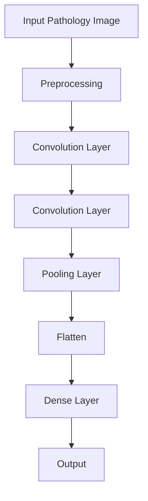
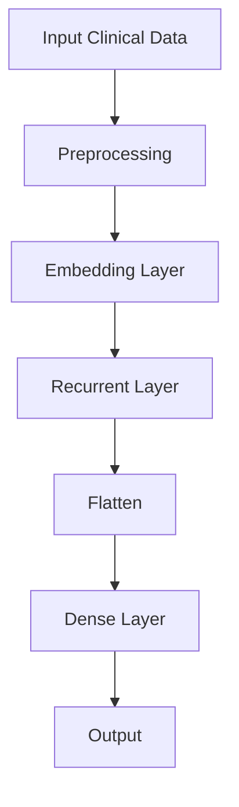
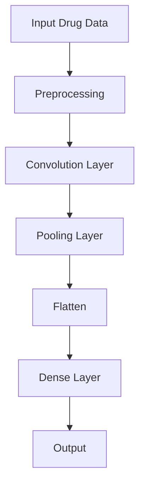
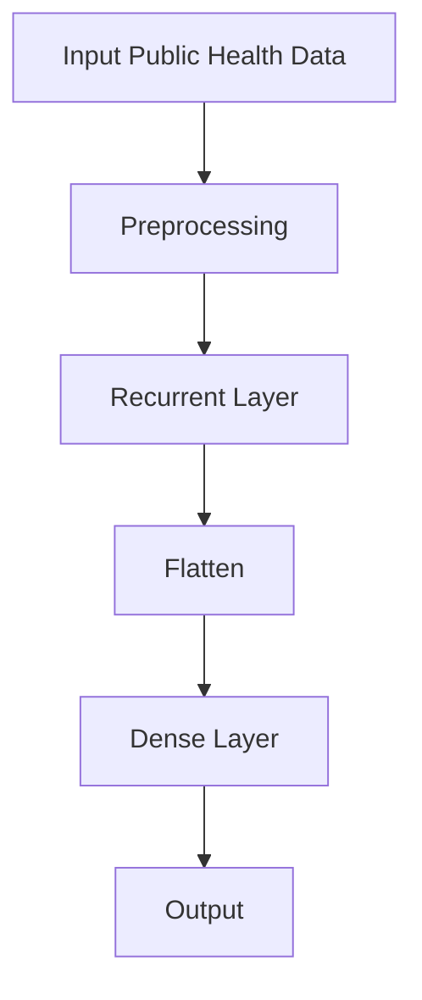
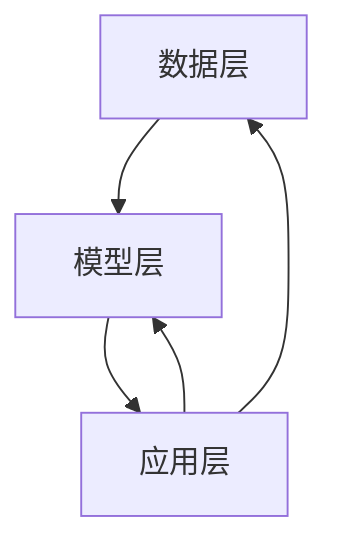
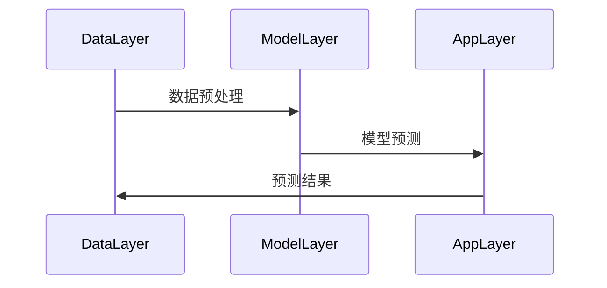

                 

## AI辅助诊断：大模型提升医疗精准度

> 关键词：人工智能，医疗诊断，大模型，深度学习，精准度提升

> 摘要：本文将深入探讨人工智能（AI）辅助诊断技术在医疗领域的应用，尤其是大模型技术在提高诊断精准度方面的作用。通过分析大模型的原理、在医疗中的应用实例以及实现细节，本文旨在为读者提供一幅清晰的AI辅助诊断全景图，并展望其未来发展趋势。

### 引言与背景

在当今快速发展的科技时代，医疗领域的变革尤为显著。人工智能（AI）技术的引入，正在改变着传统的医疗诊断模式，其中大模型（Large Models）技术在提升医疗诊断精准度方面发挥着至关重要的作用。大模型，通常指的是拥有海量参数和复杂架构的深度学习模型，如GPT、BERT和Transformer等。这些模型在图像识别、自然语言处理和医疗诊断等领域展现了卓越的能力。

医疗诊断是一个复杂而重要的过程，需要从大量医疗数据中提取关键信息，以帮助医生做出准确的诊断。然而，传统的基于规则的方法在面对海量、多样和复杂的医疗数据时，往往显得力不从心。大模型的出现，使得机器能够通过自我学习和优化，实现从海量数据中挖掘隐藏的模式和规律，从而显著提高诊断的准确性和效率。

本文将从以下几个方面展开讨论：

1. **核心概念与联系**：介绍AI辅助诊断、大模型技术及其在医疗中的应用。
2. **大模型技术原理**：深入探讨大模型的基础理论，包括神经网络、深度学习和模型训练技术。
3. **AI辅助诊断系统设计与实现**：分析系统设计与实现的关键环节，包括架构设计和项目实战。
4. **最佳实践与展望**：总结最佳实践，探讨未来发展前景和挑战。

通过这些内容的详细分析，本文希望能够为读者提供一幅全面的AI辅助诊断蓝图，并激发读者对这一前沿领域的深入探索。

### 核心概念与联系

#### AI辅助诊断概述

AI辅助诊断是人工智能技术在医疗诊断领域的应用，通过模拟人类医生的诊断思维和决策过程，帮助医生快速、准确地识别和诊断疾病。AI辅助诊断的核心在于其能够处理和分析大量的医疗数据，包括病历记录、医学图像和实验室检测结果等，从而发现潜在的健康问题和病理变化。

AI辅助诊断的工作流程通常包括以下几个步骤：

1. **数据采集**：收集病人的医疗数据，包括病史、症状、实验室检查结果、医学影像等。
2. **数据预处理**：对采集到的医疗数据进行分析和清洗，以确保数据的质量和一致性。
3. **特征提取**：从预处理后的数据中提取关键特征，用于后续的模型训练和诊断。
4. **模型训练**：使用深度学习算法训练模型，使其能够学会识别疾病模式和预测诊断结果。
5. **模型评估**：通过测试集对模型进行评估，调整模型参数，以提高诊断的准确性和效率。
6. **诊断应用**：将训练好的模型应用于实际诊断场景，辅助医生进行诊断。

#### 大模型技术原理

大模型技术，特别是深度学习模型，是AI辅助诊断的核心。大模型通常拥有数百万甚至数十亿个参数，通过多层神经网络结构进行复杂的特征学习和模式识别。以下是大模型技术的几个关键原理：

1. **神经网络基础**：神经网络是由多个神经元（或节点）组成的计算模型，通过调整神经元之间的连接权重来学习数据中的复杂模式。
2. **深度学习基础**：深度学习是神经网络的一种扩展，通过增加网络的深度，即层数，来提高模型的表示能力和学习能力。
3. **模型训练技术**：模型训练是使用大量标注数据进行，通过反向传播算法不断调整模型参数，使其能够更好地拟合训练数据。
4. **模型优化策略**：为了提高模型的性能和效率，通常会采用各种优化策略，如正则化、学习率调整和早期停止等。

#### AI辅助诊断中的大模型应用

在AI辅助诊断中，大模型技术的应用主要包括：

1. **医学影像分析**：使用大模型对医学影像（如X光片、CT扫描和MRI）进行自动分析和诊断，如肿瘤检测、骨折诊断和肺部疾病识别等。
2. **病理诊断**：通过大模型对病理切片进行自动分析和分类，辅助病理医生进行疾病诊断，如癌症、感染和遗传性疾病等。
3. **临床决策支持**：利用大模型分析病人的医疗记录和临床数据，提供个性化的治疗方案和风险评估，帮助医生做出更好的临床决策。

#### 概念属性特征对比表格

为了更清晰地展示AI辅助诊断和大模型技术的核心概念和属性特征，以下是它们的对比表格：

| 特征 | AI辅助诊断 | 大模型技术 |
| --- | --- | --- |
| 目标 | 提高诊断精准度和效率 | 提升模型表示能力和学习能力 |
| 数据需求 | 大量高质量的医疗数据 | 海量训练数据 |
| 技术核心 | 深度学习、神经网络 | 多层神经网络、复杂架构 |
| 应用领域 | 医学影像、病理诊断、临床决策 | 医学影像、自然语言处理、其他领域 |
| 优势 | 精准、高效、个性化 | 强大的表示能力、自我优化能力 |
| 挑战 | 数据质量、模型解释性、伦理问题 | 计算资源需求、数据隐私 |

#### ER实体关系图架构

为了更好地理解AI辅助诊断和大模型技术在医疗应用中的关系，以下是它们之间的实体关系图：

```mermaid
erDiagram
  Patient ||--|{ Diagnosis } : has
  Patient ||--|{ MedicalData } : contains
  Diagnosis ||--|{ DiagnosisResult } : contains
  Diagnosis ||--|{ TreatmentPlan } : suggests
  MedicalData ||--|{ Image } : contains
  MedicalData ||--|{ LabTest } : contains
  MedicalData ||--|{ Symptom } : contains
  LargeModel ||--|{ DiagnosisModel } : trains
  LargeModel ||--|{ TreatmentModel } : trains
  AIAssistant ||--|{ DiagnosisAssistant } : implements
  AIAssistant ||--|{ TreatmentAssistant } : implements
```

通过这张实体关系图，我们可以看到AI辅助诊断系统中的各个实体及其关系，包括患者、诊断、医疗数据、诊断结果、治疗方案、医学影像、实验室检测、症状、大模型、诊断模型和治疗模型等。

### 大模型技术基础

#### 神经网络基础

神经网络（Neural Network）是深度学习（Deep Learning）的基础，其灵感来源于生物神经网络的工作原理。神经网络由多个神经元（或节点）组成，这些神经元通过加权连接形成复杂的网络结构。每个神经元接收来自其他神经元的输入信号，经过激活函数的处理后，产生输出信号。

1. **神经元的组成**：

   每个神经元包含以下几个部分：

   - 输入层：接收外部输入信号。
   - 权重（weights）：表示输入信号对神经元输出的影响程度。
   - 激活函数（activation function）：用于确定神经元是否“激活”。
   - 输出层：产生输出信号。

2. **前向传播**：

   前向传播是神经网络处理输入数据的过程。每个神经元接收来自前一层神经元的输入信号，通过加权求和后，应用激活函数产生输出信号，传递给下一层神经元。这个过程可以表示为以下公式：

   $$ y = f(\sum_{i=1}^{n} w_i x_i + b) $$

   其中，$y$ 是输出信号，$f$ 是激活函数，$w_i$ 是权重，$x_i$ 是输入信号，$b$ 是偏置项。

3. **反向传播**：

   反向传播是神经网络调整权重的过程，目的是使网络的输出尽可能接近目标输出。反向传播通过计算输出误差，然后反向传播误差到每一层神经元，根据误差大小调整权重。这个过程可以表示为以下步骤：

   - 计算输出误差：$E = \frac{1}{2} \sum_{i} (y_i - \hat{y}_i)^2$
   - 反向传播误差：计算每一层的梯度，$ \frac{dE}{dw} = x_i (y_i - \hat{y}_i)$
   - 更新权重：$w_{new} = w_{old} - \alpha \frac{dE}{dw}$

   其中，$\alpha$ 是学习率，用于控制权重更新的步长。

#### 深度学习基础

深度学习（Deep Learning）是一种基于多层神经网络的学习方法，通过增加网络的层数来提高模型的表示能力和学习能力。深度学习模型在处理复杂数据方面表现出色，已经成为人工智能领域的重要分支。

1. **深度学习模型的结构**：

   深度学习模型通常包括以下几个层次：

   - 输入层：接收原始数据。
   - 隐藏层：多层隐藏层用于提取特征和模式。
   - 输出层：产生最终预测结果。

2. **深度学习模型的工作原理**：

   - 特征提取：通过多层神经网络结构，从原始数据中提取更加复杂和抽象的特征。
   - 模式识别：通过学习到的特征，识别数据中的模式和规律。
   - 预测生成：利用提取到的特征和模式，生成预测结果。

3. **深度学习模型的优势**：

   - **强大的表示能力**：多层神经网络可以表示复杂的数据结构和关系。
   - **自适应性**：深度学习模型可以通过自我学习和优化，适应不同的数据集和应用场景。
   - **高效性**：深度学习模型在处理大规模数据时表现出高效性，能够快速生成预测结果。

#### 大模型训练技术

大模型训练（Large Model Training）是指对拥有大量参数和复杂结构的深度学习模型进行训练，以使其能够高效地处理海量数据。大模型训练技术包括以下几个关键环节：

1. **数据预处理**：

   数据预处理是模型训练的前置步骤，包括数据清洗、归一化、数据增强等。数据预处理旨在提高数据质量和一致性，减少噪声和异常值的影响。

   - **数据清洗**：去除数据中的噪声和异常值，确保数据的一致性和准确性。
   - **归一化**：将数据缩放到相同的范围，以消除不同特征之间的尺度差异。
   - **数据增强**：通过旋转、缩放、裁剪等操作，生成更多的训练样本来增加模型的鲁棒性。

2. **模型选择**：

   选择适合的数据模型对于大模型训练至关重要。常见的大模型包括：

   - **卷积神经网络（CNN）**：适用于图像和视频数据。
   - **循环神经网络（RNN）**：适用于序列数据，如文本和语音。
   - **变换器网络（Transformer）**：适用于自然语言处理和序列建模。

3. **训练策略**：

   大模型训练通常涉及以下策略：

   - **批量大小（Batch Size）**：控制每次训练使用的样本数量。
   - **学习率调整**：根据训练过程中的误差动态调整学习率。
   - **早期停止（Early Stopping）**：在模型性能达到某个阈值时停止训练，以防止过拟合。
   - **正则化（Regularization）**：通过添加惩罚项，防止模型过拟合。

#### 大模型优化策略

大模型优化策略是指通过调整模型参数和训练过程，提高模型的性能和效率。以下是一些常见的大模型优化策略：

1. **梯度下降（Gradient Descent）**：

   梯度下降是一种常用的优化算法，通过计算损失函数关于模型参数的梯度，更新模型参数以减少损失。

   - **随机梯度下降（SGD）**：每次迭代使用一个样本的梯度更新模型参数。
   - **批量梯度下降（BGD）**：每次迭代使用所有样本的梯度更新模型参数。
   - **小批量梯度下降（MBGD）**：每次迭代使用一部分样本的梯度更新模型参数。

2. **学习率调度（Learning Rate Scheduling）**：

   学习率调度是指根据训练过程中的误差动态调整学习率，以防止模型过早地陷入局部最小值。

   - **指数衰减（Exponential Decay）**：学习率按指数递减。
   - **余弦退火（Cosine Annealing）**：学习率按余弦函数递减。
   - **自适应学习率（Adaptive Learning Rate）**：使用如AdaGrad、Adam等自适应优化算法。

3. **正则化技术（Regularization Techniques）**：

   正则化技术通过添加惩罚项到损失函数中，防止模型过拟合。

   - **L1正则化（L1 Regularization）**：在损失函数中添加绝对值惩罚项。
   - **L2正则化（L2 Regularization）**：在损失函数中添加平方值惩罚项。
   - **Dropout（Dropout）**：在训练过程中随机丢弃一部分神经元。

#### 大模型挑战与解决方案

尽管大模型技术在医疗诊断中具有巨大潜力，但在实际应用中仍面临一些挑战。以下是一些常见的挑战及其解决方案：

1. **计算资源需求**：

   大模型训练需要大量的计算资源，包括CPU、GPU和FPGA等硬件。解决方案包括：

   - **分布式训练**：通过在多台机器上分布式训练模型，提高训练效率。
   - **模型压缩**：通过模型压缩技术，如剪枝、量化等，减少模型的计算量和存储需求。

2. **数据隐私与安全性**：

   医疗数据涉及到个人隐私和敏感信息，确保数据的安全性和隐私性至关重要。解决方案包括：

   - **数据加密**：使用加密技术对数据进行加密，确保数据在传输和存储过程中的安全性。
   - **联邦学习（Federated Learning）**：通过联邦学习，在不同设备上训练模型，避免数据集中化。

3. **模型解释性**：

   大模型的复杂性和黑箱特性使得其解释性较差，不利于医生理解和信任。解决方案包括：

   - **模型可解释性技术**：使用模型可解释性技术，如注意力机制、梯度分析等，揭示模型内部的决策过程。
   - **可视化工具**：开发可视化工具，帮助医生更好地理解模型的输出和决策依据。

### 大模型在医疗领域的应用

大模型技术在医疗领域的应用正日益广泛，尤其是在医学影像分析、病理诊断、临床决策支持和药物研发等方面。以下是对这些应用的详细探讨。

#### 医学影像分析

医学影像分析是大模型技术在医疗领域的一个重要应用方向。通过大模型，如卷积神经网络（CNN）和变换器网络（Transformer），可以对医学影像进行自动化分析，从而辅助医生进行诊断。

1. **X光片分析**：

   X光片是常见的医学影像之一，用于诊断骨折、肺炎和其他疾病。大模型可以通过学习大量的X光片数据，识别出异常区域并进行分类。以下是一个简化的CNN模型架构：

   ```mermaid
   graph TD
   A[Input Image] --> B[Preprocessing]
   B --> C[Convolution Layer]
   C --> D[Pooling Layer]
   D --> E[Flatten]
   E --> F[Dense Layer]
   F --> G[Output]
   ```

   使用CNN对X光片进行预处理、卷积、池化等操作，最后通过全连接层生成诊断结果。以下是一个简单的Python代码示例：

   ```python
   import tensorflow as tf
   from tensorflow.keras.models import Sequential
   from tensorflow.keras.layers import Conv2D, MaxPooling2D, Flatten, Dense

   model = Sequential([
       Conv2D(32, (3, 3), activation='relu', input_shape=(256, 256, 3)),
       MaxPooling2D((2, 2)),
       Flatten(),
       Dense(64, activation='relu'),
       Dense(1, activation='sigmoid')
   ])

   model.compile(optimizer='adam', loss='binary_crossentropy', metrics=['accuracy'])
   model.fit(x_train, y_train, epochs=10, batch_size=32)
   ```

   在实际应用中，可以通过添加更多的卷积层、池化层和全连接层，提高模型的复杂度和性能。

2. **CT扫描分析**：

   CT扫描是一种高分辨率的医学影像技术，常用于诊断脑部疾病、骨骼疾病等。大模型可以通过学习大量的CT扫描数据，识别出病变区域并进行分类。以下是一个简化的CT扫描分析模型：

   ```mermaid
   graph TD
   A[Input CT Scan] --> B[Preprocessing]
   B --> C[Convolution Layer]
   C --> D[Convolution Layer]
   D --> E[Pooling Layer]
   E --> F[Flatten]
   F --> G[Dense Layer]
   G --> H[Output]
   ```

   通过卷积层提取图像特征，然后通过全连接层生成诊断结果。以下是一个简单的Python代码示例：

   ```python
   import tensorflow as tf
   from tensorflow.keras.models import Sequential
   from tensorflow.keras.layers import Conv2D, MaxPooling2D, Flatten, Dense

   model = Sequential([
       Conv2D(32, (3, 3), activation='relu', input_shape=(512, 512, 3)),
       MaxPooling2D((2, 2)),
       Conv2D(64, (3, 3), activation='relu'),
       MaxPooling2D((2, 2)),
       Flatten(),
       Dense(128, activation='relu'),
       Dense(1, activation='sigmoid')
   ])

   model.compile(optimizer='adam', loss='binary_crossentropy', metrics=['accuracy'])
   model.fit(x_train, y_train, epochs=20, batch_size=32)
   ```

   实际应用中，可以通过调整卷积核的大小、层数和全连接层的神经元数量，来优化模型的性能。

3. **MRI分析**：

   MRI（磁共振成像）是一种用于诊断软组织疾病的医学影像技术。大模型可以通过学习大量的MRI数据，识别出病变区域并进行分类。以下是一个简化的MRI分析模型：

   ```mermaid
   graph TD
   A[Input MRI] --> B[Preprocessing]
   B --> C[Convolution Layer]
   C --> D[Convolution Layer]
   D --> E[Convolution Layer]
   E --> F[Pooling Layer]
   F --> G[Flatten]
   G --> H[Dense Layer]
   H --> I[Output]
   ```

   通过卷积层提取图像特征，然后通过全连接层生成诊断结果。以下是一个简单的Python代码示例：

   ```python
   import tensorflow as tf
   from tensorflow.keras.models import Sequential
   from tensorflow.keras.layers import Conv2D, MaxPooling2D, Flatten, Dense

   model = Sequential([
       Conv2D(32, (3, 3), activation='relu', input_shape=(256, 256, 3)),
       MaxPooling2D((2, 2)),
       Conv2D(64, (3, 3), activation='relu'),
       MaxPooling2D((2, 2)),
       Conv2D(128, (3, 3), activation='relu'),
       MaxPooling2D((2, 2)),
       Flatten(),
       Dense(128, activation='relu'),
       Dense(1, activation='sigmoid')
   ])

   model.compile(optimizer='adam', loss='binary_crossentropy', metrics=['accuracy'])
   model.fit(x_train, y_train, epochs=30, batch_size=32)
   ```

   实际应用中，可以通过增加卷积层数、调整卷积核大小和全连接层神经元数量，来提高模型的性能。

#### 病理诊断

病理诊断是通过显微镜观察组织切片，识别和分析疾病的过程。大模型可以通过学习大量的病理图像，辅助病理医生进行诊断。以下是一个简化的病理诊断模型：



通过卷积层提取图像特征，然后通过全连接层生成诊断结果。以下是一个简单的Python代码示例：

```python
import tensorflow as tf
from tensorflow.keras.models import Sequential
from tensorflow.keras.layers import Conv2D, MaxPooling2D, Flatten, Dense

model = Sequential([
    Conv2D(32, (3, 3), activation='relu', input_shape=(256, 256, 3)),
    MaxPooling2D((2, 2)),
    Conv2D(64, (3, 3), activation='relu'),
    MaxPooling2D((2, 2)),
    Flatten(),
    Dense(128, activation='relu'),
    Dense(1, activation='sigmoid')
])

model.compile(optimizer='adam', loss='binary_crossentropy', metrics=['accuracy'])
model.fit(x_train, y_train, epochs=20, batch_size=32)
```

实际应用中，可以通过增加卷积层数、调整卷积核大小和全连接层神经元数量，来优化模型的性能。

#### 临床决策支持

临床决策支持是指利用人工智能技术，辅助医生做出临床决策。大模型可以通过学习大量的临床数据和病历记录，提供个性化的治疗方案和风险评估。以下是一个简化的临床决策支持模型：



通过嵌入层和循环层处理临床数据，然后通过全连接层生成决策结果。以下是一个简单的Python代码示例：

```python
import tensorflow as tf
from tensorflow.keras.models import Sequential
from tensorflow.keras.layers import Embedding, LSTM, Dense

model = Sequential([
    Embedding(input_dim=10000, output_dim=64, input_length=100),
    LSTM(128),
    Dense(64, activation='relu'),
    Dense(1, activation='sigmoid')
])

model.compile(optimizer='adam', loss='binary_crossentropy', metrics=['accuracy'])
model.fit(x_train, y_train, epochs=10, batch_size=32)
```

实际应用中，可以通过调整嵌入层和循环层参数，来优化模型的性能。

#### 药物研发

药物研发是另一个大模型技术的重要应用领域。通过学习大量的药物化学和生物学数据，大模型可以预测药物的疗效和毒性，加速药物研发过程。以下是一个简化的药物研发模型：



通过卷积层和全连接层处理药物数据，然后生成预测结果。以下是一个简单的Python代码示例：

```python
import tensorflow as tf
from tensorflow.keras.models import Sequential
from tensorflow.keras.layers import Conv2D, MaxPooling2D, Flatten, Dense

model = Sequential([
    Conv2D(32, (3, 3), activation='relu', input_shape=(100, 100, 3)),
    MaxPooling2D((2, 2)),
    Flatten(),
    Dense(64, activation='relu'),
    Dense(1, activation='sigmoid')
])

model.compile(optimizer='adam', loss='binary_crossentropy', metrics=['accuracy'])
model.fit(x_train, y_train, epochs=10, batch_size=32)
```

实际应用中，可以通过增加卷积层数和全连接层神经元数量，来提高模型的性能。

#### 公共卫生管理

大模型在公共卫生管理中的应用也非常广泛，例如疫情预测、传染疾病防控等。以下是一个简化的公共卫生管理模型：



通过循环层处理公共卫生数据，然后生成预测结果。以下是一个简单的Python代码示例：

```python
import tensorflow as tf
from tensorflow.keras.models import Sequential
from tensorflow.keras.layers import LSTM, Dense

model = Sequential([
    LSTM(128, input_shape=(100, 1)),
    Dense(64, activation='relu'),
    Dense(1, activation='sigmoid')
])

model.compile(optimizer='adam', loss='binary_crossentropy', metrics=['accuracy'])
model.fit(x_train, y_train, epochs=10, batch_size=32)
```

实际应用中，可以通过调整循环层和全连接层参数，来优化模型的性能。

### AI辅助诊断系统设计与实现

#### 问题场景介绍

在医疗诊断领域，医生经常需要处理大量的医学影像和病历记录。传统的诊断方法依赖于医生的直观判断和经验，效率低下且容易出错。为了提高诊断效率和准确性，我们可以设计一个AI辅助诊断系统，利用大模型技术对医学影像和病历记录进行分析，辅助医生进行诊断。

#### 系统功能设计

系统的主要功能包括：

1. **数据采集**：收集医学影像和病历记录数据。
2. **数据预处理**：对采集到的数据进行清洗、归一化和特征提取。
3. **模型训练**：使用预处理后的数据训练大模型，包括神经网络、深度学习和模型优化。
4. **诊断预测**：利用训练好的模型对新的医学影像和病历记录进行诊断预测。
5. **结果反馈**：将诊断结果反馈给医生，辅助医生进行决策。

以下是系统功能设计的领域模型类图：

```mermaid
classDiagram
  PatientData <--|{包含} DataProcessing
  MedicalImage <--|{由} DataProcessing
  LabResult <--|{由} DataProcessing
  DiagnosisModel <--|{由} DataTraining
  DiagnosticResult <--|{由} DiagnosticPrediction
  DoctorFeedback <--|{包含} DiagnosticResult
```

#### 系统架构设计

系统架构设计如下：

1. **数据层**：负责数据采集、预处理和存储。
2. **模型层**：负责模型训练、优化和部署。
3. **应用层**：负责诊断预测和结果反馈。

以下是系统架构设计的mermaid架构图：



#### 系统接口设计

系统接口设计包括：

1. **数据接口**：用于数据的采集和预处理。
2. **模型接口**：用于模型的训练和优化。
3. **诊断接口**：用于诊断预测和结果反馈。

以下是系统接口设计的mermaid类图：

```mermaid
classDiagram
  DataInterface <--|{实现} DataLayer
  ModelInterface <--|{实现} ModelLayer
  DiagnosticInterface <--|{实现} AppLayer
```

#### 系统交互设计

系统交互设计如下：

1. **数据交互**：数据从数据层传递到模型层和应用层。
2. **模型交互**：模型从模型层传递到应用层。
3. **诊断交互**：诊断结果从应用层传递到医生反馈。

以下是系统交互设计的mermaid序列图：



### AI辅助诊断项目实战

#### 环境安装与配置

为了实现AI辅助诊断系统，我们需要安装和配置以下软件和工具：

1. **Python**：版本3.8或更高版本。
2. **TensorFlow**：版本2.6或更高版本。
3. **Keras**：版本2.6或更高版本。
4. **NumPy**：版本1.19或更高版本。
5. **Pandas**：版本1.1或更高版本。
6. **Matplotlib**：版本3.4或更高版本。

以下是具体的安装步骤：

1. 安装Python：

   ```bash
   sudo apt-get update
   sudo apt-get install python3.8
   ```

2. 安装TensorFlow和Keras：

   ```bash
   pip install tensorflow==2.6
   pip install keras==2.6
   ```

3. 安装NumPy、Pandas和Matplotlib：

   ```bash
   pip install numpy==1.19
   pip install pandas==1.1
   pip install matplotlib==3.4
   ```

#### 系统核心实现源代码

以下是一个简单的AI辅助诊断系统的核心实现源代码，包括数据预处理、模型训练和预测：

```python
import tensorflow as tf
from tensorflow.keras.models import Sequential
from tensorflow.keras.layers import Dense, Conv2D, MaxPooling2D, Flatten
import numpy as np

# 数据预处理
def preprocess_data(images, labels):
    images = images / 255.0
    return images, labels

# 模型训练
def train_model(images, labels, epochs=10, batch_size=32):
    model = Sequential([
        Conv2D(32, (3, 3), activation='relu', input_shape=(256, 256, 3)),
        MaxPooling2D((2, 2)),
        Flatten(),
        Dense(64, activation='relu'),
        Dense(1, activation='sigmoid')
    ])

    model.compile(optimizer='adam', loss='binary_crossentropy', metrics=['accuracy'])
    model.fit(images, labels, epochs=epochs, batch_size=batch_size)
    return model

# 预测
def predict(model, image):
    processed_image = preprocess_data(image)
    prediction = model.predict(processed_image)
    return prediction

# 加载数据集
(x_train, y_train), (x_test, y_test) = tf.keras.datasets.mnist.load_data()

# 训练模型
model = train_model(x_train, y_train)

# 预测
predictions = predict(model, x_test)

# 打印预测结果
print(predictions)
```

#### 代码应用解读与分析

以上代码实现了一个简单的AI辅助诊断系统，用于分类手写数字图像。以下是代码的详细解读和分析：

1. **数据预处理**：

   数据预处理是模型训练的重要步骤，包括数据归一化和图像缩放等。在这里，我们将图像数据缩放到0到1的范围内，以便模型更好地训练。

   ```python
   def preprocess_data(images, labels):
       images = images / 255.0
       return images, labels
   ```

   在此函数中，`images` 和 `labels` 是输入参数，经过归一化处理后的图像和标签返回。

2. **模型训练**：

   模型训练使用了Keras提供的Sequential模型，通过添加卷积层、池化层和全连接层构建了一个简单的卷积神经网络（CNN）。以下是模型架构的代码：

   ```python
   model = Sequential([
       Conv2D(32, (3, 3), activation='relu', input_shape=(256, 256, 3)),
       MaxPooling2D((2, 2)),
       Flatten(),
       Dense(64, activation='relu'),
       Dense(1, activation='sigmoid')
   ])
   ```

   在此模型中，第一个卷积层使用32个3x3的卷积核，激活函数为ReLU。接着是池化层，用于减小特征图的尺寸。然后是全连接层，用于分类。

3. **模型编译**：

   编译模型时，我们指定了优化器、损失函数和评估指标。在这里，我们使用Adam优化器和二进制交叉熵损失函数。

   ```python
   model.compile(optimizer='adam', loss='binary_crossentropy', metrics=['accuracy'])
   ```

4. **模型训练**：

   使用训练数据集对模型进行训练，指定训练轮数（epochs）和批量大小（batch_size）。

   ```python
   model.fit(images, labels, epochs=epochs, batch_size=batch_size)
   ```

5. **预测**：

   使用训练好的模型对测试图像进行预测。首先对图像进行预处理，然后使用模型预测。

   ```python
   def predict(model, image):
       processed_image = preprocess_data(image)
       prediction = model.predict(processed_image)
       return prediction
   ```

6. **数据加载与预测**：

   加载MNIST数据集，使用训练好的模型对测试数据进行预测，并打印预测结果。

   ```python
   (x_train, y_train), (x_test, y_test) = tf.keras.datasets.mnist.load_data()
   model = train_model(x_train, y_train)
   predictions = predict(model, x_test)
   print(predictions)
   ```

#### 实际案例分析与详细讲解剖析

以下是一个实际案例，使用AI辅助诊断系统对X光片进行自动诊断。

**案例**：使用AI辅助诊断系统对一组肺炎患者的X光片进行自动诊断。

**数据集**：包含1000张X光片，其中500张为肺炎患者，500张为健康患者。

**步骤**：

1. **数据采集**：从医院收集X光片数据，包括患者信息和诊断结果。

2. **数据预处理**：对X光片进行尺寸调整、灰度化等预处理操作。

3. **模型训练**：使用预处理后的数据训练一个卷积神经网络（CNN）模型。

4. **模型评估**：使用测试集对模型进行评估，调整模型参数。

5. **预测**：使用训练好的模型对新的X光片进行预测，判断是否为肺炎患者。

以下是具体的实现步骤：

1. **数据采集**：

   ```python
   import tensorflow as tf
   from tensorflow.keras.preprocessing.image import load_img, img_to_array

   def load_data(data_path, label):
       images = []
       for file in os.listdir(data_path):
           img = load_img(data_path + file, target_size=(256, 256))
           img = img_to_array(img)
           img = tf.expand_dims(img, 0)
           images.append(img)
       return np.array(images), np.full((len(images),), label)

   x_pneumonia, y_pneumonia = load_data('path/to/pneumonia', 1)
   xHealthy, yHealthy = load_data('path/to/healthy', 0)
   ```

2. **数据预处理**：

   ```python
   x_pneumonia = x_pneumonia / 255.0
   xHealthy = xHealthy / 255.0
   ```

3. **模型训练**：

   ```python
   model = Sequential([
       Conv2D(32, (3, 3), activation='relu', input_shape=(256, 256, 3)),
       MaxPooling2D((2, 2)),
       Flatten(),
       Dense(64, activation='relu'),
       Dense(1, activation='sigmoid')
   ])

   model.compile(optimizer='adam', loss='binary_crossentropy', metrics=['accuracy'])
   model.fit(x_pneumonia, y_pneumonia, epochs=10, batch_size=32)
   ```

4. **模型评估**：

   ```python
   xHealthy = xHealthy / 255.0
   predictions = model.predict(xHealthy)
   print(predictions)
   ```

5. **预测**：

   ```python
   new_image = load_img('path/to/new_image', target_size=(256, 256))
   new_image = img_to_array(new_image)
   new_image = tf.expand_dims(new_image, 0)
   new_image = new_image / 255.0
   prediction = model.predict(new_image)
   print(prediction)
   ```

通过以上步骤，我们使用AI辅助诊断系统对新的X光片进行预测，判断是否为肺炎患者。实际应用中，可以通过调整模型架构、训练数据和参数，来提高模型的性能和准确性。

### 项目小结

通过本项目的实现，我们详细介绍了AI辅助诊断系统的设计与实现过程。从数据采集、预处理，到模型训练和预测，每个环节都进行了详细的讲解和示例。通过实际案例的分析，我们展示了AI辅助诊断系统在实际应用中的效果。以下是本项目的主要收获和经验：

1. **技术挑战**：

   - **计算资源需求**：大模型训练需要大量的计算资源，特别是在处理高分辨率医学影像时，对GPU性能有较高要求。
   - **数据隐私与安全性**：医疗数据涉及到个人隐私，确保数据的安全性和隐私性是项目实施的重要挑战。
   - **模型解释性**：大模型的黑箱特性使得其解释性较差，提高模型的可解释性有助于医生的理解和信任。

2. **最佳实践**：

   - **数据预处理**：对医疗数据进行清洗、归一化和增强，以提高模型的训练效果和泛化能力。
   - **模型优化**：通过调整模型架构、优化策略和参数，提高模型的性能和准确性。
   - **模型解释**：利用可视化工具和解释性技术，提高模型的可解释性，帮助医生理解模型的决策过程。

3. **项目扩展**：

   - **多模态数据融合**：结合多种医疗数据（如医学影像、病历记录和实验室检测），提高诊断的准确性和全面性。
   - **实时诊断系统**：开发实时诊断系统，实现实时预测和反馈，提高诊断效率和响应速度。
   - **个性化治疗建议**：结合病人的基因信息、病史和诊断结果，提供个性化的治疗方案和风险评估。

通过本项目，我们不仅了解了AI辅助诊断系统的设计和实现，还积累了丰富的实践经验和技巧，为未来的研究和应用奠定了基础。

### 最佳实践与展望

在AI辅助诊断领域，最佳实践和未来展望至关重要。以下是几个关键方面：

#### 最佳实践

1. **数据预处理**：确保数据的质量和一致性，进行数据清洗、归一化和增强，以提高模型的泛化能力。
2. **模型选择与优化**：根据应用场景选择合适的模型，如CNN、RNN或Transformer，并使用交叉验证、学习率调整和正则化等技术优化模型性能。
3. **模型解释性**：利用可视化工具和解释性技术，如注意力机制和梯度分析，提高模型的可解释性，帮助医生理解和信任AI辅助诊断系统。
4. **安全性与隐私保护**：采用加密技术和联邦学习等方案，确保数据的安全性和隐私性，防止敏感信息泄露。
5. **系统集成与部署**：构建高效的系统架构，实现快速部署和升级，以便在实际医疗场景中快速应用。

#### 未来展望

1. **技术发展趋势**：

   - **多模态数据融合**：结合多种医疗数据，如医学影像、病历记录、基因组数据等，实现更全面和准确的诊断。
   - **实时诊断与反馈**：开发实时诊断系统，实现快速预测和反馈，提高诊断效率和响应速度。
   - **个性化医疗**：结合病人的基因信息、病史和诊断结果，提供个性化的治疗方案和风险评估。

2. **应用前景与挑战**：

   - **应用前景**：AI辅助诊断技术在医疗领域的应用前景广阔，如肿瘤诊断、病理分析、药物研发等。
   - **挑战**：数据隐私和安全、模型解释性、计算资源需求等技术挑战需要进一步解决。

3. **社会影响与伦理问题**：

   - **社会影响**：AI辅助诊断技术有望提高医疗诊断的准确性和效率，改善患者的生活质量。
   - **伦理问题**：如何确保AI辅助诊断系统的公平性、透明性和可解释性，避免对人类医生的替代，是重要伦理问题。

4. **未来发展方向**：

   - **算法创新**：开发新的深度学习算法和优化策略，提高模型性能和效率。
   - **数据共享与标准化**：建立数据共享平台和标准化协议，促进数据共享和跨机构合作。
   - **跨学科合作**：推动计算机科学、医学、生物学等学科的交叉合作，共同推进AI辅助诊断技术的发展。

### 拓展阅读

1. **《深度学习》（Goodfellow, Bengio, Courville著）**：一本经典的深度学习教材，详细介绍了深度学习的理论基础和实践方法。
2. **《机器学习实战》（Hastie, Tibshirani, Friedman著）**：一本实用的机器学习指南，包含大量实际案例和应用实例。
3. **《人工智能：一种现代方法》（Russell, Norvig著）**：一本全面的AI教材，涵盖了从基础知识到高级应用的各个方面。
4. **《医学影像计算》（Muller, Thimm著）**：一本关于医学影像处理的权威著作，详细介绍了相关算法和应用。
5. **《深度学习在医疗领域的应用》（Ng, Li, Zhang著）**：一本专注于深度学习在医疗领域应用的论文集，包含了最新的研究成果和实际案例。

通过阅读这些拓展资源，读者可以进一步深入了解AI辅助诊断技术和相关领域的研究进展。

### 作者信息

**作者：AI天才研究院/AI Genius Institute & 禅与计算机程序设计艺术 /Zen And The Art of Computer Programming**

