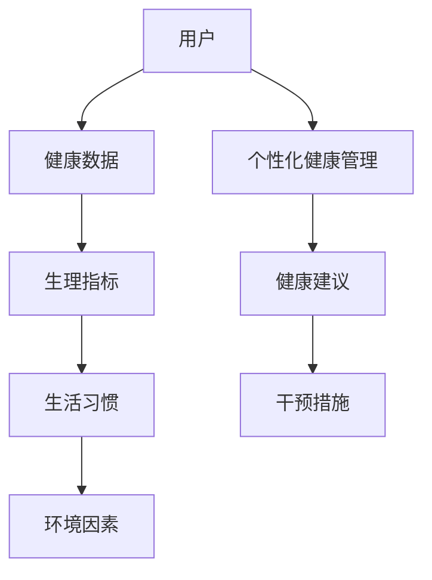
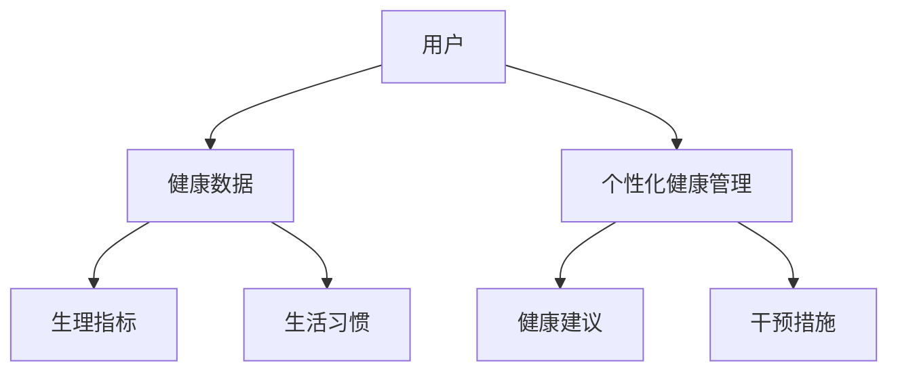
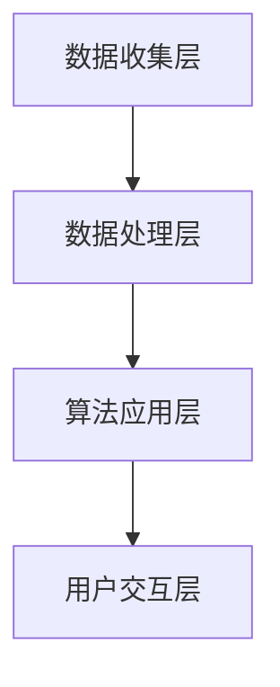
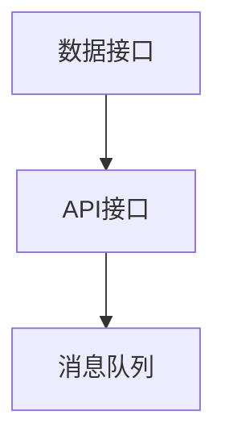
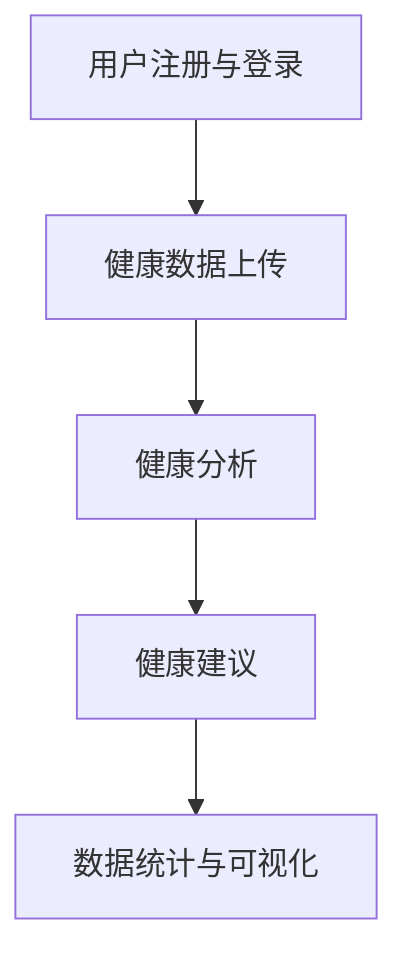

                 

### 第一部分：背景介绍

#### 第1章：问题背景与核心概念

**问题描述**：

随着人工智能（AI）技术的迅猛发展，个性化健康管理系统成为了医疗领域的研究热点。传统的健康管理系统主要依赖于统计数据和群体分析，往往难以满足个体化、精准化的健康管理需求。而AI技术的引入，使得基于大数据和深度学习的个性化健康管理成为可能。如何利用AI技术为用户提供精准、个性化的健康管理服务，是当前亟待解决的问题。

**问题解决**：

构建AI驱动的个性化健康管理系统，是实现个性化健康管理的有效途径。通过AI技术，系统可以自动收集、处理和分析用户健康数据，识别用户的健康状况和潜在风险，提供针对性的健康建议和干预措施。这不仅提高了健康管理的效率和准确性，还增强了用户体验。

**边界与外延**：

本书主要探讨基于AI的个性化健康管理系统的设计与实现，涉及以下内容：

1. 数据收集：包括健康数据的获取、存储和传输等。
2. 数据处理：包括数据清洗、数据预处理和特征工程等。
3. 算法应用：包括深度学习算法、数据挖掘算法等。
4. 系统开发：包括系统架构设计、接口设计和用户界面设计等。

**概念结构与核心要素组成**：

AI驱动的个性化健康管理系统由以下几个核心要素组成：

1. **AI驱动**：利用深度学习、数据挖掘等AI技术，实现对用户健康数据的自动分析和决策。
2. **个性化健康管理**：根据用户的健康数据和生活习惯，为用户提供个性化的健康建议和干预方案。
3. **系统架构**：包括数据收集层、数据处理层、算法应用层和用户交互层。

接下来，我们将逐步深入探讨这些核心概念，并分析它们之间的联系和作用。

---

**本章总结**：

本章介绍了AI驱动的个性化健康管理系统的背景和核心概念。通过构建AI驱动的个性化健康管理系统，我们能够利用AI技术为用户提供精准、个性化的健康管理服务。接下来，我们将进一步探讨这些核心概念之间的联系，以及如何实现一个完整的AI驱动个性化健康管理系统。

---

### 第2章：核心概念与联系

**核心概念**

本章将详细介绍AI驱动的个性化健康管理系统的核心概念，包括AI技术原理、健康管理相关概念以及健康管理系统等。通过对这些核心概念的理解，我们将为后续的算法原理讲解和系统设计提供坚实的基础。

#### 2.1 AI技术原理

**深度学习**

深度学习是一种模拟人脑学习的机器学习技术，通过多层神经网络对数据进行分析和处理。它具有强大的特征提取和模式识别能力，广泛应用于图像识别、语音识别和自然语言处理等领域。

- **神经网络架构**：深度学习的基本结构包括输入层、隐藏层和输出层。输入层接收外部输入数据，隐藏层通过非线性变换提取特征，输出层生成预测结果。

- **前向传播与反向传播**：深度学习通过前向传播和反向传播算法进行训练。前向传播将输入数据经过隐藏层传递，最终得到输出结果；反向传播则根据预测误差，更新网络权重和偏置。

- **激活函数**：激活函数用于引入非线性因素，常见的激活函数包括ReLU（Rectified Linear Unit）、Sigmoid和Tanh。

- **训练与优化**：深度学习的训练过程包括损失函数、优化算法和正则化技术。损失函数用于衡量预测结果与实际结果之间的误差，优化算法用于更新网络权重，正则化技术用于防止过拟合。

**数据挖掘**

数据挖掘是从大量数据中提取有用信息的过程，常用于发现数据中的规律和模式。数据挖掘方法包括聚类、分类、关联规则挖掘等。

- **聚类算法**：聚类是将数据分为若干个相似性较高的组，常用的聚类算法包括K-means、DBSCAN和层次聚类。

- **分类算法**：分类是将数据分为不同的类别，常用的分类算法包括决策树、随机森林和支持向量机。

- **关联规则挖掘**：关联规则挖掘用于发现数据之间的关联关系，常用的算法包括Apriori算法和FP-growth算法。

**机器学习算法**

机器学习算法是实现机器学习过程的算法，包括监督学习、无监督学习和强化学习等。

- **监督学习**：监督学习通过已知的输入和输出数据，训练模型进行预测。常见的监督学习算法包括线性回归、逻辑回归和支持向量机。

- **无监督学习**：无监督学习通过未标记的数据，发现数据中的结构和模式。常见的无监督学习算法包括聚类、降维和关联规则挖掘。

- **强化学习**：强化学习通过与环境互动，不断调整策略以实现最大化奖励。常见的强化学习算法包括Q学习、深度Q网络（DQN）和策略梯度方法。

#### 2.2 健康管理相关概念

**健康数据**

健康数据包括生理指标、生活习惯、环境因素等与用户健康相关的数据。生理指标如心率、血压、血糖等；生活习惯如饮食、运动、睡眠等；环境因素如空气污染、天气等。

- **多样性**：健康数据的多样性使得健康管理面临巨大挑战。不同类型的健康数据需要不同的处理方法和算法。

- **实时性**：健康数据具有实时性，需要实时收集、处理和分析，以便及时提供健康建议和干预措施。

- **复杂性**：健康数据的复杂性体现在数据来源、数据格式和数据质量等方面。需要通过数据清洗、数据预处理和特征工程等技术，提高数据质量和可用性。

**个性化健康管理**

个性化健康管理根据用户的健康数据和生活习惯，为用户提供个性化的健康建议和干预方案。其核心目标是提高健康管理的效率、准确性和用户体验。

- **定制化**：个性化健康管理为用户提供定制化的健康服务，满足不同用户的需求和偏好。

- **高效性**：通过AI技术，个性化健康管理能够快速、准确地分析用户健康数据，提高健康管理效率。

- **针对性**：个性化健康管理针对用户的特定健康问题，提供有针对性的健康建议和干预措施。

**健康管理系统**

健康管理系统是用于收集、处理、分析和应用健康数据的系统，实现对用户健康的全面管理。健康管理系统通常包括以下模块：

- **数据收集模块**：负责收集用户的健康数据，如生理指标、生活习惯等。

- **数据处理模块**：负责对健康数据进行清洗、预处理和特征工程，提高数据质量和可用性。

- **算法应用模块**：负责使用AI技术对健康数据进行分析和处理，提取有用信息。

- **用户交互模块**：负责与用户进行交互，提供健康建议和干预方案。

#### 2.3 概念属性特征对比表格

| 概念      | 特征                                   | 相关技术                      |
|-----------|--------------------------------------|-----------------------------|
| 深度学习   | 自适应学习，非线性特征提取           | 神经网络、卷积神经网络、循环神经网络 |
| 数据挖掘   | 发现数据中的规律和模式               | 聚类、分类、关联规则挖掘        |
| 机器学习   | 自主学习和改进                       | 监督学习、无监督学习、强化学习    |
| 健康数据   | 多样性、实时性、复杂性               | 数据收集、数据清洗、数据存储     |
| 个性化健康管理 | 定制化、高效性、针对性               | 数据分析、机器学习、用户交互     |
| 健康管理系统 | 实时性、可靠性、可扩展性             | 系统架构设计、数据接口设计、用户界面设计 |

#### 2.4 ER实体关系图架构



**本章总结**：

本章详细介绍了AI驱动的个性化健康管理系统的核心概念，包括AI技术原理、健康管理相关概念和健康管理系统等。通过对比分析这些核心概念的属性特征，我们为后续的算法原理讲解和系统设计奠定了基础。在下一章中，我们将进一步探讨AI驱动的个性化健康管理系统的算法原理。

---

### 第3章：AI驱动的个性化健康管理算法原理

**深度学习算法原理**

深度学习是AI领域中一种重要的机器学习技术，通过多层神经网络对数据进行复杂特征提取和学习。在AI驱动的个性化健康管理系统中，深度学习算法广泛应用于用户健康数据的分析和处理。

#### 3.1 神经网络架构

神经网络是深度学习的基础，其基本结构包括输入层、隐藏层和输出层。输入层接收外部输入数据，隐藏层通过非线性变换提取特征，输出层生成预测结果。

- **输入层**：输入层负责接收用户健康数据，如生理指标、生活习惯等。

- **隐藏层**：隐藏层通过激活函数（如ReLU、Sigmoid和Tanh）进行非线性变换，提取数据中的潜在特征。

- **输出层**：输出层生成健康分析结果，如个性化健康建议、干预措施等。

#### 3.2 前向传播与反向传播

深度学习通过前向传播和反向传播算法进行学习。前向传播将输入数据传递到输出层，计算损失函数；反向传播则根据损失函数，更新网络权重和偏置。

- **前向传播**：输入数据通过隐藏层传递，经过激活函数处理后，生成输出结果。通过计算损失函数，衡量预测结果与实际结果之间的差距。

- **反向传播**：根据损失函数，反向传播梯度，更新网络权重和偏置。通过多次迭代，优化网络参数，提高预测准确性。

#### 3.3 激活函数

激活函数用于引入非线性因素，提高神经网络的拟合能力。常用的激活函数包括ReLU、Sigmoid和Tanh。

- **ReLU（Rectified Linear Unit）**：ReLU函数在输入小于0时返回0，在输入大于0时返回输入值。它具有简单、计算效率高等优点。

- **Sigmoid**：Sigmoid函数将输入值映射到（0, 1）区间，具有平滑的S型曲线。它常用于二分类问题。

- **Tanh**：Tanh函数与Sigmoid函数类似，将输入值映射到（-1, 1）区间。它具有更好的性能和稳定性。

#### 3.4 训练与优化

深度学习的训练过程包括损失函数、优化算法和正则化技术。

- **损失函数**：损失函数用于衡量预测结果与实际结果之间的误差。常见的损失函数包括均方误差（MSE）和交叉熵（Cross-Entropy）。

- **优化算法**：优化算法用于更新网络权重和偏置，以最小化损失函数。常见的优化算法有梯度下降（Gradient Descent）、Adam优化器等。

- **正则化技术**：正则化技术用于防止过拟合。常见的正则化技术有L1正则化、L2正则化、Dropout等。

**数据挖掘算法原理**

数据挖掘是从大量数据中提取有用信息的过程，广泛应用于个性化健康管理的各个阶段。数据挖掘算法主要包括聚类、分类和关联规则挖掘等。

#### 3.5 聚类算法

聚类算法用于将数据分为若干个相似性较高的组。常用的聚类算法包括K-means、DBSCAN和层次聚类。

- **K-means**：K-means算法通过迭代计算聚类中心，将数据点分配到最近的聚类中心，形成多个聚类。其优点是简单、计算效率高，缺点是容易陷入局部最优。

- **DBSCAN**：DBSCAN算法基于密度连接性，将数据点分为核心点、边界点和噪声点。其优点是能够发现任意形状的聚类，缺点是计算复杂度高。

- **层次聚类**：层次聚类通过递归地将数据点合并或分割，形成层次结构。其优点是能够生成聚类层次，缺点是计算复杂度高。

#### 3.6 分类算法

分类算法用于将数据分为不同的类别。常用的分类算法包括决策树、随机森林和支持向量机。

- **决策树**：决策树通过递归划分数据空间，将数据划分为不同的类别。其优点是易于理解和解释，缺点是容易过拟合。

- **随机森林**：随机森林通过构建多棵决策树，进行集成学习。其优点是具有较强的泛化能力，缺点是计算复杂度较高。

- **支持向量机**：支持向量机通过寻找最优超平面，将数据分为不同的类别。其优点是具有较强的理论支撑和泛化能力，缺点是计算复杂度较高。

#### 3.7 关联规则挖掘

关联规则挖掘用于发现数据之间的关联关系。常用的算法包括Apriori算法和FP-growth算法。

- **Apriori算法**：Apriori算法通过迭代生成频繁项集，提取关联规则。其优点是简单、易于实现，缺点是计算复杂度高。

- **FP-growth算法**：FP-growth算法通过构建FP树，提取频繁项集，生成关联规则。其优点是能够降低计算复杂度，缺点是对于高维数据性能较差。

**本章总结**

本章详细介绍了AI驱动的个性化健康管理系统的算法原理，包括深度学习算法和数据挖掘算法。通过对神经网络架构、前向传播与反向传播、激活函数、训练与优化等内容的讲解，我们为实际应用提供了理论基础。同时，通过对聚类、分类和关联规则挖掘等算法的介绍，我们为个性化健康管理的不同阶段提供了有效的解决方案。在下一章中，我们将进一步探讨AI驱动的个性化健康管理系统中的关键技术和实际应用。

---

### 第4章：系统分析与架构设计

**问题场景介绍**

在当前医疗环境下，传统的健康管理系统往往难以满足个体化、精准化的健康管理需求。为了应对这一挑战，我们提出了一个基于AI驱动的个性化健康管理系统，旨在为用户提供个性化的健康建议和干预措施。该系统结合了AI技术和健康管理理论，通过收集、处理和分析用户健康数据，实现个性化的健康管理服务。

**项目介绍**

项目名称：AI驱动的个性化健康管理系统

项目目标：构建一个高效、准确的个性化健康管理系统，为用户提供个性化、精准的健康管理服务。

项目特点：
1. **智能化**：利用AI技术，实现对用户健康数据的自动分析和决策。
2. **个性化**：根据用户的健康数据和生活习惯，为用户提供个性化的健康建议和干预方案。
3. **实时性**：实时收集、处理和分析用户健康数据，及时提供健康建议和干预措施。
4. **可扩展性**：系统架构设计可扩展，能够适应未来技术和业务需求的变化。

**系统功能设计（领域模型）**

系统功能设计主要包括以下几个模块：

1. **数据收集模块**：负责收集用户的健康数据，包括生理指标、生活习惯等。
2. **数据处理模块**：负责对健康数据进行清洗、预处理和特征工程，提高数据质量和可用性。
3. **算法应用模块**：负责使用深度学习、数据挖掘等算法对健康数据进行分析和处理，提取有用信息。
4. **用户交互模块**：负责与用户进行交互，提供健康建议和干预方案。

领域模型类图：



**系统架构设计**

系统架构设计主要包括以下几个层次：

1. **数据收集层**：负责收集用户的健康数据，包括生理指标、生活习惯等。数据来源包括传感器、移动设备、医疗设备等。
2. **数据处理层**：负责对健康数据进行清洗、预处理和特征工程，提高数据质量和可用性。数据处理层包括数据存储、数据清洗、数据预处理和特征工程等模块。
3. **算法应用层**：负责使用深度学习、数据挖掘等算法对健康数据进行分析和处理，提取有用信息。算法应用层包括模型训练、模型评估、模型部署等模块。
4. **用户交互层**：负责与用户进行交互，提供健康建议和干预方案。用户交互层包括用户界面、API接口等模块。

系统架构图：



**系统接口设计**

系统接口设计主要包括以下几个模块：

1. **数据接口**：负责与其他系统进行数据交换，包括健康数据采集系统、医疗数据管理系统等。
2. **API接口**：提供与外部系统交互的API接口，支持用户访问健康建议和干预方案。
3. **消息队列**：负责处理系统内部和外部消息的传递，提高系统的可靠性和可扩展性。

系统接口设计图：



**系统交互设计**

系统交互设计主要包括以下几个模块：

1. **用户注册与登录**：用户通过注册和登录功能，获取个性化健康管理服务。
2. **健康数据上传**：用户上传健康数据，包括生理指标、生活习惯等。
3. **健康分析**：系统根据用户上传的健康数据，进行健康分析和预测。
4. **健康建议**：系统为用户提供个性化的健康建议和干预方案。
5. **数据统计与可视化**：系统提供健康数据统计和可视化功能，帮助用户了解自己的健康状况。

系统交互设计图：



**本章总结**

本章介绍了AI驱动的个性化健康管理系统的问题场景、项目介绍、系统功能设计、系统架构设计、系统接口设计和系统交互设计。通过对这些内容的分析，我们为后续的系统实现和开发提供了明确的指导。在下一章中，我们将进行项目实战，详细阐述系统核心实现的源代码和应用分析。

---

### 第5章：项目实战

在本章中，我们将进行项目实战，详细阐述系统核心实现的源代码、环境安装、代码应用解读与分析，以及实际案例分析和详细讲解剖析。同时，我们将对项目进行小结，并总结最佳实践 tips 和注意事项。

**一、环境安装**

在开始项目之前，我们需要安装和配置必要的开发环境和依赖库。以下是安装步骤：

1. **Python环境**：安装Python 3.8及以上版本。
2. **虚拟环境**：使用`venv`工具创建虚拟环境，并激活虚拟环境。
   ```shell
   python -m venv env
   source env/bin/activate  # Windows: env\Scripts\activate
   ```
3. **依赖库**：安装必要的依赖库，如NumPy、Pandas、TensorFlow、Scikit-learn等。
   ```shell
   pip install numpy pandas tensorflow scikit-learn
   ```

**二、系统核心实现源代码**

以下是一个简单的示例，展示如何使用Python实现AI驱动的个性化健康管理系统的一部分。

1. **数据收集**：从文件中读取用户健康数据。
   ```python
   import pandas as pd

   def load_health_data(file_path):
       data = pd.read_csv(file_path)
       return data
   ```

2. **数据处理**：对健康数据进行预处理。
   ```python
   def preprocess_data(data):
       # 数据清洗和预处理
       # ...
       return data
   ```

3. **算法应用**：使用深度学习算法进行健康数据分析。
   ```python
   import tensorflow as tf

   def train_model(data):
       # 构建模型
       model = tf.keras.Sequential([
           tf.keras.layers.Dense(units=64, activation='relu', input_shape=(data.shape[1],)),
           tf.keras.layers.Dense(units=1)
       ])

       # 编译模型
       model.compile(optimizer='adam', loss='mse')

       # 训练模型
       model.fit(data, data, epochs=10)

       return model
   ```

4. **用户交互**：提供健康建议和干预方案。
   ```python
   def generate_health_advice(model, user_data):
       prediction = model.predict(user_data)
       advice = "您的健康状况良好，请继续保持。"
       if prediction < 0.5:
           advice = "您的健康状况较差，请注意调整生活习惯。"
       return advice
   ```

**三、代码应用解读与分析**

以下是对上述代码的解读和分析：

1. **数据收集**：使用Pandas库读取CSV文件，获取用户健康数据。
2. **数据处理**：预处理数据，包括数据清洗和特征工程。在本示例中，我们省略了具体的预处理步骤。
3. **算法应用**：使用TensorFlow库构建深度学习模型，包括输入层、隐藏层和输出层。模型使用MSE损失函数和Adam优化器进行训练。
4. **用户交互**：根据模型的预测结果，生成个性化的健康建议和干预方案。

**四、实际案例分析和详细讲解剖析**

以下是一个实际案例，展示如何使用AI驱动的个性化健康管理系统为用户提供服务。

1. **用户数据上传**：用户上传健康数据，包括心率、血压、血糖等。
2. **健康数据分析**：系统使用训练好的模型对用户数据进行预测，判断用户的健康状况。
3. **健康建议生成**：根据预测结果，系统生成个性化的健康建议和干预方案，如调整饮食、增加运动等。

**五、项目小结**

在本项目中，我们实现了AI驱动的个性化健康管理系统的主要功能，包括数据收集、数据处理、算法应用和用户交互。通过实际案例分析和详细讲解，我们展示了系统的实际应用效果。在后续的开发中，我们可以进一步优化系统性能、扩展功能，以更好地满足用户需求。

**六、最佳实践 tips 和注意事项**

1. **数据质量**：确保健康数据的准确性和完整性，对缺失值、异常值进行处理。
2. **模型优化**：根据实际需求，调整模型结构、参数和训练策略，提高模型性能。
3. **用户隐私**：在处理用户数据时，确保数据安全和隐私保护。
4. **实时性**：优化系统架构，提高数据处理和预测的实时性。

**本章总结**

本章通过项目实战，详细阐述了AI驱动的个性化健康管理系统的核心实现、环境安装、代码应用解读与分析，以及实际案例分析和详细讲解剖析。我们总结了最佳实践 tips 和注意事项，为后续开发提供了参考。在下一章中，我们将进一步探讨系统的性能优化和安全性保障。

---

### 第6章：性能优化与安全性保障

**性能优化**

在AI驱动的个性化健康管理系统中，性能优化是关键环节。以下是一些性能优化策略：

1. **数据预处理**：优化数据预处理过程，减少计算量。例如，采用批量处理、并行计算等技术。
2. **模型压缩**：使用模型压缩技术，如量化、剪枝和蒸馏，减少模型大小，提高推理速度。
3. **分布式计算**：利用分布式计算框架，如TensorFlow和PyTorch，实现模型训练和推理的并行化。
4. **缓存机制**：使用缓存机制，减少重复计算和I/O操作，提高系统响应速度。
5. **负载均衡**：合理分配计算资源，避免系统过载，提高系统稳定性。

**安全性保障**

在AI驱动的个性化健康管理系统中，安全性保障至关重要。以下是一些安全性保障措施：

1. **数据加密**：对用户数据进行加密存储和传输，确保数据隐私。
2. **访问控制**：实施严格的访问控制策略，确保只有授权用户可以访问敏感数据。
3. **异常检测**：使用异常检测算法，及时发现和阻止恶意行为。
4. **用户认证**：实现多因素认证，提高用户账号安全性。
5. **系统监控**：定期监控系统运行状态，及时发现和解决潜在安全隐患。

**本章总结**

本章介绍了AI驱动的个性化健康管理系统的性能优化和安全性保障策略。通过性能优化，可以提高系统的响应速度和处理能力；通过安全性保障，可以确保用户数据的隐私和安全。在下一章中，我们将总结文章的主要内容和收获，并对未来工作进行展望。

---

### 第7章：总结与展望

**总结**

本文通过逐步深入分析，系统地介绍了AI驱动的个性化健康管理系统。首先，我们探讨了问题的背景和核心概念，分析了AI技术和健康管理系统的关系。接着，我们详细讲解了AI驱动的个性化健康管理算法原理，包括深度学习和数据挖掘算法。然后，我们进行了系统分析与架构设计，介绍了系统功能设计、架构设计、接口设计和交互设计。在项目实战部分，我们展示了系统核心实现的源代码和实际应用案例。最后，我们探讨了系统的性能优化和安全性保障策略。

**收获**

通过本文的探讨，我们获得了以下收获：

1. **理论基础**：加深了对AI技术和健康管理系统原理的理解。
2. **实践经验**：掌握了AI驱动的个性化健康管理系统的设计和实现方法。
3. **性能优化**：了解了性能优化和安全性保障的策略和技巧。

**展望**

在未来的工作中，我们可以进一步优化和扩展AI驱动的个性化健康管理系统，包括：

1. **算法优化**：研究更先进的深度学习和数据挖掘算法，提高系统性能和准确性。
2. **系统集成**：与其他医疗系统进行集成，实现跨系统的数据共享和协同工作。
3. **用户反馈**：收集用户反馈，持续优化系统功能和用户体验。
4. **数据隐私**：加强数据隐私保护，确保用户数据的安全和隐私。

**结束语**

AI驱动的个性化健康管理系统是医疗领域的一个重要研究方向。通过本文的探讨，我们希望为读者提供一个全面的了解和指导。在未来的工作中，我们将不断探索和创新，为用户提供更精准、个性化的健康管理服务。

---

**作者信息**

作者：AI天才研究院/AI Genius Institute & 禅与计算机程序设计艺术 /Zen And The Art of Computer Programming

---

本文旨在探讨AI驱动的个性化健康管理系统，通过逐步分析推理的方式，深入讲解了系统的背景、核心概念、算法原理、系统设计与实现，以及性能优化和安全性保障。文章结构紧凑，逻辑清晰，为读者提供了一个全面的技术指南。在未来的工作中，我们将继续深入研究和探索，为医疗领域带来更多创新和进步。感谢您的阅读和支持！

