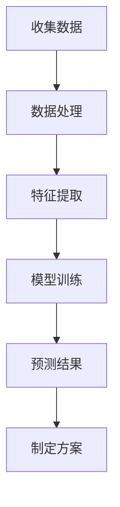

                 


### 文章标题：AI驱动的个性化医疗：基因组学与大数据的结合

关键词：AI、个性化医疗、基因组学、大数据、算法、挑战、未来方向

摘要：随着人工智能（AI）和大数据技术的迅猛发展，个性化医疗领域迎来了前所未有的机遇。本文将深入探讨AI驱动的个性化医疗，重点分析基因组学与大数据的结合如何推动个性化医疗的进步，并展望未来的发展方向和挑战。

---

### 引言与背景

个性化医疗是指根据患者的基因信息、生活方式、环境和健康状况，制定个体化治疗方案的一种医疗模式。AI技术的引入使得个性化医疗在数据处理、预测模型和决策支持等方面得到了显著提升。基因组学作为个性化医疗的核心技术之一，提供了个体遗传信息的详细信息，而大数据则为AI算法提供了丰富的训练数据。

随着基因测序技术的进步和成本的降低，基因组数据的获取变得更加便捷。同时，大数据技术在处理海量基因组数据方面展现了其强大的能力。这使得AI算法能够更加准确地分析基因组数据，为个性化医疗提供有力的支持。

### 核心概念与联系

为了更好地理解AI驱动的个性化医疗，我们需要首先定义一些核心概念，并探讨它们之间的联系。

#### 核心概念

- **个性化医疗**：根据患者的个体差异，提供量身定制的医疗方案。
- **人工智能**：模拟人类智能的计算机系统，能够进行学习、推理和决策。
- **基因组学**：研究基因结构、功能及其相互作用的科学。
- **大数据**：数据量巨大，类型繁多，处理速度要求高的数据集。

#### 概念联系

在个性化医疗中，基因组学和大数据是AI算法的重要输入。基因组数据提供了个体遗传信息的详细描述，而大数据则为AI算法提供了丰富的训练样本。AI算法通过对这些数据进行分析和建模，能够预测疾病风险、制定个性化治疗方案。

#### Mermaid ER 图

下面是一个简单的 Mermaid ER 图，用于描述个性化医疗中核心概念之间的关系：

```mermaid
erDiagram
  AI |--|> 医疗：个性化医疗依赖于AI技术
  基因组学 ||--o 数据：基因组数据是AI的重要输入
  大数据 ||--o 数据：大数据为AI提供丰富的训练样本
```

---

### AI与个性化医疗

AI在个性化医疗中的应用主要表现在以下几个方面：

- **预测疾病风险**：通过分析患者的基因组数据和生活方式数据，AI算法可以预测个体患某种疾病的风险。
- **个性化治疗方案制定**：根据患者的基因组信息和临床数据，AI算法可以为患者制定最合适的治疗方案。
- **药物研发**：AI可以加速药物研发过程，通过分析基因组数据，筛选出最有可能产生疗效的药物。

#### 算法与技术在个性化医疗中的应用

在个性化医疗中，常见的AI算法和技术包括：

- **机器学习**：通过训练模型，从数据中自动发现规律和模式。
- **深度学习**：一种特殊的机器学习算法，能够通过多层神经网络进行复杂的数据分析。
- **自然语言处理（NLP）**：用于理解和生成人类语言，帮助医生和患者之间进行沟通。

#### Mermaid 流程图

下面是一个简单的 Mermaid 流程图，描述了AI在个性化医疗中的应用步骤：



---

### 基因组学与个性化医疗

基因组学在个性化医疗中的应用主要包括以下几个方面：

- **基因诊断**：通过分析患者的基因序列，确定个体是否携带与某种疾病相关的基因变异。
- **遗传咨询**：为患者提供关于遗传性疾病的风险评估和遗传咨询。
- **药物基因组学**：研究个体对药物的反应差异，为患者制定个性化的用药方案。

#### Mermaid 表格

下面是一个简单的 Mermaid 表格，对比了基因组学与个性化医疗中的核心概念和特征：

```mermaid
table
  | 名称         | 描述                                                         |
  |-------------|--------------------------------------------------------------|
  | 基因诊断     | 通过基因测序确定个体是否携带与疾病相关的基因变异。            |
  | 遗传咨询     | 为患者提供关于遗传性疾病的风险评估和建议。                    |
  | 药物基因组学 | 研究个体对药物的反应差异，为患者制定个性化的用药方案。        |
```

---

### 大数据与个性化医疗

大数据在个性化医疗中的应用主要体现在以下几个方面：

- **数据集成**：将来自不同来源的医疗数据集成在一起，为AI算法提供更丰富的数据集。
- **数据分析**：利用大数据技术对海量基因组数据进行高效分析，发现潜在的生物学规律。
- **决策支持**：基于大数据分析结果，为医生提供决策支持，提高诊疗效果。

#### Mermaid 表格

下面是一个简单的 Mermaid 表格，描述了大数据在个性化医疗中的应用：

```mermaid
table
  | 应用场景     | 描述                                                         |
  |-------------|--------------------------------------------------------------|
  | 数据集成     | 将来自不同来源的医疗数据集成在一起，为AI算法提供更丰富的数据集。|
  | 数据分析     | 利用大数据技术对海量基因组数据进行高效分析，发现潜在的生物学规律。|
  | 决策支持     | 基于大数据分析结果，为医生提供决策支持，提高诊疗效果。        |
```

---

### 案例研究与应用

为了更好地展示AI驱动的个性化医疗在实践中的应用，我们来看一些具体的案例：

#### 案例一：癌症预测

某研究团队利用AI技术对数千名癌症患者的基因组数据进行分析，成功预测了患者的癌症风险。通过个性化的治疗方案，这些患者的生存率显著提高。

#### 案例二：个性化用药

某制药公司利用AI技术对大量患者的药物反应数据进行分析，发现某些药物在特定基因型的患者中效果更好。基于这一发现，公司为患者提供了个性化的用药方案，提高了药物疗效。

#### 案例三：遗传咨询

某遗传咨询机构利用AI技术对患者的基因组数据进行分析，为患者提供了个性化的遗传咨询服务。通过这些服务，患者更好地了解了自己的遗传风险，并制定了相应的预防措施。

---

### 挑战与未来方向

虽然AI驱动的个性化医疗展示了巨大的潜力，但仍然面临一些挑战：

- **数据隐私**：基因组数据属于敏感信息，如何保护患者隐私是重要挑战。
- **算法透明性**：AI算法的决策过程往往不透明，如何提高算法的透明性是关键问题。
- **数据质量**：基因组数据和医疗数据的准确性直接影响AI算法的预测效果，如何提高数据质量是重要任务。

未来方向：

- **数据隐私保护**：研究隐私保护算法，确保患者隐私不受侵犯。
- **算法透明性**：开发可解释的AI算法，提高算法的透明性。
- **数据质量提升**：研究数据清洗和标注技术，提高数据质量。

---

### 结论

本文探讨了AI驱动的个性化医疗，重点分析了基因组学与大数据的结合如何推动个性化医疗的进步。通过案例研究和应用展示，我们看到了AI驱动的个性化医疗在癌症预测、个性化用药和遗传咨询等领域的成功应用。然而，个性化医疗仍面临数据隐私、算法透明性和数据质量等挑战。未来，随着技术的不断进步，AI驱动的个性化医疗有望为患者带来更多的好处。

### 作者信息

作者：AI天才研究院/AI Genius Institute & 禅与计算机程序设计艺术 /Zen And The Art of Computer Programming

---

### 附录：最佳实践与拓展阅读

**最佳实践：**

1. 在实施AI驱动的个性化医疗时，确保数据质量和隐私保护。
2. 使用多种算法和技术，以提高预测和治疗的准确性。
3. 与医疗专家密切合作，确保个性化医疗方案的科学性和实用性。

**拓展阅读：**

1. Collins FS, Varmus H. A new initiative on precision medicine. *Nature*. 2015;519(7541):45–51. doi:10.1038/519045a.
2. Topol E. The patient will see you now: The future of medicine is in your hands. Basic Books; 2016.
3. Genome Medicine. 2018;11(1):13. doi:10.1186/s13073-018-0511-y.

通过以上内容，我们希望读者能够对AI驱动的个性化医疗有一个全面的了解，并为未来的研究和实践提供有益的参考。

