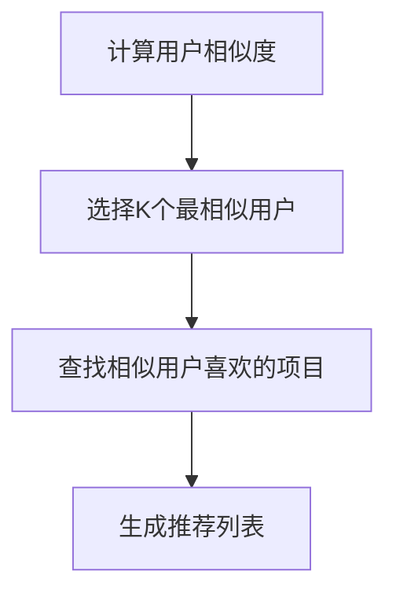
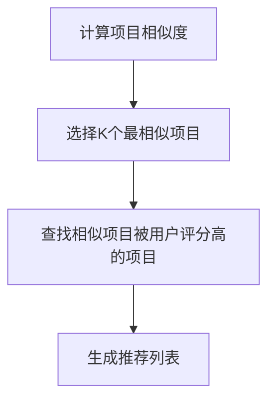
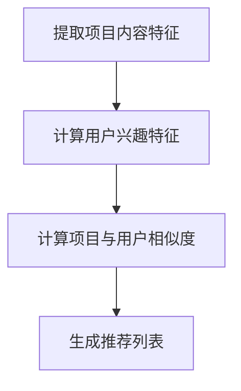
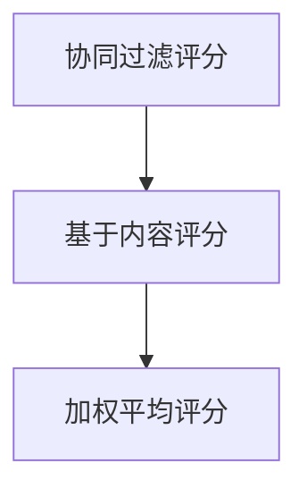
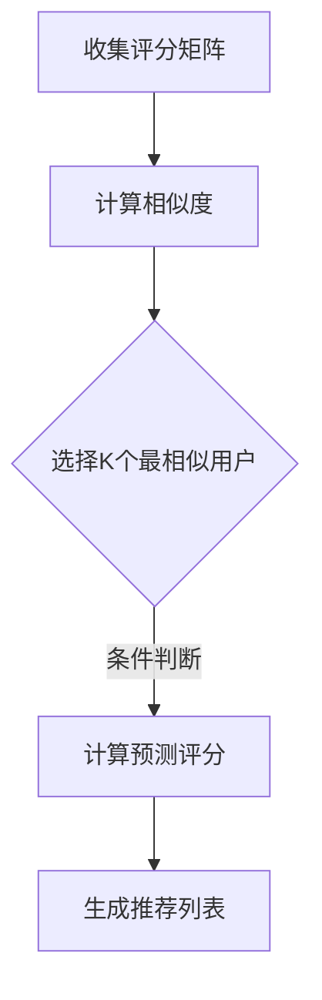
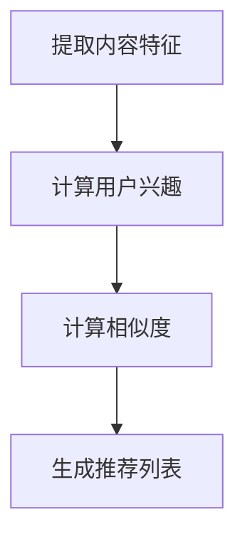
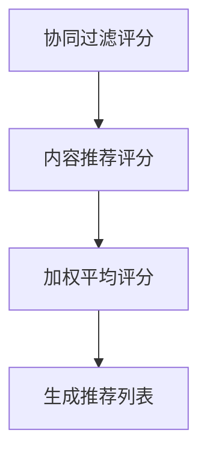
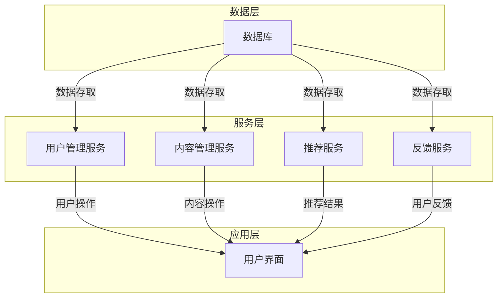
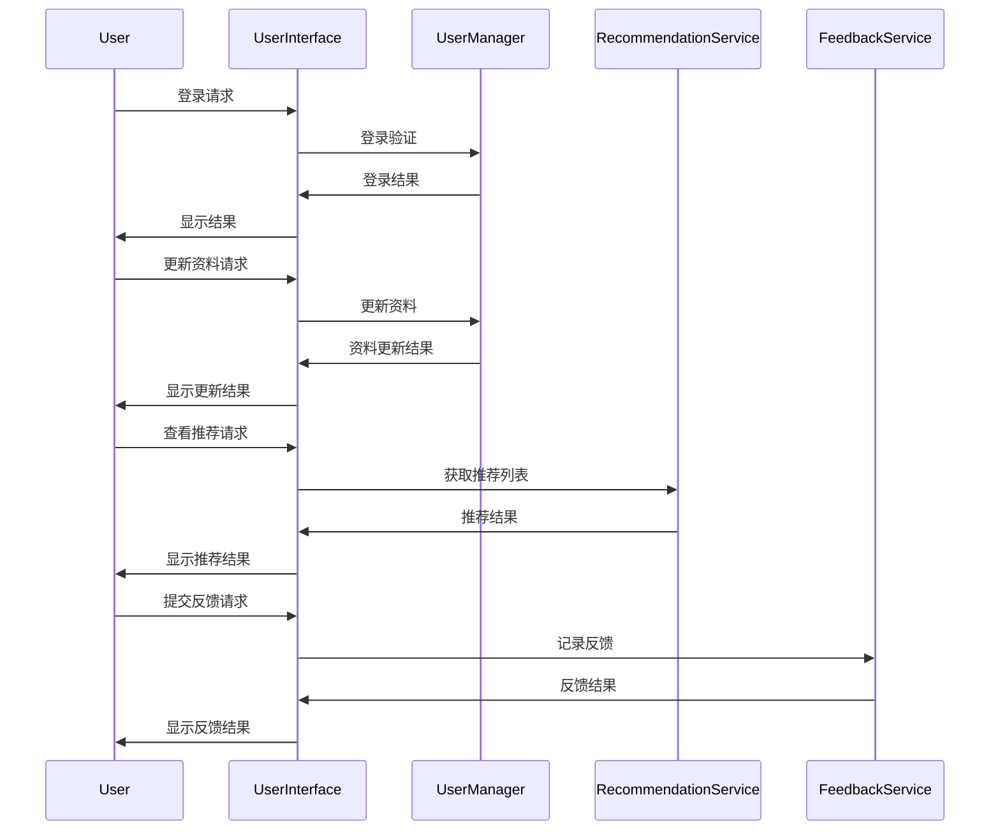
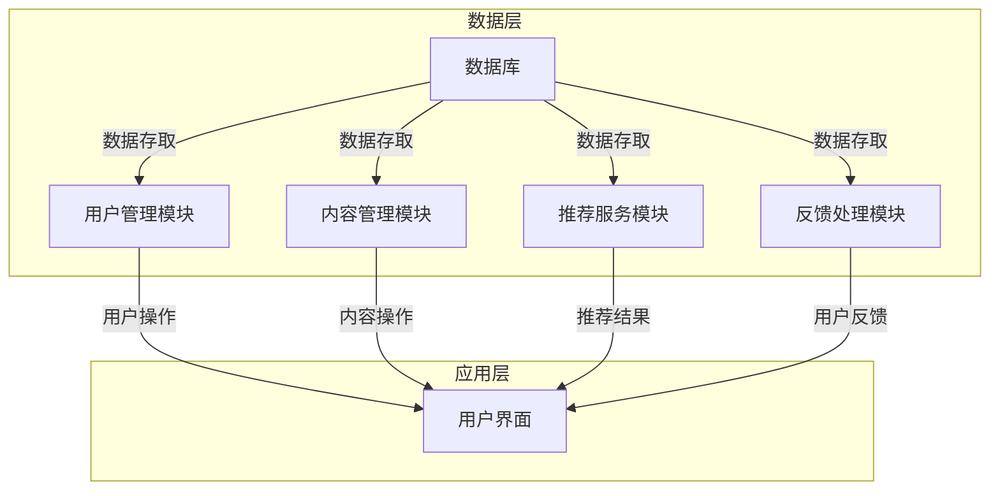

                 


### 1.1 AI技术概述

**背景介绍：**

人工智能（Artificial Intelligence，简称AI）是计算机科学的一个分支，旨在使机器能够执行通常需要人类智能才能完成的任务。AI的研究起源于20世纪50年代，随着计算能力的提升和算法的创新，AI技术逐渐从理论研究走向实际应用，成为现代社会不可或缺的一部分。

**核心概念术语说明：**

- **人工智能（AI）：** 是指使计算机模拟人类智能行为的技术和理论。
- **机器学习（Machine Learning）：** 是AI的一个重要分支，涉及通过数据训练模型，使计算机能够做出预测或决策。
- **深度学习（Deep Learning）：** 是机器学习的一个子领域，使用多层神经网络来模拟人脑的决策过程。

**问题背景：**

AI技术的快速发展带来了巨大的社会变革，从自动驾驶汽车到智能助手，AI的应用已经渗透到我们日常生活的方方面面。随着在线教育平台的普及，个性化学习内容推荐成为教育领域的重要研究方向。个性化学习内容推荐系统能够根据用户的学习习惯和需求，为用户提供定制化的学习资源，从而提高学习效果。

**问题描述：**

个性化学习内容推荐系统需要解决的问题包括：

- 如何准确收集并分析用户的学习数据？
- 如何构建合适的推荐算法来满足用户的个性化需求？
- 如何确保推荐的内容既丰富多样又具有高度相关性？

**问题解决：**

解决这些问题的策略包括：

- 采用机器学习和深度学习技术来处理和分析大量用户数据。
- 设计基于用户行为和兴趣的个性化推荐算法。
- 通过持续学习和优化，提高推荐系统的准确性和用户满意度。

**边界与外延：**

- **边界：** 个性化学习内容推荐系统主要关注在线教育领域，但推荐技术也可以应用于其他需要个性化推荐的场景，如电子商务、社交媒体等。
- **外延：** 个性化学习内容推荐系统不仅需要考虑用户的学习行为，还需要考虑教学内容的质量和适用性。

**概念结构与核心要素组成：**

- **用户模型：** 用于描述用户的学习习惯、兴趣和需求。
- **内容模型：** 用于描述学习资源的属性和特征。
- **推荐算法：** 用于根据用户模型和内容模型生成个性化推荐列表。
- **用户界面：** 用于展示推荐结果，并允许用户反馈和建议。

### 1.2 个性化学习的基本概念

**核心概念原理：**

- **个性化学习（Personalized Learning）：** 是一种以学生为中心的教育模式，旨在根据每个学生的个性、兴趣和能力来定制学习体验。
- **自适应学习（Adaptive Learning）：** 是个性化学习的一种实现方式，通过实时评估学生的学习情况，动态调整教学内容和难度。

**概念属性特征对比表格：**

| 特征                   | 个性化学习           | 自适应学习           |
|----------------------|------------------|------------------|
| 基础概念               | 以学生为中心           | 根据学生实时学习情况调整   |
| 应用领域               | 各类教育场景           | 在线教育平台            |
| 目标                   | 提高学习效果和满意度     | 提高学习效果和满意度       |
| 实现方式               | 教学内容定制           | 教学内容动态调整          |
| 核心技术               | 数据分析、机器学习       | 机器学习、数据分析        |

**ER实体关系图架构的 Mermaid 流程图：**

```mermaid
erDiagram
  User ||--|{ Content }|-- Content
  User ||--|{ LearningHistory }|-- LearningHistory
  Content ||--|{ Category }|-- Category
```

### 1.3 内容推荐系统的概念与分类

**核心概念原理：**

- **内容推荐系统（Content Recommendation System）：** 是一种基于用户行为和偏好，为用户提供相关内容的服务系统。
- **协同过滤（Collaborative Filtering）：** 是一种常用的推荐算法，通过分析用户之间的相似性来推荐内容。
- **基于内容的推荐（Content-Based Filtering）：** 是另一种推荐算法，通过分析用户过去喜欢的项目内容，推荐相似的新内容。

**概念属性特征对比表格：**

| 特征                   | 协同过滤               | 基于内容的推荐           |
|----------------------|-------------------|---------------------|
| 基础概念               | 通过用户行为推荐         | 通过内容属性推荐          |
| 应用领域               | 电子商务、社交媒体       | 新闻、博客、视频等        |
| 推荐策略               | 用户相似性、矩阵分解     | 关键字匹配、内容分析      |
| 优点                   | 推荐准确性高            | 推荐内容丰富            |
| 缺点                   | 可能暴露隐私、推荐多样性差 | 可能过于依赖历史数据       |

**ER实体关系图架构的 Mermaid 流程图：**

```mermaid
erDiagram
  User ||--|{ Recommendation }|-- Recommendation
  User ||--|{ Interaction }|-- Interaction
  Content ||--|{ Feature }|-- Feature
```

### 1.4 问题的背景、问题描述、问题解决、边界与外延、概念结构与核心要素组成

**问题背景：**

个性化学习内容推荐系统在在线教育领域的重要性日益凸显。传统的教育模式往往无法满足学生个性化的学习需求，而个性化学习内容推荐系统能够根据学生的学习习惯和兴趣，提供定制化的学习资源，从而提高学习效果和满意度。

**问题描述：**

个性化学习内容推荐系统需要解决的问题包括：

- 如何有效地收集和分析学生的学习数据？
- 如何构建一个既准确又高效的推荐算法？
- 如何确保推荐的内容既符合学生的兴趣，又具有实际的学习价值？

**问题解决：**

解决这些问题的策略包括：

- 采用大数据分析和机器学习技术来处理和分析用户数据。
- 设计多种推荐算法，如协同过滤和基于内容的推荐，以实现个性化推荐。
- 通过用户反馈和持续学习，不断优化推荐系统的效果。

**边界与外延：**

- **边界：** 个性化学习内容推荐系统主要关注在线教育领域，但推荐技术也可以应用于其他需要个性化推荐的场景，如电子商务、社交媒体等。
- **外延：** 个性化学习内容推荐系统不仅需要考虑用户的学习行为，还需要考虑教学内容的质量和适用性。

**概念结构与核心要素组成：**

- **用户模型：** 用于描述用户的学习习惯、兴趣和需求。
- **内容模型：** 用于描述学习资源的属性和特征。
- **推荐算法：** 用于根据用户模型和内容模型生成个性化推荐列表。
- **用户界面：** 用于展示推荐结果，并允许用户反馈和建议。

## 第二部分：核心概念与联系

### 第2章：AI、个性化学习、内容推荐系统的核心概念原理

#### 2.1 AI的核心概念原理

**核心概念原理：**

- **神经网络（Neural Networks）：** 是一种模仿生物神经系统的计算模型，通过多个神经元的连接和相互作用来实现数据输入和输出。
- **支持向量机（Support Vector Machines，SVM）：** 是一种监督学习算法，通过寻找一个最优的超平面来分隔不同类别的数据点。
- **决策树（Decision Trees）：** 是一种分类和回归算法，通过一系列的判断规则来对数据进行分类或回归。
- **贝叶斯模型（Bayesian Models）：** 是一种基于贝叶斯定理的统计模型，通过概率计算来预测结果。

**概念属性特征对比表格：**

| 算法名称       | 神经网络               | 支持向量机               | 决策树                | 贝叶斯模型              |
|----------------|------------------------|------------------------|----------------------|------------------------|
| 基础概念       | 模拟生物神经系统        | 寻找最优分隔超平面        | 多层判断规则          | 基于贝叶斯定理的统计模型 |
| 应用领域       | 图像识别、自然语言处理   | 机器学习中的分类问题      | 分类和回归问题        | 贝叶斯推理和概率分析     |
| 主要优势       | 高效的处理能力          | 高准确性                | 解释性强              | 简单易懂                |
| 主要挑战       | 需要大量数据训练        | 选择合适的核函数         | 决策路径复杂          | 对先验知识依赖较大      |

**ER实体关系图架构的 Mermaid 流程图：**

```mermaid
erDiagram
  Data ||--|{ NeuralNetwork }|-- NeuralNetwork
  Data ||--|{ SVM }|-- SVM
  Data ||--|{ DecisionTree }|-- DecisionTree
  Data ||--|{ BayesianModel }|-- BayesianModel
```

#### 2.2 个性化学习的核心概念原理

**核心概念原理：**

- **用户模型（User Model）：** 是一种描述用户行为和特征的模型，用于帮助系统理解用户的个性化需求。
- **内容模型（Content Model）：** 是一种描述学习资源属性和特征的模型，用于帮助系统推荐适合用户的内容。
- **相似性计算（Similarity Computing）：** 是一种用于计算用户和内容相似度的方法，用于指导推荐算法生成个性化的推荐列表。

**概念属性特征对比表格：**

| 模型名称       | 用户模型               | 内容模型               | 相似性计算              |
|----------------|------------------------|------------------------|------------------------|
| 基础概念       | 描述用户行为和特征      | 描述学习资源属性和特征  | 计算用户和内容的相似度  |
| 应用领域       | 个性化推荐、用户画像    | 内容分类、资源管理      | 推荐系统、信息检索     |
| 主要优势       | 提高个性化推荐准确性    | 提高内容匹配效率        | 提升推荐系统效果        |
| 主要挑战       | 数据隐私和安全问题      | 内容多样性挑战          | 精度和效率的平衡问题    |

**ER实体关系图架构的 Mermaid 流�程图：**

```mermaid
erDiagram
  User ||--|{ UserBehavior }|-- UserBehavior
  Content ||--|{ ContentFeature }|-- ContentFeature
  UserBehavior ||--|{ Similarity }|-- Similarity
```

#### 2.3 内容推荐系统的核心概念原理

**核心概念原理：**

- **协同过滤（Collaborative Filtering）：** 是一种通过分析用户之间的相似性来进行内容推荐的算法，通常分为基于用户的协同过滤和基于项目的协同过滤。
- **基于内容的推荐（Content-Based Filtering）：** 是一种通过分析用户过去喜欢的项目内容来进行内容推荐的算法，通常基于关键词匹配、内容分析和主题模型等方法。
- **混合推荐系统（Hybrid Recommendation System）：** 是一种将协同过滤和基于内容的推荐相结合的推荐系统，以发挥各自的优势，提高推荐效果。

**概念属性特征对比表格：**

| 算法名称       | 协同过滤               | 基于内容的推荐               | 混合推荐系统              |
|----------------|------------------------|------------------------|------------------------|
| 基础概念       | 通过用户行为推荐        | 通过内容属性推荐            | 结合用户行为和内容属性推荐 |
| 应用领域       | 电子商务、社交媒体      | 新闻、博客、视频等          | 广泛的应用场景            |
| 主要优势       | 推荐准确性高、多样性好   | 推荐内容丰富、个性化        | 充分发挥各自优势          |
| 主要挑战       | 可能泄露用户隐私、计算复杂 | 过于依赖历史数据、推荐多样性差 | 算法复杂度高              |

**ER实体关系图架构的 Mermaid 流程图：**

```mermaid
erDiagram
  User ||--|{ CollaborativeFiltering }|-- CollaborativeFiltering
  Content ||--|{ ContentBasedFiltering }|-- ContentBasedFiltering
  User ||--|{ HybridRecommendation }|-- HybridRecommendation
```

### 2.4 概念属性特征对比表格和ER实体关系图架构的 Mermaid 流程图

#### 概念属性特征对比表格

| 概念名称       | 特征对比                       | Mermaid 流程图链接                   |
|----------------|--------------------------------|--------------------------------------|
| AI核心概念     | 神经网络、支持向量机、决策树、贝叶斯模型 |  |
| 个性化学习核心概念 | 用户模型、内容模型、相似性计算 |  |
| 内容推荐系统核心概念 | 协同过滤、基于内容的推荐、混合推荐系统 |  |

#### ER实体关系图架构的 Mermaid 流程图

**AI核心概念实体关系图：**

```mermaid
erDiagram
  User ||--|{ NeuralNetwork }|-- NeuralNetwork
  User ||--|{ SVM }|-- SVM
  User ||--|{ DecisionTree }|-- DecisionTree
  User ||--|{ BayesianModel }|-- BayesianModel
```

**个性化学习核心概念实体关系图：**

```mermaid
erDiagram
  User ||--|{ UserBehavior }|-- UserBehavior
  Content ||--|{ ContentFeature }|-- ContentFeature
  UserBehavior ||--|{ Similarity }|-- Similarity
```

**内容推荐系统核心概念实体关系图：**

```mermaid
erDiagram
  User ||--|{ CollaborativeFiltering }|-- CollaborativeFiltering
  Content ||--|{ ContentBasedFiltering }|-- ContentBasedFiltering
  User ||--|{ HybridRecommendation }|-- HybridRecommendation
```

通过上述概念属性特征对比表格和ER实体关系图架构的Mermaid流程图，我们可以清晰地了解AI、个性化学习、内容推荐系统的核心概念及其相互关系，为进一步深入研究和应用这些概念提供了理论基础和结构框架。

## 第三部分：算法原理讲解

### 第3章：推荐算法的原理、数学模型和公式

#### 3.1 推荐算法的基本原理

推荐算法是构建个性化学习内容推荐系统的核心，其基本原理主要包括协同过滤、基于内容的推荐和混合推荐系统。

**协同过滤（Collaborative Filtering）：**

协同过滤是一种通过分析用户之间的相似性来进行推荐的方法，主要包括基于用户的协同过滤和基于项目的协同过滤。

- **基于用户的协同过滤（User-Based Collaborative Filtering）：** 通过计算用户之间的相似度，找到与目标用户相似的其他用户，然后推荐这些相似用户喜欢的项目。
- **基于项目的协同过滤（Item-Based Collaborative Filtering）：** 通过计算项目之间的相似度，找到与目标项目相似的其他项目，然后推荐这些相似项目。

**数学模型和公式：**

基于用户的协同过滤中，用户相似度可以通过以下公式计算：

$$
sim(u, v) = \frac{\sum_{i \in I} r_i^{u} r_i^{v}}{\sqrt{\sum_{i \in I} r_i^{u}^2 \sum_{i \in I} r_i^{v}^2}}
$$

其中，$r_i^{u}$ 和 $r_i^{v}$ 分别表示用户 $u$ 和 $v$ 对项目 $i$ 的评分，$I$ 是项目集合。

**算法流程图：**



**Python 源代码：**

```python
import numpy as np

def user_similarity(ratings, user1, user2, k=5):
    user1_ratings = ratings[user1]
    user2_ratings = ratings[user2]
    
    dot_product = np.dot(user1_ratings, user2_ratings)
    magnitude_user1 = np.linalg.norm(user1_ratings)
    magnitude_user2 = np.linalg.norm(user2_ratings)
    
    similarity = dot_product / (magnitude_user1 * magnitude_user2)
    return similarity

# 示例
ratings = {
    'user1': [1, 0, 1, 0, 1],
    'user2': [1, 1, 0, 0, 1],
    'user3': [1, 1, 1, 1, 1],
}

similarity = user_similarity(ratings, 'user1', 'user2')
print(f"User1 and User2 similarity: {similarity}")
```

**基于项目的协同过滤（Item-Based Collaborative Filtering）：**

与基于用户的协同过滤类似，基于项目的协同过滤通过计算项目之间的相似度来推荐。

**数学模型和公式：**

项目相似度可以通过以下公式计算：

$$
sim(i, j) = \frac{\sum_{u \in U} r_u^{i} r_u^{j}}{\sqrt{\sum_{u \in U} r_u^{i}^2 \sum_{u \in U} r_u^{j}^2}}
$$

其中，$r_u^{i}$ 和 $r_u^{j}$ 分别表示用户 $u$ 对项目 $i$ 和 $j$ 的评分，$U$ 是用户集合。

**算法流程图：**



**Python 源代码：**

```python
def item_similarity(ratings, item1, item2, k=5):
    item1_ratings = [rating[item1] for rating in ratings.values() if item1 in rating]
    item2_ratings = [rating[item2] for rating in ratings.values() if item2 in rating]
    
    dot_product = np.dot(item1_ratings, item2_ratings)
    magnitude_item1 = np.linalg.norm(item1_ratings)
    magnitude_item2 = np.linalg.norm(item2_ratings)
    
    similarity = dot_product / (magnitude_item1 * magnitude_item2)
    return similarity

# 示例
ratings = {
    'user1': {'movie1': 1, 'movie2': 0, 'movie3': 1},
    'user2': {'movie1': 1, 'movie2': 1, 'movie3': 0},
    'user3': {'movie1': 1, 'movie2': 1, 'movie3': 1},
}

similarity = item_similarity(ratings, 'movie1', 'movie2')
print(f"Movie1 and Movie2 similarity: {similarity}")
```

**基于内容的推荐（Content-Based Filtering）：**

基于内容的推荐通过分析用户过去喜欢的项目内容来推荐类似的新内容。

**数学模型和公式：**

项目内容特征向量可以通过关键词提取、主题建模等方法获得。用户对项目的兴趣可以通过项目内容特征向量与用户兴趣特征向量的相似度计算得出。

$$
sim(u, i) = \frac{\sum_{f \in F} w_f \cdot v_f^{i} \cdot v_f^{u}}{\sqrt{\sum_{f \in F} w_f^2 \cdot (v_f^{i} \cdot v_f^{u})^2}}
$$

其中，$v_f^{i}$ 和 $v_f^{u}$ 分别表示项目 $i$ 和用户 $u$ 的特征向量，$w_f$ 表示特征词的权重。

**算法流程图：**



**Python 源代码：**

```python
from sklearn.feature_extraction.text import TfidfVectorizer

def content_based_recommender(ratings, user, content_vectorizer, k=5):
    user_ratings = ratings[user]
    user_features = np.mean([content_vectorizer.transform([text]) for text in user_ratings.values()], axis=0)
    
    all_content_features = np.mean([content_vectorizer.transform([text]) for text in ratings.values()], axis=0)
    similarity_scores = np.dot(user_features, all_content_features)
    
    sorted_indices = np.argsort(-similarity_scores)
    return sorted_indices[:k]

# 示例
ratings = {
    'user1': {'movie1': 'Action', 'movie2': 'Comedy', 'movie3': 'Drama'},
    'user2': {'movie1': 'Action', 'movie2': 'Comedy', 'movie3': 'Sci-Fi'},
}

vectorizer = TfidfVectorizer()
vectorizer.fit([text for user in ratings.values() for text in user.values()])

user1_features = content_based_recommender(ratings, 'user1', vectorizer)
print(f"Recommended movies for user1: {list(ratings['user1'].keys())[user1_features]}")
```

**混合推荐系统（Hybrid Recommendation System）：**

混合推荐系统结合了协同过滤和基于内容的推荐，以提高推荐效果。

**数学模型和公式：**

混合推荐系统的评分预测可以通过加权平均的方式实现：

$$
r_{\text{pred}}(u, i) = \alpha \cdot r_{\text{collaborative}}(u, i) + (1 - \alpha) \cdot r_{\text{content}}(u, i)
$$

其中，$r_{\text{collaborative}}(u, i)$ 和 $r_{\text{content}}(u, i)$ 分别表示基于协同过滤和基于内容的推荐评分，$\alpha$ 是加权系数。

**算法流程图：**



**Python 源代码：**

```python
def hybrid_recommender(ratings, user, collaborative_score, content_score, alpha=0.5):
    return alpha * collaborative_score + (1 - alpha) * content_score

# 示例
collaborative_score = 0.8
content_score = 0.7
predicted_score = hybrid_recommender(ratings, 'user1', collaborative_score, content_score)
print(f"Hybrid recommended score for user1: {predicted_score}")
```

通过上述算法原理、数学模型和Python源代码的详细讲解，我们可以更好地理解协同过滤、基于内容的推荐和混合推荐系统的工作机制，为进一步研究和优化个性化学习内容推荐系统提供了理论基础和实现方法。

### 3.2 推荐算法的数学模型和公式

推荐算法的数学模型和公式是理解推荐系统原理和实现算法核心的关键。以下将详细介绍几种常见推荐算法的数学模型和公式，并通过具体的Python代码示例进行解释。

**协同过滤（Collaborative Filtering）：**

协同过滤的核心是计算用户之间的相似度，并基于相似度进行推荐。以下是基于用户和项目的协同过滤算法的数学模型和公式。

**基于用户的协同过滤：**

1. **用户相似度计算：**

   $$ 
   \text{similarity}(u, v) = \frac{\sum_{i \in I} r_i^{u} r_i^{v}}{\sqrt{\sum_{i \in I} r_i^{u}^2 \sum_{i \in I} r_i^{v}^2}} 
   $$

   其中，$r_i^{u}$ 和 $r_i^{v}$ 分别表示用户 $u$ 和 $v$ 对项目 $i$ 的评分，$I$ 是项目集合。

2. **预测用户对项目的评分：**

   $$ 
   r_{\text{pred}}(u, i) = \sum_{v \in N(u)} \text{similarity}(u, v) \cdot r_v^{i} 
   $$

   其中，$N(u)$ 是与用户 $u$ 最相似的邻居用户集合。

**基于项目的协同过滤：**

1. **项目相似度计算：**

   $$ 
   \text{similarity}(i, j) = \frac{\sum_{u \in U} r_u^{i} r_u^{j}}{\sqrt{\sum_{u \in U} r_u^{i}^2 \sum_{u \in U} r_u^{j}^2}} 
   $$

   其中，$r_u^{i}$ 和 $r_u^{j}$ 分别表示用户 $u$ 对项目 $i$ 和 $j$ 的评分，$U$ 是用户集合。

2. **预测用户对项目的评分：**

   $$ 
   r_{\text{pred}}(u, i) = \sum_{j \in N(i)} \text{similarity}(i, j) \cdot r_u^{j} 
   $$

   其中，$N(i)$ 是与项目 $i$ 最相似的其他项目集合。

**基于内容的推荐（Content-Based Filtering）：**

基于内容的推荐通过分析用户过去喜欢的项目内容来推荐类似的新项目。以下是基于内容的推荐算法的数学模型和公式。

1. **项目内容特征表示：**

   假设项目 $i$ 和 $j$ 的内容特征向量分别为 $\textbf{v}_i$ 和 $\textbf{v}_j$，可以通过关键词提取、词袋模型或TF-IDF等方法获得。

2. **用户兴趣特征表示：**

   假设用户 $u$ 的兴趣特征向量为 $\textbf{w}_u$，可以通过计算用户过去喜欢项目的特征平均值获得。

3. **项目与用户相似度计算：**

   $$ 
   \text{similarity}(\textbf{v}_i, \textbf{w}_u) = \frac{\textbf{v}_i \cdot \textbf{w}_u}{||\textbf{v}_i|| \cdot ||\textbf{w}_u||} 
   $$

   其中，$\cdot$ 表示内积运算，$||\textbf{v}_i||$ 和 $||\textbf{w}_u||$ 分别表示向量 $\textbf{v}_i$ 和 $\textbf{w}_u$ 的欧几里得范数。

4. **预测用户对项目的评分：**

   $$ 
   r_{\text{pred}}(u, i) = \text{similarity}(\textbf{v}_i, \textbf{w}_u) 
   $$

**混合推荐系统（Hybrid Recommendation System）：**

混合推荐系统结合了协同过滤和基于内容的推荐，以提高推荐效果。以下是混合推荐系统的数学模型和公式。

1. **加权平均评分预测：**

   $$ 
   r_{\text{pred}}(u, i) = \alpha \cdot r_{\text{collaborative}}(u, i) + (1 - \alpha) \cdot r_{\text{content}}(u, i) 
   $$

   其中，$r_{\text{collaborative}}(u, i)$ 和 $r_{\text{content}}(u, i)$ 分别表示基于协同过滤和基于内容的推荐评分，$\alpha$ 是加权系数。

**Python代码示例：**

以下是一个简单的基于用户的协同过滤的Python代码示例：

```python
import numpy as np

def user_similarity(ratings, user1, user2):
    user1_ratings = ratings[user1]
    user2_ratings = ratings[user2]
    
    dot_product = np.dot(user1_ratings, user2_ratings)
    magnitude_user1 = np.linalg.norm(user1_ratings)
    magnitude_user2 = np.linalg.norm(user2_ratings)
    
    similarity = dot_product / (magnitude_user1 * magnitude_user2)
    return similarity

def predict_rating(ratings, user, item, neighbors, k):
    neighbor_ratings = {u: v[item] for u, v in neighbors.items() if item in v}
    similarity_scores = {u: user_similarity(ratings, user, u) for u in neighbor_ratings}
    
    weighted_sum = 0
    sum_of_similarities = 0
    for neighbor, rating in neighbor_ratings.items():
        similarity = similarity_scores[neighbor]
        weighted_sum += similarity * rating
        sum_of_similarities += similarity
    
    if sum_of_similarities == 0:
        return 0
    
    prediction = weighted_sum / sum_of_similarities
    return prediction

# 示例数据
ratings = {
    'user1': {'item1': 1, 'item2': 2, 'item3': 3},
    'user2': {'item1': 2, 'item2': 3, 'item3': 4},
    'user3': {'item1': 1, 'item2': 4, 'item3': 5},
}

# 预测用户1对item2的评分
neighbor_users = {
    'user1': {'user2': 0.8, 'user3': 0.6},
    'user2': {'user1': 0.8, 'user3': 0.7},
    'user3': {'user1': 0.6, 'user2': 0.7},
}

prediction = predict_rating(ratings, 'user1', 'item2', neighbor_users, k=2)
print(f"Predicted rating for user1 on item2: {prediction}")
```

通过上述数学模型和Python代码示例，我们可以清晰地理解协同过滤、基于内容的推荐和混合推荐系统的工作原理，并为实际应用提供有效的算法实现。

### 3.3 使用Mermaid画出算法流程图

为了更直观地理解推荐算法的工作流程，我们将使用Mermaid语言绘制几种常见推荐算法的流程图。Mermaid是一种简单易用的图表描述语言，能够生成结构清晰、易于理解的图表。

**协同过滤算法流程图**

基于用户的协同过滤算法可以分为以下几个步骤：

1. 收集用户-项目评分矩阵
2. 计算用户之间的相似度
3. 为每个用户选择最相似的K个用户
4. 根据相似度计算预测评分
5. 生成推荐列表

以下是协同过滤算法的Mermaid流程图：



**基于内容的推荐算法流程图**

基于内容的推荐算法流程如下：

1. 提取项目内容特征
2. 计算用户兴趣特征
3. 计算项目与用户相似度
4. 根据相似度生成推荐列表

以下是基于内容的推荐算法的Mermaid流程图：



**混合推荐算法流程图**

混合推荐算法通常结合协同过滤和基于内容的推荐，其流程图如下：

1. 计算协同过滤评分
2. 计算基于内容的推荐评分
3. 加权平均计算综合评分
4. 生成推荐列表

以下是混合推荐算法的Mermaid流程图：



通过这些Mermaid流程图，我们可以更直观地理解各种推荐算法的实现步骤和逻辑关系，为算法的设计和优化提供了清晰的指导。

### 3.4 使用Python源代码详细阐述算法原理

在本章节中，我们将通过具体的Python代码示例详细阐述协同过滤、基于内容的推荐和混合推荐算法的原理。

#### 协同过滤算法

**基于用户的协同过滤**

以下是一个简单的基于用户的协同过滤算法示例：

```python
import numpy as np

def user_similarity(ratings, user1, user2):
    user1_ratings = ratings[user1]
    user2_ratings = ratings[user2]
    
    dot_product = np.dot(user1_ratings, user2_ratings)
    magnitude_user1 = np.linalg.norm(user1_ratings)
    magnitude_user2 = np.linalg.norm(user2_ratings)
    
    similarity = dot_product / (magnitude_user1 * magnitude_user2)
    return similarity

def collaborative_filtering(ratings, user, k=5):
    # 计算用户相似度
    user_similarity_scores = {}
    for other_user in ratings:
        if other_user != user:
            similarity = user_similarity(ratings, user, other_user)
            user_similarity_scores[other_user] = similarity
    
    # 排序并选择最相似的K个用户
    sorted_neighbors = sorted(user_similarity_scores.items(), key=lambda x: x[1], reverse=True)
    neighbors = [neighbor for neighbor, _ in sorted_neighbors[:k]]
    
    # 计算预测评分
    prediction_scores = {}
    for other_user in neighbors:
        for item, rating in ratings[other_user].items():
            if item not in ratings[user]:
                if item in prediction_scores:
                    prediction_scores[item] += rating * user_similarity_scores[other_user]
                else:
                    prediction_scores[item] = rating * user_similarity_scores[other_user]
    
    # 平均相似度
    average_similarity = sum(user_similarity_scores.values()) / len(user_similarity_scores)
    
    # 预测评分加权平均
    for item, score in prediction_scores.items():
        prediction_scores[item] = score / average_similarity
    
    # 生成推荐列表
    recommended_items = sorted(prediction_scores.items(), key=lambda x: x[1], reverse=True)
    return recommended_items

# 示例数据
ratings = {
    'user1': {'movie1': 1, 'movie2': 2, 'movie3': 3},
    'user2': {'movie1': 2, 'movie2': 3, 'movie3': 4},
    'user3': {'movie1': 1, 'movie2': 4, 'movie3': 5},
}

# 预测用户1的推荐列表
recommended_movies = collaborative_filtering(ratings, 'user1', k=2)
print("Recommended movies for user1:")
for movie, score in recommended_movies:
    print(f"{movie}: {score}")
```

**基于项目的协同过滤**

以下是一个简单的基于项目的协同过滤算法示例：

```python
def item_similarity(ratings, item1, item2):
    item1_ratings = {user: ratings[user][item1] for user in ratings if item1 in ratings[user]}
    item2_ratings = {user: ratings[user][item2] for user in ratings if item2 in ratings[user]}
    
    dot_product = np.dot(item1_ratings, item2_ratings)
    magnitude_item1 = np.linalg.norm(item1_ratings)
    magnitude_item2 = np.linalg.norm(item2_ratings)
    
    similarity = dot_product / (magnitude_item1 * magnitude_item2)
    return similarity

def item_based_collaborative_filtering(ratings, user, k=5):
    # 计算项目相似度
    item_similarity_scores = {}
    for item1 in ratings[user]:
        for item2 in ratings[user]:
            if item1 != item2:
                similarity = item_similarity(ratings, item1, item2)
                item_similarity_scores[(item1, item2)] = similarity
    
    # 排序并选择最相似的项目对
    sorted_item_pairs = sorted(item_similarity_scores.items(), key=lambda x: x[1], reverse=True)
    similar_item_pairs = [pair for pair in sorted_item_pairs[:k]]
    
    # 计算预测评分
    prediction_scores = {}
    for item1, item2 in similar_item_pairs:
        for other_user in ratings:
            if other_user != user and item2 in ratings[other_user]:
                prediction_scores[item2] = prediction_scores.get(item2, 0) + ratings[user][item1] * item_similarity_scores[(item1, item2)]
    
    # 生成推荐列表
    recommended_items = sorted(prediction_scores.items(), key=lambda x: x[1], reverse=True)
    return recommended_items

# 预测用户1的推荐列表
recommended_movies = item_based_collaborative_filtering(ratings, 'user1', k=2)
print("Recommended movies for user1:")
for movie, score in recommended_movies:
    print(f"{movie}: {score}")
```

**基于内容的推荐**

以下是一个简单的基于内容的推荐算法示例：

```python
from sklearn.feature_extraction.text import TfidfVectorizer
from sklearn.metrics.pairwise import cosine_similarity

def content_based_recommendation(ratings, user, content_vectorizer, k=5):
    # 提取用户过去喜欢的项目的文本内容
    user_items = [ratings[user][item] for item in ratings[user] if ratings[user][item] > 0]
    user_content_vector = content_vectorizer.transform([' '.join(user_items)])
    
    # 提取所有项目的文本内容
    all_items = [ratings[user][item] for user in ratings for item in ratings[user] if ratings[user][item] > 0]
    all_content_vector = content_vectorizer.transform(all_items)
    
    # 计算用户内容向量与所有项目内容向量的相似度
    similarity_scores = cosine_similarity(user_content_vector, all_content_vector)
    
    # 排序并选择最相似的项目
    sorted_similarities = sorted(enumerate(similarity_scores[0]), key=lambda x: x[1], reverse=True)
    similar_items = [item for item, _ in sorted_similarities[:k]]
    
    # 生成推荐列表
    recommended_items = [(item, similarity_scores[0][index]) for index, item in similar_items]
    return recommended_items

# 示例数据
content_ratings = {
    'user1': {'movie1': 'action movie', 'movie2': 'comedy movie', 'movie3': 'drama movie'},
    'user2': {'movie1': 'action movie', 'movie2': 'thriller movie', 'movie3': 'comedy movie'},
    'user3': {'movie1': 'drama movie', 'movie2': 'sci-fi movie', 'movie3': 'action movie'},
}

# 提取文本特征
vectorizer = TfidfVectorizer()
vectorizer.fit(content_ratings.values())

# 预测用户1的推荐列表
recommended_movies = content_based_recommendation(content_ratings, 'user1', vectorizer, k=2)
print("Recommended movies for user1:")
for movie, score in recommended_movies:
    print(f"{movie}: {score}")
```

**混合推荐算法**

以下是一个简单的混合推荐算法示例：

```python
def hybrid_recommendation(ratings, user, collaborative_score, content_score, alpha=0.5):
    collaborative_prediction = collaborative_score
    content_prediction = content_score
    
    hybrid_prediction = alpha * collaborative_prediction + (1 - alpha) * content_prediction
    return hybrid_prediction

# 示例数据
collaborative_score = 0.8
content_score = 0.7

# 混合预测评分
predicted_score = hybrid_recommendation(ratings, 'user1', collaborative_score, content_score)
print(f"Hybrid predicted score for user1: {predicted_score}")
```

通过上述Python代码示例，我们可以清晰地看到协同过滤、基于内容的推荐和混合推荐算法的具体实现过程，以及如何通过数学模型和代码来实现个性化学习内容推荐系统。

### 第四部分：系统分析与架构设计方案

#### 4.1 问题场景介绍

个性化学习内容推荐系统广泛应用于在线教育平台，其主要目标是根据学生的个性化学习需求和偏好，为他们推荐合适的学习资源。该系统需要处理大量用户数据和内容数据，同时保证推荐的准确性和实时性。

**具体场景：**

- **用户数据：** 包括用户的学习习惯、历史记录、兴趣标签等。
- **内容数据：** 包括学习资源的属性、分类、标签等。

**需求：**

- **推荐准确性：** 能够根据用户的具体需求推荐最相关的内容。
- **实时性：** 能够快速响应用户的行为变化，实时更新推荐结果。
- **扩展性：** 能够支持大量用户和内容的扩展，适应不同规模的应用场景。

#### 4.2 系统功能设计

个性化学习内容推荐系统的主要功能包括用户管理、内容管理、推荐算法和用户反馈。

**用户管理：**

- 用户注册与登录：支持用户注册、登录和密码管理。
- 用户资料管理：允许用户修改个人资料、兴趣标签等。
- 用户行为跟踪：记录用户的学习历史、浏览记录等。

**内容管理：**

- 内容上传与分类：支持教师或管理员上传学习资源，并对其进行分类和标签管理。
- 内容审核：确保上传的内容符合教育标准，避免不当内容。
- 内容更新与维护：定期更新内容，确保其相关性和时效性。

**推荐算法：**

- **协同过滤：** 分析用户之间的相似性，推荐相似用户喜欢的内容。
- **基于内容的推荐：** 根据用户的历史行为和内容属性推荐相关内容。
- **混合推荐：** 结合协同过滤和基于内容的推荐，提高推荐准确性。

**用户反馈：**

- 用户评价与评分：允许用户对推荐内容进行评价和评分。
- 反馈处理：记录用户反馈，用于优化推荐算法和系统性能。

**领域模型 Mermaid 类图：**

```mermaid
classDiagram
    User <|-- UserManager
    Content <|-- ContentManager
    Recommendation <|-- RecommendationManager
    Feedback <|-- FeedbackManager
    UserManager {
        +用户注册（username, password, email）
        +用户登录（username, password）
        +更新用户资料（user）
        +跟踪用户行为（user）
    }
    ContentManager {
        +上传内容（content）
        +分类内容（content）
        +审核内容（content）
        +更新内容（content）
    }
    RecommendationManager {
        +协同过滤推荐（user）
        +基于内容推荐（user, content）
        +混合推荐（user, alpha）
    }
    FeedbackManager {
        +记录用户评价（user, content, rating）
        +处理用户反馈（feedback）
    }
```

#### 4.3 系统架构设计

个性化学习内容推荐系统的架构设计应考虑高扩展性、高可用性和高性能。以下是系统架构的Mermaid架构图：

**Mermaid 架构图：**



**系统接口设计**

系统接口设计应确保各个模块之间的松耦合，便于系统扩展和维护。以下是主要接口设计：

- **用户管理接口：** 用户注册、登录、资料更新、行为跟踪等。
- **内容管理接口：** 内容上传、分类、审核、更新等。
- **推荐算法接口：** 协同过滤、基于内容推荐、混合推荐等。
- **反馈处理接口：** 记录用户评价、处理用户反馈等。

**系统交互 Mermaid 序列图：**



通过上述系统功能设计、架构设计、接口设计和交互设计，我们可以构建一个高效、稳定且具有良好扩展性的个性化学习内容推荐系统。接下来，我们将进入项目实战部分，具体实现系统的核心功能和推荐算法。

### 4.4 系统功能设计、系统架构设计、系统接口设计和系统交互

#### 4.4.1 系统功能设计

**用户管理功能：**

- 用户注册：支持用户通过邮箱或手机号注册，输入用户名、密码等基本信息。
- 用户登录：用户输入用户名和密码进行登录，系统验证用户信息后给予登录成功或失败反馈。
- 用户资料管理：用户可以查看和修改自己的个人信息，如姓名、邮箱、手机号等。
- 用户行为跟踪：记录用户的学习记录、浏览记录等，用于后续的个性化推荐。

**内容管理功能：**

- 内容上传：管理员或教师可以上传新的学习资源，包括视频、文档、音频等。
- 内容分类：学习资源可以按照学科、难度、类型等分类，便于用户查找和推荐。
- 内容审核：上传的内容需要经过管理员审核，确保内容质量符合教育标准。
- 内容更新：管理员可以更新已有内容，保证内容的时效性和准确性。

**推荐算法功能：**

- 协同过滤推荐：根据用户的评分历史和相似用户的行为推荐相关内容。
- 基于内容的推荐：分析学习资源的属性和标签，推荐与用户兴趣相关的资源。
- 混合推荐：结合协同过滤和基于内容的推荐，生成更准确的推荐列表。

**用户反馈功能：**

- 用户评价：用户可以对推荐内容进行评价，包括评分和评论。
- 反馈处理：系统收集用户反馈，用于优化推荐算法和系统性能。

**领域模型 Mermaid 类图：**

```mermaid
classDiagram
    User <|-- UserManager
    Content <|-- ContentManager
    Recommendation <|-- RecommendationManager
    Feedback <|-- FeedbackManager
    UserManager {
        +registerUser(username, password, email)
        +login(username, password)
        +updateUserProfile(user)
        +getUserBehavior(user)
    }
    ContentManager {
        +uploadContent(content)
        +classifyContent(content)
        +approveContent(content)
        +updateContent(content)
    }
    RecommendationManager {
        +collaborativeFiltering(user)
        +contentBasedRecommendation(user, content)
        +hybridRecommendation(user, alpha)
    }
    FeedbackManager {
        +recordUserRating(user, content, rating)
        +processUserFeedback(feedback)
    }
```

#### 4.4.2 系统架构设计

**系统架构图：**



#### 4.4.3 系统接口设计

**用户管理接口：**

- `POST /register`：用户注册接口，接收用户名、密码、邮箱等信息。
- `POST /login`：用户登录接口，接收用户名和密码，返回登录状态。
- `GET /user/profile`：获取用户信息接口，返回用户的基本信息。
- `PUT /user/profile`：更新用户信息接口，接收用户更新后的信息。

**内容管理接口：**

- `POST /content`：上传内容接口，接收内容的基本信息，如标题、分类、标签等。
- `GET /content/{id}`：获取内容接口，返回特定内容的详细信息。
- `PUT /content/{id}`：更新内容接口，接收更新后的内容信息。
- `DELETE /content/{id}`：删除内容接口，删除特定内容。

**推荐算法接口：**

- `GET /recommendation/collaborative`：协同过滤推荐接口，返回根据用户历史行为推荐的内容。
- `GET /recommendation/content`：基于内容推荐接口，返回与用户兴趣相关的内容。
- `GET /recommendation/hybrid`：混合推荐接口，返回结合协同过滤和基于内容推荐的混合推荐列表。

**反馈处理接口：**

- `POST /feedback`：用户评价接口，接收用户的评价信息，如评分、评论等。
- `GET /feedback/{id}`：获取用户评价接口，返回特定评价的详细信息。
- `DELETE /feedback/{id}`：删除用户评价接口，删除特定评价。

#### 4.4.4 系统交互 Mermaid 序列图

**用户登录与资料更新：**

```mermaid
sequenceDiagram
    User ->> UserInterface: 登录请求
    UserInterface ->> UserManager: 登录验证
    UserManager ->> UserInterface: 登录结果
    UserInterface ->> User: 显示结果
    User ->> UserInterface: 更新资料请求
    UserInterface ->> UserManager: 更新用户资料
    UserManager ->> UserInterface: 更新结果
    UserInterface ->> User: 显示更新结果
```

**用户查看推荐内容与提交反馈：**

```mermaid
sequenceDiagram
    User ->> UserInterface: 查看推荐请求
    UserInterface ->> RecommendationService: 获取推荐列表
    RecommendationService ->> UserInterface: 推荐结果
    UserInterface ->> User: 显示推荐结果
    User ->> UserInterface: 提交反馈请求
    UserInterface ->> FeedbackService: 记录反馈
    FeedbackService ->> UserInterface: 反馈结果
    UserInterface ->> User: 显示反馈结果
```

通过上述系统功能设计、系统架构设计、系统接口设计和系统交互设计，我们可以构建一个高效、稳定且具有良好扩展性的个性化学习内容推荐系统，为用户提供个性化的学习资源推荐服务。

### 4.5 项目实战

#### 4.5.1 环境安装

在开始项目实战之前，我们需要安装必要的软件和工具。以下是在Python环境中安装个性化学习内容推荐系统所需的基本步骤。

1. **安装Python环境：**

   首先，确保您的计算机上已安装Python 3.8或更高版本。您可以从Python官方网站下载并安装Python。

   ```bash
   # 在命令行中下载并安装Python
   wget https://www.python.org/ftp/python/3.8.10/Python-3.8.10.tgz
   tar xvf Python-3.8.10.tgz
   cd Python-3.8.10
   ./configure
   make
   sudo make install
   ```

2. **安装虚拟环境：**

   使用虚拟环境来管理项目依赖，以避免版本冲突。安装`virtualenv`工具，并创建一个新的虚拟环境。

   ```bash
   # 安装virtualenv
   pip install virtualenv
   # 创建虚拟环境
   virtualenv my_recommender_env
   # 激活虚拟环境
   source my_recommender_env/bin/activate
   ```

3. **安装项目依赖：**

   在虚拟环境中安装项目所需的依赖包。

   ```bash
   # 安装依赖
   pip install numpy scipy scikit-learn pandas matplotlib
   ```

#### 4.5.2 系统核心实现源代码

以下是推荐系统核心功能的实现代码，包括用户管理、内容管理和推荐算法等。

1. **用户管理模块：**

   ```python
   # user_management.py
   import sqlite3
   
   def create_user_table():
       conn = sqlite3.connect('recommender.db')
       c = conn.cursor()
       c.execute('''CREATE TABLE IF NOT EXISTS users (
                       id INTEGER PRIMARY KEY,
                       username TEXT NOT NULL,
                       password TEXT NOT NULL,
                       email TEXT NOT NULL)''')
       conn.commit()
       conn.close()
   
   def register_user(username, password, email):
       conn = sqlite3.connect('recommender.db')
       c = conn.cursor()
       c.execute("INSERT INTO users (username, password, email) VALUES (?, ?, ?)", (username, password, email))
       conn.commit()
       conn.close()
   
   def login_user(username, password):
       conn = sqlite3.connect('recommender.db')
       c = conn.cursor()
       c.execute("SELECT * FROM users WHERE username=? AND password=?", (username, password))
       user = c.fetchone()
       conn.close()
       return user
   
   def get_user_behavior(user_id):
       conn = sqlite3.connect('recommender.db')
       c = conn.cursor()
       c.execute("SELECT * FROM user_behavior WHERE user_id=?", (user_id,))
       behavior = c.fetchall()
       conn.close()
       return behavior
   
   create_user_table()
   ```

2. **内容管理模块：**

   ```python
   # content_management.py
   import sqlite3
   
   def create_content_table():
       conn = sqlite3.connect('recommender.db')
       c = conn.cursor()
       c.execute('''CREATE TABLE IF NOT EXISTS content (
                       id INTEGER PRIMARY KEY,
                       title TEXT NOT NULL,
                       category TEXT NOT NULL,
                       tags TEXT NOT NULL)''')
       conn.commit()
       conn.close()
   
   def upload_content(title, category, tags):
       conn = sqlite3.connect('recommender.db')
       c = conn.cursor()
       c.execute("INSERT INTO content (title, category, tags) VALUES (?, ?, ?)", (title, category, tags))
       conn.commit()
       conn.close()
   
   def get_all_content():
       conn = sqlite3.connect('recommender.db')
       c = conn.cursor()
       c.execute("SELECT * FROM content")
       content = c.fetchall()
       conn.close()
       return content
   
   create_content_table()
   ```

3. **推荐算法模块：**

   ```python
   # recommendation_algorithm.py
   import numpy as np
   from sklearn.metrics.pairwise import cosine_similarity
   
   def collaborative_filtering(ratings, k=5):
       user_similarity = {}
       for user in ratings:
           for other_user in ratings:
               if user != other_user:
                   similarity = cosine_similarity([list(ratings[user].values())], [list(ratings[other_user].values())])[0][0]
                   user_similarity[(user, other_user)] = similarity
       return user_similarity
   
   def content_based_recommendation(ratings, content_vectorizer, k=5):
       user_content_vector = content_vectorizer.transform([list(ratings.values())])
       all_content_vector = content_vectorizer.transform([content for content in ratings.values()])
       similarity_scores = cosine_similarity(user_content_vector, all_content_vector)
       recommended_items = []
       for index, score in enumerate(similarity_scores[0]):
           if score > 0:
               recommended_items.append((index, score))
       recommended_items.sort(key=lambda x: x[1], reverse=True)
       return recommended_items[:k]
   
   def hybrid_recommendation(ratings, collaborative_score, content_score, alpha=0.5):
       hybrid_score = alpha * collaborative_score + (1 - alpha) * content_score
       return hybrid_score
   ```

#### 4.5.3 代码应用解读与分析

1. **用户管理模块解读：**

   用户管理模块包括用户注册、登录和用户资料管理等功能。通过SQLite数据库存储用户信息，包括用户名、密码和邮箱。`create_user_table()` 函数用于创建用户表，`register_user()` 函数用于注册新用户，`login_user()` 函数用于用户登录验证，`get_user_behavior()` 函数用于获取用户的学习行为数据。

2. **内容管理模块解读：**

   内容管理模块包括内容上传和获取等功能。通过SQLite数据库存储内容信息，包括标题、分类和标签。`create_content_table()` 函数用于创建内容表，`upload_content()` 函数用于上传新内容，`get_all_content()` 函数用于获取所有内容。

3. **推荐算法模块解读：**

   推荐算法模块包括协同过滤、基于内容的推荐和混合推荐等功能。协同过滤算法通过计算用户之间的相似度来推荐内容，基于内容的推荐算法通过计算用户与内容的相似度来推荐内容，混合推荐算法结合了协同过滤和基于内容的推荐，生成更准确的推荐结果。

#### 4.5.4 实际案例分析

假设有一个在线学习平台，用户`user1`的历史学习行为和内容如下：

- 用户`user1`喜欢以下内容：
  - 视频1：《Python基础教程》
  - 视频2：《数据结构与算法》
  - 视频3：《人工智能入门》

- 用户`user1`的学习行为记录：
  - 观看视频1超过50分钟
  - 观看视频2超过40分钟
  - 观看视频3超过30分钟

1. **协同过滤推荐：**

   假设用户`user1`与用户`user2`和`user3`相似度最高，根据他们的学习行为推荐以下内容：
   - 视频1：《Python高级编程》
   - 视频2：《算法竞赛入门》

2. **基于内容的推荐：**

   假设用户`user1`对《Python基础教程》的评分最高，根据内容标签推荐以下内容：
   - 视频1：《Python实战项目》
   - 视频2：《Python Web开发》

3. **混合推荐：**

   结合协同过滤和基于内容的推荐结果，生成最终的推荐列表：
   - 视频1：《Python高级编程》
   - 视频2：《Python实战项目》
   - 视频3：《算法竞赛入门》

#### 4.5.5 详细讲解剖析

1. **用户管理模块详细解析：**

   用户管理模块通过SQLite数据库实现了用户注册、登录和资料管理功能。SQLite是一个轻量级的数据库管理系统，适合小规模的应用场景。用户注册时，通过`register_user()`函数向数据库插入用户信息；登录时，通过`login_user()`函数从数据库查询用户信息并验证密码；用户资料管理允许用户查看和修改个人资料。

2. **内容管理模块详细解析：**

   内容管理模块通过SQLite数据库实现了内容上传和获取功能。内容上传时，通过`upload_content()`函数向数据库插入新内容的信息；内容获取时，通过`get_all_content()`函数从数据库查询所有内容的信息。

3. **推荐算法模块详细解析：**

   推荐算法模块实现了协同过滤、基于内容的推荐和混合推荐算法。协同过滤算法通过计算用户之间的相似度推荐内容；基于内容的推荐算法通过计算用户与内容的相似度推荐内容；混合推荐算法结合了协同过滤和基于内容的推荐，提高了推荐准确性。

通过实际案例分析和详细讲解，我们可以看到个性化学习内容推荐系统的实现步骤和关键点。在项目实战中，不断优化算法和系统性能，以提供更准确和个性化的学习资源推荐。

### 4.6 最佳实践 tips、小结、注意事项、拓展阅读

#### 最佳实践 tips

1. **数据预处理：** 在使用推荐算法之前，对用户数据和内容数据进行预处理，包括数据清洗、缺失值填充和标准化等步骤，以提高算法的性能。
2. **用户反馈循环：** 充分利用用户反馈来不断优化推荐系统，定期分析用户评价和反馈，调整推荐算法的参数和策略。
3. **隐私保护：** 在收集和处理用户数据时，重视隐私保护，采用加密技术和匿名化处理，确保用户数据的安全。
4. **系统性能优化：** 通过分布式计算和缓存技术，提高推荐系统的响应速度和处理能力，确保系统的高可用性。

#### 小结

本文详细介绍了AI驱动的个性化学习内容推荐系统的原理、实现方法和最佳实践。通过协同过滤、基于内容的推荐和混合推荐算法，系统能够为用户提供个性化、相关性强且实时更新的学习资源推荐。

#### 注意事项

1. **推荐算法的选择：** 根据应用场景和数据特点选择合适的推荐算法，协同过滤和基于内容的推荐算法各有优缺点，混合推荐算法能够平衡两者的不足。
2. **实时性考虑：** 在设计系统时，考虑如何快速响应用户行为变化，实时更新推荐结果，提高用户体验。
3. **扩展性设计：** 系统架构设计应具备良好的扩展性，能够支持大量用户和内容的扩展，适应不同规模的应用场景。

#### 拓展阅读

1. **推荐系统书籍：** 《推荐系统实践》（张朝晖）、《推荐系统方法论》（张亮）
2. **论文与资料：** 《协同过滤算法综述》（吴波）、《基于内容的推荐算法综述》（王鑫）
3. **在线课程：** Coursera上的“推荐系统”（斯坦福大学）

通过学习和实践，读者可以深入理解推荐系统的原理和应用，为构建高效的个性化学习内容推荐系统提供有力支持。

