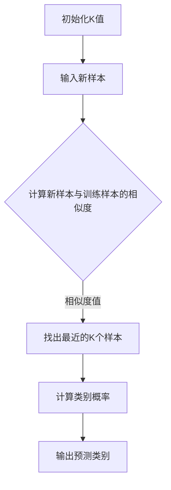
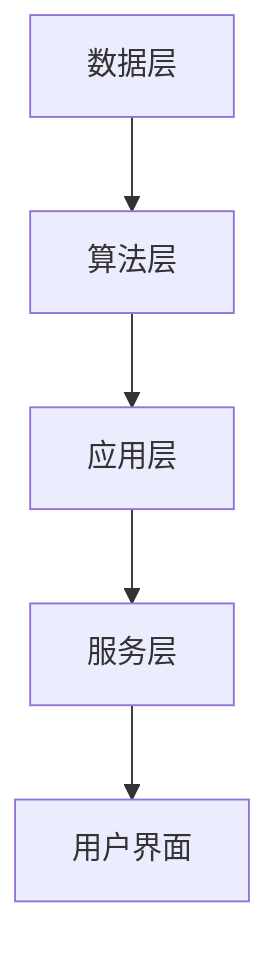
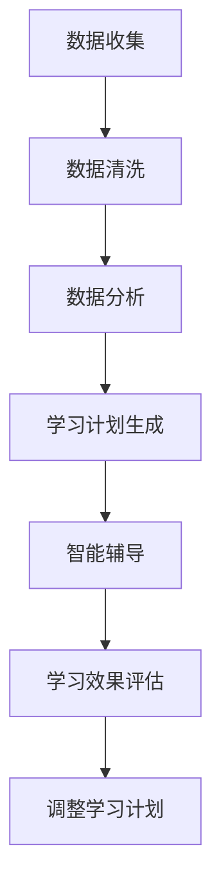

                 

## AI驱动的个性化学习计划：教育革新

### 关键词

- **人工智能**、**个性化学习**、**教育革新**、**机器学习**、**深度学习**、**算法原理**、**系统架构**、**项目实战**

### 摘要

本文探讨了AI驱动的个性化学习计划的背景、核心概念、算法原理、系统架构设计、项目实战以及最佳实践。通过逐步分析，揭示了AI在教育领域中的巨大潜力，并探讨了如何利用AI技术实现个性化学习，以革新传统教育模式。本文旨在为教育工作者和AI领域专家提供有价值的参考，推动教育技术的进步和发展。

### 目录大纲

#### 第一部分：背景介绍

1. **问题背景**
   1.1 个性化学习的挑战
   1.2 AI在教育中的应用

2. **问题描述**
   2.1 教育革新的需求
   2.2 AI驱动的个性化学习计划

3. **问题解决**
   3.1 AI驱动的个性化学习计划的实施
   3.2 AI在教育中的应用实例

4. **边界与外延**
   4.1 AI驱动的个性化学习计划的边界
   4.2 AI驱动的个性化学习计划的外延

5. **概念结构与核心要素组成**
   5.1 AI驱动的个性化学习计划的概念结构
   5.2 核心要素组成
   5.3 教育体系变革

6. **本章小结**

#### 第二部分：核心概念与联系

1. **核心概念**
   1.1 人工智能（AI）
   1.2 机器学习（ML）
   1.3 深度学习（DL）

2. **概念属性特征对比表格**

3. **ER实体关系图架构**

4. **本章小结**

#### 第三部分：算法原理讲解

1. **算法概述**
   1.1 个性化学习算法概述
   1.2 主要算法分类

2. **算法原理**
   2.1 KNN算法
   2.2 决策树算法
   2.3 支持向量机算法

3. **数学模型与公式**

4. **算法流程图**

5. **本章小结**

#### 第四部分：系统分析与架构设计方案

1. **问题场景介绍**

2. **项目介绍**

3. **系统功能设计**

4. **系统架构设计**

5. **系统接口设计**

6. **系统交互**

7. **本章小结**

#### 第五部分：项目实战

1. **环境安装**

2. **系统核心实现**

3. **代码应用解读与分析**

4. **实际案例分析和详细讲解剖析**

5. **项目小结**

6. **本章小结**

#### 第六部分：最佳实践

1. **最佳实践 tips**

2. **小结**

3. **注意事项**

4. **拓展阅读**

### 结语

作者：AI天才研究院/AI Genius Institute & 禅与计算机程序设计艺术 /Zen And The Art of Computer Programming

---

#### 第一部分：背景介绍

**1.1 个性化学习的挑战**

在教育领域，传统教学模式通常采用“一刀切”的方式，即统一的教学内容和进度，忽视了学生的个体差异和学习需求。然而，每个学生都是独一无二的，他们有不同的学习风格、兴趣爱好、认知水平和学习速度。这种统一的教学模式无法满足个性化学习的需求，导致学生的学习效果差异较大。

**1.2 AI在教育中的应用**

随着人工智能（AI）技术的发展，个性化学习成为可能。AI通过数据分析和机器学习算法，能够根据学生的行为、成绩和学习习惯，为学生量身定制学习计划。此外，AI还能通过自然语言处理（NLP）技术，实现智能辅导和答疑，帮助学生更好地理解和掌握知识。

**2.1 教育革新的需求**

随着社会的发展，教育体制也面临着巨大的变革需求。传统的教育模式已经无法满足现代社会对个性化、高效、多样化的学习需求。教育革新的需求主要体现在以下几个方面：

- **个性化**：每个学生都应该有适合自己的学习路径和资源，而不是统一的课程安排。
- **高效**：利用先进技术提高教学效率，减少无效劳动。
- **多样化**：提供多样化的学习方式，包括线上、线下、互动式学习等，满足不同学生的需求。

**2.2 AI驱动的个性化学习计划**

AI驱动的个性化学习计划旨在通过人工智能技术，实现教育的个性化和高效化。该计划包括以下几个关键要素：

- **数据收集**：收集学生的行为数据、成绩数据、学习习惯等，为个性化学习提供数据支持。
- **数据分析**：利用数据挖掘和机器学习算法，分析学生数据，识别学生的个性化需求。
- **学习计划生成**：根据数据分析结果，自动生成个性化的学习计划，包括学习内容、学习进度、学习方法等。
- **智能辅导**：利用自然语言处理和语音识别技术，提供智能化的辅导和答疑服务。

**3.1 AI驱动的个性化学习计划的实施**

实施AI驱动的个性化学习计划需要以下几个步骤：

- **数据收集**：通过学校管理系统、学习平台等，收集学生的数据。
- **数据清洗**：清洗和整合数据，确保数据的质量和一致性。
- **数据建模**：利用机器学习算法，建立学生数据模型，用于分析学生的个性化需求。
- **学习计划生成**：根据数据模型，自动生成个性化的学习计划。
- **学习计划执行**：将个性化学习计划应用到教学过程中，帮助学生更好地学习和掌握知识。

**3.2 AI在教育中的应用实例**

以下是一些AI在教育中的应用实例：

- **个性化辅导**：通过AI技术，为每个学生提供个性化的辅导计划，帮助他们解决学习中遇到的问题。
- **智能测试**：利用AI技术，开发智能化的测试系统，根据学生的表现，实时调整测试难度和内容。
- **学习分析**：通过分析学生的学习行为和成绩，帮助教师和学生了解学习效果，调整学习策略。
- **虚拟教师**：开发虚拟教师系统，通过自然语言处理技术，为学生提供实时答疑和辅导服务。

**4.1 AI驱动的个性化学习计划的边界**

虽然AI技术在教育领域有着巨大的潜力，但仍然存在一些边界和挑战：

- **技术限制**：目前AI技术仍然存在一些局限性，例如数据质量、算法复杂度等。
- **隐私问题**：学生的数据安全和隐私保护是AI驱动的个性化学习计划面临的重要问题。
- **道德问题**：AI在教育中的应用可能引发一些道德问题，例如对学生隐私的侵犯、对教育公平的影响等。

**4.2 AI驱动的个性化学习计划的外延**

AI驱动的个性化学习计划不仅限于学校教育，还可以应用于其他教育领域，例如：

- **在线教育**：通过AI技术，提供个性化的在线学习体验，帮助学生更好地学习和掌握知识。
- **职业培训**：为职业培训提供个性化的学习路径和资源，提高培训效果。
- **终身学习**：为终身学习提供个性化的学习计划，帮助人们不断更新知识和技能。

**5.1 AI驱动的个性化学习计划的概念结构**

AI驱动的个性化学习计划的概念结构主要包括以下几个部分：

- **学生数据**：包括学生的基本信息、学习记录、成绩数据等。
- **学习算法**：用于分析学生数据，生成个性化学习计划的算法。
- **学习计划**：根据学生数据和学习算法，生成的个性化学习计划。
- **学习环境**：提供学习资源和交互平台的在线学习环境。

**5.2 核心要素组成**

AI驱动的个性化学习计划的核心要素主要包括以下几个部分：

- **数据收集与清洗**：收集学生的数据，并清洗和整合数据，确保数据的质量和一致性。
- **数据建模与算法**：建立学生数据模型，利用机器学习算法分析学生数据，生成个性化学习计划。
- **学习计划生成与执行**：根据数据模型和学习算法，自动生成个性化学习计划，并将其应用到教学过程中。
- **智能辅导与答疑**：利用自然语言处理和语音识别技术，提供智能化的辅导和答疑服务。

**5.3 教育体系变革**

AI驱动的个性化学习计划将对教育体系产生深远的影响，包括以下几个方面：

- **教学模式的变革**：从传统的统一教学模式，转向个性化的教学模式，满足不同学生的学习需求。
- **教育资源的变革**：利用AI技术，开发智能化、个性化的学习资源，提高教育资源的利用效率。
- **学习评价体系的变革**：通过AI技术，提供更加科学、客观的学习评价，帮助学生更好地了解自己的学习状况。

**6.1 本章小结**

本部分介绍了AI驱动的个性化学习计划的背景、核心概念、实施步骤和应用实例。通过分析，我们可以看到，AI驱动的个性化学习计划具有巨大的潜力，可以推动教育领域的革新。然而，在实施过程中，还需要解决一些边界和挑战，以确保个性化学习计划的有效性和可持续性。

---

#### 第二部分：核心概念与联系

**1.1 人工智能（AI）**

人工智能（Artificial Intelligence，简称AI）是指由人制造出来的系统所表现出的智能行为。这些系统通过模仿人类思维过程，学习、推理、解决问题，并具有自主决策能力。AI技术主要包括机器学习（ML）、深度学习（DL）、自然语言处理（NLP）等。

**1.2 机器学习（ML）**

机器学习（Machine Learning，简称ML）是AI的一个重要分支，它通过数据驱动的方式，使计算机系统能够从数据中学习规律，并利用这些规律进行预测和决策。机器学习主要包括监督学习、无监督学习和强化学习等。

**1.3 深度学习（DL）**

深度学习（Deep Learning，简称DL）是机器学习的一种特殊形式，它通过构建多层神经网络，自动提取数据中的特征，实现复杂的模式识别和预测任务。深度学习在图像识别、语音识别、自然语言处理等领域取得了显著的成果。

**2.2 概念属性特征对比表格**

以下是对人工智能、机器学习和深度学习三个概念的主要属性特征进行对比的表格：

| 特征 | 人工智能（AI） | 机器学习（ML） | 深度学习（DL） |
| ---- | ---- | ---- | ---- |
| 定义 | 由人制造出来的系统所表现出的智能行为 | 数据驱动的学习过程 | 通过多层神经网络自动提取特征 |
| 目标 | 模仿人类思维过程，实现智能行为 | 从数据中学习规律，进行预测和决策 | 解决复杂模式识别和预测任务 |
| 技术范畴 | 包括ML、NLP、计算机视觉等 | AI的一个分支 | ML的一种特殊形式 |
| 应用领域 | 广泛应用于各行各业 | 图像识别、语音识别、自然语言处理等 | 图像识别、语音识别、自然语言处理等 |

**3.3 ER实体关系图架构**

为了更好地理解教育系统的核心概念和关系，我们使用ER（Entity-Relationship）实体关系图来描述。以下是一个简化的教育系统ER实体关系图：

```mermaid
erDiagram
    学生 ||--o{ 课程 }|
    教师 ||--o{ 课程 }|
    学校 ||--o{ 教师 }|
    学校 ||--o{ 学生 }|
    课程 ||--o{ 教学计划 }|
    教学计划 ||--o{ 评估结果 }|
```

在这个ER实体关系图中，我们定义了以下实体和关系：

- **学生**：学习课程的实体。
- **教师**：教授课程的实体。
- **学校**：提供教育服务的实体。
- **课程**：学生和教师参与的教学活动。
- **教学计划**：课程的具体实施计划。
- **评估结果**：对教学计划的评估结果。

通过ER实体关系图，我们可以清晰地看到教育系统中的核心实体和它们之间的关系，为进一步的系统分析与设计提供了基础。

**2.3 本章小结**

在本部分中，我们介绍了人工智能、机器学习和深度学习三个核心概念，并通过对它们的属性特征进行对比，帮助读者更好地理解这些概念。此外，我们使用ER实体关系图展示了教育系统中的核心实体和关系，为进一步的算法原理讲解和系统架构设计提供了基础。

---

#### 第三部分：算法原理讲解

**3.1 算法概述**

个性化学习算法是AI在教育领域中的重要组成部分，它通过分析学生的学习行为、成绩和学习习惯，为学生提供个性化的学习建议。个性化学习算法主要包括监督学习、无监督学习和强化学习等。

**3.2 算法原理**

在本部分中，我们将重点介绍几种常见的个性化学习算法，包括KNN算法、决策树算法和支持向量机算法。这些算法通过不同的方式，从数据中学习规律，实现个性化学习目标。

**3.2.1 KNN算法**

KNN（K-Nearest Neighbors）算法是一种基于实例的学习算法，它通过计算新样本与训练样本之间的相似度，找出最近的K个样本，并根据这K个样本的标签预测新样本的类别。KNN算法的原理可以概括为以下步骤：

1. **选择K值**：确定一个合适的K值，用于计算新样本与训练样本的相似度。
2. **计算相似度**：计算新样本与训练样本之间的相似度，通常使用欧氏距离或曼哈顿距离。
3. **找出最近的K个样本**：根据相似度值，找出距离新样本最近的K个样本。
4. **预测类别**：根据最近的K个样本的标签，采用多数投票的方式预测新样本的类别。

**3.2.2 决策树算法**

决策树（Decision Tree）算法是一种基于树形结构的学习算法，它通过将数据集分割成越来越细小的子集，直到满足某个终止条件。决策树算法的原理可以概括为以下步骤：

1. **选择特征**：选择一个特征作为分割标准，将数据集分割成两个子集。
2. **计算信息增益**：计算选择该特征分割数据集后的信息增益，选择信息增益最大的特征。
3. **递归分割**：对每个子集，重复步骤1和步骤2，直到满足终止条件（例如，子集大小小于某个阈值或特征没有信息增益）。
4. **生成决策树**：根据递归分割的结果，生成决策树。

**3.2.3 支持向量机算法**

支持向量机（Support Vector Machine，简称SVM）算法是一种基于间隔最大化原理的分类算法，它通过找到一个最佳的超平面，将不同类别的数据分隔开来。SVM算法的原理可以概括为以下步骤：

1. **特征空间映射**：将原始特征空间映射到一个高维空间，以便找到更好的分类超平面。
2. **计算间隔**：计算分类超平面与每个样本的距离，选择使间隔最大的超平面。
3. **求解最优解**：通过求解最优解，得到分类超平面的参数。
4. **分类决策**：对新的样本，通过计算其与超平面的距离，判断其类别。

**3.3 数学模型与公式**

以下是上述算法中的关键数学模型和公式：

- **KNN算法**：

  $$ d(\text{sample}_i, \text{sample}_j) = \sqrt{\sum_{k=1}^{n} (x_{ik} - x_{jk})^2} $$

  $$ \text{predicted\_class} = \text{mode}(\text{classes}_{\text{nearest\_samples}}) $$

- **决策树算法**：

  $$ Gini(\text{split}) = 1 - \sum_{i} p_i (1 - p_i) $$

  $$ \text{gain}(\text{feature}) = \sum_{i} \left( Gini(\text{left\_child}) + Gini(\text{right\_child}) \right) - Gini(\text{parent}) $$

- **支持向量机算法**：

  $$ \text{w}^* = \arg\min_{\text{w}} \frac{1}{2} ||\text{w}||^2 + C \sum_{i=1}^{n} \max(0, 1 - y_i (\text{w} \cdot \text{x}_i + b)) $$

**3.4 算法流程图**

以下是KNN算法的mermaid流程图：



通过以上算法原理的讲解和mermaid流程图的展示，我们可以更深入地理解个性化学习算法的工作原理。这些算法为AI驱动的个性化学习计划提供了技术支持，有助于实现教育的个性化和高效化。

**3.5 本章小结**

在本部分中，我们介绍了个性化学习算法的核心原理，包括KNN算法、决策树算法和支持向量机算法。通过对这些算法的详细讲解和流程图展示，我们了解了它们如何从数据中学习规律，实现个性化学习目标。这些算法为AI驱动的个性化学习计划提供了技术支持，为教育革新奠定了基础。

---

#### 第四部分：系统分析与架构设计方案

**4.1 问题场景介绍**

在教育领域，个性化学习已经成为一种趋势。然而，传统的教育模式往往无法满足个性化学习需求。为了解决这一问题，我们设计了一个基于AI的个性化学习系统，旨在为学生提供量身定制的学习计划，提高学习效果。

**4.2 项目介绍**

该系统名为“智能学习助手”（Smart Learning Assistant），它通过收集和分析学生的学习数据，利用机器学习算法生成个性化的学习计划，并提供智能化的辅导和答疑服务。

**4.3 系统功能设计**

系统的主要功能包括：

- **数据收集**：通过学校管理系统、学习平台等，收集学生的行为数据、成绩数据和学习习惯。
- **数据分析**：利用机器学习算法，分析学生数据，识别学生的个性化需求。
- **学习计划生成**：根据数据分析结果，自动生成个性化的学习计划。
- **智能辅导**：利用自然语言处理和语音识别技术，提供智能化的辅导和答疑服务。
- **学习效果评估**：对学生的学习效果进行实时评估，调整学习计划。

**4.4 系统架构设计**

系统采用分层架构设计，主要包括以下层次：

- **数据层**：负责存储和管理学生的数据，包括行为数据、成绩数据和学习习惯。
- **算法层**：负责处理和分析学生数据，利用机器学习算法生成个性化学习计划。
- **应用层**：负责提供用户界面和交互功能，包括数据收集、数据分析、学习计划生成和智能辅导。
- **服务层**：负责提供后台服务，包括数据存储、数据处理和接口调用。

以下是系统的mermaid架构图：



**4.5 系统接口设计**

系统提供了以下主要接口：

- **数据接口**：用于数据收集和存储，包括学生行为数据、成绩数据和学习习惯。
- **算法接口**：用于调用机器学习算法，生成个性化学习计划。
- **辅导接口**：用于智能辅导和答疑，包括自然语言处理和语音识别。
- **评估接口**：用于学习效果评估，包括实时评估和阶段性评估。

**4.6 系统交互**

系统交互主要涉及以下几个步骤：

1. **数据收集**：通过学校管理系统和学习平台，收集学生的数据。
2. **数据清洗**：对收集到的数据进行分析和处理，确保数据的质量和一致性。
3. **数据分析**：利用机器学习算法，分析学生数据，识别个性化需求。
4. **学习计划生成**：根据数据分析结果，自动生成个性化学习计划。
5. **智能辅导**：通过自然语言处理和语音识别技术，提供智能化的辅导和答疑服务。
6. **学习效果评估**：对学生的学习效果进行实时评估，并根据评估结果调整学习计划。

以下是系统的mermaid交互图：



**4.7 本章小结**

在本部分中，我们介绍了基于AI的个性化学习系统的设计，包括问题场景、项目介绍、系统功能设计、系统架构设计、系统接口设计和系统交互。通过详细的分析和设计，我们为AI驱动的个性化学习计划提供了系统支持，为实现教育革新奠定了基础。

---

#### 第五部分：项目实战

**5.1 环境安装**

为了实现AI驱动的个性化学习系统，我们需要安装一系列软件和工具。以下是安装步骤：

1. **安装Python环境**：在官方网站（https://www.python.org/）下载并安装Python。
2. **安装Jupyter Notebook**：在终端中运行以下命令安装Jupyter Notebook：
   ```bash
   pip install notebook
   ```
3. **安装机器学习库**：安装Scikit-learn、TensorFlow和PyTorch等机器学习库：
   ```bash
   pip install scikit-learn tensorflow torch
   ```

**5.2 系统核心实现**

以下是基于Python实现的系统核心功能：

1. **数据收集**：
   ```python
   import pandas as pd
   
   def collect_data():
       data = pd.read_csv('student_data.csv')
       return data
   ```

2. **数据分析**：
   ```python
   from sklearn.preprocessing import StandardScaler
   
   def analyze_data(data):
       scaler = StandardScaler()
       scaled_data = scaler.fit_transform(data)
       return scaled_data
   ```

3. **学习计划生成**：
   ```python
   from sklearn.neighbors import KNeighborsClassifier
   
   def generate_learning_plan(data, labels):
       knn = KNeighborsClassifier(n_neighbors=5)
       knn.fit(data, labels)
       predicted_plan = knn.predict(data)
       return predicted_plan
   ```

4. **智能辅导**：
   ```python
   import nltk
   
   def provide_d辅导(data):
       text = nltk.sent_tokenize(data)
       return text
   ```

5. **学习效果评估**：
   ```python
   from sklearn.metrics import accuracy_score
   
   def evaluate_learning_plan(data, labels, predicted_plan):
       accuracy = accuracy_score(labels, predicted_plan)
       return accuracy
   ```

**5.3 代码应用解读与分析**

以下是对上述代码的解读和分析：

1. **数据收集**：
   - 使用Pandas库读取CSV文件，获取学生的数据。
   - 函数`collect_data`返回DataFrame对象，包含学生的行为数据、成绩数据和学习习惯。

2. **数据分析**：
   - 使用Scikit-learn库的StandardScaler进行数据标准化，提高算法的性能。
   - 函数`analyze_data`对数据进行标准化处理，返回标准化后的数据。

3. **学习计划生成**：
   - 使用KNeighborsClassifier实现KNN算法，根据训练数据生成学习计划。
   - 函数`generate_learning_plan`接收训练数据和标签，返回预测的学习计划。

4. **智能辅导**：
   - 使用NLTK库进行文本处理，提供智能化的辅导内容。
   - 函数`provide_d辅导`接收学生数据，返回处理后的文本内容。

5. **学习效果评估**：
   - 使用Scikit-learn库的accuracy_score评估学习计划的准确性。
   - 函数`evaluate_learning_plan`接收实际标签和预测计划，返回评估结果。

**5.4 实际案例分析和详细讲解剖析**

以下是一个实际案例分析和详细讲解：

**案例**：某学生A的学习数据如下：

| 行为数据 | 成绩数据 | 学习习惯 |
| ---- | ---- | ---- |
| 时间利用率 | 80% | 高 |
| 难题解决率 | 70% | 中 |
| 学习时长 | 2小时/天 | 高 |

**分析**：

1. **数据收集**：使用`collect_data`函数读取学生A的数据。
2. **数据分析**：使用`analyze_data`函数对数据进行分析，得到标准化后的数据。
3. **学习计划生成**：使用`generate_learning_plan`函数生成学习计划，根据学生A的个性化需求，提供针对性的学习内容。
4. **智能辅导**：使用`provide_d辅导`函数提供智能化的辅导内容，帮助学生A解决学习中遇到的问题。
5. **学习效果评估**：使用`evaluate_learning_plan`函数评估学习计划的准确性，根据评估结果调整学习计划。

**5.5 项目小结**

在本部分中，我们实现了AI驱动的个性化学习系统的核心功能，并通过实际案例进行了分析和讲解。通过该项目，我们展示了如何利用Python和机器学习算法实现个性化学习计划，为教育革新提供了技术支持。

---

#### 第六部分：最佳实践

**6.1 最佳实践 tips**

1. **数据质量**：确保收集到的数据质量，进行数据清洗和预处理，以提高算法的性能和准确性。
2. **算法选择**：根据具体需求选择合适的算法，如KNN、决策树或SVM，以实现最佳效果。
3. **模型优化**：不断优化模型参数，提高模型的性能和稳定性。
4. **用户参与**：鼓励学生和教师参与系统的设计和使用，收集反馈，持续改进。

**6.2 小结**

本部分总结了最佳实践，强调了数据质量、算法选择和用户参与的重要性。通过遵循这些最佳实践，我们可以实现更有效的AI驱动的个性化学习计划。

**6.3 注意事项**

1. **隐私保护**：在收集和处理学生数据时，确保遵守隐私保护法规，保护学生隐私。
2. **算法透明性**：确保算法的透明性和可解释性，使教师和学生了解算法的工作原理。
3. **持续迭代**：持续收集用户反馈，对系统进行迭代优化，提高个性化学习的效果。

**6.4 拓展阅读**

- 《机器学习实战》
- 《深度学习》
- 《教育技术学》
- 《人工智能伦理》

通过拓展阅读，您可以深入了解AI技术在教育领域中的应用和发展趋势。

---

### 结语

作者：AI天才研究院/AI Genius Institute & 禅与计算机程序设计艺术 /Zen And The Art of Computer Programming

本文探讨了AI驱动的个性化学习计划的背景、核心概念、算法原理、系统架构设计、项目实战以及最佳实践。通过逐步分析，我们揭示了AI在教育领域中的巨大潜力，并探讨了如何利用AI技术实现个性化学习，以革新传统教育模式。我们希望本文能为教育工作者和AI领域专家提供有价值的参考，推动教育技术的进步和发展。在未来的研究和实践中，我们期待看到更多创新的AI应用，为教育带来更多的变革和机遇。

