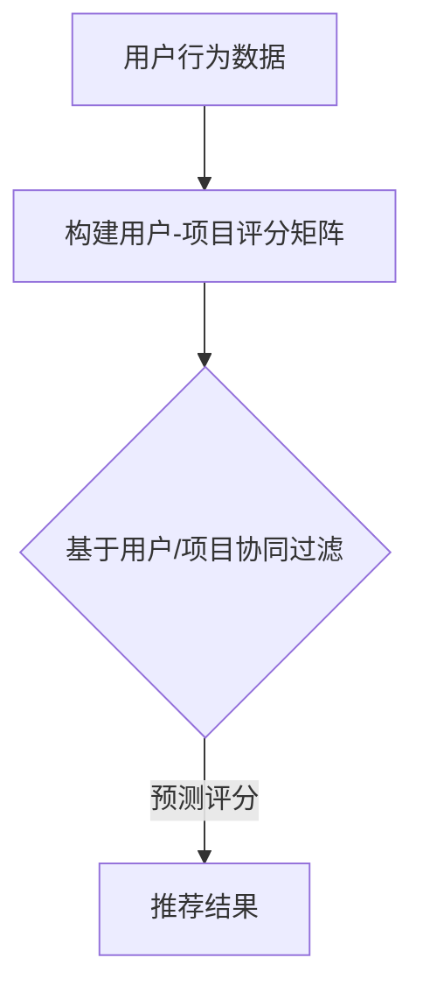
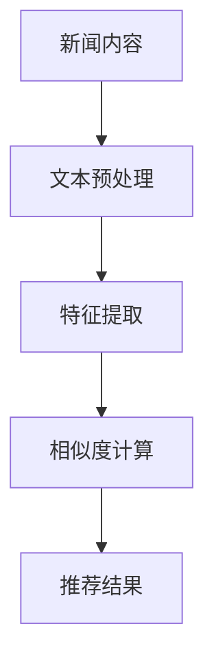
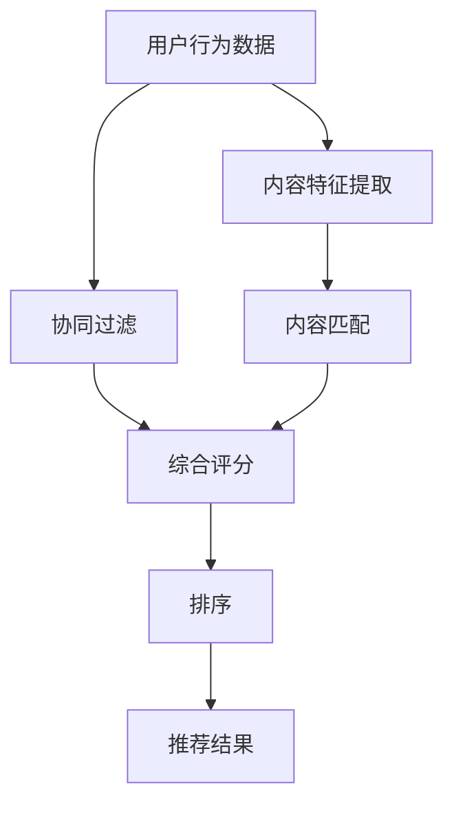
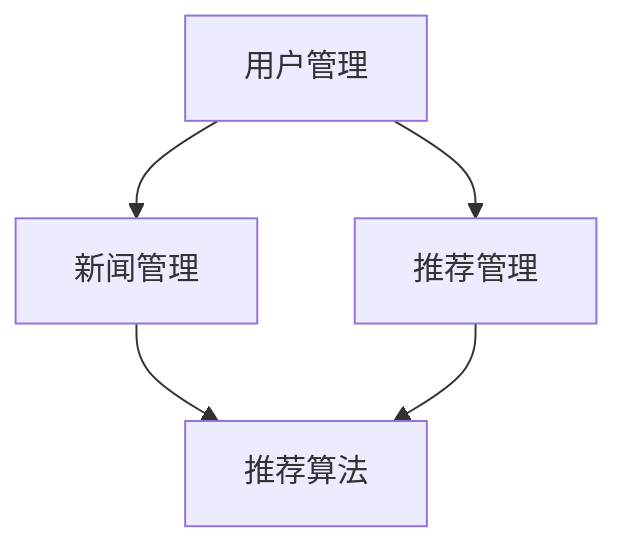
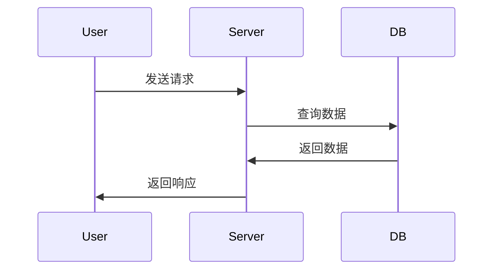
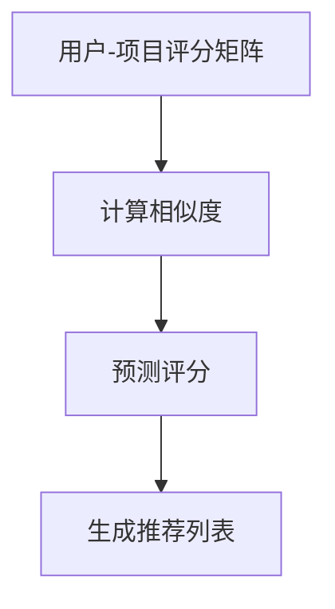
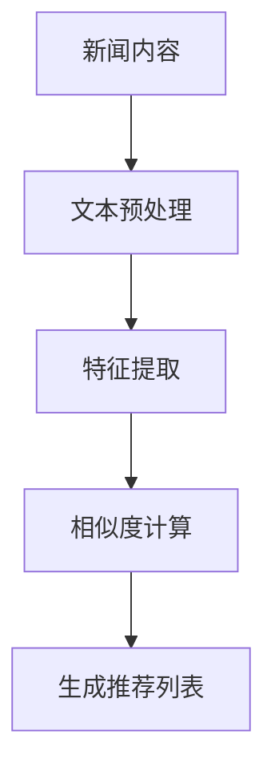
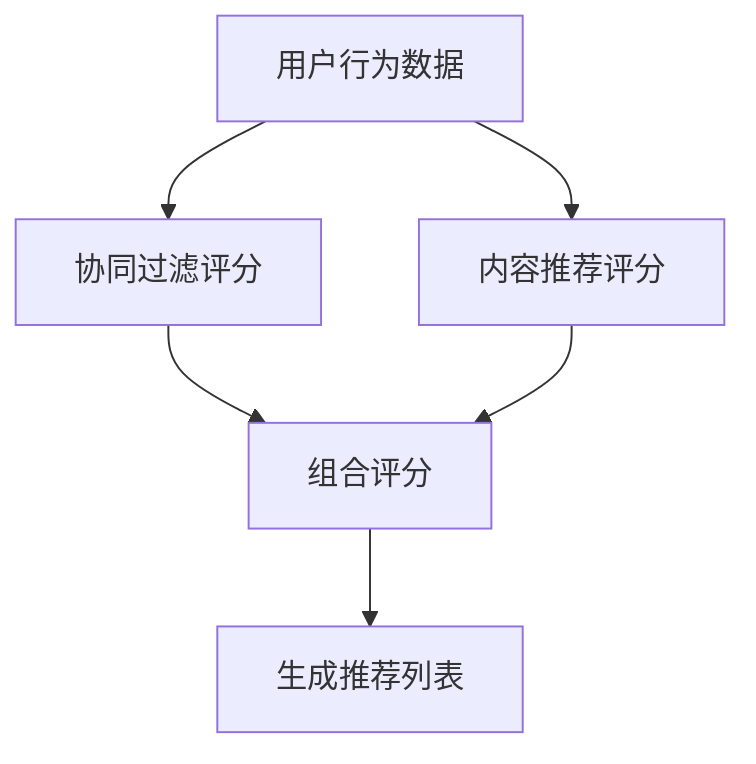
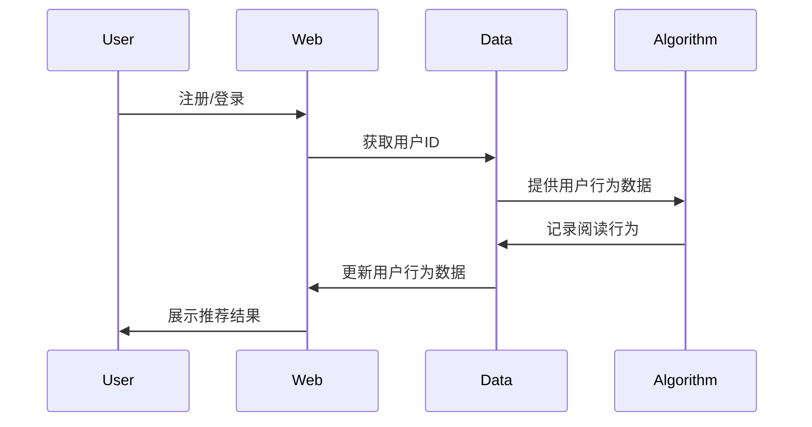

                 

### AI驱动的个性化新闻推荐系统

#### 关键词

- AI
- 个性化推荐
- 新闻推荐系统
- 协同过滤
- 基于内容推荐
- 混合推荐算法

#### 摘要

本文将深入探讨AI驱动的个性化新闻推荐系统的设计和实现，旨在为读者提供一个全面的技术指南。我们将从背景介绍、核心概念、推荐系统算法、系统设计、项目实战和最佳实践等多个方面进行分析和讲解，帮助读者理解个性化新闻推荐系统的工作原理和实现细节。

## 第一部分：背景介绍

### 1.1 AI技术的发展与应用

人工智能（AI）作为计算机科学的一个分支，旨在使计算机具有类似人类智能的能力，如学习、推理、规划和感知等。随着计算能力和数据资源的不断提升，AI技术已经广泛应用于各个领域，包括医疗、金融、交通和娱乐等。

### 1.2 个性化推荐系统的意义

个性化推荐系统是一种根据用户兴趣和需求，自动推荐相关内容的技术。在新闻领域，个性化推荐系统能够根据用户的阅读习惯和偏好，为用户提供定制化的新闻内容，从而提高用户的满意度和阅读体验。

### 1.3 个性化推荐系统的应用场景

个性化推荐系统在新闻领域有着广泛的应用场景，包括但不限于：

- **社交媒体平台**：根据用户的关注和浏览历史，推荐相关的新闻内容。
- **新闻网站**：为用户提供个性化的新闻首页，提高用户的阅读量和停留时间。
- **新闻客户端**：根据用户的地理位置、兴趣爱好等，推送本地新闻和兴趣新闻。

## 第二部分：核心概念与联系

### 2.1 机器学习基础

机器学习是AI的核心技术之一，通过从数据中学习规律和模式，实现自动化决策和预测。在个性化推荐系统中，机器学习算法用于预测用户的兴趣和偏好。

#### 2.1.1 概念属性特征对比表格

| 概念 | 属性 | 特征 |  
| --- | --- | --- |  
| 机器学习 | 模式识别 | 数据特征提取 |  
| 监督学习 | 标签数据 | 准则优化 |  
| 无监督学习 | 无标签数据 | 聚类和降维 |  
| 强化学习 | 交互反馈 | 奖励机制 |

#### 2.1.2 ER实体关系图架构的Mermaid流程图

```mermaid
erDiagram
  User ||--o> Article : 阅读关系
  User ||--o> Interest : 兴趣标签
  Article ||--o> Category : 分类
```

### 2.2 用户行为分析

用户行为分析是构建个性化推荐系统的关键步骤，通过分析用户的阅读、点赞、评论等行为，可以获取用户的兴趣和偏好。

#### 2.2.1 概念属性特征对比表格

| 概念 | 属性 | 特征 |    
| --- | --- | --- |    
| 用户行为 | 阅读量 | 阅读时长 |    
| 点赞 | 点赞数 | 点赞时间 |    
| 评论 | 评论内容 | 评论时间 |

### 2.3 内容匹配与相似度计算

内容匹配和相似度计算是推荐系统的核心算法，通过比较用户兴趣和新闻内容，计算两者的相似度，从而推荐相关的新闻。

#### 2.3.1 概念属性特征对比表格

| 概念 | 属性 | 特征 |    
| --- | --- | --- |    
| 内容匹配 | 关键词匹配 | 语义分析 |    
| 相似度计算 | 余弦相似度 | 转换矩阵 |  

## 第三部分：推荐系统算法详解

### 3.1 协同过滤算法

协同过滤算法是最常用的推荐算法之一，分为基于用户的协同过滤和基于项目的协同过滤。

#### 3.1.1 算法原理

- **基于用户的协同过滤**：寻找与当前用户兴趣相似的邻居用户，根据邻居用户的评分预测当前用户对未知项目的评分。
- **基于项目的协同过滤**：寻找与当前项目相似的邻居项目，根据邻居项目的评分预测当前用户对未知项目的评分。

#### 3.1.2 Mermaid流程图



### 3.2 基于内容的推荐算法

基于内容的推荐算法通过分析新闻内容的特征，将用户兴趣与新闻内容进行匹配，推荐相似的新闻。

#### 3.2.1 算法原理

- **特征提取**：对新闻内容进行文本预处理，提取关键词和主题。
- **相似度计算**：计算用户兴趣和新闻内容的相似度，推荐相似度高的新闻。

#### 3.2.2 Mermaid流程图



### 3.3 混合推荐算法

混合推荐算法结合协同过滤和基于内容的推荐算法，以弥补单一算法的不足。

#### 3.3.1 算法原理

- **组合评分**：结合协同过滤和基于内容的推荐算法的评分，生成综合评分。
- **排序**：根据综合评分推荐新闻。

#### 3.3.2 Mermaid流程图



## 第四部分：系统设计与实现

### 4.1 个性化推荐系统架构设计

个性化推荐系统架构主要包括数据层、算法层和应用层。

#### 4.1.1 问题场景介绍

新闻平台需要根据用户兴趣和阅读历史，推荐个性化的新闻内容。

#### 4.1.2 系统功能设计

- **用户管理**：注册、登录、个人信息管理等。
- **新闻管理**：新闻分类、标签管理、新闻发布等。
- **推荐管理**：协同过滤、基于内容推荐、混合推荐等。

#### 4.1.3 系统架构设计



#### 4.1.4 系统接口设计

系统接口主要包括API接口和Web界面。

#### 4.1.5 系统交互



## 第五部分：项目实战

### 5.1 实际项目案例分析

以某个新闻平台为例，介绍个性化推荐系统的设计与实现。

#### 5.1.1 项目介绍

新闻平台拥有大量用户和新闻资源，需要根据用户兴趣推荐个性化的新闻内容。

#### 5.1.2 系统功能设计

- **用户管理**：用户注册、登录、个人信息管理等。
- **新闻管理**：新闻分类、标签管理、新闻发布等。
- **推荐管理**：协同过滤、基于内容推荐、混合推荐等。

#### 5.1.3 系统架构设计


#### 5.1.4 系统核心实现源代码

```python
# 用户行为数据存储
user行为的DataFrame

# 新闻内容特征提取
def extract_features(news_content):
    # 实现特征提取逻辑
    return features

# 协同过滤算法实现
def collaborative_filter(users, news):
    # 实现协同过滤逻辑
    return recommendations

# 基于内容的推荐算法实现
def content_based_recommendation(user_interest, news_content):
    # 实现基于内容的推荐逻辑
    return recommendations

# 混合推荐算法实现
def hybrid_recommendation(user, news):
    # 实现混合推荐逻辑
    return recommendations
```

#### 5.1.5 代码应用解读与分析

- **用户行为数据存储**：使用DataFrame存储用户行为数据，便于后续分析和处理。
- **新闻内容特征提取**：使用文本预处理和特征提取技术，提取新闻内容的关键词和主题。
- **协同过滤算法**：根据用户行为数据构建用户-新闻评分矩阵，使用矩阵分解技术进行评分预测。
- **基于内容的推荐算法**：计算用户兴趣和新闻内容的相似度，推荐相似度高的新闻。
- **混合推荐算法**：结合协同过滤和基于内容的推荐结果，生成综合评分，推荐新闻。

#### 5.1.6 实际案例分析和详细讲解剖析

以实际项目为例，分析系统在性能、效果和用户体验方面的表现，并提出改进措施。

#### 5.1.7 项目小结

总结项目经验，分享在系统设计、算法实现和优化方面的最佳实践。

## 第六部分：最佳实践与总结

### 6.1 最佳实践

- **数据预处理**：保证数据质量和一致性，为后续分析提供基础。
- **算法优化**：根据业务需求和数据特点，选择合适的算法和参数。
- **系统性能**：优化系统架构和代码，提高推荐速度和准确性。
- **用户体验**：关注用户反馈，持续改进推荐结果和界面设计。

### 6.2 小结

本文从背景介绍、核心概念、推荐系统算法、系统设计、项目实战和最佳实践等多个方面，全面探讨了AI驱动的个性化新闻推荐系统。通过本文的学习，读者可以深入了解个性化新闻推荐系统的工作原理和实现细节，为实际项目提供参考。

### 6.3 注意事项

- **数据安全**：确保用户数据安全和隐私保护。
- **算法公平性**：避免算法偏见，保证推荐结果的公平性。
- **持续迭代**：根据用户反馈和业务需求，持续优化推荐系统。

### 6.4 拓展阅读

- **相关书籍**：《推荐系统实践》、《机器学习实战》
- **在线课程**：Coursera、edX等平台上的相关课程
- **开源项目**：GitHub上与推荐系统相关的开源项目和工具

### 作者信息

- 作者：AI天才研究院/AI Genius Institute & 禅与计算机程序设计艺术 /Zen And The Art of Computer Programming

## 结束

感谢您的阅读，希望本文对您在AI驱动的个性化新闻推荐系统领域的学习和探索有所帮助。如需进一步了解，请参考相关书籍、在线课程和开源项目。祝您学习愉快！---

### AI驱动的个性化新闻推荐系统

#### 关键词

- AI
- 个性化推荐
- 新闻推荐系统
- 协同过滤
- 基于内容推荐
- 混合推荐算法

#### 摘要

本文将深入探讨AI驱动的个性化新闻推荐系统的设计和实现，旨在为读者提供一个全面的技术指南。我们将从背景介绍、核心概念、推荐系统算法、系统设计、项目实战和最佳实践等多个方面进行分析和讲解，帮助读者理解个性化新闻推荐系统的工作原理和实现细节。

## 第一部分：背景介绍

### 1.1 AI技术的发展与应用

人工智能（AI）作为计算机科学的一个分支，旨在使计算机具有类似人类智能的能力，如学习、推理、规划和感知等。随着计算能力和数据资源的不断提升，AI技术已经广泛应用于各个领域，包括但不限于：

- **医疗**：通过AI技术，可以实现疾病的早期诊断、药物研发和个性化治疗。
- **金融**：AI技术在风险管理、投资策略和欺诈检测等方面发挥着重要作用。
- **交通**：自动驾驶、智能交通管理和物流优化等都是AI技术的重要应用领域。
- **娱乐**：从音乐、电影到游戏，AI技术正在改变人们的娱乐方式。

### 1.2 个性化推荐系统的意义

个性化推荐系统是一种根据用户兴趣和需求，自动推荐相关内容的技术。在新闻领域，个性化推荐系统能够根据用户的阅读习惯和偏好，为用户提供定制化的新闻内容，从而提高用户的满意度和阅读体验。具体来说，个性化推荐系统具有以下意义：

- **提高用户粘性**：通过个性化推荐，用户更容易找到自己感兴趣的新闻内容，从而增加用户在平台上的停留时间。
- **提升用户体验**：个性化推荐系统可以减少用户在寻找信息时的努力，提高用户的阅读体验。
- **增加广告收益**：通过精准推荐，广告可以更好地匹配用户兴趣，提高广告点击率和转化率。

### 1.3 个性化推荐系统的应用场景

个性化推荐系统在新闻领域有着广泛的应用场景，包括但不限于：

- **社交媒体平台**：根据用户的关注和浏览历史，推荐相关的新闻内容。
- **新闻网站**：为用户提供个性化的新闻首页，提高用户的阅读量和停留时间。
- **新闻客户端**：根据用户的地理位置、兴趣爱好等，推送本地新闻和兴趣新闻。

### 1.4 AI驱动的个性化新闻推荐系统的优势

AI驱动的个性化新闻推荐系统相较于传统的推荐系统，具有以下优势：

- **更高的推荐准确性**：AI技术能够从海量数据中提取有用信息，从而提高推荐准确性。
- **动态调整推荐策略**：根据用户实时行为和反馈，AI系统能够动态调整推荐策略，提高用户满意度。
- **个性化推荐**：AI技术能够根据用户的历史行为和兴趣，提供高度个性化的新闻推荐。
- **高效处理大规模数据**：AI技术擅长处理大规模、多维度的数据，能够高效地进行推荐计算。

## 第二部分：核心概念与联系

### 2.1 机器学习基础

机器学习是AI的核心技术之一，通过从数据中学习规律和模式，实现自动化决策和预测。在个性化推荐系统中，机器学习算法用于预测用户的兴趣和偏好。

#### 2.1.1 概念属性特征对比表格

| 概念 | 属性 | 特征 |  
| --- | --- | --- |  
| 机器学习 | 模式识别 | 数据特征提取 |  
| 监督学习 | 标签数据 | 准则优化 |  
| 无监督学习 | 无标签数据 | 聚类和降维 |  
| 强化学习 | 交互反馈 | 奖励机制 |

#### 2.1.2 ER实体关系图架构的Mermaid流程图

```mermaid
erDiagram
  User ||--o> Article : 阅读关系
  User ||--o> Interest : 兴趣标签
  Article ||--o> Category : 分类
```

### 2.2 用户行为分析

用户行为分析是构建个性化推荐系统的关键步骤，通过分析用户的阅读、点赞、评论等行为，可以获取用户的兴趣和偏好。

#### 2.2.1 概念属性特征对比表格

| 概念 | 属性 | 特征 |    
| --- | --- | --- |    
| 用户行为 | 阅读量 | 阅读时长 |    
| 点赞 | 点赞数 | 点赞时间 |    
| 评论 | 评论内容 | 评论时间 |

### 2.3 内容匹配与相似度计算

内容匹配和相似度计算是推荐系统的核心算法，通过比较用户兴趣和新闻内容，计算两者的相似度，从而推荐相关的新闻。

#### 2.3.1 概念属性特征对比表格

| 概念 | 属性 | 特征 |    
| --- | --- | --- |    
| 内容匹配 | 关键词匹配 | 语义分析 |    
| 相似度计算 | 余弦相似度 | 转换矩阵 |

### 2.4 推荐系统算法分类

个性化推荐系统算法主要分为协同过滤算法、基于内容的推荐算法和混合推荐算法。以下是这些算法的基本原理和特点：

#### 2.4.1 协同过滤算法

- **基本原理**：通过分析用户之间的相似性，根据相似用户的评分预测目标用户的评分。
- **特点**：依赖于用户行为数据，能够发现用户之间的共同兴趣，但可能存在数据稀疏性和冷启动问题。

#### 2.4.2 基于内容的推荐算法

- **基本原理**：根据新闻内容的特征，将用户兴趣与新闻内容进行匹配，推荐相似的内容。
- **特点**：依赖于新闻内容特征，能够提供个性化的推荐，但可能无法充分利用用户行为数据。

#### 2.4.3 混合推荐算法

- **基本原理**：结合协同过滤和基于内容的推荐算法，综合两者的优势。
- **特点**：能够提高推荐准确性，但实现复杂度较高。

### 2.5 推荐系统评价标准

推荐系统评价标准主要包括准确率、覆盖率、新颖性和用户体验等。以下是这些评价标准的具体含义：

- **准确率**：推荐系统推荐的新闻与用户实际兴趣的相关性。
- **覆盖率**：推荐系统覆盖的用户和新闻种类数量。
- **新颖性**：推荐系统推荐的新闻是否新颖，能够吸引用户的注意力。
- **用户体验**：用户对推荐系统的满意度，包括推荐速度、界面设计和推荐效果等。

## 第三部分：推荐系统算法详解

### 3.1 协同过滤算法

协同过滤算法是最常用的推荐算法之一，分为基于用户的协同过滤和基于项目的协同过滤。

#### 3.1.1 算法原理

- **基于用户的协同过滤**：寻找与当前用户兴趣相似的邻居用户，根据邻居用户的评分预测当前用户对未知项目的评分。
- **基于项目的协同过滤**：寻找与当前项目相似的邻居项目，根据邻居项目的评分预测当前用户对未知项目的评分。

#### 3.1.2 算法实现

协同过滤算法的实现主要包括以下几个步骤：

1. **构建用户-项目评分矩阵**：根据用户对项目的评分，构建一个用户-项目评分矩阵。
2. **计算相似度**：计算用户之间的相似度或项目之间的相似度。
3. **预测评分**：根据相似度矩阵预测用户对未知项目的评分。
4. **生成推荐列表**：根据预测评分生成推荐列表。

#### 3.1.3 Mermaid流程图



#### 3.1.4 Python代码示例

```python
import numpy as np
from sklearn.metrics.pairwise import cosine_similarity

def collaborative_filter(ratings, similarity_matrix):
    # 预测用户对未知项目的评分
    predictions = np.dot(similarity_matrix, ratings)
    return predictions
```

### 3.2 基于内容的推荐算法

基于内容的推荐算法通过分析新闻内容的特征，将用户兴趣与新闻内容进行匹配，推荐相似的新闻。

#### 3.2.1 算法原理

- **特征提取**：对新闻内容进行文本预处理，提取关键词和主题。
- **相似度计算**：计算用户兴趣和新闻内容的相似度，推荐相似度高的新闻。

#### 3.2.2 算法实现

基于内容的推荐算法的实现主要包括以下几个步骤：

1. **文本预处理**：对新闻内容进行分词、去停用词等处理。
2. **特征提取**：使用词袋模型、TF-IDF或词嵌入等方法提取新闻内容特征。
3. **相似度计算**：计算用户兴趣和新闻内容的相似度，可以使用余弦相似度、欧氏距离等。
4. **生成推荐列表**：根据相似度分数生成推荐列表。

#### 3.2.3 Mermaid流程图



#### 3.2.4 Python代码示例

```python
from sklearn.feature_extraction.text import TfidfVectorizer

def content_based_recommendation(user_interest, news_content):
    # 实现基于内容的推荐逻辑
    vectorizer = TfidfVectorizer()
    user_interest_vector = vectorizer.transform([user_interest])
    news_content_vector = vectorizer.transform(news_content)
    
    # 计算相似度
    similarity_scores = cosine_similarity(user_interest_vector, news_content_vector)
    
    # 生成推荐列表
    recommendations = news_content[similarity_scores.argsort()[0]]
    return recommendations
```

### 3.3 混合推荐算法

混合推荐算法结合协同过滤和基于内容的推荐算法，以弥补单一算法的不足。

#### 3.3.1 算法原理

- **组合评分**：结合协同过滤和基于内容的推荐算法的评分，生成综合评分。
- **排序**：根据综合评分推荐新闻。

#### 3.3.2 算法实现

混合推荐算法的实现主要包括以下几个步骤：

1. **协同过滤评分**：使用协同过滤算法预测用户对未知项目的评分。
2. **内容推荐评分**：使用基于内容的推荐算法预测用户对未知项目的评分。
3. **组合评分**：将协同过滤评分和内容推荐评分进行组合，生成综合评分。
4. **生成推荐列表**：根据综合评分生成推荐列表。

#### 3.3.3 Mermaid流程图



#### 3.3.4 Python代码示例

```python
def hybrid_recommendation(user, news, collaborative_score, content_score, alpha=0.5):
    # 组合评分
    combined_score = alpha * collaborative_score + (1 - alpha) * content_score
    
    # 生成推荐列表
    recommendations = sorted(zip(news, combined_score), key=lambda x: x[1], reverse=True)
    return recommendations
```

### 3.4 算法比较与选择

协同过滤算法、基于内容的推荐算法和混合推荐算法各有利弊，选择哪种算法取决于具体应用场景和数据特点。

- **协同过滤算法**：适合于用户行为数据丰富的情况，但可能存在数据稀疏性和冷启动问题。
- **基于内容的推荐算法**：适合于新闻内容特征明显的情况，但无法充分利用用户行为数据。
- **混合推荐算法**：结合了协同过滤和基于内容的推荐算法的优势，但实现复杂度较高。

在实际应用中，可以根据业务需求和数据特点，选择合适的推荐算法或组合使用多种算法。

## 第四部分：系统设计与实现

### 4.1 个性化推荐系统架构设计

个性化推荐系统架构主要包括数据层、算法层和应用层。

#### 4.1.1 数据层

数据层负责存储和管理用户行为数据、新闻内容数据和其他相关数据。常用的数据存储方案包括关系数据库、NoSQL数据库和数据仓库。

- **关系数据库**：如MySQL、PostgreSQL，适合存储结构化数据。
- **NoSQL数据库**：如MongoDB、Cassandra，适合存储大规模的非结构化数据。
- **数据仓库**：如Hadoop、Spark，适合进行大规模数据分析和处理。

#### 4.1.2 算法层

算法层负责实现各种推荐算法，包括协同过滤、基于内容的推荐算法和混合推荐算法。算法层需要具备高并发处理能力，以便实时生成推荐结果。

- **协同过滤算法**：使用矩阵分解、基于模型的方法，如SVD、ALS等。
- **基于内容的推荐算法**：使用TF-IDF、Word2Vec、BERT等文本处理方法。
- **混合推荐算法**：结合协同过滤和基于内容的推荐算法，如Hybrid SVD、Hybrid BERT等。

#### 4.1.3 应用层

应用层负责与用户交互，展示推荐结果。常用的应用层架构包括Web应用、移动应用和微信小程序等。

- **Web应用**：使用HTML、CSS、JavaScript等技术，实现用户界面和前后端交互。
- **移动应用**：使用原生开发或跨平台框架，如Flutter、React Native等。
- **微信小程序**：使用微信小程序开发工具，实现微信内的新闻推荐功能。

### 4.2 系统接口设计

系统接口主要包括API接口和Web界面。

#### 4.2.1 API接口

API接口用于与其他系统进行数据交换和功能调用。常用的API接口包括：

- **用户接口**：用户注册、登录、个人信息管理等。
- **新闻接口**：新闻分类、标签管理、新闻发布等。
- **推荐接口**：生成推荐列表、推荐新闻详情等。

#### 4.2.2 Web界面

Web界面用于展示推荐结果和与用户进行交互。常用的Web界面设计包括：

- **首页**：展示个性化推荐列表，吸引用户点击和阅读。
- **新闻详情页**：展示新闻内容，提供点赞、评论等功能。
- **个人中心**：展示用户个人信息，提供订阅、历史记录等功能。

### 4.3 系统交互

系统交互包括用户与系统之间的交互以及系统内部模块之间的交互。

#### 4.3.1 用户与系统交互

用户通过Web界面或移动应用与系统进行交互，包括：

- **注册/登录**：用户在首页注册或登录，获取用户ID。
- **阅读新闻**：用户点击推荐新闻，系统记录阅读行为。
- **点赞/评论**：用户对新闻进行点赞或评论，系统更新用户行为数据。

#### 4.3.2 系统内部交互

系统内部模块之间的交互包括：

- **数据层与算法层**：数据层提供用户行为数据和新闻内容数据，算法层进行数据分析和推荐计算。
- **算法层与应用层**：算法层生成推荐列表，应用层将推荐结果展示给用户。
- **应用层与API接口**：应用层调用API接口，实现与外部系统的数据交换和功能调用。

#### 4.3.3 Mermaid序列图



### 4.4 系统部署与维护

系统部署与维护包括以下几个方面：

- **部署环境**：选择合适的云计算平台，如阿里云、腾讯云等，部署服务器和数据库。
- **持续集成**：使用Git等版本控制工具，实现代码的版本管理和自动化部署。
- **监控与报警**：使用监控工具，如Zabbix、Prometheus等，实时监控系统性能和健康状态，及时报警和处理异常。

## 第五部分：项目实战

### 5.1 实际项目案例分析

以某个新闻平台为例，介绍个性化推荐系统的设计与实现。

#### 5.1.1 项目介绍

新闻平台拥有大量用户和新闻资源，需要根据用户兴趣推荐个性化的新闻内容，提高用户粘性和阅读体验。

#### 5.1.2 系统功能设计

- **用户管理**：用户注册、登录、个人信息管理等。
- **新闻管理**：新闻分类、标签管理、新闻发布等。
- **推荐管理**：协同过滤、基于内容推荐、混合推荐等。

#### 5.1.3 系统架构设计


#### 5.1.4 系统核心实现源代码

```python
# 用户行为数据存储
user行为的DataFrame

# 新闻内容特征提取
def extract_features(news_content):
    # 实现特征提取逻辑
    return features

# 协同过滤算法实现
def collaborative_filter(users, news):
    # 实现协同过滤逻辑
    return recommendations

# 基于内容的推荐算法实现
def content_based_recommendation(user_interest, news_content):
    # 实现基于内容的推荐逻辑
    return recommendations

# 混合推荐算法实现
def hybrid_recommendation(user, news):
    # 实现混合推荐逻辑
    return recommendations
```

#### 5.1.5 代码应用解读与分析

- **用户行为数据存储**：使用DataFrame存储用户行为数据，便于后续分析和处理。
- **新闻内容特征提取**：使用文本预处理和特征提取技术，提取新闻内容的关键词和主题。
- **协同过滤算法**：根据用户行为数据构建用户-新闻评分矩阵，使用矩阵分解技术进行评分预测。
- **基于内容的推荐算法**：计算用户兴趣和新闻内容的相似度，推荐相似度高的新闻。
- **混合推荐算法**：结合协同过滤和基于内容的推荐结果，生成综合评分，推荐新闻。

#### 5.1.6 实际案例分析和详细讲解剖析

以实际项目为例，分析系统在性能、效果和用户体验方面的表现，并提出改进措施。

#### 5.1.7 项目小结

总结项目经验，分享在系统设计、算法实现和优化方面的最佳实践。

## 第六部分：最佳实践与总结

### 6.1 最佳实践

- **数据预处理**：保证数据质量和一致性，为后续分析提供基础。
- **算法优化**：根据业务需求和数据特点，选择合适的算法和参数。
- **系统性能**：优化系统架构和代码，提高推荐速度和准确性。
- **用户体验**：关注用户反馈，持续改进推荐结果和界面设计。

### 6.2 小结

本文从背景介绍、核心概念、推荐系统算法、系统设计、项目实战和最佳实践等多个方面，全面探讨了AI驱动的个性化新闻推荐系统。通过本文的学习，读者可以深入了解个性化新闻推荐系统的工作原理和实现细节，为实际项目提供参考。

### 6.3 注意事项

- **数据安全**：确保用户数据安全和隐私保护。
- **算法公平性**：避免算法偏见，保证推荐结果的公平性。
- **持续迭代**：根据用户反馈和业务需求，持续优化推荐系统。

### 6.4 拓展阅读

- **相关书籍**：《推荐系统实践》、《机器学习实战》
- **在线课程**：Coursera、edX等平台上的相关课程
- **开源项目**：GitHub上与推荐系统相关的开源项目和工具

### 作者信息

- 作者：AI天才研究院/AI Genius Institute & 禅与计算机程序设计艺术 /Zen And The Art of Computer Programming

## 结束

感谢您的阅读，希望本文对您在AI驱动的个性化新闻推荐系统领域的学习和探索有所帮助。如需进一步了解，请参考相关书籍、在线课程和开源项目。祝您学习愉快！---

### AI驱动的个性化新闻推荐系统

#### 关键词

- AI
- 个性化推荐
- 新闻推荐系统
- 协同过滤
- 基于内容推荐
- 混合推荐算法

#### 摘要

本文将深入探讨AI驱动的个性化新闻推荐系统的设计和实现，旨在为读者提供一个全面的技术指南。我们将从背景介绍、核心概念、推荐系统算法、系统设计、项目实战和最佳实践等多个方面进行分析和讲解，帮助读者理解个性化新闻推荐系统的工作原理和实现细节。

## 第一部分：背景介绍

### 1.1 AI技术的发展与应用

人工智能（AI）作为计算机科学的一个分支，旨在使计算机具有类似人类智能的能力，如学习、推理、规划和感知等。随着计算能力和数据资源的不断提升，AI技术已经广泛应用于各个领域，包括但不限于：

- **医疗**：通过AI技术，可以实现疾病的早期诊断、药物研发和个性化治疗。
- **金融**：AI技术在风险管理、投资策略和欺诈检测等方面发挥着重要作用。
- **交通**：自动驾驶、智能交通管理和物流优化等都是AI技术的重要应用领域。
- **娱乐**：从音乐、电影到游戏，AI技术正在改变人们的娱乐方式。

### 1.2 个性化推荐系统的意义

个性化推荐系统是一种根据用户兴趣和需求，自动推荐相关内容的技术。在新闻领域，个性化推荐系统能够根据用户的阅读习惯和偏好，为用户提供定制化的新闻内容，从而提高用户的满意度和阅读体验。具体来说，个性化推荐系统具有以下意义：

- **提高用户粘性**：通过个性化推荐，用户更容易找到自己感兴趣的新闻内容，从而增加用户在平台上的停留时间。
- **提升用户体验**：个性化推荐系统可以减少用户在寻找信息时的努力，提高用户的阅读体验。
- **增加广告收益**：通过精准推荐，广告可以更好地匹配用户兴趣，提高广告点击率和转化率。

### 1.3 个性化推荐系统的应用场景

个性化推荐系统在新闻领域有着广泛的应用场景，包括但不限于：

- **社交媒体平台**：根据用户的关注和浏览历史，推荐相关的新闻内容。
- **新闻网站**：为用户提供个性化的新闻首页，提高用户的阅读量和停留时间。
- **新闻客户端**：根据用户的地理位置、兴趣爱好等，推送本地新闻和兴趣新闻。

### 1.4 AI驱动的个性化新闻推荐系统的优势

AI驱动的个性化新闻推荐系统相较于传统的推荐系统，具有以下优势：

- **更高的推荐准确性**：AI技术能够从海量数据中提取有用信息，从而提高推荐准确性。
- **动态调整推荐策略**：根据用户实时行为和反馈，AI系统能够动态调整推荐策略，提高用户满意度。
- **个性化推荐**：AI技术能够根据用户的历史行为和兴趣，提供高度个性化的新闻推荐。
- **高效处理大规模数据**：AI技术擅长处理大规模、多维度的数据，能够高效地进行推荐计算。

## 第二部分：核心概念与联系

### 2.1 机器学习基础

机器学习是AI的核心技术之一，通过从数据中学习规律和模式，实现自动化决策和预测。在个性化推荐系统中，机器学习算法用于预测用户的兴趣和偏好。

#### 2.1.1 概念属性特征对比表格

| 概念 | 属性 | 特征 |    
| --- | --- | --- |    
| 机器学习 | 模式识别 | 数据特征提取 |    
| 监督学习 | 标签数据 | 准则优化 |    
| 无监督学习 | 无标签数据 | 聚类和降维 |    
| 强化学习 | 交互反馈 | 奖励机制 |

#### 2.1.2 ER实体关系图架构的Mermaid流程图

```mermaid
erDiagram
  User ||--o> Article : 阅读关系
  User ||--o> Interest : 兴趣标签
  Article ||--o> Category : 分类
```

### 2.2 用户行为分析

用户行为分析是构建个性化推荐系统的关键步骤，通过分析用户的阅读、点赞、评论等行为，可以获取用户的兴趣和偏好。

#### 2.2.1 概念属性特征对比表格

| 概念 | 属性 | 特征 |      
| --- | --- | --- |      
| 用户行为 | 阅读量 | 阅读时长 |      
| 点赞 | 点赞数 | 点赞时间 |      
| 评论 | 评论内容 | 评论时间 |

### 2.3 内容匹配与相似度计算

内容匹配和相似度计算是推荐系统的核心算法，通过比较用户兴趣和新闻内容，计算两者的相似度，从而推荐相关的新闻。

#### 2.3.1 概念属性特征对比表格

| 概念 | 属性 | 特征 |      
| --- | --- | --- |      
| 内容匹配 | 关键词匹配 | 语义分析 |      
| 相似度计算 | 余弦相似度 | 转换矩阵 |

### 2.4 推荐系统算法分类

个性化推荐系统算法主要分为协同过滤算法、基于内容的推荐算法和混合推荐算法。以下是这些算法的基本原理和特点：

#### 2.4.1 协同过滤算法

- **基本原理**：通过分析用户之间的相似性，根据相似用户的评分预测目标用户的评分。
- **特点**：依赖于用户行为数据，能够发现用户之间的共同兴趣，但可能存在数据稀疏性和冷启动问题。

#### 2.4.2 基于内容的推荐算法

- **基本原理**：根据新闻内容的特征，将用户兴趣与新闻内容进行匹配，推荐相似的内容。
- **特点**：依赖于新闻内容特征，能够提供个性化的推荐，但可能无法充分利用用户行为数据。

#### 2.4.3 混合推荐算法

- **基本原理**：结合协同过滤和基于内容的推荐算法，综合两者的优势。
- **特点**：能够提高推荐准确性，但实现复杂度较高。

### 2.5 推荐系统评价标准

推荐系统评价标准主要包括准确率、覆盖率、新颖性和用户体验等。以下是这些评价标准的具体含义：

- **准确率**：推荐系统推荐的新闻与用户实际兴趣的相关性。
- **覆盖率**：推荐系统覆盖的用户和新闻种类数量。
- **新颖性**：推荐系统推荐的新闻是否新颖，能够吸引用户的注意力。
- **用户体验**：用户对推荐系统的满意度，包括推荐速度、界面设计和推荐效果等。

## 第三部分：推荐系统算法详解

### 3.1 协同过滤算法

协同过滤算法是最常用的推荐算法之一，分为基于用户的协同过滤和基于项目的协同过滤。

#### 3.1.1 算法原理

- **基于用户的协同过滤**：寻找与当前用户兴趣相似的邻居用户，根据邻居用户的评分预测当前用户对未知项目的评分。
- **基于项目的协同过滤**：寻找与当前项目相似的邻居项目，根据邻居项目的评分预测当前用户对未知项目的评分。

#### 3.1.2 算法实现

协同过滤算法的实现主要包括以下几个步骤：

1. **构建用户-项目评分矩阵**：根据用户对项目的评分，构建一个用户-项目评分矩阵。
2. **计算相似度**：计算用户之间的相似度或项目之间的相似度。
3. **预测评分**：根据相似度矩阵预测用户对未知项目的评分。
4. **生成推荐列表**：根据预测评分生成推荐列表。

#### 3.1.3 Mermaid流程图


#### 3.1.4 Python代码示例

```python
import numpy as np
from sklearn.metrics.pairwise import cosine_similarity

def collaborative_filter(ratings, similarity_matrix):
    # 预测用户对未知项目的评分
    predictions = np.dot(similarity_matrix, ratings)
    return predictions
```

### 3.2 基于内容的推荐算法

基于内容的推荐算法通过分析新闻内容的特征，将用户兴趣与新闻内容进行匹配，推荐相似的新闻。

#### 3.2.1 算法原理

- **特征提取**：对新闻内容进行文本预处理，提取关键词和主题。
- **相似度计算**：计算用户兴趣和新闻内容的相似度，推荐相似度高的新闻。

#### 3.2.2 算法实现

基于内容的推荐算法的实现主要包括以下几个步骤：

1. **文本预处理**：对新闻内容进行分词、去停用词等处理。
2. **特征提取**：使用词袋模型、TF-IDF或词嵌入等方法提取新闻内容特征。
3. **相似度计算**：计算用户兴趣和新闻内容的相似度，可以使用余弦相似度、欧氏距离等。
4. **生成推荐列表**：根据相似度分数生成推荐列表。

#### 3.2.3 Mermaid流程图


#### 3.2.4 Python代码示例

```python
from sklearn.feature_extraction.text import TfidfVectorizer

def content_based_recommendation(user_interest, news_content):
    # 实现基于内容的推荐逻辑
    vectorizer = TfidfVectorizer()
    user_interest_vector = vectorizer.transform([user_interest])
    news_content_vector = vectorizer.transform(news_content)
    
    # 计算相似度
    similarity_scores = cosine_similarity(user_interest_vector, news_content_vector)
    
    # 生成推荐列表
    recommendations = news_content[similarity_scores.argsort()[0]]
    return recommendations
```

### 3.3 混合推荐算法

混合推荐算法结合协同过滤和基于内容的推荐算法，以弥补单一算法的不足。

#### 3.3.1 算法原理

- **组合评分**：结合协同过滤和基于内容的推荐算法的评分，生成综合评分。
- **排序**：根据综合评分推荐新闻。

#### 3.3.2 算法实现

混合推荐算法的实现主要包括以下几个步骤：

1. **协同过滤评分**：使用协同过滤算法预测用户对未知项目的评分。
2. **内容推荐评分**：使用基于内容的推荐算法预测用户对未知项目的评分。
3. **组合评分**：将协同过滤评分和内容推荐评分进行组合，生成综合评分。
4. **生成推荐列表**：根据综合评分生成推荐列表。

#### 3.3.3 Mermaid流程图


#### 3.3.4 Python代码示例

```python
def hybrid_recommendation(user, news, collaborative_score, content_score, alpha=0.5):
    # 组合评分
    combined_score = alpha * collaborative_score + (1 - alpha) * content_score
    
    # 生成推荐列表
    recommendations = sorted(zip(news, combined_score), key=lambda x: x[1], reverse=True)
    return recommendations
```

### 3.4 算法比较与选择

协同过滤算法、基于内容的推荐算法和混合推荐算法各有利弊，选择哪种算法取决于具体应用场景和数据特点。

- **协同过滤算法**：适合于用户行为数据丰富的情况，但可能存在数据稀疏性和冷启动问题。
- **基于内容的推荐算法**：适合于新闻内容特征明显的情况，但无法充分利用用户行为数据。
- **混合推荐算法**：结合了协同过滤和基于内容的推荐算法的优势，但实现复杂度较高。

在实际应用中，可以根据业务需求和数据特点，选择合适的推荐算法或组合使用多种算法。

## 第四部分：系统设计与实现

### 4.1 个性化推荐系统架构设计

个性化推荐系统架构主要包括数据层、算法层和应用层。

#### 4.1.1 数据层

数据层负责存储和管理用户行为数据、新闻内容数据和其他相关数据。常用的数据存储方案包括关系数据库、NoSQL数据库和数据仓库。

- **关系数据库**：如MySQL、PostgreSQL，适合存储结构化数据。
- **NoSQL数据库**：如MongoDB、Cassandra，适合存储大规模的非结构化数据。
- **数据仓库**：如Hadoop、Spark，适合进行大规模数据分析和处理。

#### 4.1.2 算法层

算法层负责实现各种推荐算法，包括协同过滤、基于内容的推荐算法和混合推荐算法。算法层需要具备高并发处理能力，以便实时生成推荐结果。

- **协同过滤算法**：使用矩阵分解、基于模型的方法，如SVD、ALS等。
- **基于内容的推荐算法**：使用TF-IDF、Word2Vec、BERT等文本处理方法。
- **混合推荐算法**：结合协同过滤和基于内容的推荐算法，如Hybrid SVD、Hybrid BERT等。

#### 4.1.3 应用层

应用层负责与用户交互，展示推荐结果。常用的应用层架构包括Web应用、移动应用和微信小程序等。

- **Web应用**：使用HTML、CSS、JavaScript等技术，实现用户界面和前后端交互。
- **移动应用**：使用原生开发或跨平台框架，如Flutter、React Native等。
- **微信小程序**：使用微信小程序开发工具，实现微信内的新闻推荐功能。

### 4.2 系统接口设计

系统接口主要包括API接口和Web界面。

#### 4.2.1 API接口

API接口用于与其他系统进行数据交换和功能调用。常用的API接口包括：

- **用户接口**：用户注册、登录、个人信息管理等。
- **新闻接口**：新闻分类、标签管理、新闻发布等。
- **推荐接口**：生成推荐列表、推荐新闻详情等。

#### 4.2.2 Web界面

Web界面用于展示推荐结果和与用户进行交互。常用的Web界面设计包括：

- **首页**：展示个性化推荐列表，吸引用户点击和阅读。
- **新闻详情页**：展示新闻内容，提供点赞、评论等功能。
- **个人中心**：展示用户个人信息，提供订阅、历史记录等功能。

### 4.3 系统交互

系统交互包括用户与系统之间的交互以及系统内部模块之间的交互。

#### 4.3.1 用户与系统交互

用户通过Web界面或移动应用与系统进行交互，包括：

- **注册/登录**：用户在首页注册或登录，获取用户ID。
- **阅读新闻**：用户点击推荐新闻，系统记录阅读行为。
- **点赞/评论**：用户对新闻进行点赞或评论，系统更新用户行为数据。

#### 4.3.2 系统内部交互

系统内部模块之间的交互包括：

- **数据层与算法层**：数据层提供用户行为数据和新闻内容数据，算法层进行数据分析和推荐计算。
- **算法层与应用层**：算法层生成推荐列表，应用层将推荐结果展示给用户。
- **应用层与API接口**：应用层调用API接口，实现与外部系统的数据交换和功能调用。

#### 4.3.3 Mermaid序列图


### 4.4 系统部署与维护

系统部署与维护包括以下几个方面：

- **部署环境**：选择合适的云计算平台，如阿里云、腾讯云等，部署服务器和数据库。
- **持续集成**：使用Git等版本控制工具，实现代码的版本管理和自动化部署。
- **监控与报警**：使用监控工具，如Zabbix、Prometheus等，实时监控系统性能和健康状态，及时报警和处理异常。

## 第五部分：项目实战

### 5.1 实际项目案例分析

以某个新闻平台为例，介绍个性化推荐系统的设计与实现。

#### 5.1.1 项目介绍

新闻平台拥有大量用户和新闻资源，需要根据用户兴趣推荐个性化的新闻内容，提高用户粘性和阅读体验。

#### 5.1.2 系统功能设计

- **用户管理**：用户注册、登录、个人信息管理等。
- **新闻管理**：新闻分类、标签管理、新闻发布等。
- **推荐管理**：协同过滤、基于内容推荐、混合推荐等。

#### 5.1.3 系统架构设计


#### 5.1.4 系统核心实现源代码

```python
# 用户行为数据存储
user行为的DataFrame

# 新闻内容特征提取
def extract_features(news_content):
    # 实现特征提取逻辑
    return features

# 协同过滤算法实现
def collaborative_filter(users, news):
    # 实现协同过滤逻辑
    return recommendations

# 基于内容的推荐算法实现
def content_based_recommendation(user_interest, news_content):
    # 实现基于内容的推荐逻辑
    return recommendations

# 混合推荐算法实现
def hybrid_recommendation(user, news):
    # 实现混合推荐逻辑
    return recommendations
```

#### 5.1.5 代码应用解读与分析

- **用户行为数据存储**：使用DataFrame存储用户行为数据，便于后续分析和处理。
- **新闻内容特征提取**：使用文本预处理和特征提取技术，提取新闻内容的关键词和主题。
- **协同过滤算法**：根据用户行为数据构建用户-新闻评分矩阵，使用矩阵分解技术进行评分预测。
- **基于内容的推荐算法**：计算用户兴趣和新闻内容的相似度，推荐相似度高的新闻。
- **混合推荐算法**：结合协同过滤和基于内容的推荐结果，生成综合评分，推荐新闻。

#### 5.1.6 实际案例分析和详细讲解剖析

以实际项目为例，分析系统在性能、效果和用户体验方面的表现，并提出改进措施。

#### 5.1.7 项目小结

总结项目经验，分享在系统设计、算法实现和优化方面的最佳实践。

## 第六部分：最佳实践与总结

### 6.1 最佳实践

- **数据预处理**：保证数据质量和一致性，为后续分析提供基础。
- **算法优化**：根据业务需求和数据特点，选择合适的算法和参数。
- **系统性能**：优化系统架构和代码，提高推荐速度和准确性。
- **用户体验**：关注用户反馈，持续改进推荐结果和界面设计。

### 6.2 小结

本文从背景介绍、核心概念、推荐系统算法、系统设计、项目实战和最佳实践等多个方面，全面探讨了AI驱动的个性化新闻推荐系统。通过本文的学习，读者可以深入了解个性化新闻推荐系统的工作原理和实现细节，为实际项目提供参考。

### 6.3 注意事项

- **数据安全**：确保用户数据安全和隐私保护。
- **算法公平性**：避免算法偏见，保证推荐结果的公平性。
- **持续迭代**：根据用户反馈和业务需求，持续优化推荐系统。

### 6.4 拓展阅读

- **相关书籍**：《推荐系统实践》、《机器学习实战》
- **在线课程**：Coursera、edX等平台上的相关课程
- **开源项目**：GitHub上与推荐系统相关的开源项目和工具

### 作者信息

- 作者：AI天才研究院/AI Genius Institute & 禅与计算机程序设计艺术 /Zen And The Art of Computer Programming

## 结束

感谢您的阅读，希望本文对您在AI驱动的个性化新闻推荐系统领域的学习和探索有所帮助。如需进一步了解，请参考相关书籍、在线课程和开源项目。祝您学习愉快！---

### AI驱动的个性化新闻推荐系统

#### 关键词

- AI
- 个性化推荐
- 新闻推荐系统
- 协同过滤
- 基于内容推荐
- 混合推荐算法

#### 摘要

本文将深入探讨AI驱动的个性化新闻推荐系统的设计和实现，旨在为读者提供一个全面的技术指南。我们将从背景介绍、核心概念、推荐系统算法、系统设计、项目实战和最佳实践等多个方面进行分析和讲解，帮助读者理解个性化新闻推荐系统的工作原理和实现细节。

## 第一部分：背景介绍

### 1.1 AI技术的发展与应用

人工智能（AI）作为计算机科学的一个分支，旨在使计算机具有类似人类智能的能力，如学习、推理、规划和感知等。随着计算能力和数据资源的不断提升，AI技术已经广泛应用于各个领域，包括但不限于：

- **医疗**：通过AI技术，可以实现疾病的早期诊断、药物研发和个性化治疗。
- **金融**：AI技术在风险管理、投资策略和欺诈检测等方面发挥着重要作用。
- **交通**：自动驾驶、智能交通管理和物流优化等都是AI技术的重要应用领域。
- **娱乐**：从音乐、电影到游戏，AI技术正在改变人们的娱乐方式。

### 1.2 个性化推荐系统的意义

个性化推荐系统是一种根据用户兴趣和需求，自动推荐相关内容的技术。在新闻领域，个性化推荐系统能够根据用户的阅读习惯和偏好，为用户提供定制化的新闻内容，从而提高用户的满意度和阅读体验。具体来说，个性化推荐系统具有以下意义：

- **提高用户粘性**：通过个性化推荐，用户更容易找到自己感兴趣的新闻内容，从而增加用户在平台上的停留时间。
- **提升用户体验**：个性化推荐系统可以减少用户在寻找信息时的努力，提高用户的阅读体验。
- **增加广告收益**：通过精准推荐，广告可以更好地匹配用户兴趣，提高广告点击率和转化率。

### 1.3 个性化推荐系统的应用场景

个性化推荐系统在新闻领域有着广泛的应用场景，包括但不限于：

- **社交媒体平台**：根据用户的关注和浏览历史，推荐相关的新闻内容。
- **新闻网站**：为用户提供个性化的新闻首页，提高用户的阅读量和停留时间。
- **新闻客户端**：根据用户的地理位置、兴趣爱好等，推送本地新闻和兴趣新闻。

### 1.4 AI驱动的个性化新闻推荐系统的优势

AI驱动的个性化新闻推荐系统相较于传统的推荐系统，具有以下优势：

- **更高的推荐准确性**：AI技术能够从海量数据中提取有用信息，从而提高推荐准确性。
- **动态调整推荐策略**：根据用户实时行为和反馈，AI系统能够动态调整推荐策略，提高用户满意度。
- **个性化推荐**：AI技术能够根据用户的历史行为和兴趣，提供高度个性化的新闻推荐。
- **高效处理大规模数据**：AI技术擅长处理大规模、多维度的数据，能够高效地进行推荐计算。

## 第二部分：核心概念与联系

### 2.1 机器学习基础

机器学习是AI的核心技术之一，通过从数据中学习规律和模式，实现自动化决策和预测。在个性化推荐系统中，机器学习算法用于预测用户的兴趣和偏好。

#### 2.1.1 概念属性特征对比表格

| 概念 | 属性 | 特征 |      
| --- | --- | --- |      
| 机器学习 | 模式识别 | 数据特征提取 |      
| 监督学习 | 标签数据 | 准则优化 |      
| 无监督学习 | 无标签数据 | 聚类和降维 |      
| 强化学习 | 交互反馈 | 奖励机制 |

#### 2.1.2 ER实体关系图架构的Mermaid流程图

```mermaid
erDiagram
  User ||--o> Article : 阅读关系
  User ||--o> Interest : 兴趣标签
  Article ||--o> Category : 分类
```

### 2.2 用户行为分析

用户行为分析是构建个性化推荐系统的关键步骤，通过分析用户的阅读、点赞、评论等行为，可以获取用户的兴趣和偏好。

#### 2.2.1 概念属性特征对比表格

| 概念 | 属性 | 特征 |        
| --- | --- | --- |        
| 用户行为 | 阅读量 | 阅读时长 |        
| 点赞 | 点赞数 | 点赞时间 |        
| 评论 | 评论内容 | 评论时间 |

### 2.3 内容匹配与相似度计算

内容匹配和相似度计算是推荐系统的核心算法，通过比较用户兴趣和新闻内容，计算两者的相似度，从而推荐相关的新闻。

#### 2.3.1 概念属性特征对比表格

| 概念 | 属性 | 特征 |        
| --- | --- | --- |        
| 内容匹配 | 关键词匹配 | 语义分析 |        
| 相似度计算 | 余弦相似度 | 转换矩阵 |

### 2.4 推荐系统算法分类

个性化推荐系统算法主要分为协同过滤算法、基于内容的推荐算法和混合推荐算法。以下是这些算法的基本原理和特点：

#### 2.4.1 协同过滤算法

- **基本原理**：通过分析用户之间的相似性，根据相似用户的评分预测目标用户的评分。
- **特点**：依赖于用户行为数据，能够发现用户之间的共同兴趣，但可能存在数据稀疏性和冷启动问题。

#### 2.4.2 基于内容的推荐算法

- **基本原理**：根据新闻内容的特征，将用户兴趣与新闻内容进行匹配，推荐相似的内容。
- **特点**：依赖于新闻内容特征，能够提供个性化的推荐，但可能无法充分利用用户行为数据。

#### 2.4.3 混合推荐算法

- **基本原理**：结合协同过滤和基于内容的推荐算法，综合两者的优势。
- **特点**：能够提高推荐准确性，但实现复杂度较高。

### 2.5 推荐系统评价标准

推荐系统评价标准主要包括准确率、覆盖率、新颖性和用户体验等。以下是这些评价标准的具体含义：

- **准确率**：推荐系统推荐的新闻与用户实际兴趣的相关性。
- **覆盖率**：推荐系统覆盖的用户和新闻种类数量。
- **新颖性**：推荐系统推荐的新闻是否新颖，能够吸引用户的注意力。
- **用户体验**：用户对推荐系统的满意度，包括推荐速度、界面设计和推荐效果等。

## 第三部分：推荐系统算法详解

### 3.1 协同过滤算法

协同过滤算法是最常用的推荐算法之一，分为基于用户的协同过滤和基于项目的协同过滤。

#### 3.1.1 算法原理

- **基于用户的协同过滤**：寻找与当前用户兴趣相似的邻居用户，根据邻居用户的评分预测当前用户对未知项目的评分。
- **基于项目的协同过滤**：寻找与当前项目相似的邻居项目，根据邻居项目的评分预测当前用户对未知项目的评分。

#### 3.1.2 算法实现

协同过滤算法的实现主要包括以下几个步骤：

1. **构建用户-项目评分矩阵**：根据用户对项目的评分，构建一个用户-项目评分矩阵。
2. **计算相似度**：计算用户之间的相似度或项目之间的相似度。
3. **预测评分**：根据相似度矩阵预测用户对未知项目的评分。
4. **生成推荐列表**：根据预测评分生成推荐列表。

#### 3.1.3 Mermaid流程图

```mermaid
graph TD
    A[用户-项目评分矩阵] --> B[计算相似度]
    B --> C[预测评分]
    C --> D[生成推荐列表]
```

#### 3.1.4 Python代码示例

```python
import numpy as np
from sklearn.metrics.pairwise import cosine_similarity

def collaborative_filter(ratings, similarity_matrix):
    # 预测用户对未知项目的评分
    predictions = np.dot(similarity_matrix, ratings)
    return predictions
```

### 3.2 基于内容的推荐算法

基于内容的推荐算法通过分析新闻内容的特征，将用户兴趣与新闻内容进行匹配，推荐相似的新闻。

#### 3.2.1 算法原理

- **特征提取**：对新闻内容进行文本预处理，提取关键词和主题。
- **相似度计算**：计算用户兴趣和新闻内容的相似度，推荐相似度高的新闻。

#### 3.2.2 算法实现

基于内容的推荐算法的实现主要包括以下几个步骤：

1. **文本预处理**：对新闻内容进行分词、去停用词等处理。
2. **特征提取**：使用词袋模型、TF-IDF或词嵌入等方法提取新闻内容特征。
3. **相似度计算**：计算用户兴趣和新闻内容的相似度，可以使用余弦相似度、欧氏距离等。
4. **生成推荐列表**：根据相似度分数生成推荐列表。

#### 3.2.3 Mermaid流程图

```mermaid
graph TD
    A[新闻内容] --> B[文本预处理]
    B --> C[特征提取]
    C --> D[相似度计算]
    D --> E[生成推荐列表]
```

#### 3.2.4 Python代码示例

```python
from sklearn.feature_extraction.text import TfidfVectorizer

def content_based_recommendation(user_interest, news_content):
    # 实现基于内容的推荐逻辑
    vectorizer = TfidfVectorizer()
    user_interest_vector = vectorizer.transform([user_interest])
    news_content_vector = vectorizer.transform(news_content)
    
    # 计算相似度
    similarity_scores = cosine_similarity(user_interest_vector, news_content_vector)
    
    # 生成推荐列表
    recommendations = news_content[similarity_scores.argsort()[0]]
    return recommendations
```

### 3.3 混合推荐算法

混合推荐算法结合协同过滤和基于内容的推荐算法，以弥补单一算法的不足。

#### 3.3.1 算法原理

- **组合评分**：结合协同过滤和基于内容的推荐算法的评分，生成综合评分。
- **排序**：根据综合评分推荐新闻。

#### 3.3.2 算法实现

混合推荐算法的实现主要包括以下几个步骤：

1. **协同过滤评分**：使用协同过滤算法预测用户对未知项目的评分。
2. **内容推荐评分**：使用基于内容的推荐算法预测用户对未知项目的评分。
3. **组合评分**：将协同过滤评分和内容推荐评分进行组合，生成综合评分。
4. **生成推荐列表**：根据综合评分生成推荐列表。

#### 3.3.3 Mermaid流程图

```mermaid
graph TD
    A[用户行为数据] --> B[协同过滤评分]
    A --> C[内容推荐评分]
    B --> D[组合评分]
    C --> D
    D --> E[生成推荐列表]
```

#### 3.3.4 Python代码示例

```python
def hybrid_recommendation(user, news, collaborative_score, content_score, alpha=0.5):
    # 组合评分
    combined_score = alpha * collaborative_score + (1 - alpha) * content_score
    
    # 生成推荐列表
    recommendations = sorted(zip(news, combined_score), key=lambda x: x[1], reverse=True)
    return recommendations
```

### 3.4 算法比较与选择

协同过滤算法、基于内容的推荐算法和混合推荐算法各有利弊，选择哪种算法取决于具体应用场景和数据特点。

- **协同过滤算法**：适合于用户行为数据丰富的情况，但可能存在数据稀疏性和冷启动问题。
- **基于内容的推荐算法**：适合于新闻内容特征明显的情况，但无法充分利用用户行为数据。
- **混合推荐算法**：结合了协同过滤和基于内容的推荐算法的优势，但实现复杂度较高。

在实际应用中，可以根据业务需求和数据特点，选择合适的推荐算法或组合使用多种算法。

## 第四部分：系统设计与实现

### 4.1 个性化推荐系统架构设计

个性化推荐系统架构主要包括数据层、算法层和应用层。

#### 4.1.1 数据层

数据层负责存储和管理用户行为数据、新闻内容数据和其他相关数据。常用的数据存储方案包括关系数据库、NoSQL数据库和数据仓库。

- **关系数据库**：如MySQL、PostgreSQL，适合存储结构化数据。
- **NoSQL数据库**：如MongoDB、Cassandra，适合存储大规模的非结构化数据。
- **数据仓库**：如Hadoop、Spark，适合进行大规模数据分析和处理。

#### 4.1.2 算法层

算法层负责实现各种推荐算法，包括协同过滤、基于内容的推荐算法和混合推荐算法。算法层需要具备高并发处理能力，以便实时生成推荐结果。

- **协同过滤算法**：使用矩阵分解、基于模型的方法，如SVD、ALS等。
- **基于内容的推荐算法**：使用TF-IDF、Word2Vec、BERT等文本处理方法。
- **混合推荐算法**：结合协同过滤和基于内容的推荐算法，如Hybrid SVD、Hybrid BERT等。

#### 4.1.3 应用层

应用层负责与用户交互，展示推荐结果。常用的应用层架构包括Web应用、移动应用和微信小程序等。

- **Web应用**：使用HTML、CSS、JavaScript等技术，实现用户界面和前后端交互。
- **移动应用**：使用原生开发或跨平台框架，如Flutter、React Native等。
- **微信小程序**：使用微信小程序开发工具，实现微信内的新闻推荐功能。

### 4.2 系统接口设计

系统接口主要包括API接口和Web界面。

#### 4.2.1 API接口

API接口用于与其他系统进行数据交换和功能调用。常用的API接口包括：

- **用户接口**：用户注册、登录、个人信息管理等。
- **新闻接口**：新闻分类、标签管理、新闻发布等。
- **推荐接口**：生成推荐列表、推荐新闻详情等。

#### 4.2.2 Web界面

Web界面用于展示推荐结果和与用户进行交互。常用的Web界面设计包括：

- **首页**：展示个性化推荐列表，吸引用户点击和阅读。
- **新闻详情页**：展示新闻内容，提供点赞、评论等功能。
- **个人中心**：展示用户个人信息，提供订阅、历史记录等功能。

### 4.3 系统交互

系统交互包括用户与系统之间的交互以及系统内部模块之间的交互。

#### 4.3.1 用户与系统交互

用户通过Web界面或移动应用与系统进行交互，包括：

- **注册/登录**：用户在首页注册或登录，获取用户ID。
- **阅读新闻**：用户点击推荐新闻，系统记录阅读行为。
- **点赞/评论**：用户对新闻进行点赞或评论，系统更新用户行为数据。

#### 4.3.2 系统内部交互

系统内部模块之间的交互包括：

- **数据层与算法层**：数据层提供用户行为数据和新闻内容数据，算法层进行数据分析和推荐计算。
- **算法层与应用层**：算法层生成推荐列表，应用层将推荐结果展示给用户。
- **应用层与API接口**：应用层调用API接口，实现与外部系统的数据交换和功能调用。

#### 4.3.3 Mermaid序列图

```mermaid
sequenceDiagram
    User ->> Web: 注册/登录
    Web ->> Data: 获取用户ID
    Data ->> Algorithm: 提供用户行为数据
    Algorithm ->> Data: 记录阅读行为
    Data ->> Web: 更新用户行为数据
    Web ->> User: 展示推荐结果
```

### 4.4 系统部署与维护

系统部署与维护包括以下几个方面：

- **部署环境**：选择合适的云计算平台，如阿里云、腾讯云等，部署服务器和数据库。
- **持续集成**：使用Git等版本控制工具，实现代码的版本管理和自动化部署。
- **监控与报警**：使用监控工具，如Zabbix、Prometheus等，实时监控系统性能和健康状态，及时报警和处理异常。

## 第五部分：项目实战

### 5.1 实际项目案例分析

以某个新闻平台为例，介绍个性化推荐系统的设计与实现。

#### 5.1.1 项目介绍

新闻平台拥有大量用户和新闻资源，需要根据用户兴趣推荐个性化的新闻内容，提高用户粘性和阅读体验。

#### 5.1.2 系统功能设计

- **用户管理**：用户注册、登录、个人信息管理等。
- **新闻管理**：新闻分类、标签管理、新闻发布等。
- **推荐管理**：协同过滤、基于内容推荐、混合推荐等。

#### 5.1.3 系统架构设计

```mermaid
graph TD
    A[用户管理] --> B[新闻管理]
    A --> C[推荐管理]
    B --> D[推荐算法]
    C --> D
```

#### 5.1.4 系统核心实现源代码

```python
# 用户行为数据存储
user行为的DataFrame

# 新闻内容特征提取
def extract_features(news_content):
    # 实现特征提取逻辑
    return features

# 协同过滤算法实现
def collaborative_filter(users, news):
    # 实现协同过滤逻辑
    return recommendations

# 基于内容的推荐算法实现
def content_based_recommendation(user_interest, news_content):
    # 实现基于内容的推荐逻辑
    return recommendations

# 混合推荐算法实现
def hybrid_recommendation(user, news):
    # 实现混合推荐逻辑
    return recommendations
```

#### 5.1.5 代码应用解读与分析

- **用户行为数据存储**：使用DataFrame存储用户行为数据，便于后续分析和处理。
- **新闻内容特征提取**：使用文本预处理和特征提取技术，提取新闻内容的关键词和主题。
- **协同过滤算法**：根据用户行为数据构建用户-新闻评分矩阵，使用矩阵分解技术进行评分预测。
- **基于内容的推荐算法**：计算用户兴趣和新闻内容的相似度，推荐相似度高的新闻。
- **混合推荐算法**：结合协同过滤和基于内容的推荐结果，生成综合评分，推荐新闻。

#### 5.1.6 实际案例分析和详细讲解剖析

以实际项目为例，分析系统在性能、效果和用户体验方面的表现，并提出改进措施。

#### 5.1.7 项目小结

总结项目经验，分享在系统设计、算法实现和优化方面的最佳实践。

## 第六部分：最佳实践与总结

### 6.1 最佳实践

- **数据预处理**：保证数据质量和一致性，为后续分析提供基础。
- **算法优化**：根据业务需求和数据特点，选择合适的算法和参数。
- **系统性能**：优化系统架构和代码，提高推荐速度和准确性。
- **用户体验**：关注用户反馈，持续改进推荐结果和界面设计。

### 6.2 小结

本文从背景介绍、核心概念、推荐系统算法、系统设计、项目实战和最佳实践等多个方面，全面探讨了AI驱动的个性化新闻推荐系统。通过本文的学习，读者可以深入了解个性化新闻推荐系统的工作原理和实现细节，为实际项目提供参考。

### 6.3 注意事项

- **数据安全**：确保用户数据安全和隐私保护。
- **算法公平性**：避免算法偏见，保证推荐结果的公平性。
- **持续迭代**：根据用户反馈和业务需求，持续优化推荐系统。

### 6.4 拓展阅读

- **相关书籍**：《推荐系统实践》、《机器学习实战》
- **在线课程**：Coursera、edX等平台上的相关课程
- **开源项目**：GitHub上与推荐系统相关的开源项目和工具

### 作者信息

- 作者：AI天才研究院/AI Genius Institute & 禅与计算机程序设计艺术 /Zen And The Art of Computer Programming

## 结束

感谢您的阅读，希望本文对您在AI驱动的个性化新闻推荐系统领域的学习和探索有所帮助。如需进一步了解，请参考相关书籍、在线课程和开源项目。祝您学习愉快！---

### AI驱动的个性化新闻推荐系统

#### 关键词

- AI
- 个性化推荐
- 新闻推荐系统
- 协同过滤
- 基于内容推荐
- 混合推荐算法

#### 摘要

本文将深入探讨AI驱动的个性化新闻推荐系统的设计和实现，旨在为读者提供一个全面的技术指南。我们将从背景介绍、核心概念、推荐系统算法、系统设计、项目实战和最佳实践等多个方面进行分析和讲解，帮助读者理解个性化新闻推荐系统的工作原理和实现细节。

## 第一部分：背景介绍

### 1.1 AI技术的发展与应用

人工智能（AI）作为计算机科学的一个分支，旨在使计算机具有类似人类智能的能力，如学习、推理、规划和感知等。随着计算能力和数据资源的不断提升，AI技术已经广泛应用于各个领域，包括但不限于：

- **医疗**：通过AI技术，可以实现疾病的早期诊断、药物研发和个性化治疗。
- **金融**：AI技术在风险管理、投资策略和欺诈检测等方面发挥着重要作用。
- **交通**：自动驾驶、智能交通管理和物流优化等都是AI技术的重要应用领域。
- **娱乐**：从音乐、电影到游戏，AI技术正在改变人们的娱乐方式。

### 1.2 个性化推荐系统的意义

个性化推荐系统是一种根据用户兴趣和需求，自动推荐相关内容的技术。在新闻领域，个性化推荐系统能够根据用户的阅读习惯和偏好，为用户提供定制化的新闻内容，从而提高用户的满意度和阅读体验。具体来说，个性化推荐系统具有以下意义：

- **提高用户粘性**：通过个性化推荐，用户更容易找到自己感兴趣的新闻内容，从而增加用户在平台上的停留时间。
- **提升用户体验**：个性化推荐系统可以减少用户在寻找信息时的努力，提高用户的阅读体验。
- **增加广告收益**：通过精准推荐，广告可以更好地匹配用户兴趣，提高广告点击率和转化率。

### 1.3 个性化推荐系统的应用场景

个性化推荐系统在新闻领域有着广泛的应用场景，包括但不限于：

- **社交媒体平台**：根据用户的关注和浏览历史，推荐相关的新闻内容。
- **新闻网站**：为用户提供个性化的新闻首页，提高用户的阅读量和停留时间。
- **新闻客户端**：根据用户的地理位置、兴趣爱好等，推送本地新闻和兴趣新闻。

### 1.4 AI驱动的个性化新闻推荐系统的优势

AI驱动的个性化新闻推荐系统相较于传统的推荐系统，具有以下优势：

- **更高的推荐准确性**：AI技术能够从海量数据中提取有用信息，从而提高推荐准确性。
- **动态调整推荐策略**：根据用户实时行为和反馈，AI系统能够动态调整推荐策略，提高用户满意度。
- **个性化推荐**：AI技术能够根据用户的历史行为和兴趣，提供高度个性化的新闻推荐。
- **高效处理大规模数据**：AI技术擅长处理大规模、多维度的数据，能够高效地进行推荐计算。

## 第二部分：核心概念与联系

### 2.1 机器学习基础

机器学习是AI的核心技术之一，通过从数据中学习规律和模式，实现自动化决策和预测。在个性化推荐系统中，机器学习算法用于预测用户的兴趣和偏好。

#### 2.1.1 概念属性特征对比表格

| 概念 | 属性 | 特征 |        
| --- | --- | --- |        
| 机器学习 | 模式识别 | 数据特征提取 |        
| 监督学习 | 标签数据 | 准则优化 |        
| 无监督学习 | 无标签数据 | 聚类和降维 |        
| 强化学习 | 交互反馈 | 奖励机制 |

#### 2.1.2 ER实体关系图架构的Mermaid流程图

```mermaid
erDiagram
  User ||--o> Article : 阅读关系
  User ||--o> Interest : 兴趣标签
  Article ||--o> Category : 分类
```

### 2.2 用户行为分析

用户行为分析是构建个性化推荐系统的关键步骤，通过分析用户的阅读、点赞、评论等行为，可以获取用户的兴趣和偏好。

#### 2.2.1 概念属性特征对比表格

| 概念 | 属性 | 特征 |          
| --- | --- | --- |          
| 用户行为 | 阅读量 | 阅读时长 |          
| 点赞 | 点赞数 | 点赞时间 |          
| 评论 | 评论内容 | 评论时间 |

### 2.3 内容匹配与相似度计算

内容匹配和相似度计算是推荐系统的核心算法，通过比较用户兴趣和新闻内容，计算两者的相似度，从而推荐相关的新闻。

#### 2.3.1 概念属性特征对比表格

| 概念 | 属性 | 特征 |          
| --- | --- | --- |          
| 内容匹配 | 关键词匹配 | 语义分析 |          
| 相似度计算 | 余弦相似度 | 转换矩阵 |

### 2.4 推荐系统算法分类

个性化推荐系统算法主要分为协同过滤算法、基于内容的推荐算法和混合推荐算法。以下是这些算法的基本原理和特点：

#### 2.4.1 协同过滤算法

- **基本原理**：通过分析用户之间的相似性，根据相似用户的评分预测目标用户的评分。
- **特点**：依赖于用户行为数据，能够发现用户之间的共同兴趣，但可能存在数据稀疏性和冷启动问题。

#### 2.4.2 基于内容的推荐算法

- **基本原理**：根据新闻内容的特征，将用户兴趣与新闻内容进行匹配，推荐相似的内容。
- **特点**：依赖于新闻内容特征，能够提供个性化的推荐，但可能无法充分利用用户行为数据。

#### 2.4.3 混合推荐算法

- **基本原理**：结合协同过滤和基于内容的推荐算法，综合两者的优势。
- **特点**：能够提高推荐准确性，但实现复杂度较高。

### 2.5 推荐系统评价标准

推荐系统评价标准主要包括准确率、覆盖率、新颖性和用户体验等。以下是这些评价标准的具体含义：

- **准确率**：推荐系统推荐的新闻与用户实际兴趣的相关性。
- **覆盖率**：推荐系统覆盖的用户和新闻种类数量。
- **新颖性**：推荐系统推荐的新闻是否新颖，能够吸引用户的注意力。
- **用户体验**：用户对推荐系统的满意度，包括推荐速度、界面设计和推荐效果等。

## 第三部分：推荐系统算法详解

### 3.1 协同过滤算法

协同过滤算法是最常用的推荐算法之一，分为基于用户的协同过滤和基于项目的协同过滤。

#### 3.1.1 算法原理

- **基于用户的协同过滤**：寻找与当前用户兴趣相似的邻居用户，根据邻居用户的评分预测当前用户对未知项目的评分。
- **基于项目的协同过滤**：寻找与当前项目相似的邻居项目，根据邻居项目的评分预测当前用户对未知项目的评分。

#### 3.1.2 算法实现

协同过滤算法的实现主要包括以下几个步骤：

1. **构建用户-项目评分矩阵**：根据用户对项目的评分，构建一个用户-项目评分矩阵。
2. **计算相似度**：计算用户之间的相似度或项目之间的相似度。
3. **预测评分**：根据相似度矩阵预测用户对未知项目的评分。
4. **生成推荐列表**：根据预测评分生成推荐列表。

#### 3.1.3 Mermaid流程图

```mermaid
graph TD
    A[用户-项目评分矩阵] --> B[计算相似度]
    B --> C[预测评分]
    C --> D[生成推荐列表]
```

#### 3.1.4 Python代码示例

```python
import numpy as np
from sklearn.metrics.pairwise import cosine_similarity

def collaborative_filter(ratings, similarity_matrix):
    # 预测用户对未知项目的评分
    predictions = np.dot(similarity_matrix, ratings)
    return predictions
```

### 3.2 基于内容的推荐算法

基于内容的推荐算法通过分析新闻内容的特征，将用户兴趣与新闻内容进行匹配，推荐相似的新闻。

#### 3.2.1 算法原理

- **特征提取**：对新闻内容进行文本预处理，提取关键词和主题。
- **相似度计算**：计算用户兴趣和新闻内容的相似度，推荐相似度高的新闻。

#### 3.2.2 算法实现

基于内容的推荐算法的实现主要包括以下几个步骤：

1. **文本预处理**：对新闻内容进行分词、去停用词等处理。
2. **特征提取**：使用词袋模型、TF-IDF或词嵌入等方法提取新闻内容特征。
3. **相似度计算**：计算用户兴趣和新闻内容的相似度，可以使用余弦相似度、欧氏距离等。
4. **生成推荐列表**：根据相似度分数生成推荐列表。

#### 3.2.3 Mermaid流程图

```mermaid
graph TD
    A[新闻内容] --> B[文本预处理]
    B --> C[特征提取]
    C --> D[相似度计算]
    D --> E[生成推荐列表]
```

#### 3.2.4 Python代码示例

```python
from sklearn.feature_extraction.text import TfidfVectorizer

def content_based_recommendation(user_interest, news_content):
    # 实现基于内容的推荐逻辑
    vectorizer = TfidfVectorizer()
    user_interest_vector = vectorizer.transform([user_interest])
    news_content_vector = vectorizer.transform(news_content)
    
    # 计算相似度
    similarity_scores = cosine_similarity(user_interest_vector, news_content_vector)
    
    # 生成推荐列表
    recommendations = news_content[similarity_scores.argsort()[0]]
    return recommendations
```

### 3.3 混合推荐算法

混合推荐算法结合协同过滤和基于内容的推荐算法，以弥补单一算法的不足。

#### 3.3.1 算法原理

- **组合评分**：结合协同过滤和基于内容的推荐算法的评分，生成综合评分。
- **排序**：根据综合评分推荐新闻。

#### 3.3.2 算法实现

混合推荐算法的实现主要包括以下几个步骤：

1. **协同过滤评分**：使用协同过滤算法预测用户对未知项目的评分。
2. **内容推荐评分**：使用基于内容的推荐算法预测用户对未知项目的评分。
3. **组合评分**：将协同过滤评分和内容推荐评分进行组合，生成综合评分。
4. **生成推荐列表**：根据综合评分生成推荐列表。

#### 3.3.3 Mermaid流程图

```mermaid
graph TD
    A[用户行为数据] --> B[协同过滤评分]
    A --> C[内容推荐评分]
    B --> D[组合评分]
    C --> D
    D --> E[生成推荐列表]
```

#### 3.3.4 Python代码示例

```python
def hybrid_recommendation(user, news, collaborative_score, content_score, alpha=0.5):
    # 组合评分
    combined_score = alpha * collaborative_score + (1 - alpha) * content_score
    
    # 生成推荐列表
    recommendations = sorted(zip(news, combined_score), key=lambda x: x[1], reverse=True)
    return recommendations
```

### 3.4 算法比较与选择

协同过滤算法、基于内容的推荐算法和混合推荐算法各有利弊，选择哪种算法取决于具体应用场景和数据特点。

- **协同过滤算法**：适合于用户行为数据丰富的情况，但可能存在数据稀疏性和冷启动问题。
- **基于内容的推荐算法**：适合于新闻内容特征明显的情况，但无法充分利用用户行为数据。
- **混合推荐算法**：结合了协同过滤和基于内容的推荐算法的优势，但实现复杂度较高。

在实际应用中，可以根据业务需求和数据特点，选择合适的推荐算法或组合使用多种算法。

## 第四部分：系统设计与实现

### 4.1 个性化推荐系统架构设计

个性化推荐系统架构主要包括数据层、算法层和应用层。

#### 4.1.1 数据层

数据层负责存储和管理用户行为数据、新闻内容数据和其他相关数据。常用的数据存储方案包括关系数据库、NoSQL数据库和数据仓库。

- **关系数据库**：如MySQL、PostgreSQL，适合存储结构化数据。
- **NoSQL数据库**：如MongoDB、Cassandra，适合存储大规模的非结构化数据。
- **数据仓库**：如Hadoop、Spark，适合进行大规模数据分析和处理。

#### 4.1.2 算法层

算法层负责实现各种推荐算法，包括协同过滤、基于内容的推荐算法和混合推荐算法。算法层需要具备高并发处理能力，以便实时生成推荐结果。

- **协同过滤算法**：使用矩阵分解、基于模型的方法，如SVD、ALS等。
- **基于内容的推荐算法**：使用TF-IDF、Word2Vec、BERT等文本处理方法。
- **混合推荐算法**：结合协同过滤和基于内容的推荐算法，如Hybrid SVD、Hybrid BERT等。

#### 4.1.3 应用层

应用层负责与用户交互，展示推荐结果。常用的应用层架构包括Web应用、移动应用和微信小程序等。

- **Web应用**：使用HTML、CSS、JavaScript等技术，实现用户界面和前后端交互。
- **移动应用**：使用原生开发或跨平台框架，如Flutter、React Native等。
- **微信小程序**：使用微信小程序开发工具，实现微信内的新闻推荐功能。

### 4.2 系统接口设计

系统接口主要包括API接口和Web界面。

#### 4.2.1 API接口

API接口用于与其他系统进行数据交换和功能调用。常用的API接口包括：

- **用户接口**：用户注册、登录、个人信息管理等。
- **新闻接口**：新闻分类、标签管理、新闻发布等。
- **推荐接口**：生成推荐列表、推荐新闻详情等。

#### 4.2.2 Web界面

Web界面用于展示推荐结果和与用户进行交互。常用的Web界面设计包括：

- **首页**：展示个性化推荐列表，吸引用户点击和阅读。
- **新闻详情页**：展示新闻内容，提供点赞、评论等功能。
- **个人中心**：展示用户个人信息，提供订阅、历史记录等功能。

### 4.3 系统交互

系统交互包括用户与系统之间的交互以及系统内部模块之间的交互。

#### 4.3.1 用户与系统交互

用户通过Web界面或移动应用与系统进行交互，包括：

- **注册/登录**：用户在首页注册或登录，获取用户ID。
- **阅读新闻**：用户点击推荐新闻，系统记录阅读行为。
- **点赞/评论**：用户对新闻进行点赞或评论，系统更新用户行为数据。

#### 4.3.2 系统内部交互

系统内部模块之间的交互包括：

- **数据层与算法层**：数据层提供用户行为数据和新闻内容数据，算法层进行数据分析和推荐计算。
- **算法层与应用层**：算法层生成推荐列表，应用层将推荐结果展示给用户。
- **应用层与API接口**：应用层调用API接口，实现与外部系统的数据交换和功能调用。

#### 4.3.3 Mermaid序列图

```mermaid
sequenceDiagram
    User ->> Web: 注册/登录
    Web ->> Data: 获取用户ID
    Data ->> Algorithm: 提供用户行为数据
    Algorithm ->> Data: 记录阅读行为
    Data ->> Web: 更新用户行为数据
    Web ->> User: 展示推荐结果
```

### 4.4 系统部署与维护

系统部署与维护包括以下几个方面：

- **部署环境**：选择合适的云计算平台，如阿里云、腾讯云等，部署服务器和数据库。
- **持续集成**：使用Git等版本控制工具，实现代码的版本管理和自动化部署。
- **监控与报警**：使用监控工具，如Zabbix、Prometheus等，实时监控系统性能和健康状态，及时报警和处理异常。

## 第五部分：项目实战

### 5.1 实际项目案例分析

以某个新闻平台为例，介绍个性化推荐系统的设计与实现。

#### 5.1.1 项目介绍

新闻平台拥有大量用户和新闻资源，需要根据用户兴趣推荐个性化的新闻内容，提高用户粘性和阅读体验。

#### 5.1.2 系统功能设计

- **用户管理**：用户注册、登录、个人信息管理等。
- **新闻管理**：新闻分类、标签管理、新闻发布等。
- **推荐管理**：协同过滤、基于内容推荐、混合推荐等。

#### 5.1.3 系统架构设计

```mermaid
graph TD
    A[用户管理] --> B[新闻管理]
    A --> C[推荐管理]
    B --> D[推荐算法]
    C --> D
```

#### 5.1.4 系统核心实现源代码

```python
# 用户行为数据存储
user行为的DataFrame

# 新闻内容特征提取
def extract_features(news_content):
    # 实现特征提取逻辑
    return features

# 协同过滤算法实现
def collaborative_filter(users, news):
    # 实现协同过滤逻辑
    return recommendations

# 基于内容的推荐算法实现
def content_based_recommendation(user_interest, news_content):
    # 实现基于内容的推荐逻辑
    return recommendations

# 混合推荐算法实现
def hybrid_recommendation(user, news):
    # 实现混合推荐逻辑
    return recommendations
```

#### 5.1.5 代码应用解读与分析

- **用户行为数据存储**：使用DataFrame存储用户行为数据，便于后续分析和处理。
- **新闻内容特征提取**：使用文本预处理和特征提取技术，提取新闻内容的关键词和主题。
- **协同过滤算法**：根据用户行为数据构建用户-新闻评分矩阵，使用矩阵分解技术进行评分预测。
- **基于内容的推荐算法**：计算用户兴趣和新闻内容的相似度，推荐相似度高的新闻。
- **混合推荐算法**：结合协同过滤和基于内容的推荐结果，生成综合评分，推荐新闻。

#### 5.1.6 实际案例分析和详细讲解剖析

以实际项目为例，分析系统在性能、效果和用户体验方面的表现，并提出改进措施。

#### 5.1.7 项目小结

总结项目经验，分享在系统设计、算法实现和优化方面的最佳实践。

## 第六部分：最佳实践与总结

### 6.1 最佳实践

- **数据预处理**：保证数据质量和一致性，为后续分析提供基础。
- **算法优化**：根据业务需求和数据特点，选择合适的算法和参数。
- **系统性能**：优化系统架构和代码，提高推荐速度和准确性。
- **用户体验**：关注用户反馈，持续改进推荐结果和界面设计。

### 6.2 小结

本文从背景介绍、核心概念、推荐系统算法、系统设计、项目实战和最佳实践等多个方面，全面探讨了AI驱动的个性化新闻推荐系统。通过本文的学习，读者可以深入了解个性化新闻推荐系统的工作原理和实现细节，为实际项目提供参考。

### 6.3 注意事项

- **数据安全**：确保用户数据安全和隐私保护。
- **算法公平性**：避免算法偏见，保证推荐结果的公平性。
- **持续迭代**：根据用户反馈和业务需求，持续优化推荐系统。

### 6.4 拓展阅读

- **相关书籍**：《推荐系统实践》、《机器学习实战》
- **在线课程**：Coursera、edX等平台上的相关课程
- **开源项目**：GitHub上与推荐系统相关的开源项目和工具

### 作者信息

- 作者：AI天才研究院/AI Genius Institute & 禅与计算机程序设计艺术 /Zen And The Art of Computer Programming

## 结束

感谢您的阅读，希望本文对您在AI驱动的个性化新闻推荐系统领域的学习和探索有所帮助。如需进一步了解，请参考相关书籍、在线课程和开源项目。祝您学习愉快！---

### AI驱动的个性化新闻推荐系统

#### 关键词

- AI
- 个性化推荐
- 新闻推荐系统
- 协同过滤
- 基于内容推荐
- 混合推荐算法

#### 摘要

本文将深入探讨AI驱动的个性化新闻推荐系统的设计和实现，旨在为读者提供一个全面的技术指南。我们将从背景介绍、核心概念、推荐系统算法、系统设计、项目实战和最佳实践等多个方面进行分析和讲解，帮助读者理解个性化新闻推荐系统的工作原理和实现细节。

## 第一部分：背景介绍

### 1.1 AI技术的发展与应用

人工智能（AI）作为计算机科学的一个分支，旨在使计算机具有类似人类智能的能力，如学习、推理、规划和感知等。随着计算能力和数据资源的不断提升，AI技术已经广泛应用于各个领域，包括但不限于：

- **医疗**：通过AI技术，可以实现疾病的早期诊断、药物研发和个性化治疗。
- **金融**：AI技术在风险管理、投资策略和欺诈检测等方面发挥着重要作用。
- **交通**：自动驾驶、智能交通管理和物流优化等都是AI技术的重要应用领域。
- **娱乐**：从音乐、电影到游戏，AI技术正在改变人们的娱乐方式。

### 1.2 个性化推荐系统的意义

个性化推荐系统是一种根据用户兴趣和需求，自动推荐相关内容的技术。在新闻领域，个性化推荐系统能够根据用户的阅读习惯和偏好，为用户提供定制化的新闻内容，从而提高用户的满意度和阅读体验。具体来说，个性化推荐系统具有以下意义：

- **提高用户粘性**：通过个性化推荐，用户更容易找到自己感兴趣的新闻内容，从而增加用户在平台上的停留时间。
- **提升用户体验**：个性化推荐系统可以减少用户在寻找信息时的努力，提高用户的阅读体验。
- **增加广告收益**：通过精准推荐，广告可以更好地匹配用户兴趣，提高广告点击率和转化率。

### 1.3 个性化推荐系统的应用场景

个性化推荐系统在新闻领域有着广泛的应用场景，包括但不限于：

- **社交媒体平台**：根据用户的关注和浏览历史，推荐相关的新闻内容。
- **新闻网站**：为用户提供个性化的新闻首页，提高用户的阅读量和停留时间。
- **新闻客户端**：根据用户的地理位置、兴趣爱好等，推送本地新闻和兴趣新闻。

### 1.4 AI驱动的个性化新闻推荐系统的优势

AI驱动的个性化新闻推荐系统相较于传统的推荐系统，具有以下优势：

- **更高的推荐准确性**：AI技术能够从海量数据中提取有用信息，从而提高推荐准确性。
- **动态调整推荐策略**：根据用户实时行为和反馈，AI系统能够动态调整推荐策略，提高用户满意度。
- **个性化推荐**：AI技术能够根据用户的历史行为和兴趣，提供高度个性化的新闻推荐。
- **高效处理大规模数据**：AI技术擅长处理大规模、多维度的数据，能够高效地进行推荐计算。

## 第二部分：核心概念与联系

### 2.1 机器学习基础

机器学习是AI的核心技术之一，通过从数据中学习规律和模式，实现自动化决策和预测。在个性化推荐系统中，机器学习算法用于预测用户的兴趣和偏好。

#### 2.1.1 概念属性特征对比表格

| 概念 | 属性 | 特征 |          
| --- | --- | --- |          
| 机器学习 | 模式识别 | 数据特征提取 |          
| 监督学习 | 标签数据 | 准则优化 |          
| 无监督学习 | 无标签数据 | 聚类和降维 |          
| 强化学习 | 交互反馈 | 奖励机制 |

#### 2.1.2 ER实体关系图架构的Mermaid流程图

```mermaid
erDiagram
  User ||--o> Article : 阅读关系
  User ||--o> Interest : 兴趣标签
  Article ||--o> Category : 分类
```

### 2.2 用户行为分析

用户行为分析是构建个性化推荐系统的关键步骤，通过分析用户的阅读、点赞、评论等行为，可以获取用户的兴趣和偏好。

#### 2.2.1 概念属性特征对比表格

| 概念 | 属性 | 特征 |            
| --- | --- | --- |            
| 用户行为 | 阅读量 | 阅读时长 |            
| 点赞 | 点赞数 | 点赞时间 |            
| 评论 | 评论内容 | 评论时间 |

### 2.3 内容匹配与相似度计算

内容匹配和相似度计算是推荐系统的核心算法，通过比较用户兴趣和新闻内容，计算两者的相似度，从而推荐相关的新闻。

#### 2.3.1 概念属性特征对比表格

| 概念 | 属性 | 特征 |            
| --- | --- | --- |            
| 内容匹配 | 关键词匹配 | 语义分析 |            
| 相似度计算 | 余弦相似度 | 转换矩阵 |

### 2.4 推荐系统算法分类

个性化推荐系统算法主要分为协同过滤算法、基于内容的推荐算法和混合推荐算法。以下是这些算法的基本原理和特点：

#### 2.4.1 协同过滤算法

- **基本原理**：通过分析用户之间的相似性，根据相似用户的评分预测目标用户的评分。
- **特点**：依赖于用户行为数据，能够发现用户之间的共同兴趣，但可能存在数据稀疏性和冷启动问题。

#### 2.4.2 基于内容的推荐算法

- **基本原理**：根据新闻内容的特征，将用户兴趣与新闻内容进行匹配，推荐相似的内容。
- **特点**：依赖于新闻内容特征，能够提供个性化的推荐，但可能无法充分利用用户行为数据。

#### 2.4.3 混合推荐算法

- **基本原理**：结合协同过滤和基于内容的推荐算法，综合两者的优势。
- **特点**：能够提高推荐准确性，但实现复杂度较高。

### 2.5 推荐系统评价标准

推荐系统评价标准主要包括准确率、覆盖率、新颖性和用户体验等。以下是这些评价标准的具体含义：

- **准确率**：推荐系统推荐的新闻与用户实际兴趣的相关性。
- **覆盖率**：推荐系统覆盖的用户和新闻种类数量。
- **新颖性**：推荐系统推荐的新闻是否新颖，能够吸引用户的注意力。
- **用户体验**：用户对推荐系统的满意度，包括推荐速度、界面设计和推荐效果等。

## 第三部分：推荐系统算法详解

### 3.1 协同过滤算法

协同过滤算法是最常用的推荐算法之一，分为基于用户的协同过滤和基于项目的协同过滤。

#### 3.1.1 算法原理

- **基于用户的协同过滤**：寻找与当前用户兴趣相似的邻居用户，根据邻居用户的评分预测当前用户对未知项目的评分。
- **基于项目的协同过滤**：寻找与当前项目相似的邻居项目，根据邻居项目的评分预测当前用户对未知项目的评分。

#### 3.1.2 算法实现

协同过滤算法的实现主要包括以下几个步骤：

1. **构建用户-项目评分矩阵**：根据用户对项目的评分，构建一个用户-项目评分矩阵。
2. **计算相似度**：计算用户之间的相似度或项目之间的相似度。
3. **预测评分**：根据相似度矩阵预测用户对未知项目的评分。
4. **生成推荐列表**：根据预测评分生成推荐列表。

#### 3.1.3 Mermaid流程图

```mermaid
graph TD
    A[用户-项目评分矩阵] --> B[计算相似度]
    B --> C[预测评分]
    C --> D[生成推荐列表]
```

#### 3.1.4 Python代码示例

```python
import numpy as np
from sklearn.metrics.pairwise import cosine_similarity

def collaborative_filter(ratings, similarity_matrix):
    # 预测用户对未知项目的评分
    predictions = np.dot(similarity_matrix, ratings)
    return predictions
```

### 3.2 基于内容的推荐算法

基于内容的推荐算法通过分析新闻内容的特征，将用户兴趣与新闻内容进行匹配，推荐相似的新闻。

#### 3.2.1 算法原理

- **特征提取**：对新闻内容进行文本预处理，提取关键词和主题。
- **相似度计算**：计算用户兴趣和新闻内容的相似度，推荐相似度高的新闻。

#### 3.2.2 算法实现

基于内容的推荐算法的实现主要包括以下几个步骤：

1. **文本预处理**：对新闻内容进行分词、去停用词等处理。
2. **特征提取**：使用词袋模型、TF-IDF或词嵌入等方法提取新闻内容特征。
3. **相似度计算**：计算用户兴趣和新闻内容的相似度，可以使用余弦相似度、欧氏距离等。
4. **生成推荐列表**：根据相似度分数生成推荐列表。

#### 3.2.3 Mermaid流程图

```mermaid
graph TD
    A[新闻内容] --> B[文本预处理]
    B --> C[特征提取]
    C --> D[相似度计算]
    D --> E[生成推荐列表]
```

#### 3.2.4 Python代码示例

```python
from sklearn.feature_extraction.text import TfidfVectorizer

def content_based_recommendation(user_interest, news_content):
    # 实现基于内容的推荐逻辑
    vectorizer = TfidfVectorizer()
    user_interest_vector = vectorizer.transform([user_interest])
    news_content_vector = vectorizer.transform(news_content)
    
    # 计算相似度
    similarity_scores = cosine_similarity(user_interest_vector, news_content_vector)
    
    # 生成推荐列表
    recommendations = news_content[similarity_scores.argsort()[0]]
    return recommendations
```

### 3.3 混合推荐算法

混合推荐算法结合协同过滤和基于内容的推荐算法，以弥补单一算法的不足。

#### 3.3.1 算法原理

- **组合评分**：结合协同过滤和基于内容的推荐算法的评分，生成综合评分。
- **排序**：根据综合评分推荐新闻。

#### 3.3.2 算法实现

混合推荐算法的实现主要包括以下几个步骤：

1. **协同过滤评分**：使用协同过滤算法预测用户对未知项目的评分。
2. **内容推荐评分**：使用基于内容的推荐算法预测用户对未知项目的评分。
3. **组合评分**：将协同过滤评分和内容推荐评分进行组合，生成综合评分。
4. **生成推荐列表**：根据综合评分生成推荐列表。

#### 3.3.3 Mermaid流程图

```mermaid
graph TD
    A[用户行为数据] --> B[协同过滤评分]
    A --> C[内容推荐评分]
    B --> D[组合评分]
    C --> D
    D --> E[生成推荐列表]
```

#### 3.3.4 Python代码示例

```python
def hybrid_recommendation(user, news, collaborative_score, content_score, alpha=0.5):
    # 组合评分
    combined_score = alpha * collaborative_score + (1 - alpha) * content_score
    
    # 生成推荐列表
    recommendations = sorted(zip(news, combined_score), key=lambda x: x[1], reverse=True)
    return recommendations
```

### 3.4 算法比较与选择

协同过滤算法、基于内容的推荐算法和混合推荐算法各有利弊，选择哪种算法取决于具体应用场景和数据特点。

- **协同过滤算法**：适合于用户行为数据丰富的情况，但可能存在数据稀疏性和冷启动问题。
- **基于内容的推荐算法**：适合于新闻内容特征明显的情况，但无法充分利用用户行为数据。
- **混合推荐算法**：结合了协同过滤和基于内容的推荐算法的优势，但实现复杂度较高。

在实际应用中，可以根据业务需求和数据特点，选择合适的推荐算法或组合使用多种算法。

## 第四部分：系统设计与实现

### 4.1 个性化推荐系统架构设计

个性化推荐系统架构主要包括数据层、算法层和应用层。

#### 4.1.1 数据层

数据层负责存储和管理用户行为数据、新闻内容数据和其他相关数据。常用的数据存储方案包括关系数据库、NoSQL数据库和数据仓库。

- **关系数据库**：如MySQL、PostgreSQL，适合存储结构化数据。
- **NoSQL数据库**：如MongoDB、Cassandra，适合存储大规模的非结构化数据。
- **数据仓库**：如Hadoop、Spark，适合进行大规模数据分析和处理。

#### 4.1.2 算法层

算法层负责实现各种推荐算法，包括协同过滤、基于内容的推荐算法和混合推荐算法。算法层需要具备高并发处理能力，以便实时生成推荐结果。

- **协同过滤算法**：使用矩阵分解、基于模型的方法，如SVD、ALS等。
- **基于内容的推荐算法**：使用TF-IDF、Word2Vec、BERT等文本处理方法。
- **混合推荐算法**：结合协同过滤和基于内容的推荐算法，如Hybrid SVD、Hybrid BERT等。

#### 4.1.3 应用层

应用层负责与用户交互，展示推荐结果。常用的应用层架构包括Web应用、移动应用和微信小程序等。

- **Web应用**：使用HTML、CSS、JavaScript等技术，实现用户界面和前后端交互。
- **移动应用**：使用原生开发或跨平台框架，如Flutter、React Native等。
- **微信小程序**：使用微信小程序开发工具，实现微信内的新闻推荐功能。

### 4.2 系统接口设计

系统接口主要包括API接口和Web界面。

#### 4.2.1 API接口

API接口用于与其他系统进行数据交换和功能调用。常用的API接口包括：

- **用户接口**：用户注册、登录、个人信息管理等。
- **新闻接口**：新闻分类、标签管理、新闻发布等。
- **推荐接口**：生成推荐列表、推荐新闻详情等。

#### 4.2.2 Web界面

Web界面用于展示推荐结果和与用户进行交互。常用的Web界面设计包括：

- **首页**：展示个性化推荐列表，吸引用户点击和阅读。
- **新闻详情页**：展示新闻内容，提供点赞、评论等功能。
- **个人中心**：展示用户个人信息，提供订阅、历史记录等功能。

### 4.3 系统交互

系统交互包括用户与系统之间的交互以及系统内部模块之间的交互。

#### 4.3.1 用户与系统交互

用户通过Web界面或移动应用与系统进行交互，包括：

- **注册/登录**：用户在首页注册或登录，获取用户ID。
- **阅读新闻**：用户点击推荐新闻，系统记录阅读行为。
- **点赞/评论**：用户对新闻进行点赞或评论，系统更新用户行为数据。

#### 4.3.2 系统内部交互

系统内部模块之间的交互包括：

- **数据层与算法层**：数据层提供用户行为数据和新闻内容数据，算法层进行数据分析和推荐计算。
- **算法层与应用层**：算法层生成推荐列表，应用层将推荐结果展示给用户。
- **应用层与API接口**：应用层调用API接口，实现与外部系统的数据交换和功能调用。

#### 4.3.3 Mermaid序列图

```mermaid
sequenceDiagram
    User ->> Web: 注册/登录
    Web ->> Data: 获取用户ID
    Data ->> Algorithm: 提供用户行为数据
    Algorithm ->> Data: 记录阅读行为
    Data ->> Web: 更新用户行为数据
    Web ->> User: 展示推荐结果
```

### 4.4 系统部署与维护

系统部署与维护包括以下几个方面：

- **部署环境**：选择合适的云计算平台，如阿里云、腾讯云等，部署服务器和数据库。
- **持续集成**：使用Git等版本控制工具，实现代码的版本管理和自动化部署。
- **监控与报警**：使用监控工具，如Zabbix、Prometheus等，实时监控系统性能和健康状态，及时报警和处理异常。

## 第五部分：项目实战

### 5.1 实际项目案例分析

以某个新闻平台为例，介绍个性化推荐系统的设计与实现。

#### 5.1.1 项目介绍

新闻平台拥有大量用户和新闻资源，需要根据用户兴趣推荐个性化的新闻内容，提高用户粘性和阅读体验。

#### 5.1.2 系统功能设计

- **用户管理**：用户注册、登录、个人信息管理等。
- **新闻管理**：新闻分类、标签管理、新闻发布等。
- **推荐管理**：协同过滤、基于内容推荐、混合推荐等。

#### 5.1.3 系统架构设计

```mermaid
graph TD
    A[用户管理] --> B[新闻管理]
    A --> C[推荐管理]
    B --> D[推荐算法]
    C --> D
```

#### 5.1.4 系统核心实现源代码

```python
# 用户行为数据存储
user行为的DataFrame

# 新闻内容特征提取
def extract_features(news_content):
    # 实现特征提取逻辑
    return features

# 协同过滤算法实现
def collaborative_filter(users, news):
    # 实现协同过滤逻辑
    return recommendations

# 基于内容的推荐算法实现
def content_based_recommendation(user_interest, news_content):
    # 实现基于内容的推荐逻辑
    return recommendations

# 混合推荐算法实现
def hybrid_recommendation(user, news):
    # 实现混合推荐逻辑
    return recommendations
```

#### 5.1.5 代码应用解读与分析

- **用户行为数据存储**：使用DataFrame存储用户行为数据，便于后续分析和处理。
- **新闻内容特征提取**：使用文本预处理和特征提取技术，提取新闻内容的关键词和主题。
- **协同过滤算法**：根据用户行为数据构建用户-新闻评分矩阵，使用矩阵分解技术进行评分预测。
- **基于内容的推荐算法**：计算用户兴趣和新闻内容的相似度，推荐相似度高的新闻。
- **混合推荐算法**：结合协同过滤和基于内容的推荐结果，生成综合评分，推荐新闻。

#### 5.1.6 实际案例分析和详细讲解剖析

以实际项目为例，分析系统在性能、效果和用户体验方面的表现，并提出改进措施。

#### 5.1.7 项目小结

总结项目经验，分享在系统设计、算法实现和优化方面的最佳实践。

## 第六部分：最佳实践与总结

### 6.1 最佳实践

- **数据预处理**：保证数据质量和一致性，为后续分析提供基础。
- **算法优化**：根据业务需求和数据特点，选择合适的算法和参数。
- **系统性能**：优化系统架构和代码，提高推荐速度和准确性。
- **用户体验**：关注用户反馈，持续改进推荐结果和界面设计。

### 6.2 小结

本文从背景介绍、核心概念、推荐系统算法、系统设计、项目实战和最佳实践等多个方面，全面探讨了AI驱动的个性化新闻推荐系统。通过本文的学习，读者可以深入了解个性化新闻推荐系统的工作原理和实现细节，为实际项目提供参考。

### 6.3 注意事项

- **数据安全**：确保用户数据安全和隐私保护。
- **算法公平性**：避免算法偏见，保证推荐结果的公平性。
- **持续迭代**：根据用户反馈和业务需求，持续优化推荐系统。

### 6.4 拓展阅读

- **相关书籍**：《推荐系统实践》、《机器学习实战》
- **在线课程**：Coursera、edX等平台上的相关课程
- **开源项目**：GitHub上与推荐系统相关的开源项目和工具

### 作者信息

- 作者：AI天才研究院/AI Genius Institute & 禅与计算机程序设计艺术 /Zen And The Art of Computer Programming

## 结束

感谢您的阅读，希望本文对您在AI驱动的个性化新闻推荐系统领域的学习和探索有所帮助。如需进一步了解，请参考相关书籍、在线课程和开源项目。祝您学习愉快！---

### AI驱动的个性化新闻推荐系统

#### 关键词

- AI
- 个性化推荐
- 新闻推荐系统
- 协同过滤
- 基于内容推荐
- 混合推荐算法

#### 摘要

本文将深入探讨AI驱动的个性化新闻推荐系统的设计和实现，旨在为读者提供一个全面的技术指南。我们将从背景介绍、核心概念、推荐系统算法、系统设计、项目实战和最佳实践等多个方面进行分析和讲解，帮助读者理解个性化新闻推荐系统的工作原理和实现细节。

## 第一部分：背景介绍

### 1.1 AI技术的发展与应用

人工智能（AI）作为计算机科学的一个分支，旨在使计算机具有类似人类智能的能力，如学习、推理、规划和感知等。随着计算能力和数据资源的不断提升，AI技术已经广泛应用于各个领域，包括但不限于：

- **医疗**：通过AI技术，可以实现疾病的早期诊断、药物研发和个性化治疗。
- **金融**：AI技术在风险管理、投资策略和欺诈检测等方面发挥着重要作用。
- **交通**：自动驾驶、智能交通管理和物流优化等都是AI技术的重要应用领域。
- **娱乐**：从音乐、电影到游戏，AI技术正在改变人们的娱乐方式。

### 1.2 个性化推荐系统的意义

个性化推荐系统是一种根据用户兴趣和需求，自动推荐相关内容的技术。在新闻领域，个性化推荐系统能够根据用户的阅读习惯和偏好，为用户提供定制化的新闻内容，从而提高用户的满意度和阅读体验。具体来说，个性化推荐系统具有以下意义：

- **提高用户粘性**：通过个性化推荐，用户更容易找到自己感兴趣的新闻内容，从而增加用户在平台上的停留时间。
- **提升用户体验**：个性化推荐系统可以减少用户在寻找信息时的努力，提高用户的阅读体验。
- **增加广告收益**：通过精准推荐，广告可以更好地匹配用户兴趣，提高广告点击率和转化率。

### 1.3 个性化推荐系统的应用场景

个性化推荐系统在新闻领域有着广泛的应用场景，包括但不限于：

- **社交媒体平台**：根据用户的关注和浏览历史，推荐相关的新闻内容。
- **新闻网站**：为用户提供个性化的新闻首页，提高用户的阅读量和停留时间。
- **新闻客户端**：根据用户的地理位置、兴趣爱好等，推送本地新闻和兴趣新闻。

### 1.4 AI驱动的个性化新闻推荐系统的优势

AI驱动的个性化新闻推荐系统相较于传统的推荐系统，具有以下优势：

- **更高的推荐准确性**：AI技术能够从海量数据中提取有用信息，从而提高推荐准确性。
- **动态调整推荐策略**：根据用户实时行为和反馈，AI系统能够动态调整推荐策略，提高用户满意度。
- **个性化推荐**：AI技术能够根据用户的历史行为和兴趣，提供高度个性化的新闻推荐。
- **高效处理大规模数据**：AI技术擅长处理大规模、多维度的数据，能够高效地进行推荐计算。

## 第二部分：核心概念与联系

### 2.1 机器学习基础

机器学习是AI的核心技术之一，通过从数据中学习规律和模式，实现自动化决策和预测。在个性化推荐系统中，机器学习算法用于预测用户的兴趣和偏好。

#### 2.1.1 概念属性特征对比表格

| 概念 | 属性 | 特征 |          
| --- | --- | --- |          
| 机器学习 | 模式识别 | 数据特征提取 |          
| 监督学习 | 标签数据 | 准则优化 |          
| 无监督学习 | 无标签数据 | 聚类和降维 |          
| 强化学习 | 交互反馈 | 奖励机制 |

#### 2.1.2 ER实体关系图架构的Mermaid流程图

```mermaid
erDiagram
  User ||--o> Article : 阅读关系
  User ||--o> Interest : 兴趣标签
  Article ||--o> Category : 分类
```

### 2.2 用户行为分析

用户行为分析是构建个性化推荐系统的关键步骤，通过分析用户的阅读、点赞、评论等行为，可以获取用户的兴趣和偏好。

#### 2.2.1 概念属性特征对比表格

| 概念 | 属性 | 特征 |            
| --- | --- | --- |            
| 用户行为 | 阅读量 | 阅读时长 |            
| 点赞 | 点赞数 | 点赞时间 |            
| 评论 | 评论内容 | 评论时间 |

### 2.3 内容匹配与相似度计算

内容匹配和相似度计算是推荐系统的核心算法，通过比较用户兴趣和新闻内容，计算两者的相似度，从而推荐相关的新闻。

#### 2.3.1 概念属性特征对比表格

| 概念 | 属性 | 特征 |            
| --- | --- | --- |            
| 内容匹配 | 关键词匹配 | 语义分析 |            
| 相似度计算 | 余弦相似度 | 转换矩阵 |

### 2.4 推荐系统算法分类

个性化推荐系统算法主要分为协同过滤算法、基于内容的推荐算法和混合推荐算法。以下是这些算法的基本原理和特点：

#### 2.4.1 协同过滤算法

- **基本原理**：通过分析用户之间的相似性，根据相似用户的评分预测目标用户的评分。
- **特点**：依赖于用户行为数据，能够发现用户之间的共同兴趣，但可能存在数据稀疏性和冷启动问题。

#### 2.4.2 基于内容的推荐算法

- **基本原理**：根据新闻内容的特征，将用户兴趣与新闻内容进行匹配，推荐相似的内容。
- **特点**：依赖于新闻内容特征，能够提供个性化的推荐，但可能无法充分利用用户行为数据。

#### 2.4.3 混合推荐算法

- **基本原理**：结合协同过滤和基于内容的推荐算法，综合两者的优势。
- **特点**：能够提高推荐准确性，但实现复杂度较高。

### 2.5 推荐系统评价标准

推荐系统评价标准主要包括准确率、覆盖率、新颖性和用户体验等。以下是这些评价标准的具体含义：

- **准确率**：推荐系统推荐的新闻与用户实际兴趣的相关性。
- **覆盖率**：推荐系统覆盖的用户和新闻种类数量。
- **新颖性**：推荐系统推荐的新闻是否新颖，能够吸引用户的注意力。
- **用户体验**：用户对推荐系统的满意度，包括推荐速度、界面设计和推荐效果等。

## 第三部分：推荐系统算法详解

### 3.1 协同过滤算法

协同过滤算法是最常用的推荐算法之一，分为基于用户的协同过滤和基于项目的协同过滤。

#### 3.1.1 算法原理

- **基于用户的协同过滤**：寻找与当前用户兴趣相似的邻居用户，根据邻居用户的评分预测当前用户对未知项目的评分。
- **基于项目的协同过滤**：寻找与当前项目相似的邻居项目，根据邻居项目的评分预测当前用户对未知项目的评分。

#### 3.1.2 算法实现

协同过滤算法的实现主要包括以下几个步骤：

1. **构建用户-项目评分矩阵**：根据用户对项目的评分，构建一个用户-项目评分矩阵。
2. **计算相似度**：计算用户之间的相似度或项目之间的相似度。
3. **预测评分**：根据相似度矩阵预测用户对未知项目的评分。
4. **生成推荐列表**：根据预测评分生成推荐列表。

#### 3.1.3 Mermaid流程图

```mermaid
graph TD
    A[用户-项目评分矩阵] --> B[计算相似度]
    B --> C[预测评分]
    C --> D[生成推荐列表]
```

#### 3.1.4 Python代码示例

```python
import numpy as np
from sklearn.metrics.pairwise import cosine_similarity

def collaborative_filter(ratings, similarity_matrix):
    # 预测用户对未知项目的评分
    predictions = np.dot(similarity_matrix, ratings)
    return predictions
```

### 3.2 基于内容的推荐算法

基于内容的推荐算法通过分析新闻内容的特征，将用户兴趣与新闻内容进行匹配，推荐相似的新闻。

#### 3.2.1 算法原理

- **特征提取**：对新闻内容进行文本预处理，提取关键词和主题。
- **相似度计算**：计算用户兴趣和新闻内容的相似度，推荐相似度高的新闻。

#### 3.2.2 算法实现

基于内容的推荐算法的实现主要包括以下几个步骤：

1. **文本预处理**：对新闻内容进行分词、去停用词等处理。
2. **特征提取**：使用词袋模型、TF-IDF或词嵌入等方法提取新闻内容特征。
3. **相似度计算**：计算用户兴趣和新闻内容的相似度，可以使用余弦相似度、欧氏距离等。
4. **生成推荐列表**：根据相似度分数生成推荐列表。

#### 3.2.3 Mermaid流程图

```mermaid
graph TD
    A[新闻内容] --> B[文本预处理]
    B --> C[特征提取]
    C --> D[相似度计算]
    D --> E[生成推荐列表]
```

#### 3.2.4 Python代码示例

```python
from sklearn.feature_extraction.text import TfidfVectorizer

def content_based_recommendation(user_interest, news_content):
    # 实现基于内容的推荐逻辑
    vectorizer = TfidfVectorizer()
    user_interest_vector = vectorizer.transform([user_interest])
    news_content_vector = vectorizer.transform(news_content)
    
    # 计算相似度
    similarity_scores = cosine_similarity(user_interest_vector, news_content_vector)
    
    # 生成推荐列表
    recommendations = news_content[similarity_scores.argsort()[0]]
    return recommendations
```

### 3.3 混合推荐算法

混合推荐算法结合协同过滤和基于内容的推荐算法，以弥补单一算法的不足。

#### 3.3.1 算法原理

- **组合评分**：结合协同过滤和基于内容的推荐算法的评分，生成综合评分。
- **排序**：根据综合评分推荐新闻。

#### 3.3.2 算法实现

混合推荐算法的实现主要包括以下几个步骤：

1. **协同过滤评分**：使用协同过滤算法预测用户对未知项目的评分。
2. **内容推荐评分**：使用基于内容的推荐算法预测用户对未知项目的评分。
3. **组合评分**：将协同过滤评分和内容推荐评分进行组合，生成综合评分。
4. **生成推荐列表**：根据综合评分生成推荐列表。

#### 3.3.3 Mermaid流程图

```mermaid
graph TD
    A[用户行为数据] --> B[协同过滤评分]
    A --> C[内容推荐评分]
    B --> D[组合评分]
    C --> D
    D --> E[生成推荐列表]
```

#### 3.3.4 Python代码示例

```python
def hybrid_recommendation(user, news, collaborative_score, content_score, alpha=0.5):
    # 组合评分
    combined_score = alpha * collaborative_score + (1 - alpha) * content_score
    
    # 生成推荐列表
    recommendations = sorted(zip(news, combined_score), key=lambda x: x[1], reverse=True)
    return recommendations
```

### 3.4 算法比较与选择

协同过滤算法、基于内容的推荐算法和混合推荐算法各有利弊，选择哪种算法取决于具体应用场景和数据特点。

- **协同过滤算法**：适合于用户行为数据丰富的情况，但可能存在数据稀疏性和冷启动问题。
- **基于内容的推荐算法**：适合于新闻内容特征明显的情况，但无法充分利用用户行为数据。
- **混合推荐算法**：结合了协同过滤和基于内容的推荐算法的优势，但实现复杂度较高。

在实际应用中，可以根据业务需求和数据特点，选择合适的推荐算法或组合使用多种算法。

## 第四部分：系统设计与实现

### 4.1 个性化推荐系统架构设计

个性化推荐系统架构主要包括数据层、算法层和应用层。

#### 4.1.1 数据层

数据层负责存储和管理用户行为数据、新闻内容数据和其他相关数据。常用的数据存储方案包括关系数据库、NoSQL数据库和数据仓库。

- **关系数据库**：如MySQL、PostgreSQL，适合存储结构化数据。
- **NoSQL数据库**：如MongoDB、Cassandra，适合存储大规模的非结构化数据。
- **数据仓库**：如Hadoop、Spark，适合进行大规模数据分析和处理。

#### 4.1.2 算法层

算法层负责实现各种推荐算法，包括协同过滤、基于内容的推荐算法和混合推荐算法。算法层需要具备高并发处理能力，以便实时生成推荐结果。

- **协同过滤算法**：使用矩阵分解、基于模型的方法，如SVD、ALS等。
- **基于内容的推荐算法**：使用TF-IDF、Word2Vec、BERT等文本处理方法。
- **混合推荐算法**：结合协同过滤和基于内容的推荐算法，如Hybrid SVD、Hybrid BERT等。

#### 4.1.3 应用层

应用层负责与用户交互，展示推荐结果。常用的应用层架构包括Web应用、移动应用和微信小程序等。

- **Web应用**：使用HTML、CSS、JavaScript等技术，实现用户界面和前后端交互。
- **移动应用**：使用原生开发或跨平台框架，如Flutter、React Native等。
- **微信小程序**：使用微信小程序开发工具，实现微信内的新闻推荐功能。

### 4.2 系统接口设计

系统接口主要包括API接口和Web界面。

#### 4.2.1 API接口

API接口用于与其他系统进行数据交换和功能调用。常用的API接口包括：

- **用户接口**：用户注册、登录、个人信息管理等。
- **新闻接口**：新闻分类、标签管理、新闻发布等。
- **推荐接口**：生成推荐列表、推荐新闻详情等。

#### 4.2.2 Web界面

Web界面用于展示推荐结果和与用户进行交互。常用的Web界面设计包括：

- **首页**：展示个性化推荐列表，吸引用户点击和阅读。
- **新闻详情页**：展示新闻内容，提供点赞、评论等功能。
- **个人中心**：展示用户个人信息，提供订阅、历史记录等功能。

### 4.3 系统交互

系统交互包括用户与系统之间的交互以及系统内部模块之间的交互。

#### 4.3.1 用户与系统交互

用户通过Web界面或移动应用与系统进行交互，包括：

- **注册/登录**：用户在首页注册或登录，获取用户ID。
- **阅读新闻**：用户点击推荐新闻，系统记录阅读行为。
- **点赞/评论**：用户对新闻进行点赞或评论，系统更新用户行为数据。

#### 4.3.2 系统内部交互

系统内部模块之间的交互包括：

- **数据层与算法层**：数据层提供用户行为数据和新闻内容数据，算法层进行数据分析和推荐计算。
- **算法层与应用层**：算法层生成推荐列表，应用层将推荐结果展示给用户。
- **应用层与API接口**：应用层调用API接口，实现与外部系统的数据交换和功能调用。

#### 4.3.3 Mermaid序列图

```mermaid
sequenceDiagram
    User ->> Web: 注册/登录
    Web ->> Data: 获取用户ID
    Data ->> Algorithm: 提供用户行为数据
    Algorithm ->> Data: 记录阅读行为
    Data ->> Web: 更新用户行为数据
    Web ->> User: 展示推荐结果
```

### 4.4 系统部署与维护

系统部署与维护包括以下几个方面：

- **部署环境**：选择合适的云计算平台，如阿里云、腾讯云等，部署服务器和数据库。
- **持续集成**：使用Git等版本控制工具，实现代码的版本管理和自动化部署。
- **监控与报警**：使用监控工具，如Zabbix、Prometheus等，实时监控系统性能和健康状态，及时报警和处理异常。

## 第五部分：项目实战

### 5.1 实际项目案例分析

以某个新闻平台为例，介绍个性化推荐系统的设计与实现。

#### 5.1.1 项目介绍

新闻平台拥有大量用户和新闻资源，需要根据用户兴趣推荐个性化的新闻内容，提高用户粘性和阅读体验。

#### 5.1.2 系统功能设计

- **用户管理**：用户注册、登录、个人信息管理等。
- **新闻管理**：新闻分类、标签管理、新闻发布等。
- **推荐管理**：协同过滤、基于内容推荐、混合推荐等。

#### 5.1.3 系统架构设计

```mermaid
graph TD
    A[用户管理] --> B[新闻管理]
    A --> C[推荐管理]
    B --> D[推荐算法]
    C --> D
```

#### 5.1.4 系统核心实现源代码

```python
# 用户行为数据存储
user行为的DataFrame

# 新闻内容特征提取
def extract_features(news_content):
    # 实现特征提取逻辑
    return features

# 协同过滤算法实现
def collaborative_filter(users, news):
    # 实现协同过滤逻辑
    return recommendations

# 基于内容的推荐算法实现
def content_based_recommendation(user_interest, news_content):
    # 实现基于内容的推荐逻辑
    return recommendations

# 混合推荐算法实现
def hybrid_recommendation(user, news):
    # 实现混合推荐逻辑
    return recommendations
```

#### 5.1.5 代码应用解读与分析

- **用户行为数据存储**：使用DataFrame存储用户行为数据，便于后续分析和处理。
- **新闻内容特征提取**：使用文本预处理和特征提取技术，提取新闻内容的关键词和主题。
- **协同过滤算法**：根据用户行为数据构建用户-新闻评分矩阵，使用矩阵分解技术进行评分预测。
- **基于内容的推荐算法**：计算用户兴趣和新闻内容的相似度，推荐相似度高的新闻。
- **混合推荐算法**：结合协同过滤和基于内容的推荐结果，生成综合评分，推荐新闻。

#### 5.1.6 实际案例分析和详细讲解剖析

以实际项目为例，分析系统在性能、效果和用户体验方面的表现，并提出改进措施。

#### 5.1.7 项目小结

总结项目经验，分享在系统设计、算法实现和优化方面的最佳实践。

## 第六部分：最佳实践与总结

### 6.1 最佳实践

- **数据预处理**：保证数据质量和一致性，为后续分析提供基础。
- **算法优化**：根据业务需求和数据特点，选择合适的算法和参数。
- **系统性能**：优化系统架构和代码，提高推荐速度和准确性。
- **用户体验**：关注用户反馈，持续改进推荐结果和界面设计。

### 6.2 小结

本文从背景介绍、核心概念、推荐系统算法、系统设计、项目实战和最佳实践等多个方面，全面探讨了AI驱动的个性化新闻推荐系统。通过本文的学习，读者可以深入了解个性化新闻推荐系统的工作原理和实现细节，为实际项目提供参考。

### 6.3 注意事项

- **数据安全**：确保用户数据安全和隐私保护。
- **算法公平性**：避免算法偏见，保证推荐结果的公平性。
- **持续迭代**：根据用户反馈和业务需求，持续优化推荐系统。

### 6.4 拓展阅读

- **相关书籍**：《推荐系统实践》、《机器学习实战》
- **在线课程**：Coursera、edX等平台上的相关课程
- **开源项目**：GitHub上与推荐系统相关的开源项目和工具

### 作者信息

- 作者：AI天才研究院/AI Genius Institute & 禅与计算机程序设计艺术 /Zen And The Art of Computer Programming

## 结束

感谢您的阅读，希望本文对您在AI驱动的个性化新闻推荐系统领域的学习和探索有所帮助。如需进一步了解，请参考相关书籍、在线课程和开源项目。祝您学习愉快！---

### AI驱动的个性化新闻推荐系统

#### 关键词

- AI
- 个性化推荐
- 新闻推荐系统
- 协同过滤
- 基于内容推荐
- 混合推荐算法

#### 摘要

本文将深入探讨AI驱动的个性化新闻推荐系统的设计和实现，旨在为读者提供一个全面的技术指南。我们将从背景介绍、核心概念、推荐系统算法、系统设计、项目实战和最佳实践等多个方面进行分析和讲解，帮助读者理解个性化新闻推荐系统的工作原理和实现细节。

## 第一部分：背景介绍

### 1.1 AI技术的发展与应用

人工智能（AI）作为计算机科学的一个分支，旨在使计算机具有类似人类智能的能力，如学习、推理、规划和感知等。随着计算能力和数据资源的不断提升，AI技术已经广泛应用于各个领域，包括但不限于：

- **医疗**：通过AI技术，可以实现疾病的早期诊断、药物研发和个性化治疗。
- **金融**：AI技术在风险管理、投资策略和欺诈检测等方面发挥着重要作用。
- **交通**：自动驾驶、智能交通管理和物流优化等都是AI技术的重要应用领域。
- **娱乐**：从音乐、电影到游戏，AI技术正在改变人们的娱乐方式。

### 1.2 个性化推荐系统的意义

个性化推荐系统是一种根据用户兴趣和需求，自动推荐相关内容的技术。在新闻领域，个性化推荐系统能够根据用户的阅读习惯和偏好，为用户提供定制化的新闻内容，从而提高用户的满意度和阅读体验。具体来说，个性化推荐系统具有以下意义：

- **提高用户粘性**：通过个性化推荐，用户更容易找到自己感兴趣的新闻内容，从而增加用户在平台上的停留时间。
- **提升用户体验**：个性化推荐系统可以减少用户在寻找信息时的努力，提高用户的阅读体验。
- **增加广告收益**：通过精准推荐，广告可以更好地匹配用户兴趣，提高广告点击率和转化率。

### 1.3 个性化推荐系统的应用场景

个性化推荐系统在新闻领域有着广泛的应用场景，包括但不限于：

- **社交媒体平台**：根据用户的关注和浏览历史，推荐相关的新闻内容。
- **新闻网站**：为用户提供个性化的新闻首页，提高用户的阅读量和停留时间。
- **新闻客户端**：根据用户的地理位置、兴趣爱好等，推送本地新闻和兴趣新闻。

### 1.4 AI驱动的个性化新闻推荐系统的优势

AI驱动的个性化新闻推荐系统相较于传统的推荐系统，具有以下优势：

- **更高的推荐准确性**：AI技术能够从海量数据中提取有用信息，从而提高推荐准确性。
- **动态调整推荐策略**：根据用户实时行为和反馈，AI系统能够动态调整推荐策略，提高用户满意度。
- **个性化推荐**：AI技术能够根据用户的历史行为和兴趣，提供高度个性化的新闻推荐。
- **高效处理大规模数据**：AI技术擅长处理大规模、多维度的数据，能够高效地进行推荐计算。

## 第二部分：核心概念与联系

### 2.1 机器学习基础

机器学习是AI的核心技术之一，通过从数据中学习规律和模式，实现自动化决策和预测。在个性化推荐系统中，机器学习算法用于预测用户的兴趣和偏好。

#### 2.1.1 概念属性特征对比表格

| 概念 | 属性 | 特征 |            
| --- | --- | --- |            
| 机器学习 | 模式识别 | 数据特征提取 |            
| 监督学习 | 标签数据 | 准则优化 |            
| 无监督学习 | 无标签数据 | 聚类和降维 |            
| 强化学习 | 交互反馈 | 奖励机制 |

#### 2.1.2 ER实体关系图架构的Mermaid流程图

```mermaid
erDiagram
  User ||--o> Article : 阅读关系
  User ||--o> Interest : 兴趣标签
  Article ||--o> Category : 分类
```

### 2.2 用户行为分析

用户行为分析是构建个性化推荐系统的关键步骤，通过分析用户的阅读、点赞、评论等行为，可以获取用户的兴趣和偏好。

#### 2.2.1 概念属性特征对比表格

| 概念 | 属性 | 特征 |              
| --- | --- | --- |              
| 用户行为 | 阅读量 | 阅读时长 |              
| 点赞 | 点赞数 | 点赞时间 |              
| 评论 | 评论内容 | 评论时间 |

### 2.3 内容匹配与相似度计算

内容匹配和相似度计算是推荐系统的核心算法，通过比较用户兴趣和新闻内容，计算两者的相似度，从而推荐相关的新闻。

#### 2.3.1 概念属性特征对比表格

| 概念 | 属性 | 特征 |              
| --- | --- | --- |              


