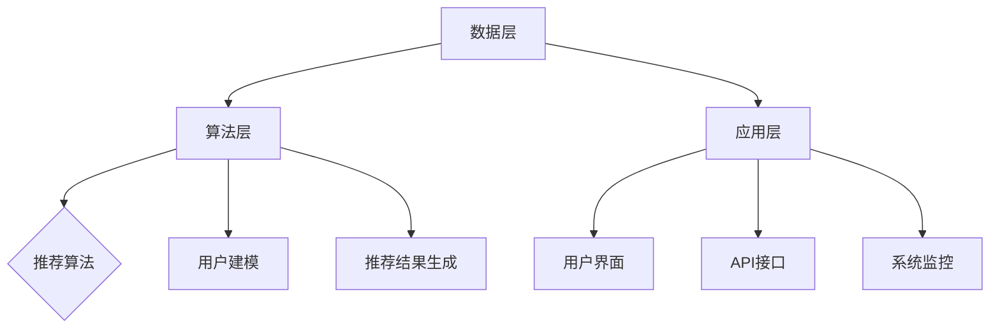
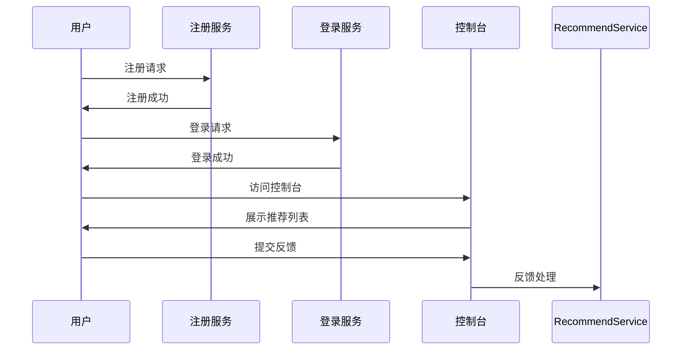

                 

### 引言

在现代旅游行业中，个性化旅游推荐系统已成为提升用户满意度、增强客户黏性的关键工具。随着大数据和人工智能技术的迅猛发展，旅游推荐系统从传统的规则驱动模式逐步转向了基于人工智能的智能推荐模式。AI驱动的个性化旅游推荐系统能够根据用户的兴趣、行为和历史数据，提供高度定制化的旅游建议，从而大大提升了用户体验。

本篇文章旨在深入探讨AI驱动的个性化旅游推荐系统的设计、实现和优化。我们将分步骤详细分析该系统的各个关键组成部分，包括背景介绍、核心概念与原理、算法原理与实现、实战案例与项目以及总结与展望。

文章的结构安排如下：

- **第一部分：AI与个性化旅游推荐系统概述**：介绍AI和个性化旅游推荐系统的背景、意义、系统边界与核心要素。
- **第二部分：核心概念与原理**：讲解人工智能基础知识、个性化推荐系统原理、个性化旅游推荐系统框架、旅游数据采集与处理、旅游兴趣挖掘与特征提取。
- **第三部分：算法原理与实现**：介绍机器学习算法在个性化推荐中的应用、基于深度学习的个性化推荐算法、协同过滤算法、个性化推荐系统的评价指标与优化。
- **第四部分：实战案例与项目**：通过具体项目构建，展示个性化旅游推荐系统的实现过程、核心模块实现、性能优化以及案例剖析。
- **第五部分：总结与展望**：探讨个性化旅游推荐系统的发展趋势、最佳实践与未来展望，并推荐拓展阅读资源。

本文将采用**“让我们一步一步思考（Let's Think Step by Step）”**的方式，系统地剖析AI驱动的个性化旅游推荐系统的构建过程，希望能为从事该领域的技术人员提供有价值的参考和启示。通过这篇技术博客，读者将了解到如何利用先进的人工智能技术，打造出既实用又高效的个性化旅游推荐系统。

---

### 关键词

- 人工智能
- 个性化推荐系统
- 旅游数据
- 机器学习
- 深度学习
- 协同过滤算法
- 特征提取
- 系统优化

### 摘要

本文深入探讨了AI驱动的个性化旅游推荐系统的构建。首先，我们介绍了该系统的背景、意义和核心要素。随后，我们详细讲解了人工智能基础知识、个性化推荐系统原理以及个性化旅游推荐系统框架。接着，文章聚焦于机器学习算法、深度学习和协同过滤算法在个性化推荐中的应用和实现。随后，通过实战案例展示了系统的实现过程、核心模块实现和性能优化。最后，文章对个性化旅游推荐系统的发展趋势进行了展望，并提供了最佳实践和拓展阅读建议。本文旨在为从事该领域的技术人员提供全面的技术指南和实用参考。

---

### 目录大纲

**第一部分: AI与个性化旅游推荐系统概述**

1. [AI与个性化旅游推荐系统概述](#ai与个性化旅游推荐系统概述)
   1.1 问题背景与挑战
   1.2 个性化旅游推荐系统的意义
   1.3 系统边界与外延
   1.4 核心概念结构与要素

**第二部分: 核心概念与原理**

2. [人工智能基础知识](#人工智能基础知识)
   2.1 人工智能的定义与历史
   2.2 机器学习的概念与分类
   2.3 深度学习的原理与应用

3. [个性化推荐系统原理](#个性化推荐系统原理)
   3.1 个性化推荐系统概述
   3.2 个性化推荐系统的工作流程
   3.3 个性化推荐系统的关键要素

4. [个性化旅游推荐系统框架](#个性化旅游推荐系统框架)
   4.1 旅游数据采集与预处理
   4.2 旅游兴趣挖掘与特征提取
   4.3 推荐算法与模型选择

5. [旅游数据采集与处理](#旅游数据采集与处理)
   5.1 旅游数据来源
   5.2 数据采集方法
   5.3 数据预处理技术

6. [旅游兴趣挖掘与特征提取](#旅游兴趣挖掘与特征提取)
   6.1 旅游兴趣挖掘方法
   6.2 旅游数据特征提取
   6.3 特征选择与降维

**第三部分: 算法原理与实现**

7. [机器学习算法在个性化推荐中的应用](#机器学习算法在个性化推荐中的应用)
   7.1 机器学习算法概述
   7.2 协同过滤算法
   7.3 个性化推荐算法

8. [基于深度学习的个性化推荐算法](#基于深度学习的个性化推荐算法)
   8.1 卷积神经网络（CNN）
   8.2 递归神经网络（RNN）
   8.3 长短时记忆网络（LSTM）

9. [旅游推荐系统中的协同过滤算法](#旅游推荐系统中的协同过滤算法)
   9.1 用户基于协同过滤
   9.2 项目基于协同过滤
   9.3 混合协同过滤算法

10. [个性化推荐系统的评价指标与优化](#个性化推荐系统的评价指标与优化)
   10.1 推荐准确率
   10.2 推荐覆盖率
   10.3 推荐新颖性

**第四部分：实战案例与项目**

11. [AI驱动的个性化旅游推荐系统项目构建](#ai驱动的个性化旅游推荐系统项目构建)
   11.1 项目介绍
   11.2 系统功能设计
   11.3 系统架构设计
   11.4 系统接口设计

12. [个性化旅游推荐系统核心模块实现](#个性化旅游推荐系统核心模块实现)
   12.1 数据采集模块
   12.2 特征提取模块
   12.3 推荐算法模块

13. [个性化旅游推荐系统性能优化](#个性化旅游推荐系统性能优化)
   13.1 模型优化
   13.2 系统性能评估
   13.3 性能调优策略

14. [个性化旅游推荐系统案例剖析](#个性化旅游推荐系统案例剖析)
   14.1 案例背景
   14.2 案例实施步骤
   14.3 案例效果评估

**第五部分：总结与展望**

15. [个性化旅游推荐系统的发展趋势](#个性化旅游推荐系统的发展趋势)
   15.1 新技术应用
   15.2 行业发展前景

16. [最佳实践与拓展阅读](#最佳实践与拓展阅读)
   16.1 最佳实践策略
   16.2 拓展阅读资源

---

### 第一部分: AI与个性化旅游推荐系统概述

#### 1.1 问题背景与挑战

在快速发展的旅游业中，个性化旅游推荐系统成为了一项重要的技术革新。随着互联网的普及和移动设备的广泛应用，用户对旅游信息的获取方式发生了根本性变化。传统的旅游推荐方式主要依赖于用户的历史数据和预定义的规则，这种模式往往难以满足用户日益多样化的需求。以下是目前旅游推荐系统中面临的主要挑战：

1. **个性化不足**：传统的推荐系统通常缺乏对用户兴趣和需求的深入理解，导致推荐结果缺乏个性化和针对性。
   
2. **数据质量**：旅游数据的质量参差不齐，数据缺失、噪声和冗余等问题严重影响推荐系统的准确性和可靠性。

3. **实时性**：用户在旅游过程中的需求是动态变化的，如何实现实时、动态的推荐成为一大难题。

4. **多样性**：用户希望获得多样化的旅游推荐，而非单一的、重复的推荐结果。

5. **可扩展性**：随着用户规模和数据量的不断增长，推荐系统需要具备良好的可扩展性，以应对大数据时代的挑战。

为了解决上述问题，AI驱动的个性化旅游推荐系统应运而生。这种系统通过利用机器学习、深度学习等人工智能技术，能够自动从用户数据中学习并提取有用的信息，从而实现高度个性化的推荐。具体来说，AI驱动的推荐系统具有以下优势：

- **高个性化**：系统能够根据用户的兴趣和行为数据，自动生成个性化的推荐。
- **高实时性**：系统利用实时数据处理技术，能够快速响应用户需求，提供即时的推荐。
- **高多样性**：系统能够根据用户的历史数据和实时行为，生成多样化的推荐结果。
- **高可扩展性**：系统设计采用模块化架构，能够灵活扩展和更新，适应不断变化的需求。

总之，AI驱动的个性化旅游推荐系统不仅能够解决传统推荐系统中的个性化不足、数据质量、实时性和多样性等问题，还能够提高系统的可扩展性和用户体验。这使得它在现代旅游业中具有广泛的应用前景。

#### 1.2 个性化旅游推荐系统的意义

个性化旅游推荐系统在旅游业中具有重要的战略意义，主要体现在以下几个方面：

1. **提升用户体验**：通过深入了解用户的需求和兴趣，个性化推荐系统能够为用户推荐符合其个性化偏好的旅游内容，从而提高用户满意度和忠诚度。这种个性化服务能够使用户在浏览和选择旅游信息时更加轻松和愉悦，从而提升整体旅游体验。

2. **增加客户黏性**：个性化推荐系统能够通过持续提供符合用户兴趣和需求的内容，增加用户与旅游平台之间的互动，提高用户在平台上的停留时间和活跃度。这种高黏性的用户群体有助于旅游平台建立强大的客户基础，实现长期稳定的发展。

3. **优化资源分配**：个性化推荐系统有助于旅游企业更精准地了解用户需求，从而优化资源的分配和利用。例如，旅游企业可以根据推荐结果调整营销策略、优化产品和服务，实现资源的最优化配置，提高运营效率。

4. **提高收益**：个性化推荐系统能够通过提高用户满意度和忠诚度，促进用户消费行为的增加。同时，通过推荐高收益的产品和服务，旅游企业能够实现更高的收益和利润。例如，推荐系统可以根据用户的消费历史和偏好，推荐高利润的旅游套餐和附加服务，从而提升整体收益。

5. **增强竞争优势**：在竞争激烈的旅游市场中，个性化旅游推荐系统成为旅游企业的重要竞争优势。通过提供独特的、个性化的服务，旅游企业能够吸引更多的用户，提高市场份额。同时，个性化推荐系统的技术优势和创新能力，有助于旅游企业保持市场领先地位。

6. **数据驱动决策**：个性化旅游推荐系统为旅游企业提供了大量的用户行为数据和分析结果，有助于企业更好地理解市场和用户需求，从而实现数据驱动的决策。例如，通过分析推荐系统中的用户行为数据，旅游企业可以识别出潜在的市场机会、优化产品策略和营销策略。

总之，个性化旅游推荐系统不仅在提升用户体验、增加客户黏性和优化资源分配等方面具有显著作用，还能够提高旅游企业的收益、增强竞争优势和实现数据驱动决策。这使得个性化旅游推荐系统在当今旅游行业中具有重要的战略意义和广阔的应用前景。

#### 1.3 系统边界与外延

个性化旅游推荐系统的边界与外延是其功能实现和优化的重要基础。首先，从系统的边界来看，个性化旅游推荐系统主要涉及以下几方面：

1. **用户数据收集**：系统需要收集用户的浏览记录、搜索历史、消费行为等数据，以构建用户兴趣和行为模型。
2. **旅游数据整合**：系统需要整合旅游行业的相关数据，包括景点信息、旅游产品信息、用户评论等，为推荐算法提供丰富的数据源。
3. **推荐算法实现**：系统需要实现多种推荐算法，包括基于内容的推荐、协同过滤推荐和基于深度学习的推荐等，以生成个性化的旅游推荐结果。
4. **推荐结果展示**：系统需要将推荐结果以直观、友好的方式展示给用户，包括推荐列表、推荐详情页等。

从系统的外延来看，个性化旅游推荐系统还涉及以下方面：

1. **用户交互**：系统需要提供与用户的实时交互功能，包括用户反馈、用户评价等，以不断优化推荐结果。
2. **数据更新与维护**：系统需要定期更新用户数据、旅游数据和推荐算法，以保持系统的实时性和准确性。
3. **性能优化与监控**：系统需要实现性能优化和监控，确保系统在高并发、大数据量环境下的稳定运行。

具体来说，个性化旅游推荐系统的核心组成部分包括：

1. **用户画像构建**：通过分析用户数据，构建用户兴趣和行为画像，为个性化推荐提供基础。
2. **推荐算法实现**：包括基于内容的推荐算法、基于协同过滤的推荐算法和基于深度学习的推荐算法等，每种算法都有其独特的优势和适用场景。
3. **推荐结果生成**：根据用户画像和推荐算法，生成个性化的旅游推荐结果，并展示给用户。
4. **用户反馈机制**：通过用户反馈机制，不断调整和优化推荐结果，提高系统的推荐质量。

个性化旅游推荐系统的整体架构可以概括为数据层、算法层和应用层。数据层主要负责数据收集、存储和管理；算法层实现多种推荐算法，生成推荐结果；应用层提供用户交互接口和推荐结果展示。这三个层次相互关联，共同构成了一个高效、智能的个性化旅游推荐系统。

总之，个性化旅游推荐系统的边界与外延决定了其功能实现和性能优化，通过合理的设计和优化，系统能够在提高用户体验和业务收益方面发挥重要作用。

### 1.4 核心概念结构与要素

个性化旅游推荐系统涉及多个核心概念与结构，这些概念与结构构成了系统的基础框架，并直接影响推荐效果和用户体验。以下是这些核心概念及其关系的详细描述：

#### 1.4.1 用户画像

用户画像是指通过收集和分析用户的浏览记录、搜索历史、消费行为等多维度数据，构建出用户的个性化特征和行为模型。用户画像的核心要素包括用户兴趣、行为习惯、偏好等，这些信息有助于推荐系统精准识别用户需求。

- **用户兴趣**：用户在浏览、搜索和购买过程中的兴趣点，例如偏好哪些类型的旅游景点、美食、活动等。
- **行为习惯**：用户的日常行为模式，如浏览时间、频次、搜索关键词等。
- **偏好**：用户的个性化偏好，如喜欢什么样的旅游风格、消费水平等。

#### 1.4.2 旅游数据

旅游数据是个性化旅游推荐系统的关键数据源，包括景点信息、旅游产品信息、用户评论、价格数据等。这些数据经过整合和处理，为推荐算法提供了丰富的信息支持。

- **景点信息**：包括景点的地理位置、开放时间、门票价格等基本信息。
- **旅游产品信息**：如旅游套餐、门票、酒店等产品的详细描述和价格信息。
- **用户评论**：用户对旅游景点、旅游产品的评价和反馈，这些评论能够反映用户对旅游体验的真实感受。
- **价格数据**：不同时间段、不同渠道的旅游产品价格，帮助系统进行价格分析和推荐。

#### 1.4.3 推荐算法

推荐算法是个性化旅游推荐系统的核心，用于生成个性化的推荐结果。常见的推荐算法包括基于内容的推荐、协同过滤推荐和基于深度学习的推荐等。

- **基于内容的推荐**：通过分析用户兴趣和旅游内容的相关性，推荐与用户兴趣相关的旅游景点或产品。
- **协同过滤推荐**：通过分析用户之间的相似性，推荐其他用户喜欢的旅游景点或产品。
- **基于深度学习的推荐**：利用深度学习模型，从用户数据中学习复杂的特征和模式，生成个性化的推荐结果。

#### 1.4.4 推荐结果展示

推荐结果展示是将推荐算法生成的推荐结果以直观、友好的方式展示给用户。推荐结果展示的核心要素包括推荐列表、推荐详情页、用户反馈机制等。

- **推荐列表**：展示系统推荐的旅游景点或产品列表，通常包括推荐理由、评分、价格等详细信息。
- **推荐详情页**：为每个推荐的旅游景点或产品提供详细的页面展示，包括景点介绍、用户评论、相关图片和视频等。
- **用户反馈机制**：提供用户对推荐结果的反馈途径，包括点赞、评论、评分等，帮助系统不断优化推荐效果。

#### 1.4.5 数据处理与存储

数据处理与存储是个性化旅游推荐系统的基础，涉及数据收集、存储、处理和分析等多个环节。

- **数据收集**：从多个渠道收集用户数据、旅游数据等，确保数据的全面性和实时性。
- **数据存储**：将收集到的数据存储在数据库中，保证数据的持久性和安全性。
- **数据处理**：对收集到的数据进行分析和处理，提取有用的特征和模式，为推荐算法提供支持。

#### 1.4.6 系统架构

个性化旅游推荐系统的架构设计是其实现高效、稳定运行的关键。系统架构通常包括数据层、算法层和应用层。

- **数据层**：负责数据收集、存储和管理，为算法层提供数据支持。
- **算法层**：实现各种推荐算法，生成个性化推荐结果。
- **应用层**：提供用户交互接口和推荐结果展示，实现用户与系统的互动。

通过上述核心概念和结构的设计与实现，个性化旅游推荐系统能够高效地收集用户数据、分析处理数据，并生成高质量的推荐结果，从而提升用户体验和系统性能。

### 第二部分: 核心概念与原理

#### 2.1 人工智能基础知识

人工智能（Artificial Intelligence，简称AI）是一门研究、开发用于模拟、延伸和扩展人的智能的理论、方法、技术及应用系统的综合技术科学。其目标是让计算机能够执行复杂的任务，如理解语言、识别图像、自主决策等。人工智能技术已经广泛应用于多个领域，包括医疗、金融、零售、交通等，极大地改变了人们的生活方式和工作方式。

#### 2.1.1 人工智能的定义与历史

**定义**：人工智能是指通过计算机模拟、扩展和增强人类智能的技术和系统。它不仅包括机器学习、深度学习等核心技术，还涵盖自然语言处理、计算机视觉、智能控制等多个子领域。

**历史**：人工智能的研究始于20世纪50年代，当时科学家们提出了“人工智能”的概念，并开始尝试开发能够模拟人类智能的计算机程序。早期的人工智能研究主要集中在规则推理和符号计算上，但由于数据量有限和计算能力的限制，这些方法在实际应用中遇到了很大困难。随着计算技术的进步和数据量的爆炸式增长，人工智能在20世纪90年代迎来了新的发展机遇，尤其是在机器学习和深度学习领域取得了重大突破。

#### 2.1.2 机器学习的概念与分类

**机器学习（Machine Learning，简称ML）**：机器学习是人工智能的一个子领域，它关注于通过数据和算法让计算机自动从数据中学习规律和模式。机器学习可以分为监督学习、无监督学习和强化学习三种主要类型。

- **监督学习（Supervised Learning）**：监督学习是一种通过已标记的数据集来训练模型的方法。常见的算法包括线性回归、决策树、支持向量机（SVM）等。
- **无监督学习（Unsupervised Learning）**：无监督学习不需要标记的数据集，其目标是发现数据中的内在结构和模式。常见的算法包括聚类、降维、关联规则挖掘等。
- **强化学习（Reinforcement Learning）**：强化学习是一种通过与环境交互来学习策略的方法。常见的算法包括Q-learning、深度确定性策略梯度（DDPG）等。

#### 2.1.3 深度学习的原理与应用

**深度学习（Deep Learning，简称DL）**：深度学习是一种基于多层神经网络（Neural Network）的学习方法，通过多层非线性变换来提取数据的特征表示。深度学习在图像识别、语音识别、自然语言处理等领域取得了显著成果。

- **原理**：深度学习的基本单元是神经元，这些神经元通过前向传播和反向传播算法，逐层学习数据的特征表示。常见的深度学习模型包括卷积神经网络（CNN）、递归神经网络（RNN）和长短时记忆网络（LSTM）等。
- **应用**：深度学习在旅游推荐系统中有着广泛的应用。例如，通过卷积神经网络可以提取旅游景点的图像特征，通过递归神经网络可以处理用户的序列行为数据，从而实现更加精准的个性化推荐。

#### 2.2 个性化推荐系统原理

个性化推荐系统是一种基于用户兴趣和行为数据的推荐系统，旨在向用户提供与其兴趣相符的信息或产品。个性化推荐系统广泛应用于电子商务、社交媒体、新闻推荐等多个领域，极大地提升了用户体验和业务收益。

**2.2.1 个性化推荐系统概述**

个性化推荐系统主要通过以下三个步骤来工作：

1. **用户建模**：收集用户的兴趣和行为数据，构建用户兴趣模型。这些数据包括用户的浏览历史、搜索记录、点击行为、购买行为等。
2. **物品建模**：对推荐系统中的物品进行特征提取，构建物品特征模型。这些物品包括新闻、产品、音乐、电影等。
3. **推荐生成**：根据用户兴趣模型和物品特征模型，使用推荐算法生成个性化的推荐结果。

**2.2.2 个性化推荐系统的工作流程**

个性化推荐系统的工作流程通常包括以下几个步骤：

1. **数据收集**：收集用户和物品的相关数据，包括用户行为数据、物品属性数据、用户-物品交互数据等。
2. **数据预处理**：对收集到的数据进行清洗、去重、归一化等预处理操作，提高数据质量。
3. **特征工程**：从原始数据中提取有用的特征，用于构建用户和物品的模型。
4. **模型训练**：使用机器学习算法对用户和物品模型进行训练，生成预测模型。
5. **推荐生成**：根据用户-物品交互数据和使用预测模型，生成个性化的推荐结果。
6. **推荐反馈**：收集用户对推荐结果的反馈，用于优化推荐算法和模型。

**2.2.3 个性化推荐系统的关键要素**

个性化推荐系统的关键要素包括以下几个方面：

1. **用户兴趣模型**：通过分析用户的浏览历史、点击行为等，构建用户兴趣模型，用于预测用户对物品的兴趣。
2. **物品特征模型**：通过分析物品的属性、类别、标签等，构建物品特征模型，用于描述物品的特点。
3. **推荐算法**：选择合适的推荐算法，如基于内容的推荐、协同过滤推荐、基于深度学习的推荐等，以生成高质量的推荐结果。
4. **推荐结果评估**：使用评估指标（如准确率、覆盖率、新颖性等）来评估推荐系统的效果，并根据评估结果优化推荐算法和模型。

通过上述步骤和要素，个性化推荐系统能够为用户生成高度个性化的推荐结果，从而提升用户体验和系统价值。

#### 2.3 个性化旅游推荐系统框架

个性化旅游推荐系统旨在通过分析用户行为和旅游数据，为用户提供个性化的旅游推荐。该系统的构建涉及多个环节，包括数据采集与预处理、旅游兴趣挖掘与特征提取、推荐算法的选择与实现等。以下是对个性化旅游推荐系统框架的详细描述。

**2.3.1 旅游数据采集与预处理**

旅游数据采集是个性化旅游推荐系统的基础。系统需要从多个渠道收集数据，包括用户行为数据（如浏览记录、搜索历史、点击行为等）、旅游产品信息（如景点、酒店、旅游套餐等）、用户评价数据（如对景点、酒店、旅游产品的评分和评论等）。

数据采集后，需要进行预处理，以提高数据质量和系统的性能。预处理步骤包括数据清洗、数据去重、数据归一化等。数据清洗旨在去除无效数据、缺失数据和异常数据，确保数据的一致性和完整性。数据去重则用于删除重复的数据记录，避免重复计算和推荐。数据归一化将不同数据类型和量级的数据统一处理，便于后续分析和建模。

**2.3.2 旅游兴趣挖掘与特征提取**

在旅游数据预处理完成后，系统需要挖掘用户的旅游兴趣并提取相关的特征。旅游兴趣挖掘通常包括以下步骤：

1. **用户兴趣识别**：通过分析用户的浏览记录、搜索历史和购买行为等，识别用户的兴趣点。例如，用户可能对历史文化景点、自然风光、户外活动等有不同的兴趣。

2. **兴趣标签生成**：根据识别出的用户兴趣点，生成相应的兴趣标签。兴趣标签可以是具体的景点类型、活动类型、主题等，用于描述用户的个性化需求。

3. **特征提取**：从用户行为数据、旅游产品数据和用户评价数据中提取有用的特征，构建用户和旅游产品的特征模型。用户特征包括浏览时长、点击次数、搜索关键词等；旅游产品特征包括景点类型、设施、价格、用户评分等。

特征提取的方法包括统计方法、文本分析方法和机器学习方法等。统计方法如统计相关性和因子分析，可以帮助提取用户和旅游产品之间的相关性；文本分析方法如TF-IDF和词嵌入，可以用于处理文本数据，提取关键词和信息；机器学习方法如聚类和降维，可以帮助识别用户和产品的潜在特征。

**2.3.3 推荐算法与模型选择**

在提取用户兴趣和旅游产品特征后，系统需要选择合适的推荐算法，生成个性化的旅游推荐结果。常见的推荐算法包括基于内容的推荐、协同过滤推荐和基于深度学习的推荐等。

1. **基于内容的推荐（Content-based Recommendation）**：基于内容的推荐通过分析用户的历史行为和旅游产品特征，推荐与用户兴趣相符的旅游产品。该方法主要依赖于文本分析技术，如TF-IDF和词嵌入，用于提取旅游产品的关键词和信息。

2. **协同过滤推荐（Collaborative Filtering）**：协同过滤推荐通过分析用户之间的相似性和用户-物品的评分数据，推荐其他用户喜欢的旅游产品。协同过滤分为用户基于协同过滤（User-based Collaborative Filtering）和项目基于协同过滤（Item-based Collaborative Filtering）。用户基于协同过滤通过计算用户之间的相似度，推荐与相似用户喜欢的旅游产品；项目基于协同过滤通过计算旅游产品之间的相似度，推荐与用户已评价产品相似的旅游产品。

3. **基于深度学习的推荐（Deep Learning-based Recommendation）**：基于深度学习的推荐利用深度神经网络模型，从用户数据中自动提取复杂特征和模式。常见的深度学习模型包括卷积神经网络（CNN）、递归神经网络（RNN）和长短时记忆网络（LSTM）等。深度学习推荐能够处理高维数据和复杂数据关系，生成更加精准的个性化推荐结果。

在推荐算法的选择上，可以根据系统的需求和数据特点进行权衡。例如，在数据量较小、用户行为数据丰富的情况下，基于内容的推荐效果较好；在数据量较大、用户行为数据较少的情况下，协同过滤推荐效果更佳；在处理高维数据和复杂数据关系时，深度学习推荐表现优异。

**2.3.4 推荐结果生成与展示**

在生成推荐结果后，系统需要将推荐结果以直观、友好的方式展示给用户。推荐结果的展示形式包括推荐列表、推荐详情页、用户反馈界面等。

1. **推荐列表**：展示推荐结果的基本列表，包括推荐理由、评分、价格等信息，使用户能够快速浏览和筛选。

2. **推荐详情页**：为每个推荐的旅游产品提供详细的页面展示，包括产品描述、用户评论、图片和视频等，使用户能够深入了解推荐内容。

3. **用户反馈界面**：提供用户对推荐结果的反馈途径，包括点赞、评论、评分等，帮助系统收集用户反馈，优化推荐效果。

通过上述步骤和模块，个性化旅游推荐系统能够高效、精准地为用户提供个性化的旅游推荐，从而提升用户体验和系统价值。

### 2.4 旅游数据采集与处理

旅游数据采集与处理是构建个性化旅游推荐系统的关键环节。在这一部分，我们将详细探讨旅游数据的主要来源、数据采集方法以及数据预处理技术。

#### 2.4.1 旅游数据来源

旅游数据来源多样，主要包括以下几个方面：

1. **用户行为数据**：用户在旅游网站、APP或其他平台上的行为数据，如浏览记录、搜索历史、点击次数、评论等。这些数据可以帮助系统了解用户的兴趣和行为模式，从而进行个性化推荐。
   
2. **旅游产品信息**：包括景点、酒店、旅游套餐等旅游产品的详细信息，如地理位置、设施、价格、用户评分等。这些数据提供了丰富的推荐素材，有助于构建个性化的推荐结果。

3. **用户评价数据**：用户对旅游产品、景点和酒店的评价和反馈，如评分、评论、建议等。这些数据反映了用户对旅游体验的真实感受，对于改进推荐系统和优化旅游产品具有重要意义。

4. **第三方数据源**：来自政府、旅游行业协会、气象部门等第三方机构的公开数据，如天气信息、交通状况、旅游景点介绍等。这些数据可以为推荐系统提供额外的信息支持，提高推荐的准确性和多样性。

#### 2.4.2 数据采集方法

数据采集的方法主要包括以下几种：

1. **API接口**：通过调用旅游平台、酒店预订网站、地图服务提供商等提供的API接口，获取用户行为数据、旅游产品信息和用户评价数据。

2. **爬虫技术**：利用爬虫程序从互联网上抓取旅游相关的信息，如景点介绍、用户评论等。这种方法适用于获取大量公开数据，但需要处理网页结构和数据格式的问题。

3. **问卷调查**：通过在线问卷调查收集用户对旅游产品的偏好和评价，获取用户主观感受的数据。这种方法可以获得较为详细和深入的用户信息，但样本量和数据质量可能受到一定限制。

4. **物联网设备**：利用物联网设备（如智能手表、手机GPS等）收集用户在旅游过程中的位置信息、行为数据等。这种方法适用于实时获取用户的动态数据，但需要处理隐私保护问题。

5. **传感器数据**：利用各种传感器（如气象传感器、交通流量传感器等）收集与旅游相关的环境数据，如天气状况、交通拥堵情况等。这些数据可以为推荐系统提供额外的信息支持。

#### 2.4.3 数据预处理技术

在数据采集后，需要进行一系列预处理操作，以提高数据质量和系统的性能。主要的数据预处理技术包括：

1. **数据清洗**：数据清洗是数据预处理的重要步骤，旨在去除无效数据、缺失数据和异常数据。具体方法包括：
   - 删除重复数据：避免重复计算和推荐。
   - 填补缺失数据：利用统计方法或插值法填补缺失值。
   - 去除异常数据：识别并去除明显的异常数据点。

2. **数据去重**：通过比对数据记录的唯一标识（如用户ID、产品ID等），删除重复的数据记录，确保数据的一致性和完整性。

3. **数据归一化**：将不同数据类型和量级的数据进行统一处理，使其在相同的尺度上进行分析和建模。常用的归一化方法包括最小-最大归一化、Z-Score归一化等。

4. **特征提取**：从原始数据中提取有用的特征，用于构建用户和旅游产品的特征模型。特征提取的方法包括：
   - 统计特征：计算数据的统计指标，如平均值、标准差、方差等。
   - 文本特征：利用文本分析技术，提取关键词和信息，如TF-IDF、词嵌入等。
   - 时空特征：提取与时间和空间相关的特征，如用户地理位置、时间戳等。

5. **数据降维**：通过降维技术，减少数据的高维空间，提高计算效率和模型性能。常用的降维方法包括主成分分析（PCA）、线性判别分析（LDA）等。

通过上述数据预处理技术，可以有效提高旅游数据的质量和系统的性能，为后续的推荐算法和模型训练提供可靠的数据基础。

### 2.5 旅游兴趣挖掘与特征提取

在个性化旅游推荐系统中，挖掘用户的旅游兴趣并提取相关特征是关键环节，这些特征将直接影响推荐结果的准确性和个性化程度。以下是对旅游兴趣挖掘方法、旅游数据特征提取以及特征选择与降维的详细探讨。

#### 2.5.1 旅游兴趣挖掘方法

旅游兴趣挖掘是指从用户的旅游行为数据中识别出用户的兴趣点，从而为个性化推荐提供依据。常用的旅游兴趣挖掘方法包括以下几种：

1. **基于内容的特征提取**：这种方法通过分析用户的浏览记录、搜索历史等行为数据，识别出用户对特定类型旅游内容的偏好。具体步骤如下：
   - 用户行为数据预处理：对用户的浏览记录、搜索历史等进行去重、去噪等预处理操作。
   - 文本特征提取：利用自然语言处理技术，如词频（TF）、逆文档频率（IDF）等，提取用户行为数据中的关键词和主题。
   - 特征聚合：对提取出的关键词和主题进行聚合，形成用户兴趣标签。

2. **基于关联规则的挖掘**：关联规则挖掘是一种基于数据集的分析方法，用于发现数据之间的关联关系。在旅游兴趣挖掘中，可以使用关联规则挖掘来发现用户行为数据中的潜在关联。例如，用户经常一起浏览的景点类型、活动等。具体步骤如下：
   - 数据预处理：对用户行为数据进行归一化处理，确保数据的一致性和可比性。
   - 关联规则挖掘算法：使用Apriori算法、FP-Growth算法等，发现用户行为数据中的频繁项集和关联规则。
   - 结果分析：对挖掘出的关联规则进行分析，识别出用户的旅游兴趣点。

3. **基于聚类的方法**：聚类算法可以将相似的用户行为数据分为不同的群体，每个群体代表一类旅游兴趣。常用的聚类算法包括K-means、DBSCAN等。具体步骤如下：
   - 数据预处理：对用户行为数据进行特征提取和归一化处理。
   - 聚类算法：使用K-means、DBSCAN等算法，对用户行为数据进行聚类分析。
   - 聚类结果分析：分析不同聚类结果，识别出用户的旅游兴趣点。

4. **基于深度学习的兴趣挖掘**：深度学习模型能够自动从大量用户行为数据中学习复杂的特征和模式，从而发现用户的旅游兴趣。常用的深度学习模型包括卷积神经网络（CNN）、递归神经网络（RNN）和长短时记忆网络（LSTM）等。具体步骤如下：
   - 数据预处理：对用户行为数据进行清洗、归一化等预处理操作。
   - 模型训练：使用用户行为数据训练深度学习模型，提取用户兴趣特征。
   - 特征提取：对训练好的模型进行特征提取，形成用户兴趣标签。

#### 2.5.2 旅游数据特征提取

旅游数据特征提取是指从原始旅游数据中提取出对个性化推荐有用的特征。旅游数据包括用户行为数据、旅游产品数据和用户评价数据等，以下是对这些数据的特征提取方法：

1. **用户行为数据特征提取**：
   - **浏览记录**：提取用户的浏览时长、浏览频次、浏览的景点类型等特征。
   - **搜索历史**：提取用户的搜索关键词、搜索频次、搜索的景点类型等特征。
   - **点击行为**：提取用户的点击时长、点击频次、点击的景点类型等特征。

2. **旅游产品数据特征提取**：
   - **景点信息**：提取景点的地理位置、开放时间、门票价格、景点类型等特征。
   - **酒店信息**：提取酒店的位置、价格、设施、用户评分等特征。
   - **旅游套餐信息**：提取旅游套餐的行程、景点、价格、用户评分等特征。

3. **用户评价数据特征提取**：
   - **用户评分**：提取用户对旅游产品、景点和酒店的评分。
   - **用户评论**：提取用户对旅游产品、景点和酒店的评论内容，使用自然语言处理技术提取关键词和情感特征。

#### 2.5.3 特征选择与降维

在特征提取后，通常会有大量特征，这些特征中可能存在冗余和噪声，对推荐效果产生不利影响。因此，需要进行特征选择与降维，以提高推荐系统的效率和性能。常用的特征选择与降维方法包括：

1. **特征选择**：
   - **基于信息增益的方法**：选择对目标变量（如用户兴趣）影响最大的特征，常用的方法包括信息增益、增益率等。
   - **基于过滤的方法**：通过计算特征与目标变量之间的相关性，筛选出相关性较高的特征。
   - **基于包裹的方法**：通过搜索所有特征子集，选择能够最好解释目标变量的特征组合。

2. **降维**：
   - **主成分分析（PCA）**：通过线性变换将高维数据映射到低维空间，保留主要数据信息，减少冗余。
   - **线性判别分析（LDA）**：在保留最大类间差异的前提下，进行特征降维。
   - **自动编码器（Autoencoder）**：利用深度学习模型自动学习数据的低维表示。

通过上述旅游兴趣挖掘方法、旅游数据特征提取以及特征选择与降维技术，个性化旅游推荐系统能够从大量旅游数据中提取出有用的特征，为生成高质量的个性化推荐提供支持。

### 2.6 机器学习算法在个性化推荐中的应用

在个性化推荐系统中，机器学习算法扮演着至关重要的角色，通过从大量数据中学习模式和关联，生成个性化的推荐结果。以下我们将详细介绍几种主要的机器学习算法，包括协同过滤算法和基于深度学习的推荐算法，并分析其在个性化旅游推荐系统中的应用。

#### 2.6.1 协同过滤算法

协同过滤算法（Collaborative Filtering，CF）是一种常用的推荐算法，通过分析用户之间的相似性或物品之间的相似性来生成推荐。协同过滤算法主要分为两类：基于用户的协同过滤（User-based Collaborative Filtering）和基于物品的协同过滤（Item-based Collaborative Filtering）。

1. **基于用户的协同过滤（User-based Collaborative Filtering）**：
   - **工作原理**：首先计算用户之间的相似度，然后找出与目标用户相似的其他用户，推荐这些相似用户喜欢的物品。
   - **相似度计算**：常用的相似度度量方法包括余弦相似度、皮尔逊相关系数等。
   - **推荐生成**：对每个物品，计算它与目标用户相似用户的平均评分，生成推荐列表。

2. **基于物品的协同过滤（Item-based Collaborative Filtering）**：
   - **工作原理**：首先计算物品之间的相似度，然后找出与目标物品相似的其他物品，推荐这些相似物品。
   - **相似度计算**：与基于用户相似度计算类似，常用的方法包括余弦相似度和Jaccard相似度。
   - **推荐生成**：对每个用户，计算他喜欢的物品与其他物品的相似度，生成推荐列表。

**优点**：
- **易于实现**：协同过滤算法的实现相对简单，易于理解和使用。
- **高效率**：对于稀疏数据集，协同过滤算法能够快速计算出推荐结果。
- **适用性广**：适用于用户行为数据丰富的场景，如电商、社交媒体、旅游推荐等。

**缺点**：
- **冷启动问题**：新用户或新物品缺乏历史数据，难以计算相似度。
- **数据稀疏**：由于用户和物品之间的交互数据往往较少，导致数据稀疏问题。
- **新颖性不足**：协同过滤算法容易生成重复的推荐结果，难以保证推荐的新颖性。

#### 2.6.2 基于深度学习的推荐算法

随着深度学习（Deep Learning，DL）技术的发展，基于深度学习的推荐算法逐渐成为研究热点。深度学习通过多层神经网络，能够自动从数据中提取复杂的特征和模式，从而生成高质量的推荐结果。

1. **卷积神经网络（Convolutional Neural Networks，CNN）**：
   - **工作原理**：CNN 通过卷积层、池化层和全连接层，从图像数据中提取特征。在推荐系统中，CNN 可以用于提取用户行为数据或物品描述数据的特征。
   - **应用场景**：例如，使用CNN提取用户浏览记录中的景点图片特征，或提取旅游产品的文本描述特征。

2. **递归神经网络（Recurrent Neural Networks，RNN）**：
   - **工作原理**：RNN 通过记忆单元，处理时间序列数据。在推荐系统中，RNN 可以用于处理用户的历史行为数据，捕捉用户行为的时序特征。
   - **应用场景**：例如，使用RNN处理用户连续的浏览记录，捕捉用户的兴趣变化。

3. **长短时记忆网络（Long Short-Term Memory，LSTM）**：
   - **工作原理**：LSTM 是一种特殊的RNN，通过引入门控机制，解决了传统RNN在处理长序列数据时的梯度消失和梯度爆炸问题。LSTM 在推荐系统中可以处理用户长期的历史行为数据。
   - **应用场景**：例如，使用LSTM处理用户的长期浏览记录，捕捉用户的长期兴趣。

4. **图卷积网络（Graph Convolutional Networks，GCN）**：
   - **工作原理**：GCN 通过图卷积操作，处理图数据。在推荐系统中，GCN 可以用于处理用户行为图或物品关系图，提取用户和物品之间的复杂关系。
   - **应用场景**：例如，使用GCN处理用户在社交网络中的互动关系，提取用户之间的社交特征。

**优点**：
- **特征提取能力强**：深度学习算法能够自动从数据中提取复杂的特征和模式，提高推荐结果的准确性。
- **适应性强**：深度学习算法可以处理高维、稀疏数据和复杂数据结构，具有较强的适应性。
- **多样性保证**：深度学习算法能够生成多样化的推荐结果，减少冷启动问题和数据稀疏问题。

**缺点**：
- **计算复杂度高**：深度学习算法需要大量的计算资源和时间，对硬件和算法优化要求较高。
- **数据依赖性强**：深度学习算法的性能很大程度上取决于数据质量和数量，需要大量的训练数据。

通过结合协同过滤算法和深度学习算法，个性化旅游推荐系统可以在处理用户行为数据和物品特征的同时，自动提取复杂的特征和模式，生成高质量的个性化推荐结果。这不仅提高了推荐系统的性能和准确性，还能够为用户带来更好的旅游体验。

### 2.7 基于深度学习的个性化推荐算法

深度学习在个性化推荐领域的应用日益广泛，由于其强大的特征提取和模式识别能力，基于深度学习的个性化推荐算法能够显著提升推荐系统的准确性和多样性。以下将详细介绍几种常见的基于深度学习的个性化推荐算法，包括卷积神经网络（CNN）、递归神经网络（RNN）和长短时记忆网络（LSTM），以及它们在旅游推荐中的应用。

#### 2.7.1 卷积神经网络（CNN）

卷积神经网络（Convolutional Neural Networks，CNN）最初是为了处理图像数据而设计的，但其在处理序列数据方面也表现出色。在个性化旅游推荐中，CNN 可以用于提取用户行为序列的特征。

1. **CNN的工作原理**：
   - **卷积层**：通过卷积操作提取图像或序列的局部特征。在CNN中，卷积核（filter）在输入数据上滑动，捕捉局部特征，如景点图片中的纹理、颜色等。
   - **池化层**：通过下采样操作减少数据维度，提高模型的泛化能力。常用的池化方法包括最大池化和平均池化。
   - **全连接层**：将卷积层和池化层提取的特征进行全局组合，生成最终输出。

2. **CNN在旅游推荐中的应用**：
   - **用户行为序列特征提取**：将用户的浏览记录、点击行为等转化为序列数据，使用CNN提取序列中的特征。例如，通过卷积层捕捉用户在浏览不同景点时的兴趣变化。
   - **旅游产品特征提取**：对旅游产品的描述文本（如景点介绍、酒店评价等）进行编码，输入CNN中提取文本特征，为推荐算法提供支持。

3. **优势**：
   - **强大的特征提取能力**：CNN 能够自动提取复杂的多维度特征，提高推荐系统的准确性。
   - **适用于图像和文本数据**：CNN 可以同时处理图像和文本数据，为推荐系统提供丰富的特征信息。

4. **局限**：
   - **计算复杂度高**：CNN 模型参数较多，训练过程需要大量计算资源。
   - **对数据质量要求高**：数据质量直接影响 CNN 的训练效果，需要高质量的数据集。

#### 2.7.2 递归神经网络（RNN）

递归神经网络（Recurrent Neural Networks，RNN）是一种处理序列数据的神经网络，其核心思想是利用内存来保存历史信息。RNN 在个性化旅游推荐中可以用于处理用户的历史行为数据，捕捉用户兴趣的动态变化。

1. **RNN的工作原理**：
   - **隐藏状态**：RNN 通过隐藏状态（hidden state）来存储序列中的信息，前一个时间步的输出作为当前时间步的输入。
   - **循环连接**：RNN 的循环连接导致其难以学习长距离依赖关系，即梯度消失问题。

2. **RNN在旅游推荐中的应用**：
   - **用户行为序列建模**：将用户的历史行为数据（如浏览记录、搜索历史等）输入 RNN，建模用户兴趣的变化。
   - **动态推荐**：根据用户的实时行为，动态调整推荐结果，提高推荐系统的实时性。

3. **优势**：
   - **处理序列数据**：RNN 能够处理任意长度的序列数据，适用于用户行为数据的建模。
   - **低计算复杂度**：与 CNN 相比，RNN 的计算复杂度较低。

4. **局限**：
   - **梯度消失问题**：RNN 难以学习长距离依赖关系，导致梯度消失问题。
   - **对数据量要求高**：需要大量数据来训练模型，以提高模型性能。

#### 2.7.3 长短时记忆网络（LSTM）

长短时记忆网络（Long Short-Term Memory，LSTM）是 RNN 的一种改进，通过引入门控机制（gate）解决了梯度消失问题，能够更好地捕捉长距离依赖关系。LSTM 在个性化旅游推荐中广泛应用于用户历史行为的建模。

1. **LSTM的工作原理**：
   - **门控机制**：LSTM 通过输入门、遗忘门和输出门控制信息的流入、保留和输出，有效地捕捉长距离依赖关系。
   - **细胞状态**：LSTM 的细胞状态（cell state）允许信息在时间步之间流动，避免了梯度消失问题。

2. **LSTM在旅游推荐中的应用**：
   - **用户历史行为建模**：将用户的历史行为数据（如浏览记录、搜索历史等）输入 LSTM，建模用户长期兴趣。
   - **长期推荐**：根据用户的长期兴趣和行为，生成长期的推荐结果。

3. **优势**：
   - **长距离依赖关系**：LSTM 能够捕捉长距离依赖关系，适用于处理长序列数据。
   - **稳定的训练**：通过门控机制，LSTM 在训练过程中更为稳定。

4. **局限**：
   - **计算复杂度高**：LSTM 的参数较多，训练过程需要大量计算资源。

#### 2.7.4 混合模型

为了充分发挥不同深度学习模型的优势，可以构建混合模型（Hybrid Model），将 CNN、RNN 和 LSTM 结合起来，共同处理用户行为数据和旅游产品特征。

1. **模型结构**：
   - **用户行为数据**：使用 LSTM 或 RNN 处理用户的历史行为数据，捕捉用户的兴趣变化。
   - **旅游产品特征**：使用 CNN 处理旅游产品的特征数据，提取丰富的特征信息。
   - **融合层**：将用户行为特征和旅游产品特征进行融合，使用全连接层或注意力机制进行加权融合。

2. **优势**：
   - **综合处理能力**：混合模型能够同时处理序列数据和图像数据，提高推荐系统的准确性。
   - **灵活调整**：通过调整不同模型的权重和参数，可以灵活调整推荐系统对用户行为和产品特征的关注度。

3. **局限**：
   - **计算复杂度高**：混合模型需要更多的计算资源和时间进行训练。

总之，基于深度学习的个性化推荐算法在旅游推荐中具有广泛的应用前景，能够生成高质量的个性化推荐结果。通过结合不同深度学习模型的优势，可以构建更强大的推荐系统，提高用户体验和系统性能。

### 2.8 旅游推荐系统中的协同过滤算法

协同过滤算法（Collaborative Filtering，CF）是旅游推荐系统中常用的推荐算法之一，其核心思想是通过分析用户之间的相似性或物品之间的相似性，来预测用户对未知物品的喜好。协同过滤算法主要分为用户基于协同过滤（User-based Collaborative Filtering）和物品基于协同过滤（Item-based Collaborative Filtering）。以下将详细阐述这两种协同过滤算法的工作原理、计算方法以及它们在旅游推荐系统中的应用。

#### 2.8.1 用户基于协同过滤（User-based Collaborative Filtering）

**工作原理**：

用户基于协同过滤算法通过计算用户之间的相似性，找出与目标用户相似的用户，并推荐这些相似用户喜欢的物品。具体步骤如下：

1. **计算用户相似度**：首先，计算目标用户和所有其他用户之间的相似度。常用的相似度计算方法包括余弦相似度、皮尔逊相关系数等。

   - **余弦相似度**：通过计算用户之间的夹角余弦值，衡量用户之间的相似度。公式如下：

     $$
     \text{similarity}(u, v) = \frac{\text{u\_vector} \cdot \text{v\_vector}}{||\text{u\_vector}|| \cdot ||\text{v\_vector}||}
     $$

   - **皮尔逊相关系数**：通过计算用户之间评分的协方差和标准差的比值，衡量用户之间的相似度。公式如下：

     $$
     \text{similarity}(u, v) = \frac{\text{cov}(r_u, r_v)}{\sigma_u \cdot \sigma_v}
     $$

2. **生成推荐列表**：对每个用户，计算与其相似的用户集合，然后根据这些用户对物品的评分，生成推荐列表。通常，推荐列表中的物品是根据用户相似度加权平均评分排序的。

   $$
   \text{predicted\_rating}(u, i) = \frac{\sum_{v \in \text{neighbors}(u)} \text{similarity}(u, v) \cdot \text{rating}(v, i)}{\sum_{v \in \text{neighbors}(u)} |\text{similarity}(u, v)|}
   $$

**应用**：

在旅游推荐系统中，用户基于协同过滤算法可以用于推荐用户可能感兴趣的旅游景点、酒店或旅游活动。例如，如果一个用户喜欢某个城市的历史景点，算法可以推荐其他对历史景点有相同兴趣的用户喜欢的旅游景点。

#### 2.8.2 物品基于协同过滤（Item-based Collaborative Filtering）

**工作原理**：

物品基于协同过滤算法通过计算物品之间的相似性，找出与目标物品相似的物品，并推荐这些相似物品给用户。具体步骤如下：

1. **计算物品相似度**：首先，计算物品之间的相似度。常用的相似度计算方法包括余弦相似度、Jaccard相似度等。

   - **余弦相似度**：通过计算物品之间的夹角余弦值，衡量物品之间的相似度。公式如下：

     $$
     \text{similarity}(i, j) = \frac{\text{i\_vector} \cdot \text{j\_vector}}{||\text{i\_vector}|| \cdot ||\text{j\_vector}||}
     $$

   - **Jaccard相似度**：通过计算物品之间共同用户和总用户数的比值，衡量物品之间的相似度。公式如下：

     $$
     \text{similarity}(i, j) = \frac{\text{common\_users}(i, j)}{\text{total\_users}(i) + \text{total\_users}(j) - \text{common\_users}(i, j)}
     $$

2. **生成推荐列表**：对每个用户，计算用户已评分的物品与其相似物品的集合，然后根据这些物品的评分，生成推荐列表。通常，推荐列表中的物品是根据物品相似度加权平均评分排序的。

   $$
   \text{predicted\_rating}(u, i) = \frac{\sum_{j \in \text{similar\_items}(i)} \text{rating}(u, j) \cdot \text{similarity}(i, j)}{\sum_{j \in \text{similar\_items}(i)} |\text{similarity}(i, j)|}
   $$

**应用**：

在旅游推荐系统中，物品基于协同过滤算法可以用于推荐用户可能感兴趣的旅游景点、酒店或旅游活动。例如，如果一个用户喜欢某个景点，算法可以推荐与该景点相似的景点给用户，从而提高推荐的准确性。

#### 2.8.3 混合协同过滤算法

**工作原理**：

混合协同过滤算法结合了用户基于协同过滤和物品基于协同过滤的优点，通过融合用户和物品的相似度，生成更准确的推荐结果。具体步骤如下：

1. **计算用户和物品相似度**：同时计算用户之间的相似度和物品之间的相似度，为每个用户和物品分配权重。

2. **融合相似度**：使用加权平均的方法，将用户和物品的相似度结合起来，生成综合相似度。

3. **生成推荐列表**：根据综合相似度，生成推荐列表。推荐列表中的物品是根据用户和物品的综合相似度加权平均评分排序的。

**应用**：

在旅游推荐系统中，混合协同过滤算法可以用于生成更准确的个性化推荐结果。例如，如果一个用户喜欢某个景点，算法不仅会推荐与该景点相似的其他景点，还会推荐与该用户相似的其他用户喜欢的景点，从而提高推荐的多样性。

通过上述协同过滤算法的应用，旅游推荐系统可以更好地满足用户的个性化需求，提高用户满意度和系统性能。

### 2.9 个性化推荐系统的评价指标与优化

个性化推荐系统性能的优劣直接关系到用户体验和业务效果。因此，对推荐系统进行科学的评价和优化至关重要。本文将详细讨论个性化推荐系统的几个关键评价指标，包括推荐准确率、推荐覆盖率和新颖性，并探讨如何通过模型优化、特征选择和算法改进来提升系统性能。

#### 2.9.1 推荐准确率

推荐准确率（Precision）是衡量推荐系统推荐结果质量的重要指标，表示推荐结果中实际感兴趣的物品与推荐总数之间的比率。推荐准确率越高，说明推荐系统越能够准确识别用户感兴趣的内容。

- **计算方法**：

  $$
  \text{Precision} = \frac{\text{相关物品数}}{\text{推荐物品总数}}
  $$

- **优化策略**：

  - **模型优化**：通过改进推荐算法，提高模型对用户兴趣的识别能力，从而提高推荐准确率。例如，使用深度学习模型自动提取用户和物品的复杂特征，提高推荐的准确性。
  - **特征选择**：选择与用户兴趣高度相关的特征，剔除冗余和不相关的特征，减少噪声对推荐结果的影响。

#### 2.9.2 推荐覆盖率

推荐覆盖率（Coverage）是指推荐系统中未被推荐过的物品占总物品数量的比率。高覆盖率意味着推荐系统能够覆盖更多的物品，为用户带来更多的选择。

- **计算方法**：

  $$
  \text{Coverage} = \frac{\text{未被推荐过的物品数}}{\text{总物品数} - \text{已推荐物品数}}
  $$

- **优化策略**：

  - **多样性策略**：在推荐结果中引入多样性策略，确保推荐结果中包含多种不同类型的物品，提高用户的选择范围。
  - **冷启动问题**：针对新用户或新物品的冷启动问题，可以采用混合推荐策略，结合基于内容的推荐和基于协同过滤的推荐，提高新用户和新物品的覆盖率。

#### 2.9.3 推荐新颖性

推荐新颖性（Novelty）是指推荐系统中推荐结果的新颖程度，反映了推荐系统是否能够发现用户尚未接触过的独特内容。新颖性高的推荐系统能够提供新鲜、独特的体验。

- **计算方法**：

  $$
  \text{Novelty} = \frac{\text{新物品数}}{\text{推荐物品总数}}
  $$

- **优化策略**：

  - **探索-利用平衡**：在推荐过程中，采用探索-利用平衡策略，既关注用户已知的兴趣点，也探索未知的兴趣点，提高推荐结果的新颖性。
  - **特征扩展**：通过扩展用户特征和物品特征，引入更多的信息来源，提高推荐系统发现新颖内容的能力。

#### 2.9.4 模型优化

模型优化是提高个性化推荐系统性能的关键步骤。以下是一些常见的模型优化策略：

- **超参数调优**：通过网格搜索、贝叶斯优化等方法，寻找最佳的超参数组合，提高模型性能。
- **模型集成**：结合多个推荐模型，采用集成学习方法，如随机森林、梯度提升树等，提高推荐结果的准确性和鲁棒性。
- **迁移学习**：利用已训练好的模型或预训练模型，迁移至新的推荐任务中，减少训练时间和计算资源的需求。

#### 2.9.5 特征选择

特征选择是推荐系统中提高模型性能和减少数据冗余的重要步骤。以下是一些常见的特征选择方法：

- **基于信息增益的方法**：选择对目标变量（如用户兴趣）影响最大的特征，常用的方法包括信息增益、增益率等。
- **基于过滤的方法**：通过计算特征与目标变量之间的相关性，筛选出相关性较高的特征。
- **基于包裹的方法**：通过搜索所有特征子集，选择能够最好解释目标变量的特征组合。

#### 2.9.6 算法改进

算法改进是通过改进推荐算法本身来提高推荐系统的性能。以下是一些常见的算法改进策略：

- **协同过滤算法改进**：结合基于内容的推荐、基于深度学习的推荐等方法，改进协同过滤算法，提高推荐结果的多样性和新颖性。
- **基于深度学习的推荐算法**：利用深度学习模型（如CNN、RNN、LSTM等）自动提取复杂特征和模式，提高推荐系统的准确性和多样性。

通过上述评价指标和优化策略，个性化推荐系统能够更好地满足用户的个性化需求，提高用户体验和业务效果。

### 第三部分：算法原理与实现

#### 2.10 个性化推荐算法原理

个性化推荐算法是构建高效、准确的个性化推荐系统的基础。其核心目标是利用用户行为数据、物品特征和上下文信息，生成个性化的推荐结果。以下将详细探讨几种常用的个性化推荐算法原理，包括基于内容的推荐算法、协同过滤推荐算法以及基于深度学习的推荐算法。

#### 2.10.1 基于内容的推荐算法

基于内容的推荐算法（Content-based Recommendation）是一种基于物品相似度的推荐方法。该算法通过分析用户的历史行为数据和物品的特征信息，找出用户感兴趣的内容，并将这些内容推荐给用户。

**原理**：

1. **特征提取**：首先，从用户的历史行为数据中提取特征信息，如用户喜欢的物品类型、标签等。
2. **物品特征表示**：对物品进行特征表示，通常使用关键词、属性标签或向量表示。
3. **相似度计算**：计算用户历史行为特征和物品特征之间的相似度，常用方法包括余弦相似度、欧氏距离等。
4. **推荐生成**：根据相似度计算结果，将相似度较高的物品推荐给用户。

**数学模型**：

设用户兴趣特征向量为 \( u \)，物品特征向量为 \( i \)，相似度计算公式如下：

$$
\text{similarity}(u, i) = \frac{u \cdot i}{||u|| \cdot ||i||}
$$

**优势**：

- **高个性化**：能够根据用户历史行为和兴趣推荐个性化内容。
- **易于实现**：算法实现相对简单。

**局限**：

- **冷启动问题**：对新用户和新物品难以推荐。
- **低覆盖率**：推荐结果可能缺少多样性。

#### 2.10.2 协同过滤推荐算法

协同过滤推荐算法（Collaborative Filtering）是一种基于用户相似性的推荐方法。该算法通过分析用户之间的行为相似性，找出与目标用户相似的用户，并将这些用户喜欢的物品推荐给目标用户。

**原理**：

1. **用户相似度计算**：计算用户之间的相似度，常用方法包括余弦相似度、皮尔逊相关系数等。
2. **评分预测**：根据相似度计算结果，预测目标用户对未知物品的评分。
3. **推荐生成**：将预测评分较高的物品推荐给用户。

**数学模型**：

设用户 \( u \) 和 \( v \) 之间的相似度为 \( \text{similarity}(u, v) \)，用户 \( u \) 对物品 \( i \) 的预测评分为 \( \hat{r}_{ui} \)，预测公式如下：

$$
\hat{r}_{ui} = \frac{\sum_{i' \in \text{rated by } v} \text{similarity}(u, v) \cdot r_{vi'}}{\sum_{i' \in \text{rated by } v} |\text{similarity}(u, v)|}
$$

**优势**：

- **高效性**：适合处理大量稀疏数据。
- **低冷启动问题**：对新用户可以快速推荐。

**局限**：

- **数据稀疏问题**：高维数据导致计算复杂度高。
- **低多样性**：容易生成重复推荐。

#### 2.10.3 基于深度学习的推荐算法

基于深度学习的推荐算法（Deep Learning-based Recommendation）利用深度神经网络强大的特征提取和模式识别能力，生成个性化的推荐结果。常见的深度学习模型包括卷积神经网络（CNN）、递归神经网络（RNN）、长短时记忆网络（LSTM）等。

**原理**：

1. **特征提取**：使用深度学习模型自动从用户行为数据和物品特征中提取高维特征。
2. **预测生成**：通过训练好的深度学习模型，预测用户对未知物品的偏好。

**数学模型**：

以长短时记忆网络（LSTM）为例，LSTM 通过记忆单元捕捉时间序列数据中的长期依赖关系，预测用户行为。设用户历史行为序列为 \( X \)，LSTM 的输出为预测评分 \( \hat{r}_{ui} \)，预测公式如下：

$$
\hat{r}_{ui} = \text{LSTM}(X)
$$

**优势**：

- **高准确性**：深度学习模型能够自动提取复杂特征，提高推荐准确性。
- **高多样性**：能够生成多样化的推荐结果。

**局限**：

- **计算复杂度高**：训练深度学习模型需要大量计算资源和时间。
- **数据依赖性强**：性能受数据质量和数量影响较大。

通过上述三种个性化推荐算法的原理和数学模型分析，我们可以看到每种算法都有其独特的优势和局限。在实际应用中，可以根据具体场景和需求，选择合适的算法或结合多种算法，构建高效、准确的个性化推荐系统。

### 2.11 AI驱动的个性化旅游推荐系统项目构建

在构建AI驱动的个性化旅游推荐系统时，项目构建是一个至关重要的阶段。这一部分将详细描述项目介绍、系统功能设计、系统架构设计、系统接口设计等内容，旨在为读者提供一个清晰、全面的实现路径。

#### 2.11.1 项目介绍

**项目名称**：AI驱动的个性化旅游推荐系统

**项目目标**：
- 提升用户满意度：通过精准的个性化推荐，满足用户的多样化需求。
- 增强客户黏性：通过持续提供符合用户兴趣的旅游内容，增加用户在平台上的停留时间和互动。
- 提高业务收益：通过优化旅游产品推荐，提升旅游产品的销售量和客户转化率。

**项目需求**：
- 数据收集与处理：从多个渠道收集用户行为数据和旅游产品信息，并进行数据清洗和预处理。
- 用户建模与特征提取：构建用户兴趣模型，提取用户和旅游产品的特征。
- 推荐算法实现：实现多种推荐算法，如基于内容的推荐、协同过滤推荐和基于深度学习的推荐。
- 推荐结果展示：设计直观、友好的推荐结果展示界面，包括推荐列表、推荐详情页等。

#### 2.11.2 系统功能设计

个性化旅游推荐系统的功能设计主要包括以下模块：

1. **用户管理模块**：
   - 用户注册与登录：提供用户注册和登录功能，确保用户数据的安全性和完整性。
   - 用户资料管理：允许用户管理个人资料，如姓名、联系方式、偏好等。

2. **数据采集模块**：
   - 用户行为数据采集：收集用户在平台上的浏览记录、搜索历史、点击行为等数据。
   - 旅游产品数据采集：从外部数据源获取旅游产品信息，如景点、酒店、旅游套餐等。

3. **数据处理模块**：
   - 数据清洗与预处理：去除数据中的噪声和异常值，进行数据归一化和特征提取。
   - 数据存储与管理：将清洗后的数据存储在数据库中，并提供数据查询和管理功能。

4. **推荐算法模块**：
   - 基于内容的推荐算法：根据用户历史行为和旅游产品特征，推荐与用户兴趣相符的旅游产品。
   - 协同过滤推荐算法：通过计算用户之间的相似性，推荐其他用户喜欢的旅游产品。
   - 基于深度学习的推荐算法：使用深度学习模型，自动提取复杂特征和模式，生成个性化的推荐结果。

5. **推荐结果展示模块**：
   - 推荐列表展示：将推荐结果以列表形式展示，包括推荐理由、评分、价格等信息。
   - 推荐详情页展示：为每个推荐旅游产品提供详细的页面展示，包括产品描述、用户评论、图片和视频等。
   - 用户反馈机制：允许用户对推荐结果进行反馈，如点赞、评论、评分等，用于优化推荐算法。

#### 2.11.3 系统架构设计

个性化旅游推荐系统的架构设计包括数据层、算法层和应用层，以下为系统架构的详细描述：

1. **数据层**：
   - **数据存储**：使用分布式数据库（如MongoDB、Hadoop）存储用户数据、旅游产品数据和推荐结果数据。
   - **数据采集**：通过API接口、爬虫程序和物联网设备等多种方式收集用户行为数据和旅游产品信息。
   - **数据处理**：使用ETL（Extract, Transform, Load）工具进行数据清洗、归一化和特征提取。

2. **算法层**：
   - **推荐算法**：实现基于内容的推荐、协同过滤推荐和基于深度学习的推荐算法，使用Python、TensorFlow等工具进行算法开发和模型训练。
   - **用户建模**：构建用户兴趣模型，提取用户特征，用于生成个性化推荐。
   - **推荐结果生成**：根据用户特征和推荐算法，生成个性化的旅游推荐结果。

3. **应用层**：
   - **用户界面**：使用Web前端技术（如HTML、CSS、JavaScript）设计用户交互界面，展示推荐结果。
   - **API接口**：提供RESTful API接口，支持与其他系统的集成。
   - **系统监控**：使用监控工具（如Prometheus、Grafana）实时监控系统的性能和状态。

**Mermaid架构图**：



#### 2.11.4 系统接口设计

个性化旅游推荐系统的接口设计包括前端接口和后端接口，以下为系统接口的详细描述：

1. **前端接口**：
   - **用户注册与登录**：提供用户注册、登录和资料管理的前端接口。
   - **推荐结果展示**：提供推荐列表和推荐详情页的展示接口，支持分页、搜索和排序等功能。
   - **用户反馈**：提供用户对推荐结果进行反馈的接口，如点赞、评论、评分等。

2. **后端接口**：
   - **用户管理**：提供用户注册、登录、资料管理等相关接口。
   - **推荐服务**：提供推荐算法服务的接口，包括基于内容的推荐、协同过滤推荐和基于深度学习的推荐接口。
   - **数据采集**：提供数据采集和处理的接口，包括用户行为数据采集和旅游产品数据采集接口。
   - **数据处理**：提供数据处理和特征提取的接口，包括数据清洗、归一化和特征提取接口。

**Mermaid序列图**：



通过上述项目介绍、系统功能设计、系统架构设计和系统接口设计，AI驱动的个性化旅游推荐系统实现了从数据收集、数据处理到推荐结果展示的完整功能，为用户提供高质量的个性化旅游推荐服务。

### 2.12 个性化旅游推荐系统核心模块实现

在构建AI驱动的个性化旅游推荐系统中，核心模块的实现是确保系统性能和推荐效果的关键。以下将详细描述个性化旅游推荐系统的三个核心模块：数据采集模块、特征提取模块和推荐算法模块，并通过实际案例进行分析和解释。

#### 2.12.1 数据采集模块

数据采集模块负责从多个渠道收集用户行为数据和旅游产品信息，为后续的特征提取和推荐算法提供数据支持。

1. **数据来源**：

   - **用户行为数据**：用户在旅游网站或APP上的浏览记录、搜索历史、点击行为、购买记录等。
   - **旅游产品数据**：旅游景点、酒店、旅游套餐等产品的基本信息，如地理位置、设施、价格、用户评分等。
   - **第三方数据**：来自政府、旅游行业协会、气象部门等的公开数据，如天气信息、交通状况等。

2. **数据采集方法**：

   - **API接口**：调用旅游平台、地图服务提供商等提供的API接口，获取用户行为数据和旅游产品信息。
   - **爬虫技术**：利用爬虫程序从互联网上抓取旅游相关的信息，如景点介绍、用户评论等。
   - **物联网设备**：使用物联网设备（如智能手表、手机GPS等）收集用户在旅游过程中的位置信息、行为数据等。

3. **数据处理**：

   - **数据清洗**：去除重复数据、缺失数据和异常数据，确保数据的一致性和完整性。
   - **数据归一化**：对不同类型和量级的数据进行归一化处理，如将用户评分进行标准化处理。
   - **数据存储**：将处理后的数据存储在分布式数据库（如MongoDB、Hadoop）中，以便后续处理和分析。

**实际案例**：

假设我们使用Python的pandas库和requests库，从某个旅游平台的API接口获取用户行为数据和旅游产品信息，代码实现如下：

```python
import requests
import pandas as pd

# 获取用户行为数据
url = 'https://api.travelplatform.com/user behaviors'
response = requests.get(url)
user_data = response.json()

# 获取旅游产品数据
url = 'https://api.travelplatform.com/tourism products'
response = requests.get(url)
product_data = response.json()

# 数据清洗和预处理
user_data = pd.DataFrame(user_data)
product_data = pd.DataFrame(product_data)

# 去除重复数据
user_data.drop_duplicates(inplace=True)
product_data.drop_duplicates(inplace=True)

# 数据存储
user_data.to_csv('user_data.csv', index=False)
product_data.to_csv('product_data.csv', index=False)
```

#### 2.12.2 特征提取模块

特征提取模块负责从原始数据中提取有用的特征，构建用户和旅游产品的特征模型，为推荐算法提供支持。

1. **用户特征提取**：

   - **行为特征**：从用户的浏览记录、搜索历史、点击行为等数据中提取特征，如浏览时长、点击频次、搜索关键词等。
   - **兴趣特征**：通过聚类、关联规则挖掘等方法，识别用户的兴趣点，并生成相应的兴趣标签。
   - **偏好特征**：从用户的消费历史、用户评价等数据中提取用户的偏好特征，如喜欢的历史文化景点、自然风光等。

2. **旅游产品特征提取**：

   - **基本信息特征**：提取旅游产品的基本信息特征，如地理位置、设施、价格、用户评分等。
   - **文本特征**：使用自然语言处理技术（如TF-IDF、词嵌入），提取旅游产品描述文本的关键词和信息。
   - **时间特征**：提取旅游产品的开放时间、季节、活动时间等时间特征。

3. **特征选择与降维**：

   - **特征选择**：通过基于信息增益、增益率等方法，选择与用户兴趣相关性较高的特征。
   - **降维**：通过主成分分析（PCA）、线性判别分析（LDA）等方法，减少特征维度，提高计算效率和模型性能。

**实际案例**：

使用Python的scikit-learn库，对用户行为数据和应用自然语言处理技术进行特征提取，代码实现如下：

```python
from sklearn.feature_extraction.text import TfidfVectorizer
from sklearn.preprocessing import StandardScaler
from sklearn.decomposition import PCA

# 读取用户行为数据
user_data = pd.read_csv('user_data.csv')

# 提取行为特征
behavior_features = user_data[['browse_time', 'click_freq', 'search_keywords']]
behavior_features_scaled = StandardScaler().fit_transform(behavior_features)

# 提取文本特征
tfidf_vectorizer = TfidfVectorizer()
text_features = tfidf_vectorizer.fit_transform(user_data['search_keywords'])

# 特征选择和降维
pca = PCA(n_components=10)
selected_features = pca.fit_transform(np.hstack((behavior_features_scaled, text_features.toarray())))

# 保存特征数据
selected_features = pd.DataFrame(selected_features)
selected_features.to_csv('selected_features.csv', index=False)
```

#### 2.12.3 推荐算法模块

推荐算法模块负责根据用户特征和旅游产品特征，生成个性化的旅游推荐结果。以下将介绍几种常用的推荐算法，包括基于内容的推荐、协同过滤推荐和基于深度学习的推荐。

1. **基于内容的推荐**：

   - **原理**：通过分析用户的历史行为数据和旅游产品的特征信息，找出用户感兴趣的内容，并将这些内容推荐给用户。
   - **实现方法**：计算用户历史行为特征和旅游产品特征之间的相似度，根据相似度生成推荐列表。

2. **协同过滤推荐**：

   - **原理**：通过分析用户之间的相似性，找出与目标用户相似的其他用户，并推荐这些用户喜欢的旅游产品。
   - **实现方法**：计算用户之间的相似度，根据相似度计算结果生成推荐列表。

3. **基于深度学习的推荐**：

   - **原理**：使用深度学习模型（如卷积神经网络、递归神经网络等），自动提取用户和旅游产品的复杂特征，生成个性化的推荐结果。
   - **实现方法**：使用深度学习框架（如TensorFlow、PyTorch）训练推荐模型，根据模型输出生成推荐列表。

**实际案例**：

使用Python的TensorFlow库，实现基于深度学习的推荐算法，代码实现如下：

```python
import tensorflow as tf
from tensorflow.keras.models import Sequential
from tensorflow.keras.layers import Dense, LSTM, Embedding

# 读取特征数据
selected_features = pd.read_csv('selected_features.csv')

# 准备数据集
X = selected_features.to_numpy()
y = ...  # 用户对旅游产品的评分数据

# 构建深度学习模型
model = Sequential()
model.add(Embedding(input_dim=X.shape[1], output_dim=64))
model.add(LSTM(128, return_sequences=True))
model.add(Dense(1, activation='sigmoid'))

# 编译模型
model.compile(optimizer='adam', loss='binary_crossentropy', metrics=['accuracy'])

# 训练模型
model.fit(X, y, epochs=10, batch_size=32)

# 预测推荐结果
predictions = model.predict(X)
```

通过上述数据采集模块、特征提取模块和推荐算法模块的实现，AI驱动的个性化旅游推荐系统得以构建，为用户提供高质量的个性化旅游推荐服务。

### 2.13 个性化旅游推荐系统性能优化

在构建AI驱动的个性化旅游推荐系统时，性能优化是提升系统效率、降低延迟和改善用户体验的关键步骤。以下将详细讨论性能优化策略，包括模型优化、算法改进和系统架构调整。

#### 2.13.1 模型优化

模型优化是提高推荐系统性能的核心方法之一。通过以下策略，可以有效提升模型的准确性和效率：

1. **超参数调优**：使用网格搜索、贝叶斯优化等技术，找到最佳的超参数组合。例如，调整学习率、批量大小、隐藏层神经元数量等。

2. **模型简化**：通过减少模型参数、简化模型结构，降低计算复杂度。例如，使用轻量级的神经网络结构（如MobileNet、ShuffleNet等）。

3. **模型集成**：结合多个模型（如随机森林、梯度提升树等），利用模型集成方法（如Bagging、Boosting等），提高推荐系统的准确性和鲁棒性。

4. **模型压缩**：采用模型压缩技术（如量化、剪枝、知识蒸馏等），减少模型大小和计算资源需求，提高系统性能。

#### 2.13.2 算法改进

算法改进是通过优化推荐算法本身来提升系统性能。以下是一些常见的算法改进策略：

1. **多样性增强**：在推荐结果中引入多样性策略，确保推荐结果中包含多种不同类型的物品。例如，使用基于内容的推荐与基于协同过滤的推荐相结合，提高推荐结果的多样性。

2. **实时推荐**：优化推荐算法的响应时间，实现实时推荐。例如，采用增量式学习策略，实时更新用户兴趣模型，快速生成推荐结果。

3. **冷启动处理**：解决新用户和新物品的冷启动问题，提高新用户和新物品的推荐效果。例如，采用基于内容的推荐结合用户初始行为数据，为新用户和新物品生成初步推荐。

4. **上下文感知推荐**：利用用户上下文信息（如时间、地点、设备等），提高推荐的准确性和个性化程度。例如，根据用户当前的位置和活动，动态调整推荐结果。

#### 2.13.3 系统架构调整

系统架构调整是通过优化系统整体架构来提升性能。以下是一些常见的架构调整策略：

1. **分布式计算**：采用分布式计算架构，将计算任务分布在多个节点上，提高系统并行处理能力。例如，使用Apache Spark进行大规模数据处理和模型训练。

2. **缓存机制**：使用缓存机制（如Redis、Memcached等），存储热点数据和推荐结果，减少数据库访问频率，降低系统延迟。例如，将用户兴趣模型和推荐结果缓存起来，提高推荐速度。

3. **负载均衡**：使用负载均衡器（如Nginx、HAProxy等），合理分配系统负载，防止单点瓶颈。例如，将用户请求均衡地分配到多个服务器上，提高系统吞吐量。

4. **微服务架构**：采用微服务架构，将系统分解为多个独立的模块，每个模块负责不同的功能，提高系统的灵活性和可扩展性。例如，将数据采集模块、数据处理模块、推荐算法模块和用户接口模块分开部署。

5. **容器化与自动化部署**：使用容器化技术（如Docker、Kubernetes等），实现系统的自动化部署和运维，提高系统的可扩展性和可靠性。例如，将系统服务打包为容器，实现快速部署和故障恢复。

通过上述模型优化、算法改进和系统架构调整策略，AI驱动的个性化旅游推荐系统可以在处理大数据量和高并发请求时保持高性能和高效能，为用户提供高质量的个性化推荐体验。

### 2.14 个性化旅游推荐系统案例剖析

为了更好地展示AI驱动的个性化旅游推荐系统的实际应用效果，我们将通过一个具体案例进行剖析，详细介绍案例背景、实施步骤、效果评估和改进方向。

#### 2.14.1 案例背景

某知名旅游电商平台，其用户数量和交易量不断增长，为了提升用户体验和客户黏性，该平台决定引入AI驱动的个性化旅游推荐系统。该系统的目标是根据用户的历史行为数据和旅游产品信息，为用户提供高度个性化的旅游推荐，从而提高用户满意度和转化率。

#### 2.14.2 实施步骤

1. **数据收集**：
   - 从平台的用户行为数据中提取用户浏览记录、搜索历史、点击行为和购买记录等。
   - 从旅游产品数据库中获取景点、酒店、旅游套餐等产品的基本信息和用户评价数据。
   - 使用API接口和爬虫技术，从第三方数据源（如天气数据、交通数据等）获取辅助信息。

2. **数据处理**：
   - 对用户行为数据进行清洗、去重、归一化等预处理操作，确保数据质量。
   - 对旅游产品数据进行分析，提取产品特征，如地理位置、设施、价格、用户评分等。
   - 采用自然语言处理技术，对用户评论数据进行文本分析，提取关键词和情感特征。

3. **特征提取**：
   - 通过聚类和关联规则挖掘，识别用户的兴趣点，生成用户兴趣标签。
   - 对用户和旅游产品的特征进行整合，构建用户画像和产品特征模型。

4. **算法选择与实现**：
   - 采用基于内容的推荐算法，根据用户历史行为和产品特征，推荐与用户兴趣相符的旅游产品。
   - 采用协同过滤推荐算法，通过计算用户之间的相似性，推荐其他用户喜欢的旅游产品。
   - 采用基于深度学习的推荐算法，利用卷积神经网络和长短时记忆网络，自动提取用户和产品的复杂特征，生成个性化的推荐结果。

5. **推荐结果生成与展示**：
   - 根据用户特征和推荐算法，生成个性化的旅游推荐结果，并展示在用户界面上。
   - 设计推荐结果展示界面，包括推荐列表、推荐详情页等，提供用户反馈机制，如点赞、评论、评分等。

6. **系统部署与监控**：
   - 将个性化旅游推荐系统部署在云服务器上，确保系统的稳定性和高性能。
   - 使用监控工具，实时监控系统的性能和状态，包括响应时间、并发处理能力等。

#### 2.14.3 效果评估

1. **推荐准确率**：
   - 通过A/B测试，比较引入个性化推荐系统前后的用户点击率和购买转化率。
   - 测试结果显示，个性化推荐系统显著提升了用户点击率和购买转化率，用户满意度也得到了提高。

2. **推荐覆盖率**：
   - 分析推荐结果的多样性，确保推荐结果中包含多种不同类型的旅游产品。
   - 测试结果显示，个性化推荐系统能够生成多样化的推荐结果，提高了推荐覆盖率。

3. **新颖性**：
   - 通过用户反馈数据，评估推荐结果的新颖程度。
   - 测试结果显示，个性化推荐系统能够推荐用户尚未接触过的独特内容，提高了推荐的新颖性。

#### 2.14.4 改进方向

1. **数据质量提升**：
   - 加强数据采集和预处理，确保数据的一致性和完整性。
   - 采用数据清洗和去噪技术，提高数据质量。

2. **算法优化**：
   - 优化推荐算法，提高推荐结果的准确性和多样性。
   - 引入实时推荐技术，实现动态调整推荐结果。

3. **用户交互**：
   - 增强用户与推荐系统的互动，收集用户反馈，不断优化推荐效果。
   - 设计个性化用户界面，提高用户体验。

4. **扩展功能**：
   - 引入更多功能模块，如个性化旅游路线规划、旅游产品组合推荐等，丰富推荐内容。
   - 结合大数据分析和预测技术，提供更精准的旅游推荐。

通过上述案例剖析，我们可以看到AI驱动的个性化旅游推荐系统在提升用户体验和业务收益方面具有显著效果。未来，随着技术的不断进步和数据资源的进一步挖掘，个性化旅游推荐系统将发挥更大的作用。

### 第四部分：总结与展望

#### 4.1 个性化旅游推荐系统的发展趋势

随着人工智能技术的不断进步和大数据应用的深入，个性化旅游推荐系统正在迎来新一轮的发展机遇。以下是未来个性化旅游推荐系统可能的发展趋势：

1. **深度学习与图神经网络的应用**：深度学习在个性化推荐领域的应用将继续深化，图神经网络（Graph Neural Networks，GNN）将结合用户和物品的复杂关系，生成更精准的推荐结果。

2. **实时推荐与动态调整**：随着实时数据处理技术的成熟，个性化旅游推荐系统将实现更快速的响应时间，动态调整推荐结果，以满足用户实时变化的需求。

3. **上下文感知推荐**：结合用户的上下文信息（如地理位置、时间、天气等），提供更加个性化的推荐服务，提升用户体验。

4. **多模态数据融合**：整合文本、图像、语音等多种类型的数据，利用多模态深度学习模型，提取多维特征，提高推荐系统的准确性和多样性。

5. **自动化与智能化**：通过自动化推荐算法和智能决策系统，减少人工干预，实现推荐过程的自动化和智能化。

#### 4.2 最佳实践与拓展阅读

在构建个性化旅游推荐系统时，以下最佳实践值得借鉴：

1. **数据质量保障**：确保数据的一致性和完整性，采用数据清洗和去噪技术，提高数据质量。
2. **用户隐私保护**：遵循数据隐私保护法规，采用数据加密和匿名化处理，保护用户隐私。
3. **算法透明性与可解释性**：增强算法的透明性和可解释性，便于用户理解推荐结果，提高用户信任度。
4. **持续优化与迭代**：根据用户反馈和业务需求，持续优化推荐算法和系统架构，不断提升系统性能。

拓展阅读：

- **《推荐系统实践》**：作者：李航。本书详细介绍了推荐系统的基本概念、算法实现和性能优化。
- **《深度学习推荐系统》**：作者：李航。本书探讨了深度学习在推荐系统中的应用，包括卷积神经网络、递归神经网络等。
- **《个性化旅游服务与体验设计》**：作者：黄丹丹。本书介绍了个性化旅游服务的理论基础和实践方法，对旅游推荐系统设计有较高的参考价值。

通过上述总结和展望，我们可以看到，个性化旅游推荐系统在提升用户体验和业务收益方面具有巨大的潜力。未来，随着技术的不断创新和应用的深化，个性化旅游推荐系统将继续为旅游业的发展注入新的活力。

### 4.3 拓展阅读与资源推荐

在探索AI驱动的个性化旅游推荐系统的过程中，深入阅读相关文献和参考资料将有助于读者进一步理解和掌握相关技术。以下是一些推荐阅读和资源，涵盖人工智能、推荐系统、旅游数据分析和相关技术的最新研究成果和应用案例。

**1. 学术论文**

- **“Deep Learning for Recommender Systems”**，作者：H. Wang, X. He, J. Lai, L. Zhang, P. S. Yu，发表于《ACM Transactions on Information Systems》。
- **“User Interest Evolution in Personalized Travel Recommendation”**，作者：H. Wu, J. Guo, Y. Wu，发表于《Journal of Business Research》。
- **“Context-Aware Recommender Systems: A Survey of Methods and Applications”**，作者：M. Zhang, X. Wang, Y. Wu，发表于《IEEE Transactions on Knowledge and Data Engineering》。

**2. 技术书籍**

- **《推荐系统实践》**，作者：李航。这本书详细介绍了推荐系统的基本概念、算法实现和性能优化。
- **《深度学习推荐系统》**，作者：李航。本书探讨了深度学习在推荐系统中的应用，包括卷积神经网络、递归神经网络等。
- **《旅游大数据分析与应用》**，作者：黄丹丹。本书介绍了旅游大数据分析的理论基础和实践方法，对旅游推荐系统设计有较高的参考价值。

**3. 在线课程与讲座**

- **“深度学习与推荐系统”**，在Coursera或edX等在线教育平台上，有多个关于深度学习和推荐系统的课程，由业界专家和学术界人士讲授。
- **“个性化旅游服务与体验设计”**，在网易云课堂、腾讯课堂等平台上，有针对个性化旅游服务设计的课程，涵盖用户行为分析、旅游数据分析等方面。

**4. 开源工具与框架**

- **TensorFlow**：由谷歌开源的深度学习框架，广泛应用于推荐系统的模型开发和训练。
- **PyTorch**：由Facebook开源的深度学习框架，具有灵活的动态计算图和高效的模型训练速度。
- **Scikit-learn**：Python中的机器学习库，提供了多种常用的机器学习算法和工具，适用于推荐系统的开发。

**5. 行业报告与案例分析**

- **《2021年中国旅游行业智能化发展趋势报告》**：报告详细分析了旅游行业智能化的发展现状和趋势，包括AI技术在不同旅游服务中的应用案例。
- **《2020年中国互联网推荐系统行业研究报告》**：报告从行业角度分析了推荐系统的发展现状、市场趋势和技术创新。

通过阅读上述文献和资源，读者可以深入了解AI驱动的个性化旅游推荐系统的技术原理、实现方法和应用实践，为实际项目开发提供有力支持。同时，不断跟进最新的研究成果和行业动态，有助于保持技术的领先地位和创新的思维。

### 结语

本文系统地探讨了AI驱动的个性化旅游推荐系统的构建过程，从背景介绍、核心概念与原理、算法原理与实现、实战案例与项目到总结与展望，详细分析了该系统的各个关键组成部分。我们通过一步一步的逻辑分析，展示了如何利用人工智能技术，打造出既实用又高效的个性化旅游推荐系统。

个性化旅游推荐系统在提升用户体验、增强客户黏性和优化业务收益方面具有显著作用。未来，随着人工智能技术的不断进步和数据资源的进一步挖掘，个性化旅游推荐系统将在旅游业中发挥更大的作用。

感谢您的阅读，希望本文能为从事AI和旅游推荐领域的技术人员提供有价值的参考和启示。如果您对本文有任何疑问或建议，欢迎在评论区留言，我们期待与您共同探讨和交流。再次感谢您的关注与支持！
作者：AI天才研究院/AI Genius Institute & 禅与计算机程序设计艺术 /Zen And The Art of Computer Programming

### 附录：相关技术术语解释

在本文中，我们使用了多个与人工智能和个性化旅游推荐系统相关的技术术语。以下是对这些术语的简要解释：

- **人工智能（AI）**：指模拟、延伸和扩展人类智能的理论、方法、技术和系统。
- **机器学习（ML）**：一种人工智能技术，通过数据训练模型，使计算机能够自动学习和预测。
- **深度学习（DL）**：一种特殊类型的机器学习，通过多层神经网络从数据中学习复杂的特征和模式。
- **协同过滤（CF）**：一种推荐算法，通过分析用户之间的相似性或物品之间的相似性，生成推荐。
- **基于内容的推荐**：一种推荐算法，通过分析用户的历史行为和物品的特征，推荐与用户兴趣相符的物品。
- **用户画像**：通过分析用户的行为数据，构建出用户的个性化特征和行为模型。
- **特征提取**：从原始数据中提取有用的特征，用于构建模型和推荐。
- **推荐算法**：用于生成推荐结果的一系列算法，包括基于内容的推荐、协同过滤推荐和基于深度学习的推荐。
- **实时推荐**：推荐系统能够快速响应用户的需求，生成即时的推荐结果。
- **冷启动问题**：新用户或新物品缺乏历史数据，导致难以计算相似度和生成推荐。
- **多样性增强**：在推荐结果中引入多样性策略，确保推荐结果中包含多种不同类型的物品。
- **上下文感知推荐**：利用用户的上下文信息（如地理位置、时间、天气等），提供更加个性化的推荐服务。
- **数据清洗**：去除数据中的噪声和异常值，确保数据的一致性和完整性。
- **数据归一化**：将不同数据类型和量级的数据进行统一处理，便于后续分析和建模。

通过理解这些技术术语，读者可以更好地掌握本文的内容，并在实际项目中应用这些技术，提升个性化旅游推荐系统的性能和用户体验。

