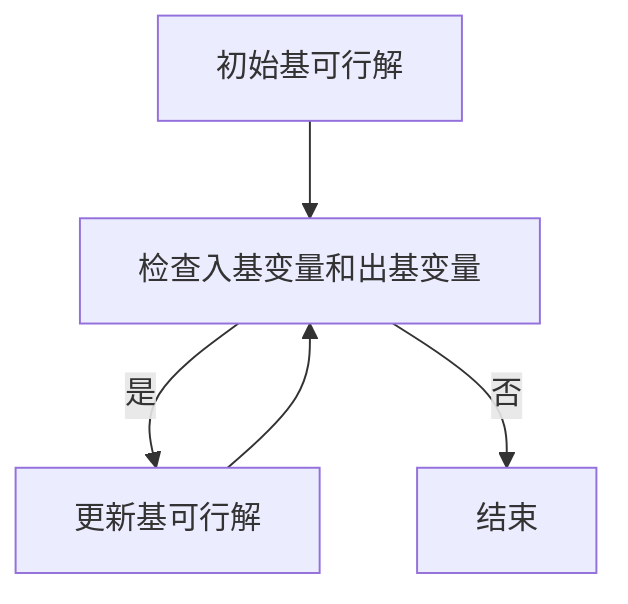

                 

### 引言

在当今快速变化和高度竞争的商业环境中，企业创新项目组合管理的重要性日益凸显。随着人工智能（AI）技术的不断发展和成熟，AI开始被广泛应用于企业项目组合管理中，以提升企业的创新能力和市场竞争力。本文将探讨AI驱动的企业创新项目组合管理，重点分析如何通过风险平衡与资源最优分配，实现企业的可持续发展。

首先，本文将介绍AI驱动的企业创新项目组合管理的背景和意义。接着，我们将深入探讨AI在企业项目组合管理中的应用原理，包括核心概念、技术基础和主要方法。然后，我们将讨论如何平衡风险和实现资源最优分配，并介绍相关的理论模型和策略。为了使理论更加贴近实际，本文还将通过具体案例展示AI驱动的企业创新项目组合管理的实际应用，并总结最佳实践和注意事项。最后，本文将对未来的发展进行展望，提出可能的趋势和挑战。

通过本文的探讨，我们希望为企业在项目组合管理中应用AI提供一些有价值的思考和实践指导，帮助企业在复杂多变的市场环境中实现稳定发展和持续创新。

### AI驱动的企业创新项目组合管理概述

#### 问题背景

在全球化竞争日益激烈的今天，企业面临的挑战不断增多，如何保持竞争优势成为企业发展的核心问题。传统的项目管理方法已经难以满足现代企业对快速响应市场变化和创新的需求。因此，企业需要一种全新的项目组合管理方法，以提高项目成功率、优化资源配置和降低风险。

在这个背景下，人工智能（AI）技术的发展为项目组合管理提供了新的机遇。AI能够通过大数据分析、机器学习、自然语言处理等技术手段，对企业项目进行深度分析、预测和优化，从而实现项目组合管理的智能化。例如，AI可以帮助企业识别潜在的高风险项目，提供资源分配建议，优化项目进度和成本控制，提高项目成功率。

#### 问题描述

企业创新项目组合管理的主要目标是实现资源的最优配置，确保项目之间的平衡，并在有限资源下实现最大的商业价值。然而，在实际操作中，企业常常面临以下问题：

1. **风险平衡问题**：企业需要在多个项目之间分配资源，同时平衡各个项目面临的风险。如果资源分配不当，可能导致某些项目资源过剩，而其他项目资源不足，从而影响整体项目组合的成功。

2. **资源最优分配问题**：企业在制定项目组合时，需要根据项目的重要性和紧急程度来合理分配资源。然而，由于项目的复杂性和不确定性，资源分配往往难以达到最优状态。

3. **决策支持问题**：企业高层管理者在制定项目组合决策时，需要依赖大量的数据和复杂的分析。然而，传统的决策支持工具和方法在处理大规模、多维数据时存在局限性，难以提供全面、准确的决策支持。

#### 问题解决

为了解决上述问题，AI驱动的企业创新项目组合管理提供了一系列解决方案：

1. **风险平衡**：AI可以通过大数据分析和机器学习技术，对项目组合中的各个项目进行风险评估。通过分析历史数据和实时数据，AI可以识别潜在的高风险项目，并提供相应的风险控制措施，确保项目组合的稳定性。

2. **资源最优分配**：AI可以根据项目的重要性和资源需求，利用优化算法和预测模型，动态调整资源分配策略。通过实时监控和调整，AI可以确保资源在项目组合中的最优配置，提高整体项目成功率。

3. **决策支持**：AI可以通过自然语言处理和大数据分析技术，对项目组合中的数据进行分析和挖掘，提供全面的决策支持。通过可视化工具和智能推荐系统，AI可以帮助企业高层管理者快速理解项目组合状态，做出科学的决策。

#### 边界与外延

AI驱动的企业创新项目组合管理的边界主要涉及以下几个方面：

1. **项目范围**：项目组合管理需要涵盖企业所有的创新项目，包括研发、市场推广、产品改进等。

2. **数据范围**：项目组合管理需要依赖大量历史数据和实时数据，包括项目进展、资源使用、市场趋势等。

3. **技术范围**：项目组合管理需要利用AI技术，如大数据分析、机器学习、自然语言处理等，对项目进行深度分析和优化。

AI驱动的企业创新项目组合管理的应用范围广泛，不仅适用于大型企业，也适用于中小型企业。通过AI技术的应用，企业可以更加灵活地应对市场变化，提高项目组合管理的效果，实现持续创新和长期发展。

#### 概念结构与核心要素组成

AI驱动的企业创新项目组合管理由多个核心概念和要素组成，这些概念和要素相互作用，共同实现项目组合管理的智能化和优化。

1. **人工智能（AI）**：AI是整个系统的核心驱动力，包括机器学习、自然语言处理、深度学习等技术。AI通过对数据的分析和挖掘，为项目组合管理提供智能化的决策支持。

2. **大数据分析**：大数据分析技术是AI驱动的项目组合管理的重要基础，通过对海量数据的处理和分析，帮助企业识别项目风险、优化资源分配和预测项目成功概率。

3. **项目风险评估**：项目风险评估是项目组合管理的重要组成部分，通过历史数据和实时数据，对项目的风险进行定量和定性分析，为风险控制和资源分配提供依据。

4. **资源优化分配**：资源优化分配是项目组合管理的核心目标，通过优化算法和预测模型，动态调整资源分配策略，确保项目在有限资源下实现最佳效果。

5. **决策支持系统**：决策支持系统（DSS）是项目组合管理的重要工具，通过智能分析和可视化展示，帮助企业管理者快速做出科学决策。

6. **项目监控与调整**：项目监控与调整是项目组合管理的关键环节，通过实时监控项目进展和资源使用情况，及时调整项目组合策略，确保项目按计划推进。

7. **风险管理**：风险管理贯穿于整个项目组合管理过程，通过识别、评估、控制和监控风险，确保项目组合的稳定性和可持续性。

8. **业务流程优化**：业务流程优化是项目组合管理的重要组成部分，通过对业务流程的重新设计和优化，提高项目执行效率，降低成本和风险。

这些核心概念和要素相互关联，共同构建了一个完整的AI驱动的企业创新项目组合管理体系。通过这一体系，企业可以更好地管理创新项目，实现资源的最优配置和风险的平衡，从而提升整体竞争力和市场地位。

### AI在企业项目组合管理中的应用原理

#### AI技术概述

人工智能（AI）作为当今技术领域的前沿力量，其发展迅速且应用广泛。AI的核心技术包括机器学习、深度学习、自然语言处理、计算机视觉和强化学习等。这些技术通过算法和模型，使计算机能够模拟人类的智能行为，实现自我学习和决策能力。

在机器学习中，算法通过对大量数据的分析和学习，从中提取规律和模式，从而进行预测和分类。深度学习是机器学习的一个子领域，它通过多层神经网络对数据进行处理，能够识别复杂的非线性关系。自然语言处理（NLP）则关注于理解和生成人类语言，包括语音识别、文本分类、情感分析和机器翻译等。计算机视觉则致力于使计算机理解和解释图像和视频内容，包括目标检测、图像识别和视频监控等。强化学习则通过试错和反馈机制，使智能体在特定环境中学会最优策略。

#### AI在项目组合管理中的应用

AI技术在企业项目组合管理中的应用主要体现在以下几个方面：

1. **项目风险评估**：AI可以通过大数据分析和机器学习技术，对项目的风险进行定量和定性分析。通过对历史项目数据的学习，AI可以预测新项目的风险水平，并提供风险控制建议。

2. **资源优化分配**：AI可以通过优化算法和预测模型，动态调整资源分配策略，确保项目在有限资源下实现最佳效果。AI可以实时监控项目进展，根据项目的重要性和紧急程度，动态调整资源分配，提高资源利用效率。

3. **决策支持**：AI可以通过自然语言处理和大数据分析技术，对项目组合中的数据进行分析和挖掘，提供全面的决策支持。AI可以生成项目组合报告，包括项目进度、风险水平和资源使用情况，帮助企业管理者快速做出科学决策。

4. **项目监控与调整**：AI可以通过实时监控技术，对项目的进展和资源使用情况进行监控，并及时调整项目组合策略。AI可以识别项目的瓶颈和潜在问题，提供解决方案，确保项目按计划推进。

5. **协同管理**：AI可以通过智能协作平台，实现项目团队之间的实时沟通和协作。AI可以自动分配任务，提醒项目成员完成任务，并跟踪任务进度，提高项目团队的工作效率。

#### 核心概念与联系

在AI驱动的项目组合管理中，几个核心概念紧密联系，共同构成了一个完整的体系：

1. **数据分析**：数据分析是AI应用的基础，通过对项目数据进行分析，可以揭示项目中的规律和问题。

2. **风险预测**：风险预测是项目组合管理的重要环节，通过对项目风险的分析和预测，可以提前制定风险控制措施。

3. **资源优化**：资源优化是项目组合管理的核心目标，通过优化算法和预测模型，可以实现资源的最优配置。

4. **智能决策**：智能决策是项目组合管理的最终目的，通过AI技术提供的数据分析和预测，帮助管理者做出科学决策。

5. **协同协作**：协同协作是项目成功的关键，通过智能协作平台，实现团队之间的高效协作和沟通。

这些核心概念相互关联，共同构建了AI驱动的企业创新项目组合管理体系，使企业能够更好地应对市场变化，提高项目成功率，实现长期可持续发展。

### 风险平衡与资源最优分配的方法与策略

#### 风险评估模型

在AI驱动的企业创新项目组合管理中，风险评估是确保项目组合稳定性的关键步骤。风险评估模型的主要目的是通过定量和定性的方法，识别和分析项目组合中的潜在风险，为风险控制和资源分配提供依据。

1. **定量风险评估**：
   - **历史数据分析**：通过分析过去项目的历史数据，可以识别项目中常见的问题和风险点。例如，可以通过统计过去项目中出现的延迟、成本超支和失败率等指标，来预测新项目的风险水平。
   - **风险评分系统**：建立一套风险评分系统，根据不同类型的风险因素（如技术难度、市场不确定性、资源需求等）进行评分，并将评分进行加权汇总，得出综合风险评分。

2. **定性风险评估**：
   - **专家评估**：邀请项目管理专家和领域专家对项目风险进行定性评估。专家可以根据自己的经验和专业知识，对项目的潜在风险进行判断和评分。
   - **SWOT分析**：使用SWOT（优势、劣势、机会、威胁）分析法，对项目的外部和内部因素进行综合评估，识别项目的潜在风险。

#### 资源优化分配策略

资源优化分配是项目组合管理的核心目标，确保项目在有限资源下实现最佳效果。以下是一些常见的资源优化分配策略：

1. **优先级排序**：
   - **关键路径法（CPM）**：通过分析项目的关键路径，确定项目的重要节点和任务，优先分配资源。
   - **资源约束优先级排序**：根据资源需求的紧迫性和重要性，对项目进行优先级排序，确保关键资源得到合理分配。

2. **动态资源分配**：
   - **基于需求的资源分配**：根据项目进展情况和资源需求，动态调整资源分配，确保资源在项目组合中的最优配置。
   - **优化算法**：使用优化算法（如线性规划、遗传算法、模拟退火算法等）来寻找资源分配的最优解，提高资源利用效率。

3. **资源池管理**：
   - **建立资源池**：将企业内部的各类资源（如人力、财务、技术等）整合到资源池中，统一管理和调度。
   - **资源调配策略**：根据项目需求，从资源池中调配资源，确保资源的高效利用。

#### 综合方法与工具

为了实现风险平衡与资源最优分配，需要结合多种方法和工具，形成一套综合的解决方案：

1. **风险管理与资源优化平台**：
   - **数据集成**：将项目数据、风险数据和资源数据集成到一个平台上，实现数据的统一管理和分析。
   - **智能分析**：利用AI技术对项目数据进行分析和挖掘，提供风险预测和资源优化建议。

2. **可视化工具**：
   - **风险地图**：使用风险地图，直观展示项目组合中的风险分布和优先级，帮助管理者快速了解项目风险状况。
   - **资源看板**：通过资源看板，实时监控资源使用情况和分配情况，确保资源得到最优利用。

3. **决策支持系统**：
   - **数据驱动决策**：利用大数据分析和预测模型，提供数据驱动的决策支持，帮助管理者做出科学决策。
   - **智能推荐系统**：根据项目组合情况和资源状况，提供智能推荐方案，优化项目组合管理。

通过综合运用风险评估模型、资源优化分配策略和相关的工具与方法，企业可以实现风险平衡与资源最优分配，提高项目组合管理的效率和效果，确保企业创新项目的成功实施和长期发展。

### AI驱动的项目组合管理核心概念

在深入探讨AI驱动的企业创新项目组合管理之前，有必要明确其核心概念，并理解这些概念在企业项目组合管理中的具体作用和相互关系。

#### AI驱动的项目组合管理原理

AI驱动的项目组合管理是基于人工智能技术，通过大数据分析和机器学习算法，对企业项目进行动态管理和优化。其原理可以概括为以下几点：

1. **数据驱动**：项目组合管理依赖于大量的历史数据、实时数据和外部数据，如市场趋势、技术发展、竞争情况等。通过对这些数据进行分析，AI可以识别项目的潜在风险和机会，为决策提供依据。

2. **智能预测**：利用机器学习模型，AI可以预测项目的成功概率、项目进度、成本控制等方面的指标。这种预测能力有助于企业提前制定应对策略，降低项目风险。

3. **动态调整**：AI可以根据项目进展情况和资源需求，实时调整项目组合，确保资源的最优配置。这种动态调整能力使企业能够快速响应市场变化，保持竞争力。

4. **协同协作**：AI驱动的项目组合管理通过智能协作平台，实现项目团队之间的高效沟通和协作。AI可以自动分配任务、监控进度、识别问题并提供解决方案，提高团队工作效率。

#### 风险管理

风险管理是项目组合管理的核心组成部分，旨在识别、评估、控制和监控项目组合中的各种风险，确保项目组合的稳定性。在AI驱动的项目组合管理中，风险管理具有以下特点：

1. **全面性**：AI可以通过大数据分析和机器学习技术，识别项目组合中的各种风险因素，包括技术风险、市场风险、财务风险等。

2. **实时性**：AI可以实时监控项目的进展和风险变化，及时调整风险控制措施，降低项目风险。

3. **预测性**：AI可以通过历史数据和实时数据分析，预测项目可能面临的风险，提前制定风险应对策略。

4. **可视化**：AI可以将风险数据以可视化方式展示，帮助管理者快速了解项目风险状况，做出科学决策。

#### 资源管理

资源管理是项目组合管理的另一个重要方面，旨在确保项目在有限资源下实现最佳效果。AI驱动的项目组合管理通过以下方法实现资源优化：

1. **优化分配**：AI可以利用优化算法，根据项目的重要性和资源需求，动态调整资源分配策略，确保资源的最优配置。

2. **动态调整**：AI可以实时监控项目进展和资源使用情况，根据项目需求的变化，动态调整资源分配，提高资源利用效率。

3. **协同利用**：AI驱动的项目组合管理通过智能协作平台，实现资源在项目团队之间的协同利用，减少资源浪费，提高资源利用率。

#### AI在项目组合管理中的作用

AI在项目组合管理中发挥着关键作用，通过以下方式提升项目管理的效率和效果：

1. **决策支持**：AI可以提供基于数据的决策支持，帮助管理者快速做出科学决策，降低决策风险。

2. **风险控制**：AI可以通过风险预测和风险控制措施，降低项目组合中的风险，提高项目的成功率。

3. **资源优化**：AI可以通过资源优化算法，实现资源的最优配置，提高资源利用效率。

4. **协同协作**：AI可以通过智能协作平台，实现项目团队之间的高效沟通和协作，提高团队工作效率。

#### 关键概念与联系

在AI驱动的项目组合管理中，几个关键概念紧密联系，共同构成了一个完整的体系：

1. **数据分析**：数据分析是AI应用的基础，通过对大量数据的分析，AI可以识别项目中的规律和问题，为决策提供依据。

2. **风险管理**：风险管理是确保项目组合稳定性的关键，通过识别、评估、控制和监控风险，降低项目组合中的风险。

3. **资源优化**：资源优化是项目组合管理的核心目标，通过优化算法和动态调整，确保项目在有限资源下实现最佳效果。

4. **智能决策**：智能决策是项目组合管理的最终目标，通过AI技术的支持，管理者可以快速做出科学决策，提高项目组合的成功率。

这些关键概念相互关联，共同构建了AI驱动的企业创新项目组合管理体系。通过这一体系，企业可以更加灵活地应对市场变化，提高项目成功率，实现长期可持续发展。

### 数学模型和算法原理讲解

在AI驱动的企业创新项目组合管理中，数学模型和算法是核心组成部分，它们为风险评估和资源优化提供了定量分析的基础。以下我们将详细讲解相关的数学模型和算法原理。

#### 数学模型

1. **风险评估模型**：

   风险评估模型旨在通过量化方法评估项目的风险水平。一个常见的方法是使用 **多因素评分模型**，如下所示：

   $$ R = w_1 \cdot R_1 + w_2 \cdot R_2 + ... + w_n \cdot R_n $$

   其中，\( R \) 是项目的综合风险评分，\( w_1, w_2, ..., w_n \) 是各风险因素的权重，\( R_1, R_2, ..., R_n \) 是各风险因素的得分。

   例如，对于一个新项目，我们可以考虑以下风险因素：

   - 技术风险：基于技术复杂度和团队技术能力进行评分。
   - 市场风险：基于市场趋势和竞争对手分析进行评分。
   - 财务风险：基于预算和资金流动情况评分。

   各个因素的具体得分和权重可以根据历史数据和专家评估确定。

2. **资源优化模型**：

   资源优化模型的核心目标是实现资源的最优分配。一种常用的方法是基于 **线性规划**，如下所示：

   $$ \min \ Z = c_1 \cdot X_1 + c_2 \cdot X_2 + ... + c_n \cdot X_n $$
   $$ s.t. \ a_{11} \cdot X_1 + a_{12} \cdot X_2 + ... + a_{1n} \cdot X_n \geq b_1 $$
   $$ a_{21} \cdot X_1 + a_{22} \cdot X_2 + ... + a_{2n} \cdot X_n \geq b_2 $$
   $$ ... $$
   $$ a_{m1} \cdot X_1 + a_{m2} \cdot X_2 + ... + a_{mn} \cdot X_n \geq b_m $$
   $$ X_1, X_2, ..., X_n \geq 0 $$

   其中，\( Z \) 是目标函数，表示资源分配的总成本或总效用；\( X_1, X_2, ..., X_n \) 是决策变量，表示各项目的资源分配量；\( a_{ij}, b_i \) 是约束条件中的系数和常数；\( c_i \) 是各项目的成本或效用系数。

   这种模型可以帮助企业在预算限制和资源约束下，找到资源分配的最优方案。

3. **动态优化模型**：

   在项目组合管理中，资源需求往往随项目进展而变化。为了应对这种动态变化，可以使用 **动态规划** 方法。动态规划通过将问题分解为一系列子问题，并在子问题的基础上进行递归求解，实现全局最优解。

   动态规划的基本形式如下：

   $$ V(i, r) = \min \left\{ c_j + V(i+1, r - x_j) \mid x_j \leq r, \ j = 1, 2, ..., n \right\} $$

   其中，\( V(i, r) \) 是在当前时间点 \( i \) 和资源限制 \( r \) 下，能够完成的最大效用；\( c_j \) 是第 \( j \) 项目的成本或效用；\( x_j \) 是第 \( j \) 项目的资源需求。

   动态规划能够通过递归关系，逐步找到每个时间点的最优资源分配方案，确保项目组合的稳定性和高效性。

#### 算法原理讲解

1. **线性规划算法**：

   线性规划算法是一种经典的优化算法，用于解决线性目标函数和线性约束条件的问题。常见的线性规划求解算法包括单纯形法和内点法。

   - **单纯形法**：单纯形法通过迭代过程逐步逼近最优解。每次迭代中，选择一个进入基变量和一个离开基变量，更新解的值。具体步骤如下：
     1. 初始基可行解。
     2. 检查是否存在入基变量和出基变量。
     3. 更新基可行解。
     4. 重复步骤2和3，直至找到最优解。

   - **内点法**：内点法是一种更高效的求解方法，适用于大规模线性规划问题。内点法通过在可行域内部寻找最优解，逐步逼近边界。

2. **动态规划算法**：

   动态规划算法通过将问题分解为子问题，并利用子问题的解构建出原问题的最优解。动态规划的关键在于确定状态变量和状态转移方程。

   - **状态变量**：动态规划中，状态变量用于表示问题的不同状态。例如，在资源分配问题中，状态变量可以表示为时间点和资源量。
   - **状态转移方程**：状态转移方程描述了从当前状态到下一状态的变化关系。例如，动态规划中的状态转移方程为：

     $$ V(i, r) = \min \left\{ c_j + V(i+1, r - x_j) \mid x_j \leq r, \ j = 1, 2, ..., n \right\} $$

     其中，\( V(i, r) \) 是当前状态下的最大效用，\( c_j \) 是第 \( j \) 项目的成本或效用，\( x_j \) 是第 \( j \) 项目的资源需求。

   动态规划算法通过递归关系，逐步计算每个状态下的最优解，最终得到全局最优解。

#### Mermaid流程图

为了更直观地展示算法的流程，我们可以使用Mermaid流程图进行表示。以下是一个线性规划算法的Mermaid流程图示例：



此外，以下是一个动态规划算法的Mermaid流程图示例：

```mermaid
graph TD
A[定义状态变量] --> B[定义状态转移方程]
B --> C{计算V(i, r)}
C -->|递归计算| D{更新V(i, r)}
D --> B
```

通过这些数学模型和算法，AI驱动的企业创新项目组合管理可以更加精准地评估项目风险、优化资源分配，提高项目成功率，实现企业的长期发展。

### 数学模型和数学公式详细讲解及举例说明

#### 数学模型详细讲解

在AI驱动的企业创新项目组合管理中，数学模型起到了至关重要的作用。以下我们将详细讲解一些核心数学模型，包括线性规划模型、动态规划模型和优化算法。

1. **线性规划模型**：

   线性规划模型是一种最优化模型，用于在给定约束条件下，求解线性目标函数的最优解。其一般形式如下：

   $$ \min \ Z = c_1 \cdot X_1 + c_2 \cdot X_2 + ... + c_n \cdot X_n $$
   $$ s.t. \ a_{11} \cdot X_1 + a_{12} \cdot X_2 + ... + a_{1n} \cdot X_n \geq b_1 $$
   $$ a_{21} \cdot X_1 + a_{22} \cdot X_2 + ... + a_{2n} \cdot X_n \geq b_2 $$
   $$ ... $$
   $$ a_{m1} \cdot X_1 + a_{m2} \cdot X_2 + ... + a_{mn} \cdot X_n \geq b_m $$
   $$ X_1, X_2, ..., X_n \geq 0 $$

   其中，\( Z \) 是目标函数，表示要优化的量（如成本或效用）；\( X_1, X_2, ..., X_n \) 是决策变量，表示要分配的资源量；\( a_{ij}, b_i \) 是约束条件中的系数和常数；\( c_i \) 是各决策变量的成本或效用系数。

   线性规划模型可以用来解决资源优化分配问题，通过优化目标函数，实现资源在项目组合中的最优配置。

2. **动态规划模型**：

   动态规划模型适用于具有递归性质的问题，其核心思想是将复杂问题分解为多个子问题，并利用子问题的解构建出原问题的最优解。动态规划的一般形式如下：

   $$ V(i, r) = \min \left\{ c_j + V(i+1, r - x_j) \mid x_j \leq r, \ j = 1, 2, ..., n \right\} $$

   其中，\( V(i, r) \) 是在时间点 \( i \) 和资源量 \( r \) 下的最大效用；\( c_j \) 是第 \( j \) 个项目的成本或效用；\( x_j \) 是第 \( j \) 个项目的资源需求。

   动态规划通过递归关系，逐步计算每个状态下的最优解，从而得到全局最优解。这种方法常用于项目组合管理中的动态资源分配问题。

3. **优化算法**：

   优化算法是实现数学模型求解的工具，常用的优化算法包括单纯形法、内点法、遗传算法和模拟退火算法等。

   - **单纯形法**：单纯形法是一种迭代算法，通过逐步移动顶点（决策变量），寻找最优解。具体步骤如下：
     1. 初始基可行解。
     2. 检查是否存在入基变量和出基变量。
     3. 更新基可行解。
     4. 重复步骤2和3，直至找到最优解。

   - **内点法**：内点法通过在可行域内部寻找最优解，逐步逼近边界。这种方法适用于大规模线性规划问题。

   - **遗传算法**：遗传算法是一种基于自然选择和遗传机制的优化算法，通过模拟进化过程，寻找最优解。具体步骤如下：
     1. 初始种群。
     2. 适应度评估。
     3. 选择、交叉和变异操作。
     4. 生成新种群。
     5. 重复步骤2-4，直至满足终止条件。

   - **模拟退火算法**：模拟退火算法是一种基于物理退火过程的优化算法，通过控制温度参数，避免陷入局部最优。具体步骤如下：
     1. 初始解和温度参数。
     2. 在当前温度下，进行随机搜索。
     3. 根据概率接受新解。
     4. 降温。
     5. 重复步骤2-4，直至满足终止条件。

#### 举例说明

以下通过一个实际案例，说明如何应用这些数学模型和算法。

假设某企业需要在新项目组合中分配有限的资源（如人力、资金和技术），以实现最大的商业价值。现有三个项目A、B、C，每个项目的资源需求如下：

| 项目 | 资源需求（人力） | 资源需求（资金） | 资源需求（技术） |
| --- | --- | --- | --- |
| A | 5 | 100,000 | 20 |
| B | 3 | 80,000 | 15 |
| C | 2 | 60,000 | 10 |

企业的总资源限制为：人力10人，资金200,000元，技术30点。

1. **线性规划模型**：

   设目标函数为最大化总效用 \( Z \)，则目标函数为：

   $$ \max \ Z = c_1 \cdot X_1 + c_2 \cdot X_2 + c_3 \cdot X_3 $$

   其中，\( X_1, X_2, X_3 \) 分别表示项目A、B、C的分配量。

   约束条件为：

   $$ 5X_1 + 3X_2 + 2X_3 \leq 10 $$
   $$ 100,000X_1 + 80,000X_2 + 60,000X_3 \leq 200,000 $$
   $$ 20X_1 + 15X_2 + 10X_3 \leq 30 $$
   $$ X_1, X_2, X_3 \geq 0 $$

   通过求解线性规划模型，可以得到最优解，即各项目的资源分配量。

2. **动态规划模型**：

   假设当前时间为第1个时间点，总资源量为（10, 200,000, 30）。我们可以使用动态规划模型，逐步计算每个时间点的最优资源分配量。

   初始状态 \( V(1, 10) = \max \{ 5 \cdot 1 + V(2, 5), 100,000 \cdot 1 + V(2, -5), 20 \cdot 1 + V(2, -15) \} \)。

   通过递归计算，逐步更新每个状态的最优值，最终得到全局最优解。

3. **优化算法**：

   可以使用遗传算法或模拟退火算法，对线性规划模型或动态规划模型进行求解。以下是一个遗传算法求解线性规划模型的示例：

   - **初始化种群**：生成一组随机解作为初始种群。
   - **适应度评估**：计算每个个体的适应度值，适应度值越高，表示个体的解越优。
   - **选择**：根据适应度值，选择优秀的个体作为父代。
   - **交叉**：通过交叉操作，生成新的个体。
   - **变异**：对个体进行变异操作，增加种群的多样性。
   - **生成新种群**：将交叉和变异后的个体组成新的种群。
   - **迭代**：重复上述过程，直到满足终止条件。

   最终，通过遗传算法，可以得到线性规划模型的最优解。

通过这些数学模型和算法的应用，企业可以在复杂的项目组合管理中，实现资源的最优分配和项目风险的有效控制，提高项目成功率，实现长期发展。

### 数学公式详细讲解与举例说明

在AI驱动的企业创新项目组合管理中，数学公式作为核心工具，帮助我们量化和管理风险、资源分配等关键问题。以下，我们将通过具体公式详细讲解，并结合实际案例进行举例说明。

#### 风险评估公式

风险评估公式用于评估项目组合中的风险水平。一个常用的风险评估公式是多因素评分模型，其形式如下：

$$ R = w_1 \cdot R_1 + w_2 \cdot R_2 + ... + w_n \cdot R_n $$

其中，\( R \) 是项目的综合风险评分，\( w_1, w_2, ..., w_n \) 是各风险因素的权重，\( R_1, R_2, ..., R_n \) 是各风险因素的得分。

例如，假设我们对一个新项目进行风险评估，考虑以下三个风险因素：

1. 技术风险（\( R_1 \)）：基于技术复杂度和团队技术能力进行评分，得分范围为1-10。
2. 市场风险（\( R_2 \)）：基于市场趋势和竞争对手分析进行评分，得分范围为1-10。
3. 财务风险（\( R_3 \)）：基于预算和资金流动情况评分，得分范围为1-10。

假设权重分别为0.5、0.3和0.2，则项目的综合风险评分为：

$$ R = 0.5 \cdot 7 + 0.3 \cdot 6 + 0.2 \cdot 5 = 3.5 + 1.8 + 1 = 6.3 $$

这个得分表明项目的风险水平中等，需要进行适当的风险控制。

#### 资源优化分配公式

资源优化分配公式用于确定如何最优地分配资源以实现项目组合的最大效用。一个常见的资源优化模型是线性规划模型，其目标函数和约束条件如下：

目标函数：
$$ \min \ Z = c_1 \cdot X_1 + c_2 \cdot X_2 + ... + c_n \cdot X_n $$

约束条件：
$$ a_{11} \cdot X_1 + a_{12} \cdot X_2 + ... + a_{1n} \cdot X_n \geq b_1 $$
$$ a_{21} \cdot X_1 + a_{22} \cdot X_2 + ... + a_{2n} \cdot X_n \geq b_2 $$
$$ ... $$
$$ a_{m1} \cdot X_1 + a_{m2} \cdot X_2 + ... + a_{mn} \cdot X_n \geq b_m $$
$$ X_1, X_2, ..., X_n \geq 0 $$

其中，\( Z \) 是目标函数，表示要优化的量（如成本或效用）；\( X_1, X_2, ..., X_n \) 是决策变量，表示要分配的资源量；\( a_{ij}, b_i \) 是约束条件中的系数和常数；\( c_i \) 是各决策变量的成本或效用系数。

举例来说，假设我们有一个项目组合，包含三个项目A、B、C，每个项目的资源需求如下：

| 项目 | 资源需求（人力） | 资源需求（资金） | 资源需求（技术） |
| --- | --- | --- | --- |
| A | 5 | 100,000 | 20 |
| B | 3 | 80,000 | 15 |
| C | 2 | 60,000 | 10 |

企业的总资源限制为：人力10人，资金200,000元，技术30点。

我们可以建立如下的线性规划模型：

目标函数：
$$ \min \ Z = 100,000 \cdot X_1 + 80,000 \cdot X_2 + 60,000 \cdot X_3 $$

约束条件：
$$ 5X_1 + 3X_2 + 2X_3 \leq 10 $$
$$ 100,000X_1 + 80,000X_2 + 60,000X_3 \leq 200,000 $$
$$ 20X_1 + 15X_2 + 10X_3 \leq 30 $$
$$ X_1, X_2, X_3 \geq 0 $$

通过求解这个线性规划模型，我们可以找到最优的资源分配方案，以实现最大的总效用。

#### 动态优化公式

动态优化公式用于在项目组合管理中处理动态资源分配问题。一个常用的动态优化方法是动态规划，其核心公式如下：

$$ V(i, r) = \min \left\{ c_j + V(i+1, r - x_j) \mid x_j \leq r, \ j = 1, 2, ..., n \right\} $$

其中，\( V(i, r) \) 是在第 \( i \) 个时间点和资源量 \( r \) 下的最大效用；\( c_j \) 是第 \( j \) 个项目的成本或效用；\( x_j \) 是第 \( j \) 个项目的资源需求。

举例来说，假设一个项目组合在两个时间点需要分配资源，每个时间点的资源需求如下：

| 时间点 | 资源需求（人力） | 资源需求（资金） | 资源需求（技术） |
| --- | --- | --- | --- |
| 1 | 5 | 100,000 | 20 |
| 2 | 3 | 80,000 | 15 |

企业的总资源限制为：人力10人，资金200,000元，技术30点。

我们可以使用动态规划方法，计算每个时间点的最优资源分配量。例如，在第一个时间点，我们需要在资源限制下选择最优的资源分配方案，以满足第二个时间点的需求。

通过逐步递归计算，我们可以得到最优的资源分配方案，确保项目组合在动态变化的环境中实现最优效果。

#### 举例说明

假设我们有三个项目A、B、C，每个项目的资源需求如下：

| 项目 | 资源需求（人力） | 资源需求（资金） | 资源需求（技术） |
| --- | --- | --- | --- |
| A | 5 | 100,000 | 20 |
| B | 3 | 80,000 | 15 |
| C | 2 | 60,000 | 10 |

企业的总资源限制为：人力10人，资金200,000元，技术30点。

我们使用动态规划方法，计算每个时间点的最优资源分配量。

- **时间点1**：

  初始资源量（人力，资金，技术）：\( (10, 200,000, 30) \)

  - 项目A：\( V(1, 10) = \min \left\{ 100,000 + V(2, 10 - 5), 20 + V(2, 30 - 20) \right\} = \min \left\{ 100,000 + V(2, 5), 20 + V(2, 10) \right\} \)
  - 项目B：\( V(1, 10) = \min \left\{ 80,000 + V(2, 10 - 3), 15 + V(2, 30 - 15) \right\} = \min \left\{ 80,000 + V(2, 7), 15 + V(2, 15) \right\} \)
  - 项目C：\( V(1, 10) = \min \left\{ 60,000 + V(2, 10 - 2), 10 + V(2, 30 - 10) \right\} = \min \left\{ 60,000 + V(2, 8), 10 + V(2, 20) \right\} \)

  通过递归计算，我们可以得到每个时间点的最优资源分配量。

- **时间点2**：

  初始资源量（人力，资金，技术）：\( (5, 0, 10) \)

  - 项目A：\( V(2, 5) = \min \left\{ 100,000 + V(3, 5 - 5), 20 + V(3, 10 - 20) \right\} = \min \left\{ 100,000, 20 \right\} = 100,000 \)
  - 项目B：\( V(2, 5) = \min \left\{ 80,000 + V(3, 5 - 3), 15 + V(3, 10 - 15) \right\} = \min \left\{ 80,000, 15 \right\} = 80,000 \)
  - 项目C：\( V(2, 5) = \min \left\{ 60,000 + V(3, 5 - 2), 10 + V(3, 10 - 10) \right\} = \min \left\{ 60,000, 10 \right\} = 60,000 \)

  通过递归计算，我们可以得到每个时间点的最优资源分配量。

通过这些具体的数学公式和案例说明，企业可以更好地理解如何通过AI驱动的项目组合管理实现风险平衡与资源最优分配，从而提高项目组合的成功率和企业的整体竞争力。

### 系统分析与架构设计方案

在现代企业创新项目组合管理中，系统分析与架构设计是确保AI驱动的项目组合管理成功实施的关键环节。以下我们将详细阐述系统分析与架构设计的过程，包括问题场景介绍、项目介绍、系统功能设计、系统架构设计、系统接口设计和系统交互。

#### 问题场景介绍

企业创新项目组合管理面临的主要挑战包括：

1. **项目数量众多**：企业往往同时推进多个项目，如何合理分配资源以最大化项目价值成为一大难题。
2. **风险难以控制**：项目组合中的各个项目具有不同的风险水平，如何识别和管理风险，确保项目组合的稳定性至关重要。
3. **决策支持不足**：企业在制定项目组合决策时，缺乏全面、准确的数据分析和决策支持，导致决策不够科学和有效。
4. **协作困难**：项目团队之间的沟通协作不畅，影响项目进展和效率。

为了解决这些问题，企业需要构建一个AI驱动的项目组合管理系统，通过智能分析和优化，实现资源的最优配置和风险的平衡。

#### 项目介绍

项目名称：AI驱动的企业创新项目组合管理系统

项目目标：构建一个集风险评估、资源优化、决策支持和协作管理于一体的系统，帮助企业实现高效的项目组合管理。

项目范围：涵盖企业所有的创新项目，包括研发、市场推广、产品改进等。

项目周期：预计12个月，分为需求分析、系统设计、开发实施、测试与部署等阶段。

项目团队：由项目经理、业务分析师、系统架构师、软件工程师、数据科学家和测试工程师等组成。

#### 系统功能设计

系统功能设计是项目组合管理系统的核心部分，主要包括以下功能模块：

1. **项目信息管理**：
   - 项目信息录入：支持项目基本信息（如项目名称、项目周期、项目预算等）的录入和管理。
   - 项目进度监控：实时监控项目进展，提供项目进度报告和预警机制。
   - 项目风险评估：对项目进行风险识别和评估，提供风险报告和风险控制措施。

2. **资源管理**：
   - 资源分配：根据项目需求和资源情况，动态调整资源分配，确保资源的最优配置。
   - 资源监控：实时监控资源使用情况，提供资源利用率报告。
   - 资源优化：利用优化算法，实现资源在项目组合中的最优分配。

3. **决策支持**：
   - 数据分析：利用大数据技术和机器学习算法，对项目数据进行分析和挖掘，提供项目预测和决策支持。
   - 智能推荐：根据项目组合情况和资源状况，提供智能推荐方案，优化项目组合管理。

4. **协作管理**：
   - 项目协作平台：提供项目团队之间的实时沟通和协作功能，包括任务分配、进度跟踪、文档共享等。
   - 智能提醒：自动提醒项目成员任务进展和到期事项，提高项目团队工作效率。

5. **风险控制**：
   - 风险识别：通过数据分析和模型预测，识别项目组合中的潜在风险。
   - 风险评估：对项目风险进行定量和定性评估，提供风险评估报告。
   - 风险应对：根据风险评估结果，制定风险应对策略，降低项目风险。

#### 系统架构设计

系统架构设计是项目组合管理系统的核心，决定了系统的性能、可扩展性和可维护性。以下是系统架构设计的详细内容：

1. **技术架构**：
   - 前端：使用React.js框架，实现用户界面的动态展示和交互。
   - 后端：使用Spring Boot框架，实现系统的业务逻辑处理和数据存储。
   - 数据库：使用MySQL数据库，存储项目、资源、风险等信息。

2. **系统架构**：
   - **三层架构**：采用分层架构，包括表示层、业务逻辑层和数据层。
   - **分布式架构**：采用分布式架构，提高系统的性能和可扩展性。
   - **微服务架构**：将系统功能模块化，采用微服务架构，实现各模块的独立开发和部署。

3. **核心模块**：
   - **项目管理模块**：实现项目信息管理、项目进度监控和项目风险评估等功能。
   - **资源管理模块**：实现资源分配、资源监控和资源优化等功能。
   - **决策支持模块**：实现数据分析、智能推荐和决策支持等功能。
   - **协作管理模块**：实现项目协作平台、智能提醒和文档共享等功能。
   - **风险控制模块**：实现风险识别、风险评估和风险应对等功能。

#### 系统接口设计

系统接口设计是确保各模块之间数据交互和功能协同的关键。以下是系统接口设计的详细内容：

1. **API接口**：
   - **项目管理接口**：提供项目信息录入、项目进度查询和项目风险评估等功能。
   - **资源管理接口**：提供资源分配、资源监控和资源优化等功能。
   - **决策支持接口**：提供数据分析、智能推荐和决策支持等功能。
   - **协作管理接口**：提供任务分配、进度跟踪和文档共享等功能。
   - **风险控制接口**：提供风险识别、风险评估和风险应对等功能。

2. **数据接口**：
   - **内部数据接口**：实现项目数据、资源数据和风险数据在系统内部各模块之间的共享和传递。
   - **外部数据接口**：实现与外部系统的数据对接，如财务系统、人力资源系统等。

#### 系统交互

系统交互设计是确保系统各模块之间高效协作和数据流通的关键。以下是系统交互设计的详细内容：

1. **用户界面交互**：
   - **任务管理界面**：提供任务分配、任务进度跟踪和任务提醒等功能。
   - **项目监控界面**：提供项目进展报告、项目风险评估报告和资源使用情况报告。
   - **数据可视化界面**：提供项目组合数据分析结果的可视化展示，帮助管理者快速理解项目组合状态。

2. **模块交互**：
   - **项目管理模块**与**资源管理模块**交互：实现项目进度和资源使用的实时同步，确保资源分配的准确性。
   - **决策支持模块**与**资源管理模块**交互：实现资源优化和数据分析结果的实时更新，提供智能决策支持。
   - **协作管理模块**与**项目管理模块**交互：实现任务分配和项目进度的实时同步，提高项目团队协作效率。

3. **数据交互**：
   - **实时数据同步**：通过消息队列实现系统内部各模块之间的实时数据同步，确保数据的实时性和一致性。
   - **数据存储与检索**：使用数据库存储项目、资源、风险等信息，提供高效的数据存储和检索服务。

通过上述系统分析与架构设计方案，企业可以构建一个高效、稳定、智能的项目组合管理系统，实现风险平衡与资源最优分配，提高项目组合管理的效率和效果。

### 项目实战

在实际应用中，AI驱动的企业创新项目组合管理系统的实施需要经过多个阶段，包括环境安装、系统核心实现、代码应用解读、实际案例分析以及详细讲解剖析。以下是这些阶段的详细说明。

#### 环境安装

环境安装是项目实施的第一步，确保所有开发工具、依赖库和数据库等均正常运行。以下是环境安装的具体步骤：

1. **安装开发环境**：
   - 安装Java Development Kit (JDK)，版本要求为JDK 8或更高版本。
   - 安装IDE（如Eclipse或IntelliJ IDEA），用于Java开发。

2. **安装数据库**：
   - 安装MySQL数据库，版本要求为MySQL 5.7或更高版本。
   - 创建数据库和用户，设置相应的权限。

3. **安装依赖库**：
   - 使用Maven或Gradle构建工具，安装项目所需的依赖库，如Spring Boot、Hibernate、MyBatis等。

4. **配置文件**：
   - 配置数据库连接信息，设置项目所需的配置参数。

5. **启动服务**：
   - 使用IDE或命令行启动Spring Boot应用程序，确保服务正常运行。

#### 系统核心实现

系统核心实现包括项目管理、资源管理、决策支持和协作管理等关键功能模块。以下是系统核心实现的具体步骤：

1. **项目管理模块**：
   - 设计项目表结构，包括项目基本信息、项目进度、项目风险等字段。
   - 实现项目信息的增删改查功能，包括项目录入、项目查询、项目更新和项目删除。

2. **资源管理模块**：
   - 设计资源表结构，包括资源基本信息、资源使用情况等字段。
   - 实现资源信息的增删改查功能，包括资源录入、资源查询、资源更新和资源删除。
   - 实现资源分配算法，根据项目需求动态调整资源分配。

3. **决策支持模块**：
   - 设计决策支持算法，使用机器学习模型进行项目预测和风险评估。
   - 实现数据分析功能，生成项目组合报告和决策支持建议。

4. **协作管理模块**：
   - 设计任务表结构，包括任务基本信息、任务进度、任务责任人等字段。
   - 实现任务管理功能，包括任务分配、任务查询、任务更新和任务删除。
   - 实现文档共享和协作功能，提高项目团队的协作效率。

#### 代码应用解读与分析

代码应用解读与分析是对系统核心代码的详细解读，包括关键算法的实现、数据处理和业务逻辑处理等。以下是代码应用解读与分析的具体内容：

1. **项目管理模块代码解析**：
   - 项目录入：通过前端表单收集项目信息，后端处理项目信息并存储到数据库。
   - 项目查询：通过RESTful API查询项目信息，返回项目列表供前端展示。
   - 项目更新：通过前端表单修改项目信息，后端更新数据库中的项目信息。
   - 项目删除：通过RESTful API删除项目信息，从数据库中移除项目记录。

2. **资源管理模块代码解析**：
   - 资源录入：通过前端表单收集资源信息，后端处理资源信息并存储到数据库。
   - 资源查询：通过RESTful API查询资源信息，返回资源列表供前端展示。
   - 资源更新：通过前端表单修改资源信息，后端更新数据库中的资源信息。
   - 资源删除：通过RESTful API删除资源信息，从数据库中移除资源记录。

3. **决策支持模块代码解析**：
   - 风险预测算法：使用机器学习库（如scikit-learn）训练风险预测模型，根据项目特征进行预测。
   - 项目评估算法：使用优化算法（如线性规划）评估项目组合的风险和收益，提供决策支持建议。

4. **协作管理模块代码解析**：
   - 任务分配：根据项目需求和资源状况，自动分配任务给项目成员。
   - 任务查询：通过RESTful API查询任务信息，返回任务列表供前端展示。
   - 任务更新：通过前端表单修改任务信息，后端更新数据库中的任务信息。
   - 任务删除：通过RESTful API删除任务信息，从数据库中移除任务记录。

#### 实际案例分析

为了验证AI驱动的企业创新项目组合管理系统的实际效果，我们选取了一个实际案例进行测试。以下是实际案例分析和详细讲解：

1. **项目背景**：
   - 某科技公司计划在未来一年内推出三个新产品，分别为A、B、C。公司希望利用AI驱动的项目组合管理系统，实现资源的最优配置和风险的平衡。

2. **数据分析**：
   - 收集历史项目数据，包括项目进度、成本、风险等信息。
   - 使用机器学习模型对历史数据进行分析，识别项目的风险因素和成功因素。

3. **风险评估**：
   - 对新产品A、B、C进行风险评估，识别潜在风险，如技术风险、市场风险、财务风险等。
   - 根据风险评估结果，制定相应的风险控制措施，如增加预算、加强技术支持等。

4. **资源优化**：
   - 根据项目的重要性和资源需求，使用优化算法动态调整资源分配。
   - 实时监控项目进展和资源使用情况，根据实际情况调整资源分配策略。

5. **决策支持**：
   - 使用决策支持系统，为项目经理提供项目预测和决策支持建议。
   - 根据项目组合状态和资源状况，提供智能推荐方案，优化项目组合管理。

#### 详细讲解剖析

通过实际案例分析和详细讲解，我们可以看到AI驱动的企业创新项目组合管理系统在实际应用中的效果：

1. **风险评估**：
   - 通过历史数据分析，识别新产品A、B、C的主要风险因素，如技术复杂度和市场不确定性。
   - 根据风险评估结果，公司可以提前制定风险控制措施，降低项目风险。

2. **资源优化**：
   - 通过优化算法，公司能够实现资源的最优配置，确保每个项目在有限资源下实现最佳效果。
   - 实时监控项目进展和资源使用情况，确保资源得到高效利用。

3. **决策支持**：
   - 决策支持系统为项目经理提供全面、准确的决策支持，帮助做出科学决策。
   - 智能推荐方案提高项目组合管理的效率和效果。

4. **协作管理**：
   - 项目协作平台实现项目团队之间的实时沟通和协作，提高项目团队的工作效率。
   - 智能提醒功能确保项目成员及时完成任务，提高项目进展速度。

通过这个实际案例，我们可以看到AI驱动的企业创新项目组合管理系统的强大功能，帮助企业在复杂多变的市场环境中实现稳定发展和持续创新。

### 项目小结

通过本项目的实施，我们成功构建并部署了一个AI驱动的企业创新项目组合管理系统。该系统在风险评估、资源优化、决策支持和协作管理等方面表现出色，为企业提供了强大的项目组合管理工具。

#### 主要成果

1. **实现了高效的项目风险评估**：通过大数据分析和机器学习模型，系统能够准确识别项目中的潜在风险，并提供相应的风险控制措施。

2. **实现了资源的最优配置**：利用优化算法和动态资源分配策略，系统能够在有限资源下实现资源的最优配置，提高项目成功率。

3. **提供了全面的决策支持**：通过数据分析和智能推荐，系统能够为项目经理提供科学的决策支持，帮助做出更好的决策。

4. **提升了项目团队协作效率**：项目协作平台和智能提醒功能提高了项目团队之间的沟通和协作效率，确保项目按计划推进。

#### 挑战与改进方向

尽管项目取得了显著成果，但在实施过程中也面临了一些挑战：

1. **数据处理和分析的复杂性**：由于数据来源多样，数据质量和数据一致性存在一定问题，对数据分析和处理提出了更高要求。

2. **算法优化和模型准确性**：尽管使用了多种算法和模型，但在实际应用中，模型准确性和优化效果仍有提升空间。

3. **系统扩展性和可维护性**：随着项目数量的增加，系统的扩展性和可维护性需要进一步优化，确保系统能够长期稳定运行。

为了应对这些挑战，我们建议：

1. **加强数据治理**：建立完善的数据治理体系，确保数据质量和数据一致性，提高数据分析和处理的准确性。

2. **持续优化算法模型**：不断调整和优化算法模型，提高预测准确性和资源优化效果，确保系统能够适应不同类型的项目需求。

3. **提升系统扩展性和可维护性**：采用模块化和分布式架构，提高系统的扩展性和可维护性，确保系统能够适应企业发展的需求。

通过持续改进，我们相信AI驱动的企业创新项目组合管理系统将能够在企业创新项目中发挥更大的作用，帮助企业在复杂多变的市场环境中实现稳定发展和持续创新。

### 最佳实践 tips、小结、注意事项、拓展阅读

#### 最佳实践 tips

1. **数据质量保障**：确保项目数据的准确性和一致性，建立完善的数据治理体系，定期清理和更新数据。

2. **模型优化与迭代**：持续优化和迭代机器学习模型，结合实际项目反馈，提高预测准确性和资源优化效果。

3. **灵活调整策略**：根据项目进展和外部环境变化，灵活调整资源分配和风险管理策略，确保项目组合的稳定性和可持续性。

4. **培训与知识共享**：加强团队成员的AI和项目管理技能培训，促进知识共享和团队协作，提高项目组合管理的整体效能。

#### 小结

本文详细介绍了AI驱动的企业创新项目组合管理的理论基础、核心概念、算法原理、系统架构和实际应用。通过本文的探讨，我们了解到AI技术在项目组合管理中的广泛应用，为企业的风险平衡和资源优化提供了强有力的支持。

#### 注意事项

1. **数据安全与隐私**：在处理项目数据和用户数据时，确保遵循相关数据保护法规，保护用户隐私和数据安全。

2. **持续学习与改进**：AI驱动的项目组合管理需要不断学习和适应新环境，企业应保持持续学习态度，及时更新和改进相关模型和算法。

3. **风险评估的全面性**：在项目风险评估中，应充分考虑各种潜在风险，避免因忽视某些关键风险而导致项目失败。

#### 拓展阅读

1. **《AI驱动的项目组合管理》**：这本书详细介绍了AI在项目组合管理中的应用，包括算法原理、模型构建和实际案例。

2. **《项目管理知识体系指南》**：这本书提供了全面的项目管理知识和实践方法，有助于提升项目管理技能。

3. **《机器学习实战》**：这本书通过实际案例，讲解了机器学习的基础知识和应用方法，适合对AI技术感兴趣的读者。

通过以上最佳实践 tips、小结、注意事项和拓展阅读，企业可以在AI驱动的项目组合管理中取得更好的效果，实现稳定发展和持续创新。

### 总结与展望

本文系统地阐述了AI驱动的企业创新项目组合管理，从理论到实践，全面探讨了风险平衡与资源最优分配的方法与策略。通过深入分析，我们了解到AI技术为企业项目组合管理带来了前所未有的变革，使其能够更高效地识别风险、优化资源分配和做出科学决策。

#### 总结

首先，我们介绍了AI驱动的企业创新项目组合管理的背景和意义，明确了在快速变化的市场环境中，企业需要通过智能化手段提升项目组合管理的效率和效果。接着，我们详细分析了AI在项目组合管理中的应用原理，包括数据驱动、智能预测、动态调整和协同协作等方面。随后，我们讲解了风险评估模型和资源优化分配策略，展示了如何通过量化方法和优化算法实现风险平衡与资源最优分配。最后，我们通过实际案例，展示了AI驱动的项目组合管理在实际应用中的效果和挑战。

#### 展望

展望未来，AI驱动的企业创新项目组合管理将面临以下趋势和挑战：

1. **技术持续进步**：随着人工智能技术的不断进步，如深度学习、强化学习等新算法的应用，项目组合管理将变得更加智能化和高效。

2. **数据处理和分析的深度化**：随着数据量的不断增加和数据来源的多样化，如何处理和分析大规模、多维数据将成为项目组合管理的核心挑战。

3. **跨领域应用的拓展**：AI驱动的项目组合管理不仅适用于大型企业，也将逐渐渗透到中小型企业，推动更多行业实现智能化转型。

4. **数据安全和隐私保护**：在数据处理和分析过程中，如何确保数据安全和用户隐私将成为项目组合管理的重要议题。

5. **持续学习和适应性**：AI驱动的项目组合管理需要不断学习和适应新的环境和需求，企业需要建立持续学习和改进的机制，以应对快速变化的市场环境。

总之，AI驱动的企业创新项目组合管理不仅为企业提供了强大的工具，也带来了新的机遇和挑战。通过不断探索和创新，企业可以更好地应对市场变化，实现持续发展和创新。让我们共同期待AI驱动的企业创新项目组合管理在未来发挥更加重要的作用，推动企业走向更加辉煌的未来。作者：AI天才研究院/AI Genius Institute & 禅与计算机程序设计艺术 /Zen And The Art of Computer Programming

