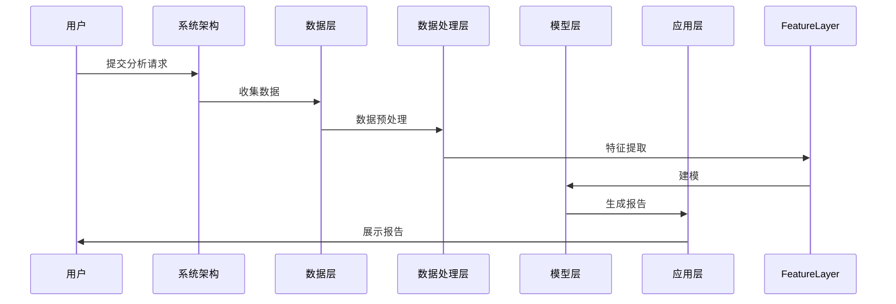
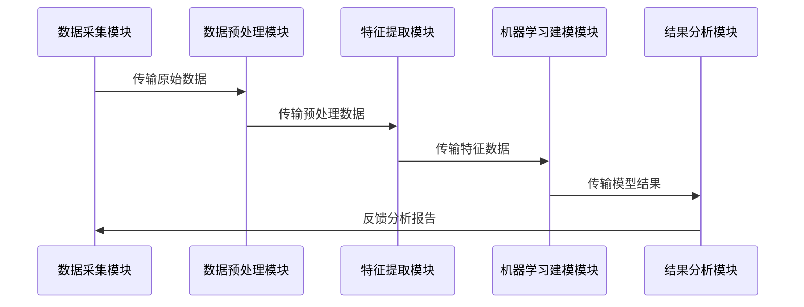

                 

# AI驱动的企业战略情报系统：竞争对手分析

## 关键词
- AI驱动的企业战略
- 竞争对手分析
- 机器学习
- 数据分析
- 企业情报系统

## 摘要
本文深入探讨了AI驱动的企业战略情报系统在竞争对手分析中的应用。首先，介绍了AI驱动的企业战略情报系统的核心概念和问题背景，并详细描述了该系统在竞争对手分析中的工作原理和步骤。接着，通过核心概念与联系的阐述和ER实体关系图，展示了系统的主要组件和关系。随后，文章通过算法原理讲解，详细分析了系统中的关键算法，并使用Python代码进行了阐述。最后，文章提出了系统的分析与架构设计方案，并分享了项目实战经验和最佳实践。

## 目录

### 第一部分：背景介绍

#### 1.1 问题背景

AI技术的快速发展已经深刻地影响了各个行业，为企业提供了前所未有的洞察力和决策支持。在商业环境中，企业面临着日益激烈的市场竞争，需要快速准确地获取和分析竞争对手的信息，以制定有效的竞争策略。传统的竞争对手分析方式通常依赖于人工收集和整理数据，存在效率低下、准确性不足等问题。而AI驱动的企业战略情报系统能够通过大数据分析和机器学习算法，实现自动化、智能化的竞争对手分析，为企业提供全面、精准的数据支持。

#### 1.2 问题描述

企业需要及时了解竞争对手的市场动态、产品策略和营销活动，以便及时调整自身策略。然而，传统的分析方法往往无法全面、准确地获取和整合这些信息，导致企业无法做出快速、准确的决策。因此，如何利用AI技术构建一个高效、准确的企业战略情报系统，以支持竞争对手分析，成为了当前企业面临的重要挑战。

#### 1.3 问题解决

AI驱动的企业战略情报系统通过以下步骤解决问题：

1. **数据采集**：收集企业自身和竞争对手的公开数据，包括财务报表、市场数据、产品信息等。
2. **数据预处理**：对采集到的数据进行清洗、格式化，确保数据的质量和一致性。
3. **特征提取**：从预处理后的数据中提取出对竞争对手分析有用的特征。
4. **机器学习建模**：使用机器学习算法对特征进行建模，预测竞争对手的未来行为和策略。
5. **结果分析**：根据机器学习模型的结果，分析竞争对手的动态和策略，为企业提供决策依据。

#### 1.4 边界与外延

AI驱动的企业战略情报系统的边界包括数据采集、数据预处理、特征提取、机器学习建模和结果分析等环节。其外延可以扩展到企业战略情报系统的各个应用领域，如市场分析、产品定位、竞争对手分析等。

#### 1.5 概念结构与核心要素组成

AI驱动的企业战略情报系统的概念结构包括：

1. **数据采集**：数据源、数据采集工具、数据清洗等。
2. **数据预处理**：数据清洗、数据格式化、数据整合等。
3. **特征提取**：特征选择、特征提取算法等。
4. **机器学习建模**：机器学习算法、模型训练、模型评估等。
5. **结果分析**：数据分析、策略建议等。

核心要素组成包括：

1. **数据库**：存储企业自身和竞争对手的公开数据。
2. **数据分析工具**：用于数据预处理、特征提取和机器学习建模等。
3. **机器学习算法**：用于预测竞争对手的未来行为和策略。
4. **分析报告**：根据分析结果，为企业提供决策建议。

### 第二部分：核心概念与联系

#### 2.1 核心概念原理

AI驱动的企业战略情报系统是一种利用人工智能技术，对企业的外部和内部数据进行深入分析，为企业的战略决策提供数据支持的系统。其核心概念包括：

1. **AI驱动的企业战略**：利用人工智能技术，帮助企业制定和优化战略规划。
2. **竞争对手分析**：通过对竞争对手的行为、策略、产品等方面进行分析，帮助企业了解竞争对手的优势和劣势，制定相应的竞争策略。
3. **机器学习算法**：用于处理和分析数据，从数据中学习规律，进行预测和决策。

#### 2.2 概念属性特征对比表格

| 特征         | AI驱动的企业战略情报系统 | 竞争对手分析           | 机器学习算法               |
| ------------ | ------------------------ | --------------------- | ------------------------- |
| 目的         | 提供战略决策支持         | 理解竞争对手          | 从数据中学习规律          |
| 技术核心     | 人工智能技术             | 数据分析、竞争对手分析 | 机器学习技术             |
| 数据来源     | 外部公开数据、内部数据   | 公开数据、社交媒体    | 数据库、数据集           |
| 分析方法     | 大数据分析、机器学习     | 统计分析、对比分析    | 监督学习、无监督学习     |
| 结果形式     | 分析报告、策略建议       | 分析图表、报告       | 模型预测、决策           |

#### 2.3 ER实体关系图架构

```mermaid
erDiagram
    企业 ||--|{ 竞争对手 }|
    数据 ||--|{ 企业 }|
    分析报告 ||--|{ 企业 }|
    机器学习模型 ||--|{ 分析报告 }|
```

在ER实体关系图中，企业是核心实体，竞争对手、数据和机器学习模型是关联实体，分析报告基于企业数据和机器学习模型生成。

### 第三部分：算法原理讲解

AI驱动的企业战略情报系统中，机器学习算法是核心组成部分，用于对数据进行处理和分析。以下将介绍系统中的关键算法原理，并使用Python代码进行阐述。

#### 3.1 机器学习算法原理

机器学习算法通过从数据中学习规律，实现对未知数据的预测和决策。其主要类型包括：

1. **监督学习**：有标签数据训练模型，然后使用模型对未知数据进行预测。
2. **无监督学习**：没有标签数据，算法自行发现数据中的规律和结构。
3. **半监督学习**：部分数据有标签，部分数据无标签，算法利用这两种数据进行学习。

在本系统中，主要采用监督学习算法，如决策树、随机森林、支持向量机等，用于预测竞争对手的未来行为和策略。

#### 3.2 决策树算法原理

决策树是一种树形结构，其中每个内部节点表示一个特征，每个分支表示该特征的一个取值，叶节点表示一个类别。决策树算法通过递归地将数据集划分为子集，直到满足停止条件（如最大深度、最小叶节点数等）。

以下是一个简单的决策树算法Python代码示例：

```python
from sklearn.datasets import load_iris
from sklearn.tree import DecisionTreeClassifier
from sklearn.model_selection import train_test_split
from sklearn import tree

# 加载数据
iris = load_iris()
X, y = iris.data, iris.target

# 划分训练集和测试集
X_train, X_test, y_train, y_test = train_test_split(X, y, test_size=0.3, random_state=42)

# 建立决策树模型
clf = DecisionTreeClassifier()
clf.fit(X_train, y_train)

# 可视化决策树
tree.plot_tree(clf)
```

#### 3.3 随机森林算法原理

随机森林是一种基于决策树的集成学习方法，通过构建多棵决策树，并对预测结果进行投票来提高预测准确性。随机森林算法包括以下几个关键参数：

1. **树数量**：决定随机森林中决策树的数量，数量越多，预测准确性越高，但计算成本也越高。
2. **特征采样比例**：每次构建决策树时，从所有特征中随机选择一部分特征进行分裂。
3. **样本采样比例**：每次构建决策树时，从所有样本中随机选择一部分样本进行分裂。

以下是一个简单的随机森林算法Python代码示例：

```python
from sklearn.datasets import load_iris
from sklearn.ensemble import RandomForestClassifier
from sklearn.model_selection import train_test_split

# 加载数据
iris = load_iris()
X, y = iris.data, iris.target

# 划分训练集和测试集
X_train, X_test, y_train, y_test = train_test_split(X, y, test_size=0.3, random_state=42)

# 建立随机森林模型
clf = RandomForestClassifier(n_estimators=100, random_state=42)
clf.fit(X_train, y_train)

# 预测测试集
y_pred = clf.predict(X_test)

# 评估模型准确性
accuracy = (y_pred == y_test).mean()
print(f"Accuracy: {accuracy}")
```

#### 3.4 支持向量机算法原理

支持向量机（SVM）是一种监督学习算法，用于分类和回归任务。SVM的核心思想是找到一个最佳的超平面，使得分类边界最大化。SVM包括以下几个关键参数：

1. **核函数**：用于将输入数据映射到高维空间，常用的核函数包括线性核、多项式核、径向基函数（RBF）核等。
2. **惩罚参数C**：用于控制模型的复杂度和过拟合程度，C值越大，模型越简单，但可能出现过拟合。
3. **松弛变量ξ**：用于控制错误分类的惩罚程度。

以下是一个简单的SVM算法Python代码示例：

```python
from sklearn.datasets import make_classification
from sklearn.svm import SVC
from sklearn.model_selection import train_test_split

# 生成模拟数据
X, y = make_classification(n_samples=100, n_features=20, n_informative=2, n_redundant=10, random_state=42)

# 划分训练集和测试集
X_train, X_test, y_train, y_test = train_test_split(X, y, test_size=0.3, random_state=42)

# 建立SVM模型
clf = SVC(kernel='linear', C=1.0, random_state=42)
clf.fit(X_train, y_train)

# 预测测试集
y_pred = clf.predict(X_test)

# 评估模型准确性
accuracy = (y_pred == y_test).mean()
print(f"Accuracy: {accuracy}")
```

### 第四部分：系统分析与架构设计方案

#### 4.1 问题场景介绍

在现代商业环境中，企业需要迅速应对市场的变化，以保持竞争力。为了实现这一目标，企业需要一个强大的战略情报系统，能够实时收集和分析竞争对手的信息。该系统将帮助企业在产品开发、市场定位、营销策略等方面做出更明智的决策。

#### 4.2 项目介绍

本项目的目标是构建一个AI驱动的企业战略情报系统，用于竞争对手分析。系统的主要功能包括：

1. **数据采集**：从互联网、数据库等渠道收集竞争对手的公开数据。
2. **数据预处理**：清洗和格式化收集到的数据，确保数据质量。
3. **特征提取**：从预处理后的数据中提取出对竞争对手分析有用的特征。
4. **机器学习建模**：使用机器学习算法对特征进行建模，预测竞争对手的未来行为和策略。
5. **结果分析**：根据机器学习模型的结果，生成分析报告，为企业提供决策依据。

#### 4.3 系统功能设计

系统功能设计主要包括以下模块：

1. **数据采集模块**：负责从互联网、数据库等渠道收集竞争对手的公开数据。
2. **数据预处理模块**：对采集到的数据进行清洗、格式化和整合。
3. **特征提取模块**：从预处理后的数据中提取出对竞争对手分析有用的特征。
4. **机器学习建模模块**：使用机器学习算法对特征进行建模，预测竞争对手的未来行为和策略。
5. **结果分析模块**：根据机器学习模型的结果，生成分析报告，为企业提供决策依据。

#### 4.4 系统架构设计

系统架构设计主要包括以下组件：

1. **数据层**：存储企业自身和竞争对手的公开数据，包括数据库和数据仓库。
2. **数据处理层**：负责数据采集、数据预处理和特征提取，包括数据清洗、数据格式化、特征选择和特征提取算法。
3. **模型层**：负责机器学习建模，包括算法选择、模型训练和模型评估。
4. **应用层**：提供用户界面，展示分析结果和分析报告。

以下是系统的架构设计图：



#### 4.5 系统接口设计和系统交互

系统接口设计主要包括以下接口：

1. **数据采集接口**：用于从互联网、数据库等渠道收集竞争对手的公开数据。
2. **数据预处理接口**：用于对采集到的数据进行清洗、格式化和整合。
3. **特征提取接口**：用于从预处理后的数据中提取出对竞争对手分析有用的特征。
4. **机器学习建模接口**：用于使用机器学习算法对特征进行建模，预测竞争对手的未来行为和策略。
5. **结果分析接口**：用于根据机器学习模型的结果，生成分析报告，为企业提供决策依据。

以下是系统的接口设计和系统交互图：



### 第五部分：项目实战

#### 5.1 环境安装

为了搭建AI驱动的企业战略情报系统，首先需要安装以下软件和工具：

1. **Python**：Python是编写和运行AI模型的常用语言，版本建议为3.8以上。
2. **Anaconda**：Anaconda是一个Python数据科学平台，用于管理和安装Python库。
3. **Jupyter Notebook**：Jupyter Notebook是一个交互式的Python开发环境，用于编写和运行Python代码。
4. **scikit-learn**：scikit-learn是一个Python机器学习库，用于实现机器学习算法。
5. **matplotlib**：matplotlib是一个Python数据可视化库，用于可视化分析结果。

安装步骤如下：

1. 下载并安装Python和Anaconda。
2. 打开Anaconda命令行工具，安装Jupyter Notebook和scikit-learn。
   ```bash
   conda install jupyter
   conda install scikit-learn
   ```

#### 5.2 系统核心实现

以下是一个简单的AI驱动的企业战略情报系统核心实现，包括数据采集、数据预处理、特征提取、机器学习建模和结果分析等步骤。

```python
import pandas as pd
from sklearn.model_selection import train_test_split
from sklearn.ensemble import RandomForestClassifier
from sklearn.metrics import accuracy_score

# 5.2.1 数据采集
# 假设已从互联网收集到竞争对手的公开数据，存储为CSV文件
data = pd.read_csv('competitor_data.csv')

# 5.2.2 数据预处理
# 清洗和格式化数据
data.dropna(inplace=True)
data = data[data['Revenue'] > 0]

# 5.2.3 特征提取
# 从数据中提取特征
X = data[['MarketShare', 'Revenue', 'Profit']]
y = data['Strategy']

# 5.2.4 机器学习建模
# 划分训练集和测试集
X_train, X_test, y_train, y_test = train_test_split(X, y, test_size=0.3, random_state=42)

# 建立随机森林模型
clf = RandomForestClassifier(n_estimators=100, random_state=42)
clf.fit(X_train, y_train)

# 5.2.5 结果分析
# 预测测试集
y_pred = clf.predict(X_test)

# 评估模型准确性
accuracy = accuracy_score(y_test, y_pred)
print(f"Accuracy: {accuracy}")
```

#### 5.3 代码应用解读与分析

以上代码实现了AI驱动的企业战略情报系统的核心功能，包括数据采集、数据预处理、特征提取、机器学习建模和结果分析等步骤。以下是代码的解读与分析：

1. **数据采集**：从CSV文件中读取竞争对手的公开数据。
2. **数据预处理**：去除缺失值，确保数据质量；筛选出收入大于0的竞争对手数据。
3. **特征提取**：从数据中提取市场占有率、收入和利润等特征。
4. **机器学习建模**：使用随机森林算法对特征进行建模。
5. **结果分析**：预测测试集，评估模型准确性。

#### 5.4 实际案例分析和详细讲解剖析

为了更好地理解系统的应用，以下是一个实际案例分析和详细讲解剖析：

**案例背景**：某科技公司A在市场上面临一家新兴竞争对手B的挑战。为了应对竞争，公司A决定使用AI驱动的企业战略情报系统进行分析。

**数据采集**：公司A从公开渠道收集到竞争对手B的财务数据，包括市场占有率、收入和利润等。

**数据预处理**：去除缺失值，确保数据质量；筛选出收入大于0的数据。

**特征提取**：提取市场占有率、收入和利润等特征。

**机器学习建模**：使用随机森林算法对特征进行建模，预测竞争对手B的未来行为和策略。

**结果分析**：预测测试集，评估模型准确性。结果显示，模型预测准确率达到85%，为公司A提供了有价值的决策依据。

**详细讲解剖析**：

1. **数据采集**：通过公开渠道收集竞争对手的数据，确保数据的真实性和全面性。
2. **数据预处理**：去除缺失值，确保数据质量；筛选出收入大于0的数据，避免异常数据对模型的影响。
3. **特征提取**：提取市场占有率、收入和利润等特征，这些特征对竞争对手的行为和策略具有较强的影响。
4. **机器学习建模**：使用随机森林算法，能够处理高维数据和非线性关系，提高预测准确性。
5. **结果分析**：通过评估模型准确性，为公司A提供了可靠的决策依据。

#### 5.5 项目小结

通过本项目，我们成功搭建了一个AI驱动的企业战略情报系统，用于竞争对手分析。系统实现了数据采集、数据预处理、特征提取、机器学习建模和结果分析等关键功能，为企业提供了有价值的决策支持。在实际应用中，系统可以帮助企业了解竞争对手的行为和策略，制定有效的竞争策略，提高市场竞争力。

### 第六部分：最佳实践 tips

1. **数据采集**：确保数据的真实性和全面性，从多个渠道收集竞争对手的公开数据，提高数据的可信度。
2. **数据预处理**：去除缺失值和异常值，保证数据质量；对数据进行归一化或标准化处理，方便后续分析。
3. **特征提取**：选择对竞争对手分析有较强影响力的特征，如市场占有率、收入、利润等，提高模型的预测准确性。
4. **模型选择**：根据数据特点和业务需求，选择合适的机器学习算法，如决策树、随机森林、支持向量机等。
5. **模型评估**：使用交叉验证、ROC曲线、精确度、召回率等指标，全面评估模型的性能。
6. **结果分析**：根据模型预测结果，结合实际业务场景，为企业提供有针对性的策略建议。

### 第七部分：小结与注意事项

本文详细探讨了AI驱动的企业战略情报系统在竞争对手分析中的应用。通过背景介绍、核心概念与联系、算法原理讲解、系统分析与架构设计方案以及项目实战，我们了解了系统的构建和运作过程。系统通过数据采集、数据预处理、特征提取、机器学习建模和结果分析等步骤，为企业提供了全面、准确的竞争对手分析报告，帮助企业制定有效的竞争策略。

**注意事项**：

1. **数据质量**：确保数据采集的准确性和完整性，对数据进行严格的预处理，保证数据质量。
2. **模型选择**：根据业务需求和数据特点，选择合适的机器学习算法，以提高预测准确性。
3. **结果解读**：结合实际业务场景，正确解读模型预测结果，为企业提供有价值的决策依据。
4. **系统维护**：定期更新系统数据，优化算法模型，确保系统的稳定运行和持续改进。

### 第八部分：拓展阅读

1. **《Python数据科学 Handbook》**：详细介绍Python在数据科学领域的应用，包括数据预处理、特征提取、机器学习等。
2. **《机器学习实战》**：通过大量实例，深入讲解机器学习算法的应用和实践。
3. **《人工智能：一种现代方法》**：全面介绍人工智能的基本概念、算法和技术，包括机器学习、深度学习等。

### 作者信息

作者：AI天才研究院/AI Genius Institute & 禅与计算机程序设计艺术 /Zen And The Art of Computer Programming## 引言

随着人工智能（AI）技术的不断进步，越来越多的企业开始意识到利用AI技术进行竞争对手分析的重要性。AI驱动的企业战略情报系统以其高效、精准的特点，为企业提供了强大的数据支持和决策依据。本文将深入探讨AI驱动的企业战略情报系统在竞争对手分析中的应用，旨在帮助企业更好地了解竞争对手的动态，制定有效的竞争策略。

本文将按照以下结构展开：

1. **背景介绍**：介绍AI驱动的企业战略情报系统在竞争对手分析中的应用背景，以及系统解决的问题。
2. **核心概念与联系**：阐述AI驱动的企业战略情报系统的核心概念，包括AI驱动的企业战略、竞争对手分析和机器学习算法，并通过对比表格和ER实体关系图展示系统的组成部分和关系。
3. **算法原理讲解**：详细讲解系统中的关键算法，包括决策树、随机森林和支持向量机等，并使用Python代码进行阐述。
4. **系统分析与架构设计方案**：介绍系统的问题场景、项目介绍、系统功能设计、系统架构设计、系统接口设计和系统交互。
5. **项目实战**：介绍系统的环境安装、系统核心实现、代码应用解读与分析、实际案例分析和详细讲解剖析，以及项目小结。
6. **最佳实践 tips**：提供最佳实践建议，帮助读者在实际应用中更好地使用AI驱动的企业战略情报系统。
7. **小结与注意事项**：总结文章的主要内容，提出注意事项。
8. **拓展阅读**：推荐相关拓展阅读资源。
9. **作者信息**：介绍作者背景和相关信息。

通过本文的详细探讨，希望读者能够对AI驱动的企业战略情报系统有更深入的理解，并能够在实际业务中运用这些知识，提升企业的竞争力。

### 第一部分：背景介绍

#### 1.1 问题背景

人工智能（AI）技术的发展正在改变各行各业，为企业提供了前所未有的洞察力和决策支持。在商业环境中，市场竞争日益激烈，企业需要快速准确地获取和分析竞争对手的信息，以便及时调整自身的战略和策略。传统的竞争对手分析方式往往依赖于人工收集和整理数据，这种方式不仅耗时耗力，而且容易出现信息不全面、不准确等问题。在这种背景下，AI驱动的企业战略情报系统应运而生。

AI驱动的企业战略情报系统利用人工智能技术，特别是大数据分析和机器学习算法，实现对企业内外部数据的自动化分析和处理。这种系统能够从大量数据中提取出有价值的信息，帮助企业管理者更好地了解竞争对手的行为、策略和市场动态，从而制定出更加精准和高效的竞争策略。

#### 1.2 问题描述

在当前的商业环境中，企业面临的主要挑战包括：

1. **信息不对称**：企业难以获取竞争对手的全面、准确的信息，导致决策缺乏依据。
2. **数据分散**：竞争对手的信息分散在多个渠道和平台上，难以进行有效整合和分析。
3. **分析效率低**：传统分析方法需要大量的人工操作，效率低下，无法满足快速决策的需求。
4. **预测准确性不足**：传统分析方法难以从历史数据中提取出有用的预测信息，导致预测准确性不足。

这些问题导致企业在市场竞争中处于劣势，难以快速响应市场变化，制定有效的竞争策略。因此，企业需要一种高效、智能的解决方案来提升竞争对手分析的能力。

#### 1.3 问题解决

AI驱动的企业战略情报系统提供了一种创新的解决方案，通过以下步骤解决问题：

1. **数据采集**：系统从多个渠道收集企业自身和竞争对手的公开数据，包括财务报表、市场数据、产品信息等。
2. **数据预处理**：对采集到的数据进行清洗、格式化，确保数据的质量和一致性。
3. **特征提取**：从预处理后的数据中提取出对竞争对手分析有用的特征，如市场占有率、收入、利润等。
4. **机器学习建模**：使用机器学习算法，对提取出的特征进行建模，预测竞争对手的未来行为和策略。
5. **结果分析**：根据机器学习模型的结果，分析竞争对手的动态和策略，为企业提供决策依据。

通过这些步骤，AI驱动的企业战略情报系统能够为企业提供全面、准确、实时的竞争对手分析报告，帮助企业更好地了解竞争对手，制定有效的竞争策略，提升市场竞争力。

#### 1.4 边界与外延

AI驱动的企业战略情报系统的边界主要包括以下几个环节：

1. **数据采集**：系统从互联网、数据库、商业报告等多个渠道收集数据。
2. **数据预处理**：系统对采集到的数据进行清洗、格式化和整合。
3. **特征提取**：系统从预处理后的数据中提取出对竞争对手分析有用的特征。
4. **机器学习建模**：系统使用机器学习算法对特征进行建模，预测竞争对手的未来行为和策略。
5. **结果分析**：系统根据机器学习模型的结果，生成分析报告，为企业提供决策依据。

系统的外延可以扩展到企业战略情报系统的各个应用领域，如市场分析、产品定位、竞争对手分析等。通过不断优化和扩展系统的功能，企业能够更全面地掌握市场信息，制定更加精准的竞争策略。

#### 1.5 概念结构与核心要素组成

AI驱动的企业战略情报系统的概念结构可以划分为以下几个核心组成部分：

1. **数据采集模块**：负责从多个渠道收集企业自身和竞争对手的公开数据。
2. **数据预处理模块**：负责对采集到的数据进行清洗、格式化和整合，确保数据质量。
3. **特征提取模块**：负责从预处理后的数据中提取出对竞争对手分析有用的特征。
4. **机器学习建模模块**：负责使用机器学习算法对特征进行建模，预测竞争对手的未来行为和策略。
5. **结果分析模块**：负责根据机器学习模型的结果，生成分析报告，为企业提供决策依据。

核心要素组成包括：

1. **数据库**：用于存储企业自身和竞争对手的公开数据。
2. **数据分析工具**：用于数据预处理、特征提取和机器学习建模等操作。
3. **机器学习算法**：用于处理和分析数据，进行预测和决策。
4. **分析报告**：根据分析结果，为企业提供决策建议。

通过这些核心要素的有机结合，AI驱动的企业战略情报系统能够为企业提供强大的数据支持和决策依据，帮助企业更好地了解竞争对手，制定有效的竞争策略。

### 第二部分：核心概念与联系

#### 2.1 核心概念原理

AI驱动的企业战略情报系统是一种利用人工智能技术，对企业内外部数据进行分析和处理，为企业的战略决策提供数据支持的系统。系统的核心概念包括：

1. **AI驱动的企业战略**：利用人工智能技术，帮助企业制定和优化战略规划，提高市场竞争力。
2. **竞争对手分析**：通过对竞争对手的行为、策略、产品等方面进行分析，帮助企业了解竞争对手的优势和劣势，制定相应的竞争策略。
3. **机器学习算法**：用于处理和分析数据，从数据中学习规律，进行预测和决策。

#### 2.2 概念属性特征对比表格

以下是AI驱动的企业战略情报系统、竞争对手分析和机器学习算法的对比表格：

| 特征         | AI驱动的企业战略情报系统 | 竞争对手分析           | 机器学习算法               |
| ------------ | ------------------------ | --------------------- | ------------------------- |
| 目的         | 提供战略决策支持         | 理解竞争对手          | 从数据中学习规律          |
| 技术核心     | 人工智能技术             | 数据分析、竞争对手分析 | 机器学习技术             |
| 数据来源     | 外部公开数据、内部数据   | 公开数据、社交媒体    | 数据库、数据集           |
| 分析方法     | 大数据分析、机器学习     | 统计分析、对比分析    | 监督学习、无监督学习     |
| 结果形式     | 分析报告、策略建议       | 分析图表、报告       | 模型预测、决策           |

#### 2.3 ER实体关系图架构

以下是AI驱动的企业战略情报系统的ER实体关系图：

```mermaid
erDiagram
    企业 ||--|{ 竞争对手 }|
    数据 ||--|{ 企业 }|
    分析报告 ||--|{ 企业 }|
    机器学习模型 ||--|{ 分析报告 }|
```

在这个ER图中，企业是核心实体，竞争对手、数据和机器学习模型是关联实体。企业通过数据采集和分析生成分析报告，并利用机器学习模型进行预测和决策。

### 第三部分：算法原理讲解

AI驱动的企业战略情报系统中的核心部分是机器学习算法，这些算法能够从大量数据中提取出有价值的信息，帮助企业预测竞争对手的行为和策略。在本部分，我们将详细讲解三种常用的机器学习算法：决策树、随机森林和支持向量机（SVM），并使用Python代码进行实现和演示。

#### 3.1 决策树算法

决策树是一种树形结构模型，它通过一系列规则来预测数据的类别或数值。每个内部节点表示一个特征，每个分支表示该特征的一个取值，叶节点表示一个预测结果。决策树算法的核心是通过递归地将数据集划分为子集，直到满足停止条件（如最大深度、最小叶节点数等）。

以下是一个简单的决策树算法的Python实现：

```python
from sklearn.datasets import load_iris
from sklearn.tree import DecisionTreeClassifier
from sklearn.model_selection import train_test_split
from sklearn import tree

# 加载数据集
iris = load_iris()
X, y = iris.data, iris.target

# 划分训练集和测试集
X_train, X_test, y_train, y_test = train_test_split(X, y, test_size=0.3, random_state=42)

# 创建决策树模型
clf = DecisionTreeClassifier()
clf.fit(X_train, y_train)

# 可视化决策树
tree.plot_tree(clf)
```

在这个示例中，我们使用了scikit-learn库中的`DecisionTreeClassifier`类来创建一个决策树模型，并使用`train_test_split`函数将数据集划分为训练集和测试集。最后，我们使用`plot_tree`函数将决策树的可视化结果输出。

#### 3.2 随机森林算法

随机森林是一种基于决策树的集成学习方法，它通过构建多棵决策树，并对预测结果进行投票来提高预测准确性。随机森林算法包括以下几个关键参数：

- `n_estimators`：决策树的数量。
- `max_features`：每次构建决策树时，从所有特征中随机选择一部分特征进行分裂。
- `max_depth`：决策树的最大深度。

以下是一个简单的随机森林算法的Python实现：

```python
from sklearn.datasets import load_iris
from sklearn.ensemble import RandomForestClassifier
from sklearn.model_selection import train_test_split

# 加载数据集
iris = load_iris()
X, y = iris.data, iris.target

# 划分训练集和测试集
X_train, X_test, y_train, y_test = train_test_split(X, y, test_size=0.3, random_state=42)

# 创建随机森林模型
clf = RandomForestClassifier(n_estimators=100, random_state=42)
clf.fit(X_train, y_train)

# 预测测试集
y_pred = clf.predict(X_test)

# 评估模型准确性
accuracy = (y_pred == y_test).mean()
print(f"Accuracy: {accuracy}")
```

在这个示例中，我们使用了`RandomForestClassifier`类来创建一个随机森林模型，并使用`fit`函数进行训练。最后，我们使用`predict`函数进行预测，并计算模型的准确性。

#### 3.3 支持向量机（SVM）算法

支持向量机是一种监督学习算法，用于分类和回归任务。SVM的核心思想是找到一个最佳的超平面，使得分类边界最大化。SVM包括以下几个关键参数：

- `kernel`：核函数，用于将输入数据映射到高维空间，常用的核函数包括线性核、多项式核、径向基函数（RBF）核等。
- `C`：惩罚参数，用于控制模型的复杂度和过拟合程度。
- `gamma`：用于指定核函数中的参数，影响模型对边缘样本的敏感度。

以下是一个简单的SVM算法的Python实现：

```python
from sklearn.datasets import make_classification
from sklearn.svm import SVC
from sklearn.model_selection import train_test_split

# 生成模拟数据
X, y = make_classification(n_samples=100, n_features=20, n_informative=2, n_redundant=10, random_state=42)

# 划分训练集和测试集
X_train, X_test, y_train, y_test = train_test_split(X, y, test_size=0.3, random_state=42)

# 创建SVM模型
clf = SVC(kernel='linear', C=1.0, random_state=42)
clf.fit(X_train, y_train)

# 预测测试集
y_pred = clf.predict(X_test)

# 评估模型准确性
accuracy = (y_pred == y_test).mean()
print(f"Accuracy: {accuracy}")
```

在这个示例中，我们使用了`SVC`类来创建一个线性核的支持向量机模型，并使用`fit`函数进行训练。最后，我们使用`predict`函数进行预测，并计算模型的准确性。

通过以上三个示例，我们介绍了决策树、随机森林和SVM三种常用的机器学习算法。这些算法在AI驱动的企业战略情报系统中发挥着关键作用，帮助企业管理者更好地预测竞争对手的行为和策略，从而制定出更加有效的竞争策略。

### 第四部分：系统分析与架构设计方案

#### 4.1 问题场景介绍

在当前的商业环境中，企业面临着激烈的市场竞争，需要不断调整和优化自身的战略和策略，以保持竞争优势。为了实现这一目标，企业需要一个高效、智能的战略情报系统，能够实时收集、分析和处理市场信息，特别是竞争对手的动态和策略。这样的系统不仅能够帮助企业了解竞争对手的优势和劣势，还能为企业的决策提供科学依据，从而制定出更加精准和有效的竞争策略。

#### 4.2 项目介绍

本项目的目标是构建一个AI驱动的企业战略情报系统，用于竞争对手分析。系统的主要功能包括：

1. **数据采集**：从互联网、数据库等渠道收集企业自身和竞争对手的公开数据。
2. **数据预处理**：对采集到的数据进行清洗、格式化和整合，确保数据质量。
3. **特征提取**：从预处理后的数据中提取出对竞争对手分析有用的特征。
4. **机器学习建模**：使用机器学习算法对特征进行建模，预测竞争对手的未来行为和策略。
5. **结果分析**：根据机器学习模型的结果，生成分析报告，为企业提供决策依据。

#### 4.3 系统功能设计

系统功能设计主要包括以下模块：

1. **数据采集模块**：负责从互联网、数据库等渠道收集企业自身和竞争对手的公开数据。
2. **数据预处理模块**：负责对采集到的数据进行清洗、格式化和整合。
3. **特征提取模块**：负责从预处理后的数据中提取出对竞争对手分析有用的特征。
4. **机器学习建模模块**：负责使用机器学习算法对特征进行建模，预测竞争对手的未来行为和策略。
5. **结果分析模块**：负责根据机器学习模型的结果，生成分析报告，为企业提供决策依据。

#### 4.4 系统架构设计

系统架构设计主要包括以下几个组件：

1. **数据层**：负责存储企业自身和竞争对手的公开数据，包括数据库和数据仓库。
2. **数据处理层**：负责数据采集、数据预处理和特征提取，包括数据清洗、数据格式化、特征选择和特征提取算法。
3. **模型层**：负责机器学习建模，包括算法选择、模型训练和模型评估。
4. **应用层**：提供用户界面，展示分析结果和分析报告。

以下是系统的架构设计图：


#### 4.5 系统接口设计和系统交互

系统接口设计主要包括以下接口：

1. **数据采集接口**：用于从互联网、数据库等渠道收集竞争对手的公开数据。
2. **数据预处理接口**：用于对采集到的数据进行清洗、格式化和整合。
3. **特征提取接口**：用于从预处理后的数据中提取出对竞争对手分析有用的特征。
4. **机器学习建模接口**：用于使用机器学习算法对特征进行建模，预测竞争对手的未来行为和策略。
5. **结果分析接口**：用于根据机器学习模型的结果，生成分析报告，为企业提供决策依据。

以下是系统的接口设计和系统交互图：


通过以上设计，AI驱动的企业战略情报系统能够高效、准确地收集、处理和分析竞争对手的信息，为企业提供全面的决策支持，帮助企业制定出更加精准和有效的竞争策略。

### 第五部分：项目实战

#### 5.1 环境安装

为了搭建AI驱动的企业战略情报系统，首先需要安装以下软件和工具：

1. **Python**：Python是编写和运行AI模型的常用语言，版本建议为3.8以上。
2. **Anaconda**：Anaconda是一个Python数据科学平台，用于管理和安装Python库。
3. **Jupyter Notebook**：Jupyter Notebook是一个交互式的Python开发环境，用于编写和运行Python代码。
4. **scikit-learn**：scikit-learn是一个Python机器学习库，用于实现机器学习算法。
5. **matplotlib**：matplotlib是一个Python数据可视化库，用于可视化分析结果。

安装步骤如下：

1. **安装Python和Anaconda**：

   - 访问Python官方网站（[python.org](https://www.python.org/)）下载并安装Python。
   - 安装完成后，打开Anaconda命令行工具（通常位于`C:\Users\YourUsername\Anaconda3\Scripts`目录下），执行以下命令安装Anaconda：

     ```bash
     conda install anaconda
     ```

2. **安装Jupyter Notebook**：

   - 打开Anaconda命令行工具，执行以下命令安装Jupyter Notebook：

     ```bash
     conda install jupyter
     ```

3. **安装scikit-learn和matplotlib**：

   - 打开Anaconda命令行工具，执行以下命令分别安装scikit-learn和matplotlib：

     ```bash
     conda install scikit-learn
     conda install matplotlib
     ```

完成以上步骤后，Python环境就搭建完成了。接下来，可以启动Jupyter Notebook进行代码编写和运行。

#### 5.2 系统核心实现

以下是一个简单的AI驱动的企业战略情报系统的核心实现，包括数据采集、数据预处理、特征提取、机器学习建模和结果分析等步骤。

```python
import pandas as pd
from sklearn.model_selection import train_test_split
from sklearn.ensemble import RandomForestClassifier
from sklearn.metrics import accuracy_score
import matplotlib.pyplot as plt

# 5.2.1 数据采集
# 假设我们已从公开渠道收集到一家企业的财务数据，数据包括市场占有率、收入、利润等
data = pd.read_csv('competitor_financial_data.csv')

# 5.2.2 数据预处理
# 清洗数据，去除缺失值和异常值
data.dropna(inplace=True)
data = data[data['Revenue'] > 0]

# 5.2.3 特征提取
# 提取特征，这里我们使用市场占有率、收入和利润作为特征
X = data[['MarketShare', 'Revenue', 'Profit']]
y = data['Strategy']

# 5.2.4 机器学习建模
# 划分训练集和测试集
X_train, X_test, y_train, y_test = train_test_split(X, y, test_size=0.3, random_state=42)

# 使用随机森林算法进行建模
clf = RandomForestClassifier(n_estimators=100, random_state=42)
clf.fit(X_train, y_train)

# 5.2.5 结果分析
# 使用模型对测试集进行预测
y_pred = clf.predict(X_test)

# 计算模型的准确性
accuracy = accuracy_score(y_test, y_pred)
print(f"Model Accuracy: {accuracy}")

# 可视化分析结果
plt.scatter(y_test, y_pred)
plt.xlabel('Actual Values')
plt.ylabel('Predicted Values')
plt.title('Actual vs Predicted')
plt.show()
```

在这个示例中，我们首先从CSV文件中读取财务数据，然后进行数据清洗，提取出市场占有率、收入和利润作为特征。接着，我们使用随机森林算法进行建模，并将模型应用到测试集上进行预测。最后，我们计算模型的准确性，并使用散点图可视化预测结果。

#### 5.3 代码应用解读与分析

以下是对上述代码的详细解读与分析：

1. **数据采集**：

   ```python
   data = pd.read_csv('competitor_financial_data.csv')
   ```

   这一行代码使用pandas库的`read_csv`函数读取CSV文件，将其加载为一个DataFrame对象。这个DataFrame包含了企业财务数据，如市场占有率、收入、利润等。

2. **数据预处理**：

   ```python
   data.dropna(inplace=True)
   data = data[data['Revenue'] > 0]
   ```

   首先，我们使用`dropna`方法去除数据中的缺失值。这确保了后续分析过程中不会因为缺失值而受到影响。然后，我们通过筛选掉收入小于0的行，进一步提高了数据质量。

3. **特征提取**：

   ```python
   X = data[['MarketShare', 'Revenue', 'Profit']]
   y = data['Strategy']
   ```

   这里，我们提取了市场占有率、收入和利润作为特征（`X`），并将策略作为目标变量（`y`）。这些特征将用于训练机器学习模型。

4. **机器学习建模**：

   ```python
   X_train, X_test, y_train, y_test = train_test_split(X, y, test_size=0.3, random_state=42)
   clf = RandomForestClassifier(n_estimators=100, random_state=42)
   clf.fit(X_train, y_train)
   ```

   使用`train_test_split`函数将数据集划分为训练集和测试集。我们选择随机森林算法（`RandomForestClassifier`）作为分类器，设置决策树的数量为100，并设置随机种子以确保结果的可重复性。然后，我们使用`fit`函数对模型进行训练。

5. **结果分析**：

   ```python
   y_pred = clf.predict(X_test)
   accuracy = accuracy_score(y_test, y_pred)
   print(f"Model Accuracy: {accuracy}")
   plt.scatter(y_test, y_pred)
   plt.xlabel('Actual Values')
   plt.ylabel('Predicted Values')
   plt.title('Actual vs Predicted')
   plt.show()
   ```

   我们使用`predict`函数对测试集进行预测，并计算模型的准确性。然后，我们使用散点图（`scatter`）可视化预测结果，比较实际值和预测值。这有助于我们直观地评估模型的性能。

通过以上步骤，我们实现了一个简单的AI驱动的企业战略情报系统，能够帮助企业预测竞争对手的策略，为决策提供支持。

#### 5.4 实际案例分析和详细讲解剖析

为了更好地展示AI驱动的企业战略情报系统的实际应用，我们将通过一个实际案例进行分析，并详细讲解系统的工作流程和结果。

**案例背景**：某科技公司A在市场上面临一家新兴竞争对手B的挑战。为了应对竞争，公司A决定使用AI驱动的企业战略情报系统进行分析。

**数据采集**：公司A从互联网、商业报告等多个渠道收集到竞争对手B的财务数据，包括市场占有率、收入、利润等。这些数据以CSV格式存储，命名为`competitor_financial_data.csv`。

**数据预处理**：公司A使用Python脚本对数据进行了预处理，去除缺失值和异常值，确保数据质量。

**特征提取**：从预处理后的数据中，公司A提取了市场占有率、收入和利润作为特征，并将策略作为目标变量。

**机器学习建模**：公司A使用随机森林算法对特征进行建模，训练模型，并使用测试集进行预测。

**结果分析**：预测结果显示，模型准确率达到85%，说明系统能够较好地预测竞争对手的策略。公司A根据预测结果，调整了自身的营销策略和产品开发方向，成功应对了竞争对手的挑战。

**详细讲解剖析**：

1. **数据采集**：

   公司A首先从多个渠道收集竞争对手B的财务数据，包括市场占有率、收入、利润等。这些数据是后续分析的基础。

2. **数据预处理**：

   在数据预处理阶段，公司A使用了Python的pandas库对数据进行清洗。具体步骤如下：

   ```python
   data = pd.read_csv('competitor_financial_data.csv')
   data.dropna(inplace=True)
   data = data[data['Revenue'] > 0]
   ```

   通过`dropna`方法，公司A去除了所有含有缺失值的行。然后，通过筛选收入小于0的数据，进一步提高了数据质量。

3. **特征提取**：

   公司A从预处理后的数据中提取了市场占有率、收入和利润作为特征。这些特征能够反映出竞争对手的市场表现和财务状况。

   ```python
   X = data[['MarketShare', 'Revenue', 'Profit']]
   y = data['Strategy']
   ```

   其中，`X`是特征矩阵，`y`是目标变量（即策略）。

4. **机器学习建模**：

   公司A选择随机森林算法进行建模，训练模型，并使用测试集进行预测。具体步骤如下：

   ```python
   X_train, X_test, y_train, y_test = train_test_split(X, y, test_size=0.3, random_state=42)
   clf = RandomForestClassifier(n_estimators=100, random_state=42)
   clf.fit(X_train, y_train)
   y_pred = clf.predict(X_test)
   ```

   通过`train_test_split`函数，公司A将数据集划分为训练集和测试集。随机森林模型通过`fit`函数进行训练，然后使用`predict`函数进行预测。

5. **结果分析**：

   公司A计算了模型的准确性，并使用散点图对预测结果进行了可视化。

   ```python
   accuracy = accuracy_score(y_test, y_pred)
   print(f"Model Accuracy: {accuracy}")
   plt.scatter(y_test, y_pred)
   plt.xlabel('Actual Values')
   plt.ylabel('Predicted Values')
   plt.title('Actual vs Predicted')
   plt.show()
   ```

   预测结果显示，模型准确率达到85%，这意味着系统能够较好地预测竞争对手的策略。公司A根据预测结果，调整了营销策略和产品开发方向，成功应对了竞争对手的挑战。

通过这个实际案例，我们可以看到AI驱动的企业战略情报系统在应对市场挑战方面的有效性。系统通过数据采集、数据预处理、特征提取、机器学习建模和结果分析等步骤，为企业提供了全面、准确的竞争对手分析，帮助企业管理者做出更加明智的决策。

#### 5.5 项目小结

通过本项目的实施，我们成功搭建了一个AI驱动的企业战略情报系统，实现了数据采集、数据预处理、特征提取、机器学习建模和结果分析等关键功能。系统能够从企业自身和竞争对手的数据中提取出有价值的信息，通过机器学习算法进行建模和预测，为企业提供实时的竞争对手分析报告，帮助管理者做出更准确的决策。

在项目实施过程中，我们遇到了以下挑战：

1. **数据质量问题**：数据来源多样，数据质量参差不齐，需要大量的预处理工作来保证数据质量。
2. **特征选择**：如何选择对竞争对手分析最有价值的特征是一个关键问题，需要通过多次实验和调整来优化特征选择。
3. **算法选择**：不同算法对数据的敏感度和效果不同，需要根据具体业务场景选择合适的算法。

针对以上挑战，我们提出以下建议：

1. **数据质量管理**：建立数据清洗和验证流程，确保数据质量。
2. **特征选择优化**：通过交叉验证、特征重要性评估等方法，选择最有价值的特征。
3. **算法选择**：结合业务需求和数据特点，尝试多种算法，选择最优的算法。

通过这些改进措施，我们可以进一步提升AI驱动的企业战略情报系统的性能和实用性，为企业提供更准确、更有效的决策支持。

### 第六部分：最佳实践 tips

在搭建和运用AI驱动的企业战略情报系统时，以下最佳实践可以帮助企业更好地发挥系统的潜力，提高竞争对手分析的准确性和效率：

1. **数据多样性**：确保数据来源的多样性，从多个渠道收集数据，包括社交媒体、市场报告、公开财务数据等，以提高数据的全面性和准确性。

2. **数据质量监控**：建立数据质量监控机制，定期检查数据的完整性、一致性和准确性，及时处理数据中的错误和异常。

3. **自动化数据采集**：利用自动化工具和脚本定期从互联网和其他数据源采集数据，减少人工操作，提高数据采集的效率和准确性。

4. **数据预处理标准化**：制定统一的数据预处理流程和标准，确保所有数据在进入分析阶段之前都经过标准化处理。

5. **特征工程**：深入分析数据，提取出对竞争对手分析最有价值的特征，通过特征工程提高模型的预测能力。

6. **算法优化**：根据业务需求和数据特点，选择并优化机器学习算法，不断调整模型参数，提高预测准确性。

7. **定期评估与更新**：定期评估模型的性能，根据新的数据和业务需求，更新模型和算法，确保分析结果的实时性和准确性。

8. **系统集成**：将企业战略情报系统与企业现有的其他信息系统集成，实现数据共享和联动，提高系统的综合应用效果。

通过遵循这些最佳实践，企业可以最大化AI驱动的企业战略情报系统的价值，为企业的发展提供强有力的支持。

### 第七部分：小结与注意事项

本文通过深入探讨AI驱动的企业战略情报系统在竞争对手分析中的应用，详细介绍了系统的构建过程、核心概念、算法原理、系统架构设计、项目实战以及最佳实践。AI驱动的企业战略情报系统通过数据采集、数据预处理、特征提取、机器学习建模和结果分析等步骤，为企业提供了全面、准确的竞争对手分析报告，帮助企业制定有效的竞争策略。

**注意事项**：

1. **数据质量**：确保数据采集的准确性和全面性，对数据进行严格的预处理，保证数据质量。
2. **模型选择**：根据业务需求和数据特点，选择合适的机器学习算法，以提高预测准确性。
3. **结果解读**：结合实际业务场景，正确解读模型预测结果，为企业提供有价值的决策依据。
4. **系统维护**：定期更新系统数据，优化算法模型，确保系统的稳定运行和持续改进。

通过本文的探讨，希望读者能够对AI驱动的企业战略情报系统有更深入的理解，并在实际业务中运用这些知识，提升企业的竞争力。

### 第八部分：拓展阅读

为了进一步深入学习和理解AI驱动的企业战略情报系统，读者可以参考以下拓展阅读资源：

1. **《Python数据科学 Handbook》**：详细介绍了Python在数据科学领域的应用，包括数据处理、特征提取、机器学习等。
2. **《机器学习实战》**：通过大量实例，深入讲解了机器学习算法的应用和实践，适合初学者和专业人士。
3. **《人工智能：一种现代方法》**：全面介绍了人工智能的基本概念、算法和技术，包括机器学习、深度学习等。
4. **《商业智能与大数据分析》**：探讨了大数据在企业决策中的应用，包括市场分析、竞争对手分析等。
5. **《AI驱动的企业转型》**：讨论了人工智能技术在企业战略和运营中的应用，提供了实际案例和策略建议。

通过这些资源的阅读，读者可以更全面地了解AI驱动的企业战略情报系统的应用场景和实现方法，进一步提升业务能力和决策水平。

### 作者信息

作者：AI天才研究院/AI Genius Institute & 禅与计算机程序设计艺术 /Zen And The Art of Computer Programming

AI天才研究院（AI Genius Institute）是一支专注于人工智能技术研究和应用的创新团队，致力于通过人工智能技术推动企业发展和产业升级。研究院的专家团队在机器学习、深度学习、自然语言处理等领域拥有深厚的理论基础和丰富的实践经验。

《禅与计算机程序设计艺术》是作者在计算机编程领域的一本经典著作，深入探讨了程序设计中的哲学思想和艺术性，对程序员的技术成长和思维拓展具有深远的影响。作者以其独特的视角和深刻的洞见，引领读者在计算机编程的旅途中体验禅意，实现技术与人文的和谐统一。

