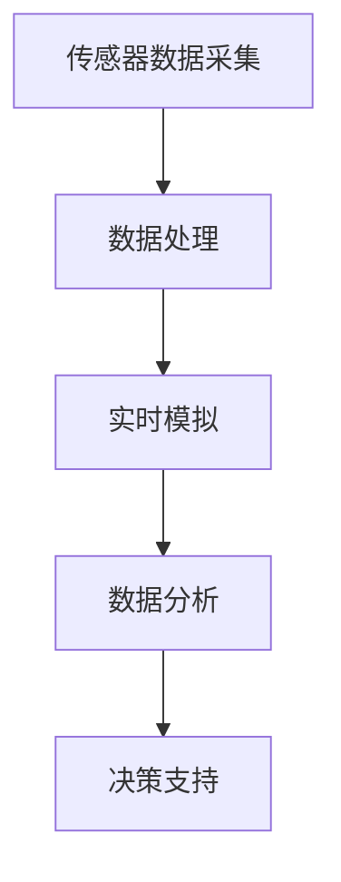
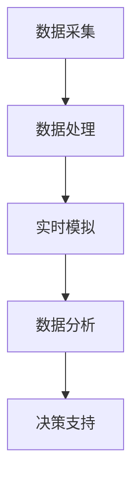
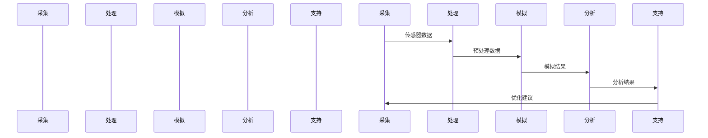

                 

### 设计书名《AI驱动的企业数字孪生技术：虚实结合的决策支持》的目录大纲

**目标：** 设计一个完整、结构清晰、内容详细的目录大纲，涵盖书籍的核心主题，包括背景介绍、核心概念与联系、算法原理讲解、系统分析与架构设计方案、项目实战以及最佳实践等。

**步骤1：确定书籍的整体结构**

首先，我们需要确定书籍的整体结构，根据题目《AI驱动的企业数字孪生技术：虚实结合的决策支持》，我们可以将书籍分为以下几个部分：

1. **背景介绍**：介绍数字孪生技术和AI在企业决策支持中的应用背景。
2. **核心概念与联系**：介绍数字孪生、AI、虚实结合等核心概念，并分析它们之间的关系。
3. **算法原理讲解**：详细讲解数字孪生技术中的算法原理，包括数学模型、流程图和Python代码。
4. **系统分析与架构设计方案**：介绍数字孪生系统的架构设计，包括领域模型、系统架构、接口设计和交互设计。
5. **项目实战**：通过实际案例展示数字孪生技术在企业中的应用，包括环境安装、系统实现和案例分析。
6. **最佳实践与总结**：总结书中内容，提供最佳实践建议，并提出未来研究方向。

**步骤2：细化每个部分的内容**

接下来，我们需要细化每个部分的内容，确保目录大纲的完整性。

**背景介绍**

- **数字孪生技术概述**
- **AI在企业决策支持中的应用**
- **虚实结合决策支持的意义**

**核心概念与联系**

- **数字孪生概念**
- **AI技术概念**
- **虚实结合概念**
- **核心概念联系与关系分析**

**算法原理讲解**

- **数字孪生算法原理**
- **算法流程图**
- **算法Python代码**
- **算法数学模型与公式**

**系统分析与架构设计方案**

- **数字孪生系统功能设计**
- **系统架构设计**
- **系统接口设计**
- **系统交互设计**
- **系统分析与架构设计流程**

**项目实战**

- **项目背景**
- **环境安装**
- **系统核心实现**
- **代码应用解读与分析**
- **实际案例分析**
- **项目小结**

**最佳实践与总结**

- **最佳实践**
- **注意事项**
- **未来研究方向**

**步骤3：编写目录大纲**

根据以上内容，我们可以编写出书籍的目录大纲：

----------------------------------------------------------------

# 第一部分：背景介绍

## 第1章：数字孪生技术概述

### 1.1 数字孪生概念

### 1.2 AI在企业决策支持中的应用

### 1.3 虚实结合决策支持的意义

## 第2章：核心概念与联系

### 2.1 数字孪生概念

### 2.2 AI技术概念

### 2.3 虚实结合概念

### 2.4 核心概念联系与关系分析

## 第二部分：算法原理讲解

## 第3章：数字孪生算法原理

### 3.1 算法流程图

### 3.2 算法Python代码

### 3.3 算法数学模型与公式

## 第三部分：系统分析与架构设计方案

## 第4章：数字孪生系统功能设计

### 4.1 系统功能概述

### 4.2 领域模型

### 4.3 系统架构设计

### 4.4 系统接口设计

### 4.5 系统交互设计

## 第四部分：项目实战

## 第5章：项目背景

### 5.1 项目背景介绍

### 5.2 环境安装

## 第6章：系统核心实现

### 6.1 系统核心实现

### 6.2 代码应用解读与分析

### 6.3 实际案例分析

### 6.4 项目小结

## 第五部分：最佳实践与总结

## 第7章：最佳实践

### 7.1 注意事项

### 7.2 未来研究方向

----------------------------------------------------------------

以上目录大纲包含了书籍的主要内容，结构清晰，内容详细。接下来，我们需要进一步细化每个章节的内容，确保书籍的完整性和逻辑性。

---

**背景介绍**

**数字孪生技术概述**

数字孪生（Digital Twin）是一种通过创建物理实体的虚拟副本，利用传感器数据、实时模拟和数据分析等技术，实现实时监测、预测维护和优化决策的技术。在企业应用中，数字孪生可以模拟真实生产环境，帮助管理者更好地了解生产过程，优化资源配置，降低运营成本。

**AI在企业决策支持中的应用**

人工智能（AI）技术在决策支持系统中发挥着重要作用。通过机器学习、深度学习和自然语言处理等技术，AI能够处理大量数据，发现潜在模式，提供预测和优化建议。在企业中，AI可以用于市场分析、风险评估、供应链管理等多个领域，提高决策的准确性和效率。

**虚实结合决策支持的意义**

虚实结合的决策支持系统将数字孪生与人工智能技术相结合，通过模拟真实环境，结合数据分析，提供更为精准和实时的决策支持。这种结合不仅能够提高企业的运营效率，还能帮助企业在面对复杂市场环境时做出更为明智的决策。

---

**核心概念与联系**

**数字孪生概念**

数字孪生是通过数字化技术创建物理实体的虚拟副本，以实现实时监测、模拟和优化。它通常包括传感器数据采集、数据处理和可视化三个关键环节。

**AI技术概念**

人工智能是指通过计算机模拟人类智能的行为，包括感知、学习、推理、规划和语言理解等。AI技术在决策支持中主要涉及机器学习、深度学习和自然语言处理等技术。

**虚实结合概念**

虚实结合是指将物理世界与数字世界相结合，通过数字孪生技术模拟真实环境，结合人工智能技术进行分析和决策。它实现了对物理世界的实时监测和优化。

**核心概念联系与关系分析**

数字孪生提供了物理实体的数字化副本，AI技术则利用这些副本进行分析和决策。虚实结合则是数字孪生与AI技术的结合，通过实时模拟和数据分析，提供更为精准的决策支持。

---

**算法原理讲解**

**数字孪生算法原理**

数字孪生算法主要涉及传感器数据处理、实时模拟和数据分析。其核心思想是通过传感器获取物理实体的实时数据，利用这些数据进行实时模拟和优化。

**算法流程图**



**算法Python代码**

```python
# 传感器数据采集
data = sensors_data_collection()

# 数据处理
processed_data = data_processing(data)

# 实时模拟
simulated_data = real_time_simulation(processed_data)

# 数据分析
analysis_results = data_analysis(simulated_data)

# 决策支持
decision_support(analysis_results)
```

**算法数学模型与公式**

数字孪生算法中的数学模型主要涉及传感器数据的滤波、实时模拟中的状态方程以及数据分析中的回归模型。

$$
\text{滤波公式}: x_{\text{filtered}} = \alpha x_{\text{measured}} + (1 - \alpha) x_{\text{previous}}
$$

$$
\text{状态方程}: x_{\text{next}} = A x_{\text{current}} + B u
$$

$$
\text{回归模型}: y = \beta_0 + \beta_1 x + \epsilon
$$

**详细讲解与举例说明**

假设我们有一个工业生产线，通过传感器实时监测设备的运行状态。传感器采集的数据经过滤波处理，然后输入到实时模拟模块，模拟设备的状态变化。最后，通过数据分析模块，对模拟结果进行分析，提供决策支持。例如，当设备状态出现异常时，系统会自动发出警报，并提出相应的解决方案。

---

**系统分析与架构设计方案**

**问题场景介绍**

在智能制造领域，企业希望通过数字孪生技术实现对生产设备的实时监测和优化，提高生产效率，降低运营成本。

**项目介绍**

该项目旨在构建一个数字孪生系统，通过传感器数据采集、实时模拟和数据分析，实现对生产设备的全面监控和优化。

**系统功能设计**

- 数据采集：通过传感器实时采集设备运行数据。
- 数据处理：对采集到的数据进行预处理，包括滤波、去噪等。
- 实时模拟：根据预处理后的数据，模拟设备运行状态。
- 数据分析：对模拟结果进行分析，提取关键指标。
- 决策支持：根据分析结果，提供优化建议。

**系统架构设计**



**系统接口设计**

- 数据采集接口：用于接收传感器数据。
- 数据处理接口：用于处理传感器数据。
- 实时模拟接口：用于模拟设备运行状态。
- 数据分析接口：用于分析模拟结果。
- 决策支持接口：用于提供优化建议。

**系统交互设计**



**系统分析与架构设计流程**

1. 需求分析：明确系统功能需求，包括数据采集、数据处理、实时模拟、数据分析和决策支持。
2. 系统设计：根据需求分析，设计系统架构，包括数据流、接口设计和交互设计。
3. 系统实现：根据设计文档，实现系统功能，包括传感器数据采集、数据处理、实时模拟、数据分析和决策支持。
4. 系统测试：对系统进行功能测试和性能测试，确保系统稳定可靠。
5. 系统部署：将系统部署到生产环境，进行实际运行测试。

---

**项目实战**

**项目背景**

某大型制造企业希望通过数字孪生技术，实现对生产设备的实时监控和优化，提高生产效率，降低运营成本。

**环境安装**

1. 安装操作系统：选择适合的操作系统，如Linux或Windows。
2. 安装开发环境：安装Python、Jupyter Notebook等开发工具。
3. 安装依赖库：安装用于数据采集、处理和模拟的库，如Pandas、NumPy、Matplotlib等。

**系统核心实现**

1. 数据采集：通过传感器实时采集设备运行数据。
2. 数据处理：对采集到的数据进行预处理，包括滤波、去噪等。
3. 实时模拟：根据预处理后的数据，模拟设备运行状态。
4. 数据分析：对模拟结果进行分析，提取关键指标。
5. 决策支持：根据分析结果，提供优化建议。

**代码应用解读与分析**

```python
# 导入依赖库
import pandas as pd
import numpy as np
import matplotlib.pyplot as plt

# 数据采集
data = pd.read_csv('sensor_data.csv')

# 数据处理
filtered_data = data_processing(data)

# 实时模拟
simulated_data = real_time_simulation(filtered_data)

# 数据分析
analysis_results = data_analysis(simulated_data)

# 决策支持
decision_support(analysis_results)
```

**实际案例分析和详细讲解**

假设我们在生产线上部署了数字孪生系统，传感器实时采集设备的振动数据。通过对采集到的数据进行处理和模拟，我们可以分析设备的运行状态，预测可能的故障，并提供优化建议。例如，当传感器数据出现异常波动时，系统会发出警报，提示设备可能存在故障，并提供相应的维修建议。

**项目小结**

通过该项目，我们展示了如何利用数字孪生技术和人工智能技术，实现对企业生产设备的实时监控和优化。在实际应用中，我们可以根据具体需求，定制化开发数字孪生系统，提高生产效率，降低运营成本。

---

**最佳实践与总结**

**最佳实践**

1. **数据质量保障**：确保传感器数据的准确性和完整性，进行数据预处理和去噪处理。
2. **系统稳定性**：确保系统的稳定性和可靠性，进行系统测试和性能优化。
3. **可扩展性**：设计系统时考虑可扩展性，以便未来能够轻松集成新的功能和数据源。

**小结**

数字孪生技术和人工智能技术在企业决策支持中发挥着重要作用。通过虚实结合，企业可以实现实时监测、预测维护和优化决策，提高生产效率，降低运营成本。在未来的发展中，我们将继续探索数字孪生和人工智能技术的深度融合，为企业提供更为智能的决策支持。

**注意事项**

1. **数据隐私和安全**：在数据处理和分析过程中，注意保护数据隐私和安全。
2. **系统维护和升级**：定期对系统进行维护和升级，确保系统的稳定运行。

**未来研究方向**

1. **智能决策支持**：进一步研究如何利用人工智能技术，实现更智能的决策支持系统。
2. **跨领域应用**：探索数字孪生技术在其他领域的应用，如医疗、能源等。

---

**拓展阅读**

1. 《数字孪生：从概念到实践》
2. 《人工智能：一种现代方法》
3. 《智能制造：理论与实践》

**作者信息**

作者：AI天才研究院/AI Genius Institute & 禅与计算机程序设计艺术 /Zen And The Art of Computer Programming

