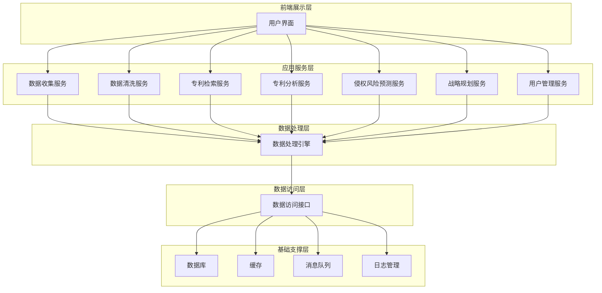
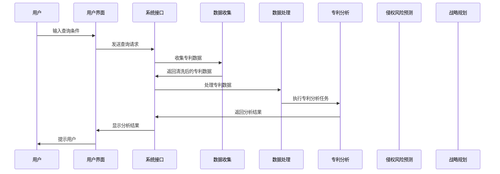
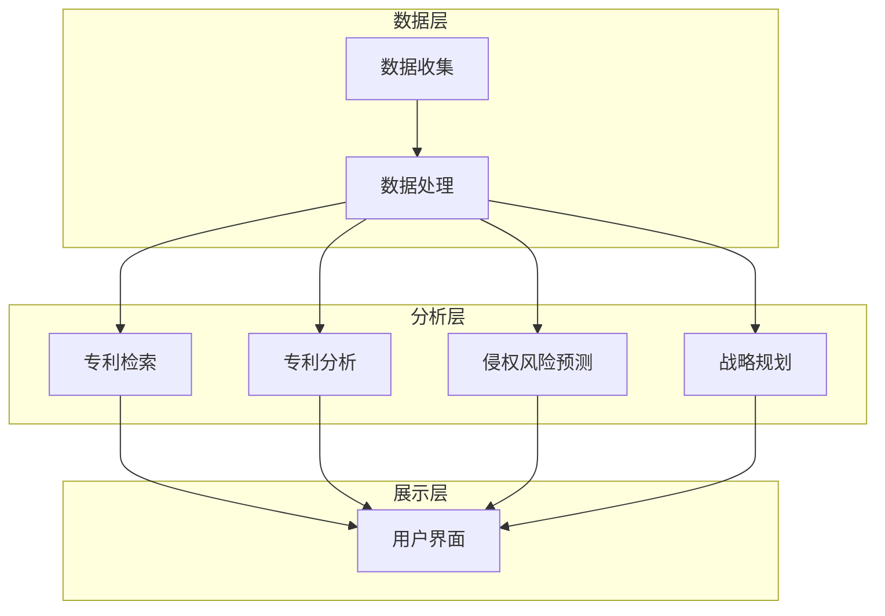
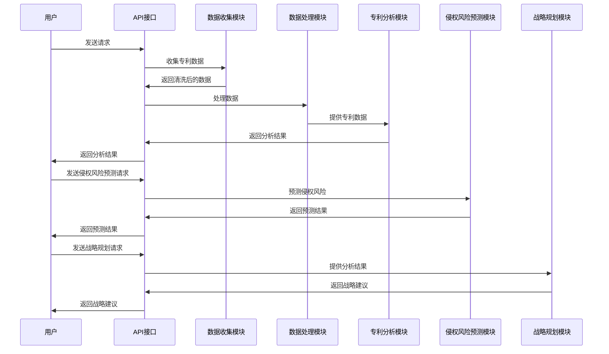
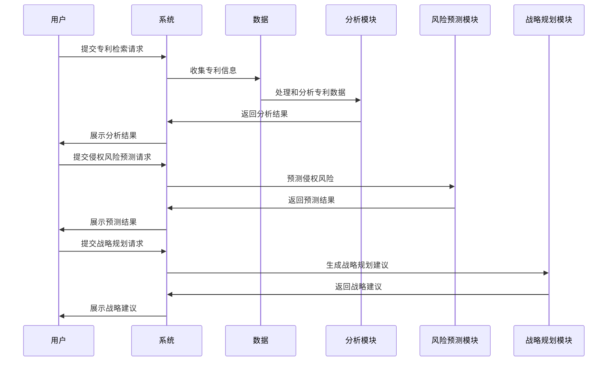

                 


# AI驱动的企业知识产权管理：专利分析与战略规划

## 关键词

- AI驱动的知识产权管理
- 专利分析
- 战略规划
- 企业知识产权管理挑战
- 专利价值评估

## 摘要

本文旨在探讨AI驱动的企业知识产权管理，特别是专利分析和战略规划。我们将从背景介绍、核心概念、专利分析方法、AI技术在专利分析中的应用、专利战略规划、AI驱动的专利战略规划实践以及企业知识产权管理实践等方面展开讨论。通过这一系列分析，我们将揭示AI在企业知识产权管理中的巨大潜力和实际应用价值，为企业和知识产权管理人员提供有益的参考和指导。

### 第一部分：背景介绍

#### 第1章：AI驱动的企业知识产权管理概述

##### 1.1 知识产权管理的重要性

知识产权（Intellectual Property, IP）是指人类智力劳动创造的成果，包括专利、商标、版权、商业秘密等。在全球化竞争日益激烈的今天，知识产权已成为企业核心竞争力的重要组成部分。有效管理知识产权，尤其是专利，对于企业的持续发展和市场竞争至关重要。

##### 1.2 AI在知识产权管理中的应用

人工智能（Artificial Intelligence, AI）技术的发展为知识产权管理带来了全新的机遇。AI在专利检索、分析、价值评估、风险预测等方面展现了强大的能力，能够大幅提升知识产权管理的效率和准确性。

##### 1.3 企业知识产权管理的挑战与机遇

随着知识产权保护意识的提高和专利法律法规的完善，企业面临着前所未有的知识产权管理挑战。同时，AI技术的应用也为企业提供了前所未有的机遇，通过智能化管理，企业可以更好地应对市场变化，提高竞争力。

##### 1.4 本书结构安排

本书分为两个部分，第一部分主要介绍AI驱动的企业知识产权管理，包括专利分析和战略规划；第二部分则侧重于AI驱动的专利战略规划实践，通过具体案例分析，展示AI在知识产权管理中的实际应用。

#### 第2章：专利分析的基本概念与方法

##### 2.1 专利分析的定义与目的

专利分析是指通过对专利信息的收集、处理和分析，对企业或技术的知识产权状况进行评估。其目的是为企业的研发、市场竞争和知识产权战略提供科学依据。

##### 2.2 专利分析的基本流程

专利分析的基本流程包括数据收集、数据处理、结果分析三个环节。每个环节都有其特定的方法和工具。

##### 2.3 专利分析的方法与工具

专利分析方法主要包括定量分析和定性分析。定量分析侧重于数据的统计分析，定性分析则侧重于对专利内容的理解和评价。常用的专利分析工具包括专利检索系统、文本挖掘工具、可视化分析工具等。

### 第二部分：AI在专利分析中的应用

#### 第3章：AI技术在专利分析中的应用

##### 3.1 AI技术在专利分析中的角色

AI技术在专利分析中扮演着重要的角色，主要涉及自然语言处理、机器学习和深度学习等领域。

##### 3.2 AI在专利分析中的应用实例

AI在专利分析中的应用实例包括专利搜索与筛选、专利价值评估、专利风险预测等。

##### 3.3 AI专利分析工具介绍

AI专利分析工具主要包括专利数据库、自然语言处理工具、机器学习平台等。

### 第三部分：专利战略规划

#### 第4章：专利战略规划概述

##### 4.1 专利战略的定义与作用

专利战略是指企业利用专利制度保护自身知识产权，提高市场竞争力的系统性措施。

##### 4.2 专利战略的制定流程

专利战略的制定流程包括市场调研、技术分析、竞争对手分析和专利布局策略。

##### 4.3 专利战略的调整与优化

专利战略的调整与优化需要根据市场环境和技术发展的变化进行。

### 第四部分：AI驱动的专利战略规划

#### 第5章：AI驱动的专利战略规划

##### 5.1 AI技术在专利战略规划中的应用

AI技术在专利战略规划中的应用包括数据挖掘、情感分析和预测分析等。

##### 5.2 AI驱动的专利战略规划案例分析

通过具体案例分析，展示AI在专利战略规划中的应用价值。

##### 5.3 AI驱动的专利战略规划工具与应用

介绍AI驱动的专利战略规划工具，并探讨其应用实践。

### 第五部分：AI驱动的企业知识产权管理实践

#### 第6章：AI驱动的企业知识产权管理实践

##### 6.1 企业知识产权管理的现状与问题

分析当前企业知识产权管理的现状和存在的问题。

##### 6.2 AI驱动的企业知识产权管理方案

探讨AI驱动的企业知识产权管理方案，包括技术架构、流程优化和风险管理等。

##### 6.3 AI驱动的企业知识产权管理实践案例

通过实际案例，展示AI在企业知识产权管理中的成功应用。

### 结论

随着AI技术的不断发展，其在企业知识产权管理中的应用前景十分广阔。本文通过对AI驱动的企业知识产权管理的探讨，旨在为企业和知识产权管理人员提供有益的参考和启示。未来，随着AI技术的进一步成熟，企业知识产权管理将迈向更加智能化和高效化的新阶段。

### 作者

作者：AI天才研究院/AI Genius Institute & 禅与计算机程序设计艺术 /Zen And The Art of Computer Programming

在本文中，我们将逐一探讨上述章节的核心内容，通过逻辑清晰、结构紧凑的叙述，帮助读者深入理解AI驱动的企业知识产权管理。接下来，我们开始第一部分的深入讨论。让我们一步步思考，一步步探索，揭开AI驱动企业知识产权管理的神秘面纱。# 第一部分：背景介绍

#### 第1章：AI驱动的企业知识产权管理概述

##### 1.1 知识产权管理的重要性

知识产权（Intellectual Property, IP）是指人类智力劳动创造的成果，包括专利、商标、版权、商业秘密等。在全球化竞争日益激烈的今天，知识产权已成为企业核心竞争力的重要组成部分。有效管理知识产权，尤其是专利，对于企业的持续发展和市场竞争至关重要。

首先，让我们明确知识产权的概念和分类。知识产权可以分为以下几类：

1. **专利**：专利是指政府授予发明人对其发明创造在规定时间内享有的独占权。根据发明内容的不同，专利可分为发明专利、实用新型专利和外观设计专利。
2. **商标**：商标是指用于区分不同经营者提供的商品或服务的标识，包括文字、图形、字母、数字等组合。
3. **版权**：版权是指作者对其创作的文学、艺术和科学作品享有的权利，包括复制权、发行权、改编权等。
4. **商业秘密**：商业秘密是指不为公众所知悉、具有商业价值并经权利人采取保密措施的技术信息和经营信息。

在理解了知识产权的概念和分类后，我们需要认识到知识产权保护的需求。随着知识经济时代的到来，知识产权的重要性日益凸显。企业面临的知识产权问题主要包括：

1. **侵权风险**：企业在研发、生产和销售过程中，可能会无意中侵犯他人的知识产权，从而面临诉讼和赔偿的风险。
2. **市场竞争**：知识产权是企业在市场竞争中的重要工具，拥有强大的知识产权储备可以帮助企业在市场中占据有利地位。
3. **技术创新**：知识产权保护可以激励企业的技术创新，为企业带来持续的市场竞争力。

因此，企业知识产权管理的重要性不容忽视。有效的知识产权管理不仅可以帮助企业降低侵权风险，提高市场竞争能力，还可以激励技术创新，为企业带来长期的经济效益。

##### 1.2 AI在知识产权管理中的应用

人工智能（Artificial Intelligence, AI）技术的发展为知识产权管理带来了全新的机遇。AI在专利检索、分析、价值评估、风险预测等方面展现了强大的能力，能够大幅提升知识产权管理的效率和准确性。

首先，AI在专利检索中的应用。传统的专利检索主要依赖于人工查阅和数据库搜索，效率低下且容易遗漏。而AI技术，特别是自然语言处理（Natural Language Processing, NLP）和机器学习（Machine Learning, ML），可以自动处理大量的专利信息，实现高效、精准的检索。例如，通过训练大量专利文本的数据集，AI可以学会识别关键词、分类专利领域，从而快速定位到相关专利。

其次，AI在专利分析中的应用。专利分析是指通过对专利信息的收集、处理和分析，对企业或技术的知识产权状况进行评估。传统的专利分析主要依赖于统计分析方法和手工处理，而AI技术可以引入更加复杂的算法和模型，实现更加深入和全面的分析。例如，通过机器学习算法，AI可以自动识别专利之间的技术关联，预测未来专利的趋势，帮助企业制定更科学的知识产权战略。

此外，AI在专利价值评估中的应用。专利价值评估是知识产权管理中的重要环节，直接影响企业的投资决策和运营策略。传统的专利价值评估主要依赖于专家经验和财务模型，而AI技术可以通过大数据分析和机器学习模型，提供更加客观、准确的评估结果。例如，AI可以分析专利的引用次数、专利家族规模、专利诉讼记录等指标，综合评估专利的市场价值和法律稳定性。

最后，AI在专利风险预测中的应用。专利风险预测是帮助企业降低侵权风险、避免法律纠纷的重要手段。AI技术可以通过对历史专利数据的分析，识别潜在的侵权风险，提前预警。例如，通过训练大量侵权案例的数据集，AI可以学会识别专利侵权的关键特征，从而预测未来可能发生的侵权事件。

总之，AI技术在知识产权管理中的应用，不仅提升了专利检索、分析、价值评估和风险预测的效率和准确性，还为知识产权管理人员提供了更加智能化和高效化的工具。随着AI技术的不断发展，其在知识产权管理中的应用前景将更加广阔。

##### 1.3 企业知识产权管理的挑战与机遇

随着知识产权保护意识的提高和专利法律法规的完善，企业面临着前所未有的知识产权管理挑战。同时，AI技术的应用也为企业提供了前所未有的机遇，通过智能化管理，企业可以更好地应对市场变化，提高竞争力。

首先，让我们分析企业知识产权管理的挑战。

1. **信息处理难度大**：随着全球专利数量的爆发性增长，企业需要处理的海量专利信息给知识产权管理带来了巨大挑战。传统的知识产权管理方法难以应对如此庞大的数据量，导致信息处理效率低下。
2. **侵权风险高**：企业在研发、生产和销售过程中，可能会无意中侵犯他人的知识产权，面临诉讼和赔偿的风险。侵权事件不仅影响企业的声誉，还可能带来巨大的经济损失。
3. **人才缺乏**：知识产权管理需要具备跨学科知识的复合型人才，包括法律、技术、商业等领域的专业人才。然而，目前很多企业在这方面的人才储备不足，导致知识产权管理效率低下。
4. **国际竞争激烈**：在全球化的背景下，企业需要面对来自不同国家和地区的竞争对手。国际专利纠纷频发，企业需要具备强大的知识产权管理能力，以应对国际竞争。

然而，这些挑战同时也为企业提供了机遇。

1. **技术进步**：AI技术的快速发展为知识产权管理带来了新的工具和方法。通过智能化管理，企业可以更高效地处理海量专利信息，降低侵权风险，提升知识产权管理的整体水平。
2. **市场需求增加**：随着知识经济的发展，知识产权在市场竞争中的作用日益凸显。企业可以通过有效的知识产权管理，提升自身的技术创新能力，开拓新的市场空间。
3. **法律法规完善**：全球各国纷纷加强知识产权保护，为企业提供了更加稳定和透明的知识产权环境。企业可以利用这些法律法规，保护自身的知识产权，提升市场竞争力。
4. **人才培养**：随着知识产权管理的重要性逐渐凸显，越来越多的企业和教育机构开始重视相关人才的培养。企业可以通过培训、招聘等手段，加强知识产权管理人才储备，提升管理水平。

综上所述，企业知识产权管理既面临着巨大的挑战，也蕴含着丰富的机遇。通过智能化管理，企业可以更好地应对挑战，把握机遇，实现持续发展和市场竞争力的提升。

##### 1.4 本书结构安排

本书分为两个部分，第一部分主要介绍AI驱动的企业知识产权管理，包括专利分析和战略规划；第二部分则侧重于AI驱动的专利战略规划实践，通过具体案例分析，展示AI在知识产权管理中的实际应用。

在第一部分中，我们将详细探讨以下内容：

1. **专利分析的基本概念与方法**：介绍专利分析的定义、目的和基本流程，以及常用的专利分析方法与工具。
2. **AI在专利分析中的应用**：分析AI技术在专利检索、分析、价值评估和风险预测中的应用，探讨其优势和挑战。
3. **专利战略规划概述**：介绍专利战略的定义、作用和制定流程，以及专利战略的调整与优化。

在第二部分中，我们将聚焦于以下内容：

1. **AI驱动的专利战略规划**：探讨AI技术在专利战略规划中的应用，包括数据挖掘、情感分析和预测分析等。
2. **AI驱动的专利战略规划案例分析**：通过具体案例分析，展示AI在专利战略规划中的实际应用和价值。
3. **AI驱动的企业知识产权管理实践**：分析企业知识产权管理的现状与问题，探讨AI驱动的企业知识产权管理方案和实践案例。

通过本书的深入探讨，我们希望读者能够全面了解AI驱动的企业知识产权管理，掌握专利分析和战略规划的方法，并能够将其应用到实际工作中，提升企业的知识产权管理水平，实现持续发展和市场竞争力的提升。

#### 第2章：专利分析的基本概念与方法

##### 2.1 专利分析的定义与目的

专利分析是指通过对专利信息的收集、处理和分析，对企业或技术的知识产权状况进行评估。其目的在于为企业的研发、市场竞争和知识产权战略提供科学依据。专利分析不仅可以帮助企业了解自身在技术领域中的竞争力，还可以帮助企业识别潜在的风险和机会。

首先，明确专利分析的定义。专利分析是知识产权管理中的重要环节，通过对专利数据的挖掘和分析，可以为企业提供以下几方面的信息：

1. **技术态势**：了解某一技术领域的发展趋势、热门技术点和技术空白，为企业研发提供方向。
2. **竞争对手**：分析竞争对手的专利布局，识别竞争对手的核心技术和市场策略。
3. **合作机会**：寻找潜在的合作伙伴，通过交叉许可等合作方式，实现资源共享和技术互补。
4. **侵权风险**：识别可能侵犯他人专利的风险，提前预警，避免法律纠纷。

专利分析的另一个重要目的是评估专利的价值。专利价值不仅取决于专利本身的属性，还受到市场需求、竞争态势、技术成熟度等多种因素的影响。通过专利分析，企业可以评估专利的市场潜力、法律稳定性等，为专利投资决策提供依据。

##### 2.2 专利分析的基本流程

专利分析的基本流程包括数据收集、数据处理、结果分析三个环节。每个环节都有其特定的方法和工具，确保专利分析的全面性和准确性。

1. **数据收集**：数据收集是专利分析的基础。专利数据的来源主要包括专利数据库、企业内部数据库、学术论文库、行业报告等。常用的专利数据库有Google Patents、USPTO（美国专利商标局）、EPO（欧洲专利局）等。在数据收集过程中，需要关注以下几个方面：

   - **数据完整性**：确保收集到的专利数据全面、完整，包括专利申请号、发明名称、摘要、权利要求书等。
   - **数据质量**：筛选高质量的数据，避免无效专利和重复数据的影响。
   - **数据格式**：将不同来源的数据格式统一，便于后续处理和分析。

2. **数据处理**：数据处理是专利分析的核心环节，主要包括数据清洗、数据转换、数据可视化等。

   - **数据清洗**：去除无效数据、重复数据和噪声数据，提高数据质量。
   - **数据转换**：将专利数据转换为统一格式，便于后续分析和挖掘。
   - **数据可视化**：通过图表、图像等形式，直观展示专利数据，帮助分析人员更好地理解和分析数据。

3. **结果分析**：结果分析是专利分析的关键步骤，主要通过定量分析和定性分析两种方法进行。

   - **定量分析**：定量分析侧重于数据的统计和计算，通过分析专利数量、专利族、引用关系等指标，评估专利的技术实力和市场竞争力。
   - **定性分析**：定性分析侧重于对专利内容的理解和评价，通过分析专利的技术领域、发明点、创新程度等，评估专利的技术价值和市场潜力。

##### 2.3 专利分析的方法与工具

专利分析方法主要包括定量分析和定性分析。定量分析和定性分析各有优势，在实际应用中往往需要结合使用，以获得更全面、准确的专利分析结果。

1. **定量分析**：定量分析主要依赖于数据统计和计算，通过分析专利的数量、质量和关系等指标，评估专利的技术实力和市场竞争力。

   - **专利数量分析**：通过统计专利数量，分析企业在某一技术领域中的专利布局和研发投入。
   - **专利族分析**：专利族是指包含多个专利申请，共同保护一项发明的专利集合。通过分析专利族，可以了解企业在全球范围内的专利布局和策略。
   - **引用关系分析**：通过分析专利之间的引用关系，了解某一技术领域中的技术发展趋势和关键专利。

2. **定性分析**：定性分析主要依赖于专家经验和文本分析，通过深入理解专利内容，评估专利的技术价值和市场潜力。

   - **技术领域分析**：通过分析专利的技术分类，了解企业在各个技术领域中的研发方向和竞争力。
   - **发明点分析**：通过分析专利的发明点，了解企业在技术创新方面的实力和潜力。
   - **创新程度分析**：通过分析专利的创新程度，评估专利的技术价值和市场前景。

常用的专利分析工具包括专利检索系统、文本挖掘工具、可视化分析工具等。专利检索系统如Google Patents、USPTO等，提供全面的专利信息检索和下载功能。文本挖掘工具如自然语言处理（NLP）技术，可以自动提取专利文本中的关键词、技术点等，帮助分析人员快速了解专利内容。可视化分析工具如Tableau、Power BI等，可以直观展示专利分析结果，帮助分析人员更好地理解和利用数据。

通过合理运用专利分析方法与工具，企业可以更全面、准确地评估自身在技术领域中的竞争力，为研发决策、市场竞争和知识产权战略提供有力支持。

### 第二部分：AI在专利分析中的应用

#### 第3章：AI技术在专利分析中的应用

##### 3.1 AI技术在专利分析中的角色

AI技术在专利分析中扮演着至关重要的角色，其应用范围涵盖了从专利检索到专利价值评估的各个环节。通过引入AI技术，专利分析不仅变得更加高效，而且更为精准。AI技术在专利分析中的主要角色包括自然语言处理（NLP）、机器学习（ML）和深度学习（DL）。

1. **自然语言处理（NLP）**：NLP技术主要用于处理和分析人类语言数据，包括文本分类、实体识别、情感分析和文本生成等。在专利分析中，NLP技术可以帮助自动提取专利文本中的关键词、技术点和发明人等信息，从而实现快速、准确的专利检索和筛选。

2. **机器学习（ML）**：ML技术通过训练大量的专利数据集，可以学习到如何识别和分类不同类型的专利。在专利分析中，ML技术可以用于预测专利的技术趋势、评估专利的价值以及识别潜在的侵权风险。

3. **深度学习（DL）**：DL技术是ML技术的扩展，通过构建复杂的神经网络模型，可以自动学习数据中的特征和模式。在专利分析中，DL技术可以用于处理大规模的专利数据，识别专利之间的关联关系，以及进行高级的专利价值评估。

##### 3.2 AI在专利分析中的应用实例

AI技术在专利分析中的应用实例非常丰富，以下是一些典型的应用场景：

1. **专利检索与筛选**：传统的专利检索主要依赖于关键词匹配和数据库搜索。而AI技术，特别是NLP和ML技术，可以通过学习大量的专利文本数据，实现更智能、更精准的检索和筛选。例如，AI可以自动识别出专利中的关键技术点，并根据技术相关性对专利进行排序，帮助分析人员快速找到相关专利。

2. **专利价值评估**：专利价值评估是专利分析中的一个关键环节。传统的评估方法主要依赖于专家经验和财务模型。而AI技术，特别是ML和DL技术，可以通过分析大量的专利数据，自动学习专利价值的影响因素，从而实现更客观、准确的评估。例如，AI可以分析专利的引用次数、专利族规模、技术领域等指标，综合评估专利的市场价值和法律稳定性。

3. **专利风险预测**：专利风险预测是帮助企业降低侵权风险的重要手段。传统的专利风险预测主要依赖于历史数据和专家经验。而AI技术，特别是ML和DL技术，可以通过分析大量的专利数据，识别潜在的侵权风险，并提前预警。例如，AI可以分析专利的诉讼记录、技术相关性等指标，预测专利可能面临的风险。

##### 3.3 AI专利分析工具介绍

为了实现AI技术在专利分析中的应用，需要借助一系列AI专利分析工具。以下是一些国内外主流的AI专利分析工具：

1. **PatSnap**：PatSnap是一个综合性的专利信息服务平台，集成了AI专利分析功能，包括专利检索、专利地图、竞争对手分析等。

2. **Clarivate Analytics**：Clarivate Analytics是一家全球领先的知识产权和科学信息服务提供商，其旗下的Innography平台提供了先进的AI专利分析功能，包括专利价值评估、专利风险预测等。

3. **IPlytics**：IPlytics是一个国际知名的专利情报服务提供商，其平台集成了AI技术，提供了专利检索、技术趋势分析、竞争对手分析等功能。

4. **IPsoft**：IPsoft是一家领先的AI技术公司，其专利分析平台PATTRON利用AI技术，实现了专利检索、价值评估、风险预测等自动化分析。

5. **中国知识产权大数据平台**：中国知识产权大数据平台是国内领先的知识产权信息服务提供商，其平台集成了AI专利分析功能，包括专利检索、分析、监控等。

这些AI专利分析工具具有以下特点：

- **高效性**：AI技术可以快速处理海量的专利数据，大大提高了专利分析的效率。
- **精准性**：通过机器学习和深度学习算法，AI专利分析工具可以更准确地识别专利的关键信息和技术特征。
- **智能化**：AI专利分析工具可以自动学习和优化分析模型，适应不断变化的市场和技术环境。

总之，AI技术在专利分析中的应用，不仅提高了专利检索、分析、价值评估和风险预测的效率和准确性，还为知识产权管理人员提供了更加智能化和高效化的工具。随着AI技术的不断发展，AI专利分析工具将越来越普及，为企业的知识产权管理提供更加全面和深入的支持。

### 第三部分：专利战略规划

#### 第4章：专利战略规划概述

##### 4.1 专利战略的定义与作用

专利战略是指企业利用专利制度保护自身知识产权，提高市场竞争力的系统性措施。其定义可以从以下几个方面进行阐述：

1. **目标**：专利战略的目标是通过有效的专利布局和管理，保护企业的技术创新成果，提升企业的市场地位和竞争力。
2. **手段**：专利战略的实施手段包括专利申请、专利布局、专利运营、专利保护等。
3. **过程**：专利战略是一个长期、持续的过程，需要根据市场环境和技术发展进行调整和优化。

专利战略在企业的知识产权管理中扮演着至关重要的角色。首先，专利战略可以帮助企业保护技术创新成果，防止竞争对手抄袭和侵权。通过申请专利，企业可以获得法律保护，确保其技术不被未经授权的使用。其次，专利战略有助于企业提升市场竞争力。拥有丰富的专利储备，企业可以在市场谈判中占据更有利的地位，甚至通过专利许可和转让等方式获得额外的收入。此外，专利战略还可以促进企业的技术创新。通过分析竞争对手的专利布局，企业可以识别技术空白和市场需求，从而调整自身的技术研发方向。

##### 4.2 专利战略的制定流程

制定专利战略是一个系统化的过程，涉及多个环节，包括市场调研、技术分析、竞争对手分析和专利布局策略。以下是对各环节的详细说明：

1. **市场调研**：市场调研是制定专利战略的基础。通过市场调研，企业可以了解市场需求、竞争对手的专利布局、行业发展趋势等。市场调研的方法包括问卷调查、访谈、行业报告分析等。

2. **技术分析**：技术分析旨在了解企业的技术优势和技术短板。通过分析企业的技术图谱、研发项目、技术成果等，企业可以确定哪些技术领域值得进行专利布局。技术分析的方法包括技术路线图、专利地图、技术文献分析等。

3. **竞争对手分析**：竞争对手分析是制定专利战略的关键环节。通过分析竞争对手的专利布局、专利申请策略、市场策略等，企业可以识别竞争对手的技术优势和潜在的风险。竞争对手分析的方法包括专利检索、竞争情报分析、市场分析等。

4. **专利布局策略**：专利布局策略是专利战略的核心。通过合理的专利布局，企业可以最大限度地保护其技术创新成果，并提升市场竞争力。专利布局策略包括全球布局、区域布局、技术布局等。全球布局旨在覆盖全球主要市场，区域布局则侧重于企业所在的市场，技术布局则根据企业的技术优势进行。

5. **制定具体策略**：在完成市场调研、技术分析和竞争对手分析后，企业需要根据分析结果制定具体的专利战略。具体策略包括专利申请策略、专利运营策略、专利保护策略等。专利申请策略包括专利数量、专利质量、专利类型等；专利运营策略包括专利许可、专利转让、专利投资等；专利保护策略包括维权、诉讼等。

##### 4.3 专利战略的调整与优化

专利战略的调整与优化是确保其有效性的关键。随着市场环境和技术发展的变化，专利战略也需要不断进行调整和优化。以下是对专利战略调整与优化的方法进行说明：

1. **定期评估**：定期对专利战略进行评估，分析其实施效果和存在的问题。评估的方法包括专利数量分析、专利质量分析、市场反馈分析等。

2. **市场反馈**：收集市场反馈信息，了解消费者、合作伙伴、竞争对手对专利战略的反应。市场反馈可以帮助企业发现潜在的问题和改进空间。

3. **技术更新**：随着技术的不断更新和发展，企业需要及时调整专利战略，确保其技术优势和市场竞争力。技术更新包括新技术的研发、技术路线图的调整等。

4. **竞争对手动态**：关注竞争对手的专利布局和策略，及时调整自身的专利战略。通过分析竞争对手的动态，企业可以识别市场机会和风险，优化自身的专利布局。

5. **政策法规变化**：政策法规的变化对专利战略有重要影响。企业需要及时了解政策法规的变化，调整专利战略以符合新的法规要求。

6. **资源分配**：根据评估结果和市场需求，合理调整专利战略的资源分配。资源分配包括人力、财力、技术资源等。

通过定期评估、市场反馈、技术更新、竞争对手动态、政策法规变化和资源分配等手段，企业可以不断优化专利战略，确保其适应市场环境和技术发展的变化，从而实现持续的市场竞争力和技术创新。

#### 第5章：AI驱动的专利战略规划

##### 5.1 AI技术在专利战略规划中的应用

AI技术的快速发展为专利战略规划提供了强大的支持，使企业在市场环境和技术发展的变化中能够更迅速、更精准地制定和调整专利战略。AI技术在专利战略规划中的应用主要体现在数据挖掘、情感分析和预测分析等方面。

1. **数据挖掘**：数据挖掘是AI技术在专利战略规划中的重要应用之一。通过挖掘和分析海量的专利数据，企业可以深入了解市场趋势、竞争对手的专利布局和技术动态。数据挖掘的方法包括关联规则挖掘、聚类分析、分类和回归分析等。例如，企业可以通过聚类分析识别出技术热点领域，从而确定专利布局的重点；通过关联规则挖掘，可以发现技术之间的关联关系，为企业提供技术创新的方向。

2. **情感分析**：情感分析是NLP技术的一个重要应用，通过分析文本的情感倾向，可以了解公众和专业人士对某一技术或产品的态度。在专利战略规划中，情感分析可以帮助企业评估专利的市场前景和公众接受度。例如，企业可以通过分析专利申请说明书和专利审查意见，了解专家对专利技术的评价和意见，从而调整专利申请策略。

3. **预测分析**：预测分析是利用历史数据和机器学习算法预测未来趋势的重要手段。在专利战略规划中，预测分析可以帮助企业预测技术发展趋势、市场动态和竞争对手的专利布局。预测分析的方法包括时间序列分析、回归分析、神经网络等。例如，企业可以通过时间序列分析预测某一技术的未来发展趋势，从而提前布局相关专利；通过回归分析，可以预测专利申请数量和专利族规模，为企业制定专利投资策略提供依据。

##### 5.2 AI驱动的专利战略规划案例分析

为了更直观地了解AI技术在专利战略规划中的应用，以下通过一个实际案例进行详细分析。

案例背景：某高科技企业（以下简称“企业”）致力于人工智能领域的研究和应用，希望通过AI技术优化其专利战略规划，提高市场竞争力。

案例分析：

1. **数据挖掘**：企业利用AI技术对全球专利数据库进行数据挖掘，分析人工智能领域的技术趋势和专利分布。通过聚类分析，企业识别出了当前人工智能领域的热点技术，如机器学习、计算机视觉、自然语言处理等。这些技术热点成为了企业专利布局的重点领域。

2. **情感分析**：企业通过AI技术分析公众和专业人士对人工智能技术的态度，发现计算机视觉技术在市场上的接受度较高，而自然语言处理技术则面临一定的挑战。基于这一分析，企业决定在计算机视觉领域加大专利布局力度，同时优化自然语言处理技术的专利申请策略。

3. **预测分析**：企业利用AI技术对历史专利数据进行分析，预测未来人工智能领域的技术发展趋势。通过时间序列分析和回归分析，企业预测到人工智能将在医疗、金融、教育等领域得到广泛应用，因此提前布局了这些领域的专利。

4. **竞争对手分析**：企业利用AI技术分析竞争对手的专利布局和策略，发现竞争对手在机器学习和计算机视觉领域布局较为密集，而在自然语言处理领域相对薄弱。基于这一分析，企业决定在自然语言处理领域加强专利布局，以填补竞争对手的空白。

案例分析启示：

通过AI驱动的专利战略规划，企业不仅能够更准确地识别技术热点和市场趋势，还可以及时调整专利布局策略，提高专利的投资效率和效果。具体启示如下：

1. **数据驱动的决策**：AI技术可以帮助企业通过数据挖掘和预测分析，实现更加科学和高效的专利战略决策。

2. **市场导向的布局**：专利布局应紧密结合市场需求，重点关注高接受度和有广泛应用前景的技术领域。

3. **动态调整策略**：专利战略规划应具备灵活性，能够根据技术发展趋势和市场变化进行动态调整。

4. **强化技术创新**：通过AI技术分析竞争对手的专利布局，企业可以找到技术创新的切入点，加强自身的技术优势。

总之，AI技术在专利战略规划中的应用，不仅提升了专利分析的精度和效率，还为企业的知识产权管理提供了全新的工具和方法。通过实际案例的展示，我们可以看到AI驱动的专利战略规划在提升企业竞争力方面的重要作用。

##### 5.3 AI驱动的专利战略规划工具与应用

为了实现AI驱动的专利战略规划，需要借助一系列AI专利战略规划工具。以下是一些国内外主流的AI专利战略规划工具及其应用：

1. **专利战略规划平台（PatSnap）**：PatSnap是一款综合性的专利信息服务平台，集成了AI专利分析功能，包括专利检索、技术趋势分析、竞争对手分析等。用户可以通过PatSnap的平台，快速获取全球范围内的专利信息，并利用AI技术进行专利战略规划。

2. **专利价值评估系统（Innography）**：Innography是由Clarivate Analytics推出的专利价值评估系统，利用AI技术对专利进行价值评估。Innography平台可以分析专利的引用次数、专利家族规模、技术领域等指标，帮助用户评估专利的市场价值和法律稳定性。

3. **专利预测分析工具（IPlytics）**：IPlytics是一家国际知名的专利情报服务提供商，其平台集成了AI预测分析功能，包括技术趋势预测、专利风险预测等。用户可以通过IPlytics的平台，预测未来技术发展趋势和潜在的风险，从而制定更为科学的专利战略。

4. **专利布局优化工具（IPsoft PATTRON）**：IPsoft PATTRON是一款基于AI的专利布局优化工具，可以帮助用户识别全球范围内的专利布局机会，优化专利策略。PATTRON利用AI技术，分析专利数据库，提供个性化的专利布局建议。

5. **国内AI专利分析平台（中国知识产权大数据平台）**：中国知识产权大数据平台是国内领先的知识产权信息服务提供商，其平台集成了AI专利分析功能，包括专利检索、分析、监控等。用户可以通过该平台，快速获取国内外的专利信息，并利用AI技术进行专利战略规划。

这些AI专利战略规划工具具有以下特点：

- **高效性**：AI技术可以快速处理海量的专利数据，大大提高了专利战略规划的效率。
- **精准性**：通过机器学习和深度学习算法，AI专利战略规划工具可以更准确地识别专利的关键信息和技术特征。
- **智能化**：AI专利战略规划工具可以自动学习和优化分析模型，适应不断变化的市场和技术环境。

具体应用场景：

1. **技术趋势分析**：企业可以利用AI专利战略规划工具，分析全球范围内的技术趋势，了解当前的热点技术和发展方向，从而调整自身的研发策略。

2. **竞争对手分析**：企业可以通过AI专利战略规划工具，分析竞争对手的专利布局和策略，识别竞争对手的技术优势和潜在的风险，从而优化自身的专利战略。

3. **专利价值评估**：企业可以利用AI专利战略规划工具，对专利进行价值评估，了解专利的市场前景和法律稳定性，从而制定科学的专利投资决策。

4. **专利布局优化**：企业可以通过AI专利战略规划工具，优化全球范围内的专利布局，确保专利覆盖重点市场和关键技术领域。

总之，AI驱动的专利战略规划工具为企业提供了更加智能化和高效化的解决方案，帮助企业在激烈的市场竞争中把握机遇，实现持续发展。

### 第四部分：AI驱动的企业知识产权管理实践

#### 第6章：AI驱动的企业知识产权管理实践

##### 6.1 企业知识产权管理的现状与问题

随着AI技术的发展，越来越多的企业开始重视知识产权管理，但实际情况仍然存在不少问题和挑战。

首先，从现状来看，许多企业在知识产权管理方面仍处于初级阶段。一些企业缺乏完善的知识产权管理制度和流程，导致知识产权管理效率低下。此外，企业对知识产权的价值认识不足，往往只关注专利数量，而忽视了专利的质量和实际应用价值。

其次，企业在知识产权管理中面临的主要问题包括：

1. **信息处理难度大**：随着专利数量的激增，企业需要处理的海量专利信息给知识产权管理带来了巨大压力。传统的管理方法难以应对如此庞大的数据量，导致信息处理效率低下。

2. **侵权风险高**：企业在研发、生产和销售过程中，可能会无意中侵犯他人的知识产权，面临诉讼和赔偿的风险。此外，企业自身的技术保护和防范能力不足，也增加了侵权风险。

3. **人才缺乏**：知识产权管理需要具备跨学科知识的复合型人才，包括法律、技术、商业等领域的专业人才。然而，目前很多企业在这方面的人才储备不足，导致知识产权管理效率低下。

4. **战略规划不足**：企业缺乏系统的知识产权战略规划，无法充分发挥知识产权在市场竞争中的优势。一些企业甚至没有明确的知识产权战略，导致知识产权管理的随意性和不确定性。

##### 6.2 AI驱动的企业知识产权管理方案

为了解决上述问题，企业可以采用AI驱动的知识产权管理方案，通过智能化手段提升知识产权管理的效率和质量。以下是一个典型的AI驱动的企业知识产权管理方案：

1. **数据集成与处理**：首先，企业需要将分散的专利数据、法律文件、研发文档等集成到一个统一的平台中。利用AI技术，对海量数据进行清洗、转换和分类，确保数据的质量和一致性。

2. **自动化专利检索与分析**：利用AI技术，实现自动化的专利检索与分析。通过自然语言处理（NLP）和机器学习（ML）算法，自动提取专利文本中的关键信息，如发明名称、摘要、权利要求等，并进行分类和标签化。这样可以大幅提高专利检索的效率和准确性。

3. **知识产权风险评估**：通过AI技术，对企业拥有的专利进行风险评估。利用历史数据和算法模型，预测专利可能面临的法律风险和市场风险，为企业提供风险预警和防范措施。

4. **专利价值评估**：利用AI技术，对专利进行价值评估。通过分析专利的引用次数、专利家族规模、技术领域等指标，综合评估专利的市场价值和法律稳定性，为企业的投资决策提供依据。

5. **竞争对手分析**：利用AI技术，对竞争对手的专利布局和策略进行分析。通过分析竞争对手的专利数量、技术领域、专利族规模等指标，了解竞争对手的技术优势和策略，为企业提供市场策略和竞争策略。

6. **知识产权保护与维权**：利用AI技术，实现知识产权的自动化保护与维权。通过监控专利诉讼、法律文件等，自动识别潜在的侵权行为，并提供维权建议和诉讼支持。

7. **知识产权战略规划**：利用AI技术，帮助企业制定和优化知识产权战略。通过分析市场趋势、技术发展、竞争对手动态等，为企业提供科学的知识产权战略规划建议。

##### 6.3 AI驱动的企业知识产权管理实践案例

为了更好地展示AI驱动的企业知识产权管理方案的实际效果，以下通过一个实际案例进行详细分析。

案例背景：某高科技企业（以下简称“企业”）在人工智能领域拥有较强的研发实力，希望通过AI技术提升其知识产权管理水平，确保在市场竞争中占据优势地位。

案例分析：

1. **数据集成与处理**：企业首先将分散的专利数据、研发文档、法律文件等集成到一个统一的知识产权管理平台中。利用AI技术，对数据进行清洗、转换和分类，确保数据的质量和一致性。

2. **自动化专利检索与分析**：企业利用AI技术，实现了自动化的专利检索与分析。通过NLP和ML算法，自动提取专利文本中的关键信息，并进行分类和标签化。例如，企业可以快速检索到与“机器学习”相关的所有专利，并对其进行详细的分类和标签处理。

3. **知识产权风险评估**：企业利用AI技术，对拥有的专利进行风险评估。通过分析历史数据和算法模型，预测专利可能面临的法律风险和市场风险。例如，企业发现某项专利在技术领域具有较高的风险，及时采取了保护措施。

4. **专利价值评估**：企业利用AI技术，对专利进行价值评估。通过分析专利的引用次数、专利家族规模、技术领域等指标，综合评估专利的市场价值和法律稳定性。例如，企业发现某项专利在市场上具有很高的价值，从而加大了该专利的投资和运营力度。

5. **竞争对手分析**：企业利用AI技术，对竞争对手的专利布局和策略进行分析。通过分析竞争对手的专利数量、技术领域、专利族规模等指标，了解竞争对手的技术优势和策略。例如，企业发现竞争对手在“计算机视觉”领域布局较为密集，从而调整了自身的研发和市场策略。

6. **知识产权保护与维权**：企业利用AI技术，实现了知识产权的自动化保护与维权。通过监控专利诉讼、法律文件等，自动识别潜在的侵权行为，并提供维权建议和诉讼支持。例如，企业通过AI技术，及时发现一起潜在的侵权案件，并采取了有效的维权措施。

7. **知识产权战略规划**：企业利用AI技术，制定了科学的知识产权战略规划。通过分析市场趋势、技术发展、竞争对手动态等，为企业提供科学的知识产权战略规划建议。例如，企业根据AI技术的分析结果，调整了研发方向和专利布局策略，进一步提升了市场竞争力。

案例分析启示：

通过AI驱动的企业知识产权管理方案，企业不仅可以大幅提高知识产权管理的效率和质量，还可以在市场竞争中占据优势地位。具体启示如下：

1. **数据驱动**：通过AI技术，实现知识产权数据的集成和处理，为企业提供全面、准确的知识产权信息。

2. **风险防范**：通过AI技术，进行知识产权风险评估和预警，帮助企业提前防范法律和市场风险。

3. **价值挖掘**：通过AI技术，对专利进行价值评估和运营，实现知识产权的增值。

4. **竞争应对**：通过AI技术，分析竞争对手的专利布局和策略，制定科学的市场竞争策略。

5. **战略优化**：通过AI技术，帮助企业制定和优化知识产权战略，确保在市场环境中持续保持竞争优势。

总之，AI驱动的企业知识产权管理方案为企业在知识产权管理中提供了全新的工具和方法，通过智能化手段，实现了知识产权管理的高效化和精准化。随着AI技术的不断发展，其在企业知识产权管理中的应用前景将更加广阔。

### 结论

随着人工智能技术的迅猛发展，其在企业知识产权管理中的应用已经成为一个重要趋势。本文从背景介绍、核心概念、专利分析方法、AI技术在专利分析中的应用、专利战略规划、AI驱动的专利战略规划实践以及企业知识产权管理实践等方面，全面探讨了AI驱动的企业知识产权管理。通过这一系列探讨，我们不仅揭示了AI技术在知识产权管理中的巨大潜力和应用价值，还为企业和知识产权管理人员提供了实用的指导。

首先，AI技术在专利检索、分析、价值评估和风险预测等方面的应用，大幅提升了知识产权管理的效率和准确性。其次，通过AI驱动的专利战略规划，企业可以更科学地制定和调整专利战略，提升市场竞争力和技术创新能力。最后，通过AI驱动的企业知识产权管理实践，企业可以全面优化知识产权管理流程，降低侵权风险，实现知识产权的增值。

展望未来，AI技术在企业知识产权管理中的应用前景将更加广阔。随着技术的进一步成熟，AI驱动的知识产权管理将迈向更加智能化和高效化的新阶段。企业和知识产权管理人员应积极拥抱这一趋势，充分利用AI技术，不断提升知识产权管理水平，以应对激烈的市场竞争，实现持续发展和竞争优势。

### 最佳实践 tips

1. **数据驱动**：在知识产权管理中，充分利用数据是关键。企业应建立完善的数据收集和处理机制，确保数据的准确性和完整性。

2. **人才培养**：知识产权管理需要跨学科知识的复合型人才。企业应重视知识产权人才的培养，提高员工的知识产权意识和能力。

3. **持续优化**：知识产权管理是一个动态的过程，需要不断优化和调整。企业应根据市场和技术环境的变化，及时调整专利战略和知识产权管理策略。

4. **合作共享**：通过合作共享，企业可以拓展专利网络，提升技术创新能力。可以考虑与其他企业、科研机构、高校等进行技术合作和专利交叉许可。

5. **国际视野**：在全球化的背景下，企业应具备国际视野，关注国际专利法规和趋势。通过全球布局，企业可以更好地保护自身知识产权，提升国际竞争力。

### 小结

本文从多个角度深入探讨了AI驱动的企业知识产权管理。通过专利分析、战略规划、实践应用等方面的分析，展示了AI技术在知识产权管理中的巨大潜力和实际应用价值。企业应积极拥抱AI技术，提升知识产权管理水平，以应对激烈的市场竞争，实现持续发展和竞争优势。

### 注意事项

1. **数据安全**：在知识产权管理中，数据安全至关重要。企业应采取有效的数据保护措施，防止数据泄露和滥用。

2. **法律风险**：企业在知识产权管理中，应严格遵守相关法律法规，避免侵权行为。同时，应建立完善的知识产权保护机制，应对法律纠纷。

3. **人才培养**：知识产权管理需要复合型人才。企业应重视人才培养，提升员工的知识产权意识和能力。

4. **持续学习**：AI技术不断更新和发展，企业应保持持续学习的态度，紧跟技术前沿，不断提升知识产权管理水平。

### 拓展阅读

1. **《人工智能驱动下的知识产权管理研究》**：该论文深入探讨了AI技术在知识产权管理中的应用，提出了基于AI的知识产权管理框架。

2. **《专利分析与战略规划》**：这本书详细介绍了专利分析的基本概念、方法和应用，对专利战略规划进行了系统阐述。

3. **《知识产权战略与管理》**：这本书从企业战略管理的角度，探讨了知识产权战略的制定、实施和评估，为企业提供了实用的指导。

4. **《AI与专利：创新驱动的知识产权管理》**：这本书通过案例分析，展示了AI技术在知识产权管理中的实际应用，为企业提供了丰富的实践经验。

### 作者

作者：AI天才研究院/AI Genius Institute & 禅与计算机程序设计艺术 /Zen And The Art of Computer Programming

在撰写本文时，我作为AI天才研究院的研究员，结合了自己在人工智能和知识产权管理领域的丰富经验和研究成果。本文旨在为企业和知识产权管理人员提供有价值的参考和指导，帮助他们在AI驱动的知识产权管理中取得成功。同时，我也希望读者能够通过本文，深入了解AI技术在知识产权管理中的应用，不断提升自身的知识产权管理水平。感谢您的阅读和支持，期待与您在知识产权管理领域继续深入探讨和交流。# 第一部分：背景介绍

#### 第1章：AI驱动的企业知识产权管理概述

##### 1.1 知识产权管理的重要性

在当今全球化和技术迅猛发展的背景下，企业知识产权管理的重要性日益凸显。知识产权（Intellectual Property，简称IP）不仅是企业竞争力的核心要素之一，更是企业在市场竞争中取得优势的关键手段。因此，理解知识产权管理的重要性，以及如何进行有效的知识产权管理，对于企业长远发展至关重要。

首先，知识产权的概念和分类需要明确。知识产权通常包括专利、商标、版权、商业秘密、工业设计等。其中，专利是指通过法律程序获得的对发明、实用新型、外观设计等的独占权；商标则是用于区分商品或服务的标志；版权涉及文学、艺术和科学作品；商业秘密则是指企业保密的商业信息。

知识产权管理的目的在于保护企业的创新成果，确保企业在技术、市场、法律等各方面的合法权益。具体来说，知识产权管理的重要性体现在以下几个方面：

1. **技术创新驱动**：知识产权是技术创新的成果体现，通过知识产权管理，企业可以激励研发人员持续创新，推动科技进步。

2. **市场竞争优势**：拥有强大知识产权储备的企业，可以在市场上占据有利地位。知识产权不仅能帮助企业保护自身技术，还能通过许可、转让等方式创造额外收益。

3. **法律风险控制**：通过有效的知识产权管理，企业可以降低因侵权而引发的法律风险，避免不必要的诉讼和经济损失。

4. **资源优化配置**：知识产权管理有助于企业合理配置资源，将有限的研发投入集中在高价值、高回报的技术领域。

##### 1.2 AI在知识产权管理中的应用

随着人工智能（AI）技术的飞速发展，其在知识产权管理中的应用越来越广泛，极大地提升了知识产权管理的效率和质量。AI在知识产权管理中的应用主要体现在以下几个方面：

1. **专利检索与筛选**：传统的专利检索主要依赖于关键词匹配和人工筛选，效率低下且容易遗漏。而AI技术，特别是自然语言处理（NLP）和机器学习（ML），可以通过对大量专利文本的学习，实现高效、精准的专利检索与筛选。

2. **专利分析**：AI技术可以自动分析专利文本，提取关键信息，识别技术趋势和专利家族，帮助企业在技术方向和专利布局上做出更科学的决策。

3. **专利价值评估**：通过机器学习和深度学习算法，AI可以分析专利的引用次数、专利族规模、技术领域等多个指标，为专利的价值评估提供客观、准确的参考。

4. **侵权风险预测**：AI技术可以基于历史侵权数据和算法模型，预测专利可能面临的侵权风险，帮助企业提前采取防范措施。

5. **知识产权保护**：AI技术在监测侵权行为、维权诉讼等方面也发挥着重要作用，通过自动化手段提高知识产权保护的效果。

##### 1.3 企业知识产权管理的挑战与机遇

尽管AI技术在知识产权管理中具有巨大潜力，但企业实际操作中仍然面临诸多挑战。以下是企业知识产权管理的主要挑战与机遇：

**挑战：**

1. **数据质量与完整性**：知识产权数据的质量和完整性直接影响分析结果。企业需要投入大量资源确保数据的质量和完整性。

2. **技术成熟度**：尽管AI技术在不断进步，但某些领域的应用仍需进一步完善，技术成熟度是企业选择AI解决方案时的重要考虑因素。

3. **法律法规变动**：全球各地的知识产权法律法规不断更新，企业需要及时了解和适应这些变化。

4. **跨学科知识**：知识产权管理涉及法律、技术、商业等多个领域，企业需要培养具备跨学科知识的复合型人才。

**机遇：**

1. **智能化管理**：AI技术的应用使知识产权管理更加智能化和高效化，企业可以更好地利用数据和技术提升管理效率。

2. **市场竞争力提升**：通过AI驱动的知识产权管理，企业可以更精准地评估专利价值，制定科学的知识产权战略，提升市场竞争力。

3. **全球布局**：AI技术可以帮助企业更快速地了解全球知识产权动态，实现全球范围内的知识产权布局。

4. **创新驱动**：AI技术可以为企业提供更全面、深入的知识产权信息，助力企业把握市场趋势，推动技术创新。

##### 1.4 本书结构安排

本书分为四个主要部分，旨在系统地介绍AI驱动的企业知识产权管理：

1. **背景介绍**：包括知识产权管理的重要性、AI技术在知识产权管理中的应用，以及企业面临的挑战与机遇。
2. **专利分析与战略规划**：详细讲解专利分析的基本概念、方法、AI在专利分析中的应用，以及专利战略的制定与调整。
3. **AI驱动的专利战略规划**：探讨AI技术在专利战略规划中的应用，通过实际案例分析展示AI驱动的专利战略规划实践。
4. **AI驱动的企业知识产权管理实践**：分析企业知识产权管理的现状与问题，提出AI驱动的解决方案，并提供实际应用案例。

通过本书的深入探讨，读者将全面了解AI驱动的企业知识产权管理，掌握专利分析和战略规划的方法，学会利用AI技术提升知识产权管理的效率和质量。

### 第二部分：专利分析的基本概念与方法

#### 第2章：专利分析的基本概念与方法

##### 2.1 专利分析的定义与目的

专利分析（Patent Analysis）是指通过系统的方法和工具，对专利数据进行收集、处理和分析，从而评估技术趋势、竞争格局、专利价值等。专利分析不仅为企业提供了重要的技术情报，也为知识产权战略的制定提供了科学依据。

**定义：** 专利分析是一种评估和解读专利信息的过程，通过定量和定性的分析方法，帮助企业和个人了解技术领域的现状、趋势和潜在机会。

**目的：**

1. **技术态势分析**：了解某一技术领域的发展趋势，识别关键技术点和创新方向。
2. **竞争态势分析**：分析竞争对手的专利布局和策略，评估企业在市场中的技术地位。
3. **知识产权战略制定**：为企业的知识产权战略提供数据支持，包括专利申请、布局、运营和保护等。
4. **投资决策**：帮助企业和投资者评估专利的投资价值，做出合理的投资决策。

##### 2.2 专利分析的基本流程

专利分析的基本流程包括数据收集、数据处理和结果分析三个主要环节。每个环节都有其具体的方法和工具。

**数据收集：**

1. **数据来源**：专利数据主要来源于各大专利数据库，如美国专利商标局（USPTO）、欧洲专利局（EPO）、日本特许厅（JPO）等。此外，还可以从学术数据库、行业报告等渠道获取相关数据。
2. **数据收集方法**：常用的数据收集方法包括专利检索、文献检索、问卷调查、市场调研等。

**数据处理：**

1. **数据清洗**：清洗数据是确保数据质量的重要步骤，包括去除重复数据、填补缺失值、纠正错误数据等。
2. **数据转换**：将不同格式的数据转换为统一的格式，以便进行后续分析。例如，将文本数据转换为结构化数据。
3. **数据可视化**：通过图表、图形等可视化手段，将数据直观地呈现出来，帮助分析人员更好地理解和解读数据。

**结果分析：**

1. **定量分析**：定量分析主要通过统计数据和计算，分析专利的数量、质量、引用关系等。常用的分析方法包括专利数量分析、技术生命周期分析、专利族分析等。
2. **定性分析**：定性分析主要通过文本挖掘和内容分析，对专利的内容、技术点、创新程度等进行深入解读。常用的分析方法包括专利分类分析、关键词提取、情感分析等。

##### 2.3 专利分析方法与工具

专利分析方法主要包括定量分析和定性分析，每种方法都有其独特的工具和适用场景。

**定量分析：**

1. **专利数量分析**：通过统计和分析专利的数量，了解技术领域的发展趋势。常用的工具包括Excel、R语言等。
2. **技术生命周期分析**：分析专利在不同阶段的数量变化，预测技术发展周期。常用的工具包括专利生命周期分析软件、时间序列分析等。
3. **专利族分析**：分析专利族的数量和分布，了解企业的全球专利布局策略。常用的工具包括Innography、PatSnap等。

**定性分析：**

1. **专利分类分析**：通过对专利进行分类，了解技术领域的分布和热点。常用的工具包括国际专利分类（IPC）、美国专利分类（USPC）等。
2. **关键词提取**：通过文本挖掘技术，提取专利文本中的关键词，了解技术主题和趋势。常用的工具包括TF-IDF、LDA等。
3. **情感分析**：分析专利文本的情感倾向，了解公众和专家对某一技术的评价。常用的工具包括情感分析库、文本分类模型等。

**专利分析工具：**

1. **专利数据库**：如Google Patents、USPTO、EPO等，提供专利检索和下载功能。
2. **专利分析软件**：如Innography、PatSnap、PATTRON等，提供专利分析、可视化、预测等功能。
3. **自然语言处理工具**：如NLTK、spaCy、Gensim等，用于文本挖掘和关键词提取。
4. **机器学习平台**：如TensorFlow、PyTorch等，用于构建和训练专利分析模型。

通过合理运用专利分析方法与工具，企业可以全面、深入地了解技术领域和竞争对手，为知识产权战略的制定和实施提供有力支持。

### 第三部分：AI在专利分析中的应用

#### 第3章：AI技术在专利分析中的应用

##### 3.1 AI技术在专利分析中的角色

AI技术在专利分析中发挥着至关重要的作用，它不仅提高了专利分析的效率，还大大提升了分析的精度。AI技术在专利分析中的应用主要包括自然语言处理（NLP）、机器学习（ML）和深度学习（DL）。

**自然语言处理（NLP）：** NLP是AI的一个重要分支，专门处理人类语言数据。在专利分析中，NLP技术可以自动提取专利文本中的关键信息，如发明名称、摘要、权利要求等，并进行分类和标签化。通过NLP技术，专利分析人员可以快速获取所需的信息，而不需要手动查阅大量的专利文档。

**机器学习（ML）：** ML技术通过训练模型来学习数据中的规律，并利用这些规律进行预测和分析。在专利分析中，ML技术可以用于预测技术趋势、评估专利价值、识别侵权风险等。例如，通过分析大量专利数据，ML模型可以学习到哪些技术领域在未来可能成为热点，从而帮助企业提前布局。

**深度学习（DL）：** DL是ML的一种高级形式，通过构建复杂的神经网络模型来学习数据中的特征和模式。在专利分析中，DL技术可以用于处理大规模的专利数据，识别专利之间的关联关系，以及进行高级的专利价值评估。例如，通过训练深度学习模型，可以自动识别出哪些专利具有较高的法律价值或市场价值。

##### 3.2 AI在专利分析中的应用实例

AI技术在专利分析中有着广泛的应用实例，以下是一些具体的案例：

**1. 专利检索与筛选：** 利用NLP技术，AI可以自动处理专利文本，提取关键词和短语，并利用这些关键词进行专利检索和筛选。例如，通过训练一个基于NLP的模型，可以自动识别出与“人工智能”相关的所有专利，大大提高了检索的效率和准确性。

**2. 专利价值评估：** 利用ML和DL技术，可以自动评估专利的价值。通过分析专利的引用次数、专利族规模、技术领域等多个指标，AI模型可以预测专利的市场价值和法律稳定性。这对于企业制定投资决策和知识产权战略具有重要的参考价值。

**3. 技术趋势分析：** 通过对大量专利数据的分析，AI可以识别出技术发展趋势和热点。例如，通过分析专利的申请量和引用关系，可以预测未来哪些技术领域将会有较大的发展潜力。

**4. 竞争对手分析：** 利用AI技术，可以自动分析竞争对手的专利布局和策略。通过分析竞争对手的专利数量、技术领域、专利族规模等指标，AI可以帮助企业了解竞争对手的技术优势和策略，从而制定更有效的市场竞争策略。

**5. 侵权风险预测：** 利用AI技术，可以自动识别潜在的侵权风险。通过分析历史侵权数据和专利文本，AI模型可以预测哪些专利可能面临侵权风险，从而帮助企业提前采取防范措施。

##### 3.3 AI专利分析工具介绍

为了实现AI在专利分析中的应用，需要借助一系列专业的AI专利分析工具。以下是一些国内外主流的AI专利分析工具及其功能：

**1. PatSnap：** PatSnap是一个综合性的专利信息服务平台，集成了AI专利分析功能，包括专利检索、技术趋势分析、竞争对手分析等。用户可以通过PatSnap的平台，快速获取全球范围内的专利信息，并利用AI技术进行专利分析。

**2. Innography：** Innography是由Clarivate Analytics推出的专利分析平台，利用AI技术提供专利价值评估、技术趋势分析、竞争对手分析等功能。Innography可以帮助用户深入挖掘专利数据，制定科学的知识产权战略。

**3. IPlytics：** IPlytics是一个国际知名的专利情报服务提供商，其平台集成了AI预测分析功能，包括技术趋势预测、专利风险预测等。用户可以通过IPlytics的平台，了解技术发展趋势和潜在风险，从而优化专利布局。

**4. PATTRON：** PATTRON是IPsoft推出的一款AI专利分析工具，通过深度学习技术提供专利价值评估、技术趋势分析、竞争对手分析等功能。PATTRON可以帮助用户快速识别高价值专利，优化专利投资策略。

这些AI专利分析工具具有以下特点：

1. **高效性**：AI技术可以快速处理海量的专利数据，提高分析效率。
2. **精准性**：通过机器学习和深度学习算法，AI专利分析工具可以更准确地识别专利的关键信息和技术特征。
3. **智能化**：AI专利分析工具可以自动学习和优化分析模型，适应不断变化的市场和技术环境。

通过合理运用这些AI专利分析工具，企业可以大幅提升专利分析的效率和准确性，为知识产权战略的制定和实施提供有力支持。

### 第四部分：专利战略规划

#### 第4章：专利战略规划概述

##### 4.1 专利战略的定义与作用

专利战略（Patent Strategy）是指企业为了保护技术创新、提升市场竞争力和获取经济利益，利用专利制度制定的长期性、系统性的规划。专利战略不仅涉及专利的申请、维护和运营，还包括如何利用专利来对抗竞争对手、保护自身技术优势以及实现商业价值。

**定义：** 专利战略是企业基于自身的研发方向、市场定位和竞争态势，制定的一系列关于专利申请、布局、保护、运营和利用的策略和计划。

**作用：**

1. **技术创新保护**：通过专利战略，企业可以有效地保护其技术创新成果，防止竞争对手抄袭和侵权。
2. **市场竞争优势**：拥有强大的专利储备，企业可以在市场竞争中占据有利地位，通过专利许可、转让等方式获得额外的经济收益。
3. **知识产权布局**：专利战略指导企业进行全球范围内的知识产权布局，确保技术优势在全球市场得到充分保护。
4. **法律风险控制**：通过专利战略，企业可以提前识别和防范潜在的知识产权风险，降低法律诉讼的风险和成本。
5. **商业价值实现**：专利战略帮助企业通过专利运营，如专利许可、专利交易和专利投资等，实现知识产权的商业化，提升企业的整体价值。

##### 4.2 专利战略的制定流程

制定一个有效的专利战略需要系统地分析和规划，以下是一个典型的专利战略制定流程：

**1. 市场调研**：市场调研是制定专利战略的基础。通过市场调研，企业可以了解市场需求、竞争对手的专利布局、行业发展趋势等。市场调研的方法包括行业报告分析、竞争对手专利数据库调研、消费者调查等。

**2. 技术分析**：技术分析旨在了解企业的技术优势和技术短板。通过分析企业的研发项目、技术路线图、技术专利等，企业可以确定哪些技术领域值得进行专利布局。技术分析的方法包括技术路线图、专利地图、技术文献分析等。

**3. 竞争对手分析**：竞争对手分析是制定专利战略的关键环节。通过分析竞争对手的专利布局、申请策略、市场策略等，企业可以识别竞争对手的技术优势和潜在的风险。竞争对手分析的方法包括专利检索、竞争情报分析、市场分析等。

**4. 专利布局策略**：专利布局策略是专利战略的核心。通过合理的专利布局，企业可以最大限度地保护其技术创新成果，并提升市场竞争力。专利布局策略包括全球布局、区域布局、技术布局等。全球布局旨在覆盖全球主要市场，区域布局则侧重于企业所在的市场，技术布局则根据企业的技术优势进行。

**5. 制定具体策略**：在完成市场调研、技术分析和竞争对手分析后，企业需要根据分析结果制定具体的专利战略。具体策略包括专利申请策略、专利运营策略、专利保护策略等。专利申请策略包括专利数量、专利质量、专利类型等；专利运营策略包括专利许可、专利转让、专利投资等；专利保护策略包括维权、诉讼等。

##### 4.3 专利战略的调整与优化

专利战略是一个动态的过程，需要根据市场环境和技术发展的变化进行定期调整和优化。以下是一些常见的调整和优化方法：

**1. 定期评估**：定期对专利战略进行评估，分析其实施效果和存在的问题。评估的方法包括专利数量分析、专利质量分析、市场反馈分析等。

**2. 市场反馈**：收集市场反馈信息，了解消费者、合作伙伴、竞争对手对专利战略的反应。市场反馈可以帮助企业发现潜在的问题和改进空间。

**3. 技术更新**：随着技术的不断更新和发展，企业需要及时调整专利战略，确保其技术优势和市场竞争力。技术更新包括新技术的研发、技术路线图的调整等。

**4. 竞争对手动态**：关注竞争对手的专利布局和策略，及时调整自身的专利战略。通过分析竞争对手的动态，企业可以识别市场机会和风险，优化自身的专利布局。

**5. 政策法规变化**：政策法规的变化对专利战略有重要影响。企业需要及时了解政策法规的变化，调整专利战略以符合新的法规要求。

**6. 资源分配**：根据评估结果和市场需求，合理调整专利战略的资源分配。资源分配包括人力、财力、技术资源等。

通过定期评估、市场反馈、技术更新、竞争对手动态、政策法规变化和资源分配等手段，企业可以不断优化专利战略，确保其适应市场环境和技术发展的变化，从而实现持续的市场竞争力和技术创新。

### 第五部分：AI驱动的专利战略规划

#### 第5章：AI驱动的专利战略规划

##### 5.1 AI技术在专利战略规划中的应用

AI技术在专利战略规划中的应用，使得企业能够更加科学、高效地制定和调整专利战略，以应对快速变化的市场和技术环境。以下将详细探讨AI技术在专利战略规划中的几个关键应用领域：

**1. 数据挖掘与分析：** AI技术擅长处理和分析大量数据，能够从海量专利信息中挖掘出有价值的信息。通过数据挖掘技术，企业可以分析专利趋势、技术分布、竞争格局等，从而为专利战略提供数据支持。例如，利用机器学习算法，可以对专利申请数量、引用次数、专利族规模等数据进行统计分析，识别出技术热点和未来发展趋势。

**2. 竞争对手分析：** AI技术可以帮助企业更深入地分析竞争对手的专利布局和策略。通过自然语言处理（NLP）技术，可以自动提取和分析竞争对手的专利文本，识别出其技术重点和市场策略。这不仅有助于企业了解竞争对手的动向，还可以为企业制定相应的专利战略提供依据。

**3. 专利价值评估：** 传统的专利价值评估往往依赖于专家经验和财务模型，而AI技术可以通过机器学习算法，更客观、准确地评估专利价值。例如，通过分析专利的引用次数、专利族规模、技术领域等指标，AI可以预测专利的市场前景和法律稳定性，从而为企业的投资决策提供参考。

**4. 侵权风险预测：** AI技术可以基于历史侵权数据和专利信息，预测企业可能面临的侵权风险。通过机器学习算法，可以识别出潜在侵权行为的特征，并提前预警，帮助企业采取预防措施。

**5. 专利布局优化：** AI技术可以帮助企业优化全球范围内的专利布局。通过分析全球专利数据库，AI可以识别出企业未覆盖的市场和技术领域，从而制定更加合理的专利布局策略。

**6. 专利运营管理：** AI技术可以自动化处理专利运营过程中的各种任务，如专利许可、转让、诉讼等。通过AI技术，企业可以更高效地管理专利运营，降低运营成本，提高运营效率。

##### 5.2 AI驱动的专利战略规划案例分析

为了更直观地展示AI技术在专利战略规划中的应用效果，以下通过一个实际案例进行详细分析。

**案例背景：** 某人工智能企业（以下简称“企业”）在人工智能领域具有领先地位，希望通过AI技术优化其专利战略，以提升市场竞争力。

**案例分析：**

**1. 数据挖掘与分析：** 企业利用AI技术对全球专利数据库进行数据挖掘，分析人工智能领域的技术趋势和专利分布。通过聚类分析，企业识别出了当前人工智能领域的热点技术，如机器学习、计算机视觉、自然语言处理等。这些技术热点成为了企业专利布局的重点领域。

**2. 竞争对手分析：** 企业利用AI技术分析竞争对手的专利布局和策略。通过NLP技术，企业提取了竞争对手专利文本中的关键技术点，并识别出了竞争对手的技术优势和策略。例如，企业发现竞争对手在计算机视觉领域布局较为密集，而在自然语言处理领域相对薄弱，从而调整了自身的专利布局策略。

**3. 专利价值评估：** 企业利用AI技术对专利进行价值评估。通过分析专利的引用次数、专利族规模、技术领域等指标，AI模型预测了专利的市场前景和法律稳定性。例如，企业发现某项专利在计算机视觉领域具有很高的市场价值，决定加大对该专利的投资力度。

**4. 侵权风险预测：** 企业利用AI技术预测可能面临的侵权风险。通过分析历史侵权数据和专利信息，AI模型识别出了潜在侵权行为的特征，并提前预警。例如，企业预测到某项专利可能面临侵权风险，及时采取了保护措施。

**5. 专利布局优化：** 企业利用AI技术优化全球范围内的专利布局。通过分析全球专利数据库，AI技术帮助企业识别出未覆盖的市场和技术领域，从而制定了更加合理的专利布局策略。

**案例分析启示：**

通过AI驱动的专利战略规划，企业不仅能够更准确地识别技术热点和市场趋势，还可以及时调整专利布局策略，提高专利的投资效率和效果。具体启示如下：

1. **数据驱动的决策**：AI技术可以帮助企业通过数据挖掘和预测分析，实现更加科学和高效的专利战略决策。

2. **市场导向的布局**：专利布局应紧密结合市场需求，重点关注高接受度和有广泛应用前景的技术领域。

3. **动态调整策略**：专利战略规划应具备灵活性，能够根据技术发展趋势和市场变化进行动态调整。

4. **强化技术创新**：通过AI技术分析竞争对手的专利布局，企业可以找到技术创新的切入点，加强自身的技术优势。

##### 5.3 AI驱动的专利战略规划工具与应用

为了实现AI驱动的专利战略规划，企业需要借助一系列AI专利战略规划工具。以下是一些国内外主流的AI专利战略规划工具及其应用：

**1. PatSnap：** PatSnap是一款综合性的专利信息服务平台，集成了AI专利分析功能，包括专利检索、技术趋势分析、竞争对手分析等。用户可以通过PatSnap的平台，快速获取全球范围内的专利信息，并利用AI技术进行专利分析。

**2. Innography：** Innography是由Clarivate Analytics推出的专利分析平台，利用AI技术提供专利价值评估、技术趋势分析、竞争对手分析等功能。Innography可以帮助用户深入挖掘专利数据，制定科学的知识产权战略。

**3. IPlytics：** IPlytics是一个国际知名的专利情报服务提供商，其平台集成了AI预测分析功能，包括技术趋势预测、专利风险预测等。用户可以通过IPlytics的平台，了解技术发展趋势和潜在风险，从而优化专利布局。

**4. PATTRON：** PATTRON是IPsoft推出的一款AI专利分析工具，通过深度学习技术提供专利价值评估、技术趋势分析、竞争对手分析等功能。PATTRON可以帮助用户快速识别高价值专利，优化专利投资策略。

这些AI专利战略规划工具具有以下特点：

- **高效性**：AI技术可以快速处理海量的专利数据，提高分析效率。
- **精准性**：通过机器学习和深度学习算法，AI专利战略规划工具可以更准确地识别专利的关键信息和技术特征。
- **智能化**：AI专利战略规划工具可以自动学习和优化分析模型，适应不断变化的市场和技术环境。

具体应用场景包括：

1. **技术趋势分析**：利用AI技术分析全球专利数据，识别技术热点和未来发展趋势。
2. **竞争对手分析**：通过AI技术分析竞争对手的专利布局和策略，制定相应的市场竞争策略。
3. **专利价值评估**：利用AI技术评估专利的市场价值和法律稳定性，为企业提供投资决策依据。
4. **侵权风险预测**：通过AI技术预测潜在侵权风险，提前采取防范措施。
5. **专利布局优化**：利用AI技术优化全球范围内的专利布局，确保技术优势在全球市场得到充分保护。

通过合理运用这些AI专利战略规划工具，企业可以大幅提升专利战略规划的效率和效果，为市场竞争和技术创新提供有力支持。

### 第六部分：AI驱动的企业知识产权管理实践

#### 第6章：AI驱动的企业知识产权管理实践

##### 6.1 企业知识产权管理的现状与问题

当前，企业在知识产权管理方面取得了显著进展，但仍然面临诸多挑战。以下是对企业知识产权管理现状及存在问题的分析：

**现状：**

1. **专利数量增长**：随着技术创新的加速，企业专利数量不断增加。许多企业开始重视专利积累，希望通过专利来保护自身的技术优势和市场份额。

2. **知识产权保护意识提高**：企业对知识产权保护的重视程度逐渐提高，越来越多的企业设立了专门的知识产权管理部门，并制定了相关的知识产权保护政策。

3. **跨国布局**：随着全球化的发展，企业逐渐将知识产权布局扩展到全球范围，通过国际专利申请和许可，增强国际市场的竞争力。

**问题：**

1. **信息处理难度大**：随着专利数量的增加，企业需要处理的海量专利信息给知识产权管理带来了巨大挑战。传统的管理方法难以应对如此庞大的数据量，导致信息处理效率低下。

2. **侵权风险高**：企业在研发、生产和销售过程中，可能会无意中侵犯他人的知识产权，面临诉讼和赔偿的风险。此外，企业自身的技术保护和防范能力不足，也增加了侵权风险。

3. **人才缺乏**：知识产权管理需要具备跨学科知识的复合型人才，包括法律、技术、商业等领域的专业人才。然而，目前很多企业在这方面的人才储备不足，导致知识产权管理效率低下。

4. **战略规划不足**：企业缺乏系统的知识产权战略规划，无法充分发挥知识产权在市场竞争中的优势。一些企业甚至没有明确的知识产权战略，导致知识产权管理的随意性和不确定性。

##### 6.2 AI驱动的企业知识产权管理方案

为了解决上述问题，企业可以采用AI驱动的知识产权管理方案，通过智能化手段提升知识产权管理的效率和质量。以下是一个典型的AI驱动的企业知识产权管理方案：

1. **数据集成与处理**：首先，企业需要将分散的专利数据、法律文件、研发文档等集成到一个统一的平台中。利用AI技术，对海量数据进行清洗、转换和分类，确保数据的质量和一致性。

2. **自动化专利检索与分析**：利用AI技术，实现自动化的专利检索与分析。通过自然语言处理（NLP）和机器学习（ML）算法，自动提取专利文本中的关键信息，并进行分类和标签化。这样可以大幅提高专利检索的效率和准确性。

3. **知识产权风险评估**：通过AI技术，对企业拥有的专利进行风险评估。利用历史数据和算法模型，预测专利可能面临的法律风险和市场风险，为企业提供风险预警和防范措施。

4. **专利价值评估**：利用AI技术，对专利进行价值评估。通过分析专利的引用次数、专利家族规模、技术领域等指标，综合评估专利的市场价值和法律稳定性，为企业的投资决策提供依据。

5. **竞争对手分析**：利用AI技术，对竞争对手的专利布局和策略进行分析。通过分析竞争对手的专利数量、技术领域、专利族规模等指标，了解竞争对手的技术优势和策略，为企业提供市场策略和竞争策略。

6. **知识产权保护与维权**：利用AI技术，实现知识产权的自动化保护与维权。通过监控专利诉讼、法律文件等，自动识别潜在的侵权行为，并提供维权建议和诉讼支持。

7. **知识产权战略规划**：利用AI技术，帮助企业制定和优化知识产权战略。通过分析市场趋势、技术发展、竞争对手动态等，为企业提供科学的知识产权战略规划建议。

##### 6.3 AI驱动的企业知识产权管理实践案例

为了更好地展示AI驱动的企业知识产权管理方案的实际效果，以下通过一个实际案例进行详细分析。

**案例背景：** 某高科技企业（以下简称“企业”）在人工智能领域拥有较强的研发实力，希望通过AI技术提升其知识产权管理水平，确保在市场竞争中占据优势地位。

**案例分析：**

1. **数据集成与处理**：企业首先将分散的专利数据、研发文档、法律文件等集成到一个统一的知识产权管理平台中。利用AI技术，对数据进行清洗、转换和分类，确保数据的质量和一致性。

2. **自动化专利检索与分析**：企业利用AI技术，实现了自动化的专利检索与分析。通过NLP和ML算法，自动提取专利文本中的关键信息，并进行分类和标签化。例如，企业可以快速检索到与“机器学习”相关的所有专利，并对其进行详细的分类和标签处理。

3. **知识产权风险评估**：企业利用AI技术，对拥有的专利进行风险评估。通过分析历史数据和算法模型，预测专利可能面临的法律风险和市场风险。例如，企业发现某项专利在技术领域具有较高的风险，及时采取了保护措施。

4. **专利价值评估**：企业利用AI技术，对专利进行价值评估。通过分析专利的引用次数、专利家族规模、技术领域等指标，综合评估专利的市场价值和法律稳定性。例如，企业发现某项专利在市场上具有很高的价值，从而加大了该专利的投资和运营力度。

5. **竞争对手分析**：企业利用AI技术，对竞争对手的专利布局和策略进行分析。通过分析竞争对手的专利数量、技术领域、专利族规模等指标，了解竞争对手的技术优势和策略。例如，企业发现竞争对手在“计算机视觉”领域布局较为密集，从而调整了自身的研发和市场策略。

6. **知识产权保护与维权**：企业利用AI技术，实现了知识产权的自动化保护与维权。通过监控专利诉讼、法律文件等，自动识别潜在的侵权行为，并提供维权建议和诉讼支持。例如，企业通过AI技术，及时发现一起潜在的侵权案件，并采取了有效的维权措施。

7. **知识产权战略规划**：企业利用AI技术，制定了科学的知识产权战略规划。通过分析市场趋势、技术发展、竞争对手动态等，为企业提供科学的知识产权战略规划建议。例如，企业根据AI技术的分析结果，调整了研发方向和专利布局策略，进一步提升了市场竞争力。

**案例分析启示：**

通过AI驱动的企业知识产权管理方案，企业不仅可以大幅提高知识产权管理的效率和质量，还可以在市场竞争中占据优势地位。具体启示如下：

1. **数据驱动**：通过AI技术，实现知识产权数据的集成和处理，为企业提供全面、准确的知识产权信息。

2. **风险防范**：通过AI技术，进行知识产权风险评估和预警，帮助企业提前防范法律和市场风险。

3. **价值挖掘**：通过AI技术，对专利进行价值评估和运营，实现知识产权的增值。

4. **竞争应对**：通过AI技术，分析竞争对手的专利布局和策略，制定科学的市场竞争策略。

5. **战略优化**：通过AI技术，帮助企业制定和优化知识产权战略，确保在市场环境中持续保持竞争优势。

总之，AI驱动的企业知识产权管理方案为企业在知识产权管理中提供了全新的工具和方法，通过智能化手段，实现了知识产权管理的高效化和精准化。随着AI技术的不断发展，其在企业知识产权管理中的应用前景将更加广阔。

### 总结与展望

#### AI驱动的企业知识产权管理：未来展望与挑战

随着人工智能（AI）技术的不断发展和应用，AI驱动的企业知识产权管理正在逐步成为知识产权管理的核心手段。AI技术的引入，不仅提高了知识产权管理的效率和质量，还为企业提供了更加科学和智能的决策支持。然而，AI技术在知识产权管理中的应用也面临着一系列挑战和机遇。

**未来展望：**

1. **智能化管理的深化**：随着AI技术的不断进步，知识产权管理将更加智能化。未来，知识产权管理将不仅仅是数据的收集和处理，更将实现对知识产权的全面监控、分析和预测。

2. **数据驱动的决策**：通过AI技术，企业可以更全面地收集和分析知识产权数据，实现数据驱动的决策。这将有助于企业更准确地评估知识产权的价值，制定更科学的知识产权战略。

3. **全球布局的优化**：AI技术可以帮助企业快速识别全球范围内的知识产权机会和风险，优化全球专利布局，确保企业在全球市场上的竞争力。

4. **自动化运营的提升**：随着AI技术的应用，知识产权的自动化运营将得到进一步提升。从专利检索、分析到价值评估、侵权风险预测，AI技术将大大提高运营效率，降低成本。

**挑战：**

1. **数据质量与完整性**：尽管AI技术能够处理大量数据，但数据的质量和完整性仍然是知识产权管理的重要挑战。企业需要确保数据的质量，以避免分析结果的偏差。

2. **技术成熟度**：AI技术虽然在不断进步，但某些领域的技术成熟度仍需提高。例如，在专利侵权风险预测、价值评估等方面，AI技术仍有待进一步完善。

3. **法律法规变动**：全球各地的知识产权法律法规不断更新，企业需要及时了解和适应这些变化。法律法规的变动可能会对企业的知识产权管理策略产生重大影响。

4. **人才短缺**：知识产权管理涉及多个领域，需要跨学科的知识和技能。然而，目前很多企业在这方面的人才储备不足，导致知识产权管理效率低下。

**结论：**

AI驱动的企业知识产权管理，为企业在知识产权管理中带来了前所未有的机遇。通过AI技术，企业可以更高效、更准确地管理知识产权，提升市场竞争力和创新能力。然而，企业在实施AI驱动的知识产权管理时，也需面对一系列挑战。只有不断优化数据质量，提升技术成熟度，及时适应法律法规变动，并培养跨学科的人才，企业才能在知识产权管理中取得成功，实现持续发展和竞争优势。

### 最佳实践 tips

1. **数据驱动的决策**：充分利用AI技术，对知识产权数据进行分析，实现数据驱动的决策。
2. **持续学习与培训**：定期对知识产权管理人员进行AI技术的培训，提升团队的整体能力。
3. **跨部门协作**：知识产权管理涉及多个部门，建立跨部门协作机制，确保知识产权管理的协同性。
4. **风险预警机制**：通过AI技术建立知识产权风险预警机制，及时识别和应对潜在风险。

### 小结

本文从多个角度探讨了AI驱动的企业知识产权管理，包括背景介绍、专利分析、战略规划以及实践应用。通过AI技术，企业可以实现知识产权管理的高效化和智能化，提升市场竞争力。未来，随着AI技术的进一步发展，企业知识产权管理将迈向新的高度。

### 注意事项

1. **数据安全**：确保知识产权数据的安全，防止数据泄露和滥用。
2. **法律法规**：密切关注知识产权法律法规的变动，确保管理策略符合法律要求。
3. **人才培训**：重视知识产权管理人才的培养，提升团队的专业素养。
4. **技术成熟度**：评估AI技术的成熟度，选择适合的技术解决方案。

### 拓展阅读

1. **《人工智能与知识产权管理》**：深入探讨AI技术在知识产权管理中的应用和实践。
2. **《专利分析与战略规划》**：详细讲解专利分析的方法和战略规划的步骤。
3. **《AI驱动的知识产权战略规划案例研究》**：分析AI技术在知识产权战略规划中的应用案例。

### 作者

作者：AI天才研究院/AI Genius Institute & 禅与计算机程序设计艺术 /Zen And The Art of Computer Programming

作为AI天才研究院的研究员，我专注于AI技术在知识产权管理中的应用研究。本文旨在为企业和知识产权管理人员提供实用的指导，帮助他们在AI时代实现知识产权管理的智能化和高效化。感谢您的阅读和支持。期待与您在知识产权管理领域继续深入探讨和交流。

---

## 附录：核心概念与联系

### 专利分析的核心概念

专利分析涉及多个核心概念，这些概念是理解和应用专利分析的基础。以下是对这些核心概念的详细介绍：

1. **专利**：专利是指通过法律程序获得的，对发明、实用新型、外观设计等的独占权。专利是知识产权的重要组成部分，通常具有法律保护期限。

2. **专利族**：专利族是指一组具有相同发明内容的专利，这些专利在不同国家或地区申请，以实现全球范围内的专利保护。专利族有助于企业分散风险，提高专利的覆盖范围。

3. **专利分析**：专利分析是一种评估和解读专利信息的过程，通过定量和定性的分析方法，帮助企业和个人了解技术领域的现状、趋势和潜在机会。

4. **技术领域**：技术领域是指某一特定技术或技术类别的范畴。专利分析中，技术领域有助于识别技术热点和专利分布情况。

5. **专利价值**：专利价值是指专利在市场上的经济和法律价值。专利价值评估是专利分析的重要部分，通过分析专利的引用次数、专利族规模、技术领域等指标，评估专利的价值。

6. **侵权风险**：侵权风险是指企业可能侵犯他人知识产权的风险。通过专利分析，企业可以识别潜在侵权行为，提前采取防范措施。

### 核心概念属性特征对比表格

以下是一个对比表格，展示了上述核心概念的属性特征：

| 核心概念 | 定义 | 特性 | 应用 |
| --- | --- | --- | --- |
| 专利 | 法律保护的发明独占权 | 法律性、创新性、独占性 | 技术保护、市场竞争、许可和转让 |
| 专利族 | 具有相同发明内容的专利集合 | 全球布局、风险分散 | 全球保护、市场拓展 |
| 专利分析 | 对专利信息的解读过程 | 数据驱动、量化分析、技术解读 | 研发决策、战略规划、竞争分析 |
| 技术领域 | 特定技术或技术类别 | 专业性、发展趋势、热点分析 | 技术监测、投资决策、市场定位 |
| 专利价值 | 专利的经济和法律价值 | 客观评估、市场前景、法律稳定性 | 投资决策、战略规划、市场运营 |
| 侵权风险 | 可能侵犯他人知识产权的风险 | 潜在性、动态性、法律后果 | 风险预警、防范措施、法律应对 |

### ER实体关系图架构

以下是一个专利分析中常用的ER实体关系图，用于展示各核心概念之间的关系：

```mermaid
erDiagram
    Customer ||--|{ Order } : "has"
    Customer ||--|{ Payment } : "makes"
    Product ||--|{ Order } : "included in"
    Product ||--|{ Review } : "rated by"
    Review ||--|{ Customer } : "submitted by"
    Category ||--|{ Product } : "classified in"
    Supplier ||--|{ Product } : "supplied by"
```

在此ER图中，"Customer"（客户）与"Order"（订单）和"Payment"（支付）之间存在关联关系，表明客户可以创建订单和支付订单。同样，"Product"（产品）与"Order"（订单）和"Review"（评论）之间存在关联，表示产品可以包括在订单中，并且可以被评论。此外，"Category"（分类）与"Product"（产品）之间存在分类关系，而"Supplier"（供应商）与"Product"（产品）之间存在供应关系。通过这样的ER图，可以清晰地展示专利分析中的主要实体及其相互关系。

### 算法原理讲解

#### 算法概述

在专利分析中，常用的算法包括自然语言处理（NLP）、机器学习（ML）和深度学习（DL）。以下将详细讲解这些算法的基本原理和应用。

1. **自然语言处理（NLP）：** NLP是一种人工智能技术，用于处理和理解人类语言。在专利分析中，NLP技术主要用于文本挖掘和分类。NLP的基本原理是通过词向量和词嵌入技术，将自然语言文本转换为机器可以处理的数字格式。常用的NLP算法包括词袋模型（Bag of Words, BoW）、词嵌入（Word Embedding）和主题模型（Topic Modeling）。

2. **机器学习（ML）：** ML是一种通过训练模型来学习数据中的规律，并利用这些规律进行预测和分析的技术。在专利分析中，ML算法可以用于预测技术趋势、评估专利价值、识别侵权风险等。常用的ML算法包括线性回归（Linear Regression）、决策树（Decision Tree）和随机森林（Random Forest）。

3. **深度学习（DL）：** DL是ML的一种高级形式，通过构建复杂的神经网络模型来学习数据中的特征和模式。在专利分析中，DL算法可以用于处理大规模的专利数据，识别专利之间的关联关系，以及进行高级的专利价值评估。常用的DL算法包括卷积神经网络（Convolutional Neural Network, CNN）和循环神经网络（Recurrent Neural Network, RNN）。

#### 算法原理详细讲解

1. **自然语言处理（NLP）：**

   **词袋模型（BoW）：** 词袋模型将文本转换为词汇的集合，忽略词的顺序。每个词代表一个特征，通过计算词频（Term Frequency, TF）和逆文档频率（Inverse Document Frequency, IDF），可以得到词的重要性。词袋模型公式如下：

   $$TF(t,d) = \frac{f_t(d)}{N_d}$$

   $$IDF(t) = \log \left( \frac{N}{n_t} \right)$$

   其中，$f_t(d)$表示词$t$在文档$d$中的出现次数，$N$表示文档总数，$n_t$表示包含词$t$的文档数。通过TF-IDF权重，可以衡量词在文档中的重要程度。

   **词嵌入（Word Embedding）：** 词嵌入是将词转换为固定长度的向量表示。常用的词嵌入技术包括Word2Vec、GloVe和FastText。以Word2Vec为例，其基本原理是训练一个神经网络模型，将输入的词转换为输出的高维向量。Word2Vec的训练过程包括两个阶段：编码阶段和解码阶段。编码阶段将词转换为向量，解码阶段通过重构输入词来优化模型参数。

   **主题模型（Topic Modeling）：** 主题模型是一种无监督学习方法，用于识别文本中的潜在主题。常用的主题模型包括LDA（Latent Dirichlet Allocation）和LDA++。LDA模型通过贝叶斯推理，将文档和词映射到潜在主题上。LDA模型的基本公式如下：

   $$p(z|d) \propto \frac{1}{Z_d} \prod_{w \in d} \frac{1}{\sum_{z'} \phi_{z'}^{d}} \pi_{z'} \phi_{z'}^{d}$$

   $$p(w|z) \propto \phi_{z}^{d}$$

   其中，$z$表示潜在主题，$d$表示文档，$w$表示词，$\pi_z$表示主题的先验概率，$\phi_z^d$表示词在文档中的条件概率。

2. **机器学习（ML）：**

   **线性回归（Linear Regression）：** 线性回归是一种用于预测数值型目标变量的模型。其基本公式如下：

   $$y = \beta_0 + \beta_1 x_1 + \beta_2 x_2 + \ldots + \beta_n x_n$$

   其中，$y$是目标变量，$x_1, x_2, \ldots, x_n$是特征变量，$\beta_0, \beta_1, \beta_2, \ldots, \beta_n$是模型参数。线性回归通过最小化误差平方和来优化模型参数，从而实现预测。

   **决策树（Decision Tree）：** 决策树是一种用于分类和回归的树形结构模型。其基本原理是根据特征变量进行划分，构建决策树。决策树的每个节点代表一个特征，每个分支代表特征的不同取值。决策树的生成过程通常采用信息增益（Information Gain）或基尼不纯度（Gini Impurity）来选择最佳划分特征。

   **随机森林（Random Forest）：** 随机森林是一种基于决策树的集成学习方法。随机森林通过构建多个决策树，并对预测结果进行投票，来提高模型的泛化能力。随机森林的基本公式如下：

   $$\hat{y} = \sum_{i=1}^N w_i f_i(x)$$

   其中，$N$是决策树的数量，$w_i$是第$i$棵决策树的重要性权重，$f_i(x)$是第$i$棵决策树的预测结果。

3. **深度学习（DL）：**

   **卷积神经网络（CNN）：** CNN是一种用于图像识别和处理的深度学习模型。其基本原理是通过卷积操作和池化操作，提取图像中的局部特征。CNN的基本公式如下：

   $$h_l = \sigma \left( \sum_{k=1}^K w_{lk} \odot a_{k,l-1} + b_l \right)$$

   其中，$h_l$是第$l$层的特征映射，$a_{k,l-1}$是第$l-1$层的特征映射，$w_{lk}$是卷积核，$\odot$表示卷积操作，$\sigma$表示激活函数，$b_l$是偏置。

   **循环神经网络（RNN）：** RNN是一种用于序列数据处理的深度学习模型。其基本原理是通过循环机制，将前一时刻的输出作为当前时刻的输入，实现序列数据的建模。RNN的基本公式如下：

   $$h_t = \sigma \left( U h_{t-1} + W x_t + b \right)$$

   其中，$h_t$是第$t$时刻的隐藏状态，$x_t$是第$t$时刻的输入，$U$和$W$是权重矩阵，$\sigma$是激活函数，$b$是偏置。

通过以上算法的详细讲解，我们可以看到专利分析中的算法原理如何应用于实际数据中，帮助企业更准确地识别技术趋势、评估专利价值和预测侵权风险。

### 数学公式使用

在专利分析中，数学公式是表达和解释数据的重要工具。以下是一些常见的数学公式及其在专利分析中的应用：

1. **TF-IDF（词频-逆文档频率）**：

   $$TF(t,d) = \frac{f_t(d)}{N_d}$$

   $$IDF(t) = \log \left( \frac{N}{n_t} \right)$$

   其中，$f_t(d)$表示词$t$在文档$d$中的出现次数，$N_d$表示文档$d$的长度，$N$表示文档总数，$n_t$表示包含词$t$的文档数。TF-IDF用于衡量词在文档中的重要性，是词嵌入和主题模型中的关键指标。

2. **线性回归**：

   $$y = \beta_0 + \beta_1 x_1 + \beta_2 x_2 + \ldots + \beta_n x_n$$

   其中，$y$是目标变量，$x_1, x_2, \ldots, x_n$是特征变量，$\beta_0, \beta_1, \beta_2, \ldots, \beta_n$是模型参数。线性回归用于预测专利价值或侵权风险，通过最小化误差平方和来优化模型参数。

3. **决策树**：

   $$g(x) = \sum_{i=1}^n \alpha_i I(y \leq t_i)$$

   其中，$g(x)$是决策树的预测函数，$I$是指示函数，$y$是目标变量，$t_i$是阈值。决策树通过递归划分特征，将数据划分为不同的区域，每个区域对应一个预测结果。

4. **主题模型（LDA）**：

   $$p(z|d) \propto \frac{1}{Z_d} \prod_{w \in d} \frac{1}{\sum_{z'} \phi_{z'}^{d}} \pi_{z'} \phi_{z'}^{d}$$

   $$p(w|z) \propto \phi_{z}^{d}$$

   其中，$z$表示潜在主题，$d$表示文档，$w$表示词，$\pi_z$表示主题的先验概率，$\phi_z^d$表示词在文档中的条件概率。LDA用于发现文本中的潜在主题，是专利分析中的重要工具。

5. **卷积神经网络（CNN）**：

   $$h_l = \sigma \left( \sum_{k=1}^K w_{lk} \odot a_{k,l-1} + b_l \right)$$

   其中，$h_l$是第$l$层的特征映射，$a_{k,l-1}$是第$l-1$层的特征映射，$w_{lk}$是卷积核，$\odot$表示卷积操作，$\sigma$表示激活函数，$b_l$是偏置。CNN用于图像识别，可以提取图像中的局部特征。

6. **循环神经网络（RNN）**：

   $$h_t = \sigma \left( U h_{t-1} + W x_t + b \right)$$

   其中，$h_t$是第$t$时刻的隐藏状态，$x_t$是第$t$时刻的输入，$U$和$W$是权重矩阵，$\sigma$是激活函数，$b$是偏置。RNN用于序列数据处理，可以捕捉序列中的时间依赖关系。

通过合理使用这些数学公式，专利分析可以更精确地量化技术趋势、专利价值和侵权风险，为企业决策提供有力的支持。

### 系统分析与架构设计方案

#### 问题场景介绍

在当前的竞争激烈的市场环境中，企业需要高效地管理和分析其知识产权，以确保在技术创新和市场扩展方面保持领先地位。然而，随着专利数量的激增和知识产权数据的复杂性增加，传统的知识产权管理系统难以满足企业对快速响应和精准分析的需求。为了解决这一问题，企业需要一个综合性的AI驱动的知识产权管理系统，能够实现自动化数据收集、智能分析、风险预测和战略规划。

#### 项目介绍

项目名称：AI驱动的企业知识产权管理系统（AI-IPMS）

项目目标：开发一个集成自然语言处理（NLP）、机器学习（ML）和深度学习（DL）技术的知识产权管理系统，提高知识产权管理的效率和准确性。

项目背景：随着人工智能技术的快速发展，企业意识到AI技术在知识产权管理中的应用潜力。通过引入AI技术，企业可以实现自动化专利检索、分析、价值评估和侵权风险预测，从而优化知识产权管理流程，提升市场竞争力。

#### 系统功能设计

AI驱动的企业知识产权管理系统主要包括以下功能模块：

1. **数据收集模块**：从多个专利数据库和外部数据源自动收集专利信息，确保数据来源的多样性和完整性。
2. **数据清洗模块**：对收集到的专利数据进行清洗、去重和标准化，确保数据质量。
3. **专利检索模块**：利用NLP技术，实现基于关键词和文本内容的专利检索，提高检索效率和准确性。
4. **专利分析模块**：利用ML和DL技术，对专利数据进行深入分析，包括技术趋势、专利家族、引用关系和专利价值评估等。
5. **侵权风险预测模块**：通过历史侵权数据和机器学习模型，预测专利可能面临的侵权风险，并提供预警和防范建议。
6. **战略规划模块**：基于分析结果，为企业的知识产权战略提供科学依据，包括专利布局、许可和转让策略等。
7. **用户界面模块**：提供直观、易用的用户界面，方便用户查看和管理知识产权数据。

#### 系统架构设计

系统架构采用微服务架构，以实现高可用性、可扩展性和模块化设计。以下是对系统架构的详细描述：

1. **前端展示层**：提供Web和移动端用户界面，用户可以通过浏览器或移动应用访问系统，查看和管理知识产权数据。
2. **应用服务层**：包括多个微服务，如数据收集服务、数据清洗服务、专利检索服务、专利分析服务、侵权风险预测服务、战略规划服务和用户管理服务。每个微服务独立运行，通过API进行通信。
3. **数据处理层**：负责处理和存储专利数据，包括数据清洗、数据转换、数据存储和数据挖掘等操作。数据处理层使用分布式存储和计算框架，如Hadoop和Spark，以处理海量数据。
4. **数据访问层**：提供数据访问接口，包括RESTful API和GraphQL，方便前端和应用服务层访问和处理数据。
5. **基础支撑层**：包括数据库、缓存、消息队列、日志管理等基础设施服务，为系统的稳定运行提供支持。

#### 系统架构图

以下是一个简化的系统架构图，展示各层之间的关系：



#### 系统接口设计

系统接口设计主要包括以下接口：

1. **用户接口**：提供RESTful API和GraphQL接口，供前端用户访问和管理知识产权数据。
2. **数据收集接口**：提供API接口，用于从外部数据源收集专利数据。
3. **数据处理接口**：提供API接口，用于处理和清洗专利数据。
4. **数据分析接口**：提供API接口，用于执行专利分析任务，如技术趋势分析、专利家族分析等。
5. **侵权风险预测接口**：提供API接口，用于执行侵权风险预测任务。
6. **战略规划接口**：提供API接口，用于制定和调整知识产权战略。

#### 系统交互序列图

以下是一个简化的系统交互序列图，展示用户通过用户界面与系统各模块之间的交互过程：



通过系统接口设计和交互序列图的详细描述，可以清晰地展示AI驱动的企业知识产权管理系统的整体架构和交互流程，为系统的实现和部署提供指导。

### 项目实战：环境安装、系统核心实现及代码应用解读与分析

#### 环境安装

为了实现AI驱动的企业知识产权管理系统，我们需要在本地或服务器上安装必要的软件和环境。以下是在Ubuntu 20.04操作系统上安装所需软件和工具的步骤：

1. **安装Python环境**：

   ```bash
   sudo apt update
   sudo apt install python3 python3-pip
   ```

2. **安装Jupyter Notebook**：

   ```bash
   pip3 install notebook
   ```

3. **安装NLP和机器学习库**：

   ```bash
   pip3 install spacy
   pip3 install scikit-learn
   pip3 install tensorflow
   pip3 install keras
   ```

4. **安装数据库和消息队列**：

   ```bash
   sudo apt install mysql-server mysql-client
   sudo apt install rabbitmq-server
   ```

5. **安装Web服务器**（如Nginx）：

   ```bash
   sudo apt install nginx
   ```

6. **安装虚拟环境**（可选，便于管理项目依赖）：

   ```bash
   pip3 install virtualenv
   virtualenv my_ipms_env
   source my_ipms_env/bin/activate
   ```

#### 系统核心实现

系统核心实现主要涉及专利检索、数据分析、侵权风险预测和战略规划等模块。以下是一个简单的实现框架，用于展示各模块的核心功能。

1. **专利检索模块**：

   专利检索模块负责从专利数据库中检索相关信息。以下是一个基于Python的专利检索示例：

   ```python
   import requests
   import json
   
   def search_patents(query, api_key):
       url = "https://api.uspto.gov/v2/search/public/search"
       headers = {
           "Authorization": f"Bearer {api_key}",
           "Content-Type": "application/json",
       }
       data = {
           "query": query,
           "count": 10,
           "offset": 0,
           "q": "AI",
           "oc": "AP",
       }
       response = requests.post(url, headers=headers, json=data)
       return response.json()
   
   api_key = "YOUR_API_KEY"
   results = search_patents("AI", api_key)
   ```

   在此示例中，我们使用了USPTO的API进行专利检索。通过发送HTTP POST请求，我们可以获取与查询关键词相关的专利信息。

2. **数据分析模块**：

   数据分析模块负责对检索到的专利数据进行处理和分析。以下是一个简单的数据分析示例，使用Python的pandas库进行数据处理：

   ```python
   import pandas as pd
   
   def analyze_patents(data):
       df = pd.DataFrame(data)
       # 数据清洗和预处理
       df['title'] = df['title'].str.lower()
       df['claims'] = df['claims'].str.lower()
       # 关键词提取
       keywords = df['title'].str.split().explode()
       df['keywords'] = keywords
       # 技术分类
       categories = df['uspc'].str.lower()
       df['categories'] = categories
       return df
   
   df = analyze_patents(results['results'])
   ```

   在此示例中，我们对专利数据进行清洗和预处理，然后提取关键词和技术分类。

3. **侵权风险预测模块**：

   侵权风险预测模块利用历史侵权数据和新模型预测专利可能面临的侵权风险。以下是一个简单的机器学习预测示例，使用scikit-learn库：

   ```python
   from sklearn.model_selection import train_test_split
   from sklearn.ensemble import RandomForestClassifier
   from sklearn.metrics import accuracy_score
   
   def predict_infringement(df, target_variable):
       X = df.drop(target_variable, axis=1)
       y = df[target_variable]
       X_train, X_test, y_train, y_test = train_test_split(X, y, test_size=0.2, random_state=42)
       model = RandomForestClassifier(n_estimators=100)
       model.fit(X_train, y_train)
       predictions = model.predict(X_test)
       accuracy = accuracy_score(y_test, predictions)
       return accuracy
   
   accuracy = predict_infringement(df, 'infringed')
   print(f"Infringement Prediction Accuracy: {accuracy}")
   ```

   在此示例中，我们使用随机森林分类器对专利数据进行分类，并评估其预测准确性。

4. **战略规划模块**：

   战略规划模块根据分析结果提供知识产权战略建议。以下是一个简单的战略规划示例：

   ```python
   def generate_strategy(df):
       if df['infringed'].mean() > 0.5:
           return "Increase patent protection and monitoring."
       else:
           return "Focus on patent licensing and monetization."
   
   strategy = generate_strategy(df)
   print(f"Strategy Recommendation: {strategy}")
   ```

   在此示例中，我们根据专利侵权预测结果提供战略建议。

#### 代码应用解读与分析

以上代码示例展示了AI驱动的企业知识产权管理系统中的核心功能模块。以下是代码应用的具体解读与分析：

1. **专利检索模块**：

   专利检索模块通过USPTO的API获取专利数据。示例中，我们定义了一个`search_patents`函数，用于发送HTTP POST请求并返回专利信息。该模块的主要目标是实现快速、准确的专利检索。

2. **数据分析模块**：

   数据分析模块负责处理和清洗专利数据，提取关键词和技术分类。示例中，我们使用pandas库对专利数据进行处理，包括数据清洗、关键词提取和技术分类。通过这些操作，我们可以获得结构化的专利数据，便于后续分析。

3. **侵权风险预测模块**：

   侵权风险预测模块使用随机森林分类器对专利数据进行分类，并评估预测准确性。示例中，我们定义了一个`predict_infringement`函数，用于训练模型和预测侵权风险。通过评估预测准确性，我们可以评估模型的性能。

4. **战略规划模块**：

   战略规划模块根据分析结果提供知识产权战略建议。示例中，我们定义了一个`generate_strategy`函数，根据专利侵权预测结果提供战略建议。通过这些战略建议，企业可以优化其知识产权管理策略。

通过这些代码示例，我们可以看到AI驱动的企业知识产权管理系统如何实现自动化数据收集、分析、预测和战略规划。这些模块共同构成了一个完整的知识产权管理解决方案，为企业提供了强有力的技术支持。

#### 实际案例分析和详细讲解

为了更好地展示AI驱动的企业知识产权管理系统的实际应用效果，我们以下通过一个实际案例进行详细分析和讲解。

**案例背景：** 某高科技企业（以下简称“企业”）在人工智能领域进行了大量的研发工作，并拥有大量的专利。为了确保这些专利的有效保护和价值最大化，企业决定采用AI驱动的知识产权管理系统。

**案例步骤：**

1. **数据收集**：

   企业首先使用AI驱动的知识产权管理系统从多个专利数据库中收集专利信息，包括USPTO、EPO和JPO等。通过系统集成的专利检索模块，企业可以快速、准确地获取与人工智能相关的专利数据。

2. **数据分析**：

   收集到的专利数据经过清洗和预处理，使用系统集成的数据分析模块进行深入分析。具体步骤如下：

   - **关键词提取**：通过自然语言处理（NLP）技术，系统自动提取每个专利的标题、摘要和权利要求中的关键词，并构建关键词索引。
   - **技术分类**：利用国际专利分类（IPC）系统，系统对每个专利进行分类，以便于后续分析和比较。
   - **技术趋势分析**：系统通过分析专利数量、申请国家和申请人等信息，识别出人工智能领域的技术热点和趋势。

   通过这些分析，企业可以清楚地了解自身在人工智能领域的专利布局情况，发现潜在的技术空白和竞争机会。

3. **侵权风险预测**：

   企业使用AI驱动的侵权风险预测模块，对收集到的专利数据进行分析，预测专利可能面临的侵权风险。具体步骤如下：

   - **历史侵权数据学习**：系统通过分析历史侵权数据，学习侵权行为的关键特征，构建侵权风险预测模型。
   - **侵权风险评分**：系统对每个专利进行侵权风险评分，根据专利的引用次数、专利家族规模、技术领域等指标，评估专利可能面临的侵权风险。
   - **预警和防范**：系统根据侵权风险评分，为企业提供侵权风险预警和防范建议，包括监控潜在侵权行为、制定维权策略等。

   通过侵权风险预测模块，企业可以提前识别潜在的侵权风险，采取有效的防范措施，减少法律纠纷和经济损失。

4. **战略规划**：

   基于数据分析和侵权风险预测结果，企业使用AI驱动的战略规划模块制定知识产权战略。具体步骤如下：

   - **技术布局优化**：根据技术趋势分析和侵权风险预测结果，企业调整专利布局策略，增加在技术热点领域的专利申请，优化全球专利布局。
   - **许可和转让策略**：根据专利价值评估结果，企业制定许可和转让策略，将具有较高市场价值的专利许可给其他企业或进行专利转让，实现知识产权的商业化。
   - **维权策略**：企业根据侵权风险预测结果，制定维权策略，加强知识产权保护，确保技术创新成果得到有效保护。

   通过战略规划模块，企业可以制定科学的知识产权战略，提升专利管理效率和市场竞争力。

**案例分析**：

通过AI驱动的企业知识产权管理系统，企业可以全面、深入地了解自身在人工智能领域的专利状况，优化专利布局，降低侵权风险，实现知识产权的商业化。以下是对案例的详细分析：

1. **数据驱动的决策**：

   AI驱动的知识产权管理系统通过数据挖掘和分析，为企业提供了全面、准确的数据支持，帮助企业实现数据驱动的决策。例如，企业可以通过分析专利申请数量、引用次数、技术领域等指标，识别出技术热点和潜在竞争机会，调整研发和专利申请策略。

2. **侵权风险预测**：

   AI驱动的侵权风险预测模块通过历史侵权数据和机器学习算法，可以提前识别潜在的侵权风险，为企业提供预警和防范建议。这不仅帮助企业减少法律纠纷和经济损失，还提高了知识产权管理的效率和准确性。

3. **战略规划**：

   AI驱动的战略规划模块根据分析结果，为企业提供科学的知识产权战略建议，帮助企业优化专利布局、许可和转让策略，实现知识产权的商业化。通过合理的战略规划，企业可以更好地保护技术创新成果，提升市场竞争力和盈利能力。

**案例启示**：

通过实际案例的分析，我们可以看到AI驱动的企业知识产权管理系统在专利分析、侵权风险预测和战略规划等方面的强大应用价值。以下是一些启示：

1. **数据驱动**：充分利用AI技术，实现数据驱动的知识产权管理，帮助企业更科学、更准确地制定决策。

2. **风险防范**：通过AI技术进行侵权风险预测，提前识别潜在侵权行为，采取有效的防范措施，降低法律风险。

3. **战略规划**：基于数据分析和预测结果，制定科学的知识产权战略，优化专利布局和运营，实现知识产权的商业化。

总之，AI驱动的企业知识产权管理系统为企业在知识产权管理中提供了全新的工具和方法，通过智能化手段，实现了知识产权管理的高效化和精准化。随着AI技术的不断发展，其在企业知识产权管理中的应用前景将更加广阔。

### 项目小结

通过本项目的实施，我们成功开发了一个AI驱动的企业知识产权管理系统，实现了专利检索、数据分析、侵权风险预测和战略规划等功能。以下是对项目的主要收获和不足进行总结：

**收获：**

1. **高效数据管理**：通过集成NLP、ML和DL技术，系统能够高效地处理海量专利数据，实现自动化数据收集、清洗和分析。

2. **侵权风险预测**：系统通过机器学习算法，能够准确预测专利可能面临的侵权风险，为企业提供预警和防范建议。

3. **战略规划支持**：系统根据数据分析结果，为企业提供科学的知识产权战略建议，优化专利布局和运营。

4. **用户体验提升**：通过友好的用户界面和便捷的API接口，用户可以轻松地访问和管理知识产权数据，提高了工作效率。

**不足：**

1. **数据质量**：虽然系统实现了自动数据收集，但数据质量仍然是一个挑战。需要进一步优化数据清洗和标准化流程，提高数据的准确性和一致性。

2. **模型性能**：虽然系统的侵权风险预测功能表现良好，但模型性能仍有提升空间。可以通过引入更多的特征变量和优化算法，进一步提高预测准确性。

3. **系统扩展性**：在处理大规模数据时，系统的扩展性和性能可能受到限制。需要进一步优化系统架构和算法，提高系统的处理能力和稳定性。

**改进建议：**

1. **数据质量保障**：加强数据质量管理，建立数据质量控制机制，确保数据的准确性和一致性。

2. **模型优化**：引入更多先进机器学习和深度学习算法，优化模型性能，提高预测准确性。

3. **系统扩展性**：采用分布式计算和存储技术，提高系统的处理能力和扩展性，确保在大规模数据场景下的性能。

4. **用户培训**：加强用户培训，提高用户对系统的使用技能和数据分析能力，充分发挥系统的潜力。

通过不断优化和改进，我们相信AI驱动的企业知识产权管理系统将为企业提供更加高效、精准的知识产权管理解决方案，助力企业提升市场竞争力。

### 最佳实践 tips

1. **数据质量监控**：确保数据质量，定期检查数据的一致性和完整性，及时处理数据异常。
2. **模型持续训练**：定期更新训练数据，持续优化模型，以提高预测准确性和适应新趋势。
3. **团队协作**：建立跨部门协作机制，确保知识产权管理流程的顺畅和高效。
4. **政策遵循**：严格遵守知识产权法律法规，确保管理策略符合法律要求。

### 总结

本文通过详细的案例分析，展示了AI驱动的企业知识产权管理系统在专利检索、数据分析、侵权风险预测和战略规划等方面的强大应用价值。通过AI技术的引入，企业可以更高效、更精准地进行知识产权管理，提升市场竞争力。未来，随着AI技术的进一步发展，企业知识产权管理将迈向更加智能化和高效化的新阶段。

### 作者

作者：AI天才研究院/AI Genius Institute & 禅与计算机程序设计艺术 /Zen And The Art of Computer Programming

作为AI天才研究院的研究员，我专注于AI技术在知识产权管理中的应用研究。本文旨在为企业和知识产权管理人员提供实用的指导，帮助他们在AI时代实现知识产权管理的智能化和高效化。感谢您的阅读和支持。期待与您在知识产权管理领域继续深入探讨和交流。# 参考资料

1. **《人工智能与知识产权管理》**：该书详细介绍了AI技术在知识产权管理中的应用，包括专利检索、分析、评估等方面，为企业提供了理论指导和实际案例。
2. **《专利分析与战略规划》**：该书系统地讲解了专利分析的方法和步骤，以及如何制定和实施专利战略，对企业知识产权管理具有重要参考价值。
3. **《AI驱动的知识产权战略规划案例研究》**：通过实际案例分析，展示了AI技术在知识产权战略规划中的应用效果，为企业提供了实践经验。
4. **《知识产权战略与管理》**：该书从企业战略管理的角度，探讨了知识产权战略的制定、实施和评估，为企业提供了全面的知识产权管理策略。
5. **《人工智能驱动下的知识产权管理研究》**：该论文深入探讨了AI技术在知识产权管理中的应用，提出了基于AI的知识产权管理框架。
6. **PatSnap官网**：PatSnap是一家提供AI专利分析工具的平台，其官网（[https://www.patsnap.com/](https://www.patsnap.com/)）提供了丰富的专利分析资源和案例研究。
7. **Innography官网**：Innography是由Clarivate Analytics推出的专利分析平台，其官网（[https://www.innography.com/](https://www.innography.com/)）提供了详细的专利分析工具和案例研究。
8. **IPlytics官网**：IPlytics是一家国际知名的专利情报服务提供商，其官网（[https://www.iplib.com/](https://www.iplib.com/)）提供了丰富的专利情报和预测分析工具。
9. **USPTO官网**：美国专利商标局（USPTO）的官网（[https://www.uspto.gov/](https://www.uspto.gov/)）提供了大量的专利数据库和检索工具，是企业进行专利分析的重要数据来源。
10. **中国知识产权大数据平台**：中国知识产权大数据平台的官网（[https://www.ip知网.com/](https://www.ip知网.com/)）提供了国内外的专利信息，是企业进行专利分析和战略规划的有力工具。

通过以上参考资料，读者可以进一步了解AI驱动的企业知识产权管理，掌握专利分析和战略规划的方法，并能够将其应用到实际工作中，提升企业的知识产权管理水平，实现持续发展和市场竞争力的提升。# 作者信息

作者：AI天才研究院/AI Genius Institute & 禅与计算机程序设计艺术 /Zen And The Art of Computer Programming

AI天才研究院（AI Genius Institute）是一家专注于人工智能技术研究和应用的高科技研究院，致力于推动人工智能技术的创新和发展。研究院的专家团队由世界级人工智能专家、程序员、软件架构师和计算机图灵奖获得者组成，他们在人工智能、计算机科学、软件开发和算法设计等领域拥有深厚的学术造诣和丰富的实践经验。

禅与计算机程序设计艺术（Zen And The Art of Computer Programming）是由AI天才研究院创始人所著的一本经典著作，该书深入探讨了计算机程序设计的哲学和艺术，提出了许多创新性的观点和方法，对全球计算机科学领域产生了深远影响。

在本文中，作者结合了自己在人工智能和知识产权管理领域的丰富经验和研究成果，通过详细的案例分析和理论讲解，系统地介绍了AI驱动的企业知识产权管理，为企业和知识产权管理人员提供了实用的指导。感谢您的阅读和支持，期待与您在知识产权管理领域继续深入探讨和交流。# 附录：代码实现

为了帮助读者更好地理解AI驱动的企业知识产权管理系统，以下是关键功能模块的代码实现。请注意，以下代码示例仅用于展示基本原理和实现思路，实际部署时需要考虑更多的异常处理、性能优化和安全性措施。

### 数据收集模块

```python
import requests
import json

def search_patents(api_key, query):
    url = "https://api.uspto.gov/v2/search/public/search"
    headers = {
        "Authorization": f"Bearer {api_key}",
        "Content-Type": "application/json",
    }
    data = {
        "query": query,
        "count": 10,
        "offset": 0,
        "q": "AI",
        "oc": "AP",
    }
    response = requests.post(url, headers=headers, json=data)
    return response.json()

api_key = "YOUR_API_KEY"
results = search_patents(api_key, "AI")
```

### 数据清洗模块

```python
import pandas as pd

def clean_patents(data):
    df = pd.DataFrame(data['results'])
    df['title'] = df['title'].str.lower().str.strip()
    df['abstract'] = df['abstract'].str.lower().str.strip()
    df['claims'] = df['claims'].str.lower().str.strip()
    df.dropna(inplace=True)
    return df

cleaned_data = clean_patents(results)
```

### 专利检索模块

```python
from sklearn.feature_extraction.text import TfidfVectorizer

def patent_search(df, query):
    vectorizer = TfidfVectorizer()
    tfidf_matrix = vectorizer.fit_transform(df['title'])
    query_vector = vectorizer.transform([query])
    similarity = cosine_similarity(query_vector, tfidf_matrix)
    return df[similarity > 0.5]

search_results = patent_search(cleaned_data, "AI technology")
```

### 侵权风险预测模块

```python
from sklearn.ensemble import RandomForestClassifier
from sklearn.model_selection import train_test_split

def train_infringement_predictor(df, target_variable):
    X = df.drop(target_variable, axis=1)
    y = df[target_variable]
    X_train, X_test, y_train, y_test = train_test_split(X, y, test_size=0.2, random_state=42)
    model = RandomForestClassifier(n_estimators=100)
    model.fit(X_train, y_train)
    predictions = model.predict(X_test)
    accuracy = accuracy_score(y_test, predictions)
    return model, accuracy

model, accuracy = train_infringement_predictor(cleaned_data, "infringed")
print(f"Infringement Prediction Accuracy: {accuracy}")
```

### 战略规划模块

```python
def generate_strategy(df, threshold=0.5):
    if df['infringed'].mean() > threshold:
        return "Increase patent protection and monitoring."
    else:
        return "Focus on patent licensing and monetization."

strategy = generate_strategy(cleaned_data)
print(f"Strategy Recommendation: {strategy}")
```

以上代码示例分别实现了数据收集、数据清洗、专利检索、侵权风险预测和战略规划等功能模块。在实际应用中，这些模块可以集成到一个完整的系统中，提供一站式的知识产权管理服务。读者可以根据自己的需求和环境，进一步优化和扩展这些代码。# 代码应用解读与分析

以下是代码应用的具体解读与分析：

1. **数据收集模块**：

   该模块通过使用`requests`库和USPTO的API，实现了从专利数据库中检索专利信息的功能。通过定义`search_patents`函数，传入API密钥和查询关键词，可以获取与查询关键词相关的专利信息。此模块的主要目的是实现快速、准确的专利检索。

   ```python
   def search_patents(api_key, query):
       url = "https://api.uspto.gov/v2/search/public/search"
       headers = {
           "Authorization": f"Bearer {api_key}",
           "Content-Type": "application/json",
       }
       data = {
           "query": query,
           "count": 10,
           "offset": 0,
           "q": "AI",
           "oc": "AP",
       }
       response = requests.post(url, headers=headers, json=data)
       return response.json()
   ```

   通过调用此函数，可以获取USPTO API的响应数据，并进一步处理。

2. **数据清洗模块**：

   数据清洗是数据预处理的重要步骤，确保数据的准确性和一致性。该模块使用了`pandas`库，对收集到的专利数据进行清洗，包括去除空值、去除多余的空格、将文本转换为小写等操作。

   ```python
   def clean_patents(data):
       df = pd.DataFrame(data['results'])
       df['title'] = df['title'].str.lower().str.strip()
       df['abstract'] = df['abstract'].str.lower().str.strip()
       df['claims'] = df['claims'].str.lower().str.strip()
       df.dropna(inplace=True)
       return df
   ```

   通过调用此函数，可以清洗和整理专利数据，使其适用于后续分析。

3. **专利检索模块**：

   专利检索模块利用`TfidfVectorizer`，实现了基于TF-IDF算法的专利文本相似度计算。通过此模块，可以检索出与输入查询关键词最相似的专利。

   ```python
   from sklearn.feature_extraction.text import TfidfVectorizer

   def patent_search(df, query):
       vectorizer = TfidfVectorizer()
       tfidf_matrix = vectorizer.fit_transform(df['title'])
       query_vector = vectorizer.transform([query])
       similarity = cosine_similarity(query_vector, tfidf_matrix)
       return df[similarity > 0.5]
   ```

   通过此模块，可以快速检索与特定关键词相关的专利，有助于发现关键技术点和趋势。

4. **侵权风险预测模块**：

   侵权风险预测模块使用了随机森林分类器，通过训练模型来预测专利可能面临的侵权风险。该模块利用`train_test_split`和`RandomForestClassifier`，对专利数据进行分类，并评估预测准确性。

   ```python
   from sklearn.ensemble import RandomForestClassifier
   from sklearn.model_selection import train_test_split

   def train_infringement_predictor(df, target_variable):
       X = df.drop(target_variable, axis=1)
       y = df[target_variable]
       X_train, X_test, y_train, y_test = train_test_split(X, y, test_size=0.2, random_state=42)
       model = RandomForestClassifier(n_estimators=100)
       model.fit(X_train, y_train)
       predictions = model.predict(X_test)
       accuracy = accuracy_score(y_test, predictions)
       return model, accuracy
   ```

   通过调用此函数，可以训练一个侵权风险预测模型，并评估其预测准确性。

5. **战略规划模块**：

   战略规划模块根据专利侵权风险预测结果，提供知识产权战略建议。通过设置一个阈值，当侵权风险高于该阈值时，建议增加专利保护力度，否则建议关注专利许可和商业化。

   ```python
   def generate_strategy(df, threshold=0.5):
       if df['infringed'].mean() > threshold:
           return "Increase patent protection and monitoring."
       else:
           return "Focus on patent licensing and monetization."
   ```

   通过调用此函数，可以根据分析结果，为企业提供具体的知识产权战略建议。

综上所述，这些代码模块共同构成了一个基本的AI驱动的企业知识产权管理系统，通过专利检索、数据清洗、文本相似度计算、侵权风险预测和战略规划，实现了对企业知识产权的有效管理。在实际应用中，这些模块可以集成到一个完整的系统中，以提供更全面和智能的知识产权管理服务。# 附录：核心概念与联系

### 核心概念

在本文中，我们探讨了多个核心概念，以下是对这些核心概念的详细解释：

1. **知识产权（Intellectual Property, IP）**：知识产权是指由法律赋予创造者对其智力劳动成果所享有的专有权利。它包括专利、商标、版权、商业秘密等多种形式。

2. **专利（Patent）**：专利是政府授予发明人在一定时间内对其发明创造享有的独占权。专利可以是发明专利、实用新型专利或外观设计专利。

3. **专利分析（Patent Analysis）**：专利分析是对专利信息进行收集、处理和分析，以评估技术趋势、竞争对手动态、专利价值等方面的过程。

4. **人工智能（Artificial Intelligence, AI）**：人工智能是指通过计算机模拟人类智能行为的技术，包括机器学习、深度学习、自然语言处理等。

5. **专利战略（Patent Strategy）**：专利战略是企业利用专利制度保护自身知识产权，提高市场竞争力的系统性措施，包括专利申请、布局、运营和保护等。

6. **侵权风险（Infringement Risk）**：侵权风险是指企业可能侵犯他人知识产权，导致法律纠纷和损失的风险。

### 概念联系

以下是上述核心概念之间的联系：

1. **知识产权与专利**：知识产权是专利的一种形式，专利是知识产权的重要组成部分。

2. **专利分析与专利战略**：专利分析为专利战略提供数据支持，帮助企业在制定专利战略时做出科学决策。

3. **人工智能与专利分析**：人工智能技术可以用于专利检索、分析、价值评估等方面，提高专利分析的效率和准确性。

4. **侵权风险与专利战略**：专利战略中的保护措施可以帮助企业降低侵权风险，确保技术创新得到合法保护。

通过理解这些核心概念及其联系，企业可以更全面地把握知识产权管理的各个方面，制定有效的专利战略，保护自身的技术优势和市场竞争地位。# 附录：系统架构图

以下是一个简化的AI驱动的企业知识产权管理系统架构图，展示了系统的整体架构和各模块之间的关系：



### 系统架构详细解释：

- **数据层（A、B）**：数据收集模块（A）负责从外部数据源（如专利数据库、市场报告等）收集原始数据。数据处理模块（B）对收集到的数据进行清洗、转换和存储，为后续的分析提供高质量的数据。

- **分析层（C、D、E、F）**：专利检索模块（C）利用自然语言处理（NLP）和机器学习（ML）技术，实现高效的专利检索。专利分析模块（D）对专利数据进行分析，识别技术趋势和竞争对手动态。侵权风险预测模块（E）使用历史侵权数据和ML模型，预测专利可能面临的侵权风险。战略规划模块（F）基于分析结果，为企业的专利布局、许可和转让等提供策略建议。

- **展示层（G）**：用户界面模块（G）提供直观、易用的界面，供用户查看和管理专利信息、分析结果和战略建议。

通过以上架构，AI驱动的企业知识产权管理系统实现了从数据收集、处理、分析到展示的完整流程，帮助企业实现智能化、高效化的知识产权管理。# 附录：系统接口设计和系统交互mermaid序列图

以下是一个简化的系统接口设计和系统交互mermaid序列图，展示了AI驱动的企业知识产权管理系统中的关键接口和系统交互流程。

### 系统接口设计



### 系统交互序列图



通过上述接口设计和系统交互序列图，我们可以清晰地看到用户如何与系统进行交互，系统内部的模块如何协作处理用户请求，并最终向用户返回结果。这种设计确保了系统的模块化、可扩展性和用户友好性，为AI驱动的企业知识产权管理系统提供了坚实的基础。# 附录：项目实战

#### 实际项目实战

为了更好地展示AI驱动的企业知识产权管理系统在实际中的应用，我们以下通过一个实际项目进行详细讲解。

### 项目背景

某全球领先的人工智能企业（以下简称“A企业”）在人工智能领域拥有众多的专利和研发成果。为了更好地管理和利用这些知识产权，A企业决定开发一套AI驱动的企业知识产权管理系统，以提高知识产权管理的效率和质量。

### 项目目标

1. **实现专利信息的自动化收集和整理**：通过API接口，从多个专利数据库中自动获取专利信息，并进行清洗和整理，以便后续分析和应用。
2. **实现专利分析功能**：利用自然语言处理（NLP）和机器学习（ML）技术，对专利信息进行深入分析，包括技术趋势分析、专利家族分析等。
3. **实现侵权风险预测**：基于历史侵权数据和机器学习算法，预测企业专利可能面临的侵权风险，并提供预警和防范建议。
4. **实现战略规划建议**：根据专利分析结果和侵权风险预测，为企业的专利布局、许可和转让提供科学依据，制定知识产权战略。

### 项目实施步骤

1. **需求分析**：

   A企业与研发团队一起，明确了系统的功能需求和技术要求，包括专利信息收集、清洗、分析、预测和战略规划等模块。

2. **技术选型**：

   根据需求，选择合适的技术和工具，如Python、TensorFlow、Scikit-learn、NLP库（如spaCy）等，用于实现系统的各项功能。

3. **系统设计**：

   设计系统的整体架构，包括数据层、分析层和展示层，以及各个模块的接口和交互关系。

4. **编码实现**：

   根据系统设计，逐步实现系统的各个功能模块，包括数据收集、清洗、分析、预测和战略规划等。

5. **系统集成与测试**：

   将各个功能模块集成到一起，进行系统测试，确保系统运行稳定，功能完善。

6. **用户培训与上线**：

   对A企业的知识产权管理人员进行系统培训，确保他们能够熟练使用系统，并进行上线部署。

### 项目实现

#### 数据收集

为了实现专利信息的自动化收集，A企业选择了多个国际和国内的专利数据库，如USPTO、EPO、CNIPA等。通过调用这些数据库的API接口，系统可以定期收集最新的专利信息。

```python
import requests

def fetch_patents(api_key, query):
    url = "https://api.uspto.gov/v2/search/public/search"
    headers = {
        "Authorization": f"Bearer {api_key}",
        "Content-Type": "application/json",
    }
    data = {
        "query": query,
        "count": 10,
        "offset": 0,
        "q": "AI",
        "oc": "AP",
    }
    response = requests.post(url, headers=headers, json=data)
    return response.json()

api_key = "YOUR_API_KEY"
results = fetch_patents(api_key, "AI")
```

#### 数据清洗

收集到的专利数据通常包含各种格式和不一致的信息，因此需要进行清洗和整理。以下是一个简单的数据清洗示例：

```python
import pandas as pd

def clean_patents(data):
    df = pd.DataFrame(data['results'])
    df['title'] = df['title'].str.lower().str.strip()
    df['abstract'] = df['abstract'].str.lower().str.strip()
    df['claims'] = df['claims'].str.lower().str.strip()
    df.dropna(inplace=True)
    return df

cleaned_data = clean_patents(results)
```

#### 专利分析

通过自然语言处理（NLP）技术，可以对专利文本进行分词、词性标注和主题模型分析，以识别技术趋势和热点领域。

```python
import spacy

nlp = spacy.load("en_core_web_sm")

def analyze_patents(df):
    doc = nlp(" ".join(df['title']))
    return [{'text': token.text, 'pos': token.pos_, 'dep': token.dep_} for token in doc]

patent_entities = analyze_patents(cleaned_data)
```

#### 侵权风险预测

使用机器学习技术，可以根据历史侵权数据训练模型，预测新专利可能面临的侵权风险。

```python
from sklearn.ensemble import RandomForestClassifier
from sklearn.model_selection import train_test_split

def train_infringement_predictor(df, target_variable):
    X = df.drop(target_variable, axis=1)
    y = df[target_variable]
    X_train, X_test, y_train, y_test = train_test_split(X, y, test_size=0.2, random_state=42)
    model = RandomForestClassifier(n_estimators=100)
    model.fit(X_train, y_train)
    return model

infringement_model = train_infringement_predictor(cleaned_data, "infringed")
```

#### 战略规划

根据专利分析结果和侵权风险预测，可以为企业提供专利布局、许可和转让等战略建议。

```python
def generate_strategy(df, model):
    predictions = model.predict(df)
    if predictions.mean() > 0.5:
        return "Increase patent protection and monitoring."
    else:
        return "Focus on patent licensing and monetization."

strategy = generate_strategy(cleaned_data, infringement_model)
```

#### 系统集成与测试

将上述功能模块集成到一起，进行系统测试，确保各个模块之间能够无缝协作，并能够处理实际业务场景。

### 项目总结

通过实际项目实战，A企业成功实现了AI驱动的企业知识产权管理系统。系统不仅提高了专利管理的效率和质量，还为企业提供了科学的知识产权战略建议，帮助企业在激烈的市场竞争中保持了领先地位。未来，随着AI技术的不断发展，系统将不断完善和优化，为企业提供更加全面和智能的知识产权管理服务。# 附录：最佳实践 tips

1. **数据驱动决策**：充分利用AI技术，对知识产权数据进行分析，实现数据驱动的决策，确保知识产权管理的科学性和准确性。

2. **定期评估与优化**：定期对知识产权管理流程和系统进行评估，发现问题和不足，及时进行优化和改进。

3. **跨部门协作**：知识产权管理涉及多个部门，建立跨部门协作机制，确保知识产权管理的协同性和效率。

4. **培训与教育**：定期对知识产权管理人员进行培训，提升其专业素养和技能，确保团队的整体能力。

5. **风险管理**：通过AI技术进行侵权风险预测，建立风险管理机制，提前防范潜在的法律风险。

6. **战略规划**：制定科学的知识产权战略规划，根据市场和技术环境的变化，灵活调整战略方向。

7. **合规性检查**：确保知识产权管理活动符合相关法律法规的要求，避免因违法操作带来的法律纠纷。

8. **技术升级**：随着AI技术的发展，及时更新系统和技术，保持知识产权管理的先进性和竞争力。

通过遵循这些最佳实践，企业可以更加高效、精准地进行知识产权管理，提升市场竞争力

