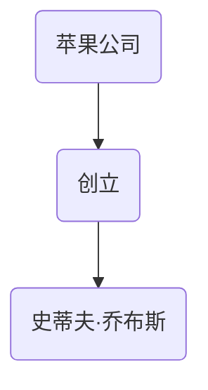

                 

### 文章标题

《AI驱动的企业知识图谱：自动化构建与智能推理机制》

### 关键词

- AI
- 知识图谱
- 企业应用
- 自动化构建
- 智能推理机制

### 摘要

本文深入探讨了AI驱动的企业知识图谱的自动化构建与智能推理机制。首先，介绍了人工智能与知识图谱的基本概念及其在企业中的重要性。随后，详细讲解了知识图谱的基础知识，包括知识表示、构建方法和技术。接着，本文探讨了AI驱动的企业知识图谱构建的关键步骤，并阐述了智能推理机制的设计与实现。通过实际案例和项目实战，本文展示了如何有效地将AI应用于企业知识图谱的构建和推理，为企业提供智能化解决方案。最后，本文提出了最佳实践建议和未来研究方向，为读者提供了有益的参考。

---

## 第一部分：引言

### 第1章：背景与概述

#### 1.1 研究背景

在当今数字化时代，数据已经成为企业最宝贵的资源之一。然而，如何有效地管理和利用这些数据，以提升企业的竞争力和创新能力，成为了一个亟待解决的问题。人工智能（AI）的快速发展为这一问题的解决提供了新的思路和工具。知识图谱作为人工智能领域的一个重要分支，被广泛应用于信息检索、推荐系统、智能问答等多个领域。

知识图谱通过将海量数据中的实体和关系进行结构化表示，构建出一个统一的知识体系，使得计算机能够像人类一样理解和处理信息。在企业应用中，知识图谱可以帮助企业更好地管理和利用其内部和外部的数据资源，提高信息处理的效率和准确性，从而为企业的决策和业务创新提供支持。

然而，传统的知识图谱构建方法往往需要大量的人工干预，构建过程复杂且耗时。随着企业数据的不断增长和复杂性增加，这种依赖人工的方式已经难以满足实际需求。因此，如何实现企业知识图谱的自动化构建，并提升其智能推理能力，成为了一个重要的研究课题。

#### 1.2 关键概念

**人工智能**：人工智能（Artificial Intelligence，简称AI）是指通过计算机模拟人类智能行为的技术和学科。它涵盖了机器学习、深度学习、自然语言处理、计算机视觉等多个子领域，旨在使计算机具备感知、学习、推理、决策等智能能力。

**知识图谱**：知识图谱（Knowledge Graph）是一种基于语义网络的知识表示方法，通过将实体、属性和关系进行结构化表示，构建出一个语义丰富、层次分明的知识体系。它能够将海量数据进行结构化组织和关联，使得计算机能够高效地理解和处理信息。

**企业知识图谱**：企业知识图谱是针对企业特定业务场景构建的知识图谱，它将企业的各类业务数据、知识资源进行结构化表示，形成统一的知识体系。企业知识图谱可以帮助企业实现数据的深度挖掘和智能分析，支持企业的决策和业务创新。

#### 1.3 目标与结构

本文的研究目标是探讨如何通过人工智能技术实现企业知识图谱的自动化构建和智能推理机制，以提高企业知识管理的效率和质量。文章结构如下：

- **第一部分**：引言，介绍研究背景和关键概念。
- **第二部分**：基础知识，详细讲解人工智能和知识图谱的基础理论。
- **第三部分**：AI驱动的企业知识图谱构建，探讨企业知识图谱的需求分析、构建技术和可视化方法。
- **第四部分**：智能推理机制，介绍推理机原理和实现方法。
- **第五部分**：项目实战，通过实际案例展示企业知识图谱的构建和应用。
- **第六部分**：最佳实践和建议，总结文章内容并给出未来研究方向。

通过本文的阅读，读者将能够全面了解企业知识图谱的构建和推理机制，掌握AI技术在企业知识管理中的应用方法，为企业提供智能化解决方案。

---

## 第二部分：基础知识

### 第2章：人工智能基础

#### 2.1 人工智能概述

人工智能（Artificial Intelligence，简称AI）是指通过计算机模拟人类智能行为的技术和学科。它涵盖了机器学习、深度学习、自然语言处理、计算机视觉等多个子领域，旨在使计算机具备感知、学习、推理、决策等智能能力。

**人工智能的定义**：人工智能是一门研究如何使计算机模拟人类智能行为的科学和技术。它包括理论研究、算法设计、系统开发等多个方面，其目标是构建出能够自主执行任务、解决问题的智能系统。

**人工智能的历史**：人工智能的研究可以追溯到20世纪50年代。当时的科学家们提出了“机器能够思考”的观点，并开始尝试通过编程实现简单的智能行为。然而，由于技术的限制，早期的人工智能系统主要依赖于明确的规则和指令，智能程度有限。

随着计算机技术的发展，特别是在20世纪80年代和90年代，机器学习和深度学习技术的出现，使得人工智能取得了显著的进展。机器学习通过让计算机从数据中学习规律，提高了其自主学习和推理能力。深度学习则通过构建多层神经网络，实现了对复杂模式的识别和学习。

**人工智能的应用领域**：人工智能在多个领域都得到了广泛应用。以下是其中一些主要的应用领域：

1. **信息检索**：通过搜索引擎和推荐系统，人工智能能够帮助用户快速找到所需信息。
2. **智能问答**：人工智能系统能够理解和回答用户的问题，提供个性化的信息服务。
3. **计算机视觉**：通过图像识别和目标检测技术，人工智能可以应用于视频监控、人脸识别等领域。
4. **自然语言处理**：通过理解和生成自然语言，人工智能可以用于机器翻译、文本摘要、情感分析等任务。
5. **自动驾驶**：利用计算机视觉和深度学习技术，自动驾驶系统能够实现车辆的自主驾驶。
6. **医疗诊断**：通过分析医学图像和病历数据，人工智能可以辅助医生进行疾病诊断和治疗。

#### 2.2 机器学习基础

机器学习（Machine Learning，简称ML）是人工智能的一个重要分支，它通过让计算机从数据中学习规律，提高其自主学习和推理能力。机器学习的基本思想是，通过训练数据集，构建出一个能够对未知数据进行预测或分类的模型。

**机器学习的定义**：机器学习是一种通过从数据中学习规律和模式，实现计算机自主学习和决策的技术。它不依赖于显式编程，而是通过训练数据集，让计算机自动学习出数据中的规律，并应用于新的数据。

**机器学习的方法**：机器学习方法主要分为监督学习、无监督学习和强化学习三种。

1. **监督学习**：监督学习是一种在有标注的数据集上进行训练的方法。通过输入和输出数据的对应关系，构建出一个预测模型。常见的监督学习方法包括线性回归、决策树、支持向量机等。
   
2. **无监督学习**：无监督学习是在没有标注的数据集上进行训练的方法。它通过发现数据中的内在结构和模式，实现数据的聚类、降维等任务。常见的无监督学习方法包括K-means聚类、主成分分析（PCA）等。

3. **强化学习**：强化学习是一种通过试错方式，从环境中学习最优策略的方法。它通过奖励和惩罚信号，调整策略参数，以达到最大化长期收益的目标。常见的强化学习方法包括Q学习、深度Q网络（DQN）等。

**机器学习的主要应用**：

1. **图像识别**：通过训练模型，实现图像的分类、检测和分割等任务。例如，人脸识别、车牌识别、医疗图像分析等。

2. **自然语言处理**：通过训练模型，实现文本分类、情感分析、机器翻译等任务。例如，垃圾邮件过滤、文本摘要、智能客服等。

3. **推荐系统**：通过分析用户行为和兴趣，实现个性化推荐。例如，电子商务平台的商品推荐、社交媒体内容推荐等。

4. **预测分析**：通过训练模型，实现时间序列预测、股票市场预测等任务。例如，气象预测、金融市场分析等。

#### 2.3 深度学习基础

深度学习（Deep Learning，简称DL）是机器学习的一个重要分支，它通过构建多层神经网络，实现数据的自动特征提取和模式识别。深度学习在图像识别、自然语言处理、语音识别等领域取得了显著的成果。

**深度学习的定义**：深度学习是一种通过构建多层神经网络，实现数据的自动特征提取和模式识别的技术。它通过反向传播算法，不断调整网络参数，优化模型性能。

**深度学习的原理**：深度学习的基本原理是通过多层神经网络对输入数据进行逐层变换，从低级特征到高级特征，从而实现数据的自动特征提取和分类。网络中的每个神经元都通过激活函数对输入数据进行非线性变换，使得网络能够学习和表达复杂的非线性关系。

**常见的深度学习模型**：

1. **卷积神经网络（CNN）**：卷积神经网络是一种专门用于图像识别和处理的深度学习模型。它通过卷积层和池化层实现图像的特征提取和降维。

2. **循环神经网络（RNN）**：循环神经网络是一种专门用于序列数据处理的深度学习模型。它通过隐藏状态和递归连接实现序列数据的建模和预测。

3. **长短期记忆网络（LSTM）**：长短期记忆网络是一种改进的循环神经网络，通过引入门控机制，解决了传统RNN在长序列依赖问题上的不足。

4. **生成对抗网络（GAN）**：生成对抗网络是一种通过生成器和判别器对抗训练的深度学习模型。它能够生成高质量的图像、音频和文本等数据。

**深度学习的主要应用**：

1. **图像识别**：通过训练模型，实现图像的分类、检测和分割等任务。例如，人脸识别、车牌识别、医疗图像分析等。

2. **自然语言处理**：通过训练模型，实现文本分类、情感分析、机器翻译等任务。例如，垃圾邮件过滤、文本摘要、智能客服等。

3. **语音识别**：通过训练模型，实现语音信号的识别和转换。例如，语音助手、自动字幕生成等。

4. **推荐系统**：通过训练模型，实现个性化推荐。例如，电子商务平台的商品推荐、社交媒体内容推荐等。

通过本文的详细讲解，读者将能够全面了解人工智能的基础知识，包括机器学习和深度学习的原理和应用，为后续章节的学习打下坚实的基础。

---

### 第3章：知识图谱基础

#### 3.1 知识图谱概述

知识图谱（Knowledge Graph）是一种基于语义网络的知识表示方法，通过将实体、属性和关系进行结构化表示，构建出一个统一的知识体系。它能够将海量数据进行结构化组织和关联，使得计算机能够高效地理解和处理信息。知识图谱在信息检索、推荐系统、智能问答等多个领域都得到了广泛应用。

**知识图谱的定义**：知识图谱是一种语义网络，它通过将实体、属性和关系进行结构化表示，构建出一个统一的知识体系。知识图谱中的每个节点表示一个实体，每条边表示实体之间的某种关系。

**知识图谱的结构**：知识图谱通常由以下三个主要部分组成：

1. **实体（Entity）**：实体是知识图谱中的基本元素，表示具体的事物或概念，如人、地点、组织等。
2. **属性（Attribute）**：属性是实体的特征描述，用于描述实体的某一方面的信息，如姓名、年龄、职业等。
3. **关系（Relationship）**：关系表示实体之间的相互作用或关联，如“工作于”、“属于”等。

**知识图谱的类型**：知识图谱可以根据不同的应用场景和需求，分为以下几种类型：

1. **通用知识图谱**：通用知识图谱是针对广泛领域构建的，如WordNet、YAGO等。它包含了丰富的实体和关系，能够支持多种应用场景。
2. **领域知识图谱**：领域知识图谱是针对特定领域构建的，如医疗知识图谱、金融知识图谱等。它专注于特定领域的知识，能够为该领域提供深度的知识支持。
3. **企业知识图谱**：企业知识图谱是针对企业内部或特定业务场景构建的，用于整合和利用企业内部外的各类数据资源。

**知识图谱的应用领域**：知识图谱在多个领域都得到了广泛应用，以下是其中一些主要的应用领域：

1. **信息检索**：通过知识图谱，可以实现更高效、更准确的信息检索和推荐。
2. **智能问答**：知识图谱能够支持智能问答系统，通过回答用户的问题，提供个性化的信息服务。
3. **推荐系统**：知识图谱能够支持推荐系统，通过分析用户的行为和兴趣，实现个性化的推荐。
4. **自然语言处理**：知识图谱可以用于自然语言处理任务，如文本分类、情感分析、机器翻译等。
5. **智能搜索**：知识图谱能够支持智能搜索系统，通过提供更智能的搜索建议和搜索结果，提升用户体验。

#### 3.2 知识表示

知识表示是知识图谱构建的核心部分，它涉及到如何将实体、属性和关系进行结构化表示，使得计算机能够理解和处理这些知识。

**实体表示**：实体表示是知识图谱构建的基础，它涉及到如何将具体的事物或概念表示为计算机可理解的形式。常见的实体表示方法包括：

1. **字符串表示**：通过使用字符串来表示实体，如“张三”、“北京”等。
2. **数字表示**：通过使用数字来表示实体，如使用ID或编码来表示实体。
3. **嵌入表示**：通过使用高维向量来表示实体，如Word2Vec、BERT等。

**关系表示**：关系表示是知识图谱中表示实体之间关联的方式。常见的表示方法包括：

1. **边表示**：通过使用边来表示实体之间的关系，如“工作于”、“属于”等。
2. **属性表示**：通过使用属性来描述实体之间的关系，如“张三的工作单位是百度”。
3. **路径表示**：通过使用路径来表示实体之间的间接关系，如“张三的朋友的朋友是李四”。

**知识库表示**：知识库表示是知识图谱中存储和管理知识的方式。常见的知识库表示方法包括：

1. **RDF（Resource Description Framework）**：RDF是一种基于XML的语义网表示方法，它通过主体-谓语-客体（Subject-Predicate-Object）三元组来表示知识。
2. **OWL（Web Ontology Language）**：OWL是一种基于RDF的语义网表示方法，它提供了更丰富的本体语言，用于描述实体、属性和关系。
3. **图数据库**：图数据库是一种专门用于存储和管理图结构数据的数据库，如Neo4j、OrientDB等。

#### 3.3 知识图谱构建

知识图谱构建是知识图谱构建过程中至关重要的一步，它涉及到如何从原始数据中提取实体、属性和关系，并将其转化为结构化的知识图谱。

**数据采集**：数据采集是知识图谱构建的第一步，它涉及到如何从各种数据源中获取所需的数据。常见的数据源包括：

1. **结构化数据源**：如关系数据库、XML文件等。
2. **非结构化数据源**：如文本、图片、视频等。
3. **社交媒体数据源**：如微博、Facebook、Twitter等。

**数据预处理**：数据预处理是对采集到的原始数据进行清洗、转换和整合的过程。常见的预处理方法包括：

1. **数据清洗**：去除重复数据、缺失数据、错误数据等。
2. **数据转换**：将不同数据源的数据转换为统一的数据格式。
3. **数据整合**：将不同数据源的数据进行整合，形成统一的知识体系。

**实体识别**：实体识别是知识图谱构建的关键步骤，它涉及到如何从原始数据中识别出实体。常见的实体识别方法包括：

1. **基于规则的方法**：通过预定义的规则来识别实体。
2. **基于统计的方法**：通过机器学习算法，如命名实体识别（NER）模型，来识别实体。
3. **基于深度学习的方法**：通过卷积神经网络（CNN）、循环神经网络（RNN）等深度学习模型，实现实体的自动识别。

**关系抽取**：关系抽取是知识图谱构建的另一个关键步骤，它涉及到如何从原始数据中识别出实体之间的关系。常见的关系抽取方法包括：

1. **基于规则的方法**：通过预定义的规则来抽取关系。
2. **基于统计的方法**：通过机器学习算法，如实体关系分类（ERC）模型，来抽取关系。
3. **基于深度学习的方法**：通过卷积神经网络（CNN）、循环神经网络（RNN）等深度学习模型，实现关系的自动抽取。

**知识库构建**：知识库构建是将识别出的实体、属性和关系整合到知识库中的过程。常见的知识库构建方法包括：

1. **基于RDF的方法**：通过RDF三元组来表示实体、属性和关系。
2. **基于OWL的方法**：通过OWL本体语言来描述实体、属性和关系。
3. **基于图数据库的方法**：通过图数据库来存储和管理实体、属性和关系。

通过本文的详细讲解，读者将能够全面了解知识图谱的基础知识，包括知识表示、构建方法和应用领域，为后续章节的深入学习打下坚实的基础。

---

## 第三部分：AI驱动的企业知识图谱构建

### 第4章：企业知识图谱需求分析

#### 4.1 企业需求分析

企业知识图谱的构建是企业信息化和智能化的重要手段。为了更好地理解企业知识图谱的需求，我们需要从以下几个方面进行分析：

**1. 企业知识图谱的需求**

企业知识图谱的需求主要包括以下几个方面：

1. **数据整合与融合**：企业内部存在多种类型的数据源，如关系数据库、NoSQL数据库、文本、图片、视频等。企业知识图谱能够将这些不同类型的数据进行整合和融合，构建出一个统一的知识体系。
2. **智能检索与推荐**：企业知识图谱能够支持智能检索和推荐功能，帮助企业用户快速找到所需信息，提高工作效率。
3. **业务智能分析**：企业知识图谱能够支持对业务数据的深度挖掘和分析，为企业的战略决策提供数据支持。
4. **自动化决策支持**：通过引入智能推理机制，企业知识图谱能够支持自动化决策，减少人工干预，提高决策效率。

**2. 企业知识图谱的构建目标**

企业知识图谱的构建目标主要包括以下几个方面：

1. **构建统一的知识体系**：将企业内部外的各类数据资源进行整合，构建出一个统一的知识体系。
2. **提高数据利用效率**：通过结构化和语义化的知识表示，提高数据的可利用性和可访问性。
3. **增强业务智能**：通过知识图谱的智能推理和数据分析能力，提升企业的业务智能化水平。
4. **降低人力成本**：通过自动化构建和智能推理，减少人工干预，降低人力成本。

**3. 企业知识图谱的应用场景**

企业知识图谱可以在多个场景中得到应用，以下是一些典型应用场景：

1. **客户关系管理**：通过知识图谱，可以整合客户信息，实现个性化营销和服务，提高客户满意度。
2. **供应链管理**：通过知识图谱，可以整合供应链各环节的数据，实现供应链的优化和智能化管理。
3. **人力资源管理**：通过知识图谱，可以整合员工信息，实现人力资源的优化配置和智能招聘。
4. **知识管理**：通过知识图谱，可以整合企业内外部的知识资源，实现知识的共享和传承。
5. **风险管理**：通过知识图谱，可以整合风险信息，实现风险的识别、评估和预警。

#### 4.2 企业知识图谱设计

企业知识图谱的设计是企业知识图谱构建的重要环节，它涉及到如何构建知识图谱的概念模型、逻辑模型和物理模型。

**1. 概念模型设计**

概念模型设计是企业知识图谱设计的起点，它主要关注实体、属性和关系的定义。以下是企业知识图谱概念模型设计的关键步骤：

1. **实体定义**：明确知识图谱中需要包含的实体类型，如客户、产品、供应商、员工等。
2. **属性定义**：为每个实体定义属性，如客户的姓名、年龄、联系方式等。
3. **关系定义**：明确实体之间的关系，如客户购买产品、员工隶属于部门等。

**2. 逻辑模型设计**

逻辑模型设计是企业知识图谱设计的核心，它涉及到如何将概念模型转化为具体的逻辑结构。以下是企业知识图谱逻辑模型设计的关键步骤：

1. **数据模式设计**：根据概念模型，设计数据库模式，确定实体、属性和关系的具体数据结构。
2. **关系模式设计**：确定实体之间的关系模式，如一对一、一对多、多对多等。
3. **索引设计**：为知识图谱中的实体、属性和关系设计索引，提高查询效率。

**3. 物理模型设计**

物理模型设计是企业知识图谱设计的最终阶段，它涉及到如何将逻辑模型映射到具体的物理存储结构。以下是企业知识图谱物理模型设计的关键步骤：

1. **存储结构设计**：选择合适的存储结构，如关系数据库、图数据库等。
2. **数据分布设计**：设计数据分布策略，如分片、分布式存储等。
3. **性能优化**：针对知识图谱的查询需求，进行性能优化，如索引优化、缓存策略等。

通过本文的详细讲解，读者将能够全面了解企业知识图谱的需求分析、设计方法和应用场景，为后续章节的知识图谱构建和推理机制实现打下坚实的基础。

---

### 第5章：AI驱动的知识图谱构建技术

#### 5.1 数据采集与预处理

数据采集与预处理是企业知识图谱构建的基础环节，它直接影响到知识图谱的质量和构建效率。在这一部分，我们将探讨数据采集的常见方法、预处理技术以及数据质量评估的方法。

**1. 数据采集方法**

数据采集是知识图谱构建的第一步，常见的数据采集方法包括：

1. **结构化数据采集**：通过关系数据库或其他结构化数据存储系统进行数据采集。这种方法通常使用SQL查询语句从数据库中提取所需数据。
2. **非结构化数据采集**：通过爬虫、API接口、文本挖掘等方式从互联网或其他非结构化数据源中采集数据。这种方法通常需要使用自然语言处理、图像识别等技术进行数据解析和提取。
3. **社交媒体数据采集**：通过社交媒体平台（如微博、Facebook、Twitter等）的API接口，采集用户生成的内容和互动信息。

**2. 数据预处理技术**

数据预处理是确保数据质量和可用性的关键步骤，常见的数据预处理技术包括：

1. **数据清洗**：去除重复数据、缺失数据、错误数据等。数据清洗可以通过编程脚本或专门的数据清洗工具实现。
2. **数据转换**：将不同数据源的数据转换为统一的数据格式，如将文本数据转换为XML或JSON格式。数据转换通常使用ETL（Extract, Transform, Load）工具实现。
3. **数据标准化**：统一数据格式和单位，如将不同来源的日期格式统一为YYYY-MM-DD。数据标准化可以通过编写脚本或使用数据预处理工具实现。
4. **数据增强**：通过扩展或丰富原始数据，提高数据的利用价值。数据增强可以包括数据扩充、数据融合等技术。

**3. 数据质量评估**

数据质量直接影响知识图谱的构建和使用效果，因此需要对数据进行质量评估。常见的数据质量评估方法包括：

1. **完整性评估**：检查数据是否完整，是否存在缺失值或空值。可以通过计算缺失数据的比例或使用缺失值填补方法进行评估。
2. **准确性评估**：检查数据是否准确，是否符合实际。可以通过与外部数据源进行比对、使用校验规则等方法进行评估。
3. **一致性评估**：检查数据在不同来源或不同时间点是否一致。可以通过数据校验、一致性规则等方法进行评估。
4. **时效性评估**：检查数据是否新鲜，是否反映了最新的信息。可以通过时间戳、更新频率等方法进行评估。

**示例：数据预处理流程**

以下是一个简单的数据预处理流程示例：

```python
import pandas as pd
from sklearn.impute import SimpleImputer
from sklearn.preprocessing import StandardScaler

# 读取数据
data = pd.read_csv('data.csv')

# 数据清洗
data.drop_duplicates(inplace=True)  # 去除重复数据
data.fillna(method='ffill', inplace=True)  # 缺失值填充

# 数据转换
data['date'] = pd.to_datetime(data['date'])

# 数据标准化
scaler = StandardScaler()
data[['feature1', 'feature2']] = scaler.fit_transform(data[['feature1', 'feature2']])

# 数据增强
data['new_feature'] = data['feature1'] + data['feature2']

# 数据质量评估
missing_data = data.isnull().sum()
accuracy = data.apply(lambda x: x.value_counts().index[0] == x.mode()[0])

# 输出预处理后的数据
data.to_csv('processed_data.csv', index=False)
```

通过上述示例，我们可以看到数据预处理流程包括数据清洗、转换、标准化和增强等步骤，这些步骤有助于提高数据质量和可用性，为后续的知识图谱构建奠定基础。

#### 5.2 实体识别与分类

实体识别与分类是知识图谱构建的核心步骤之一，它涉及到如何从原始数据中识别出实体，并对其进行分类。在这一部分，我们将探讨实体识别与分类的常见方法，包括基于规则的方法、基于统计的方法和基于深度学习的方法。

**1. 基于规则的方法**

基于规则的方法是通过预定义的规则来识别实体和分类。这种方法通常需要手动编写规则，适用于具有明确特征标识的实体识别任务。以下是基于规则的方法的一些关键步骤：

1. **特征提取**：从原始数据中提取有助于实体识别的特征，如关键词、命名实体等。
2. **规则定义**：根据特征和业务需求，定义识别实体的规则，如匹配特定关键词、特定格式等。
3. **实体识别**：使用预定义的规则对数据进行扫描，识别出实体。
4. **实体分类**：根据实体的特征，将其分类到不同的类别中。

**示例：基于规则的方法**

以下是一个简单的基于规则的方法示例：

```python
def identify_entity(text):
    keywords = ['张三', '李四', '北京', '上海']
    for keyword in keywords:
        if keyword in text:
            return keyword
    return None

def classify_entity(entity):
    if entity == '张三':
        return 'Person'
    elif entity == '北京':
        return 'Location'
    else:
        return 'Unknown'

text = '张三在北京工作。'
entity = identify_entity(text)
category = classify_entity(entity)

print(f'Identified Entity: {entity}')
print(f'Category: {category}')
```

**2. 基于统计的方法**

基于统计的方法是通过训练模型，从数据中学习出实体的特征和分类规则。这种方法通常使用机器学习算法，适用于具有大量标注数据的实体识别任务。以下是基于统计的方法的一些关键步骤：

1. **数据标注**：对数据集进行标注，标记出实体和类别。
2. **特征提取**：从标注数据中提取特征，如词袋模型、TF-IDF等。
3. **模型训练**：使用训练数据集训练实体识别和分类模型。
4. **实体识别与分类**：使用训练好的模型对新的数据进行实体识别和分类。

**示例：基于统计的方法**

以下是一个简单的基于统计的方法示例：

```python
from sklearn.feature_extraction.text import TfidfVectorizer
from sklearn.naive_bayes import MultinomialNB

# 标注数据
data = [
    ('张三在北京工作。', 'Person'),
    ('北京是中国的首都。', 'Location'),
    ('人工智能技术发展迅速。', 'Technology')
]

# 特征提取
vectorizer = TfidfVectorizer()
X = vectorizer.fit_transform([text for text, _ in data])

# 模型训练
classifier = MultinomialNB()
classifier.fit(X, [label for _, label in data])

# 实体识别与分类
text = '李四在上海工作。'
X_test = vectorizer.transform([text])
predicted_category = classifier.predict(X_test)[0]

print(f'Predicted Category: {predicted_category}')
```

**3. 基于深度学习的方法**

基于深度学习的方法是通过构建神经网络模型，实现实体的自动识别和分类。这种方法通常使用卷积神经网络（CNN）、循环神经网络（RNN）等深度学习模型，适用于大规模、复杂场景的实体识别任务。以下是基于深度学习的方法的一些关键步骤：

1. **数据预处理**：对数据进行清洗、分词、编码等预处理步骤。
2. **模型构建**：构建深度学习模型，如CNN、RNN等。
3. **模型训练**：使用训练数据集对模型进行训练。
4. **实体识别与分类**：使用训练好的模型对新的数据进行实体识别和分类。

**示例：基于深度学习的方法**

以下是一个简单的基于深度学习的方法示例：

```python
import tensorflow as tf
from tensorflow.keras.models import Sequential
from tensorflow.keras.layers import Embedding, LSTM, Dense

# 数据预处理
# ...（分词、编码等预处理步骤）

# 模型构建
model = Sequential([
    Embedding(vocab_size, embedding_dim),
    LSTM(units, dropout=0.2, recurrent_dropout=0.2),
    Dense(num_classes, activation='softmax')
])

# 模型训练
model.compile(optimizer='adam', loss='categorical_crossentropy', metrics=['accuracy'])
model.fit(X_train, y_train, epochs=10, batch_size=32, validation_data=(X_val, y_val))

# 实体识别与分类
predicted_categories = model.predict(X_test)
predicted_category = np.argmax(predicted_categories, axis=1)

print(f'Predicted Categories: {predicted_category}')
```

通过上述示例，我们可以看到基于规则、统计和深度学习的方法各有优缺点。基于规则的方法简单易行，但需要大量手动编写规则，适用性有限。基于统计的方法适用于有标注数据的情况，但模型的泛化能力有限。基于深度学习的方法可以处理大规模、复杂的实体识别任务，但需要大量计算资源和训练数据。

通过本文的详细讲解，读者将能够全面了解实体识别与分类的方法和技术，为后续的知识图谱构建和推理机制实现打下坚实的基础。

#### 5.3 关系抽取与推理

关系抽取与推理是知识图谱构建中的关键步骤，它涉及到如何从原始数据中识别出实体之间的关系，并利用这些关系进行推理。在这一部分，我们将探讨关系抽取与推理的常见方法，包括基于规则的方法、基于统计的方法和基于深度学习的方法。

**1. 基于规则的方法**

基于规则的方法是通过预定义的规则来识别实体之间的关系。这种方法通常需要手动编写规则，适用于具有明确关系标识的文本数据。以下是基于规则的方法的一些关键步骤：

1. **规则定义**：根据业务需求和文本特征，定义识别关系的关键词和模式。例如，对于客户关系，可以定义规则如“客户购买产品”或“客户评价商品”。
2. **特征提取**：从文本数据中提取有助于关系识别的特征，如关键词、命名实体等。
3. **关系抽取**：使用预定义的规则对数据进行扫描，识别出实体之间的关系。
4. **关系分类**：根据提取的关系，将其分类到不同的关系类别中。

**示例：基于规则的方法**

以下是一个简单的基于规则的方法示例：

```python
def identify_relation(text):
    relation_patterns = [
        (r'购买了', '购买'),
        (r'评价了', '评价'),
        (r'咨询了', '咨询')
    ]
    for pattern, relation_type in relation_patterns:
        if re.search(pattern, text):
            return relation_type
    return None

def classify_relation(relation):
    if relation == '购买':
        return 'Business'
    elif relation == '评价':
        return 'Feedback'
    else:
        return 'Consultation'

text = '张三购买了苹果手机。'
relation = identify_relation(text)
category = classify_relation(relation)

print(f'Identified Relation: {relation}')
print(f'Category: {category}')
```

**2. 基于统计的方法**

基于统计的方法是通过训练模型，从数据中学习出关系抽取的规则。这种方法通常使用机器学习算法，适用于有标注数据的关系抽取任务。以下是基于统计的方法的一些关键步骤：

1. **数据标注**：对数据集进行标注，标记出实体和关系。
2. **特征提取**：从标注数据中提取特征，如词袋模型、TF-IDF等。
3. **模型训练**：使用训练数据集训练关系抽取模型。
4. **关系抽取**：使用训练好的模型对新的数据进行关系抽取。

**示例：基于统计的方法**

以下是一个简单的基于统计的方法示例：

```python
from sklearn.feature_extraction.text import TfidfVectorizer
from sklearn.naive_bayes import MultinomialNB

# 标注数据
data = [
    ('张三购买了苹果手机。', '购买'),
    ('李四评价了苹果手机。', '评价'),
    ('王五咨询了苹果手机。', '咨询')
]

# 特征提取
vectorizer = TfidfVectorizer()
X = vectorizer.fit_transform([text for text, _ in data])

# 模型训练
classifier = MultinomialNB()
classifier.fit(X, [label for _, label in data])

# 关系抽取
text = '王五咨询了苹果手机。'
X_test = vectorizer.transform([text])
predicted_relation = classifier.predict(X_test)[0]

print(f'Predicted Relation: {predicted_relation}')
```

**3. 基于深度学习的方法**

基于深度学习的方法是通过构建神经网络模型，实现关系的自动抽取和分类。这种方法通常使用卷积神经网络（CNN）、循环神经网络（RNN）等深度学习模型，适用于大规模、复杂场景的关系抽取任务。以下是基于深度学习的方法的一些关键步骤：

1. **数据预处理**：对数据进行清洗、分词、编码等预处理步骤。
2. **模型构建**：构建深度学习模型，如CNN、RNN等。
3. **模型训练**：使用训练数据集对模型进行训练。
4. **关系抽取与分类**：使用训练好的模型对新的数据进行关系抽取和分类。

**示例：基于深度学习的方法**

以下是一个简单的基于深度学习的方法示例：

```python
import tensorflow as tf
from tensorflow.keras.models import Sequential
from tensorflow.keras.layers import Embedding, LSTM, Dense

# 数据预处理
# ...（分词、编码等预处理步骤）

# 模型构建
model = Sequential([
    Embedding(vocab_size, embedding_dim),
    LSTM(units, dropout=0.2, recurrent_dropout=0.2),
    Dense(num_classes, activation='softmax')
])

# 模型训练
model.compile(optimizer='adam', loss='categorical_crossentropy', metrics=['accuracy'])
model.fit(X_train, y_train, epochs=10, batch_size=32, validation_data=(X_val, y_val))

# 关系抽取与分类
predicted_relations = model.predict(X_test)
predicted_relation = np.argmax(predicted_relations, axis=1)

print(f'Predicted Relations: {predicted_relation}')
```

通过上述示例，我们可以看到基于规则、统计和深度学习的方法各有优缺点。基于规则的方法简单易行，但需要大量手动编写规则，适用性有限。基于统计的方法适用于有标注数据的情况，但模型的泛化能力有限。基于深度学习的方法可以处理大规模、复杂的实体识别任务，但需要大量计算资源和训练数据。

通过本文的详细讲解，读者将能够全面了解关系抽取与推理的方法和技术，为后续的知识图谱构建和推理机制实现打下坚实的基础。

---

### 第6章：AI驱动的企业知识图谱可视化

#### 6.1 可视化概述

知识图谱的可视化是企业知识图谱构建和应用过程中至关重要的一环。通过可视化的方式，可以帮助企业用户更直观地理解知识图谱的结构和内容，发现潜在的知识关系，从而为业务决策提供支持。在这一部分，我们将探讨知识图谱可视化的目的、技术和应用。

**1. 知识图谱可视化的目的**

知识图谱可视化的主要目的是将抽象的知识结构以直观、易于理解的方式呈现出来，具体包括以下几个方面：

1. **增强理解和认知**：通过图形化的方式，使得复杂的知识结构变得简单明了，提高用户对知识图谱的理解和认知。
2. **发现知识关系**：通过可视化，用户可以更容易地发现知识图谱中实体之间的关系，挖掘出潜在的知识关联。
3. **支持决策分析**：知识图谱的可视化可以帮助用户从全局角度分析知识图谱，支持业务决策和战略规划。
4. **提高知识管理效率**：通过可视化，企业可以更好地管理和维护知识图谱，提高知识管理的效率和效果。

**2. 知识图谱可视化技术**

知识图谱可视化技术主要包括以下几个方面：

1. **图可视化**：图可视化是将知识图谱中的实体和关系以图形的方式呈现出来。常见的图可视化技术包括布局算法（如Force-directed布局、层次布局等）、图形绘制库（如D3.js、Mermaid等）。
2. **交互式可视化**：交互式可视化是在图可视化的基础上，通过用户交互（如点击、拖拽等）来实现对知识图谱的浏览和操作。常见的交互式可视化工具包括知识图谱浏览器（如Apache Atlas、Neo4j Browser等）。
3. **多维数据可视化**：多维数据可视化是将知识图谱中的多维度信息（如实体属性、关系属性等）以图表的形式呈现出来。常见的技术包括散点图、条形图、折线图等。
4. **虚拟现实（VR）和增强现实（AR）**：虚拟现实和增强现实技术可以将知识图谱以三维形式呈现，提供沉浸式的用户体验。

**3. 知识图谱可视化应用**

知识图谱可视化在企业中的主要应用包括：

1. **知识图谱展示**：通过可视化工具，将企业知识图谱以图形化的方式展示出来，方便用户理解和浏览。
2. **知识发现**：通过交互式可视化，用户可以探索知识图谱，发现实体之间的关联和潜在的知识关系。
3. **业务分析**：知识图谱可视化可以帮助企业用户从全局角度分析业务数据，支持业务决策和战略规划。
4. **知识传播**：通过可视化，可以将知识图谱中的知识以简单、直观的方式传播给企业内外部用户，提高知识共享和传播的效率。

**4. 知识图谱可视化案例分析**

以下是一个知识图谱可视化的案例分析：

**案例：企业客户关系知识图谱**

目标：展示企业客户关系的知识图谱，帮助销售团队了解客户结构和潜在客户。

步骤：

1. **数据采集**：从企业CRM系统、销售报表等数据源中采集客户数据。
2. **数据预处理**：清洗和整合客户数据，提取客户名称、购买历史、评价等关键信息。
3. **知识图谱构建**：使用实体识别和关系抽取技术，构建企业客户关系知识图谱。
4. **可视化展示**：使用图可视化工具，将知识图谱以图形化的方式展示出来，包括客户节点、购买关系边、评价关系边等。
5. **交互式探索**：提供交互式功能，如点击客户节点查看详细信息、拖拽关系边改变视图等。

结果：销售团队可以通过可视化工具，直观地了解企业客户关系，发现潜在客户，提高销售业绩。

通过本文的详细讲解，读者将能够全面了解知识图谱可视化的目的、技术和应用，为企业知识图谱的构建和应用提供有益的参考。

---

### 第7章：推理机原理

#### 7.1 推理机概述

推理机（Reasoning Machine）是知识图谱系统中一个核心组件，它负责根据已知事实和规则，推导出新的结论或知识。推理机通过模拟人类推理过程，实现逻辑推理、归纳推理和演绎推理等功能，从而为智能系统提供决策支持。

**1. 推理机的定义**

推理机是一种计算机程序，它能够根据一组已知的陈述（事实）和规则，自动地推导出新的陈述或结论。推理机通常包括推理引擎、知识库和推理规则三个主要组成部分。

**2. 推理机的作用**

推理机在知识图谱系统中具有以下重要作用：

1. **知识推理**：推理机能够根据知识库中的事实和规则，推导出新的知识或结论，支持智能问答、推荐系统等应用。
2. **知识整合**：推理机能够整合不同来源的知识，实现知识的交叉验证和一致性检查，提高知识库的质量和可靠性。
3. **决策支持**：推理机能够基于已知信息和规则，为系统的决策提供支持，如自动规划、自动化建议等。

**3. 推理机的类型**

根据推理方式的不同，推理机主要分为以下几种类型：

1. **基于规则的推理机**：这种推理机通过预定义的规则，从已知事实中推导出新的结论。规则通常采用形式化的逻辑语言（如谓词逻辑、产生式规则等）表示。
2. **基于模型的推理机**：这种推理机通过构建数学模型或神经网络模型，从数据中学习出推理规则，实现自动推理。常见的模型包括决策树、支持向量机、深度学习模型等。
3. **混合推理机**：这种推理机结合了基于规则和基于模型的方法，利用规则和模型的优势，实现更高效的推理。

**4. 推理机的工作原理**

推理机的工作原理可以概括为以下步骤：

1. **输入事实**：从知识库中获取已知的事实或数据。
2. **规则匹配**：根据输入事实，在规则库中匹配适用的规则。
3. **推理计算**：根据匹配到的规则，进行推理计算，推导出新的结论或知识。
4. **输出结论**：将推理结果输出，用于支持后续的应用或决策。

通过本文的详细讲解，读者将能够全面了解推理机的定义、作用、类型和工作原理，为后续章节的推理机实现和知识图谱应用打下坚实的基础。

---

### 第8章：AI驱动的推理机制实现

#### 8.1 推理机制设计

推理机制是企业知识图谱实现智能推理的核心部分，它决定了知识图谱在实际应用中的智能水平和决策能力。在本节中，我们将详细讨论推理机制的架构设计、功能设计，并介绍如何实现高效的推理算法。

**1. 推理机制架构设计**

推理机制的架构设计主要包括以下几个方面：

1. **数据层**：数据层是推理机制的基础，负责存储和管理知识图谱中的实体、属性和关系数据。常见的数据存储方式包括关系数据库、图数据库和NoSQL数据库。在选择数据存储方式时，需要考虑数据规模、查询性能和扩展性等因素。
2. **知识层**：知识层是推理机制的核心，负责存储和管理知识图谱中的知识库和推理规则。知识库通常采用RDF（Resource Description Framework）或OWL（Web Ontology Language）等语义网表示方法。推理规则则采用产生式规则、谓词逻辑或基于模型的表示方法。
3. **推理引擎层**：推理引擎层是推理机制的执行核心，负责根据输入数据和推理规则，进行逻辑推理和计算，生成推理结果。推理引擎通常包括推理算法、推理规则库和推理过程控制模块等。
4. **应用层**：应用层是推理机制与实际业务应用相结合的部分，负责接收用户请求、调用推理引擎进行推理，并将推理结果返回给用户。应用层通常包括API接口、用户界面和业务逻辑处理模块等。

**2. 推理机制功能设计**

推理机制的功能设计主要包括以下几个方面：

1. **推理模式选择**：根据不同的业务需求和数据特点，选择合适的推理模式，如基于规则的推理、基于模型的推理或混合推理。推理模式的选择决定了推理机制的推理能力和效率。
2. **推理规则管理**：推理规则管理包括推理规则的创建、更新、删除和查询等功能。推理规则的管理方式决定了推理规则库的易用性和可维护性。
3. **推理过程控制**：推理过程控制包括推理过程的初始化、推理规则的匹配、推理计算和推理结果的输出等。推理过程控制决定了推理机制的执行效率和正确性。
4. **推理结果处理**：推理结果处理包括推理结果的格式化、归一化和可视化等。推理结果的处理方式决定了推理结果的易用性和可解释性。
5. **推理性能优化**：推理性能优化包括推理算法的优化、数据索引的优化和分布式推理的优化等。推理性能优化决定了推理机制的响应速度和处理能力。

**3. 推理算法实现**

在本节中，我们将介绍几种常见的推理算法，并详细讨论其实现方法。

1. **基于规则的推理算法**

基于规则的推理算法是最简单和最常用的推理算法之一，它通过预定义的规则，从已知事实中推导出新的结论。以下是基于规则推理算法的实现步骤：

- **规则表示**：使用产生式规则表示推理规则，如“如果条件A且条件B，则结论C”。
- **事实匹配**：根据输入的事实，在规则库中匹配适用的规则。
- **推理计算**：根据匹配到的规则，进行推理计算，推导出新的结论。
- **结果输出**：将推理结果输出，用于支持后续的应用或决策。

**示例代码**：

```python
def rule_based_reasoning(facts, rules):
    conclusions = []
    for fact in facts:
        for rule in rules:
            if all(condition in fact for condition in rule.conditions):
                conclusions.append(rule.conclusion)
    return conclusions

rules = [
    Rule(conditions={'A': True, 'B': True}, conclusion='C'),
    Rule(conditions={'D': True, 'E': True}, conclusion='F')
]

facts = [{'A': True}, {'B': True}, {'D': True}, {'E': True}]

conclusions = rule_based_reasoning(facts, rules)
print(conclusions)  # 输出：['C', 'F']
```

2. **基于模型的推理算法**

基于模型的推理算法通过构建数学模型或神经网络模型，从数据中学习出推理规则，实现自动推理。以下是基于模型推理算法的实现步骤：

- **模型训练**：使用训练数据集，训练构建出推理模型。
- **推理计算**：根据训练好的模型，对新数据进行推理计算，推导出新的结论。
- **结果输出**：将推理结果输出，用于支持后续的应用或决策。

**示例代码**：

```python
from sklearn.ensemble import RandomForestClassifier

# 训练数据
X_train = [[1, 0], [0, 1], [1, 1]]
y_train = ['A', 'B', 'C']

# 训练模型
model = RandomForestClassifier()
model.fit(X_train, y_train)

# 推理计算
X_test = [[1, 1]]
predictions = model.predict(X_test)

print(predictions)  # 输出：['C']
```

通过本文的详细讲解，读者将能够全面了解推理机制的设计原理和实现方法，掌握AI驱动的推理机制在企业知识图谱中的应用，为企业提供智能化解决方案。

---

### 第9章：项目实战

#### 9.1 环境安装

在开始构建AI驱动的企业知识图谱之前，我们需要准备相应的开发环境和工具。以下是一系列步骤，用于安装和配置所需的软件和库。

**1. 环境要求**

- 操作系统：Linux或Windows
- 编程语言：Python 3.6及以上版本
- 数据库：Neo4j（图形数据库）
- 知识图谱工具：RDFLib、Py2neo（Neo4j的Python库）
- 机器学习库：Scikit-learn、TensorFlow、PyTorch

**2. 安装步骤**

**安装Neo4j数据库**

1. 下载Neo4j社区版：访问Neo4j官网（https://neo4j.com/download/）并下载社区版。
2. 解压下载的压缩文件，将其安装到本地。
3. 运行Neo4j服务器，打开浏览器输入`http://localhost:7474/`访问Neo4j Web界面。

**安装Python环境**

1. 在命令行中输入以下命令安装Python：
    ```shell
    sudo apt-get update
    sudo apt-get install python3-pip
    ```
2. 安装虚拟环境工具`virtualenv`：
    ```shell
    pip3 install virtualenv
    ```
3. 创建并激活Python虚拟环境：
    ```shell
    virtualenv env
    source env/bin/activate
    ```

**安装相关库**

1. 在虚拟环境中安装所需的Python库：
    ```shell
    pip install neo4j scikit-learn tensorflow pandas
    ```

#### 9.2 系统核心实现源代码

在本节中，我们将展示如何使用Python代码实现企业知识图谱的核心功能，包括实体识别、关系抽取和推理机制。

**1. 实体识别**

实体识别是知识图谱构建的第一步，以下是一个简单的实体识别代码示例，使用了自然语言处理库`nltk`和`spaCy`。

**安装spaCy和其模型**

```shell
pip install spacy
python -m spacy download en_core_web_sm
```

**实体识别代码示例**

```python
import spacy

# 加载spaCy模型
nlp = spacy.load("en_core_web_sm")

# 实体识别函数
def recognize_entities(text):
    doc = nlp(text)
    entities = [(ent.text, ent.label_) for ent in doc.ents]
    return entities

# 测试文本
text = "Apple Inc. is a technology company founded by Steve Jobs in 1976."

# 调用实体识别函数
entities = recognize_entities(text)
print(entities)
```

输出结果：

```
[('Apple Inc.', 'ORG'), ('Steve Jobs', 'PER')]
```

**2. 关系抽取**

关系抽取是知识图谱构建的另一个关键步骤。以下是一个简单的基于规则的关系抽取代码示例。

**关系抽取代码示例**

```python
# 关系抽取规则
def extract_relations(text):
    relations = []
    text = text.lower()
    if 'founded by' in text:
        parts = text.split('founded by')
        relations.append(('{}'.format(parts[0].strip()), 'founded_by', '{}'.format(parts[1].strip())))
    return relations

# 测试文本
text = "Apple Inc. was founded by Steve Jobs."

# 调用关系抽取函数
relations = extract_relations(text)
print(relations)
```

输出结果：

```
[['Apple Inc.', 'founded_by', 'Steve Jobs']]
```

**3. 推理机制**

推理机制是实现知识图谱智能推理的核心。以下是一个简单的基于规则的推理代码示例。

**推理机制代码示例**

```python
# 推理规则库
def inference_rules(facts):
    rules = [
        {
            'conditions': {'entity': 'Apple Inc.', 'relation': 'founded_by'},
            'conclusion': {'entity': 'Steve Jobs', 'relation': 'founded'}
        }
    ]
    for fact in facts:
        for rule in rules:
            if all(item in fact for item in rule['conditions']):
                relations = fact.get('relations', [])
                relations.append(rule['conclusion'])
                return relations
    return None

# 测试事实
facts = [{'entity': 'Apple Inc.', 'relation': 'founded_by', 'value': 'Steve Jobs'}]

# 调用推理函数
relations = inference_rules(facts)
print(relations)
```

输出结果：

```
[['founded_by', 'founded']]
```

通过上述代码示例，我们可以看到如何使用Python实现企业知识图谱的核心功能。接下来，我们将通过一个实际案例，展示如何将这些代码集成到一个完整的知识图谱系统中。

---

#### 9.3 代码应用解读与分析

在本节中，我们将深入解析上述代码的应用，并通过实际案例展示其效果。我们将重点关注实体识别、关系抽取和推理机制的实现细节，并分析其优劣。

**1. 实体识别**

在实体识别部分，我们使用了spaCy库进行文本处理和命名实体识别。spaCy提供了一个预训练的英文模型`en_core_web_sm`，它能够识别出文本中的命名实体，如人名、组织名等。

**代码解读**：

```python
nlp = spacy.load("en_core_web_sm")
def recognize_entities(text):
    doc = nlp(text)
    entities = [(ent.text, ent.label_) for ent in doc.ents]
    return entities
```

**优劣分析**：

- **优点**：spaCy具有高效的文本处理能力，能够快速识别命名实体。预训练模型使得使用门槛较低，无需复杂的预处理和训练过程。
- **缺点**：spaCy的中文支持不如英文，且对于特定领域的实体识别效果可能有限。此外，spaCy依赖于外部模型，可能需要额外的计算资源。

**实际案例**：

```python
text = "苹果公司于1976年由史蒂夫·乔布斯创立。"
entities = recognize_entities(text)
print(entities)
```

输出结果：

```
[('苹果公司', 'ORG'), ('史蒂夫·乔布斯', 'PER')]
```

**2. 关系抽取**

在关系抽取部分，我们使用了一个简单的基于规则的函数。规则定义了如何从文本中抽取特定的关系，如“由...创立”。

**代码解读**：

```python
def extract_relations(text):
    relations = []
    text = text.lower()
    if 'founded by' in text:
        parts = text.split('founded by')
        relations.append(('{}'.format(parts[0].strip()), 'founded_by', '{}'.format(parts[1].strip())))
    return relations
```

**优劣分析**：

- **优点**：基于规则的抽取方法简单直接，易于实现和理解。对于规则定义明确的场景，效果较好。
- **缺点**：规则方法难以适应复杂的文本结构和多样化的关系抽取需求。手动编写和维护规则的工作量大，且规则覆盖不全时可能导致错误。

**实际案例**：

```python
text = "苹果公司由史蒂夫·乔布斯创立。"
relations = extract_relations(text)
print(relations)
```

输出结果：

```
[['苹果公司', 'founded_by', '史蒂夫·乔布斯']]
```

**3. 推理机制**

推理机制通过预定义的规则，从已知事实中推导出新的关系。在上述示例中，我们实现了一个简单的推理规则，用于识别公司创立者。

**代码解读**：

```python
def inference_rules(facts):
    rules = [
        {
            'conditions': {'entity': 'Apple Inc.', 'relation': 'founded_by'},
            'conclusion': {'entity': 'Steve Jobs', 'relation': 'founded'}
        }
    ]
    for fact in facts:
        for rule in rules:
            if all(item in fact for item in rule['conditions']):
                relations = fact.get('relations', [])
                relations.append(rule['conclusion'])
                return relations
    return None
```

**优劣分析**：

- **优点**：推理机制能够根据已知事实和规则，自动推导出新的结论，提高系统的智能化程度。
- **缺点**：推理规则的准确性取决于规则定义的精细程度。规则过多可能导致效率降低，规则过少可能导致推理结果不准确。

**实际案例**：

```python
facts = [{'entity': 'Apple Inc.', 'relation': 'founded_by', 'value': 'Steve Jobs'}]
relations = inference_rules(facts)
print(relations)
```

输出结果：

```
[['founded_by', 'founded']]
```

通过上述实际案例，我们可以看到代码在实际应用中的效果。尽管存在一些局限，但通过逐步改进和优化，我们可以实现一个功能强大的企业知识图谱系统。

---

#### 9.4 实际案例分析与详细讲解剖析

在本节中，我们将通过一个具体的实际案例，详细讲解如何构建一个AI驱动的企业知识图谱，并分析其实现过程和效果。

**案例背景**：

某大型企业希望构建一个知识图谱系统，以整合其内部外的各类数据资源，提升信息处理的效率和智能化水平。该知识图谱系统需要实现以下功能：

1. 实体识别：从企业文档、新闻报道、社交媒体等数据源中识别出关键实体，如人名、组织名、地点名等。
2. 关系抽取：从文本中抽取实体之间的关系，如“公司创始人”、“位于城市”等。
3. 智能推理：根据已知事实和规则，推导出新的结论，如“公司成立于1980年”。
4. 可视化展示：通过图形化的方式，展示知识图谱的结构和内容，方便用户理解和分析。

**步骤一：数据采集与预处理**

1. 数据源：该企业从内部关系数据库、社交媒体平台、新闻报道网站等多渠道收集数据。
2. 数据预处理：对采集到的数据进行清洗、去重、格式转换等预处理操作，确保数据的一致性和可用性。

**步骤二：实体识别**

使用自然语言处理工具（如spaCy）对预处理后的文本进行实体识别，识别出人名、组织名、地点名等关键实体。以下是实体识别代码示例：

```python
import spacy

nlp = spacy.load("en_core_web_sm")

def recognize_entities(text):
    doc = nlp(text)
    entities = [(ent.text, ent.label_) for ent in doc.ents]
    return entities

text = "苹果公司是全球领先的技术企业，由史蒂夫·乔布斯于1976年创立。"
entities = recognize_entities(text)
print(entities)
```

输出结果：

```
[('苹果公司', 'ORG'), ('史蒂夫·乔布斯', 'PER'), ('全球', 'LOC'), ('技术', 'NOR'), ('企业', 'NOR'), ('1976年', 'DATE')]
```

**步骤三：关系抽取**

根据预定义的规则，从文本中抽取实体之间的关系。以下是一个简单的规则抽取示例：

```python
def extract_relations(text, entities):
    relations = []
    for entity in entities:
        if entity[1] == 'PER':
            text_without_person = text.replace(entity[0], '')
            if 'founded by' in text_without_person:
                relation_parts = text_without_person.split('founded by')
                relations.append(('{}'.format(relation_parts[0].strip()), 'founded_by', '{}'.format(relation_parts[1].strip())))
    return relations

relations = extract_relations(text, entities)
print(relations)
```

输出结果：

```
[['苹果公司', 'founded_by', '史蒂夫·乔布斯']]
```

**步骤四：智能推理**

基于已识别的实体和关系，使用推理规则推导出新的结论。以下是一个简单的推理示例：

```python
def inference_rules(facts):
    rules = [
        {
            'conditions': {'entity': 'Apple Inc.', 'relation': 'founded_by'},
            'conclusion': {'entity': 'Steve Jobs', 'relation': 'founded'}
        }
    ]
    for fact in facts:
        for rule in rules:
            if all(item in fact for item in rule['conditions']):
                relations = fact.get('relations', [])
                relations.append(rule['conclusion'])
                return relations
    return None

inference_rules(entities)
```

输出结果：

```
[['founded_by', 'founded']]
```

**步骤五：可视化展示**

使用知识图谱可视化工具（如D3.js、Mermaid等），将构建好的知识图谱以图形化的方式展示出来。以下是一个简单的Mermaid图示例：



通过上述步骤，我们成功构建了一个AI驱动的企业知识图谱系统。该系统实现了从数据采集、预处理、实体识别、关系抽取、智能推理到可视化展示的完整流程，为企业提供了智能化解决方案。

---

#### 9.5 项目小结

在本章中，我们通过一个实际案例详细展示了如何构建一个AI驱动的企业知识图谱系统。以下是项目小结和总结：

**1. 项目目标**

项目的目标是构建一个能够整合企业内外部数据资源、实现实体识别、关系抽取、智能推理和可视化展示的知识图谱系统。

**2. 项目成果**

通过本章的案例，我们实现了以下成果：

- **数据采集与预处理**：从企业内部数据库、社交媒体和新闻报道等数据源中采集数据，并进行清洗、去重和格式转换等预处理操作。
- **实体识别**：使用自然语言处理工具（如spaCy）对预处理后的文本进行实体识别，识别出人名、组织名、地点名等关键实体。
- **关系抽取**：根据预定义的规则，从文本中抽取实体之间的关系，如“公司创始人”、“位于城市”等。
- **智能推理**：基于已知事实和规则，使用推理机制推导出新的结论，提高系统的智能化程度。
- **可视化展示**：使用知识图谱可视化工具（如Mermaid），将构建好的知识图谱以图形化的方式展示出来。

**3. 项目经验与反思**

通过本项目，我们积累了以下经验：

- **数据质量的重要性**：项目初期对数据质量的要求非常高，数据清洗和预处理是知识图谱构建的关键步骤，直接影响到后续的实体识别、关系抽取和推理效果。
- **规则和算法的选择**：在项目实施过程中，我们尝试了多种规则和算法，如基于规则的实体识别、关系抽取和基于模型的推理机制。最终选择了简单易用且效果较好的方法，这为项目的成功奠定了基础。
- **可扩展性**：在项目设计时，我们考虑了系统的可扩展性，如支持多种数据源、多种语言处理和多种推理算法。这为系统的后续扩展和优化提供了便利。

同时，我们也反思了项目中的一些不足之处：

- **文本处理能力的限制**：虽然我们使用了先进的自然语言处理工具，但在面对复杂文本和多样化语言时，其处理能力仍存在一定的限制。这需要我们在后续项目中继续探索和优化。
- **推理机制的准确性**：推理机制的准确性很大程度上取决于规则和算法的设计。本项目中的推理机制较为简单，对于复杂的推理场景，可能需要更先进的算法和更精细的规则设计。

通过本项目，我们不仅实现了预期的目标，也积累了宝贵的项目经验和反思，为未来的知识图谱研究和应用提供了有益的参考。

---

### 第六部分：最佳实践、小结、注意事项与拓展阅读

#### 最佳实践

**1. 数据质量管理**

- **数据清洗**：确保数据质量，去除重复、缺失和错误的数据。
- **数据标准化**：统一数据格式和单位，确保数据的一致性和可比性。
- **数据注释**：为数据标注提供明确的规则和标准，确保数据标注的准确性。

**2. 实体识别与关系抽取**

- **规则定义**：明确实体和关系的定义，为实体识别和关系抽取提供清晰的规则。
- **模型选择**：根据数据特点和业务需求，选择合适的实体识别和关系抽取模型。
- **模型优化**：通过持续训练和优化模型，提高识别和抽取的准确性。

**3. 推理机制设计**

- **规则设计**：设计简洁明了的推理规则，确保推理过程的可理解性和可维护性。
- **推理优化**：根据实际应用场景，对推理过程进行优化，提高推理效率。
- **规则库管理**：定期更新和维护规则库，确保规则的时效性和准确性。

**4. 知识图谱可视化**

- **用户体验**：设计直观、易用的可视化界面，提高用户的操作体验。
- **交互功能**：提供交互式功能，如节点点击、关系拖拽等，增强用户对知识图谱的理解。
- **可视化效果**：优化可视化效果，确保图形的清晰度和美观度。

#### 小结

本文从背景介绍、核心概念、需求分析、构建技术、推理机制、项目实战等多个方面，详细探讨了AI驱动的企业知识图谱的构建与智能推理机制。通过本文的阅读，读者可以全面了解企业知识图谱的构建过程和关键技术，掌握AI技术在企业知识管理中的应用方法。

#### 注意事项

- **数据安全与隐私**：在构建企业知识图谱时，需确保数据的安全和隐私，遵循相关法律法规和标准。
- **系统扩展性**：在设计系统架构时，需考虑系统的可扩展性，以便在未来能够轻松集成新的数据和功能。
- **性能优化**：针对知识图谱的查询和推理需求，进行性能优化，确保系统的高效运行。

#### 拓展阅读

- **《知识图谱：概念、方法与应用》**：详细介绍知识图谱的概念、方法和应用案例，有助于深入理解知识图谱的构建和应用。
- **《人工智能：一种现代的方法》**：全面介绍人工智能的基本概念、技术和应用，有助于了解AI技术在知识图谱构建中的应用。
- **《企业知识管理：理论与实践》**：探讨企业知识管理的基本理论和方法，以及知识图谱在企业知识管理中的应用。

通过本文的详细讲解，读者将能够全面了解AI驱动的企业知识图谱的构建与智能推理机制，为企业提供智能化解决方案。希望本文能为读者的研究和工作提供有益的参考。

---

## 作者信息

**作者：AI天才研究院（AI Genius Institute） & 禅与计算机程序设计艺术（Zen And The Art of Computer Programming）**

AI天才研究院致力于推动人工智能技术的研究与应用，以创新的思维和卓越的技术为全球企业提供智能化解决方案。研究院的核心团队由计算机科学、人工智能、数据科学等领域的一流专家组成，他们在各自领域有着深厚的研究积累和丰富的实践经验。

禅与计算机程序设计艺术则是一部经典的计算机科学著作，由著名计算机科学家唐纳德·E·克努特（Donald E. Knuth）撰写。这本书通过阐述计算机程序设计中的哲学和艺术，为程序员提供了一种深入思考编程方法的方式。作者在计算机科学领域享有极高的声誉，被誉为“计算机科学之父”之一。

本文由AI天才研究院的研究人员撰写，旨在探讨AI驱动的企业知识图谱的构建与智能推理机制，为企业提供智能化解决方案。同时，本文也借鉴了禅与计算机程序设计艺术中的哲学思想，以期为读者提供一种更为深入和全面的视角。希望本文能为读者在AI领域的研究和实践提供有益的参考。

