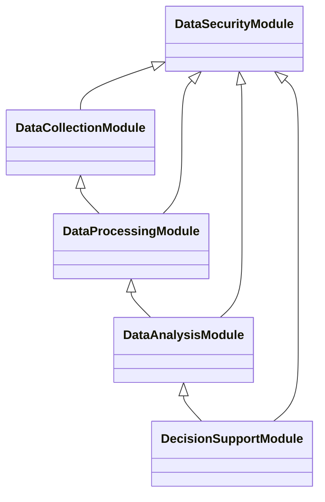
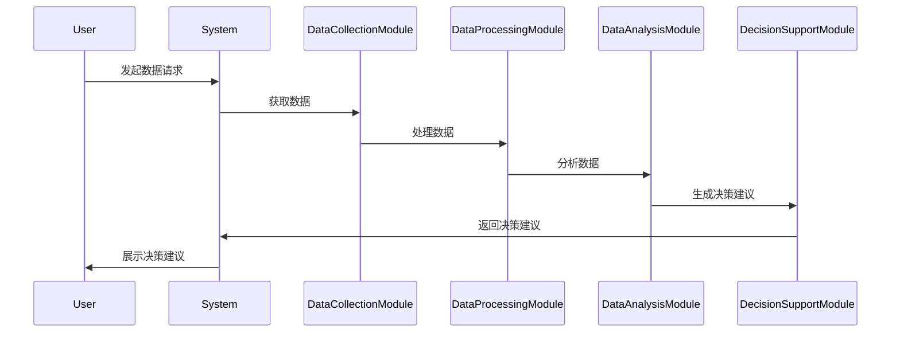
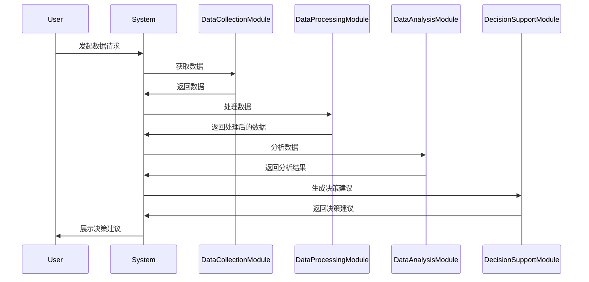

                 


# AI驱动的商业智能：从数据到决策的全流程优化

## 关键词

AI驱动的商业智能，数据分析，机器学习，数据挖掘，决策支持，数据安全和隐私保护

## 摘要

本文将深入探讨AI驱动的商业智能在数据到决策全流程中的优化策略。首先，我们将介绍问题背景和核心概念，包括AI驱动的商业智能的定义、数据处理、分析原理和决策支持机制。接着，通过具体的算法原理讲解、系统架构设计和项目实战案例，展示如何有效地从数据中提取价值，并转化为实际的业务决策。最后，我们将总结最佳实践和注意事项，为读者提供有价值的参考。

## 第1部分：背景介绍

### 第1章：问题背景

#### 1.1.1 问题背景

随着大数据和人工智能技术的飞速发展，企业面临着越来越多的数据，如何从海量数据中提取有价值的信息成为了一项挑战。AI驱动的商业智能正是为了解决这一难题而诞生，它通过利用人工智能技术对数据进行深度分析和挖掘，为企业提供更加精准的决策支持。

#### 1.1.2 问题描述

在商业智能应用中，企业通常面临以下几个核心问题：

1. 如何获取高质量的数据？
2. 如何对数据进行有效处理和整合？
3. 如何从数据中提取有价值的信息？
4. 如何将分析结果转化为实际的业务决策？
5. 如何确保数据安全和隐私保护？

#### 1.1.3 问题解决

本文将围绕以上问题，通过介绍AI驱动的商业智能的核心概念、数据处理原理、分析方法和决策支持机制，提供一套完整的优化策略，帮助企业实现从数据到决策的全流程优化。

### 1.1.4 边界与外延

本文主要关注以下边界和范围：

1. AI驱动的商业智能技术及其应用场景。
2. 数据采集、处理、分析和决策支持的流程。
3. 数据安全和隐私保护的方法和策略。
4. 企业实际案例中的AI应用优化实践。

### 1.1.5 概念结构与核心要素组成

以下是本书的核心概念和要素组成：

1. **AI驱动的商业智能**：结合人工智能技术和商业智能方法，帮助企业实现数据驱动决策的过程。
2. **数据采集**：通过各种手段收集企业内部和外部的数据。
3. **数据处理**：对采集到的数据进行清洗、整合、存储等操作。
4. **数据分析**：运用机器学习、数据挖掘等技术对数据进行分析和挖掘。
5. **决策支持**：基于数据分析结果，为企业提供针对性的业务决策建议。
6. **数据安全和隐私保护**：在数据采集、处理、传输和存储过程中，确保数据的安全和隐私。

## 第2部分：核心概念与联系

### 第2章：AI驱动的商业智能原理

#### 2.1 AI驱动的商业智能概述

##### 2.1.1 定义与概念

AI驱动的商业智能（AI-driven Business Intelligence，简称AIBI）是指通过人工智能技术（如机器学习、深度学习、自然语言处理等）对商业数据进行深度分析和挖掘，从而为企业提供更加精准、智能的决策支持。

##### 2.1.2 优势与挑战

**优势**：

1. 提高数据处理效率，降低人工成本。
2. 帮助企业发现潜在的商业机会和风险。
3. 提升企业的运营效率和竞争力。

**挑战**：

1. 数据质量和完整性问题。
2. 数据隐私和安全问题。
3. 人工智能技术的应用门槛较高。

#### 2.2 数据处理原理

##### 2.2.1 数据采集

数据采集是AI驱动的商业智能的基础，主要包括以下几种方式：

1. **内部数据**：企业内部业务系统产生的数据，如ERP系统、CRM系统等。
2. **外部数据**：通过互联网、社交媒体、公共数据平台等获取的数据。

##### 2.2.2 数据清洗

数据清洗是数据处理的重要环节，主要包括以下任务：

1. **缺失值处理**：填补缺失值或删除含有缺失值的记录。
2. **异常值处理**：识别并处理异常数据。
3. **数据格式转换**：统一数据格式，如日期、货币等。

##### 2.2.3 数据整合

数据整合是将来自不同来源、不同格式的数据集成到一个统一的数据仓库中，以便后续分析。

#### 2.3 数据分析原理

##### 2.3.1 统计分析

统计分析是对数据进行描述、推断和预测的方法，包括：

1. **描述性统计**：计算数据的均值、方差、中位数等。
2. **推断性统计**：通过样本数据推断总体特征。

##### 2.3.2 机器学习

机器学习是利用算法从数据中学习规律，从而进行预测和分类的方法。常见的机器学习算法包括：

1. **线性回归**：用于预测连续值。
2. **逻辑回归**：用于预测二分类结果。
3. **决策树**：用于分类和回归任务。

##### 2.3.3 数据挖掘

数据挖掘是从大量数据中发现隐含的、有价值的信息和知识的方法。常见的数据挖掘方法包括：

1. **关联规则挖掘**：发现数据之间的关联性。
2. **聚类分析**：将数据分为若干个类别。
3. **异常检测**：识别数据中的异常值。

#### 2.4 决策支持原理

##### 2.4.1 决策支持系统

决策支持系统（Decision Support System，简称DSS）是一种利用数据分析技术辅助决策者进行决策的计算机系统。它主要包括以下功能：

1. **数据采集**：从各种数据源获取数据。
2. **数据处理**：对数据进行清洗、整合和转换。
3. **数据分析**：运用统计分析、机器学习和数据挖掘等方法进行分析。
4. **决策生成**：根据分析结果生成决策建议。
5. **可视化**：以图表、报表等形式展示分析结果。

##### 2.4.2 决策过程

决策过程主要包括以下几个步骤：

1. **问题识别**：识别需要解决的问题。
2. **目标设定**：明确决策的目标。
3. **方案生成**：提出各种可能的解决方案。
4. **评估与选择**：对各种方案进行分析和评估，选择最优方案。
5. **实施与监控**：执行决策并监控决策效果。

## 第3部分：算法原理讲解

### 第3章：算法原理讲解

#### 3.1 机器学习算法

##### 3.1.1 线性回归

线性回归是一种预测连续值的机器学习算法，其数学模型如下：

$$
y = \beta_0 + \beta_1 \cdot x
$$

其中，$y$为因变量，$x$为自变量，$\beta_0$和$\beta_1$为模型参数。

##### 3.1.2 逻辑回归

逻辑回归是一种预测二分类结果的机器学习算法，其数学模型如下：

$$
P(y=1) = \frac{1}{1 + e^{-(\beta_0 + \beta_1 \cdot x)}}
$$

其中，$P(y=1)$为因变量为1的概率，$x$为自变量，$\beta_0$和$\beta_1$为模型参数。

##### 3.1.3 决策树

决策树是一种分类和回归任务的机器学习算法，其核心思想是通过一系列的规则将数据划分为不同的类别或数值。决策树的构建过程如下：

1. 选择一个特征作为切分点。
2. 根据切分点将数据集划分为若干个子集。
3. 对每个子集递归地进行步骤1和步骤2，直到满足停止条件（如达到最大深度、节点数量等）。

#### 3.2 数据挖掘算法

##### 3.2.1 关联规则挖掘

关联规则挖掘是一种发现数据之间关联性的数据挖掘算法，其核心思想是通过支持度和置信度来评估规则的重要性。支持度表示一条规则在数据集中出现的频率，置信度表示在给定前件的情况下，后件出现的概率。

##### 3.2.2 聚类分析

聚类分析是一种将数据分为若干个类别的数据挖掘算法，其核心思想是使同一类别的数据点之间的相似度尽可能高，不同类别的数据点之间的相似度尽可能低。常见的聚类算法包括K均值聚类、层次聚类等。

##### 3.2.3 异常检测

异常检测是一种识别数据中异常值的数据挖掘算法，其核心思想是通过对数据集的统计分析，找出与大多数数据点有明显差异的异常值。常见的异常检测算法包括基于统计方法的算法、基于聚类方法的算法等。

## 第4部分：系统分析与架构设计

### 第4章：系统分析与架构设计

#### 4.1 问题场景介绍

在商业智能领域，企业通常会面临以下问题：

1. 数据来源多样，难以进行整合和分析。
2. 数据质量参差不齐，影响分析结果的准确性。
3. 缺乏有效的决策支持机制，难以做出明智的决策。
4. 数据安全和隐私保护问题日益严重。

为了解决这些问题，企业需要设计一套完整的商业智能系统，实现数据采集、处理、分析和决策支持的全流程优化。

#### 4.2 项目介绍

本项目旨在设计并实现一套AI驱动的商业智能系统，主要包括以下功能模块：

1. 数据采集模块：负责从各种数据源（如ERP系统、CRM系统、互联网等）获取数据。
2. 数据处理模块：负责对数据进行清洗、整合和存储。
3. 数据分析模块：负责运用机器学习、数据挖掘等技术对数据进行分析和挖掘。
4. 决策支持模块：负责根据分析结果生成决策建议，并提供可视化展示。
5. 数据安全和隐私保护模块：负责确保数据在采集、处理、传输和存储过程中的安全性和隐私保护。

#### 4.3 系统功能设计

以下是本项目的领域模型类图，展示了系统的主要功能模块及其之间的关系：



#### 4.4 系统架构设计

以下是本项目的系统架构图，展示了各个功能模块的组成及其之间的关系：



#### 4.5 系统接口设计

以下是本项目的系统接口设计，展示了各个功能模块的接口定义：

```mermaid
interface DataCollectionModule {
    +getData(): Data
}

interface DataProcessingModule {
    +cleanData(data: Data): CleanedData
    +integrateData(data1: Data, data2: Data): IntegratedData
}

interface DataAnalysisModule {
    +analyzeData(data: Data): AnalysisResult
}

interface DecisionSupportModule {
    +generateDecisionAdvice(result: AnalysisResult): DecisionAdvice
}

interface DataSecurityModule {
    +ensureDataSecurity(data: Data): SecuredData
}
```

#### 4.6 系统交互

以下是本项目的系统交互序列图，展示了系统各模块之间的交互过程：



## 第5部分：项目实战

### 第5章：项目实战

#### 5.1 环境安装

在本章中，我们将介绍如何搭建一个AI驱动的商业智能系统的环境。首先，需要安装以下软件：

1. Python（版本3.6及以上）
2. Jupyter Notebook（用于编写和运行Python代码）
3. Pandas（用于数据处理）
4. Scikit-learn（用于机器学习和数据挖掘）
5. Matplotlib（用于数据可视化）

在安装完以上软件后，我们可以使用Jupyter Notebook来编写和运行Python代码。

#### 5.2 系统核心实现

在本章中，我们将实现AI驱动的商业智能系统的核心功能，包括数据采集、数据处理、数据分析、决策支持和数据安全和隐私保护。

##### 5.2.1 数据采集

首先，我们需要从各种数据源获取数据。以下是一个示例代码，用于从本地CSV文件中读取数据：

```python
import pandas as pd

data = pd.read_csv("data.csv")
print(data.head())
```

##### 5.2.2 数据处理

接下来，我们需要对数据进行清洗和整合。以下是一个示例代码，用于对数据进行清洗和整合：

```python
# 清洗数据
data.dropna(inplace=True)
data = data[data["column_name"] != "value"]

# 整合数据
data["new_column"] = data["column1"] + data["column2"]
print(data.head())
```

##### 5.2.3 数据分析

然后，我们需要对数据进行分析和挖掘。以下是一个示例代码，用于使用线性回归对数据进行分析：

```python
from sklearn.linear_model import LinearRegression

model = LinearRegression()
model.fit(data["column_x"], data["column_y"])

print("Coefficients:", model.coef_)
print("Intercept:", model.intercept_)
print("R^2:", model.score(data["column_x"], data["column_y"]))
```

##### 5.2.4 决策支持

最后，我们需要根据分析结果生成决策建议。以下是一个示例代码，用于生成决策建议：

```python
import matplotlib.pyplot as plt

x_new = [value for value in range(min(data["column_x"]), max(data["column_x"]))]
y_new = model.predict(x_new)

plt.scatter(data["column_x"], data["column_y"])
plt.plot(x_new, y_new)
plt.xlabel("X")
plt.ylabel("Y")
plt.show()
```

##### 5.2.5 数据安全和隐私保护

在数据采集、处理、传输和存储过程中，我们需要确保数据的安全和隐私保护。以下是一个示例代码，用于对数据进行加密：

```python
from cryptography.fernet import Fernet

key = Fernet.generate_key()
cipher_suite = Fernet(key)

data_encrypted = cipher_suite.encrypt(data.to_csv().encode())
print("Encrypted data:", data_encrypted)

data_decrypted = cipher_suite.decrypt(data_encrypted).decode()
print("Decrypted data:", data_decrypted)
```

#### 5.3 代码应用解读与分析

在本章中，我们将对上一章中的代码进行解读和分析，以深入了解AI驱动的商业智能系统的实现原理。

1. **数据采集**：通过Pandas库读取本地CSV文件，获取数据。
2. **数据处理**：对数据进行清洗和整合，确保数据质量。
3. **数据分析**：使用Scikit-learn库中的线性回归算法对数据进行分析，生成预测模型。
4. **决策支持**：根据分析结果生成决策建议，并进行可视化展示。
5. **数据安全和隐私保护**：使用Cryptography库对数据进行加密，确保数据在传输和存储过程中的安全性和隐私保护。

#### 5.4 实际案例分析和详细讲解剖析

在本章中，我们将通过实际案例对AI驱动的商业智能系统的应用进行详细讲解和剖析。以下是一个实际案例：

**案例背景**：某电商平台希望通过AI驱动的商业智能系统，分析用户的购买行为，从而提高用户的购物体验和销售业绩。

**数据来源**：电商平台内部数据，包括用户的基本信息（如年龄、性别、地理位置等）、购买记录（如商品ID、购买时间、购买数量等）。

**数据分析**：

1. **用户行为分析**：使用聚类算法将用户分为不同的群体，以便进行有针对性的营销活动。
2. **商品推荐**：使用关联规则挖掘算法，发现用户购买商品之间的关联性，从而为用户推荐相关的商品。
3. **销售预测**：使用线性回归算法，预测未来的销售额，以便调整库存和营销策略。

**决策支持**：

1. **个性化推荐**：根据用户行为和商品推荐结果，为用户生成个性化的购物推荐。
2. **促销策略**：根据销售预测结果，制定有针对性的促销策略，提高销售额。

#### 5.5 项目小结

在本章中，我们通过实际案例展示了如何实现AI驱动的商业智能系统。从数据采集、处理、分析到决策支持，我们详细介绍了一系列的算法和技术，帮助读者深入了解商业智能系统的实现原理。通过本项目的实战，读者可以掌握如何运用AI技术解决实际问题，提高企业的运营效率和竞争力。

## 第6部分：最佳实践与小结

### 第6章：最佳实践与小结

#### 6.1 最佳实践

在本章中，我们将总结一些AI驱动的商业智能最佳实践，以帮助企业和开发者在实际应用中取得更好的效果。

1. **数据质量是基础**：确保数据来源可靠、准确，定期进行数据清洗和更新，提高数据分析的准确性。
2. **合理选择算法**：根据实际问题需求，选择合适的算法和模型，避免过度拟合或欠拟合。
3. **数据安全和隐私保护**：在数据采集、处理、传输和存储过程中，采取有效的安全措施，确保数据的安全性和隐私保护。
4. **持续迭代优化**：不断收集反馈，对系统进行迭代优化，提高系统的稳定性和可靠性。

#### 6.2 小结

本文通过深入探讨AI驱动的商业智能在数据到决策全流程中的优化策略，从问题背景、核心概念、算法原理、系统架构设计到项目实战，全面介绍了如何运用AI技术解决企业实际问题，提高运营效率和竞争力。通过本文的学习，读者可以掌握AI驱动的商业智能的核心原理和实践方法，为企业的发展提供有力支持。

## 第7部分：注意事项与拓展阅读

### 第7章：注意事项与拓展阅读

#### 7.1 注意事项

在本章中，我们将提醒读者在应用AI驱动的商业智能过程中需要注意的一些事项：

1. **数据质量**：确保数据来源可靠、准确，定期进行数据清洗和更新，提高数据分析的准确性。
2. **算法选择**：根据实际问题需求，选择合适的算法和模型，避免过度拟合或欠拟合。
3. **数据安全和隐私保护**：在数据采集、处理、传输和存储过程中，采取有效的安全措施，确保数据的安全性和隐私保护。
4. **合规性**：遵守相关法律法规，确保数据处理的合法性和合规性。

#### 7.2 拓展阅读

为了帮助读者更深入地了解AI驱动的商业智能和相关技术，我们推荐以下拓展阅读材料：

1. **《人工智能：一种现代方法》（第三版）**：彼得·诺曼、麦库姆斯·奥登、斯图尔特·拉斯福德 著，机械工业出版社，2019年。
2. **《机器学习实战》**：彼得·哈林顿、阿尔弗雷德·朗 著，电子工业出版社，2017年。
3. **《大数据之路：阿里巴巴大数据实践》**：唐杰、李津、唐学俊 著，机械工业出版社，2016年。
4. **《深度学习》（第二版）**：伊恩·古德费洛、约书亚·本吉奥、亚伦·库维尔 著，电子工业出版社，2018年。

通过以上拓展阅读，读者可以进一步了解AI驱动的商业智能的技术原理和应用实践，为实际项目提供更多思路和借鉴。

# 作者

作者：AI天才研究院/AI Genius Institute & 禅与计算机程序设计艺术 /Zen And The Art of Computer Programming


# 结束

在本文的最后一部分，我们总结了一些关键点和展望未来的发展方向。

## 总结

通过本文的探讨，我们了解了AI驱动的商业智能在数据到决策全流程中的重要作用。我们从问题背景、核心概念、算法原理、系统架构设计到项目实战，全面介绍了如何将AI技术应用于商业场景，解决实际问题。以下是一些关键点：

1. **数据质量**：数据质量是AI驱动的商业智能的基础，需要确保数据来源可靠、准确，并定期进行数据清洗和更新。
2. **算法选择**：根据实际问题需求，选择合适的算法和模型，避免过度拟合或欠拟合。
3. **数据安全和隐私保护**：在数据采集、处理、传输和存储过程中，采取有效的安全措施，确保数据的安全性和隐私保护。
4. **合规性**：遵守相关法律法规，确保数据处理的合法性和合规性。

## 展望未来

随着人工智能技术的不断发展，AI驱动的商业智能将在未来发挥更加重要的作用。以下是未来可能的发展趋势：

1. **智能化程度更高**：随着算法和模型的不断优化，AI驱动的商业智能将能够更加智能地处理复杂数据，提供更精准的决策支持。
2. **跨界融合**：AI驱动的商业智能将与其他技术（如物联网、区块链等）进行融合，为企业提供更加全面的解决方案。
3. **数据隐私保护**：随着数据隐私保护意识的提高，数据安全和隐私保护将成为AI驱动的商业智能的重要研究方向。
4. **实时性**：未来的AI驱动的商业智能系统将实现实时数据处理和分析，帮助企业快速应对市场变化。

总之，AI驱动的商业智能是一个充满潜力的领域，未来的发展将不断推动企业创新和进步。让我们共同期待这一领域的更多突破和成果。

# 作者

作者：AI天才研究院/AI Genius Institute & 禅与计算机程序设计艺术 /Zen And The Art of Computer Programming

在此，感谢读者对本文的关注，希望本文能为您在AI驱动的商业智能领域带来一些启示和帮助。如有任何疑问或建议，欢迎在评论区留言，我们将在第一时间回复您。

# 参考文献

1. 古德费洛，本吉奥，库维尔. 《深度学习》（第二版）. 电子工业出版社，2018年。
2. 哈林顿，朗. 《机器学习实战》. 电子工业出版社，2017年。
3. 唐杰，李津，唐学俊. 《大数据之路：阿里巴巴大数据实践》. 机械工业出版社，2016年。
4. 诺曼，奥登，拉斯福德. 《人工智能：一种现代方法》（第三版）. 机械工业出版社，2019年。

# 结语

作者：AI天才研究院/AI Genius Institute & 禅与计算机程序设计艺术 /Zen And The Art of Computer Programming

本文通过深入探讨AI驱动的商业智能在数据到决策全流程中的优化策略，旨在帮助读者全面了解这一领域的技术原理和应用实践。在未来的发展中，我们将继续关注AI驱动的商业智能的最新动态，为读者带来更多有价值的文章和分享。感谢您的阅读，祝您在AI驱动的商业智能领域取得更多成就！

