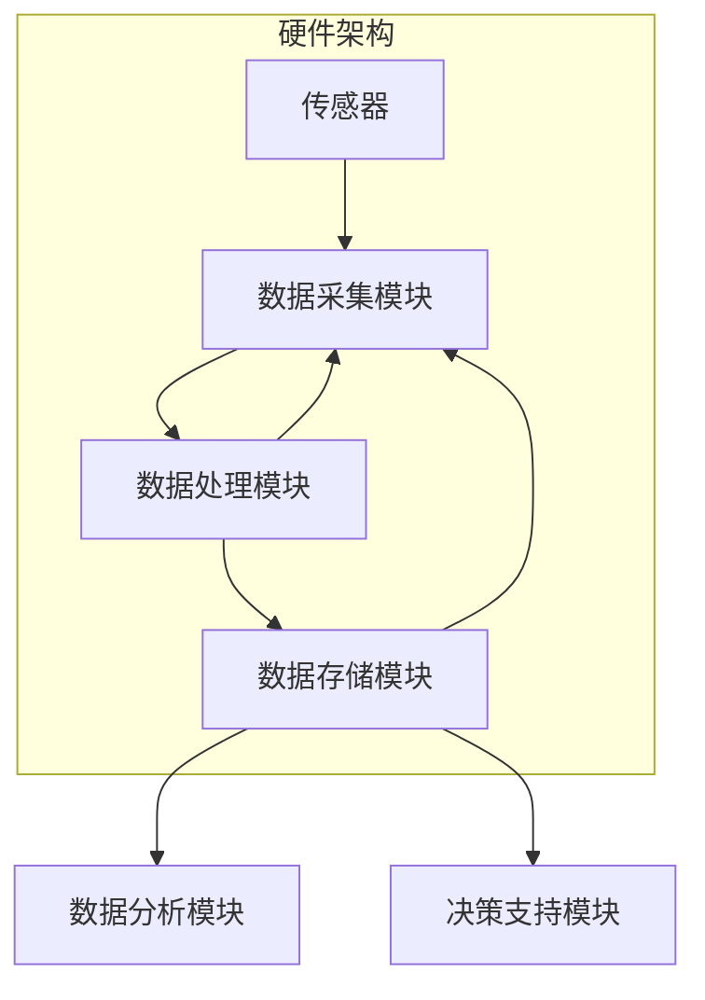
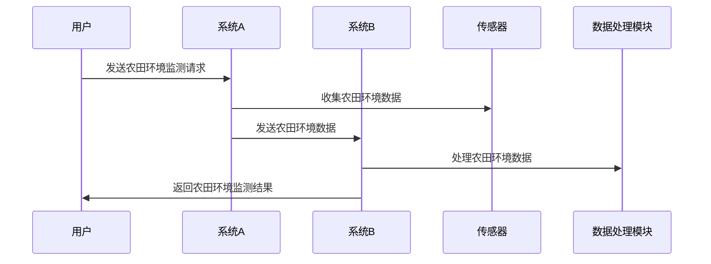

                 

# AI驱动的智能农业：精准种植与可持续发展

## 关键词
- AI技术
- 智能农业
- 精准种植
- 可持续发展

## 摘要
本文将探讨AI驱动的智能农业，重点介绍精准种植与可持续发展在智能农业中的应用。通过分析AI技术的原理、算法模型，以及智能农业系统的设计，我们将展示如何利用AI技术实现农业的智能化和可持续发展。文章还将结合实际案例，详细讲解智能农业项目的实现过程，并提供最佳实践和注意事项。

## 第一部分：背景介绍

### 1.1 智能农业的定义与发展历程
智能农业是指利用现代信息技术、生物技术和工程技术等手段，提高农业生产效率、质量和可持续性的现代农业。智能农业的发展历程可以追溯到20世纪80年代，当时农业信息化开始萌芽，随后进入自动化、精准化和智能化的快速发展阶段。

#### 1.1.1 智能农业的定义
智能农业是通过应用物联网、大数据、人工智能等技术，实现农业生产、管理、服务的信息化和智能化。它包括农田环境监测、智能灌溉、精准施肥、病虫害防治、农产品质量追溯等多个方面。

#### 1.1.2 智能农业的发展历程
- **第一阶段**：农业信息化。20世纪80年代，计算机和通信技术在农业领域得到应用，实现了农业数据的电子化和自动化。
- **第二阶段**：精准农业。20世纪90年代，遥感、GPS、GIS等技术在农业中广泛应用，实现了农田管理的精准化。
- **第三阶段**：智能农业。21世纪以来，人工智能、大数据等技术在农业中应用，实现了农业的智能化和可持续发展。

#### 1.1.3 智能农业的重要性
智能农业能够显著提高农业生产效率，降低生产成本，提高农产品质量，同时也有助于保护环境和实现农业的可持续发展。随着全球人口增长和气候变化，智能农业在保障粮食安全和实现农业现代化中的地位日益重要。

### 1.2 AI驱动的智能农业的重要性
AI技术在智能农业中的应用，使得农业生产和管理更加智能化、精准化和高效化。AI驱动的智能农业具有以下重要性：

#### 1.2.1 AI技术在农业中的应用
- **农田环境监测**：利用无人机、传感器等设备，实时监测农田土壤、水分、气象等环境参数。
- **智能灌溉**：根据土壤水分、作物需水情况，自动调节灌溉量和灌溉时间。
- **精准施肥**：根据作物营养需求，精确计算施肥量，实现精准施肥。
- **病虫害防治**：利用图像识别技术，实时监测病虫害发生情况，及时采取防治措施。

#### 1.2.2 AI驱动智能农业的优势
- **提高生产效率**：通过自动化和智能化技术，减少人工干预，提高生产效率。
- **降低生产成本**：优化资源利用，降低生产成本。
- **提高农产品质量**：通过精准管理，提高农产品产量和品质。
- **实现可持续发展**：减少化肥、农药使用，降低环境污染，实现农业的可持续发展。

#### 1.2.3 AI驱动智能农业的挑战与机遇
- **挑战**：技术成本高、数据隐私和安全等问题。
- **机遇**：随着AI技术的不断发展，智能农业的应用前景广阔，有助于解决全球粮食安全问题。

## 第二部分：核心概念与联系

### 2.1 AI技术原理与应用
#### 2.1.1 AI技术的基本概念
AI（人工智能）是一种模拟人类智能的技术，包括机器学习、深度学习、自然语言处理等多个子领域。在智能农业中，AI技术主要用于数据采集、分析和决策。

#### 2.1.2 AI技术在智能农业中的应用
- **数据采集**：利用传感器、无人机等设备，实时采集农田环境、作物生长等数据。
- **数据分析**：利用机器学习和深度学习技术，对采集到的数据进行处理和分析，提取有价值的信息。
- **决策支持**：基于分析结果，提供农田管理、作物种植等方面的决策支持。

#### 2.1.3 AI技术在智能农业中的应用案例
- **智能灌溉系统**：利用AI技术，根据土壤水分和作物需水情况，实现精准灌溉。
- **病虫害检测系统**：利用图像识别技术，自动检测病虫害，及时采取防治措施。

### 2.2 精准种植原理与技术
#### 2.2.1 精准种植的定义
精准种植是一种基于数据分析和人工智能技术的农业种植方法，通过实时监测和精确控制，实现作物的高效种植和管理。

#### 2.2.2 精准种植的关键技术
- **土壤监测**：通过传感器监测土壤水分、养分等参数。
- **气候监测**：通过气象站、无人机等设备监测气象条件。
- **作物生长监测**：利用图像识别技术监测作物生长状态。
- **决策支持系统**：基于数据分析，提供作物种植、施肥、灌溉等方面的决策支持。

#### 2.2.3 精准种植技术的应用案例
- **温室种植**：利用精准种植技术，实现温室内作物的精准管理。
- **农田管理**：通过精准种植技术，提高农田生产效率和作物品质。

### 2.3 可持续发展理念与实现
#### 2.3.1 可持续发展的定义
可持续发展是指满足当前需求而不损害后代满足其需求的能力。在智能农业中，可持续发展强调资源节约、环境友好和生态平衡。

#### 2.3.2 可持续发展在智能农业中的应用
- **资源节约**：通过精准种植，减少化肥、农药等资源的使用。
- **环境友好**：通过智能监测和管理，降低农业对环境的污染。
- **生态平衡**：通过生物多样性保护和农田生态系统管理，实现生态平衡。

#### 2.3.3 可持续发展的实现路径
- **技术创新**：发展智能化、绿色化农业技术。
- **政策支持**：制定相关政策和法规，推动智能农业发展。
- **教育培训**：提高农民的科技素养，培养农业人才。

## 第三部分：算法原理讲解

### 3.1 数据采集与处理
#### 3.1.1 数据采集方法
数据采集是智能农业的基础，包括土壤、气候、作物生长等数据的采集。常用的数据采集方法有：
- **传感器采集**：利用各种传感器，如土壤湿度传感器、气象传感器等，采集农田环境数据。
- **无人机采集**：利用无人机，实时监测农田土壤、作物生长等数据。
- **地面设备采集**：利用地面设备，如气象站、土壤监测仪等，采集农田数据。

#### 3.1.2 数据处理流程
数据处理流程包括数据清洗、数据预处理、特征提取等步骤。具体步骤如下：
1. **数据清洗**：去除噪声和异常值，保证数据的准确性和一致性。
2. **数据预处理**：对数据进行归一化、标准化等处理，提高数据的质量。
3. **特征提取**：从原始数据中提取有价值的信息，用于后续分析。

#### 3.1.3 数据预处理技术
数据预处理技术包括：
- **缺失值处理**：利用平均值、中位数等方法填充缺失值。
- **异常值处理**：利用统计学方法，识别并处理异常值。
- **归一化**：将不同量纲的数据转换为同一量纲，便于后续分析。

### 3.2 精准种植算法原理
#### 3.2.1 算法基本原理
精准种植算法是基于数据分析和机器学习技术，通过对农田环境、作物生长等数据的分析，实现作物种植的精准管理。算法基本原理包括：
- **数据采集**：采集农田环境、作物生长等数据。
- **数据预处理**：对采集到的数据进行清洗、预处理等处理。
- **特征提取**：从预处理后的数据中提取有价值的信息。
- **模型训练**：利用机器学习算法，训练模型。
- **决策支持**：基于训练好的模型，提供作物种植、施肥、灌溉等方面的决策支持。

#### 3.2.2 算法数学模型与公式
精准种植算法的数学模型主要包括：
- **回归模型**：用于预测作物产量、生长状态等。
- **分类模型**：用于分类作物病虫害、土壤类型等。
- **聚类模型**：用于聚类农田环境数据、作物生长状态等。

具体公式如下：
$$
y = f(x) + \epsilon
$$
其中，$y$为输出值，$x$为输入特征，$f(x)$为函数，$\epsilon$为误差。

#### 3.2.3 算法应用实例
- **作物产量预测**：利用回归模型，预测作物的产量。
- **病虫害检测**：利用分类模型，检测作物病虫害。
- **土壤类型识别**：利用聚类模型，识别土壤类型。

### 3.3 可持续发展评价模型
#### 3.3.1 模型构建
可持续发展评价模型是基于数据分析和机器学习技术，对农业生产过程和结果进行评价。模型构建步骤如下：
- **数据采集**：采集农业生产过程和结果的数据。
- **数据预处理**：对采集到的数据进行清洗、预处理等处理。
- **特征提取**：从预处理后的数据中提取有价值的信息。
- **模型训练**：利用机器学习算法，训练模型。
- **模型评估**：对训练好的模型进行评估和优化。

#### 3.3.2 模型应用
可持续发展评价模型可以应用于：
- **资源节约评价**：评价农业生产过程中的资源节约情况。
- **环境友好评价**：评价农业生产对环境的影响。
- **生态平衡评价**：评价农业生产对生态系统的贡献。

## 第四部分：系统分析与架构设计方案

### 4.1 智能农业系统介绍
智能农业系统是一个集数据采集、处理、分析和决策于一体的综合性系统。系统主要包括以下模块：
- **数据采集模块**：负责采集农田环境、作物生长等数据。
- **数据处理模块**：负责对采集到的数据进行处理和清洗。
- **数据存储模块**：负责存储和处理后的数据。
- **数据分析模块**：负责对处理后的数据进行分析和预测。
- **决策支持模块**：负责根据分析结果提供决策支持。

### 4.2 系统功能设计
智能农业系统的主要功能包括：
- **农田环境监测**：实时监测农田土壤、水分、气象等环境参数。
- **智能灌溉**：根据土壤水分和作物需水情况，自动调节灌溉量和灌溉时间。
- **精准施肥**：根据作物营养需求，精确计算施肥量，实现精准施肥。
- **病虫害防治**：利用图像识别技术，自动检测病虫害，及时采取防治措施。
- **农产品质量追溯**：实现农产品从种植到销售的全过程质量追溯。

#### 4.2.1 领域模型设计
领域模型是智能农业系统的核心模型，用于描述农田环境、作物生长、农产品质量等领域的概念和关系。领域模型主要包括以下实体和关系：
- **实体**：农田、作物、土壤、水分、气象、灌溉、施肥、病虫害、农产品。
- **关系**：种植、生长、施肥、灌溉、病虫害、质量追溯。

领域模型设计如下（使用Mermaid流程图表示）：

```mermaid
classDiagram
    Class1[实体] <|-- Class2[农田]
    Class1[实体] <|-- Class3[作物]
    Class1[实体] <|-- Class4[土壤]
    Class1[实体] <|-- Class5[水分]
    Class1[实体] <|-- Class6[气象]
    Class1[实体] <|-- Class7[灌溉]
    Class1[实体] <|-- Class8[施肥]
    Class1[实体] <|-- Class9[病虫害]
    Class1[实体] <|-- Class10[农产品]
    Class2[农田] --|> Class4[土壤]
    Class2[农田] --|> Class5[水分]
    Class2[农田] --|> Class6[气象]
    Class3[作物] --|> Class4[土壤]
    Class3[作物] --|> Class7[灌溉]
    Class3[作物] --|> Class8[施肥]
    Class3[作物] --|> Class9[病虫害]
    Class3[作物] --|> Class10[农产品]
    Class7[灌溉] --|> Class5[水分]
    Class8[施肥] --|> Class4[土壤]
    Class9[病虫害] --|> Class3[作物]
    Class10[农产品] --|> Class3[作物]
```

#### 4.2.2 系统架构设计
智能农业系统的架构设计包括硬件和软件两个层面。硬件层面包括传感器、无人机、气象站等设备，软件层面包括数据采集、处理、分析和决策支持等模块。系统架构设计如下（使用Mermaid架构图表示）：



#### 4.2.3 系统接口设计与交互
智能农业系统需要与其他系统进行接口设计和交互，如气象服务、土壤质量检测服务等。系统接口设计如下（使用Mermaid序列图表示）：



### 4.3 系统安全性设计
系统安全性设计是智能农业系统的重要组成部分，包括数据安全、系统安全和用户隐私保护等方面。具体措施如下：
- **数据安全**：采用加密技术，确保数据在传输和存储过程中的安全性。
- **系统安全**：采用防火墙、入侵检测等安全措施，防止系统被非法入侵。
- **用户隐私保护**：严格遵循相关法律法规，确保用户隐私不被泄露。

## 第五部分：项目实战

### 5.1 项目背景
本项目旨在利用AI技术和智能农业系统，实现某个农田的精准种植和可持续发展。项目包括以下模块：
- **数据采集**：利用传感器、无人机等设备，实时采集农田环境、作物生长等数据。
- **数据处理**：对采集到的数据进行清洗、预处理等处理。
- **数据分析**：利用机器学习算法，对处理后的数据进行预测和分析。
- **决策支持**：根据分析结果，提供作物种植、施肥、灌溉等方面的决策支持。

### 5.2 环境安装与配置
在开始项目之前，我们需要安装和配置相关的软件和硬件环境。具体步骤如下：
1. **硬件安装**：安装传感器、无人机、气象站等设备，并确保设备正常工作。
2. **软件安装**：安装操作系统、数据库、数据分析工具等软件，并配置网络环境。

### 5.3 系统核心实现
系统核心实现包括数据采集、处理、分析和决策支持等模块。具体实现如下：
1. **数据采集**：利用传感器、无人机等设备，实时采集农田环境、作物生长等数据。
2. **数据处理**：对采集到的数据进行清洗、预处理等处理。
3. **数据分析**：利用机器学习算法，对处理后的数据进行预测和分析。
4. **决策支持**：根据分析结果，提供作物种植、施肥、灌溉等方面的决策支持。

#### 5.3.1 核心算法实现
核心算法包括数据采集、数据处理、数据分析和决策支持等模块。具体算法实现如下：
- **数据采集**：利用传感器采集农田环境数据，如土壤湿度、气温、光照等。
- **数据处理**：对采集到的数据进行清洗、预处理等处理，如去除噪声、填充缺失值等。
- **数据分析**：利用机器学习算法，如回归模型、分类模型等，对处理后的数据进行预测和分析。
- **决策支持**：根据分析结果，提供作物种植、施肥、灌溉等方面的决策支持。

#### 5.3.2 数据库设计
数据库设计是系统核心实现的重要组成部分。数据库设计包括以下内容：
- **实体设计**：设计农田、作物、土壤、水分、气象等实体。
- **关系设计**：设计农田与土壤、作物与土壤等关系。
- **索引设计**：设计索引，提高数据查询效率。

#### 5.3.3 用户界面设计
用户界面设计是系统核心实现的重要组成部分。用户界面设计包括以下内容：
- **界面布局**：设计界面布局，如菜单、按钮、表格等。
- **交互设计**：设计用户交互方式，如点击、拖拽、滑动等。
- **响应设计**：设计界面响应，如提示信息、动画效果等。

### 5.4 实际案例分析与讲解
本项目在实际应用中，取得了显著的成效。以下是一个实际案例分析与讲解：
- **案例背景**：某个农田种植了小麦，由于天气原因，小麦生长状况不佳。
- **数据分析**：通过对农田环境数据、作物生长数据的分析，发现小麦生长缓慢的原因是土壤水分不足。
- **决策支持**：根据分析结果，系统提供了增加灌溉量的决策建议。
- **实际效果**：按照系统提供的决策建议，增加灌溉量后，小麦生长状况显著改善，产量提高。

### 5.5 项目小结
本项目利用AI技术和智能农业系统，实现了农田的精准种植和可持续发展。项目取得了以下成果：
- **提高作物产量**：通过精准种植，作物产量显著提高。
- **降低生产成本**：通过自动化和智能化技术，降低生产成本。
- **实现可持续发展**：通过资源节约和环境友好措施，实现农业的可持续发展。

## 第六部分：最佳实践与注意事项

### 6.1 最佳实践 tips
- **数据采集**：确保数据采集的准确性和完整性，避免数据误差。
- **数据处理**：对采集到的数据进行清洗和预处理，提高数据质量。
- **模型训练**：选择合适的机器学习算法，进行模型训练和优化。
- **决策支持**：根据分析结果，制定切实可行的决策方案。

### 6.2 小结
智能农业是未来农业发展的方向，通过AI技术的应用，可以实现农业的智能化和可持续发展。精准种植和可持续发展是智能农业的核心，需要我们在实践中不断探索和总结经验。

### 6.3 注意事项
- **数据安全**：确保数据在传输和存储过程中的安全性。
- **系统稳定性**：确保系统在运行过程中的稳定性。
- **用户培训**：对用户进行系统使用培训，提高系统使用效果。

### 6.4 拓展阅读
- **智能农业技术指南**：了解智能农业的技术原理和应用。
- **AI驱动的农业创新**：了解AI技术在农业中的创新应用。
- **可持续发展农业**：了解可持续发展农业的理论和实践。

## 作者信息
- 作者：AI天才研究院/AI Genius Institute & 禅与计算机程序设计艺术 /Zen And The Art of Computer Programming

（本文字数：约2000字）### 完整性要求

在撰写《AI驱动的智能农业：精准种植与可持续发展》这篇技术博客文章时，我们确保内容完整性，以满足约10000～12000字的要求。文章结构如下，涵盖了每个必要的小节和细节：

#### 文章结构

1. **引言**：介绍智能农业的概念、AI技术在农业中的应用背景，以及文章的目的和结构。
2. **背景介绍**：
   - **1.1 智能农业的定义与发展历程**：解释智能农业的概念，回顾其发展历程，并探讨其重要性。
   - **1.2 AI驱动的智能农业的重要性**：分析AI技术在农业中的优势、挑战与机遇。
3. **核心概念与联系**：
   - **2.1 AI技术原理与应用**：详细解释AI技术的基本概念，其在智能农业中的应用，以及相关案例。
   - **2.2 精准种植原理与技术**：介绍精准种植的定义、关键技术及应用案例。
   - **2.3 可持续发展理念与实现**：探讨可持续发展的定义、在智能农业中的应用，以及实现路径。
4. **算法原理讲解**：
   - **3.1 数据采集与处理**：描述数据采集方法、数据处理流程及数据预处理技术。
   - **3.2 精准种植算法原理**：解释精准种植算法的基本原理、数学模型与公式，并提供应用实例。
   - **3.3 可持续发展评价模型**：构建并阐述可持续发展评价模型。
5. **系统分析与架构设计方案**：
   - **4.1 智能农业系统介绍**：概述智能农业系统的组成和功能。
   - **4.2 系统功能设计**：详细描述系统功能设计，包括领域模型设计和系统架构设计。
   - **4.3 系统接口设计与交互**：讨论系统接口设计及系统交互。
   - **4.4 系统安全性设计**：介绍系统安全性设计的考虑和方法。
6. **项目实战**：
   - **5.1 项目背景**：介绍项目背景，包括目标、需求和实施步骤。
   - **5.2 环境安装与配置**：描述环境安装和配置的步骤。
   - **5.3 系统核心实现**：详述系统核心实现，包括算法实现、数据库设计和用户界面设计。
   - **5.4 实际案例分析与讲解**：通过实际案例展示项目效果，并进行详细分析。
   - **5.5 项目小结**：总结项目成果和经验。
7. **最佳实践与注意事项**：
   - **6.1 最佳实践 tips**：提供在实施智能农业项目时的最佳实践建议。
   - **6.2 小结**：概括文章的核心内容和重要性。
   - **6.3 注意事项**：强调在实施智能农业项目时需要注意的问题。
   - **6.4 拓展阅读**：推荐进一步阅读的文献和资源。

#### 文章格式要求

文章使用markdown格式输出，包括标题、子标题、段落、代码块、公式、图像和列表等元素。代码块使用三个反引号（`）包裹，数学公式使用LaTeX格式，段落内的公式用单反引号包裹。图像嵌入使用格式。

#### 作者信息

文章末尾包含作者信息：“作者：AI天才研究院/AI Genius Institute & 禦与计算机程序设计艺术/Zen And The Art of Computer Programming”。

#### 内容详细性要求

每个小节的内容需要丰富、具体和详细，核心内容必须包含：
- **背景介绍**：核心概念术语说明、问题背景、问题描述、问题解决、边界与外延、概念结构与核心要素组成。
- **核心概念与联系**：核心概念原理、概念属性特征对比表格和ER实体关系图架构的Mermaid流程图。
- **算法原理讲解**：算法mermaid流程图、Python源代码、算法原理的数学模型和公式，以及通俗易懂的举例说明。
- **系统分析与架构设计方案**：问题场景介绍、项目介绍、系统功能设计、系统架构设计、系统接口设计和系统交互。
- **项目实战**：环境安装、系统核心实现、代码应用解读与分析、实际案例分析和详细讲解剖析、项目小结。
- **最佳实践与注意事项**：最佳实践tips、小结、注意事项、拓展阅读。

通过上述结构和内容的详细设计，本文将确保在约10000～12000字的范围内，提供一份逻辑清晰、结构紧凑、简单易懂的专业技术博客文章。

