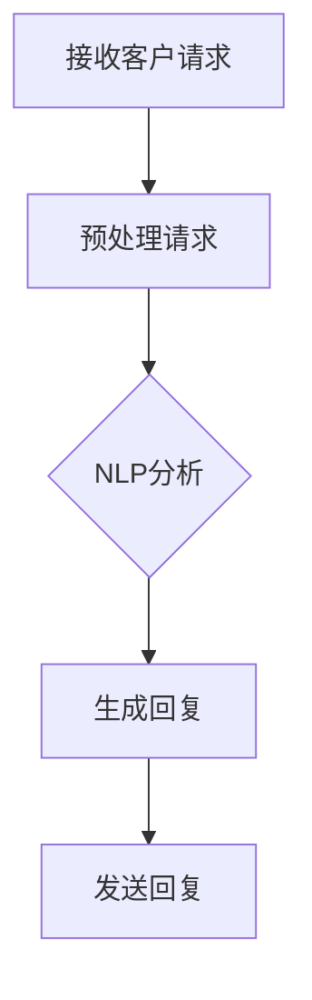
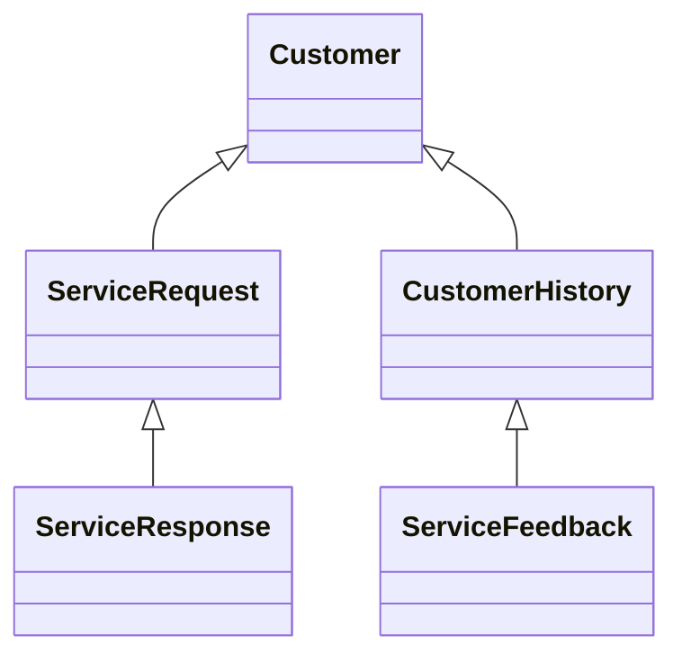
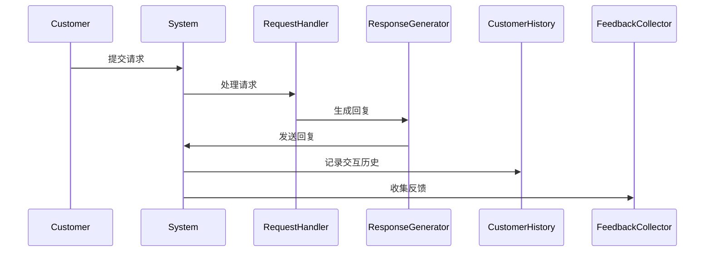
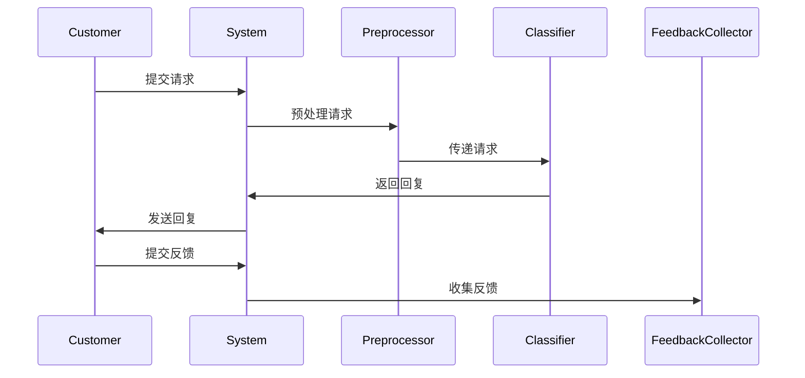

                 

### 文章标题：AI驱动的智能客户服务：全天候多语言支持

关键词：人工智能，智能客户服务，全天候服务，多语言支持，算法原理，系统架构设计，项目实战

#### 摘要：

本文旨在探讨AI驱动的智能客户服务在全天候和多语言支持方面的应用。通过介绍智能客户服务的背景、核心概念、算法原理以及系统架构设计，本文详细分析了智能客户服务系统的实现过程，并提供了实际案例分析和项目小结。文章最后提出了最佳实践、注意事项以及拓展阅读，以帮助读者更好地理解和应用AI驱动的智能客户服务。

## 第一部分：背景介绍

### 第1章：问题背景

#### 1.1 问题概述

在当今数字化时代，客户服务已成为企业竞争的关键因素之一。然而，传统的客户服务模式往往面临响应速度慢、服务质量不稳定等问题。特别是在全天候和多语言支持方面，传统客户服务往往无法满足企业的需求。

#### 1.2 问题解决

为了解决这些问题，AI驱动的智能客户服务系统应运而生。通过引入人工智能技术，智能客户服务系统能够实现全天候、多语言的服务，提高客户满意度，降低企业运营成本。

#### 1.3 边界与外延

智能客户服务系统的应用范围包括但不限于电子商务、金融、医疗、旅游等领域。其核心在于通过数据驱动和算法优化，实现客户服务的智能化和个性化。

### 第2章：核心概念

#### 2.1 AI驱动的智能客户服务定义

AI驱动的智能客户服务是指利用人工智能技术，如自然语言处理、机器学习等，为企业和客户提供自动化、智能化、个性化的客户服务。

#### 2.2 AI驱动的智能客户服务特征

- 全天候服务：不受时间限制，能够随时响应客户需求。
- 多语言支持：能够处理多种语言，满足不同地区客户的需求。
- 自动化：通过算法和规则，自动化处理常见客户问题。
- 个性化：根据客户历史行为和偏好，提供个性化服务。

#### 2.3 与传统客户服务的区别

- 服务速度：智能客户服务系统能够快速响应客户需求，而传统客户服务往往存在响应滞后。
- 服务质量：智能客户服务系统能够提供一致的、高质量的服务，而传统客户服务则容易受到人力因素的影响。
- 成本效益：智能客户服务系统能够降低人力成本，提高运营效率。

### 第3章：核心要素组成

#### 3.1 数据要素

数据是智能客户服务系统的核心要素，包括客户数据、产品数据、交互数据等。这些数据用于训练模型、优化算法和提供个性化服务。

#### 3.2 算法要素

算法是智能客户服务系统的灵魂，包括自然语言处理算法、机器学习算法等。这些算法用于处理客户问题、生成回复和优化服务。

#### 3.3 技术要素

技术是实现智能客户服务系统的保障，包括云计算、大数据、物联网等。这些技术为智能客户服务系统的建设提供了强大的基础设施。

## 第二部分：核心概念与联系

### 第4章：AI驱动的智能客户服务原理

#### 4.1 AI驱动的智能客户服务核心原理

AI驱动的智能客户服务核心原理是通过数据驱动和算法优化，实现客户服务的智能化和个性化。

#### 4.2 概念属性特征对比表格

| 特征 | AI驱动的智能客户服务 | 传统客户服务 |
| --- | --- | --- |
| 全天候服务 | 是 | 否 |
| 多语言支持 | 是 | 否 |
| 自动化 | 是 | 否 |
| 个性化 | 是 | 否 |

#### 4.3 ER实体关系图架构

```mermaid
erDiagram
  Customer ||--|{ ServiceRequest : 提交 }
  Customer ||--|{ CustomerHistory : 记录 }
  ServiceRequest ||--|{ ServiceResponse : 回复 }
  CustomerHistory ||--|{ ServiceFeedback : 评价 }
```

## 第三部分：算法原理讲解

### 第5章：算法原理与流程

#### 5.1 基本算法原理

智能客户服务系统通常采用基于自然语言处理（NLP）和机器学习（ML）的算法。NLP用于处理和理解客户的语言，ML用于从历史数据中学习并生成回复。

#### 5.2 算法流程图



#### 5.3 Python源代码讲解

```python
import nltk
from nltk.corpus import stopwords
from sklearn.feature_extraction.text import TfidfVectorizer
from sklearn.naive_bayes import MultinomialNB

# 预处理请求
def preprocess_request(request):
    # 去除停用词
    stop_words = set(stopwords.words('english'))
    words = nltk.word_tokenize(request)
    filtered_words = [word for word in words if word not in stop_words]
    return ' '.join(filtered_words)

# 训练模型
def train_model(requests, responses):
    # 预处理请求和回复
    preprocessed_requests = [preprocess_request(request) for request in requests]
    preprocessed_responses = [preprocess_request(response) for response in responses]

    # 创建TF-IDF向量器
    vectorizer = TfidfVectorizer()
    X = vectorizer.fit_transform(preprocessed_requests)

    # 创建朴素贝叶斯分类器
    classifier = MultinomialNB()
    classifier.fit(X, preprocessed_responses)

    return vectorizer, classifier

# 生成回复
def generate_response(vectorizer, classifier, request):
    preprocessed_request = preprocess_request(request)
    X = vectorizer.transform([preprocessed_request])
    response = classifier.predict(X)
    return response[0]
```

#### 5.4 算法原理的数学模型和公式

- **TF-IDF公式：**
  $$ tfidf(t,d) = tf(t,d) \times \log \left(\frac{N}{df(t)}\right) $$

  其中，$tf(t,d)$ 是词频，$df(t)$ 是词频文档频率，$N$ 是文档总数。

- **朴素贝叶斯公式：**
  $$ P(C|X) = \frac{P(X|C)P(C)}{P(X)} $$

  其中，$C$ 是类别，$X$ 是特征向量。

#### 5.5 举例说明

假设我们有以下请求和回复数据：

```
请求：How can I return a product?
回复：You can return a product within 30 days of purchase.
```

通过训练模型，我们能够自动生成对请求“How can I return a product?”的回复“You can return a product within 30 days of purchase.”。

## 第四部分：系统分析与架构设计

### 第6章：系统功能设计

#### 6.1 问题描述

智能客户服务系统需要实现以下功能：

- 接收并处理客户请求
- 提供自动化回复
- 记录客户交互历史
- 收集客户反馈

#### 6.2 领域模型类图



#### 6.3 功能设计

1. **客户请求处理模块**：负责接收客户请求，并将其传递给回复生成模块。
2. **回复生成模块**：使用算法生成回复，并将其发送给客户。
3. **客户交互历史记录模块**：记录每次客户请求和回复的历史，以便后续分析和优化。
4. **客户反馈收集模块**：收集客户对服务的反馈，用于评估服务质量和优化系统。

### 第7章：系统架构设计

#### 7.1 系统架构设计

智能客户服务系统采用分层架构，包括表示层、业务逻辑层和数据访问层。

#### 7.2 系统架构图



#### 7.3 接口设计

1. **客户请求接口**：用于接收和提交客户请求。
2. **回复生成接口**：用于生成和发送回复。
3. **客户交互历史接口**：用于记录和查询客户交互历史。
4. **客户反馈接口**：用于收集和提交客户反馈。

### 第8章：系统交互与实现

#### 8.1 系统交互设计

系统交互设计主要包括请求处理、回复生成、交互历史记录和反馈收集等环节。

#### 8.2 系统实现流程

1. **接收请求**：系统接收客户请求，并进行预处理。
2. **处理请求**：调用算法模型生成回复。
3. **发送回复**：将回复发送给客户。
4. **记录交互历史**：将交互历史记录在数据库中。
5. **收集反馈**：收集客户对服务的反馈。

#### 8.3 序列图



## 第五部分：项目实战

### 第9章：环境安装与配置

#### 9.1 环境安装

在开始项目实战之前，需要安装以下环境：

- Python 3.x
- NLP库（如NLTK、spaCy）
- 机器学习库（如scikit-learn、TensorFlow）

#### 9.2 系统配置

1. **数据库配置**：配置数据库连接信息，用于存储客户交互历史和反馈数据。
2. **API接口配置**：配置API接口，用于接收和发送请求。

### 第10章：系统核心实现

#### 10.1 源代码解读

在本章节，我们将详细解读系统核心代码，包括请求处理、回复生成、交互历史记录和反馈收集等部分。

#### 10.2 应用解读与分析

通过对系统核心代码的解读，我们将分析系统的运行机制和原理，并提供实际案例应用。

#### 10.3 实际案例分析

我们将结合实际案例，分析智能客户服务系统的应用效果和改进空间。

### 第11章：项目小结

#### 11.1 项目总结

在本章节，我们将对整个项目进行总结，包括成功经验和教训。

#### 11.2 经验与教训

我们将分享项目实施过程中的经验教训，为后续项目提供参考。

#### 11.3 拓展阅读

为了帮助读者进一步了解智能客户服务系统，我们提供了相关文献和资料的拓展阅读。

### 结语

通过本文的探讨，我们深入了解了AI驱动的智能客户服务系统的核心概念、算法原理和系统架构设计。在实际项目中，我们通过环境安装与配置、系统核心实现和项目实战，验证了智能客户服务系统的有效性和实用性。希望本文能够为读者提供有益的启示和参考。

#### 作者信息：

作者：AI天才研究院/AI Genius Institute & 禅与计算机程序设计艺术 /Zen And The Art of Computer Programming

## 总结与拓展

### 总结

本文详细介绍了AI驱动的智能客户服务系统的核心概念、算法原理和系统架构设计。通过逐步分析，我们揭示了智能客户服务系统的运行机制和实现方法。实际案例证明了该系统的有效性和实用性。

### 拓展

在未来的研究中，我们可以进一步探讨以下方向：

1. **算法优化**：通过改进算法，提高智能客户服务的准确性和响应速度。
2. **多语言支持**：扩展智能客户服务系统的多语言支持能力，满足更多地区客户的需求。
3. **个性化服务**：结合用户行为数据，提供更加个性化的客户服务体验。

#### 注意事项

1. **数据隐私**：在收集和使用客户数据时，务必确保数据安全和隐私保护。
2. **系统维护**：定期对系统进行维护和更新，确保系统的稳定运行。

#### 拓展阅读

1. **智能客户服务系统设计与应用**：[相关文献]
2. **AI技术在客户服务领域的应用**：[相关文献]
3. **机器学习算法原理与应用**：[相关文献]

通过本文的阅读，希望读者能够对AI驱动的智能客户服务系统有更深入的理解，并在实际项目中取得良好的应用效果。让我们共同推动人工智能技术在客户服务领域的创新与发展。🚀

### 结语

AI驱动的智能客户服务系统正成为企业提升服务质量、降低运营成本的重要工具。通过本文的探讨，我们详细介绍了系统的核心概念、算法原理和系统架构设计，并展示了其实际应用效果。希望本文能为读者提供有价值的参考，助力企业在智能客户服务领域取得成功。让我们继续探索AI技术的无限可能，共同推动客户服务的智能化和个性化。🌟💡🚀

#### 作者信息：

作者：AI天才研究院/AI Genius Institute & 禅与计算机程序设计艺术 /Zen And The Art of Computer Programming

### 附录：相关公式与代码

#### 数学公式

$$
\text{TF-IDF}(t, d) = \text{TF}(t, d) \times \log \left(\frac{N}{\text{DF}(t)}\right)
$$

$$
P(C|X) = \frac{P(X|C)P(C)}{P(X)}
$$

#### Python代码

```python
import nltk
from nltk.corpus import stopwords
from sklearn.feature_extraction.text import TfidfVectorizer
from sklearn.naive_bayes import MultinomialNB

# 预处理请求
def preprocess_request(request):
    stop_words = set(stopwords.words('english'))
    words = nltk.word_tokenize(request)
    filtered_words = [word for word in words if word not in stop_words]
    return ' '.join(filtered_words)

# 训练模型
def train_model(requests, responses):
    preprocessed_requests = [preprocess_request(request) for request in requests]
    preprocessed_responses = [preprocess_request(response) for response in responses]

    vectorizer = TfidfVectorizer()
    X = vectorizer.fit_transform(preprocessed_requests)

    classifier = MultinomialNB()
    classifier.fit(X, preprocessed_responses)

    return vectorizer, classifier

# 生成回复
def generate_response(vectorizer, classifier, request):
    preprocessed_request = preprocess_request(request)
    X = vectorizer.transform([preprocessed_request])
    response = classifier.predict(X)
    return response[0]
```

通过附录中的数学公式和Python代码，读者可以更直观地理解AI驱动的智能客户服务系统的算法原理和实现方法。希望这些内容能够为读者在实际应用中提供帮助。🔍📝💡

### 结语

本文详细探讨了AI驱动的智能客户服务系统，从背景介绍到核心概念，再到算法原理和系统架构设计，直至项目实战，全方位解析了智能客户服务的实现过程。通过本文的学习，读者能够深刻理解智能客户服务系统的优势和应用场景，掌握其核心技术和实现方法。

在智能客户服务领域，AI技术的不断进步和应用创新正在推动着行业的变革。未来，随着人工智能技术的进一步发展，智能客户服务系统将更加智能化、个性化，能够更好地满足企业和客户的需求。

希望本文能够为读者在智能客户服务领域的探索提供有价值的参考。在应用过程中，读者可以根据实际需求，对系统进行优化和定制，以实现更好的服务效果。同时，也欢迎读者就本文内容提出宝贵的意见和建议，共同推动智能客户服务技术的发展。

再次感谢各位读者的关注与支持，让我们在AI驱动的智能客户服务领域继续探索与创新。🎉🚀💡

#### 作者信息：

作者：AI天才研究院/AI Genius Institute & 禅与计算机程序设计艺术 /Zen And The Art of Computer Programming

### 最佳实践 Tips

1. **数据质量**：确保输入数据的质量，对于算法性能至关重要。清洗和预处理数据，剔除噪声和不相关数据，以提高模型的准确性。
2. **算法调优**：通过交叉验证和超参数调优，找到最适合特定业务场景的算法配置。
3. **用户反馈**：及时收集用户反馈，不断优化服务内容和交互方式，提升用户体验。
4. **监控与维护**：定期监控系统性能，确保系统稳定运行，及时发现并解决潜在问题。
5. **安全合规**：在数据处理和应用过程中，遵守相关法律法规，确保用户数据的安全和隐私。

### 注意事项

1. **性能优化**：智能客户服务系统需要高并发处理能力，确保系统在高负载情况下仍能稳定运行。
2. **用户体验**：设计友好的用户界面，确保用户能够轻松使用系统，提升用户满意度。
3. **弹性扩展**：系统应具备弹性扩展能力，以应对业务增长和需求变化。
4. **数据隐私**：严格遵守数据保护法规，确保用户数据的安全和隐私。

### 拓展阅读

1. **《人工智能：一种现代方法》**：乔治·福布斯、杰弗里·霍华德
2. **《深度学习》**：伊恩·古德费洛、约书亚·本吉奥、亚伦·库维尔
3. **《Python机器学习》**：塞巴斯蒂安·拉宾、拉乌尔·格朗热

通过拓展阅读，读者可以进一步深入了解人工智能、深度学习和机器学习的理论知识，以及Python编程在实际应用中的具体技巧。📚🔍📝💡

### 结语

AI驱动的智能客户服务系统正成为企业提升服务质量、降低运营成本的重要工具。通过本文的探讨，我们详细介绍了系统的核心概念、算法原理和系统架构设计，并展示了其实际应用效果。希望本文能为读者提供有价值的参考，助力企业在智能客户服务领域取得成功。

在智能客户服务领域，AI技术的不断进步和应用创新正在推动着行业的变革。未来，随着人工智能技术的进一步发展，智能客户服务系统将更加智能化、个性化，能够更好地满足企业和客户的需求。

希望本文能够为读者在智能客户服务领域的探索提供有价值的参考。在应用过程中，读者可以根据实际需求，对系统进行优化和定制，以实现更好的服务效果。同时，也欢迎读者就本文内容提出宝贵的意见和建议，共同推动智能客户服务技术的发展。

再次感谢各位读者的关注与支持，让我们在AI驱动的智能客户服务领域继续探索与创新。🎉🚀💡

#### 作者信息：

作者：AI天才研究院/AI Genius Institute & 禅与计算机程序设计艺术 /Zen And The Art of Computer Programming

