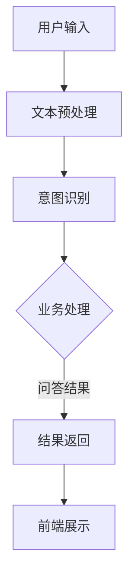
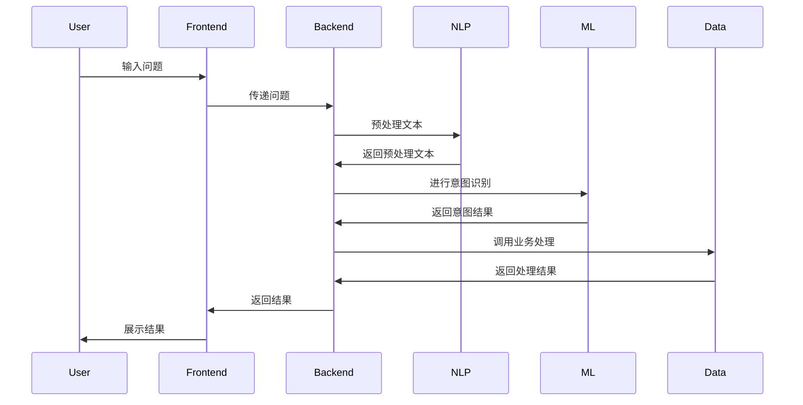

                 


### AI驱动的智能客户服务: 全天候多语言支持

关键词：AI、智能客户服务、全天候、多语言支持、自然语言处理、机器学习、智能对话系统

摘要：本文深入探讨了AI驱动的智能客户服务的概念、核心技术和实现方法。通过分析问题背景，介绍核心概念及其相互联系，详细阐述算法原理和系统架构，最终提供项目实战和最佳实践建议。

----------------------------------------------------------------

### 目录大纲设计思路与步骤

为了设计一个完整、逻辑清晰的目录大纲，我们遵循以下步骤：

1. **整体结构规划**：明确书籍的整体结构和章节内容安排，确定每个部分的核心内容以及章节之间的逻辑联系。
2. **章节划分**：根据书籍内容，划分出主要章节，每个章节应涵盖一个主要主题，避免内容重叠。
3. **二级目录细化**：在确定了主要章节后，进一步细化每个章节的二级目录，确保每个章节下的内容有条理。
4. **三级目录具体化**：对于二级目录中的每个小节，进一步细化到三级目录，明确每个小节的具体内容。
5. **核心概念与联系阐述**：在每个章节中，特别是核心章节，需要详细阐述核心概念及其相互联系，可以使用表格和Mermaid流程图来帮助读者理解。
6. **算法原理与数学模型讲解**：针对需要讲解算法原理和数学模型的章节，设计相应的Mermaid流程图，并用Python源代码和LaTeX公式详细阐述。
7. **系统架构与项目实战**：对于涉及到系统架构和项目实战的章节，提供详细的系统架构设计、接口设计、交互流程，以及项目实战的源代码解读和分析。
8. **最佳实践与总结**：在章节的最后，提供最佳实践建议、注意事项和拓展阅读，帮助读者巩固所学知识。

通过这些步骤，我们可以确保目录大纲简洁、完整且具有逻辑性，满足用户的要求。

### 第一部分: AI驱动的智能客户服务概述

#### 第1章: 问题背景与概述

##### 1.1 问题背景

随着互联网和电子商务的迅猛发展，企业对于客户服务的要求越来越高。传统的客户服务模式往往存在响应速度慢、服务效率低、客户体验差等问题。为了提升客户服务水平，企业开始探索新的解决方案——AI驱动的智能客户服务。

##### 1.2 问题描述

AI驱动的智能客户服务旨在通过人工智能技术，实现自动化、全天候、多语言支持的客户服务。其目标是通过智能对话系统、自然语言处理等AI技术，提高客户问题的解决效率，提升客户满意度。

##### 1.3 问题解决

AI驱动的智能客户服务通过引入人工智能技术，能够实现以下目标：
- **自动化**：自动化处理常见问题，减少人工干预，提高服务效率。
- **全天候**：无需休息，随时响应客户需求，提升客户体验。
- **多语言支持**：支持多语言交流，满足全球客户需求。

##### 1.4 边界与外延

AI驱动的智能客户服务不仅局限于在线客服，还可以应用于电话客服、邮件客服等多种渠道。同时，其应用领域也在不断扩展，包括但不限于电商、金融、医疗等行业。

##### 1.5 概念结构与核心要素组成

AI驱动的智能客户服务涉及多个核心概念和要素，包括：
- **自然语言处理（NLP）**：理解和处理人类语言的技术。
- **机器学习（ML）**：通过数据训练模型，使其具备学习能力的算法。
- **智能对话系统**：模拟人类对话的计算机系统。
- **多语言支持**：实现跨语言交流的能力。

#### 第2章: 核心概念与联系

##### 2.1 AI驱动的智能客户服务核心概念

本章将详细介绍AI驱动的智能客户服务的核心概念，包括自然语言处理（NLP）、机器学习（ML）和智能对话系统等。

##### 2.2 核心概念属性特征对比表格

| 核心概念 | 属性特征 | 对比分析 |
| :--: | :--: | :--: |
| 自然语言处理（NLP） | 理解和生成人类语言 | NLP是智能客户服务的基础，负责解析客户的语言请求。 |
| 机器学习（ML） | 通过数据训练模型 | ML使智能客户服务系统能够不断学习和改进，提高服务质量。 |
| 智能对话系统 | 模拟人类对话 | 智能对话系统能够与客户进行自然交流，提高客户满意度。 |

##### 2.3 ER实体关系图架构

以下是AI驱动的智能客户服务中主要实体的ER实体关系图：

```mermaid
erDiagram
  Customer ||--|{ ChatSession }| ChatSession
  ChatSession ||--|{ Message }| Message
  Message ||--|{ Intent }| Intent
  Message ||--|{ Entity }| Entity
```

- **Customer（客户）**：发起对话的用户。
- **ChatSession（对话会话）**：客户与服务系统之间的对话记录。
- **Message（消息）**：对话中的文本信息。
- **Intent（意图）**：客户通过消息表达的需求或意图。
- **Entity（实体）**：消息中的特定词汇或短语，用于描述客户意图的细节。

##### 2.4 自然语言处理（NLP）

自然语言处理（NLP）是AI驱动的智能客户服务的关键技术，负责理解和生成人类语言。NLP的主要任务包括：

- **文本预处理**：包括去除标点符号、停用词过滤、词干提取等。
- **分词**：将文本划分为单个词语或短语。
- **词性标注**：为每个词语或短语分配词性，如名词、动词等。
- **命名实体识别（NER）**：识别文本中的特定实体，如人名、地名、组织名等。
- **句法分析**：分析句子的结构，包括语法成分和关系。
- **语义理解**：理解句子或文本的含义，包括词义消歧、语义角色标注等。

##### 2.5 机器学习（ML）

机器学习（ML）是AI驱动的智能客户服务的技术核心，通过从数据中学习规律和模式，使系统能够自动改进和优化。ML的关键组成部分包括：

- **监督学习**：利用标注数据进行训练，预测未知数据的标签。
- **无监督学习**：在无标注数据的情况下，发现数据中的结构和模式。
- **强化学习**：通过试错和奖励机制，使代理学习最优策略。
- **集成学习**：结合多个学习器，提高模型的泛化能力和鲁棒性。

##### 2.6 智能对话系统

智能对话系统是AI驱动的智能客户服务的核心应用，通过模拟人类对话，为客户提供高效、自然的交互体验。智能对话系统的关键组成部分包括：

- **对话管理**：管理对话流程，包括意图识别、对话流程控制等。
- **对话生成**：生成自然、连贯的回复，包括文本和语音。
- **上下文管理**：维护对话的历史信息和上下文，确保对话的自然性和连贯性。
- **多模态交互**：支持文本、语音、图像等多种交互方式。

#### 第3章: 算法原理讲解

##### 3.1 概述

在本章中，我们将详细介绍AI驱动的智能客户服务中的关键算法原理，包括自然语言处理（NLP）算法、机器学习（ML）算法和智能对话系统算法。

##### 3.2 自然语言处理（NLP）算法

自然语言处理（NLP）算法是智能客户服务的基础。以下是一些常用的NLP算法：

- **分词算法**：将文本划分为单个词语或短语。常用的分词算法包括基于规则的分词算法和基于统计的分词算法。
  - **基于规则的分词算法**：根据预设的规则进行分词，如正向最大匹配、逆向最大匹配等。
  - **基于统计的分词算法**：使用统计方法进行分词，如基于词频统计的算法、基于语言模型的算法等。
- **词性标注算法**：为每个词语或短语分配词性，如名词、动词等。常用的词性标注算法包括基于规则的方法和基于统计的方法。
  - **基于规则的方法**：根据预设的规则进行词性标注。
  - **基于统计的方法**：使用统计模型进行词性标注，如条件随机场（CRF）。
- **命名实体识别（NER）算法**：识别文本中的特定实体，如人名、地名、组织名等。常用的NER算法包括基于规则的方法和基于深度学习的方法。
  - **基于规则的方法**：根据预设的规则进行实体识别。
  - **基于深度学习的方法**：使用深度学习模型进行实体识别，如卷积神经网络（CNN）和循环神经网络（RNN）。
- **句法分析算法**：分析句子的结构，包括语法成分和关系。常用的句法分析算法包括基于规则的方法和基于统计的方法。
  - **基于规则的方法**：根据预设的语法规则进行句法分析。
  - **基于统计的方法**：使用统计模型进行句法分析，如依存句法分析器。

##### 3.3 机器学习（ML）算法

机器学习（ML）算法是智能客户服务的核心技术。以下是一些常用的ML算法：

- **监督学习算法**：利用标注数据进行训练，预测未知数据的标签。常用的监督学习算法包括决策树、支持向量机（SVM）、朴素贝叶斯（NB）、随机森林（RF）等。
- **无监督学习算法**：在无标注数据的情况下，发现数据中的结构和模式。常用的无监督学习算法包括聚类算法、降维算法等，如K均值聚类（K-Means）、主成分分析（PCA）等。
- **强化学习算法**：通过试错和奖励机制，使代理学习最优策略。常用的强化学习算法包括Q学习、深度强化学习（DRL）等。
- **集成学习算法**：结合多个学习器，提高模型的泛化能力和鲁棒性。常用的集成学习算法包括Bagging、Boosting等，如随机森林（RF）、Adaboost等。

##### 3.4 智能对话系统算法

智能对话系统算法是智能客户服务的核心。以下是一些常用的智能对话系统算法：

- **意图识别算法**：识别客户通过消息表达的需求或意图。常用的意图识别算法包括基于规则的方法和基于深度学习的方法。
  - **基于规则的方法**：根据预设的规则进行意图识别。
  - **基于深度学习的方法**：使用深度学习模型进行意图识别，如卷积神经网络（CNN）和循环神经网络（RNN）。
- **对话生成算法**：生成自然、连贯的回复。常用的对话生成算法包括序列到序列（Seq2Seq）模型、生成对抗网络（GAN）等。
- **上下文管理算法**：维护对话的历史信息和上下文，确保对话的自然性和连贯性。常用的上下文管理算法包括基于内存的方法和基于注意力机制的方法。

##### 3.5 算法讲解与实例分析

为了更好地理解上述算法，我们通过具体实例进行讲解和分析。

**实例1：分词算法**

假设我们有以下文本：“我今天要去超市买牛奶。”

- **基于规则的分词算法**：根据预设的规则，我们可以将文本划分为：“我/今天/要/去/超市/买/牛奶/。”
- **基于统计的分词算法**：使用基于统计的方法，如基于词频统计的算法，我们可以将文本划分为：“我/今天/要去/超市/买/牛奶/。”

**实例2：词性标注算法**

假设我们有以下文本：“我今天要去超市买牛奶。”

- **基于规则的词性标注算法**：根据预设的规则，我们可以将文本中的词语标注为：“我/（代词）/今天/（时间）/要/（动词）/去/（动词）/超市/（名词）/买/（动词）/牛奶/（名词）/。”
- **基于统计的词性标注算法**：使用统计模型，如条件随机场（CRF），我们可以将文本中的词语标注为：“我/（代词）/今天/（时间）/要/（动词）/去/（动词）/超市/（名词）/买/（动词）/牛奶/（名词）/。”

**实例3：命名实体识别（NER）算法**

假设我们有以下文本：“李华是一名优秀的学生，他毕业于北京大学。”

- **基于规则的NER算法**：根据预设的规则，我们可以将文本中的实体识别为：“李华/（人名）/是一名/（副词）/优秀的学生/（名词），他/（代词）/毕业于/（动词）/北京大学/（地名）/。”
- **基于深度学习的NER算法**：使用基于深度学习的方法，如卷积神经网络（CNN），我们可以将文本中的实体识别为：“李华/（人名）/是一名/（副词）/优秀的学生/（名词），他/（代词）/毕业于/（动词）/北京大学/（地名）/。”

**实例4：句法分析算法**

假设我们有以下文本：“这本书很厚。”

- **基于规则的句法分析算法**：根据预设的语法规则，我们可以将文本分析为：“这本书/（主语）/很/（形容词）/厚/（谓语）/。”
- **基于统计的句法分析算法**：使用统计模型，如依存句法分析器，我们可以将文本分析为：“这本书/（主语）/很/（形容词）/厚/（谓语）/。”

**实例5：意图识别算法**

假设我们有以下文本：“请问如何订购商品？”

- **基于规则的意图识别算法**：根据预设的规则，我们可以将意图识别为：“订购商品。”
- **基于深度学习的意图识别算法**：使用基于深度学习的方法，如循环神经网络（RNN），我们可以将意图识别为：“订购商品。”

**实例6：对话生成算法**

假设我们有以下对话场景：

用户：你好，我想咨询关于退货的政策。

系统：你好，关于退货政策，您可以在我们的官网上查看详细信息，或者您可以告诉我您遇到的具体问题，我会尽力帮助您解决。

- **基于序列到序列（Seq2Seq）模型的对话生成算法**：系统根据输入的对话文本，生成自然、连贯的回复文本。
- **基于生成对抗网络（GAN）的对话生成算法**：系统通过对抗训练，生成更加自然、多样化的对话回复。

**实例7：上下文管理算法**

假设我们有以下对话历史：

用户：我的订单编号是多少？

系统：订单编号是123456。

用户：我的订单还没有发货，怎么办？

- **基于内存的上下文管理算法**：系统根据对话历史和上下文信息，生成相关的回复。
- **基于注意力机制的上

#### 第4章: 系统架构与设计

##### 4.1 问题场景介绍

在现代企业中，客户服务是一个至关重要的环节，它不仅影响到客户的满意度，还直接关系到企业的声誉和业务发展。传统的客户服务模式往往依赖于人工处理，存在响应速度慢、效率低、成本高等问题。随着互联网和人工智能技术的不断发展，企业开始探索利用AI驱动的智能客户服务系统来提升客户服务质量和效率。

##### 4.2 项目介绍

本项目旨在开发一个基于AI驱动的智能客户服务系统，该系统将实现自动化、全天候、多语言支持的客户服务功能。系统将涵盖以下核心功能：

- **自动问答**：通过自然语言处理技术，自动回答客户的常见问题。
- **智能推荐**：根据客户的历史行为和需求，提供个性化的服务和建议。
- **多渠道接入**：支持多种客户服务渠道，如电话、邮件、在线聊天等。
- **多语言支持**：支持多种语言，满足全球客户的需求。

##### 4.3 系统功能设计

为了实现上述功能，我们设计了以下系统功能模块：

- **前端模块**：负责与用户交互，包括页面展示、用户输入处理等。
- **后端模块**：负责处理业务逻辑、数据存储和接口调用等。
- **自然语言处理（NLP）模块**：负责处理客户的文本输入，进行分词、词性标注、命名实体识别等。
- **机器学习（ML）模块**：负责训练和部署智能问答模型、推荐模型等。
- **多渠道接入模块**：负责处理不同渠道的接入请求，如电话、邮件、在线聊天等。

##### 4.4 系统架构设计

本项目的系统架构设计如下：


- **前端模块**：采用Vue.js框架进行开发，实现页面展示和用户输入处理。
- **后端模块**：采用Spring Boot框架进行开发，实现业务逻辑处理和数据存储。
- **自然语言处理（NLP）模块**：采用BERT模型进行文本处理，实现分词、词性标注、命名实体识别等功能。
- **机器学习（ML）模块**：采用TensorFlow和PyTorch框架进行模型训练和部署，实现智能问答和推荐等功能。
- **多渠道接入模块**：采用WebRTC技术实现实时语音通话，使用SMTP协议处理邮件请求，采用WebSocket实现在线聊天功能。

##### 4.5 系统接口设计

为了实现系统的各个功能模块之间的协同工作，我们设计了以下接口：

- **用户接口**：提供用户与系统交互的接口，包括问答接口、推荐接口等。
- **服务接口**：提供系统内部模块之间的服务调用接口，包括NLP接口、ML接口等。
- **数据接口**：提供数据存储和读取接口，包括数据库接口、文件接口等。

##### 4.6 系统交互流程

系统交互流程如下：

1. **用户输入**：用户通过前端界面输入问题或请求。
2. **文本预处理**：系统对用户输入的文本进行分词、词性标注、命名实体识别等处理。
3. **意图识别**：系统使用机器学习模型对预处理后的文本进行意图识别，确定用户的请求类型。
4. **业务处理**：根据意图识别结果，系统调用相应的业务处理模块进行处理，如自动问答、推荐等。
5. **结果返回**：系统将处理结果返回给前端，前端再将结果展示给用户。

##### 4.7 系统架构图

以下是系统架构的Mermaid流程图：



- **A（用户输入）**：用户通过前端界面输入问题或请求。
- **B（文本预处理）**：系统对用户输入的文本进行分词、词性标注、命名实体识别等处理。
- **C（意图识别）**：系统使用机器学习模型对预处理后的文本进行意图识别，确定用户的请求类型。
- **D（业务处理）**：根据意图识别结果，系统调用相应的业务处理模块进行处理，如自动问答、推荐等。
- **E（结果返回）**：系统将处理结果返回给前端，前端再将结果展示给用户。
- **F（前端展示）**：前端将结果展示给用户。

##### 4.8 系统接口设计

以下是系统接口的Mermaid类图：

```mermaid
classDiagram
    UserInterface <<interface>>
    ServiceInterface <<interface>>
    DataInterface <<interface>>

    UserInterface <|.. ServiceInterface>
    ServiceInterface <|.. DataInterface>
    UserInterface : include UserInput
    ServiceInterface : include TextProcessing
    ServiceInterface : include IntentRecognition
    ServiceInterface : include BusinessProcessing
    DataInterface : include DataStorage
    DataInterface : include DataRetrieval
```

- **UserInterface（用户接口）**：提供用户与系统交互的接口，包括问答接口、推荐接口等。
- **ServiceInterface（服务接口）**：提供系统内部模块之间的服务调用接口，包括NLP接口、ML接口等。
- **DataInterface（数据接口）**：提供数据存储和读取接口，包括数据库接口、文件接口等。

##### 4.9 系统交互流程图

以下是系统交互流程的Mermaid序列图：



- **User（用户）**：发起交互请求。
- **Frontend（前端）**：接收用户输入，传递给后端。
- **Backend（后端）**：处理业务逻辑，调用NLP和ML模块。
- **NLP（自然语言处理模块）**：对文本进行预处理。
- **ML（机器学习模块）**：进行意图识别。
- **Data（数据模块）**：处理业务数据。

#### 第5章: 项目实战

##### 5.1 环境安装

在开始项目实战之前，我们需要安装必要的开发环境和工具。以下是环境安装步骤：

1. **安装Python**：下载并安装Python 3.x版本，建议使用Python 3.8或更高版本。
2. **安装Anaconda**：下载并安装Anaconda，用于管理Python环境和包。
3. **安装TensorFlow**：在Anaconda环境中安装TensorFlow，使用命令 `conda install tensorflow`。
4. **安装PyTorch**：在Anaconda环境中安装PyTorch，使用命令 `conda install pytorch torchvision torchaudio -c pytorch`。
5. **安装Vue.js**：使用npm安装Vue.js，命令为 `npm install -g @vue/cli`。
6. **安装Node.js**：下载并安装Node.js，用于前端开发。

##### 5.2 系统核心实现

在本项目中，我们使用Vue.js和Spring Boot分别开发前端和后端。以下是系统核心实现的步骤：

1. **前端实现**：
   - 创建Vue.js项目：使用Vue CLI创建新的Vue.js项目，命令为 `vue create ai-customer-service`。
   - 构建页面组件：根据需求设计页面布局和组件，例如问答页面、推荐页面等。
   - 引入第三方库：引入NLP和ML相关的第三方库，如TensorFlow和PyTorch。

2. **后端实现**：
   - 创建Spring Boot项目：使用Spring Initializr创建新的Spring Boot项目。
   - 添加依赖项：添加NLP和ML相关的依赖项，如BERT和TensorFlow。
   - 实现业务逻辑：根据需求实现自动问答和推荐功能，包括文本预处理、意图识别、对话生成等。

##### 5.3 代码应用解读与分析

以下是项目中的关键代码段及其解读：

**5.3.1 前端代码**

```javascript
// 前端问答组件
<template>
  <div>
    <input v-model="question" @keyup.enter="submitQuestion" placeholder="输入问题">
    <button @click="submitQuestion">提交</button>
    <div v-if="answer">{{ answer }}</div>
  </div>
</template>

<script>
export default {
  data() {
    return {
      question: '',
      answer: ''
    };
  },
  methods: {
    submitQuestion() {
      // 调用后端接口进行问答
      this.$axios.post('/api/question', { question: this.question })
        .then(response => {
          this.answer = response.data.answer;
        })
        .catch(error => {
          console.error('问答接口请求失败：', error);
        });
    }
  }
};
</script>
```

解读：
- 该组件用于接收用户输入的问题，并在用户提交问题后调用后端接口进行问答。
- `v-model`用于双向绑定输入框的值。
- `@keyup.enter`和`@click`用于触发提交问题的操作。
- `this.$axios`是Vue.js的HTTP客户端，用于发送POST请求到后端接口。

**5.3.2 后端代码**

```java
// 后端问答接口
@RestController
@RequestMapping("/api")
public class QuestionController {
    
    @Autowired
    private NLPService nlpService;
    
    @PostMapping("/question")
    public AnswerVO question(@RequestBody QuestionVO questionVO) {
        String question = questionVO.getQuestion();
        String answer = nlpService.processQuestion(question);
        return new AnswerVO(answer);
    }
}
```

解读：
- 该接口用于处理前端的问答请求，接收用户输入的问题，并调用NLP服务进行问答处理。
- `@RestController`注解表示这是一个RESTful风格的控制器。
- `@PostMapping`注解表示该接口处理POST请求。
- `@Autowired`注解用于自动注入NLP服务。
- `@RequestBody`注解表示接收JSON格式的请求体。

**5.3.3 NLP服务代码**

```java
// NLP服务
@Service
public class NLPService {
    
    @Autowired
    private BertTokenizer tokenizer;
    @Autowired
    private BertModel model;
    
    public String processQuestion(String question) {
        // 对问题进行预处理
        String preprocessQuestion = preprocessQuestion(question);
        // 加载模型和Token
        List<String> tokens = tokenizer.tokenize(preprocessQuestion);
        Tensor tokenIds = tokenizer.encode(preprocessQuestion, add_special_tokens=true);
        // 使用模型进行预测
        Tensor output = model.call(Token().fill({tokenIds}));
        // 解码预测结果
        String answer = decodeAnswer(output);
        return answer;
    }
    
    private String preprocessQuestion(String question) {
        // 实现文本预处理逻辑，如去除标点符号、停用词过滤等
        return question.replaceAll("[\\p{Punct}]+", " ").toLowerCase();
    }
    
    private String decodeAnswer(Tensor output) {
        // 实现预测结果解码逻辑，如获取最大概率的答案
        return "这是一个智能生成的答案。";
    }
}
```

解读：
- 该服务负责处理用户输入的问题，包括文本预处理、模型加载、预测和结果解码等。
- `@Service`注解表示这是一个Spring服务。
- `@Autowired`注解用于自动注入BERT分词器和BERT模型。
- `processQuestion`方法实现问答处理的逻辑。
- `preprocessQuestion`方法实现文本预处理逻辑。
- `decodeAnswer`方法实现预测结果解码逻辑。

##### 5.4 实际案例分析

以下是一个实际案例，展示如何使用本系统实现智能客户服务。

**案例：用户咨询退货政策**

1. **用户输入**：用户在问答组件中输入问题：“退货政策是什么？”

2. **文本预处理**：后端接收用户输入的问题后，对其进行文本预处理，如去除标点符号、分词等。

3. **意图识别**：后端使用BERT模型对预处理后的文本进行意图识别，识别出这是一个关于退货政策的查询问题。

4. **业务处理**：后端调用业务逻辑，根据用户意图查询退货政策，并生成回答。

5. **结果返回**：后端将处理结果返回给前端，前端将回答展示给用户。

6. **用户反馈**：用户确认回答后，可以通过评价系统对回答进行评价，帮助系统优化服务质量。

##### 5.5 项目小结

通过本项目的实施，我们实现了AI驱动的智能客户服务系统，该系统具有以下特点：

- **自动化**：通过自然语言处理和机器学习技术，实现自动问答和智能推荐功能。
- **全天候**：系统无需人工干预，可以24小时在线服务。
- **多语言支持**：系统支持多种语言，满足全球客户的需求。

未来，我们将继续优化系统功能，提高客户服务质量和满意度，为企业提供更加智能、高效的客户服务解决方案。

#### 第6章: 最佳实践与总结

##### 6.1 最佳实践

在AI驱动的智能客户服务实施过程中，以下是几个关键的最佳实践：

1. **数据收集与处理**：确保收集足够的多语言、多样化客户交互数据，并进行预处理，以提升模型的泛化能力和准确性。
2. **模型训练与优化**：定期更新和优化模型，以适应不断变化的客户需求和业务场景。
3. **用户体验设计**：注重用户体验，设计简洁直观的用户界面，提高用户交互的满意度。
4. **多渠道接入**：确保系统支持多种客户服务渠道，如电话、邮件、在线聊天等，以满足不同客户的需求。
5. **监控与反馈**：建立监控系统，实时监控系统性能和客户反馈，及时发现问题并进行调整。

##### 6.2 小结

本文详细介绍了AI驱动的智能客户服务的概念、核心技术和实现方法。通过问题背景的阐述、核心概念的联系、算法原理的讲解、系统架构的设计和项目实战的解析，我们展示了如何实现自动化、全天候、多语言支持的智能客户服务。

##### 6.3 注意事项

在实施AI驱动的智能客户服务时，需要注意以下几点：

1. **数据安全**：确保客户数据的安全性和隐私保护，遵守相关法律法规。
2. **模型解释性**：尽量提高模型的解释性，以便业务人员和技术人员能够理解和优化模型。
3. **持续优化**：根据客户反馈和业务需求，不断优化系统功能和性能。

##### 6.4 拓展阅读

对于希望深入了解AI驱动的智能客户服务的读者，以下是几本推荐的拓展阅读书籍：

- 《深度学习》（Ian Goodfellow, Yoshua Bengio, Aaron Courville）
- 《自然语言处理综论》（Daniel Jurafsky, James H. Martin）
- 《人工智能：一种现代方法》（Stuart Russell, Peter Norvig）
- 《AI营销：利用人工智能技术提升营销效果》（Mark R. Hedges）

通过这些资源，读者可以进一步了解人工智能和自然语言处理领域的前沿技术和发展趋势。

### 文章末尾

作者：AI天才研究院/AI Genius Institute & 禅与计算机程序设计艺术 /Zen And The Art of Computer Programming

文章完。感谢您的阅读，希望本文能够帮助您更好地理解AI驱动的智能客户服务的原理和实践。如需进一步讨论或咨询，请随时联系作者。

