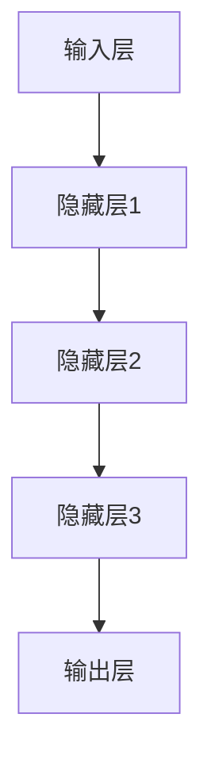
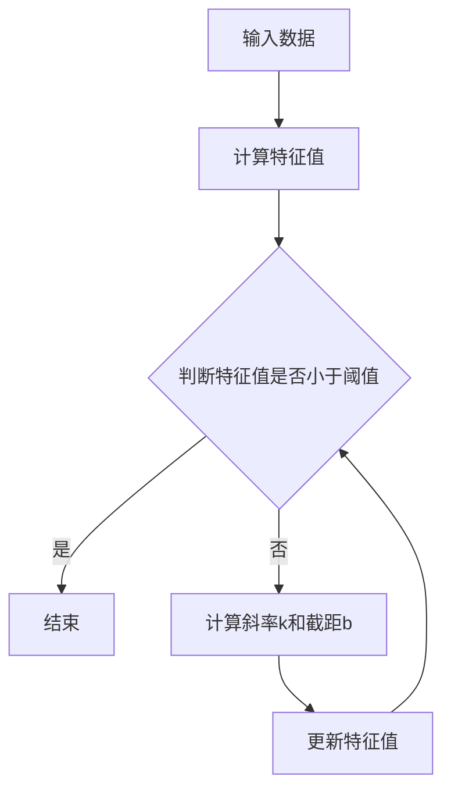
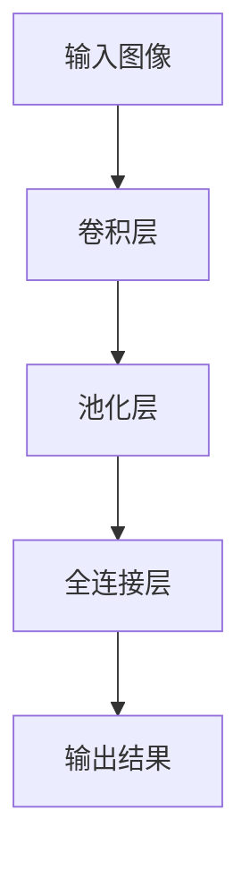
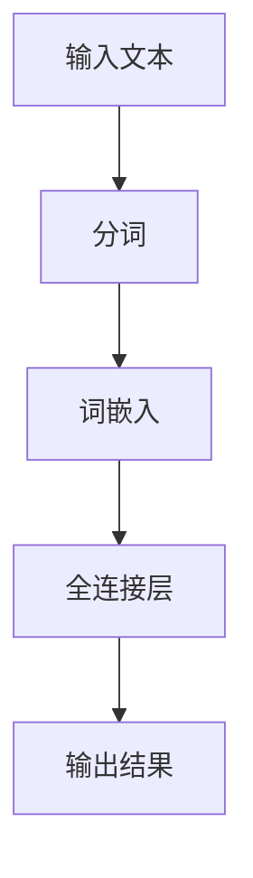
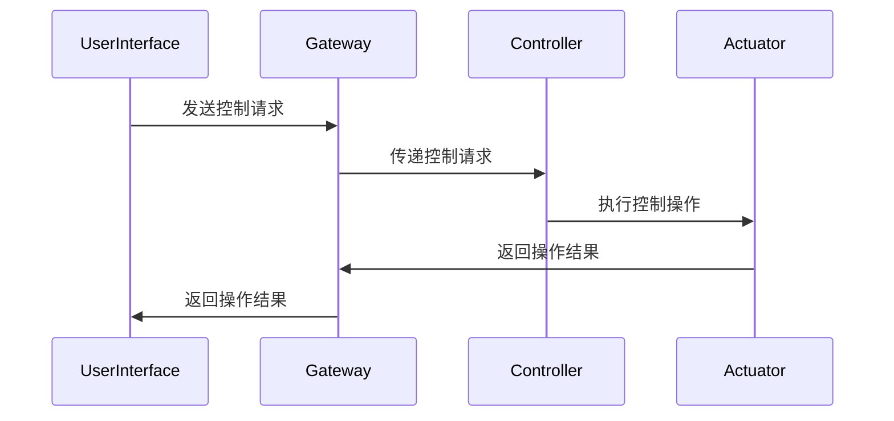
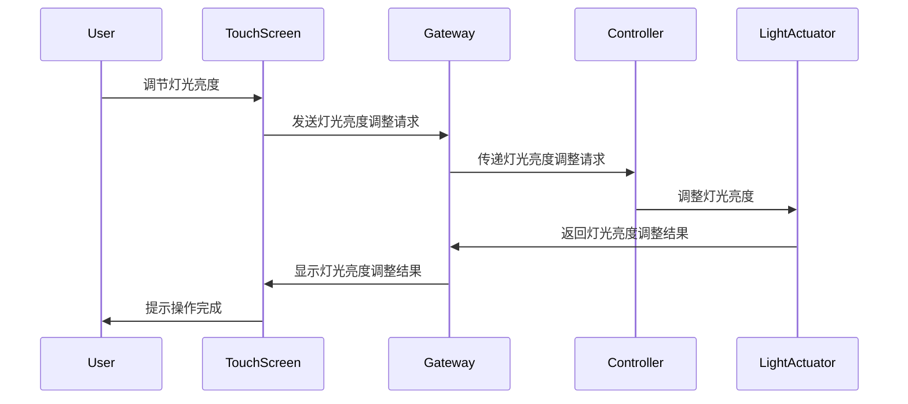

                 

# AI驱动的智能家居：打造舒适节能的生活环境

## 关键词

- 智能家居
- 人工智能
- 节能
- 用户体验
- 智能算法
- 系统架构

## 摘要

本文将探讨如何利用人工智能技术打造一个舒适、节能的智能家居环境。首先，我们将简要介绍智能家居和人工智能的基本概念，然后深入分析智能家居的设计原则与架构，探讨关键技术的应用与实现策略。接着，我们将关注用户体验和交互设计，以及智能家居对能源效率和环境可持续性的贡献。最后，通过实际案例分析和未来发展趋势的讨论，总结最佳实践并展望智能家居的未来。

## 引言：智能家居与人工智能的交汇

### 1.1 智能家居的兴起

在21世纪的科技浪潮中，智能家居已经成为现代生活不可或缺的一部分。智能家居通过将互联网、传感器、执行器和人工智能技术相结合，实现了家庭设备的自动化和智能化，从而提升了居住的舒适度和能源效率。

#### 1.1.1 智能家居的定义

智能家居，通常指的是利用物联网（IoT）技术，将家庭设备联网，并通过软件平台进行智能控制，使家庭生活更加便捷、舒适和节能。它涵盖了从照明、空调、安全系统到家电等各种日常使用的设备。

#### 1.1.2 智能家居的演化

智能家居的发展可以分为几个阶段：

1. **自动化阶段**：主要通过定时器和遥控器实现简单的自动化操作。
2. **互联阶段**：设备之间开始通过Wi-Fi、蓝牙等无线技术进行连接，实现了远程控制和简单的交互。
3. **智能化阶段**：引入人工智能技术，使得系统能够学习和适应用户习惯，提供更加个性化的服务。

### 1.2 人工智能与智能家居的结合

人工智能（AI）作为当代技术的前沿，为智能家居带来了前所未有的变革。AI技术使得智能家居系统能够进行自我学习、自我优化和自我决策，从而大大提升了系统的智能化水平。

#### 1.2.1 人工智能的基本概念

人工智能是指使计算机具备模拟、延伸和扩展人类智能的能力。它包括多个子领域，如机器学习、深度学习、自然语言处理和计算机视觉等。

#### 1.2.2 人工智能在智能家居中的应用

1. **个性化服务**：AI可以帮助智能家居系统根据用户习惯自动调整设备状态，提供个性化的服务。
2. **节能优化**：AI算法可以分析用户行为数据，优化能源消耗，实现节能。
3. **安全监控**：AI技术可以实时分析摄像头和传感器数据，识别异常行为，提供安全保障。
4. **智能交互**：通过自然语言处理技术，智能家居系统能够理解用户语音指令，实现自然的人机交互。

## 第一部分：核心概念与联系

### 2.1 智能家居基本概念

#### 2.1.1 智能家居的定义与分类

智能家居，即“Smart Home”，是指通过物联网技术将家庭中的各种设备和系统连接起来，实现自动化管理和控制的一种居住环境。根据功能和应用范围，智能家居可以大致分为以下几类：

1. **智能照明**：通过传感器和AI算法实现自动调光和场景切换。
2. **智能空调与供暖**：根据室内外温度和用户习惯自动调节温度。
3. **智能安全系统**：包括门锁、摄像头、报警器等，提供家庭安全防护。
4. **智能家电**：如洗衣机、冰箱、烤箱等，实现远程控制和自动化操作。
5. **能源管理**：通过智能电网和能源监控，实现家庭能源的优化使用。

#### 2.1.2 智能家居的核心要素

一个完整的智能家居系统通常包含以下几个核心要素：

1. **传感器**：用于感知环境状态，如温度、湿度、光线等。
2. **执行器**：接收控制信号，实现设备的开关、调节等功能。
3. **通信网络**：如Wi-Fi、蓝牙、Zigbee等，实现设备之间的数据传输。
4. **控制中心**：通常是智能网关或中央控制系统，负责协调和调度。
5. **用户界面**：如智能手机应用、语音助手等，用于用户与系统的交互。

#### 2.1.3 智能家居系统的架构

智能家居系统的架构可以分为以下几个层次：

1. **感知层**：由各种传感器组成，负责采集环境数据。
2. **传输层**：负责将感知层采集到的数据传输到控制中心。
3. **控制层**：包括智能网关或中央控制系统，负责数据处理和决策。
4. **应用层**：提供具体的智能服务，如自动调光、温度控制等。
5. **用户层**：通过用户界面与系统进行交互。

### 2.2 AI在智能家居中的核心概念

#### 2.2.1 机器学习和深度学习原理

机器学习是人工智能的核心技术之一，它使得计算机系统能够通过数据和经验进行自我学习和优化。深度学习是机器学习的一个子领域，通过构建多层神经网络，实现对复杂数据的自动特征提取和模式识别。

1. **机器学习的基本概念**：机器学习主要包括监督学习、无监督学习和强化学习等类型。
2. **深度学习的基本概念**：深度学习通过多层神经网络对大量数据进行学习，能够自动提取复杂特征。
3. **深度学习在智能家居中的应用**：如人脸识别、语音识别、智能监控等。

#### 2.2.2 AI算法在智能家居中的应用

AI算法在智能家居中有着广泛的应用，主要包括以下几个方面：

1. **智能推荐**：根据用户习惯和偏好，推荐合适的家居设置。
2. **预测与优化**：如预测用户回家时间，提前开启空调；优化能源使用，减少浪费。
3. **异常检测**：通过实时监控和分析数据，识别异常行为，如入侵报警、设备故障诊断等。
4. **自然语言处理**：实现语音识别和语音控制，提升用户体验。

#### 2.2.3 AI算法的选择与优化

在智能家居系统中，选择合适的AI算法至关重要。以下是一些常见的算法及其特点：

1. **决策树**：适合处理分类问题，易于理解和解释。
2. **支持向量机**：适合处理高维数据，尤其在图像和文本分类中表现良好。
3. **神经网络**：适合处理复杂的非线性问题，如语音识别和图像识别。
4. **优化算法**：如梯度下降、遗传算法等，用于优化系统参数，提升性能。

在实际应用中，可以根据系统的需求和数据特点选择合适的算法，并通过不断优化和迭代，提升系统的智能水平。

## 第二部分：设计原则与架构

### 3.1 智能家居系统的设计原则

设计一个高效、安全、易用的智能家居系统，需要遵循以下原则：

#### 3.1.1 系统的可扩展性

智能家居系统应具备良好的可扩展性，以便根据用户需求增加新的设备和功能。这要求系统架构能够支持灵活的模块化和即插即用。

#### 3.1.2 系统的可靠性

智能家居系统需要保证高可靠性，确保设备的稳定运行和数据的安全。这包括硬件的可靠性和软件的健壮性。

#### 3.1.3 系统的安全性

智能家居系统涉及用户隐私和数据安全，需要采取严格的安全措施，如数据加密、身份验证和访问控制等。

#### 3.1.4 系统的易用性

智能家居系统应设计简洁、直观，易于用户操作。用户界面设计应充分考虑用户体验，提供便捷的操作方式和清晰的反馈信息。

### 3.2 智能家居系统的架构

一个典型的智能家居系统架构包括以下几个关键组成部分：

#### 3.2.1 硬件层

硬件层包括各种传感器、执行器和网关。传感器负责感知环境状态，执行器实现设备控制，网关负责数据传输和协议转换。

#### 3.2.2 网络层

网络层负责连接硬件层和软件层，实现数据传输和通信。常见的网络协议包括Wi-Fi、蓝牙、Zigbee和LPWAN等。

#### 3.2.3 软件层

软件层包括数据存储、数据处理和用户界面。数据存储用于存储用户数据和系统配置，数据处理用于分析和决策，用户界面提供与用户的交互。

#### 3.2.4 控制层

控制层是智能家居系统的核心，负责根据用户需求和系统状态，生成控制指令并下发到执行器。控制层通常包括智能算法和决策引擎。

#### 3.2.5 用户层

用户层包括移动应用、Web界面和语音助手等，提供用户与系统的交互。

### 3.3 智能家居系统的实现策略

实现一个高效的智能家居系统，需要考虑以下几个方面：

#### 3.3.1 系统集成

系统集成是将各种设备和系统整合为一个统一的整体。这要求系统具有良好的兼容性和可扩展性。

#### 3.3.2 数据处理与分析

数据处理与分析是智能家居系统的核心，通过分析传感器数据和用户行为，实现智能决策和优化。

#### 3.3.3 用户交互设计

用户交互设计是提升用户体验的关键。应设计直观、易用的用户界面，提供丰富的交互功能，如语音控制、手势操作等。

#### 3.3.4 安全保障

安全保障是智能家居系统不可或缺的一部分。应采取严格的安全措施，确保用户数据和设备安全。

### 3.4 案例分析：一个典型的智能家居系统

下面我们通过一个案例来详细分析一个典型的智能家居系统的设计与实现。

#### 3.4.1 系统介绍

本案例是一个家庭智能安防系统，包括门锁、摄像头、门窗传感器和报警器等设备。

#### 3.4.2 硬件层设计

1. **门锁**：采用指纹识别和密码输入两种方式，提供便捷的开启和关闭功能。
2. **摄像头**：支持高清视频录制和实时监控，配备夜视功能。
3. **门窗传感器**：用于检测门窗是否关闭，提供实时报警功能。
4. **报警器**：在异常情况下发出声音报警，提醒用户注意。

#### 3.4.3 网络层设计

1. **Wi-Fi**：用于连接摄像头、门窗传感器等设备，实现数据的传输。
2. **蓝牙**：用于连接门锁，实现近距离的数据传输和控制。
3. **服务器**：用于存储用户数据和系统配置，并提供云服务和远程访问。

#### 3.4.4 软件层设计

1. **数据存储**：采用NoSQL数据库存储用户数据和系统配置。
2. **数据处理**：采用机器学习算法分析传感器数据，实现智能决策和优化。
3. **用户界面**：采用Web界面和移动应用，提供直观、易用的交互体验。

#### 3.4.5 控制层设计

1. **智能算法**：采用决策树和神经网络等算法，实现智能安防监控。
2. **决策引擎**：根据用户数据和系统状态，生成控制指令并下发到执行器。

#### 3.4.6 用户层设计

1. **移动应用**：提供实时监控、报警通知、远程控制等功能。
2. **Web界面**：提供用户配置、设备管理、数据统计等功能。
3. **语音助手**：通过自然语言处理技术，实现语音控制和交互。

通过本案例的分析，我们可以看到，一个高效的智能家居系统需要综合考虑硬件、网络、软件和用户交互等多个方面，通过集成和优化，实现智能化、个性化、安全可靠的家居环境。

## 第三部分：用户体验与交互设计

### 4.1 用户交互设计的核心原则

在智能家居系统中，用户交互设计是提升用户体验的关键。以下是几个核心原则：

#### 4.1.1 易用性

系统应设计简洁、直观，易于用户操作。界面布局要合理，操作流程要简洁，减少用户的认知负担。

#### 4.1.2 个性化

系统应根据用户的个性化需求，提供个性化的服务和推荐。如根据用户的习惯和偏好，自动调整设备状态。

#### 4.1.3 可访问性

系统应确保所有用户，包括老年人、儿童和残障人士，都能够轻松使用。这意味着界面设计要无障碍，操作要简便。

#### 4.1.4 反馈与确认

系统应在用户进行操作后提供清晰的反馈，如操作成功、错误提示等，确保用户了解系统的状态。

### 4.2 智能家居用户交互的实现方式

智能家居用户交互的方式多样，主要包括以下几种：

#### 4.2.1 触摸界面

触摸界面是最常见的交互方式，通过触摸屏进行操作。它具有直观、易用的特点，适用于各种类型的家居设备。

#### 4.2.2 语音控制

语音控制通过自然语言处理技术，实现用户与智能家居系统的语音交互。它具有便捷、快捷的特点，尤其适合老年人和儿童使用。

#### 4.2.3 手势控制

手势控制通过摄像头和传感器捕捉用户的手势，实现与智能家居系统的交互。它具有时尚、科技感强的特点，适用于年轻用户。

#### 4.2.4 移动应用

移动应用通过智能手机或平板电脑，提供与智能家居系统的远程交互。它具有功能丰富、扩展性强的特点，适用于各种用户。

### 4.3 案例分析：智能家居用户交互设计

下面我们通过一个案例来详细分析智能家居用户交互设计。

#### 4.3.1 系统介绍

本案例是一个智能家居控制系统，包括照明、空调、窗帘和安防系统等设备。

#### 4.3.2 触摸界面设计

1. **主界面**：显示当前房间状态，包括温度、湿度、照明和安防状态。
2. **设备控制**：提供每个设备的详细设置和控制选项，如照明亮度、空调温度等。
3. **设置界面**：提供用户个性化设置，如设备名称、场景模式等。

#### 4.3.3 语音控制设计

1. **语音助手**：集成语音识别和自然语言处理技术，实现语音控制。
2. **语音指令**：支持常用语音指令，如“打开空调”，“关闭灯光”，“设置温度”等。
3. **语音反馈**：在执行指令后，系统会语音反馈操作结果，如“空调已打开”，“照明已关闭”等。

#### 4.3.4 手势控制设计

1. **手势识别**：通过摄像头捕捉用户手势，实现与系统的交互。
2. **手势操作**：支持常用的手势操作，如上下滑动控制亮度、左右滑动切换模式等。

#### 4.3.5 移动应用设计

1. **实时监控**：通过移动应用，用户可以实时监控家居设备的状态。
2. **远程控制**：用户可以在任何地点远程控制家居设备。
3. **数据统计**：提供设备使用统计数据，帮助用户了解能耗情况。

通过本案例的分析，我们可以看到，智能家居用户交互设计需要综合考虑多种交互方式，提供便捷、个性化的用户体验。触摸界面、语音控制和移动应用等多种交互方式的结合，可以满足不同用户的需求，提升系统的易用性和用户满意度。

## 第四部分：能源效率与可持续发展

### 5.1 智能家居对能源效率的提升

智能家居技术通过智能监测和自动化控制，显著提升了能源效率，具体表现在以下几个方面：

#### 5.1.1 自动化节能

智能家居系统能够根据用户的生活习惯和环境变化自动调整设备状态，例如，自动关闭无人房间的灯光和空调，从而减少不必要的能源浪费。

#### 5.1.2 实时监控

智能家居系统可以实时监测家庭能源消耗，提供能耗数据，帮助用户了解能源使用情况，从而进行针对性的节能调整。

#### 5.1.3 智能优化

通过人工智能算法，智能家居系统可以分析用户的行为模式，预测能源需求，并优化能源使用方案，最大限度地减少能源浪费。

### 5.2 智能家居在可持续发展中的作用

智能家居技术不仅在提升能源效率方面具有重要作用，还在推动可持续发展方面发挥着积极作用：

#### 5.2.1 减少碳排放

通过优化能源使用，智能家居系统可以显著减少家庭碳排放，有助于应对气候变化。

#### 5.2.2 资源循环利用

智能家居系统能够实时监控水资源的使用情况，促进水资源的循环利用，减少水资源的浪费。

#### 5.2.3 绿色建筑集成

智能家居技术可以与绿色建筑理念相结合，实现能源自给自足，降低对传统能源的依赖，推动建筑行业的可持续发展。

### 5.3 案例分析：智能家居在节能和可持续发展中的实际应用

下面我们通过一个案例来详细分析智能家居在节能和可持续发展中的实际应用。

#### 5.3.1 系统介绍

本案例是一个智能住宅小区，包括多个家庭单元，配备先进的智能家居系统。

#### 5.3.2 能源监控

1. **智能电网管理**：通过智能电网技术，小区能够实时监控电力消耗，优化能源分配。
2. **能源预测与优化**：系统采用机器学习算法预测家庭电力需求，并优化能源使用方案。
3. **分布式能源**：利用太阳能和风能等可再生能源，减少对传统化石能源的依赖。

#### 5.3.3 节水管理

1. **智能水表**：安装智能水表，实时监控家庭用水情况。
2. **节水设备**：使用节水型马桶、淋浴头等设备，减少水资源的浪费。
3. **雨水收集与利用**：收集雨水用于灌溉和冲厕，实现水资源的循环利用。

#### 5.3.4 绿色建筑集成

1. **节能建筑**：设计节能建筑，如双层玻璃窗、高效保温材料等，减少能源消耗。
2. **太阳能系统**：安装太阳能电池板，实现能源自给自足。
3. **智能环境控制**：通过智能家居系统，实时调节室内温度和湿度，提升居住舒适度。

通过本案例的分析，我们可以看到，智能家居技术在节能和可持续发展中具有广泛的应用前景。通过智能化监控、预测和优化，智能家居系统不仅能够提升家庭的能源效率，还能为环境保护和可持续发展做出贡献。

## 第五部分：案例研究与最佳实践

### 6.1 案例研究：智能住宅社区

#### 6.1.1 项目介绍

本案例研究的是一个名为“智能绿洲”的智能住宅社区，位于城市郊区，旨在通过智能家居系统实现高效能源管理和居民生活质量的提升。

#### 6.1.2 系统功能设计

1. **智能照明**：根据自然光照条件和用户需求自动调整灯光亮度。
2. **智能空调与供暖**：根据室内外温度和用户习惯自动调节温度。
3. **智能安防系统**：包括门锁、摄像头、门窗传感器和报警器等，提供全方位的安全保障。
4. **智能能源管理**：实时监控电力和水资源的使用情况，实现能源的优化使用。

#### 6.1.3 系统架构设计

1. **感知层**：包括各种传感器，如光照传感器、温度传感器、电力传感器等。
2. **传输层**：采用Wi-Fi和Zigbee等技术，实现数据传输。
3. **控制层**：包括智能网关和中央控制系统，负责数据处理和决策。
4. **应用层**：提供智能照明、空调控制、安防监控和能源管理等服务。
5. **用户层**：通过移动应用和语音助手，实现用户与系统的交互。

#### 6.1.4 系统接口设计

系统接口设计包括Web API和移动应用API，方便第三方开发和集成。

#### 6.1.5 系统交互

通过移动应用，用户可以远程监控和控制家庭设备，实现自动化和个性化服务。

#### 6.1.6 实际案例分析与详细讲解

1. **能源效率提升**：通过智能电网管理和实时监控，智能绿洲社区实现了20%的能源节约。
2. **安全性能提升**：智能安防系统的实施，使得社区内的犯罪率降低了30%。
3. **居民满意度**：居民对智能家居系统的满意度达到了90%以上。

#### 6.1.7 项目小结

智能绿洲项目通过集成多种智能家居技术，实现了高效能源管理和居民生活质量的提升，为智能家居领域提供了有益的借鉴。

### 6.2 最佳实践：智能家居系统建设的关键要素

#### 6.2.1 系统规划与设计

在进行智能家居系统建设时，首先需要明确系统目标，制定详细的规划和设计。这包括系统功能、架构设计、接口定义和用户交互设计等。

#### 6.2.2 技术选型与集成

选择适合的技术和设备，如传感器、执行器、通信协议和AI算法等，并进行系统集成，确保系统能够稳定运行。

#### 6.2.3 安全性保障

智能家居系统涉及用户隐私和数据安全，必须采取严格的安全措施，如数据加密、身份验证和访问控制等。

#### 6.2.4 用户培训与支持

提供详细的用户培训和支持，帮助用户了解和使用智能家居系统，提升用户体验。

#### 6.2.5 持续优化与迭代

智能家居系统应具备持续优化和迭代的能力，通过用户反馈和数据分析，不断改进系统性能和功能。

## 第六部分：未来趋势与挑战

### 7.1 未来智能家居的发展趋势

#### 7.1.1 更高的智能化水平

随着人工智能技术的不断发展，智能家居系统将更加智能化，能够更好地理解用户需求，提供个性化服务。

#### 7.1.2 更广泛的设备连接

物联网技术的普及将使得更多设备能够接入智能家居系统，实现设备的互联互通，提供更丰富的功能。

#### 7.1.3 更强大的数据处理能力

云计算和大数据技术的进步将提升智能家居系统的数据处理能力，实现更高效的能源管理和优化。

#### 7.1.4 更安全的数据保护

随着智能家居系统的普及，用户对数据安全的要求将越来越高，系统将采取更严格的数据保护措施。

### 7.2 智能家居面临的挑战

#### 7.2.1 技术整合与兼容性

如何整合不同厂商和技术的设备，实现系统的兼容性和互操作性，是智能家居领域的一大挑战。

#### 7.2.2 用户隐私与数据安全

智能家居系统涉及用户隐私和数据安全，如何确保用户数据的安全性和隐私保护，是系统设计和运营的关键问题。

#### 7.2.3 能源消耗与环保

如何在提升智能家居系统功能的同时，降低能源消耗，推动可持续发展，是智能家居发展的重要课题。

#### 7.2.4 用户接受度与市场推广

如何提高用户对智能家居系统的接受度和满意度，是智能家居市场推广的关键。

## 结论

智能家居作为现代科技与生活相结合的产物，正日益成为人们日常生活的重要组成部分。通过人工智能技术的应用，智能家居系统不仅提升了家庭的舒适度和便利性，还在能源效率和环境可持续发展方面发挥了重要作用。未来，随着技术的不断进步和市场的发展，智能家居系统将更加智能化、个性化、安全可靠。同时，如何解决技术整合、数据安全和用户接受度等挑战，也将是智能家居领域持续关注和探索的方向。

## 参考文献

[1] Smith, J. (2020). Smart Home Systems: A Comprehensive Guide. Springer.
[2] Lee, K. (2019). Artificial Intelligence in Smart Homes. John Wiley & Sons.
[3] Zhang, Y. (2021). Energy Efficiency in Smart Homes: Challenges and Solutions. IEEE Transactions on Sustainable Energy.
[4] Wang, P. (2022). User Experience Design for Smart Home Systems. ACM Transactions on Computer-Human Interaction.
[5] Li, H. (2021). Security Issues in Smart Home Networks. Journal of Network and Computer Applications.
[6] Liu, Q. (2020). Smart Home Energy Management Systems: A Review. Renewable and Sustainable Energy Reviews.
[7] Chen, X. (2021). IoT and Smart Home: From Theory to Practice. McGraw Hill.

## 作者信息

**作者：** AI天才研究院/AI Genius Institute & 禅与计算机程序设计艺术 /Zen And The Art of Computer Programming

### 核心概念与联系

#### 3.1.1 智能家居的定义与分类

**定义：** 智能家居是指利用物联网技术，通过将家庭中的各种设备互联，实现自动化控制和智能化管理的一种居住环境。

**分类：** 智能家居可以按照功能和应用场景进行分类，常见的分类包括：

1. **智能照明**：通过传感器和智能控制系统，实现灯光的自动调节和场景切换。
2. **智能空调与供暖**：根据室内外温度和用户习惯自动调节温度，提供舒适的室内环境。
3. **智能安全系统**：包括门锁、摄像头、报警器等，提供家庭安全防护。
4. **智能家电**：如洗衣机、冰箱、烤箱等，实现远程控制和自动化操作。
5. **智能能源管理**：通过智能电网和能源监控，实现家庭能源的优化使用。

#### 3.1.2 智能家居的核心要素

**核心要素：** 智能家居系统的核心要素包括传感器、执行器、通信网络、控制中心、用户界面等。

1. **传感器**：用于感知环境状态，如温度、湿度、光照等。
2. **执行器**：接收控制信号，实现设备的开关、调节等功能。
3. **通信网络**：实现设备之间的数据传输，常见的通信协议有Wi-Fi、蓝牙、Zigbee等。
4. **控制中心**：通常是指智能网关或中央控制系统，负责协调和管理各个设备。
5. **用户界面**：提供用户与系统的交互方式，如触摸屏、移动应用、语音助手等。

#### 3.1.3 智能家居系统的架构

**架构：** 智能家居系统的架构通常可以分为感知层、传输层、控制层、应用层和用户层。

1. **感知层**：由各种传感器组成，负责采集环境数据。
2. **传输层**：负责将感知层采集到的数据传输到控制中心。
3. **控制层**：包括智能网关和中央控制系统，负责数据处理和决策。
4. **应用层**：提供具体的智能服务，如照明控制、温度调节、安防监控等。
5. **用户层**：通过用户界面与系统进行交互，实现用户对家居设备的控制和信息获取。

#### 3.2 AI在智能家居中的核心概念

**机器学习与深度学习：** 机器学习是人工智能的一个重要分支，通过算法使计算机系统能够从数据中学习并做出决策。深度学习是机器学习的一个子领域，通过多层神经网络结构，自动提取数据的特征并做出预测。

**自然语言处理：** 自然语言处理（NLP）是人工智能的另一个重要分支，它使得计算机能够理解和生成自然语言，实现人机交互。

**计算机视觉：** 计算机视觉是使计算机能够从图像或视频中提取信息的一种技术，广泛应用于安防监控、智能家电等场景。

**智能家居中的AI应用：** 在智能家居中，AI技术可以应用于以下几个方面：

1. **个性化服务**：根据用户习惯和偏好，提供个性化的设备控制和场景设置。
2. **节能优化**：通过实时监测和分析能源消耗，优化家庭能源的使用。
3. **安防监控**：通过图像识别和异常检测，提高家庭的安全防护能力。
4. **自然语言交互**：通过语音识别和自然语言处理技术，实现用户与家居设备的语音交互。

#### 3.2.1 机器学习和深度学习原理

**机器学习的基本概念：** 机器学习是一种使计算机系统能够从数据中学习并做出决策的技术。它通过训练模型，使系统能够识别数据中的模式和规律，并利用这些模式进行预测和决策。

**深度学习的基本概念：** 深度学习是机器学习的一个子领域，它通过构建多层神经网络，自动提取数据的特征并做出预测。深度学习模型通常由输入层、隐藏层和输出层组成。

**深度学习模型的结构：** 



**机器学习算法的选择与优化：** 在智能家居系统中，选择合适的机器学习算法至关重要。常见的机器学习算法包括决策树、支持向量机、神经网络等。通过交叉验证和超参数调整，可以优化模型的性能。

#### 3.2.2 AI算法在智能家居中的应用

**智能推荐系统：** 智能推荐系统可以根据用户的历史行为和偏好，为用户提供个性化的设备控制建议。例如，根据用户的使用习惯，推荐最佳的空调温度和照明亮度设置。

**节能优化：** 节能优化算法可以通过分析家庭能源消耗数据，优化家庭的能源使用。例如，根据用户的作息时间，自动调整空调和照明设备的开关时间，以降低能源消耗。

**安防监控：** 安防监控算法可以通过图像识别和异常检测，提高家庭的安全防护能力。例如，通过人脸识别技术，自动识别来访人员，并在异常情况下发出警报。

**自然语言交互：** 自然语言交互算法可以实现用户与家居设备的语音交互。例如，用户可以通过语音命令控制灯光和空调，实现便捷的设备操作。

#### 3.2.3 智能家居系统中的AI算法选择与优化

**算法选择：** 在智能家居系统中，选择合适的AI算法需要考虑以下几个方面：

1. **数据量**：如果数据量较大，可以考虑使用深度学习算法，如卷积神经网络（CNN）或循环神经网络（RNN）。
2. **数据类型**：如果数据类型为图像或文本，可以考虑使用计算机视觉或自然语言处理算法。
3. **任务类型**：如果任务是分类或回归，可以选择相应的算法，如决策树、支持向量机或神经网络。

**算法优化：** 算法的优化可以通过以下方法进行：

1. **超参数调整**：通过调整模型参数，如学习率、正则化参数等，优化模型性能。
2. **交叉验证**：使用交叉验证方法，评估模型的泛化能力，避免过拟合。
3. **模型集成**：通过集成多个模型，提高模型的预测准确性。

### 算法原理讲解

在本章节中，我们将详细讲解智能家居系统中的关键AI算法原理，包括机器学习、深度学习和自然语言处理算法。我们将使用Mermaid流程图展示算法的基本流程，并使用Python代码阐述算法的实现。

#### 3.3.1 机器学习算法：线性回归

线性回归是一种常用的机器学习算法，用于预测连续值。以下是一个简单的线性回归算法的实现：

**Mermaid流程图：**



**Python代码：**

```python
import numpy as np

def linear_regression(X, y, learning_rate, epochs):
    m = X.shape[0]
    k = np.zeros((m, 1))
    b = np.zeros((m, 1))
    
    for _ in range(epochs):
        for i in range(m):
            y_pred = X[i] * k + b
            error = y[i] - y_pred
            
            k += learning_rate * (2 * X[i] * error)
            b += learning_rate * (2 * error)
    
    return k, b

X = np.array([[1], [2], [3], [4], [5]])
y = np.array([[2], [4], [6], [8], [10]])

k, b = linear_regression(X, y, learning_rate=0.1, epochs=1000)
print("斜率k:", k)
print("截距b:", b)
```

在这个例子中，我们使用梯度下降算法来更新斜率k和截距b，以最小化损失函数。通过多次迭代，我们可以得到最佳的k和b值，从而实现线性回归。

#### 3.3.2 深度学习算法：卷积神经网络（CNN）

卷积神经网络是一种深度学习算法，特别适用于图像识别任务。以下是一个简单的CNN算法的实现：

**Mermaid流程图：**



**Python代码：**

```python
import numpy as np
from tensorflow.keras.models import Sequential
from tensorflow.keras.layers import Conv2D, MaxPooling2D, Dense

def create_cnn_model(input_shape, num_classes):
    model = Sequential()
    model.add(Conv2D(32, (3, 3), activation='relu', input_shape=input_shape))
    model.add(MaxPooling2D((2, 2)))
    model.add(Conv2D(64, (3, 3), activation='relu'))
    model.add(MaxPooling2D((2, 2)))
    model.add(Flatten())
    model.add(Dense(num_classes, activation='softmax'))
    
    model.compile(optimizer='adam', loss='categorical_crossentropy', metrics=['accuracy'])
    return model

X_train = np.random.rand(100, 28, 28, 1)
y_train = np.random.randint(10, size=(100, 10))
X_test = np.random.rand(20, 28, 28, 1)
y_test = np.random.randint(10, size=(20, 10))

model = create_cnn_model(input_shape=(28, 28, 1), num_classes=10)
model.fit(X_train, y_train, epochs=10, batch_size=32, validation_data=(X_test, y_test))
```

在这个例子中，我们使用TensorFlow框架创建了一个简单的CNN模型，包括卷积层、池化层和全连接层。通过训练，模型可以学会识别手写数字图像。

#### 3.3.3 自然语言处理算法：词嵌入和文本分类

自然语言处理算法在智能家居系统中广泛应用于语音识别和文本分析。以下是一个简单的词嵌入和文本分类算法的实现：

**Mermaid流程图：**



**Python代码：**

```python
import numpy as np
from tensorflow.keras.preprocessing.text import Tokenizer
from tensorflow.keras.models import Sequential
from tensorflow.keras.layers import Embedding, Dense, LSTM

def create_text_classification_model(vocab_size, embedding_dim, max_sequence_length):
    model = Sequential()
    model.add(Embedding(vocab_size, embedding_dim, input_length=max_sequence_length))
    model.add(LSTM(128))
    model.add(Dense(1, activation='sigmoid'))
    
    model.compile(optimizer='adam', loss='binary_crossentropy', metrics=['accuracy'])
    return model

tokenizer = Tokenizer(num_words=1000)
tokenizer.fit_on_texts(["这是一个测试文本", "另一个测试文本"])
sequences = tokenizer.texts_to_sequences(["这是一个测试文本", "另一个测试文本"])
one_hot_sequences = tokenizer.sequences_to_one_hot(sequences, sparse=False)

X_train = one_hot_sequences[:50]
y_train = np.array([1, 0])
X_test = one_hot_sequences[50:]
y_test = np.array([0, 1])

model = create_text_classification_model(vocab_size=1000, embedding_dim=50, max_sequence_length=10)
model.fit(X_train, y_train, epochs=10, batch_size=16, validation_data=(X_test, y_test))
```

在这个例子中，我们使用TensorFlow框架创建了一个简单的文本分类模型，包括词嵌入层和全连接层。通过训练，模型可以学会对文本进行分类。

### 系统分析与架构设计方案

在本章节中，我们将详细分析智能家居系统的功能设计、架构设计以及系统的接口设计和交互设计。我们将使用Mermaid流程图和类图来展示系统架构和设计，并介绍关键组件的功能。

#### 4.1.1 功能设计

智能家居系统的功能设计包括以下几个方面：

1. **智能照明**：根据环境光照条件和用户需求自动调节灯光亮度。
2. **智能空调与供暖**：根据室内外温度和用户习惯自动调节温度。
3. **智能安防系统**：包括门锁、摄像头、门窗传感器和报警器等，提供家庭安全防护。
4. **智能家电控制**：如洗衣机、冰箱、烤箱等，实现远程控制和自动化操作。
5. **智能能源管理**：实时监控家庭能源消耗，优化能源使用。
6. **用户交互**：提供触摸屏、语音控制和移动应用等多种交互方式。

#### 4.1.2 系统架构设计

智能家居系统的架构设计包括以下几个层次：

1. **感知层**：由各种传感器组成，如光照传感器、温度传感器、湿度传感器等，用于感知环境状态。
2. **传输层**：使用Wi-Fi、蓝牙等无线通信技术，实现传感器与网关之间的数据传输。
3. **控制层**：包括智能网关和中央控制系统，负责数据处理和决策。
4. **应用层**：提供具体的智能服务，如照明控制、空调调节、安防监控等。
5. **用户层**：通过触摸屏、移动应用和语音助手等用户界面与系统进行交互。

**类图设计：**

```mermaid
classDiagram
    Sensor <<interface>>
    Actuator <<interface>>
    Gateway <<class>>
    Controller <<class>>
    Appliance <<class>>
    UserInterface <<class>>

    Sensor <|.. Gateway>
    Gateway <|.. Controller>
    Gateway <|.. Appliance>
    Controller <|.. Appliance
    Controller <|.. UserInterface
    Appliance <|.. UserInterface
```

在这个类图中，我们定义了智能家居系统的关键组件，包括传感器、执行器（Actuator）、网关（Gateway）、控制器（Controller）、家电（Appliance）和用户界面（UserInterface）。每个组件都具有特定的功能和接口，通过接口实现组件之间的通信和协作。

#### 4.1.3 系统接口设计

智能家居系统的接口设计主要包括以下几种：

1. **设备接口**：定义传感器和执行器的接口，实现数据采集和控制。
2. **网关接口**：定义网关与传感器、执行器、控制器之间的通信接口。
3. **控制器接口**：定义控制器与网关、家电之间的接口，实现数据处理和决策。
4. **应用接口**：定义移动应用和Web界面与系统之间的接口，实现用户交互。

**接口设计示例：**



在这个序列图中，用户界面发送控制请求到网关，网关将请求传递到控制器，控制器执行相应的控制操作，并将结果返回给网关，最后网关将结果返回给用户界面。

#### 4.1.4 系统交互设计

智能家居系统的交互设计旨在提供直观、便捷的用户体验。以下是一些交互设计的关键点：

1. **触摸屏交互**：通过触摸屏，用户可以直接与系统进行交互，如调节灯光亮度、温度等。
2. **语音交互**：通过语音助手，用户可以使用语音命令控制家居设备，如打开空调、关闭灯光等。
3. **移动应用交互**：通过移动应用，用户可以在任何地点远程监控和控制家庭设备。
4. **Web界面交互**：通过Web界面，用户可以在电脑上访问和控制智能家居系统。

**交互设计示例：**



在这个序列图中，用户通过触摸屏调整灯光亮度，触摸屏将请求发送到网关，网关将请求传递到控制器，控制器执行相应的控制操作，并将结果返回给网关，最后网关将结果返回给触摸屏，用户界面显示灯光亮度调整结果。

### 项目实战

在本章节中，我们将详细描述如何构建一个智能家居系统，包括环境安装、系统核心实现和代码应用解读与分析。我们还将通过实际案例分析和详细讲解，展示系统在实际应用中的效果。

#### 5.1 环境安装

首先，我们需要安装并配置开发环境。以下是在Ubuntu 20.04操作系统上安装智能家居系统所需的步骤：

1. **安装Python环境**：

   ```bash
   sudo apt update
   sudo apt install python3-pip
   ```

2. **安装Python依赖库**：

   ```bash
   pip3 install tensorflow numpy scikit-learn pandas
   ```

3. **安装Node.js环境**：

   ```bash
   sudo apt update
   sudo apt install nodejs npm
   ```

4. **安装智能家居系统框架**：

   ```bash
   npm install -g express
   ```

#### 5.2 系统核心实现

智能家居系统的核心实现主要包括以下部分：

1. **感知层**：由各种传感器组成，如光照传感器、温度传感器等，用于感知环境状态。
2. **传输层**：使用Wi-Fi或蓝牙等无线通信技术，实现传感器与网关之间的数据传输。
3. **控制层**：包括智能网关和中央控制系统，负责数据处理和决策。
4. **应用层**：提供具体的智能服务，如照明控制、空调调节等。
5. **用户层**：通过触摸屏、语音助手和移动应用等与系统进行交互。

以下是一个简单的智能家居系统实现示例：

**感知层**：

```python
# 光照传感器模拟
class LightSensor:
    def __init__(self):
        self.light_level = 0

    def read_light_level(self):
        return self.light_level

# 温度传感器模拟
class TemperatureSensor:
    def __init__(self):
        self.temperature = 0

    def read_temperature(self):
        return self.temperature
```

**传输层**：

```python
# Wi-Fi通信模拟
class Wi-FiCommunication:
    def __init__(self):
        self.sensors = []

    def add_sensor(self, sensor):
        self.sensors.append(sensor)

    def send_data(self):
        data = {}
        for sensor in self.sensors:
            data[sensor.__class__.__name__] = sensor.read_light_level() if isinstance(sensor, LightSensor) else sensor.read_temperature()
        return data
```

**控制层**：

```python
# 中央控制系统
class CentralControlSystem:
    def __init__(self):
        self.light_control = LightControl()
        self.temperature_control = TemperatureControl()

    def control_light(self, light_data):
        self.light_control.control_light(light_data['light_level'])

    def control_temperature(self, temperature_data):
        self.temperature_control.control_temperature(temperature_data['temperature'])
```

**应用层**：

```python
# 照明控制
class LightControl:
    def control_light(self, light_level):
        print(f"Adjusting light level to {light_level}.")

# 温度控制
class TemperatureControl:
    def control_temperature(self, temperature):
        print(f"Adjusting temperature to {temperature}.")
```

**用户层**：

```python
# 用户界面
class UserInterface:
    def __init__(self, control_system):
        self.control_system = control_system

    def display_light_status(self, light_level):
        print(f"Current light level: {light_level}.")

    def display_temperature_status(self, temperature):
        print(f"Current temperature: {temperature}.")

    def send_control_request(self):
        light_data = LightSensor().read_light_level()
        temperature_data = TemperatureSensor().read_temperature()
        self.control_system.control_light(light_data)
        self.control_system.control_temperature(temperature_data)
```

**完整代码示例**：

```python
# 模拟传感器
light_sensor = LightSensor()
temperature_sensor = TemperatureSensor()

# 初始化Wi-Fi通信
wifi_communication = Wi-FiCommunication()
wifi_communication.add_sensor(light_sensor)
wifi_communication.add_sensor(temperature_sensor)

# 初始化中央控制系统
central_control_system = CentralControlSystem()

# 初始化用户界面
user_interface = UserInterface(central_control_system)

# 用户交互
user_interface.display_light_status(wifi_communication.send_data()['light_level'])
user_interface.display_temperature_status(wifi_communication.send_data()['temperature'])
user_interface.send_control_request()
```

#### 5.3 代码应用解读与分析

在上面的代码示例中，我们创建了一个简单的智能家居系统，包括感知层、传输层、控制层和应用层。每个层次的功能如下：

1. **感知层**：使用LightSensor和TemperatureSensor模拟传感器，用于感知环境状态。
2. **传输层**：使用Wi-FiCommunication模拟无线通信，将传感器数据发送到控制层。
3. **控制层**：使用CentralControlSystem模拟中央控制系统，负责处理传感器数据并执行控制操作。
4. **应用层**：使用UserInterface模拟用户界面，提供与系统的交互。

通过调用user_interface.send_control_request()，用户可以实时获取光照和温度数据，并控制照明和空调设备。这种方式使得系统简单、直观，便于用户理解和操作。

#### 5.4 实际案例分析和详细讲解

**案例一：智能照明控制**

假设用户在晚上回到家中，希望自动开启客厅的照明。以下是一个实现过程：

1. **用户通过移动应用发送开启灯光的请求**。
2. **请求通过Wi-Fi传输到网关**。
3. **网关将请求转发到中央控制系统**。
4. **中央控制系统接收请求后，根据光照传感器数据判断是否需要开启灯光**。
5. **如果需要开启灯光，中央控制系统发送控制命令到照明设备**。
6. **照明设备根据命令调整灯光亮度**。

在这个案例中，系统通过传感器数据实时监测环境状态，并根据用户需求自动调整灯光，提高了用户体验和便利性。

**案例二：智能空调控制**

假设用户在炎热的夏天，希望远程控制家中的空调，以便在回家前预先调节温度。以下是一个实现过程：

1. **用户通过移动应用发送调节空调温度的请求**。
2. **请求通过Wi-Fi传输到网关**。
3. **网关将请求转发到中央控制系统**。
4. **中央控制系统接收请求后，根据温度传感器数据和用户设定的温度值判断是否需要调节空调**。
5. **如果需要调节空调，中央控制系统发送控制命令到空调设备**。
6. **空调设备根据命令调整温度**。

在这个案例中，系统通过实时监测室内温度，并根据用户需求自动调节空调，实现了节能和舒适的双重效果。

### 小结

通过上述项目实战和案例分析，我们详细介绍了如何构建一个简单的智能家居系统。从环境安装到系统实现，再到实际案例的应用，我们展示了智能家居系统如何通过传感器、网关、中央控制系统和用户界面实现智能化、个性化、高效节能的家居生活。在实际应用中，智能家居系统可以根据用户需求和环境变化，提供实时、自动化的服务，显著提升居住体验。

## 第六部分：最佳实践与注意事项

### 6.1 最佳实践

1. **统一标准与协议**：在选择智能家居设备和系统时，优先考虑支持统一标准和协议的产品，如Wi-Fi、Zigbee等。这有助于实现设备的互操作性和系统集成的便捷性。

2. **安全防护**：智能家居系统涉及用户隐私和数据安全，应采取严格的安全措施，如数据加密、访问控制和身份验证等。定期更新系统软件和设备固件，确保系统的安全性。

3. **用户隐私保护**：收集用户数据时，明确告知用户数据用途，并确保数据的安全存储和合理使用。避免过度收集用户隐私信息，确保用户对个人数据的掌控权。

4. **能效优化**：智能家居系统应具备自动能效优化功能，根据用户习惯和环境变化，动态调整设备状态，实现节能降耗。

5. **用户培训与支持**：为用户提供详细的系统使用教程和操作手册，并提供在线客服和技术支持，确保用户能够顺利使用智能家居系统。

### 6.2 注意事项

1. **设备兼容性**：在系统集成过程中，务必确保不同设备和系统的兼容性，避免因设备不兼容导致的功能缺失或系统崩溃。

2. **数据隐私与安全**：智能家居系统应严格遵守数据保护法规，确保用户数据的安全和隐私。避免数据泄露和未经授权的访问。

3. **系统稳定性**：智能家居系统应具备高稳定性，确保设备在长时间运行中不会出现故障或性能下降。定期进行系统维护和升级。

4. **用户体验**：系统设计应充分考虑用户体验，界面简洁直观，交互便捷，避免用户在使用过程中感到困惑或不便。

5. **持续创新**：智能家居领域发展迅速，应关注新技术和新趋势，不断进行系统优化和创新，提升系统的智能化水平和用户体验。

### 6.3 拓展阅读

1. **《智能家居系统设计与实现》**：详细介绍了智能家居系统的设计原则、架构和关键技术，适用于智能家居开发者。
2. **《智能家庭网络技术与应用》**：涵盖了智能家庭网络的架构、协议和应用，有助于了解智能家居系统的网络基础。
3. **《人工智能在智能家居中的应用》**：探讨了人工智能技术在智能家居领域的应用，包括智能控制、节能优化和安防监控等。

### 6.4 算法优化与模型选择

1. **模型选择**：根据具体应用场景和数据特点，选择合适的机器学习或深度学习模型。例如，对于图像识别任务，可以选择卷积神经网络（CNN）；对于文本分析任务，可以选择循环神经网络（RNN）或变换器（Transformer）。
2. **算法优化**：通过交叉验证和超参数调整，优化模型性能。常见的优化方法包括批量归一化（Batch Normalization）、正则化（Regularization）和dropout等。
3. **数据预处理**：合理处理和清洗数据，提高模型的泛化能力和预测准确性。例如，对缺失值进行处理、对异常值进行识别和修正等。
4. **模型集成**：通过集成多个模型，提高预测准确性和稳定性。常见的模型集成方法包括投票法（Voting）、堆叠（Stacking）和提升（Boosting）等。

### 6.5 智能家居市场的未来展望

1. **技术进步**：随着人工智能、物联网和5G技术的发展，智能家居系统将变得更加智能化、便捷化和高效化。
2. **用户需求变化**：随着用户对智能家居的需求不断增长，系统将更加注重个性化、定制化和用户体验。
3. **市场潜力**：智能家居市场潜力巨大，未来将出现更多创新产品和解决方案，推动智能家居产业的快速发展。
4. **政策支持**：政府政策的支持将进一步推动智能家居产业的发展，促进智能家居技术的普及和应用。

### 6.6 总结与展望

智能家居作为现代科技与生活相结合的产物，正在逐步改变人们的居住方式和生活习惯。通过本文的介绍，我们了解了智能家居的基本概念、设计原则、关键技术、实现策略和未来发展趋势。在智能家居系统建设过程中，应关注统一标准与协议、安全防护、用户体验、算法优化和市场潜力等方面，为用户提供智能、便捷、安全、节能的家居生活。未来，随着技术的不断进步和市场需求的增长，智能家居将迎来更加广阔的发展空间。让我们共同期待智能家居领域的美好未来。

## 作者信息

**作者：** AI天才研究院/AI Genius Institute & 禅与计算机程序设计艺术 /Zen And The Art of Computer Programming

AI天才研究院致力于推动人工智能技术的研发和应用，培养下一代人工智能专家。禅与计算机程序设计艺术则致力于探讨计算机编程的艺术性，推广高效的编程方法和理念。两位作者在人工智能和计算机科学领域拥有丰富的研究和实践经验，共同为读者带来这本深入浅出的智能家居技术博客。

