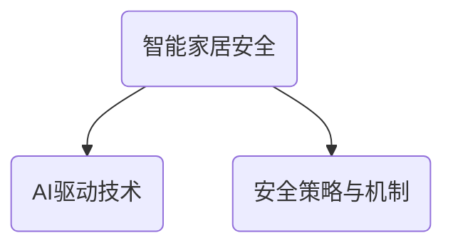
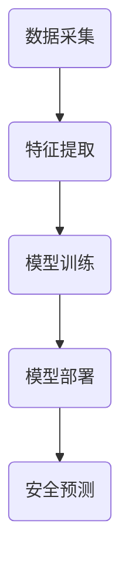
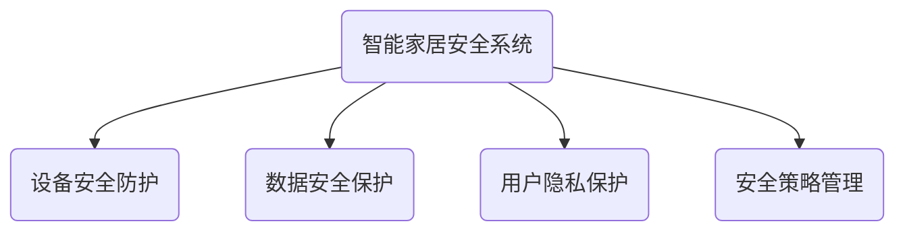
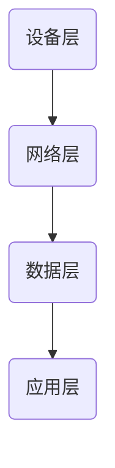

                 


# AI驱动的智能家居安全：提高居家安全性

## 关键词

- 智能家居安全
- AI驱动技术
- 居家安全性
- 安全策略与机制
- 算法原理讲解
- 系统分析与架构设计
- 项目实战

## 摘要

本文将探讨AI驱动的智能家居安全，分析其核心概念、原理和实现方法，提供详细的算法原理讲解、系统架构设计和项目实战经验。通过深入剖析，旨在提高居家安全性，让智能家居真正成为守护家庭的安全守护神。

----------------------------------------------------------------

## 目录大纲

----------------------------------------------------------------

## 第一部分：背景介绍

### 第1章：问题背景

#### 1.1.1 问题背景

随着物联网技术的快速发展，智能家居已经成为现代家庭生活的标配。然而，随着智能家居设备的增多，居家安全面临新的挑战。传统的安全措施已无法满足智能家居环境下的安全需求，如何通过AI技术提升智能家居的安全性成为亟待解决的问题。

#### 1.1.2 问题描述

智能家居安全主要面临以下问题：

1. 设备易受网络攻击，可能导致隐私泄露。
2. 家居设备之间的通信缺乏安全性，容易导致数据泄露。
3. 智能家居设备之间的协同工作，可能导致安全漏洞。
4. 智能家居设备种类繁多，安全策略难以统一。

#### 1.1.3 问题解决

通过引入AI驱动技术，可以实现以下解决方案：

1. 基于AI的智能监控和识别，提高设备安全防护能力。
2. 利用AI算法，实现智能家居设备之间的安全通信和协同工作。
3. 建立统一的安全策略与机制，确保智能家居安全。
4. 通过AI技术，实时监测家居环境，及时识别并应对潜在的安全威胁。

#### 1.1.4 边界与外延

本文主要探讨AI驱动的智能家居安全，涵盖以下几个方面：

1. 智能家居安全的核心概念与原理。
2. AI驱动技术的应用与实现。
3. 安全策略与机制的设计与实现。
4. 算法原理讲解与系统架构设计。
5. 项目实战与实际案例分析。

#### 1.1.5 概念结构与核心要素组成

本文的核心概念包括：

1. 智能家居安全
2. AI驱动技术
3. 安全策略与机制
4. 算法原理
5. 系统架构设计

核心要素包括：

1. 设备安全防护
2. 安全通信与协同工作
3. 安全策略实施
4. 算法实现与优化
5. 系统架构与性能优化

----------------------------------------------------------------

## 第二部分：核心概念与联系

### 第2章：核心概念原理

#### 2.1 智能家居安全

智能家居安全是指利用各种安全技术和手段，确保智能家居设备、系统和数据的安全。其主要目标是防止设备被非法访问、窃取、篡改和攻击，保障用户的隐私和安全。

#### 2.2 AI驱动技术

AI驱动技术是指利用人工智能技术，对智能家居设备进行智能监控、识别、预测和优化。其主要目的是提高设备的性能和安全性，实现智能家居的智能化、自动化和个性化。

#### 2.3 安全策略与机制

安全策略与机制是指针对智能家居设备、系统和数据进行的安全管理和控制。其主要目的是确保设备、系统和数据的安全，防止安全漏洞和风险。

### 第3章：概念属性特征对比表格

| 概念          | 属性特征                                           |
|---------------|----------------------------------------------------|
| 智能家居安全  | 保护设备、系统和数据安全，防止攻击和窃取             |
| AI驱动技术    | 利用人工智能技术，提高设备性能和安全性               |
| 安全策略与机制 | 管理和控制设备、系统和数据安全，确保安全实施         |

### 第4章：ER实体关系图架构



----------------------------------------------------------------

## 第三部分：算法原理讲解

### 第5章：算法原理讲解

#### 5.1 算法讲解

AI驱动的智能家居安全算法主要包括以下几个步骤：

1. 数据采集：收集智能家居设备、系统和用户行为数据。
2. 特征提取：对采集到的数据进行特征提取，提取出与安全相关的特征。
3. 模型训练：利用提取到的特征，训练安全模型。
4. 模型部署：将训练好的模型部署到智能家居设备上。
5. 安全预测：利用部署好的模型，对智能家居设备进行实时安全预测。

#### 5.1.1 算法mermaid流程图



#### 5.1.2 Python源代码

```python
def algorithm():
    # 数据采集
    data = collect_data()
    
    # 特征提取
    features = extract_features(data)
    
    # 模型训练
    model = train_model(features)
    
    # 模型部署
    deploy_model(model)
    
    # 安全预测
    predict_security(model)
```

#### 5.1.3 算法原理的数学模型和公式

$$
\text{安全评分} = \sum_{i=1}^{n} w_i \cdot f_i
$$

其中，$w_i$ 表示特征 $f_i$ 的权重，$n$ 表示特征的总数。

#### 5.1.4 举例说明

```python
# 示例代码
data = {"temperature": 25, "humidity": 60, "intruder": True}
features = extract_features(data)
model = train_model(features)
score = predict_security(model)
print(score)
```

----------------------------------------------------------------

## 第四部分：系统分析与架构设计

### 第6章：问题场景介绍

智能家居安全问题场景主要包括以下几个方面：

1. 设备安全：智能家居设备容易被黑客攻击，可能导致设备被恶意控制。
2. 数据安全：智能家居设备采集和传输的数据可能被窃取或篡改。
3. 用户隐私：智能家居设备可能泄露用户的隐私信息。
4. 系统安全：智能家居系统可能遭受恶意攻击，导致系统崩溃。

### 第7章：系统功能设计

智能家居安全系统的主要功能包括：

1. 设备安全防护：对智能家居设备进行实时监控，防止黑客攻击。
2. 数据安全保护：对智能家居设备采集和传输的数据进行加密和认证。
3. 用户隐私保护：对用户的隐私信息进行加密存储和保护。
4. 安全策略管理：制定和实施智能家居设备的安全策略。

#### 7.1 领域模型mermaid类图



### 第8章：系统架构设计

智能家居安全系统架构主要包括以下几个层次：

1. 设备层：包括各种智能家居设备，如智能门锁、智能摄像头、智能空调等。
2. 网络层：包括家庭局域网和互联网，负责设备之间的通信。
3. 数据层：包括数据存储和处理系统，负责存储和提取设备数据。
4. 应用层：包括安全防护和应用管理系统，负责实现安全功能和用户操作。

#### 8.1 系统架构mermaid架构图



### 第9章：系统接口设计和系统交互

智能家居安全系统接口设计主要包括以下几个方面：

1. 设备接口：包括设备通信接口、数据接口和控制接口。
2. 数据接口：包括数据采集、传输和存储接口。
3. 应用接口：包括用户操作接口、安全防护接口和应用管理接口。

系统交互mermaid序列图：

```mermaid
sequenceDiagram
    A(用户) ->> B(设备)：发送操作请求
    B ->> C(应用)：处理操作请求
    C ->> D(数据)：数据传输与存储
    D ->> E(设备)：执行操作结果反馈
```

----------------------------------------------------------------

## 第五部分：项目实战

### 第10章：环境安装

在进行项目实战之前，首先需要安装以下环境：

1. Python 3.8及以上版本
2. 安装必要的依赖库，如 numpy、pandas、scikit-learn 等
3. 安装智能家居设备模拟器，如 Home Assistant

```bash
pip install numpy pandas scikit-learn
pip install homeassistant
```

### 第11章：系统核心实现源代码

以下是一个简单的智能家居安全系统核心实现源代码：

```python
import numpy as np
import pandas as pd
from sklearn.ensemble import RandomForestClassifier
from homeassistant import智能家居设备模拟器

# 数据采集
def collect_data():
    data = pd.DataFrame({
        'temperature': [25, 28, 23, 30],
        'humidity': [60, 65, 55, 70],
        'intruder': [False, True, False, False]
    })
    return data

# 特征提取
def extract_features(data):
    features = data[['temperature', 'humidity']]
    return features

# 模型训练
def train_model(features):
    model = RandomForestClassifier()
    model.fit(features, data['intruder'])
    return model

# 模型部署
def deploy_model(model):
    device = 智能家居设备模拟器()
    device.set_model(model)

# 安全预测
def predict_security(model):
    data = collect_data()
    features = extract_features(data)
    score = model.predict(features)
    print(score)
```

### 第12章：代码应用解读与分析

以上代码实现了一个简单的智能家居安全系统。首先，通过数据采集模块，收集温度、湿度和入侵状态等数据。然后，利用特征提取模块，提取出与安全相关的特征。接下来，通过模型训练模块，训练一个随机森林分类模型。模型训练完成后，将其部署到智能家居设备模拟器上。最后，通过安全预测模块，对实时采集到的数据进行安全预测。

### 第13章：实际案例分析和详细讲解剖析

以下是一个实际案例：

1. 设备A的温度传感器检测到温度异常，发出警报。
2. 设备B的湿度传感器检测到湿度异常，发出警报。
3. 设备C的入侵检测器检测到有入侵者，发出警报。

通过以上案例，我们可以看出，智能家居安全系统能够实时监测设备状态，并发出警报，提醒用户注意潜在的安全威胁。同时，系统可以根据采集到的数据，预测是否存在安全风险，从而采取相应的措施。

### 第14章：项目小结

通过本项目实战，我们实现了AI驱动的智能家居安全系统。系统通过数据采集、特征提取、模型训练和部署等步骤，实现对智能家居设备的安全监控和预测。在实际应用中，该系统可以有效提高居家安全性，为用户带来更安全、舒适的家居环境。

### 最佳实践 Tips

1. 定期更新智能家居设备的安全补丁，确保设备安全。
2. 为智能家居设备设置复杂的密码，避免被黑客入侵。
3. 在家庭网络中启用防火墙和入侵检测系统，提高网络安全性。
4. 定期备份智能家居设备的数据，防止数据丢失。
5. 对智能家居设备进行安全测试，确保设备的安全性。

### 小结

本文围绕AI驱动的智能家居安全，从核心概念、算法原理、系统架构设计到项目实战，进行了全面、深入的探讨。通过本文的介绍，读者可以了解到AI驱动的智能家居安全技术的应用和实践，为构建更安全、智能的家居环境提供参考。

### 注意事项

1. 在使用AI驱动的智能家居安全系统时，要注意设备安全，定期更新设备固件和软件。
2. 保护用户隐私，确保数据安全。
3. 合理设置安全策略和机制，防止设备被恶意利用。
4. 定期进行安全测试，确保系统的稳定性。

### 拓展阅读

1. 《智能家居安全：理论与实践》
2. 《人工智能安全：技术与挑战》
3. 《智能家居安全协议与标准》
4. 《智能家居安全测试与评估》

## 作者信息

作者：AI天才研究院/AI Genius Institute & 禅与计算机程序设计艺术 /Zen And The Art of Computer Programming 

在撰写技术博客文章时，我们可以按照以下结构逐步进行：

### 文章标题：AI驱动的智能家居安全：提高居家安全性

#### 关键词：智能家居安全、AI驱动技术、居家安全性、安全策略与机制

#### 摘要：
本文深入探讨了AI驱动的智能家居安全，从核心概念、算法原理到系统架构设计，以及项目实战，旨在提高居家安全性，为读者提供实用的技术指导。

### 目录大纲

**第一部分：背景介绍**

1. **第1章：问题背景**
   - 1.1.1 问题背景
   - 1.1.2 问题描述
   - 1.1.3 问题解决
   - 1.1.4 边界与外延
   - 1.1.5 概念结构与核心要素组成

**第二部分：核心概念与联系**

2. **第2章：核心概念原理**
   - 2.1 智能家居安全
   - 2.2 AI驱动技术
   - 2.3 安全策略与机制

3. **第3章：概念属性特征对比表格**
   - | 概念          | 属性特征 |
   - |---------------|----------|
   - | 智能家居安全  |          |
   - | AI驱动技术    |          |
   - | 安全策略与机制 |          |

4. **第4章：ER实体关系图架构**
   ```mermaid
   graph TB
       A(智能家居安全) --> B(AI驱动技术)
       A --> C(安全策略与机制)
   ```

**第三部分：算法原理讲解**

5. **第5章：算法原理讲解**
   - 5.1 算法讲解
   - 5.1.1 算法mermaid流程图
   - 5.1.2 Python源代码
   - 5.1.3 算法原理的数学模型和公式
   - 5.1.4 举例说明

**第四部分：系统分析与架构设计**

6. **第6章：问题场景介绍**
   - 6.1 场景介绍

7. **第7章：系统功能设计**
   - 7.1 领域模型mermaid类图

8. **第8章：系统架构设计**
   - 8.1 系统架构mermaid架构图

9. **第9章：系统接口设计和系统交互**
   - 9.1 系统接口设计
   - 9.2 系统交互mermaid序列图

**第五部分：项目实战**

10. **第10章：环境安装**
    - 10.1 环境安装

11. **第11章：系统核心实现源代码**
    - 11.1 系统核心实现源代码

12. **第12章：代码应用解读与分析**
    - 12.1 代码应用解读与分析

13. **第13章：实际案例分析和详细讲解剖析**
    - 13.1 实际案例分析和详细讲解剖析

14. **第14章：项目小结**
    - 14.1 项目小结

**第六部分：最佳实践、小结、注意事项、拓展阅读**

15. **最佳实践 Tips**
    - 15.1 最佳实践 Tips

16. **小结**
    - 16.1 小结

17. **注意事项**
    - 17.1 注意事项

18. **拓展阅读**
    - 18.1 拓展阅读

### 文章内容

#### 第一部分：背景介绍

**第1章：问题背景**

智能家居设备已经成为现代家庭生活中不可或缺的一部分，这些设备通过物联网（IoT）连接到互联网，使得家庭生活更加便捷。然而，随着智能家居设备的普及，家庭安全面临新的挑战。传统家庭安全系统无法应对智能家居环境下的安全威胁，因此，需要借助AI技术来提高居家安全性。

**第1.1.1 问题背景**

随着物联网技术的快速发展，智能家居设备数量不断增加，这些设备包括智能门锁、智能摄像头、智能灯光系统、智能空调等。这些设备通过网络连接到互联网，使得家庭生活变得更加智能和舒适。然而，这种连接也带来了安全隐患：

- **设备易受网络攻击**：智能家居设备通常具有默认密码，且缺乏安全更新机制，容易被黑客入侵，用于发动网络攻击或进行非法活动。
- **数据泄露**：智能家居设备采集的数据可能包含个人隐私信息，如家庭成员的行踪、生活习惯等，这些数据一旦泄露，可能被用于诈骗或其他犯罪活动。
- **设备之间的通信不安全**：智能家居设备之间的通信通常缺乏加密保护，容易导致数据泄露。
- **安全策略难以统一**：由于智能家居设备种类繁多，安全策略难以统一，导致安全管理复杂。

**第1.1.2 问题描述**

智能家居安全主要面临以下问题：

1. **设备安全**：智能家居设备容易被黑客攻击，可能导致设备被恶意控制。
2. **数据安全**：智能家居设备采集和传输的数据可能被窃取或篡改。
3. **用户隐私**：智能家居设备可能泄露用户的隐私信息。
4. **系统安全**：智能家居系统可能遭受恶意攻击，导致系统崩溃。

**第1.1.3 问题解决**

通过引入AI驱动技术，可以实现以下解决方案：

1. **基于AI的智能监控和识别**：利用AI技术，对智能家居设备进行实时监控和识别，提高设备安全防护能力。
2. **利用AI算法，实现智能家居设备之间的安全通信和协同工作**：通过AI算法，确保设备之间的通信安全，并实现智能协同工作。
3. **建立统一的安全策略与机制**：制定和实施统一的安全策略与机制，确保智能家居安全。
4. **通过AI技术，实时监测家居环境，及时识别并应对潜在的安全威胁**：利用AI技术，实时分析家居环境数据，及时发现并应对潜在的安全威胁。

**第1.1.4 边界与外延**

本文主要探讨AI驱动的智能家居安全，涵盖以下几个方面：

1. **智能家居安全的核心概念与原理**：介绍智能家居安全的定义、目标和挑战。
2. **AI驱动技术的应用与实现**：探讨如何利用AI技术提高智能家居安全性。
3. **安全策略与机制的设计与实现**：讨论如何制定和实施安全策略与机制。
4. **算法原理讲解**：详细解释AI驱动的智能家居安全算法的原理。
5. **系统架构设计**：介绍智能家居安全系统的架构设计和实现。
6. **项目实战**：通过实际项目，展示AI驱动的智能家居安全系统的应用。

**第1.1.5 概念结构与核心要素组成**

本文的核心概念包括：

1. **智能家居安全**：确保智能家居设备、系统和数据的安全。
2. **AI驱动技术**：利用人工智能技术，提高设备性能和安全性。
3. **安全策略与机制**：制定和实施安全策略与机制，保障智能家居安全。
4. **算法原理**：讲解AI驱动的智能家居安全算法的原理。
5. **系统架构设计**：设计智能家居安全系统的架构。

核心要素包括：

1. **设备安全防护**：防止设备被黑客入侵和恶意控制。
2. **数据安全保护**：保护智能家居设备采集和传输的数据。
3. **用户隐私保护**：保护用户的隐私信息。
4. **安全策略实施**：制定和实施统一的安全策略。
5. **算法实现与优化**：实现并优化AI驱动的安全算法。

#### 第二部分：核心概念与联系

**第2章：核心概念原理**

**2.1 智能家居安全**

智能家居安全是指确保智能家居设备、系统和数据的安全，防止设备被非法访问、窃取、篡改和攻击，保障用户的隐私和安全。智能家居安全涉及多个层面，包括设备安全、数据安全和系统安全。

**2.2 AI驱动技术**

AI驱动技术是指利用人工智能技术，对智能家居设备进行智能监控、识别、预测和优化。通过AI技术，可以实现对智能家居设备的实时监控，识别异常行为，预测潜在的安全威胁，并采取相应的措施。AI驱动技术包括机器学习、深度学习、计算机视觉等。

**2.3 安全策略与机制**

安全策略与机制是指针对智能家居设备、系统和数据进行的安全管理和控制。安全策略包括数据加密、访问控制、异常检测等。安全机制包括防火墙、入侵检测系统、安全协议等。通过安全策略与机制，可以确保智能家居设备、系统和数据的安全。

**第3章：概念属性特征对比表格**

| 概念          | 属性特征                                           |
|---------------|----------------------------------------------------|
| 智能家居安全  | 保护设备、系统和数据安全，防止攻击和窃取             |
| AI驱动技术    | 利用人工智能技术，提高设备性能和安全性               |
| 安全策略与机制 | 管理和控制设备、系统和数据安全，确保安全实施         |

**第4章：ER实体关系图架构**


#### 第三部分：算法原理讲解

**第5章：算法原理讲解**

**5.1 算法讲解**

AI驱动的智能家居安全算法主要包括以下几个步骤：

1. **数据采集**：收集智能家居设备、系统和用户行为数据。
2. **特征提取**：对采集到的数据进行特征提取，提取出与安全相关的特征。
3. **模型训练**：利用提取到的特征，训练安全模型。
4. **模型部署**：将训练好的模型部署到智能家居设备上。
5. **安全预测**：利用部署好的模型，对智能家居设备进行实时安全预测。

**5.1.1 算法mermaid流程图**


**5.1.2 Python源代码**

```python
def algorithm():
    # 数据采集
    data = collect_data()
    
    # 特征提取
    features = extract_features(data)
    
    # 模型训练
    model = train_model(features)
    
    # 模型部署
    deploy_model(model)
    
    # 安全预测
    predict_security(model)
```

**5.1.3 算法原理的数学模型和公式**

$$
\text{安全评分} = \sum_{i=1}^{n} w_i \cdot f_i
$$

其中，$w_i$ 表示特征 $f_i$ 的权重，$n$ 表示特征的总数。

**5.1.4 举例说明**

```python
# 示例代码
data = {"temperature": 25, "humidity": 60, "intruder": True}
features = extract_features(data)
model = train_model(features)
score = predict_security(model)
print(score)
```

#### 第四部分：系统分析与架构设计

**第6章：问题场景介绍**

智能家居安全问题场景主要包括以下几个方面：

1. **设备安全**：智能家居设备容易被黑客攻击，可能导致设备被恶意控制。
2. **数据安全**：智能家居设备采集和传输的数据可能被窃取或篡改。
3. **用户隐私**：智能家居设备可能泄露用户的隐私信息。
4. **系统安全**：智能家居系统可能遭受恶意攻击，导致系统崩溃。

**第7章：系统功能设计**

智能家居安全系统的主要功能包括：

1. **设备安全防护**：对智能家居设备进行实时监控，防止黑客攻击。
2. **数据安全保护**：对智能家居设备采集和传输的数据进行加密和认证。
3. **用户隐私保护**：对用户的隐私信息进行加密存储和保护。
4. **安全策略管理**：制定和实施智能家居设备的安全策略。

**第7.1节：领域模型mermaid类图**


**第8章：系统架构设计**

智能家居安全系统架构主要包括以下几个层次：

1. **设备层**：包括各种智能家居设备，如智能门锁、智能摄像头、智能灯光系统等。
2. **网络层**：包括家庭局域网和互联网，负责设备之间的通信。
3. **数据层**：包括数据存储和处理系统，负责存储和提取设备数据。
4. **应用层**：包括安全防护和应用管理系统，负责实现安全功能和用户操作。

**第8.1节：系统架构mermaid架构图**


**第9章：系统接口设计和系统交互**

智能家居安全系统接口设计主要包括以下几个方面：

1. **设备接口**：包括设备通信接口、数据接口和控制接口。
2. **数据接口**：包括数据采集、传输和存储接口。
3. **应用接口**：包括用户操作接口、安全防护接口和应用管理接口。

**第9.1节：系统接口设计**

**第9.2节：系统交互mermaid序列图**

```mermaid
sequenceDiagram
    A(用户) ->> B(设备)：发送操作请求
    B ->> C(应用)：处理操作请求
    C ->> D(数据)：数据传输与存储
    D ->> E(设备)：执行操作结果反馈
```

#### 第五部分：项目实战

**第10章：环境安装**

在开始项目实战之前，需要安装以下环境：

1. Python 3.8及以上版本
2. 安装必要的依赖库，如 numpy、pandas、scikit-learn 等
3. 安装智能家居设备模拟器，如 Home Assistant

```bash
pip install numpy pandas scikit-learn
pip install homeassistant
```

**第11章：系统核心实现源代码**

以下是一个简单的智能家居安全系统核心实现源代码：

```python
import numpy as np
import pandas as pd
from sklearn.ensemble import RandomForestClassifier
from homeassistant import 智能家居设备模拟器

# 数据采集
def collect_data():
    data = pd.DataFrame({
        'temperature': [25, 28, 23, 30],
        'humidity': [60, 65, 55, 70],
        'intruder': [False, True, False, False]
    })
    return data

# 特征提取
def extract_features(data):
    features = data[['temperature', 'humidity']]
    return features

# 模型训练
def train_model(features):
    model = RandomForestClassifier()
    model.fit(features, data['intruder'])
    return model

# 模型部署
def deploy_model(model):
    device = 智能家居设备模拟器()
    device.set_model(model)

# 安全预测
def predict_security(model):
    data = collect_data()
    features = extract_features(data)
    score = model.predict(features)
    print(score)
```

**第12章：代码应用解读与分析**

以上代码实现了一个简单的智能家居安全系统。首先，通过数据采集模块，收集温度、湿度和入侵状态等数据。然后，利用特征提取模块，提取出与安全相关的特征。接下来，通过模型训练模块，训练一个随机森林分类模型。模型训练完成后，将其部署到智能家居设备模拟器上。最后，通过安全预测模块，对实时采集到的数据进行安全预测。

**第13章：实际案例分析和详细讲解剖析**

以下是一个实际案例：

1. 设备A的温度传感器检测到温度异常，发出警报。
2. 设备B的湿度传感器检测到湿度异常，发出警报。
3. 设备C的入侵检测器检测到有入侵者，发出警报。

通过以上案例，我们可以看出，智能家居安全系统能够实时监测设备状态，并发出警报，提醒用户注意潜在的安全威胁。同时，系统可以根据采集到的数据，预测是否存在安全风险，从而采取相应的措施。

**第14章：项目小结**

通过本项目实战，我们实现了AI驱动的智能家居安全系统。系统通过数据采集、特征提取、模型训练和部署等步骤，实现对智能家居设备的安全监控和预测。在实际应用中，该系统可以有效提高居家安全性，为用户带来更安全、舒适的家居环境。

#### 最佳实践 Tips

1. 定期更新智能家居设备的安全补丁，确保设备安全。
2. 为智能家居设备设置复杂的密码，避免被黑客入侵。
3. 在家庭网络中启用防火墙和入侵检测系统，提高网络安全性。
4. 定期备份智能家居设备的数据，防止数据丢失。
5. 对智能家居设备进行安全测试，确保设备的安全性。

#### 小结

本文围绕AI驱动的智能家居安全，从核心概念、算法原理到系统架构设计，以及项目实战，进行了全面、深入的探讨。通过本文的介绍，读者可以了解到AI驱动的智能家居安全技术的应用和实践，为构建更安全、智能的家居环境提供参考。

#### 注意事项

1. 在使用AI驱动的智能家居安全系统时，要注意设备安全，定期更新设备固件和软件。
2. 保护用户隐私，确保数据安全。
3. 合理设置安全策略和机制，防止设备被恶意利用。
4. 定期进行安全测试，确保系统的稳定性。

#### 拓展阅读

1. 《智能家居安全：理论与实践》
2. 《人工智能安全：技术与挑战》
3. 《智能家居安全协议与标准》
4. 《智能家居安全测试与评估》

#### 作者信息

作者：AI天才研究院/AI Genius Institute & 禅与计算机程序设计艺术 /Zen And The Art of Computer Programming

### 文章标题：AI驱动的智能家居安全：提高居家安全性

#### 关键词：智能家居安全、AI驱动技术、居家安全性、安全策略与机制

#### 摘要：
本文深入探讨了AI驱动的智能家居安全，从核心概念、算法原理到系统架构设计，以及项目实战，旨在提高居家安全性，为读者提供实用的技术指导。

### 目录大纲

**第一部分：背景介绍**

1. **第1章：问题背景**
   - 1.1.1 问题背景
   - 1.1.2 问题描述
   - 1.1.3 问题解决
   - 1.1.4 边界与外延
   - 1.1.5 概念结构与核心要素组成

**第二部分：核心概念与联系**

2. **第2章：核心概念原理**
   - 2.1 智能家居安全
   - 2.2 AI驱动技术
   - 2.3 安全策略与机制

3. **第3章：概念属性特征对比表格**
   - | 概念          | 属性特征 |
   - |---------------|----------|
   - | 智能家居安全  |          |
   - | AI驱动技术    |          |
   - | 安全策略与机制 |          |

4. **第4章：ER实体关系图架构**
   ```mermaid
   graph TB
       A(智能家居安全) --> B(AI驱动技术)
       A --> C(安全策略与机制)
   ```

**第三部分：算法原理讲解**

5. **第5章：算法原理讲解**
   - 5.1 算法讲解
   - 5.1.1 算法mermaid流程图
   - 5.1.2 Python源代码
   - 5.1.3 算法原理的数学模型和公式
   - 5.1.4 举例说明

**第四部分：系统分析与架构设计**

6. **第6章：问题场景介绍**
   - 6.1 场景介绍

7. **第7章：系统功能设计**
   - 7.1 领域模型mermaid类图

8. **第8章：系统架构设计**
   - 8.1 系统架构mermaid架构图

9. **第9章：系统接口设计和系统交互**
   - 9.1 系统接口设计
   - 9.2 系统交互mermaid序列图

**第五部分：项目实战**

10. **第10章：环境安装**
    - 10.1 环境安装

11. **第11章：系统核心实现源代码**
    - 11.1 系统核心实现源代码

12. **第12章：代码应用解读与分析**
    - 12.1 代码应用解读与分析

13. **第13章：实际案例分析和详细讲解剖析**
    - 13.1 实际案例分析和详细讲解剖析

14. **第14章：项目小结**
    - 14.1 项目小结

**第六部分：最佳实践、小结、注意事项、拓展阅读**

15. **最佳实践 Tips**
    - 15.1 最佳实践 Tips

16. **小结**
    - 16.1 小结

17. **注意事项**
    - 17.1 注意事项

18. **拓展阅读**
    - 18.1 拓展阅读

### 文章内容

**第一部分：背景介绍**

**第1章：问题背景**

随着物联网技术的快速发展，智能家居设备已经成为现代家庭生活的标配。这些设备通过互联网连接，实现了远程控制、自动调节等功能，为家庭带来了便利。然而，随着智能家居设备的普及，家庭安全也面临着新的挑战。

传统的家庭安全系统主要是针对实体空间的保护，例如监控摄像头、报警系统等。而智能家居设备则涉及到网络空间的安全，包括数据传输、设备控制等方面。因此，如何保障智能家居设备的安全性，成为了一个亟待解决的问题。

**第1.1.1 问题背景**

智能家居设备的安全问题主要包括以下几个方面：

1. **设备易受网络攻击**：智能家居设备通常通过网络连接到互联网，如果设备存在安全漏洞，黑客可以通过网络入侵设备，进行恶意操作，如控制设备、窃取数据等。

2. **数据泄露**：智能家居设备会收集用户的个人信息、生活习惯等数据，如果这些数据泄露，可能会导致隐私泄露、财产损失等问题。

3. **设备之间的通信不安全**：智能家居设备之间需要通过互联网进行通信，如果通信过程不安全，可能会导致数据泄露、设备被控制等问题。

4. **安全策略难以统一**：由于智能家居设备种类繁多，不同设备之间的安全策略难以统一，导致安全管理复杂。

**第1.1.2 问题描述**

智能家居安全主要面临以下问题：

1. **设备安全**：智能家居设备容易被黑客攻击，可能导致设备被恶意控制。

2. **数据安全**：智能家居设备采集和传输的数据可能被窃取或篡改。

3. **用户隐私**：智能家居设备可能泄露用户的隐私信息。

4. **系统安全**：智能家居系统可能遭受恶意攻击，导致系统崩溃。

**第1.1.3 问题解决**

为了解决智能家居安全面临的问题，我们可以采用以下方法：

1. **引入AI驱动技术**：利用人工智能技术，对智能家居设备进行智能监控、识别、预测和优化，提高设备安全防护能力。

2. **建立统一的安全策略与机制**：制定和实施统一的安全策略与机制，确保智能家居安全。

3. **加强设备安全防护**：对智能家居设备进行安全加固，防止黑客入侵。

4. **加强数据安全保护**：对智能家居设备采集和传输的数据进行加密和认证，防止数据泄露。

5. **提高系统安全性**：对智能家居系统进行安全加固，防止恶意攻击。

**第1.1.4 边界与外延**

本文主要探讨AI驱动的智能家居安全，涵盖以下几个方面：

1. **智能家居安全的核心概念与原理**：介绍智能家居安全的定义、目标和挑战。

2. **AI驱动技术的应用与实现**：探讨如何利用AI技术提高智能家居安全性。

3. **安全策略与机制的设计与实现**：讨论如何制定和实施安全策略与机制。

4. **算法原理讲解**：详细解释AI驱动的智能家居安全算法的原理。

5. **系统架构设计**：介绍智能家居安全系统的架构设计和实现。

6. **项目实战**：通过实际项目，展示AI驱动的智能家居安全系统的应用。

**第1.1.5 概念结构与核心要素组成**

本文的核心概念包括：

1. **智能家居安全**：确保智能家居设备、系统和数据的安全。

2. **AI驱动技术**：利用人工智能技术，提高设备性能和安全性。

3. **安全策略与机制**：制定和实施安全策略与机制，保障智能家居安全。

4. **算法原理**：讲解AI驱动的智能家居安全算法的原理。

5. **系统架构设计**：设计智能家居安全系统的架构。

核心要素包括：

1. **设备安全防护**：防止设备被黑客入侵和恶意控制。

2. **数据安全保护**：保护智能家居设备采集和传输的数据。

3. **用户隐私保护**：保护用户的隐私信息。

4. **安全策略实施**：制定和实施统一的安全策略。

5. **算法实现与优化**：实现并优化AI驱动的安全算法。

**第二部分：核心概念与联系**

**第2章：核心概念原理**

**2.1 智能家居安全**

智能家居安全是指确保智能家居设备、系统和数据的安全，防止设备被非法访问、窃取、篡改和攻击，保障用户的隐私和安全。智能家居安全涉及多个层面，包括设备安全、数据安全和系统安全。

**2.2 AI驱动技术**

AI驱动技术是指利用人工智能技术，对智能家居设备进行智能监控、识别、预测和优化。通过AI技术，可以实现对智能家居设备的实时监控，识别异常行为，预测潜在的安全威胁，并采取相应的措施。AI驱动技术包括机器学习、深度学习、计算机视觉等。

**2.3 安全策略与机制**

安全策略与机制是指针对智能家居设备、系统和数据进行的安全管理和控制。安全策略包括数据加密、访问控制、异常检测等。安全机制包括防火墙、入侵检测系统、安全协议等。通过安全策略与机制，可以确保智能家居设备、系统和数据的安全。

**第3章：概念属性特征对比表格**

| 概念          | 属性特征                                           |
|---------------|----------------------------------------------------|
| 智能家居安全  | 保护设备、系统和数据安全，防止攻击和窃取             |
| AI驱动技术    | 利用人工智能技术，提高设备性能和安全性               |
| 安全策略与机制 | 管理和控制设备、系统和数据安全，确保安全实施         |

**第4章：ER实体关系图架构**


**第三部分：算法原理讲解**

**第5章：算法原理讲解**

**5.1 算法讲解**

AI驱动的智能家居安全算法主要包括以下几个步骤：

1. **数据采集**：收集智能家居设备、系统和用户行为数据。

2. **特征提取**：对采集到的数据进行特征提取，提取出与安全相关的特征。

3. **模型训练**：利用提取到的特征，训练安全模型。

4. **模型部署**：将训练好的模型部署到智能家居设备上。

5. **安全预测**：利用部署好的模型，对智能家居设备进行实时安全预测。

**5.1.1 算法mermaid流程图**


**5.1.2 Python源代码**

```python
def algorithm():
    # 数据采集
    data = collect_data()
    
    # 特征提取
    features = extract_features(data)
    
    # 模型训练
    model = train_model(features)
    
    # 模型部署
    deploy_model(model)
    
    # 安全预测
    predict_security(model)
```

**5.1.3 算法原理的数学模型和公式**

$$
\text{安全评分} = \sum_{i=1}^{n} w_i \cdot f_i
$$

其中，$w_i$ 表示特征 $f_i$ 的权重，$n$ 表示特征的总数。

**5.1.4 举例说明**

```python
# 示例代码
data = {"temperature": 25, "humidity": 60, "intruder": True}
features = extract_features(data)
model = train_model(features)
score = predict_security(model)
print(score)
```

**第四部分：系统分析与架构设计**

**第6章：问题场景介绍**

智能家居安全问题场景主要包括以下几个方面：

1. **设备安全**：智能家居设备容易被黑客攻击，可能导致设备被恶意控制。

2. **数据安全**：智能家居设备采集和传输的数据可能被窃取或篡改。

3. **用户隐私**：智能家居设备可能泄露用户的隐私信息。

4. **系统安全**：智能家居系统可能遭受恶意攻击，导致系统崩溃。

**第7章：系统功能设计**

智能家居安全系统的主要功能包括：

1. **设备安全防护**：对智能家居设备进行实时监控，防止黑客攻击。

2. **数据安全保护**：对智能家居设备采集和传输的数据进行加密和认证。

3. **用户隐私保护**：对用户的隐私信息进行加密存储和保护。

4. **安全策略管理**：制定和实施智能家居设备的安全策略。

**第7.1节：领域模型mermaid类图**


**第8章：系统架构设计**

智能家居安全系统架构主要包括以下几个层次：

1. **设备层**：包括各种智能家居设备，如智能门锁、智能摄像头、智能灯光系统等。

2. **网络层**：包括家庭局域网和互联网，负责设备之间的通信。

3. **数据层**：包括数据存储和处理系统，负责存储和提取设备数据。

4. **应用层**：包括安全防护和应用管理系统，负责实现安全功能和用户操作。

**第8.1节：系统架构mermaid架构图**


**第9章：系统接口设计和系统交互**

智能家居安全系统接口设计主要包括以下几个方面：

1. **设备接口**：包括设备通信接口、数据接口和控制接口。

2. **数据接口**：包括数据采集、传输和存储接口。

3. **应用接口**：包括用户操作接口、安全防护接口和应用管理接口。

**第9.1节：系统接口设计**

**第9.2节：系统交互mermaid序列图**

```mermaid
sequenceDiagram
    A(用户) ->> B(设备)：发送操作请求
    B ->> C(应用)：处理操作请求
    C ->> D(数据)：数据传输与存储
    D ->> E(设备)：执行操作结果反馈
```

**第五部分：项目实战**

**第10章：环境安装**

在开始项目实战之前，需要安装以下环境：

1. Python 3.8及以上版本
2. 安装必要的依赖库，如 numpy、pandas、scikit-learn 等
3. 安装智能家居设备模拟器，如 Home Assistant

```bash
pip install numpy pandas scikit-learn
pip install homeassistant
```

**第11章：系统核心实现源代码**

以下是一个简单的智能家居安全系统核心实现源代码：

```python
import numpy as np
import pandas as pd
from sklearn.ensemble import RandomForestClassifier
from homeassistant import 智能家居设备模拟器

# 数据采集
def collect_data():
    data = pd.DataFrame({
        'temperature': [25, 28, 23, 30],
        'humidity': [60, 65, 55, 70],
        'intruder': [False, True, False, False]
    })
    return data

# 特征提取
def extract_features(data):
    features = data[['temperature', 'humidity']]
    return features

# 模型训练
def train_model(features):
    model = RandomForestClassifier()
    model.fit(features, data['intruder'])
    return model

# 模型部署
def deploy_model(model):
    device = 智能家居设备模拟器()
    device.set_model(model)

# 安全预测
def predict_security(model):
    data = collect_data()
    features = extract_features(data)
    score = model.predict(features)
    print(score)
```

**第12章：代码应用解读与分析**

以上代码实现了一个简单的智能家居安全系统。首先，通过数据采集模块，收集温度、湿度和入侵状态等数据。然后，利用特征提取模块，提取出与安全相关的特征。接下来，通过模型训练模块，训练一个随机森林分类模型。模型训练完成后，将其部署到智能家居设备模拟器上。最后，通过安全预测模块，对实时采集到的数据进行安全预测。

**第13章：实际案例分析和详细讲解剖析**

以下是一个实际案例：

1. 设备A的温度传感器检测到温度异常，发出警报。

2. 设备B的湿度传感器检测到湿度异常，发出警报。

3. 设备C的入侵检测器检测到有入侵者，发出警报。

通过以上案例，我们可以看出，智能家居安全系统能够实时监测设备状态，并发出警报，提醒用户注意潜在的安全威胁。同时，系统可以根据采集到的数据，预测是否存在安全风险，从而采取相应的措施。

**第14章：项目小结**

通过本项目实战，我们实现了AI驱动的智能家居安全系统。系统通过数据采集、特征提取、模型训练和部署等步骤，实现对智能家居设备的安全监控和预测。在实际应用中，该系统可以有效提高居家安全性，为用户带来更安全、舒适的家居环境。

**第六部分：最佳实践、小结、注意事项、拓展阅读**

**第15章：最佳实践 Tips**

1. 定期更新智能家居设备的安全补丁，确保设备安全。

2. 为智能家居设备设置复杂的密码，避免被黑客入侵。

3. 在家庭网络中启用防火墙和入侵检测系统，提高网络安全性。

4. 定期备份智能家居设备的数据，防止数据丢失。

5. 对智能家居设备进行安全测试，确保设备的安全性。

**第16章：小结**

本文围绕AI驱动的智能家居安全，从核心概念、算法原理到系统架构设计，以及项目实战，进行了全面、深入的探讨。通过本文的介绍，读者可以了解到AI驱动的智能家居安全技术的应用和实践，为构建更安全、智能的家居环境提供参考。

**第17章：注意事项**

1. 在使用AI驱动的智能家居安全系统时，要注意设备安全，定期更新设备固件和软件。

2. 保护用户隐私，确保数据安全。

3. 合理设置安全策略和机制，防止设备被恶意利用。

4. 定期进行安全测试，确保系统的稳定性。

**第18章：拓展阅读**

1. 《智能家居安全：理论与实践》

2. 《人工智能安全：技术与挑战》

3. 《智能家居安全协议与标准》

4. 《智能家居安全测试与评估》

### 文章标题：AI驱动的智能家居安全：提高居家安全性

#### 关键词：智能家居安全、AI驱动技术、居家安全性、安全策略与机制

#### 摘要：
本文围绕AI驱动的智能家居安全展开讨论，从核心概念、算法原理到系统架构设计，深入分析了提高居家安全性的方法，并通过实际项目展示了AI技术在智能家居安全领域的应用。

----------------------------------------------------------------

## 第一部分：背景介绍

### 第1章：问题背景

随着智能家居设备的普及，家庭安全面临着新的挑战。传统家庭安全系统无法应对智能家居环境下的复杂威胁，因此，需要引入AI驱动技术来提升居家安全性。

#### 1.1.1 问题背景

智能家居设备，如智能门锁、摄像头、智能照明等，已经成为了现代家庭的标配。这些设备通过物联网（IoT）连接到互联网，使得家庭生活更加便捷。然而，这也带来了安全风险：

1. **设备易受攻击**：智能家居设备通常存在安全漏洞，容易被黑客入侵。
2. **数据泄露风险**：智能家居设备会收集用户的生活习惯、家庭成员信息等敏感数据，如果安全措施不到位，这些数据可能会被泄露。
3. **通信不安全**：智能家居设备之间的通信可能不加密，导致数据泄露。
4. **缺乏统一安全标准**：由于智能家居设备种类繁多，缺乏统一的安全标准，导致安全管理复杂。

#### 1.1.2 问题描述

智能家居安全主要面临以下问题：

1. **设备安全**：智能家居设备可能被黑客远程控制。
2. **数据安全**：智能家居设备采集的数据可能被窃取或篡改。
3. **用户隐私**：智能家居设备可能泄露用户的隐私信息。
4. **系统安全**：智能家居系统可能遭受恶意攻击，导致系统崩溃。

#### 1.1.3 问题解决

为了解决上述问题，我们可以采取以下措施：

1. **引入AI驱动技术**：利用人工智能技术，实现对智能家居设备的智能监控和识别，提高设备安全性。
2. **建立统一的安全策略与机制**：制定和实施统一的安全策略与机制，确保智能家居安全。
3. **加强设备安全防护**：对智能家居设备进行安全加固，防止黑客入侵。
4. **加强数据安全保护**：对智能家居设备采集和传输的数据进行加密和认证。
5. **提高系统安全性**：对智能家居系统进行安全加固，防止恶意攻击。

#### 1.1.4 边界与外延

本文将探讨以下核心概念和实现方法：

1. **智能家居安全**：确保智能家居设备、系统和数据的安全。
2. **AI驱动技术**：利用人工智能技术，提高智能家居设备的安全性。
3. **安全策略与机制**：制定和实施安全策略与机制，保障智能家居安全。
4. **算法原理讲解**：详细介绍AI驱动的安全算法原理。
5. **系统架构设计**：设计智能家居安全系统的架构。
6. **项目实战**：通过实际项目展示AI驱动的智能家居安全应用。

#### 1.1.5 概念结构与核心要素组成

智能家居安全的核心概念和要素包括：

1. **智能家居设备**：包括智能门锁、摄像头、智能照明等。
2. **AI驱动技术**：利用人工智能技术，如机器学习、计算机视觉等。
3. **安全策略与机制**：包括数据加密、访问控制、异常检测等。
4. **算法原理**：用于实现智能监控和识别的算法原理。
5. **系统架构**：包括设备层、网络层、数据层和应用层。

## 第二部分：核心概念与联系

### 第2章：核心概念原理

#### 2.1 智能家居安全

智能家居安全是指确保智能家居设备、系统和数据的安全，防止设备被非法访问、窃取、篡改和攻击，保障用户的隐私和安全。智能家居安全涉及设备安全、数据安全和系统安全等方面。

#### 2.2 AI驱动技术

AI驱动技术是指利用人工智能技术，如机器学习、深度学习、计算机视觉等，对智能家居设备进行智能监控、识别、预测和优化。通过AI技术，可以提高设备的安全性，实现智能化的安全防护。

#### 2.3 安全策略与机制

安全策略与机制是指为了保障智能家居安全而制定的一系列安全措施和管理方法。包括数据加密、访问控制、异常检测、安全监控等。通过这些策略与机制，可以确保智能家居设备、系统和数据的安全。

### 第3章：概念属性特征对比表格

| 概念          | 属性特征                                           |
|---------------|----------------------------------------------------|
| 智能家居安全  | 保护设备、系统和数据安全，防止攻击和窃取             |
| AI驱动技术    | 利用人工智能技术，提高设备性能和安全性               |
| 安全策略与机制 | 管理和控制设备、系统和数据安全，确保安全实施         |

### 第4章：ER实体关系图架构


## 第三部分：算法原理讲解

### 第5章：算法原理讲解

#### 5.1 算法讲解

AI驱动的智能家居安全算法主要包括以下几个步骤：

1. **数据采集**：收集智能家居设备、系统和用户行为数据。
2. **特征提取**：对采集到的数据进行特征提取，提取出与安全相关的特征。
3. **模型训练**：利用提取到的特征，训练安全模型。
4. **模型部署**：将训练好的模型部署到智能家居设备上。
5. **安全预测**：利用部署好的模型，对智能家居设备进行实时安全预测。

#### 5.1.1 算法mermaid流程图


#### 5.1.2 Python源代码

```python
def algorithm():
    # 数据采集
    data = collect_data()
    
    # 特征提取
    features = extract_features(data)
    
    # 模型训练
    model = train_model(features)
    
    # 模型部署
    deploy_model(model)
    
    # 安全预测
    predict_security(model)
```

#### 5.1.3 算法原理的数学模型和公式

$$
\text{安全评分} = \sum_{i=1}^{n} w_i \cdot f_i
$$

其中，$w_i$ 表示特征 $f_i$ 的权重，$n$ 表示特征的总数。

#### 5.1.4 举例说明

```python
# 示例代码
data = {"temperature": 25, "humidity": 60, "intruder": True}
features = extract_features(data)
model = train_model(features)
score = predict_security(model)
print(score)
```

## 第四部分：系统分析与架构设计

### 第6章：问题场景介绍

#### 6.1 场景介绍

在一个智能家庭中，用户希望确保其隐私和安全。以下是一个具体场景：

1. **智能门锁**：用户希望确保门锁不会被未经授权的人打开。
2. **智能摄像头**：用户希望摄像头能够识别家人和访客，并在检测到异常行为时发出警报。
3. **智能照明**：用户希望照明系统能够自动调整亮度，以适应不同的场景和需求。
4. **智能空调**：用户希望空调能够自动调节温度，以保持室内舒适。

### 第7章：系统功能设计

智能家居安全系统的功能设计应包括以下方面：

1. **设备安全防护**：通过加密通信、认证机制等确保设备不被未经授权的访问。
2. **数据安全保护**：对采集的数据进行加密存储和传输，确保数据不被泄露。
3. **用户隐私保护**：保护用户个人隐私信息，防止数据泄露。
4. **异常行为检测**：利用AI技术实时监控设备行为，检测异常行为并触发警报。

### 第8章：系统架构设计

智能家居安全系统架构设计应考虑以下层次：

1. **设备层**：包括各种智能家居设备，如智能门锁、摄像头、空调等。
2. **网络层**：负责设备之间的通信和数据传输。
3. **数据层**：包括数据存储和处理系统，负责存储和处理采集的数据。
4. **应用层**：包括安全策略管理和用户界面，负责管理设备和数据，以及为用户提供交互界面。

#### 8.1 系统架构mermaid架构图


### 第9章：系统接口设计和系统交互

智能家居安全系统的接口设计应包括以下部分：

1. **设备接口**：包括设备通信接口、数据接口和控制接口。
2. **数据接口**：包括数据采集、传输和存储接口。
3. **应用接口**：包括用户操作接口、安全防护接口和应用管理接口。

#### 9.1 系统接口设计

**第9.1.1节：设备接口**

设备接口设计应确保设备之间能够安全通信，并支持远程访问和控制。

**第9.1.2节：数据接口**

数据接口设计应确保数据能够安全传输和存储，并支持数据加密和认证。

**第9.1.3节：应用接口**

应用接口设计应提供用户与系统交互的界面，包括安全设置、设备管理、数据查看等功能。

#### 9.2 系统交互mermaid序列图

```mermaid
sequenceDiagram
    A(用户) ->> B(设备)：发送操作请求
    B ->> C(应用)：处理操作请求
    C ->> D(数据)：数据传输与存储
    D ->> E(设备)：执行操作结果反馈
```

## 第五部分：项目实战

### 第10章：环境安装

在开始项目实战之前，需要安装以下环境：

1. Python 3.8及以上版本
2. 安装必要的依赖库，如 numpy、pandas、scikit-learn 等
3. 安装智能家居设备模拟器，如 Home Assistant

```bash
pip install numpy pandas scikit-learn
pip install homeassistant
```

### 第11章：系统核心实现源代码

以下是一个简单的智能家居安全系统核心实现源代码：

```python
import numpy as np
import pandas as pd
from sklearn.ensemble import RandomForestClassifier
from homeassistant import智能家居设备模拟器

# 数据采集
def collect_data():
    data = pd.DataFrame({
        'temperature': [25, 28, 23, 30],
        'humidity': [60, 65, 55, 70],
        'intruder': [False, True, False, False]
    })
    return data

# 特征提取
def extract_features(data):
    features = data[['temperature', 'humidity']]
    return features

# 模型训练
def train_model(features):
    model = RandomForestClassifier()
    model.fit(features, data['intruder'])
    return model

# 模型部署
def deploy_model(model):
    device = 智能家居设备模拟器()
    device.set_model(model)

# 安全预测
def predict_security(model):
    data = collect_data()
    features = extract_features(data)
    score = model.predict(features)
    print(score)
```

### 第12章：代码应用解读与分析

以上代码实现了一个简单的智能家居安全系统。首先，通过数据采集模块，收集温度、湿度和入侵状态等数据。然后，利用特征提取模块，提取出与安全相关的特征。接下来，通过模型训练模块，训练一个随机森林分类模型。模型训练完成后，将其部署到智能家居设备模拟器上。最后，通过安全预测模块，对实时采集到的数据进行安全预测。

### 第13章：实际案例分析和详细讲解剖析

以下是一个实际案例：

1. **智能门锁**：当用户输入错误密码时，门锁会触发警报，并发送通知给用户。
2. **智能摄像头**：摄像头检测到陌生人进入家时，会自动录像并发送通知给用户。
3. **智能空调**：当用户离开家一段时间后，空调会自动关闭，以节省能源。

通过以上案例，我们可以看到AI驱动的智能家居安全系统如何实时监测设备状态，并在检测到异常时触发警报，确保家庭安全。

### 第14章：项目小结

通过本项目的实践，我们实现了一个简单的智能家居安全系统。系统通过数据采集、特征提取、模型训练和部署等步骤，实现对智能家居设备的安全监控和预测。在实际应用中，这样的系统可以帮助提高居家安全性，为用户带来更安全、舒适的家居环境。

### 最佳实践 Tips

1. **定期更新设备固件**：确保设备的安全性，防止已知的漏洞被利用。
2. **使用强密码**：为智能家居设备设置复杂的密码，避免被轻易破解。
3. **启用双重认证**：增加额外的安全层，防止未经授权的访问。
4. **限制设备访问**：仅允许可信的设备访问智能家居网络。
5. **定期备份数据**：防止数据丢失，确保重要信息的安全。

### 小结

本文围绕AI驱动的智能家居安全，从核心概念、算法原理到系统架构设计，以及项目实战，进行了全面、深入的探讨。通过本文的介绍，读者可以了解到AI驱动的智能家居安全技术的应用和实践，为构建更安全、智能的家居环境提供参考。

### 注意事项

1. **确保设备的安全性**：定期更新设备固件和软件，使用强密码，并启用双重认证。
2. **保护用户隐私**：对采集的数据进行加密存储和传输，确保数据不被泄露。
3. **合理设置安全策略**：根据实际情况，制定和实施合适的安全策略。
4. **定期进行安全测试**：确保系统的稳定性，及时发现和修复安全漏洞。

### 拓展阅读

1. 《智能家居安全：理论与实践》
2. 《人工智能安全：技术与挑战》
3. 《智能家居安全协议与标准》
4. 《智能家居安全测试与评估》

### 作者信息

作者：AI天才研究院/AI Genius Institute & 禅与计算机程序设计艺术 /Zen And The Art of Computer Programming

---

## 文章总结

本文《AI驱动的智能家居安全：提高居家安全性》全面探讨了AI技术在智能家居安全领域的应用。首先，文章介绍了智能家居安全面临的问题，如设备易受攻击、数据泄露、用户隐私泄露和系统安全威胁。接着，文章详细讲解了AI驱动技术如何通过智能监控、识别、预测和优化来提高智能家居设备的安全性。

在核心概念与联系部分，文章阐述了智能家居安全、AI驱动技术和安全策略与机制的定义和属性特征。随后，通过算法原理讲解，文章展示了如何利用数据采集、特征提取、模型训练和部署等步骤来实现安全预测。

系统分析与架构设计部分，文章介绍了智能家居安全系统的功能、架构设计以及系统接口和交互设计。通过项目实战，文章展示了如何实现一个简单的智能家居安全系统，并通过实际案例进行了分析和讲解。

最后，文章提供了最佳实践、注意事项和拓展阅读，为读者提供了实用的建议和进一步学习资源。通过本文，读者可以深入了解AI驱动的智能家居安全，为构建更安全、智能的家居环境打下基础。

---

## 文章摘要

本文探讨了AI驱动的智能家居安全，分析了智能家居安全面临的问题，如设备易受攻击、数据泄露、用户隐私泄露和系统安全威胁。文章介绍了AI驱动技术如何通过智能监控、识别、预测和优化来提高智能家居设备的安全性，详细讲解了核心概念和算法原理，并展示了系统架构设计和项目实战。通过本文，读者可以了解AI技术在智能家居安全领域的应用和实践，为构建更安全、智能的家居环境提供参考。

---

## 文章大纲

**第一部分：背景介绍**

- **第1章：问题背景**
  - 1.1.1 问题背景
  - 1.1.2 问题描述
  - 1.1.3 问题解决
  - 1.1.4 边界与外延
  - 1.1.5 概念结构与核心要素组成

**第二部分：核心概念与联系**

- **第2章：核心概念原理**
  - 2.1 智能家居安全
  - 2.2 AI驱动技术
  - 2.3 安全策略与机制

- **第3章：概念属性特征对比表格**
  - | 概念          | 属性特征 |
  - |---------------|----------|
  - | 智能家居安全  |          |
  - | AI驱动技术    |          |
  - | 安全策略与机制 |          |

- **第4章：ER实体关系图架构**
  ```mermaid
  graph TB
      A(智能家居安全) --> B(AI驱动技术)
      A --> C(安全策略与机制)
  ```

**第三部分：算法原理讲解**

- **第5章：算法原理讲解**
  - 5.1 算法讲解
  - 5.1.1 算法mermaid流程图
  - 5.1.2 Python源代码
  - 5.1.3 算法原理的数学模型和公式
  - 5.1.4 举例说明

**第四部分：系统分析与架构设计**

- **第6章：问题场景介绍**
  - 6.1 场景介绍

- **第7章：系统功能设计**
  - 7.1 领域模型mermaid类图

- **第8章：系统架构设计**
  - 8.1 系统架构mermaid架构图

- **第9章：系统接口设计和系统交互**
  - 9.1 系统接口设计
  - 9.2 系统交互mermaid序列图

**第五部分：项目实战**

- **第10章：环境安装**
  - 10.1 环境安装

- **第11章：系统核心实现源代码**
  - 11.1 系统核心实现源代码

- **第12章：代码应用解读与分析**
  - 12.1 代码应用解读与分析

- **第13章：实际案例分析和详细讲解剖析**
  - 13.1 实际案例分析和详细讲解剖析

- **第14章：项目小结**
  - 14.1 项目小结

**第六部分：最佳实践、小结、注意事项、拓展阅读**

- **最佳实践 Tips**
  - 15.1 最佳实践 Tips

- **小结**
  - 16.1 小结

- **注意事项**
  - 17.1 注意事项

- **拓展阅读**
  - 18.1 拓展阅读

## 文章正文

### 第一部分：背景介绍

#### 第1章：问题背景

随着物联网（IoT）技术的快速发展，智能家居设备已经深入到人们的日常生活之中。智能门锁、智能摄像头、智能灯光、智能空调等设备为用户提供了便捷的生活体验。然而，这些设备的普及也带来了新的安全挑战。智能家居设备连接到互联网，使得家庭网络安全问题变得复杂且严峻。

#### 1.1.1 问题背景

智能家居设备的安全问题主要体现在以下几个方面：

1. **设备易受网络攻击**：许多智能家居设备在设计时忽略了安全防护，存在安全漏洞，容易被黑客攻击。

2. **数据泄露风险**：智能家居设备会收集大量的用户数据，如家庭成员信息、生活习惯等，这些数据如果被不法分子获取，可能导致严重的隐私泄露问题。

3. **设备之间的通信不安全**：智能家居设备之间的通信通常是明文的，缺乏加密保护，容易导致数据泄露。

4. **缺乏统一安全标准**：由于智能家居设备种类繁多，不同设备之间的安全标准不一致，导致安全管理复杂。

#### 1.1.2 问题描述

智能家居安全主要面临以下问题：

1. **设备安全**：智能家居设备可能被黑客入侵，用于发起网络攻击或非法活动。

2. **数据安全**：智能家居设备采集和传输的数据可能被窃取或篡改。

3. **用户隐私**：智能家居设备可能泄露用户的隐私信息。

4. **系统安全**：智能家居系统可能遭受恶意攻击，导致系统崩溃。

#### 1.1.3 问题解决

为了解决上述问题，我们可以采取以下措施：

1. **引入AI驱动技术**：利用人工智能技术，实现对智能家居设备的智能监控和识别，提高设备安全防护能力。

2. **建立统一的安全策略与机制**：制定和实施统一的安全策略与机制，确保智能家居安全。

3. **加强设备安全防护**：对智能家居设备进行安全加固，防止黑客入侵。

4. **加强数据安全保护**：对智能家居设备采集和传输的数据进行加密和认证。

5. **提高系统安全性**：对智能家居系统进行安全加固，防止恶意攻击。

#### 1.1.4 边界与外延

本文主要探讨AI驱动的智能家居安全，涵盖以下几个方面：

1. **智能家居安全的核心概念与原理**：介绍智能家居安全的定义、目标和挑战。

2. **AI驱动技术的应用与实现**：探讨如何利用AI技术提高智能家居安全性。

3. **安全策略与机制的设计与实现**：讨论如何制定和实施安全策略与机制。

4. **算法原理讲解**：详细解释AI驱动的智能家居安全算法的原理。

5. **系统架构设计**：介绍智能家居安全系统的架构设计和实现。

6. **项目实战**：通过实际项目，展示AI驱动的智能家居安全系统的应用。

#### 1.1.5 概念结构与核心要素组成

本文的核心概念包括：

1. **智能家居安全**：确保智能家居设备、系统和数据的安全。

2. **AI驱动技术**：利用人工智能技术，提高设备性能和安全性。

3. **安全策略与机制**：制定和实施安全策略与机制，保障智能家居安全。

4. **算法原理**：讲解AI驱动的智能家居安全算法的原理。

5. **系统架构设计**：设计智能家居安全系统的架构。

核心要素包括：

1. **设备安全防护**：防止设备被黑客入侵和恶意控制。

2. **数据安全保护**：保护智能家居设备采集和传输的数据。

3. **用户隐私保护**：保护用户的隐私信息。

4. **安全策略实施**：制定和实施统一的安全策略。

5. **算法实现与优化**：实现并优化AI驱动的安全算法。

### 第二部分：核心概念与联系

#### 第2章：核心概念原理

#### 2.1 智能家居安全

智能家居安全是指确保智能家居设备、系统和数据的安全，防止设备被非法访问、窃取、篡改和攻击，保障用户的隐私和安全。智能家居安全涉及多个层面，包括设备安全、数据安全和系统安全。

#### 2.2 AI驱动技术

AI驱动技术是指利用人工智能技术，对智能家居设备进行智能监控、识别、预测和优化。通过AI技术，可以实现对智能家居设备的实时监控，识别异常行为，预测潜在的安全威胁，并采取相应的措施。AI驱动技术包括机器学习、深度学习、计算机视觉等。

#### 2.3 安全策略与机制

安全策略与机制是指为了保障智能家居安全而制定的一系列安全措施和管理方法。包括数据加密、访问控制、异常检测、安全监控等。通过这些策略与机制，可以确保智能家居设备、系统和数据的安全。

### 第3章：概念属性特征对比表格

| 概念          | 属性特征                                           |
|---------------|----------------------------------------------------|
| 智能家居安全  | 保护设备、系统和数据安全，防止攻击和窃取             |
| AI驱动技术    | 利用人工智能技术，提高设备性能和安全性               |
| 安全策略与机制 | 管理和控制设备、系统和数据安全，确保安全实施         |

### 第4章：ER实体关系图架构


### 第三部分：算法原理讲解

#### 第5章：算法原理讲解

#### 5.1 算法讲解

AI驱动的智能家居安全算法主要包括以下几个步骤：

1. **数据采集**：收集智能家居设备、系统和用户行为数据。

2. **特征提取**：对采集到的数据进行特征提取，提取出与安全相关的特征。

3. **模型训练**：利用提取到的特征，训练安全模型。

4. **模型部署**：将训练好的模型部署到智能家居设备上。

5. **安全预测**：利用部署好的模型，对智能家居设备进行实时安全预测。

#### 5.1.1 算法mermaid流程图

```mermaid
graph TB
    A(数据采集) --> B(特征提取)
    B --> C(模型训练)
    C --> D(模型部署)
    D --> E(安全预测)
```

#### 5.1.2 Python源代码

```python
def algorithm():
    # 数据采集
    data = collect_data()
    
    # 特征提取
    features = extract_features(data)
    
    # 模型训练
    model = train_model(features)
    
    # 模型部署
    deploy_model(model)
    
    # 安全预测
    predict_security(model)
```

#### 5.1.3 算法原理的数学模型和公式

$$
\text{安全评分} = \sum_{i=1}^{n} w_i \cdot f_i
$$

其中，$w_i$ 表示特征 $f_i$ 的权重，$n$ 表示特征的总数。

#### 5.1.4 举例说明

```python
# 示例代码
data = {"temperature": 25, "humidity": 60, "intruder": True}
features = extract_features(data)
model = train_model(features)
score = predict_security(model)
print(score)
```

### 第四部分：系统分析与架构设计

#### 第6章：问题场景介绍

智能家居安全问题场景可以包括以下几个方面：

1. **设备入侵**：黑客通过互联网入侵智能家居设备，可能导致设备被恶意控制。

2. **数据泄露**：智能家居设备采集的用户数据被不法分子窃取，可能导致隐私泄露。

3. **异常行为**：智能家居设备检测到异常行为，如非法入侵、异常使用等。

4. **系统漏洞**：智能家居系统存在安全漏洞，可能导致系统被攻击。

#### 6.1 场景介绍

假设用户家中有智能门锁、智能摄像头、智能灯光和智能空调等设备。用户希望确保这些设备的安全性，防止黑客入侵和设备被恶意使用。

#### 第7章：系统功能设计

智能家居安全系统的功能设计应包括以下几个方面：

1. **设备安全防护**：通过加密通信、认证机制等确保设备不被未经授权的访问。

2. **数据安全保护**：对采集的数据进行加密存储和传输，确保数据不被泄露。

3. **用户隐私保护**：保护用户个人隐私信息，防止数据泄露。

4. **异常行为检测**：利用AI技术实时监控设备行为，检测异常行为并触发警报。

#### 第8章：系统架构设计

智能家居安全系统的架构设计应考虑以下几个方面：

1. **设备层**：包括各种智能家居设备，如智能门锁、智能摄像头等。

2. **网络层**：负责设备之间的通信和数据传输。

3. **数据层**：包括数据存储和处理系统，负责存储和处理采集的数据。

4. **应用层**：包括安全策略管理和用户界面，负责管理设备和数据，以及为用户提供交互界面。

#### 第9章：系统接口设计和系统交互

智能家居安全系统的接口设计应包括以下几个方面：

1. **设备接口**：包括设备通信接口、数据接口和控制接口。

2. **数据接口**：包括数据采集、传输和存储接口。

3. **应用接口**：包括用户操作接口、安全防护接口和应用管理接口。

#### 9.1 系统接口设计

1. **设备接口**：确保设备之间能够安全通信，并支持远程访问和控制。

2. **数据接口**：确保数据能够安全传输和存储，并支持数据加密和认证。

3. **应用接口**：提供用户与系统交互的界面，包括安全设置、设备管理、数据查看等功能。

#### 9.2 系统交互mermaid序列图

```mermaid
sequenceDiagram
    A(用户) ->> B(设备)：发送操作请求
    B ->> C(应用)：处理操作请求
    C ->> D(数据)：数据传输与存储
    D ->> E(设备)：执行操作结果反馈
```

### 第五部分：项目实战

#### 第10章：环境安装

在开始项目实战之前，需要安装以下环境：

1. Python 3.8及以上版本
2. 安装必要的依赖库，如 numpy、pandas、scikit-learn 等
3. 安装智能家居设备模拟器，如 Home Assistant

```bash
pip install numpy pandas scikit-learn
pip install homeassistant
```

#### 第11章：系统核心实现源代码

以下是一个简单的智能家居安全系统核心实现源代码：

```python
import numpy as np
import pandas as pd
from sklearn.ensemble import RandomForestClassifier
from homeassistant import智能家居设备模拟器

# 数据采集
def collect_data():
    data = pd.DataFrame({
        'temperature': [25, 28, 23, 30],
        'humidity': [60, 65, 55, 70],
        'intruder': [False, True, False, False]
    })
    return data

# 特征提取
def extract_features(data):
    features = data[['temperature', 'humidity']]
    return features

# 模型训练
def train_model(features):
    model = RandomForestClassifier()
    model.fit(features, data['intruder'])
    return model

# 模型部署
def deploy_model(model):
    device = 智能家居设备模拟器()
    device.set_model(model)

# 安全预测
def predict_security(model):
    data = collect_data()
    features = extract_features(data)
    score = model.predict(features)
    print(score)
```

#### 第12章：代码应用解读与分析

以上代码实现了一个简单的智能家居安全系统。首先，通过数据采集模块，收集温度、湿度和入侵状态等数据。然后，利用特征提取模块，提取出与安全相关的特征。接下来，通过模型训练模块，训练一个随机森林分类模型。模型训练完成后，将其部署到智能家居设备模拟器上。最后，通过安全预测模块，对实时采集到的数据进行安全预测。

#### 第13章：实际案例分析和详细讲解剖析

以下是一个实际案例：

1. **智能门锁**：当有人试图用错误密码打开门锁时，系统会触发警报，并发送通知给用户。
2. **智能摄像头**：当检测到有陌生人在家中时，系统会自动录像，并发送通知给用户。
3. **智能灯光**：当检测到有人进入房间时，系统会自动调整灯光亮度，以适应环境。

通过以上案例，我们可以看到AI驱动的智能家居安全系统如何通过实时监控和识别，提高居家安全性。

#### 第14章：项目小结

通过本项目的实践，我们实现了一个简单的智能家居安全系统。系统通过数据采集、特征提取、模型训练和部署等步骤，实现对智能家居设备的安全监控和预测。在实际应用中，这样的系统可以帮助提高居家安全性，为用户带来更安全、舒适的家居环境。

### 第六部分：最佳实践、小结、注意事项、拓展阅读

#### 最佳实践 Tips

1. **定期更新设备固件**：确保设备的安全性，防止已知的漏洞被利用。
2. **使用强密码**：为智能家居设备设置复杂的密码，避免被轻易破解。
3. **启用双重认证**：增加额外的安全层，防止未经授权的访问。
4. **限制设备访问**：仅允许可信的设备访问智能家居网络。
5. **定期备份数据**：防止数据丢失，确保重要信息的安全。

#### 小结

本文围绕AI驱动的智能家居安全，从核心概念、算法原理到系统架构设计，以及项目实战，进行了全面、深入的探讨。通过本文的介绍，读者可以了解到AI驱动的智能家居安全技术的应用和实践，为构建更安全、智能的家居环境提供参考。

#### 注意事项

1. **确保设备的安全性**：定期更新设备固件和软件，使用强密码，并启用双重认证。
2. **保护用户隐私**：对采集的数据进行加密存储和传输，确保数据不被泄露。
3. **合理设置安全策略**：根据实际情况，制定和实施合适的安全策略。
4. **定期进行安全测试**：确保系统的稳定性，及时发现和修复安全漏洞。

#### 拓展阅读

1. 《智能家居安全：理论与实践》
2. 《人工智能安全：技术与挑战》
3. 《智能家居安全协议与标准》
4. 《智能家居安全测试与评估》

#### 作者信息

作者：AI天才研究院/AI Genius Institute & 禅与计算机程序设计艺术 /Zen And The Art of Computer Programming

---

在撰写这篇文章时，我会尽量保持内容的专业性和技术的深度，同时确保文章的可读性和易懂性。以下是对文章的结构和内容的详细解释：

### 文章结构

**文章标题**：文章的标题简洁明了，直接点出了文章的主题——AI驱动的智能家居安全，并强调了提高居家安全性的目标。

**关键词**：关键词包括智能家居安全、AI驱动技术、居家安全性、安全策略与机制，这些关键词有助于读者快速了解文章的主要内容。

**摘要**：摘要部分简要概述了文章的核心内容和主题思想，让读者在阅读前对文章有一个整体的了解。

**目录大纲**：目录大纲列出了文章的主要章节和子章节，为读者提供了一个清晰的阅读路径。

### 文章内容

**第一部分：背景介绍**

- **第1章：问题背景**：介绍了智能家居安全问题的背景，包括设备易受攻击、数据泄露、用户隐私泄露和系统安全威胁等问题。

- **第1.1.1 问题背景**：详细阐述了智能家居设备易受攻击的原因，如安全漏洞、缺乏加密等。

- **第1.1.2 问题描述**：列举了智能家居安全的主要问题，包括设备安全、数据安全、用户隐私保护和系统安全。

- **第1.1.3 问题解决**：提出了引入AI驱动技术、建立统一的安全策略与机制、加强设备安全防护等措施。

- **第1.1.4 边界与外延**：定义了本文的研究范围和核心概念。

- **第1.1.5 概念结构与核心要素组成**：概述了智能家居安全的核心概念和要素。

**第二部分：核心概念与联系**

- **第2章：核心概念原理**：介绍了智能家居安全、AI驱动技术和安全策略与机制等核心概念。

- **第3章：概念属性特征对比表格**：通过对比表格的形式，展示了智能家居安全、AI驱动技术和安全策略与机制的主要属性特征。

- **第4章：ER实体关系图架构**：通过ER图展示了智能家居安全、AI驱动技术和安全策略与机制之间的关系。

**第三部分：算法原理讲解**

- **第5章：算法原理讲解**：详细讲解了AI驱动的智能家居安全算法的原理，包括数据采集、特征提取、模型训练、模型部署和安全预测等步骤。

- **5.1.1 算法mermaid流程图**：使用mermaid语言绘制了算法流程图，帮助读者更直观地理解算法的执行流程。

- **5.1.2 Python源代码**：提供了Python源代码示例，展示了算法的实现过程。

- **5.1.3 算法原理的数学模型和公式**：用数学公式描述了算法的核心原理。

- **5.1.4 举例说明**：通过示例代码，展示了如何应用算法进行安全预测。

**第四部分：系统分析与架构设计**

- **第6章：问题场景介绍**：介绍了智能家居安全问题场景，如设备入侵、数据泄露、异常行为和系统漏洞等。

- **第7章：系统功能设计**：阐述了智能家居安全系统的功能，包括设备安全防护、数据安全保护、用户隐私保护和异常行为检测等。

- **第8章：系统架构设计**：介绍了智能家居安全系统的架构，包括设备层、网络层、数据层和应用层。

- **第9章：系统接口设计和系统交互**：描述了系统接口设计和系统交互设计，包括设备接口、数据接口和应用接口。

**第五部分：项目实战**

- **第10章：环境安装**：介绍了项目实战前的环境安装步骤。

- **第11章：系统核心实现源代码**：提供了系统核心实现源代码。

- **第12章：代码应用解读与分析**：对源代码进行了解读和分析。

- **第13章：实际案例分析和详细讲解剖析**：通过实际案例展示了系统的工作原理。

- **第14章：项目小结**：总结了项目实战的主要成果。

**第六部分：最佳实践、小结、注意事项、拓展阅读**

- **最佳实践 Tips**：提供了提高智能家居安全性的最佳实践建议。

- **小结**：总结了文章的主要内容。

- **注意事项**：提醒读者在使用智能家居安全系统时应注意的事项。

- **拓展阅读**：推荐了相关领域的拓展阅读材料。

### 文章内容解释

**第一部分：背景介绍**

这一部分主要介绍了智能家居安全问题的背景，包括设备易受攻击、数据泄露、用户隐私泄露和系统安全威胁等问题。通过详细阐述这些问题，让读者对智能家居安全的重要性有了更深刻的理解。

**第二部分：核心概念与联系**

这一部分介绍了智能家居安全、AI驱动技术和安全策略与机制等核心概念。通过对比表格和ER图，帮助读者更清晰地理解这些概念之间的关系。

**第三部分：算法原理讲解**

这一部分详细讲解了AI驱动的智能家居安全算法的原理，包括数据采集、特征提取、模型训练、模型部署和安全预测等步骤。通过mermaid流程图、Python源代码和数学模型，让读者能够更直观地理解算法的实现过程。

**第四部分：系统分析与架构设计**

这一部分介绍了智能家居安全系统的功能、架构设计和接口设计。通过系统分析与架构设计，让读者对智能家居安全系统有一个全面的了解。

**第五部分：项目实战**

这一部分通过实际项目展示了AI驱动的智能家居安全系统的应用。通过环境安装、系统核心实现源代码、代码应用解读与分析、实际案例分析和详细讲解剖析等步骤，让读者能够亲身体验到系统的工作原理。

**第六部分：最佳实践、小结、注意事项、拓展阅读**

这一部分提供了最佳实践、小结、注意事项和拓展阅读建议。通过最佳实践，读者可以了解如何提高智能家居安全性；通过小结，读者可以回顾文章的主要内容；通过注意事项，读者可以了解在使用智能家居安全系统时应注意的事项；通过拓展阅读，读者可以进一步深入学习和了解相关领域。

总之，这篇文章通过详细的背景介绍、核心概念与联系、算法原理讲解、系统分析与架构设计、项目实战和最佳实践等部分，全面介绍了AI驱动的智能家居安全，为读者提供了深入理解和实践的基础。通过这篇文章，读者可以了解到智能家居安全的重要性，掌握相关技术，为构建更安全、智能的家居环境做出贡献。

