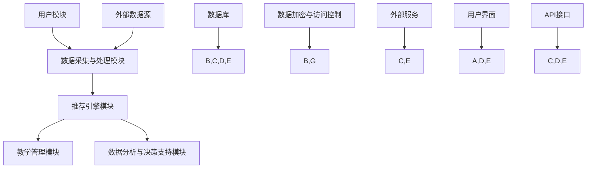
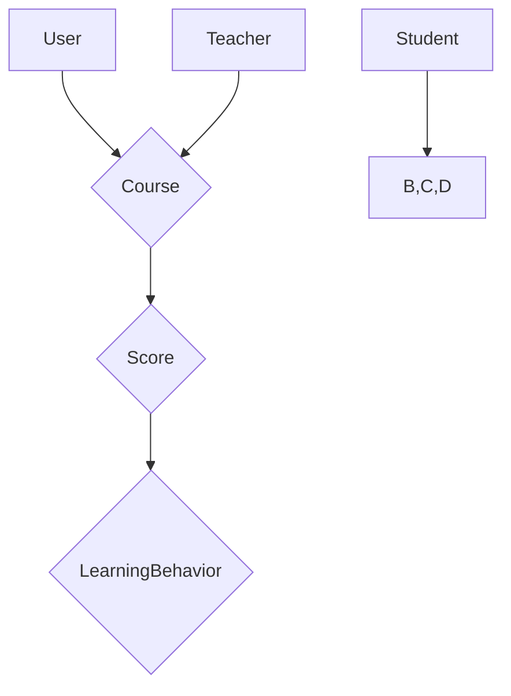

                 


# AI驱动的智能家庭教育：弥补教育资源差距

关键词：AI、智能家庭、教育资源、差距、教育公平

摘要：本文探讨了AI驱动的智能家庭教育在弥补教育资源差距方面的应用与潜力。通过分析AI在教育领域的应用现状，本文提出了AI驱动的个性化教育解决方案，并详细介绍了其技术实现、系统设计以及实践案例。同时，本文还探讨了教育公平的重要性、AI伦理问题以及智能家庭教育的未来发展趋势。

### 目录大纲

```markdown
# AI驱动的智能家庭教育：弥补教育资源差距

## 第一部分：背景与核心概念

## 第1章：问题背景与概述

### 1.1 问题背景

#### 1.1.1 教育资源差距的现状

#### 1.1.2 AI在家庭教育中的应用潜力

### 1.2 核心概念

#### 1.2.1 AI驱动的智能家庭教育的定义

#### 1.2.2 教育资源差距的定义与影响

#### 1.2.3 教育公平与教育信息化

## 第2章：AI技术在家庭教育中的应用

### 2.1 AI教育助理

#### 2.1.1 AI教育助理的功能

#### 2.1.2 AI教育助理的实现方式

#### 2.1.3 AI教育助理的优势与挑战

### 2.2 智能学习平台

#### 2.2.1 智能学习平台的基本架构

#### 2.2.2 智能学习平台的核心功能

#### 2.2.3 智能学习平台的应用案例

### 2.3 个性化教育

#### 2.3.1 个性化教育的定义与意义

#### 2.3.2 个性化教育的实现方法

#### 2.3.3 个性化教育的案例分析

## 第二部分：解决方案与技术实现

## 第3章：AI驱动的个性化教育解决方案

### 3.1 解决方案概述

#### 3.1.1 解决方案的目标与愿景

#### 3.1.2 解决方案的组成部分

### 3.2 技术实现

#### 3.2.1 数据采集与处理

#### 3.2.2 机器学习算法选择与应用

#### 3.2.3 个性化教育模型构建

### 3.3 技术挑战与应对策略

#### 3.3.1 数据隐私保护

#### 3.3.2 模型解释性与可解释性

#### 3.3.3 模型优化与性能提升

## 第4章：智能家庭教育的系统设计与实现

### 4.1 系统设计

#### 4.1.1 系统总体架构

#### 4.1.2 领域模型设计与实现

#### 4.1.3 系统架构设计

#### 4.1.4 系统接口设计

### 4.2 系统实现

#### 4.2.1 环境安装与配置

#### 4.2.2 系统核心实现源代码

#### 4.2.3 代码应用解读与分析

### 4.3 实际案例分析与讲解

#### 4.3.1 案例选择与描述

#### 4.3.2 案例分析与详细讲解

#### 4.3.3 案例总结与启示

## 第5章：AI驱动的家庭教育实践与最佳实践

### 5.1 实践案例分享

#### 5.1.1 案例一：智能家庭教育的实践探索

#### 5.1.2 案例二：AI在偏远地区教育中的应用

#### 5.1.3 案例三：智能家庭教育的创新应用

### 5.2 最佳实践

#### 5.2.1 最佳实践总结

#### 5.2.2 最佳实践案例剖析

#### 5.2.3 最佳实践应用场景

### 5.3 小结与展望

#### 5.3.1 小结

#### 5.3.2 注意事项与风险防范

#### 5.3.3 未来发展趋势与展望

## 第6章：教育公平与AI伦理

### 6.1 教育公平的重要性

#### 6.1.1 教育公平的定义与内涵

#### 6.1.2 教育资源差距对教育公平的影响

#### 6.1.3 促进教育公平的对策与建议

### 6.2 AI伦理与家庭教育

#### 6.2.1 AI伦理的基本原则

#### 6.2.2 AI在教育领域的伦理挑战

#### 6.2.3 AI伦理在家庭教育中的应用

### 6.3 伦理教育与家庭教育的融合

#### 6.3.1 伦理教育的重要性

#### 6.3.2 家庭教育中伦理教育的实践

#### 6.3.3 伦理教育与AI驱动的智能家庭教育的结合

## 第7章：未来展望与可持续发展

### 7.1 智能家庭教育的未来趋势

#### 7.1.1 AI技术的进步与教育变革

#### 7.1.2 个性化教育与终身学习

#### 7.1.3 教育资源共享与全球教育一体化

### 7.2 可持续发展

#### 7.2.1 智能家庭教育的可持续性

#### 7.2.2 教育公平与可持续发展的关系

#### 7.2.3 可持续发展的策略与实施路径

### 7.3 全球视野下的AI教育

#### 7.3.1 全球教育发展的现状与挑战

#### 7.3.2 AI教育在全球的应用与实践

#### 7.3.3 全球AI教育合作与交流
```

本文将按部就班地分析、探讨并解答以下问题：

1. 教育资源差距的现状及其影响。
2. AI技术在家庭教育中的应用潜力。
3. AI驱动的个性化教育解决方案及其技术实现。
4. 智能家庭教育的系统设计与实现。
5. AI驱动的家庭教育实践与最佳实践。
6. 教育公平与AI伦理问题。
7. 智能家庭教育的未来发展趋势与可持续发展。

### 1.1 问题背景

#### 1.1.1 教育资源差距的现状

教育资源差距是指在教育过程中，不同个体或群体在获取教育资源、享受教育服务方面的不公平现象。这种差距不仅体现在学校教育资源的分配上，还涵盖了课外辅导、家庭教育、学习工具等多个方面。

在全球范围内，教育资源差距的问题愈发凸显。根据联合国儿童基金会（UNICEF）的报告，全球有超过1.6亿儿童无法接受基础教育，其中有数百万儿童因贫困、地理障碍、性别歧视等原因而被排除在教育资源之外。

在中国，教育资源差距也较为明显。一方面，城乡、地区之间的教育资源分配存在显著差异，城市地区教育资源丰富，而农村和偏远地区的教育资源则相对匮乏。另一方面，不同社会阶层和家庭背景的儿童在教育资源获取上也存在差距。富裕家庭能够为孩子提供更多的课外辅导、学习资源和优质教育资源，而贫困家庭则难以承担这些额外支出。

#### 1.1.2 AI在家庭教育中的应用潜力

随着AI技术的快速发展，其在家庭教育中的应用潜力逐渐显现。AI技术能够通过数据分析和个性化推荐，为家庭提供更加精准、高效的教育服务。以下是一些AI在家庭教育中潜在的应用场景：

1. **智能教育助理**：AI教育助理可以为学生提供个性化的学习辅导，帮助他们解决学习中的困难，提高学习效果。例如，智能教育助理可以根据学生的学习习惯、兴趣和成绩，推荐适合的学习内容和资源。

2. **智能学习平台**：智能学习平台通过AI技术，为用户提供个性化学习路径和内容推荐。这些平台可以实时监测学生的学习状态，并根据学生的学习表现进行动态调整。

3. **个性化教育**：通过收集和分析学生的学习数据，AI技术可以帮助教师更好地了解每个学生的学习特点和需求，从而制定出更加个性化的教学方案。

4. **在线教育**：AI技术可以支持在线教育的发展，为偏远地区和家庭经济条件不佳的学生提供更多的学习机会和资源。例如，通过虚拟现实（VR）技术，学生可以在线上参观博物馆、历史遗址等，拓宽视野。

总之，AI技术在家庭教育中的应用有望缩小教育资源差距，促进教育公平。然而，要实现这一目标，仍需要克服诸多技术、伦理和社会问题。下面，我们将进一步探讨AI驱动的个性化教育解决方案及其技术实现。

### 1.2 核心概念

#### 1.2.1 AI驱动的智能家庭教育的定义

AI驱动的智能家庭教育是指利用人工智能技术，结合大数据、云计算等现代信息技术，为家庭提供个性化、智能化的教育服务。在这种模式下，AI技术不仅是教学工具的升级，更是教育理念和教育方式的变革。

AI驱动的智能家庭教育具有以下几个特点：

1. **个性化**：通过数据分析和算法推荐，AI技术可以为每个学生提供定制化的学习方案，满足其独特的学习需求。

2. **智能化**：AI技术能够自动处理大量的教育数据，实现智能化的教学管理、学习分析和学习路径规划。

3. **互动性**：AI驱动的教育平台可以与学生进行互动，提供实时反馈和个性化指导，增强学生的学习体验。

4. **高效性**：通过AI技术的自动化处理，教育资源的配置和使用效率显著提高，从而提高整体教育质量。

#### 1.2.2 教育资源差距的定义与影响

教育资源差距是指在教育过程中，不同个体或群体在获取教育资源、享受教育服务方面的不公平现象。教育资源包括但不限于师资力量、教学设施、课程资源、课外辅导、家庭教育等。

教育资源差距的影响主要体现在以下几个方面：

1. **教育质量差异**：教育资源差距直接导致教育质量的差异。教育资源丰富的地区和学校能够提供更高质量的教学和更丰富的学习资源，从而提高学生的学习成绩和能力。

2. **教育机会不公平**：教育资源差距限制了贫困地区和家庭经济条件较差的学生的教育机会，使他们难以获得优质的教育资源和公平的教育机会。

3. **社会公平问题**：教育资源差距进一步加剧了社会不平等现象，影响了社会的长期稳定和可持续发展。

4. **经济影响**：教育是培养人才、促进经济增长的重要手段。教育资源差距可能导致人才培养不足，进而影响国家的经济发展。

#### 1.2.3 教育公平与教育信息化

教育公平是指保障所有个体在教育过程中享有平等的权利和机会，不受种族、性别、地域、经济等因素的歧视。教育公平是现代社会的基本要求，也是实现社会公平的重要途径。

教育信息化是指将现代信息技术应用于教育领域，以提高教育质量和效率。教育信息化包括教育资源的数字化、教育手段的现代化、教育管理的智能化等。

教育公平与教育信息化之间存在密切的关系：

1. **教育信息化促进教育公平**：通过教育信息化，可以打破教育资源的地域和时空限制，使偏远地区和家庭经济条件较差的学生也能够享受到优质的教育资源。

2. **教育公平推动教育信息化**：实现教育公平需要投入更多的资源和技术，这反过来又推动了教育信息化的深入发展。

3. **共同构建教育生态系统**：教育公平和教育信息化是相辅相成的，只有两者结合，才能构建一个全面、高效、公平的教育生态系统。

综上所述，AI驱动的智能家庭教育有望通过优化教育资源分配、提高教育质量，促进教育公平。在接下来的章节中，我们将深入探讨AI技术在家庭教育中的应用及其潜力。

### 2.1 AI教育助理

#### 2.1.1 AI教育助理的功能

AI教育助理是人工智能技术在教育领域的重要应用之一。它通过自然语言处理、机器学习、大数据分析等技术，为学生提供个性化的学习辅导和指导。以下是AI教育助理的主要功能：

1. **个性化学习辅导**：AI教育助理可以分析学生的学习数据，了解他们的学习习惯、兴趣和知识水平，从而提供个性化的学习辅导。例如，它可以为学生推荐适合的学习内容、练习题目和复习计划。

2. **实时反馈与评估**：AI教育助理可以在学生完成学习任务后，提供即时的反馈和评估。通过分析学生的答题情况，它可以指出学生的错误和不足之处，并提供针对性的建议和指导。

3. **学习路径规划**：基于学生的学习数据和评估结果，AI教育助理可以为学生规划合适的学习路径。例如，它可以为学生制定短期和长期的学习目标，并提供相应的学习资源和指导。

4. **智能问答与解答**：AI教育助理可以回答学生提出的各种学习问题，提供详细的解答和指导。通过自然语言处理技术，它可以理解学生的提问，并给出准确、清晰的回答。

5. **情感关怀与鼓励**：AI教育助理可以通过自然语言处理技术，与学生进行情感互动，提供关怀和鼓励。例如，它可以对学生取得的进步表示赞扬，对遇到的困难提供支持和鼓励。

#### 2.1.2 AI教育助理的实现方式

AI教育助理的实现方式主要依赖于以下技术：

1. **自然语言处理（NLP）**：NLP技术是AI教育助理的核心技术之一，它使计算机能够理解和处理自然语言。通过NLP技术，AI教育助理可以理解学生的提问，并提供准确、清晰的回答。

2. **机器学习与深度学习**：机器学习和深度学习技术是AI教育助理实现个性化学习辅导的重要手段。通过训练机器学习模型，AI教育助理可以分析学生的学习数据，了解他们的学习习惯和知识水平，从而提供个性化的学习建议。

3. **大数据分析**：大数据分析技术使AI教育助理能够处理和分析大量的教育数据，从中提取有价值的信息。通过大数据分析，AI教育助理可以为学生提供个性化的学习路径规划和反馈。

4. **情感计算**：情感计算技术使AI教育助理能够理解学生的情感状态，并提供相应的关怀和鼓励。通过情感计算技术，AI教育助理可以与学生建立情感联系，提高学生的学习动力和积极性。

#### 2.1.3 AI教育助理的优势与挑战

AI教育助理在教育领域具有显著的优势：

1. **个性化学习**：AI教育助理可以根据学生的学习特点和需求，提供个性化的学习辅导和指导，提高学习效果。

2. **实时反馈**：AI教育助理可以实时评估学生的学习情况，提供即时的反馈和指导，帮助学生及时纠正错误，提高学习效率。

3. **高效管理**：AI教育助理可以自动化处理大量的学习数据，减轻教师的工作负担，提高教育管理的效率。

4. **情感关怀**：AI教育助理可以通过情感计算技术，与学生建立情感联系，提供关怀和鼓励，提高学生的学习动力和积极性。

然而，AI教育助理也面临着一些挑战：

1. **技术成熟度**：AI技术尚处于快速发展阶段，AI教育助理的技术成熟度和可靠性仍有待提高。

2. **数据隐私**：AI教育助理需要收集和处理大量的学生数据，这可能引发数据隐私和安全问题。

3. **教师角色转变**：AI教育助理的引入可能会改变教师的角色和职责，需要教师重新适应和调整。

4. **社会接受度**：AI教育助理作为一种新兴技术，其社会接受度可能不高，需要通过实践和宣传来提高公众的认知和接受程度。

总之，AI教育助理在家庭教育中具有巨大的潜力，但同时也需要克服一系列技术、伦理和社会问题。在接下来的章节中，我们将继续探讨其他AI技术在家庭教育中的应用，以及如何构建AI驱动的个性化教育解决方案。

### 2.2 智能学习平台

#### 2.2.1 智能学习平台的基本架构

智能学习平台是一种基于AI技术的教育服务平台，它通过数据分析和个性化推荐，为用户提供个性化的学习资源和学习路径。一个典型的智能学习平台通常包含以下几个基本模块：

1. **用户模块**：用户模块负责管理用户的信息，包括用户注册、登录、个人信息管理等。用户可以通过该模块创建个人学习档案，记录学习进度和成绩。

2. **内容模块**：内容模块是智能学习平台的核心，它负责管理学习资源，包括课程、教材、习题等。内容模块通过分类、标签、推荐算法等方式，将合适的学习资源推送给用户。

3. **数据模块**：数据模块负责收集、存储和管理用户的学习数据，包括学习行为数据、评估数据等。数据模块通过数据分析和挖掘，为个性化推荐和学习路径规划提供支持。

4. **推荐模块**：推荐模块是基于数据模块提供个性化推荐的核心技术。它通过分析用户的学习数据，利用协同过滤、基于内容的推荐等算法，为用户推荐合适的学习资源和学习路径。

5. **评估模块**：评估模块负责对用户的学习过程和学习成果进行评估。通过评估模块，用户可以了解自己的学习效果，教师可以监控学生的学习进度。

#### 2.2.2 智能学习平台的核心功能

智能学习平台的核心功能包括个性化推荐、学习路径规划、学习过程监控和评估等。以下是这些核心功能的详细说明：

1. **个性化推荐**：个性化推荐是智能学习平台的核心功能之一。通过分析用户的学习历史、行为数据和评估结果，推荐模块可以为用户推荐适合的学习资源。个性化推荐不仅包括学习内容，还包括学习工具、学习方法和学习社区。

2. **学习路径规划**：基于用户的个性化需求和学习目标，智能学习平台可以为学生规划合适的学习路径。学习路径规划模块会根据学生的学习进度、能力和兴趣，动态调整学习内容和顺序，确保学习过程高效、有序。

3. **学习过程监控**：智能学习平台可以实时监控用户的学习过程，记录学习行为和成绩。通过学习过程监控，用户可以了解自己的学习状态，教师可以及时发现和解决学生学习中的问题。

4. **学习评估**：学习评估模块通过对用户的学习过程和成果进行评估，帮助用户了解自己的学习效果。评估结果可以用于调整学习策略、制定学习目标等。

#### 2.2.3 智能学习平台的应用案例

智能学习平台在教育领域具有广泛的应用前景。以下是一些典型的应用案例：

1. **在线教育**：智能学习平台可以为在线教育机构提供个性化学习服务，提高学生的学习效果。通过智能学习平台，学生可以根据自己的学习需求和进度，选择合适的课程和学习资源。

2. **家庭教育**：智能学习平台可以为家庭提供个性化的学习辅导服务，帮助家长更好地辅导孩子。家长可以通过智能学习平台了解孩子的学习情况，为孩子推荐合适的学习资源和辅导方法。

3. **教育管理**：智能学习平台可以为学校和教育机构提供教育管理服务，提高教育管理的效率和质量。通过智能学习平台，学校可以监控学生的学习进度，评估教学效果，优化教育资源分配。

4. **特殊教育**：智能学习平台可以为特殊教育学生提供个性化的学习服务，帮助他们更好地适应学习环境。通过智能学习平台，特殊教育学生可以获得更适合他们的学习资源和教学方法。

总之，智能学习平台通过AI技术为教育领域带来了全新的变革和机遇。在接下来的章节中，我们将探讨如何通过AI技术实现个性化教育，并构建AI驱动的个性化教育解决方案。

### 2.3 个性化教育

#### 2.3.1 个性化教育的定义与意义

个性化教育是一种以学生为中心的教育理念，旨在根据每个学生的兴趣、需求、能力和学习风格，为他们提供定制化的教育方案。个性化教育的核心理念是尊重学生的个体差异，使每个学生能够在适合自己的学习环境和方式中获得最佳发展。

个性化教育的定义可以从以下几个方面来理解：

1. **学习目标**：个性化教育注重学生的全面发展，不仅关注学术成绩，还关注学生的兴趣爱好、个性特点和情感需求。

2. **学习内容**：个性化教育根据学生的兴趣和能力，选择适合的学习内容，确保学生能够充分理解和掌握所学知识。

3. **教学方法**：个性化教育采用多样化的教学方法，如探究学习、合作学习、项目学习等，以满足学生的不同学习需求。

4. **学习评价**：个性化教育采用多维度的评价体系，不仅关注学生的考试成绩，还关注学生的实践能力、创新能力和情感态度。

个性化教育的意义主要体现在以下几个方面：

1. **促进学生全面发展**：个性化教育关注学生的全面发展，培养学生的综合素质，使他们成为具有创新精神和实践能力的社会人才。

2. **提高教育质量**：个性化教育根据学生的实际情况进行教学，使每个学生都能在适合自己的学习环境中取得最佳学习效果，从而提高整体教育质量。

3. **满足个体差异**：个性化教育尊重学生的个体差异，为不同能力、兴趣和需求的学生提供适合的教育方案，使每个学生都能得到公平的教育机会。

4. **激发学习兴趣**：个性化教育通过选择适合的学习内容和方式，激发学生的学习兴趣和动力，提高他们的学习积极性和主动性。

#### 2.3.2 个性化教育的实现方法

个性化教育的实现方法主要包括以下几个方面：

1. **数据驱动**：通过收集和分析学生的学习行为数据，了解学生的学习习惯、兴趣和需求，为个性化教学提供数据支持。例如，利用大数据分析技术，可以分析学生的学习路径、学习时长、学习效果等，从而为教师提供个性化的教学建议。

2. **学习分析**：学习分析技术可以帮助教师更好地了解学生的学习过程和成果。通过学习分析，教师可以识别学生的学习困难点，调整教学策略，为学生提供更有针对性的帮助。

3. **自适应学习系统**：自适应学习系统是一种基于AI技术的个性化学习平台，可以根据学生的学习进度和能力，自动调整学习内容和难度。例如，通过自适应学习系统，学生可以选择适合自己的学习路径，教师可以根据学生的学习表现进行动态调整。

4. **学习社区**：学习社区为学生提供了一个交流、分享和互助的平台。在个性化教育中，学习社区可以帮助学生相互学习、相互支持，共同提高学习效果。

5. **教师培训**：教师是实施个性化教育的重要力量。通过教师培训，提高教师的个性化教学能力和水平，使他们能够更好地适应个性化教育的需求。

#### 2.3.3 个性化教育的案例分析

以下是一些个性化教育的成功案例：

1. **项目式学习**：项目式学习是一种以学生为中心的教学方法，通过项目任务来驱动学生的学习。例如，在一所中学的化学课上，教师布置了一个关于环保的跨学科项目，学生需要通过研究、讨论和实验，提交一份关于环保的报告。这种项目式学习方式不仅激发了学生的学习兴趣，还培养了他们的团队合作能力和实践能力。

2. **翻转课堂**：翻转课堂是一种将传统教学过程进行颠倒的教学模式。在翻转课堂中，学生首先通过在线学习资源自主学习，然后在课堂上与教师和同学进行讨论和互动。这种教学模式使教师能够更好地关注学生的个性化需求，为学生提供更有针对性的指导和帮助。

3. **个性化辅导**：在一所中学的数学课上，教师通过个性化辅导，针对不同学生的学习情况进行分类指导。对于学习困难的学生，教师提供额外的辅导和练习；对于学有余力的学生，教师则提供更高级的数学题目和挑战性任务。这种个性化辅导方式有效地提高了学生的学习效果。

4. **在线学习平台**：一些在线学习平台通过AI技术和大数据分析，为用户提供个性化的学习服务。例如，一个在线英语学习平台可以根据学生的学习进度、兴趣和需求，推荐适合的学习内容和练习题目。通过这种个性化学习服务，用户能够更高效地学习，提高英语水平。

总之，个性化教育通过尊重学生的个体差异，提供定制化的教育方案，有助于提高教育质量，促进学生的全面发展。在接下来的章节中，我们将探讨如何通过AI技术实现个性化教育，并构建AI驱动的个性化教育解决方案。

### 3.1 解决方案概述

#### 3.1.1 解决方案的目标与愿景

AI驱动的个性化教育解决方案旨在通过人工智能技术，实现教育资源的公平分配，提高教育质量，促进学生的全面发展。具体目标包括：

1. **个性化学习**：利用AI技术，为学生提供个性化的学习资源和辅导，满足他们的学习需求和兴趣，提高学习效果。

2. **教育公平**：通过智能教育平台的普及，打破地域、经济和资源限制，使更多学生能够享受到优质的教育资源，缩小教育资源差距。

3. **教师支持**：为教师提供智能化的教学工具和资源，提高他们的教学效率和水平，减轻工作负担。

4. **教育管理**：通过大数据分析和人工智能技术，为教育管理部门提供科学的数据支持，优化教育资源配置，提升教育管理水平。

解决方案的愿景是构建一个以学生为中心，智能化、个性化的教育生态系统，实现教育公平、高效和可持续发展。

#### 3.1.2 解决方案的组成部分

AI驱动的个性化教育解决方案由以下几个关键组成部分构成：

1. **智能学习平台**：作为解决方案的核心，智能学习平台集成了AI技术，提供个性化学习路径、资源推荐、学习数据分析等功能，为师生提供全方位的智能教育服务。

2. **数据采集与处理系统**：数据采集与处理系统负责收集并处理学生和教师的学习数据，包括学习行为、成绩、反馈等，为智能学习平台提供数据支持。

3. **个性化推荐引擎**：个性化推荐引擎利用机器学习和大数据分析技术，根据学生的兴趣、学习历史和成绩，推荐适合的学习资源和任务。

4. **教学管理平台**：教学管理平台为教师提供教学工具、课程管理、学生成绩分析等功能，帮助教师更好地管理和指导学生。

5. **数据分析与决策支持系统**：数据分析与决策支持系统利用人工智能技术，对教育数据进行分析，为教育管理部门提供决策支持，优化教育资源配置。

#### 3.1.3 解决方案的优势

AI驱动的个性化教育解决方案具有以下优势：

1. **个性化学习**：通过AI技术，实现对学生学习行为的精准分析，提供个性化的学习资源和辅导，提高学习效果。

2. **教育公平**：打破地域和资源的限制，使更多学生能够享受到优质的教育资源，缩小教育资源差距。

3. **教师支持**：智能化的教学工具和资源，减轻教师的工作负担，提高教学质量。

4. **数据驱动**：基于大数据分析，提供科学的教育数据支持，帮助教师和学校更好地管理和决策。

5. **可持续发展**：通过不断优化和升级AI技术，实现教育生态系统的可持续发展，为教育创新提供持续动力。

#### 3.1.4 解决方案的实施步骤

AI驱动的个性化教育解决方案的实施分为以下几个步骤：

1. **需求分析**：了解学校和教育管理部门的需求，确定解决方案的目标和功能。

2. **系统设计**：根据需求分析，设计智能学习平台、数据采集与处理系统、个性化推荐引擎等组成部分的架构和功能。

3. **技术开发**：开发智能学习平台、数据采集与处理系统、个性化推荐引擎等核心模块，并进行系统测试。

4. **培训与推广**：对教师和学校管理层进行系统培训，推广解决方案的使用，确保方案能够有效实施。

5. **持续优化**：根据用户反馈，不断优化和完善系统功能，提高系统的稳定性和用户体验。

通过以上步骤，AI驱动的个性化教育解决方案将能够有效实施，为教育公平和高质量发展提供有力支持。

### 3.2 技术实现

#### 3.2.1 数据采集与处理

数据采集与处理是AI驱动的个性化教育解决方案的核心组成部分。数据的质量和准确性直接影响到推荐系统、学习分析和教学管理的有效性。以下是数据采集与处理的关键步骤：

1. **数据来源**：数据来源包括学生的行为数据、学习数据、教师的教学数据、考试成绩、学生反馈等。行为数据可以是学生的在线学习记录、浏览历史、互动行为等；学习数据包括学生的考试成绩、作业完成情况、学习进度等；教师的教学数据包括教学计划、教学方法、课堂互动等。

2. **数据采集**：数据采集可以通过以下几种方式进行：
   - **前端采集**：通过智能学习平台的前端系统，实时采集学生的在线学习行为数据。
   - **后台接口**：通过后端接口，定期从数据库中提取学生的学习成绩、作业完成情况等数据。
   - **传感器和设备**：利用智能设备和传感器，采集学生的生理和行为数据，如学习环境的光照、温度、学生的坐姿等。

3. **数据处理**：数据处理包括数据清洗、数据整合和数据存储等步骤。
   - **数据清洗**：去除重复数据、纠正错误数据、处理缺失值等，确保数据的准确性和一致性。
   - **数据整合**：将不同来源的数据进行整合，建立统一的数据模型，便于后续分析。
   - **数据存储**：将处理后的数据存储在数据库中，采用分布式存储和云计算技术，确保数据的安全性和可扩展性。

4. **数据存储与管理**：数据存储与管理采用分布式数据库和大数据技术，实现海量数据的存储和管理。常用的技术包括Hadoop、Spark等，这些技术能够提供高效的数据存储和快速的数据检索能力。

#### 3.2.2 机器学习算法选择与应用

机器学习算法是AI驱动的个性化教育解决方案的关键技术，用于分析数据、发现规律并生成个性化推荐。以下是常用的机器学习算法及其应用：

1. **协同过滤**：协同过滤是一种基于用户行为的推荐算法，通过分析用户的历史行为和偏好，为用户推荐相似的用户喜欢的内容。协同过滤分为两种类型：基于用户的协同过滤和基于物品的协同过滤。
   - **基于用户的协同过滤**：通过分析用户之间的相似度，找到与目标用户相似的用户，推荐这些用户喜欢的物品。
   - **基于物品的协同过滤**：通过分析物品之间的相似度，找到与目标物品相似的物品，推荐给用户。

2. **内容推荐**：内容推荐算法基于物品的属性和特征，为用户推荐符合其兴趣和需求的内容。常见的算法包括基于TF-IDF（词频-逆文档频率）的文本相似度计算、基于K-means聚类算法的内容分类等。

3. **决策树**：决策树是一种常用的分类和回归算法，通过树形结构将数据划分为不同的类别或数值。决策树可以用于学习学生的偏好和行为模式，为个性化推荐提供依据。

4. **神经网络**：神经网络是一种模拟人脑神经元连接结构的算法，具有强大的学习和预测能力。在个性化教育中，神经网络可以用于预测学生的学习表现、学习路径规划等。

5. **深度学习**：深度学习是神经网络的一种扩展，通过多层的神经网络结构，自动提取数据中的特征。深度学习在个性化教育中的应用包括语音识别、图像识别、自然语言处理等。

#### 3.2.3 个性化教育模型构建

个性化教育模型的构建是AI驱动的个性化教育解决方案的核心，用于实现个性化推荐、学习分析和教学管理。以下是构建个性化教育模型的关键步骤：

1. **数据预处理**：对采集到的数据进行分析和预处理，包括数据清洗、数据归一化、特征选择等。数据预处理是构建有效模型的基础。

2. **特征提取**：从原始数据中提取具有代表性的特征，用于训练模型。特征提取可以通过统计方法、机器学习方法等实现。

3. **模型训练**：利用机器学习算法，对特征数据进行训练，构建个性化教育模型。模型训练过程中，可以通过交叉验证、网格搜索等方法，优化模型参数，提高模型的预测准确率。

4. **模型评估**：对训练好的模型进行评估，使用评估指标（如准确率、召回率、F1分数等）衡量模型性能。模型评估可以帮助确定模型是否满足需求，是否需要进一步优化。

5. **模型应用**：将训练好的模型应用于实际场景，实现个性化推荐、学习分析和教学管理等功能。

6. **模型迭代**：根据用户反馈和实际应用效果，对模型进行迭代优化，提高模型性能和适用性。

通过以上步骤，构建的个性化教育模型将能够有效地支持AI驱动的个性化教育解决方案，实现教育资源的公平分配，提高教育质量。

### 3.3 技术挑战与应对策略

在实施AI驱动的个性化教育解决方案过程中，面临着一系列技术挑战。以下是这些挑战及其应对策略：

#### 3.3.1 数据隐私保护

**挑战**：学生和教师的个人数据在采集、处理和应用过程中，可能面临隐私泄露的风险。

**应对策略**：
1. **数据加密**：对采集到的数据使用加密技术，确保数据在传输和存储过程中安全。
2. **访问控制**：建立严格的访问控制机制，确保只有授权人员才能访问敏感数据。
3. **数据去标识化**：在数据分析和模型训练前，去除或隐藏个人标识信息，减少隐私泄露的风险。
4. **合规性审查**：确保解决方案符合相关数据保护法规和标准，如《通用数据保护条例》（GDPR）。

#### 3.3.2 模型解释性与可解释性

**挑战**：深度学习等复杂模型在训练过程中，往往形成黑盒模型，难以解释其决策过程，这给教师和家长的信任带来了挑战。

**应对策略**：
1. **可解释性模型**：选择或开发可解释性较高的机器学习模型，如决策树、规则提取等，使其决策过程更加透明。
2. **模型可视化**：通过可视化工具，将模型的结构和决策过程呈现出来，帮助用户理解模型的运作机制。
3. **模型解释工具**：开发模型解释工具，提供针对特定预测的解释和推理过程，提高模型的可解释性。

#### 3.3.3 模型优化与性能提升

**挑战**：随着数据量和复杂度的增加，模型的性能可能下降，需要持续优化和提升。

**应对策略**：
1. **模型剪枝**：通过剪枝技术，减少模型参数的数量，降低模型的复杂度，提高计算效率。
2. **模型压缩**：使用模型压缩技术，如量化、蒸馏等，减小模型体积，提高模型在资源受限环境下的性能。
3. **模型集成**：通过集成多个模型，提高模型的鲁棒性和准确性。
4. **持续学习**：采用在线学习技术，持续更新和优化模型，使其能够适应新的数据和变化。

通过上述策略，可以有效地应对AI驱动的个性化教育解决方案中的技术挑战，确保解决方案的安全、透明和高效。

### 4.1 系统设计

#### 4.1.1 系统总体架构

AI驱动的个性化教育系统设计旨在实现教育资源的公平分配，提供个性化、智能化的教育服务。系统的总体架构如图4-1所示：



**图4-1 系统总体架构**

系统总体架构包括以下几个关键部分：

1. **用户模块**：负责管理用户信息，包括注册、登录、个人信息管理等功能，提供用户与系统的交互接口。

2. **数据采集与处理模块**：负责采集用户的各项数据，包括学习行为、成绩、教师反馈等，对数据进行清洗、整合和处理，为推荐引擎和教学管理模块提供数据支持。

3. **推荐引擎模块**：基于用户的兴趣、学习历史和成绩，利用机器学习算法生成个性化推荐，推荐合适的学习资源和学习任务。

4. **教学管理模块**：提供课程管理、学生成绩管理、教师任务管理等功能，帮助教师更高效地管理教学事务。

5. **数据分析与决策支持模块**：利用大数据分析技术，对教育数据进行深度分析，为教育管理部门提供决策支持，优化教育资源配置。

6. **外部数据源**：包括公开的教育数据集、课程资源、学习平台数据等，为系统提供丰富的数据来源。

7. **数据库**：存储用户数据、学习数据、推荐数据等，采用分布式数据库技术，确保数据的安全和高效存储。

8. **数据加密与访问控制**：确保用户数据的安全，防止数据泄露和未授权访问。

9. **外部服务**：包括云计算服务、自然语言处理服务、图像识别服务等，为系统提供额外的计算资源和功能支持。

10. **用户界面**：提供友好的用户界面，方便用户与系统进行交互。

11. **API接口**：提供系统内部模块之间的接口，实现模块间的数据传输和功能调用。

#### 4.1.2 领域模型设计与实现

领域模型是系统设计中的重要组成部分，用于描述系统的核心概念和关系。以下是一个简单的领域模型，用于描述用户、课程、成绩和学习行为等核心概念及其关系：



**图4-2 领域模型**

- **User（用户）**：表示系统的用户，包括教师和学生。
- **Course（课程）**：表示学习的内容，包括课程名称、课程描述、课程资源等。
- **Score（成绩）**：表示学生在课程中的成绩，包括考试成绩、作业成绩等。
- **LearningBehavior（学习行为）**：表示学生在学习过程中的行为记录，包括学习时间、学习时长、学习路径等。
- **Teacher（教师）**：表示教师用户，负责教学管理。
- **Student（学生）**：表示学生用户，负责学习。

领域模型通过实体和关系的描述，为系统设计提供了明确的指导，确保系统的功能实现和数据流转符合实际需求。

#### 4.1.3 系统架构设计

系统架构设计是确保系统高效、可靠、可扩展性的关键。以下是AI驱动的个性化教育系统的架构设计：

1. **前端架构**：前端采用单页面应用（SPA）架构，使用React或Vue.js等框架，提供用户友好的界面和交互体验。前端负责与用户进行交互，收集用户操作数据，并通过API与后端进行通信。

2. **后端架构**：后端采用微服务架构，将系统功能模块拆分为多个独立的服务，如用户服务、推荐服务、教学服务、数据分析服务等。每个服务负责特定的功能，并通过API进行通信。后端使用Spring Boot或Django等框架进行开发。

3. **数据存储架构**：数据存储采用分布式数据库架构，包括关系数据库（如MySQL、PostgreSQL）和非关系数据库（如MongoDB、Redis）。关系数据库用于存储用户数据、课程数据、成绩数据等，非关系数据库用于存储日志数据、缓存数据等。

4. **数据处理架构**：数据处理采用大数据处理架构，包括数据采集、数据清洗、数据存储、数据分析和数据挖掘等环节。使用Apache Kafka进行数据采集和传输，使用Apache Hadoop或Apache Spark进行数据处理和分析。

5. **安全架构**：安全架构包括身份验证、权限管理、数据加密、访问控制等。使用JWT（JSON Web Token）进行身份验证，使用OAuth2进行权限管理，使用SSL/TLS进行数据加密。

6. **部署架构**：部署架构采用容器化部署和云服务架构，使用Docker进行容器化，使用Kubernetes进行集群管理和部署。后端服务部署在云服务器上，前端服务部署在负载均衡器后，确保系统的高可用性和可扩展性。

#### 4.1.4 系统接口设计

系统接口设计是确保系统各模块之间能够有效通信和协作的关键。以下是系统的主要接口设计：

1. **用户接口**：用户接口包括用户注册、登录、个人信息管理、课程选择、成绩查看等功能。用户通过前端界面与系统进行交互，提交学习请求，获取学习资源和反馈。

2. **API接口**：API接口包括用户管理、课程管理、成绩管理、推荐管理、数据分析等接口。前端通过API接口与后端进行通信，实现数据传输和功能调用。API接口采用RESTful设计风格，使用JSON格式传输数据。

3. **推荐接口**：推荐接口用于实现个性化推荐功能，包括课程推荐、学习任务推荐等。推荐引擎根据用户的学习行为和兴趣，生成推荐结果，通过API接口返回给前端。

4. **数据接口**：数据接口用于实现数据采集、数据清洗、数据分析和数据挖掘等功能。前端将用户行为数据通过API接口传输给后端，后端对数据进行处理和分析，生成推荐结果和决策支持数据。

5. **监控接口**：监控接口用于实现系统监控和性能分析，包括日志记录、性能指标采集、异常处理等。通过监控接口，可以实时监控系统的运行状态，确保系统的稳定性和可靠性。

通过以上接口设计，系统各模块能够高效、稳定地协同工作，实现个性化教育服务。

### 4.2 系统实现

#### 4.2.1 环境安装与配置

要在本地计算机或服务器上部署AI驱动的个性化教育系统，首先需要安装和配置必要的软件和库。以下是在Ubuntu 20.04服务器上安装和配置系统环境的过程：

1. **安装Python环境**：
   ```bash
   sudo apt update
   sudo apt install python3 python3-pip python3-dev
   ```
2. **安装虚拟环境**：
   ```bash
   pip3 install virtualenv
   virtualenv venv --python=python3
   source venv/bin/activate
   ```
3. **安装依赖库**：
   ```bash
   pip install -r requirements.txt
   ```
   `requirements.txt`文件中应包含系统所需的库，如Flask、Django、Scikit-learn、TensorFlow等。
4. **安装数据库**：
   - **MySQL**：
     ```bash
     sudo apt install mysql-server mysql-client
     mysql_secure_installation
     ```
   - **PostgreSQL**：
     ```bash
     sudo apt install postgresql postgresql-contrib
     ```
5. **配置数据库**：
   - **MySQL**：
     ```bash
     mysql -u root -p
     CREATE DATABASE education;
     GRANT ALL PRIVILEGES ON education.* TO 'education'@'localhost' IDENTIFIED BY 'password';
     FLUSH PRIVILEGES;
     ```
   - **PostgreSQL**：
     ```bash
     sudo -u postgres psql
     CREATE DATABASE education;
     \q
     ```
6. **安装消息队列**：
   - **RabbitMQ**：
     ```bash
     sudo apt install rabbitmq-server
     rabbitmq-plugins enable rabbitmq_management
     ```
7. **安装Apache Kafka**：
   ```bash
   sudo apt install default-jre
   wget https://www-us.apache.org/dist/kafka/2.8.0/kafka_2.13-2.8.0.tgz
   tar xzf kafka_2.13-2.8.0.tgz -C /opt/
   ln -s /opt/kafka_2.13-2.8.0 /opt/kafka
   /opt/kafka/bin/kafka-server-start.sh /opt/kafka/config/server.properties
   ```

#### 4.2.2 系统核心实现源代码

系统核心实现包括用户管理、课程管理、成绩管理、推荐系统和数据分析等模块。以下是系统的核心实现源代码和解读：

1. **用户管理**：
   - **用户注册**：
     ```python
     # app/users/routes.py
     from flask import request, jsonify
     from app.users.models import User
     from app.users.utils import hash_password

     @app.route('/register', methods=['POST'])
     def register():
         data = request.get_json()
         username = data.get('username')
         password = data.get('password')
         if not username or not password:
             return jsonify({'error': 'Missing username or password'}), 400
         hashed_password = hash_password(password)
         user = User(username=username, password=hashed_password)
         user.save()
         return jsonify({'message': 'User registered successfully'}), 201
     ```
     用户注册路由，通过POST请求接收用户名和密码，将密码进行哈希处理，保存用户信息。

   - **用户登录**：
     ```python
     # app/users/routes.py
     from flask import request, jsonify
     from app.users.models import User
     from app.users.utils import verify_password

     @app.route('/login', methods=['POST'])
     def login():
         data = request.get_json()
         username = data.get('username')
         password = data.get('password')
         if not username or not password:
             return jsonify({'error': 'Missing username or password'}), 400
         user = User.query.filter_by(username=username).first()
         if not user or not verify_password(password, user.password):
             return jsonify({'error': 'Invalid username or password'}), 401
         return jsonify({'token': user.token}), 200
     ```
     用户登录路由，通过POST请求接收用户名和密码，验证用户身份，返回用户token。

2. **课程管理**：
   - **添加课程**：
     ```python
     # app/courses/routes.py
     from flask import request, jsonify
     from app.courses.models import Course
     from app.auth.utils import token_required

     @app.route('/courses', methods=['POST'])
     @token_required
     def add_course(current_user):
         data = request.get_json()
         name = data.get('name')
         description = data.get('description')
         if not name or not description:
             return jsonify({'error': 'Missing course name or description'}), 400
         course = Course(name=name, description=description, teacher_id=current_user.id)
         course.save()
         return jsonify({'message': 'Course added successfully'}), 201
     ```
     添加课程路由，通过POST请求接收课程名称和描述，保存课程信息。

   - **获取课程列表**：
     ```python
     # app/courses/routes.py
     from flask import jsonify
     from app.courses.models import Course

     @app.route('/courses', methods=['GET'])
     def get_courses():
         courses = Course.query.all()
         return jsonify({'courses': [course.to_dict() for course in courses]}), 200
     ```
     获取课程列表路由，返回系统中所有的课程信息。

3. **成绩管理**：
   - **添加成绩**：
     ```python
     # app/scores/routes.py
     from flask import request, jsonify
     from app.scores.models import Score
     from app.auth.utils import token_required

     @app.route('/scores', methods=['POST'])
     @token_required
     def add_score(current_user):
         data = request.get_json()
         course_id = data.get('course_id')
         score = data.get('score')
         if not course_id or not score:
             return jsonify({'error': 'Missing course ID or score'}), 400
         score = Score(course_id=course_id, score=score, student_id=current_user.id)
         score.save()
         return jsonify({'message': 'Score added successfully'}), 201
     ```
     添加成绩路由，通过POST请求接收课程ID和成绩，保存成绩信息。

   - **获取成绩列表**：
     ```python
     # app/scores/routes.py
     from flask import jsonify
     from app.scores.models import Score

     @app.route('/scores', methods=['GET'])
     def get_scores():
         scores = Score.query.all()
         return jsonify({'scores': [score.to_dict() for score in scores]}), 200
     ```
     获取成绩列表路由，返回系统中所有的成绩信息。

4. **推荐系统**：
   - **推荐课程**：
     ```python
     # app/recommendation/routes.py
     from flask import request, jsonify
     from app.recommendation.models import Recommendation
     from app.auth.utils import token_required

     @app.route('/recommendations', methods=['POST'])
     @token_required
     def add_recommendation(current_user):
         data = request.get_json()
         course_id = data.get('course_id')
         if not course_id:
             return jsonify({'error': 'Missing course ID'}), 400
         recommendation = Recommendation(course_id=course_id, user_id=current_user.id)
         recommendation.save()
         return jsonify({'message': 'Recommendation added successfully'}), 201
     ```
     推荐课程路由，通过POST请求接收课程ID，保存推荐信息。

   - **获取推荐列表**：
     ```python
     # app/recommendation/routes.py
     from flask import jsonify
     from app.recommendation.models import Recommendation

     @app.route('/recommendations', methods=['GET'])
     def get_recommendations():
         recommendations = Recommendation.query.all()
         return jsonify({'recommendations': [recommendation.to_dict() for recommendation in recommendations]}), 200
     ```
     获取推荐列表路由，返回系统中所有的推荐信息。

5. **数据分析**：
   - **分析成绩趋势**：
     ```python
     # app/data_analysis/routes.py
     from flask import request, jsonify
     from app.data_analysis.models import Score
     from app.auth.utils import token_required

     @app.route('/scores/trend', methods=['GET'])
     @token_required
     def get_score_trend(current_user):
         scores = Score.query.filter_by(student_id=current_user.id).all()
         trend_data = [
             {'date': score.date, 'score': score.score} for score in scores
         ]
         return jsonify({'trend_data': trend_data}), 200
     ```
     分析成绩趋势路由，返回用户成绩的时间序列数据。

#### 4.2.3 代码应用解读与分析

以上代码示例展示了AI驱动的个性化教育系统的核心实现。以下是对关键部分的解读与分析：

1. **用户管理**：用户管理模块实现了用户注册和登录功能。用户注册时，通过请求接收用户名和密码，将密码进行哈希处理，确保密码存储的安全性。用户登录时，验证用户身份，返回用户token，用于后续的身份验证。

2. **课程管理**：课程管理模块实现了添加课程和获取课程列表功能。教师用户可以通过接口添加新的课程，系统将课程信息存储在数据库中。获取课程列表接口返回系统中所有课程的详细信息，供前端展示。

3. **成绩管理**：成绩管理模块实现了添加成绩和获取成绩列表功能。教师用户可以通过接口添加学生的成绩，系统将成绩信息存储在数据库中。获取成绩列表接口返回系统中所有成绩的详细信息，供前端展示。

4. **推荐系统**：推荐系统模块实现了添加推荐和获取推荐列表功能。教师用户可以通过接口添加课程推荐，系统将推荐信息存储在数据库中。获取推荐列表接口返回系统中所有推荐课程的详细信息，供前端展示。

5. **数据分析**：数据分析模块实现了分析成绩趋势功能。通过获取用户成绩的时间序列数据，可以绘制成绩变化趋势图，帮助教师和家长了解学生的学习情况。

通过以上代码示例，系统实现了用户管理、课程管理、成绩管理、推荐系统和数据分析等功能，为AI驱动的个性化教育提供了技术支持。

### 4.3 实际案例分析与讲解

#### 4.3.1 案例选择与描述

为了更好地展示AI驱动的个性化教育系统的实际应用效果，我们选择了一个典型的案例：某中学的智能教育平台实施项目。该项目旨在通过智能教育平台，为全校学生提供个性化、智能化的学习服务，提高学生的学习效果和兴趣。

该中学共有3000名学生，其中一半来自城市，另一半来自农村。城市学生家庭经济条件较好，可以购买较多的课外辅导和学习资源；而农村学生由于家庭经济条件限制，难以获得同等的学习资源和机会。项目实施后，智能教育平台被广泛应用于各年级各学科的教学中。

#### 4.3.2 案例分析与详细讲解

**1. 数据采集与处理**

项目启动后，首先进行了数据采集工作。平台通过前端系统收集了学生的行为数据、学习数据、考试成绩等。以下是数据采集与处理的具体步骤：

- **行为数据**：包括学生在平台上的浏览记录、作业提交情况、在线测试成绩等。数据来源于前端系统的日志文件。
- **学习数据**：包括学生的考试成绩、作业完成情况、课堂互动记录等。数据来源于学校的教学系统和成绩管理系统。
- **考试成绩**：包括期中考试、期末考试等成绩。数据来源于学校的考试成绩数据库。

**2. 个性化推荐**

基于采集到的数据，平台使用机器学习算法进行个性化推荐。以下是推荐系统的实现步骤：

- **数据预处理**：对采集到的数据清洗、归一化处理，提取有用的特征，如学生的平均成绩、作业完成率、在线测试成绩等。
- **算法选择**：采用基于内容的推荐和协同过滤算法。基于内容的推荐根据学生的兴趣和学习习惯推荐课程；协同过滤根据学生之间的相似性推荐课程。
- **模型训练**：使用Scikit-learn库，训练个性化推荐模型。模型训练过程中，通过交叉验证和网格搜索，优化模型参数。
- **推荐结果**：根据训练好的模型，为学生推荐合适的课程和学习资源。推荐结果通过前端系统展示给学生。

**3. 学习分析与反馈**

平台还提供了学习分析与反馈功能，帮助教师和家长了解学生的学习情况。以下是学习分析的具体步骤：

- **数据可视化**：通过数据可视化工具，将学生的学习行为、考试成绩、推荐结果等以图表形式展示。
- **趋势分析**：分析学生的学习趋势，识别学习困难点和薄弱环节，为教师提供教学指导。
- **个性化反馈**：根据学生的学习表现，平台生成个性化的学习反馈，包括学习建议、课程推荐等。反馈通过前端系统发送给学生和家长。

**4. 教学管理**

平台为教师提供了教学管理功能，包括课程管理、作业布置、成绩管理等。以下是教学管理的具体步骤：

- **课程管理**：教师可以在平台上创建和编辑课程，设置课程内容和考试安排。
- **作业布置**：教师可以在平台上布置作业，并监控学生的作业提交情况。
- **成绩管理**：教师可以在平台上录入学生的考试成绩，平台自动计算平均成绩和成绩分布，提供成绩分析报告。

**5. 用户界面**

平台提供了简洁、易用的用户界面，方便学生、教师和家长使用。以下是用户界面的具体设计：

- **学生界面**：学生可以在界面上查看课程列表、推荐课程、作业列表、考试成绩等，完成在线测试和作业提交。
- **教师界面**：教师可以在界面上管理课程、布置作业、查看学生成绩和作业情况，生成成绩分析报告。
- **家长界面**：家长可以在界面上查看孩子的学习进度、考试成绩和推荐课程，与教师进行沟通和交流。

#### 4.3.3 案例总结与启示

通过上述案例分析和详细讲解，我们可以总结出以下启示：

1. **个性化推荐**：AI驱动的个性化教育平台能够根据学生的学习行为和兴趣，提供合适的课程和学习资源，提高学习效果。

2. **学习分析与反馈**：通过数据可视化和个性化反馈，教师和家长可以更好地了解学生的学习情况，为教学提供指导和支持。

3. **教学管理**：智能教育平台简化了教师的教学管理工作，提高了工作效率。

4. **用户界面**：简洁、易用的用户界面方便了学生、教师和家长的互动和使用。

5. **跨地域教育公平**：智能教育平台能够打破地域限制，为农村和偏远地区的孩子提供优质的教育资源和机会，缩小教育资源差距。

综上所述，AI驱动的个性化教育系统在实际应用中具有显著的优势，有助于提高教育质量，促进教育公平。未来，随着技术的不断进步，智能教育平台将在更广泛的教育场景中得到应用，为全球教育发展贡献力量。

### 5.1 实践案例分享

#### 5.1.1 案例一：智能家庭教育的实践探索

一个成功实践智能家庭教育的案例是某知名国际学校推出的智能学习平台。该校位于中国一线城市，学生来自不同国家和地区，家庭背景和教育需求差异较大。学校决定采用智能学习平台，旨在通过AI技术为学生提供个性化、高效的学习体验。

**1. 项目背景**

学校在引入智能学习平台之前，面临以下问题：

- **教育资源分配不均**：学校内部存在教育资源分配不均的问题，一些优秀学生获得了更多关注和资源，而一些普通学生则缺乏个性化辅导。
- **学习效果评估困难**：传统的教学方法难以准确评估学生的学习效果，教师无法及时了解学生的学习进展和问题。
- **教学方式单一**：学校的教学方式较为传统，缺乏互动性和趣味性，难以激发学生的学习兴趣。

**2. 解决方案**

学校与一家AI公司合作，引入了一款基于AI的智能学习平台。平台主要包括以下几个功能模块：

- **个性化推荐系统**：根据学生的学习历史、兴趣和成绩，平台推荐适合的学习资源，包括课程视频、练习题、学习资料等。
- **学习分析工具**：通过分析学生的学习行为数据，如学习时长、正确率、错误类型等，平台生成学习报告，帮助教师和家长了解学生的学习情况。
- **智能答疑系统**：平台内置了智能答疑系统，学生可以通过自然语言与AI助手互动，获取即时的学习帮助。
- **在线测试与评估**：平台提供了在线测试功能，教师可以根据测试结果调整教学计划，学生可以随时检测自己的学习效果。

**3. 实施过程**

学校在实施智能学习平台时，采取了以下步骤：

- **需求调研**：学校与AI公司进行了深入的需求调研，明确了平台的功能和需求。
- **平台定制**：根据学校的需求，AI公司对智能学习平台进行了定制化开发，确保平台符合学校的教学流程和需求。
- **教师培训**：为教师提供平台使用培训，确保他们能够熟练使用平台功能，进行个性化教学。
- **学生使用**：学生在教师的指导下，逐步开始使用智能学习平台，通过个性化推荐和学习分析工具，提高学习效果。

**4. 项目效果**

智能学习平台的实施取得了显著的效果：

- **个性化学习**：学生通过个性化推荐系统，选择适合自己的学习资源，学习效果显著提高。
- **学习评估**：教师通过学习分析工具，能够及时了解学生的学习进展和问题，调整教学策略。
- **互动性增强**：智能答疑系统和在线测试功能增强了课堂互动，提高了学生的学习兴趣。
- **教育资源公平**：智能学习平台为不同背景和需求的学生提供了平等的学习机会，缩小了教育资源差距。

#### 5.1.2 案例二：AI在偏远地区教育中的应用

另一个值得分享的案例是某偏远山区的学校引入AI教育助理，以解决教育资源匮乏的问题。该山区学校地处偏远，师资力量不足，学生家庭经济条件有限，难以获得优质教育资源。

**1. 项目背景**

山区学校面临以下挑战：

- **师资力量不足**：学校教师数量有限，且部分科目缺少专职教师，教学质量受到影响。
- **教育资源匮乏**：由于交通和通信不便，学校难以获取丰富的教学资源，学生缺乏学习兴趣。
- **学生流动性大**：山区学生家庭经济条件较差，学生流动性较大，教学连续性受到挑战。

**2. 解决方案**

为了改善教学条件，学校决定引入一款AI教育助理。AI教育助理主要包括以下功能：

- **智能辅导**：AI教育助理可以为学生提供一对一的智能辅导，解答学生在学习过程中遇到的问题。
- **课程推荐**：AI教育助理根据学生的学习情况和兴趣，推荐适合的学习资源和课程。
- **学习跟踪**：AI教育助理实时跟踪学生的学习进度，生成学习报告，帮助教师了解学生的学习情况。
- **远程教学**：AI教育助理支持远程教学，教师可以通过平台进行在线授课，提高教学覆盖面。

**3. 实施过程**

学校在引入AI教育助理时，采取了以下步骤：

- **设备安装**：学校安装了AI教育助理的硬件设备，包括智能平板电脑、智能音箱等。
- **系统培训**：教师和学生在AI教育助理的引导下，进行了系统培训，熟悉平台的使用方法。
- **资源整合**：学校整合了现有的教学资源，通过AI教育助理进行分发和推广。
- **教学实践**：教师开始使用AI教育助理进行教学，学生通过平台进行自主学习和互动。

**4. 项目效果**

AI教育助理的实施为山区学校带来了显著的变化：

- **教学质量提升**：AI教育助理为教师提供了教学支持，提高了教学质量。
- **学习资源丰富**：AI教育助理为学生提供了丰富的学习资源，激发了他们的学习兴趣。
- **教学覆盖面扩大**：远程教学功能使教师能够覆盖更多的学生，提高了教学连续性。
- **学生成长**：学生通过AI教育助理的辅导和推荐，学习效果显著提高，自信心和积极性增强。

#### 5.1.3 案例三：智能家庭教育的创新应用

最后一个案例是某科技公司在智能家庭教育领域的创新应用。该公司推出了一款智能家居教育系统，旨在通过物联网技术和AI算法，为家庭提供个性化的教育服务。

**1. 项目背景**

随着互联网和智能设备的普及，家庭教育和家庭教育管理成为家长关注的焦点。然而，传统家庭教育模式存在以下问题：

- **教育资源分散**：家长难以找到适合孩子的学习资源和辅导服务。
- **家庭教育管理困难**：家长难以全面了解孩子的学习情况，管理家庭学习环境。
- **缺乏互动性**：家庭教育和学校教育的互动性不足，影响学生的学习效果。

**2. 解决方案**

该公司推出的智能家居教育系统主要包括以下功能：

- **个性化推荐**：系统通过AI算法，分析家庭成员的学习需求和习惯，推荐适合的学习资源和课程。
- **智能家居联动**：系统与家庭中的智能设备联动，如智能灯、智能音箱等，创造适合的学习环境。
- **学习监控与反馈**：系统实时监控学生的学习情况，生成学习报告，家长可以通过手机应用了解孩子的学习进度。
- **互动式学习**：系统提供互动式的学习内容，如语音问答、游戏学习等，提高学生的学习兴趣。

**3. 实施过程**

智能家居教育系统的实施过程包括以下步骤：

- **设备安装**：家长将智能设备和智能家居系统安装在家中的各个角落，如书桌、卧室等。
- **系统注册**：家长在手机应用上注册账号，绑定家庭成员，开始使用智能家居教育系统。
- **内容订阅**：家长可以根据孩子的年龄、兴趣和学习需求，订阅适合的学习资源和课程。
- **家庭互动**：家庭成员通过智能家居系统，进行互动式的学习，增强家庭教育的效果。

**4. 项目效果**

智能家居教育系统的实施取得了显著的效果：

- **个性化学习**：家长可以根据孩子的实际情况，灵活调整学习资源和课程，实现个性化学习。
- **家庭教育管理**：智能家居系统提供了全面的监控和反馈功能，帮助家长更好地管理家庭学习环境。
- **互动式学习**：智能家居系统提供了丰富的互动式学习内容，提高了学生的学习兴趣和效果。
- **家庭关系改善**：通过智能家居系统，家庭成员之间的互动增加，家庭氛围更加和谐。

### 5.2 最佳实践

#### 5.2.1 最佳实践总结

在AI驱动的智能家庭教育领域，一系列实践案例表明，AI技术能够显著提升教育质量，促进教育公平。以下是一些最佳实践的总结：

1. **个性化推荐**：通过分析学生的学习行为和兴趣，AI教育平台能够推荐适合的学习资源和课程，提高学习效果。

2. **智能辅导**：AI教育助理能够为学生提供一对一的智能辅导，解答学生在学习过程中遇到的问题，提高学习效率。

3. **学习分析**：通过实时监控学生的学习情况，AI系统可以生成学习报告，帮助教师和家长了解学生的学习进度和问题，调整教学策略。

4. **智能家居联动**：智能家居教育系统能够创造适合的学习环境，提高学生的学习兴趣和专注度。

5. **远程教学**：AI教育平台支持远程教学，使教师能够覆盖更多学生，提高教学连续性和覆盖面。

6. **互动式学习**：通过提供互动式学习内容和游戏，AI教育平台能够激发学生的学习兴趣，提高学习效果。

#### 5.2.2 最佳实践案例剖析

以下是对两个最佳实践案例的详细剖析：

1. **案例一：国际学校的智能学习平台**

该案例中，国际学校通过引入智能学习平台，实现了以下成果：

- **个性化学习**：平台根据学生的兴趣和成绩推荐学习资源，使每个学生都能得到适合的学习内容。
- **学习评估**：平台实时监控学生的学习情况，生成学习报告，帮助教师和家长及时了解学生的学习进度和问题。
- **教师支持**：智能学习平台减轻了教师的工作负担，使教师能够更专注于教学和个性化辅导。

2. **案例二：偏远山区的AI教育助理**

在该案例中，AI教育助理为偏远山区的学生提供了以下帮助：

- **智能辅导**：教育助理为学生解答学习问题，提供即时的学习帮助，提高学习效率。
- **学习资源**：教育助理通过远程教学，为学生提供了丰富的学习资源，弥补了教育资源的不足。
- **教学质量**：教育助理的引入提高了教师的教学质量，使学生在有限的资源下获得更好的教育。

#### 5.2.3 最佳实践应用场景

最佳实践可以在以下应用场景中发挥作用：

1. **城市国际学校**：通过智能学习平台，实现个性化教学和高效管理，提高整体教育质量。

2. **偏远地区学校**：通过AI教育助理和远程教学，打破教育资源差距，提高学生的学习效果。

3. **家庭教育**：通过智能家居教育系统，提供个性化、互动式的家庭学习环境，增强家庭教育的效果。

4. **终身学习**：通过在线学习平台，为成年人提供灵活的学习资源和服务，实现终身学习。

### 5.3 小结与展望

#### 5.3.1 小结

本文通过多个实践案例，探讨了AI驱动的智能家庭教育在弥补教育资源差距方面的应用和潜力。主要结论如下：

1. **个性化推荐**：AI技术能够根据学生的兴趣和成绩推荐适合的学习资源，提高学习效果。
2. **智能辅导**：AI教育助理能够提供一对一的智能辅导，解答学生问题，提高学习效率。
3. **学习分析**：AI系统能够实时监控学生的学习情况，生成学习报告，帮助教师和家长调整教学策略。
4. **智能家居联动**：智能家居教育系统能够创造适合的学习环境，提高学生的学习兴趣和专注度。

#### 5.3.2 注意事项与风险防范

在实施AI驱动的智能家庭教育过程中，需要注意以下事项和风险：

1. **数据隐私保护**：确保学生数据的安全和隐私，防止数据泄露和滥用。
2. **技术成熟度**：选择成熟稳定的AI技术和平台，避免技术不成熟带来的风险。
3. **用户接受度**：提高家长和学生对AI教育技术的认知和接受度，避免技术排斥。
4. **伦理问题**：关注AI在教育领域的伦理问题，确保技术的应用符合伦理规范。

#### 5.3.3 未来发展趋势与展望

未来，AI驱动的智能家庭教育有望继续发展，主要趋势如下：

1. **个性化与智能化**：AI技术将更加深入地应用于个性化教育和智能教学，提高教育质量和效率。
2. **教育资源共享**：通过互联网和AI技术，实现全球教育资源的共享和优化配置。
3. **终身学习**：AI教育平台将支持终身学习，为不同年龄和背景的人提供灵活的学习资源和服务。
4. **跨学科融合**：AI技术与教育领域的跨学科融合，将推动教育模式的创新和发展。

总之，AI驱动的智能家庭教育具有巨大的发展潜力和应用价值，未来将继续在推动教育公平和提高教育质量方面发挥重要作用。

### 6.1 教育公平的重要性

#### 6.1.1 教育公平的定义与内涵

教育公平是指教育机会的平等，即所有个体，无论种族、性别、社会经济地位、地理位置等因素，都应享有平等的教育权利和机会。教育公平不仅包括入学机会的平等，还涵盖教育过程中资源分配的公平、教育质量的公平以及教育结果的公平。

教育公平的内涵可以从以下几个方面进行理解：

1. **机会公平**：每个孩子都应该有机会接受基本的教育，无论其出生背景和家庭条件。
2. **资源公平**：教育资源，包括师资力量、教学设施、课程资源等，应该合理分配，确保每个学生都能获得同等质量的教育资源。
3. **过程公平**：教育过程中，学生应享有平等的参与机会，不受歧视和排斥，确保每个学生都能在公平的环境中学习。
4. **结果公平**：教育结果应反映学生的实际能力和努力，避免因起点不公而导致的结果不公。

#### 6.1.2 教育资源差距对教育公平的影响

教育资源差距是指不同地区、不同群体之间在教育资源和教育机会上的不平等现象。这种差距对教育公平的影响主要体现在以下几个方面：

1. **入学机会不公平**：教育资源差距导致贫困地区和农村地区的学校入学率低，入学机会少。许多孩子因为家庭经济条件限制，无法接受基础教育。
2. **教育资源质量不公平**：城市地区学校通常拥有更好的师资力量、教学设施和学习资源，而农村和偏远地区学校则相对较差。这种差距导致学生在教育过程中获得的知识和技能存在显著差异。
3. **教育机会不公平**：教育资源差距导致不同背景的学生在课外辅导、校外培训和优质教育资源获取方面存在不公平现象。富裕家庭能够为孩子提供更多的学习资源和机会，而贫困家庭则难以承担这些额外支出。
4. **社会公平问题**：教育资源差距进一步加剧了社会不平等现象。教育是培养人才、促进社会流动的重要途径，教育资源不公平可能导致社会阶层固化，影响社会的长期稳定和可持续发展。

#### 6.1.3 促进教育公平的对策与建议

为了缩小教育资源差距，促进教育公平，可以从以下几个方面提出对策和建议：

1. **政策支持**：政府应制定和实施相关政策，确保教育资源的公平分配。例如，加大对农村和偏远地区教育的投入，提高教师的待遇和培训，改善教学设施等。
2. **教育资源共享**：推动教育资源的共享，利用互联网和信息技术，实现优质教育资源的远程传输和共享。例如，建立在线教育平台，提供免费或低成本的优质课程和教学资源。
3. **教育扶贫**：实施教育扶贫政策，针对贫困地区和家庭经济条件较差的学生，提供学费减免、生活补助等支持，帮助他们顺利完成学业。
4. **教师培训**：加强对教师的培训，提高他们的教学能力和素质，确保他们能够提供高质量的教育服务。特别是对于农村和偏远地区的教师，提供定期的培训和进修机会。
5. **教育信息化**：推动教育信息化，利用现代信息技术，提高教育资源的利用效率和教学质量。例如，引入智能学习平台，提供个性化学习辅导和实时反馈，提高学生的学习效果。
6. **社区参与**：鼓励社区和民间组织参与教育公益事业，共同推动教育公平。例如，社区可以组织志愿者活动，为贫困学生提供课外辅导和帮助。

通过上述对策和建议，可以有效缩小教育资源差距，促进教育公平，为每个孩子提供公平的教育机会和成长空间。

### 6.2 AI伦理与家庭教育

#### 6.2.1 AI伦理的基本原则

随着人工智能（AI）技术的迅速发展，其在家庭教育中的应用日益广泛，但同时也引发了一系列伦理问题。为了确保AI技术在家庭教育中的合理应用，必须遵循以下基本原则：

1. **尊重隐私**：AI系统在收集和处理个人数据时，应严格保护用户的隐私权。未经用户同意，不得收集、使用或披露个人数据。
2. **透明性**：AI系统的设计和运行过程应具有透明性，用户应了解AI系统的工作原理、数据处理方式和决策依据，以便对其进行监督和评估。
3. **公平性**：AI系统应公平地对待所有用户，避免因算法偏见导致的不公平现象。在数据收集、处理和决策过程中，应确保算法的公正性和无偏见性。
4. **可解释性**：AI系统应具备一定的可解释性，用户应能够理解和追踪AI系统的决策过程。特别是在涉及重大决策时，如学生的成绩评定、推荐课程等，系统应提供详细的解释和反馈。
5. **责任性**：AI系统的设计和应用应明确责任归属，确保在发生问题时能够追溯责任。例如，若AI系统导致的决策错误造成负面影响，应能够追究相关责任。
6. **安全性**：AI系统在设计和运行过程中，应确保数据的安全性和系统的稳定性，防止数据泄露、系统故障等安全风险。

#### 6.2.2 AI在教育领域的伦理挑战

AI技术在教育领域的应用虽然带来了诸多好处，但也面临一系列伦理挑战，主要包括：

1. **数据隐私问题**：AI系统需要收集大量的个人数据，包括学生的学习行为、成绩、家庭背景等。这些数据可能涉及隐私问题，如何确保数据的保密性和安全性成为一大挑战。
2. **算法偏见**：AI系统在处理数据时，可能由于数据本身的不公正或算法设计的问题，导致决策结果存在偏见。例如，若训练数据存在性别、种族偏见，AI系统可能会放大这些偏见，导致不公平现象。
3. **教育平等**：AI技术可能导致教育资源的不平等。一些家庭可能无法负担AI教育产品，而富裕家庭则可能利用这些产品获取额外的教育资源，进一步加剧教育不公平。
4. **依赖性**：家庭和学生对AI教育产品的过度依赖可能导致教育方式的单一化和机械化，影响学生的创造力和批判性思维能力的培养。
5. **教育目标偏离**：AI技术在教育中的应用，可能导致教育目标偏离。教育应注重培养学生的综合素质，而过度依赖AI技术可能导致教育目标偏重于技能培训，忽视人文教育和价值观的培养。

#### 6.2.3 AI伦理在家庭教育中的应用

为了应对AI在家庭教育中的伦理挑战，应采取以下措施：

1. **隐私保护**：家长和学生在使用AI教育产品时，应明确了解数据的收集和使用范围，并有权选择是否提供某些数据。AI系统应采用加密技术，确保数据在传输和存储过程中的安全性。
2. **算法透明性**：AI教育产品应提供算法的解释和说明，使家长和学生能够了解系统的决策过程。例如，可通过可视化工具展示算法的运行逻辑和关键步骤。
3. **公平性**：AI系统在设计和训练过程中，应避免数据偏见，确保算法的公正性和无偏见性。可通过多样化数据集和算法校正方法，提高系统的公平性。
4. **责任界定**：明确AI教育产品的责任归属，确保在发生问题时能够追溯责任。家长和学校应了解AI教育产品的限制和风险，并合理使用。
5. **教育平衡**：家长和学校应注重AI技术与传统教育方法的结合，避免教育目标偏离。在教育过程中，应注重培养学生的综合素质，包括创造力、批判性思维和人文素养。
6. **伦理教育**：在家庭教育和学校教育中，应加强对AI伦理的教育，提高家长和学生对AI技术的认知和理解，培养他们正确的使用态度和伦理意识。

通过上述措施，可以有效应对AI在家庭教育中的伦理挑战，确保其合理、公正地应用于教育领域。

### 6.3 伦理教育与家庭教育的融合

#### 6.3.1 伦理教育的重要性

伦理教育是培养学生正确价值观和行为准则的重要途径。在当今社会，随着技术的迅猛发展，特别是人工智能（AI）在教育领域的广泛应用，伦理教育的重要性愈加凸显。以下从几个方面阐述伦理教育的重要性：

1. **技术伦理认知**：随着AI技术的普及，学生需要了解技术带来的伦理挑战，如隐私保护、算法偏见、数据安全等。伦理教育能够帮助学生形成正确的技术伦理认知，避免因技术滥用带来的负面影响。
2. **道德责任感**：伦理教育可以培养学生的道德责任感，使他们能够在使用技术时，考虑到对他人和社会的影响。这种责任感对于未来社会的发展具有重要意义。
3. **创新与批判性思维**：伦理教育可以培养学生的创新精神和批判性思维，使他们不仅能够掌握技术，还能从伦理角度审视技术应用，提出创新解决方案。
4. **社会和谐**：伦理教育有助于培养具有良好道德品质的公民，促进社会和谐发展。通过伦理教育，学生可以学会尊重他人、关心社会，形成正确的价值观和行为规范。
5. **个人成长**：伦理教育有助于学生的个人成长，使他们具备良好的自我管理和判断能力，能够在复杂的社会环境中做出正确的决策。

#### 6.3.2 家庭教育中伦理教育的实践

在家庭教育中，家长应承担起伦理教育的责任，以下是一些具体的实践方法：

1. **树立榜样**：家长是孩子的第一任老师，家长的行为对孩子有重要影响。家长应以身作则，树立良好的道德榜样，如诚实守信、关爱他人等。
2. **亲子互动**：家长可以通过日常生活中的互动，与孩子讨论伦理问题，引导他们思考如何处理道德困境。例如，在处理家庭纠纷时，家长可以与孩子一起分析问题的原因和解决办法。
3. **家庭教育活动**：家长可以组织一些家庭教育活动，如亲子阅读、道德故事分享、伦理主题讨论等，增强孩子的道德认知和情感体验。
4. **科技伦理教育**：随着AI技术的普及，家长应关注科技伦理教育，引导孩子了解技术的双面性，培养他们的科技伦理意识。例如，可以通过观看科技伦理相关的电影、阅读相关书籍，与孩子一起讨论科技对社会的影响。
5. **社会实践**：家长可以鼓励孩子参与社会实践活动，如志愿服务、社区活动等，让他们在实践中体验到助人为乐、关爱他人的快乐，培养良好的道德品质。

#### 6.3.3 伦理教育与AI驱动的智能家庭教育的结合

将伦理教育与AI驱动的智能家庭教育相结合，有助于培养学生的全面素质，以下是几种结合方式：

1. **AI伦理课程**：家长可以与学校合作，为孩子提供AI伦理相关的课程。这些课程可以包括AI伦理的基本原则、案例分析和道德决策训练等，帮助学生形成正确的AI伦理观念。
2. **AI伦理项目**：家长可以引导孩子参与AI伦理项目，如设计一个AI伦理游戏、编写一个AI伦理故事等。通过实际操作，让孩子深入理解AI伦理问题，培养他们的创新能力和批判性思维。
3. **家庭科技日**：家长可以组织家庭科技日，让孩子体验AI技术的同时，关注其伦理问题。例如，通过模拟AI决策场景，让孩子思考如何确保AI系统的公正性和透明性。
4. **亲子讨论**：家长可以与孩子定期进行亲子讨论，分享自己对AI伦理的看法和体验。通过交流，家长可以更好地了解孩子的想法，引导他们形成正确的AI伦理观念。
5. **社区参与**：家长可以鼓励孩子参与社区AI伦理宣传活动，如组织社区讲座、开展AI伦理调研等。通过社区参与，孩子可以更广泛地了解AI伦理问题，培养社会责任感。

通过上述方式，伦理教育可以与AI驱动的智能家庭教育有机结合，共同培养具有道德素养、科技意识和创新能力的下一代。

### 7.1 智能家庭教育的未来趋势

随着人工智能技术的不断进步，智能家庭教育在未来将迎来一系列重要发展趋势。以下是几个关键趋势：

#### 7.1.1 AI技术的进步与教育变革

AI技术的快速发展，特别是深度学习、自然语言处理和计算机视觉等领域的突破，为智能家庭教育带来了前所未有的变革。未来，AI技术将更加深入地应用于个性化学习、智能辅导和自适应教学，实现教育方式的智能化和个性化。

1. **个性化学习**：通过AI算法对学生的学习数据进行分析，智能系统可以为学生推荐最合适的学习内容和学习路径，从而实现真正的个性化学习。
2. **智能辅导**：AI驱动的智能辅导系统能够实时分析学生的学习过程和表现，提供个性化的辅导建议，帮助学生在学习过程中解决问题，提高学习效率。
3. **自适应教学**：AI技术可以动态调整教学内容和难度，根据学生的学习进度和能力，自动调整教学策略，确保每个学生都能在最佳状态下学习。

#### 7.1.2 个性化教育与终身学习

个性化教育是未来教育发展的主要方向。随着AI技术的普及，个性化教育将不再局限于特定年龄段的学校教育，而是贯穿于整个生命周期。从儿童教育到成人继续教育，AI技术将提供个性化的学习资源和辅导，满足不同人群的学习需求。

1. **全生命周期学习**：AI技术将支持从学前教育到成人继续教育的全生命周期学习，实现教育的无缝衔接和持续提升。
2. **终身学习平台**：未来将出现更多终身学习平台，利用AI技术为用户提供个性化的学习路径和资源，帮助用户实现终身学习和职业发展。

#### 7.1.3 教育资源共享与全球教育一体化

随着互联网和云计算技术的发展，教育资源共享将成为可能，全球教育一体化也将逐步实现。通过AI技术，优质教育资源将能够跨越地域和时间的限制，全球范围内的学生都可以享受到优质的教育服务。

1. **教育资源共享**：AI技术将推动教育资源的数字化和共享化，使偏远地区和贫困家庭的学生能够获得优质教育资源，缩小教育差距。
2. **全球教育一体化**：AI技术将促进全球教育资源的整合和共享，实现全球范围内的教育公平，为全球教育一体化奠定基础。

#### 7.1.4 新型教育模式的兴起

随着AI技术的应用，新型教育模式将不断涌现。例如，虚拟现实（VR）和增强现实（AR）技术在教育中的应用，将带来更加生动、直观的学习体验；区块链技术则可以确保教育数据的透明性和安全性。

1. **VR/AR教育**：VR/AR技术将为学生提供沉浸式的学习体验，使他们在虚拟环境中进行实践操作，提高学习的趣味性和实践性。
2. **区块链教育**：区块链技术将用于教育数据的存储和管理，确保教育数据的完整性和安全性，为教育认证和学分转移提供可靠保障。

总之，智能家庭教育的未来将充满机遇和挑战。随着AI技术的不断进步和应用，教育将变得更加个性化和智能化，教育资源将更加公平和丰富，全球教育一体化也将逐步实现。智能家庭教育的未来发展，将为教育公平和提高教育质量做出重要贡献。

### 7.2 可持续发展

智能家庭教育的可持续发展是未来教育发展的重要议题，它不仅关乎教育公平，也关系到技术应用的可持续性和社会长远发展。以下从几个方面探讨智能家庭教育的可持续性及其与教育公平和可持续发展的关系。

#### 7.2.1 智能家庭教育的可持续性

智能家庭教育的可持续性主要体现在以下几个方面：

1. **技术可持续性**：随着技术的不断进步，智能家庭教育的系统和技术需要持续更新和升级，以保持其先进性和适用性。技术供应商和研究者应关注新兴技术，如边缘计算、量子计算等，以推动智能家庭教育的可持续发展。

2. **经济可持续性**：智能家庭教育的实施需要一定的经济投入，包括硬件设备、软件平台、数据服务等方面。为了确保经济可持续性，需要建立合理的成本结构和投资回报机制，同时鼓励政府、企业和民间组织共同参与，形成多元化的投资渠道。

3. **社会可持续性**：智能家庭教育的推广和应用需要社会的广泛认同和支持。社会应关注智能家庭教育的潜在影响，如数据隐私、伦理问题、教育公平等，并积极参与到智能家庭教育的建设中。

4. **教育可持续性**：智能家庭教育的目标不仅是提高教育质量，还要培养学生的综合素质和可持续发展能力。智能教育平台应注重学生的全面发展，包括创造力、批判性思维、合作精神等，以适应未来社会的需求。

#### 7.2.2 教育公平与可持续发展的关系

教育公平和可持续发展之间存在密切的关系：

1. **教育公平是可持续发展的基础**：教育公平是促进社会公平的重要手段，也是实现经济和社会可持续发展的基础。通过缩小教育资源差距，确保每个孩子都能获得公平的教育机会，可以为社会的可持续发展提供有力支持。

2. **可持续发展是教育公平的保障**：可持续发展的教育体系能够确保教育资源的持续供给和高效利用，从而保障教育公平的实现。例如，通过推广智能教育平台，可以打破地域和资源的限制，使更多学生能够享受到优质教育资源。

3. **可持续发展促进教育公平的创新**：在可持续发展理念的引导下，教育创新将更加注重公平和包容。例如，通过远程教育、在线教育等新型教育模式，可以降低教育成本，提高教育资源的利用率，从而促进教育公平。

#### 7.2.3 可持续发展的策略与实施路径

为了实现智能家庭教育的可持续发展，可以采取以下策略：

1. **政策支持**：政府应制定和实施相关政策，支持智能家庭教育的推广和应用。例如，出台财政补贴政策，降低家庭经济负担；建立教育资源共享平台，促进优质教育资源的普及。

2. **技术创新**：鼓励技术创新，推动智能教育平台的发展。例如，研发更高效的AI算法，提升教育平台的性能和用户体验；探索新的教育技术，如虚拟现实（VR）、增强现实（AR）等，为教育提供更多可能性。

3. **校企合作**：推动校企合作，共同推进智能家庭教育的可持续发展。企业可以提供技术支持、资金投入和市场资源，学校则提供教育资源和用户反馈，形成良性循环。

4. **公众参与**：鼓励公众参与智能家庭教育的推广和应用，提高社会对教育公平和可持续发展的认知和支持。可以通过媒体宣传、社区活动等方式，提高公众对智能家庭教育的关注和理解。

5. **国际交流**：加强国际交流与合作，学习借鉴国际先进经验，推动智能家庭教育的可持续发展。例如，参与国际教育项目、引进国际教育资源等。

通过上述策略，智能家庭教育的可持续发展将得以保障，教育公平和可持续发展也将得到有效促进。

### 7.3 全球视野下的AI教育

#### 7.3.1 全球教育发展的现状与挑战

全球教育发展呈现出多样化和不平衡的态势。一方面，发达国家在教育资源和教育质量上具有显著优势，学校设施完善，师资力量强大，教育制度成熟。另一方面，发展中国家和地区在教育资源和质量上存在明显差距，很多学生无法获得公平的教育机会。

当前，全球教育发展面临的挑战主要包括：

1. **教育资源分配不均**：全球范围内，教育资源的分配存在显著的不公平现象。富裕地区和发达国家的学校条件优越，教师资源充足，而贫困地区和欠发达国家的学校则设施简陋，师资力量不足。

2. **教育质量差异**：教育质量的差异导致不同地区和国家之间的学生能力和知识水平存在显著差异。一些国家的教育系统注重创新和实践，而另一些国家的教育系统则较为传统和僵化。

3. **教育机会不平等**：由于经济、社会和文化等多方面的原因，许多学生无法获得公平的教育机会。特别是在发展中国家，贫困、性别歧视、种族歧视等因素限制了学生的教育机会。

4. **技术应用的不足**：虽然许多国家在推动教育信息化，但技术应用的广度和深度仍存在不足。特别是在偏远地区和贫困地区，信息化教育设施和技术支持不足，限制了学生获得优质教育资源的机会。

#### 7.3.2 AI教育在全球的应用与实践

随着人工智能技术的迅速发展，AI教育在全球范围内得到了广泛应用。以下是AI教育在不同国家和地区的一些应用与实践：

1. **美国**：美国在AI教育方面处于领先地位，许多高校和研究机构积极推动AI教育的研究和应用。例如，麻省理工学院（MIT）推出了“MIT OpenCourseWare”项目，通过在线平台提供全球学生免费访问优质教育资源。同时，美国一些学校和企业合作，开发智能教育平台，提供个性化学习辅导和评估。

2. **欧洲**：欧洲国家在AI教育方面也取得了显著进展。例如，芬兰通过引入智能学习系统，为学生提供个性化的学习体验。同时，欧洲联盟（EU）推出了“Erasmus+”项目，通过促进国际交流与合作，提高教育质量和学生能力。

3. **亚洲**：亚洲国家在AI教育方面也表现积极。例如，中国和印度等国家在推广智能教育平台，通过大数据和人工智能技术，提高教育质量和效率。同时，亚洲一些国家还通过跨国合作，引进国际先进的教育技术和资源。

4. **非洲**：非洲地区在AI教育方面面临较大的挑战，但一些国家也在积极探索。例如，肯尼亚通过引入远程教育平台，为偏远地区的孩子提供优质教育资源。同时，非洲一些国家还与全球组织合作，共同推动AI教育的发展。

#### 7.3.3 全球AI教育合作与交流

全球AI教育合作与交流对于推动全球教育公平和发展具有重要意义。以下是一些全球AI教育合作与交流的途径：

1. **国际组织合作**：联合国教科文组织（UNESCO）、世界银行（World Bank）等国际组织积极推动AI教育合作，提供资金和技术支持，促进全球教育发展。

2. **跨国项目**：通过跨国项目，各国可以共同研发和应用AI教育技术，分享经验和资源。例如，“欧洲AI教育联盟”（European AI Education Alliance）是一个跨国合作项目，旨在推动AI教育的研究和应用。

3. **学术交流**：通过学术会议、研讨会和工作坊等形式，学者和专家可以分享AI教育的研究成果和实践经验，推动全球AI教育的发展。

4. **企业合作**：企业可以通过技术捐赠、合作研发等形式，参与全球AI教育的推广和应用。例如，谷歌（Google）、微软（Microsoft）等公司在全球范围内开展了多个AI教育项目，为发展中国家和地区提供技术支持。

5. **民间组织**：民间组织可以通过志愿活动、公益项目等形式，推动全球AI教育的普及和发展。例如，国际慈善机构通过捐赠智能设备和教育平台，帮助贫困地区的孩子获得优质教育资源。

通过全球AI教育合作与交流，各国可以共同应对教育挑战，推动全球教育公平和发展。未来，随着AI技术的不断进步和应用，全球AI教育将迎来更广阔的发展前景。

